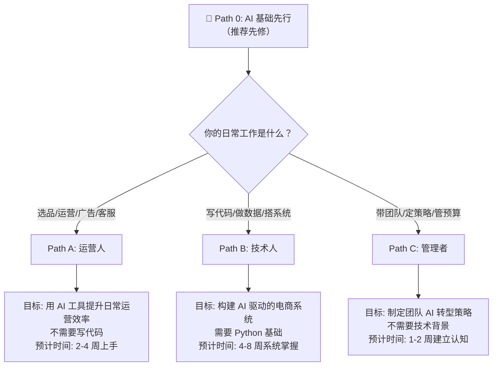
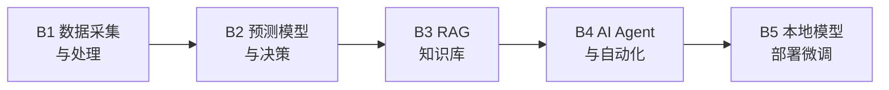

<div align="center">

### 🌐 Language / 语言切换

[](README.md) [](en/README.md) [](ja/README.md) [](es/README.md)

</div>

# ecommerce-ai-roadmap: AI Prompts & Strategies for Amazon Sellers, Shopify & TikTok Shop

> 跨境电商 AI 实战知识库 -- Amazon Listing 优化 / Rufus & COSMO 语义 SEO / GEO & Agentic Commerce / PPC 广告分析 / TikTok Shop 视频脚本 / Shopify GEO 优化 / 13 平台 AI 运营 / ChatGPT Prompts for E-Commerce
>
> The Definitive AI Playbook for Cross-Border E-Commerce -- Amazon Seller AI Tools, Listing Optimization, Advertising, TikTok Shop, Shopify, 13-Platform Strategy, GEO & Agentic Commerce

[](https://github.com/kangise/ecommerce-ai-roadmap)
[](https://github.com/kangise/ecommerce-ai-roadmap)
[](https://creativecommons.org/publicdomain/zero/1.0/)

58 个 AI 实战场景直达 · Amazon / Shopify / TikTok Shop + 13 平台覆盖 · Rufus/COSMO/GEO 优化方法论 · 可直接复制的 Prompt 模板
58 AI use cases · Amazon / Shopify / TikTok Shop + 13 platforms · Rufus/COSMO/GEO/Agentic Commerce · Ready-to-use ChatGPT prompts

🇨🇳 中文（当前） | 🇺🇸 [English](en/README.md) | 🇯🇵 [日本語](ja/README.md) | 🇪🇸 [Español](es/README.md)

---

### 🚀 30 秒体验 AI 选品 | Try AI Product Research in 30 Seconds

复制下面的 Prompt 到 [ChatGPT](https://chat.openai.com/) 或 [Claude](https://claude.ai/)，立即获得市场分析：

```
你是一个资深的跨境电商运营专家，精通 Amazon 平台。
我想在 Amazon US 销售一款便携式颈挂风扇（Neck Fan）。
请帮我做一个快速的市场可行性分析，包含：
1. 这个品类的市场特征（季节性、竞争程度、价格带）
2. TOP 3 竞品的核心卖点和差评中的主要痛点
3. 3个可能的差异化方向
4. 风险提示（合规、专利、季节性库存风险）
请用表格形式呈现关键数据对比。
```

👆 你会在 30 秒内得到一份市场分析。更多 Prompt → [Prompt 模板库](prompts/)

---

## 🆕 What's New

- 📅 2026-03-15: 🆕 新增 [A13 AI Growth Hack](paths/a-operators/a13-ai-growth-hack.md) — AI 全栈增长飞轮（选品→上架→流量→转化→规模化）
- 📅 2026-03-15: 📈 12 个文件内容深化（基于网络搜索真实数据+案例），Path A 扩展至 13 个模块（A7-A13）
- 📅 2026-03-14: 🆕 新增 [Path E: 社交媒体 AI 运营](paths/e-social-media/)（7 篇指南：Instagram/YouTube/小红书/Pinterest/WhatsApp/Reddit/跨渠道）
- 📅 2026-03-14: 🆕 Path D 扩展至 [13 个电商平台](paths/d-platforms/)（新增 Walmart/Temu/Shopee/Mercado Libre/Rakuten/eBay/AliExpress/Coupang/Faire/Otto/Zalando）
- 📅 2026-03-14: 🆕 新增 [平台全景对比页](paths/d-platforms/platform-comparison.md) — 14 个平台 + 7 个社交渠道的完整对比
- 📅 2026-03-14: 🆕 多语言支持：[English](en/README.md) · [日本語](ja/README.md) · [Español](es/README.md)
- 📅 2025-06-20: 新增 [Notebook 实验室](notebooks/) — 首个 Notebook: Amazon 报告数据处理 [](https://colab.research.google.com/github/kangise/ecommerce-ai-roadmap/blob/main/notebooks/b1-data-pipeline.ipynb)
- 📅 2025-06-20: 新增 2 个实战案例: [AI Listing 生成](docs/case-studies/ai-listing-generation.md)、[自动化 Review 分析](docs/case-studies/automated-review-analysis.md)

---

## 📋 目录 | Table of Contents

- [🆕 What's New](#-whats-new)
- [热门内容直通车（48 个场景直达）](#热门内容直通车)
- [选择你的路径 | Choose Your Path](#选择你的路径)
- [Path A: 运营人 — AI 提效实战](#path-a-运营人--ai-提效实战)
- [Path B: 技术人 — AI 系统构建](#path-b-技术人--ai-系统构建)
- [Path C: 管理者 — AI 战略落地](#path-c-管理者--ai-战略落地)
- [Prompt 模板库](#prompt-模板库)
- [Path E: 社交媒体 AI 运营](#path-e-社交媒体-ai-运营-)
- [Notebook 实验室](#notebook-实验室)
- [学习路径追踪](#学习路径追踪)
- [AAAI China Chapter 社群](#aaai-china-chapter-社群)
- [Contributors](#contributors)
- [贡献指南](#贡献指南)

---

## 热门内容直通车

> 按场景直达深度内容。热度基于 2026 年 3 月行业数据，定期更新。
> 上次更新: 2026-03-15 | 更新机制: 每月基于外网热度数据刷新排序

| # | 分类 | 场景 | 一句话说明 | 直达 |
|---|------|------|----------|------|
| | **🔍 选品与市场调研** | | | |
| 1 | 选品 | 竞品 Review 痛点提取 | 50 条差评 -> 痛点排名 + 改进方向 | [A1 Prompt](paths/a-operators/a1-product-research.md) · [Before/After](paths/0-foundations/ai-landscape.md#选品与市场调研----成熟度-35) |
| 2 | 选品 | 市场可行性 5 维度评分 | 需求/竞争/利润/供应链/合规，Go or No-Go | [A1 Prompt](paths/a-operators/a1-product-research.md) |
| 3 | 选品 | Google Trends 趋势验证 | 交叉验证选品方向，避免伪需求 | [A1 方法论](paths/a-operators/a1-product-research.md) |
| 4 | 选品 | 供应商评估与成本对比 | AI 分析 1688/Alibaba 供应商数据 | [A1 方法论](paths/a-operators/a1-product-research.md) |
| | **✍️ Listing 与内容优化** | | | |
| 5 | Listing | Rufus/COSMO 语义优化 | 从关键词匹配到意图匹配，2026 最重要的 Listing 变化 | [A2 方法论 1.1](paths/a-operators/a2-listing-optimization.md#11-amazon-搜索算法演进从-a9-到-cosmo--rufus) |
| 6 | Listing | Listing 全套一键生成 | 标题+五点+描述+Search Terms，45 分钟搞定 | [A2 Prompt](paths/a-operators/a2-listing-optimization.md) · [Before/After](paths/0-foundations/ai-landscape.md#listing-文案创作----成熟度-55) |
| 7 | Listing | 多语言本地化 | 不是翻译，是文化适配+本地关键词+度量转换 | [A2 Prompt](paths/a-operators/a2-listing-optimization.md) · [D1 ch25](paths/d-platforms/shopify-ai-guide.md#25-shopify-多语言本地化方法论-不只是翻译) |
| 8 | Listing | A+ Content 文案生成 | 品牌故事+产品对比+使用场景的图文布局 | [A2 方法论](paths/a-operators/a2-listing-optimization.md) |
| 9 | Listing | 竞品 Listing 策略拆解 | 对比分析找差异化定位和关键词盲区 | [A2 Prompt](paths/a-operators/a2-listing-optimization.md) |
| 10 | Listing | Q&A 预埋（Rufus 优化） | Rufus 读 Q&A 回答用户问题，预埋高频问题 | [A2 进阶](paths/a-operators/a2-listing-optimization.md) |
| | **📢 广告优化** | | | |
| 11 | 广告 | 搜索词报告 AI 分析 | 高 ROAS 词/浪费词/隐藏长尾机会，50 分钟搞定 | [A3 Prompt](paths/a-operators/a3-advertising.md) · [Before/After](paths/0-foundations/ai-landscape.md#广告管理与优化----成熟度-45) |
| 12 | 广告 | 广告文案 A/B 测试 | 5 种风格 Headline 变体批量生成 | [A3 Prompt](paths/a-operators/a3-advertising.md) |
| 13 | 广告 | 新品 30 天广告启动计划 | Auto -> Manual 关键词收割的完整流程 | [A3 工作流](paths/a-operators/a3-advertising.md) |
| 14 | 广告 | ACOS/TACOS 诊断 | 广告健康度评估和预算重新分配 | [A3 方法论](paths/a-operators/a3-advertising.md) |
| 15 | 广告 | Amazon Canvas AI | 2026.3 新功能，AI 实时数据可视化和场景模拟 | [AI 全景](paths/0-foundations/ai-landscape.md) |
| | **💬 客服与售后** | | | |
| 16 | 客服 | 差评批量分析 | 分类问题+频率统计+改善方案+优先级 | [A4 Prompt](paths/a-operators/a4-customer-service.md) · [Before/After](paths/0-foundations/ai-landscape.md#客服与售后----成熟度-45) |
| 17 | 客服 | 多语言客服回复 | AI 生成+人工确认，1-2 分钟/条 | [A4 Prompt](paths/a-operators/a4-customer-service.md) |
| 18 | 客服 | 账号申诉 Plan of Action | Root Cause + Actions + Prevention，35 分钟出初稿 | [A6 Prompt 3.6](paths/a-operators/a6-compliance.md#36-amazon-政策违规应对) · [A6 SOP 4.3](paths/a-operators/a6-compliance.md#43-合规事件应急响应-sop) |
| 19 | 客服 | A-to-Z Claim 应对 | 分析原因+生成回复+预防措施 | [A4 方法论](paths/a-operators/a4-customer-service.md) |
| | **🛡️ 合规与风控** | | | |
| 20 | 合规 | 多市场合规对比表 | CE/FCC/PSE/UKCA 一表对比，30 分钟出清单 | [A6 Prompt 3.1](paths/a-operators/a6-compliance.md#31-多市场合规对比深化版) · [Before/After](paths/0-foundations/ai-landscape.md#合规文档准备----成熟度-45) |
| 21 | 合规 | 合规成本估算 | 认证费+测试费+标签费+年度维护，纳入定价模型 | [A6 Prompt 3.3](paths/a-operators/a6-compliance.md#33-合规成本估算) |
| 22 | 合规 | 知识产权风险评估 | 专利/商标/版权排查，选品阶段就识别风险 | [A6 Prompt 3.4](paths/a-operators/a6-compliance.md#34-知识产权风险评估) |
| 23 | 合规 | BSA AI Agent 合规 | 2026.3 新规，确保你的 AI 工具符合 Amazon 要求 | [A6 进阶 6.1](paths/a-operators/a6-compliance.md#61-2026-新趋势amazon-ai-agent-合规要求bsa-更新) |
| | **🏪 Shopify 独立站** | | | |
| 24 | Shopify | GEO 优化 | 让产品被 ChatGPT/Perplexity 推荐，2026 最热趋势 | [D1 ch21.3](paths/d-platforms/shopify-ai-guide.md#213-geo-优化实操-让-ai-推荐你的产品) |
| 25 | Shopify | Agentic Storefronts | 在 ChatGPT/Gemini/Copilot 内直接卖货 | [D1 ch21.2](paths/d-platforms/shopify-ai-guide.md#212-agentic-storefronts-与-ucp-协议-在-ai-平台内直接卖货) |
| 26 | Shopify | Shopify Audiences | AI 广告受众生成，CAC 降低 20-50% | [D1 ch21.4](paths/d-platforms/shopify-ai-guide.md#214-shopify-audiences-ai-驱动的广告受众工具) |
| 27 | Shopify | Klaviyo 邮件个性化 | 发送时间优化+LTV 预测+流失预警 | [D1 ch23](paths/d-platforms/shopify-ai-guide.md#23-shopify-邮件营销深度方法论-从-klaviyo-到-ai-个性化) · [Before/After](paths/0-foundations/ai-landscape.md#邮件营销shopify---成熟度-45) |
| 28 | Shopify | Amazon 转 Shopify | 6 阶段迁移方法论，避免 5 个常见错误 | [D1 ch28](paths/d-platforms/shopify-ai-guide.md#28-从-amazon-迁移到-shopify-的完整方法论) |
| 29 | Shopify | 转化率漏斗诊断 | 加购率/结账率/支付率逐层分析 | [D1 ch24](paths/d-platforms/shopify-ai-guide.md#24-shopify-转化率优化-cro-深度指南) |
| 30 | Shopify | Schema/FAQ 代码 | Product Schema + FAQ Schema，GEO 优化基础 | [D1 ch27](paths/d-platforms/shopify-ai-guide.md#27-shopify-liquid-与技术-seo-实操) |
| | **🎵 TikTok Shop** | | | |
| 31 | TikTok | Hook 公式库 | 信息缺口理论的 Hook 设计方法论 | [D2 ch15.2](paths/d-platforms/tiktok-shop-ai-guide.md#152-hook-设计方法论-不是吸引注意力而是制造信息缺口) |
| 32 | TikTok | 3 幕结构视频脚本 | 建立需求->展示方案->推动行动，转化率 3-5x | [D2 ch15.3](paths/d-platforms/tiktok-shop-ai-guide.md#153-视频脚本的3-幕结构) |
| 33 | TikTok | 达人评分模型 | 100 分制量化评分，不凭感觉选达人 | [D2 ch16.2](paths/d-platforms/tiktok-shop-ai-guide.md#162-ai-达人筛选的量化评分模型) |
| 34 | TikTok | 达人个性化邀约 | 基于达人最近内容定制，回复率 3-5x | [D2 ch16.3](paths/d-platforms/tiktok-shop-ai-guide.md#163-达人邀约的-ai-自动化工作流) |
| 35 | TikTok | 直播分钟级脚本 | 留人->种草->转化->互动->返场的节奏设计 | [D2 ch17.3](paths/d-platforms/tiktok-shop-ai-guide.md#173-直播脚本的节奏设计) |
| 36 | TikTok | GMV Max 优化 | 2025.9 强制化后，素材/Feed/SPS 三个可控变量 | [D2 ch14.2](paths/d-platforms/tiktok-shop-ai-guide.md#142-gmv-max-强制化-2025-年-9-月起的重大变化) · [D2 ch6.3](paths/d-platforms/tiktok-shop-ai-guide.md#63-gmv-max-深度解析) |
| 37 | TikTok | TikTok 站内搜索 SEO | 40%+ Z 世代优先在 TikTok 搜索产品 | [D2 ch19](paths/d-platforms/tiktok-shop-ai-guide.md#19-tiktok-shop-站内搜索-seo) |
| 38 | TikTok | Spark Ads 选择标准 | 完播率>40% + 互动率>5% + 商品点击率>3% | [D2 ch23.1](paths/d-platforms/tiktok-shop-ai-guide.md#231-spark-ads-tiktok-最独特的广告形式) |
| | **🔗 跨平台协同** | | | |
| 39 | 跨平台 | 一文档三平台适配 | 一个核心文档 -> Amazon+Shopify+TikTok 内容 | [D3 ch3](paths/d-platforms/cross-platform-strategy.md#3-跨平台内容协同) |
| 40 | 跨平台 | Review 数据驱动 Hook | Amazon 差评痛点 -> TikTok 视频 Hook 灵感 | [D1 ch22.1](paths/d-platforms/shopify-ai-guide.md#221-amazon-review-数据驱动-shopify-优化的具体方法) · [D2 ch20](paths/d-platforms/tiktok-shop-ai-guide.md#20-tiktok-shop-x-amazon-双渠道协同) |
| 41 | 跨平台 | TikTok 种草归因 | 量化 TikTok 对 Amazon 品牌搜索量的间接贡献 | [D3 ch4.2](paths/d-platforms/cross-platform-strategy.md#42-跨平台归因-量化-tiktok-种草对-amazon-的影响) |
| 42 | 跨平台 | 三平台广告预算分配 | 边际 ROAS 均衡原则 + 间接效应修正 | [D3 ch5](paths/d-platforms/cross-platform-strategy.md#5-跨平台广告协同) |
| 43 | 跨平台 | 跨平台库存 MCF/FBT | FBA+FBT+第三方仓的动态分配策略 | [D3 ch6](paths/d-platforms/cross-platform-strategy.md#6-库存与物流协同) |
| | **📊 数据分析与 AI 趋势** | | | |
| 44 | 数据/AI | 周报自动生成 | 异常检测+趋势分析+优化建议，35 分钟/周 | [Before/After](paths/0-foundations/ai-landscape.md#数据分析与决策----成熟度-45) |
| 45 | 数据/AI | Amazon Canvas AI | 2026.3 新功能，Seller Central 内的 AI 数据分析 | [AI 全景](paths/0-foundations/ai-landscape.md) |
| 46 | 数据/AI | Seller Assistant Agentic | Amazon 官方 AI 助手升级，可代替卖家执行操作 | 即将更新 |
| 47 | 数据/AI | OpenClaw Agent 自动化 | AI Agent 自动执行日常运营任务 | [D1 ch10](paths/d-platforms/shopify-ai-guide.md) · [D2 ch12](paths/d-platforms/tiktok-shop-ai-guide.md) |
| 48 | 数据/AI | AI 工具 ROI 计算 | $20/月的 ChatGPT 到底值不值？量化框架 | [AI 全景](paths/0-foundations/ai-landscape.md#效率变化总览) |
| | **🎨 视觉/定价/SEO** | | | |
| 49 | 视觉 | AI 产品图片生成 | Midjourney/DALL-E 生成电商产品图 | [A7 方法论](paths/a-operators/a7-visual-content.md) |
| 50 | 定价 | AI 动态定价策略 | 竞品价格监控+智能调价 | [A8 方法论](paths/a-operators/a8-pricing-strategy.md) |
| 51 | SEO | GEO 优化（AI 搜索） | 让 ChatGPT/Perplexity/Gemini 推荐你的产品 | [A9 GEO](paths/a-operators/a9-seo-geo.md#4-geo-优化实操) |
| 52 | SEO | Agentic Commerce | Shopify UCP 协议，在 AI 渠道内直接卖货 | [A9 Agentic](paths/a-operators/a9-seo-geo.md#44-agentic-commerceai-代理购物) |
| | **🏗️ 品牌/财务/IP/增长** | | | |
| 53 | 品牌 | AI 品牌故事生成 | 使命+价值观+Tagline+跨平台一致性 | [A10 品牌](paths/a-operators/a10-brand-building.md) |
| 54 | 财务 | AI 利润计算器 | 含所有隐藏成本的真实利润计算 | [A11 财务](paths/a-operators/a11-financial-analysis.md) |
| 55 | 财务 | AI 现金流预测 | 未来 6 个月现金流+备货建议 | [A11 现金流](paths/a-operators/a11-financial-analysis.md#4-ai-现金流预测) |
| 56 | IP | AI 专利/商标风险排查 | 选品阶段就识别 IP 风险 | [A12 IP](paths/a-operators/a12-ip-protection.md) |
| 57 | 增长 | AI Growth Hack 飞轮 | 从选品到规模化的 5 阶段 AI 增长系统 | [A13 Growth](paths/a-operators/a13-ai-growth-hack.md) |
| 58 | 增长 | AI Agent 每日运营工作流 | 2 小时/天完成全部运营工作 | [A13 工作流](paths/a-operators/a13-ai-growth-hack.md#7-ai-agent-工作流实战) |
| 59 | 工具 | 🔌 Awesome MCP & Agent 工具集 | 30+ 电商 MCP Server + 7 大 Agent 框架 + 外部资源 | [工具集](docs/awesome-mcp-agents.md) |
| 60 | 工具 | 🧠 Awesome AI Skills & Rules | OpenClaw Skills + Kiro Steering + Cursor Rules + SKILL.md | [技能集](docs/awesome-ai-skills.md) |

[回到目录](#-目录--table-of-contents)

---

## 选择你的路径

> 🌟 **推荐先修**：无论你选择哪条路径，建议先完成 [Path 0: AI 基础先行](paths/0-foundations/)，建立 AI 认知基础（LLM 原理、Prompt 工程、RAG、Agent）。



| 路径 | 适合谁 | 需要写代码吗 | 时间投入 | 核心产出 |
|------|--------|-------------|----------|----------|
| **[Path 0: AI 基础先行](paths/0-foundations/)** 🌟 | 所有人（推荐先修） | 不需要 | 每天30分钟，1周 | AI 认知基础 |
| **[Path A: 运营人](paths/a-operators/)** | 选品/运营/广告/客服岗 | 不需要 | 每天30分钟，2-4周 | 一套可复用的 AI 工作流 |
| **[Path B: 技术人](paths/b-developers/)** | 开发/数据/BI 岗 | 需要 Python | 每天1小时，4-8周 | 一个可部署的 AI 工具 |
| **[Path C: 管理者](paths/c-managers/)** | 团队负责人/创始人 | 不需要 | 集中3-5小时 | 一份 AI 落地规划书 |
| **[Path D: 多平台](paths/d-platforms/)** | 多平台卖家 | 不需要 | 按需选择 | 多平台 AI 运营体系 |
| **[Path E: 社交媒体](paths/e-social-media/)** 🆕 | 品牌营销/内容运营 | 不需要 | 每天30分钟，2-3周 | 社交媒体 AI 引流体系 |

> 🗺️ **推荐**：完成 Path 0 后、进入具体路径前，先看 [AI 应用全景评估](paths/0-foundations/ai-landscape.md) — 30 分钟了解每个环节 AI 能做到什么程度、优先级如何排序。

> 不确定选哪条？三条路径可以交叉学习。运营人学完 Path A 想深入，可以进 Path B；管理者想了解细节，可以看 Path A 的具体模块。

[回到目录](#-目录--table-of-contents)

---

## Path A: 运营人 — AI 提效实战

> 目标：不写一行代码，用 AI 工具把日常运营效率提升 3-10 倍
>
> 前提：你已经有基本的电商运营经验（知道什么是 ASIN、PPC、FBA）
>
> 时间：每天 30 分钟，2-4 周完成全部模块

📖 [查看 Path A 完整内容 →](paths/a-operators/)

| 模块 | 主题 | 你将学会 |
|------|------|----------|
| [A1. 选品与市场洞察](paths/a-operators/a1-product-research.md) | 竞品分析、市场评估 | 用 AI 完成选品可行性分析报告 |
| [A2. Listing 与内容创作](paths/a-operators/a2-listing-optimization.md) | Listing 生成、多语言翻译 | 用 AI 生成完整的多语言 Listing |
| [A3. 广告优化](paths/a-operators/a3-advertising.md) | 搜索词分析、文案测试 | 用 AI 分析搜索词报告并优化 |
| [A4. 客服与售后](paths/a-operators/a4-customer-service.md) | 差评分析、申诉信撰写 | 建立多语言客服回复模板库 |
| [A5. 库存与供应链](paths/a-operators/a5-inventory.md) | 补货预测、安全库存 | 用 AI 建立补货决策模型 |
| [A6. 合规与风控](paths/a-operators/a6-compliance.md) | 多市场合规、认证查询 | 生成完整的多市场合规清单 |
| [A7. 视觉内容](paths/a-operators/a7-visual-content.md) 🆕 | AI 图片/视频生成 | AI 产品图、视频、品牌视觉一致性 |
| [A8. 定价策略](paths/a-operators/a8-pricing-strategy.md) 🆕 | 智能定价 | AI 竞品价格监控、动态定价 |
| [A9. SEO/GEO](paths/a-operators/a9-seo-geo.md) 🆕 | 搜索优化 | Amazon SEO + GEO（让 AI 推荐你的产品） |
| [A10. 品牌建设](paths/a-operators/a10-brand-building.md) 🆕 | 品牌策略 | AI 品牌故事、视觉系统、跨平台一致性 |
| [A11. 财务分析](paths/a-operators/a11-financial-analysis.md) 🆕 | 财务管理 | AI 利润计算、现金流预测 |
| [A12. 知识产权](paths/a-operators/a12-ip-protection.md) 🆕 | IP 保护 | AI 专利检索、商标监控、品牌保护 |
| [A13. AI Growth Hack](paths/a-operators/a13-ai-growth-hack.md) 🆕 | 全栈增长 | AI 增长飞轮、Agentic Commerce |

[回到目录](#-目录--table-of-contents)

---

## Path B: 技术人 — AI 系统构建

> 目标：构建 AI 驱动的电商工具和系统，从脚本到产品级应用
>
> 前提：有 Python 基础（或愿意边学边做，AI 会帮你写代码）
>
> 时间：每天 1 小时，4-8 周系统掌握

📖 [查看 Path B 完整内容 →](paths/b-developers/)



| 模块 | 主题 | 你将构建 |
|------|------|----------|
| [B1. 数据采集与处理](paths/b-developers/b1-data-pipeline.md) | pandas、SP-API、自动化 | 自动合并 Amazon 报告的脚本 |
| [B2. 预测模型与决策](paths/b-developers/b2-prediction-models.md) | Prophet、AutoGluon | SKU 90 天销量预测模型 |
| [B3. RAG 知识库](paths/b-developers/b3-rag-knowledge-base.md) | LlamaIndex、Chroma | 产品 FAQ AI 问答系统 |
| [B4. AI Agent 与自动化](paths/b-developers/b4-agent-workflow.md) | LangGraph、CrewAI | 自动化运营监控 Agent |
| [B5. 本地模型部署](paths/b-developers/b5-local-model-deploy.md) | Ollama、LoRA 微调 | 本地运行的电商 LLM（选修） |
| [B6. MCP 集成与 Agentic 工作流](paths/b-developers/b6-mcp-agentic-workflow.md) 🆕 | MCP、Amazon Ads、Shopify | 用 Claude 对话管理广告和产品 |
| [B7. Review 智能分析系统](paths/b-developers/b7-review-nlp-system.md) 🆕 | BERTopic、情感分析 | Review 主题建模+洞察生成 |
| [B8. 电商 Dashboard](paths/b-developers/b8-ecommerce-dashboard.md) 🆕 | Streamlit、Plotly | 多平台运营 Dashboard + AI 异常检测 |
| [B9. AI 图片/视频生成](paths/b-developers/b9-ai-image-pipeline.md) 🆕 | ComfyUI、DALL-E、Flux | 产品图批量生成 Pipeline |

> 完成 B1-B4 中至少 3 个模块，你已经具备构建 AI 电商工具的能力。B5-B7 为进阶选修。

[回到目录](#-目录--table-of-contents)

---

## Path C: 管理者 — AI 战略落地

> 目标：理解 AI 能为团队做什么，制定可执行的 AI 落地计划
>
> 前提：不需要技术背景，但需要对业务有深入理解
>
> 时间：集中 3-5 小时完成评估和规划

📖 [查看 Path C 完整内容 →](paths/c-managers/)

| 模块 | 主题 | 你将产出 |
|------|------|----------|
| [C1. AI 能力评估与规划](paths/c-managers/c1-ai-assessment.md) | 落地优先级矩阵、规划 Prompt | 团队 AI 能力评估和优先级排序 |
| [C2. 团队 AI 技能建设](paths/c-managers/c2-team-building.md) | 培训计划、习惯养成 | 团队 80%+ 每天使用 AI 工具 |
| [C3. AI 项目 ROI 评估](paths/c-managers/c3-roi-evaluation.md) | ROI 计算框架、效果衡量 | 至少一个 AI 项目的 ROI 评估报告 |
| [C4. AI 风险管理与治理](paths/c-managers/c4-ai-risk-governance.md) 🆕 | AI 幻觉、隐私、合规 | AI 治理政策和风险评估报告 |
| [C5. AI 竞争情报](paths/c-managers/c5-competitive-intelligence.md) 🆕 | 竞品监控、AI 可见度 | 竞争格局分析和战略决策 |

> 完成 C1-C3 输出 AI 落地规划书，C4-C5 为进阶模块（风险管理和竞争战略）。

[回到目录](#-目录--table-of-contents)

---

## Path D: 多平台 — 超越 Amazon

> 把 AI 能力从 Amazon 扩展到全球 13 个电商平台。
>
> 前置：建议先完成 Path A 的核心模块

📖 [查看 Path D 完整内容 →](paths/d-platforms/)

| 模块 | 平台 | 核心内容 |
|------|------|----------|
| [D1. Shopify AI 指南](paths/d-platforms/shopify-ai-guide.md) | Shopify | 选品→产品页→广告→邮件→客服→数据分析全链路 |
| [D2. TikTok Shop AI 指南](paths/d-platforms/tiktok-shop-ai-guide.md) | TikTok Shop | 短视频生成、达人匹配、直播脚本 |
| [D3. 跨平台 AI 策略](paths/d-platforms/cross-platform-strategy.md) | 多平台 | Amazon + 独立站 + 社交电商协同 |
| [D4. Walmart Marketplace](paths/d-platforms/d4-walmart-ai-guide.md) 🆕 | Walmart | Amazon 卖家第二平台，Walmart Connect 广告 |
| [D5. Temu 卖家策略](paths/d-platforms/d5-temu-seller-guide.md) 🆕 | Temu | 竞争分析 + 入驻决策框架 |
| [D6. 东南亚电商](paths/d-platforms/d6-southeast-asia-ai-guide.md) 🆕 | Shopee + Lazada | 多语言本地化 + 直播带货 |
| [D7. 拉美电商](paths/d-platforms/d7-mercado-libre-ai-guide.md) 🆕 | Mercado Libre | 西语/葡语本地化 + 拉美市场 |
| [D8. 日本电商](paths/d-platforms/d8-rakuten-japan-ai-guide.md) 🆕 | Rakuten | 店铺自定义 + 积分生态 + 邮件营销 |
| [D9. eBay](paths/d-platforms/d9-ebay-ai-guide.md) 🆕 | eBay | 二手/翻新品 + 拍卖策略 |
| [D10. AliExpress](paths/d-platforms/d10-aliexpress-ai-guide.md) 🆕 | AliExpress | 全托管模式 + 南欧市场 |
| [D11. 韩国电商](paths/d-platforms/d11-coupang-korea-ai-guide.md) 🆕 | Coupang | 韩国市场入门 + 韩语 Listing |
| [D12. Faire 批发](paths/d-platforms/d12-faire-wholesale-ai-guide.md) 🆕 | Faire | B2B 批发 + 品牌故事 |
| [D13. 欧洲平台](paths/d-platforms/d13-europe-marketplaces-guide.md) 🆕 | Otto + Zalando | 德国市场 + 欧洲合规 |

[回到目录](#-目录--table-of-contents)

---

## Path E: 社交媒体 AI 运营 🆕

> 用 AI 系统化运营社交媒体渠道，把"发帖"变成可复制的引流体系。
>
> 前置：建议先完成 Path A 的核心模块

📖 [查看 Path E 完整内容 →](paths/e-social-media/)

| 模块 | 渠道 | 核心内容 |
|------|------|----------|
| [E1. Instagram + Facebook](paths/e-social-media/e1-instagram-facebook-ai-guide.md) | Meta 生态 | Reels 创作 + Advantage+ 广告 + Shopping |
| [E2. YouTube](paths/e-social-media/e2-youtube-ai-guide.md) | YouTube | 长视频评测 + Shorts + Shopping + Affiliate |
| [E3. 小红书](paths/e-social-media/e3-xiaohongshu-ai-guide.md) | 小红书 | 种草笔记 + KOL/KOC + 中国市场入口 |
| [E4. Pinterest](paths/e-social-media/e4-pinterest-ai-guide.md) | Pinterest | 视觉搜索引擎 + Shopping Ads |
| [E5. WhatsApp Business](paths/e-social-media/e5-whatsapp-business-ai-guide.md) | WhatsApp | AI Chatbot + 对话式商务 |
| [E6. Reddit](paths/e-social-media/e6-reddit-ai-guide.md) | Reddit | 口碑营销 + 产品发现 |
| [E7. 跨渠道协同](paths/e-social-media/e7-social-media-cross-channel.md) | 多渠道 | 一个内容多平台适配 + 归因 + 预算分配 |

[回到目录](#-目录--table-of-contents)

---

## Prompt 模板库

所有 Prompt 模板集中在 [`prompts/`](prompts/) 目录，按场景分类，可直接复制使用。

📖 [查看完整 Prompt 模板库 →](prompts/README.md)

| 模板集 | 模板数 | 场景 |
|--------|--------|------|
| [选品与市场分析](prompts/product-research.md) | 3 | 竞品 Review 分析、市场评估、关键词聚类 |
| [Listing 生成与优化](prompts/listing-optimization.md) | 3 | Listing 全套生成、多语言本地化、竞品策略拆解 |
| [广告分析与优化](prompts/advertising.md) | 2 | 搜索词报告分析、广告文案 A/B 测试 |
| [客服与售后](prompts/customer-service.md) | 2 | 差评批量分析、账号申诉信 |
| [合规与风控](prompts/compliance.md) | 1 | 多市场合规对比 |
| [社交媒体运营](prompts/social-media.md) 🆕 | 5 | Instagram Reels 脚本、Meta Ads 文案、YouTube 评测脚本、小红书种草笔记、跨平台内容适配 |
| [多平台运营](prompts/multi-platform.md) 🆕 | 5 | Amazon→Walmart 转换、Walmart 广告分析、Temu 入驻评估、东南亚本地化、多平台品类分析 |

> 欢迎贡献你验证过的 Prompt 模板！详见 [贡献指南](#贡献指南)。

[回到目录](#-目录--table-of-contents)

---

## Notebook 实验室

可在 Google Colab 直接运行的 Jupyter Notebook，零配置上手。当前已有 18 个 Notebook，覆盖 Path A/B/C/D/E。

📖 [查看完整 Notebook 索引 →](notebooks/README.md)

| 路径 | Notebook 数量 | 覆盖模块 |
|------|-------------|----------|
| Path A 运营 | 11 | A1 选品、A2 Listing、A3 广告、A4 差评、A5 库存、A6 合规、A8 定价、A9 GEO、A10 品牌、A11 利润、A12 IP |
| Path B 技术 | 4 | B1 数据管道、B2 销量预测、B7 Review 分析、B8 Dashboard |
| Path C 管理 | 1 | C3 ROI 评估 |
| Path D 平台 | 1 | D3 跨平台内容 |
| Path E 社交 | 1 | E1 社交内容日历 |

[回到目录](#-目录--table-of-contents)

---

## 学习路径追踪

复制以下 checklist 到你的笔记工具中，追踪学习进度。

### Path A 进度追踪（运营人）

```
[ ] A1. 选品：用 AI 完成一个完整的选品可行性分析报告
[ ] A2. Listing：用 AI 生成一套完整的多语言 Listing
[ ] A3. 广告：用 AI 分析一份真实的搜索词报告并执行优化
[ ] A4. 客服：建立一套多语言客服回复模板库
[ ] A5. 库存：用 AI 建立一个产品的补货决策模型
[ ] A6. 合规：为一个产品生成完整的多市场合规清单
[ ] A7. 视觉：用 AI 生成一套产品图片和视频素材
[ ] A8. 定价：建立 AI 竞品价格监控和动态定价模型
[ ] A9. SEO/GEO：在 ChatGPT/Perplexity 测试产品是否被推荐
[ ] A10. 品牌：用 AI 生成完整品牌故事和视觉系统
[ ] A11. 财务：用 AI 计算至少 5 个 SKU 的真实利润
[ ] A12. IP：完成至少 1 个产品的专利/商标风险排查
[ ] A13. Growth Hack：建立 AI 驱动的每日运营工作流并扩展到 2+ 平台
```

### Path B 进度追踪（技术人）

```
[ ] B1. 数据：写一个脚本自动合并多个 Amazon 报告
[ ] B2. 预测：用 Prophet 对一个真实 SKU 做 90 天销量预测
[ ] B3. RAG：搭建一个可以回答产品问题的 RAG 系统
[ ] B4. Agent：部署一个自动化运营监控 Agent
[ ] B5. 部署：用 Ollama 在本地运行 LLM（选修）
```

### Path C 进度追踪（管理者）

```
[ ] C1. 评估：完成团队 AI 能力评估和优先级排序
[ ] C2. 建设：团队 80%+ 的人每天使用 AI 工具
[ ] C3. ROI：完成至少一个 AI 项目的 ROI 评估报告
```

[回到目录](#-目录--table-of-contents)

---

## AAAI China Chapter 社群

ecommerce-ai-roadmap 是 **AAAI China Chapter (AAAI 中国分会)** 的开源项目之一。我们致力于推动 AI 技术在跨境电商领域的实际应用。

### 加入社群你能获得什么

- **月度 AI Workshop** -- 每月一次线上实战工作坊，跟着做一个完整的 AI 电商项目
- **Prompt 模板共创** -- 社群成员共同维护和优化 Prompt 模板库
- **案例分享** -- 一线操盘手分享 AI 在实际业务中的应用案例和踩坑经验
- **技术答疑** -- 遇到问题可以在社群中获得帮助
- **行业资讯** -- AI 工具更新、平台政策变化的第一手信息

### 如何参与

- Star 本仓库，关注更新
- [提交 Issue](https://github.com/kangise/ecommerce-ai-roadmap/issues) 反馈问题或建议
- [提交 PR](https://github.com/kangise/ecommerce-ai-roadmap/pulls) 贡献 Prompt 模板、Notebook 或案例
- 关注 AAAI China Chapter 获取活动信息

[回到目录](#-目录--table-of-contents)

---

## Contributors

感谢所有为 ecommerce-ai-roadmap 做出贡献的人！ | Thanks to all contributors!

<!-- ALL-CONTRIBUTORS-LIST:START -->
<a href="https://github.com/kangise"></a>
<!-- ALL-CONTRIBUTORS-LIST:END -->

> 🎯 想加入贡献者墙？[提交一个 Prompt 模板](https://github.com/kangise/ecommerce-ai-roadmap/issues/new?template=prompt_submission.md) 就够了！不需要会 PR。

[回到目录](#-目录--table-of-contents)

---

## 贡献指南

我们特别欢迎以下类型的贡献：

1. **Prompt 模板** -- 你在实际工作中验证过的、效果好的 Prompt
2. **Notebook** -- 可在 Colab 运行的实战教程
3. **案例分享** -- 你用 AI 解决了什么电商问题？效果如何？
4. **工具评测** -- 你试过的 AI 工具，优缺点是什么？
5. **Bug 修复** -- 发现链接失效、内容过时？帮忙修正

贡献时请注意：
- 优先推荐免费或开源的工具和资源
- Prompt 模板需要标注你验证过的 AI 工具和效果
- Notebook 需要能在 Google Colab 免费版运行

详见 [CONTRIBUTING.md](CONTRIBUTING.md)。

---

## 许可证

[CC0 1.0](https://creativecommons.org/publicdomain/zero/1.0/) -- 自由使用，无需署名。

📋 [免责声明](DISCLAIMER.md) -- 第三方商标、数据引用、AI 生成内容声明

---

*An AAAI China Chapter Initiative | Maintained by AAAEC, the Association of AI Applications for E-Commerce*
