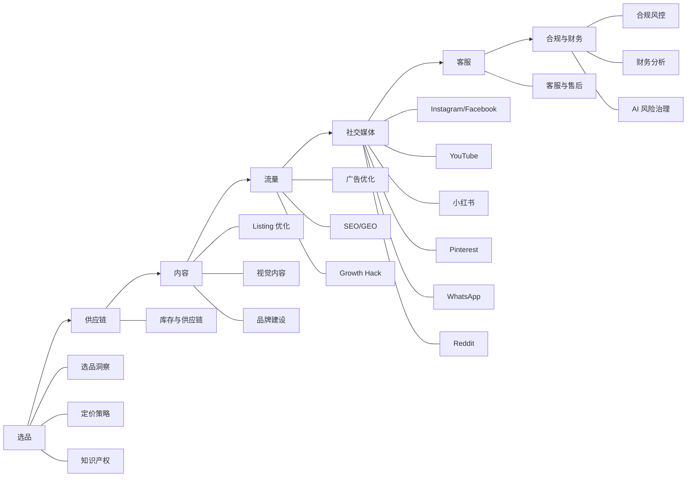
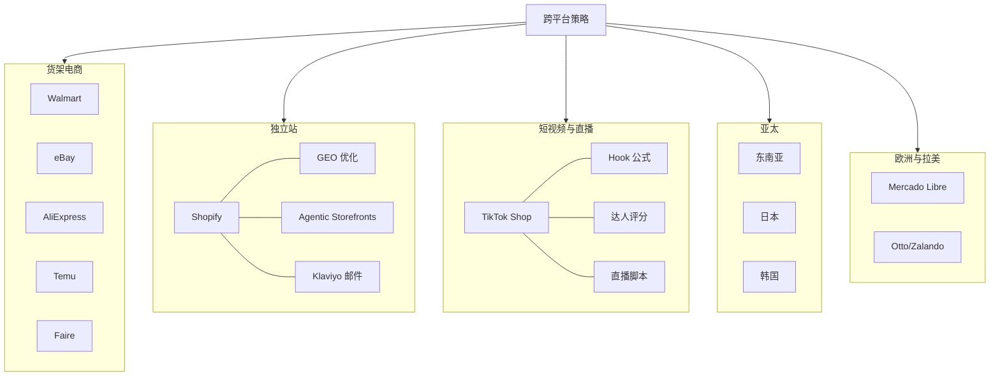
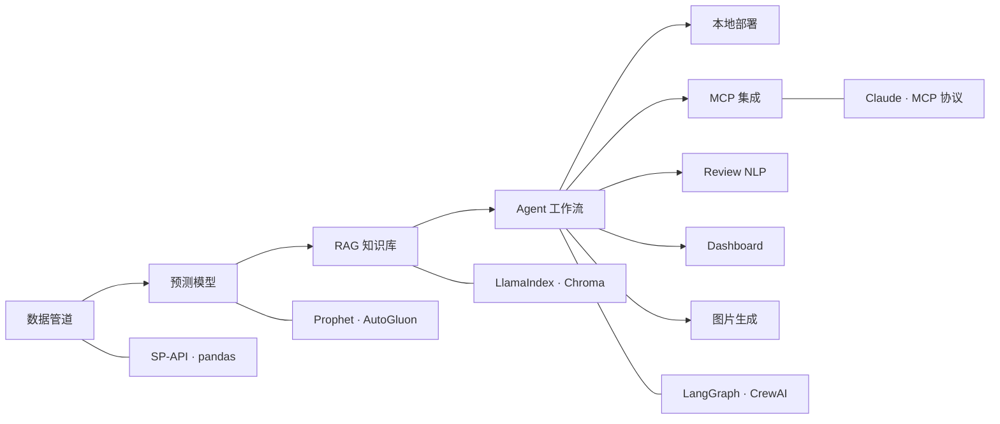
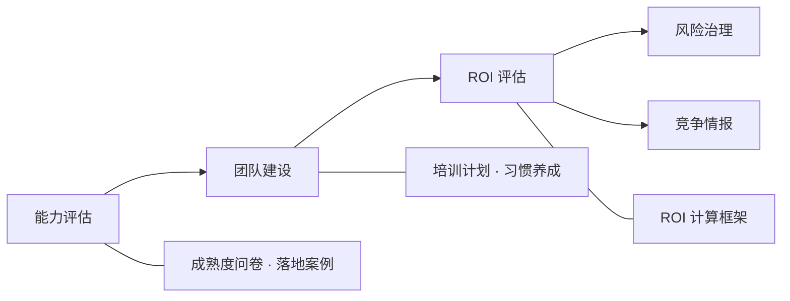

<div align="center">

### Language / 语言切换

[](README.md) [](en/README.md) [](ja/README.md) [](es/README.md)

</div>

# ecommerce-ai-roadmap

> 跨境电商 AI 实战知识库 — AAAI China Chapter 开源项目

[](https://github.com/kangise/ecommerce-ai-roadmap)
[](https://github.com/kangise/ecommerce-ai-roadmap)
[](https://creativecommons.org/publicdomain/zero/1.0/)

🇨🇳 中文（当前） | 🇺🇸 [English](en/README.md) | 🇯🇵 [日本語](ja/README.md)（概要のみ） | 🇪🇸 [Español](es/README.md)（resumen）

---


跨境电商 AI 实操手册 — 56 篇指南，从选品到增长，每个环节都有可直接复制的 Prompt。

<!-- 这里后续放一张内容体系全景图 -->

---

## 先试一下

把这段复制到 [ChatGPT](https://chat.openai.com/) 或 [Claude](https://claude.ai/)，30 秒出结果：

```
你是一个资深的跨境电商运营专家，精通 Amazon 平台。
我想在 Amazon US 销售一款便携式颈挂风扇（Neck Fan）。
请帮我做一个快速的市场可行性分析，包含：
1. 这个品类的市场特征（季节性、竞争程度、价格带）
2. TOP 3 竞品的核心卖点和差评中的主要痛点
3. 3个可能的差异化方向
4. 风险提示（合规、专利、季节性库存风险）
请用表格形式呈现关键数据对比。
```


这个知识库里有 56 篇指南，每篇都有类似的 Prompt。想先了解 AI 能做什么？从 [AI 基础](paths/0-foundations/)开始。如果你时间有限，直接看 [AI 全景评估](paths/0-foundations/ai-landscape.md)，30 分钟了解每个环节 AI 的成熟度。

---

## 内容索引

| Domain | Topics |
|--------|--------|
| AI 基础 | [AI 演进](paths/0-foundations/f1-ai-evolution.md) · [Prompt 工程](paths/0-foundations/f2-prompt-engineering.md) · [RAG](paths/0-foundations/f3-rag-knowledge.md) · [Agent](paths/0-foundations/f4-agent-automation.md) · [RPA](paths/0-foundations/f5-rpa-automation.md) · [工具对比](paths/0-foundations/f6-ai-tools-comparison.md) · [AI 全景评估](paths/0-foundations/ai-landscape.md) |
| 选品与市场 | [选品洞察](paths/a-operators/a1-product-research.md) · [定价策略](paths/a-operators/a8-pricing-strategy.md) · [知识产权](paths/a-operators/a12-ip-protection.md) |
| 供应链 | [库存与供应链](paths/a-operators/a5-inventory.md) |
| 内容与转化 | [Listing 优化](paths/a-operators/a2-listing-optimization.md) · [视觉内容](paths/a-operators/a7-visual-content.md) · [品牌建设](paths/a-operators/a10-brand-building.md) |
| 流量与获客 | [广告优化](paths/a-operators/a3-advertising.md) · [SEO/GEO](paths/a-operators/a9-seo-geo.md) · [Growth Hack](paths/a-operators/a13-ai-growth-hack.md) |
| 社交媒体 | [Instagram/Facebook](paths/e-social-media/e1-instagram-facebook-ai-guide.md) · [YouTube](paths/e-social-media/e2-youtube-ai-guide.md) · [小红书](paths/e-social-media/e3-xiaohongshu-ai-guide.md) · [Pinterest](paths/e-social-media/e4-pinterest-ai-guide.md) · [WhatsApp](paths/e-social-media/e5-whatsapp-business-ai-guide.md) · [Reddit](paths/e-social-media/e6-reddit-ai-guide.md) · [跨渠道](paths/e-social-media/e7-social-media-cross-channel.md) |
| 客户运营 | [客服与售后](paths/a-operators/a4-customer-service.md) |
| 合规与财务 | [合规风控](paths/a-operators/a6-compliance.md) · [财务分析](paths/a-operators/a11-financial-analysis.md) · [AI 风险治理](paths/c-managers/c4-ai-risk-governance.md) |
| 多平台 — 货架 | [Walmart](paths/d-platforms/d4-walmart-ai-guide.md) · [eBay](paths/d-platforms/d9-ebay-ai-guide.md) · [AliExpress](paths/d-platforms/d10-aliexpress-ai-guide.md) · [Temu](paths/d-platforms/d5-temu-seller-guide.md) · [Faire](paths/d-platforms/d12-faire-wholesale-ai-guide.md) |
| 多平台(独立站) | [Shopify](paths/d-platforms/shopify-ai-guide.md) |
| 多平台(短视频) | [TikTok Shop](paths/d-platforms/tiktok-shop-ai-guide.md) |
| 多平台(亚太) | [东南亚](paths/d-platforms/d6-southeast-asia-ai-guide.md) · [日本](paths/d-platforms/d8-rakuten-japan-ai-guide.md) · [韩国](paths/d-platforms/d11-coupang-korea-ai-guide.md) |
| 多平台(欧拉美) | [Mercado Libre](paths/d-platforms/d7-mercado-libre-ai-guide.md) · [Otto/Zalando](paths/d-platforms/d13-europe-marketplaces-guide.md) |
| 跨平台策略 | [跨平台协同](paths/d-platforms/cross-platform-strategy.md) · [平台对比](paths/d-platforms/platform-comparison.md) |
| AI 系统构建 | [数据管道](paths/b-developers/b1-data-pipeline.md) · [预测模型](paths/b-developers/b2-prediction-models.md) · [RAG 知识库](paths/b-developers/b3-rag-knowledge-base.md) · [Agent](paths/b-developers/b4-agent-workflow.md) · [本地部署](paths/b-developers/b5-local-model-deploy.md) · [MCP](paths/b-developers/b6-mcp-agentic-workflow.md) · [Review NLP](paths/b-developers/b7-review-nlp-system.md) · [Dashboard](paths/b-developers/b8-ecommerce-dashboard.md) · [图片生成](paths/b-developers/b9-ai-image-pipeline.md) |
| 团队与管理 | [能力评估](paths/c-managers/c1-ai-assessment.md) · [团队建设](paths/c-managers/c2-team-building.md) · [ROI](paths/c-managers/c3-roi-evaluation.md) · [竞争情报](paths/c-managers/c5-competitive-intelligence.md) |

---

## AI 基础

不管你是什么角色，建议先了解 AI 的基本概念。[AI 基础](paths/0-foundations/)里有 [AI 技术演进](paths/0-foundations/f1-ai-evolution.md)的全景、[Prompt 工程](paths/0-foundations/f2-prompt-engineering.md)的方法论、[RAG](paths/0-foundations/f3-rag-knowledge.md) 和 [Agent](paths/0-foundations/f4-agent-automation.md) 的原理、[RPA 自动化](paths/0-foundations/f5-rpa-automation.md)和 [AI 工具对比](paths/0-foundations/f6-ai-tools-comparison.md)。[AI 全景评估](paths/0-foundations/ai-landscape.md)帮你判断每个业务环节 AI 的成熟度和优先级。

---

## 运营路径

以 Amazon 为主线，覆盖跨境电商运营的完整业务链路。不需要写代码，每个环节都有可直接复制的 Prompt。



### 选品

---

选品的本质是在需求和供给之间找不对称 — 需求大但供给不足的品类就是机会。AI 把信息收集和模式识别的效率提升了 10 倍。


[选品与市场洞察](paths/a-operators/a1-product-research.md)用 AI 从 50 条竞品差评中[提取核心痛点](paths/a-operators/a1-product-research.md#31-竞品-review-痛点分析)，用 [5 个维度快速评估市场可行性](paths/a-operators/a1-product-research.md#32-市场可行性快速评估)（需求、竞争、利润、供应链、合规），再通过[关键词聚类](paths/a-operators/a1-product-research.md#33-关键词需求聚类)发现蓝海需求。流程完整 [SOP](paths/a-operators/a1-product-research.md#4-选品实战工作流)，也列出[常见的选品陷阱](paths/a-operators/a1-product-research.md#5-常见选品陷阱)。

在亚马逊管理好价格至关重要。[定价策略](paths/a-operators/a8-pricing-strategy.md)里讲了 [Buy Box 的定价逻辑](paths/a-operators/a8-pricing-strategy.md#21-amazon-buy-box-定价策略)、如何做[价格弹性分析](paths/a-operators/a8-pricing-strategy.md#22-价格弹性分析)找到最优价格点，以及怎么用 AI 做[竞品价格带分析](paths/a-operators/a8-pricing-strategy.md#23-竞品价格带分析)。

[知识产权](paths/a-operators/a12-ip-protection.md) 做[专利排查](paths/a-operators/a12-ip-protection.md#21-选品阶段的专利排查)，用 [AI 辅助分析专利风险](paths/a-operators/a12-ip-protection.md#22-ai-辅助专利分析)，了解 [TRO（临时限制令）](paths/a-operators/a12-ip-protection.md#23-tro临时限制令风险防范)的防范方法，避免产品上架后被投诉下架。

### 供应链
---

[库存与供应链](paths/a-operators/a5-inventory.md)从 [FBA 库存的关键指标](paths/a-operators/a5-inventory.md#12-amazon-fba-库存关键指标)讲起，教你用 AI 做补货预测、计算安全库存、评估供应商。

### 内容
---

转化的本质是在 3 秒内回答用户的问题："这个产品能解决我的问题吗？" Listing 的每一个字、每一张图都在回答这个问题。

[Listing 优化](paths/a-operators/a2-listing-optimization.md)是最高频的场景。Amazon 的搜索算法已经从 A9 演进到了 [COSMO + Rufus](paths/a-operators/a2-listing-optimization.md#11-amazon-搜索算法演进从-a9-到-cosmo--rufus)，这意味着 Listing 不能再堆关键词，而要覆盖用户意图。这篇指南教你用一个 Prompt [生成完整的标题+五点+描述+Search Terms](paths/a-operators/a2-listing-optimization.md#31-listing-全套生成标题--五点--描述--search-terms)，做[多语言本地化](paths/a-operators/a2-listing-optimization.md#32-多语言本地化不是直译)（不是翻译，是文化适配+本地关键词+度量转换），以及通过 [Q&A 预埋](paths/a-operators/a2-listing-optimization.md)让 Rufus 在回答用户问题时推荐你的产品。

Listing 文字做好了，还需要视觉。[视觉内容](paths/a-operators/a7-visual-content.md)教你用 Midjourney 和 DALL-E [生成产品主图](paths/a-operators/a7-visual-content.md#2-ai-产品图片生成)、[信息图和卖点图](paths/a-operators/a7-visual-content.md#23-信息图卖点图-ai-生成)，以及 [AI 产品视频](paths/a-operators/a7-visual-content.md#3-ai-产品视频生成)。

如果你想做品牌而不只是卖货，[品牌建设](paths/a-operators/a10-brand-building.md)讲了如何用 AI 构建[品牌故事](paths/a-operators/a10-brand-building.md#21-品牌故事框架)、保持[跨平台视觉一致性](paths/a-operators/a10-brand-building.md#3-ai-品牌视觉一致性)，以及 [2026 年 DTC 品牌的趋势](paths/a-operators/a10-brand-building.md#13-2026-年-dtc-品牌趋势)。

### 流量
---

流量的本质是注意力的分配。付费流量买的是确定性，自然流量赚的是复利。2026 年最大的变量是 AI 搜索 — 用户不再搜关键词，而是问 AI "推荐一个适合露营的灯"。

付费流量看[广告优化](paths/a-operators/a3-advertising.md)。核心是用 AI [分析搜索词报告](paths/a-operators/a3-advertising.md#31-搜索词报告分析)，把关键词分成四象限（明星词、潜力词、观察词、浪费词），然后用[否定关键词策略](paths/a-operators/a3-advertising.md#33-否定关键词策略)砍掉浪费性支出，用 [A/B 测试](paths/a-operators/a3-advertising.md#32-广告文案-ab-测试)优化广告文案。新品卖家可以直接用[30 天广告启动计划](paths/a-operators/a3-advertising.md)。

自然流量看 [SEO/GEO](paths/a-operators/a9-seo-geo.md)。除了传统的 [Amazon SEO](paths/a-operators/a9-seo-geo.md#21-2026-amazon-seo-核心清单) 和 [Google SEO for Shopify](paths/a-operators/a9-seo-geo.md#3-google-seo-for-shopify)，2026 年最重要的变化是 [GEO（生成式引擎优化）](paths/a-operators/a9-seo-geo.md#4-geo-优化实操)— 让你的产品被 ChatGPT、Perplexity 和 Gemini 推荐给用户。

想要系统化的增长方法论？[AI Growth Hack](paths/a-operators/a13-ai-growth-hack.md) 把从选品验证到规模化拆成了 5 个阶段，每个阶段都有对应的 AI 工作流。

### 社交媒体
---

社交媒体的本质不是"发帖"，而是在用户的决策链路上埋下触点。一个用户从"刷到"到"下单"可能跨越 3 个平台，你需要在每个节点都有存在感。

[Instagram 和 Facebook](paths/e-social-media/e1-instagram-facebook-ai-guide.md) 共享 Meta 生态，但[内容策略完全不同](paths/e-social-media/e1-instagram-facebook-ai-guide.md#2-instagram-vs-tiktok-vs-youtube内容策略差异)。这篇指南教你批量生成 Reels 脚本、用 Advantage+ 智能投放、优化 Shopping 标签。[YouTube](paths/e-social-media/e2-youtube-ai-guide.md) 的价值在于长尾流量，理解 [YouTube 搜索算法的双引擎](paths/e-social-media/e2-youtube-ai-guide.md#21-youtube-搜索算法的双引擎)后，你可以用 AI 做关键词研究、写评测脚本、做 Shorts。[小红书](paths/e-social-media/e3-xiaohongshu-ai-guide.md)的核心是 [CES 评分机制](paths/e-social-media/e3-xiaohongshu-ai-guide.md#11-ces-评分机制)和独特的[流量分发逻辑](paths/e-social-media/e3-xiaohongshu-ai-guide.md#12-流量分发逻辑)。[Pinterest](paths/e-social-media/e4-pinterest-ai-guide.md) 本质上是一个视觉搜索引擎。[WhatsApp](paths/e-social-media/e5-whatsapp-business-ai-guide.md) 在拉美和东南亚是主要的客户触达渠道。[Reddit](paths/e-social-media/e6-reddit-ai-guide.md) 正在成为产品发现的重要渠道，2026 年还上线了 [AI 购物搜索](paths/e-social-media/e6-reddit-ai-guide.md#12-reddit-ai-购物搜索2026-新功能)。[跨渠道策略](paths/e-social-media/e7-social-media-cross-channel.md)教你一个内容多平台适配。

### 客服
---

客服的本质是把问题变成信任。一个处理得当的差评比一个五星好评更能建立品牌信誉。[客服与售后](paths/a-operators/a4-customer-service.md)帮你处理日常。用 AI 批量分析差评、生成多语言客服回复、写[账号申诉 Plan of Action](paths/a-operators/a6-compliance.md#36-amazon-政策违规应对)、应对 A-to-Z Claim。

### 合规与财务
---
合规和财务是生意的底线。很多卖家在增长阶段忽略合规，等到被罚款或下架时才发现代价远超预防成本。利润不是你以为赚了多少，而是扣掉所有隐藏成本后还剩多少。


[合规与风控](paths/a-operators/a6-compliance.md)从[主要市场的合规框架对比](paths/a-operators/a6-compliance.md#12-主要市场的合规框架对比)讲起，教你做 [CE/FCC/PSE/UKCA 多市场合规对比](paths/a-operators/a6-compliance.md#31-多市场合规对比深化版)、[估算合规成本](paths/a-operators/a6-compliance.md#33-合规成本估算)，以及应对 [BSA AI Agent 合规新规](paths/a-operators/a6-compliance.md#61-2026-新趋势amazon-ai-agent-合规要求bsa-更新)。[财务分析](paths/a-operators/a11-financial-analysis.md)帮你用 [Amazon 真实利润计算公式](paths/a-operators/a11-financial-analysis.md#21-amazon-真实利润计算公式)算出含所有隐藏成本的真实利润。[AI 风险治理](paths/c-managers/c4-ai-risk-governance.md)帮你建立 AI 使用的治理政策。

---

## 多平台

多平台的本质不是"多开几个店"，而是用不同渠道触达不同阶段的用户。Amazon 是搜索意图最强的渠道，TikTok 是发现意图最强的渠道，Shopify 是品牌溢价最高的渠道 — 它们不是竞争关系，而是协同关系。



### 货架电商
---
[Walmart](paths/d-platforms/d4-walmart-ai-guide.md) 是 Amazon 卖家最自然的第二平台。[eBay](paths/d-platforms/d9-ebay-ai-guide.md) 适合二手和翻新品。[AliExpress](paths/d-platforms/d10-aliexpress-ai-guide.md) 的全托管模式正在改变南欧市场。[Temu](paths/d-platforms/d5-temu-seller-guide.md) 的指南重点是竞争分析和入驻决策。[Faire](paths/d-platforms/d12-faire-wholesale-ai-guide.md) 是 B2B 批发的新渠道。

### 独立站
---
[Shopify AI 指南](paths/d-platforms/shopify-ai-guide.md)是一篇 2200 行的完整手册，从选品到 [GEO 优化](paths/d-platforms/shopify-ai-guide.md#213-geo-优化实操-让-ai-推荐你的产品)到 [Agentic Storefronts](paths/d-platforms/shopify-ai-guide.md#212-agentic-storefronts-与-ucp-协议-在-ai-平台内直接卖货)到 [Klaviyo 邮件个性化](paths/d-platforms/shopify-ai-guide.md#23-shopify-邮件营销深度方法论-从-klaviyo-到-ai-个性化)到 [Amazon 转 Shopify 迁移](paths/d-platforms/shopify-ai-guide.md#28-从-amazon-迁移到-shopify-的完整方法论)。

### 短视频与直播
---
[TikTok Shop](paths/d-platforms/tiktok-shop-ai-guide.md) 的 1600 行指南覆盖了 [Hook 公式](paths/d-platforms/tiktok-shop-ai-guide.md#152-hook-设计方法论-不是吸引注意力而是制造信息缺口)、[3 幕视频脚本](paths/d-platforms/tiktok-shop-ai-guide.md#153-视频脚本的3-幕结构)、[达人量化评分](paths/d-platforms/tiktok-shop-ai-guide.md#162-ai-达人筛选的量化评分模型)、[直播分钟级脚本](paths/d-platforms/tiktok-shop-ai-guide.md#173-直播脚本的节奏设计)和 [GMV Max 优化](paths/d-platforms/tiktok-shop-ai-guide.md#142-gmv-max-强制化-2025-年-9-月起的重大变化)。

### 亚太
---
[东南亚](paths/d-platforms/d6-southeast-asia-ai-guide.md)（Shopee + Lazada）的多语言本地化和直播带货。[日本 Rakuten](paths/d-platforms/d8-rakuten-japan-ai-guide.md) 的店铺自定义和积分生态。[韩国 Coupang](paths/d-platforms/d11-coupang-korea-ai-guide.md) 的 Rocket Delivery 和韩语 Listing。

### 欧洲与拉美
---
[Mercado Libre](paths/d-platforms/d7-mercado-libre-ai-guide.md) 的西语/葡语本地化。[Otto 和 Zalando](paths/d-platforms/d13-europe-marketplaces-guide.md) 的德国市场和 EU 合规。

### 跨平台策略
---
[跨平台协同](paths/d-platforms/cross-platform-strategy.md)教你一个核心文档适配三个平台。[平台全景对比](paths/d-platforms/platform-comparison.md)把 13 个平台和 7 个社交渠道放在一起对比。

---

## 技术路径

技术的本质是把重复的判断变成可复用的系统。当你发现自己每周都在做同样的数据分析、同样的报告整理、同样的决策流程，就是该用代码把它自动化的时候。



### 数据与预测
---

从[数据管道](paths/b-developers/b1-data-pipeline.md)开始，了解 [Amazon 数据源全景](paths/b-developers/b1-data-pipeline.md#12-amazon-数据源全景)，用 SP-API 和 pandas 搭建自动化报告处理。然后用[预测模型](paths/b-developers/b2-prediction-models.md)做 SKU 销量预测，理解[时间序列预测的原理](paths/b-developers/b2-prediction-models.md#11-时间序列预测的第一性原理)和电商预测的特殊挑战。

### 知识库与 Agent
---

想做智能问答？[RAG 知识库](paths/b-developers/b3-rag-knowledge-base.md)讲了 [RAG 和 Fine-tuning 怎么选](paths/b-developers/b3-rag-knowledge-base.md#12-rag-vs-fine-tuning-的选择)，用 LlamaIndex + Chroma 搭建产品 FAQ 系统。想做自动化？[Agent 工作流](paths/b-developers/b4-agent-workflow.md)讲了 [Agent、Chain 和 RAG 三种模式的区别](paths/b-developers/b4-agent-workflow.md#12-agent-vs-chain-vs-rag三种模式的区别)和 [ReAct 思维框架](paths/b-developers/b4-agent-workflow.md#13-react-模式agent-的核心思维框架)，用 LangGraph + CrewAI 构建运营监控 Agent。想用 Claude 直接管理广告和产品？[MCP 集成](paths/b-developers/b6-mcp-agentic-workflow.md)讲了 [MCP 协议和传统 API 的区别](paths/b-developers/b6-mcp-agentic-workflow.md#12-mcp-vs-传统-api-集成)。

### 部署与应用
---

[本地模型部署](paths/b-developers/b5-local-model-deploy.md)帮你做[云端 vs 本地的决策](paths/b-developers/b5-local-model-deploy.md#12-云端-vs-本地决策框架)，用 Ollama + LoRA 在本地运行和微调 LLM。[Review NLP 系统](paths/b-developers/b7-review-nlp-system.md)用 BERTopic 做主题建模和情感分析，自动生成 Review 洞察。[电商 Dashboard](paths/b-developers/b8-ecommerce-dashboard.md) 用 Streamlit + Plotly 搭建多平台 KPI 看板，加上 AI 异常检测。[AI 图片生成 Pipeline](paths/b-developers/b9-ai-image-pipeline.md) 用 ComfyUI/Stable Diffusion 批量生成产品图。

---

## 管理路径

AI 转型失败的最常见原因不是技术不行，而是组织没准备好。工具买了没人用，用了没人衡量效果，衡量了没人持续优化。管理者的角色不是选工具，而是建机制。



### 评估与规划
---

先做 [AI 能力评估](paths/c-managers/c1-ai-assessment.md)，了解 [AI 落地的三个阶段](paths/c-managers/c1-ai-assessment.md#12-ai-落地的三个阶段)，用 [10 个问题的成熟度问卷](paths/c-managers/c1-ai-assessment.md#41-ai-成熟度评估问卷10-个问题)评估团队现状，参考 [5 人、20 人、50 人团队的落地案例](paths/c-managers/c1-ai-assessment.md#7-学习资源)。

### 团队与 ROI
---

通过[团队建设](paths/c-managers/c2-team-building.md)制定培训计划、养成使用习惯，目标是让 80%+ 的人每天用 AI。用 [ROI 评估](paths/c-managers/c3-roi-evaluation.md)量化每个 AI 项目的投入回报，建立可复用的 ROI 计算框架。

### 风险与竞争
---

[AI 风险治理](paths/c-managers/c4-ai-risk-governance.md)帮你建立 AI 使用的治理政策，管控幻觉风险和数据隐私问题。[竞争情报](paths/c-managers/c5-competitive-intelligence.md)帮你监控竞品的 AI 动态，分析竞争格局变化。

---

## Notebook

18 个 Colab Notebook，一键运行：[选品](notebooks/a1-product-research.ipynb) · [Listing](notebooks/a2-multilingual-listing.ipynb) · [广告](notebooks/a3-advertising.ipynb) · [差评](notebooks/a4-negative-review-analysis.ipynb) · [库存](notebooks/a5-inventory-reorder.ipynb) · [合规](notebooks/a6-compliance-checker.ipynb) · [定价](notebooks/a8-price-tracker.ipynb) · [GEO](notebooks/a9-geo-audit.ipynb) · [品牌](notebooks/a10-brand-audit.ipynb) · [利润](notebooks/a11-profit-calculator.ipynb) · [IP](notebooks/a12-ip-patent-search.ipynb) · [数据](notebooks/b1-data-pipeline.ipynb) · [预测](notebooks/b2-sales-forecast.ipynb) · [NLP](notebooks/b7-review-analysis.ipynb) · [Dashboard](notebooks/b8-dashboard-demo.ipynb) · [ROI](notebooks/c3-roi-evaluation.ipynb) · [跨平台](notebooks/d3-cross-platform-content.ipynb) · [社交](notebooks/e1-social-content-calendar.ipynb)

## 案例

[AI Listing 优化](docs/case-studies/ai-listing-optimization.md) — 4 小时 → 45 分钟/SKU

[AI 广告优化](docs/case-studies/ai-ppc-optimization.md) — ACOS 35% → 18%

[AI Review 驱动选品](docs/case-studies/ai-review-to-product.md) — 评分 4.6 vs 竞品 4.2

[全部案例 →](docs/case-studies/)

---

欢迎贡献。详见 [CONTRIBUTING.md](CONTRIBUTING.md)。

[CC0 1.0](https://creativecommons.org/publicdomain/zero/1.0/) · [免责声明](DISCLAIMER.md) · *An AAAI China Chapter Initiative*
