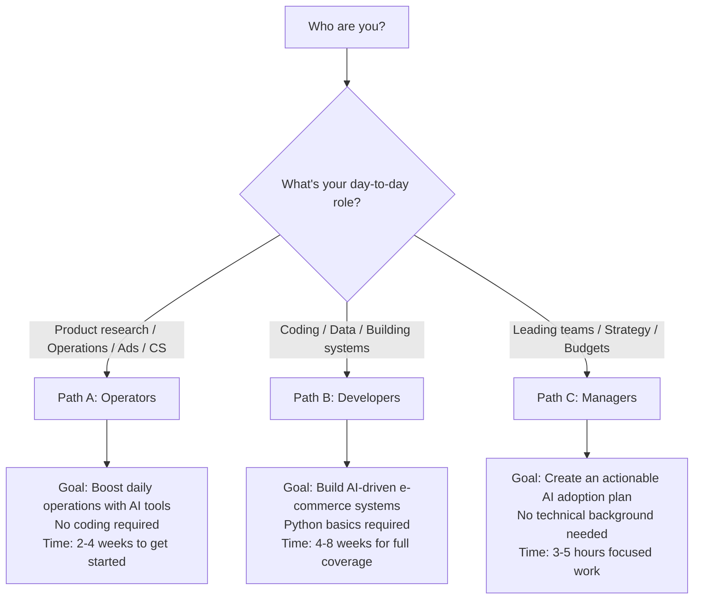
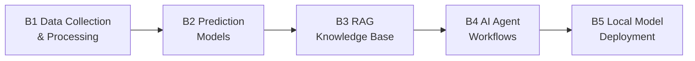

# ecommerce-ai-roadmap: AI × Cross-Border E-Commerce Knowledge Hub

> The Definitive AI Guide for Cross-Border E-Commerce | 跨境电商 AI 实战知识库

[](https://github.com/kangise/ecommerce-ai-roadmap)
[](https://github.com/kangise/ecommerce-ai-roadmap)
[](https://creativecommons.org/publicdomain/zero/1.0/)

**Original hands-on content, not a link aggregator.** 12 ready-to-use prompts · 3 learning paths · real-world case studies
**原创实战内容，不是链接聚合。** 12 个可直接复制的 Prompt 模板 · 3 条学习路径 · 实战案例

🇺🇸 English | 🇨🇳 [中文](README.md)

---

### Try AI Product Research in 30 Seconds

Copy the prompt below into [ChatGPT](https://chat.openai.com/) or [Claude](https://claude.ai/) and get instant market analysis:

```
You are a senior cross-border e-commerce expert with deep knowledge of the Amazon marketplace.
I want to sell a portable neck fan on Amazon US.
Please provide a quick market feasibility analysis including:
1. Category characteristics (seasonality, competition level, price range)
2. Top 3 competitors' key selling points and main pain points from negative reviews
3. 3 potential differentiation angles
4. Risk alerts (compliance, patents, seasonal inventory risks)
Present key data comparisons in table format.
```

You'll get a market analysis in 30 seconds. More prompts → [Prompt Library](prompts/)

---

## Table of Contents

- [ Top 10 Prompts (Ready to Use)](#top-10-prompts-ready-to-use)
- [Choose Your Path](#choose-your-path)
- [Path A: Operators AI-Powered Daily Operations](#path-a-operators--ai-powered-daily-operations)
- [Path B: Developers Building AI Systems](#path-b-developers--building-ai-systems)
- [Path C: Managers AI Strategy & Execution](#path-c-managers--ai-strategy--execution)
- [Prompt Library](#prompt-library)
- [Notebook Lab](#notebook-lab)
- [Progress Tracking](#progress-tracking)
- [AAAI China Chapter Community](#aaai-china-chapter-community)
- [Contributing](#contributing)

---

## Top 10 Prompts (Ready to Use)

Hand-picked from the [Prompt Library](prompts/) copy into ChatGPT / Claude and get results instantly.

**1. Competitor Review Pain Point Analysis** Extract product improvement ideas from negative reviews
```
You are a senior Amazon product manager. I'll give you a set of 1-3 star competitor reviews.
Analyze and output: Top 5 user pain points (by frequency), representative review quotes, improvement suggestions, and difficulty rating. Present in table format.
[Paste negative reviews here]
```
[Full template → prompts/product-research.md](prompts/product-research.md#模板-1-竞品-review-痛点分析)

**2. Market Feasibility Quick Assessment** 5-dimension scoring to decide if a product is worth pursuing
```
You are a cross-border e-commerce product research expert. Assess this product:
Product: [product name] Target market: Amazon [US/DE/JP]
Analyze across 5 dimensions (score 1-5 each): market demand, competition intensity, profit margin, supply chain difficulty, compliance risk.
Give a final recommendation: Enter / Proceed with caution / Pass.
```
[Full template → prompts/product-research.md](prompts/product-research.md#模板-2-市场可行性快速评估)

**3. Full Listing Generation** Generate title, bullet points, description, and search terms in one go
```
You are an Amazon Listing optimization expert for the [target market].
Product: [name] Selling points: [point 1/2/3] Keywords: [keyword list]
Generate: Title (≤200 chars), 5 Bullet Points, Product Description (≤200 words), Backend Search Terms (5 lines).
Integrate keywords naturally, highlight differentiation.
```
[Full template → prompts/listing-optimization.md](prompts/listing-optimization.md#模板-1-listing-全套生成)

**4. Multilingual Localization** Not translation, but market adaptation
```
You are an Amazon Listing localization expert fluent in [target language].
[Paste English listing]
Localize to [target language]: match local search habits, replace with local keywords, reorder selling points for local priorities, annotate all localization changes with reasons.
```
[Full template → prompts/listing-optimization.md](prompts/listing-optimization.md#模板-2-多语言本地化)

**5. Competitor Listing Strategy Breakdown** Compare and find differentiation opportunities
```
Analyze these 3 competitor Amazon Listings and compare their strategies:
[Competitor A/B/C titles and bullet points]
Output: Each competitor's core positioning, shared selling points, differentiation opportunities, keyword coverage comparison table, and positioning recommendations for my listing.
```
[Full template → prompts/listing-optimization.md](prompts/listing-optimization.md#模板-3-竞品-listing-策略拆解)

**6. Search Term Report Analysis** Find ad spend waste and optimization opportunities
```
You are an Amazon PPC advertising expert. Here's my search term report (past 30 days):
[Paste data]
Output: High-converting keywords TOP 10, high-spend low-conversion TOP 10, low CTR analysis, negative keyword suggestions, budget reallocation plan.
```
[Full template → prompts/advertising.md](prompts/advertising.md#模板-1-搜索词报告分析)

**7. Ad Copy A/B Testing** 5 headline styles for Sponsored Brands
```
Product: [description] Key selling point: [main benefit]
Generate 5 Sponsored Brands Headlines (≤50 chars each): feature-driven, scenario-driven, emotion-driven, data-driven, problem-solving.
Annotate expected impact and target audience for each.
```
[Full template → prompts/advertising.md](prompts/advertising.md#模板-2-广告文案-ab-测试)

**8. Bulk Negative Review Analysis** Categorize issues and create action plans
```
You are an e-commerce product quality analyst. Here are all 1-3 star reviews from the past 60 days.
Categorize by type (quality/functionality/shipping/usability/expectation mismatch), calculate frequency %, list 3 representative reviews per category, provide short-term + long-term solutions, and prioritize.
[Paste reviews]
```
[Full template → prompts/customer-service.md](prompts/customer-service.md#模板-1-差评批量分析)

**9. Account Appeal Letter (Plan of Action)** Professional reinstatement appeal
```
You are an Amazon account appeal expert. My account was suspended for:
[Paste violation notice]
Write a Plan of Action: Root Cause (acknowledge the issue), Immediate Actions (steps already taken), Preventive Measures (long-term prevention). Professional and sincere tone, specific action items in each section.
```
[Full template → prompts/customer-service.md](prompts/customer-service.md#模板-2-账号申诉信-plan-of-action)

**10. Multi-Market Compliance Comparison** Generate compliance checklists fast
```
I want to sell [product type] on Amazon [US/DE/JP].
Generate a compliance comparison table: required certifications per market, packaging & labeling requirements, special category requirements, estimated costs & timelines, common compliance pitfalls.
Note information currency and recommend confirming with certification bodies.
```
[Full template → prompts/compliance.md](prompts/compliance.md#模板-1-多市场合规对比)

> Full templates with expected outputs and usage tips → [Prompt Library](prompts/README.md)

[Back to Table of Contents](#table-of-contents)

---

## Choose Your Path



| Path | Who It's For | Coding Required? | Time Commitment | Key Outcome |
|------|-------------|-----------------|-----------------|-------------|
| **[Path A: Operators](paths/a-operators/)** | Product research / Operations / Ads / CS | No | 30 min/day, 2-4 weeks | A reusable AI workflow for daily tasks |
| **[Path B: Developers](paths/b-developers/)** | Engineering / Data / BI | Python basics | 1 hr/day, 4-8 weeks | A deployable AI-powered tool |
| **[Path C: Managers](paths/c-managers/)** | Team leads / Founders | No | 3-5 hours total | An AI adoption roadmap for your team |

> Not sure which path to pick? All three paths are interconnected. Operators who finish Path A can dive deeper with Path B. Managers can explore Path A modules for hands-on details.

[Back to Table of Contents](#table-of-contents)

---

## Path A: Operators AI-Powered Daily Operations

> Goal: Boost your daily e-commerce operations 3-10x with AI tools no coding required
>
> Prerequisites: Basic e-commerce experience (you know what ASINs, PPC, and FBA are)
>
> Time: 30 minutes per day, 2-4 weeks to complete all modules

[View Full Path A Content →](paths/a-operators/)

| Module | Topic | What You'll Learn |
|--------|-------|-------------------|
| [A1. Product Research & Market Insights](paths/a-operators/a1-product-research.md) | Competitor analysis, market assessment | Use AI to produce a complete product feasibility report |
| [A2. Listing & Content Creation](paths/a-operators/a2-listing-optimization.md) | Listing generation, multilingual translation | Use AI to create full multilingual listings |
| [A3. Advertising Optimization](paths/a-operators/a3-advertising.md) | Search term analysis, ad copy testing | Use AI to analyze search term reports and optimize campaigns |
| [A4. Customer Service & After-Sales](paths/a-operators/a4-customer-service.md) | Negative review analysis, appeal letters | Build a multilingual customer response template library |
| [A5. Inventory & Supply Chain](paths/a-operators/a5-inventory.md) | Restock forecasting, safety stock | Use AI to build a restock decision model |
| [A6. Compliance & Risk Management](paths/a-operators/a6-compliance.md) | Multi-market compliance, certification lookup | Generate a complete multi-market compliance checklist |

[Back to Table of Contents](#table-of-contents)

---

## Path B: Developers Building AI Systems

> Goal: Build AI-driven e-commerce tools and systems, from scripts to production-grade applications
>
> Prerequisites: Python basics (or willingness to learn as you go AI will help you write code)
>
> Time: 1 hour per day, 4-8 weeks for full coverage

[View Full Path B Content →](paths/b-developers/)



| Module | Topic | What You'll Build |
|--------|-------|-------------------|
| [B1. Data Collection & Processing](paths/b-developers/b1-data-pipeline.md) | pandas, SP-API, automation | A script that auto-merges Amazon reports |
| [B2. Prediction Models](paths/b-developers/b2-prediction-models.md) | Prophet, AutoGluon | A 90-day SKU sales forecast model |
| [B3. RAG Knowledge Base](paths/b-developers/b3-rag-knowledge-base.md) | LlamaIndex, Chroma | A product FAQ AI Q&A system |
| [B4. AI Agent Workflows](paths/b-developers/b4-agent-workflow.md) | LangGraph, CrewAI | An automated operations monitoring agent |
| [B5. Local Model Deployment](paths/b-developers/b5-local-model-deploy.md) | Ollama, LoRA fine-tuning | A locally-running e-commerce LLM (elective) |

> Complete at least 3 of B1-B4 and you'll have the skills to build AI-powered e-commerce tools. B5 is an advanced elective.

[Back to Table of Contents](#table-of-contents)

---

## Path C: Managers AI Strategy & Execution

> Goal: Understand what AI can do for your team and create an actionable AI adoption plan
>
> Prerequisites: No technical background needed, but deep business understanding is essential
>
> Time: 3-5 focused hours to complete assessment and planning

[View Full Path C Content →](paths/c-managers/)

| Module | Topic | What You'll Produce |
|--------|-------|---------------------|
| [C1. AI Capability Assessment & Planning](paths/c-managers/c1-ai-assessment.md) | Priority matrix, planning prompts | Team AI capability assessment and priority ranking |
| [C2. Team AI Skill Building](paths/c-managers/c2-team-building.md) | Training plans, habit formation | 80%+ of your team using AI tools daily |
| [C3. AI Project ROI Evaluation](paths/c-managers/c3-roi-evaluation.md) | ROI framework, impact measurement | An ROI evaluation report for at least one AI project |

> Complete all 3 modules to produce a comprehensive AI adoption roadmap for your team (including priorities, timeline, budget, and KPIs).

[Back to Table of Contents](#table-of-contents)

---

## Prompt Library

All prompt templates are organized in the [`prompts/`](prompts/) directory, categorized by use case and ready to copy-paste.

[Browse the Full Prompt Library →](prompts/README.md)

| Template Collection | Count | Use Cases |
|---------------------|-------|-----------|
| [Product Research & Market Analysis](prompts/product-research.md) | 3 | Competitor review analysis, market assessment, keyword clustering |
| [Listing Generation & Optimization](prompts/listing-optimization.md) | 3 | Full listing creation, multilingual localization, competitor strategy breakdown |
| [Advertising Analysis & Optimization](prompts/advertising.md) | 2 | Search term report analysis, ad copy A/B testing |
| [Customer Service & After-Sales](prompts/customer-service.md) | 2 | Bulk negative review analysis, account appeal letters |
| [Compliance & Risk Management](prompts/compliance.md) | 1 | Multi-market compliance comparison |

> We welcome your battle-tested prompts! See [Contributing](#contributing) for details.

[Back to Table of Contents](#table-of-contents)

---

## Notebook Lab

Jupyter Notebooks that run directly on Google Colab zero setup required.

Planned topics (in development contributions welcome):

- Amazon report automation with pandas (Beginner)
- Sales forecasting with Prophet (Intermediate)
- Review topic analysis with BERTopic (Intermediate)
- Product FAQ knowledge base with RAG (Intermediate)
- Automated daily operations report agent (Advanced)

> Follow the [Roadmap](roadmap/README.md) for the latest progress.

[Back to Table of Contents](#table-of-contents)

---

## Progress Tracking

Copy the checklists below into your note-taking app to track your learning progress.

### Path A Progress (Operators)

```
[ ] A1. Product Research: Complete a full AI-powered product feasibility report
[ ] A2. Listing: Generate a complete multilingual listing with AI
[ ] A3. Advertising: Analyze a real search term report and execute optimizations with AI
[ ] A4. Customer Service: Build a multilingual customer response template library
[ ] A5. Inventory: Build an AI-powered restock decision model for one product
[ ] A6. Compliance: Generate a complete multi-market compliance checklist for one product
```

### Path B Progress (Developers)

```
[ ] B1. Data: Write a script that auto-merges multiple Amazon reports
[ ] B2. Prediction: Use Prophet to forecast 90-day sales for a real SKU
[ ] B3. RAG: Build a RAG system that answers product questions
[ ] B4. Agent: Deploy an automated operations monitoring agent
[ ] B5. Deployment: Run an LLM locally with Ollama (elective)
```

### Path C Progress (Managers)

```
[ ] C1. Assessment: Complete a team AI capability assessment and priority ranking
[ ] C2. Skill Building: Get 80%+ of your team using AI tools daily
[ ] C3. ROI: Complete an ROI evaluation report for at least one AI project
```

[Back to Table of Contents](#table-of-contents)

---

## AAAI China Chapter Community

ecommerce-ai-roadmap is an open-source project under the **AAAI China Chapter**. We are dedicated to advancing the practical application of AI in cross-border e-commerce.

### What You Get by Joining

- **Monthly AI Workshops** Hands-on online sessions where you build a complete AI e-commerce project
- **Prompt Co-Creation** Community members collaboratively maintain and improve the prompt library
- **Case Study Sharing** Frontline practitioners share real-world AI applications and lessons learned
- **Technical Q&A** Get help from the community when you run into problems
- **Industry Updates** First-hand information on AI tool releases and platform policy changes

### How to Participate

- Star this repo to stay updated
- [Submit an Issue](https://github.com/kangise/ecommerce-ai-roadmap/issues) to report problems or suggest improvements
- [Submit a PR](https://github.com/kangise/ecommerce-ai-roadmap/pulls) to contribute prompts, notebooks, or case studies
- Follow AAAI China Chapter for event announcements

[Back to Table of Contents](#table-of-contents)

---

## Contributing

We especially welcome the following types of contributions:

1. **Prompt Templates** Battle-tested prompts that work well in real business scenarios
2. **Notebooks** Hands-on tutorials that run on Google Colab free tier
3. **Case Studies** How did you solve an e-commerce problem with AI? What were the results?
4. **Tool Reviews** AI tools you've tried what are the pros and cons?
5. **Bug Fixes** Found a broken link or outdated content? Help us fix it

When contributing, please note:
- Prefer free or open-source tools and resources
- Prompt templates should specify which AI tools you tested with and the results
- Notebooks must run on Google Colab free tier

See [CONTRIBUTING.md](CONTRIBUTING.md) for full details.

---

## License

[CC0 1.0](https://creativecommons.org/publicdomain/zero/1.0/) Free to use, no attribution required.

---

*An AAAI China Chapter Initiative | Maintained by AAAEC, the Association of AI Applications for E-Commerce*
