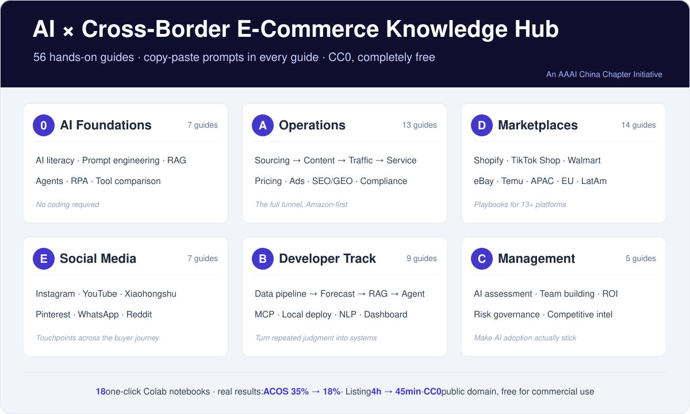

# AI × Cross-Border E-Commerce Knowledge Hub

> **Other prompt collections tell you what AI can do. This one also tells you when it's making things up.**

🇺🇸 English | 🇨🇳 [中文](README.md) | 🇯🇵 [日本語](README_JA.md) · 📖 **[Read online](https://kangise.github.io/ecommerce-ai-roadmap/en/)**

---

Ask an AI "roughly what's the monthly sales volume in this category" and it will almost always hand you a plausible-looking number — **one it does not actually know**.

Sourcing, restocking, and pricing have real money behind them. One fabricated volume figure can leave you sitting on tens of thousands in inventory. Agents make this worse: the model no longer just tells you the number, it acts on it — repricing, ordering, sending.

So in this hub, **330+ prompts carry guardrails** wherever numbers, external facts, or customer-facing copy are involved: what the model may not invent, when it must stop and ask you, and how every conclusion gets a source tag.

<p align="center">
  
</p>

---

## See the difference in 30 seconds

Paste this into [ChatGPT](https://chatgpt.com/) or [Claude](https://claude.ai/):

```
<role>Cross-border sourcing consultant fluent in the Amazon US market</role>

<product>Portable neck fan, target marketplace Amazon US</product>

<task>
1. What does the competitive structure of this category look like? What decides who wins
2. Which directions could differentiation come from
3. What data must I verify before entering? For each, name where to look it up and which field to read
4. Risk alerts (compliance, patents, seasonal inventory)
</task>

<data_discipline>
- **Do not give specific monthly volume, price, or market-size figures.** You do not have
  live market data, and an invented number leads me to stock the wrong product
- When you need a figure to judge, tell me where to look it up, then stop
- Tag each conclusion: [category-level inference] or [needs data from me]
</data_discipline>
```

**Notice there are no invented numbers in the answer** — instead it tells you which figures you need to pull from Helium 10 yourself. That's the difference between this hub and a prompt dump: not fancier wording, but **a clear line around where AI should stop**.

---

## Why use this

- **330+ prompts with guardrails** — data discipline (no inventing figures), copy discipline (no claiming features the product lacks, no promising refunds you never authorized), input boundaries (a pasted competitor review can't hijack your analysis as an instruction)
- **Trilingual and complete, not "in progress"** — 68 chapters each in Chinese, English, and Japanese; switch languages from the top-right of any page on the [online edition](https://kangise.github.io/ecommerce-ai-roadmap/en/)
- **Content that doesn't rot in three months** — chapters describe capability tiers; model ids and prices live on one [model matrix](i18n/en/src/resources/model-matrix.md) page with a verification date
- **Built for the agent era** — not just prompts, but [how to migrate them into skill files](i18n/en/src/0-foundations/f2-prompt-engineering.md) and [which actions must never go to an agent](i18n/en/src/a-operators/a14-operations-agent.md)
- **CC0** — take it, no attribution required

[](https://creativecommons.org/publicdomain/zero/1.0/)
[](https://github.com/kangise/ecommerce-ai-roadmap)
[](https://github.com/kangise/ecommerce-ai-roadmap)

---

## Where to start

| You are | Start here |
|---------|-----------|
| Wanting to know what AI can actually do | [AI Landscape Assessment](https://kangise.github.io/ecommerce-ai-roadmap/en/0-foundations/ai-landscape.html) — 30 minutes on maturity per step |
| An operator, ready to use it today | [A1 Product Research](https://kangise.github.io/ecommerce-ai-roadmap/en/a-operators/a1-product-research.html) · [A2 Listings](https://kangise.github.io/ecommerce-ai-roadmap/en/a-operators/a2-listing-optimization.html) · [A3 Ads](https://kangise.github.io/ecommerce-ai-roadmap/en/a-operators/a3-advertising.html) |
| Already using AI, want automation | [A14 Agentifying Operations](https://kangise.github.io/ecommerce-ai-roadmap/en/a-operators/a14-operations-agent.html) — decide which steps are worth it first |
| Technical, building your own | [B4 Agent Workflow](https://kangise.github.io/ecommerce-ai-roadmap/en/b-developers/b4-agent-workflow.html) · [B6 MCP Integration](https://kangise.github.io/ecommerce-ai-roadmap/en/b-developers/b6-mcp-agentic-workflow.html) |
| Facing compliance right now | [Tariffs & de minimis](https://kangise.github.io/ecommerce-ai-roadmap/en/a-operators/a11-financial-analysis.html) · [EU AI Act](https://kangise.github.io/ecommerce-ai-roadmap/en/a-operators/a6-compliance.html) |

---

## Content Index

| Domain | Topics |
|--------|--------|
| AI Foundations | [AI Evolution](src/0-foundations/f1-ai-evolution.md) · [Prompt Engineering](src/0-foundations/f2-prompt-engineering.md) · [RAG](src/0-foundations/f3-rag-knowledge.md) · [Agents](src/0-foundations/f4-agent-automation.md) · [RPA](src/0-foundations/f5-rpa-automation.md) · [Tool Comparison](src/0-foundations/f6-ai-tools-comparison.md) · [AI Landscape](src/0-foundations/ai-landscape.md) |
| Product Research | [Product Research](src/a-operators/a1-product-research.md) · [Pricing Strategy](src/a-operators/a8-pricing-strategy.md) · [IP Protection](src/a-operators/a12-ip-protection.md) |
| Supply Chain | [Inventory & Supply Chain](src/a-operators/a5-inventory.md) |
| Content & Conversion | [Listing Optimization](src/a-operators/a2-listing-optimization.md) · [Visual Content](src/a-operators/a7-visual-content.md) · [Brand Building](src/a-operators/a10-brand-building.md) |
| Traffic & Acquisition | [Advertising](src/a-operators/a3-advertising.md) · [SEO / GEO](src/a-operators/a9-seo-geo.md) · [Growth Hacking](src/a-operators/a13-ai-growth-hack.md) |
| Social Media | [Instagram / Facebook](src/e-social-media/e1-instagram-facebook-ai-guide.md) · [YouTube](src/e-social-media/e2-youtube-ai-guide.md) · [Xiaohongshu (RED)](src/e-social-media/e3-xiaohongshu-ai-guide.md) · [Pinterest](src/e-social-media/e4-pinterest-ai-guide.md) · [WhatsApp](src/e-social-media/e5-whatsapp-business-ai-guide.md) · [Reddit](src/e-social-media/e6-reddit-ai-guide.md) · [Cross-Channel](src/e-social-media/e7-social-media-cross-channel.md) |
| Customer Operations | [Customer Service & After-Sales](src/a-operators/a4-customer-service.md) |
| Compliance & Finance | [Compliance & Risk](src/a-operators/a6-compliance.md) · [Financial Analysis](src/a-operators/a11-financial-analysis.md) · [AI Risk Governance](src/c-managers/c4-ai-risk-governance.md) |
| Marketplaces — Shelf | [Walmart](src/d-platforms/d4-walmart-ai-guide.md) · [eBay](src/d-platforms/d9-ebay-ai-guide.md) · [AliExpress](src/d-platforms/d10-aliexpress-ai-guide.md) · [Temu](src/d-platforms/d5-temu-seller-guide.md) · [Faire](src/d-platforms/d12-faire-wholesale-ai-guide.md) |
| Marketplaces — DTC | [Shopify](src/d-platforms/shopify-ai-guide.md) |
| Marketplaces — Short Video | [TikTok Shop](src/d-platforms/tiktok-shop-ai-guide.md) |
| Marketplaces — APAC | [Southeast Asia](src/d-platforms/d6-southeast-asia-ai-guide.md) · [Japan (Rakuten)](src/d-platforms/d8-rakuten-japan-ai-guide.md) · [Korea (Coupang)](src/d-platforms/d11-coupang-korea-ai-guide.md) |
| Marketplaces — EU & LatAm | [Mercado Libre](src/d-platforms/d7-mercado-libre-ai-guide.md) · [Otto / Zalando](src/d-platforms/d13-europe-marketplaces-guide.md) |
| Cross-Platform Strategy | [Cross-Platform Synergy](src/d-platforms/cross-platform-strategy.md) · [Platform Comparison](src/d-platforms/platform-comparison.md) |
| Building AI Systems | [Data Pipeline](src/b-developers/b1-data-pipeline.md) · [Prediction Models](src/b-developers/b2-prediction-models.md) · [RAG Knowledge Base](src/b-developers/b3-rag-knowledge-base.md) · [Agent Workflow](src/b-developers/b4-agent-workflow.md) · [Local Deployment](src/b-developers/b5-local-model-deploy.md) · [MCP](src/b-developers/b6-mcp-agentic-workflow.md) · [Review NLP](src/b-developers/b7-review-nlp-system.md) · [Dashboard](src/b-developers/b8-ecommerce-dashboard.md) · [Image Pipeline](src/b-developers/b9-ai-image-pipeline.md) |
| Team & Management | [AI Assessment](src/c-managers/c1-ai-assessment.md) · [Team Building](src/c-managers/c2-team-building.md) · [ROI Evaluation](src/c-managers/c3-roi-evaluation.md) · [Competitive Intelligence](src/c-managers/c5-competitive-intelligence.md) |

---

## Six Tracks

| Track | Who It's For | Coding? | What You Get |
|-------|-------------|---------|--------------|
| **[0 · AI Foundations](src/0-foundations/)** (7 guides) | Everyone | No | A working mental model of LLMs, prompts, RAG, agents |
| **[A · Operators](src/a-operators/)** (13 guides) | Product research / ops / ads / CS | No | A reusable AI workflow for every step from sourcing to growth, Amazon-first |
| **[B · Developers](src/b-developers/)** (9 guides) | Engineering / data / BI | Python | Deployable systems: pipelines, forecasts, RAG, agents, dashboards |
| **[C · Managers](src/c-managers/)** (5 guides) | Team leads / founders | No | An AI adoption roadmap: assessment, training, ROI, risk governance |
| **[D · Marketplaces](src/d-platforms/)** (14 guides) | Multi-platform sellers | No | Platform-specific playbooks: Shopify, TikTok Shop, Walmart, and 10 more |
| **[E · Social Media](src/e-social-media/)** (7 guides) | Content & growth | No | Channel strategies that map to the buyer journey, from discovery to decision |

---

## Top 10 Prompts (Ready to Use)

Hand-picked from the guides — copy into ChatGPT / Claude and get results instantly.

**1. Competitor Review Pain Point Analysis** — Extract product improvement ideas from negative reviews
```
You are a senior Amazon product manager. I'll give you a set of 1-3 star competitor reviews.
Analyze and output: Top 5 user pain points (by frequency), representative review quotes, improvement suggestions, and difficulty rating. Present in table format.
[Paste negative reviews here]
```
[Full guide →](src/a-operators/a1-product-research.md#31-竞品-review-痛点分析)

**2. Market Feasibility Quick Assessment** — 5-dimension scoring to decide if a product is worth pursuing
```
You are a cross-border e-commerce product research expert. Assess this product:
Product: [product name] Target market: Amazon [US/DE/JP]
Analyze across 5 dimensions (score 1-5 each): market demand, competition intensity, profit margin, supply chain difficulty, compliance risk.
Give a final recommendation: Enter / Proceed with caution / Pass.
```
[Full guide →](src/a-operators/a1-product-research.md#32-市场可行性快速评估)

**3. Full Listing Generation** — Title, bullet points, description, and search terms in one go
```
You are an Amazon Listing optimization expert for the [target market].
Product: [name] Selling points: [point 1/2/3] Keywords: [keyword list]
Generate: Title (≤200 chars), 5 Bullet Points, Product Description (≤200 words), Backend Search Terms (5 lines).
Integrate keywords naturally, highlight differentiation.
```
[Full guide →](src/a-operators/a2-listing-optimization.md#31-listing-全套生成标题--五点--描述--search-terms)

**4. Multilingual Localization** — Not translation, but market adaptation
```
You are an Amazon Listing localization expert fluent in [target language].
[Paste English listing]
Localize to [target language]: match local search habits, replace with local keywords, reorder selling points for local priorities, annotate all localization changes with reasons.
```
[Full guide →](src/a-operators/a2-listing-optimization.md#32-多语言本地化不是直译)

**5. Competitor Listing Strategy Breakdown** — Compare and find differentiation opportunities
```
Analyze these 3 competitor Amazon Listings and compare their strategies:
[Competitor A/B/C titles and bullet points]
Output: Each competitor's core positioning, shared selling points, differentiation opportunities, keyword coverage comparison table, and positioning recommendations for my listing.
```
[Full guide →](src/a-operators/a2-listing-optimization.md)

**6. Search Term Report Analysis** — Find ad spend waste and optimization opportunities
```
You are an Amazon PPC advertising expert. Here's my search term report (past 30 days):
[Paste data]
Output: High-converting keywords TOP 10, high-spend low-conversion TOP 10, low CTR analysis, negative keyword suggestions, budget reallocation plan.
```
[Full guide →](src/a-operators/a3-advertising.md#31-搜索词报告分析)

**7. Ad Copy A/B Testing** — 5 headline styles for Sponsored Brands
```
Product: [description] Key selling point: [main benefit]
Generate 5 Sponsored Brands Headlines (≤50 chars each): feature-driven, scenario-driven, emotion-driven, data-driven, problem-solving.
Annotate expected impact and target audience for each.
```
[Full guide →](src/a-operators/a3-advertising.md#32-广告文案-ab-测试)

**8. Bulk Negative Review Analysis** — Categorize issues and create action plans
```
You are an e-commerce product quality analyst. Here are all 1-3 star reviews from the past 60 days.
Categorize by type (quality/functionality/shipping/usability/expectation mismatch), calculate frequency %, list 3 representative reviews per category, provide short-term + long-term solutions, and prioritize.
[Paste reviews]
```
[Full guide →](src/a-operators/a4-customer-service.md)

**9. Account Appeal Letter (Plan of Action)** — Professional reinstatement appeal
```
You are an Amazon account appeal expert. My account was suspended for:
[Paste violation notice]
Write a Plan of Action: Root Cause (acknowledge the issue), Immediate Actions (steps already taken), Preventive Measures (long-term prevention). Professional and sincere tone, specific action items in each section.
```
[Full guide →](src/a-operators/a6-compliance.md#36-amazon-政策违规应对)

**10. Multi-Market Compliance Comparison** — Generate compliance checklists fast
```
I want to sell [product type] on Amazon [US/DE/JP].
Generate a compliance comparison table: required certifications per market, packaging & labeling requirements, special category requirements, estimated costs & timelines, common compliance pitfalls.
Note information currency and recommend confirming with certification bodies.
```
[Full guide →](src/a-operators/a6-compliance.md#31-多市场合规对比深化版)

---

## Notebook Lab

18 Jupyter notebooks that run directly on Google Colab — zero setup required:

[Product Research](https://colab.research.google.com/github/kangise/ecommerce-ai-roadmap/blob/main/notebooks/a1-product-research.ipynb) · [Multilingual Listing](https://colab.research.google.com/github/kangise/ecommerce-ai-roadmap/blob/main/notebooks/a2-multilingual-listing.ipynb) · [Advertising](https://colab.research.google.com/github/kangise/ecommerce-ai-roadmap/blob/main/notebooks/a3-advertising.ipynb) · [Negative Reviews](https://colab.research.google.com/github/kangise/ecommerce-ai-roadmap/blob/main/notebooks/a4-negative-review-analysis.ipynb) · [Inventory Reorder](https://colab.research.google.com/github/kangise/ecommerce-ai-roadmap/blob/main/notebooks/a5-inventory-reorder.ipynb) · [Compliance Checker](https://colab.research.google.com/github/kangise/ecommerce-ai-roadmap/blob/main/notebooks/a6-compliance-checker.ipynb) · [Price Tracker](https://colab.research.google.com/github/kangise/ecommerce-ai-roadmap/blob/main/notebooks/a8-price-tracker.ipynb) · [GEO Audit](https://colab.research.google.com/github/kangise/ecommerce-ai-roadmap/blob/main/notebooks/a9-geo-audit.ipynb) · [Brand Audit](https://colab.research.google.com/github/kangise/ecommerce-ai-roadmap/blob/main/notebooks/a10-brand-audit.ipynb) · [Profit Calculator](https://colab.research.google.com/github/kangise/ecommerce-ai-roadmap/blob/main/notebooks/a11-profit-calculator.ipynb) · [Patent Search](https://colab.research.google.com/github/kangise/ecommerce-ai-roadmap/blob/main/notebooks/a12-ip-patent-search.ipynb) · [Data Pipeline](https://colab.research.google.com/github/kangise/ecommerce-ai-roadmap/blob/main/notebooks/b1-data-pipeline.ipynb) · [Sales Forecast](https://colab.research.google.com/github/kangise/ecommerce-ai-roadmap/blob/main/notebooks/b2-sales-forecast.ipynb) · [Review NLP](https://colab.research.google.com/github/kangise/ecommerce-ai-roadmap/blob/main/notebooks/b7-review-analysis.ipynb) · [Dashboard](https://colab.research.google.com/github/kangise/ecommerce-ai-roadmap/blob/main/notebooks/b8-dashboard-demo.ipynb) · [ROI Evaluation](https://colab.research.google.com/github/kangise/ecommerce-ai-roadmap/blob/main/notebooks/c3-roi-evaluation.ipynb) · [Cross-Platform Content](https://colab.research.google.com/github/kangise/ecommerce-ai-roadmap/blob/main/notebooks/d3-cross-platform-content.ipynb) · [Social Calendar](https://colab.research.google.com/github/kangise/ecommerce-ai-roadmap/blob/main/notebooks/e1-social-content-calendar.ipynb)

## Case Studies

[AI Listing Optimization](src/case-studies/ai-listing-optimization.md) — 4 hours → 45 minutes per SKU

[AI PPC Optimization](src/case-studies/ai-ppc-optimization.md) — ACOS 35% → 18%

[Review-Driven Product Development](src/case-studies/ai-review-to-product.md) — 4.6★ vs. competitor's 4.2★

[All case studies →](src/case-studies/)

---

## Community

ecommerce-ai-roadmap is an open-source project under the **AAAI China Chapter**, dedicated to the practical application of AI in cross-border e-commerce.

- **Star** this repo to stay updated
- [Submit an issue](https://github.com/kangise/ecommerce-ai-roadmap/issues) to report problems or suggest improvements
- [Submit a PR](https://github.com/kangise/ecommerce-ai-roadmap/pulls) to contribute prompts, notebooks, or case studies

## Contributing

We especially welcome:

1. **Prompt templates** — battle-tested prompts that work in real business scenarios (note which AI tools you tested with)
2. **Notebooks** — hands-on tutorials that run on Google Colab free tier
3. **Case studies** — how you solved an e-commerce problem with AI, and the results
4. **Tool reviews** — pros and cons of AI tools you've actually used
5. **Fixes** — broken links, outdated content

See [CONTRIBUTING.md](CONTRIBUTING.md) for details.

---

[CC0 1.0](https://creativecommons.org/publicdomain/zero/1.0/) — free to use, no attribution required · [Disclaimer](DISCLAIMER.md) · *An AAAI China Chapter Initiative*
