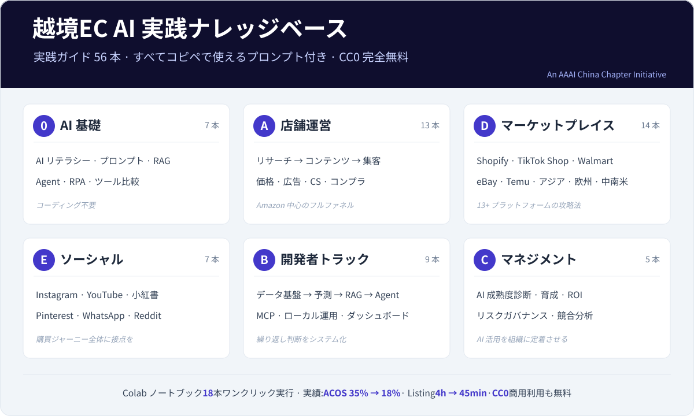

# AI × 越境EC ナレッジハブ

> **他のプロンプト集は AI に何ができるかを教える。ここはさらに、AI がいつ作り話をしているかを教える。**

🇯🇵 日本語 | 🇨🇳 [中文](README.md) | 🇺🇸 [English](README_EN.md) · 📖 **[オンラインで読む](https://kangise.github.io/ecommerce-ai-roadmap/ja/)**

---

AI に「このカテゴリの月間販売数はどれくらい?」と聞けば、ほぼ確実にもっともらしい数字が返ってくる — **本当は知らないのに**。

商品選定・仕入れ・価格設定の先には実際の資金が動いている。捏造された販売数の数字ひとつで、数十万円分の在庫を抱えることになりかねない。Agent 時代はさらに危うい。モデルはその数字を伝えるだけでなく、それを使って値付けし、発注し、送信する。

だから本ハブでは、**812 のプロンプトに護りを入れてある**。数字・外部の事実・顧客に出す文面が絡むところではすべて、何を捏造してはいけないか、情報不足のときどこで止まって尋ねるか、結論にどう出典を付すかを明記している。

<p align="center">
  
</p>

---

## 本だけではない — Agent インフラストラクチャ

3 層構成。人間向け、Agent 間の共有契約、Agent の直接呼び出し：

| 層 | 内容 | 規模 | 対象 |
|---|---|---|---|
| 知識ベース | 69 章、3 言語（中/英/日） | 69 章 | 人間の読解 · Agent 検索 |
| Ontology | E コマース領域モデル | 94 実体 · 184 制約 · 78 関係 · 8 プロセス | Agent 間の共有契約 |
| Skills + プロンプト | ガード付きの実行可能能力 | 812 プロンプト · 8 つのスキル | Agent の直接呼び出し |

より詳しくは `dist/README.md` · `dist/integration/mcp.md` を参照。

## 30 秒で違いが分かる

以下を [ChatGPT](https://chatgpt.com/) または [Claude](https://claude.ai/) に貼り付けてください:

```
<役割>Amazon US 市場に精通した越境EC の選品コンサルタント</役割>

<商品>ポータブルネックファン(首掛け扇風機)、対象は Amazon US</商品>

<タスク>
1. このカテゴリの競争構造はどうなっているか。勝敗を決める要因は何か
2. 差別化はどの方向から切り込めるか
3. 参入前に検証すべきデータは何か。各項目について、どこで何の項目を調べるかを示す
4. リスクの注意点(コンプライアンス、特許、季節在庫)
</タスク>

<データ規律>
- **月間販売数・価格・市場規模の具体的な数字は出さないこと。** あなたはリアルタイムの
  市場データを持っておらず、捏造された数字は誤った仕入れにつながる
- 判断にある数字が必要なときは、どこで調べるべきかを伝えて、そこで止まること
- 結論ごとに印を付す: [カテゴリ常識からの推論] または [私からのデータが必要]
</データ規律>
```

**回答に捏造された数字が一つもないことに注目してほしい。** 代わりに「この数字は Helium 10 で自分で調べる必要がある」と教えてくれる。これが本ハブと単なるプロンプト集の違いだ。凝った言い回しではなく、**AI がどこで止まるべきかの線が引いてある**ことにある。

---

## なぜこれを使うのか

- **812 のプロンプトに護りを内蔵** — データ規律(数字を捏造しない)、コピー規律(商品にない機能を書かない、承認していない返金を約束しない)、入力境界(貼り付けた競合レビューが指示として分析を乗っ取れない)
- **3 言語すべて完訳、「翻訳中」ではない** — 中国語・英語・日本語それぞれ 69 章。[オンライン版](https://kangise.github.io/ecommerce-ai-roadmap/ja/)の右上でいつでも切り替えられる
- **3 か月で古びない構成** — 本文は能力級だけを書き、型番と価格は確認日付きの[モデルマトリクス](i18n/ja/src/resources/model-matrix.md)1 ページに集約
- **Agent 時代に使える** — プロンプトだけでなく、[スキルファイルへの移行方法](i18n/ja/src/0-foundations/f2-prompt-engineering.md)と[絶対に Agent に渡してはいけない動作](i18n/ja/src/a-operators/a14-operations-agent.md)まで
- **CC0** — 自由に使える。クレジット表記も不要

[](https://creativecommons.org/publicdomain/zero/1.0/)
[](https://github.com/kangise/ecommerce-ai-roadmap)
[](https://github.com/kangise/ecommerce-ai-roadmap)

---

## どこから始めるか

| あなたは | ここから |
|---------|---------|
| AI に何ができるかまず知りたい | [AI 活用成熟度マップ](https://kangise.github.io/ecommerce-ai-roadmap/ja/0-foundations/ai-landscape.html) — 各工程の成熟度が 30 分で分かる |
| 運用担当、今日から使いたい | [A1 商品リサーチ](https://kangise.github.io/ecommerce-ai-roadmap/ja/a-operators/a1-product-research.html) · [A2 商品ページ](https://kangise.github.io/ecommerce-ai-roadmap/ja/a-operators/a2-listing-optimization.html) · [A3 広告](https://kangise.github.io/ecommerce-ai-roadmap/ja/a-operators/a3-advertising.html) |
| すでに AI を使っていて自動化したい | [A14 運用の Agent 化](https://kangise.github.io/ecommerce-ai-roadmap/ja/a-operators/a14-operations-agent.html) — まずどの工程が値するかを判断する |
| 技術側、自分で組む | [B4 Agent ワークフロー](https://kangise.github.io/ecommerce-ai-roadmap/ja/b-developers/b4-agent-workflow.html) · [B6 MCP 統合](https://kangise.github.io/ecommerce-ai-roadmap/ja/b-developers/b6-mcp-agentic-workflow.html) |
| 目下のコンプライアンスが気になる | [関税と de minimis](https://kangise.github.io/ecommerce-ai-roadmap/ja/a-operators/a11-financial-analysis.html) · [EU AI Act](https://kangise.github.io/ecommerce-ai-roadmap/ja/a-operators/a6-compliance.html) |

---

## コンテンツ索引

| ドメイン | トピック |
|----------|----------|
| AI 基礎 | [AI 技術の変遷](src/0-foundations/f1-ai-evolution.md) · [プロンプトエンジニアリング](src/0-foundations/f2-prompt-engineering.md) · [RAG](src/0-foundations/f3-rag-knowledge.md) · [Agent](src/0-foundations/f4-agent-automation.md) · [RPA](src/0-foundations/f5-rpa-automation.md) · [ツール比較](src/0-foundations/f6-ai-tools-comparison.md) · [AI 活用成熟度マップ](src/0-foundations/ai-landscape.md) |
| 商品リサーチ | [商品リサーチ](src/a-operators/a1-product-research.md) · [価格戦略](src/a-operators/a8-pricing-strategy.md) · [知的財産保護](src/a-operators/a12-ip-protection.md) |
| サプライチェーン | [在庫とサプライチェーン](src/a-operators/a5-inventory.md) |
| コンテンツと転換率 | [商品ページ最適化](src/a-operators/a2-listing-optimization.md) · [ビジュアルコンテンツ](src/a-operators/a7-visual-content.md) · [ブランド構築](src/a-operators/a10-brand-building.md) |
| 集客 | [広告最適化](src/a-operators/a3-advertising.md) · [SEO / GEO](src/a-operators/a9-seo-geo.md) · [グロースハック](src/a-operators/a13-ai-growth-hack.md) |
| ソーシャルメディア | [Instagram / Facebook](src/e-social-media/e1-instagram-facebook-ai-guide.md) · [YouTube](src/e-social-media/e2-youtube-ai-guide.md) · [小紅書 (RED)](src/e-social-media/e3-xiaohongshu-ai-guide.md) · [Pinterest](src/e-social-media/e4-pinterest-ai-guide.md) · [WhatsApp](src/e-social-media/e5-whatsapp-business-ai-guide.md) · [Reddit](src/e-social-media/e6-reddit-ai-guide.md) · [クロスチャネル](src/e-social-media/e7-social-media-cross-channel.md) |
| カスタマー対応 | [カスタマーサービスとアフターケア](src/a-operators/a4-customer-service.md) |
| コンプライアンスと財務 | [コンプライアンスとリスク管理](src/a-operators/a6-compliance.md) · [財務分析](src/a-operators/a11-financial-analysis.md) · [AI リスクガバナンス](src/c-managers/c4-ai-risk-governance.md) |
| モール型 EC | [Walmart](src/d-platforms/d4-walmart-ai-guide.md) · [eBay](src/d-platforms/d9-ebay-ai-guide.md) · [AliExpress](src/d-platforms/d10-aliexpress-ai-guide.md) · [Temu](src/d-platforms/d5-temu-seller-guide.md) · [Faire](src/d-platforms/d12-faire-wholesale-ai-guide.md) |
| 自社 EC (DTC) | [Shopify](src/d-platforms/shopify-ai-guide.md) |
| ショート動画 EC | [TikTok Shop](src/d-platforms/tiktok-shop-ai-guide.md) |
| アジア太平洋 | [東南アジア](src/d-platforms/d6-southeast-asia-ai-guide.md) · [日本 (楽天市場)](src/d-platforms/d8-rakuten-japan-ai-guide.md) · [韓国 (Coupang)](src/d-platforms/d11-coupang-korea-ai-guide.md) |
| 欧州・中南米 | [Mercado Libre](src/d-platforms/d7-mercado-libre-ai-guide.md) · [Otto / Zalando](src/d-platforms/d13-europe-marketplaces-guide.md) |
| クロスプラットフォーム | [プラットフォーム連携](src/d-platforms/cross-platform-strategy.md) · [プラットフォーム比較](src/d-platforms/platform-comparison.md) |
| AI システム構築 | [データパイプライン](src/b-developers/b1-data-pipeline.md) · [予測モデル](src/b-developers/b2-prediction-models.md) · [RAG ナレッジベース](src/b-developers/b3-rag-knowledge-base.md) · [Agent ワークフロー](src/b-developers/b4-agent-workflow.md) · [ローカルデプロイ](src/b-developers/b5-local-model-deploy.md) · [MCP](src/b-developers/b6-mcp-agentic-workflow.md) · [レビュー NLP](src/b-developers/b7-review-nlp-system.md) · [ダッシュボード](src/b-developers/b8-ecommerce-dashboard.md) · [画像パイプライン](src/b-developers/b9-ai-image-pipeline.md) |
| チームとマネジメント | [AI 能力アセスメント](src/c-managers/c1-ai-assessment.md) · [チームビルディング](src/c-managers/c2-team-building.md) · [ROI 評価](src/c-managers/c3-roi-evaluation.md) · [競合インテリジェンス](src/c-managers/c5-competitive-intelligence.md) |

---

## 6 つのトラック

| トラック | 対象 | コーディング | 得られるもの |
|----------|------|--------------|--------------|
| **[0 · AI 基礎](src/0-foundations/)** (7 本) | すべての人 | 不要 | LLM・プロンプト・RAG・Agent の実用的なメンタルモデル |
| **[A · 店舗運営](src/a-operators/)** (13 本) | リサーチ / 運営 / 広告 / CS | 不要 | 商品リサーチから成長まで、Amazon 中心の再利用可能な AI ワークフロー |
| **[B · 開発者](src/b-developers/)** (9 本) | エンジニア / データ / BI | Python | パイプライン・予測・RAG・Agent・ダッシュボードなど実運用システム |
| **[C · マネジメント](src/c-managers/)** (5 本) | チームリーダー / 経営者 | 不要 | アセスメント・育成・ROI・リスクガバナンスを含む AI 導入ロードマップ |
| **[D · マーケットプレイス](src/d-platforms/)** (14 本) | 複数モール運営者 | 不要 | Shopify、TikTok Shop、Walmart など 13+ プラットフォーム別プレイブック |
| **[E · ソーシャルメディア](src/e-social-media/)** (7 本) | コンテンツ / グロース | 不要 | 発見から購買決定まで、購買ジャーニーに沿ったチャネル戦略 |

---

## すぐ使えるプロンプト TOP 10

ガイドから厳選 — ChatGPT / Claude に貼り付ければすぐに結果が得られます。

**1. 競合レビューの不満点分析** — 低評価レビューから商品改善のヒントを抽出
```
あなたは経験豊富な Amazon プロダクトマネージャーです。競合商品の星 1〜3 のレビューを渡します。
分析して以下を出力してください: ユーザーの不満点トップ 5(頻度順)、代表的なレビューの引用、改善提案、改善難易度の評価。表形式でまとめてください。
[ここに低評価レビューを貼り付け]
```
[ガイド全文 →](src/a-operators/a1-product-research.md#31-竞品-review-痛点分析)

**2. 市場性クイック診断** — 5 軸スコアリングで参入判断
```
あなたは越境EC の商品リサーチ専門家です。次の商品を評価してください:
商品: [商品名] ターゲット市場: Amazon [US/DE/JP]
5 つの軸(各 1〜5 点)で分析: 市場需要、競争の激しさ、利益率、サプライチェーン難易度、コンプライアンスリスク。
最終判断を提示してください: 参入する / 慎重に進める / 見送る。
```
[ガイド全文 →](src/a-operators/a1-product-research.md#32-市场可行性快速评估)

**3. 商品ページ一括生成** — タイトル・箇条書き・説明文・検索キーワードを一度に
```
あなたは[ターゲット市場]向けの Amazon 商品ページ最適化の専門家です。
商品: [商品名] セールスポイント: [ポイント 1/2/3] キーワード: [キーワードリスト]
生成してください: タイトル(200 文字以内)、箇条書き 5 点、商品説明(200 語以内)、バックエンド検索キーワード(5 行)。
キーワードは自然に織り込み、差別化ポイントを際立たせてください。
```
[ガイド全文 →](src/a-operators/a2-listing-optimization.md#31-listing-全套生成标题--五点--描述--search-terms)

**4. 多言語ローカライズ** — 翻訳ではなく市場適応
```
あなたは[ターゲット言語]に堪能な Amazon 商品ページのローカライズ専門家です。
[英語の商品ページを貼り付け]
[ターゲット言語]にローカライズしてください: 現地の検索習慣に合わせ、現地キーワードに置き換え、訴求ポイントを現地の優先順位で並べ替え、変更点すべてに理由を注記してください。
```
[ガイド全文 →](src/a-operators/a2-listing-optimization.md#32-多语言本地化不是直译)

**5. 競合ページの戦略分解** — 比較から差別化の機会を発見
```
次の 3 つの競合 Amazon 商品ページを分析し、戦略を比較してください:
[競合 A/B/C のタイトルと箇条書き]
出力: 各競合のコアポジショニング、共通する訴求ポイント、差別化の機会、キーワードカバレッジ比較表、自社ページへのポジショニング提案。
```
[ガイド全文 →](src/a-operators/a2-listing-optimization.md)

**6. 検索語レポート分析** — 広告費のムダと最適化の機会を発見
```
あなたは Amazon PPC 広告の専門家です。過去 30 日の検索語レポートです:
[データを貼り付け]
出力: 高転換キーワード TOP 10、高消費・低転換 TOP 10、低 CTR の分析、除外キーワードの提案、予算再配分プラン。
```
[ガイド全文 →](src/a-operators/a3-advertising.md#31-搜索词报告分析)

**7. 広告コピー A/B テスト** — Sponsored Brands 見出しを 5 スタイルで
```
商品: [商品説明] 主要セールスポイント: [最大のベネフィット]
Sponsored Brands の見出しを 5 本生成してください(各 50 文字以内): 機能訴求型、利用シーン型、感情訴求型、データ訴求型、課題解決型。
それぞれに期待効果とターゲット層を注記してください。
```
[ガイド全文 →](src/a-operators/a3-advertising.md#32-广告文案-ab-测试)

**8. 低評価レビュー一括分析** — 問題を分類しアクションプランへ
```
あなたは EC 商品の品質アナリストです。過去 60 日の星 1〜3 レビューをすべて渡します。
種類別に分類(品質/機能/配送/使いやすさ/期待とのギャップ)し、頻度の割合を算出、各分類の代表レビューを 3 件列挙、短期+長期の解決策を提示し、優先順位を付けてください。
[レビューを貼り付け]
```
[ガイド全文 →](src/a-operators/a4-customer-service.md)

**9. アカウント申立書 (Plan of Action)** — プロフェッショナルな復権申請
```
あなたは Amazon アカウント申立の専門家です。私のアカウントは次の理由で停止されました:
[違反通知を貼り付け]
Plan of Action を書いてください: Root Cause(問題の認識)、Immediate Actions(実施済みの対応)、Preventive Measures(長期的な再発防止策)。誠実でプロフェッショナルなトーンで、各セクションに具体的なアクションを含めてください。
```
[ガイド全文 →](src/a-operators/a6-compliance.md#36-amazon-政策违规应对)

**10. 複数市場コンプライアンス比較** — 認証チェックリストを高速生成
```
[商品タイプ]を Amazon [US/DE/JP] で販売したいと考えています。
コンプライアンス比較表を生成してください: 市場ごとの必要認証、パッケージ・ラベル要件、特殊カテゴリ要件、想定コストと期間、よくある落とし穴。
情報の鮮度に注意を促し、認証機関への確認を推奨してください。
```
[ガイド全文 →](src/a-operators/a6-compliance.md#31-多市场合规对比深化版)

---

## ノートブックラボ

Google Colab でそのまま動く Jupyter ノートブック 18 本 — セットアップ不要:

[商品リサーチ](https://colab.research.google.com/github/kangise/ecommerce-ai-roadmap/blob/main/notebooks/a1-product-research.ipynb) · [多言語商品ページ](https://colab.research.google.com/github/kangise/ecommerce-ai-roadmap/blob/main/notebooks/a2-multilingual-listing.ipynb) · [広告](https://colab.research.google.com/github/kangise/ecommerce-ai-roadmap/blob/main/notebooks/a3-advertising.ipynb) · [低評価レビュー](https://colab.research.google.com/github/kangise/ecommerce-ai-roadmap/blob/main/notebooks/a4-negative-review-analysis.ipynb) · [在庫補充](https://colab.research.google.com/github/kangise/ecommerce-ai-roadmap/blob/main/notebooks/a5-inventory-reorder.ipynb) · [コンプライアンス](https://colab.research.google.com/github/kangise/ecommerce-ai-roadmap/blob/main/notebooks/a6-compliance-checker.ipynb) · [価格トラッカー](https://colab.research.google.com/github/kangise/ecommerce-ai-roadmap/blob/main/notebooks/a8-price-tracker.ipynb) · [GEO 監査](https://colab.research.google.com/github/kangise/ecommerce-ai-roadmap/blob/main/notebooks/a9-geo-audit.ipynb) · [ブランド監査](https://colab.research.google.com/github/kangise/ecommerce-ai-roadmap/blob/main/notebooks/a10-brand-audit.ipynb) · [利益計算](https://colab.research.google.com/github/kangise/ecommerce-ai-roadmap/blob/main/notebooks/a11-profit-calculator.ipynb) · [特許検索](https://colab.research.google.com/github/kangise/ecommerce-ai-roadmap/blob/main/notebooks/a12-ip-patent-search.ipynb) · [データパイプライン](https://colab.research.google.com/github/kangise/ecommerce-ai-roadmap/blob/main/notebooks/b1-data-pipeline.ipynb) · [売上予測](https://colab.research.google.com/github/kangise/ecommerce-ai-roadmap/blob/main/notebooks/b2-sales-forecast.ipynb) · [レビュー NLP](https://colab.research.google.com/github/kangise/ecommerce-ai-roadmap/blob/main/notebooks/b7-review-analysis.ipynb) · [ダッシュボード](https://colab.research.google.com/github/kangise/ecommerce-ai-roadmap/blob/main/notebooks/b8-dashboard-demo.ipynb) · [ROI 評価](https://colab.research.google.com/github/kangise/ecommerce-ai-roadmap/blob/main/notebooks/c3-roi-evaluation.ipynb) · [クロスプラットフォーム](https://colab.research.google.com/github/kangise/ecommerce-ai-roadmap/blob/main/notebooks/d3-cross-platform-content.ipynb) · [SNS カレンダー](https://colab.research.google.com/github/kangise/ecommerce-ai-roadmap/blob/main/notebooks/e1-social-content-calendar.ipynb)

## 事例研究

[AI 商品ページ最適化](src/case-studies/ai-listing-optimization.md) — SKU あたり 4 時間 → 45 分

[AI 広告最適化](src/case-studies/ai-ppc-optimization.md) — ACOS 35% → 18%

[レビュー起点の商品開発](src/case-studies/ai-review-to-product.md) — 評価 4.6★ vs 競合 4.2★

[すべての事例 →](src/case-studies/)

---

## コミュニティ

ecommerce-ai-roadmap は **AAAI China Chapter** のオープンソースプロジェクトとして、越境EC における AI の実践活用を推進しています。

- **Star** を付けて更新をフォロー
- [Issue を提出](https://github.com/kangise/ecommerce-ai-roadmap/issues)して問題報告や改善提案
- [PR を提出](https://github.com/kangise/ecommerce-ai-roadmap/pulls)してプロンプト・ノートブック・事例を投稿

## コントリビュート

特に歓迎するもの:

1. **プロンプトテンプレート** — 実務で検証済みのプロンプト(テストに使った AI ツールを明記)
2. **ノートブック** — Google Colab 無料枠で動くハンズオンチュートリアル
3. **事例研究** — AI で EC の課題をどう解決したか、その成果
4. **ツールレビュー** — 実際に使った AI ツールの長所と短所
5. **修正** — リンク切れや古くなった内容の修正

詳細は [CONTRIBUTING.md](CONTRIBUTING.md) をご覧ください。

---

[CC0 1.0](https://creativecommons.org/publicdomain/zero/1.0/) — 帰属表示不要で自由に利用可能 · [免責事項](DISCLAIMER.md) · *An AAAI China Chapter Initiative*
