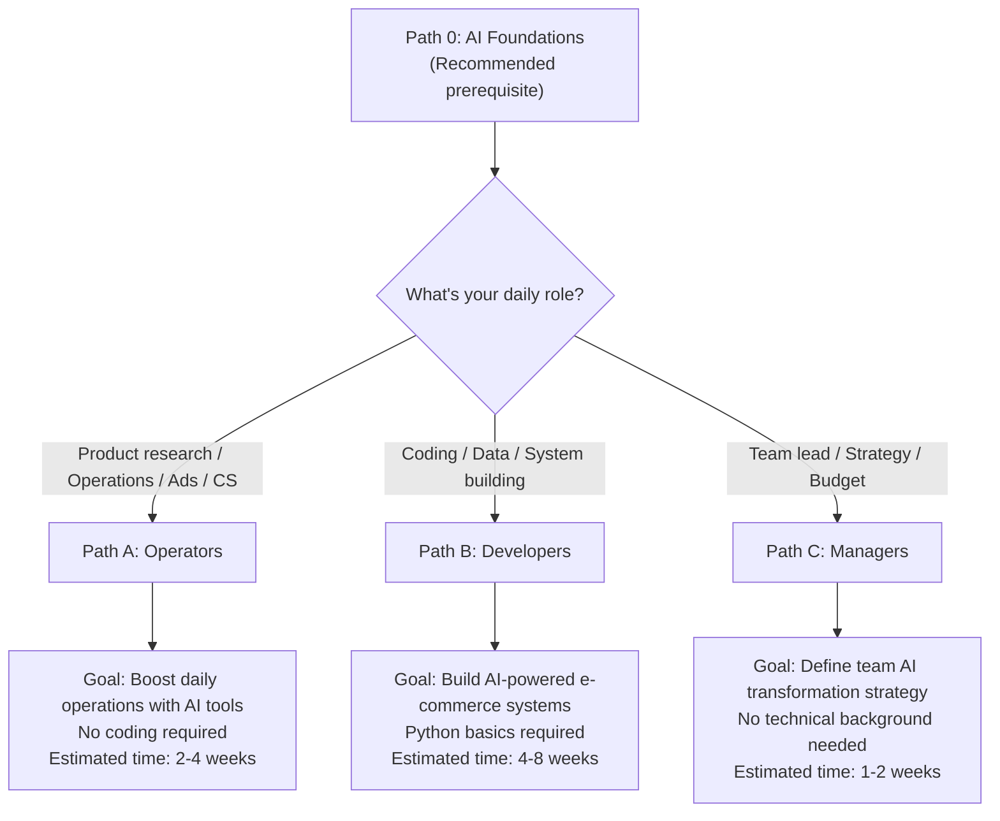
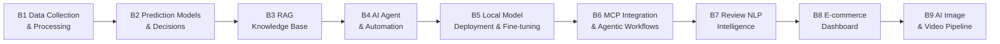

<div align="center">

### Language / 语言切换

[](../README.md) [](README.md) [](../ja/README.md) [](../es/README.md)

</div>

[🇨🇳 中文](../README.md) | 🇺🇸 English | [🇯🇵 日本語](../ja/README.md) | [🇪🇸 Español](../es/README.md)

# ecommerce-ai-roadmap: AI Prompts & Strategies for Amazon Sellers, Shopify & TikTok Shop

> The Definitive AI Playbook for Cross-Border E-Commerce Amazon Seller AI Tools, Listing Optimization, Advertising, TikTok Shop, Shopify, Multi-Platform Strategy

[](https://github.com/kangise/ecommerce-ai-roadmap)
[](https://github.com/kangise/ecommerce-ai-roadmap)
[](https://creativecommons.org/publicdomain/zero/1.0/)

48+ AI use cases with deep-dive guides · Amazon / Shopify / TikTok Shop + 13 platforms · Rufus/COSMO/GEO/Agentic Commerce · Ready-to-use ChatGPT prompts

> ** Project Scale (March 2026)**: 120+ guide files · 80,000+ lines · 6 learning paths (0/A/B/C/D/E) · 13 e-commerce platforms · 7 social media channels · 4 languages · 63 English translations

---

### Try AI Product Research in 30 Seconds

Copy the prompt below into [ChatGPT](https://chat.openai.com/) or [Claude](https://claude.ai/) and get an instant market analysis:

```
You are a senior cross-border e-commerce expert with deep knowledge of the Amazon platform.
I want to sell a portable neck fan on Amazon US.
Please provide a quick market feasibility analysis including:
1. Category characteristics (seasonality, competition level, price range)
2. Top 3 competitors' key selling points and main pain points from negative reviews
3. 3 potential differentiation angles
4. Risk alerts (compliance, patents, seasonal inventory risk)
Please present key data comparisons in table format.
```

You'll get a market analysis in 30 seconds. More prompts → [Prompt Library](prompts/)

---

## What's New

- 2026-03-15: Full English translation completed 63 files across all 6 learning paths now available in English
- 2026-03-15: Notebook Lab expanded to 18 notebooks covering Path A (11), Path B (4), Path C (1), Path D (1), Path E (1)
- 2026-03-15: Content deepening new modules A7-A13, B6-B9, C4-C5 added with comprehensive guides
- 2025-06-20: New [Notebook Lab](../notebooks/) First notebook: Amazon report data processing [](https://colab.research.google.com/github/kangise/ecommerce-ai-roadmap/blob/main/notebooks/b1-data-pipeline.ipynb)
- 2025-06-20: 2 new case studies: [AI Listing Generation](../docs/case-studies/ai-listing-generation.md), [Automated Review Analysis](../docs/case-studies/automated-review-analysis.md)
- 2025-06-20: Added [README_EN.md](../README_EN.md) full English version + community infrastructure (Issue templates, CODEOWNERS, CHANGELOG)

---

## Table of Contents

- [ What's New](#whats-new)
- [Quick Access to Popular Topics (48 Scenarios)](#quick-access-to-popular-topics)
- [Choose Your Path](#choose-your-path)
- [Path A: Operators AI-Powered Daily Operations](#path-a-operators--ai-powered-daily-operations)
- [Path B: Developers Building AI Systems](#path-b-developers--building-ai-systems)
- [Path C: Managers AI Strategy Implementation](#path-c-managers--ai-strategy-implementation)
- [Prompt Library](#prompt-library)
- [Notebook Lab](#notebook-lab)
- [Learning Progress Tracker](#learning-progress-tracker)
- [AAAI China Chapter Community](#aaai-china-chapter-community)
- [Contributors](#contributors)
- [Contributing Guide](#contributing-guide)

---

## Quick Access to Popular Topics

> Jump directly to in-depth content by scenario. Popularity based on March 2026 industry data, updated regularly.
> Last updated: 2026-03-14 | Update cycle: Monthly refresh based on external trend data

| # | Category | Scenario | One-Liner | Link |
|---|----------|----------|-----------|------|
| | ** Product Research & Market Analysis** | | | |
| 1 | Research | Competitor review pain point extraction | 50 negative reviews → pain point ranking + improvement directions | [A1 Prompt](paths/a-operators/a1-product-research.md) · [Before/After](paths/0-foundations/ai-landscape.md) |
| 2 | Research | Market feasibility 5-dimension scoring | Demand/Competition/Profit/Supply Chain/Compliance, Go or No-Go | [A1 Prompt](paths/a-operators/a1-product-research.md) |
| 3 | Research | Google Trends validation | Cross-validate product direction, avoid false demand | [A1 Methodology](paths/a-operators/a1-product-research.md) |
| 4 | Research | Supplier evaluation & cost comparison | AI analysis of 1688/Alibaba supplier data | [A1 Methodology](paths/a-operators/a1-product-research.md) |
| | ** Listing & Content Optimization** | | | |
| 5 | Listing | Rufus/COSMO semantic optimization | From keyword matching to intent matching the most important Listing change in 2026 | [A2 Methodology 1.1](paths/a-operators/a2-listing-optimization.md) |
| 6 | Listing | Full Listing one-click generation | Title + Bullet Points + Description + Search Terms, done in 45 minutes | [A2 Prompt](paths/a-operators/a2-listing-optimization.md) · [Before/After](paths/0-foundations/ai-landscape.md) |
| 7 | Listing | Multi-language localization | Not just translation cultural adaptation + local keywords + unit conversion | [A2 Prompt](paths/a-operators/a2-listing-optimization.md) · [D1 ch25](paths/d-platforms/shopify-ai-guide.md) |
| 8 | Listing | A+ Content copywriting | Brand story + product comparison + usage scenario layout | [A2 Methodology](paths/a-operators/a2-listing-optimization.md) |
| 9 | Listing | Competitor Listing strategy breakdown | Comparative analysis for differentiated positioning and keyword gaps | [A2 Prompt](paths/a-operators/a2-listing-optimization.md) |
| 10 | Listing | Q&A seeding (Rufus optimization) | Rufus reads Q&A to answer customer questions seed high-frequency questions | [A2 Advanced](paths/a-operators/a2-listing-optimization.md) |
| | ** Advertising Optimization** | | | |
| 11 | Ads | Search term report AI analysis | High-ROAS terms / wasted spend / hidden long-tail opportunities, done in 50 min | [A3 Prompt](paths/a-operators/a3-advertising.md) · [Before/After](paths/0-foundations/ai-landscape.md) |
| 12 | Ads | Ad copy A/B testing | Batch-generate 5 headline style variants | [A3 Prompt](paths/a-operators/a3-advertising.md) |
| 13 | Ads | New product 30-day ad launch plan | Complete Auto → Manual keyword harvesting workflow | [A3 Workflow](paths/a-operators/a3-advertising.md) |
| 14 | Ads | ACOS/TACOS diagnostics | Ad health assessment and budget reallocation | [A3 Methodology](paths/a-operators/a3-advertising.md) |
| 15 | Ads | Amazon Canvas AI | New feature (2026.3) AI real-time data visualization and scenario simulation | [AI Landscape](paths/0-foundations/ai-landscape.md) |
| | ** Customer Service & After-Sales** | | | |
| 16 | CS | Negative review batch analysis | Categorize issues + frequency stats + improvement plan + priority | [A4 Prompt](paths/a-operators/a4-customer-service.md) · [Before/After](paths/0-foundations/ai-landscape.md) |
| 17 | CS | Multi-language customer service replies | AI-generated + human-reviewed, 1-2 min per reply | [A4 Prompt](paths/a-operators/a4-customer-service.md) |
| 18 | CS | Account appeal Plan of Action | Root Cause + Actions + Prevention, first draft in 35 min | [A6 Prompt 3.6](paths/a-operators/a6-compliance.md) · [A6 SOP 4.3](paths/a-operators/a6-compliance.md) |
| 19 | CS | A-to-Z Claim response | Analyze cause + generate reply + prevention measures | [A4 Methodology](paths/a-operators/a4-customer-service.md) |
| | ** Compliance & Risk Management** | | | |
| 20 | Compliance | Multi-market compliance comparison | CE/FCC/PSE/UKCA side-by-side, checklist in 30 min | [A6 Prompt 3.1](paths/a-operators/a6-compliance.md) · [Before/After](paths/0-foundations/ai-landscape.md) |
| 21 | Compliance | Compliance cost estimation | Certification + testing + labeling + annual maintenance, built into pricing model | [A6 Prompt 3.3](paths/a-operators/a6-compliance.md) |
| 22 | Compliance | IP risk assessment | Patent/trademark/copyright screening at the product selection stage | [A6 Prompt 3.4](paths/a-operators/a6-compliance.md) |
| 23 | Compliance | BSA AI Agent compliance | New regulation (2026.3) ensure your AI tools meet Amazon requirements | [A6 Advanced 6.1](paths/a-operators/a6-compliance.md) |
| | ** Shopify (DTC Store)** | | | |
| 24 | Shopify | GEO optimization | Get your products recommended by ChatGPT/Perplexity hottest trend in 2026 | [D1 ch21.3](paths/d-platforms/shopify-ai-guide.md) |
| 25 | Shopify | Agentic Storefronts | Sell directly inside ChatGPT/Gemini/Copilot | [D1 ch21.2](paths/d-platforms/shopify-ai-guide.md) |
| 26 | Shopify | Shopify Audiences | AI-powered ad audience generation, CAC reduced 20-50% | [D1 ch21.4](paths/d-platforms/shopify-ai-guide.md) |
| 27 | Shopify | Klaviyo email personalization | Send-time optimization + LTV prediction + churn alerts | [D1 ch23](paths/d-platforms/shopify-ai-guide.md) · [Before/After](paths/0-foundations/ai-landscape.md) |
| 28 | Shopify | Amazon to Shopify migration | 6-phase migration methodology, avoid 5 common mistakes | [D1 ch28](paths/d-platforms/shopify-ai-guide.md) |
| 29 | Shopify | Conversion funnel diagnostics | Add-to-cart / checkout / payment rate layer-by-layer analysis | [D1 ch24](paths/d-platforms/shopify-ai-guide.md) |
| 30 | Shopify | Schema/FAQ code | Product Schema + FAQ Schema the foundation of GEO optimization | [D1 ch27](paths/d-platforms/shopify-ai-guide.md) |
| | ** TikTok Shop** | | | |
| 31 | TikTok | Hook formula library | Information gap theory-based Hook design methodology | [D2 ch15.2](paths/d-platforms/tiktok-shop-ai-guide.md) |
| 32 | TikTok | 3-act video script structure | Build need → Show solution → Drive action, 3-5x conversion rate | [D2 ch15.3](paths/d-platforms/tiktok-shop-ai-guide.md) |
| 33 | TikTok | Creator scoring model | 100-point quantitative scoring no more gut-feeling creator selection | [D2 ch16.2](paths/d-platforms/tiktok-shop-ai-guide.md) |
| 34 | TikTok | Personalized creator outreach | Customized based on creator's recent content, 3-5x reply rate | [D2 ch16.3](paths/d-platforms/tiktok-shop-ai-guide.md) |
| 35 | TikTok | Livestream minute-by-minute script | Retain → Seed → Convert → Engage → Encore rhythm design | [D2 ch17.3](paths/d-platforms/tiktok-shop-ai-guide.md) |
| 36 | TikTok | GMV Max optimization | After mandatory rollout (2025.9): creative/Feed/SPS 3 controllable variables | [D2 ch14.2](paths/d-platforms/tiktok-shop-ai-guide.md) · [D2 ch6.3](paths/d-platforms/tiktok-shop-ai-guide.md) |
| 37 | TikTok | TikTok in-app search SEO | 40%+ Gen Z search for products on TikTok first | [D2 ch19](paths/d-platforms/tiktok-shop-ai-guide.md) |
| 38 | TikTok | Spark Ads selection criteria | Watch-through >40% + engagement >5% + product click >3% | [D2 ch23.1](paths/d-platforms/tiktok-shop-ai-guide.md) |
| | ** Cross-Platform Synergy** | | | |
| 39 | Cross-platform | One document, three platforms | One core document → Amazon + Shopify + TikTok content | [D3 ch3](paths/d-platforms/cross-platform-strategy.md) |
| 40 | Cross-platform | Review-driven Hook creation | Amazon negative review pain points → TikTok video Hook inspiration | [D1 ch22.1](paths/d-platforms/shopify-ai-guide.md) · [D2 ch20](paths/d-platforms/tiktok-shop-ai-guide.md) |
| 41 | Cross-platform | TikTok seeding attribution | Quantify TikTok's indirect contribution to Amazon branded search volume | [D3 ch4.2](paths/d-platforms/cross-platform-strategy.md) |
| 42 | Cross-platform | Three-platform ad budget allocation | Marginal ROAS equilibrium + indirect effect correction | [D3 ch5](paths/d-platforms/cross-platform-strategy.md) |
| 43 | Cross-platform | Cross-platform inventory MCF/FBT | FBA + FBT + 3PL dynamic allocation strategy | [D3 ch6](paths/d-platforms/cross-platform-strategy.md) |
| | ** Data Analysis & AI Trends** | | | |
| 44 | Data/AI | Auto-generated weekly reports | Anomaly detection + trend analysis + optimization suggestions, 35 min/week | [Before/After](paths/0-foundations/ai-landscape.md) |
| 45 | Data/AI | Amazon Canvas AI | New feature (2026.3) AI data analysis inside Seller Central | [AI Landscape](paths/0-foundations/ai-landscape.md) |
| 46 | Data/AI | Seller Assistant Agentic | Amazon's official AI assistant upgrade can execute actions on behalf of sellers | Coming soon |
| 47 | Data/AI | OpenClaw Agent automation | AI Agent for automating daily operations tasks | [D1 ch10](paths/d-platforms/shopify-ai-guide.md) · [D2 ch12](paths/d-platforms/tiktok-shop-ai-guide.md) |
| 48 | Data/AI | AI tool ROI calculation | Is $20/month for ChatGPT worth it? A quantification framework | [AI Landscape](paths/0-foundations/ai-landscape.md)

[Back to Table of Contents](#table-of-contents)

---

## Choose Your Path

> **Recommended prerequisite**: Regardless of which path you choose, we suggest completing [Path 0: AI Foundations](paths/0-foundations/) first to build a solid understanding of AI concepts (LLM principles, Prompt engineering, RAG, Agents).



| Path | Who It's For | Coding Required? | Time Investment | Core Output |
|------|-------------|-----------------|----------------|-------------|
| **[Path 0: AI Foundations](paths/0-foundations/)** | Everyone (recommended) | No | 30 min/day, 1 week | AI knowledge foundation |
| **[Path A: Operators](paths/a-operators/)** | Product research / Operations / Ads / CS | No | 30 min/day, 2-4 weeks | A reusable AI workflow |
| **[Path B: Developers](paths/b-developers/)** | Dev / Data / BI roles | Python required | 1 hr/day, 4-8 weeks | A deployable AI tool |
| **[Path C: Managers](paths/c-managers/)** | Team leads / Founders | No | 3-5 hours total | An AI implementation plan |
| **[Path D: Multi-Platform](paths/d-platforms/)** | Multi-platform sellers | No | As needed | Multi-platform AI operations |
| **[Path E: Social Media](paths/e-social-media/)** | Brand marketing / Content ops | No | 30 min/day, 2-3 weeks | Social media AI traffic system |

> **Recommended**: After completing Path 0, before diving into a specific path, check out the [AI Application Landscape Assessment](paths/0-foundations/ai-landscape.md) 30 minutes to understand what AI can do at each stage and how to prioritize.

> Not sure which path to pick? All three paths can be mixed. Operators who finish Path A and want to go deeper can move to Path B; Managers who want details can explore Path A modules.

[Back to Table of Contents](#table-of-contents)

---

## Path A: Operators AI-Powered Daily Operations

> Goal: Without writing a single line of code, boost daily operations efficiency 3-10x with AI tools
>
> Prerequisites: Basic e-commerce operations experience (you know what ASIN, PPC, FBA mean)
>
> Time: 30 minutes/day, complete all modules in 2-4 weeks

[View full Path A content →](paths/a-operators/)

| Module | Topic | What You'll Learn |
|--------|-------|-------------------|
| [A1. Product Research & Market Insights](paths/a-operators/a1-product-research.md) | Competitor analysis, market assessment | Complete a product feasibility analysis with AI |
| [A2. Listing & Content Creation](paths/a-operators/a2-listing-optimization.md) | Listing generation, multi-language translation | Generate a complete multi-language Listing with AI |
| [A3. Advertising Optimization](paths/a-operators/a3-advertising.md) | Search term analysis, copy testing | Analyze search term reports and optimize with AI |
| [A4. Customer Service & After-Sales](paths/a-operators/a4-customer-service.md) | Negative review analysis, appeal letters | Build a multi-language CS reply template library |
| [A5. Inventory & Supply Chain](paths/a-operators/a5-inventory.md) | Restock forecasting, safety stock | Build an AI-powered restock decision model |
| [A6. Compliance & Risk Management](paths/a-operators/a6-compliance.md) | Multi-market compliance, certification lookup | Generate a complete multi-market compliance checklist |
| [A7. AI Visual Content Creation](paths/a-operators/a7-visual-content.md) | Product images, A+ visuals, infographics | Create professional visual content with AI tools |
| [A8. AI Pricing Strategy](paths/a-operators/a8-pricing-strategy.md) | Dynamic pricing, competitor tracking | Build an AI-powered pricing optimization model |
| [A9. SEO & GEO Optimization](paths/a-operators/a9-seo-geo.md) | Search optimization, AI search visibility | Optimize for both traditional and AI-powered search |
| [A10. AI Brand Building](paths/a-operators/a10-brand-building.md) | Brand consistency, cross-platform identity | Build a cohesive AI-driven brand strategy |
| [A11. AI Financial Analysis](paths/a-operators/a11-financial-analysis.md) | Profit calculation, cost analysis | Build SKU-level profitability models with AI |
| [A12. AI Intellectual Property Protection](paths/a-operators/a12-ip-protection.md) | Patent search, trademark monitoring | Automate IP risk screening and monitoring |
| [A13. AI Growth Hack](paths/a-operators/a13-ai-growth-hack.md) | Growth strategies, viral tactics | Discover and execute AI-powered growth opportunities |

[Back to Table of Contents](#table-of-contents)

---

## Path B: Developers Building AI Systems

> Goal: Build AI-powered e-commerce tools and systems, from scripts to production-grade applications
>
> Prerequisites: Python basics (or willingness to learn as you go AI will help you write code)
>
> Time: 1 hour/day, master the system in 4-8 weeks

[View full Path B content →](paths/b-developers/)



| Module | Topic | What You'll Build |
|--------|-------|-------------------|
| [B1. Data Collection & Processing](paths/b-developers/b1-data-pipeline.md) | pandas, SP-API, automation | Script to auto-merge Amazon reports |
| [B2. Prediction Models & Decisions](paths/b-developers/b2-prediction-models.md) | Prophet, AutoGluon | SKU 90-day sales forecast model |
| [B3. RAG Knowledge Base](paths/b-developers/b3-rag-knowledge-base.md) | LlamaIndex, Chroma | Product FAQ AI Q&A system |
| [B4. AI Agent & Automation](paths/b-developers/b4-agent-workflow.md) | LangGraph, CrewAI | Automated operations monitoring Agent |
| [B5. Local Model Deployment](paths/b-developers/b5-local-model-deploy.md) | Ollama, LoRA fine-tuning | Locally-running e-commerce LLM (elective) |
| [B6. MCP Integration & Agentic Workflows](paths/b-developers/b6-mcp-agentic-workflow.md) | MCP protocol, tool orchestration | Multi-tool agentic workflow system |
| [B7. Review NLP Intelligence System](paths/b-developers/b7-review-nlp-system.md) | BERTopic, sentiment analysis | Automated review intelligence pipeline |
| [B8. E-commerce Dashboard & Visualization](paths/b-developers/b8-ecommerce-dashboard.md) | Plotly, Streamlit | Multi-platform KPI dashboard with anomaly detection |
| [B9. AI Image & Video Pipeline](paths/b-developers/b9-ai-image-pipeline.md) | Stable Diffusion, video generation | Automated product image and video creation pipeline |

> Complete at least 3 of B1-B4 and you'll have the skills to build AI e-commerce tools. B5 is an advanced elective. B6-B9 are specialized deep-dives.

[Back to Table of Contents](#table-of-contents)

---

## Path C: Managers AI Strategy Implementation

> Goal: Understand what AI can do for your team and create an actionable AI implementation plan
>
> Prerequisites: No technical background needed, but deep business understanding required
>
> Time: 3-5 focused hours to complete assessment and planning

[View full Path C content →](paths/c-managers/)

| Module | Topic | What You'll Produce |
|--------|-------|---------------------|
| [C1. AI Capability Assessment & Planning](paths/c-managers/c1-ai-assessment.md) | Priority matrix, planning prompts | Team AI capability assessment and priority ranking |
| [C2. Team AI Skill Building](paths/c-managers/c2-team-building.md) | Training plan, habit formation | 80%+ of team using AI tools daily |
| [C3. AI Project ROI Evaluation](paths/c-managers/c3-roi-evaluation.md) | ROI calculation framework, impact measurement | ROI evaluation report for at least one AI project |
| [C4. AI Risk Management & Governance](paths/c-managers/c4-ai-risk-governance.md) | AI policy, compliance framework | AI governance policy and risk mitigation plan |
| [C5. AI Competitive Intelligence](paths/c-managers/c5-competitive-intelligence.md) | Market monitoring, competitor AI tracking | Competitive intelligence dashboard and alert system |

> Complete all 5 modules to produce a comprehensive team AI implementation plan (including priorities, timeline, budget, KPIs, risk management).

[Back to Table of Contents](#table-of-contents)

---

## Path D: Multi-Platform Beyond Amazon

> Extend your AI capabilities from Amazon to 13 e-commerce platforms worldwide.
>
> Prerequisite: Recommended to complete Path A core modules first

[View full Path D content →](paths/d-platforms/) · [Platform Comparison](paths/d-platforms/platform-comparison.md)

| Module | Platform | Core Content |
|--------|----------|-------------|
| [D1. Shopify AI Guide](paths/d-platforms/shopify-ai-guide.md) | Shopify | Full pipeline: Product research → Product page → Ads → Email → CS → Analytics |
| [D2. TikTok Shop AI Guide](paths/d-platforms/tiktok-shop-ai-guide.md) | TikTok Shop | Short video generation, creator matching, livestream scripts |
| [D3. Cross-Platform AI Strategy](paths/d-platforms/cross-platform-strategy.md) | Multi-platform | Amazon + DTC store + social commerce synergy |
| [D4. Walmart Marketplace](paths/d-platforms/d4-walmart-ai-guide.md) | Walmart | Amazon sellers' natural second platform, Walmart Connect ads |
| [D5. Temu Seller Strategy](paths/d-platforms/d5-temu-seller-guide.md) | Temu | Competitive analysis + entry decision framework |
| [D6. Southeast Asia](paths/d-platforms/d6-southeast-asia-ai-guide.md) | Shopee + Lazada | Multi-language localization + livestream commerce |
| [D7. Latin America](paths/d-platforms/d7-mercado-libre-ai-guide.md) | Mercado Libre | Spanish/Portuguese localization + LatAm market |
| [D8. Japan](paths/d-platforms/d8-rakuten-japan-ai-guide.md) | Rakuten | Store customization + points ecosystem + email marketing |
| [D9. eBay](paths/d-platforms/d9-ebay-ai-guide.md) | eBay | Pre-owned/refurbished + auction strategy |
| [D10. AliExpress](paths/d-platforms/d10-aliexpress-ai-guide.md) | AliExpress | Fully managed model + Southern Europe market |
| [D11. Korea](paths/d-platforms/d11-coupang-korea-ai-guide.md) | Coupang | Korean market entry + Korean Listing |
| [D12. Faire Wholesale](paths/d-platforms/d12-faire-wholesale-ai-guide.md) | Faire | B2B wholesale + brand story |
| [D13. Europe](paths/d-platforms/d13-europe-marketplaces-guide.md) | Otto + Zalando | German market + EU compliance |

[Back to Table of Contents](#table-of-contents)

---

## Path E: Social Media AI Operations

> Use AI to systematically operate social media channels, turning "posting" into a scalable traffic system.
>
> Prerequisite: Recommended to complete Path A core modules first

[View full Path E content →](paths/e-social-media/)

| Module | Channel | Core Content |
|--------|---------|-------------|
| [E1. Instagram + Facebook](paths/e-social-media/e1-instagram-facebook-ai-guide.md) | Meta Ecosystem | Reels creation + Advantage+ ads + Shopping |
| [E2. YouTube](paths/e-social-media/e2-youtube-ai-guide.md) | YouTube | Long-form reviews + Shorts + Shopping + Affiliate |
| [E3. Xiaohongshu](paths/e-social-media/e3-xiaohongshu-ai-guide.md) | RedNote | Seeding notes + KOL/KOC + China market entry |
| [E4. Pinterest](paths/e-social-media/e4-pinterest-ai-guide.md) | Pinterest | Visual search engine + Shopping Ads |
| [E5. WhatsApp Business](paths/e-social-media/e5-whatsapp-business-ai-guide.md) | WhatsApp | AI Chatbot + conversational commerce |
| [E6. Reddit](paths/e-social-media/e6-reddit-ai-guide.md) | Reddit | Community marketing + product discovery |
| [E7. Cross-Channel Strategy](paths/e-social-media/e7-social-media-cross-channel.md) | Multi-channel | One content, multi-platform adaptation + attribution + budget allocation |

[Back to Table of Contents](#table-of-contents)

---

## Prompt Library

All prompt templates are organized in the [`prompts/`](prompts/) directory by scenario, ready to copy and use.

[View full Prompt Library →](prompts/README.md)

| Template Set | Count | Scenarios |
|-------------|-------|-----------|
| [Product Research & Market Analysis](prompts/product-research.md) | 3 | Competitor review analysis, market assessment, keyword clustering |
| [Listing Generation & Optimization](prompts/listing-optimization.md) | 3 | Full Listing generation, multi-language localization, competitor strategy breakdown |
| [Advertising Analysis & Optimization](prompts/advertising.md) | 2 | Search term report analysis, ad copy A/B testing |
| [Customer Service & After-Sales](prompts/customer-service.md) | 2 | Negative review batch analysis, account appeal letter |
| [Compliance & Risk Management](prompts/compliance.md) | 1 | Multi-market compliance comparison |

> We welcome contributions of your battle-tested prompt templates! See [Contributing Guide](#contributing-guide).

[Back to Table of Contents](#table-of-contents)

---

## Notebook Lab

Jupyter Notebooks that run directly in Google Colab zero setup required.

18 notebooks available across all learning paths:

| Notebook | Content | Difficulty | Time | Colab |
|----------|---------|------------|------|-------|
| [a1-product-research.ipynb](../notebooks/a1-product-research.ipynb) | Competitor review batch analysis + AI prompts | Beginner | 20 min | [](https://colab.research.google.com/github/kangise/ecommerce-ai-roadmap/blob/main/notebooks/a1-product-research.ipynb) |
| [a2-multilingual-listing.ipynb](../notebooks/a2-multilingual-listing.ipynb) | Multi-language Listing batch generation (5 languages) | Intermediate | 15 min | [](https://colab.research.google.com/github/kangise/ecommerce-ai-roadmap/blob/main/notebooks/a2-multilingual-listing.ipynb) |
| [a3-advertising.ipynb](../notebooks/a3-advertising.ipynb) | Search term report 4-quadrant analysis + negative keywords + bid optimization | Beginner | 25 min | [](https://colab.research.google.com/github/kangise/ecommerce-ai-roadmap/blob/main/notebooks/a3-advertising.ipynb) |
| [a4-negative-review-analysis.ipynb](../notebooks/a4-negative-review-analysis.ipynb) | Negative review batch analysis auto-categorize + frequency + improvement suggestions | Beginner | 20 min | [](https://colab.research.google.com/github/kangise/ecommerce-ai-roadmap/blob/main/notebooks/a4-negative-review-analysis.ipynb) |
| [a5-inventory-reorder.ipynb](../notebooks/a5-inventory-reorder.ipynb) | Inventory reorder decisions safety stock + reorder point + 90-day forecast | Beginner | 15 min | [](https://colab.research.google.com/github/kangise/ecommerce-ai-roadmap/blob/main/notebooks/a5-inventory-reorder.ipynb) |
| [a6-compliance-checker.ipynb](../notebooks/a6-compliance-checker.ipynb) | Multi-market compliance checker CE/FCC/PSE checklist + cost estimation | Beginner | 10 min | [](https://colab.research.google.com/github/kangise/ecommerce-ai-roadmap/blob/main/notebooks/a6-compliance-checker.ipynb) |
| [a8-price-tracker.ipynb](../notebooks/a8-price-tracker.ipynb) | Competitor price tracking price change detection + elasticity analysis + pricing suggestions | Beginner | 15 min | [](https://colab.research.google.com/github/kangise/ecommerce-ai-roadmap/blob/main/notebooks/a8-price-tracker.ipynb) |
| [a9-geo-audit.ipynb](../notebooks/a9-geo-audit.ipynb) | GEO audit AI search visibility automated testing | Intermediate | 15 min | [](https://colab.research.google.com/github/kangise/ecommerce-ai-roadmap/blob/main/notebooks/a9-geo-audit.ipynb) |
| [a10-brand-audit.ipynb](../notebooks/a10-brand-audit.ipynb) | Brand consistency audit AI cross-platform content comparison + scoring | Intermediate | 10 min | [](https://colab.research.google.com/github/kangise/ecommerce-ai-roadmap/blob/main/notebooks/a10-brand-audit.ipynb) |
| [a11-profit-calculator.ipynb](../notebooks/a11-profit-calculator.ipynb) | SKU true profit calculator cost breakdown + sensitivity analysis | Beginner | 15 min | [](https://colab.research.google.com/github/kangise/ecommerce-ai-roadmap/blob/main/notebooks/a11-profit-calculator.ipynb) |
| [a12-ip-patent-search.ipynb](../notebooks/a12-ip-patent-search.ipynb) | Patent/trademark risk screening Google Patents + AI risk assessment | Intermediate | 10 min | [](https://colab.research.google.com/github/kangise/ecommerce-ai-roadmap/blob/main/notebooks/a12-ip-patent-search.ipynb) |
| [b1-data-pipeline.ipynb](../notebooks/b1-data-pipeline.ipynb) | Amazon report data processing pandas read, clean, calculate | Beginner | 30 min | [](https://colab.research.google.com/github/kangise/ecommerce-ai-roadmap/blob/main/notebooks/b1-data-pipeline.ipynb) |
| [b2-sales-forecast.ipynb](../notebooks/b2-sales-forecast.ipynb) | Prophet sales forecast 90-day prediction + seasonality + restock suggestions | Intermediate | 25 min | [](https://colab.research.google.com/github/kangise/ecommerce-ai-roadmap/blob/main/notebooks/b2-sales-forecast.ipynb) |
| [b7-review-analysis.ipynb](../notebooks/b7-review-analysis.ipynb) | Review NLP BERTopic topic modeling + sentiment analysis | Intermediate | 30 min | [](https://colab.research.google.com/github/kangise/ecommerce-ai-roadmap/blob/main/notebooks/b7-review-analysis.ipynb) |
| [b8-dashboard-demo.ipynb](../notebooks/b8-dashboard-demo.ipynb) | E-commerce dashboard multi-platform data + KPI + anomaly detection | Intermediate | 25 min | [](https://colab.research.google.com/github/kangise/ecommerce-ai-roadmap/blob/main/notebooks/b8-dashboard-demo.ipynb) |
| [c3-roi-evaluation.ipynb](../notebooks/c3-roi-evaluation.ipynb) | AI tool ROI calculation quantify ROI for each tool | Beginner | 15 min | [](https://colab.research.google.com/github/kangise/ecommerce-ai-roadmap/blob/main/notebooks/c3-roi-evaluation.ipynb) |
| [d3-cross-platform-content.ipynb](../notebooks/d3-cross-platform-content.ipynb) | Cross-platform content adaptation Amazon→Shopify/TikTok/IG/Walmart/Pinterest | Intermediate | 15 min | [](https://colab.research.google.com/github/kangise/ecommerce-ai-roadmap/blob/main/notebooks/d3-cross-platform-content.ipynb) |
| [e1-social-content-calendar.ipynb](../notebooks/e1-social-content-calendar.ipynb) | 30-day social media content calendar AI-generated cross-platform publishing plan | Beginner | 10 min | [](https://colab.research.google.com/github/kangise/ecommerce-ai-roadmap/blob/main/notebooks/e1-social-content-calendar.ipynb) |

**Total: 18 Notebooks · Covering Path A (11) + Path B (4) + Path C (1) + Path D (1) + Path E (1)**

> Follow the [Roadmap](../roadmap/README.md) for the latest progress.

[Back to Table of Contents](#table-of-contents)

---

## Learning Progress Tracker

Copy the checklist below to your note-taking tool to track your progress.

### Path A Progress (Operators)

```
[ ] A1. Product Research: Complete a full product feasibility analysis report with AI
[ ] A2. Listing: Generate a complete multi-language Listing with AI
[ ] A3. Advertising: Analyze a real search term report with AI and execute optimizations
[ ] A4. Customer Service: Build a multi-language CS reply template library
[ ] A5. Inventory: Build an AI-powered restock decision model for one product
[ ] A6. Compliance: Generate a complete multi-market compliance checklist for one product
[ ] A7. Visual Content: Create a set of AI-generated product images and A+ visuals
[ ] A8. Pricing: Build an AI-powered pricing optimization model for one product
[ ] A9. SEO & GEO: Complete SEO and GEO optimization audit for one listing
[ ] A10. Brand Building: Create a cross-platform brand consistency audit
[ ] A11. Financial Analysis: Build a SKU-level profitability model
[ ] A12. IP Protection: Complete an IP risk screening for one product category
[ ] A13. Growth Hack: Identify and execute one AI-powered growth experiment
```

### Path B Progress (Developers)

```
[ ] B1. Data: Write a script to auto-merge multiple Amazon reports
[ ] B2. Prediction: Use Prophet to forecast 90-day sales for a real SKU
[ ] B3. RAG: Build a RAG system that can answer product questions
[ ] B4. Agent: Deploy an automated operations monitoring Agent
[ ] B5. Deployment: Run an LLM locally with Ollama (elective)
[ ] B6. MCP: Build a multi-tool agentic workflow with MCP protocol
[ ] B7. Review NLP: Deploy an automated review intelligence pipeline
[ ] B8. Dashboard: Build a multi-platform KPI dashboard with anomaly detection
[ ] B9. Image Pipeline: Create an automated product image generation pipeline
```

### Path C Progress (Managers)

```
[ ] C1. Assessment: Complete team AI capability assessment and priority ranking
[ ] C2. Building: 80%+ of team members using AI tools daily
[ ] C3. ROI: Complete an ROI evaluation report for at least one AI project
[ ] C4. Risk Management: Establish AI governance policy and risk mitigation plan
[ ] C5. Competitive Intelligence: Set up competitive intelligence monitoring system
```

[Back to Table of Contents](#table-of-contents)

---

## AAAI China Chapter Community

ecommerce-ai-roadmap is one of the open-source projects of the **AAAI China Chapter**. We are dedicated to promoting the practical application of AI technology in cross-border e-commerce.

### What You Get by Joining

- **Monthly AI Workshop** One online hands-on workshop per month, building a complete AI e-commerce project together
- **Prompt template co-creation** Community members collaboratively maintain and optimize the prompt template library
- **Case sharing** Frontline operators share real-world AI application cases and lessons learned
- **Technical Q&A** Get help from the community when you encounter problems
- **Industry news** First-hand information on AI tool updates and platform policy changes

### How to Participate

- Star this repo to stay updated
- [Submit an Issue](https://github.com/kangise/ecommerce-ai-roadmap/issues) for feedback or suggestions
- [Submit a PR](https://github.com/kangise/ecommerce-ai-roadmap/pulls) to contribute prompt templates, notebooks, or case studies
- Follow AAAI China Chapter for event information

[Back to Table of Contents](#table-of-contents)

---

## Contributors

Thanks to everyone who has contributed to ecommerce-ai-roadmap!

<!-- ALL-CONTRIBUTORS-LIST:START -->
<a href="https://github.com/kangise"></a>
<!-- ALL-CONTRIBUTORS-LIST:END -->

> Want to join the contributor wall? [Submit a prompt template](https://github.com/kangise/ecommerce-ai-roadmap/issues/new?template=prompt_submission.md) that's all it takes! No PR experience needed.

[Back to Table of Contents](#table-of-contents)

---

## Contributing Guide

We especially welcome the following types of contributions:

1. **Prompt templates** Prompts you've validated in real work with proven results
2. **Notebooks** Hands-on tutorials that run in Colab
3. **Case studies** What e-commerce problem did you solve with AI? What were the results?
4. **Tool reviews** AI tools you've tried what are the pros and cons?
5. **Bug fixes** Found a broken link or outdated content? Help us fix it

When contributing, please note:
- Prefer recommending free or open-source tools and resources
- Prompt templates should note which AI tool you tested with and the results
- Notebooks should run on Google Colab free tier

See [CONTRIBUTING.md](../CONTRIBUTING.md) for details.

---

## License

[CC0 1.0](https://creativecommons.org/publicdomain/zero/1.0/) Free to use, no attribution required.

---

*An AAAI China Chapter Initiative | Maintained by AAAEC, the Association of AI Applications for E-Commerce*
