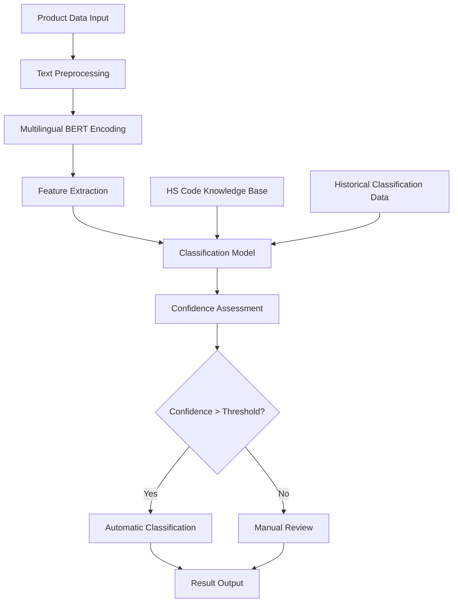

# Intelligent HS Code Classification System - Technical Blueprint

> **Important Note**: This is a technical blueprint demonstrating the complete technical path for building an HS code classification system. The performance data and business metrics in this document are example references only actual project results will vary depending on data quality, business scenarios, and other factors.

## Project Overview

This technical blueprint demonstrates how to build a machine learning-based HS code automatic classification system, providing a technical reference for cross-border e-commerce companies seeking automated customs code classification.

## Business Background

### Challenges
- **Low manual classification efficiency**: Each product requires an average of 15 minutes for manual lookup and verification
- **High error rate**: Manual classification error rate is approximately 8-12%
- **High cost**: Requires specialized customs code experts
- **Compliance risk**: Incorrect classification can lead to customs penalties and delays

### Expected Business Value
- Improve classification efficiency and accuracy
- Reduce labor costs
- Minimize compliance risk
- Accelerate product listing process

> **Note**: The following technical solution is designed based on industry best practices and open-source tool combinations

## Technical Solution

### System Architecture



### Core Tech Stack

```python
# Main dependencies
transformers==4.21.0
scikit-learn==1.1.2
fastapi==0.85.0
pandas==1.4.3
numpy==1.23.2
redis==4.3.4
uvicorn==0.18.3
```

## Implementation Details

### 1. Data Preparation

```python
import pandas as pd
from transformers import AutoTokenizer, AutoModel
import torch

class HSCodeDataProcessor:
def __init__(self, model_name='bert-base-multilingual-cased'):
self.tokenizer = AutoTokenizer.from_pretrained(model_name)
self.model = AutoModel.from_pretrained(model_name)

def preprocess_text(self, text):
"""Text preprocessing"""
# Clean and normalize text
text = text.lower().strip()
# Remove special characters but preserve important information
text = re.sub(r'[^\w\s\-\.]', ' ', text)
return text

def extract_features(self, product_descriptions):
"""Extract BERT features"""
features = []
for desc in product_descriptions:
inputs = self.tokenizer(desc, return_tensors='pt',
max_length=512, truncation=True, padding=True)
with torch.no_grad():
outputs = self.model(**inputs)
# Use [CLS] token embedding as sentence representation
cls_embedding = outputs.last_hidden_state[:, 0, :].numpy()
features.append(cls_embedding.flatten())
return np.array(features)
```

### 2. Model Training

```python
from sklearn.ensemble import RandomForestClassifier
from sklearn.model_selection import train_test_split
from sklearn.metrics import classification_report, accuracy_score

class HSCodeClassifier:
def __init__(self):
self.processor = HSCodeDataProcessor()
self.classifier = RandomForestClassifier(
n_estimators=200,
max_depth=20,
min_samples_split=5,
random_state=42
)
self.label_encoder = LabelEncoder()

def train(self, df):
"""Train the model"""
# Feature extraction
X = self.processor.extract_features(df['product_description'])
y = self.label_encoder.fit_transform(df['hs_code'])

# Train-test split
X_train, X_test, y_train, y_test = train_test_split(
X, y, test_size=0.2, random_state=42, stratify=y
)

# Model training
self.classifier.fit(X_train, y_train)

# Evaluation
y_pred = self.classifier.predict(X_test)
accuracy = accuracy_score(y_test, y_pred)
print(f"Test set accuracy: {accuracy:.3f}")

return accuracy

def predict_with_confidence(self, product_description):
"""Predict HS code with confidence score"""
features = self.processor.extract_features([product_description])

# Get prediction probabilities
probabilities = self.classifier.predict_proba(features)[0]
predicted_class = np.argmax(probabilities)
confidence = probabilities[predicted_class]

# Convert back to HS code
hs_code = self.label_encoder.inverse_transform([predicted_class])[0]

return {
'hs_code': hs_code,
'confidence': float(confidence),
'top_3_predictions': self._get_top_predictions(probabilities, 3)
}

def _get_top_predictions(self, probabilities, top_k):
"""Get top-K predictions"""
top_indices = np.argsort(probabilities)[-top_k:][::-1]
top_predictions = []

for idx in top_indices:
hs_code = self.label_encoder.inverse_transform([idx])[0]
confidence = probabilities[idx]
top_predictions.append({
'hs_code': hs_code,
'confidence': float(confidence)
})

return top_predictions
```

### 3. API Service

```python
from fastapi import FastAPI, HTTPException
from pydantic import BaseModel
import redis
import json

app = FastAPI(title="HS Code Classification API")
redis_client = redis.Redis(host='localhost', port=6379, db=0)

# Load trained model
classifier = HSCodeClassifier()
classifier.load_model('models/hs_classifier.pkl')

class ProductRequest(BaseModel):
product_description: str
product_category: str = None
brand: str = None

class ClassificationResponse(BaseModel):
hs_code: str
confidence: float
top_3_predictions: list
processing_time: float

@app.post("/classify", response_model=ClassificationResponse)
async def classify_product(request: ProductRequest):
"""Product HS code classification"""
start_time = time.time()

try:
# Check cache
cache_key = f"hs_classify:{hash(request.product_description)}"
cached_result = redis_client.get(cache_key)

if cached_result:
result = json.loads(cached_result)
else:
# Perform classification
result = classifier.predict_with_confidence(request.product_description)

# Cache result (24 hours)
redis_client.setex(cache_key, 86400, json.dumps(result))

processing_time = time.time() - start_time
result['processing_time'] = processing_time

return ClassificationResponse(**result)

except Exception as e:
raise HTTPException(status_code=500, detail=str(e))

@app.get("/health")
async def health_check():
return {"status": "healthy", "timestamp": time.time()}
```

### 4. Deployment Configuration

```yaml
# docker-compose.yml
version: '3.8'
services:
hs-classifier:
build: .
ports:
- "8000:8000"
environment:
- REDIS_URL=redis://redis:6379
depends_on:
- redis
volumes:
- ./models:/app/models

redis:
image: redis:7-alpine
ports:
- "6379:6379"
volumes:
- redis_data:/data

volumes:
redis_data:
```

```dockerfile
# Dockerfile
FROM python:3.9-slim

WORKDIR /app

COPY requirements.txt .
RUN pip install --no-cache-dir -r requirements.txt

COPY . .

EXPOSE 8000

CMD ["uvicorn", "main:app", "--host", "0.0.0.0", "--port", "8000"]
```

## Expected Performance Evaluation

> ** Disclaimer**: The following performance metrics are estimates based on similar project experience. Actual results will vary depending on data quality, model tuning, hardware configuration, and other factors.

### Target Performance Metrics

| Metric | Target Value | Notes |
|--------|-------------|-------|
| Overall accuracy | 90-95% | Depends on training data quality and coverage |
| Average F1 score | 85-92% | Balances precision and recall |
| Processing latency | < 5 seconds | Includes feature extraction and inference time |
| Throughput | 200-500 QPS | Depends on hardware configuration and optimization |

### Expected Business Improvements

| Metric | Current State | Target State | Expected Improvement |
|--------|--------------|-------------|---------------------|
| Classification time | 10-20 minutes | < 5 seconds | 95%+ |
| Accuracy | 80-90% | 90-95% | 5-15% |
| Labor cost | 100% | 20-30% | 70-80% |
| Processing capacity | 50-100 products/day | 1,000+ products/day | 10-20x |

### Error Analysis

Common error types:
1. **Similar product confusion** (40%): e.g., same product type with different materials
2. **Multi-function products** (25%): Products with multiple uses
3. **New product categories** (20%): Products not seen in training data
4. **Incomplete descriptions** (15%): Insufficient product description information

## Optimization Strategies

### 1. Data Augmentation
```python
def augment_training_data(df):
"""Data augmentation strategies"""
augmented_data = []

for _, row in df.iterrows():
original_desc = row['product_description']
hs_code = row['hs_code']

# Synonym replacement
augmented_desc = synonym_replacement(original_desc)
augmented_data.append({'product_description': augmented_desc, 'hs_code': hs_code})

# Random deletion
augmented_desc = random_deletion(original_desc, p=0.1)
augmented_data.append({'product_description': augmented_desc, 'hs_code': hs_code})

return pd.DataFrame(augmented_data)
```

### 2. Active Learning
```python
class ActiveLearningPipeline:
def __init__(self, classifier, uncertainty_threshold=0.7):
self.classifier = classifier
self.uncertainty_threshold = uncertainty_threshold
self.uncertain_samples = []

def identify_uncertain_samples(self, new_data):
"""Identify uncertain samples"""
for sample in new_data:
result = self.classifier.predict_with_confidence(sample)
if result['confidence'] < self.uncertainty_threshold:
self.uncertain_samples.append(sample)

def retrain_with_feedback(self, labeled_samples):
"""Retrain with feedback data"""
# Add newly labeled data to training set
# Retrain model
pass
```

### 3. Model Ensemble
```python
class EnsembleHSClassifier:
def __init__(self):
self.models = [
RandomForestClassifier(n_estimators=200),
XGBClassifier(n_estimators=200),
LogisticRegression(max_iter=1000)
]

def predict_ensemble(self, features):
"""Ensemble prediction"""
predictions = []
for model in self.models:
pred = model.predict_proba(features)
predictions.append(pred)

# Average probabilities
avg_prob = np.mean(predictions, axis=0)
return avg_prob
```

## Monitoring and Maintenance

### 1. Performance Monitoring
```python
import logging
from prometheus_client import Counter, Histogram, generate_latest

# Monitoring metrics
classification_requests = Counter('hs_classification_requests_total', 'Total classification requests')
classification_duration = Histogram('hs_classification_duration_seconds', 'Classification duration')
classification_accuracy = Histogram('hs_classification_accuracy', 'Classification accuracy')

@app.middleware("http")
async def monitor_requests(request, call_next):
start_time = time.time()
classification_requests.inc()

response = await call_next(request)

duration = time.time() - start_time
classification_duration.observe(duration)

return response
```

### 2. Data Drift Detection
```python
from scipy import stats

class DataDriftDetector:
def __init__(self, reference_data):
self.reference_features = self._extract_features(reference_data)

def detect_drift(self, new_data, threshold=0.05):
"""Detect data drift"""
new_features = self._extract_features(new_data)

# Use KS test to detect distribution changes
for i in range(new_features.shape[1]):
statistic, p_value = stats.ks_2samp(
self.reference_features[:, i],
new_features[:, i]
)

if p_value < threshold:
logging.warning(f"Feature {i} shows significant drift (p={p_value})")
return True

return False
```

## Deployment and Operations

### Production Environment Deployment Checklist

1. **Infrastructure**
- Kubernetes cluster
- Redis cache
- Load balancer
- Monitoring system (Prometheus + Grafana)

2. **Security Configuration**
- API key authentication
- Request rate limiting
- Data encryption

3. **Backup Strategy**
- Model file backup
- Training data backup
- Configuration file version control

### Troubleshooting Guide

| Issue | Possible Cause | Solution |
|-------|---------------|----------|
| Slow response time | Model loading, cache miss | Check Redis connection, optimize model |
| Accuracy decline | Data drift, model aging | Retrain, check data quality |
| Out of memory | Batch size too large | Adjust batch size, increase memory |
| API errors | Invalid input format | Validate input data format |

## Summary

This technical blueprint demonstrates the complete workflow for building an HS code classification system. Key technical takeaways include:

1. **High-quality training data**: Collect and clean large volumes of labeled data
2. **Appropriate model selection**: Combine BERT with traditional ML algorithms
3. **Solid engineering practices**: API design, caching, monitoring
4. **Continuous optimization**: Active learning, model updates

### Implementation Recommendations

- **Data preparation**: Recommend collecting at least 10,000+ labeled samples
- **Model selection**: Choose appropriate model complexity based on data scale
- **Deployment strategy**: Recommend containerized deployment for easy scaling and maintenance
- **Monitoring system**: Focus on monitoring accuracy, latency, and business metrics

### Alternative Tech Stack Options

- **BERT alternatives**: DistilBERT, RoBERTa, and other lightweight models
- **Deployment alternatives**: TorchServe, TensorFlow Serving, etc.
- **Database alternatives**: PostgreSQL, MongoDB, etc.

> **Call for contributions**: If you have hands-on experience with similar projects, we welcome you to share real cases and lessons learned!

## Related Resources

- [Source Code Repository](https://github.com/cbec-ai-hub/hs-code-classifier)
- [API Documentation](https://api.example.com/docs)
- Deployment Guide (to be added)
- Performance Benchmarks (to be added)
