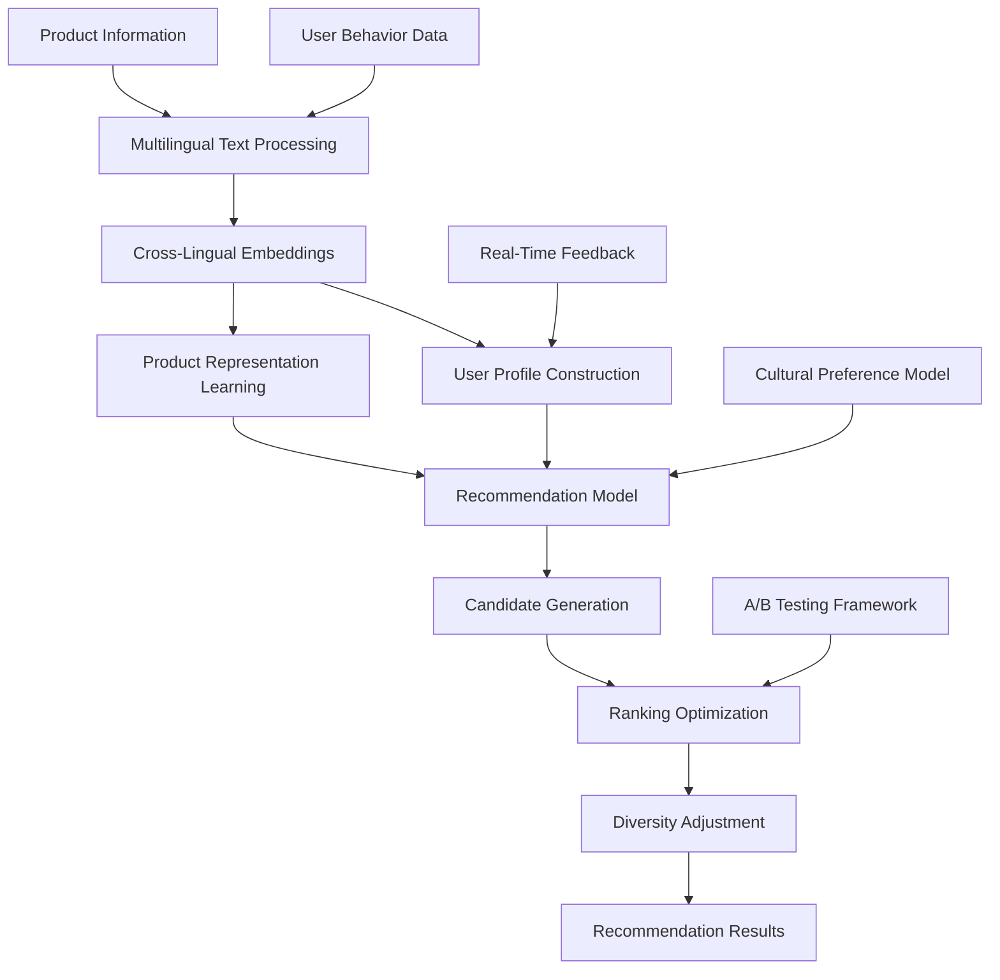

# Multilingual Product Recommendation System - Technical Blueprint

> **Important Note**: This is a technical blueprint demonstrating the complete technical architecture for building a multilingual recommendation system. The performance data and business metrics in this document are example references only — actual project results will vary depending on data distribution, user behavior, and other factors.

## Project Overview

This technical blueprint demonstrates how to build a product recommendation system that supports multiple languages and cross-cultural personalization, providing a technical reference for global e-commerce platforms.

## Business Background

### Challenges
- **Language barriers**: Users search and browse products in different languages
- **Cultural differences**: Purchasing preferences and behavior patterns vary significantly across regions
- **Cold-start problem**: New users and new products lack historical data
- **Data sparsity**: Cross-language and cross-region interaction data is sparse

### Expected Business Goals
- Improve user engagement and conversion rates
- Enhance user experience and satisfaction
- Expand product coverage
- Support global business expansion

> **Note**: The following technical solution is designed based on recommendation system best practices

## Technical Solution

### System Architecture



### Core Tech Stack

```python
# Main dependencies
lightfm==1.16
spacy==3.4.1
sentence-transformers==2.2.2
scikit-learn==1.1.2
pandas==1.4.3
numpy==1.23.2
mlflow==1.28.0
fastapi==0.85.0
redis==4.3.4
```

## Implementation Details

### 1. Multilingual Text Processing

```python
import spacy
from sentence_transformers import SentenceTransformer
import numpy as np

class MultilingualTextProcessor:
    def __init__(self):
        # Load multilingual models
        self.nlp_models = {
            'en': spacy.load('en_core_web_sm'),
            'zh': spacy.load('zh_core_web_sm'),
            'es': spacy.load('es_core_news_sm'),
            'fr': spacy.load('fr_core_news_sm'),
            'de': spacy.load('de_core_news_sm'),
            'ja': spacy.load('ja_core_news_sm')
        }
        
        # Multilingual sentence embedding model
        self.sentence_model = SentenceTransformer('paraphrase-multilingual-MiniLM-L12-v2')
    
    def detect_language(self, text):
        """Language detection"""
        from langdetect import detect
        try:
            return detect(text)
        except:
            return 'en'  # Default to English
    
    def preprocess_text(self, text, language=None):
        """Text preprocessing"""
        if language is None:
            language = self.detect_language(text)
        
        if language not in self.nlp_models:
            language = 'en'
        
        nlp = self.nlp_models[language]
        doc = nlp(text)
        
        # Extract keywords and entities
        keywords = [token.lemma_.lower() for token in doc 
                   if not token.is_stop and not token.is_punct and token.is_alpha]
        entities = [(ent.text, ent.label_) for ent in doc.ents]
        
        return {
            'keywords': keywords,
            'entities': entities,
            'language': language,
            'processed_text': ' '.join(keywords)
        }
    
    def get_text_embedding(self, text):
        """Get text embedding vector"""
        return self.sentence_model.encode([text])[0]
    
    def compute_text_similarity(self, text1, text2):
        """Compute text similarity"""
        emb1 = self.get_text_embedding(text1)
        emb2 = self.get_text_embedding(text2)
        return np.dot(emb1, emb2) / (np.linalg.norm(emb1) * np.linalg.norm(emb2))
```

### 2. Cross-Cultural User Modeling

```python
from lightfm import LightFM
from lightfm.data import Dataset
import pandas as pd

class CrossCulturalUserModel:
    def __init__(self):
        self.text_processor = MultilingualTextProcessor()
        self.cultural_features = {
            'US': {'individualism': 0.91, 'uncertainty_avoidance': 0.46, 'power_distance': 0.40},
            'CN': {'individualism': 0.20, 'uncertainty_avoidance': 0.30, 'power_distance': 0.80},
            'DE': {'individualism': 0.67, 'uncertainty_avoidance': 0.65, 'power_distance': 0.35},
            'JP': {'individualism': 0.46, 'uncertainty_avoidance': 0.92, 'power_distance': 0.54},
            'BR': {'individualism': 0.38, 'uncertainty_avoidance': 0.76, 'power_distance': 0.69}
        }
    
    def build_user_features(self, user_data):
        """Build user features"""
        features = []
        
        for _, user in user_data.iterrows():
            user_features = []
            
            # Basic features
            user_features.extend([
                f"age_group:{self._get_age_group(user['age'])}",
                f"gender:{user['gender']}",
                f"country:{user['country']}",
                f"language:{user['preferred_language']}"
            ])
            
            # Cultural dimension features
            if user['country'] in self.cultural_features:
                cultural = self.cultural_features[user['country']]
                for dim, value in cultural.items():
                    user_features.append(f"cultural_{dim}:{self._discretize(value)}")
            
            # Behavioral features
            user_features.extend([
                f"avg_order_value:{self._discretize_price(user['avg_order_value'])}",
                f"purchase_frequency:{self._get_frequency_group(user['purchase_frequency'])}",
                f"preferred_categories:{','.join(user['preferred_categories'])}"
            ])
            
            features.append(user_features)
        
        return features
    
    def build_item_features(self, product_data):
        """Build product features"""
        features = []
        
        for _, product in product_data.iterrows():
            item_features = []
            
            # Basic features
            item_features.extend([
                f"category:{product['category']}",
                f"brand:{product['brand']}",
                f"price_range:{self._discretize_price(product['price'])}",
                f"rating_range:{self._discretize_rating(product['avg_rating'])}"
            ])
            
            # Text features
            text_info = self.text_processor.preprocess_text(
                product['title'] + ' ' + product['description']
            )
            
            # Add keyword features
            for keyword in text_info['keywords'][:10]:  # Take top 10 keywords
                item_features.append(f"keyword:{keyword}")
            
            # Add language features
            item_features.append(f"content_language:{text_info['language']}")
            
            # Regional adaptability features
            if 'target_regions' in product:
                for region in product['target_regions']:
                    item_features.append(f"target_region:{region}")
            
            features.append(item_features)
        
        return features
    
    def _get_age_group(self, age):
        if age < 25: return "young"
        elif age < 35: return "adult"
        elif age < 50: return "middle_aged"
        else: return "senior"
    
    def _discretize(self, value, bins=5):
        return int(value * bins)
    
    def _discretize_price(self, price):
        if price < 20: return "low"
        elif price < 100: return "medium"
        elif price < 500: return "high"
        else: return "premium"
    
    def _discretize_rating(self, rating):
        if rating < 3.0: return "low"
        elif rating < 4.0: return "medium"
        else: return "high"
    
    def _get_frequency_group(self, frequency):
        if frequency < 2: return "occasional"
        elif frequency < 5: return "regular"
        else: return "frequent"
```

### 3. Recommendation Model Training

```python
class MultilingualRecommendationModel:
    def __init__(self, no_components=100, loss='warp', learning_rate=0.05):
        self.model = LightFM(
            no_components=no_components,
            loss=loss,
            learning_rate=learning_rate,
            random_state=42
        )
        self.dataset = Dataset()
        self.user_model = CrossCulturalUserModel()
        self.is_fitted = False
    
    def prepare_data(self, interactions_df, users_df, items_df):
        """Prepare training data"""
        # Build user and item features
        user_features = self.user_model.build_user_features(users_df)
        item_features = self.user_model.build_item_features(items_df)
        
        # Create dataset
        self.dataset.fit(
            users=interactions_df['user_id'].unique(),
            items=interactions_df['item_id'].unique(),
            user_features=set(feature for features in user_features for feature in features),
            item_features=set(feature for features in item_features for feature in features)
        )
        
        # Build interaction matrix
        (interactions, weights) = self.dataset.build_interactions(
            [(row['user_id'], row['item_id'], row['rating']) 
             for _, row in interactions_df.iterrows()]
        )
        
        # Build feature matrices
        user_features_matrix = self.dataset.build_user_features(
            [(users_df.iloc[i]['user_id'], user_features[i]) 
             for i in range(len(users_df))]
        )
        
        item_features_matrix = self.dataset.build_item_features(
            [(items_df.iloc[i]['item_id'], item_features[i]) 
             for i in range(len(items_df))]
        )
        
        return interactions, user_features_matrix, item_features_matrix
    
    def train(self, interactions_df, users_df, items_df, epochs=50):
        """Train the model"""
        interactions, user_features, item_features = self.prepare_data(
            interactions_df, users_df, items_df
        )
        
        # Train model
        self.model.fit(
            interactions,
            user_features=user_features,
            item_features=item_features,
            epochs=epochs,
            verbose=True
        )
        
        self.is_fitted = True
        return self
    
    def predict(self, user_id, item_ids, user_features=None, item_features=None):
        """Predict user preference scores for items"""
        if not self.is_fitted:
            raise ValueError("Model must be trained before making predictions")
        
        user_internal_id = self.dataset.mapping()[0][user_id]
        item_internal_ids = [self.dataset.mapping()[2][item_id] for item_id in item_ids]
        
        scores = self.model.predict(
            user_internal_id,
            item_internal_ids,
            user_features=user_features,
            item_features=item_features
        )
        
        return scores
    
    def recommend(self, user_id, n_items=10, filter_seen=True):
        """Generate recommendations for a user"""
        if not self.is_fitted:
            raise ValueError("Model must be trained before making recommendations")
        
        user_internal_id = self.dataset.mapping()[0][user_id]
        n_items_total = len(self.dataset.mapping()[2])
        
        scores = self.model.predict(
            user_internal_id,
            np.arange(n_items_total)
        )
        
        # Get top-N recommendations
        top_items = np.argsort(-scores)[:n_items]
        
        # Convert back to original IDs
        item_mapping = {v: k for k, v in self.dataset.mapping()[2].items()}
        recommended_items = [item_mapping[item] for item in top_items]
        recommended_scores = scores[top_items]
        
        return list(zip(recommended_items, recommended_scores))
```

### 4. Real-Time Recommendation Service

```python
from fastapi import FastAPI, HTTPException
from pydantic import BaseModel
import redis
import json
import time

app = FastAPI(title="Multilingual Recommendation API")
redis_client = redis.Redis(host='localhost', port=6379, db=0)

# Load trained model
recommendation_model = MultilingualRecommendationModel()
recommendation_model.load_model('models/multilingual_recommender.pkl')

class RecommendationRequest(BaseModel):
    user_id: str
    language: str = 'en'
    country: str = 'US'
    n_items: int = 10
    category_filter: list = None

class RecommendationResponse(BaseModel):
    user_id: str
    recommendations: list
    language: str
    processing_time: float
    model_version: str

@app.post("/recommend", response_model=RecommendationResponse)
async def get_recommendations(request: RecommendationRequest):
    """Get personalized recommendations"""
    start_time = time.time()
    
    try:
        # Check cache
        cache_key = f"rec:{request.user_id}:{request.language}:{request.country}"
        cached_result = redis_client.get(cache_key)
        
        if cached_result:
            recommendations = json.loads(cached_result)
        else:
            # Generate recommendations
            raw_recommendations = recommendation_model.recommend(
                request.user_id, 
                n_items=request.n_items * 2  # Generate more candidates for filtering
            )
            
            # Apply filters and diversity adjustments
            recommendations = await apply_filters_and_diversity(
                raw_recommendations, 
                request
            )
            
            # Cache results (1 hour)
            redis_client.setex(cache_key, 3600, json.dumps(recommendations))
        
        processing_time = time.time() - start_time
        
        return RecommendationResponse(
            user_id=request.user_id,
            recommendations=recommendations[:request.n_items],
            language=request.language,
            processing_time=processing_time,
            model_version="v1.2.0"
        )
    
    except Exception as e:
        raise HTTPException(status_code=500, detail=str(e))

async def apply_filters_and_diversity(recommendations, request):
    """Apply filters and diversity adjustments"""
    filtered_recs = []
    categories_seen = set()
    
    for item_id, score in recommendations:
        # Get item info
        item_info = await get_item_info(item_id)
        
        # Category filter
        if request.category_filter and item_info['category'] not in request.category_filter:
            continue
        
        # Diversity control: limit items from the same category
        if item_info['category'] in categories_seen and len([r for r in filtered_recs if r['category'] == item_info['category']]) >= 2:
            continue
        
        categories_seen.add(item_info['category'])
        
        # Localization adjustments
        localized_info = await localize_item_info(item_info, request.language, request.country)
        
        filtered_recs.append({
            'item_id': item_id,
            'score': float(score),
            'title': localized_info['title'],
            'description': localized_info['description'],
            'price': localized_info['price'],
            'currency': localized_info['currency'],
            'category': item_info['category'],
            'image_url': item_info['image_url'],
            'rating': item_info['rating'],
            'availability': localized_info['availability']
        })
    
    return filtered_recs

async def get_item_info(item_id):
    """Get item information"""
    # Retrieve item info from database or cache
    cache_key = f"item:{item_id}"
    cached_info = redis_client.get(cache_key)
    
    if cached_info:
        return json.loads(cached_info)
    
    # Query from database (simplified here)
    item_info = {
        'item_id': item_id,
        'title': 'Sample Product',
        'description': 'Sample Description',
        'category': 'Electronics',
        'price': 99.99,
        'currency': 'USD',
        'rating': 4.5,
        'image_url': 'https://example.com/image.jpg'
    }
    
    # Cache item info
    redis_client.setex(cache_key, 7200, json.dumps(item_info))
    
    return item_info

async def localize_item_info(item_info, language, country):
    """Localize item information"""
    localized_info = item_info.copy()
    
    # Price localization
    if country != 'US':
        localized_info['price'] = await convert_currency(item_info['price'], 'USD', get_currency(country))
        localized_info['currency'] = get_currency(country)
    
    # Text localization (simplified; should call translation service in production)
    if language != 'en':
        localized_info['title'] = await translate_text(item_info['title'], 'en', language)
        localized_info['description'] = await translate_text(item_info['description'], 'en', language)
    
    # Availability check
    localized_info['availability'] = await check_availability(item_info['item_id'], country)
    
    return localized_info

def get_currency(country):
    """Get currency for a country"""
    currency_map = {
        'US': 'USD', 'CN': 'CNY', 'DE': 'EUR', 
        'JP': 'JPY', 'GB': 'GBP', 'BR': 'BRL'
    }
    return currency_map.get(country, 'USD')

async def convert_currency(amount, from_currency, to_currency):
    """Currency conversion (simplified implementation)"""
    # Should call exchange rate API in production
    rates = {'USD': 1.0, 'CNY': 6.8, 'EUR': 0.85, 'JPY': 110, 'GBP': 0.75, 'BRL': 5.2}
    return amount * rates.get(to_currency, 1.0) / rates.get(from_currency, 1.0)

async def translate_text(text, from_lang, to_lang):
    """Text translation (simplified implementation)"""
    # Should call translation API in production
    return f"[{to_lang}] {text}"

async def check_availability(item_id, country):
    """Check product availability in a specific country"""
    # Should check inventory and shipping policies in production
    return True

@app.get("/health")
async def health_check():
    return {"status": "healthy", "timestamp": time.time()}
```

## Expected Performance Evaluation

> **⚠️ Disclaimer**: The following performance metrics are estimates based on recommendation system research and industry experience. Actual results will vary significantly depending on data quality, user behavior patterns, business scenarios, and other factors.

### Target Offline Evaluation Metrics

| Metric | Target Range | Notes |
|--------|-------------|-------|
| Precision@10 | 0.10-0.20 | Depends on data sparsity and model complexity |
| Recall@10 | 0.05-0.15 | Limited by candidate set size and user interest breadth |
| NDCG@10 | 0.15-0.30 | Comprehensive metric considering ranking quality |
| Coverage | 0.60-0.80 | Proportion of products covered by the recommendation system |
| Diversity | 0.70-0.85 | Degree of diversity in recommendation results |

### Expected Online Performance

| Metric | Baseline | Target Improvement | Notes |
|--------|----------|-------------------|-------|
| Click-through rate (CTR) | Baseline | +15-30% | Depends on baseline system quality |
| Conversion rate | Baseline | +10-25% | Affected by product quality and pricing |
| Average order value | Baseline | +5-15% | Achieved through cross-selling |
| User satisfaction | Baseline | +0.2-0.5 points | Requires user survey validation |
| Page dwell time | Baseline | +20-40% | Reflects user engagement |

### Multilingual Performance Expectations

| Language | Data Sufficiency | Expected Precision@10 | Challenges |
|----------|-----------------|----------------------|------------|
| English | High | 0.15-0.20 | Intense competition, high user expectations |
| Chinese | High | 0.12-0.18 | Cultural differences, regional preferences |
| Spanish | Medium | 0.10-0.15 | Large regional variations |
| French | Medium | 0.08-0.14 | Relatively sparse data |
| German | Medium | 0.08-0.14 | Conservative user behavior |
| Japanese | Low | 0.06-0.12 | Strong cultural specificity |

## Optimization Strategies

### 1. Cold-Start Problem Solutions

```python
class ColdStartHandler:
    def __init__(self, recommendation_model):
        self.model = recommendation_model
        self.popularity_model = PopularityBasedRecommender()
        self.content_model = ContentBasedRecommender()
    
    def handle_new_user(self, user_profile):
        """Handle new user cold-start"""
        # Demographic-based recommendations
        demographic_recs = self.get_demographic_recommendations(user_profile)
        
        # Location-based popular product recommendations
        popular_recs = self.popularity_model.recommend_by_region(
            user_profile['country'], 
            user_profile['language']
        )
        
        # Blended recommendations
        return self.blend_recommendations([demographic_recs, popular_recs], [0.6, 0.4])
    
    def handle_new_item(self, item_info):
        """Handle new product cold-start"""
        # Content-based similar product recommendations
        similar_items = self.content_model.find_similar_items(item_info)
        
        # Category-based recommendation strategy
        category_strategy = self.get_category_strategy(item_info['category'])
        
        return {
            'similar_items': similar_items,
            'promotion_strategy': category_strategy
        }
```

### 2. Real-Time Personalization

```python
class RealTimePersonalization:
    def __init__(self):
        self.session_tracker = SessionTracker()
        self.real_time_updater = RealTimeModelUpdater()
    
    def update_recommendations(self, user_id, interaction_data):
        """Update recommendations based on real-time interactions"""
        # Update user session state
        session_state = self.session_tracker.update_session(user_id, interaction_data)
        
        # Dynamically adjust recommendation weights
        adjusted_weights = self.calculate_dynamic_weights(session_state)
        
        # Re-rank recommendation results
        return self.rerank_recommendations(user_id, adjusted_weights)
    
    def calculate_dynamic_weights(self, session_state):
        """Calculate dynamic weights"""
        weights = {
            'popularity': 0.3,
            'collaborative': 0.4,
            'content': 0.2,
            'trending': 0.1
        }
        
        # Adjust weights based on session behavior
        if session_state['browse_time'] > 300:  # Extended browsing
            weights['content'] += 0.1
            weights['popularity'] -= 0.1
        
        if session_state['category_focus']:  # Focused on specific category
            weights['content'] += 0.15
            weights['collaborative'] -= 0.15
        
        return weights
```

### 3. Multi-Objective Optimization

```python
class MultiObjectiveOptimizer:
    def __init__(self):
        self.objectives = {
            'relevance': 0.4,
            'diversity': 0.2,
            'novelty': 0.15,
            'business_value': 0.25
        }
    
    def optimize_recommendations(self, candidate_items, user_profile):
        """Multi-objective optimization of recommendation results"""
        scores = {}
        
        for item in candidate_items:
            scores[item['item_id']] = {
                'relevance': self.calculate_relevance_score(item, user_profile),
                'diversity': self.calculate_diversity_score(item, candidate_items),
                'novelty': self.calculate_novelty_score(item, user_profile),
                'business_value': self.calculate_business_value(item)
            }
        
        # Calculate composite scores
        final_scores = {}
        for item_id, item_scores in scores.items():
            final_score = sum(
                item_scores[obj] * weight 
                for obj, weight in self.objectives.items()
            )
            final_scores[item_id] = final_score
        
        # Sort and return
        sorted_items = sorted(
            candidate_items, 
            key=lambda x: final_scores[x['item_id']], 
            reverse=True
        )
        
        return sorted_items
```

## Deployment and Monitoring

### Production Environment Architecture

```yaml
# kubernetes-deployment.yml
apiVersion: apps/v1
kind: Deployment
metadata:
  name: multilingual-recommender
spec:
  replicas: 3
  selector:
    matchLabels:
      app: multilingual-recommender
  template:
    metadata:
      labels:
        app: multilingual-recommender
    spec:
      containers:
      - name: recommender-api
        image: cbec-ai/multilingual-recommender:v1.2.0
        ports:
        - containerPort: 8000
        env:
        - name: REDIS_URL
          value: "redis://redis-service:6379"
        - name: MODEL_PATH
          value: "/models/multilingual_recommender.pkl"
        resources:
          requests:
            memory: "2Gi"
            cpu: "1000m"
          limits:
            memory: "4Gi"
            cpu: "2000m"
        volumeMounts:
        - name: model-storage
          mountPath: /models
      volumes:
      - name: model-storage
        persistentVolumeClaim:
          claimName: model-pvc
---
apiVersion: v1
kind: Service
metadata:
  name: recommender-service
spec:
  selector:
    app: multilingual-recommender
  ports:
  - port: 80
    targetPort: 8000
  type: LoadBalancer
```

### Monitoring Metrics

```python
from prometheus_client import Counter, Histogram, Gauge

# Business metrics
recommendation_requests = Counter('recommendation_requests_total', 'Total recommendation requests', ['language', 'country'])
recommendation_ctr = Gauge('recommendation_ctr', 'Click-through rate', ['language'])
recommendation_conversion = Gauge('recommendation_conversion_rate', 'Conversion rate', ['language'])

# Technical metrics
recommendation_latency = Histogram('recommendation_latency_seconds', 'Recommendation latency')
model_accuracy = Gauge('model_accuracy', 'Model accuracy score', ['metric'])
cache_hit_rate = Gauge('cache_hit_rate', 'Cache hit rate')

@app.middleware("http")
async def monitor_requests(request, call_next):
    start_time = time.time()
    
    response = await call_next(request)
    
    # Record latency
    latency = time.time() - start_time
    recommendation_latency.observe(latency)
    
    return response
```

## Summary

This technical blueprint demonstrates the complete technical path for building a multilingual product recommendation system. Key technical takeaways include:

1. **Multilingual support**: Using advanced multilingual NLP models
2. **Cultural adaptation**: Integrating cultural dimension features
3. **Cold-start handling**: Multi-strategy solutions for new users and new products
4. **Real-time optimization**: Adjusting recommendations in real-time based on user behavior
5. **Multi-objective balancing**: Finding the right balance between relevance, diversity, and business value

### Implementation Recommendations

- **Data collection**: Recommend collecting at least 100K+ user interaction data points per language
- **Model training**: Consider transfer learning from data-rich languages to data-sparse languages
- **A/B testing**: Recommend at least 4 weeks of A/B testing to validate results
- **Monitoring system**: Focus on monitoring performance differences across languages and regions

### Alternative Tech Stack Options

- **Recommendation algorithms**: Neural Collaborative Filtering, DeepFM, and other deep learning methods
- **Multilingual models**: XLM-R, mBERT, and other pre-trained models
- **Real-time serving**: Apache Kafka + Apache Flink for real-time computation
- **Feature store**: Feast, Tecton, and other feature store systems

### Potential Challenges

- **Data imbalance**: Significant differences in data volume across languages
- **Cultural differences**: Requires deep understanding of user behavior patterns in each region
- **Cold-start**: Difficult to guarantee recommendation quality for new markets and new users
- **Latency**: Controlling latency for large-scale multilingual recommendations

> **Call for contributions**: If you have hands-on experience with multilingual recommendation systems, we welcome you to share real cases, challenges encountered, and solutions!

## Related Resources

- [Source Code Repository](https://github.com/cbec-ai-hub/multilingual-recommender)
- [Model Training Notebooks](https://github.com/cbec-ai-hub/multilingual-recommender/blob/main/notebooks/model_training.ipynb)
- [API Documentation](https://api.example.com/recommender/docs)
- [Performance Benchmarks](https://github.com/cbec-ai-hub/multilingual-recommender/blob/main/benchmarks/)
