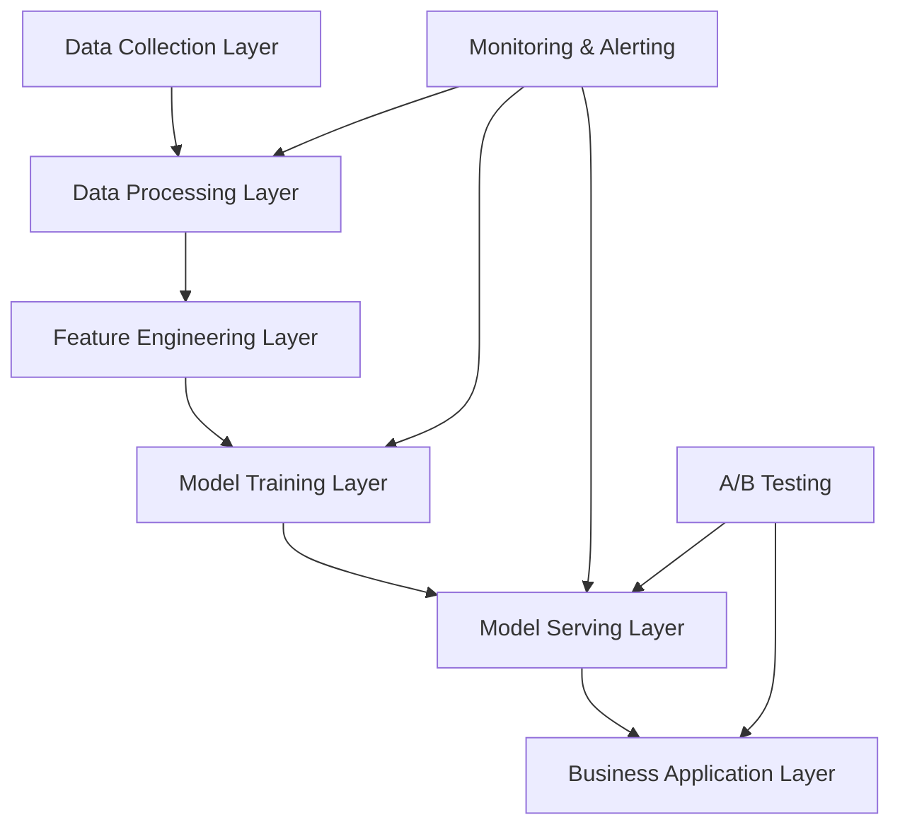

# Cross-Border E-Commerce AI Technical Implementation Guide

This document provides technical architecture, performance benchmarks, and implementation recommendations for cross-border e-commerce AI projects. It is applicable to technical solution design and evaluation for case studies.

## Technical Architecture Patterns

### General Architecture Components

### Architecture Layer Descriptions

**Data Collection Layer**
- Multi-channel data ingestion (e-commerce platforms, ERP, CRM, etc.)
- Real-time and batch data processing
- Data quality monitoring and cleansing

**Data Processing Layer**
- ETL/ELT pipelines
- Data warehouse and data lake
- Data version control and lineage tracking

**Feature Engineering Layer**
- Feature extraction and transformation
- Feature store and management
- Feature monitoring and drift detection

**Model Training Layer**
- Model development and training
- Hyperparameter optimization
- Model validation and evaluation

**Model Serving Layer**
- Model deployment and inference
- Load balancing and auto-scaling
- A/B testing and canary releases

**Business Application Layer**
- API interfaces and SDKs
- User interfaces and dashboards
- Business process integration

### Key Technology Selection Principles

1. **Scalability**: Support rapid business growth
- Horizontal scaling capability
- Microservices architecture
- Cloud-native design

2. **Multilingual Support**: Adapt to globalization needs
- Internationalization frameworks
- Multilingual NLP models
- Localized data processing

3. **Real-Time Performance**: Meet real-time business decision needs
- Stream data processing
- Low-latency inference
- Cache strategy optimization

4. **Explainability**: Meet compliance and audit requirements
- Model explainability
- Transparent decision processes
- Complete audit logs

5. **Cost Efficiency**: Balance performance and cost
- Optimized resource allocation
- Automated operations
- Cost monitoring and control

## Performance Benchmarks

### Model Performance Metrics

<table width="100%">
<tr>
<th>Task Type</th>
<th>Accuracy Target</th>
<th>Latency Requirement</th>
<th>Throughput</th>
<th>Notes</th>
</tr>
<tr>
<td>Text Classification</td>
<td>> 90%</td>
<td>< 100ms</td>
<td>1000 QPS</td>
<td>Product categorization, sentiment analysis</td>
</tr>
<tr>
<td>Recommendation System</td>
<td>CTR > 3%</td>
<td>< 50ms</td>
<td>5000 QPS</td>
<td>Product recommendations, personalization</td>
</tr>
<tr>
<td>Time Series Forecasting</td>
<td>MAPE < 20%</td>
<td>< 1s</td>
<td>100 QPS</td>
<td>Demand forecasting, inventory optimization</td>
</tr>
<tr>
<td>Anomaly Detection</td>
<td>F1 > 95%</td>
<td>< 10ms</td>
<td>10000 QPS</td>
<td>Fraud detection, risk management</td>
</tr>
<tr>
<td>Image Recognition</td>
<td>> 95%</td>
<td>< 200ms</td>
<td>500 QPS</td>
<td>Product identification, quality inspection</td>
</tr>
</table>

### Infrastructure Requirements

**Compute Resources**
- **Minimum configuration**: 2 cores, 4GB RAM
- **Recommended configuration**: 8 cores, 16GB RAM
- **High-performance configuration**: 16 cores, 32GB RAM + GPU

**Storage Requirements**
- **System disk**: SSD, minimum 100GB
- **Data disk**: Based on data volume, SSD recommended
- **Backup**: Off-site backup, 30-day retention

**Network Requirements**
- **Bandwidth**: Minimum 100Mbps, recommended 1Gbps
- **Latency**: Internal network latency < 1ms
- **Availability**: 99.9% or higher

**Containerization Support**
- **Docker**: Supports containerized deployment
- **Kubernetes**: Supports cluster management
- **Service Mesh**: Microservices governance with Istio, etc.

## Continuous Improvement

### Model Iteration Process

1. **Data Collection**: Continuously collect business feedback data
- User behavior data
- Business metric data
- System performance data

2. **Performance Monitoring**: Real-time monitoring of model performance metrics
- Accuracy monitoring
- Latency monitoring
- Resource usage monitoring

3. **A/B Testing**: Compare new models against existing models
- Traffic allocation strategy
- Statistical significance testing
- Business metric comparison

4. **Progressive Deployment**: Canary releases to reduce risk
- Canary deployment
- Blue-green deployment
- Rollback mechanisms

5. **Impact Assessment**: Dual evaluation of business and technical metrics
- ROI calculation
- User satisfaction
- System stability

### Quality Assurance

**Code Quality**
- Code review process
- Unit test coverage > 80%
- Integration testing and end-to-end testing

**Data Quality**
- Data validation rules
- Data quality monitoring
- Anomalous data handling

**Model Quality**
- Model validation framework
- Performance benchmark testing
- Model bias detection

## Security & Compliance

### Data Security
- Data encryption (in transit and at rest)
- Access control and permission management
- Data masking and anonymization

### Privacy Protection
- GDPR compliance
- Data minimization principle
- User consent management

### System Security
- Network security protection
- Vulnerability scanning and remediation
- Security audit logs

## Reference Resources

### Technical Documentation
- [AWS Machine Learning Best Practices](https://docs.aws.amazon.com/wellarchitected/latest/machine-learning-lens/)
- [Google Cloud AI Platform Guide](https://cloud.google.com/ai-platform/docs)
- [MLOps Maturity Model](https://docs.microsoft.com/en-us/azure/architecture/example-scenario/mlops/mlops-maturity-model)

### Open-Source Tools
- [MLflow](https://mlflow.org/) - Machine learning lifecycle management
- [Kubeflow](https://www.kubeflow.org/) - ML workflows on Kubernetes
- [DVC](https://dvc.org/) - Data version control

---

**Usage Notes**: This guide provides technical reference for case studies. Please adjust based on business requirements and resource constraints during actual implementation. For questions, refer to specific examples in the [Case Studies](case-studies.md) or [submit an issue](https://github.com/kangise/ecommerce-ai-roadmap/issues).
