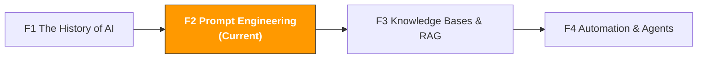

[🇨🇳 中文](../../paths/0-foundations/f2-prompt-engineering.md) | 🇺🇸 English

# F2. Prompt Engineering

> **Path**: Path 0: AI Foundations · **Module**: F2
> **Last Updated**: 2026-03-12
> **Difficulty**: Beginner → Intermediate
> **Estimated Time**: 3 hours
> **Prerequisite**: [F1 The History of AI](f1-ai-evolution.md)

---

[Hub Home](../../README.md) · [Path 0 Overview](README.md)



---

## Module Navigation

1. [Why Prompts Matter](#1-why-prompts-matter) · 2. [The CRISP Framework](#2-the-crisp-framework-a-methodology-for-structured-prompts) · 3. [Six Advanced Techniques](#3-six-advanced-prompt-techniques) · 4. [Scenario Template Library](#4-cross-border-e-commerce-prompt-template-library-20) · 5. [Common Mistakes & Fixes](#5-common-mistakes--fixes) · 6. [Advanced: Context Engineering](#6-advanced-from-prompt-engineering-to-context-engineering) · 7. [Learning Resources](#7-learning-resources) · 8. [ OpenClaw Automation](#8-using-openclaw-for-prompt-management--optimization) · 9. [Completion Checklist](#9-completion-checklist)


## What You'll Learn in This Module

Your prompt is the only interface between you and AI. With the same AI model, the difference between a good prompt and a bad one can mean a 10x gap in output quality.

After completing this module, you'll be able to:
- Write structured, high-quality prompts using the CRISP framework
- Master 6 advanced prompt techniques (Chain-of-Thought, Few-shot, etc.)
- Have 20+ ready-to-use prompt templates for cross-border e-commerce scenarios
- Identify common prompt mistakes and know how to fix them
- Understand the evolution from Prompt Engineering to Context Engineering

> **Core Concept**: Prompt Engineering isn't about "writing one good instruction" it's about "designing a complete communication protocol." What you give AI isn't just a question, but a full definition of role, context, constraints, format, and expectations.

---

## 1. Why Prompts Matter

### 1.1 Same Question, Different Prompts A Side-by-Side Comparison

**Scenario: Analyzing Competitor Reviews**

**Bad Prompt:**
```
帮我分析这些 Review
```

**AI Output:** A vague, unstructured summary with no actionable advice.

**Good Prompt:**
```
你是一个资深的 Amazon 产品经理，专注于消费电子品类。
我会给你一组竞品蓝牙耳机的 1-3 星差评（共 50 条）。

请分析这些差评，输出：
1. 排名前 5 的用户痛点（按提及频率排序）
2. 每个痛点的代表性评论原文（1-2 条）
3. 每个痛点的改进建议
4. 哪些痛点最容易通过产品设计解决

输出格式：表格
语言：中文

[在此粘贴差评内容]
```

**AI Output:** A structured table with pain points ranked by frequency, each with original review quotes and actionable improvement suggestions.

**Where's the Gap?**

| Dimension | Bad Prompt | Good Prompt |
|-----------|-----------|-------------|
| Role Definition | None | "Senior Amazon Product Manager" |
| Context | None | "Consumer electronics category," "Bluetooth earbuds," "1-3 star reviews" |
| Specific Requirements | "Analyze" | 4 clearly defined output requirements |
| Output Format | None | "Table" |
| Language Specified | None | "Chinese" |

### 1.2 The Essence of Prompts: Reducing AI's "Guessing Space"

Recall from F1: an LLM is a "next-token predictor." When your prompt is vague, AI has too many possible directions and will default to the "most common" one which usually means generic, surface-level output.

When your prompt is precise, you narrow AI's "guessing space" down to exactly the direction you want.

```
模糊 Prompt → AI 的可能输出空间很大 → 大概率输出平庸的结果
精确 Prompt → AI 的可能输出空间很小 → 大概率输出你想要的结果
```

Think of it like assigning a task to a new employee:
- "Make me a report" → They have no idea what kind of report, who it's for, what format, or when it's due
- "Make me a Q1 sales analysis report for the boss, in PPT format, including YoY growth and Top 10 products, due by Friday" → Now they know exactly what to do

### 1.3 The ROI of Prompt Engineering

| Investment | Return |
|------------|--------|
| Spend 2 extra minutes writing a prompt | Save 20 minutes fixing AI output |
| Build a prompt template library (one-time, 2 hours) | Save each team member 30 minutes per day |
| Learn the CRISP framework (this module, 3 hours) | 50%+ improvement in all AI interactions |

---

## 2. The CRISP Framework: A Methodology for Structured Prompts

### 2.1 What Is CRISP

CRISP is a framework to help you write high-quality prompts. The 5 letters stand for 5 elements:

```
C Context: Give AI enough background information
R Role: Define what role AI should play
I Instructions: Clearly tell AI what to do
S Specifications: Define the output format, length, language, etc.
P Proof: Ask AI to provide evidence or explain its reasoning
```

### 2.2 Each Element in Detail

**C Context**

Tell AI "what situation you're asking this question in." The richer the context, the more accurate the response.

| No Context | With Context |
|------------|-------------|
| "Write me a product title" | "I sell a portable neck fan on Amazon US, targeting outdoor sports enthusiasts, priced at $25, main competitors are JISULIFE and TORRAS" |

**Context Checklist (Cross-Border E-Commerce):**
- What's the product? Category, features, selling points
- Target market? US/EU/JP
- Target customer? Age, use case, needs
- Who are the competitors? Price range, strengths/weaknesses
- Your constraints? Budget, timeline, resources

**R Role**

Give AI a professional role, and it will respond using that role's knowledge and perspective.

| Scenario | Recommended Role |
|----------|-----------------|
| Writing a Listing | "You are an Amazon Listing optimization expert with 5 years of experience" |
| Analyzing Reviews | "You are a senior product manager specializing in consumer electronics" |
| Ad Optimization | "You are an Amazon PPC advertising expert" |
| Compliance Queries | "You are a cross-border e-commerce compliance consultant familiar with EU/US/JP regulations" |
| Supplier Negotiation | "You are a procurement manager with 10 years of experience" |
| Market Analysis | "You are an e-commerce industry analyst" |

> **Why Do Roles Work?** Because AI's training data includes text from different professional roles. When you specify "Amazon PPC expert," AI tends to use PPC-related terminology and analytical frameworks.

**I Instructions**

Clearly tell AI what to do. Good instructions are specific, actionable, and prioritized.

| Vague Instruction | Specific Instruction |
|-------------------|---------------------|
| "Analyze this data" | "From this search term data, find keywords with ACOS > 50% and clicks > 100, sorted by spend from high to low" |
| "Write a title" | "Write 3 Amazon product title variations, each ≤ 200 characters, including keywords [X], [Y], [Z]" |
| "Give me suggestions" | "Give 3 specific improvement suggestions, each including: problem description, improvement plan, expected outcome" |

**S Specifications**

Define what the output should "look like."

| Spec Type | Example |
|-----------|---------|
| Format | "Output as a table," "Use Markdown format," "Use a numbered list" |
| Length | "Each point no more than 50 words," "Total word count 500-800" |
| Language | "Answer in Chinese," "Write the Listing in English, write the analysis in Chinese" |
| Tone | "Professional but easy to understand," "Suitable for Amazon buyers to read" |
| Structure | "Give the conclusion first, then the analysis," "Rank by priority from high to low" |

**P Proof**

Ask AI to explain its reasoning or provide evidence to reduce hallucinations.

```
验证要求示例：
- "请解释你的推理过程"
- "请标注每个建议的依据"
- "如果你不确定某个信息，请明确标注"
- "请区分'基于数据的结论'和'基于经验的推测'"
```

### 2.3 Full CRISP Example

**Scenario: Evaluating Whether a New Category Is Worth Entering**

```
【C - Context 背景】
我是一个 Amazon US 卖家，目前主营消费电子品类，
年销售额约 $500K，团队 5 人。
我在考虑进入便携式投影仪品类。
目前 Amazon US 上这个品类的头部卖家有 XGIMI、Anker Nebula、YABER。
我的启动预算约 ¥30 万。

【R - Role 角色】
你是一个有 10 年经验的跨境电商选品顾问，
精通 Amazon US 市场的消费电子品类。

【I - Instructions 指令】
请对便携式投影仪品类做一个全面的市场可行性评估，包含：
1. 市场规模和增长趋势
2. 竞争格局分析（头部卖家的优劣势）
3. 利润空间估算
4. 进入壁垒（资金、技术、认证）
5. 主要风险
6. Go/No-Go 建议

【S - Specifications 规格】
- 输出格式：每个维度用表格 + 简要分析
- 语言：中文
- 评分：每个维度 1-5 分
- 最后给出综合评分和明确的建议（进入/谨慎/放弃）

【P - Proof 验证】
- 请标注哪些信息是基于公开数据，哪些是你的推测
- 如果某个维度你不确定，请明确说明
- 请解释综合评分的计算逻辑
```

> **You don't need to label [C][R][I][S][P] in actual use** that's just for teaching purposes here. Once you're comfortable, you'll naturally weave all 5 elements into your prompts.


---

## 3. Six Advanced Prompt Techniques

### 3.1 Chain-of-Thought (CoT)

Have AI "think step by step" instead of jumping straight to an answer. Best for complex problems that require reasoning.

**Without CoT:**
```
这个产品在 Amazon US 的利润率是多少？
采购成本 ¥80，售价 $29.99，FBA 费用 $5.50，佣金 15%
```
AI might give you a single number, but the calculation process is opaque and error-prone.

**With CoT:**
```
请一步一步计算这个产品在 Amazon US 的利润率：
1. 先把采购成本从人民币换算成美元（汇率 7.2）
2. 计算 Amazon 佣金
3. 汇总所有成本
4. 计算利润和利润率

数据：采购成本 ¥80，售价 $29.99，FBA 费用 $5.50，佣金率 15%
```

**Why It Works:** It forces AI to show intermediate steps, and each step can be verified. If one step is wrong, you'll spot it immediately.

**Best Use Cases:**
- Profit calculations, cost analysis
- Multi-step market assessments
- Decision problems requiring logical reasoning
- Any analysis where you need to "see the work"

### 3.2 Few-shot Learning

Give AI a few examples so it learns the output format and style you want.

```
请按以下格式分析每个竞品的 Listing 标题策略：

示例：
标题：Anker Soundcore Life Q20 Hybrid Active Noise Cancelling Headphones
分析：
- 品牌前置（Anker Soundcore）→ 品牌认知度高，放在最前
- 核心卖点（Hybrid Active Noise Cancelling）→ 技术差异化
- 品类词（Headphones）→ 确保搜索匹配
- 策略：品牌 + 技术卖点 + 品类词

现在请用同样的格式分析以下 3 个标题：
1. [竞品A标题]
2. [竞品B标题]
3. [竞品C标题]
```

**Why It Works:** Examples are more precise than descriptions. Instead of spending 100 words describing the format you want, just show one example.

**Best Practices:**
- 1-3 examples are usually enough
- Examples should cover different cases (positive/negative, simple/complex)
- The format of your examples is the format you'll get back

### 3.3 Role-Playing

Have AI take on specific roles and analyze problems from each role's perspective.

```
请分别从以下 3 个角色的视角评估这个产品：

角色 1 挑剔的消费者：
"我是一个经常在 Amazon 购物的消费者，对产品质量要求很高，
会仔细看差评。这个产品的 Listing 能说服我购买吗？"

角色 2 竞品运营经理：
"我是竞品公司的运营经理，看到这个新产品进入市场。
它对我的产品有威胁吗？我应该如何应对？"

角色 3 Amazon 品类经理：
"我是 Amazon 的品类经理，负责审核这个品类的产品。
这个 Listing 有没有违规风险？质量评分如何？"
```

**Why It Works:** Multi-role analysis helps you uncover issues that a single perspective would easily miss.

### 3.4 Structured Output

Explicitly ask AI to output in a specific format for easier downstream processing and comparison.

```
请用以下 JSON 格式输出分析结果：

{
"product_name": "产品名称",
"market_score": 1-5,
"competition_score": 1-5,
"profit_score": 1-5,
"risk_factors": ["风险1", "风险2"],
"recommendation": "进入/谨慎/放弃",
"reasoning": "推荐理由"
}
```

**Best Use Cases:**
- Batch evaluations across multiple products
- Data that needs to be imported into Excel or a database
- Standardizing analysis formats across a team

### 3.5 Iterative Refinement

Don't expect a perfect result from a single prompt. Treat AI as a collaborator and refine through multiple rounds of conversation.

```
第 1 轮：
"帮我写一个蓝牙耳机的 Amazon 标题"

第 2 轮：
"不错，但请加入'降噪'这个关键词，并把标题控制在 150 字符以内"

第 3 轮：
"很好。现在请生成 3 个变体，分别侧重：
A. 技术参数（降噪 dB、续航时间）
B. 使用场景（通勤、运动、办公）
C. 情感诉求（享受音乐、专注工作）"

第 4 轮：
"我选 B 方向。请进一步优化，加入'2026 新款'和'Type-C 快充'"
```

**Why It Works:** Complex tasks are hard to describe perfectly in one go. Iteration lets you adjust direction after seeing AI's output.

### 3.6 Constraint Setting

Telling AI "what NOT to do" is just as important as telling it "what to do."

```
请帮我写 Amazon Listing 的 5 个 Bullet Points。

约束条件：
- 不要使用夸张词汇（如"最好的"、"完美的"、"革命性的"）
- 不要提及竞品品牌名
- 不要使用 HTML 标签
- 每个 Bullet 不超过 200 字符
- 不要重复关键词
- 不要使用全大写字母（除品牌名外）
```

**Common Constraint Checklist (Cross-Border E-Commerce):**

| Constraint Type | Example |
|----------------|---------|
| Content | "Don't fabricate data," "Don't make unverified claims" |
| Format | "No more than X words," "Use tables instead of paragraphs" |
| Compliance | "Don't make medical claims," "Don't mention competitor brands" |
| Style | "Don't use academic tone," "Don't use Chinglish" |
| Safety | "If unsure, say so instead of guessing" |

---

## 4. Cross-Border E-Commerce Prompt Template Library (20+)

> **Related Reading**: [A2 Listing & Content Creation](../a-operators/a2-listing-optimization.md#a2-listing-content-creation) See A2 for detailed e-commerce Listing prompt templates

> The full standardized templates are stored in the [prompts/](../../prompts/) directory. This section provides quick-reference versions.

### 4.1 Product Selection & Market Analysis (5 Templates)

**Template 1: Competitor Review Pain Point Extraction**
```
角色：资深 Amazon 产品经理
输入：[粘贴 50+ 条 1-3 星差评]
任务：提取排名前 5 的痛点，按频率排序
输出：表格（痛点 | 频率 | 代表性评论 | 改进建议 | 难度）
```

**Template 2: Market Feasibility 5-Dimension Assessment**
```
角色：跨境电商选品顾问
输入：产品名称、目标市场、竞品信息
任务：从市场需求/竞争/利润/供应链/合规 5 维度评分（1-5）
输出：评分表 + 综合建议（进入/谨慎/放弃）
```

**Template 3: Keyword Demand Clustering**
```
角色：Amazon SEO 专家
输入：[粘贴 100+ 关键词列表]
任务：按用户购买意图聚类，识别蓝海需求
输出：聚类表（聚类名 | 关键词 | 搜索量 | 竞争度 | 产品机会）
```

**Template 4: Trend Forecasting**
```
角色：电商趋势分析师
输入：品类名称 + Google Trends 数据 + BSR 数据
任务：判断品类处于上升期/平台期/衰退期
输出：趋势判断 + 依据 + 进入时机建议
```

**Template 5: Supplier Comparison Assessment**
```
角色：采购经理
输入：3 个供应商的报价、MOQ、交期、资质
任务：多维度对比评估
输出：对比表 + 推荐排序 + 谈判策略
```


### 4.2 Listing & Content (5 Templates)

**Template 6: Full Listing Generation**
```
角色：Amazon Listing 优化专家
输入：产品信息、卖点、关键词列表
任务：生成标题 + 5 Bullet Points + 描述 + Search Terms
约束：标题 ≤ 200 字符，关键词自然融入
```

**Template 7: Multi-Language Localization**
```
角色：[目标语言] 本地化专家
输入：英文 Listing
任务：翻译 + 本地化适配（关键词替换、卖点顺序调整）
输出：本地化 Listing + 所有调整的说明
```

**Template 8: A+ Content Planning**
```
角色：Amazon A+ Content 设计师
输入：产品信息、品牌故事、竞品 A+ 截图
任务：策划 A+ 内容模块布局和文案
输出：模块顺序 + 每个模块的标题/文案/图片建议
```

**Template 9: Competitor Listing Teardown**
```
角色：竞品分析师
输入：3 个竞品的完整 Listing
任务：对比策略差异，找差异化机会
输出：策略对比表 + 关键词覆盖对比 + 差异化建议
```

**Template 10: Product Selling Point Extraction**
```
角色：品牌营销专家
输入：产品参数、用户好评、竞品弱点
任务：提炼 3 个核心卖点 + 1 个一句话 USP
输出：卖点描述 + 支撑证据 + 适用场景
```


### 4.3 Advertising & Marketing (4 Templates)

> **Related Reading**: [A3 Advertising Optimization](../a-operators/a3-advertising.md#3-prompt-template-library-advertising-specific) See A3 for detailed advertising analysis prompt templates

**Template 11: Search Term Report Analysis**
```
角色：Amazon PPC 专家
输入：搜索词报告数据（过去 30 天）
任务：找出高转化词、浪费词、否定词建议
输出：TOP 10 高转化词 + TOP 10 浪费词 + 否定词列表 + 预算建议
```

**Template 12: Ad Copy A/B Variations**
```
角色：广告文案专家
输入：产品描述、核心卖点
任务：生成 5 种风格的 Headline（功能/场景/情感/数据/问题解决）
输出：5 个 Headline + 预期效果 + 适合受众
```

**Template 13: Promotional Strategy Planning**
```
角色：电商促销策略师
输入：产品信息、历史销售数据、促销预算
任务：制定 BFCM/Prime Day 促销方案
输出：促销日历 + 折扣策略 + 广告配合方案 + 预期 ROI
```

**Template 14: Brand Story Writing**
```
角色：品牌故事作家
输入：品牌背景、创始故事、核心价值观
任务：撰写 Amazon Brand Story 内容
输出：品牌故事文案（200-300 字）+ 配图建议
```


### 4.4 Customer Service & After-Sales (3 Templates)

**Template 15: Batch Negative Review Analysis**
```
角色：产品质量分析师
输入：最近 60 天的 1-3 星评论
任务：按类型分类、统计频率、制定改善方案
输出：分类表 + 频率占比 + 短期应对 + 长期改善 + 优先级
```

**Template 16: Customer Service Reply Template Generation**
```
角色：Amazon 客服专家
输入：常见客户问题类型
任务：生成多语言客服回复模板
输出：每种问题 3 个回复变体（正式/友好/简洁）× 多语言
```

**Template 17: Appeal Letter Plan of Action**
```
角色：Amazon 账号申诉专家
输入：违规通知内容
任务：撰写 Plan of Action
输出：Root Cause + Immediate Actions + Preventive Measures
```

### 4.5 Operations Management (4 Templates)

**Template 18: Restocking Decision Analysis**
```
角色：库存管理专家
输入：过去 90 天销售数据、当前库存、供应商交期
任务：计算安全库存和补货建议
输出：安全库存量 + 补货时间点 + 补货数量 + 风险提示
```

**Template 19: Competitor Monitoring Weekly Report**
```
角色：竞品情报分析师
输入：竞品的价格/Review/BSR 变化数据
任务：分析竞品策略变化和应对建议
输出：变化摘要 + 策略分析 + 应对建议
```


**Template 20: Daily/Weekly Operations Report Generation**
```
角色：运营数据分析师
输入：当日/当周的销售、广告、库存数据
任务：生成结构化的运营报告
输出：关键指标摘要 + 异常标注 + 行动建议
```

**Template 21: Multi-Market Compliance Comparison**
```
角色：跨境电商合规顾问
输入：产品类型、目标市场列表
任务：生成各市场的合规要求对比
输出：合规对比表 + 认证费用估算 + 常见陷阱
```


---

## 5. Common Mistakes & Fixes

### 5.1 Top 10 Prompt Mistakes

| # | Mistake | Example | Fix | After Fix |
|---|---------|---------|-----|-----------|
| 1 | **Too vague** | "Help me analyze the market" | Add specific product, market, dimensions | "Analyze the competitive landscape for Bluetooth earbuds on Amazon US" |
| 2 | **No role** | "Write a title" | Add a role definition | "You are an Amazon Listing expert, write a title" |
| 3 | **No format requirements** | "Give me some suggestions" | Specify output format | "Give 5 suggestions in a numbered list, each no more than 50 words" |
| 4 | **Asking too much at once** | "Analyze the market, write a Listing, and create an ad plan" | Split into multiple prompts | First analyze the market, then write the Listing based on the analysis |
| 5 | **Asking for analysis without providing data** | "What's the monthly sales volume for this category?" | Provide data for AI to analyze | "Here's the Helium 10 data, please analyze..." |
| 6 | **Expecting AI to know real-time info** | "What's the current BSR ranking?" | Acknowledge AI's limitations | "Assuming BSR ranking is 50-100, please analyze..." |
| 7 | **No constraints** | "Write a product description" | Add length, style, and restriction constraints | "Write under 200 words, no exaggerated language, focus on practicality" |
| 8 | **Mixing languages poorly** | Chinese prompt requesting English output | Specify language requirements clearly | "Write the Listing in English, write the analysis in Chinese" |
| 9 | **Not iterating** | Giving up after the first unsatisfactory output | Give feedback and let AI improve | "The title is too long, please shorten it to under 150 characters" |
| 10 | **Not saving good prompts** | Rewriting from scratch every time | Build a prompt template library | Save validated prompts in a shared team document |


### 5.2 Hands-On Fix: Transforming a Bad Prompt Into a Good One

**Original Prompt (Bad):**
```
帮我看看这个产品怎么样
```

**Diagnosis:**
- No role
- No context (What product? What market?)
- "How is it" is too vague (Evaluate from which dimensions?)
- No output format requirements
- No verification requirements

**First Improvement:**
```
你是一个跨境电商选品顾问。
请评估"便携式颈挂风扇"在 Amazon US 的市场前景。
从市场需求、竞争、利润 3 个维度分析。
```

**Second Improvement (Full CRISP):**
```
【角色】你是一个有 10 年经验的跨境电商选品顾问，精通 Amazon US 消费电子品类。

【背景】我是一个年销售额 $200K 的 Amazon 卖家，团队 3 人，
启动预算 ¥15 万。我在考虑进入便携式颈挂风扇品类。
目前头部竞品有 JISULIFE（BSR #1，4.3 星，12000+ Review）
和 TORRAS（BSR #3，4.4 星，8000+ Review）。

【任务】请做一个全面的市场可行性评估：
1. 市场需求（搜索趋势、季节性、增长潜力）
2. 竞争格局（头部卖家壁垒、新品进入难度）
3. 利润空间（估算成本结构和利润率）
4. 风险评估（季节性、专利、合规）
5. 综合建议（Go/No-Go + 如果 Go 的进入策略）

【格式】每个维度用表格 + 1-5 分评分 + 简要分析。
最后给出综合评分和明确建议。

【验证】请标注哪些是基于公开信息的分析，
哪些是你的推测。如果某个维度不确定，请说明。
```


### 5.3 Prompt Differences Across Models

| Model | Prompt Preferences | Notes |
|-------|-------------------|-------|
| ChatGPT (GPT-4o) | Accepts various formats, responds well to natural language prompts | Long prompts work well; you can provide lots of context |
| Claude (Sonnet/Opus) | Prefers structured prompts; XML tags work great | Organize with `<context>` `<instructions>` and similar tags |
| Gemini | Responds well to concise prompts | Ultra-long context is its strength; you can include large reference materials |
| DeepSeek | Works well with Chinese prompts | Great cost-performance ratio, suitable for high-volume calls |

**Claude-Specific Tip XML Tags:**
```
<context>
我是 Amazon US 卖家，主营消费电子。
</context>

<task>
分析以下竞品 Review 的痛点。
</task>

<format>
用表格输出，包含：痛点、频率、代表性评论、改进建议。
</format>

<reviews>
[在此粘贴 Review 内容]
</reviews>
```

---

## 6. Advanced: From Prompt Engineering to Context Engineering

> **Related Reading**: [D6 Southeast Asia AI Guide](../d-platforms/d6-southeast-asia-ai-guide.md#31-southeast-asia-multi-language-challenge) See D6 for multi-language prompt applications

### 6.1 The 2026 Trend: Context Engineering

In mid-2025, Andrej Karpathy (former OpenAI researcher) made an important observation: an LLM is like a CPU, the context window is like RAM, and you are the operating system responsible for loading the right information.

This means Prompt Engineering is evolving into **Context Engineering** it's no longer just about writing a good prompt, but about designing the entire information input architecture.

Content rephrased for compliance with licensing restrictions. Source: [Context Engineering Guide 2026](https://open.substack.com/pub/theaicorner1/p/context-engineering-guide-2026)


```
Prompt Engineering (2023-2024):
Focus: How to write a good instruction
Core Skills: CRISP framework, CoT, Few-shot
Use Cases: Single conversations, simple tasks

Context Engineering (2025-2026):
Focus: How to design the entire information input architecture
Core Skills: Information filtering, context management, tool orchestration
New Elements:
What information goes into the context? (More isn't always better)
How should information be prioritized and organized?
How to use tools to dynamically retrieve information?
How to manage context across multi-turn conversations?
Use Cases: Complex workflows, Agents, long-term projects
```

### 6.2 Context Engineering in Practice

**Principle 1: Information Layering**

```
Layer 1 System Instructions (always present):
Role definition, output specifications, constraints

Layer 2 Task Context (loaded on demand):
Background information and relevant data for the current task

Layer 3 Reference Materials (dynamically retrieved):
Relevant document fragments retrieved via RAG

Layer 4 Conversation History (auto-managed):
Previous conversation content (may need summary compression)
```

**Principle 2: Context Budget Management**

Every model has a limited context window. You need to manage your context budget the same way you manage your ad budget:

| Content Type | Priority | Budget Share |
|-------------|----------|-------------|
| System instructions and role | Highest | 5-10% |
| Core data for the current task | High | 40-50% |
| Reference materials and examples | Medium | 20-30% |
| Conversation history | Low | 10-20% |


**Principle 3: Output Contract**

The 2026 best practice is to design your prompt as a "contract":

```
Output Contract = {
Format: Table / JSON / Markdown
Length: Maximum X words
Tone: Professional / Friendly / Concise
Required Sections: [list]
Behavior When Uncertain: Clearly label as "uncertain"
Error Handling: If input data is insufficient, ask for more rather than guessing
}
```

Content rephrased for compliance with licensing restrictions. Source: [Prompt Engineering Best Practices 2026](https://promptbuilder.cc/blog/prompt-engineering-best-practices-2026)

---

## 7. Learning Resources

### 7.1 Must-Read Resources

| Resource | Source | Why It's Recommended |
|----------|--------|---------------------|
| [OpenAI Prompt Engineering Guide](https://platform.openai.com/docs/guides/prompt-engineering) | OpenAI | Official best practices, the most authoritative |
| [Anthropic Prompt Engineering Guide](https://docs.anthropic.com/en/docs/build-with-claude/prompt-engineering/overview) | Anthropic | Claude-specific techniques, XML tag usage |
| [ChatGPT Prompt Engineering for Developers](https://www.deeplearning.ai/short-courses/chatgpt-prompt-engineering-for-developers/) | DeepLearning.AI | Free course, 1.5 hours, hands-on focused |
| [12 Advanced Prompt Engineering Techniques](https://www.aipromptlibrary.app/blog/advanced-prompt-engineering-techniques) | AI Prompt Library | Latest 2026 advanced techniques roundup |

### 7.2 Practice Recommendations

| Phase | What to Do | Estimated Time |
|-------|-----------|---------------|
| Week 1 | Rewrite your existing prompts using the CRISP framework | 15 minutes per day |
| Week 2 | Try all 6 advanced techniques and find the ones that work best for you | 20 minutes per day |
| Week 3 | Build a personal prompt template library (at least 10 templates) | 2 hours total |
| Ongoing | After every AI interaction, reflect on how the prompt could be improved | 2 minutes each time |


---

## 8. Using OpenClaw for Prompt Management & Optimization

### Scenario

> You want to automate your team's prompt template library management regularly organize frequently used prompts, optimize underperforming templates, track the effectiveness of different prompt versions, and automatically update the library when new best practices emerge.

```
你是我的 Prompt 管理助手。请帮我：
1. 每周整理团队 Prompt 使用记录，找出使用频率最高的 10 个模板
2. 对比不同版本 Prompt 的输出质量，标记需要优化的模板
3. 当发现新的 Prompt 技巧或框架时，自动更新相关模板
4. 维护一份 Prompt 模板索引，按场景分类，方便团队查找
```

### Skills Configuration

| Skill | Purpose |
|-------|---------|
| `slack` | Receive new prompts submitted by team members / Push optimization suggestions and template update notifications |
| `google-sheets` | Maintain the prompt template library index (template name, version, usage frequency, effectiveness score) |
| `memory` | Remember each template's version history and optimization records, track long-term effectiveness trends |

### Related Resources

| Resource | Link |
|----------|------|
| OpenClaw Official Docs | [docs.openclaw.com](https://docs.openclaw.com/) |
| ClawHub Skills Marketplace | [clawhub.ai](https://clawhub.ai/) |
| ecommerce-ai-roadmap Business Guide | [about.md](https://github.com/kangise/ecommerce-ai-roadmap) |
| F4 Automation & Agents | [f4-agent-automation.md](f4-agent-automation.md) |


---

## 9. Completion Checklist

- [ ] Can write structured prompts using the CRISP framework
- [ ] Have used at least 3 advanced techniques (CoT, Few-shot, Role-Playing, etc.)
- [ ] Built a personal library of at least 10 commonly used prompt templates
- [ ] Can identify and fix common prompt mistakes
- [ ] Understand the concept and practical principles of Context Engineering

Once you've checked off all the items above, you've mastered the core skills for communicating effectively with AI. Next up: [F3 Knowledge Bases & RAG](f3-rag-knowledge.md), where you'll learn how to make AI understand your private data.

---
> [Hub Home](../../README.md) · [Path 0 Overview](README.md) · [AI Landscape Assessment](ai-landscape.md)
>
> **Path 0**: [F1 AI Evolution](f1-ai-evolution.md) · [F2 Prompt Engineering](f2-prompt-engineering.md) · [F3 RAG & Knowledge Bases](f3-rag-knowledge.md) · [F4 Agent Automation](f4-agent-automation.md) · [F5 RPA Automation](f5-rpa-automation.md) · [AI Landscape](ai-landscape.md)
>
> **Quick Jump**: [Path A Operations](../a-operators/) · [Path B Developers](../b-developers/) · [Path C Management](../c-managers/) · [Path D Multi-Platform](../d-platforms/) · [Path E Social Media](../e-social-media/)