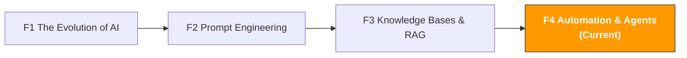

[🇨🇳 中文](../../paths/0-foundations/f4-agent-automation.md) | 🇺🇸 English

# F4. Automation & AI Agents

> **Path**: Path 0: AI Foundations · **Module**: F4
> **Last Updated**: 2026-03-12
> **Difficulty**: Intermediate
> **Estimated Time**: 2 hours
> **Prerequisites**: [F1 The Evolution of AI](f1-ai-evolution.md), [F2 Prompt Engineering](f2-prompt-engineering.md), [F3 Knowledge Bases & RAG](f3-rag-knowledge.md)

---

[Hub Home](../../README.md) · [Path 0 Overview](README.md)



---

## Module Navigation

1. [From Prompt to Agent](#1-from-prompt-to-agent-four-levels-of-ai-capability) · 2. [Three-Layer Automation Model](#2-three-layer-automation-model) · 3. [MCP Protocol Deep Dive](#3-mcp-protocol-deep-dive) · 4. [Agent Framework Landscape](#4-agent-framework-landscape) · 5. [10 E-commerce Agent Scenarios](#5-10-cross-border-e-commerce-agent-scenarios) · 6. [Security & Risks](#6-security--risks) · 7. [Implementation Roadmap](#7-implementation-roadmap) · 8. [Learning Resources](#8-learning-resources) · 9. [Completion Checklist](#9-completion-checklist)


## What You'll Learn in This Module

AI isn't just a Q&A tool. When it can use tools, execute tasks, and make autonomous decisions, it becomes an Agent a true digital assistant.

After completing this module, you'll be able to:
- Understand the upgrade path from Prompt to Agent
- Master the three-layer automation model (Script → Workflow → Agent)
- Deeply understand MCP protocol architecture and applications
- Know the major Agent frameworks (LangGraph, CrewAI, OpenClaw)
- Evaluate the feasibility and ROI of 10 cross-border e-commerce Agent scenarios
- Understand Agent security risks and mitigation strategies

> **Module Positioning**: This module builds conceptual understanding and scenario judgment. If you want to get hands-on building Agents, move on to [Path B: B4 AI Agents & Automation](../b-developers/b4-agent-workflow.md) after completing this module.

---

## 1. From Prompt to Agent: Four Levels of AI Capability

### 1.1 AI Capability Upgrade Path

```
Level 1：单次对话（Prompt → Response）
你问一个问题，AI 给一个回答
没有记忆，没有工具，没有行动
示例：问 ChatGPT "帮我写一个 Listing 标题"
价值：信息获取和内容生成

Level 2：多轮对话（Conversation）
AI 记住之前的对话内容
可以迭代优化输出
示例：和 Claude 讨论并逐步完善一份市场分析
价值：协作式内容创作和分析

Level 3：工具增强（Tool-Augmented LLM）
AI 可以调用外部工具获取信息
但仍然需要人类触发每一步
示例：AI 调用计算器算利润，调用搜索引擎查数据
价值：更准确的分析和计算

Level 4：自主 Agent（Autonomous Agent）
AI 自主规划任务、调用工具、执行行动
可以处理多步骤的复杂任务
示例：AI 自动监控竞品、分析变化、生成报告、发送邮件
价值：真正的自动化，解放人力
```

### 1.2 Cross-Border E-commerce Analogy

| AI Level | Analogy | What You Need to Do |
|----------|---------|-------------------|
| Level 1 Single Turn | Asking a stranger for directions | You ask, they answer, done |
| Level 2 Multi-Turn | Having a meeting with a consultant | You lead the discussion, they provide advice |
| Level 3 Tool-Augmented | Consultant with a laptop | You say "look up the data," they check and report back |
| Level 4 Autonomous Agent | Hiring a full-time assistant | You say "give me a weekly competitor report," they handle everything |

### 1.3 Why 2025-2026 Is the Agent Explosion

Three conditions matured simultaneously in 2025:

| Condition | 2023 Status | 2025-2026 Status |
|-----------|-------------|-----------------|
| **Model Capability** | GPT-4 just launched, limited reasoning | GPT-4o/Claude Opus 4 with significantly improved reasoning |
| **Tool Protocol** | Each tool required custom integration | MCP protocol standardized, plug-and-play |
| **Framework Maturity** | LangChain early stage, many bugs | LangGraph/CrewAI/OpenClaw production-ready |

---

## 2. Three-Layer Automation Model

### 2.1 Three-Layer Architecture

```
Layer 1：脚本自动化（Script Automation）
什么：用代码自动执行固定流程
特点：确定性强、可靠、但不灵活
工具：Python 脚本、Cron 定时任务、Shell 脚本
示例：每天自动下载 Amazon 销售报告
适合：重复性高、流程固定、不需要判断的任务
跨境电商：报告下载、数据合并、格式转换

Layer 2：工作流自动化（Workflow Automation）
什么：用可视化工具连接多个步骤和服务
特点：比脚本灵活，支持条件分支，但仍是预定义流程
工具：Zapier、Make (Integromat)、n8n、Power Automate
示例：新差评出现 → 自动分类 → 通知相关人员 → 生成回复草稿
适合：跨系统的流程、需要条件判断、但逻辑可预定义
跨境电商：订单异常告警、库存预警、Review 监控

Layer 3：Agent 自动化（Agent Automation）
什么：AI 自主规划和执行任务，能处理不确定性
特点：灵活、能处理意外情况、但需要监督
工具：LangGraph、CrewAI、OpenClaw、AutoGPT
示例：AI 自主分析市场变化，判断是否需要调价，起草调价方案
适合：需要判断和决策、流程不完全确定、需要适应变化
跨境电商：智能选品、自适应广告优化、多市场策略协调
```

### 2.2 Three-Layer Comparison

| Dimension | Script Automation | Workflow Automation | Agent Automation |
|-----------|------------------|--------------------|-----------------|
| Flexibility | Low (fixed process) | Medium (predefined branches) | High (autonomous decisions) |
| Reliability | High (deterministic) | High | Medium (can make mistakes) |
| Technical Barrier | Requires coding | Low (visual) | Medium-High |
| Maintenance Cost | Low | Medium | High |
| Best For | Simple repetitive tasks | Cross-system processes | Complex judgment calls |
| Human Oversight | Not needed | Occasional | Frequently needed |
| Cost | Low | Medium | High (API call fees) |

### 2.3 Which Layer Should You Choose? Decision Framework

```
你的任务是什么？

流程完全固定，不需要判断？
→ Layer 1：脚本自动化
例：每天下载报告、合并 Excel、发送邮件

流程基本固定，有少量条件分支？
→ Layer 2：工作流自动化
例：新 Review ≤ 3 星 → 通知运营 → 生成回复草稿

需要理解内容、做判断、处理不确定性？
→ Layer 3：Agent 自动化
例：分析竞品策略变化，判断是否需要调整定价

不确定？
从 Layer 1 开始，逐步升级
先用脚本解决能解决的，剩下的用工作流，
最后才考虑 Agent
```

> **Core Principle**: If a simple solution works, don't use a complex one. If a script can handle it, don't use an Agent. The value of Agents lies in handling tasks that scripts and workflows can't.

### 2.4 Real-World Example: Three Layers Working Together

**Scenario: Competitor Monitoring & Response System**

```
Layer 1（脚本）：
每天定时运行 Python 脚本
通过 Amazon SP-API 获取竞品价格、BSR、Review 数据
存入数据库
输出：原始数据

Layer 2（工作流）：
检测数据变化（价格下降 > 10%、新增差评 > 5 条）
触发告警通知（Slack/邮件）
自动生成数据变化摘要
输出：告警 + 摘要

Layer 3（Agent）：
接收告警和数据
分析竞品策略变化的原因（降价促销？清库存？新品冲击？）
评估对我们的影响
生成应对方案（是否跟价、是否调整广告、是否加大促销）
起草执行计划
输出：分析报告 + 应对方案（人类审核后执行）
```

---

## 3. MCP Protocol Deep Dive

> **Full Toolkit**: [ Awesome MCP & Agent Toolkit](../../docs/awesome-mcp-agents.md#awesome-mcp-servers-ai-agent-tools-awesome-mcp-agent-tools-for-e-commerce) A complete list of e-commerce MCP Servers, Agent frameworks, and external Awesome Lists. Includes 30+ MCP Servers for Shopify/Amazon/Google Ads/Meta Ads and 7 major Agent frameworks.

### 3.1 Core Concepts of MCP

MCP (Model Context Protocol) is an open protocol launched by Anthropic in late 2024. By 2026, it has become the industry standard for connecting AI to external tools. OpenAI, Google, and Microsoft have all adopted it.

**Three Core Components of MCP:**

```

MCP Host
The application running the AI model
e.g., Claude Desktop, Kiro, Cursor, VS Code

MCP Client
Connection manager inside the Host
Handles communication with MCP Servers

MCP Server
Adapter providing specific tool capabilities
e.g., Filesystem Server, Database Server, Email

```

**MCP Servers Provide Three Types of Capabilities:**

| Capability | Description | Examples |
|-----------|-------------|---------|
| **Tools** | Functions the AI can call | Send emails, query databases, read/write files |
| **Resources** | Data the AI can read | File contents, database records, API responses |
| **Prompts** | Predefined interaction templates | Standardized analysis workflows, report templates |

Content rephrased for compliance with licensing restrictions. Sources: [MCP Protocol Documentation](https://modelcontextprotocol.io/), [MCP Guide 2026](https://robomotion.io/blog/mcp-explained-why-model-context-protocol-matters-in-2026)

### 3.2 How MCP Works

```
用户："帮我查一下今天的 Amazon 订单数据"


MCP Host（Claude Desktop）
AI 理解用户意图，决定需要调用工具


MCP Client
找到 "amazon-sp-api" MCP Server


MCP Server（amazon-sp-api）
调用 Amazon SP-API 获取订单数据


返回数据给 AI


AI 基于数据生成回答：
"今天共有 47 个订单，总销售额 $1,234.56..."
```

### 3.3 Common MCP Servers for Cross-Border E-commerce

| MCP Server | Function | Use Case |
|-----------|----------|----------|
| **filesystem** | Read/write local files | Analyze local Excel reports, CSV data |
| **sqlite / postgres** | Database operations | Query product databases, order databases |
| **fetch** | HTTP requests | Call external APIs, fetch web data |
| **gmail / outlook** | Email operations | Read supplier emails, send reports |
| **slack** | Slack messaging | Send alert notifications, team collaboration |
| **puppeteer** | Browser automation | Scrape competitor data, screenshot comparisons |
| **memory** | Knowledge graph | Store and retrieve structured knowledge |

### 3.4 MCP vs Traditional API Integration

| Dimension | Traditional API Integration | MCP |
|-----------|---------------------------|-----|
| Development Cost | Custom code for each tool | Standardized protocol, plug-and-play |
| Maintenance Cost | API changes require individual updates | Servers update independently, no impact on others |
| Ecosystem | Fragmented | Unified ecosystem, community-shared Servers |
| Security | Each implements its own | Protocol-level permission controls |
| Analogy | Different charging cable for each device | USB-C universal connector |

### 3.5 A2A Protocol: Collaboration Between Agents

MCP solves the "AI connecting to tools" problem. Google's **A2A (Agent-to-Agent) protocol**, launched in 2025, solves the "Agents collaborating with each other" problem.

```
MCP：垂直集成（AI 工具）
AI 调用文件系统
AI 调用数据库
AI 调用 API

A2A：水平协作（Agent Agent）
选品 Agent 把结果传给 Listing Agent
Listing Agent 把结果传给广告 Agent
多个 Agent 协作完成复杂任务
```

**MCP + A2A = Complete Agent Infrastructure**

Content rephrased for compliance with licensing restrictions. Source: [MCP vs A2A Guide](https://learndevrel.com/blog/mcp-vs-a2a)

---

## 4. Agent Framework Landscape

### 4.1 Major Agent Framework Comparison

| Framework | Type | Best For | Technical Barrier | GitHub Stars |
|-----------|------|----------|------------------|-------------|
| [LangGraph](https://github.com/langchain-ai/langgraph) | Dev Framework | Custom Agent workflows | High (requires Python) | 10K+ |
| [CrewAI](https://github.com/crewAIInc/crewAI) | Multi-Agent Framework | Multi-Agent collaboration | Medium | 25K+ |
| [OpenClaw](https://github.com/openclaw/openclaw) | Personal AI Agent | Daily task automation | Low-Medium | 180K+ |
| [AutoGPT](https://github.com/Significant-Gravitas/AutoGPT) | Autonomous Agent | Exploratory tasks | Medium | 170K+ |
| [Dify](https://github.com/langgenius/dify) | Low-Code Platform | Rapid AI app building | Low | 55K+ |
| [Coze](https://www.coze.com/) | No-Code Platform | Quick bot building | Lowest | N/A (commercial product) |

### 4.2 Framework Selection Guide

```
你的技术水平？

不会编程
想快速搭建 → Coze（无代码，中文友好）
想更多控制 → Dify（低代码，可视化）

会基础 Python
单个 Agent → LangGraph（最灵活）
多个 Agent 协作 → CrewAI（多 Agent 编排）

想要个人 AI 助理
OpenClaw（自托管，通过消息平台交互）
```

### 4.3 LangGraph: The Most Flexible Agent Framework

> **Related Reading**: [B4 AI Agents & Workflow Automation](../b-developers/b4-agent-workflow.md#b4-ai-agent-workflow-automation) Hands-on Agent system building covered in B4

LangGraph is an Agent framework from the LangChain team. Its core idea is modeling Agent behavior as a **State Graph**.

```
LangGraph 的核心概念：

State（状态）：Agent 当前的信息和上下文
Node（节点）：Agent 执行的每一步操作
Edge（边）：节点之间的连接和条件判断

示例 竞品分析 Agent：


获取数据 → 分析变化 → 判断重要性


重要变化 不重要


深入分析 记录日志


生成报告


发送通知

```

### 4.4 CrewAI: Multi-Agent Collaboration

CrewAI's core idea is having multiple specialized Agents form a "team," each with their own role.

```
CrewAI 示例 选品团队：

Agent 1：市场研究员
角色：收集市场数据和趋势
工具：Google Trends API、Amazon 数据
输出：市场分析报告

Agent 2：竞品分析师
角色：分析竞品的优劣势
工具：Review 分析、Listing 对比
输出：竞品分析报告

Agent 3：财务分析师
角色：计算利润和 ROI
工具：成本计算器、FBA 费用估算
输出：利润分析报告

Agent 4：决策顾问
角色：综合所有分析，给出建议
输入：前 3 个 Agent 的报告
输出：Go/No-Go 建议 + 行动计划

工作流：Agent 1 → Agent 2 → Agent 3 → Agent 4
```

### 4.5 OpenClaw: Personal AI Assistant

OpenClaw is a breakout open-source project released in late 2025, positioned as "a personal AI Agent running on your own device."

**Core Architecture:**

```
你的设备（电脑/服务器）
OpenClaw 核心引擎
LLM 接口（支持 OpenAI/Claude/本地模型）
Skills（技能模块）
邮件管理
日程管理
文件操作
网页浏览
自定义技能
Memory（记忆系统）
短期记忆（当前对话）
长期记忆（知识图谱）
Heartbeat（心跳系统）
定时执行任务

Channels（通信渠道）
WhatsApp
Telegram
Slack
Discord
Web UI
```

**Cross-Border E-commerce Use Case:**

```
通过 WhatsApp 对 OpenClaw 说：

"每天早上 9 点，帮我：
1. 检查 Amazon US 的新订单和新 Review
2. 如果有 1-3 星 Review，分析原因并起草回复
3. 检查库存水平，如果低于安全库存，提醒我补货
4. 把以上信息汇总成日报，发到我的 Slack"

OpenClaw 会：
- 设置每日定时任务（Heartbeat）
- 通过 MCP 连接 Amazon SP-API
- 用 LLM 分析 Review 内容
- 检查库存数据
- 生成日报
- 通过 Slack Channel 发送
```

Content rephrased for compliance with licensing restrictions. Sources: [OpenClaw Developer Guide](https://sparkco.ai/blog/how-openclaw-works-skills-heartbeat-memory-and-channels-explained), [OpenClaw Guide 2026](https://o-mega.ai/articles/openclaw-creating-the-ai-agent-workforce-ultimate-guide-2026)


---

## 5. 10 Cross-Border E-commerce Agent Scenarios

> **Related Reading**: [D2 TikTok Shop AI Guide](../d-platforms/tiktok-shop-ai-guide.md#12-automating-tiktok-shop-operations-with-openclaw) TikTok Shop automation operations covered in D2

### 5.1 Scenario Overview

| # | Scenario | Automation Layer | Technical Difficulty | Expected ROI | Recommended Priority |
|---|----------|-----------------|---------------------|-------------|---------------------|
| 1 | Competitor Monitoring & Alerts | Layer 2-3 | | High | |
| 2 | Automated Review Analysis | Layer 2-3 | | High | |
| 3 | Inventory Alerts & Restock Suggestions | Layer 1-2 | | High | |
| 4 | Multilingual Customer Service Assistant | Layer 3 | | High | |
| 5 | Listing Quality Audit | Layer 2-3 | | Medium | |
| 6 | Automated Ad Optimization | Layer 3 | | High | |
| 7 | Product Research Intelligence | Layer 2-3 | | Medium | |
| 8 | Automated Compliance Checks | Layer 2-3 | | Medium | |
| 9 | Supplier Communication Assistant | Layer 3 | | Medium | |
| 10 | Full-Chain Operations Agent | Layer 3 | | Very High | (long-term goal) |

### 5.2 Scenario Details

**Scenario 1: Competitor Monitoring & Alerts**

```
触发条件：每日定时 / 实时监控
输入：竞品 ASIN 列表
流程：
1. [脚本] 获取竞品价格、BSR、Review 数据
2. [脚本] 对比昨日数据，检测变化
3. [工作流] 变化超过阈值 → 触发告警
4. [Agent] 分析变化原因，生成应对建议
输出：告警通知 + 分析报告 + 应对建议
工具：Python + Amazon SP-API + LLM
预期效果：从"每周手动查一次"到"实时监控自动分析"
```

**Scenario 2: Automated Review Analysis**

```
触发条件：新 Review 出现
输入：新增 Review 内容
流程：
1. [脚本] 检测新 Review
2. [Agent] 分析 Review 情感和主题
3. [Agent] 如果是差评，分析原因并生成回复草稿
4. [工作流] 通知运营人员审核
输出：Review 分析 + 回复草稿 + 趋势报告
工具：Python + LLM + Slack/邮件通知
预期效果：差评响应时间从 24 小时缩短到 2 小时
```

**Scenario 3: Inventory Alerts & Restock Suggestions**

```
触发条件：每日定时
输入：销售数据、库存数据、供应商交期
流程：
1. [脚本] 获取当前库存和近期销售数据
2. [脚本] 计算安全库存和预计断货日期
3. [工作流] 库存低于安全线 → 触发预警
4. [Agent] 综合考虑季节性、促销计划，生成补货建议
输出：库存状态报告 + 补货建议 + 紧急程度排序
工具：Python + pandas + LLM
预期效果：断货率降低 50%，库存周转率提升 20%
```

**Scenario 4: Multilingual Customer Service Assistant**

```
触发条件：收到客户消息
输入：客户消息（任意语言）
流程：
1. [Agent] 检测语言，翻译为中文（如需要）
2. [Agent] 从产品知识库（RAG）检索相关信息
3. [Agent] 生成回复草稿（目标语言）
4. [工作流] 发送给客服人员审核
输出：翻译 + 回复草稿 + 参考信息来源
工具：LLM + RAG + 客服系统集成
预期效果：客服回复时间缩短 70%，多语言覆盖从 2 种到 5 种
```

**Scenario 5: Listing Quality Audit**

```
触发条件：每周定时 / Listing 更新后
输入：所有在售产品的 Listing 内容
流程：
1. [脚本] 获取所有 Listing 内容
2. [Agent] 检查标题长度、关键词覆盖、Bullet 质量
3. [Agent] 对比竞品 Listing，发现差距
4. [Agent] 生成优化建议和优先级排序
输出：Listing 质量评分卡 + 优化建议 + 优先级
工具：Python + LLM + Amazon SP-API
预期效果：Listing 质量一致性提升，转化率提升 5-10%
```

**Scenarios 6-10 Summary:**

| Scenario | Core Value | Key Challenge |
|----------|-----------|---------------|
| 6. Automated Ad Optimization | Real-time bid and budget adjustments | Requires caution wrong decisions are costly |
| 7. Product Research Intelligence | Automatically discover category opportunities | Multiple data sources, needs cross-validation |
| 8. Automated Compliance Checks | Auto-check compliance before new product launch | Regulations change frequently, knowledge base needs maintenance |
| 9. Supplier Communication Assistant | Auto-translate and draft supplier emails | Business communication needs a human touch |
| 10. Full-Chain Operations Agent | Full automation from product selection to after-sales | Long-term vision, current tech isn't mature enough |

### 5.3 Implementation Priority Recommendations

```
第 1 阶段（现在就做，1-2 周）：
场景 3：库存预警（脚本级别，最简单）
场景 2：Review 分析（用 ChatGPT/Claude 手动，建立流程）
投入：几小时的脚本开发 + AI 工具订阅

第 2 阶段（1-2 个月）：
场景 1：竞品监控（脚本 + 工作流）
场景 5：Listing 巡检（Agent 级别）
场景 4：多语言客服（RAG + Agent）
投入：1-2 周开发 + RAG 系统搭建

第 3 阶段（3-6 个月）：
场景 6：广告优化（需要谨慎测试）
场景 7：选品情报（需要多数据源集成）
场景 8：合规检查（需要维护知识库）
投入：持续开发和优化

远期目标（6-12 个月）：
场景 9-10：高级 Agent 协作
需要技术成熟度进一步提升
```

---

## 6. Security & Risks

### 6.1 Agent Risk Matrix

| Risk Type | Description | Severity | Mitigation Strategy |
|-----------|-------------|----------|-------------------|
| **Excessive Permissions** | Agent has access to do things it shouldn't | High | Principle of least privilege only grant necessary permissions |
| **Data Leakage** | Agent sends sensitive data to external services | High | Data classification sensitive data stays off external APIs |
| **Wrong Decisions** | Agent makes incorrect business decisions | High | Critical decisions must have human review |
| **Hallucination Actions** | Agent acts on incorrect information | Medium | Verify data sources before executing actions |
| **Cost Overruns** | Agent makes excessive API calls, costs spike | Medium | Set API call limits and budget alerts |
| **Infinite Loops** | Agent gets stuck in an execution loop | Medium | Set maximum execution steps and timeouts |

### 6.2 Security Best Practices

```
原则 1：最小权限
Agent 只能访问它需要的数据和工具
不要给 Agent 管理员权限
定期审查 Agent 的权限

原则 2：人在回路（Human-in-the-Loop）
关键操作（发邮件、调价、下单）必须人类确认
Agent 生成建议，人类做决策
设置"自动执行"和"需要审批"两种模式

原则 3：监控和审计
记录 Agent 的所有操作日志
设置异常行为告警
定期审查 Agent 的决策质量

原则 4：渐进式放权
第 1 阶段：Agent 只能读取数据和生成报告
第 2 阶段：Agent 可以起草内容（人类审核后发布）
第 3 阶段：低风险操作可以自动执行
第 4 阶段：高风险操作仍需人类审批

原则 5：故障安全
Agent 出错时自动停止，不要继续执行
设置回滚机制（可以撤销 Agent 的操作）
有备用方案（Agent 不可用时的手动流程）
```

### 6.3 Data Security Classification

| Data Level | Examples | OK to Use External APIs? | Recommended Approach |
|-----------|----------|------------------------|---------------------|
| Public Data | Competitor Listings, public Reviews | Yes | ChatGPT/Claude API |
| Internal Data | Sales reports, operations data | Use caution | Enterprise API (data not used for training) |
| Sensitive Data | Profit data, supplier pricing | Not recommended | Local models (Ollama + Llama) |
| Confidential Data | Account passwords, API Keys | Absolutely not | Don't run through AI use traditional encryption |

---

## 7. Implementation Roadmap

### 7.1 From Zero to Agent Roadmap

```
Week 1-2：建立基础
完成 Path 0 全部模块（你正在这里）
开始使用 ChatGPT/Claude 做日常运营
建立 Prompt 模板库
产出：个人 AI 使用习惯

Week 3-4：脚本自动化
学习基础 Python（如果还不会）
写第一个自动化脚本（报告下载/数据合并）
设置定时任务
产出：2-3 个自动化脚本

Month 2：工作流自动化
选择工作流工具（Zapier/Make/n8n）
搭建第一个工作流（Review 监控 → 通知）
搭建 RAG 知识库（产品 FAQ）
产出：2-3 个自动化工作流 + 知识库

Month 3-4：Agent 入门
学习 LangGraph 或 CrewAI
搭建第一个 Agent（竞品分析 Agent）
配置 MCP Server（文件系统、数据库）
产出：1 个可用的 Agent

Month 5-6：Agent 优化
扩展 Agent 能力（更多工具、更多场景）
建立监控和审计机制
团队推广
产出：Agent 系统 + 团队使用规范
```

### 7.2 Roadmap by Role

| Role | Focus | Recommended Path |
|------|-------|-----------------|
| Operators | Use existing AI tools well + simple automation | Path 0 → Path A → Zapier/Make workflows |
| Developers | Build Agent systems | Path 0 → Path B (focus on B4) → LangGraph/CrewAI |
| Managers | Understand Agent capabilities and boundaries, set strategy | Path 0 → Path C → Assess team Agent needs |

---

## 8. Learning Resources

### 8.1 Getting Started

| Resource | Source | Why Recommended |
|----------|--------|----------------|
| [AI Agents in LangGraph](https://www.deeplearning.ai/short-courses/ai-agents-in-langgraph/) | DeepLearning.AI | Free course, LangGraph Agent intro |
| [Multi AI Agent Systems with CrewAI](https://www.deeplearning.ai/short-courses/multi-ai-agent-systems-with-crewai/) | DeepLearning.AI | Free course, multi-Agent collaboration |
| [MCP Official Documentation](https://modelcontextprotocol.io/) | Anthropic | Authoritative reference for MCP protocol |
| [OpenClaw Official Documentation](https://docs.openclaw.com/) | OpenClaw | Personal Agent setup guide |

### 8.2 Advanced

| Resource | Source | Why Recommended |
|----------|--------|----------------|
| [B4 AI Agents & Automation](../b-developers/b4-agent-workflow.md) | ecommerce-ai-roadmap | This Hub's hands-on technical module |
| [Building Effective Agents](https://www.anthropic.com/research/building-effective-agents) | Anthropic | Anthropic's official Agent design guide |
| [LangGraph Documentation](https://langchain-ai.github.io/langgraph/) | LangChain | Complete LangGraph docs |
| [The AI Agent Landscape 2026](https://learndevrel.com/blog/openclaw-ai-agent-phenomenon) | LearnDevRel | 2026 Agent ecosystem landscape analysis |

---

## 9. Completion Checklist

- [ ] Understand the four levels of AI capability (Single Turn → Multi-Turn → Tool-Augmented → Agent)
- [ ] Can distinguish the three-layer automation model (Script → Workflow → Agent) and judge when to use which
- [ ] Understand MCP protocol architecture and its role
- [ ] Know at least 3 Agent frameworks, their characteristics, and use cases
- [ ] Can evaluate the feasibility and priority of 10 e-commerce Agent scenarios
- [ ] Know Agent security risks and mitigation strategies
- [ ] Have a clear personal/team Agent implementation roadmap

---

## Congratulations on Completing Path 0!

You've built a solid AI knowledge foundation. Now you understand:
- The essence of AI (predict next token) and its capability boundaries
- How to systematically communicate with AI (CRISP + advanced techniques)
- How to let AI use your private data (RAG)
- How to upgrade AI from "answering questions" to "executing tasks" (Agent)

**Next step choose your learning path based on your role:**

| Who You Are | Recommended Path | Core Goal |
|-------------|-----------------|-----------|
| Operators | [Path A: AI Efficiency in Practice](../a-operators/) | Use AI tools to boost operational efficiency 3-10x |
| Developers | [Path B: AI System Building](../b-developers/) | Build AI-powered e-commerce tools and systems |
| Managers | [Path C: AI Strategy Implementation](../c-managers/) | Create an actionable team AI adoption plan |

---
> [Hub Home](../../README.md) · [Path 0 Overview](README.md) · [AI Landscape Assessment](ai-landscape.md)
>
> **Path 0**: [F1 AI Evolution](f1-ai-evolution.md) · [F2 Prompt Engineering](f2-prompt-engineering.md) · [F3 RAG Knowledge Bases](f3-rag-knowledge.md) · [F4 Agent Automation](f4-agent-automation.md) · [F5 RPA Automation](f5-rpa-automation.md) · [AI Landscape](ai-landscape.md)
>
> **Quick Jump**: [Path A Operations](../a-operators/) · [Path B Development](../b-developers/) · [Path C Management](../c-managers/) · [Path D Multi-Platform](../d-platforms/) · [Path E Social Media](../e-social-media/)
