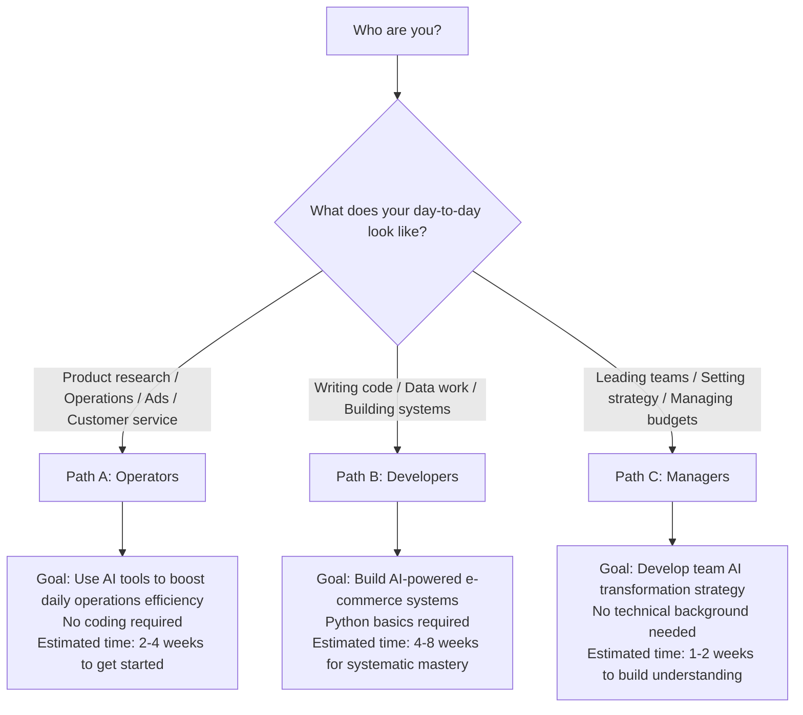

[🇨🇳 中文](../../paths/README.md) | 🇺🇸 English

# Learning Paths Overview

> Last updated: 2026-03-10

AI is reshaping every aspect of cross-border e-commerce. Choose the learning path that best fits your role and goals.

> **Recommended prerequisite**: No matter which path you choose, we suggest completing [Path 0: AI Foundations](0-foundations/) first to build a solid understanding of AI fundamentals.

---

## Path 0: AI Foundations (Recommended Prerequisite)

Not sure what AI really is or what it can do? Start here. Four modules to build your AI knowledge from scratch.

| Module | Topic | Estimated Time |
|--------|-------|----------------|
| [F1. The Evolution of AI](0-foundations/f1-ai-evolution.md) | From machine learning to Agents the development timeline | 2 hours |
| [F2. Prompt Engineering](0-foundations/f2-prompt-engineering.md) | CRISP framework + advanced techniques + scenario templates | 3 hours |
| [F3. Knowledge Bases & RAG](0-foundations/f3-rag-knowledge.md) | Embeddings, vector databases, RAG architecture | 2 hours |
| [F4. Automation & Agents](0-foundations/f4-agent-automation.md) | Three layers of automation from scripts to Agents | 2 hours |

> **Recommended**: After completing Path 0, check out the [AI Application Landscape Assessment](0-foundations/ai-landscape.md) spend 30 minutes building a big-picture view of what AI can do at each stage and how to prioritize, before diving into a specific path.

---

## Choose Your Path

## Path Comparison

| Path | Who It's For | Coding Required? | Time Commitment | Key Outcome |
|------|-------------|-----------------|-----------------|-------------|
| **[Path A: Operators](a-operators/)** | Product research / Operations / Ads / Customer service roles | No | 30 min/day, 2-4 weeks | A reusable set of AI workflows |
| **[Path B: Developers](b-developers/)** | Development / Data / BI roles | Yes, Python | 1 hour/day, 4-8 weeks | A deployable AI tool |
| **[Path C: Managers](c-managers/)** | Team leads / Founders | No | 3-5 hours total | An AI implementation roadmap |

> Not sure which one to pick? The three paths can be mixed and matched. If you finish Path A and want to go deeper, move on to Path B. If you're a manager who wants to understand the details, check out specific modules in Path A.

---

## Quick Navigation

### [Path A: Operators AI-Powered Operations](a-operators/)
Without writing a single line of code, use AI tools to boost your daily operations efficiency by 3-10x. Includes 6 modules: Product Research, Listing, Advertising, Customer Service, Inventory, and Compliance.

### [Path B: Developers Building AI Systems](b-developers/)
Build AI-powered e-commerce tools and systems, from scripts to production-grade applications. Includes 5 modules: Data Pipelines, Prediction Models, RAG Knowledge Bases, AI Agents, and Local Model Deployment.

### [Path C: Managers AI Strategy Implementation](c-managers/)
Understand what AI can do for your team and create an actionable AI implementation plan. Includes 3 modules: Capability Assessment, Skill Building, and ROI Evaluation.

---

[Back to Hub Home](../README.md)
