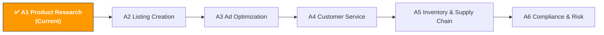

[🇨🇳 中文](../../../paths/a-operators/a1-product-research.md) | 🇺🇸 English (current)

# A1. Product Research & Market Insights

> **Path**: Path A: Operators · **Module**: A1  
> **Last Updated**: 2026-03-12  
> **Difficulty**: ⭐ Beginner  
> **Estimated Time**: 30 minutes per day, 1–2 weeks
---

🏠 [Hub Home](../../README.md) · 📋 [Path A Overview](README.md)



---

## 📖 Module Navigation

1. [Product Research Methodology](#1-product-research-methodology-the-fundamentals-before-ai) · 2. [AI Tool Landscape](#2-ai-tool-landscape-what-to-use-for-product-research) · 3. [Prompt Template Library](#3-prompt-template-library-product-research-specific) · 4. [Product Research SOP](#4-product-research-workflow-in-practice) · 5. [Common Pitfalls](#5-common-product-research-pitfalls) · 6. [Advanced Techniques](#6-advanced-techniques) · 7. [Learning Resources](#7-learning-resources) · 8. [🦞 OpenClaw Automation](#8-automate-product-research-with-openclaw) · 9. [Completion Checklist](#9-completion-checklist)


## What You'll Learn in This Module

Use AI tools to compress days of product research into just a few hours. From market trend analysis to competitor pain point extraction, build a reusable AI-assisted product research workflow.

After completing this module, you'll be able to:
- Use ChatGPT/Claude to batch-analyze competitor reviews, extracting 50+ core pain points from negative reviews in 10 minutes
- Use AI for market feasibility assessments, replacing what used to take half a day of manual research
- Use keyword clustering to discover blue-ocean demand that competitors haven't covered
- Build a complete SOP from "trend discovery" to "Go/No-Go decision"

---

## 1. Product Research Methodology: The Fundamentals Before AI

> 📎 **Related Reading**: [AI Application Landscape](../0-foundations/ai-landscape.md#ai-application-landscape-assessment-ai-application-landscape-for-cross-border-e-commerce) — AI maturity assessment for product research · [D4 Walmart AI Guide](../d-platforms/d4-walmart-ai-guide.md#61-walmart-category-opportunity-analysis) — Walmart category opportunity analysis and competition assessment covered in D4 · [E4 Pinterest AI Guide](../e-social-media/e4-pinterest-ai-guide.md#77-pinterest-data-analysis-deep-dive) — Pinterest trend data for validating product research directions covered in E4

### 1.1 First Principles of Product Research

The essence of product research is finding asymmetry between "demand" and "supply" — categories where demand is high but supply is insufficient (or supply quality is poor) represent opportunities.

AI can't make decisions for you, but it can boost the efficiency of information gathering and analysis by 10x. Before using AI, you need to understand:

- **Demand signals**: Search volume, search trends, review count growth rate
- **Supply signals**: Number of sellers, market concentration among top sellers, speed of new product entries
- **Profit signals**: Selling price, FBA fees, procurement cost, advertising cost
- **Risk signals**: Seasonality, compliance requirements, patent barriers, return rate

### 1.2 Product Research Decision Framework

```
Market Opportunity = (Demand Strength × Profit Margin) / (Competition Intensity × Risk Factor)
```

Each variable can be quantified with AI assistance. Let's break them down one by one.

### 1.3 AI's Role in Product Research

What AI is good at:
- **Information compression**: Condensing 100 reviews into 5 core pain points
- **Pattern recognition**: Discovering demand clusters from keyword lists that the human eye easily misses
- **Structured analysis**: Conducting evaluations across fixed dimensions to avoid blind spots
- **Multilingual processing**: Analyzing Japanese/German reviews without translating them one by one

What AI is not good at:
- **Real-time data**: AI doesn't know current BSR rankings or search volumes (tools are needed for that)
- **Supply chain judgment**: Factory capabilities and quality control require on-site verification
- **Compliance details**: Specific certification requirements need to be checked against official documentation (see [A6 Compliance Module](a6-compliance.md))
- **Creative product discovery**: Truly blue-ocean categories often come from cross-industry inspiration, not data analysis

> 💡 **Core Principle**: Use tools for data, AI for analysis, and humans for decisions. All three are indispensable.

---

## 2. AI Tool Landscape: What to Use for Product Research

### 2.1 Paid Tool Deep Dive

| Tool | Price | Core Capability | Best For | Data Accuracy | AI Features |
|------|-------|----------------|----------|--------------|-------------|
| [Helium 10](https://www.helium10.com/) | $29–229/mo | Black Box product finder, Cerebro reverse ASIN lookup, Xray Chrome extension | Intermediate sellers who need deep keyword data | High (child ASIN-level estimates) | Listing Builder AI, AI Review Insights |
| [Jungle Scout](https://www.junglescout.com/) | $29–84/mo | Product Database, Opportunity Finder, Supplier Database | Beginners, user-friendly interface | Medium-High | AI Assist (natural language queries) |
| [SellerSprite](https://www.sellersprite.com/) | $0–99/mo | Multi-marketplace data, keyword mining, market analysis | Chinese sellers, great value | Medium | Basic AI features |
| [Keepa](https://keepa.com/) | $19/mo | Price history, BSR tracking, inventory monitoring | All sellers (essential supplementary tool) | Very High (direct tracking) | None |
| [SmartScout](https://smartscout.com/) | $29–97/mo | Brand analysis, subcategory discovery, seller mapping | Wholesale/brand sellers | High | AI brand matching |

**Tool Selection Guide:**

**Budget-friendly (<$50/mo)**: Jungle Scout Starter + Keepa + ChatGPT
- Jungle Scout's Product Database is sufficient for initial screening
- Keepa's price history and BSR tracking are irreplaceable
- ChatGPT's free tier can handle review analysis and market assessments

**Getting serious ($100–200/mo)**: Helium 10 Platinum + Keepa
- Helium 10's Cerebro (reverse ASIN keyword lookup) and Black Box (product research filter) are the industry standard
- Pair with Keepa for historical data validation to avoid being misled by short-term data

**Multi-marketplace operations**: SellerSprite + Helium 10
- SellerSprite has better data coverage for Japan and European marketplaces than Helium 10
- Use both complementarily — SellerSprite for multi-marketplace initial screening, Helium 10 for deep analysis

> 💡 **Key Insight**: Paid tools provide data; AI (ChatGPT/Claude) provides analysis. The combination works best — export data from Helium 10, use ChatGPT for attribution analysis. Using either one alone isn't enough.

### 2.2 Free Tool Combinations

| Tool | Use Case | Link |
|------|----------|------|
| ChatGPT / Claude | Review analysis, market assessment, keyword clustering, competitor comparison | [chat.openai.com](https://chat.openai.com/) / [claude.ai](https://claude.ai/) |
| Google Trends | Validate category search trends and seasonality | [trends.google.com](https://trends.google.com/) |
| Perplexity | Market research with citations (ask market questions directly) | [perplexity.ai](https://www.perplexity.ai/) |
| Google Gemini | Upload competitor screenshots for multimodal analysis | [gemini.google.com](https://gemini.google.com/) |
| Amazon Best Sellers | Browse top-selling products by category | [amazon.com/bestsellers](https://www.amazon.com/bestsellers) |
| Amazon Movers & Shakers | Products with the biggest rank increases in the past 24 hours | [amazon.com/gp/movers-and-shakers](https://www.amazon.com/gp/movers-and-shakers) |

**Free Tool Strategy:**

1. **Google Trends for seasonality validation**: Before committing to a category, check the 12-month search trend. If you're researching in November and see high search volume, it might just be the BFCM peak season, not year-round demand.
2. **Perplexity for quick market research**: Ask directly, "What is the market size of portable neck fans on Amazon US in 2025?" — it gives you cited answers that are more verifiable than ChatGPT's responses.
3. **Gemini for multimodal analysis**: Upload competitor product images and have Gemini analyze design features, materials, and likely cost structures. This is something ChatGPT can't do.
4. **Amazon Movers & Shakers for trend spotting**: Spend 5 minutes daily browsing and noting categories with consistent upward movement. Products appearing on Movers & Shakers for 3 consecutive days are worth investigating further.

### 2.3 Open-Source Tools & APIs

| Tool/API | Use Case | GitHub/Link |
|----------|----------|-------------|
| python-amazon-sp-api | Amazon SP-API Python wrapper for product catalog, order, and inventory data | [github.com/saleweaver/python-amazon-sp-api](https://github.com/saleweaver/python-amazon-sp-api) |
| Amazon SP-API Official Docs | Catalog Items API, Product Pricing API | [developer-docs.amazon.com/sp-api](https://developer-docs.amazon.com/sp-api) |
| BERTopic | BERT-based topic modeling for review clustering analysis | [github.com/MaartenGr/BERTopic](https://github.com/MaartenGr/BERTopic) |
| VADER Sentiment | Lightweight sentiment analysis for quick review sentiment scoring | [github.com/cjhutto/vaderSentiment](https://github.com/cjhutto/vaderSentiment) |
| Scrapy | Python web scraping framework for collecting public product data | [github.com/scrapy/scrapy](https://github.com/scrapy/scrapy) |

**When to use open-source tools?**

If you have a technical background (or have a developer on your team), open-source tools can do things paid tools can't:
- **Custom review analysis**: Use BERTopic for topic modeling — more systematic than ChatGPT's analysis, ideal for large-scale analysis of 1,000+ reviews
- **Automated data collection**: Use SP-API to periodically pull competitor pricing and inventory changes, building your own database
- **Quantified sentiment analysis**: Use VADER to score each review's sentiment, then analyze sentiment trends over time

> For more technical implementation details, see the relevant modules in [Path B: Developers](../b-developers/).

---

## 3. Prompt Template Library (Product Research-Specific)

> The full standardized templates (with verification status, contributor info, and share links) are in [prompts/product-research.md](../../prompts/product-research.md).
> This section provides deep analysis, common mistakes, and advanced variants for each template.

### 3.1 Competitor Review Pain Point Analysis

**Why this prompt works:** It requires AI to rank by frequency and output in table format, avoiding AI's common tendency to give vague, generic answers. The table format forces AI to produce structured, comparable results. Key design points:
- "Top 5" — Limits output quantity, preventing AI from listing 20 insignificant points
- "Ranked by mention frequency" — Forces AI to do quantitative analysis rather than subjective judgment
- "Representative review quotes" — Requires AI to cite evidence, reducing hallucinations
- "Which are easiest to solve through product design" — Directly action-oriented

**Common Mistakes:**
- ❌ Only pasting 10 negative reviews → Sample too small; AI will over-interpret individual cases. Aim for 50–100.
- ❌ Mixing positive and negative reviews → AI gets distracted by positive reviews, diluting pain point analysis. Analyze them separately.
- ❌ Not specifying output format → AI will write long paragraphs that are hard to compare and act on. Table format is key.
- ❌ Only analyzing one competitor → Can't distinguish "category-wide issues" from "individual product problems." Analyze at least 3 competitors.

[Full template → prompts/product-research.md](../../prompts/product-research.md)

**Advanced Variants:**

**Variant A — Multi-Competitor Comparison:**

```
分析以下 3 个竞品的差评，对比它们的痛点差异：
竞品A（[ASIN]）差评：[粘贴]
竞品B（[ASIN]）差评：[粘贴]
竞品C（[ASIN]）差评：[粘贴]

输出：
1. 三个竞品共同的痛点（品类通病）
2. 各自独有的痛点
3. 哪些痛点最容易通过产品设计解决
```

> 💡 **Why use this variant**: Shared pain points = category-wide issues that your product must solve; unique pain points = competitor weaknesses and your differentiation opportunities.

**Variant B — With Sentiment Intensity Analysis:**

```
分析以下差评，除了痛点分类外，还要评估每个痛点的"情感强度"（1-5分，5分=极度不满）。
情感强度高的痛点 = 用户最在意的改进方向。

输出格式：痛点 | 频率 | 情感强度 | 代表性评论 | 改进建议

[在此粘贴差评内容]
```

> 💡 **Why use this variant**: High-frequency but low-intensity pain points (e.g., "packaging is mediocre") are low priority; medium-frequency but extremely high-intensity pain points (e.g., "broke after one week") are the real product opportunities.

**Variant C — Positive Review Mining (Finding "Must-Have Features"):**

```
分析以下 5 星好评，提取用户最频繁提到的满意点。
这些满意点 = 品类的"必备卖点"，你的产品必须具备。

输出：
1. 排名前 5 的满意点（按提及频率排序）
2. 每个满意点的用户原话
3. 如果你的产品缺少这些卖点，用户会怎么反应

[在此粘贴 5 星好评]
```

> 💡 **Why use this variant**: Negative reviews tell you "what you can't have"; positive reviews tell you "what you must have." Combining both gives you a complete product definition.

**Variant D — Timeline Trend Analysis:**

```
以下差评按时间排序（最新在前）。请分析：
1. 痛点是否随时间变化（比如早期是质量问题，后期变成功能不足）
2. 最近 3 个月的新增痛点是什么
3. 竞品是否在改进（痛点频率是否下降）

这些信息帮我判断：竞品在进步还是在退步，我现在进入是否还有机会。

[在此粘贴按时间排序的差评]
```

> 💡 **Why use this variant**: If a competitor's pain points are decreasing, they're iterating and improving — your entry window is closing. If pain points are increasing or unchanged, the competitor isn't listening to user feedback — the opportunity is still there.

---

### 3.2 Market Feasibility Quick Assessment

**Why this prompt works:** The 5-dimension scoring framework forces AI to do a comprehensive analysis, preventing it from only seeing the positive side of a market. The 1–5 scoring scale makes different products directly comparable. The "Enter/Proceed with Caution/Pass" three-tier recommendation forces AI to give a clear conclusion.

**Common Mistakes:**
- ❌ Not providing specific product info → AI can only give generic category analysis. At minimum, provide the product name and target market.
- ❌ Fully relying on AI's scores → AI doesn't have real-time data; scores are based on general knowledge from training data. Always cross-verify with tool data.
- ❌ Making decisions after just one assessment → Use AI for initial screening first, then validate with real data from Helium 10/Jungle Scout.

[Full template → prompts/product-research.md](../../prompts/product-research.md)

**Advanced Variants:**

**Variant A — Multi-Product Horizontal Comparison:**

```
我在考虑以下 3 个产品，请用同一套评估框架做横向对比，告诉我优先做哪个：
产品1：[名称]
产品2：[名称]
产品3：[名称]
目标市场：Amazon US

评估维度（每项 1-5 分）：
1. 市场需求
2. 竞争强度
3. 利润空间
4. 供应链难度
5. 合规风险

输出：对比表格 + 优先级排序 + 排序理由
```

> 💡 **Why use this variant**: Product research isn't about "is this product good?" — it's about "given my resource constraints, which product is most worth pursuing?" Horizontal comparison is more valuable for decision-making than evaluating products individually.

**Variant B — Deep Assessment with Competitor Data:**

```
请对以下产品做深度市场可行性评估：

产品：[名称]
目标市场：Amazon [US/DE/JP]

补充信息（来自 Helium 10/Jungle Scout）：
- 品类 BSR 前 10 的月均销量：[数据]
- 头部卖家的 Review 数量：[数据]
- 平均售价：$[X]
- FBA 费用估算：$[X]
- 品类平均退货率：[X]%

请基于这些真实数据重新评估，而不是基于一般认知。
特别关注：以这些数据为基础，新品进入后 6 个月内能否盈利？
```

> 💡 **Why use this variant**: When you give AI real data, its analysis quality improves dramatically. The phrase "reassess based on real data" is critical — it tells AI not to fall back on generic answers.

**Variant C — Risk-Focused Assessment:**

```
我准备进入 [品类名称]，请专门做风险评估：

1. 专利风险：这个品类的产品可能涉及哪些专利？（外观、功能、技术）
2. 合规风险：在 [目标市场] 销售需要哪些认证？（FDA、CE、FCC 等）
3. 季节性风险：这个品类的需求是否有明显的季节波动？
4. 供应链风险：主要供应商集中在哪里？是否有替代方案？
5. 竞争风险：头部卖家是否有品牌壁垒或独家供应链优势？

对每个风险给出：风险等级（高/中/低）、具体说明、规避建议
```

> 💡 **Why use this variant**: Most product research failures aren't because "the market is bad" — they're because a risk was overlooked. A dedicated risk assessment helps you spot potential pitfalls before committing capital.

---

### 3.3 Keyword Demand Clustering

**Why this prompt works:** A keyword list is direct evidence of "what users are searching for," but raw keyword lists are too long and messy. AI's clustering ability can compress 200 keywords into 5–8 demand themes, each corresponding to a product opportunity.

**Common Mistakes:**
- ❌ Too few keywords (<20) → Clustering results are unreliable; AI will force-fit groups
- ❌ Too many keywords (>500) → Exceeds AI's context window; process in batches
- ❌ Mixing keywords from different categories → Clustering results will be chaotic; analyze one category at a time
- ❌ Not including search volume data → AI can't judge demand strength; always include search volume if available

[Full template → prompts/product-research.md](../../prompts/product-research.md)

**Advanced Variants:**

**Variant A — Weighted Clustering with Search Volume:**

```
以下是关键词列表及其月搜索量（来自 Helium 10 Cerebro）。
请按用户购买意图聚类，并用搜索量加权计算每个聚类的总需求量。

格式：关键词 | 月搜索量
[粘贴数据]

输出：
1. 聚类名称
2. 包含的关键词
3. 聚类总搜索量（所有关键词搜索量之和）
4. 需求强度排序
5. 对应的产品特性建议
```

> 💡 **Why use this variant**: Clustering without search volume only tells you "what demands exist"; adding search volume tells you "which demand is the biggest."

**Variant B — Competitor Keyword Gap Analysis:**

```
以下是两组关键词：
组A：我的竞品排名靠前的关键词 [粘贴]
组B：我的竞品排名靠后或未覆盖的关键词 [粘贴]

请分析：
1. 组B中有哪些高搜索量但竞品未覆盖的关键词？
2. 这些未覆盖的关键词代表什么用户需求？
3. 我的产品如何针对这些需求做差异化？
```

> 💡 **Why use this variant**: Keywords competitors haven't covered = unmet demand = your differentiation opportunity.

---

### 3.4 Trend Forecasting

**Why this prompt works:** It requires AI to cross-analyze multiple data sources (Google Trends, BSR, social media) rather than relying on a single metric. The "growth phase/plateau/decline" three-tier judgment forces AI to give a clear trend direction.

**Common Mistakes:**
- ❌ Not providing any data → AI can only answer based on general knowledge, with very low accuracy
- ❌ Only looking at Google Trends → Search trends and purchase trends don't always align; cross-verify with BSR data
- ❌ Ignoring social media signals → Viral products on TikTok/Instagram often lead Amazon search trends by 2–3 months

```
你是一个电商趋势分析师。基于以下信息，预测这个品类未来 6 个月的趋势：

- 品类名称：[名称]
- 过去 12 个月的 Google Trends 数据：[粘贴或描述趋势走向]
- 当前 Amazon BSR 前 10 的 Review 增长速度：[数据]
- 相关社交媒体话题热度：[TikTok/Instagram 趋势描述]

请分析：
1. 这个品类是上升期、平台期还是衰退期？依据是什么？
2. 有哪些外部因素可能影响趋势（季节、政策、技术变化）？
3. 如果现在进入，6 个月后的竞争格局会怎样？
4. 建议的进入时机和策略
```

**Advanced Variant — Multi-Category Trend Comparison:**

```
我在考虑以下 3 个品类，请对比它们的趋势走向：
品类A：[名称] — Google Trends: [描述]
品类B：[名称] — Google Trends: [描述]
品类C：[名称] — Google Trends: [描述]

哪个品类目前处于最佳进入窗口？为什么？
```

---

### 3.5 Supplier Evaluation

**Why this prompt works:** It transforms supplier evaluation from "gut feeling" into a structured, multi-dimensional comparison. AI can help you spot risk factors you might overlook (e.g., high MOQ creating cash flow pressure, long lead times affecting peak season inventory).

**Common Mistakes:**
- ❌ Only comparing price → The cheapest supplier often has the worst quality control; total cost ends up being the highest
- ❌ Not factoring in shipping and tariffs → Landed cost is the real cost
- ❌ Only contacting one supplier → Contact at least 3–5 to understand the market price range

```
我找到了以下 3 个 1688/Alibaba 供应商，请帮我做对比评估：

供应商A：[公司名、产品、价格、MOQ、交期]
供应商B：[公司名、产品、价格、MOQ、交期]
供应商C：[公司名、产品、价格、MOQ、交期]

评估维度：
1. 价格竞争力（含运费、关税估算到 Amazon [US/DE/JP] 仓库）
2. 品控能力（从产品描述、资质、工厂规模推断）
3. 定制化能力（能否做 OEM/ODM、最小定制量）
4. 风险评估（单一供应商风险、交期风险、品质风险）
5. 谈判策略建议（基于以上分析，如何谈到更好的条件）

输出推荐排序和详细理由。
```

---

### 3.6 Profit Calculator

**Why this prompt works:** It lists all cost items comprehensively (many beginners forget about first-mile shipping, advertising costs, and return losses), and requires AI to calculate the break-even point — the key number for deciding "go or no-go."

**Common Mistakes:**
- ❌ Forgetting advertising costs → New product advertising can account for 20–30% of the selling price
- ❌ Forgetting return losses → Some categories have return rates as high as 15–20%
- ❌ Calculating profit in RMB → Exchange rate fluctuations affect profit; calculate in the target market's currency
- ❌ Not calculating the break-even point → Knowing "profit per unit" isn't enough; you also need to know "how many units per day to break even"

```
帮我计算以下产品在 Amazon [US/DE/JP] 的利润：

- 采购成本：¥[X]/件
- 产品重量：[X]kg，尺寸：[X]×[X]×[X]cm
- 目标售价：$[X]
- 预计日均销量：[X]件
- 广告预算：$[X]/天
- 预计退货率：[X]%

请计算：
1. FBA 费用（仓储 + 配送）
2. Amazon 佣金（品类佣金率）
3. 头程物流费用（海运和空运两种方案）
4. 广告成本（按 ACOS [X]% 估算）
5. 退货损耗
6. 单件利润和利润率
7. 月度利润和 ROI
8. 盈亏平衡点（需要多少日均销量才能盈利）

注意：请用当前汇率换算，并标注你使用的汇率。
```

**Advanced Variant — Multi-Price-Point Sensitivity Analysis:**

```
基于上面的成本结构，请做价格敏感性分析：
- 售价 $[X-5]、$[X]、$[X+5] 三个价格点
- 日均销量 [X-10]、[X]、[X+10] 三个销量水平

输出 3×3 的利润矩阵，帮我找到最优的价格-销量组合。
```

---

### 3.7 Category Opportunity Discovery

**Why you need this prompt:** The previous templates all assume "I already have a product idea — help me evaluate it." But the first step in product research is "discovering opportunities." This prompt helps you find categories worth investigating from scratch.

```
你是一个跨境电商选品顾问。请帮我发现 Amazon [US/DE/JP] 上的品类机会。

我的条件：
- 启动资金：¥[X]万
- 经验水平：[新手/有经验/资深]
- 偏好品类：[有偏好就写，没有就写"不限"]
- 风险偏好：[保守/中等/激进]

请推荐 5 个品类机会，每个包含：
1. 品类名称和简要描述
2. 为什么现在是好时机
3. 预估的月销量和利润空间
4. 主要风险和应对策略
5. 需要的启动资金估算
6. 推荐的进入策略（差异化方向）

注意：
- 不要推荐已经红海的品类（如手机壳、数据线）
- 优先推荐有差异化空间的品类
- 考虑我的资金和经验限制
```

> ⚠️ **Important Reminder**: AI-recommended categories are just a starting point, not a conclusion. Every recommendation needs to be validated with real data from Helium 10/Jungle Scout. AI may recommend opportunities that are already outdated.

---

## 4. Product Research Workflow in Practice

### 4.1 Complete Product Research SOP (7-Step Method)

This SOP compresses the traditional 1–2 week product research process down to roughly 12 hours. Each step is annotated with the tools and prompts used.

```
┌─────────────────────────────────────────────────────────┐
│  Step 1: Trend Discovery (1 hour)                       │
│  Tools: Google Trends + Amazon Movers & Shakers         │
│  AI: Trend Forecasting Prompt (3.4)                     │
│  Output: 5–10 categories worth investigating            │
├─────────────────────────────────────────────────────────┤
│  Step 2: Category Screening (2 hours)                   │
│  Tools: Helium 10 Black Box / Jungle Scout Product DB   │
│  Filters: Monthly sales >300, Reviews <500,             │
│           Price $15–50                                   │
│  AI: Market Feasibility Assessment Prompt (3.2)         │
│  Output: 3–5 categories that pass initial screening     │
├─────────────────────────────────────────────────────────┤
│  Step 3: Deep Competitor Analysis (3 hours)              │
│  Tools: Helium 10 Xray + Keepa                          │
│  Data: Select 5–10 competitors, collect reviews         │
│        (50–100 per competitor)                           │
│  AI: Review Pain Point Analysis (3.1) +                 │
│       Positive Review Mining (3.1 Variant C)            │
│  Output: Category pain point map +                      │
│          must-have feature checklist                     │
├─────────────────────────────────────────────────────────┤
│  Step 4: Keyword Research (2 hours)                     │
│  Tools: Helium 10 Cerebro / Jungle Scout Keyword Scout  │
│  AI: Keyword Demand Clustering Prompt (3.3)             │
│  Output: Demand cluster map + blue-ocean keyword list   │
├─────────────────────────────────────────────────────────┤
│  Step 5: Profit Modeling (1 hour)                       │
│  Tools: Amazon FBA Revenue Calculator                   │
│  AI: Profit Calculator Prompt (3.6)                     │
│  Output: Profit model + break-even point                │
├─────────────────────────────────────────────────────────┤
│  Step 6: Supplier Screening (2 hours)                   │
│  Tools: 1688 / Alibaba                                  │
│  AI: Supplier Evaluation Prompt (3.5)                   │
│  Output: Supplier comparison table +                    │
│          negotiation strategy                            │
├─────────────────────────────────────────────────────────┤
│  Step 7: Decision Output (1 hour)                       │
│  AI: Consolidate all analyses into a product            │
│       research report                                    │
│  Prompt: "Based on all the above analyses, provide a    │
│          final Go/No-Go recommendation and a 3-month    │
│          action plan for post-entry execution"           │
│  Output: Go/No-Go decision + action plan                │
└─────────────────────────────────────────────────────────┘
```

### 4.2 Detailed Guide for Each Step

**Step 1: Trend Discovery**

Goal: Find 5–10 directions worth investigating from the vast universe of categories.

Workflow:
1. Open [Google Trends](https://trends.google.com/), search for category keywords you're interested in, and check the 12-month trend
2. Browse [Amazon Movers & Shakers](https://www.amazon.com/gp/movers-and-shakers) and note categories with consistent upward movement
3. Scroll through TikTok/Instagram, following hashtags like #amazonfinds and #tiktokmademebuyit
4. Use the Trend Forecasting Prompt (3.4) to have AI evaluate each category's trend direction

Decision Criteria:
- ✅ Google Trends shows consistent growth over the past 6 months
- ✅ Appears on Amazon Movers & Shakers for 3 consecutive days
- ✅ Social media buzz exists but few competitors on Amazon
- ❌ Google Trends shows a declining trend
- ❌ Search volume only spikes in specific months (strong seasonality)

**Step 2: Category Screening**

Goal: Validate trend discoveries with data tools and filter for categories with real opportunity.

Helium 10 Black Box Filter Settings (recommended starting point):
- Monthly sales: 300–10,000 (too low = no market; too high = fierce competition)
- Review count: <500 (too many reviews = entrenched top sellers)
- Price: $15–50 (too low = thin margins; too high = high barrier to entry)
- Rating: 3.5–4.3 (low ratings = room for improvement in the category)

> 💡 These are just starting parameters — adjust based on your capital and experience. With more capital, you can raise the price ceiling; with more experience, you can take on categories with higher review counts.

---
**Step 3: Deep Competitor Analysis**

Goal: Understand the category's pain point map and must-have features.

Workflow:
1. Select the top 5–10 competitors by BSR
2. Use Helium 10 Review Insights or manually collect 50–100 negative reviews per competitor
3. Use the Review Pain Point Analysis Prompt (3.1) to analyze negative reviews
4. Use the Positive Review Mining Prompt (3.1 Variant C) to analyze positive reviews
5. Use Keepa to check competitor price history and BSR trends

Output Template:
```
Category Pain Point Map:
| Pain Point | Frequency | Sentiment Intensity | Competitor A | Competitor B | Competitor C | Fix Difficulty |
|------------|-----------|---------------------|-------------|-------------|-------------|---------------|
| ...        | ...       | ...                 | ✅/❌        | ✅/❌        | ✅/❌        | High/Med/Low  |

Must-Have Feature Checklist:
| Feature | User Mention Frequency | Category Standard? |
|---------|----------------------|-------------------|
| ...     | ...                  | Yes/No            |
```

**Steps 4–7** follow the tools and prompts outlined in the SOP diagram above. The key is to save the output from each step and consolidate everything into a complete product research report at the end.

### 4.3 Product Research Report Template

Your final product research report should include the following (you can have AI help consolidate it):

```
# Product Research Report: [Product Name]
Date: [Date]

## 1. Market Overview
- Category size, growth trends, seasonality
- Data sources: Google Trends, Helium 10

## 2. Competitive Analysis
- Top competitor list (ASIN, price, review count, BSR)
- Pain point map (from Step 3)
- Must-have feature checklist

## 3. Demand Analysis
- Keyword clustering results (from Step 4)
- Unmet demand

## 4. Profit Model
- Cost structure (procurement, shipping, FBA, advertising)
- Profit margin and break-even point
- Price sensitivity analysis

## 5. Supply Chain
- Supplier comparison
- Recommended supplier and negotiation strategy

## 6. Risk Assessment
- Patent, compliance, seasonality, competition risks
- Risk mitigation strategies

## 7. Decision
- Go / No-Go
- If Go: 3-month action plan
```

---

## 5. Common Product Research Pitfalls

### 5.1 Data-Related Pitfalls

| Pitfall | Symptom | How to Avoid |
|---------|---------|-------------|
| **Data hallucination** | AI fabricates non-existent market data (e.g., "this category has 500K monthly searches") | Cross-verify all data with tools; use AI only for analysis, not as a data source |
| **Survivorship bias** | Only looking at the top 10 BSR success stories, ignoring the many failed sellers | Also analyze products with declining BSR to understand failure reasons |
| **Seasonality trap** | Researching during peak season and mistaking it for year-round demand | Use Google Trends for 12-month trends; use Keepa for BSR history |
| **Sample bias** | Drawing conclusions from just 10 reviews | Analyze at least 50 reviews per competitor, covering different time periods |
| **Tool data variance** | Different tools give very different sales estimates for the same product | Cross-verify with 2–3 tools and use the median value |

### 5.2 Decision-Related Pitfalls

| Pitfall | Symptom | How to Avoid |
|---------|---------|-------------|
| **Confirmation bias** | Already "in love" with a product and only looking for supporting evidence | Deliberately seek counter-evidence; use the Risk-Focused Assessment Prompt (3.2 Variant C) |
| **Sunk cost fallacy** | Already spent a lot of time researching and unwilling to walk away | Set clear Go/No-Go criteria upfront; if they're not met, move on decisively |
| **Bandwagon trap** | Jumping into a category because you saw someone else making money | By the time you see others profiting, the optimal entry window may have already closed |
| **Perfectionism** | Waiting for all data to be perfect before acting | 80% of the information is enough to make a decision; validate the remaining 20% through execution |

### 5.3 Execution-Related Pitfalls

| Pitfall | Symptom | How to Avoid |
|---------|---------|-------------|
| **Patent landmines** | Product design or functionality is patent-protected | Search [Google Patents](https://patents.google.com/); AI Prompt: "What patents might this product involve?" |
| **Compliance blind spots** | Unaware of target market certification requirements | Refer to [A6 Compliance Module](a6-compliance.md); evaluate compliance costs during the research phase |
| **Single-point supply chain failure** | Only one supplier | Prepare at least 2 backup suppliers to avoid supply disruption risk |
| **Cash flow crunch** | Underestimating the capital needed from research to profitability | Use the Profit Calculator Prompt (3.6) to get the full picture; reserve 3 months of operating capital |

---

## 6. Advanced Techniques

### 6.1 Using AI for Competitor Monitoring

Product research isn't a one-time task. After selecting a category, you need to continuously monitor competitor activity.

```
我正在监控以下 3 个竞品（[ASIN 列表]）。
以下是它们最近 1 个月的变化数据：

竞品A：
- 价格变化：$29.99 → $24.99
- Review 数量变化：1200 → 1350
- BSR 变化：#45 → #32

竞品B：[类似数据]
竞品C：[类似数据]

请分析：
1. 每个竞品的策略变化（降价促销？新品推广？）
2. 这些变化对我的产品意味着什么？
3. 我应该如何应对？
```

### 6.2 Using AI for Differentiation Positioning

After finding a category opportunity, the most critical question is: how is your product different from competitors?

```
基于以下竞品分析结果：
- 品类通病：[列出 3-5 个共同痛点]
- 必备卖点：[列出 3-5 个必备功能]
- 未被满足的需求：[列出 2-3 个蓝海需求]

请帮我设计产品差异化策略：
1. 必须解决的痛点（品类通病中最容易解决的 2-3 个）
2. 必须具备的功能（必备卖点清单）
3. 差异化卖点（基于未被满足的需求）
4. 定价策略（基于差异化程度）
5. 一句话卖点（用于 Listing 标题和广告）
```

### 6.3 Multi-Marketplace Product Research Strategy

Product research logic differs across marketplaces:

| Dimension | Amazon US | Amazon DE/EU | Amazon JP |
|-----------|-----------|-------------|-----------|
| Market size | Largest, most competitive | Medium, strong brand awareness | Medium, high quality expectations |
| Research strategy | Differentiation is king; avoid red oceans | Compliance first; high certification costs | Quality first; packaging details matter |
| AI tool coverage | Best (all tools support it) | Medium (some tools have incomplete data) | Weaker (SellerSprite is relatively better) |
| Keyword tools | Helium 10 Cerebro | Helium 10 + SellerSprite | SellerSprite |
| Review language | English (easiest for AI analysis) | Multilingual (requires AI translation) | Japanese (translate with AI, then analyze) |

**Multi-Marketplace Product Research Prompt:**

```
我想把以下产品从 Amazon US 扩展到 Amazon [DE/JP]：
产品：[名称]
US 站表现：月销量 [X]，售价 $[X]，Review [X] 条

请评估：
1. 目标站点的市场需求（是否有同类产品？搜索量如何？）
2. 竞争格局差异（头部卖家是谁？本土品牌强不强？）
3. 合规要求差异（需要额外的认证吗？）
4. 定价策略（考虑 VAT、物流成本差异）
5. Listing 本地化要点（不只是翻译，还有文化适配）
```

---

## 7. Learning Resources

### 7.1 Free Courses

| Resource | Platform | Duration | Best For | Link |
|----------|----------|----------|----------|------|
| ChatGPT Prompt Engineering for Developers | DeepLearning.AI | 1.5h | Everyone (learning to write good prompts is foundational) | [deeplearning.ai](https://www.deeplearning.ai/short-courses/chatgpt-prompt-engineering-for-developers/) |
| OpenAI Prompt Engineering Guide | OpenAI | Self-paced | Everyone (official best practices) | [platform.openai.com](https://platform.openai.com/docs/guides/prompt-engineering) |
| Kaggle: Pandas Course | Kaggle | 4h | Those who want to analyze data with code (pairs with Path B) | [kaggle.com/learn/pandas](https://www.kaggle.com/learn/pandas) |
| Amazon Seller University | Amazon | Self-paced | New sellers (official tutorials) | [sellercentral.amazon.com](https://sellercentral.amazon.com/learn) |

### 7.2 Recommended YouTube Channels

| Channel | Content Focus | Why Recommended |
|---------|--------------|-----------------|
| Helium 10 | Tool tutorials + product research walkthroughs | Official channel; the best source for Black Box and Cerebro tutorials |
| Jungle Scout | Product research methodology + market analysis | Data-driven product research case studies; great for beginners |
| Travis Marziani | Amazon FBA hands-on | Real product research-to-launch full process documentation |
| Tatiana James | Cross-border e-commerce basics | Great for absolute beginners; clear explanations |

### 7.3 Recommended Reading

| Article/Resource | Source | Key Takeaway |
|-----------------|--------|-------------|
| [How to Use AI for Amazon Business](https://www.entrepreneur.com/growing-a-business/how-to-use-ai-to-grow-your-amazon-sales-rankings-and/499421) | Entrepreneur | Real-world AI use cases in product research, listings, and inventory forecasting |
| [The Right Way to Use AI for Amazon](https://goaura.com/blog/the-right-way-to-use-ai-for-your-amazon-business) | GoAura | ChatGPT Plus ROI analysis: $20/mo saves 5+ hours/week |
| [7 Best Amazon Product Research Tools 2026](https://www.voc.ai/blog/best-amazon-product-research-tools) | VOC.AI | 2026 tool comparison with AI feature reviews |
| [Helium 10 vs Jungle Scout 2026](https://amazonfba.org/blog/tool-comparisons/helium-10-vs-jungle-scout) | AmazonFBA.org | The most detailed tool comparison, including multi-marketplace support analysis |

Content rephrased for compliance with licensing restrictions. Sources cited inline.

### 7.4 Communities & Forums

| Community | Platform | Highlights |
|-----------|----------|-----------|
| r/AmazonSeller | Reddit | English-language community with real seller experience sharing; great for understanding the US market |
| r/FulfillmentByAmazon | Reddit | FBA-specific discussions on logistics and operations |
| 知无不言 | Zhihu | Chinese cross-border e-commerce community for product research and operations discussions |
| 创蓝论坛 | Independent site | Chinese seller community with rich supply chain and compliance information |

---

## 8. Automate Product Research with OpenClaw

### 8.1 Scenario: AI Agent for Automated Competitor Monitoring & Product Intelligence

OpenClaw can turn this module's manual product research process into an automated Agent workflow:

```
You tell OpenClaw (via WhatsApp/Telegram):
"Every day at 9 AM, monitor the price, BSR, and new reviews for these 5 competitor ASINs.
If there are significant changes, analyze the reasons and post to my Slack #product-intel channel."

OpenClaw automatically executes:
1. [Heartbeat] Triggers daily at 9:00 AM
2. [Skill: web-search] Fetches latest competitor data
3. [Skill: memory] Compares against yesterday's data, detects changes
4. [LLM] Analyzes reasons for changes (price cut? new product push? seasonality?)
5. [Skill: slack] Sends analysis report to the designated channel
```

### 8.2 Required Skills and MCP Servers

| Component | Use Case | Installation | Link |
|-----------|----------|-------------|------|
| **web-search** Skill | Search competitor data and market information | Built-in Skill | [OpenClaw Docs](https://docs.openclaw.com/) |
| **memory** Skill | Store historical data, compare changes | Built-in Skill | [OpenClaw Docs](https://docs.openclaw.com/) |
| **slack** Skill | Send alerts and reports | `clawhub install slack` | [ClawHub](https://clawhub.ai/) |
| **google-sheets** Skill | Read/write product research spreadsheets | `clawhub install google-sheets` | [ClawHub](https://clawhub.ai/) |
| **filesystem MCP** | Read local CSV/Excel reports | MCP Server config | [MCP Filesystem](https://github.com/modelcontextprotocol/servers/tree/main/src/filesystem) |
| **fetch MCP** | Call external APIs | MCP Server config | [MCP Fetch](https://github.com/modelcontextprotocol/servers/tree/main/src/fetch) |

### 8.3 Related Resources

| Resource | Description | Link |
|----------|-------------|------|
| OpenClaw Official Docs | Installation and configuration guide | [docs.openclaw.com](https://docs.openclaw.com/) |
| ClawHub Skills Marketplace | Search and install Agent Skills | [clawhub.ai](https://clawhub.ai/) |
| OpenClaw MCP Integration Guide | How to connect MCP Servers | [Build Skill with MCP](https://rebeccamdeprey.com/blog/build-openclaw-skill-with-mcp) |
| OpenClaw Setup Guide | 10 configuration options | [Setup Guide](https://o-mega.ai/articles/openclaw-setup-guide-10-configurations-for-every-use-case-2026) |
| F4 Automation & Agents | This Hub's Agent fundamentals module | [F4 Module](../0-foundations/f4-agent-automation.md) |

Content rephrased for compliance with licensing restrictions. Sources cited inline.

---

## 9. Completion Checklist

- [ ] Complete a full product research feasibility report using AI (covering all steps of the 7-step method)
- [ ] Use at least 3 different prompt templates and compare their effectiveness
- [ ] Validate at least one category's seasonality using Google Trends
- [ ] Complete a competitor review pain point analysis (≥50 negative reviews)
- [ ] Complete a full profit calculation using the Profit Calculator Prompt
- [ ] Produce a product research report with a Go/No-Go decision

After completing all items above, you've mastered the core skills of AI-assisted product research. Next, move on to [A2 Listing & Content Creation](a2-listing-optimization.md) to learn how to use AI to write high-converting listings.

---

## Appendix: Quick Reference Cards

### Prompt Quick Reference

| Scenario | Prompt Template | Section |
|----------|----------------|---------|
| Analyze competitor negative reviews | Competitor Review Pain Point Analysis | [3.1](#31-competitor-review-pain-point-analysis) |
| Multi-competitor comparison | Multi-Competitor Comparison (Variant A) | [3.1](#31-competitor-review-pain-point-analysis) |
| Positive review mining | Positive Review Mining (Variant C) | [3.1](#31-competitor-review-pain-point-analysis) |
| Assess product feasibility | Market Feasibility Quick Assessment | [3.2](#32-market-feasibility-quick-assessment) |
| Multi-product comparison | Multi-Product Horizontal Comparison (Variant A) | [3.2](#32-market-feasibility-quick-assessment) |
| Risk assessment | Risk-Focused Assessment (Variant C) | [3.2](#32-market-feasibility-quick-assessment) |
| Keyword grouping | Keyword Demand Clustering | [3.3](#33-keyword-demand-clustering) |
| Forecast category trends | Trend Forecasting | [3.4](#34-trend-forecasting) |
| Evaluate suppliers | Supplier Evaluation | [3.5](#35-supplier-evaluation) |
| Calculate profit | Profit Calculator | [3.6](#36-profit-calculator) |
| Discover category opportunities | Category Opportunity Discovery | [3.7](#37-category-opportunity-discovery) |
| Competitor monitoring | Competitor Monitoring | [6.1](#61-using-ai-for-competitor-monitoring) |
| Differentiation positioning | Differentiation Positioning | [6.2](#62-using-ai-for-differentiation-positioning) |
| Multi-marketplace expansion | Multi-Marketplace Product Research | [6.3](#63-multi-marketplace-product-research-strategy) |

### Tool Quick Reference

| Need | Recommended Tool | Free Alternative |
|------|-----------------|-----------------|
| Product screening | Helium 10 Black Box | Amazon Best Sellers + AI |
| Reverse ASIN keyword lookup | Helium 10 Cerebro | — |
| Price/BSR history | Keepa | — |
| Review analysis | ChatGPT / Claude | ChatGPT free tier |
| Trend validation | Google Trends | Google Trends (free by default) |
| Market research | Perplexity | Perplexity (free by default) |
| Multi-marketplace data | SellerSprite | — |
| Supplier search | 1688 / Alibaba | 1688 (free by default) |

---
> 🏠 [Hub Home](../../README.md) · 📋 [Path A Overview](README.md)
> 
> **Path A**: [A1 Product Research](a1-product-research.md) · [A2 Listing](a2-listing-optimization.md) · [A3 Advertising](a3-advertising.md) · [A4 Customer Service](a4-customer-service.md) · [A5 Inventory](a5-inventory.md) · [A6 Compliance](a6-compliance.md)
> 
> **Quick Jump**: [Path 0 Foundations](../0-foundations/) · [Path B Developers](../b-developers/) · [Path C Managers](../c-managers/) · [Path D Multi-Platform](../d-platforms/) · [Path E Social Media](../e-social-media/)
