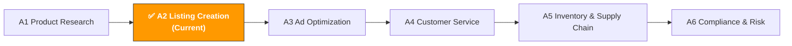

[🇨🇳 中文](../../../paths/a-operators/a2-listing-optimization.md) | 🇺🇸 English (current)

# A2. Listing & Content Creation

> **Path**: Path A: Operators · **Module**: A2  
> **Last Updated**: 2026-03-12  
> **Difficulty**: ⭐⭐ Intermediate  
> **Estimated Time**: 30 minutes per day, 1–2 weeks
---

🏠 [Hub Home](../../README.md) · 📋 [Path A Overview](README.md)



---

## 📖 Module Navigation

1. [Listing Methodology](#1-listing-methodology-the-fundamentals-before-ai) · 2. [AI Tool Landscape](#2-ai-tool-landscape-what-to-use-for-listings) · 3. [Prompt Template Library](#3-prompt-template-library-listing-specific) · 4. [Listing Workflow in Practice](#4-listing-workflow-in-practice) · 5. [Common Pitfalls](#5-common-listing-pitfalls) · 6. [Advanced Techniques](#6-advanced-techniques) · 7. [Learning Resources](#7-learning-resources) · 8. [🦞 OpenClaw Automation](#8-automate-listing-workflows-with-openclaw) · 9. [Completion Checklist](#9-completion-checklist)


## What You'll Learn in This Module

Use AI tools to compress a full day of listing writing into 1–2 hours. From keyword placement to A+ Content design, build a reusable AI-assisted workflow for creating and optimizing listings.

After completing this module, you'll be able to:
- Generate a complete listing draft — title, bullet points, description, and Search Terms — in one shot with ChatGPT/Claude, and understand why AI-generated drafts always need human refinement
- Use AI for multilingual localization (not literal translation), making German/Japanese/Spanish listings read like they were written by a native speaker
- Use AI to reverse-engineer competitor listing strategies, uncovering keyword coverage gaps and differentiation opportunities
- Use AI to generate A+ Content copy, product image text, and A/B testing plans
- Build a complete SOP from "keyword research" to "listing goes live"
- Understand the 2026 trends: how Amazon Rufus AI Shopping Assistant and Generative Search Optimization (GEO) are changing the way listings should be written

---

## 1. Listing Methodology: The Fundamentals Before AI

### 1.1 Amazon Search Algorithm Evolution: From A9 to COSMO + Rufus

> 📎 **Related Reading**: [AI Application Landscape](../0-foundations/ai-landscape.md#ai-application-landscape-assessment-ai-application-landscape-for-cross-border-e-commerce) — Full landscape analysis of Rufus/COSMO's impact on listings · [D4 Walmart AI Guide](../d-platforms/d4-walmart-ai-guide.md#23-walmart-rich-media-similar-to-a-content) — Walmart Rich Media (similar to A+) covered in D4

At its core, a listing is about finding the balance between "being discovered" and "being clicked and purchased." But between 2024 and 2026, Amazon's search system went through three major upgrades, and listing optimization strategies had to evolve with them:

**Algorithm Evolution Timeline:**

| Phase | Period | Core Logic | Listing Strategy |
|-------|--------|-----------|-----------------|
| **A9** | 2015–2024 | Keyword matching + sales velocity | Stuff keywords, boost rankings with launch tactics |
| **A10** | 2024–2025 | Organic conversion + external traffic + customer satisfaction | Focus on real conversion rates, external traffic, lower return rates |
| **COSMO** | 2025–2026 | Semantic understanding + intent matching + knowledge graph | Shift from "keyword matching" to "intent matching" — listings need to answer "who needs this and why" |
| **Rufus** | 2024–2026 | AI shopping assistant + natural language Q&A | Listings become a "product knowledge base" that can answer natural language questions |

**Key Changes in A10 vs A9:**

```
A9 时代：排名 = 关键词匹配 × 销售速度（PPC 推动的销量权重高）
A10 时代：排名 = 关键词匹配 × 有机转化率 × 外部流量 × 客户满意度

A10 新增/加权的因素：
├── 有机销售权重 > PPC 销售权重（不能只靠广告冲排名了）
├── 外部流量加分（从 Google/社交媒体引流到 Amazon 有额外权重）
├── 客户满意度信号（退货率、Review 评分、A-to-Z Claim）
├── 账户健康度（品牌注册、卖家评级、库存表现）
└── 关键词堆砌惩罚（不自然的关键词密度会被降权）
```

**COSMO (COmmon Sense MOdeling) — The 2025 Game Changer:**

COSMO is Amazon's "common-sense knowledge graph" built on large language models. Instead of just checking whether keywords match, it understands the semantic relationship between products and user needs.

```
A9/A10 的匹配方式：
  用户搜索 "camping charger" → 匹配标题/五点中包含 "camping" 和 "charger" 的产品

COSMO 的匹配方式：
  用户搜索 "camping charger" → COSMO 理解：
  ├── 用户场景：户外露营，可能没有电源
  ├── 用户需求：便携、大容量、防水、太阳能充电
  ├── 关联属性：轻便、耐用、多接口、LED 灯
  └── 匹配产品：不只看关键词，还看产品属性是否满足露营场景的需求
```

**How COSMO Impacts Listings:**
1. **Scenario-based descriptions matter more than keywords** — Your listing needs to clearly state "who uses this product in what scenario"
2. **Attribute completeness** — Fill in all product attributes (material, dimensions, use cases, compatibility); COSMO reads this structured data
3. **Content consistency** — Information across title, bullets, description, and A+ Content must be consistent; COSMO detects contradictions
4. **Semantic richness** — Use natural language to describe usage scenarios and problems solved, not just feature specs

**Rufus — AI Shopping Assistant (see [§6.1](#61-amazon-rufus-optimization-2026-trend) for details):**

Rufus is a consumer-facing AI assistant that lets users ask natural language questions (e.g., "What's the best portable charger for a 3-day camping trip?"). Rufus pulls information from listings, reviews, Q&A, and A+ Content to answer. This means your listing isn't just for humans — it's also for AI.

> 💡 **2026 Core Insight**: Listing optimization has shifted from a "keyword game" to "intent matching + AI readability." The value of AI helping you write listings isn't just "writing faster" — it's "writing something that COSMO can understand, Rufus can cite, and real humans will buy."

Content rephrased for compliance with licensing restrictions. Sources: [ZonGuru COSMO Guide](https://www.zonguru.com/blog/what-is-amazon-cosmo), [ZonGuru Amazon SEO 2026](https://www.zonguru.com/blog/amazon-seo-guide), [MyAmazonGuy COSMO+Rufus](https://myamazonguy.com/seo/amazon-seo-in-the-age-of-ai), [BareGold A10 Playbook](https://baregold.ca/resources/amazon-a10-algorithm-in-2026-the-listing-optimization-playbo)

### 1.2 Listing Components

| Component | Character Limit | Impact on Ranking | Impact on Conversion | How AI Helps |
|-----------|----------------|-------------------|---------------------|-------------|
| **Title** | 200 chars (recommended ≤150) | ⭐⭐⭐⭐⭐ Highest weight | ⭐⭐⭐⭐ Above the fold | Keyword placement + readability balance |
| **Bullet Points** | 500 chars each (recommended 200–300) | ⭐⭐⭐⭐ High weight | ⭐⭐⭐⭐⭐ Decision driver | Selling point extraction + keyword integration |
| **Product Description** | 2,000 chars | ⭐⭐⭐ Medium | ⭐⭐⭐ Supplementary info | Brand story + scenario writing |
| **A+ Content** | No char limit (modular) | ⭐⭐ Indirect (better conversion → better ranking) | ⭐⭐⭐⭐⭐ Visual persuasion | Copy generation + layout suggestions |
| **Search Terms** | 250 bytes (backend) | ⭐⭐⭐⭐ High weight | None (invisible to shoppers) | Keyword filtering + deduplication |
| **Images** | Main image + 6 secondary | ⭐ Indirect | ⭐⭐⭐⭐⭐ First impression | Image copy + scenario suggestions |

**Title Golden Rules:**
- The first 80 characters matter most (that's all mobile shows)
- Format: `Brand Name + Core Keyword + Key Benefit + Specs/Quantity`
- Don't use ALL CAPS (Amazon may suppress visibility)
- Don't use promotional words ("Best," "#1," "Sale")

**Bullet Point Golden Rules:**
- Start each bullet with a capitalized benefit phrase (e.g., "ULTRA-LIGHTWEIGHT DESIGN")
- Lead with user benefits, then product features
- Put the most important selling points in the first two bullets (many shoppers only read those)
- Weave in keywords naturally without sacrificing readability

### 1.3 AI's Role in Listing Creation

What AI is good at:
- **Keyword placement**: Naturally weaving 50 keywords into titles and bullets — doing this manually requires endless tweaking
- **Multilingual localization**: Not just translating, but rewriting based on the target market's search habits
- **Structured output**: Generating title, bullets, description, and Search Terms in a fixed format to avoid omissions
- **Competitor analysis**: Quickly reverse-engineering competitor keyword strategies and positioning
- **A/B test variants**: Generating multiple versions of titles or bullets for Manage Your Experiments testing

What AI is not good at:
- **Keyword data**: AI doesn't know which keywords have high search volume (you need Helium 10/Jungle Scout for that)
- **Compliance review**: Amazon's listing policies update frequently; AI may use outdated rules (see [A6 Compliance Module](a6-compliance.md))
- **Visual design**: A+ Content image design requires professional tools (Canva/Photoshop); AI can only provide copy and layout suggestions
- **Brand voice**: Your brand tone needs to be defined by humans; AI can mimic but not create it
- **Mobile preview**: AI doesn't know how your listing actually looks on a phone screen

> 💡 **Core Principle**: Use tools for keyword data, AI for copy generation and optimization, and humans for final review and brand voice control. An AI-generated listing is an 80-point first draft; human refinement brings it to 95.

---

## 2. AI Tool Landscape: What to Use for Listings

### 2.1 Paid Tool Deep Dive

| Tool | Price | Core Capability | Best For | AI Features |
|------|-------|----------------|----------|-------------|
| [Helium 10 Listing Builder](https://www.helium10.com/) | $29–229/mo | AI-driven listing generator, keyword scoring, competitor comparison | Intermediate sellers who need data-driven keywords | Auto-generate title/bullets/description, keyword usage tracking |
| [Jungle Scout AI Assist](https://www.junglescout.com/) | $29–84/mo | Natural language query listing generation, review insights | Beginners, user-friendly interface | Describe your product in plain language to generate a listing |
| [Launch Fast](https://launchfast.ai/) | ~$50/mo | Analyzes 200+ keywords + Top 10 competitors, generates optimized listings | Data-driven sellers | Competitor analysis + keyword coverage + AI generation |
| [SellerApp Listing Optimizer](https://www.sellerapp.com/) | $39–149/mo | Listing quality scoring, keyword tracking, optimization suggestions | Sellers who need ongoing listing performance monitoring | AI optimization suggestions, keyword rank tracking |
| [Canva AI](https://www.canva.com/) | Free–$12.99/mo | A+ Content design, product image editing, AI image generation | All sellers (essential for A+ Content) | Magic Design, AI background removal, text-to-image |
| [Leonardo.ai](https://leonardo.ai/) | Free–$24/mo | AI product scene generation, style-consistent image series | Sellers who need high-quality product lifestyle images | Text-to-image, image style transfer |
| [Midjourney](https://www.midjourney.com/) | $10–60/mo | Highest quality AI image generation | Brand sellers pursuing premium visuals | Text-to-image (requires Discord) |

**Tool Selection Guide:**

**Budget-friendly (<$50/mo)**: ChatGPT/Claude + Canva Free
- ChatGPT/Claude generates full listing copy (title, bullets, description, Search Terms)
- Canva Free for A+ Content design (templates are sufficient)
- Manually check keyword rankings in Amazon Seller Central

**Getting serious ($100–200/mo)**: Helium 10 + Canva Pro
- Helium 10's Listing Builder is the industry standard — it tracks your keyword usage rate and tells you which high-volume keywords you're missing
- Canva Pro's AI features (background removal, Magic Design) dramatically speed up A+ Content creation
- Pair with ChatGPT for multilingual localization

**Brand sellers ($200+/mo)**: Helium 10 + Canva Pro + Leonardo.ai/Midjourney
- Leonardo.ai or Midjourney generates brand-consistent product lifestyle images
- Ideal for brands with lots of visual content needs (multiple SKUs, multiple markets)

> 💡 **Key Insight**: The core value of listing tools is keyword data, not AI generation capability. Helium 10's AI-generated listings aren't necessarily better than ChatGPT's, but it can tell you which keywords have high search volume and low competition — something ChatGPT can't do. Best combo: Helium 10 for keyword research, ChatGPT/Claude for copy generation.

Content rephrased for compliance with licensing restrictions. Sources: [amazonfba.org listing tools](https://amazonfba.org/blog/tool-comparisons/best-amazon-listing-optimization-tools), [voc.ai listing tools](https://www.voc.ai/blog/best-amazon-listing-optimization-tools)

### 2.2 Free Tool Combinations

| Tool | Use Case | Link |
|------|----------|------|
| ChatGPT / Claude | Full listing generation, competitor analysis, multilingual localization, A+ copy | [chat.openai.com](https://chat.openai.com/) / [claude.ai](https://claude.ai/) |
| [DeepL](https://www.deepl.com/) | High-quality translation, especially European languages (DE/FR/ES/IT) | [deepl.com](https://www.deepl.com/) |
| [Canva](https://www.canva.com/) | A+ Content design, product image editing (free tier is sufficient) | [canva.com](https://www.canva.com/) |
| [Leonardo.ai](https://leonardo.ai/) | AI product scene generation (150 free tokens/day) | [leonardo.ai](https://leonardo.ai/) |
| [Amazon Listing Quality Dashboard](https://sellercentral.amazon.com/) | Official listing quality scoring (inside Seller Central) | Seller Central → Listing Quality |
| Google Translate | Quick understanding of competitor foreign-language listings (not for final translations) | [translate.google.com](https://translate.google.com/) |

**Free Tool Strategy:**

1. **ChatGPT/Claude as your copy workhorse**: The free tier can generate high-quality listing copy. The key is writing good prompts (see Section 3).
2. **DeepL for translation quality checks**: Cross-verify AI-generated multilingual listings with DeepL. DeepL's European language translations are noticeably better than Google Translate.
3. **Canva for A+ Content**: No Photoshop skills needed. Canva's Amazon A+ Content templates are ready to use — just swap out text and images.
4. **Amazon Listing Quality Dashboard**: This is Amazon's official listing scoring tool — free and authoritative. It tells you what your listing is missing (e.g., no A+ Content, not enough images, etc.).

### 2.3 Open-Source Tools

| Tool/API | Use Case | GitHub/Link |
|----------|----------|-------------|
| python-amazon-sp-api | Fetch product catalog data and listing info via SP-API | [github.com/saleweaver/python-amazon-sp-api](https://github.com/saleweaver/python-amazon-sp-api) |
| Amazon SP-API Catalog Items | Get structured data (title, bullets, description) from competitor listings | [developer-docs.amazon.com/sp-api](https://developer-docs.amazon.com/sp-api) |

**When to use open-source tools?**

If you manage 50+ SKUs or need to optimize listings in bulk, manual work is too slow. With SP-API you can:
- **Bulk-pull competitor listings**: Automatically fetch titles, bullets, and descriptions from the Top 10 competitors and feed them to AI for analysis
- **Bulk-update listings**: Upload AI-generated listings via API instead of editing one by one in Seller Central
- **Monitor listing changes**: Periodically check whether competitors have updated their titles or selling points

> For more technical implementation details, see the relevant modules in [Path B: Developers](../b-developers/).

---

## 3. Prompt Template Library (Listing-Specific)

> The full standardized templates (with verification status, contributor info, and share links) are in [prompts/listing-optimization.md](../../prompts/listing-optimization.md).
> This section provides deep analysis, common mistakes, and advanced variants for each template.

### 3.1 Full Listing Generation (Title + Bullets + Description + Search Terms)

**Why this prompt works:** It generates all listing components in one shot, ensuring keywords aren't wasted through duplication across sections. Key design points:
- "First 80 characters contain the most important keywords" — Optimized for mobile, where most shoppers browse
- "Start with a capitalized selling point" — Follows Amazon bullet point best practices
- "Don't repeat words already in the title" — A core Search Terms principle many sellers don't know
- "Language matches the search and reading habits of the target market's consumers" — Prevents AI from writing copy that's "correct but unnatural"

**Common Mistakes:**
- ❌ Not providing a keyword list → AI will guess keywords, but it doesn't know which ones have high search volume. You must export keywords from Helium 10/Jungle Scout and feed them to AI.
- ❌ Not specifying the target market → Search habits vary dramatically across markets. US shoppers search "portable charger," UK shoppers search "power bank."
- ❌ Too few keywords (<10) → AI doesn't have enough material for keyword placement. Aim for 30–50 keywords.
- ❌ Not providing competitor info → AI can't differentiate. At minimum, tell AI how your product differs from competitors.
- ❌ Using the first draft as-is → AI's first draft is 80 points. You need to manually check keyword coverage, brand voice, and compliance.

[Full template → prompts/listing-optimization.md](../../prompts/listing-optimization.md)

**Advanced Variants:**

**Variant A — Market-Specific Adaptation:**

```
你是一个精通 Amazon [US/DE/JP] 市场的 Listing 专家。

产品信息：
- 产品名称：[名称]
- 核心卖点：[卖点1]、[卖点2]、[卖点3]
- 目标客户：[客户画像]
- 核心关键词（来自 Helium 10）：[关键词列表，含搜索量]
- 与竞品的差异化：[你的产品独特之处]

请生成适合 [目标市场] 的 Listing：
1. 标题（不超过 200 字符，前 80 字符包含搜索量最高的关键词）
2. 5 个 Bullet Points（每条以大写卖点开头，融入关键词，突出差异化）
3. 产品描述（200 字以内，讲品牌故事和使用场景）
4. 后台 Search Terms（5 行，每行不超过 250 字节，不重复标题和五点中已用的词）

市场适配要求：
- [US] 强调性价比和便利性，语言直接有力
- [DE] 强调品质和技术参数，语言严谨专业
- [JP] 强调细节和用户体验，语言礼貌含蓄
```

> 💡 **Why use this variant**: The listing strategy for the same product is completely different across markets. US consumers value "value for money," German consumers value "Qualität" (quality), and Japanese consumers value "使いやすさ" (ease of use).

**Variant B — Category-Specific Style:**

```
你是一个 Amazon Listing 专家。请根据品类特点调整写作风格：

品类：[选择一个]
- 电子产品 → 强调技术参数、兼容性、保修
- 家居用品 → 强调场景、美观、材质安全
- 运动户外 → 强调性能、耐用、使用场景
- 美妆个护 → 强调成分、效果、使用感受
- 母婴用品 → 强调安全认证、材质、年龄适用

产品信息：[填写]
关键词列表：[填写]

请按该品类的消费者期望风格生成 Listing。
```

> 💡 **Why use this variant**: Electronics bullets should list specs ("5000mAh battery, charges iPhone 15 twice"), while home goods bullets should paint a scene ("Perfect for your morning coffee ritual"). Category dictates copy style.

---

### 3.2 Multilingual Localization (Not Literal Translation)

> 📎 **Related Reading**: [D6 Southeast Asia AI Guide](../d-platforms/d6-southeast-asia-ai-guide.md#d6-southeast-asia-e-commerce-ai-guide-shopee-lazada) — 6-language localization for Southeast Asia covered in D6

**Why this prompt works:** It explicitly tells AI "this is not word-for-word translation" and requires AI to annotate what localization adjustments were made. Key design points:
- "Replace with commonly searched keywords in the local market" — Literally translated keywords often aren't what local consumers actually search for
- "Adjust selling point order" — Different markets have different priority concerns
- "Annotate localization adjustments and reasons" — Lets you understand what AI changed, making review easier

**Common Mistakes:**
- ❌ Using Google Translate directly → Poor translation quality, keywords don't match local search habits
- ❌ Not telling AI about target market requirements → e.g., Germany requires CE certification labeling, Japan requires PSE certification
- ❌ Not having a native speaker review → AI translations may be grammatically correct but sound unnatural. At minimum, cross-verify with DeepL.
- ❌ Using the same selling point order for all markets → US consumers care most about price, German consumers about quality, Japanese consumers about details

[Full template → prompts/listing-optimization.md](../../prompts/listing-optimization.md)

**Advanced Variants:**

**Variant A — German-Specific Considerations:**

```
将以下英文 Listing 本地化为德语版本。

[粘贴英文 Listing]

德语市场特殊要求：
1. 德国消费者重视技术参数和认证（CE、TÜV、GS）— 在五点中突出
2. 德语复合词很长，标题容易超限 — 控制在 200 字符以内
3. 德国人对"夸大宣传"反感 — 避免 "best"、"amazing" 等词，用数据说话
4. 正式用语（Sie）而非非正式（du）— 除非品牌定位年轻化
5. 注意德语的名词大写规则和复合词拼写

请标注你做了哪些本地化调整及原因。
```

**Variant B — Japanese-Specific Considerations:**

```
将以下英文 Listing 本地化为日语版本。

[粘贴英文 Listing]

日语市场特殊要求：
1. 日本消费者重视包装和细节 — 如果产品有精美包装，在五点中强调
2. 使用敬语（です/ます体）— 日本 Amazon 的标准语体
3. 日本消费者喜欢具体的使用场景描述 — 比如"通勤電車の中で使える"
4. 标题中混用片假名和汉字是正常的 — 品牌名用片假名，品类词用汉字
5. 日本消费者重视"安心感" — 强调保修、退换政策、日本国内发货
6. 注意 PSE 认证标注（电子产品必须）

请标注你做了哪些本地化调整及原因。
```

**Variant C — Spanish-Specific Considerations:**

```
将以下英文 Listing 本地化为西班牙语版本（Amazon ES 站）。

[粘贴英文 Listing]

西班牙语市场特殊要求：
1. 使用西班牙本土西班牙语（castellano），不是拉美西班牙语
2. 西班牙消费者对价格敏感 — 强调性价比
3. 使用 usted（正式）而非 tú（非正式）
4. 西班牙市场的搜索关键词可能和拉美市场不同 — 确认使用本土词汇
5. 注意西班牙语的倒问号（¿）和倒感叹号（¡）

请标注你做了哪些本地化调整及原因。
```

> 💡 **Core principle of multilingual localization**: Translation alone is 60 points; localization is 90 points. Localization = translation + keyword replacement + selling point reordering + cultural adaptation. Use AI for the first draft, DeepL for cross-verification, and ideally a native speaker for final review.

---

### 3.3 Competitor Listing Strategy Teardown

**Why this prompt works:** It requires AI to compare competitor listings across multiple dimensions, rather than simply "seeing how others write." Key design points:
- "Summarize core positioning in one sentence" — Forces AI to distill the essence instead of restating content
- "Commonly emphasized selling points = category must-haves" — Helps you distinguish "must-have" from "differentiator"
- "Keyword coverage comparison table" — Quantitative analysis, not subjective impressions

**Common Mistakes:**
- ❌ Analyzing only 1 competitor → Can't distinguish "category standard" from "individual strategy." Analyze at least 3.
- ❌ Only looking at titles → Bullets and Search Terms contain even more keyword strategy. Analyze the full listing.
- ❌ Only looking at text, not images → Competitor main images and A+ Content may convey different messages than the text.
- ❌ Not recording analysis results → The value of competitor analysis is in accumulation. Use a spreadsheet and update regularly.

[Full template → prompts/listing-optimization.md](../../prompts/listing-optimization.md)

**Advanced Variants:**

**Variant A — Keyword Coverage Comparison:**

```
以下是 3 个竞品的完整 Listing（标题 + 五点 + 描述）和我的关键词列表（来自 Helium 10 Cerebro）。

竞品A：[粘贴完整 Listing]
竞品B：[粘贴完整 Listing]
竞品C：[粘贴完整 Listing]

我的目标关键词列表（含搜索量）：
[粘贴关键词列表]

请输出：
1. 关键词覆盖对比表（每个关键词在哪个竞品的哪个位置出现）
2. 所有竞品都覆盖的关键词（我必须覆盖）
3. 没有竞品覆盖的高搜索量关键词（我的机会）
4. 我的 Listing 应该如何布局这些关键词
```

> 💡 **Why use this variant**: The "gaps" in keyword coverage are your opportunities. If a keyword with 5,000 monthly searches isn't used in any competitor's title, using it gives you extra exposure.

**Variant B — Selling Point Differentiation Analysis:**

```
分析以下 3 个竞品的五点（Bullet Points），找出差异化机会：

竞品A 五点：[粘贴]
竞品B 五点：[粘贴]
竞品C 五点：[粘贴]

我的产品独特卖点：[列出]

请输出：
1. 竞品共同强调的卖点（品类标配，我必须有）
2. 竞品各自独有的卖点（他们的差异化策略）
3. 没有竞品提到但用户可能关心的卖点（来自 Review 分析）
4. 我的五点应该如何排序和措辞，才能最大化差异化
```

---

### 3.4 A+ Content Copy Generation

**Why you need this prompt:** A+ Content (Enhanced Brand Content) can boost conversion rates by 3–10% (Amazon's official data). But many sellers' A+ Content just repeats the bullet points with images slapped on. Good A+ Content should tell a brand story, showcase usage scenarios, and use comparison charts to persuade shoppers.

**Common Mistakes:**
- ❌ A+ Content is identical to bullet points → Wasted display space. A+ should supplement what the bullets don't cover.
- ❌ Too much text, too few images → A+ Content is visually driven; text is supplementary. Keep each module under 50 words.
- ❌ Not using comparison charts → Comparison charts (vs competitors, vs previous version, before/after) are the highest-converting A+ modules.
- ❌ Ignoring the Brand Story module → Brand Story appears above reviews — it's free brand exposure.

```
你是一个 Amazon A+ Content 文案专家。请为以下产品生成 A+ Content 文案：

产品：[名称]
品牌：[品牌名]
核心卖点：[3-5 个卖点]
目标客户：[客户画像]
品牌故事：[简要描述品牌理念和创立背景]

请生成以下 A+ 模块的文案：

1. **品牌故事横幅**（Brand Story）
   - 品牌理念（一句话）
   - 品牌背景（50 字以内）
   - 3 个品牌价值关键词

2. **产品核心卖点模块**（Standard Image & Text）
   - 3 个卖点，每个包含：标题（5 字以内）+ 描述（30 字以内）+ 图片建议

3. **对比图模块**（Comparison Chart）
   - 我的产品 vs 普通产品的 5 个维度对比
   - 每个维度用 ✅/❌ 或具体数据对比

4. **使用场景模块**（Standard Image & Text）
   - 4 个使用场景，每个包含：场景名称 + 一句话描述 + 图片建议

5. **FAQ 模块**
   - 5 个最常见的客户问题和回答（来自竞品 Review 中的疑问）

要求：文字简洁有力，每个模块的文字不超过 50 字。A+ Content 是视觉驱动的，文字只是辅助。
```

**Advanced Variant — Brand Story Focus:**

```
为我的品牌生成 Amazon Brand Story 文案。Brand Story 出现在 Review 上方，是免费的品牌曝光位。

品牌名：[名称]
品牌创立年份：[年份]
品牌理念：[一句话]
创始人故事：[简要背景]
产品线：[列出主要产品]

请生成：
1. 品牌背景卡片（Brand Card）— 品牌 logo 旁的一段话（100 字以内）
2. 3 个品牌价值卡片 — 每个包含图标建议 + 标题 + 一句话描述
3. 品牌问答（Brand Q&A）— 3 个问答，展示品牌专业性

语气要求：专业但亲切，让消费者感受到这是一个"认真做产品"的品牌。
```

---

### 3.5 Search Terms Optimization

**Why you need this prompt:** Search Terms are the most commonly wasted part of a listing. With 250 bytes of backend space, many sellers either fill it with duplicate words, irrelevant terms, or leave it blank entirely. AI can help you filter competitor reverse-lookup keywords into the optimal Search Terms combination.

**Common Mistakes:**
- ❌ Repeating words already in the title and bullets → Amazon already indexes keywords from the title and bullets; repeating them in Search Terms wastes space
- ❌ Using commas or semicolons as separators → Amazon officially recommends spaces; commas waste bytes
- ❌ Including brand names → Your own brand is already in the title; competitor brand names aren't allowed in Search Terms
- ❌ Including ASINs → No indexing value
- ❌ Exceeding 250 bytes → Anything beyond the limit won't be indexed. Note: it's bytes, not characters — one Chinese character = 3 bytes

```
你是一个 Amazon Search Terms 优化专家。

以下是我的 Listing 当前状态：
- 标题：[粘贴标题]
- 五点：[粘贴五点]

以下是从 Helium 10 Cerebro 反查的竞品关键词（含搜索量）：
[粘贴关键词列表]

请帮我生成最优的 Search Terms：

规则：
1. 不重复标题和五点中已出现的词（逐词检查）
2. 优先选择搜索量高但标题/五点未覆盖的关键词
3. 用空格分隔，不用逗号
4. 总字节数不超过 250（英文1字符=1字节，中文1字符=3字节）
5. 不包含品牌名、ASIN、"best"/"cheap" 等主观词
6. 包含常见拼写错误和同义词

输出：
1. 推荐的 Search Terms（5 行）
2. 每行包含的关键词及其搜索量
3. 总字节数统计
4. 被排除的关键词及排除原因
```

**Advanced Variant — Multilingual Search Terms:**

```
我的产品在 Amazon [DE/JP/ES] 站销售。
以下是英文版 Search Terms：[粘贴]

请生成目标语言的 Search Terms，注意：
1. 不是直译英文关键词，而是用当地消费者实际搜索的词
2. 包含当地语言的常见拼写变体和同义词
3. [DE] 注意德语复合词（如 Handyhülle = 手机壳）
4. [JP] 注意片假名和平假名的搜索差异
5. 总字节数不超过 250
```

> 💡 **Core principle of Search Terms**: They're a "supplement" to the title and bullets, not a "repeat." Think of it as a 250-byte "keyword patch" specifically for covering long-tail terms that didn't fit in the title and bullets.

---

### 3.6 Listing Quality Audit

**Why you need this prompt:** Existing listings often have plenty of room for improvement, but sellers are too close to see it. Having AI do a comprehensive audit is like hiring an outside consultant.

**Common Mistakes:**
- ❌ Only auditing text, not images → Images impact conversion rate more than text
- ❌ Not providing competitor comparisons → An audit without benchmarks lacks focus
- ❌ Not executing after the audit → The value of an audit report is in execution. Prioritize findings and improve one item per week.

```
你是一个 Amazon Listing 审计专家。请对以下 Listing 做全面质量审计：

我的 Listing：
- ASIN：[ASIN]
- 标题：[粘贴]
- 五点：[粘贴]
- 描述：[粘贴]
- Search Terms：[粘贴]
- 图片数量：[X] 张
- A+ Content：有/无
- Review 评分：[X] 星，[X] 条评价

竞品参考（BSR 前 3）：
- 竞品A 标题：[粘贴]
- 竞品B 标题：[粘贴]

请从以下维度审计并评分（每项 1-10 分）：

1. **关键词覆盖**：标题是否包含高搜索量关键词？五点是否自然融入关键词？
2. **标题质量**：前 80 字符是否包含最重要的信息？格式是否规范？
3. **五点说服力**：是否以利益（benefit）开头？是否突出差异化？
4. **描述质量**：是否讲了品牌故事？是否有使用场景？
5. **Search Terms 效率**：是否有重复？是否浪费了空间？
6. **移动端友好**：标题前 80 字符在手机上是否有吸引力？
7. **A+ Content**：是否有？质量如何？
8. **合规性**：是否有违规词（best、#1、guaranteed 等）？
9. **与竞品对比**：相比竞品，优势和劣势是什么？

输出：
- 总分和各项评分
- 前 3 个最需要改进的点（按影响力排序）
- 每个改进点的具体修改建议
- 修改后的示例文案
```

**Advanced Variant — Mobile-Specific Audit:**

```
超过 70% 的 Amazon 购物发生在移动端。请专门从移动端视角审计我的 Listing：

标题：[粘贴]
五点：[粘贴]

移动端审计要点：
1. 标题前 80 字符是否传达了核心价值？（手机只显示这么多）
2. 五点前两条是否是最重要的卖点？（手机上默认只展开前两条）
3. 五点每条是否在 200 字符以内？（太长在手机上阅读体验差）
4. 是否有 emoji 辅助扫读？（适度使用 emoji 可以提升移动端可读性）
```

---

### 3.7 Product Image Copy (Text on Images)

**Why you need this prompt:** The text on Amazon secondary images (infographic images) is a key conversion driver. Good image copy can convey core selling points even when shoppers don't read the bullets. But many sellers' image copy is either too long (unreadable on mobile) or too generic ("high-quality material").

**Common Mistakes:**
- ❌ Too much text on images → Unreadable on mobile. Keep each image under 20 words of text.
- ❌ Image text is identical to bullets → Wasted visual communication opportunity. Image copy should be more concise and impactful.
- ❌ Adding text to the main image → Amazon's main image policy prohibits text, logos, and watermarks. Only secondary images can have text.
- ❌ Not considering image order → Image order is your "visual sales funnel." The first secondary image should feature your strongest selling point.

```
你是一个 Amazon 产品图片文案专家。请为以下产品生成 6 张副图的文案方案：

产品：[名称]
核心卖点：[3-5 个卖点]
目标客户：[客户画像]
竞品常见图片策略：[描述竞品图片的特点]

请为每张副图生成：
1. **图片主题**（这张图要传达什么信息）
2. **标题文案**（5 个词以内，大字体）
3. **副标题文案**（15 个词以内，小字体）
4. **图片建议**（应该拍什么样的照片/场景）

6 张副图的推荐顺序：
- 图2：核心卖点总览（信息图）
- 图3：最强差异化卖点（对比图）
- 图4：使用场景 1
- 图5：使用场景 2
- 图6：产品细节/材质/尺寸
- 图7：包装内容/配件清单

要求：
- 文案简洁有力，手机上能看清
- 每张图的标题不超过 5 个词
- 突出与竞品的差异化
```

**Advanced Variant — Main Image Optimization Suggestions:**

```
我的产品主图点击率（CTR）低于品类平均。请分析可能的原因并给出优化建议：

产品：[名称]
当前主图描述：[描述当前主图的构图、角度、背景]
竞品主图特点：[描述 3 个竞品的主图]
品类平均 CTR：[X]%
我的 CTR：[X]%

主图优化方向（在 Amazon 政策允许范围内）：
1. 拍摄角度建议
2. 产品摆放方式
3. 是否需要展示配件/包装
4. 产品尺寸感的传达方式
5. 背景和光线建议
```

---

### 3.8 Listing A/B Test Plan Generation

**Why you need this prompt:** Amazon's "Manage Your Experiments" feature lets brand-registered sellers A/B test titles, images, and A+ Content. But many sellers don't know what to test or how to design a test plan. AI can help you generate statistically meaningful test plans.

**Common Mistakes:**
- ❌ Changing too many variables at once → Can't tell which change drove the result. Test one variable at a time.
- ❌ Test duration too short → Run for at least 2 weeks (covering a full purchase cycle). Amazon recommends 4–8 weeks.
- ❌ Not recording test results → The value of testing is in accumulated learnings. Use a spreadsheet to record each test's hypothesis, results, and conclusions.
- ❌ Testing trivial changes → Changing "lightweight" to "ultra-light" won't produce a significant difference. Tests should focus on major strategic changes.

```
你是一个 Amazon A/B 测试专家。请为以下 Listing 设计 A/B 测试方案：

当前 Listing：
- 标题：[粘贴]
- 五点：[粘贴]
- 当前转化率：[X]%
- 日均流量：[X] 次

请设计 3 个 A/B 测试方案（按优先级排序）：

每个方案包含：
1. **测试假设**：我认为 [改动] 会导致 [预期效果]，因为 [原因]
2. **控制组（A）**：当前版本
3. **测试组（B）**：修改后的版本（给出具体文案）
4. **测试变量**：只改了什么（确保单一变量）
5. **预期影响**：转化率提升 [X]%
6. **建议测试时长**：[X] 周
7. **成功标准**：转化率提升 ≥ [X]% 且统计显著（p < 0.05）

优先级排序原则：
- 优先测试对转化率影响最大的元素（标题 > 主图 > 五点 > A+）
- 优先测试改动幅度大的方案（策略性改动 > 措辞微调）
```

**Advanced Variant — Title A/B Test Focus:**

```
为我的产品标题设计 3 个 A/B 测试变体：

当前标题：[粘贴]
核心关键词（按搜索量排序）：[列表]
竞品标题参考：[粘贴 3 个竞品标题]

变体设计方向：
- 变体1：关键词优先（把搜索量最高的词放最前面）
- 变体2：卖点优先（把最强差异化卖点放最前面）
- 变体3：场景优先（用使用场景开头，如 "For Travel..."）

每个变体标注：关键词覆盖率变化、预期对 CTR 和转化率的影响。
```

---

## 4. Listing Workflow in Practice

### 4.1 Complete Listing Creation SOP (6-Step Method)

This SOP compresses the traditional full-day listing creation process into 2–3 hours. Each step notes the tools and prompts used.

```
┌─────────────────────────────────────────────────────────┐
│  Step 1: Keyword Research (45 min)                       │
│  Tools: Helium 10 Cerebro / Jungle Scout Keyword Scout   │
│  Action: Reverse-lookup Top 5 competitor keywords,       │
│          export 50–100 keywords                          │
│  AI: Keyword demand clustering (see A1 Module §3.3)      │
│  Output: Keyword list sorted by search volume + clusters │
├─────────────────────────────────────────────────────────┤
│  Step 2: Competitor Listing Analysis (30 min)            │
│  Tools: Manually collect Top 3 competitors' full listings│
│  AI: Competitor Listing Strategy Teardown Prompt (§3.3)  │
│  Output: Competitor strategy comparison + differentiation│
├─────────────────────────────────────────────────────────┤
│  Step 3: AI-Generated Listing Draft (30 min)             │
│  AI: Full Listing Generation Prompt (§3.1)               │
│  Input: Keyword list + competitor analysis + selling pts │
│  Output: Title + Bullets + Description + Search Terms    │
├─────────────────────────────────────────────────────────┤
│  Step 4: Human Optimization & Compliance Check (30 min)  │
│  Action: Check keyword coverage, brand voice, compliance │
│  Tools: Helium 10 Listing Builder (keyword usage tracker)│
│  AI: Listing Quality Audit Prompt (§3.6)                 │
│  Output: Finalized listing                               │
├─────────────────────────────────────────────────────────┤
│  Step 5: A+ Content Creation (30 min)                    │
│  AI: A+ Content Copy Generation Prompt (§3.4)            │
│  Tools: Canva (design A+ module images)                  │
│  Output: 5–7 A+ Content modules                         │
├─────────────────────────────────────────────────────────┤
│  Step 6: Image Copy & Go Live (15 min)                   │
│  AI: Product Image Copy Prompt (§3.7)                    │
│  Action: Hand off copy to designer / create in Canva     │
│  Output: Complete listing goes live                      │
└─────────────────────────────────────────────────────────┘
```

### 4.2 Listing Optimization SOP (Improving Existing Listings)

Optimizing an existing listing is different from creating one from scratch — you need to diagnose problems first, then make targeted improvements rather than starting over.

```
┌─────────────────────────────────────────────────────────┐
│  Step 1: Diagnosis (30 min)                              │
│  Tools: Amazon Listing Quality Dashboard                 │
│  AI: Listing Quality Audit Prompt (§3.6)                 │
│  Data: Current conversion rate, CTR, keyword rankings    │
│  Output: Issue list (prioritized by impact)              │
├─────────────────────────────────────────────────────────┤
│  Step 2: Keyword Gap Analysis (30 min)                   │
│  Tools: Helium 10 Cerebro (reverse-lookup new competitor │
│         keywords)                                        │
│  AI: Search Terms Optimization Prompt (§3.5)             │
│  Output: Keywords to add + updated Search Terms          │
├─────────────────────────────────────────────────────────┤
│  Step 3: Copy Optimization (30 min)                      │
│  AI: Targeted optimization of title/bullets/description  │
│       based on diagnosis                                 │
│  Principle: Change only one element at a time to track   │
│             impact                                       │
│  Output: Optimized copy                                  │
├─────────────────────────────────────────────────────────┤
│  Step 4: A/B Testing (ongoing, 2–4 weeks)                │
│  AI: A/B Test Plan Generation Prompt (§3.8)              │
│  Tools: Amazon Manage Your Experiments                   │
│  Output: Test results + next optimization direction      │
└─────────────────────────────────────────────────────────┘
```

**Recommended Optimization Cadence:**
- **Weekly**: Check keyword ranking changes; catch any keywords dropping in rank
- **Monthly**: Run a full listing audit; compare against competitor changes
- **Quarterly**: Update Search Terms (seasonal keywords, trending terms)
- **On major changes**: Optimize immediately when competitors cut prices, new competitors enter, or review scores shift

### 4.3 Multilingual Listing Launch SOP

The standard process for expanding an English listing into multilingual versions:

```
┌─────────────────────────────────────────────────────────┐
│  Step 1: Prepare the English Baseline Listing            │
│  Ensure the English version is optimized and verified    │
│  Collect target market keyword data (SellerSprite /      │
│  Helium 10)                                              │
├─────────────────────────────────────────────────────────┤
│  Step 2: AI Localization (20 min per language)            │
│  AI: Multilingual Localization Prompt (§3.2) + language  │
│      variant                                             │
│  Input: English listing + target market keywords         │
│  Output: Localized first draft                           │
├─────────────────────────────────────────────────────────┤
│  Step 3: Cross-Verification (10 min per language)        │
│  Tools: DeepL reverse translation (target language →     │
│         English, check for meaning drift)                │
│  Action: Compare reverse translation with original;      │
│          flag sections with large discrepancies          │
├─────────────────────────────────────────────────────────┤
│  Step 4: Native Speaker Review (optional but recommended)│
│  Have a native speaker review naturalness and cultural   │
│  fit                                                     │
│  Platforms: Fiverr, Upwork, or native-speaking colleagues│
├─────────────────────────────────────────────────────────┤
│  Step 5: Launch & Monitor                                │
│  Upload localized listing; monitor conversion rate       │
│  changes for the first 2 weeks                           │
│  If conversion drops, revert to previous version and     │
│  investigate                                             │
└─────────────────────────────────────────────────────────┘
```

> 💡 **Multilingual launch priority**: If resources are limited, prioritize by market size: DE (Germany) > UK > FR (France) > IT (Italy) > ES (Spain) > JP (Japan). Germany is the largest Amazon market in Europe — localizing into German first delivers the highest ROI.

---

## 5. Common Listing Pitfalls

### 5.1 Keyword-Related Pitfalls

| Pitfall | Symptoms | How to Avoid |
|---------|----------|-------------|
| **Keyword stuffing** | Title crammed with keywords, reads like gibberish | Keep titles readable with naturally integrated keywords. A10/COSMO algorithms penalize keyword stuffing; COSMO prioritizes semantic understanding over keyword density. |
| **Keyword duplication waste** | Same word appears repeatedly across title, bullets, and Search Terms | Amazon only needs a word to appear once for indexing. Use AI to run deduplication checks. |
| **Ignoring long-tail keywords** | Only targeting high-volume head terms, missing precise long-tail terms | Long-tail keywords have lower competition and higher conversion rates. Use Search Terms to cover them. |
| **Never updating keywords** | Keywords unchanged since listing launch | Search trends shift. Re-run competitor keyword reverse lookups with Helium 10 every quarter. |

### 5.2 Mobile-Related Pitfalls

| Pitfall | Symptoms | How to Avoid |
|---------|----------|-------------|
| **Title too long** | Title maxed at 200 chars; mobile only shows the first 80, hiding the rest | Put the most important info in the first 80 characters. Preview your listing on a phone. |
| **Bullets too long** | Each bullet maxed at 500 chars; requires expanding on mobile to read | Keep each bullet to 200–300 characters. Put the most important selling points in the first two. |
| **Image text too small** | Text on secondary images is unreadable on mobile | Preview images on a phone. Title font should be at least 24pt, subtitle at least 16pt. |
| **A+ Content not responsive** | A+ Content looks great on desktop but layout breaks on mobile | Use Amazon's A+ Content preview feature to check the mobile experience. |

### 5.3 A+ Content Pitfalls

| Pitfall | Symptoms | How to Avoid |
|---------|----------|-------------|
| **Duplicate content** | A+ Content says exactly the same thing as the bullets | A+ should supplement what bullets don't cover: brand story, usage scenarios, comparison charts. |
| **Too much text** | A+ modules packed with text, reads like an essay | A+ is visually driven. Keep each module under 50 words; let images do the talking. |
| **No comparison charts** | Missing the most persuasive A+ module type | Comparison charts (vs competitors, vs previous version, before/after) have the highest conversion rates. |
| **Ignoring Brand Story** | Unaware that Brand Story appears above reviews | Brand Story is free brand exposure — every brand-registered seller should set it up. |

### 5.4 Search Terms Pitfalls

| Pitfall | Symptoms | How to Avoid |
|---------|----------|-------------|
| **Exceeding 250 bytes** | Content beyond the limit isn't indexed — wasted effort | Use AI to calculate byte count (English: 1 char = 1 byte; Chinese: 1 char = 3 bytes). |
| **Using commas as separators** | Commas consume bytes with no indexing value | Amazon officially recommends spaces as separators. |
| **Including prohibited words** | Competitor brand names, "best," "cheap," etc. | Refer to Amazon's Search Terms policy; use AI for compliance checks. |
| **Completely blank** | Unaware Search Terms exist or unsure how to fill them | Use the Search Terms Optimization Prompt (§3.5) to generate the optimal combination. |

---

## 6. Advanced Techniques

### 6.1 Amazon Rufus Optimization (2026 Trend)

Amazon Rufus is an AI shopping assistant launched by Amazon in 2024, rolling out globally through 2025–2026. Rufus changes how shoppers buy — instead of just searching keywords, users ask natural language questions (e.g., "What's the best portable charger for camping?").

**How Rufus Impacts Listings:**

1. **Natural language matching**: Rufus doesn't just look at keywords — it understands semantics. Your listing needs to answer questions users might ask, not just contain keywords.
2. **Increased review weight**: Rufus cites review content to answer user questions. Good reviews matter more than good listing copy.
3. **A+ Content gets cited**: Rufus extracts information from A+ Content. A+ is no longer just "looking good" — it's "being read by AI."
4. **FAQ value increases**: Content in the product Q&A section gets directly cited by Rufus. Proactively answering common questions becomes more important.

**Rufus Optimization Prompt:**

```
我的产品是 [名称]，目标市场是 Amazon [US/DE/JP]。

Amazon Rufus AI 购物助手会用自然语言回答用户的购物问题。
请帮我优化 Listing，让 Rufus 更容易引用我的产品信息：

1. 列出用户可能用 Rufus 问的 10 个自然语言问题（如 "What's the best X for Y?"）
2. 对每个问题，检查我的 Listing 是否包含回答这个问题的信息
3. 如果缺少，建议在 Listing 的哪个部分（标题/五点/描述/A+/Q&A）补充
4. 生成 5 个 Q&A 条目，主动回答最常见的购物问题

我的当前 Listing：
- 标题：[粘贴]
- 五点：[粘贴]
- A+ Content 概要：[描述]
```

> 💡 **Core Rufus optimization mindset**: Shift from "keyword optimization" to "question-answer optimization." Your listing isn't just a keyword container — it's a "product knowledge base" that can answer every question a shopper might have about your product.

Content rephrased for compliance with licensing restrictions. Source: [azariangrowthagency.com Rufus playbook](https://azariangrowthagency.com/amazon-ads-ai-shopping-assistants-playbook/)

### 6.2 Generative Search Optimization (GEO/AIO)

GEO (Generative Engine Optimization) or AIO (AI Optimization) is a 2025–2026 trend — it's not just Amazon Rufus; AI search engines like Google SGE, Perplexity, and ChatGPT are also changing how users discover products.

**How GEO Impacts Cross-Border E-Commerce:**

1. **AI search engines recommend products**: Users searching "best portable charger 2026" in Google SGE or Perplexity get direct product recommendations from AI. Your product information needs to be "understood" by these AI engines.
2. **Structured data matters more**: AI engines prefer structured product information (spec tables, comparison data, FAQs).
3. **Brand authority affects ranking**: AI engines reference consistent brand information across multiple platforms.
4. **Reviews and UGC get cited**: AI engines cite real user reviews when recommending products.

**GEO Optimization Prompt:**

```
我的产品是 [名称]，品牌是 [品牌名]。

请帮我优化产品信息，让 AI 搜索引擎（Google SGE、Perplexity、ChatGPT）更容易推荐我的产品：

1. **结构化产品描述**：用清晰的规格表格式描述产品（AI 引擎偏好结构化数据）
2. **FAQ 优化**：生成 10 个用户可能在 AI 搜索引擎中问的问题，并提供简洁准确的回答
3. **对比定位**：用 "比 [竞品] 更 [优势]" 的格式描述产品优势（AI 引擎喜欢对比信息）
4. **使用场景标签**：列出 5 个具体的使用场景（AI 引擎用场景匹配用户需求）
5. **品牌一致性检查**：确保产品描述与品牌官网、社交媒体上的信息一致

输出格式：可以直接用于 Amazon Listing、品牌官网、社交媒体的统一产品信息包。
```

> 💡 **Core GEO mindset**: Traditional SEO is "getting search engines to find you"; GEO is "getting AI engines to recommend you." The difference is that AI engines don't just match keywords — they understand semantics, evaluate authority, and cite user reviews. Your product information needs to be "AI-friendly."

Content rephrased for compliance with licensing restrictions. Source: [bebolddigital.com GEO for Amazon](https://www.bebolddigital.com/blog/generative-engine-optimization-for-amazon)

### 6.3 Cultural Differences in Listing Localization (US vs DE vs JP)

Multilingual listings aren't just a translation problem — they're a cultural adaptation challenge. Consumers in different markets have completely different buying psychology and information preferences.

| Dimension | Amazon US 🇺🇸 | Amazon DE 🇩🇪 | Amazon JP 🇯🇵 |
|-----------|-------------|-------------|-------------|
| **Purchase decision driver** | Value for money, convenience, social proof | Quality, technical specs, eco-friendliness | Details, user experience, sense of security |
| **Title style** | Direct and punchy, emphasize benefits | Precise and professional, emphasize specifications | Polite and understated, emphasize usage scenarios |
| **Bullet preference** | Lead with benefits ("Save time...") | Lead with specs ("5000mAh...") | Lead with scenarios ("通勤中に...") |
| **Review influence** | High (4.0+ stars to consider) | Very high (Germans rely heavily on reviews) | Very high (Japanese read every single review) |
| **Price sensitivity** | Moderate (willing to pay for convenience) | Moderate (willing to pay for quality) | Lower (willing to pay for details and packaging) |
| **Return rate** | High (return culture is common) | Moderate | Low (returning is seen as a hassle) |
| **Compliance requirements** | FDA, FCC, CPSC | CE, WEEE, Packaging Law | PSE, Food Sanitation Act, Electrical Appliance Safety Act |
| **Language characteristics** | Concise and direct, use numbers | Long compound words, formal register | Polite form (desu/masu), katakana + kanji mix |
| **A+ Content preference** | Lifestyle images, comparison charts | Technical spec graphics, certification badges | Step-by-step usage images, detail close-ups |
| **Trust-building approach** | Review count + brand recognition | Certification badges + technical specs | Domestic shipping + after-sales guarantee |

**Cultural Adaptation Prompt:**

```
我的产品是 [名称]，目前在 Amazon US 销售良好。
现在要扩展到 Amazon [DE/JP]。

请从文化差异角度，帮我调整 Listing 策略：

1. **卖点重排**：哪些卖点在目标市场更重要？应该放在什么位置？
2. **语言调性**：目标市场的消费者期望什么样的语言风格？
3. **信任元素**：目标市场的消费者看重什么信任信号？（认证、保修、发货地等）
4. **图片调整**：A+ Content 和副图需要做哪些文化适配？
5. **定价策略**：考虑 VAT、物流成本和当地消费水平，建议定价区间

当前 US 版 Listing：[粘贴]
```

> 💡 **Core principle of cultural adaptation**: Don't assume "a listing that sells well in the US will sell well in Germany with just a translation." German consumers may not care at all about the selling points you emphasized in the US. Each market needs its own listing strategy.
---
---

## 7. Learning Resources

### 7.1 Free Courses

| Resource | Platform | Duration | Best For | Link |
|----------|----------|----------|----------|------|
| ChatGPT Prompt Engineering for Developers | DeepLearning.AI | 1.5h | Everyone (writing good prompts is foundational) | [deeplearning.ai](https://www.deeplearning.ai/short-courses/chatgpt-prompt-engineering-for-developers/) |
| Amazon Listing Optimization Guide | Amazon Seller University | Self-paced | Beginners (official best practices) | [sellercentral.amazon.com](https://sellercentral.amazon.com/learn) |
| A+ Content Best Practices | Amazon Brand Registry | Self-paced | Brand-registered sellers | [brandregistry.amazon.com](https://brandregistry.amazon.com/) |
| Canva Design School | Canva | Self-paced | Anyone creating A+ Content designs | [canva.com/designschool](https://www.canva.com/designschool/) |

### 7.2 Recommended YouTube Channels

| Channel | Content Focus | Why Recommended |
|---------|--------------|-----------------|
| Helium 10 | Listing Builder tutorials, keyword research walkthroughs | Official channel — the best source for Listing Builder AI tutorials |
| Jungle Scout | Listing optimization methodology, AI Assist tutorials | Data-driven listing optimization case studies |
| My Amazon Guy | In-depth Amazon listing optimization tutorials | Highly practical with tons of A+ Content examples |
| Brand Analytics | A+ Content design and brand building | Focused on brand seller listing strategies |

### 7.3 Recommended Reading

| Article/Resource | Source | Key Takeaway |
|-----------------|--------|-------------|
| [Best Amazon Listing Optimization Tools 2026](https://amazonfba.org/blog/tool-comparisons/best-amazon-listing-optimization-tools) | AmazonFBA.org | 2026 listing tool comparison with AI feature reviews |
| [Best Amazon Listing Optimization Tools](https://www.voc.ai/blog/best-amazon-listing-optimization-tools) | VOC.AI | Full landscape of AI-driven listing optimization tools |
| [ChatGPT Prompts for Amazon Listing](https://sellerise.com/blog/chat-gpt-prompts-to-build-a-winning-amazon-listing/) | Sellerise | Practical ChatGPT listing prompt collection |
| [ChatGPT for Amazon Sellers](https://revenuegeeks.com/chatgpt-for-amazon-seller) | RevenueGeeks | Comprehensive guide to ChatGPT in Amazon operations |
| [Generative Engine Optimization for Amazon](https://www.bebolddigital.com/blog/generative-engine-optimization-for-amazon) | BeBold Digital | How GEO is changing Amazon listing strategy |
| [Amazon Rufus AI Shopping Assistant Playbook](https://azariangrowthagency.com/amazon-ads-ai-shopping-assistants-playbook/) | Azarian Growth Agency | Hands-on Rufus optimization guide |

Content rephrased for compliance with licensing restrictions. Sources cited inline.

### 7.4 Communities & Forums

| Community | Platform | Highlights |
|-----------|----------|-----------|
| r/AmazonSeller | Reddit | English-language community, listing optimization experience sharing |
| r/FulfillmentByAmazon | Reddit | FBA operations discussions, including listing topics |
| Amazon Seller Forums | Amazon | Official forums — first-hand listing policy updates |
| 知无不言 | Zhihu | Chinese cross-border e-commerce community, listing writing tips |
| 创蓝论坛 | Independent site | Chinese seller community, rich multilingual listing experience |

---

## 8. Automate Listing Workflows with OpenClaw

### 8.1 Scenario: AI Agent Auto-Generates Multilingual Listings

```
你对 OpenClaw 说：
"帮我为 Google Sheet 'New Products' 第 3 行的新产品生成 US/DE/JP 三站 Listing，
保存到 'Listing Drafts' Sheet，完成后通知我审核"

OpenClaw 自动执行：
1. [Skill: google-sheets] 读取产品信息
2. [LLM] 生成英文 Listing（标题 + 5 Bullet + 描述 + Search Terms）
3. [LLM] 本地化为德文和日文版本
4. [Skill: google-sheets] 写入 Listing Drafts
5. [Skill: slack] 通知审核
```

### 8.2 Required Skills and MCP Servers

| Component | Use Case | Link |
|-----------|----------|------|
| **google-sheets** Skill | Read/write product data and listing drafts | [ClawHub](https://clawhub.ai/) |
| **slack/telegram** Skill | Review notifications | [ClawHub](https://clawhub.ai/) |
| **memory** Skill | Store brand style guides and keyword libraries | [OpenClaw Docs](https://docs.openclaw.com/) |
| **filesystem MCP** | Read local keyword files | [MCP Filesystem](https://github.com/modelcontextprotocol/servers/tree/main/src/filesystem) |

### 8.3 Related Resources

| Resource | Description | Link |
|----------|-------------|------|
| OpenClaw Official Docs | Installation and configuration guide | [docs.openclaw.com](https://docs.openclaw.com/) |
| ClawHub Skills Marketplace | Search and install Agent Skills | [clawhub.ai](https://clawhub.ai/) |
| OpenClaw MCP Integration | Connect MCP Servers | [Build Skill with MCP](https://rebeccamdeprey.com/blog/build-openclaw-skill-with-mcp) |
| F4 Automation & Agents | Agent fundamentals module | [F4 Module](../0-foundations/f4-agent-automation.md) |

Content rephrased for compliance with licensing restrictions. Sources cited inline.

---

## 8.5 Supplement: Universal AI Video Script Generation Methodology

> 🆕 This section covers a cross-platform universal methodology for AI video script generation. For platform-specific applications, see [E1 Instagram](../e-social-media/e1-instagram-facebook-ai-guide.md), [E2 YouTube](../e-social-media/e2-youtube-ai-guide.md), [D2 TikTok Shop](../d-platforms/tiktok-shop-ai-guide.md).

### Why Listing Operators Need to Understand Video Scripts

In 2026, product content goes beyond text-and-image listings. Amazon product videos, social media traffic-driving videos, and influencer collaboration videos all need scripts. AI can help you generate video scripts directly from your listing selling points.

### Universal Video Script Framework

```
所有电商视频的底层结构：

Hook（前 3 秒）→ 问题/场景（5-10 秒）→ 产品展示（10-20 秒）→ 社会证明（5 秒）→ CTA（3 秒）

不同平台调整：
- Amazon 产品视频：偏功能展示，30-60 秒，无需 Hook（用户已在产品页）
- TikTok/Reels：偏娱乐/种草，15-30 秒，Hook 是生死线
- YouTube：偏深度评测，8-15 分钟，Hook + 章节结构
```

### AI Prompt: Generate Video Scripts from Listing Selling Points

```
你是一个电商视频脚本专家。

以下是我的 Amazon Listing 卖点：
- 标题：[标题]
- 五点：[5 个 Bullet Points]

请基于这些卖点，生成 3 个视频脚本：

1. Amazon 产品视频（45 秒，功能展示型）
2. 社交媒体短视频（15 秒，种草型，适合 TikTok/Reels）
3. YouTube Shorts（30 秒，教育型）

每个脚本包含：分镜描述、口播/字幕文字、时长标注。
```

---

## 9. Completion Checklist

- [ ] Use AI to generate a complete listing (title + bullets + description + Search Terms) and finish human optimization
- [ ] Use AI to do a competitor listing strategy teardown (at least 3 competitors)
- [ ] Use AI to generate localized listings in at least 2 languages (not literal translations)
- [ ] Use AI to generate a full A+ Content copy set (including brand story, comparison chart, usage scenarios)
- [ ] Use the Listing Quality Audit Prompt to review an existing listing and execute improvements
- [ ] Understand Amazon Rufus and GEO trends, and apply at least one optimization recommendation to your listing

Once you've completed all items above, you've mastered the core skills of AI-assisted listing creation and optimization. Next up: [A3 Ad Optimization](a3-advertising.md) — learn how to use AI to optimize your advertising strategy.

---

## Appendix: Quick Reference Cards

### Prompt Cheat Sheet

| Scenario | Prompt Template | Section |
|----------|----------------|---------|
| Generate full listing | Full Listing Generation | [3.1](#31-full-listing-generation-title--bullets--description--search-terms) |
| Market-specific adaptation | Market Adaptation Variant A | [3.1](#31-full-listing-generation-title--bullets--description--search-terms) |
| Category-specific style | Category Style Variant B | [3.1](#31-full-listing-generation-title--bullets--description--search-terms) |
| Multilingual localization | Multilingual Localization | [3.2](#32-multilingual-localization-not-literal-translation) |
| German localization | German Variant A | [3.2](#32-multilingual-localization-not-literal-translation) |
| Japanese localization | Japanese Variant B | [3.2](#32-multilingual-localization-not-literal-translation) |
| Spanish localization | Spanish Variant C | [3.2](#32-multilingual-localization-not-literal-translation) |
| Competitor strategy teardown | Competitor Listing Strategy Teardown | [3.3](#33-competitor-listing-strategy-teardown) |
| Keyword coverage comparison | Keyword Coverage Variant A | [3.3](#33-competitor-listing-strategy-teardown) |
| A+ Content copy | A+ Content Copy Generation | [3.4](#34-a-content-copy-generation) |
| Brand story | Brand Story Variant | [3.4](#34-a-content-copy-generation) |
| Search Terms optimization | Search Terms Optimization | [3.5](#35-search-terms-optimization) |
| Listing audit | Listing Quality Audit | [3.6](#36-listing-quality-audit) |
| Mobile audit | Mobile Variant | [3.6](#36-listing-quality-audit) |
| Image copy | Product Image Copy | [3.7](#37-product-image-copy-text-on-images) |
| A/B test plan | A/B Test Plan Generation | [3.8](#38-listing-ab-test-plan-generation) |
| Rufus optimization | Rufus Optimization | [6.1](#61-amazon-rufus-optimization-2026-trend) |
| GEO optimization | GEO Optimization | [6.2](#62-generative-search-optimization-geoaio) |
| Cultural adaptation | Cultural Adaptation | [6.3](#63-cultural-differences-in-listing-localization-us-vs-de-vs-jp) |

### Tool Cheat Sheet

| Need | Recommended Tool | Free Alternative |
|------|-----------------|-----------------|
| Listing copy generation | Helium 10 Listing Builder | ChatGPT / Claude |
| Keyword research | Helium 10 Cerebro | — |
| Listing quality scoring | SellerApp / Amazon Listing Quality Dashboard | Amazon Listing Quality Dashboard (free) |
| Multilingual translation | DeepL Pro | DeepL Free + ChatGPT |
| A+ Content design | Canva Pro | Canva Free |
| Product scene images | Leonardo.ai / Midjourney | Leonardo.ai free tier |
| A/B testing | Amazon Manage Your Experiments | Amazon Manage Your Experiments (free) |
| Competitor listing analysis | Helium 10 + ChatGPT | ChatGPT (manually collect competitor data) |
| Competitor keyword reverse lookup | Helium 10 Cerebro / SellerSprite | — |
| Multi-marketplace data | SellerSprite | — |

---
> 🏠 [Hub Home](../../README.md) · 📋 [Path A Overview](README.md)
> 
> **Path A**: [A1 Product Research](a1-product-research.md) · [A2 Listing](a2-listing-optimization.md) · [A3 Advertising](a3-advertising.md) · [A4 Customer Service](a4-customer-service.md) · [A5 Inventory](a5-inventory.md) · [A6 Compliance](a6-compliance.md)
> 
> **Quick Jump**: [Path 0 Foundations](../0-foundations/) · [Path B Developers](../b-developers/) · [Path C Managers](../c-managers/) · [Path D Multi-Platform](../d-platforms/) · [Path E Social Media](../e-social-media/)
