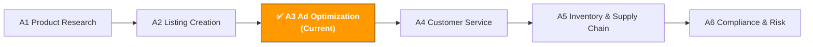

[🇨🇳 中文](../../../paths/a-operators/a3-advertising.md) | 🇺🇸 English (current)

# A3. Advertising Optimization

> **Path**: Path A: Operators · **Module**: A3  
> **Last Updated**: 2026-03-12  
> **Difficulty**: ⭐⭐ Intermediate  
> **Estimated Time**: 30 minutes per day, 1–2 weeks
---

🏠 [Hub Home](../../README.md) · 📋 [Path A Overview](README.md)



---

## 📖 Module Navigation

1. [Ad Methodology](#1-ad-methodology-the-fundamentals-before-ai) · 2. [AI Tool Landscape](#2-ai-tool-landscape-what-to-use-for-ads) · 3. [Prompt Template Library](#3-prompt-template-library-advertising-specific) · 4. [Ad Workflows in Practice](#4-ad-workflows-in-practice) · 5. [Common Pitfalls](#5-common-ad-pitfalls) · 6. [Advanced Techniques](#6-advanced-techniques) · 7. [Learning Resources](#7-learning-resources) · 8. [🦞 OpenClaw Automation](#8-automate-ad-optimization-with-openclaw) · 9. [Completion Checklist](#9-completion-checklist)


## What You'll Learn in This Module

Use AI tools to compress hours of ad data analysis into 30 minutes. From search term report analysis to bid optimization, build a reusable AI-assisted advertising management workflow.

After completing this module, you'll be able to:
- Use ChatGPT/Claude to analyze search term reports — find high-ROAS keywords and wasteful terms in 10 minutes
- Use AI to generate multiple Sponsored Brands ad copy variants for A/B testing
- Use AI to create a 30-day new product ad launch plan, from Auto to Manual keyword harvesting
- Understand the relationship between ACOS/TACOS/ROAS and use AI for ad budget allocation optimization
- Use AI to diagnose the root cause of declining ad performance and quickly pinpoint issues
- Learn about the 2026 trend: how the Amazon Ads MCP Server lets AI Agents directly manage advertising

---

## 1. Ad Methodology: The Fundamentals Before AI

> 📎 **Related Reading**: [D4 Walmart AI Guide](../d-platforms/d4-walmart-ai-guide.md#3-walmart-connect-advertising) — Walmart Connect advertising (first-price auction) covered in D4 · [E1 Instagram/Facebook AI Guide](../e-social-media/e1-instagram-facebook-ai-guide.md#e1-instagram-facebook-ai-operations-guide-meta-ecosystem-ai-playbook) — Meta Advantage+ AI ad creative generation and optimization covered in E1. · [E7 Cross-Channel Strategy](../e-social-media/e7-social-media-cross-channel.md#e7-social-media-cross-channel-strategy) — Cross-channel ad attribution and budget allocation framework covered in E7.

### 1.1 First Principles of Amazon Advertising

The essence of Amazon PPC advertising is "paying for targeted traffic and using conversion rates to turn that traffic into profit."

Amazon's PPC bidding mechanism uses a Second-Price Auction:

```
你实际支付的 CPC = 第二高出价 + $0.01
```

This means you don't need to bid the highest — just $0.01 more than the second-highest bidder. But ad ranking isn't based on bid alone:

```
广告排名 = 出价 × 相关性 × 转化率
```

- **Bid**: The maximum amount you're willing to pay per click
- **Relevance**: How well your keywords and listing match the user's search intent
- **Conversion Rate**: The percentage of users who actually purchase after clicking your ad

> 💡 **Core Insight**: Many sellers assume "higher bid = better ranking." But if your listing has a high conversion rate, you can rank higher than competitors even with a lower bid. That's why ad optimization can't be separated from listing optimization — see [A2 Listing Module](a2-listing-optimization.md).

### 1.2 The Relationship Between ACOS / TACOS / ROAS

These three metrics are the core language of ad optimization — you need to understand them thoroughly:

```
ACOS (Advertising Cost of Sales) = 广告花费 / 广告销售额 × 100%
```
- Example: Spent $100 on ads, generated $400 in ad sales → ACOS = 25%
- Meaning: For every $1 in ad sales, you spent $0.25 on advertising
- Goal: ACOS < product profit margin (otherwise ads are losing money)

```
TACOS (Total Advertising Cost of Sales) = 广告花费 / 总销售额 × 100%
```
- Example: Spent $100 on ads, total sales (ad + organic) $1,000 → TACOS = 10%
- Meaning: Ad spend as a percentage of total revenue
- Goal: TACOS trending downward = organic traffic is growing, ad dependency is decreasing

```
ROAS (Return on Ad Spend) = 广告销售额 / 广告花费
```
- Example: Spent $100 on ads, generated $400 in ad sales → ROAS = 4.0
- Meaning: For every $1 spent on ads, you earned $4 in sales
- Relationship: ROAS = 1 / ACOS (ACOS 25% = ROAS 4.0)

**Why TACOS Matters More Than ACOS**

ACOS only measures ad efficiency in isolation, but the real purpose of advertising isn't just direct sales — it's also driving organic keyword rankings (the organic rank flywheel):

```
广告带来销量 → 销量提升关键词自然排名 → 自然流量增加 → 总销售额增长 → TACOS 下降
```

An ad with 40% ACOS looks like it's "losing money," but if it's pushing organic rankings up and causing TACOS to drop from 15% to 10%, that ad is actually profitable. AI can help you monitor this flywheel effect.

### 1.3 Ad Type Overview

| Type | Sponsored Products (SP) | Sponsored Brands (SB) | Sponsored Display (SD) | DSP |
|------|------------------------|----------------------|----------------------|-----|
| **Placement** | Search results, product detail pages | Top-of-search banner | Product detail pages, off-Amazon | On and off-Amazon, all channels |
| **Bidding** | CPC (cost per click) | CPC | CPC / vCPM | CPM (cost per impression) |
| **Minimum Budget** | No minimum | $1/day | $1/day | $10,000+/month (typical) |
| **Best For** | All stages (essential) | After Brand Registry | After Brand Registry | Large sellers/brands |
| **Core Objective** | Direct conversions, keyword ranking | Brand awareness, category presence | Retargeting, competitor interception | Full-funnel marketing |
| **AI Optimization Potential** | Search term analysis, bid optimization | Copy A/B testing | Audience analysis | Budget allocation |

**Where Should Beginners Start?**

```
SP Auto → SP Manual → SB → SD
```

1. **SP Auto** (Week 1): Let Amazon auto-match keywords and collect data
2. **SP Manual** (Week 2+): Extract high-converting keywords from Auto and create manual campaigns
3. **SB** (after Brand Registry): Use brand ads to claim the top of search results
4. **SD** (once you have some sales volume): Retargeting and competitor interception

### 1.4 AI's Role in Advertising

What AI is good at:
- **Search term analysis**: Finding high-ROAS terms and wasteful terms from thousands of search term report rows
- **Bid optimization suggestions**: Recommending optimal bids for each keyword based on historical data
- **Negative keyword discovery**: Identifying irrelevant search terms that spend money but don't convert
- **Copy variant generation**: Creating multiple SB ad headlines for A/B testing
- **Budget allocation suggestions**: Recommending budget redistribution based on each ad group's ROAS
- **Trend analysis**: Comparing ad performance across time periods to spot trends

What AI is not good at:
- **Real-time bidding**: Requires specialized tools (Helium 10 Adtomic, Perpetua) for automated bidding
- **Creative design**: SB Video and SD visual creatives require design tools
- **Brand strategy**: Overall ad strategy (defensive vs. offensive, brand vs. performance) requires human decision-making
- **Budget decisions**: Total budget depends on business goals and cash flow — not something AI can determine

> 💡 **Core Principle**: Use tools to pull ad data, AI for analysis and recommendations, and humans for strategy decisions and execution. AI is your ad analyst, not your ad manager.

---

## 2. AI Tool Landscape: What to Use for Ads

### 2.1 Paid Tool Deep Dive

| Tool | Price | Core Capability | Best For | AI Features |
|------|-------|----------------|----------|-------------|
| [Helium 10 Adtomic](https://h10-wp.com/helium-10-adtomic/) | $229/mo (included in Platinum) | AI-driven bid automation, rule engine + AI suggestions | Intermediate sellers who need automated bid management | AI bid suggestions, auto negative keywords, budget optimization |
| Jungle Scout PPC Manager | $49–84/mo | Simplified ad management, keyword suggestions | Beginners, user-friendly interface | Basic AI keyword suggestions |
| Perpetua (by Ascential) | % of ad spend | Enterprise-grade AI ad optimization, auto bidding + budget allocation | Sellers with $5,000+/mo ad spend | Fully automated AI bidding, target ACOS optimization |
| Pacvue | Enterprise pricing | Multi-platform ad management (Amazon + Walmart + Instacart) | Large sellers/agencies | AI budget allocation, cross-platform optimization |
| [DeepBI](https://www.deepbi.com/blog/13/) | % of ad spend | AI ad management, beginner-friendly, hourly bid adjustments | Small-to-mid sellers who want fully managed ads | Fully automated AI management; case study: ACOS from 55% to 43% |
| Quartile | % of ad spend | AI-driven omnichannel ad optimization | Multi-channel sellers | AI auto-creates ad groups, keyword discovery |

**Tool Selection Guide:**

**Budget-friendly (<$50/mo)**: Amazon Advertising Console + ChatGPT/Claude
- Amazon's official ad console is free and has enough features for small-to-mid sellers
- Download search term reports weekly and analyze them with ChatGPT (see Section 3 prompt templates)
- Manually adjust bids and negative keywords

**Getting serious ($100–300/mo)**: Helium 10 Adtomic
- Adtomic's AI bid automation saves a ton of time
- The rule engine lets you set rules like "auto-lower bid when ACOS > 40%"
- Pair with ChatGPT for deep search term analysis

**$5,000+/mo ad spend**: Perpetua or DeepBI
- At higher ad spend levels, manual management is too inefficient
- Perpetua's target ACOS optimization works well for sellers with clear profit goals
- DeepBI's fully managed mode is ideal for sellers who don't want to spend time managing ads

> 💡 **Key Insight**: The core value of ad tools is automated execution, not strategy. Tools can auto-adjust bids and auto-add negative keywords, but the strategic question of "which keywords should I concentrate budget on" still requires you (or AI analysis) to decide. Best combo: Adtomic/Perpetua for automated execution, ChatGPT/Claude for strategic analysis.

Content rephrased for compliance with licensing restrictions. Sources: [deepbi.com AI PPC](https://www.deepbi.com/blog/13/), [aijourn.com PPC optimization](https://aijourn.com/amazon-ppc-optimization-tool/), [algofy.com AI tools 2026](https://www.algofy.com/post/best-ai-tools-for-amazon-sellers-in-2026)

### 2.2 Free Tool Combinations

| Tool | Use Case | Link |
|------|----------|------|
| ChatGPT / Claude | Search term report analysis, negative keyword discovery, copy generation, budget allocation suggestions | [chat.openai.com](https://chat.openai.com/) / [claude.ai](https://claude.ai/) |
| Amazon Advertising Console | Official free ad management tool — create/manage all ad types | [advertising.amazon.com](https://advertising.amazon.com/) |
| Amazon Brand Analytics | Search term ranking data, market basket analysis, audience demographics | Seller Central → Brand Analytics |
| Amazon Attribution | Off-Amazon traffic tracking (Google Ads, social media, etc.) | [advertising.amazon.com/attribution](https://advertising.amazon.com/) |

**Free Tool Strategy:**

1. **Amazon Advertising Console is the foundation**: All ad operations happen here. Even if you use third-party tools, you need to understand the official console.
2. **Search term reports are a goldmine**: Download search term reports weekly (Advertising → Reports → Search Term Report) — this is the most important data source for ad optimization. Analyzing with ChatGPT is 10x faster than doing it manually.
3. **Brand Analytics for competitive intelligence**: Search term ranking data shows which keywords competitors are advertising on; market basket analysis reveals what else shoppers are buying.
4. **Amazon Attribution for off-Amazon traffic tracking**: If you're running Google Ads or social media ads driving traffic to Amazon, Attribution tracks conversion performance.

### 2.3 Open-Source Tools & APIs

| Tool/API | Use Case | GitHub/Link |
|----------|----------|-------------|
| Amazon Advertising API | Manage ads in bulk via API (create, adjust bids, download reports) | [advertising.amazon.com/API](https://advertising.amazon.com/API/) |
| python-amazon-sp-api | Python wrapper for SP-API, including ad-related endpoints | [github.com/saleweaver/python-amazon-sp-api](https://github.com/saleweaver/python-amazon-sp-api) |
| pandas + matplotlib | Search term report data analysis and visualization | Standard Python data analysis stack |

**When to use open-source tools?**

If you manage 10+ ad campaigns or need bulk operations, APIs can:
- **Bulk-adjust bids**: Apply AI analysis results to hundreds of keywords at once
- **Auto-download reports**: Schedule search term report pulls and auto-feed them to AI for analysis
- **Custom dashboards**: Build your own ad analytics dashboard with pandas + matplotlib

> For more technical implementation details, see the relevant modules in [Path B: Developers](../b-developers/).

---

## 3. Prompt Template Library (Advertising-Specific)

> The full standardized templates (with verification status, contributor info, and share links) are in [prompts/advertising.md](../../prompts/advertising.md).
> This section provides deep analysis, common mistakes, and advanced variants for each template.

### 3.1 Search Term Report Analysis

**Why this prompt works:** It requires AI to sort by ROAS and output in table format, avoiding AI's common tendency to give vague, generic advice. It splits output into 5 clear categories (high-converting, high-waste, high-impression-low-click, negative keywords, budget allocation), each with specific action items. Key design points:
- "Sort by ROAS" — Forces AI to do quantitative ranking instead of subjective judgment
- "Label each keyword with a recommended action and priority" — Directly action-oriented
- "Exact negative vs. phrase negative" — Distinguishes negative types to avoid over-negating

**Common Mistakes:**
- ❌ Too little data (<7 days) → Ad data has attribution delays (7–14 days); use at least 30 days of data for analysis
- ❌ Not separating match types → Broad, Phrase, and Exact search terms perform very differently; analyze them separately
- ❌ Ignoring high-impression zero-click terms → These terms mean your ad showed but nobody clicked — could be a main image or pricing issue
- ❌ Only looking at ACOS, not TACOS → A high-ACOS keyword might be driving organic rankings; look at the overall picture

[Full template → prompts/advertising.md](../../prompts/advertising.md)

**Advanced Variants:**

**Variant A — Analysis by Match Type:**

```
以下是我的搜索词报告数据（过去 30 天），请按匹配类型分层分析：

Broad Match 搜索词：[粘贴数据]
Phrase Match 搜索词：[粘贴数据]
Exact Match 搜索词：[粘贴数据]

请分别分析每种匹配类型的表现：
1. 每种匹配类型的整体 ACOS 和 ROAS
2. Broad Match 中发现的新关键词机会（应该提升为 Exact Match）
3. Phrase Match 中需要否定的无关词
4. Exact Match 中出价需要调整的关键词
5. 三种匹配类型的预算分配建议
```

> 💡 **Why use this variant**: Broad Match is your "keyword discovery engine," Exact Match is your "profit harvester." Layered analysis helps you build a keyword harvesting pipeline from Broad → Phrase → Exact.

**Variant B — Time Trend Analysis (Weekly/Monthly Comparison):**

```
以下是我的广告数据，分为两个时间段：
上月数据：[粘贴]
本月数据：[粘贴]

请对比分析：
1. 整体 ACOS/ROAS 变化趋势及原因分析
2. 哪些关键词的表现在改善？哪些在恶化？
3. CPC 变化趋势（竞争是否在加剧？）
4. 转化率变化趋势（Listing 是否需要优化？）
5. 基于趋势，下个月的优化重点建议
```

> 💡 **Why use this variant**: A single analysis only shows "where things stand now"; trend analysis reveals "whether things are getting better or worse." A sustained CPC increase may signal intensifying competition, requiring a strategy shift.

**Variant C — Competitor ASIN Targeting Analysis:**

```
以下是我的 Product Targeting（ASIN 定向）广告数据：
[粘贴数据：目标 ASIN、展示量、点击量、花费、订单数]

请分析：
1. 哪些竞品 ASIN 的定向广告 ROAS 最高？（我应该加大投放）
2. 哪些竞品 ASIN 花钱但不转化？（我应该停止定向）
3. 基于高转化的竞品特征，推荐新的定向 ASIN
4. 竞品定向 vs 关键词定向的整体效率对比
```

> 💡 **Why use this variant**: ASIN targeting ads place your product on competitor detail pages. Analyzing which competitors' traffic converts best for you reveals which types of competitors you're most competitive against.

---

### 3.2 Ad Copy A/B Testing

**Why this prompt works:** The 5 styles force AI to create differentiated variants, preventing it from generating 5 headlines that all look the same. Each style targets a different buyer psychology, letting you test which resonates most with your target audience.

**Common Mistakes:**
- ❌ Headline exceeds 50 characters → Sponsored Brands headlines are limited to 50 characters; anything longer gets truncated
- ❌ Not specifying the target audience → Different audiences respond differently to different styles; define your target before testing
- ❌ Testing too many variants at once → Only test 2 variants at a time (A/B); don't test 5 simultaneously
- ❌ Test duration too short → Run for at least 2 weeks to accumulate enough click data for statistical significance

[Full template → prompts/advertising.md](../../prompts/advertising.md)

**Advanced Variants:**

**Variant A — Sponsored Brands Video Script:**

```
我的产品是 [产品描述]，核心卖点是 [卖点]。

请为 Sponsored Brands Video 广告生成 3 个不同风格的 15 秒脚本：

脚本1：问题-解决型
- 开头（0-3秒）：展示用户痛点
- 中间（3-10秒）：产品如何解决
- 结尾（10-15秒）：CTA + 核心卖点

脚本2：演示型
- 开头（0-3秒）：产品外观展示
- 中间（3-10秒）：核心功能演示
- 结尾（10-15秒）：规格 + CTA

脚本3：社交证明型
- 开头（0-3秒）：用户好评引用
- 中间（3-10秒）：产品使用场景
- 结尾（10-15秒）：评分 + CTA

每个脚本标注：画面建议、文字叠加内容、背景音乐风格建议。
```

> 💡 **Why use this variant**: SB Video typically has 2–3x higher CTR than static SB ads. The key to a 15-second script is grabbing attention in the first 3 seconds — AI can help you design multiple "hooks."

**Variant B — Sponsored Display Creative Copy:**

```
我的产品是 [产品描述]，目标是做竞品拦截（在竞品详情页展示我的广告）。

请为 Sponsored Display 广告生成 3 组创意文案：

组1：价格优势型（适合我的价格比竞品低的情况）
- Headline: [不超过 50 字符]
- Custom Image 文案建议

组2：功能优势型（适合我的产品有竞品没有的功能）
- Headline: [不超过 50 字符]
- Custom Image 文案建议

组3：评价优势型（适合我的评分比竞品高的情况）
- Headline: [不超过 50 字符]
- Custom Image 文案建议

注意：SD 广告出现在竞品详情页，用户正在考虑买竞品。文案需要给用户一个"转向你"的理由。
```

---

### 3.3 Negative Keyword Strategy

**Why this prompt matters:** Negative keywords are the fastest way to lower ACOS. A single irrelevant search term spending $2/day adds up to $60/month in waste. AI can quickly identify all terms that need negating from thousands of search term report rows.

**Common Mistakes:**
- ❌ Over-negating causes a traffic cliff → Negating too many terms causes impressions to plummet. Negate no more than 20 terms at a time, then observe for 3 days before continuing.
- ❌ Not distinguishing exact negative from phrase negative → Exact negative only blocks the exact search term; phrase negative blocks all searches containing that phrase. Using the wrong type can kill valid traffic.
- ❌ Only negating non-converting terms, not irrelevant terms → Some terms may have a few conversions but are completely irrelevant (e.g., a phone case ad showing up for "phone" searches). Long-term, these drag down your ad quality score.

```
你是一个 Amazon PPC 否定关键词专家。

以下是我的搜索词报告（过去 30 天）：
[粘贴数据：搜索词、匹配类型、展示量、点击量、花费、订单数、销售额]

我的产品是：[产品描述]
我的目标 ACOS：[X]%

请生成否定关键词列表：

1. **精确否定列表**（Negative Exact）：
   - 完全不相关的搜索词（与产品无关）
   - 花费 > $[X] 但零转化的搜索词

2. **短语否定列表**（Negative Phrase）：
   - 包含某个词根的一系列不相关搜索词（如所有包含"free"的搜索词）

3. **观察列表**（暂不否定，继续观察）：
   - 花费中等、有少量转化但 ACOS 偏高的词
   - 建议观察时间和判断标准

每个否定词标注：否定原因、预计节省的月度花费、风险评估（是否可能误伤有效流量）。
```

**Advanced Variant — Negative Keyword Audit (Checking for Over-Negation):**

```
以下是我当前的否定关键词列表：
[粘贴否定词列表]

我的产品是：[产品描述]
最近 2 周广告展示量下降了 [X]%。

请审计我的否定词列表：
1. 是否有被误否定的有效关键词？
2. 哪些短语否定可能误伤了相关搜索词？
3. 建议移除哪些否定词以恢复流量？
4. 建议将哪些短语否定改为精确否定（缩小否定范围）？
```

> 💡 **Core principle of negative keywords**: Better to under-negate than over-negate. Negating a term is easy; recovering the lost traffic is hard. Observe data changes for 3–5 days after each round of negations.

---

### 3.4 Ad Budget Allocation Optimization

**Why this prompt matters:** 80% of your ad budget should go to the top 20% of high-performing ad groups. But many sellers distribute budget evenly, causing high-performing groups to run out of budget early while low-performing groups waste money. AI can calculate optimal allocation based on historical data.

**Common Mistakes:**
- ❌ Equal budget across all ad groups → High-ROAS groups may run out of budget by afternoon
- ❌ Allocating budget based on ACOS alone → New product ads naturally have high ACOS because the goal is ranking, not profit
- ❌ Not accounting for different ad objectives → Brand defense ads (brand keywords) and offensive ads (competitor keywords) have different budget logic
- ❌ Not adjusting budget for sales events → During Prime Day/BFCM, traffic surges and daily budgets can be exhausted in hours

```
你是一个 Amazon 广告预算优化专家。

以下是我的各广告活动数据（过去 30 天）：
[粘贴数据：广告活动名称、日预算、花费、销售额、ACOS、ROAS、展示量、点击量]

总日预算：$[X]
业务目标：[选择一个]
- 利润最大化（控制 ACOS）
- 销量最大化（推排名）
- 品牌曝光最大化

请建议预算重新分配：
1. 每个广告活动的建议日预算（总和 = 总日预算）
2. 调整理由（基于 ROAS、趋势、广告目标）
3. 哪些广告活动应该暂停或降低预算
4. 哪些广告活动应该增加预算
5. 预计调整后的整体 ACOS 和 ROAS 变化
```

**Advanced Variant — Sales Event Budget Strategy:**

```
Prime Day / BFCM 大促即将到来。以下是我的日常广告数据：
[粘贴日常数据]

请制定大促广告预算策略：

大促前 2 周：
- 预算应该调整到日常的多少倍？
- 哪些广告活动需要提前加大投放？
- 是否需要创建新的广告活动？

大促期间（3-5 天）：
- 预算应该调整到日常的多少倍？
- 出价策略（提高多少？哪些词提高？）
- 实时监控的关键指标和阈值

大促后 1 周：
- 如何收割大促带来的长尾流量？
- 预算何时恢复日常水平？
- 如何分析大促广告效果？
```

> 💡 **Core principle of budget allocation**: Budget follows ROAS, but consider the strategic objective of each ad. Brand keyword defense ads shouldn't be paused even if ROAS is mediocre — stopping them lets competitors steal your brand traffic.

---

### 3.5 New Product Ad Launch Strategy

**Why this prompt matters:** New product ad strategy is completely different from mature products. New products have no reviews, no sales history, and no keyword rankings — advertising is the only way to get initial traffic. AI can help you design a 30-day launch plan from scratch.

**Common Mistakes:**
- ❌ Starting with Manual Exact right away → No data to support it; you don't know which keywords convert well. Start with Auto to collect data.
- ❌ Chasing low ACOS during launch → The goal during launch is to get sales and reviews; high ACOS is normal
- ❌ Budget too low → New products need enough impressions to collect data. A daily budget under $10 means data accumulates too slowly.
- ❌ Not harvesting keywords → High-converting terms discovered in Auto campaigns should be promptly "harvested" into Manual campaigns

```
你是一个 Amazon 新品广告启动专家。

产品信息：
- 产品名称：[名称]
- 品类：[品类]
- 售价：$[X]
- 目标市场：Amazon [US/DE/JP]
- 竞品平均 Review 数：[X] 条
- 我的 Review 数：0（新品）
- 日广告预算：$[X]
- 核心关键词（来自 Helium 10）：[列出 10-20 个关键词及搜索量]

请设计 30 天广告启动计划：

Week 1（数据收集期）：
- 应该创建哪些广告活动？（Auto/Manual/SP/SB）
- 每个活动的出价策略和日预算
- 关键监控指标

Week 2（关键词收割期）：
- 如何从 Auto 搜索词报告中筛选高转化词？
- 如何创建 Manual 广告活动？
- 否定词策略

Week 3（优化期）：
- 出价调整策略
- 预算重新分配
- 是否扩展到 SB/SD？

Week 4（评估期）：
- 30 天广告效果评估框架
- ACOS 趋势分析
- 下一步策略建议

每周标注：具体操作步骤、预期指标、风险提示。
```

**Advanced Variant — Auto → Manual Keyword Harvesting Flow:**

```
以下是我的新品 Auto 广告运行 2 周后的搜索词报告：
[粘贴数据]

请帮我做关键词收割：
1. 哪些搜索词应该提升为 Manual Exact Match？（标准：点击 ≥ [X]，转化率 ≥ [X]%）
2. 哪些搜索词应该提升为 Manual Phrase Match？（标准：展示量高，有少量转化）
3. 哪些搜索词应该在 Auto 中否定？（标准：花费 > $[X]，零转化）
4. Manual 广告的建议出价（基于 Auto 中的实际 CPC）
5. 收割后 Auto 广告是否继续运行？预算如何调整？
```

> 💡 **Core logic of new product ads**: Auto is the "scout," Manual is the "harvester." Auto discovers which keywords work; Manual precisely targets those keywords. This Auto-to-Manual "harvesting" flow is the core of new product advertising.

---

### 3.6 Competitor Ad Intelligence Analysis

**Why this prompt matters:** Understanding which keywords competitors advertise on helps you discover new keyword opportunities and decode their ad strategies. While Amazon doesn't publicly share competitor ad data, you can infer it from search result pages.

**Common Mistakes:**
- ❌ Drawing conclusions from a single search → Ad display has randomness; search multiple times at different times of day
- ❌ Not distinguishing SP from SB ads → SP appears within search results; SB appears as a top-of-page banner — different strategies
- ❌ Ignoring SD ads → Competitors may be running SD ads on your product detail page

```
我想分析竞品的广告策略。以下是我在 Amazon 搜索不同关键词时观察到的竞品广告情况：

关键词1 "[关键词]"：
- 搜索结果顶部 SB 广告：[竞品品牌/产品]
- 搜索结果中 SP 广告位置：[竞品出现在第几位]
- 是否有 SB Video：[是/否]

关键词2 "[关键词]"：[类似观察]
关键词3 "[关键词]"：[类似观察]

我的产品详情页上出现的 SD 广告：[列出竞品]

请分析：
1. 竞品的广告策略推断（主攻哪些关键词？用了哪些广告类型？）
2. 竞品的预估广告预算范围（基于出现频率和位置推断）
3. 我应该在哪些关键词上与竞品正面竞争？
4. 哪些关键词竞品投放了但我没有？（机会）
5. 我的产品详情页上的竞品 SD 广告如何应对？
```

> 💡 **Core value of competitor intelligence**: It's not about copying competitors — it's about finding their blind spots. If a competitor isn't advertising on a high-volume keyword, that's your low-cost acquisition opportunity.

---

### 3.7 Ad Performance Diagnosis

**Why this prompt matters:** A sudden ACOS spike can have many causes — competitor price drops, seasonal shifts, listing changes, intensifying keyword competition. AI can help you systematically troubleshoot, avoiding the "treat the symptom, not the cause" trap.

**Common Mistakes:**
- ❌ Immediately lowering bids when ACOS rises → The cause might be a conversion rate drop; lowering bids will just reduce impressions too
- ❌ Not considering external factors → Competitor price cuts, new entrants, seasonal changes all affect ad performance
- ❌ Only looking at aggregate data, not segments → An overall ACOS increase might be caused by one underperforming ad group dragging down the average while others are fine

```
我的广告效果最近出现异常，请帮我做根因分析：

异常表现：
- ACOS 从 [X]% 升高到 [X]%（时间段：[日期]）
- 或：转化率从 [X]% 下降到 [X]%
- 或：CPC 从 $[X] 升高到 $[X]

相关数据：
- 各广告活动的分项数据：[粘贴]
- 同期 Listing 是否有变化：[是/否，描述变化]
- 同期价格是否有变化：[是/否]
- 同期 Review 是否有变化：[新增差评？评分下降？]
- 竞品是否有明显动作：[降价？新品进入？]

请从以下维度逐一排查：
1. **内部因素**：Listing 变化、价格变化、库存问题、Review 变化
2. **广告因素**：出价变化、预算变化、新增/暂停的关键词
3. **竞争因素**：竞品降价、新竞品进入、竞品广告加大投放
4. **外部因素**：季节性变化、平台政策变化、大促前后波动

对每个可能的原因给出：可能性评估（高/中/低）、验证方法、应对策略。
```

**Advanced Variant — Conversion Rate Drop Diagnosis:**

```
我的广告点击量没变，但转化率从 [X]% 下降到 [X]%。

请帮我排查转化率下降的原因：
1. Listing 是否被修改？（标题、图片、价格、A+ Content）
2. 是否有新的差评影响了评分？
3. 竞品是否降价或推出了更有竞争力的产品？
4. 是否有库存问题（配送时间变长）？
5. 是否是季节性因素？
6. 搜索词是否发生了变化（新的不相关搜索词进来了）？

每个原因标注验证方法和修复建议。
```

> 💡 **Core principle of ad diagnosis**: Check internal factors first (listing, price, reviews), then ad factors (bids, budget), and finally external factors (competitors, seasonality). 80% of ad performance declines are caused by internal factors.

---

### 3.8 Multi-Marketplace Ad Strategy

**Why this prompt matters:** CPC, competitive landscape, and consumer behavior vary dramatically across marketplaces. An ad strategy that works on the US site often performs poorly when directly applied to DE or JP. AI can help you develop differentiated strategies for each marketplace.

**Common Mistakes:**
- ❌ Using the same keywords across all marketplaces → Different languages have different search habits; keywords need localization
- ❌ Using the same bids across all marketplaces → US CPC can be 2–3x higher than DE; bid strategies need adjustment
- ❌ Ignoring smaller marketplaces → JP, IT, ES have less competition and lower CPCs — ROI may actually be better than the US
- ❌ Not accounting for VAT's impact on margins → European VAT (19–22%) significantly affects profit margins and the ACOS you can afford

```
我的产品目前在 Amazon US 站投放广告，表现如下：
- 日预算：$[X]
- ACOS：[X]%
- 核心关键词和 CPC：[列出 Top 5 关键词及 CPC]
- 月广告销售额：$[X]

现在要扩展到 Amazon [DE/JP/UK]。请帮我制定目标站点的广告策略：

1. **关键词本地化**：US 站的核心关键词在目标站点对应什么搜索词？
2. **出价策略**：目标站点的预估 CPC 范围？建议起始出价？
3. **预算分配**：目标站点的日预算建议（考虑市场规模差异）
4. **广告结构**：是否需要调整广告活动结构？
5. **目标 ACOS**：考虑 VAT 和物流成本差异后的目标 ACOS
6. **时间规划**：建议的启动顺序和每个站点的预期回本周期

目标站点特殊考虑：
- [DE] VAT 19%，消费者重视品质，CPC 通常比 US 低 30-50%
- [JP] 消费者重视细节，搜索词可能用片假名或汉字，CPC 通常比 US 低 40-60%
- [UK] 与 US 类似但市场规模小，CPC 介于 US 和 DE 之间
```

> 💡 **Core principle of multi-marketplace ads**: Each marketplace is an independent market requiring its own ad strategy. But you can use US data as a "baseline" to accelerate launches on other sites — high-converting US keywords, once translated, are likely effective on other marketplaces too.

---

## 4. Ad Workflows in Practice

### 4.1 New Product Ad Launch SOP (30-Day Plan)

This SOP standardizes the process of taking a new product's ads from zero to stable operation. Each step notes the tools and prompts used.

```
┌─────────────────────────────────────────────────────────┐
│  Week 1: Data Collection Phase                           │
│  Action: Create SP Auto campaigns (Broad + Close Match)  │
│  Bids: 1.2x suggested bid (new products need higher      │
│        bids to win impressions)                          │
│  Budget: $20–50/day (ensure sufficient data volume)      │
│  AI: New Product Launch Strategy Prompt (3.5)            │
│  Monitor: Check spend and impressions daily to confirm   │
│           ads are running                                │
│  Output: 7-day search term report                        │
├─────────────────────────────────────────────────────────┤
│  Week 2: Keyword Harvesting Phase                        │
│  Action: Download search term report → AI analysis →     │
│          Create Manual campaigns                         │
│  AI: Search Term Report Analysis Prompt (3.1)            │
│  AI: Auto → Manual Keyword Harvesting Prompt (3.5 var.)  │
│  Rules: Clicks ≥5 & CVR ≥10% → Exact Match              │
│         Clicks ≥10 & has conversions → Phrase Match      │
│         Spend >$5 & zero conversions → Negate            │
│  Output: Manual SP campaigns + negative keyword list     │
├─────────────────────────────────────────────────────────┤
│  Week 3: Optimization Phase                              │
│  Action: Adjust bids + add negatives + evaluate          │
│          expanding ad types                              │
│  AI: Negative Keyword Strategy Prompt (3.3)              │
│  AI: Budget Allocation Optimization Prompt (3.4)         │
│  Bid adjustments: ACOS < target → raise bid 10–20%      │
│                   ACOS > target × 1.5 → lower bid 10–20%│
│  Expansion: If Brand Registered, consider launching SB   │
│  Output: Optimized ad structure + bid adjustment log     │
├─────────────────────────────────────────────────────────┤
│  Week 4: Evaluation Phase                                │
│  Action: Comprehensive 30-day ad performance review      │
│  AI: Ad Performance Diagnosis Prompt (3.7)               │
│  Evaluate: ACOS trends, keyword ranking changes,         │
│            TACOS changes                                 │
│  Decision: Continue current strategy / adjust strategy /  │
│            expand to more ad types                       │
│  Output: 30-day ad report + next steps plan              │
└─────────────────────────────────────────────────────────┘
```

### 4.2 Weekly Ad Optimization SOP (30 Minutes/Week)

Ads aren't "set it and forget it." A weekly 30-minute optimization routine can continuously lower ACOS and improve ROAS.

```
┌─────────────────────────────────────────────────────────┐
│  Step 1: Download Data (5 min)                           │
│  Action: Download search term report from Advertising    │
│          Console (past 7 days)                           │
│  Format: CSV file                                        │
├─────────────────────────────────────────────────────────┤
│  Step 2: AI Analysis (10 min)                            │
│  AI: Search Term Report Analysis Prompt (3.1)            │
│  Input: Paste CSV data into ChatGPT/Claude               │
│  Output: High-converting terms, wasteful terms, negative │
│          keyword suggestions, bid adjustment suggestions  │
├─────────────────────────────────────────────────────────┤
│  Step 3: Execute Adjustments (10 min)                    │
│  Action: Adjust bids, add negative keywords, reallocate  │
│          budget based on AI recommendations              │
│  Principle: Keep each adjustment under 20% to avoid      │
│             dramatic swings                              │
├─────────────────────────────────────────────────────────┤
│  Step 4: Log Changes (5 min)                             │
│  Action: Record what adjustments were made and why       │
│  Tool: Simple Excel spreadsheet or notes                 │
│  Value: Accumulate data; compare results next week       │
└─────────────────────────────────────────────────────────┘
```

> 💡 **Core principle of routine optimization**: Small steps, fast iterations. Don't make drastic changes all at once. Weekly micro-adjustments + logging + comparison — after 3 months, your ad efficiency will see a qualitative improvement.

### 4.3 Sales Event Ad Strategy (Prime Day / BFCM)

Sales events are when ad spend is highest but ROI potential is also greatest. The strategy breaks into three phases:

**2 Weeks Before: Ramp-Up Phase**
- Increase daily budget to 2–3x normal (ensure ads don't go offline during the event)
- Expand keyword coverage (add more Broad Match keywords)
- Create event-specific ad campaigns (easier to track event performance separately)
- Pre-test SB ad copy (no time for testing during the event)
- Use AI to analyze last year's search term reports from the same period to predict trending event keywords

**During the Event (3–5 Days): Sprint Phase**
- Increase budget to 3–5x normal
- Raise bids 30–50% (competition intensifies during events; CPC will rise)
- Check budget burn rate daily to avoid going offline early
- Pause low-performing ad groups; concentrate budget on high-ROAS groups
- Monitor ACOS in real time; adjust immediately if it exceeds thresholds

**1 Week After: Harvest Phase**
- Gradually restore normal budget (don't slash it all at once)
- Analyze search term reports from the event period to discover new high-converting keywords
- Harvest long-tail traffic from the event (many shoppers add to cart during the event but don't buy)
- Use AI for a post-event ad performance review (compare ACOS, ROAS, and keyword ranking changes before and after)

---

## 5. Common Ad Pitfalls

### 5.1 Bidding Pitfalls

| Pitfall | Symptoms | How to Avoid |
|---------|----------|--------------|
| **Bidding too high** | ACOS far exceeds target; overpaying per click | Start at 80% of suggested bid and gradually increase. Use AI to analyze the optimal bid range. |
| **Bidding too low** | Almost no impressions; budget isn't being spent | Check suggested bid; bid at least 100% of it. New products can go 120%. |
| **Same bid for all match types** | Broad, Phrase, and Exact all use the same bid | Exact Match gets the highest bid (precise traffic); Broad Match gets the lowest (exploratory traffic). |
| **Not using dynamic bidding** | Missing out on Amazon's automatic bid optimization | Enable "Dynamic bids – down only" (conservative) or "Up and down" (aggressive). |

### 5.2 Structure Pitfalls

| Pitfall | Symptoms | How to Avoid |
|---------|----------|--------------|
| **Too many ad groups** | Management chaos, scattered budget, insufficient data per group | 3–5 campaigns per product is enough (Auto + Manual Exact + Manual Broad + SB). |
| **Too few ad groups** | All keywords lumped together; can't optimize individually | At minimum, separate by match type (Exact in one group, Broad in another). |
| **Keyword overlap** | Same keyword appears in multiple ad groups, competing against yourself | Use AI to check for keyword overlap; ensure each keyword is in only one ad group. |
| **Auto and Manual conflict** | Auto and Manual campaigns compete for the same keyword | Exact-negate keywords in Auto that already exist in Manual. |

### 5.3 Budget Pitfalls

| Pitfall | Symptoms | How to Avoid |
|---------|----------|--------------|
| **Budget exhaustion causes early shutoff** | Ads run out of budget by afternoon, missing the evening peak | Check your ad's "budget depletion time"; increase budget if it consistently runs out early. |
| **Uneven budget allocation** | High-performing groups underfunded; low-performing groups waste budget | Use AI for weekly budget allocation optimization (Prompt 3.4). |
| **Insufficient event budget** | Event traffic surges but budget wasn't adjusted; ads go offline in hours | Start increasing budget 2 weeks before the event; raise to 3–5x during the event. |

### 5.4 Data Pitfalls

| Pitfall | Symptoms | How to Avoid |
|---------|----------|--------------|
| **Attribution delay** | Making adjustments based on yesterday's data, but conversions haven't fully attributed yet | Amazon ad data has a 7–14 day attribution window. Look at 7+ days of data before making decisions. |
| **Confusing ACOS and TACOS** | Only looking at ACOS and thinking ads are losing money, while ignoring organic sales driven by ads | Track both ACOS and TACOS. Declining TACOS = ads are driving organic growth. |
| **Insufficient sample size** | Judging a keyword as "non-converting" after only 5 clicks | At least 20 clicks are needed for statistical significance. Keywords with too few clicks go on the "watch list." |
| **Not reviewing search term reports** | Only looking at campaign-level data, not individual search terms | Search term reports are the goldmine of ad optimization. Review them weekly. |

---

## 6. Advanced Techniques

### 6.1 Amazon Ads MCP Server (2026 Trend)

In 2026, Amazon launched the Ads MCP Server (Model Context Protocol Server) — Amazon's official AI advertising interface that allows AI Agents to directly manage ad campaigns. This marks a shift from "humans operating tools" to "AI executing autonomously."

**What is an MCP Server?**

MCP (Model Context Protocol) is a standard protocol that lets AI models interact with external tools. The Amazon Ads MCP Server enables AI models like ChatGPT and Claude to directly:
- Create and manage ad campaigns
- Adjust bids and budgets
- Download and analyze reports
- Execute keyword operations

**What does this mean for sellers?**

1. **Automation upgrade**: In the future, you'll be able to tell AI "lower bids by 15% on all keywords with ACOS above 40%" and AI will execute it directly — no need to log into the console and do it manually.
2. **Real-time optimization**: AI Agents can monitor ad performance 24/7 and adjust bids and budgets in real time — faster than any human.
3. **Unified strategy and execution**: The current workflow is "AI analyzes → human executes." The future will be "human sets strategy → AI analyzes + executes."
4. **Lower tool costs**: If AI can manage ads directly through MCP Server, the value proposition of third-party ad management tools will be redefined.

**How to prepare now?**

- Learn prompt engineering (the prompt templates in this module are the foundation)
- Build a clear ad strategy framework (AI execution requires well-defined rules and goals)
- Follow Amazon Advertising API updates
- Practice using ChatGPT/Claude for ad analysis to build experience with AI-assisted ad management

Content rephrased for compliance with licensing restrictions. Source: [futurumgroup.com Amazon Ads MCP Server](https://futurumgroup.com/insights/amazon-ads-mcp-server-debuts-streamlining-ai-managed-campaign-execution/)

### 6.2 The Flywheel Effect: Advertising and Organic Rankings

The value of advertising isn't just direct sales — more importantly, it drives organic keyword rankings. This "flywheel effect" is the most strategic value of Amazon advertising:

```
广告投放 → 广告带来销量 → 销量提升关键词自然排名
    ↑                                    ↓
    ← 降低对广告的依赖 ← 自然流量增加 ←
```

**How to use AI to monitor the flywheel effect:**

```
以下是我的产品在过去 3 个月的数据：

月份1：广告销售额 $[X]，自然销售额 $[X]，TACOS [X]%
月份2：广告销售额 $[X]，自然销售额 $[X]，TACOS [X]%
月份3：广告销售额 $[X]，自然销售额 $[X]，TACOS [X]%

核心关键词排名变化：
关键词A：第[X]页 → 第[X]页 → 第[X]页
关键词B：第[X]页 → 第[X]页 → 第[X]页

请分析：
1. 飞轮效应是否在运转？（自然销售额占比是否在增加？）
2. TACOS 趋势是否健康？（应该逐月下降）
3. 哪些关键词的自然排名在提升？哪些停滞？
4. 对于排名停滞的关键词，是否需要加大广告投放？
5. 对于排名已经稳定在首页的关键词，是否可以降低广告出价？
6. 预计还需要多长时间可以将 TACOS 降到 [X]%？
```

> 💡 **The flywheel's key metric**: TACOS. If TACOS is consistently declining, the flywheel is working — ad spend stays flat but total sales are growing because organic traffic is increasing. If TACOS is consistently rising, you're becoming more ad-dependent and need to check listing quality and product competitiveness.

---
### 6.3 Multi-Channel Ad Strategy (Amazon + Google + Social)

Amazon on-site ads aren't the only traffic source. Off-Amazon traffic (Google Ads, social media) can supplement on-site ads, especially for brand building and new customer acquisition.

| Channel | Strengths | Weaknesses | Best For |
|---------|-----------|------------|----------|
| **Amazon SP/SB/SD** | High purchase intent, direct conversions | High CPC, intense competition | All products (essential) |
| **Amazon DSP** | Full-funnel marketing, off-Amazon display | High barrier ($10k+/mo) | Brand sellers, large budgets |
| **Google Ads** | Covers Search + Shopping + YouTube | Long conversion path, complex attribution | Brand keyword protection, category education |
| **Meta Ads** | Precise audience targeting, visually driven | Low purchase intent, low CVR | New product launches, brand awareness |
| **TikTok Ads** | Young audience, viral potential | Unstable conversions | Visually appealing products |

**Tracking off-Amazon traffic with Amazon Attribution:**

Amazon Attribution is a free tool that tracks off-Amazon traffic conversion performance on Amazon.

```
我计划在 Google Ads 和 Instagram 上投放广告引流到 Amazon。

请帮我设计站外引流策略：

1. **Google Ads 策略**：
   - 应该投放哪些关键词？（品牌词 vs 品类词 vs 竞品词）
   - 落地页应该指向 Amazon 产品页还是品牌旗舰店？
   - 预算分配建议

2. **Instagram/Meta Ads 策略**：
   - 目标受众定义
   - 广告创意方向（图片 vs 视频 vs 轮播）
   - 预算分配建议

3. **Amazon Attribution 设置**：
   - 如何创建追踪链接
   - 如何分析各渠道的转化效果
   - 如何基于数据优化渠道预算分配

4. **整体预算分配**：
   - Amazon 站内 vs 站外的预算比例建议
   - 不同阶段（新品期 vs 成熟期）的比例调整
```

Content rephrased for compliance with licensing restrictions. Source: [deliveredsocial.com Amazon advertising beyond sponsored products](https://deliveredsocial.com/amazon-advertising-beyond-sponsored-products-dsp-video-and-external-traffic/)

---

## 7. Learning Resources

### 7.1 Free Courses

| Resource | Platform | Duration | Best For | Link |
|----------|----------|----------|----------|------|
| Amazon Advertising Learning Console | Amazon | Self-paced | All sellers (official free certification, covers SP/SB/SD courses) | [learningconsole.amazonadvertising.com](https://learningconsole.amazonadvertising.com/) |
| Fundamentals of Digital Marketing | Google | 40h | Ad beginners (digital advertising fundamentals, includes certification) | [learndigital.withgoogle.com](https://learndigital.withgoogle.com/digitalgarage) |
| ChatGPT Prompt Engineering for Developers | DeepLearning.AI | 1.5h | Everyone (learning to write good prompts is the foundation of AI ad analysis) | [deeplearning.ai](https://www.deeplearning.ai/short-courses/chatgpt-prompt-engineering-for-developers/) |

### 7.2 Recommended YouTube Channels

| Channel | Content Focus | Why Recommended |
|---------|--------------|-----------------|
| Helium 10 | Adtomic tutorials, PPC strategy walkthroughs | Official channel; best tutorial source for Adtomic AI bidding |
| PPC Den (by Ad Badger) | Deep-dive Amazon PPC content | One PPC topic per episode, clear and accessible |
| Mina Elias | Amazon PPC strategy, ACOS optimization | Highly practical with plenty of real case studies and data |
| Pacvue | Enterprise ad management, multi-platform strategy | Great for large sellers; covers industry-leading trends |

### 7.3 Recommended Reading

| Article/Resource | Source | Core Takeaway |
|-----------------|--------|---------------|
| [How to Use AI to Grow Your Amazon Sales](https://us.entrepreneur.com/growing-a-business/how-to-use-ai-to-grow-your-amazon-sales-rankings-and/499421) | Entrepreneur | Real-world examples of AI in ad optimization, keyword discovery, and bidding strategy |
| [Amazon PPC Optimization with AI](https://aijourn.com/amazon-ppc-optimization-tool/) | AI Journ | Full landscape of AI PPC optimization tools, including auto-bidding and search term analysis |
| [AI PPC Management: ACOS from 55% to 43%](https://www.deepbi.com/blog/13/) | DeepBI | Real case study: how fully automated AI ad management reduced ACOS |
| [Best AI Tools for Amazon Sellers 2026](https://www.algofy.com/post/best-ai-tools-for-amazon-sellers-in-2026) | Algofy | 2026 AI ad tool comparison, including MCP Server trend analysis |
| [Amazon Ads MCP Server](https://futurumgroup.com/insights/amazon-ads-mcp-server-debuts-streamlining-ai-managed-campaign-execution/) | Futurum Group | Deep dive into Amazon's official AI advertising interface and industry impact |
| [Amazon Advertising Strategies](https://goaura.com/blog/amazon-advertising-strategies) | GoAura | Comprehensive Amazon ad strategy guide covering SP/SB/SD/DSP best practices |
| [Beyond Sponsored Products: DSP, Video & External Traffic](https://deliveredsocial.com/amazon-advertising-beyond-sponsored-products-dsp-video-and-external-traffic/) | Delivered Social | Advanced strategies beyond SP ads, including DSP and off-Amazon traffic |

Content rephrased for compliance with licensing restrictions. Sources cited inline.

### 7.4 Communities & Forums

| Community | Platform | Highlights |
|-----------|----------|------------|
| r/AmazonPPC | Reddit | English community focused on Amazon PPC discussion; real seller experiences |
| r/AmazonSeller | Reddit | General Amazon seller community, includes ad topics |
| Amazon Advertising Forums | Amazon | Official forum; first-hand info on ad policy updates and feature launches |
| PPC Chat Community | Slack/Discord | PPC practitioner community; cross-platform ad discussions |
| 知无不言 | Zhihu | Chinese cross-border e-commerce community; rich PPC optimization experience |
| 创蓝论坛 | Independent site | Chinese seller community; lots of hands-on ad case studies |

---

## 8. Automate Ad Optimization with OpenClaw

### 8.1 Scenario: AI Agent Auto-Analyzes Search Term Reports and Optimizes Ads

```
你对 OpenClaw 说：
"每周一自动分析搜索词报告，找出高花费低转化词和高转化词，
生成否定关键词建议和预算调整方案，发送到 #ads-optimization 频道"

OpenClaw 自动执行：
1. [Heartbeat] 每周一触发
2. [Skill: google-sheets] 读取搜索词报告
3. [LLM] 分析高花费低转化词、高转化词
4. [LLM] 生成否定关键词建议和预算调整方案
5. [Skill: slack] 发送优化建议到 #ads-optimization
```

### 8.2 Required Skills and MCP Servers

| Component | Use Case | Link |
|-----------|----------|------|
| **google-sheets** Skill | Read/write search term reports and ad data | [ClawHub](https://clawhub.ai/) |
| **slack** Skill | Send optimization recommendation notifications | [ClawHub](https://clawhub.ai/) |
| **memory** Skill | Store historical ad data and optimization rules | [OpenClaw Docs](https://docs.openclaw.com/) |
| **filesystem MCP** | Read local ad report files | [MCP Filesystem](https://github.com/modelcontextprotocol/servers/tree/main/src/filesystem) |

### 8.3 Related Resources

| Resource | Description | Link |
|----------|-------------|------|
| OpenClaw Official Docs | Installation and configuration guide | [docs.openclaw.com](https://docs.openclaw.com/) |
| ClawHub Skills Marketplace | Search and install Agent Skills | [clawhub.ai](https://clawhub.ai/) |
| OpenClaw MCP Integration | Connect MCP Servers | [Build Skill with MCP](https://rebeccamdeprey.com/blog/build-openclaw-skill-with-mcp) |
| F4 Automation & Agents | Agent fundamentals module | [F4 Module](../0-foundations/f4-agent-automation.md) |

Content rephrased for compliance with licensing restrictions. Sources cited inline.

---

## 8.5 Supplement: AI Ad Creative Batch Generation & Cross-Channel Attribution

> 🆕 This section supplements cross-platform ad creative AI generation methodology and attribution systems. For platform-specific applications, see [E1 Meta Ads](../e-social-media/e1-instagram-facebook-ai-guide.md#6-meta-advantage-ai-广告深度指南), [E2 YouTube Ads](../e-social-media/e2-youtube-ai-guide.md#6-youtube-ads-ai-优化), [D4 Walmart Connect](../d-platforms/d4-walmart-ai-guide.md#3-walmart-connect-广告).

### AI Ad Creative Batch Generation Workflow (Universal)

Whether it's Amazon PPC, Meta Ads, Google Ads, or TikTok Ads, the AI creative generation process is universal:

```
Step 1: Asset Library Preparation
├── Product photos (white background + lifestyle, at least 5)
├── Product video footage (15–60 sec raw footage)
├── UGC assets (customer review screenshots, usage videos)
└── Brand assets (logo, brand colors, fonts)

Step 2: AI Copy Variant Generation
├── 5 pain-point-driven headlines
├── 5 social proof headlines
├── 5 limited-time offer headlines
├── 3 body text lengths for each headline (short/medium/long)
└── Output format: categorized by platform, ready to paste

Step 3: AI Visual Asset Generation
├── Product + scene composites (Midjourney/DALL-E)
├── Data/selling point infographics (Canva AI)
├── Video ads (CapCut AI editing)
└── Adapt to each platform's dimensions (1:1 / 9:16 / 16:9)

Step 4: Upload and Test
├── Upload 10–20 creative combinations per platform
├── Let platform AI auto-test the best combinations
└── Review after 7 days; retire underperforming creatives
```

### AI Ad Creative Batch Generation Prompt

```
你是一个跨平台电商广告素材专家。

产品：[名称]，价格 $[X]
核心卖点：[3 个]
目标受众：[描述]

请为以下平台生成广告文案：

1. Amazon Sponsored Brands（标题 ≤50 字符，简洁直接）
2. Meta Ads（Primary Text + Headline + Description）
3. Google Ads（Headline 30 字符 x3 + Description 90 字符 x2）

每个平台生成 5 组变体，角度分别是：
痛点、社会证明、限时优惠、功能亮点、情感连接。
```

### Cross-Channel Ad Attribution Methodology

When you're running ads simultaneously on Amazon PPC + Meta Ads + Google Ads, you need to understand each channel's contribution:

| Attribution Tool | Tracking Path | Setup |
|-----------------|---------------|-------|
| Amazon Attribution | Social/Search → Amazon purchase | Enable in Amazon Brand Registry console |
| Meta Pixel + CAPI | Meta ads → Shopify purchase | One-click integration in Shopify admin |
| Google Analytics 4 | Google/YouTube → Shopify purchase | GA4 + Shopify integration |
| UTM Parameters | All channels → all landing pages | Manually add to every link |

> For detailed cross-channel attribution and budget allocation frameworks, see [E7 Cross-Channel Strategy](../e-social-media/e7-social-media-cross-channel.md) and [D3 Cross-Platform Strategy](../d-platforms/cross-platform-strategy.md).

---

## 9. Completion Checklist
- [ ] Use AI to generate at least 3 different styles of Sponsored Brands ad copy
- [ ] Understand the relationship between ACOS/TACOS/ROAS — can manually calculate and explain each
- [ ] Use AI to create a 30-day new product ad launch plan
- [ ] Complete one ad budget allocation optimization (based on each ad group's ROAS data)
- [ ] Understand the Amazon Ads MCP Server trend and the future of AI-managed advertising

Once you've completed all items above, you've mastered the core skills of AI-assisted ad optimization. Next up: [A4 Customer Service](a4-customer-service.md), where you'll learn how to use AI to improve customer service efficiency and satisfaction.

---

## Appendix: Quick Reference Cards

### Prompt Quick Reference

| Scenario | Prompt Template | Section |
|----------|----------------|---------|
| Analyze search term reports | Search Term Report Analysis | [3.1](#31-search-term-report-analysis) |
| Analysis by match type | Match Type Layered Analysis (Variant A) | [3.1](#31-search-term-report-analysis) |
| Weekly/monthly trend comparison | Time Trend Analysis (Variant B) | [3.1](#31-search-term-report-analysis) |
| Competitor ASIN targeting analysis | ASIN Targeting Analysis (Variant C) | [3.1](#31-search-term-report-analysis) |
| Ad copy A/B testing | Ad Copy A/B Testing | [3.2](#32-ad-copy-ab-testing) |
| SB Video script | SB Video Script (Variant A) | [3.2](#32-ad-copy-ab-testing) |
| SD creative copy | SD Creative Copy (Variant B) | [3.2](#32-ad-copy-ab-testing) |
| Negative keyword generation | Negative Keyword Strategy | [3.3](#33-negative-keyword-strategy) |
| Negative keyword audit | Negative Keyword Audit (Variant) | [3.3](#33-negative-keyword-strategy) |
| Budget allocation optimization | Ad Budget Allocation Optimization | [3.4](#34-ad-budget-allocation-optimization) |
| Sales event budget strategy | Sales Event Budget Strategy (Variant) | [3.4](#34-ad-budget-allocation-optimization) |
| New product ad launch | New Product Ad Launch Strategy | [3.5](#35-new-product-ad-launch-strategy) |
| Keyword harvesting | Auto → Manual Harvesting (Variant) | [3.5](#35-new-product-ad-launch-strategy) |
| Competitor ad intelligence | Competitor Ad Intelligence Analysis | [3.6](#36-competitor-ad-intelligence-analysis) |
| Ad performance diagnosis | Ad Performance Diagnosis | [3.7](#37-ad-performance-diagnosis) |
| Conversion rate drop diagnosis | Conversion Rate Drop Diagnosis (Variant) | [3.7](#37-ad-performance-diagnosis) |
| Multi-marketplace ad strategy | Multi-Marketplace Ad Strategy | [3.8](#38-multi-marketplace-ad-strategy) |
| Flywheel effect monitoring | Flywheel Effect Monitoring | [6.2](#62-the-flywheel-effect-advertising-and-organic-rankings) |
| Off-Amazon traffic strategy | Multi-Channel Ad Strategy | [6.3](#63-multi-channel-ad-strategy-amazon--google--social) |

### Tool Quick Reference

| Need | Recommended Tool | Free Alternative |
|------|-----------------|------------------|
| Search term analysis | ChatGPT / Claude | ChatGPT Free |
| Automated bidding | Helium 10 Adtomic | Manual adjustments + AI suggestions |
| Fully automated ad management | Perpetua / DeepBI | Amazon Console + AI |
| Ad copy generation | ChatGPT / Claude | ChatGPT Free |
| Multi-platform ad management | Pacvue | Manage each platform independently |
| Search term ranking data | Amazon Brand Analytics | Brand Analytics (free) |
| Off-Amazon traffic tracking | Amazon Attribution | Attribution (free) |
| Keyword reverse lookup | Helium 10 Cerebro | — |
| Ad report visualization | pandas + matplotlib | Google Sheets charts |
| AI advertising API | Amazon Ads MCP Server | Not yet public (new in 2026) |

### ACOS / TACOS / ROAS Quick Reference

| Metric | Formula | Example | Healthy Range |
|--------|---------|---------|---------------|
| **ACOS** | Ad Spend ÷ Ad Sales × 100% | $100 ÷ $400 = 25% | < product profit margin |
| **TACOS** | Ad Spend ÷ Total Sales × 100% | $100 ÷ $1,000 = 10% | 5–15% (mature products) |
| **ROAS** | Ad Sales ÷ Ad Spend | $400 ÷ $100 = 4.0 | > 3.0 (profitable) |
| **CPC** | Ad Spend ÷ Clicks | $100 ÷ 200 = $0.50 | Varies by category |
| **CTR** | Clicks ÷ Impressions × 100% | 200 ÷ 50,000 = 0.4% | > 0.3% |
| **CVR** | Orders ÷ Clicks × 100% | 20 ÷ 200 = 10% | > 8% |
| **Break-even ACOS** | Product profit margin | 30% margin → ACOS < 30% to profit | = profit margin |

**Quick Decision Formula:**
- ACOS < profit margin → Ads are profitable ✅
- ACOS = profit margin → Ads are breaking even ⚠️
- ACOS > profit margin → Ads are losing money (but may be pushing rankings) ❌/🔄

---
> 🏠 [Hub Home](../../README.md) · 📋 [Path A Overview](README.md)
> 
> **Path A**: [A1 Product Research](a1-product-research.md) · [A2 Listing](a2-listing-optimization.md) · [A3 Advertising](a3-advertising.md) · [A4 Customer Service](a4-customer-service.md) · [A5 Inventory](a5-inventory.md) · [A6 Compliance](a6-compliance.md)
> 
> **Quick Jump**: [Path 0 Foundations](../0-foundations/) · [Path B Developers](../b-developers/) · [Path C Managers](../c-managers/) · [Path D Multi-Platform](../d-platforms/) · [Path E Social Media](../e-social-media/)
