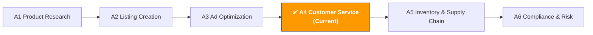

[🇨🇳 中文](../../../paths/a-operators/a4-customer-service.md) | 🇺🇸 English (current)

# A4. Customer Service & After-Sales

> **Path**: Path A: Operators · **Module**: A4  
> **Last Updated**: 2026-03-12  
> **Difficulty**: ⭐⭐ Intermediate  
> **Estimated Time**: 30 minutes per day, 1–2 weeks
---

🏠 [Hub Home](../../README.md) · 📋 [Path A Overview](README.md)



---

## 📖 Module Navigation

1. [Customer Service Methodology](#1-customer-service-methodology-the-fundamentals-before-ai) · 2. [AI Tool Landscape](#2-ai-tool-landscape-what-to-use-for-customer-service) · 3. [Prompt Template Library](#3-prompt-template-library-customer-service) · 4. [Customer Service Workflows](#4-customer-service-workflows) · 5. [Common Pitfalls](#5-common-customer-service-pitfalls) · 6. [Advanced Techniques](#6-advanced-techniques) · 7. [Learning Resources](#7-learning-resources) · 8. [🦞 OpenClaw Automation](#8-automate-customer-service-with-openclaw) · 9. [Completion Checklist](#9-completion-checklist)


## What You'll Learn in This Module

Use AI tools to transform customer service from "reactive firefighting" into "proactive defense." From negative review analysis to account appeals, build a reusable AI-assisted customer service management workflow.

After completing this module, you'll be able to:
- Use ChatGPT/Claude to batch-analyze negative reviews and pinpoint core product issues and improvement directions in 10 minutes
- Use AI to generate multilingual customer service reply templates covering common scenarios in 5 languages (English, Chinese, German, Japanese, Spanish)
- Use AI to write Plan of Action appeal letters, mastering the three-part structure: Root Cause + Immediate Actions + Preventive Measures
- Establish a negative review emergency response SOP — from discovery to action in under 24 hours
- Use AI to analyze return reports and uncover product iteration directions from return reasons
- Design a customer service KPI framework and use AI to track and optimize service performance

---

## 1. Customer Service Methodology: The Fundamentals Before AI

> 📎 **Related Reading**: [E5 WhatsApp Business AI Guide](../e-social-media/e5-whatsapp-business-ai-guide.md#e5-whatsapp-business-ai-customer-service-and-marketing-guide) — WhatsApp AI Chatbot customer service automation covered in E5. · [D9 eBay AI Guide](../d-platforms/d9-ebay-ai-guide.md#22-pre-ownedrefurbished-ai-description-generation-ebay-unique-scenario) — eBay used-item condition description AI generation covered in D9. · [E1 Instagram/Facebook AI Guide](../e-social-media/e1-instagram-facebook-ai-guide.md#e1-instagram-facebook-ai-operations-guide-meta-ecosystem-ai-playbook) — Instagram/Facebook DM and comment auto-reply strategies covered in E1.

### 1.1 First Principles of Amazon Customer Service

Customer service isn't just "replying to messages" — it's the last line of defense for brand experience and the primary source of intelligence for product iteration.

Amazon's customer experience philosophy is "Customer Obsession." The platform uses a series of metrics to measure seller service quality, and these metrics directly affect your account health and Buy Box eligibility:

```
ODR (Order Defect Rate) = (A-to-Z Claims + Negative Feedback + Chargebacks) / Total Orders
```
- **Target**: ODR < 1% (exceeding 1% triggers an account review)
- **Meaning**: No more than 1 problematic order per 100 orders

```
Late Shipment Rate = Late-shipped Orders / Total Orders
```
- **Target**: < 4% (FBA sellers generally don't need to worry about this metric)
- **Meaning**: Self-fulfilled sellers must ship within the promised timeframe

```
Pre-fulfillment Cancel Rate = Seller-canceled Orders / Total Orders
```
- **Target**: < 2.5%
- **Meaning**: Avoid frequently canceling orders due to stockouts or other reasons

**Differences Between Negative Reviews, Seller Feedback, and A-to-Z Claims:**

| Type | Where It Appears | Impact Scope | Can It Be Removed? | Response Strategy |
|------|-----------------|--------------|-------------------|-------------------|
| **Product Review** | Product detail page | Affects conversion rate, star rating | Policy-violating reviews can be reported for removal | Public reply + product improvement |
| **Seller Feedback** | Seller profile page | Affects ODR, Buy Box | FBA logistics issues can be requested for removal | Contact buyer + request removal |
| **A-to-Z Claim** | Account backend | Directly impacts ODR | Can be appealed | Respond within 48 hours + provide evidence |

> 💡 **Key Insight**: A single negative review can cause a 5–10% drop in conversion rate, especially for new products with few reviews. Suppose your product averages 10 orders/day at $30 per unit — a 5% conversion drop means 0.5 fewer orders per day, or $450 lost per month. That's the ROI of customer service — spending 30 minutes using AI to handle a negative review could save hundreds of dollars in monthly revenue.

### 1.2 Customer Service Scenario Overview

| Scenario | Frequency | Urgency | How AI Can Help |
|----------|-----------|---------|-----------------|
| Return/exchange requests | ⭐⭐⭐ High | ⭐⭐ Medium | Generate multilingual reply templates, analyze return reason trends |
| Product usage questions | ⭐⭐⭐ High | ⭐⭐ Medium | Generate FAQs, create usage guides, multilingual replies |
| Shipping inquiries | ⭐⭐ Medium | ⭐ Low | Generate standard reply templates (FBA mostly handled by Amazon) |
| Negative review replies | ⭐⭐ Medium | ⭐⭐⭐ High | Analyze review causes, generate professional public replies |
| Account appeals | ⭐ Low | ⭐⭐⭐ Urgent | Write Plan of Action, analyze violation causes |
| Compliance notices | ⭐ Low | ⭐⭐⭐ Urgent | Interpret notice content, generate compliance response plans |
| Review requests | ⭐⭐ Medium | ⭐ Low | Generate policy-compliant review request emails |
| Post-sale follow-up | ⭐⭐ Medium | ⭐⭐ Medium | Generate satisfaction follow-up emails, analyze customer feedback |

### 1.3 The Role of AI in Customer Service

What AI excels at:
- **Multilingual reply generation**: Generate customer service replies in 5 languages (English, Chinese, German, Japanese, Spanish) at once — far better quality than machine translation
- **Batch negative review analysis**: Extract issue categories, frequency, and trends from hundreds of negative reviews — what takes hours manually, AI does in 10 minutes
- **Template library management**: Generate standardized reply templates for different scenarios, ensuring consistent team response quality
- **Appeal letter writing**: Plan of Action has a fixed structure — AI can quickly generate professional, well-structured appeal letters
- **Return reason analysis**: Discover product issue patterns from return reports to guide product improvements
- **Sentiment analysis**: Determine the emotional tone of customer messages to help prioritize high-risk communications

What AI struggles with:
- **Emotional empathy**: AI-generated replies may be "correct but cold" — human review is needed to add warmth
- **Complex dispute resolution**: Disputes involving multiple parties (shipping damage, counterfeit complaints) require human judgment
- **Real-time conversations**: Amazon Buyer-Seller Messaging doesn't support AI auto-replies — manual operation is required
- **Policy boundary judgment**: Knowing what you can and can't say (e.g., you can't promise refunds) requires understanding Amazon policies

> 💡 **Core Principle**: AI is your customer service assistant, not a replacement. Use AI for analysis and draft generation; use humans for review and final decisions. Especially for sensitive operations like refunds and appeals — always confirm manually before executing.

---

## 2. AI Tool Landscape: What to Use for Customer Service

### 2.1 Paid Tool Deep Dive

| Tool | Price | Core Capability | Best For | AI Features |
|------|-------|----------------|----------|-------------|
| [eDesk](https://www.edesk.com/blog/ai-tools-ticket-history-ecommerce-support-replies-2026/) | $89–199/mo | AI-powered multi-channel CS platform with auto-reply suggestions, sentiment analysis, ticket management | Multi-channel sellers (Amazon+Shopify+eBay) | AI auto-reply suggestions, sentiment analysis, smart routing |
| [FeedbackWhiz](https://infinitefba.com/amazon-feedback-software-tools/) | $19–139/mo | Review monitoring, automated email sequences, negative review alerts, A/B email testing | Sellers needing review management | AI email optimization, real-time negative review alerts |
| Helium 10 Review Insights | $79/mo (included in Platinum) | AI review analysis, sentiment analysis, keyword extraction | Helium 10 users | AI-driven review sentiment and topic analysis |
| SellerApp Review Management | $49–99/mo | Review tracking, competitor review comparison, trend analysis | Sellers needing competitor review intelligence | AI review analysis and competitor comparison |
| Zendesk / Freshdesk | $19–99/mo | General CS platform with ticket management, knowledge base, automation | Sellers with DTC channels | AI auto-classification, suggested replies, knowledge base search |

**Tool Selection Recommendations:**

**Budget-friendly (<$20/mo)**: ChatGPT/Claude + Amazon native tools
- Use ChatGPT to generate reply templates and analyze negative reviews
- Use Amazon Buyer-Seller Messaging to handle customer messages
- Use Amazon Voice of Customer to monitor customer feedback
- Manual management — suitable for sellers with < 500 monthly orders

**Serious investment ($50–150/mo)**: FeedbackWhiz + ChatGPT
- FeedbackWhiz for review monitoring and automated emails
- ChatGPT for negative review analysis and appeal letter writing
- Suitable for sellers with 500–5,000 monthly orders

**Multi-channel operations ($100–200/mo)**: eDesk + ChatGPT
- eDesk to unify customer service across Amazon + Shopify + eBay
- AI suggests replies; humans review before sending
- Suitable for multi-platform sellers or sellers with a CS team

Content rephrased for compliance with licensing restrictions. Sources: [eDesk AI customer service](https://www.edesk.com/blog/ai-tools-ticket-history-ecommerce-support-replies-2026/), [InfiniteFBA feedback tools](https://infinitefba.com/amazon-feedback-software-tools/)

### 2.2 Free Tool Combinations

| Tool | Use Case | Link |
|------|----------|------|
| ChatGPT / Claude | Reply template generation, negative review analysis, appeal letter writing, multilingual translation | [chat.openai.com](https://chat.openai.com/) / [claude.ai](https://claude.ai/) |
| Amazon Buyer-Seller Messaging | Official messaging system — the only compliant channel for communicating with buyers | Seller Central → Messages |
| Amazon Voice of Customer | Official customer feedback dashboard showing return reasons and customer complaints | Seller Central → Performance → Voice of Customer |
| Amazon Brand Dashboard | Brand health dashboard with review trends and customer experience metrics | Seller Central → Brands → Brand Dashboard |

**Free Tool Usage Strategies:**

1. **Amazon Voice of Customer is a gold mine**: It aggregates all return reasons and customer complaints, categorized by ASIN. Check it weekly to catch product issues early.
2. **Buyer-Seller Messaging has a 24-hour rule**: You must reply within 24 hours of receiving a customer message, or it affects your response time metric. Prepare reply templates for common scenarios in advance with AI, then quickly customize and send when messages arrive.
3. **ChatGPT for batch analysis**: Paste all negative reviews from the past 30 days into ChatGPT and have it categorize and analyze trends — 10x faster than doing it manually.
4. **Brand Dashboard for trend tracking**: Brand-registered sellers can view review trends, customer experience scores, and other data to monitor long-term changes in service quality.

### 2.3 Open-Source Tools & APIs

| Tool/API | Use Case | GitHub/Link |
|----------|----------|-------------|
| python-amazon-sp-api | SP-API Python wrapper including Messaging API (send messages) and Notifications API (subscribe to notifications) | [github.com/saleweaver/python-amazon-sp-api](https://github.com/saleweaver/python-amazon-sp-api) |
| VADER Sentiment | Lightweight sentiment analysis tool for quick review sentiment scoring | [github.com/cjhutto/vaderSentiment](https://github.com/cjhutto/vaderSentiment) |
| BERTopic | Review topic modeling — automatically discover topic clusters in negative reviews | [github.com/MaartenGr/BERTopic](https://github.com/MaartenGr/BERTopic) |
| TextBlob | Simple sentiment analysis and text processing | [github.com/sloria/TextBlob](https://github.com/sloria/TextBlob) |

**When to use open-source tools?**

If you manage 10+ ASINs or receive 100+ negative reviews per month, open-source tools can:
- **Automated sentiment analysis**: Use VADER or TextBlob to score all new reviews for sentiment, automatically flagging reviews that need attention
- **Topic modeling**: Use BERTopic to automatically discover issue themes from hundreds of negative reviews (e.g., "battery life," "packaging damage") without manual categorization
- **Automated notifications**: Use SP-API's Notifications API to subscribe to new review notifications and catch negative reviews immediately

> For more technical implementation details, refer to the related modules in [Path B: Developers](../b-developers/).

---

## 3. Prompt Template Library (Customer Service)

> Complete standardized templates (with verification status, contributor info, and sharing links) are stored in [prompts/customer-service.md](../../prompts/customer-service.md).
> This section provides in-depth analysis, common mistakes, and advanced variants for each template.

### 3.1 Batch Negative Review Analysis

**Why this prompt works:** It requires AI to categorize by issue type and output frequency and percentages in a table, avoiding AI's common tendency to give vague, generic responses. It breaks output into 5 clear dimensions (categorization, frequency, representative reviews, short-term response, long-term improvement), each with specific actionable recommendations. Key design points:
- "Categorize by issue type" — forces AI to do structured analysis rather than reviewing one by one
- "Sort by frequency × severity" — directly drives prioritization decisions
- "Short-term response + long-term improvement" — distinguishes urgent handling from root-cause resolution

**Common mistakes:**
- ❌ Too little data (<20 negative reviews) → Sample too small to identify trends; use at least 60 days of 1–3 star reviews
- ❌ Not separating by marketplace → US, DE, and JP reviews reflect different market expectations; analyze by marketplace
- ❌ Only reading text, ignoring star distribution → 2-star and 1-star issues differ in severity; count them separately
- ❌ Ignoring the "but" in positive reviews → The "but" in 4-star reviews is often the most valuable improvement signal

[Full template → prompts/customer-service.md](../../prompts/customer-service.md)

**Advanced Variants:**

**Variant A — Timeline-based negative review trend analysis:**

```
以下是我的产品过去 6 个月的差评数据（1-3 星），按月份分组：

1月差评：[粘贴]
2月差评：[粘贴]
3月差评：[粘贴]
...

请分析差评趋势：
1. 每月差评数量和占比变化趋势（用表格）
2. 是否有新出现的问题类型？（可能是供应商换料、物流变化等导致）
3. 是否有持续存在但未解决的老问题？
4. 差评高峰期是否与特定事件相关？（大促后、季节变化、Listing 修改后）
5. 基于趋势，预测下个月可能的差评重点和预防建议
```

> 💡 **Why use this variant**: A one-time analysis only shows "what problems exist now." Trend analysis reveals "whether problems are getting better or worse." If a particular issue's share of negative reviews is steadily rising, it signals a new product or supply chain problem that needs urgent investigation.

**Variant B — Multilingual negative review analysis (German/Japanese reviews):**

```
以下是我的产品在 Amazon DE 站的德语差评：
[粘贴德语差评]

以下是 Amazon JP 站的日语差评：
[粘贴日语差评]

请完成：
1. 将所有差评翻译为中文，保留原文对照
2. 按问题类型分类（与 US 站使用相同的分类体系）
3. 对比不同站点的差评特征：
   - DE 站用户最关注什么？（德国消费者通常重视品质和安全认证）
   - JP 站用户最关注什么？（日本消费者通常重视细节和包装）
4. 哪些问题是全球共性的？哪些是特定市场的？
5. 针对每个市场的差异化改进建议
```

> 💡 **Why use this variant**: Consumer expectations vary dramatically across markets. German consumers might leave a negative review because "the manual isn't in German," while Japanese consumers might do so because "the packaging had a slight crease." AI can help you understand these cultural differences and develop targeted improvement strategies.

**Variant C — Negative vs. positive review comparison:**

```
以下是我的产品评论数据：

5星好评（最近 20 条）：[粘贴]
1-2星差评（最近 20 条）：[粘贴]

请对比分析：
1. 好评中最常提到的优点是什么？（这是你的核心卖点）
2. 差评中最常提到的缺点是什么？（这是你的核心短板）
3. 好评和差评中是否有矛盾的评价？（如有人说"很轻便"，有人说"太轻不结实"）
4. 基于对比，Listing 应该强调什么、弱化什么？
5. 产品改进的优先级排序（解决差评问题 vs 强化好评优点）
```

> 💡 **Why use this variant**: Positive reviews tell you "why customers buy," while negative reviews tell you "why customers are dissatisfied." Comparative analysis helps you find listing optimization directions — emphasize the core selling points from positive reviews, and proactively address common concerns from negative reviews in your A+ Content.

---

### 3.2 Account Appeal Letter (Plan of Action)

**Why this prompt works:** Amazon's appeal review team processes a massive volume of appeals daily. They need to quickly determine whether a seller truly understands the problem and has the ability to fix it. The Root Cause + Immediate Actions + Preventive Measures three-part structure is Amazon's officially recommended format, and AI can help you quickly generate a well-structured, detailed appeal letter.

**Common mistakes:**
- ❌ Too vague → "We will strengthen quality management" won't pass review. Be specific: "We have switched to supplier XX, which is ISO 9001 certified"
- ❌ Shifting blame → "This is the logistics company's fault" won't be accepted. Even for logistics issues, you need to explain how you're choosing a better logistics solution
- ❌ No specific action items → Each section needs at least 3 specific, executable action items with timelines
- ❌ Wrong tone → Don't argue, don't complain, don't threaten. The tone should be "sincere acknowledgment + proactive resolution"
- ❌ Submitting multiple issues at once → If you have multiple violations, write a separate appeal letter for each

[Full template → prompts/customer-service.md](../../prompts/customer-service.md)

**Advanced Variants:**

**Variant A — Intellectual property complaint appeal:**

```
我的 Amazon 账号收到了知识产权投诉（Intellectual Property Complaint），详情如下：
[粘贴投诉通知]

投诉类型：[商标侵权 / 专利侵权 / 版权侵权]
我的情况：[说明你认为不侵权的理由，或已采取的措施]

请撰写申诉信（Plan of Action）：

1. Root Cause（根本原因）：
   - 承认收到投诉并认真对待
   - 说明对知识产权保护的理解
   - 分析导致投诉的具体原因

2. Immediate Actions（已采取的紧急措施）：
   - 已下架涉嫌侵权的 Listing
   - 已联系投诉方沟通（如适用）
   - 已审查所有在售产品的知识产权合规性

3. Preventive Measures（预防措施）：
   - 建立产品上架前的知识产权审查流程
   - 使用 Amazon Brand Registry 和 IP Accelerator 工具
   - 定期培训团队关于知识产权合规

语气要求：诚恳专业，不辩解，展示对知识产权的尊重和保护意愿。
```

**Variant B — Product authenticity complaint appeal:**

```
我的 Amazon 账号收到了产品真实性投诉（Product Authenticity Complaint），详情如下：
[粘贴投诉通知]

我的产品是：[品牌名] [产品名]
我是否为品牌所有者/授权经销商：[是/否]
我有哪些证明文件：[发票、授权书、品牌注册证等]

请撰写申诉信（Plan of Action）：

1. Root Cause：
   - 说明产品来源和供应链
   - 承认可能导致误解的环节

2. Immediate Actions：
   - 已准备的证明文件清单（发票、授权书、质检报告）
   - 已采取的产品验证措施

3. Preventive Measures：
   - 供应链文档管理流程
   - 产品批次追溯系统
   - 定期供应商审核计划

附件建议：列出应该附上的证明文件及格式要求。
```

**Variant C — Account health metric violation appeal:**

```
我的 Amazon 账号因为以下健康指标违规被暂停：
- ODR (Order Defect Rate)：当前 [X]%（目标 < 1%）
- Late Shipment Rate：当前 [X]%（目标 < 4%）
- 其他违规：[描述]

过去 90 天的订单数据：
- 总订单数：[X]
- A-to-Z Claims 数量：[X]
- 差评数量：[X]
- 延迟发货数量：[X]

请撰写申诉信（Plan of Action）：

1. Root Cause：
   - 分析每个超标指标的具体原因
   - 识别导致问题的系统性因素

2. Immediate Actions：
   - 针对每个问题已采取的紧急措施
   - 已处理的具体订单和客户投诉

3. Preventive Measures：
   - 客服响应时间改善计划
   - 库存和物流管理优化
   - 产品质量控制加强措施
   - 指标监控和预警机制

每个行动项标注：负责人、完成时间、预期效果。
```

Content rephrased for compliance with licensing restrictions. Source: [eStorefactory account suspension guide](https://www.estorefactory.com/blog/amazon-account-suspension-guide-2026/)

---

### 3.3 Multilingual Customer Service Reply Template Generation

**Why this prompt matters:** Operating across multiple marketplaces means you need to reply to customers in English, German, Japanese, Spanish, and more. Google Translate quality isn't professional enough, and it doesn't understand the context of Amazon customer service. AI can generate professional multilingual reply templates in one go and adjust tone based on cultural differences.

**Common mistakes:**
- ❌ Directly translating Chinese templates → Customer service tone varies significantly across cultures. German CS is more formal, Japanese CS is more humble, Spanish CS is warmer
- ❌ Ignoring Amazon policy restrictions → Replies cannot contain external links, cannot direct customers to other platforms, and cannot promise specific refund amounts
- ❌ Templates too long → Customers won't read essays. Keep each reply to 3–5 sentences
- ❌ No room for personalization → Templates should include placeholders like [Customer Name], [Order Number], [Specific Issue]

```
你是一个多语言电商客服专家。请为以下 5 个常见客服场景生成回复模板，每个场景提供 5 种语言版本（英语、德语、日语、西班牙语、中文）。

场景1：客户收到损坏的产品，要求退换
场景2：客户询问产品使用方法
场景3：客户对产品不满意，想退货
场景4：客户询问订单物流状态
场景5：客户留了差评，主动联系表达不满

每个模板要求：
1. 控制在 3-5 句话
2. 语气根据文化调整（德语正式、日语谦恭、西班牙语热情、英语友好专业）
3. 包含 [客户名]、[订单号]、[产品名] 等占位符
4. 符合 Amazon Buyer-Seller Messaging 政策（不含外部链接、不引导站外）
5. 以解决问题为导向，不辩解

输出格式：按场景分组，每个场景下列出 5 种语言版本。
```

**Advanced variant — Culture-specific tone adjustments:**

```
以下是我的英语客服回复模板：
[粘贴英语模板]

请将这个模板本地化为以下语言，注意不是直译，而是根据当地文化调整：

1. 德语版（Amazon DE）：
   - 语气更正式，使用 "Sie"（您）而非 "du"（你）
   - 德国消费者重视精确性，回复中包含具体的时间承诺
   - 提及欧盟消费者权益保护法（如适用）

2. 日语版（Amazon JP）：
   - 使用敬语（です/ます体），表达歉意要更深
   - 日本消费者期望快速响应和详细说明
   - 结尾加上"今後ともよろしくお願いいたします"等礼貌用语

3. 西班牙语版（Amazon ES/MX）：
   - 语气可以更热情和个人化
   - 西班牙和墨西哥的用语有差异，标注两个版本
   - 表达关心和理解的语句更多
```

> 💡 **Core principle of multilingual CS**: It's not translation — it's localization. The same "sorry for the inconvenience" is expressed as "We apologize for the inconvenience" in English, "ご不便をおかけして誠に申し訳ございません" in Japanese (deeper apology), and "Wir entschuldigen uns für die Unannehmlichkeiten" in German (more formal). AI understands these cultural nuances far better than translation tools.

---

### 3.4 Negative Review Reply Strategy

**Why this prompt matters:** Publicly replying to negative reviews is an opportunity to showcase your brand's attitude. Potential buyers read negative reviews and seller responses before purchasing. A professional, sincere reply can mitigate the negative impact and even create a positive impression of your brand.

**Common mistakes:**
- ❌ Being defensive → "This isn't our fault, it's a logistics issue" makes potential buyers think you're shifting blame
- ❌ Templated responses → Using the same reply for every negative review — potential buyers can spot it immediately
- ❌ Not replying → Not responding to negative reviews is equivalent to accepting the review's content; you miss the chance to show your brand's attitude
- ❌ Requesting review removal → Asking customers to remove reviews in a public reply violates Amazon policy
- ❌ Offering compensation → Offering refunds or compensation in a public reply violates Amazon policy

```
你是一个 Amazon 品牌客服经理。以下是我的产品收到的差评，请为每条差评生成专业的公开回复。

产品：[产品名称和简要描述]

差评1（1星）："[差评内容]"
差评2（2星）："[差评内容]"
差评3（1星）："[差评内容]"

每条回复要求：
1. 开头感谢客户的反馈（即使是差评）
2. 对客户的不满表示理解和歉意
3. 针对具体问题给出解释或解决方案（不辩解）
4. 邀请客户通过 Buyer-Seller Messaging 联系我们进一步解决
5. 展示品牌对产品质量的承诺
6. 控制在 3-5 句话，不要太长
7. 不要在回复中提供退款、补偿或要求删除差评

语气：诚恳、专业、以解决问题为导向。记住：这个回复不只是给差评客户看的，更是给所有潜在买家看的。
```

Content rephrased for compliance with licensing restrictions. Source: [SellerApp responding to negative reviews](https://sellerapp.com/blog/how-to-respond-to-negative-reviews)

---

### 3.5 Review Request Email Optimization

**Why this prompt matters:** Proactively requesting reviews is a compliant way to improve your rating. Amazon allows sellers to request reviews via the "Request a Review" button or Buyer-Seller Messaging, but the content must comply with policy. A well-crafted review request email can boost your review rate from 1–2% to 5–10%.

**Common mistakes:**
- ❌ Only requesting positive reviews → Amazon policy explicitly prohibits "requesting only positive reviews" — it must be a neutral review request
- ❌ Offering incentives → You cannot use discounts, freebies, or other incentives in exchange for reviews
- ❌ Wrong timing → Requesting a review right when the product arrives, before the customer has used it. Recommend sending 3–5 days after expected use
- ❌ Too frequent → You can only request a review once per order; multiple requests are considered harassment

```
你是一个 Amazon 邮件营销专家。请为以下产品生成符合 Amazon 政策的 Review 请求邮件。

产品：[产品名称]
品类：[品类]
核心卖点：[1-2 个核心卖点]
预计使用场景：[客户通常如何使用这个产品]

要求：
1. 邮件标题要吸引打开（但不能用误导性标题）
2. 开头感谢购买，简短提及产品使用建议（增加价值）
3. 中性地请求 Review（不暗示要好评）
4. 提供使用帮助（如有问题请联系我们，不要直接给差评）
5. 控制在 100 字以内（客户不会读长邮件）
6. 符合 Amazon 政策：不提供激励、不只请求好评、不包含外部链接

请生成 3 个版本：
版本A：简洁直接型
版本B：增值服务型（附带使用技巧）
版本C：品牌故事型（简短品牌介绍 + Review 请求）
```

> 💡 **Core principle of review requests**: The best review request isn't "please give us a good review" — it's "we'd love to hear your honest feedback." At the same time, provide usage help so dissatisfied customers contact you first rather than leaving a negative review directly.

---

### 3.6 Product FAQ Generation

**Why this prompt matters:** A good FAQ can reduce customer service workload by 50%. Most customer questions are repetitive — how to install, how to charge, whether the size fits, whether it's compatible with a certain device. Organizing these into a FAQ and placing them in your listing's A+ Content or product description lets customers find answers on their own.

**Common mistakes:**
- ❌ Too few FAQs → Only 3–5 questions isn't enough; cover at least 10–15 common questions
- ❌ Answers too formal → FAQ answers should read like a friend helping you out, not an instruction manual
- ❌ Not updating → FAQs not updated after product iterations lead to outdated information
- ❌ Not based on real data → FAQs should be based on actual customer questions (negative reviews, messages, return reasons), not guesswork

```
你是一个产品体验专家。请基于以下数据，为我的产品生成 FAQ。

产品：[产品名称和描述]

数据来源1 — 最近 30 天的客户消息（常见问题）：
[粘贴客户消息摘要]

数据来源2 — 最近 60 天的差评（客户困惑点）：
[粘贴差评摘要]

数据来源3 — 退货原因报告：
[粘贴退货原因]

请生成：
1. Top 15 FAQ（按频率排序）
   - 每个问题用客户的语言表述（不是官方语言）
   - 每个答案控制在 2-3 句话，清晰直接
   - 标注每个问题的来源（客户消息/差评/退货原因）

2. 建议放在 Listing 中的位置：
   - 哪些 FAQ 适合放在 Bullet Points？
   - 哪些适合放在 A+ Content？
   - 哪些适合放在产品说明书/包装内卡片？

3. 需要产品改进才能解决的问题（FAQ 解决不了的）
```

> 💡 **Core value of FAQs**: Every FAQ is "preventing" a potential negative review or return. If a customer knows before purchasing that "this product isn't compatible with XX device," they won't buy it and then leave a negative review because of incompatibility.

---

### 3.7 Return Reason Analysis

**Why this prompt matters:** Return rate directly impacts profitability and account health. Amazon flags warnings on products with high return rates, and severe cases can lead to delisting. The reason data in return reports is a gold mine for product improvement — it tells you why customers are dissatisfied, more directly than negative reviews.

**Common mistakes:**
- ❌ Only looking at return rate, not reasons → A 10% return rate could be "didn't like it" (normal) or "product damaged" (serious) — different reasons require completely different strategies
- ❌ Not distinguishing controllable vs. uncontrollable reasons → "Bought the wrong item" is uncontrollable; "product doesn't match description" is controllable
- ❌ Not cross-referencing with negative review data → Combining return reasons + negative review content produces more accurate problem identification

```
你是一个产品质量分析师。以下是我的产品退货报告数据（过去 90 天）：

[粘贴退货数据：退货原因、数量、占比]

产品信息：
- 产品名称：[名称]
- 售价：$[X]
- 月销量：[X] 单
- 当前退货率：[X]%
- 品类平均退货率：[X]%

请分析：
1. 退货原因分类和占比（用表格）
2. 可控原因 vs 不可控原因的比例
3. 每个可控原因的改进建议：
   - Listing 层面（描述更准确、图片更真实）
   - 产品层面（质量改进、包装加强）
   - 客服层面（主动联系、使用指导）
4. 退货率降低目标和预计时间线
5. 如果退货率持续高于品类平均，可能面临的风险和应对
```

> 💡 **Core principle of return analysis**: Not all returns are bad. Returns for "bought the wrong item" or "didn't like the color" are normal e-commerce attrition. What you need to focus on are controllable reasons like "product doesn't match description," "quality issues," and "functional defects" — those are what need improvement.

---

### 3.8 Customer Service SLA and Performance Tracking

**Why this prompt matters:** If you have a CS team (even just 1–2 people), you need a KPI framework to measure service quality. Without measurement, there's no improvement. AI can help you design a KPI system and tracking template suited to your business scale.

```
你是一个电商客服管理专家。请为我的 Amazon 业务设计客服 KPI 体系。

业务信息：
- 月订单量：[X] 单
- 站点：Amazon [US/DE/JP]
- 客服团队规模：[X] 人
- 当前主要客服渠道：Buyer-Seller Messaging
- 当前痛点：[描述，如响应慢、差评处理不及时等]

请设计：
1. 核心 KPI（5-8 个指标）：
   - 每个指标的定义、计算方式、目标值
   - 数据来源（从哪里获取数据）
   - 监控频率（日/周/月）

2. KPI 追踪模板（Excel/Google Sheets 格式）：
   - 列出需要追踪的字段
   - 建议的数据录入频率
   - 自动计算公式建议

3. 绩效改进建议：
   - 如果某个 KPI 不达标，应该采取什么措施？
   - 如何用 AI 工具辅助改进？

4. 月度客服报告模板：
   - 包含哪些内容？
   - 如何用 AI 自动生成月度总结？
```

> 💡 **Core CS KPIs**: Response time (< 24 hours), resolution rate (first-reply resolution > 70%), customer satisfaction, negative review response rate (100% of negative reviews get a public reply), return rate trend. You don't need too many metrics — 5–8 core KPIs are sufficient.

---

## 4. Customer Service Workflows

### 4.1 Daily Customer Service SOP (15 Minutes Per Day)

This SOP standardizes daily CS work to ensure no customer issues are overlooked.

```
┌─────────────────────────────────────────────────────────┐
│  Step 1: Check Messages (5 min)                         │
│  Action: Log in to Seller Central → Messages            │
│  Check: Any unreplied customer messages?                │
│  Rule: Must reply within 24 hours (affects response     │
│        time metric)                                     │
│  AI: Use pre-prepared multilingual templates for quick  │
│      replies (Prompt 3.3)                               │
│  Priority: A-to-Z Claim > Return request > Product      │
│           issue > Shipping inquiry                      │
├─────────────────────────────────────────────────────────┤
│  Step 2: Check Negative Reviews (5 min)                 │
│  Action: Check Voice of Customer + Product Reviews      │
│  Check: Any new 1–2 star reviews?                       │
│  AI: Use negative review reply strategy prompt (3.4)    │
│      to generate public replies                         │
│  Rule: Reply to all new negative reviews within 24 hrs  │
│  Record: Log review content in negative review tracker  │
├─────────────────────────────────────────────────────────┤
│  Step 3: Check Account Health (5 min)                   │
│  Action: Seller Central → Performance → Account Health  │
│  Check: ODR, Late Shipment Rate, Policy Violations      │
│  Alert: If any metric approaches threshold, trigger     │
│         emergency response immediately                  │
│  AI: If anomalies found, use diagnostic approach to     │
│      investigate root cause                             │
└─────────────────────────────────────────────────────────┘
```

### 4.2 Negative Review Emergency Response SOP

When a new 1–2 star review is discovered, follow this process:

```
┌─────────────────────────────────────────────────────────┐
│  Step 1: Assess Severity (5 min)                        │
│  Evaluate: Does the review involve safety issues? Could │
│           it trigger more negative reviews?             │
│  Classify: Product quality / Shipping damage / Usage    │
│           difficulty / Expectation mismatch / Malicious │
│  Priority: Safety > Quality > Usage difficulty >        │
│           Expectation mismatch                          │
├─────────────────────────────────────────────────────────┤
│  Step 2: Public Reply (10 min)                          │
│  AI: Use negative review reply strategy prompt (3.4)    │
│  Review: Manually check reply content for Amazon policy │
│         compliance                                      │
│  Publish: Post public reply under the product review    │
│  Principle: Sincere, no excuses, invite private         │
│            communication                                │
├─────────────────────────────────────────────────────────┤
│  Step 3: Private Outreach (if possible) (10 min)        │
│  Action: Contact reviewer via Buyer-Seller Messaging    │
│  Goal: Understand the specific issue, offer a solution  │
│  Note: Do NOT ask to remove the review — focus solely   │
│        on solving the problem                           │
│  AI: Use multilingual templates to generate a           │
│      personalized outreach message                      │
├─────────────────────────────────────────────────────────┤
│  Step 4: Root Cause Analysis (15 min)                   │
│  Determine: Is this an isolated case or systemic issue? │
│  Check: Similar reviews in the past 30 days? Consistent │
│         return reasons?                                 │
│  AI: If systemic, use batch analysis prompt (3.1)       │
│  Action: Update listing / Contact supplier / Adjust     │
│         packaging                                       │
├─────────────────────────────────────────────────────────┤
│  Step 5: Record and Track                               │
│  Action: Log in tracker: date, content, category,       │
│         actions taken                                   │
│  Follow-up: Check for improvement after 1 week          │
│  Review: Monthly negative review trend analysis with    │
│         AI (Prompt 3.1 Variant A)                       │
└─────────────────────────────────────────────────────────┘
```

### 4.3 Account Appeal SOP (From Notification to Reinstatement)

Account suspension is the most urgent customer service event. Follow this process:

```
┌─────────────────────────────────────────────────────────┐
│  Day 1: Stay Calm and Analyze (don't rush to submit)    │
│  Action: Carefully read Amazon's suspension notice and  │
│         understand the specific reason                  │
│  AI: Paste the notice into AI to help interpret key     │
│      information                                        │
│  Gather: Compile all relevant evidence (invoices, QC    │
│         reports, communication records)                 │
│  Note: The first appeal matters most — don't submit     │
│        hastily                                          │
├─────────────────────────────────────────────────────────┤
│  Day 2–3: Write the Plan of Action                      │
│  AI: Use account appeal prompt (3.2) to generate draft  │
│  Review: Manually review every action item — ensure     │
│         each is specific and executable                 │
│  Supplement: Add concrete evidence and data support     │
│  Proofread: Check grammar, formatting, and logic        │
│  Recommend: Have an experienced seller or service       │
│            provider review it                           │
├─────────────────────────────────────────────────────────┤
│  Day 3–4: Submit the Appeal                             │
│  Action: Via Seller Central → Performance Notifications │
│  Attachments: Include all supporting documents (PDF     │
│              format, clear and legible)                 │
│  Record: Save submission time and a copy of the content │
├─────────────────────────────────────────────────────────┤
│  Day 4–14: Wait and Follow Up                           │
│  Wait: Amazon typically responds within 3–7 business    │
│       days                                              │
│  If rejected: Analyze rejection reason, use AI to       │
│              revise the Plan of Action                  │
│  If no response: Follow up via Seller Support after     │
│                 7 days                                  │
│  Maximum: 3 appeal attempts. If all 3 are rejected,     │
│          consider seeking professional help             │
├─────────────────────────────────────────────────────────┤
│  After Reinstatement: Execute Preventive Measures       │
│  Action: Strictly execute the preventive measures       │
│         promised in your Plan of Action                 │
│  Monitor: Check account health metrics daily            │
│  Record: Keep records of all improvement actions (may   │
│         be needed for future appeals)                   │
└─────────────────────────────────────────────────────────┘
```

> 💡 **Core principle of account appeals**: The first appeal has the highest success rate. Don't rush to submit an incomplete appeal — spending 2–3 days preparing a thorough Plan of Action is far more effective than hastily submitting 3 times.

Content rephrased for compliance with licensing restrictions. Source: [eStorefactory account suspension guide](https://www.estorefactory.com/blog/amazon-account-suspension-guide-2026/)

### 4.4 Multilingual CS Template Library Building SOP

If you operate across multiple marketplaces, you need to build a multilingual customer service template library:

```
┌─────────────────────────────────────────────────────────┐
│  Step 1: Map Out Scenarios (1 hour, one-time)           │
│  Action: Review customer messages from the past 90 days │
│         and list all scenarios                          │
│  Categorize: Returns / Product issues / Shipping /      │
│             Negative reviews / Other                    │
│  Goal: Cover 80%+ of customer message scenarios         │
├─────────────────────────────────────────────────────────┤
│  Step 2: Generate Templates (2 hours, one-time)         │
│  AI: Use multilingual template generation prompt (3.3)  │
│     for batch generation                                │
│  Languages: Choose based on your marketplaces (US =     │
│            English, DE = German, JP = Japanese, etc.)   │
│  Review: Have native speakers or professional           │
│         translators review key templates                │
├─────────────────────────────────────────────────────────┤
│  Step 3: Store and Use                                  │
│  Tools: Google Sheets / Notion / Text expansion tool    │
│  Organize: Arrange templates in a scenario × language   │
│           matrix                                        │
│  Usage: Receive message → Identify scenario → Select    │
│        template → Personalize → Send                    │
├─────────────────────────────────────────────────────────┤
│  Step 4: Continuous Optimization (30 min/month)         │
│  Action: Review this month's messages — any new         │
│         scenarios that need templates?                  │
│  AI: Use AI to analyze this month's messages and        │
│     discover new common issues                          │
│  Update: Add new templates, refine existing wording     │
└─────────────────────────────────────────────────────────┘
```

---

## 5. Common Customer Service Pitfalls

### 5.1 Reply-Related Pitfalls

| Pitfall | Symptom | How to Avoid |
|---------|---------|--------------|
| **Slow replies** | Not replying to customer messages within 24 hours, affecting response time metric | Set a fixed daily time to check messages (Daily SOP Step 1). Use pre-made templates to speed up replies. |
| **Templated replies** | Every customer receives the exact same reply, making them feel unvalued | Templates are just a starting point — add personalized elements every time (customer name, specific issue, specific solution). |
| **Defending instead of solving** | "This isn't our fault" or "You're using it wrong" | Always apologize first, then solve. Even if the customer is mistaken, guide them rather than blame them. |
| **Overpromising** | "We'll refund within 24 hours" but can't actually deliver | Only promise what you can 100% deliver. For uncertainties, use "We'll handle this as quickly as possible." |
| **Wrong tone** | Too formal like a robot, or too casual and unprofessional | Adjust tone by market (see Prompt 3.3's cultural difference guide). |

### 5.2 Review-Related Pitfalls

| Pitfall | Symptom | How to Avoid |
|---------|---------|--------------|
| **Policy-violating review requests** | Using discounts or freebies for positive reviews, or only requesting positive feedback | Only use Amazon's official "Request a Review" button, or send neutral review request emails (Prompt 3.5). |
| **Ignoring negative reviews** | Not replying to, analyzing, or improving after negative reviews appear | Check for new negative reviews daily (Daily SOP Step 2); reply publicly within 24 hours. |
| **Not analyzing review trends** | Only handling individual reviews without looking at the big picture | Use AI for monthly negative review trend analysis (Prompt 3.1 Variant A) to identify systemic issues. |
| **Obsessing over review removal** | Spending excessive time trying to remove reviews instead of fixing root causes | Only policy-violating reviews are worth reporting for removal. Focus energy on product improvement and earning more positive reviews. |
| **Not leveraging positive reviews** | Keywords and selling points from positive reviews aren't used in listings | Use AI to analyze positive reviews (Prompt 3.1 Variant C), extract the selling points customers value most, and update your listing. |

Content rephrased for compliance with licensing restrictions. Source: [TraceFuse feedback removal](https://tracefuse.ai/blog/amazon-feedback-removal-request-template/)

### 5.3 Account-Related Pitfalls

| Pitfall | Symptom | How to Avoid |
|---------|---------|--------------|
| **Ignoring ODR metrics** | ODR approaching 1% with no action taken until account suspension | Check account health daily (Daily SOP Step 3); trigger an alert when ODR > 0.5%. |
| **Not handling A-to-Z Claims promptly** | Delaying response after receiving an A-to-Z Claim | Must respond within 48 hours. Have standard A-to-Z response templates ready. |
| **Vague appeal letters** | "We will improve" — generic statements won't pass review | Use AI to generate specific Plans of Action (Prompt 3.2); every action item must specify who, when, and what. |
| **Resubmitting the same appeal** | Resubmitting without changes after rejection | Analyze the rejection reason after each attempt, revise with AI, then resubmit. Maximum 3 attempts. |
| **Not preserving evidence** | Invoices, QC reports, and communication records not systematically saved | Build a document management system; archive all evidence by ASIN and date. Be ready to retrieve quickly during appeals. |

---

## 6. Advanced Techniques

### 6.1 AI-Driven Customer Sentiment Monitoring

When your product has a large volume of reviews, manually monitoring each one isn't realistic. AI can help you build an automated sentiment monitoring system:

**Basic version (using ChatGPT, 15 min/week):**

```
以下是我的产品本周新增的所有 Review（包括好评和差评）：
[粘贴所有新 Review]

请完成情感分析：
1. 整体情感分布（正面/中性/负面的比例）
2. 本周情感趋势 vs 上周（是否有变化？）
3. 负面 Review 中的关键问题提取
4. 正面 Review 中的关键卖点提取
5. 需要紧急关注的 Review（涉及安全、严重质量问题）
6. 情感评分：1-10 分（10 分最正面），并与上周对比
```

**Advanced version (using Python + VADER, automated):**

If you have technical capability or a technical team, you can automate sentiment monitoring with a Python script:

```python
# Pseudocode example — automated sentiment monitoring
# 1. Pull new reviews via SP-API
# 2. Score sentiment with VADER
# 3. Auto-send alert emails for negative reviews
# 4. Generate weekly sentiment trend reports

# For detailed implementation, refer to Path B: Developers
```

> 💡 **Core value of sentiment monitoring**: Shift from "passively discovering negative reviews" to "proactively monitoring sentiment changes." If the proportion of negative sentiment suddenly spikes in a given week, it could signal a product batch issue, logistics problem, or competitor attack — requiring immediate investigation.

### 6.2 Discovering Product Iteration Directions from Negative Reviews

Negative reviews aren't just problems to "handle" — they're the best source of intelligence for product iteration. Customers who take the time to write a negative review genuinely care about the issue.

**Negative review-driven product iteration workflow:**

```
Collect negative reviews → AI categorization & analysis → Identify high-frequency issues → Assess improvement feasibility → Product iteration → Validate results
```

```
以下是我的产品过去 6 个月的所有差评（1-3 星），共 [X] 条：
[粘贴差评]

请从产品迭代的角度分析：

1. **问题优先级矩阵**（频率 × 严重程度）：
   | 问题 | 频率 | 严重程度 | 优先级 | 改进难度 |
   用表格列出所有问题，按优先级排序

2. **Quick Win（快速改进）**：
   - 不需要改产品就能解决的问题（如 Listing 描述更准确、包装加固、说明书改进）
   - 预计改进后差评减少比例

3. **产品改进建议**：
   - 需要改产品才能解决的问题
   - 每个改进的预估成本和时间
   - 改进后的预期效果

4. **供应商沟通要点**：
   - 需要与供应商讨论的质量问题清单
   - 每个问题的具体描述和改进要求
   - 建议的质检标准调整

5. **竞品对比**：
   - 这些问题在竞品中是否也存在？
   - 如果竞品没有这个问题，他们是怎么解决的？
```

> 💡 **Core principle of product iteration**: Start with Quick Wins (update listing, improve packaging, revise manual), then move to product changes. Quick Wins are low-cost and fast-acting — they can reduce related negative reviews by 20–30% within 1–2 weeks.

---
### 6.3 Multi-Marketplace CS Strategy (Cultural Differences)

Customer expectations and communication styles vary significantly across markets. Understanding these differences can dramatically improve your service quality:

| Dimension | US | Germany (DE) | Japan (JP) | Spain (ES) | UK |
|-----------|-----|-------------|------------|------------|-----|
| **Communication style** | Direct, friendly | Formal, precise | Indirect, humble | Warm, personal | Polite, understated |
| **Expected response time** | 24 hours | 24 hours | 12 hours (faster) | 24–48 hours | 24 hours |
| **Return attitude** | Returns are common, no reason needed | Strong consumer rights, higher return rate | Low return rate, but a return signals a serious issue | Moderate return rate | Similar to US |
| **Negative review style** | States the problem directly | Detailed, technical | Subtle but stern | Emotionally expressive | Understated but clear |
| **Recommended CS tone** | Friendly and professional | Formal and rigorous | Extremely polite | Warm and caring | Polite and professional |
| **Special considerations** | Speed matters | GDPR compliance | Packaging and details | Distinguish Spain vs. Latin America | Polite language matters |

**Practical tips for multi-marketplace CS:**

1. **Prepare independent template libraries for each marketplace**: Don't just translate one set of templates into multiple languages — customize templates for each market
2. **Understand local regulations**: Europe has a 14-day no-questions-asked return right (Distance Selling Regulations); Japan has specific consumer protection laws
3. **Time zone management**: If you're based in China, JP marketplace messages can be handled same-day, but US marketplace messages may need to wait until the next morning
4. **Holiday awareness**: Different markets have different holidays (e.g., Germany's Christmas market season, Japan's Golden Week) — CS volume increases before and after holidays

---

## 7. Learning Resources

### 7.1 Free Courses

| Resource | Platform | Duration | Best For | Link |
|----------|----------|----------|----------|------|
| Amazon Seller University — Customer Service | Amazon | Self-paced | All sellers (official free course covering message management, return handling, account health) | [sellercentral.amazon.com/learn](https://sellercentral.amazon.com/learn) |
| Customer Service Fundamentals | Coursera (Google) | 20h | CS beginners (foundational CS methodology including communication skills and problem-solving frameworks) | [coursera.org](https://www.coursera.org/learn/customer-service-fundamentals) |
| ChatGPT Prompt Engineering for Developers | DeepLearning.AI | 1.5h | Everyone (learning to write good prompts is the foundation of AI-assisted CS analysis) | [deeplearning.ai](https://www.deeplearning.ai/short-courses/chatgpt-prompt-engineering-for-developers/) |

### 7.2 Recommended YouTube Channels

| Channel | Content Focus | Why Recommended |
|---------|--------------|-----------------|
| Seller Sessions | In-depth Amazon seller interviews, including CS and review management strategies | Real seller experiences, highly practical |
| My Amazon Guy | Full Amazon operations workflow, including negative review handling and account appeals | Comprehensive content with many real-world cases |
| Helium 10 | Review analysis tool tutorials, Review Insights AI features | Official channel — the best tutorial source for tool usage |
| eDesk | Multi-channel CS management, AI CS tools | Stay current on AI customer service tool trends |

### 7.3 Recommended Reading

| Article/Resource | Source | Key Takeaway |
|-----------------|--------|--------------|
| [Amazon Review Management for Sellers](https://www.edesk.com/blog/amazon-review-management-sellers/) | eDesk | Systematic review management workflow — from monitoring to replying to analysis |
| [Tools to Monitor & Respond to Negative Reviews](https://www.edesk.com/blog/tools-monitor-respond-negative-product-reviews/) | eDesk | Negative review monitoring and response tool comparison, including AI tool recommendations |
| [AI Tools for E-Commerce Support Replies](https://www.edesk.com/blog/ai-tools-ticket-history-ecommerce-support-replies-2026/) | eDesk | 2026 AI customer service tool landscape, including auto-reply and sentiment analysis |
| [Amazon Account Suspension Guide 2026](https://www.estorefactory.com/blog/amazon-account-suspension-guide-2026/) | eStorefactory | Complete account suspension response guide with Plan of Action writing tips and real cases |
| [How to Respond to Negative Reviews](https://sellerapp.com/blog/how-to-respond-to-negative-reviews) | SellerApp | Negative review reply strategies with templates for different review types and key considerations |
| [Amazon Feedback Software Tools](https://infinitefba.com/amazon-feedback-software-tools/) | InfiniteFBA | Feedback management tool comparison with pricing and feature breakdowns |
| [Amazon Feedback Removal Request Template](https://tracefuse.ai/blog/amazon-feedback-removal-request-template/) | TraceFuse | Feedback removal request templates and process, including which feedback qualifies for removal |

Content rephrased for compliance with licensing restrictions. Sources cited inline.

### 7.4 Communities & Forums

| Community | Platform | Highlights |
|-----------|----------|------------|
| r/AmazonSeller | Reddit | General Amazon seller community with active CS and review management discussions |
| r/FulfillmentByAmazon | Reddit | FBA seller community with frequent return and CS issue discussions |
| Amazon Seller Forums | Amazon | Official forums — first-hand information on policy updates and account issues |
| 知无不言 | Zhihu | Chinese cross-border e-commerce community with rich account appeal and CS experience |
| 创蓝论坛 | Independent site | Chinese seller community with many practical negative review handling and appeal cases |
| eComCrew | Podcast + Community | English e-commerce community with CS best practices and tool recommendations |

---

## 8. Automate Customer Service with OpenClaw

### 8.1 Scenario: AI Agent Auto-Monitors Negative Reviews and Generates Reply Drafts

```
You tell OpenClaw:
"Every 6 hours, check if my product has new 1–3 star reviews,
analyze the negative review reasons, generate multilingual reply drafts,
and send them to CS for review"

OpenClaw auto-executes:
1. [Heartbeat] Check every 6 hours
2. [Skill: web-search] Detect new 1–3 star reviews
3. [LLM] Analyze negative review reason categories
4. [LLM] Generate multilingual reply drafts
5. [Skill: telegram] Send drafts to CS for review
```

### 8.2 Required Skills and MCP Servers

| Component | Use Case | Link |
|-----------|----------|------|
| **web-search** Skill | Detect new negative reviews and customer feedback | [OpenClaw Docs](https://docs.openclaw.com/) |
| **memory** Skill | Store reply templates and negative review history | [OpenClaw Docs](https://docs.openclaw.com/) |
| **telegram/slack** Skill | Send review notifications | [ClawHub](https://clawhub.ai/) |
| **filesystem MCP** | Read local CS template files | [MCP Filesystem](https://github.com/modelcontextprotocol/servers/tree/main/src/filesystem) |

### 8.3 Related Resources

| Resource | Description | Link |
|----------|-------------|------|
| OpenClaw Official Docs | Installation and configuration guide | [docs.openclaw.com](https://docs.openclaw.com/) |
| ClawHub Skills Marketplace | Search and install Agent Skills | [clawhub.ai](https://clawhub.ai/) |
| OpenClaw MCP Integration | Connect MCP Servers | [Build Skill with MCP](https://rebeccamdeprey.com/blog/build-openclaw-skill-with-mcp) |
| F4 Automation & Agents | Agent fundamentals module | [F4 Module](../0-foundations/f4-agent-automation.md) |

Content rephrased for compliance with licensing restrictions. Sources cited inline.

---

## 8.5 Supplement: AI Chatbot & Social Media CS Automation

> 🆕 This section supplements cross-platform AI customer service automation methodology. For platform-specific implementation, refer to [E5 WhatsApp Business](../e-social-media/e5-whatsapp-business-ai-guide.md) and [E1 Instagram DM Automation](../e-social-media/e1-instagram-facebook-ai-guide.md).

### Universal AI Chatbot Building Methodology

Whether it's Amazon buyer messages, Shopify Chat, WhatsApp, or Instagram DMs, the underlying logic of AI customer service is the same:

```
Universal AI CS Workflow Framework:

User message → AI intent recognition
├── Pre-sale inquiry (product questions/sizing/compatibility)
│   └── AI retrieves answer from product knowledge base → Auto-reply
├── Order issue (shipping/dispatch/modification)
│   └── AI queries order system → Returns status
├── After-sale issue (return/repair/complaint)
│   ├── Simple issue → AI auto-handles
│   └── Complex issue → Escalate to human (with AI summary)
└── Unrecognizable
    └── Escalate to human
```

### Social Media Comment/DM Auto-Reply Strategy

```
你是一个电商社交媒体客服专家。

我的品牌在 Instagram 和 TikTok 上收到大量评论和 DM。

请帮我设计自动回复策略：

1. 评论自动回复模板（5 种场景）
   - 正面评价感谢
   - 产品咨询引导 DM
   - 价格询问
   - 负面评价安抚
   - 购买意向引导下单

2. DM 自动回复流程
   - 欢迎消息
   - 产品推荐（基于用户提问）
   - 下单引导（链接到 Shop/网站）
   - 售后问题处理

每个模板提供英语和中文版本。
语气要求：友好、快速、不像机器人。
```

### AI Sentiment Detection & Escalation Mechanism

All customer service channels should have AI sentiment detection:
- Positive/Neutral → Continue auto-handling
- Mildly dissatisfied → Provide solution + small compensation (coupon)
- Strongly dissatisfied → Immediately escalate to human + flag as priority + AI generates issue summary

---

## 9. Completion Checklist
- [ ] Build a multilingual CS reply template library (covering at least 5 common scenarios × 3 languages)
- [ ] Use AI to write a complete Plan of Action appeal letter (including Root Cause + Immediate Actions + Preventive Measures)
- [ ] Generate a product FAQ (at least 10 questions) and update it in your listing or A+ Content
- [ ] Use AI to analyze a return report, identifying controllable return reasons and improvement directions
- [ ] Establish a daily CS SOP and execute it for at least 1 week, recording the results

After completing all items above, you've mastered the core skills of AI-assisted customer service management. Next, move on to [A5 Inventory & Supply Chain](a5-inventory.md) to learn how to use AI to optimize inventory management and supply chain decisions.

---

## Appendix: Quick Reference Cards

### Prompt Quick Reference

| Scenario | Prompt Template | Section |
|----------|----------------|---------|
| Batch negative review analysis | Batch Negative Review Analysis | [3.1](#31-batch-negative-review-analysis) |
| Negative review trend analysis | Timeline Analysis (Variant A) | [3.1](#31-batch-negative-review-analysis) |
| Multilingual negative review analysis | German/Japanese Review Analysis (Variant B) | [3.1](#31-batch-negative-review-analysis) |
| Negative vs. positive review comparison | Comparison Analysis (Variant C) | [3.1](#31-batch-negative-review-analysis) |
| Account appeal letter | Plan of Action | [3.2](#32-account-appeal-letter-plan-of-action) |
| IP complaint appeal | IP Complaint Appeal (Variant A) | [3.2](#32-account-appeal-letter-plan-of-action) |
| Product authenticity appeal | Product Authenticity Appeal (Variant B) | [3.2](#32-account-appeal-letter-plan-of-action) |
| Account health violation appeal | Health Metric Violation Appeal (Variant C) | [3.2](#32-account-appeal-letter-plan-of-action) |
| Multilingual reply templates | Multilingual CS Reply Template Generation | [3.3](#33-multilingual-customer-service-reply-template-generation) |
| Cultural localization | Tone Adjustment (Variant) | [3.3](#33-multilingual-customer-service-reply-template-generation) |
| Negative review public reply | Negative Review Reply Strategy | [3.4](#34-negative-review-reply-strategy) |
| Review request email | Review Request Email Optimization | [3.5](#35-review-request-email-optimization) |
| Product FAQ generation | Product FAQ Generation | [3.6](#36-product-faq-generation) |
| Return reason analysis | Return Reason Analysis | [3.7](#37-return-reason-analysis) |
| CS KPI design | CS SLA and Performance Tracking | [3.8](#38-customer-service-sla-and-performance-tracking) |
| Sentiment monitoring | AI Sentiment Monitoring | [6.1](#61-ai-driven-customer-sentiment-monitoring) |
| Product iteration analysis | Negative Review-Driven Product Iteration | [6.2](#62-discovering-product-iteration-directions-from-negative-reviews) |

### Tool Quick Reference

| Need | Recommended Tool | Free Alternative |
|------|-----------------|------------------|
| Negative review analysis | ChatGPT / Claude | ChatGPT free tier |
| Review monitoring | FeedbackWhiz | Amazon Voice of Customer |
| Multi-channel CS | eDesk | Amazon Buyer-Seller Messaging |
| Appeal letter writing | ChatGPT / Claude | ChatGPT free tier |
| Sentiment analysis | Helium 10 Review Insights | VADER Sentiment (open source) |
| Review topic modeling | BERTopic (open source) | ChatGPT manual analysis |
| Multilingual translation | ChatGPT / Claude | DeepL free tier |
| CS ticket management | Zendesk / Freshdesk | Google Sheets + templates |
| Return analysis | ChatGPT / Claude | ChatGPT free tier |
| Feedback management | FeedbackWhiz | Amazon native tools |

### Key CS Metrics Quick Reference

| Metric | Formula/Definition | Target | Monitoring Frequency |
|--------|-------------------|--------|---------------------|
| **ODR** | (A-to-Z + Negative Feedback + Chargebacks) ÷ Total Orders | < 1% | Daily |
| **Response Time** | Time from message received to first reply | < 24 hours | Daily |
| **Late Shipment Rate** | Late shipments ÷ Total Orders | < 4% | Weekly |
| **Pre-fulfillment Cancel Rate** | Seller cancellations ÷ Total Orders | < 2.5% | Weekly |
| **Negative Review Response Rate** | Replied negative reviews ÷ Total negative reviews | 100% | Daily |
| **Return Rate** | Returned orders ÷ Total Orders | < Category average | Weekly |
| **First-Contact Resolution Rate** | Resolved on first reply ÷ Total tickets | > 70% | Monthly |
| **Customer Satisfaction** | Positive feedback ÷ Total feedback | > 95% | Monthly |

### Negative Review Handling Decision Tree

```
Negative review received
  ├── Does it involve a safety issue?
  │   ├── Yes → Immediately delist product + Contact supplier + Public reply
  │   └── No ↓
  ├── Does it violate Amazon Review policy?
  │   ├── Yes → Report for removal + Public reply
  │   └── No ↓
  ├── Is it an FBA logistics issue?
  │   ├── Yes → Request Feedback removal + Public reply with explanation
  │   └── No ↓
  ├── Is it a product quality issue?
  │   ├── Yes → Public reply + Private outreach + Root cause analysis + Product improvement
  │   └── No ↓
  ├── Is it a usage/how-to issue?
  │   ├── Yes → Public reply with usage guidance + Update FAQ
  │   └── No ↓
  └── Expectation mismatch → Public reply + Check if listing needs more accurate description
```

---
> 🏠 [Hub Home](../../README.md) · 📋 [Path A Overview](README.md)
> 
> **Path A**: [A1 Product Research](a1-product-research.md) · [A2 Listing](a2-listing-optimization.md) · [A3 Advertising](a3-advertising.md) · [A4 Customer Service](a4-customer-service.md) · [A5 Inventory](a5-inventory.md) · [A6 Compliance](a6-compliance.md)
> 
> **Quick Jump**: [Path 0 Foundations](../0-foundations/) · [Path B Developers](../b-developers/) · [Path C Managers](../c-managers/) · [Path D Multi-Platform](../d-platforms/) · [Path E Social Media](../e-social-media/)
