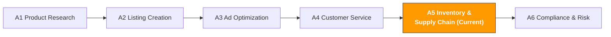

[🇨🇳 中文](../../../paths/a-operators/a5-inventory.md) | 🇺🇸 English

# A5. Inventory & Supply Chain

> **Path**: Path A: Operators · **Module**: A5
> **Last Updated**: 2026-03-12
> **Difficulty**: Intermediate
> **Estimated Time**: 30 minutes per day, 12 weeks
---

[Hub Home](../../README.md) · [Path A Overview](README.md)



---

## Module Navigation

1. [Inventory Methodology](#1-inventory-methodology-the-fundamentals-before-ai) · 2. [AI Tool Landscape](#2-ai-tool-landscape-what-to-use-at-each-stage) · 3. [Prompt Template Library](#3-prompt-template-library-inventory-specific) · 4. [Inventory Workflows in Practice](#4-inventory-workflows-in-practice) · 5. [Common Pitfalls](#5-common-inventory-pitfalls) · 6. [Advanced Techniques](#6-advanced-techniques) · 7. [Learning Resources](#7-learning-resources) · 8. [ OpenClaw Automation](#8-automate-inventory-management-with-openclaw) · 9. [Completion Checklist](#9-completion-checklist)


## What You'll Learn in This Module

Use AI tools to transform inventory management from "gut-feel restocking" into "data-driven decision-making." From safety stock calculations to peak-season preparation, build a reusable AI-assisted inventory management workflow.

After completing this module, you'll be able to:
- Use ChatGPT/Claude to build a restocking decision model that calculates optimal reorder timing and quantities based on historical sales and lead time
- Use AI to calculate safety stock levels, balancing stockout risk against capital tied up in inventory avoiding the "either out of stock or sitting on dead inventory" dilemma
- Use AI to develop peak-season stocking strategies (Prime Day / BFCM), starting systematic preparation 8 weeks in advance
- Use AI to analyze IPI Score improvement plans, avoiding storage limits and overage fees
- Use AI to assess supplier lead time risk and build supply chain resilience
- Use AI to optimize multi-marketplace inventory allocation across US/EU/JP

---

## 1. Inventory Methodology: The Fundamentals Before AI

> **Related Reading**: [D4 Walmart AI Guide](../d-platforms/d4-walmart-ai-guide.md#41-wfs-vs-fba-detailed-comparison) WFS vs FBA logistics cost comparison and inventory allocation strategies covered in D4. · [D3 Cross-Platform AI Synergy Strategy](../d-platforms/cross-platform-strategy.md#6-inventory-and-logistics-synergy) Cross-platform inventory coordination covered in D3.

### 1.1 First Principles of Inventory Management

At its core, inventory management is a balancing act: **stockout cost vs. excess inventory cost**.

```
Stockout Cost = Days Out of Stock × Daily Sales × Unit Price × Profit Margin + Ranking Recovery Cost
```
- One day out of stock may only cost you that day's revenue
- Seven or more days out of stock causes keyword rankings to slip, and recovery can take 24 weeks of ad spend
- While you're out of stock, competitors capture your market share some customers may be lost permanently

```
Excess Inventory Cost = Inventory Quantity × Unit Storage Fee × Days Unsold + Long-Term Storage Fees + Capital Holding Cost
```
- FBA monthly storage fees: standard-size $0.87/cubic foot (JanSep), $2.40/cubic foot (OctDec)
- Aged Inventory Surcharge kicks in after 181 days
- Fees increase further beyond 365 days, severely eroding margins
- Capital locked in inventory can't be deployed for new product development or advertising

> **Core Insight**: For most cross-border sellers, the hidden cost of stockouts far exceeds the cost of excess inventory. A single stockout can drop your BSR from Top 50 to Top 500, and recovery may require thousands of dollars in ad spend. Excess inventory costs, on the other hand, are predictable and controllable. So your inventory strategy should lean toward "slightly overstocked," but with clear inventory age warning thresholds.

**Safety Stock Formula:**

```
Safety Stock = Z × σ_d × √L

Where:
Z = Service level coefficient (95% service level → Z = 1.65, 99% → Z = 2.33)
σ_d = Standard deviation of daily sales (measures sales volatility)
L = Lead time (days from order placement to warehouse receipt)
```

**Reorder Point Formula:**

```
Reorder Point = Average Daily Sales × Lead Time + Safety Stock
```

When inventory drops to the reorder point, it's time to place a new order.

**Lead Time Breakdown:**

| Stage | Typical Duration | Variability |
|-------|-----------------|-------------|
| Supplier production | 1530 days | ±7 days |
| Domestic transport to port | 35 days | ±2 days |
| Ocean freight (China → US West Coast) | 1520 days | ±5 days |
| Customs clearance + domestic transport | 510 days | ±3 days |
| FBA inbound processing | 514 days | ±7 days (longer in peak season) |
| **Total** | **4379 days** | **Highly variable** |

> **Lead time is the single largest source of uncertainty in inventory management.** FBA inbound processing can spike from 5 days to 21 days during peak season (Q4). Your safety stock calculation must account for lead time variability, not just the average.

### 1.2 Key Amazon FBA Inventory Metrics

| Metric | Definition | Target | Impact |
|--------|-----------|--------|--------|
| **IPI Score** | Inventory Performance Index a composite inventory health score | ≥ 400 (to avoid storage limits) | Falling below the threshold restricts FBA inbound shipment quantities |
| **Sell-through Rate** | Sales over the past 90 days ÷ average inventory | > 3 (i.e., inventory turns over 3× in 90 days) | Core component of IPI |
| **Excess Inventory** | Inventory exceeding 90-day projected sales | The less, the better | Occupies storage space and incurs extra fees |
| **Stranded Inventory** | ASINs with inventory but unable to sell (listing issues) | 0 | Pure cost waste |
| **In-stock Rate** | Days with inventory ÷ total days | > 95% | Affects BSR ranking and ad performance |
| **Aged Inventory** | Inventory aged beyond 90/180/270/365 days | Minimize | Triggers Aged Inventory Surcharge |

**IPI Score Components (Amazon doesn't publish exact weights, but industry consensus):**

```
IPI Score ≈ f(Sell-through Rate, Excess Inventory %, Stranded Inventory %, In-stock Rate)
```

- **Sell-through Rate** carries the highest weight fast-moving inventory is good inventory
- **Excess Inventory %** the lower the excess inventory ratio, the better
- **Stranded Inventory** must be 0; this is the easiest dimension to fix
- **In-stock Rate** maintain a high in-stock rate, but don't overstock

Content rephrased for compliance with licensing restrictions. Sources: [goaura.com IPI score guide](https://goaura.com/blog/improving-your-amazon-ipi-score), [goaura.com inventory management](https://goaura.com/blog/amazon-inventory-management)

### 1.3 AI's Role in Inventory Management

What AI is good at:
- **Demand forecasting**: Predicting future demand based on historical sales, seasonality, and trends far more accurate than human "gut feel"
- **Restocking calculations**: Synthesizing lead time, safety stock, in-transit inventory, and storage limits across multiple variables to produce optimal reorder recommendations
- **Anomaly detection**: Spotting sudden sales changes (spikes or drops) and providing early warnings of potential stockout or excess inventory risk
- **Scenario simulation**: Modeling outcomes of different stocking strategies (optimistic/baseline/pessimistic) to support decision-making
- **Multi-variable optimization**: Optimizing inventory allocation across multiple SKUs when capital is limited

What AI is not good at:
- **Black swan prediction**: Pandemics, port strikes, policy changes these can't be predicted
- **Supplier relationship management**: Negotiating lead times and securing production priority requires human relationships
- **Quality assessment**: Whether inventory has quality issues (e.g., expired, damaged) requires physical inspection
- **Cash flow decisions**: How much to stock ultimately depends on your financial situation and risk appetite AI can only provide recommendations

> **Core Principle**: AI is your inventory analyst, not your inventory decision-maker. Use AI for data analysis and scenario generation; use human judgment for final decisions. Especially for large procurement decisions (like peak-season stocking), AI recommendations are a reference the final call should factor in your cash position, supplier relationships, and risk tolerance.

---

## 2. AI Tool Landscape: What to Use at Each Stage

### 2.1 Paid Tool Deep Dive

| Tool | Price | Core Capability | Best For | AI Features |
|------|-------|----------------|----------|-------------|
| [SoStocked](https://www.sostocked.com/) | $49199/mo | Restock forecasting, seasonality adjustments, multi-warehouse management, purchase order management | Mid-to-large sellers (50+ SKUs) | AI demand forecasting, automated restock suggestions, seasonality factor adjustments |
| [RestockPro](https://goaura.com/blog/restockpro) | $59249/mo | Restock recommendations, profit analysis, supplier management, FBA shipment planning | Sellers serious about inventory management | AI restocking algorithms, profit forecasting, inventory age alerts |
| [Forecastly](https://www.forecastly.com/) | $49149/mo | Demand forecasting, stockout alerts, restock recommendations | Sellers who need precise forecasting | Machine learning demand forecasting, stockout risk scoring |
| [Inventory Lab](https://www.inventorylab.com/) | $69/mo | Profit tracking, inventory management, accounting integration | Sellers who need profit analysis | Profit forecasting, inventory turnover analysis |
| Helium 10 Inventory Management | $79/mo (included in Platinum) | Restock suggestions, inventory alerts, profit dashboard | Helium 10 users | AI restock suggestions, sales forecasting |

**Tool Selection Guide:**

**Budget-friendly (<$50/mo)**: ChatGPT/Claude + Excel + Amazon's built-in tools
- Use ChatGPT for restocking calculations and scenario analysis
- Use Excel to build a simple inventory tracking spreadsheet
- Use Amazon's Restock Inventory tool for official restock recommendations
- Best for sellers with fewer than 20 SKUs

**Getting serious ($50150/mo)**: SoStocked or RestockPro + ChatGPT
- SoStocked/RestockPro for daily restock management and alerts
- ChatGPT for peak-season stocking strategies and anomaly analysis
- Best for sellers with 20100 SKUs

**Large sellers ($150+/mo)**: RestockPro + SoStocked + custom systems
- Paid tools for daily management
- Custom Python scripts for tailored analysis (see Path B)
- Best for sellers with 100+ SKUs or multi-marketplace operations

Content rephrased for compliance with licensing restrictions. Sources: [goaura.com RestockPro review](https://goaura.com/blog/restockpro), [selectedfirms.co AI inventory management](https://selectedfirms.co/blog/ai-in-ecommerce-inventory-management)

### 2.2 Free Tool Combinations

| Tool | Use Case | Link |
|------|----------|------|
| ChatGPT / Claude | Restocking calculations, safety stock analysis, peak-season stocking strategies, IPI improvement plans | [chat.openai.com](https://chat.openai.com/) / [claude.ai](https://claude.ai/) |
| Amazon Restock Inventory | Official restock recommendation tool suggests reorder quantities and timing based on sales trends | Seller Central → Inventory → Restock Inventory |
| Amazon FBA Revenue Calculator | Calculate FBA fees and profit margins to support inventory decisions | [sellercentral.amazon.com/hz/fba/profitabilitycalculator](https://sellercentral.amazon.com/hz/fba/profitabilitycalculator/index) |
| Amazon Inventory Dashboard | Inventory health dashboard IPI Score, inventory age distribution, Stranded Inventory | Seller Central → Inventory → Inventory Dashboard |
| Google Sheets | Build inventory tracking spreadsheets and restocking calculation models | [sheets.google.com](https://sheets.google.com/) |

**Free Tool Strategy:**

1. **Amazon Restock Inventory is your starting point**: It provides restock recommendations based on your historical sales, but it doesn't account for promotions, seasonality, or new product ramp-up. Use its suggestions as a baseline and adjust with AI.
2. **FBA Revenue Calculator for profit validation**: Before deciding on stock quantities, verify per-unit profit with the Revenue Calculator. If margins are too thin, overstocking becomes a risk rather than an opportunity.
3. **ChatGPT for scenario analysis**: Feed your sales data, lead time, and budget constraints to ChatGPT and have it simulate optimistic/baseline/pessimistic stocking scenarios.
4. **Google Sheets for ongoing tracking**: Build a simple inventory tracker update stock levels, in-transit quantities, and expected arrival dates weekly. Use AI to help design formulas and alert rules.

### 2.3 Open-Source Tools & APIs

| Tool/API | Use Case | GitHub/Link |
|----------|----------|-------------|
| [Facebook Prophet](https://facebook.github.io/prophet/) | Time series forecasting ideal for sales predictions with seasonality | [github.com/facebook/prophet](https://github.com/facebook/prophet) |
| pandas + numpy | Data processing and analysis the foundation for inventory calculations | [pandas.pydata.org](https://pandas.pydata.org/) |
| python-amazon-sp-api | SP-API Python wrapper includes Inventory API (stock data) and Reports API (sales reports) | [github.com/saleweaver/python-amazon-sp-api](https://github.com/saleweaver/python-amazon-sp-api) |
| statsmodels | Statistical modeling includes ARIMA and other classic time series models | [github.com/statsmodels/statsmodels](https://github.com/statsmodels/statsmodels) |
| scikit-learn | Machine learning library applicable to demand forecasting and anomaly detection | [github.com/scikit-learn/scikit-learn](https://github.com/scikit-learn/scikit-learn) |

**When to use open-source tools?**

If you manage 50+ SKUs or need precise seasonal forecasting, open-source tools can:
- **Automate forecasting**: Use Prophet to run time series predictions for each SKU, automatically accounting for seasonality, trends, and holiday effects
- **Batch calculations**: Use pandas to calculate safety stock, reorder points, and reorder quantities for all SKUs at once
- **Automated alerts**: Use Python scripts to check inventory levels daily and send stockout warning emails automatically

> For more technical implementation details, see the relevant modules in [Path B: Developers](../b-developers/).

---

## 3. Prompt Template Library (Inventory-Specific)

> The full standardized templates (with verification status, contributor info, and share links) are in [prompts/inventory.md](../../prompts/inventory.md) (planned).
> This section provides deep analysis, common mistakes, and advanced variants for each template.

### 3.1 Restocking Decision Analysis

**Why this prompt works:** It requires AI to synthesize five key variables average daily sales, sales volatility range, current inventory, in-transit inventory, and lead time and output restock recommendations across three scenarios. Key design points:
- "Volatility range minmax" Lets AI understand sales uncertainty rather than relying solely on averages
- "Optimistic/baseline/pessimistic scenarios" Forces AI to perform risk analysis instead of a single-point forecast
- "Capital commitment estimate" Links inventory decisions to financial decisions

**Common Mistakes:**
- Providing only average sales → Daily sales of 10 units with a range of 325 requires a completely different safety stock than a steady 10. You must provide the volatility range.
- Ignoring in-transit inventory → If 500 units are in transit, effective available inventory = current stock + in-transit stock
- Using average lead time → Lead time variability has a bigger impact than sales variability. Use the maximum of your last 3 actual lead times as the safe value.
- Not accounting for storage limits → When IPI Score falls below the threshold, FBA caps your inbound shipment quantity. Reorder quantities can't exceed the limit.

```
我的产品数据：
- 过去90天日均销量：[X] 件（波动范围 [min]-[max]）
- 当前 FBA 库存：[X] 件
- 在途库存：[X] 件（预计 [X] 天后到仓）
- 从下单到入仓的 Lead Time：[X] 天（最近3次实际值：[X]、[X]、[X] 天）
- 安全库存天数目标：[X] 天
- 单件采购成本：$[X]
- 单件 FBA 仓储费（月）：$[X]
- 当前 IPI Score：[X]
- FBA 仓储限制：[X] 件（如有）

请计算：
1. 当前库存可支撑天数（含在途库存）
2. 安全库存数量（用公式说明计算过程）
3. 补货点（Reorder Point）
4. 建议采购量（乐观/基准/悲观三种场景）
5. 最晚采购下单日期
6. 如果有大促（如 Prime Day），需要额外备多少
7. 资金占用估算（采购成本 + 预计仓储费）
8. 风险提示（缺货风险 vs 滞销风险的平衡建议）
```

[Full template → prompts/inventory.md](../../prompts/inventory.md)

**Advanced Variants:**

**Variant A Multi-SKU Batch Restocking Priority:**

```
我有以下 SKU 需要补货决策，但资金有限（总预算 $[X]）：

SKU 1: [产品名]
- 日均销量：[X] 件，当前库存：[X] 件，Lead Time：[X] 天
- 单件成本：$[X]，单件利润：$[X]

SKU 2: [产品名]
- 日均销量：[X] 件，当前库存：[X] 件，Lead Time：[X] 天
- 单件成本：$[X]，单件利润：$[X]

[更多 SKU...]

请完成：
1. 每个 SKU 的缺货紧急度评分（基于库存可支撑天数 vs Lead Time）
2. 每个 SKU 的利润贡献排名
3. 在预算限制下的最优补货分配方案
4. 如果预算增加 20%/50%，分配方案如何变化
5. 哪些 SKU 可以延迟补货？延迟的风险是什么？
```

> **Why use this variant**: When capital is limited, you can't restock all SKUs simultaneously. Prioritize high-margin SKUs with high stockout risk, and defer low-margin SKUs with sufficient inventory. AI can help you solve this multi-variable optimization problem.

**Variant B New Product First Batch Estimation:**

```
我准备发布一个新产品，需要估算首批 FBA 备货量：

产品信息：
- 品类：[品类]
- 售价：$[X]
- 竞品日均销量范围：[X]-[X] 件（来自 Helium 10/Jungle Scout）
- 我的目标市场份额：[X]%
- 计划广告预算：$[X]/天
- Lead Time（从下单到入仓）：[X] 天

请分析：
1. 基于竞品数据，预估我的日均销量范围（保守/中等/乐观）
2. 首批备货量建议（覆盖 [X] 天的销量 + 安全库存）
3. 首批备货的资金需求
4. 如果首批卖得比预期快/慢，第二批补货策略
5. 新品期的库存风险提示（卖不动怎么办？卖太快怎么办？）
```

> **Why use this variant**: New products have no historical data, so estimates must rely on competitor data and market analysis. The first-batch principle is "less is more" test market response with a small batch first, then scale up once you've confirmed the product sells.

---

### 3.2 Safety Stock Calculation

**Why this prompt works:** Safety stock isn't a gut-feel "keep 30 days extra" it's a mathematical calculation based on sales volatility and lead time variability. This prompt requires AI to use formulas and explain each parameter, helping you understand "why this number."

**Common Mistakes:**
- Using a fixed number of days instead of a formula → "Safety stock = 30 days of sales" is too crude. Products with high sales volatility need more safety stock; stable products need less.
- Ignoring lead time variability → If lead time jumps from 45 to 60 days, safety stock needs to increase accordingly.
- Applying the same safety stock standard to all SKUs → High-margin products can afford more buffer (stockout cost is high); low-margin products should carry less (excess inventory cost is relatively higher).

```
请帮我计算以下产品的安全库存：

产品数据：
- 过去 180 天的月销量数据：[1月X件, 2月X件, 3月X件, 4月X件, 5月X件, 6月X件]
- 日均销量标准差：[X]（如果不知道，请根据月销量数据计算）
- Lead Time 数据（最近 5 次）：[X天, X天, X天, X天, X天]
- 目标服务水平：[95% / 99%]（95% 意味着允许 5% 的概率缺货）
- 单件成本：$[X]
- 单件售价：$[X]
- 月仓储费：$[X]/件

请计算：
1. 日均销量和标准差
2. Lead Time 均值和标准差
3. 安全库存数量（用公式 Z × σ_d × √L，展示计算过程）
4. 补货点（Reorder Point = 日均销量 × Lead Time + 安全库存）
5. 安全库存的资金占用成本
6. 如果将服务水平从 95% 提高到 99%，安全库存增加多少？值得吗？
7. 建议：这个产品应该用 95% 还是 99% 的服务水平？为什么？
```

---

### 3.3 Seasonal Demand Forecasting

**Why this prompt matters:** Many cross-border products have clear seasonality outdoor products sell well in summer, heaters in winter, and gift items peak in Q4. Without accounting for seasonality, you'll be out of stock during peak season and sitting on excess inventory during the off-season.

**Common Mistakes:**
- Using annual average sales to forecast every month → If Q4 sales are 3× Q1, using the average will cause severe Q4 stockouts
- Only looking at the same period last year → This year's growth trends, market shifts, and competitive landscape may all be different
- Not distinguishing seasonality from trends → Rising sales could be seasonal (will revert) or a trend (will continue) the response strategies are different

```
请帮我分析产品的季节性需求并预测未来 6 个月的销量：

历史销量数据（月度）：
- 去年：[1月X, 2月X, 3月X, ..., 12月X]
- 今年已有：[1月X, 2月X, ...]

产品信息：
- 品类：[品类]
- 主要市场：Amazon [US/DE/JP]
- 是否有明显季节性：[是/否/不确定]
- 今年 vs 去年的整体增长率：[X]%

请分析：
1. 季节性模式识别：
- 旺季是哪几个月？淡季是哪几个月？
- 旺季销量是淡季的多少倍？
- 季节性因子表（每月的季节性系数）

2. 未来 6 个月销量预测：
- 基准预测（考虑季节性 + 增长趋势）
- 乐观预测（+20%）
- 悲观预测（-20%）

3. 备货建议：
- 每月建议库存水位
- 关键补货时间节点（考虑 Lead Time）
- 旺季前需要提前多久开始备货？

4. 风险提示：
- 如果季节性比预期弱/强，应该如何调整？
- 哪些外部因素可能影响季节性模式？
```

---

### 3.4 Peak-Season Stocking Strategy (Prime Day / BFCM)

**Why this prompt matters:** Prime Day and BFCM are Amazon's two biggest annual sales events. Sales during these periods can be 310× normal levels, but overstocking leads to excess inventory that becomes dead weight after the event. This prompt helps you build a systematic peak-season stocking plan.

**Common Mistakes:**
- Only looking at last year's event data → This year's discount depth, ad budget, and competitor strategies may all be different
- Not accounting for pre- and post-event sales shifts → Sales typically dip 12 weeks before the event (consumers wait for deals) and 12 weeks after (demand was pulled forward)
- Stocking too late → FBA inbound processing slows down 24 weeks before major events; you must ship 68 weeks in advance
- Not setting a stop-loss threshold → If the event underperforms expectations, what do you do with the excess? Plan this in advance.

```
请帮我制定 [Prime Day / BFCM] 备货策略：

产品信息：
- 产品名称：[名称]
- 日均销量（近 30 天）：[X] 件
- 去年同期大促数据：
- 大促期间日均销量：[X] 件（是平时的 [X] 倍）
- 大促持续天数：[X] 天
- 大促前 2 周日均销量变化：[X]%
- 大促后 2 周日均销量变化：[X]%
- 当前 FBA 库存：[X] 件
- Lead Time：[X] 天
- 计划折扣力度：[X]% off
- 计划广告预算增幅：[X]%
- 大促日期：[日期]

请制定：
1. 大促销量预测：
- 基于去年数据 + 今年增长趋势 + 折扣力度调整
- 乐观/基准/悲观三种场景

2. 备货量计算：
- 大促期间需求量
- 大促前后缓冲库存
- 安全库存
- 总备货量

3. 时间线规划：
- 最晚下单日期（倒推 Lead Time）
- 最晚发货日期
- FBA 入仓截止日期
- 关键检查节点

4. 资金需求：
- 采购成本
- 头程物流成本
- 预计仓储费
- 总资金需求

5. 风险预案：
- 如果大促销量只有预期的 50%，多余库存怎么处理？
- 如果大促销量超过预期 150%，如何紧急补货？
- 止损线设定：大促后多少天内库存必须降到什么水位？
```

> **Core principle of peak-season stocking**: It's better to slightly understock than to massively overstock. Excess inventory after a sales event incurs steep Q4 storage fees. Recommended stocking quantity = baseline scenario demand × 1.2 (20% buffer), rather than stocking to the optimistic scenario.

---

### 3.5 Multi-Marketplace Inventory Allocation

**Why this prompt matters:** If you operate across US, EU (DE/FR/IT/ES/UK), and JP simultaneously, inventory allocation becomes a complex optimization problem. Each marketplace has different sales volumes, storage fees, and lead times you need to find the optimal allocation within a limited total inventory pool.

**Common Mistakes:**
- Allocating proportionally by sales volume → Doesn't account for lead time differences and storage fee variations across marketplaces
- Ignoring the Pan-EU vs EFN choice for European marketplaces → Pan-EU enables automatic transfers between European warehouses; EFN ships only from one country
- Not considering exchange rates and margin differences → The same product may have very different profit margins across marketplaces

```
我的产品在多个 Amazon 站点销售，请帮我优化库存分配：

总可用库存：[X] 件（或总采购预算：$[X]）

各站点数据：
US 站：
- 日均销量：[X] 件，Lead Time：[X] 天
- 当前库存：[X] 件，月仓储费：$[X]/件
- 单件利润：$[X]

EU 站（DE 为主仓）：
- 日均销量：[X] 件，Lead Time：[X] 天
- 当前库存：[X] 件，月仓储费：€[X]/件
- 单件利润：€[X]
- 物流模式：[Pan-EU / EFN]

JP 站：
- 日均销量：[X] 件，Lead Time：[X] 天
- 当前库存：[X] 件，月仓储费：¥[X]/件
- 单件利润：¥[X]

请优化：
1. 各站点的目标库存水位（天数）
2. 本次补货的分配方案
3. 各站点的缺货风险评估
4. 如果总库存不足以满足所有站点，优先保哪个站点？为什么？
5. 各站点的库存周转率对比和改善建议
```

---

### 3.6 Slow-Moving Inventory Disposal Strategy

**Why this prompt matters:** Slow-moving inventory is a silent profit killer. Inventory aged beyond 180 days not only occupies storage space but also triggers Aged Inventory Surcharge and drags down your IPI Score. Timely disposal of slow-moving inventory is a critical part of inventory management.

**Common Mistakes:**
- Waiting until you receive a long-term storage fee notice → You should start monitoring at 90 days and take action at 120 days
- Only thinking about markdowns → Other options include creating Removal Orders, transferring to other channels, bundle deals, and more
- Not calculating disposal costs → Sometimes destroying inventory is cheaper than shipping it back (return logistics may exceed the product's value)

```
以下是我的滞销库存清单：

SKU 1: [产品名]
- 库存数量：[X] 件
- 库龄：[X] 天
- 原售价：$[X]，当前售价：$[X]
- 单件成本：$[X]
- 过去 30 天销量：[X] 件
- FBA 月仓储费：$[X]/件
- 预计 Aged Inventory Surcharge：$[X]/件

[更多 SKU...]

请为每个 SKU 制定处理策略：
1. 策略选项评估（每个选项的成本和收益）：
- 降价促销（降到什么价格？预计多久清完？）
- 创建 Lightning Deal 或 Coupon
- 创建 Removal Order（运回 vs 销毁的成本对比）
- 转移到其他销售渠道（eBay、独立站、线下清仓）
- 捆绑销售（与畅销品搭配）
- 捐赠（FBA Donations 计划）

2. 推荐策略和执行时间线
3. 预计回收金额 vs 继续持有的成本对比
4. 如何避免未来再出现类似滞销？
```

---

### 3.7 Supplier Lead Time Risk Assessment

**Why this prompt matters:** Supplier delivery delays are one of the most common causes of stockouts. Proactively assessing supplier lead time risk and establishing backup plans can significantly reduce the probability of running out of stock.

**Common Mistakes:**
- Relying on a single supplier → Single-source risk is extremely high; one disruption means a stockout
- Not tracking historical lead time data → Without data, you can't assess risk
- Not accounting for seasonal factors → Supplier capacity drops significantly around Chinese New Year and National Day holidays

```
请帮我评估供应商交期风险并制定应对方案：

供应商信息：
供应商 A（主供应商）：
- 合作时间：[X] 年
- 过去 12 个月的交期记录：[X天, X天, X天, ...]（每次下单到发货的天数）
- 最近一次延迟原因：[原因]
- 产能：[X] 件/月
- 最小起订量（MOQ）：[X] 件

供应商 B（备选供应商，如有）：
- [类似信息]

我的需求：
- 月均采购量：[X] 件
- 下一次大批量采购时间：[日期]
- 是否有大促备货需求：[是/否]

请分析：
1. 供应商 A 的交期可靠性评分（基于历史数据）
2. 交期延迟的概率和预期延迟天数
3. 如果供应商 A 延迟 [X] 天，对库存的影响
4. 备选方案：
- 是否需要发展第二供应商？
- 是否需要增加安全库存来缓冲交期风险？
- 关键时期（大促前、春节前）是否需要提前下单？
5. 供应商管理建议：
- 如何与供应商沟通以减少延迟？
- 合同中应该包含哪些交期保障条款？
```

---

### 3.8 IPI Score Improvement Plan

**Why this prompt matters:** An IPI Score below the threshold (currently 400) triggers FBA storage limits, directly impacting your ability to restock. Improving your IPI Score requires simultaneous optimization across Sell-through Rate, Excess Inventory, and Stranded Inventory.

**Common Mistakes:**
- Focusing only on the IPI number without analyzing root causes → You need to identify which dimension is dragging the score down
- Reducing inventory to boost Sell-through Rate → This increases stockout risk a counterproductive trade-off
- Ignoring Stranded Inventory → This is the easiest dimension to fix, yet many sellers don't even check for it

```
我的 IPI Score 需要改善，请帮我制定改善方案：

当前数据：
- IPI Score：[X] 分（目标：≥ 400）
- Sell-through Rate：[X]（过去 90 天销量 ÷ 平均库存）
- Excess Inventory：[X] 个 ASIN，[X] 件
- Stranded Inventory：[X] 个 ASIN，[X] 件
- In-stock Rate：[X]%
- 当前仓储限制：[X] 立方英尺（如有）

Excess Inventory 详情：
[列出库龄超过 90 天的 ASIN、数量、库龄]

Stranded Inventory 详情：
[列出 Stranded 的 ASIN 和原因]

请制定改善方案：
1. 诊断：IPI Score 低的主要原因是什么？
2. 快速修复（1 周内）：
- Stranded Inventory 处理方案
- 最紧急的 Excess Inventory 处理
3. 中期改善（1-3 个月）：
- Sell-through Rate 提升策略
- Excess Inventory 系统性清理计划
4. 长期预防：
- 补货策略调整（避免过度备货）
- 库存监控频率和预警机制
5. 预计改善时间线和目标 IPI Score
```

Content rephrased for compliance with licensing restrictions. Sources: [goaura.com IPI score improvement](https://goaura.com/blog/improving-your-amazon-ipi-score), [impakter.com FBA AI forecasting](https://impakter.com/the-2026-playbook-fba-prep-services-ai-forecasting-and-greener-3pl-operations/)

---

## 4. Inventory Workflows in Practice

### 4.1 Monthly Restocking SOP

A systematic restocking process executed once a month to keep all SKU inventory levels healthy.

```

Step 1: Data Collection (30 min)
Action: Export the following data
- Seller Central → Inventory → Manage Inventory
- Business Reports → Sales (past 90 days)
- Inventory Dashboard → IPI Score & age distribution
- In-transit inventory list (PO tracking sheet)
AI: Organize data into a standard format, paste into
ChatGPT

Step 2: Inventory Health Check (20 min)
Check: Is IPI Score ≥ 400?
Check: Any Stranded Inventory? → Fix immediately
Check: Any inventory aged > 90 days? → Flag for action
Check: Any SKUs about to stock out? (< 14 days supply)
AI: Use IPI Improvement Prompt (3.8) to diagnose

Step 3: Restocking Calculations (30 min)
AI: Use Restocking Decision Prompt (3.1) per SKU
Or: Use Multi-SKU Batch variant (3.1 Variant A)
Output: Recommended reorder qty & latest order date
Review: Manually check AI suggestions, adjust based
on cash position

Step 4: Place Purchase Orders (20 min)
Action: Submit POs to suppliers
Record: Update PO tracking sheet (supplier, qty, ETA)
Confirm: Verify lead time and quality requirements
with supplier

Step 5: Slow-Moving Inventory Disposal (20 min)
Action: Address items flagged in Step 2
AI: Use Slow-Moving Inventory Prompt (3.6) for plans
Execute: Create promotions / Removal Orders /
channel transfers

```

### 4.2 Peak-Season Stocking SOP (8-Week Plan Before Prime Day / BFCM)

Peak-season stocking is a systematic 8-week process not something you start 2 weeks before the event.

```

Week 8 (8 weeks before event): Demand Forecasting
Action: Gather last year's event data + this year's
growth trends
AI: Use Peak-Season Stocking Prompt (3.4) to forecast
Output: Stocking quantities for optimistic/baseline/
pessimistic scenarios
Decision: Confirm stocking qty (recommend baseline
× 1.2)

Week 7: Supplier Communication
Action: Place peak-season POs with suppliers
Confirm: Lead time commitment, quality standards,
rush order feasibility
AI: Use Supplier Risk Assessment Prompt (3.7)
Backup: Contact alternate suppliers if primary can't
meet capacity

Week 6: Freight Logistics Arrangement
Action: Book ocean/air freight capacity
Note: Logistics resources are tight before events
book early
Decision: Ocean vs air freight (see §6.3)
Track: Update logistics tracker, confirm ETAs

Week 5: Quality Inspection & Shipment
Action: Factory QC → packing → shipment
Check: Product quality, packaging integrity, label
accuracy
Ship: Prepare FBA shipment plan per requirements

Week 4: Inbound Tracking
Action: Monitor shipment transit status
Alert: If logistics delayed, activate backup plan
(air freight)
Prepare: Begin listing optimization and ad planning

Week 3: FBA Inbound
Action: Goods arrive at FBA warehouse, await
processing
Note: Inbound processing may slow before events
allow buffer time
Check: Are inbound quantities correct? Any Stranded
Inventory?

Week 2: Final Confirmation
Check: Is all inventory received and available?
Check: Are event Deals submitted and approved?
Check: Are ad budgets and bids adjusted?
Prepare: Customer service templates for the event
(see A4 module)

Week 1: Event Execution
Monitor: Check inventory burn rate daily
Adjust: If burning faster than expected, consider
raising price or reducing ad spend
Record: Log daily sales data for next event's
reference

```

> **Core lesson of peak-season stocking**: Most sellers' event failures aren't because "it didn't sell" they're because "not enough stock" or "stocked too late." Eight weeks of prep time may seem long, but factoring in supplier production + ocean freight + FBA inbound, it's just barely enough.

### 4.3 New Product First Batch SOP

New products have no historical data, so first-batch stocking requires extra caution.

```

Step 1: Market Research (see A1 Product Research)
Action: Research competitor sales with Helium 10 /
Jungle Scout
Data: Competitor daily sales range, market size,
seasonality
AI: Use New Product First Batch Prompt (3.1 Variant B)
to estimate sales

Step 2: First Batch Quantity Decision
Principle: First batch = 3045 days of projected
sales (conservative estimate)
Rationale: High uncertainty for new products test
market response with a small batch first
Calculation: Estimated daily sales × 45 days × 0.7
(conservative factor)
Budget: Confirm procurement + freight costs are
within budget

Step 3: Prepare Second Batch in Parallel
Action: While shipping the first batch, confirm
second batch lead time with supplier
Trigger: If daily sales reach 80% of projection after
launch, place order immediately
Quantity: Second batch = 6090 days of projected
sales (adjusted based on actual data)

Step 4: Post-Launch Monitoring
Frequency: Check sales and inventory daily
Alert: If sales far exceed expectations, rush air
freight restock
Adjust: If sales far below expectations, pause
second batch procurement
AI: Weekly AI analysis of sales trends to adjust
restocking plan

```

> **Core principle of new product stocking**: Less is more for the first batch. New product failure rates are high if you stock 3,000 units but only sell 300, the remaining 2,700 are a pure loss. Start with 5001,000 units to test the market, then scale up once you've confirmed demand.

---

## 5. Common Inventory Pitfalls

### 5.1 Stockout-Related Pitfalls

| Pitfall | Symptom | How to Avoid |
|---------|---------|-------------|
| **Overly optimistic lead time estimates** | Using the shortest-ever lead time for planning, then delays cause stockouts | Use the maximum of your last 35 lead times (not the average) for safety calculations. Add 714 days of buffer during peak season. |
| **Ignoring FBA inbound processing time** | Goods arriving at the US warehouse ≠ available for sale. FBA inbound takes 514 days, longer in peak season | Break out FBA inbound time separately in your lead time calculation. Use 21 days during peak season. |
| **Not monitoring in-transit inventory** | Not knowing how much is in transit or when it arrives, leading to duplicate or missed orders | Maintain a PO tracking sheet and update logistics status weekly. |
| **Insufficient pre-event stocking** | Underestimating the sales multiplier during events sold out on day one | Use last year's event data × 1.2 as your baseline stocking quantity. Better to overstock by 20% than to run out. |
| **Too little first-batch stock for new products** | New product sells well but stocks out quickly, missing the optimal launch window | Prepare the second batch simultaneously with the first; set trigger conditions for automatic reorder. |

### 5.2 Excess Inventory Pitfalls

| Pitfall | Symptom | How to Avoid |
|---------|---------|-------------|
| **Overstocking** | Stocking "a bit extra" based on gut feel, then inventory ages past 180 days incurring steep storage fees | Use the safety stock formula don't rely on intuition. Set a 90-day inventory age warning threshold. |
| **Not addressing slow movers promptly** | Waiting until you receive a long-term storage fee notice by then, significant fees have already accrued | Check inventory age distribution monthly (Monthly SOP Step 2). Create a disposal plan for anything aged > 90 days immediately. |
| **Marking down too late** | Starting clearance at 300 days of age, after massive storage fees have already accumulated | Begin markdown promotions at 120 days; consider Removal Orders at 180 days. |
| **Not clearing seasonal products** | Summer products still sitting in the warehouse come fall, waiting for next summer | Start clearance 1 month before peak season ends. Don't wait for the off-season. |
| **Not cutting losses on failed new products** | New product hasn't sold in 3 months but no action taken | Evaluate at 60 days post-launch. If daily sales are < 30% of projections, initiate clearance. |

### 5.3 Capital-Related Pitfalls

| Pitfall | Symptom | How to Avoid |
|---------|---------|-------------|
| **Too much capital tied up in inventory** | 80% of funds locked in inventory no budget left for ads or new product development | Set an inventory capital ratio cap (recommended < 60%). Reduce stocking quantities if exceeded. |
| **Not calculating inventory holding costs** | Only looking at procurement cost, ignoring storage fees, cost of capital, and obsolescence risk | Total inventory cost = procurement + inbound freight + storage fees + capital holding cost (annualized 812%). |
| **Peak-season stocking drains cash flow** | Massive pre-event procurement, but post-event payment collection takes 24 weeks cash flow crunch | Peak-season stocking budget should not exceed 50% of available funds. Maintain a cash flow buffer. |
| **Capital spread too thin across marketplaces** | A little inventory in every marketplace, but not enough in any of them | Concentrate resources on 12 primary marketplaces; maintain minimum inventory levels elsewhere. |

### 5.4 Logistics-Related Pitfalls

| Pitfall | Symptom | How to Avoid |
|---------|---------|-------------|
| **Only using ocean freight** | Ocean freight is cheap but slow (3045 days) can't respond to urgent restocking needs | Use ocean freight for regular restocking, air freight for emergencies. Keep 1020% of budget reserved for air freight. |
| **Not booking freight capacity in advance** | Peak season (Q4) ocean freight capacity is tight last-minute bookings are unavailable or double the price | Book Q4 ocean freight capacity in AugustSeptember. |
| **Customs delays** | Incomplete product documentation causes customs holds | Prepare all customs documents in advance (invoices, packing lists, compliance certificates). |
| **FBA shipment plan errors** | Label errors, quantity mismatches, non-compliant packaging FBA rejects the shipment | Follow FBA shipment requirements strictly. Do a final check before shipping. |

---

## 6. Advanced Techniques

### 6.1 AI Demand Forecasting: Introduction to Prophet

When you manage more than 20 SKUs, manually forecasting each one with ChatGPT isn't practical. Facebook Prophet is an open-source time series forecasting tool especially well-suited for sales predictions with seasonality.

**When to use Prophet vs. simple rules?**

| Scenario | Recommended Approach | Rationale |
|----------|---------------------|-----------|
| < 20 SKUs, no clear seasonality | ChatGPT + Excel | Simple rules are sufficient; no need for complex models |
| < 20 SKUs, with seasonality | ChatGPT + Seasonal Prompt (3.3) | AI can understand seasonal patterns |
| 20100 SKUs, with seasonality | Prophet | Efficient batch forecasting with automatic seasonality handling |
| 100+ SKUs, multi-marketplace | Prophet + custom system | Requires automated pipelines |
| New products (no historical data) | ChatGPT + competitor data | Prophet requires historical data can't be used for new products |

**Prophet Quick Start (pseudocode):**

```python
# 1. Prepare data: date + sales
# Format: ds (date), y (sales)
import pandas as pd
from prophet import Prophet

df = pd.DataFrame({
'ds': ['2025-01-01', '2025-01-02', ...], # date
'y': [10, 12, 8, ...] # daily sales
})

# 2. Train the model
model = Prophet(
yearly_seasonality=True, # annual seasonality
weekly_seasonality=True, # weekly seasonality (weekend sales may differ)
changepoint_prior_scale=0.05 # trend change sensitivity
)
model.fit(df)

# 3. Forecast the next 90 days
future = model.make_future_dataframe(periods=90)
forecast = model.predict(future)

# 4. Output: predictions + confidence intervals
# forecast[['ds', 'yhat', 'yhat_lower', 'yhat_upper']]
# yhat = predicted value, yhat_lower/upper = 80% confidence interval
```

> **Prophet's core advantage**: It automatically handles seasonality, trend changes, and holiday effects without manual parameter tuning. For products with 1+ years of historical data, Prophet's forecast accuracy typically outperforms human judgment. For detailed implementation, see the relevant modules in [Path B: Developers](../b-developers/).

Content rephrased for compliance with licensing restrictions. Source: [Facebook Prophet documentation](https://facebook.github.io/prophet/)

### 6.2 Multi-Channel Inventory Sync (Amazon + Shopify + DTC)

If you sell simultaneously on Amazon, Shopify, and your own DTC site, inventory synchronization is a critical challenge. The same inventory pool is sold across multiple channels without sync, you risk overselling (sold out on one channel but still listed on others).

**Multi-Channel Inventory Management Framework:**

```

Amazon Shopify DTC Site
FBA Self-ship Self-ship


Central
Inventory
System

```

**Strategy Options:**

| Strategy | Best For | Pros | Cons |
|----------|----------|------|------|
| **FBA-primary + MCF** | Amazon-dominant sellers | Use FBA inventory to fulfill other channels' orders (Multi-Channel Fulfillment) | MCF fees are higher than FBA; delivery may be slower |
| **Separate warehousing** | Sellers with balanced channel volumes | Each channel has independent inventory no cross-impact | Requires more total inventory; higher capital commitment |
| **Unified 3PL warehousing** | Large multi-channel sellers | One warehouse fulfills all channels; highest inventory utilization | Requires 3PL partnership; higher management complexity |

**AI-Assisted Multi-Channel Inventory Allocation:**

```
我同时在以下渠道销售，请帮我优化库存分配：

总可用库存：[X] 件

渠道数据：
Amazon FBA：日均 [X] 单，利润率 [X]%，Lead Time [X] 天
Shopify：日均 [X] 单，利润率 [X]%，自发货
独立站：日均 [X] 单，利润率 [X]%，自发货

请建议：
1. 各渠道的库存分配比例
2. 是否应该用 FBA MCF 发其他渠道的订单？
3. 库存同步策略（如何避免超卖？）
4. 如果总库存不足，优先保哪个渠道？
```

### 6.3 Inbound Freight Optimization: Ocean vs. Air vs. Rail

Inbound freight typically accounts for 1020% of total product cost. Choosing the right shipping method can significantly impact margins.

**Shipping Method Comparison:**

| Dimension | Ocean Freight | Air Freight | Rail (ChinaEurope Express) |
|-----------|--------------|-------------|---------------------------|
| **Transit Time** | 3045 days | 712 days | 1825 days |
| **Cost** | $36/kg | $815/kg | $58/kg |
| **Best For** | Large volumes, non-urgent | Small volumes, urgent restocking | European marketplaces, mid-size volumes |
| **Minimum Shipment** | 1 CBM or full container | No minimum | 1 CBM |
| **Risk** | Port congestion, weather delays | Flight cancellations, peak-season surcharges | Route instability |
| **Applicable Routes** | Global | Global | China → Europe |

**Decision Framework:**

```
Need to restock
Current inventory covers > 45 days?
Yes → Ocean freight (lowest cost)
Current inventory covers 1545 days?
Destination is Europe? → Consider rail (best value)
Other → Ocean + partial air freight (hybrid strategy)
Current inventory covers < 15 days?
Air freight (urgent restock to avoid stockout)
Already out of stock?
Fastest air freight batch + ocean freight bulk (dual approach)
```

**AI-Assisted Freight Decision:**

```
请帮我选择最优的头程物流方式：

货物信息：
- 产品重量：[X] kg/件，体积：[X] CBM/件
- 本次发货数量：[X] 件
- 总重量：[X] kg，总体积：[X] CBM
- 出发地：[城市]
- 目的地：Amazon [US/DE/JP] FBA 仓库

时间要求：
- 当前库存可支撑：[X] 天
- 期望到仓日期：[日期]

物流报价（如有）：
- 海运：$[X]/kg 或 $[X]/CBM，时效 [X] 天
- 空运：$[X]/kg，时效 [X] 天
- 铁路：$[X]/kg（如适用），时效 [X] 天

请分析：
1. 各物流方式的总成本对比
2. 各方式的到仓时间和缺货风险
3. 推荐方案（考虑成本和时效的平衡）
4. 是否建议混合方式（如 70% 海运 + 30% 空运）？
5. 如果物流延迟 [X] 天，对库存的影响和应对方案
```

> **Core principle of inbound freight**: Use ocean freight for regular restocking to control costs; use air freight for emergencies to prevent stockouts. Budget 1020% of each ocean shipment's value as an air freight contingency reserve.
---
Content rephrased for compliance with licensing restrictions. Source: [impakter.com FBA prep and 3PL operations](https://impakter.com/the-2026-playbook-fba-prep-services-ai-forecasting-and-greener-3pl-operations/)

---

## 7. Learning Resources

### 7.1 Free Courses

| Resource | Platform | Duration | Best For | Link |
|----------|----------|----------|----------|------|
| Amazon Seller University Inventory Management | Amazon | Self-paced | All sellers (free official course covering FBA inventory management, IPI Score, restocking tools) | [sellercentral.amazon.com/learn](https://sellercentral.amazon.com/learn) |
| Supply Chain Management Specialization | Coursera (Rutgers) | 16 weeks | Sellers who want to systematically learn supply chain (inventory theory, demand forecasting, supplier management) | [coursera.org](https://www.coursera.org/specializations/supply-chain-management) |
| ChatGPT Prompt Engineering for Developers | DeepLearning.AI | 1.5h | Everyone (writing good prompts is the foundation of AI-powered inventory analysis) | [deeplearning.ai](https://www.deeplearning.ai/short-courses/chatgpt-prompt-engineering-for-developers/) |
| Prophet Quick Start Guide | Facebook/Meta | 1h | Sellers with Python basics (time series forecasting primer) | [facebook.github.io/prophet](https://facebook.github.io/prophet/docs/quick_start.html) |

### 7.2 Recommended YouTube Channels

| Channel | Content Focus | Why Recommended |
|---------|--------------|-----------------|
| My Amazon Guy | Full Amazon operations including inventory management and IPI Score optimization | Comprehensive content with plenty of real cases and data |
| Seller Sessions | In-depth Amazon seller interviews covering supply chain and inventory strategy | Real seller experiences with strong practical value |
| Jungle Scout | Product research and inventory management tool tutorials including demand forecasting | Best source for tool-specific tutorials |
| Travis Marziani | Amazon FBA operations including inventory management and cash flow optimization | Great for small-to-mid sellers; clear explanations |

### 7.3 Recommended Reading

| Article/Resource | Source | Key Takeaway |
|-----------------|--------|-------------|
| [Improving Your Amazon IPI Score](https://goaura.com/blog/improving-your-amazon-ipi-score) | GoAura | Complete IPI Score improvement guide covering specific optimization strategies and common mistakes across all four dimensions |
| [Amazon Inventory Management Guide](https://goaura.com/blog/amazon-inventory-management) | GoAura | Systematic approach to Amazon inventory management, from basic metrics to advanced strategies |
| [RestockPro Review](https://goaura.com/blog/restockpro) | GoAura | In-depth RestockPro tool review with feature comparisons and use case analysis |
| [AI in E-Commerce Inventory Management](https://selectedfirms.co/blog/ai-in-ecommerce-inventory-management) | SelectedFirms | Full landscape of AI applications in e-commerce inventory management, including demand forecasting and automated restocking |
| [FBA Prep Services, AI Forecasting and Greener 3PL](https://impakter.com/the-2026-playbook-fba-prep-services-ai-forecasting-and-greener-3pl-operations/) | Impakter | 2026 FBA operations trends including AI forecasting and green logistics |
| [How to Use AI to Grow Your Amazon Sales](https://us.entrepreneur.com/growing-a-business/how-to-use-ai-to-grow-your-amazon-sales-rankings-and/499421) | Entrepreneur | Practical AI applications in Amazon operations, including inventory optimization and sales forecasting |
| [Prophet Documentation](https://facebook.github.io/prophet/) | Meta | Official Facebook Prophet documentation the best starting point for time series forecasting |

Content rephrased for compliance with licensing restrictions. Sources cited inline.

### 7.4 Communities & Forums

| Community | Platform | Highlights |
|-----------|----------|-----------|
| r/AmazonSeller | Reddit | General Amazon seller community with active inventory management and supply chain discussions |
| r/FulfillmentByAmazon | Reddit | FBA seller community with frequent IPI Score and inventory issue discussions |
| Amazon Seller Forums | Amazon | Official forums first-hand information on FBA policy updates and storage limits |
| 知无不言 | Zhihu | Chinese cross-border e-commerce community with deep supply chain and logistics expertise |
| 创蓝论坛 | Independent site | Chinese seller community with practical inbound freight and supplier management case studies |
| eComCrew | Podcast + Community | English e-commerce community with inventory management best practices and tool recommendations |

---

## 8. Automate Inventory Management with OpenClaw

### 8.1 Scenario: AI Agent for Automated Inventory Alerts & Restock Recommendations

```
You tell OpenClaw:
"Every day at 8 AM, check inventory and sales data,
calculate safety stock and projected stockout dates, generate restock
recommendations, and send alerts when inventory falls below the safety threshold"

OpenClaw automatically executes:
1. [Heartbeat] Triggers daily at 8:00 AM
2. [Skill: google-sheets] Reads inventory and sales data
3. [LLM] Calculates safety stock and projected stockout dates
4. [LLM] Generates restock recommendations (quantity, timing, urgency)
5. [Skill: slack] Sends alerts when inventory drops below safety threshold
```

### 8.2 Required Skills and MCP Servers

| Component | Use Case | Link |
|-----------|----------|------|
| **google-sheets** Skill | Read/write inventory and sales data | [ClawHub](https://clawhub.ai/) |
| **slack** Skill | Send inventory alert notifications | [ClawHub](https://clawhub.ai/) |
| **memory** Skill | Store historical inventory data and restocking rules | [OpenClaw Docs](https://docs.openclaw.com/) |
| **filesystem MCP** | Read local inventory report files | [MCP Filesystem](https://github.com/modelcontextprotocol/servers/tree/main/src/filesystem) |

### 8.3 Related Resources

| Resource | Description | Link |
|----------|-------------|------|
| OpenClaw Official Docs | Installation and configuration guide | [docs.openclaw.com](https://docs.openclaw.com/) |
| ClawHub Skills Marketplace | Search and install Agent Skills | [clawhub.ai](https://clawhub.ai/) |
| OpenClaw MCP Integration | Connect to MCP Servers | [Build Skill with MCP](https://rebeccamdeprey.com/blog/build-openclaw-skill-with-mcp) |
| F4 Automation & Agents | Agent fundamentals module | [F4 Module](../0-foundations/f4-agent-automation.md) |

Content rephrased for compliance with licensing restrictions. Sources cited inline.

---

## 9. Completion Checklist

- [ ] Use AI to build a complete restocking decision model for one product (including safety stock calculation, reorder point, and three-scenario analysis)
- [ ] Use AI to analyze your IPI Score, develop a specific improvement plan, and execute it for at least 1 month
- [ ] Use AI to create a peak-season stocking plan (Prime Day or BFCM) with a full 8-week timeline
- [ ] Establish a monthly restocking SOP and execute it for at least 2 months, tracking restocking accuracy
- [ ] Use AI to dispose of at least one batch of slow-moving inventory, comparing storage fees before and after
- [ ] Use AI to assess supplier lead time risk and establish at least one backup supplier plan

After completing all items above, you've mastered the core skills of AI-assisted inventory management. Next, move on to [A6 Compliance & Risk](a6-compliance.md) to learn how to use AI to tackle Amazon compliance challenges.

---

## Appendix: Quick Reference Cards

### Prompt Quick Reference

| Scenario | Prompt Template | Section |
|----------|----------------|---------|
| Restocking decision analysis | Restocking Decision Analysis | [3.1](#31-restocking-decision-analysis) |
| Multi-SKU batch restocking | Multi-SKU Batch Restocking Priority (Variant A) | [3.1](#31-restocking-decision-analysis) |
| New product first batch | New Product First Batch Estimation (Variant B) | [3.1](#31-restocking-decision-analysis) |
| Safety stock calculation | Safety Stock Calculation | [3.2](#32-safety-stock-calculation) |
| Seasonal demand forecasting | Seasonal Demand Forecasting | [3.3](#33-seasonal-demand-forecasting) |
| Peak-season stocking strategy | Peak-Season Stocking Strategy (Prime Day/BFCM) | [3.4](#34-peak-season-stocking-strategy-prime-day--bfcm) |
| Multi-marketplace inventory allocation | Multi-Marketplace Inventory Allocation | [3.5](#35-multi-marketplace-inventory-allocation) |
| Slow-moving inventory disposal | Slow-Moving Inventory Disposal Strategy | [3.6](#36-slow-moving-inventory-disposal-strategy) |
| Supplier lead time assessment | Supplier Lead Time Risk Assessment | [3.7](#37-supplier-lead-time-risk-assessment) |
| IPI Score improvement | IPI Score Improvement Plan | [3.8](#38-ipi-score-improvement-plan) |
| Multi-channel inventory allocation | Multi-Channel Inventory Allocation | [6.2](#62-multi-channel-inventory-sync-amazon--shopify--dtc) |
| Inbound freight decision | Inbound Freight Method Selection | [6.3](#63-inbound-freight-optimization-ocean-vs-air-vs-rail) |

### Tool Quick Reference

| Need | Recommended Tool | Free Alternative |
|------|-----------------|-----------------|
| Restocking calculations | SoStocked / RestockPro | ChatGPT + Excel |
| Demand forecasting | SoStocked / Forecastly | ChatGPT + Seasonal Prompt |
| IPI monitoring | Amazon Inventory Dashboard | Amazon's built-in tool (free) |
| Inventory age management | RestockPro | Amazon Inventory Age Report |
| Profit tracking | Inventory Lab | Excel + FBA Revenue Calculator |
| Time series forecasting | Prophet (open-source) | ChatGPT manual analysis |
| Inventory data API | python-amazon-sp-api (open-source) | Seller Central manual export |
| Multi-channel sync | SoStocked / SellerCloud | Manual management + Google Sheets |
| Supplier management | RestockPro | Excel + ChatGPT |
| Logistics tracking | Flexport / Freightos | Excel tracking sheet |

### Safety Stock & Restocking Formula Quick Reference

| Formula | Expression | Description |
|---------|-----------|-------------|
| **Safety Stock** | Z × σ_d × √L | Z = service level coefficient, σ_d = daily sales standard deviation, L = lead time in days |
| **Reorder Point** | Average Daily Sales × Lead Time + Safety Stock | Place a reorder when inventory drops to this level |
| **Economic Order Quantity (EOQ)** | √(2DS/H) | D = annual demand, S = cost per order, H = annual holding cost per unit |
| **Inventory Turnover Rate** | Annual Sales ÷ Average Inventory Value | Higher is better indicates faster inventory movement |
| **Days of Inventory Coverage** | (Current Inventory + In-Transit) ÷ Average Daily Sales | Restock when this falls below Lead Time + Safety Days |
| **Stockout Cost** | Days Out of Stock × Daily Sales × Unit Profit + Ranking Recovery Cost | Use to evaluate the true cost of a stockout |
| **Excess Inventory Cost** | Inventory Qty × Monthly Storage Fee × Months Unsold + Capital Holding Cost | Use to evaluate the true cost of holding slow-moving inventory |

### Service Level Coefficient (Z) Quick Reference

| Service Level | Z Value | Meaning | Use Case |
|--------------|---------|---------|----------|
| 90% | 1.28 | Allows 10% probability of stockout | Low-margin, easily substitutable products |
| 95% | 1.65 | Allows 5% probability of stockout | Recommended default for most products |
| 97.5% | 1.96 | Allows 2.5% probability of stockout | High-margin products with high stockout cost |
| 99% | 2.33 | Allows 1% probability of stockout | Core best-sellers that must never go out of stock |

### Inventory Health Checklist

```
Weekly checks:
Is IPI Score ≥ 400?
Any Stranded Inventory? → Fix immediately
Any SKUs with < 14 days of inventory coverage? → Urgent restock
Is in-transit inventory status normal? → Track logistics

Monthly checks:
List of SKUs aged > 90 days → Develop disposal plan
SKUs aged > 180 days → Urgent clearance
Sell-through Rate per SKU → Flag any below 3
Restocking plan execution → Were orders placed and received on time?
Supplier lead time records → Update lead time data

Quarterly checks:
Do safety stock parameters need adjustment? (sales changes, lead time changes)
Supplier evaluation → Need to develop backup suppliers?
Inventory capital ratio → Exceeding 60%?
Next peak-season stocking plan → Start 8 weeks in advance
```

### Inventory Decision Tree

```
Restocking decision needed
Days of coverage < Lead Time + Safety Days?
Yes → Urgent restock (consider air freight)
No ↓
Days of coverage < Lead Time + Safety Days + 30?
Yes → Regular restock (ocean freight)
No ↓
Major sales event within the next 3 months?
Yes → Initiate peak-season stocking SOP
No ↓
Inventory aged > 90 days exceeds 20% of total?
Yes → Address slow movers first, then consider restocking
No ↓
Inventory levels healthy → Check again next month
```

---
> [Hub Home](../../README.md) · [Path A Overview](README.md)
>
> **Path A**: [A1 Product Research](a1-product-research.md) · [A2 Listing](a2-listing-optimization.md) · [A3 Advertising](a3-advertising.md) · [A4 Customer Service](a4-customer-service.md) · [A5 Inventory](a5-inventory.md) · [A6 Compliance](a6-compliance.md)
>
> **Quick Jump**: [Path 0 Foundations](../0-foundations/) · [Path B Developers](../b-developers/) · [Path C Managers](../c-managers/) · [Path D Multi-Platform](../d-platforms/) · [Path E Social Media](../e-social-media/)