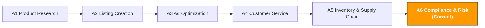

[🇨🇳 中文](../../../paths/a-operators/a6-compliance.md) | 🇺🇸 English (current)

# A6. Compliance & Risk Management

> **Path**: Path A: Operators · **Module**: A6
> **Last Updated**: 2026-03-12
> **Difficulty**: Intermediate
> **Estimated Time**: 30 minutes per day, 12 weeks
---

[Hub Home](../../README.md) · [Path A Overview](README.md)



---

## Module Navigation

1. [Compliance Methodology](#1-compliance-methodology-the-fundamentals-before-ai) · 2. [AI Tool Landscape](#2-ai-tool-landscape-what-to-use-at-each-stage) · 3. [Prompt Library](#3-prompt-library-compliance-specific) · 4. [Compliance Workflows](#4-compliance-workflows-in-practice) · 5. [Common Pitfalls](#5-common-compliance-pitfalls) · 6. [Advanced Techniques](#6-advanced-techniques) · 7. [Learning Resources](#7-learning-resources) · 8. [ OpenClaw Automation](#8-automate-compliance-checks-with-openclaw) · 9. [Completion Checklist](#9-completion-checklist)


> **Important Disclaimer**
> This module is for general reference only and **does not constitute legal, tax, or compliance advice**. Regulations change frequently and AI outputs may not reflect the latest updates. Always consult qualified legal counsel, certification bodies, or tax advisors before making compliance decisions. Any decisions made based on this module's content are at the user's own risk.

---

## What You'll Learn in This Module

Use AI tools to transform compliance research from "reading regulations line by line" into "structured comparative analysis." From product certifications to intellectual property, build a reusable AI-assisted compliance management workflow.

After completing this module, you'll be able to:
- Use ChatGPT/Claude to quickly generate multi-market compliance comparison tables finish in 30 minutes what used to take 23 days
- Use AI to generate product certification requirement checklists, clarifying the certification types, cost ranges, and timelines for each market
- Use AI for intellectual property risk assessment (patents/trademarks/copyrights), identifying potential IP risks at the product selection stage
- Use AI to generate compliance document frameworks (Declaration of Conformity, Technical File), lowering the barrier to document preparation
- Use AI to respond to Amazon policy violation notices, quickly generating appeal strategies and Plans of Action
- Use AI for VAT/tax compliance checks, understanding tax obligations and filing requirements across different markets

---

## 1. Compliance Methodology: The Fundamentals Before AI

### 1.1 First Principles of Cross-Border E-Commerce Compliance

Compliance isn't a cost it's your **market entry ticket**.

Many sellers see compliance as an "extra burden," but in reality:
- **Without CE marking, your product cannot be sold in the EU** this isn't a "recommendation," it's a legal requirement
- **Without FCC certification, electronic products cannot be legally sold in the US** customs can seize your goods
- **Without PSE marking, electrical products cannot be listed in Japan** Amazon JP will take down your listing
- **Without UKCA marking, products cannot be sold in the UK** post-Brexit, the UK no longer accepts CE marking (the transition period has ended)

```
ROI of compliance investment = Losses avoided / Compliance cost

Losses avoided include:
- Sales lost from listing takedowns (potentially tens to hundreds of thousands of dollars)
- Cost of product recalls (returns + destruction + fines)
- Total loss from account suspension (all ASINs delisted + funds frozen)
- Legal damages and attorney fees
- Brand reputation damage (long-term impact)
```

> **Key Insight**: Compliance costs are typically 38% of product cost, but non-compliance losses can be 50100% of annual revenue. Compliance is an investment, not a cost.

### 1.2 Compliance Framework Comparison Across Major Markets

> **Related Reading**: [D13 European Marketplaces](../d-platforms/d13-europe-marketplaces-guide.md#5-european-compliance-requirements-detailed) European compliance requirements (CE/EPR/VAT/VerpackG/GPSR) covered in D13. · [D11 Coupang Korea](../d-platforms/d11-coupang-korea-ai-guide.md#d11-coupang-korea-e-commerce-ai-guide) Korean KC certification requirements covered in D11. · [E1 Instagram/Facebook AI Guide](../e-social-media/e1-instagram-facebook-ai-guide.md#e1-instagram-facebook-ai-operations-guide-meta-ecosystem-ai-playbook) Social platform advertising compliance covered in E1

Below is a compliance comparison across the four major cross-border e-commerce markets. This is a **high-level reference** specific requirements vary by product category.

> **Note**: The following information is based on general knowledge as of early 2026. Regulations may have been updated. Always refer to the latest regulations published by official authorities.

| Dimension | 🇺🇸 US | 🇪🇺 EU (DE as example) | 🇯🇵 JP | 🇬🇧 UK |
|-----------|---------|------------------------|---------|---------|
| **Product Safety Certification** | FCC (electronics), UL (safety), CPSIA (children's) | [CE marking](https://en.wikipedia.org/wiki/CE_marking) (mandatory), GS (voluntary but recommended) | PSE (electrical), S-Mark (safety), 技適マーク (wireless) | UKCA (post-Brexit replacement for CE) |
| **Packaging Regulations** | No unified federal requirement; varies by state | WEEE (e-waste), Packaging Act (VerpackG), Green Dot | 容器包装リサイクル法 | UK WEEE, Packaging Waste Regulations |
| **Labeling Requirements** | FTC labeling rules, country of origin marking | EU energy labels, CE marking, manufacturer info | 消費者保護法, 家庭用品品質表示法 | UKCA marking, UK importer info |
| **Chemical Substance Restrictions** | CPSIA (lead/phthalates), Prop 65 (California) | REACH (chemical registration), RoHS (hazardous substance restriction) | 化審法 (chemical substance review) | UK REACH (separate from EU REACH) |
| **Intellectual Property** | USPTO (Patent and Trademark Office) | EUIPO (EU Intellectual Property Office) | JPO (特許庁) | UKIPO (UK Intellectual Property Office) |
| **Taxation** | Sales Tax (varies by state) | VAT (19% in Germany; varies by country) | 消費税 (10%) | VAT (20%) |
| **Amazon-Specific Requirements** | Brand Registry, Transparency Program | EPR registration number, LUCID registration | 技適マーク upload | UK Responsible Person |

**Detailed Explanation by Dimension:**

**Product Safety Certification**

- **US FCC/UL**: FCC certification is mandatory for all electronic devices that emit radio frequency energy. UL certification isn't federally mandated, but Amazon US requires UL test reports for certain categories (e.g., chargers, batteries). CPSIA is mandatory for products intended for children under 12, including lead content testing and third-party lab certification.
- **EU CE/GS**: [CE marking](https://en.wikipedia.org/wiki/CE_marking) is mandatory for entering the EU market, covering safety, health, environmental protection, and other directives. GS marking (Geprüfte Sicherheit) is a voluntary safety certification from Germany, but it has high consumer recognition in the German market and is recommended.
- **JP PSE/S-Mark**: PSE marking is mandatory under Japan's Electrical Appliance and Material Safety Act, divided into diamond PSE (specified electrical products) and circle PSE (non-specified electrical products). S-Mark is Japan's safety mark issued by third-party certification bodies.
- **UK UKCA**: After Brexit, the UKCA (UK Conformity Assessed) marking replaced CE marking. Some categories still accept CE marking, but long-term UKCA will become the sole requirement. Check the latest UK government announcements.

**Packaging Regulations**

- **US**: No unified federal packaging regulations, but states like California and New York have their own packaging recycling requirements. In practice, most sellers don't need additional registration.
- **EU VerpackG/WEEE**: Germany's Packaging Act (VerpackG) requires all companies selling packaged products in Germany to register in the [LUCID](https://lucid.verpackungsregister.org/) system and contract with an authorized dual-system recycling provider. The WEEE Directive requires electronic product manufacturers to register and assume recycling responsibility. **This is a compliance requirement many Chinese sellers overlook.**
- **JP**: The Containers and Packaging Recycling Act requires companies to assume recycling obligations for packaging materials, but small-scale importers may be exempt.
- **UK**: Post-Brexit, the UK has independent Packaging Waste Regulations and WEEE Regulations, similar to the EU but with different registration systems.

**Chemical Substance Restrictions**

- **US CPSIA/Prop 65**: CPSIA limits lead and phthalate content in children's products. California's Prop 65 requires warning labels on products containing chemicals known to cause cancer or reproductive toxicity this requirement is extremely broad and can apply to virtually any product category.
- **EU REACH/RoHS**: REACH requires registration, evaluation, and authorization of chemical substances. The RoHS Directive restricts hazardous substances (lead, mercury, cadmium, etc.) in electrical and electronic equipment. Both are mandatory.
- **JP 化審法**: Japan's Chemical Substances Control Act has strict review and registration requirements for new chemical substances.

Content rephrased for compliance with licensing restrictions. Sources: [CE marking - Wikipedia](https://en.wikipedia.org/wiki/CE_marking), [legalclarity.org trading compliance](https://legalclarity.org/when-trading-with-more-developed-countries-key-compliance-rules/)

### 1.3 The Role of AI in Compliance

What AI is good at:
- **Quick research**: Generate multi-market compliance comparison tables in minutes, replacing days of manual research
- **Comparative analysis**: Compare compliance requirements across markets within a unified framework, spotting differences and commonalities
- **Document generation**: Generate compliance document frameworks and templates (e.g., Declaration of Conformity, Technical File outlines)
- **Risk identification**: Identify potential compliance risk areas based on product descriptions, flagging areas that need attention
- **Multilingual processing**: Understand Japanese, German, and other regulatory texts, helping with cross-language compliance research

What AI is not good at:
- **Legal judgment**: AI cannot replace lawyers for legal determinations. Final answers on compliance issues require professional legal opinions
- **Tracking the latest regulations**: AI training data has a cutoff date and may not include the latest regulatory changes. Check official sources for critical regulations
- **Executing certifications**: AI can tell you what certifications you need, but it can't complete certification testing and applications for you
- **Case-specific judgment**: Every product's compliance situation has unique aspects. AI provides general guidance, not legal advice specific to your product
- **Assuming liability**: AI's suggestions do not constitute legal advice. If you make incorrect decisions based on AI suggestions, AI bears no responsibility

> **Core Principle**: Use AI as the "first step" in compliance research (quickly understanding the big picture), but consult professionals for critical decisions. AI is your compliance research assistant, not your compliance advisor.

> **Reminder**: All content in this module is general reference information. For your specific product and target market, always consult certification bodies (e.g., SGS, TÜV, Intertek) or professional lawyers.

---

## 2. AI Tool Landscape: What to Use at Each Stage

### 2.1 Paid Tools and Services

| Tool/Service | Type | Price Range | Core Capability | Best For |
|--------------|------|-------------|-----------------|----------|
| [SGS](https://www.sgs.com/) | Certification body | Project-based pricing | World-leading testing and certification body, covering CE, FCC, UL, and all major certifications | All sellers needing product certification |
| [TÜV](https://www.tuv.com/) | Certification body | Project-based pricing | Authoritative German certification body, primary issuer of GS marking, extremely high recognition in European markets | Sellers focused on European markets |
| [Intertek](https://www.intertek.com/) | Certification body | Project-based pricing | Global testing and certification body, issuer of ETL marking (alternative to UL) | Sellers needing multi-market certification |
| [Compliance Gate](https://www.compliancegate.com/) | SaaS platform | $99499/month | Product compliance management platform, auto-tracks regulatory changes, manages certification documents | Mid-to-large sellers with many SKUs across multiple markets |
| [Ashton Potter](https://www.ashtonpotter.com/) | Anti-counterfeiting & traceability | Project-based pricing | Product authentication and anti-counterfeiting solutions, integrates with Amazon Transparency | Brand sellers in categories requiring anti-counterfeiting |

**Selection Advice:**

**Limited budget**: Contact SGS or Intertek's China offices directly they have labs in Shenzhen and Shanghai, and prices are lower than their European/US headquarters. Use AI first to determine which certifications you need, then get quotes from certification bodies.

**Multi-market operations**: Consider SaaS platforms like Compliance Gate, which can track regulatory changes across markets and manage all your product certification documents. When you have 20+ SKUs across 3+ markets, manually managing compliance documents becomes extremely difficult.

**European market priority**: TÜV's GS marking has high consumer recognition in Germany. While GS isn't mandatory, products with GS marking typically see higher conversion rates in the German market.

### 2.2 Free Tools and Resources

| Tool/Resource | Purpose | Link |
|---------------|---------|------|
| ChatGPT / Claude | Compliance research, comparative analysis, document generation, appeal drafting | [chat.openai.com](https://chat.openai.com/) / [claude.ai](https://claude.ai/) |
| Amazon Compliance Reference | Amazon's official compliance requirement docs, listed by category | Seller Central → Help → Product Compliance |
| EU RAPEX / Safety Gate | EU rapid alert system for dangerous products see recalled products and reasons | [ec.europa.eu/safety-gate](https://ec.europa.eu/safety-gate-alerts/screen/webReport) |
| CPSC Recalls Database | US Consumer Product Safety Commission recall database learn which products have been recalled | [cpsc.gov/Recalls](https://www.cpsc.gov/Recalls) |
| Google Patents | Patent search for assessing patent infringement risk | [patents.google.com](https://patents.google.com/) |
| USPTO TESS | US trademark search system check if a trademark is already registered | [tmsearch.uspto.gov](https://tmsearch.uspto.gov/) |
| EUIPO eSearch | EU trademark and design search | [euipo.europa.eu/eSearch](https://euipo.europa.eu/eSearch/) |
| LUCID Packaging Registration | German Packaging Act registration system query and register packaging obligations | [lucid.verpackungsregister.org](https://lucid.verpackungsregister.org/) |

**Strategy for Using Free Tools:**

1. **ChatGPT/Claude for initial research**: Use AI to understand what certifications your product needs in target markets and generate a compliance requirements checklist. This is the "first step," not the "last step."
2. **RAPEX/CPSC for risk assessment**: Search your product category in these databases for recall records. If similar products are frequently recalled, the compliance risk for that category is high and needs special attention.
3. **Google Patents for patent screening**: Search for relevant patents during the product selection stage to avoid investing heavily only to discover infringement later.
4. **USPTO TESS/EUIPO for trademark checks**: Before finalizing your brand name and product name, search to see if they're already registered.

### 2.3 Limitations of AI-Assisted Compliance

While AI is very useful in compliance research, you must understand its limitations:

| AI Can Do | AI Cannot Do |
|-----------|-------------|
| Generate compliance requirement overviews | Provide legally binding compliance opinions |
| Compare regulatory differences across markets | Guarantee information is up to date |
| Generate document templates and frameworks | Replace certification body testing and certification |
| Identify potential compliance risk areas | Make compliance determinations for specific products |
| Draft initial appeal plans | Guarantee an appeal will succeed |
| Translate and understand multilingual regulations | Replace professional lawyers' legal interpretation |

> **Key Reminder**: Never make compliance decisions based solely on AI output. AI is a tool to help you "ask the right questions" the answers need to come from official sources and professionals.


---

## 3. Prompt Library (Compliance-Specific)

> Complete standardized templates (with verification status, contributor info, and sharing links) are stored in [prompts/compliance.md](../../prompts/compliance.md).
> This section provides in-depth analysis, common mistakes, and advanced variants for each template.

### 3.1 Multi-Market Compliance Comparison (Deep Dive)

**Why this Prompt works:** It asks AI to compare compliance requirements across multiple markets using a unified set of dimensions, outputting a structured comparison table. Key design points:
- "Comparison table" format forces AI to produce structured output instead of long paragraphs
- "Estimated costs and timelines" turns compliance from a "should I do it?" question into a quantified decision of "how much and how long?"
- "Common pitfalls" has AI provide warnings based on frequent mistakes
- "Information currency annotation" reminds both AI and user that regulations may have been updated

**Common Mistakes:**
- Just saying "electronics" → Too vague. A "Bluetooth earbuds with lithium battery" and a "USB charging cable" have completely different compliance requirements. Be as specific as possible
- Not specifying target markets → Requirements vary dramatically by market. You must specify US, EU, JP, or UK
- Fully relying on AI output → AI compliance information may be outdated or incomplete. Always cross-verify with official sources
- Ignoring Amazon platform-specific requirements → Amazon's compliance requirements are sometimes stricter than regulations (e.g., additional requirements for lithium batteries)

[Full template → prompts/compliance.md](../../prompts/compliance.md#模板-1-多市场合规对比)

**Advanced Variants:**

**Variant A Category-Specific Deep Compliance Analysis:**

```
我要在 Amazon [US/DE/JP/UK] 销售以下产品：
产品：[具体产品描述，如"带锂电池的便携式颈部风扇"]
材质：[主要材质，如"ABS 塑料 + 硅胶 + 锂聚合物电池"]
目标用户：[成人/儿童/通用]
价格区间：$[X]-$[X]

请做深度合规分析：
1. 每个市场的强制认证清单（区分"必须有"和"建议有"）
2. 锂电池相关的特殊要求（UN38.3、MSDS、运输限制）
3. 材质相关的化学物质限制（REACH、CPSIA、Prop 65）
4. 包装和标签的具体要求（需要标注什么信息？用什么语言？）
5. Amazon 平台的额外要求（需要上传什么文件？）
6. 合规成本估算（认证费 + 测试费 + 标签费）
7. 合规时间线（从开始到拿到所有认证需要多久？）

注意：请标注信息的时效性。法规可能已更新，以上信息仅供参考，
最终请以认证机构和官方法规为准。
```

> **Why use this variant**: A general compliance comparison only gives you the big picture. Once you've identified a specific product, you need a deep analysis that turns each compliance requirement into concrete action items and costs.

**Variant B Expanding to New Markets with Existing Certifications:**

```
我的产品已经有以下认证：
- FCC Part 15 Class B（美国）
- UL 62368-1 测试报告
- UN38.3 锂电池测试报告

现在我想把产品扩展到 [EU/JP/UK] 市场。

请分析：
1. 已有的认证中，哪些可以直接用于新市场？
2. 哪些认证需要重新做？（不能互认的部分）
3. 哪些认证可以基于已有报告做转换？（如 FCC → CE 的 EMC 部分）
4. 新市场还需要哪些额外认证？
5. 增量合规成本和时间估算
6. 建议的认证顺序（先做哪个性价比最高？）

认证互认规则可能变化，请与认证机构确认最新政策。
```

> **Why use this variant**: If you already have some certifications, expanding to new markets doesn't mean starting from scratch. Some test reports can be reused, and some certifications can be converted saving significant time and money.

---

### 3.2 Product Certification Requirements Checklist

**Why you need this Prompt:** Understand compliance costs at the product selection stage to avoid investing heavily only to discover certification fees exceed your budget. This Prompt helps you generate a complete certification requirements checklist including costs, timelines, and priorities.

**Common Mistakes:**
- Not considering compliance costs during product selection → Certification fees for some categories can be 2030% of product cost (e.g., medical devices, children's products)
- Only looking at certification fees, ignoring ongoing compliance costs → Some certifications require annual audits and periodic testing
- Not distinguishing mandatory from voluntary certifications → Mandatory certifications must be done; voluntary ones depend on your market strategy

```
请为以下产品生成完整的认证需求清单：

产品信息：
- 产品名称：[名称]
- 产品描述：[详细描述，包括功能、材质、电气参数]
- 目标市场：[US / EU / JP / UK，可多选]
- 目标品类：Amazon [品类名称]
- 是否含电池：[是/否，如是请说明电池类型和容量]
- 目标用户年龄：[成人/儿童/通用]
- 是否接触食品/皮肤：[是/否]

请输出：
1. 认证需求清单表格：
| 认证名称 | 市场 | 强制/自愿 | 费用范围 | 周期 | 有效期 | 优先级 |

2. 认证依赖关系（哪些认证需要先做？）
3. 总合规成本估算（首次 + 年度维护）
4. 建议的认证执行顺序和时间线
5. 可能的合规风险点

费用和周期为估算值，实际以认证机构报价为准。
不同实验室的报价可能差异较大，建议至少询价 2-3 家。
```

---

### 3.3 Compliance Cost Estimation

**Why you need this Prompt:** Compliance costs aren't just certification fees. They also include testing fees, label printing, packaging adjustments, document translation, annual maintenance fees, and more. This Prompt helps you do a comprehensive compliance cost estimate to factor into your product pricing model.

**Common Mistakes:**
- Only calculating certification fees → Testing fees are often higher than certification fees (e.g., EMC testing, safety testing)
- Ignoring labeling costs for different markets → Europe requires multilingual labels, Japan requires Japanese labels labels may differ for each market
- Not accounting for time costs → Certification timelines can be 412 weeks, during which your product can't be listed for sale

```
请帮我估算以下产品的全面合规成本：

产品信息：
- 产品：[名称和描述]
- 目标市场：[US / EU / JP / UK]
- 预计年销量：[X] 件
- 产品单价：$[X]
- 已有认证：[列出已有的认证，如无则写"无"]

请估算以下成本项：
1. 首次认证成本：
- 各项认证的测试费和认证费
- 样品费（送检样品）
- 文档准备费（技术文件、Declaration of Conformity）

2. 标签和包装调整成本：
- 各市场的标签设计和印刷费
- 包装调整费（如需要添加回收标志、警告标签）
- 多语言说明书翻译费

3. 持续合规成本（年度）：
- 年度审核费（如适用）
- 定期测试费
- 法规更新追踪成本
- 包装法注册费（如 LUCID）

4. 合规成本占比分析：
- 合规成本占产品成本的百分比
- 合规成本占售价的百分比
- 是否影响产品的定价竞争力？

5. 成本优化建议：
- 哪些认证可以合并测试以节省费用？
- 是否有政府补贴或行业协会优惠？
- 选择哪家认证机构性价比最高？

以上为估算值，实际费用请以认证机构报价为准。
```

---

### 3.4 Intellectual Property Risk Assessment

**Why you need this Prompt:** Intellectual property (IP) infringement is one of the most common compliance risks in cross-border e-commerce. A single patent infringement complaint can lead to listing takedowns, frozen inventory, and even lawsuits. Conducting an IP risk assessment during the product selection stage can prevent massive losses.

**Common Mistakes:**
- Only searching product names → Patent infringement isn't about names it's about functionality and appearance. Search for functional descriptions and technical features
- Only checking US patents → If you're also selling in Europe and Japan, you need to check patents in each market
- Thinking "everyone's selling it so it's fine" → The patent holder may not have started enforcement yet that doesn't mean there's no risk
- Ignoring design patents → Many products have design patent protection; copying the appearance is also infringement

```
请帮我评估以下产品的知识产权风险：

产品信息：
- 产品名称：[名称]
- 产品描述：[详细描述，包括外观特征、核心功能、技术特点]
- 目标市场：[US / EU / JP]
- 竞品 ASIN（如有）：[ASIN 列表]
- 计划使用的品牌名：[品牌名]

请评估以下风险：
1. 专利风险：
- 这个产品的核心功能可能涉及哪些类型的专利？（发明专利、实用新型、外观设计）
- 建议搜索哪些关键词来排查专利？
- 如何在 Google Patents 上做初步排查？
- 风险等级评估（高/中/低）

2. 商标风险：
- 计划使用的品牌名是否可能与已注册商标冲突？
- 建议在哪些数据库搜索？（USPTO TESS、EUIPO、JPO）
- 品牌名的命名建议（避免与知名品牌相似）

3. 版权风险：
- 产品包装、说明书、Listing 图片是否可能涉及版权问题？
- 使用竞品图片做参考的法律风险

4. Amazon 平台 IP 投诉风险：
- 这个品类是否有频繁的 IP 投诉历史？
- 如何降低被投诉的风险？
- 如果被投诉，应对流程是什么？

5. 风险缓解建议：
- 是否需要做专业的专利检索（FTO 分析）？
- 是否需要注册自己的专利/商标？
- 产品设计上如何规避已有专利？

AI 的专利分析仅供初步参考，不能替代专业的专利律师意见。
如果风险等级为"高"，强烈建议聘请专利律师做正式的 FTO（Freedom to Operate）分析。
```


---

### 3.5 Compliance Document Generation

**Why you need this Prompt:** Compliance documents (such as Declaration of Conformity, Technical File) are the core evidence of product compliance. Many sellers don't know what these documents should contain. AI can help you generate document frameworks, which you then fill in with your specific product information and test data.

**Common Mistakes:**
- Listing without compliance documents → Even if your product passed certification testing, not having formal compliance documents is still non-compliant
- Using templates without customization → Every product's compliance documents should be tailored you can't use a generic template as-is
- Wrong document language → EU compliance documents need to be in the target market's official language (or at least English)

```
请帮我生成以下合规文档的框架：

产品信息：
- 产品名称：[名称]
- 产品型号：[型号]
- 制造商：[公司名称和地址]
- 目标市场：[EU / UK]

需要生成的文档：
1. EU Declaration of Conformity（欧盟符合性声明）框架：
- 需要引用哪些指令？（如 LVD、EMC、RoHS、RED）
- 需要引用哪些协调标准？
- 需要包含哪些信息？
- 签署人要求

2. Technical File（技术文件）大纲：
- 技术文件应该包含哪些章节？
- 每个章节需要什么内容？
- 需要附上哪些测试报告？
- 文件保存要求（保存多少年？）

3. 产品标签内容清单：
- CE 标志的尺寸和位置要求
- 需要标注的信息（制造商、进口商、型号等）
- 警告标签要求（如适用）

以上框架仅供参考，正式的合规文档应由合规专业人士审核。
Declaration of Conformity 是法律文件，签署人需要对内容的准确性负法律责任。
```

---

### 3.6 Responding to Amazon Policy Violations

**Why you need this Prompt:** Amazon policy violation notices (listing takedowns, account warnings) require a fast response. AI can help you analyze the violation reason, generate a Plan of Action (POA) draft, and accelerate the appeal process.

**Common Mistakes:**
- Not responding promptly → Amazon typically gives 4872 hours to respond; missing the deadline can lead to more severe penalties
- Writing vague appeals → "We will improve" isn't enough you need specific root cause analysis and corrective actions
- Not acknowledging the problem → Amazon wants to see that you understand the issue; denying it only makes things worse
- Submitting the same appeal multiple times → Each appeal should contain new information or improvements; repeated submissions reduce your success rate

```
我收到了 Amazon 的以下政策违规通知，请帮我分析并生成申诉方案：

违规通知内容：
[粘贴 Amazon 发送的违规通知全文]

产品信息：
- ASIN：[ASIN]
- 产品名称：[名称]
- 品类：[品类]
- 销售市场：[US/DE/JP]

补充信息：
- 这个问题是第几次发生？[首次/重复]
- 你认为可能的原因是什么？[你的分析]
- 你已经采取了哪些措施？[已有的改进]

请帮我：
1. 违规原因分析：
- 这个违规通知的具体含义是什么？
- 可能触发违规的根本原因有哪些？
- 这个违规的严重程度如何？（警告/Listing 下架/账号风险）

2. Plan of Action（POA）框架：
- Root Cause（根本原因）：具体说明问题是怎么发生的
- Immediate Actions（已采取的措施）：你已经做了什么来解决问题
- Preventive Measures（预防措施）：你将如何防止问题再次发生
- 附件清单：需要提供哪些证据文件？

3. 申诉信初稿（英文）：
- 专业、简洁、有诚意
- 包含具体的数据和证据
- 明确的时间线和责任人

4. 后续跟进建议：
- 如果首次申诉被拒，下一步怎么做？
- 是否需要寻求专业申诉服务？
- 如何监控账号健康状态？

AI 生成的申诉方案仅供参考。复杂的违规案例（如账号被封、IP 侵权投诉）
建议寻求专业的 Amazon 申诉服务或律师协助。
```


---

### 3.7 VAT/Tax Compliance Check

**Why you need this Prompt:** Tax compliance is the most easily overlooked yet most consequential compliance area in cross-border e-commerce. European VAT compliance is especially complex different countries have different rates, registration requirements, and filing frequencies. Non-compliance can result in hefty fines and back taxes.

**Common Mistakes:**
- Thinking "Amazon withholds and remits, so I don't need to worry" → Amazon only withholds VAT in some countries; sellers still have registration and filing obligations
- Starting to sell without VAT registration → In Europe, selling without a VAT number is illegal
- Only registering VAT in one country → If you have inventory in multiple European countries (e.g., Pan-EU), you need to register in every country where you hold stock
- Not filing on time → Even with zero sales, you still need to submit a nil return on schedule

```
请帮我做 VAT/税务合规检查：

业务信息：
- 公司注册地：[中国/其他]
- 销售市场：[US / DE / FR / IT / ES / UK / JP]
- 物流模式：[FBA / FBM / Pan-EU / EFN]
- 月均销售额（各市场）：[数据]
- 是否已注册 VAT：[是/否，如是请列出已注册的国家]
- 是否使用 Amazon VAT Services：[是/否]

请分析：
1. 各市场的税务义务：
| 市场 | 税种 | 税率 | 是否需要注册 | 申报频率 | Amazon 是否代扣 |

2. VAT 注册需求：
- 哪些国家必须注册 VAT？
- 注册流程和所需文件
- 注册费用和时间

3. 税务合规风险评估：
- 当前是否存在合规缺口？
- 不合规的潜在后果（罚款金额、账号风险）
- 是否需要补缴历史税款？

4. 税务优化建议：
- 物流模式对税务的影响（Pan-EU vs EFN）
- 是否可以利用 OSS（One-Stop Shop）简化申报？
- 是否需要聘请税务代理？

税务法规复杂且经常变化。以上分析仅供参考，
具体的税务义务请咨询专业的跨境电商税务师或会计师。
```

---

### 3.8 Product Recall Risk Assessment

**Why you need this Prompt:** A product recall is one of the most severe compliance events. A single recall can result in hundreds of thousands of dollars in losses (returns, destruction, fines, legal fees) and irreversible brand damage. Assessing recall risk in advance lets you take preventive measures during product design and quality control.

**Common Mistakes:**
- Thinking "my product won't be recalled" → Any product can face recall risk, especially electronics, children's products, and food-contact products
- Not monitoring recall history for similar products → Recall cases in the CPSC and RAPEX databases are the best early warning signals
- Not getting product liability insurance → If a safety incident occurs, sellers without insurance may face enormous compensation claims

```
请帮我评估以下产品的召回风险：

产品信息：
- 产品名称：[名称]
- 产品描述：[详细描述]
- 主要材质：[材质列表]
- 是否含电池/电气部件：[是/否]
- 目标用户：[成人/儿童/通用]
- 销售市场：[US / EU / JP]

请分析：
1. 品类召回历史：
- 这个品类在 CPSC（美国）和 RAPEX（欧盟）中的召回记录
- 最常见的召回原因是什么？
- 召回频率如何？（高风险/中风险/低风险品类）

2. 产品风险点识别：
- 基于产品描述，可能存在哪些安全风险？
- 哪些材质或部件最容易出问题？
- 是否有窒息、触电、起火、化学物质超标等风险？

3. 预防措施建议：
- 产品设计阶段应该注意什么？
- 质量控制（QC）的关键检查点
- 需要做哪些安全测试？
- 是否需要购买产品责任保险？

4. 召回应急预案：
- 如果发生安全事故，第一步做什么？
- 如何与 Amazon 和监管机构沟通？
- 召回的流程和成本估算

产品安全是最高优先级。如果 AI 识别出高风险点，
请立即咨询专业的产品安全顾问或认证机构。
```


---

## 4. Compliance Workflows in Practice

### 4.1 Pre-Launch Compliance Check SOP

Every new product should go through a systematic compliance check before listing. This SOP transforms compliance checks from "checking whatever comes to mind" into "confirming each item on a checklist."

```

Step 1: Compliance Requirements Identification (12 hours)
Action: Determine product category and target markets
AI: Use Multi-Market Comparison Prompt (3.1) for overview
AI: Use Certification Checklist Prompt (3.2) for list
Output: Compliance requirements list
(certifications + labels + packaging + chemicals)
Verify: Confirm category-specific requirements in
Amazon Seller Central

Step 2: Intellectual Property Screening (12 hours)
Action: Search relevant patents and trademarks
Tools: Google Patents + USPTO TESS + EUIPO eSearch
AI: Use IP Risk Assessment Prompt (3.4) for evaluation
Output: IP risk assessment report
Decision: If risk is "High," pause the project and
consult a patent attorney

Step 3: Compliance Cost Estimation (30 minutes)
AI: Use Cost Estimation Prompt (3.3) for full cost calc
Action: Get quotes from 23 certification bodies to
verify AI estimates
Decision: Is compliance cost within budget? Does it
affect pricing competitiveness?
Output: Compliance budget and timeline

Step 4: Certification Execution (412 weeks, varies)
Action: Select certification body, submit samples,
begin testing
Track: Create certification progress tracker
Docs: Prepare Technical File and compliance declarations
AI: Use Document Generation Prompt (3.5) for frameworks

Step 5: Label and Packaging Preparation (12 weeks)
Action: Design product labels meeting each market's
requirements
Check: CE/UKCA/PSE marking size and placement
Check: Multilingual label content (product info,
warnings, recycling symbols)
Check: Packaging registration (e.g., LUCID)

Step 6: Final Pre-Launch Check (30 minutes)
Checklist:
All required certifications obtained?
Certification documents uploaded to Seller Central?
Product labels meet target market requirements?
Packaging registration completed (if applicable)?
VAT registered (if applicable)?
Product liability insurance purchased (if applicable)?
Compliance documents archived?
Pass → List for sale
Fail → Return to the relevant step to complete

```

### 4.2 Multi-Market Compliance Expansion SOP

When your product is already selling successfully in one market and you want to expand to others, compliance is the biggest hurdle. This SOP helps you systematically evaluate and execute multi-market compliance expansion.

```

Step 1: Target Market Compliance Gap Analysis (12 hrs)
Action: Compare compliance requirements between current
and target markets
AI: Use Existing Certification Expansion Prompt
(3.1 Variant B) for analysis
Output: Incremental compliance requirements list
(new certifications, labels, registrations)
Key Q: Which existing certs can be reused?
Which need to be redone?

Step 2: Compliance Cost and ROI Assessment (1 hour)
Action: Estimate incremental compliance costs
AI: Use Cost Estimation Prompt (3.3) for calculation
Compare: Compliance cost vs. expected revenue in target
market
Decision: Is the compliance ROI reasonable?
If ROI < 1 → Delay expansion, optimize existing market

Step 3: Tax Compliance Preparation (12 weeks)
Action: Register VAT/tax ID in target market
AI: Use VAT Compliance Prompt (3.7) to confirm
tax obligations
Note: European VAT registration typically takes 26 wks
Note: Do not start selling before VAT registration
is complete

Step 4: Certification and Label Adjustments (48 weeks)
Action: Complete additional certifications for target mkt
Action: Adjust product labels (add CE/UKCA/PSE marking,
multilingual labels)
Action: Register packaging (e.g., LUCID)
Action: Designate Responsible Person (if EU/UK requires)

Step 5: Listing Compliance Adaptation (1 week)
Action: Ensure listing content complies with target
market advertising regulations
Check: Product claims are compliant (no unverified
efficacy claims)
Check: Images meet local requirements
Action: Upload compliance documents to Seller Central

Step 6: Launch and Monitor
Action: List product in target market
Monitor: Watch for compliance-related notices or warnings
Record: Establish compliance document archiving system
Recurring: Check for regulatory updates quarterly

```

### 4.3 Compliance Incident Emergency Response SOP

When you receive a compliance notice from Amazon (listing takedown, account warning, IP complaint), a fast response is critical. This SOP helps you complete an initial response within 24 hours.

```

Hour 02: Assessment and Classification
Action: Carefully read the notice, determine violation
type
Classification:
- Product safety/certification issue → High priority
- IP infringement complaint → High priority
- Listing content violation → Medium priority
- Missing documentation → Medium priority
- Customer complaint triggered → Depends on severity
AI: Use Amazon Violation Response Prompt (3.6) to
analyze the violation reason

Hour 28: Evidence Collection and Plan Development
Action: Gather all relevant evidence
- Product certification documents, test reports
- Supplier qualification documents
- Quality control records
- Customer communication records (if complaint-related)
AI: Use Prompt (3.6) to generate Plan of Action draft
Review: Manually review AI-generated plan, add specifics

Hour 816: Appeal Submission
Action: Finalize Plan of Action
Action: Prepare all attachments (certification docs,
evidence of corrective actions)
Action: Submit appeal through Seller Central
Note: Appeal letter should be professional, concise,
and sincere
Note: Don't deny the problem show you understand it
and have taken action

Hour 1624: Contingency Preparation
Action: Prepare backup plan (if first appeal is rejected)
Action: Evaluate whether professional appeal services
or lawyers are needed
Action: Check if other ASINs have similar risks
Action: Update compliance checklist to prevent recurrence

Day 27: Follow-Up
Monitor: Check case status in Seller Central daily
If rejected: Analyze rejection reason, add new evidence,
resubmit
If approved: Document lessons learned, update compliance
SOP
Escalate: If 3 appeals are rejected, consider
professional help

```

> **Core principle of emergency response**: Speed > Perfection. Submitting a reasonable initial appeal within 24 hours is more important than spending a week preparing a "perfect" one. Amazon values your response speed and attitude.


---

## 5. Common Compliance Pitfalls

### 5.1 Certification Pitfalls

| Pitfall | Symptom | How to Avoid |
|---------|---------|--------------|
| **CE marking ≠ universal pass** | Assuming CE marking alone lets you sell in all European countries, ignoring additional national requirements (e.g., Germany's VerpackG, France's DEEE) | CE is the baseline, but each country may have additional registration requirements. Use AI to check country by country. |
| **Letting certifications expire** | Certifications have expiration dates (typically 15 years); continuing to sell after expiration is a violation | Set up certification expiry reminders and start the renewal process 3 months in advance. |
| **Using fake or purchased certificates** | Buying certificates from illegitimate sources consequences are severe if caught (product recall + legal liability) | Only obtain certifications through legitimate bodies (SGS, TÜV, Intertek, etc.). |
| **Certification scope mismatch** | Product was redesigned but certification wasn't updated the new version's certification is effectively invalid | Any design change requires an assessment of whether it affects certification validity. |
| **Incomplete certifications** | Product needs CE + RoHS + REACH, but only CE was done, assuming that's enough | Use the Certification Checklist Prompt (3.2) to ensure no required certifications are missed. |

### 5.2 Labeling Pitfalls

| Pitfall | Symptom | How to Avoid |
|---------|---------|--------------|
| **Wrong label language** | English labels in the German market, no Japanese labels in the Japanese market | Labels for each market must use the local official language. Selling across multiple European countries requires multilingual labels. |
| **Non-compliant CE marking size** | CE marking too small or wrong proportions (CE marking has strict size and proportion requirements) | CE marking minimum height is 5mm, and the proportions of both letters must follow the official template. See [CE marking guidelines](https://en.wikipedia.org/wiki/CE_marking). |
| **Missing manufacturer/importer info** | EU requires product labels to show the manufacturer's or EU authorized representative's name and address | Ensure labels include complete manufacturer information. Chinese sellers need to designate an EU Responsible Person. |
| **Missing Prop 65 warning** | Products sold in California without Prop 65 warning labels, resulting in lawsuits | If your product may contain chemicals on the Prop 65 list, add warning labels. Better to over-label than to miss one. |
| **Missing recycling symbols** | Product packaging sold in Germany without recycling symbols (Green Dot or similar) | After registering with LUCID, add recycling symbols to packaging as required. |

### 5.3 Intellectual Property Pitfalls

| Pitfall | Symptom | How to Avoid |
|---------|---------|--------------|
| **Design patent infringement** | Product appearance too similar to a competitor's, leading to design patent infringement complaints | Screen for design patents during the product design stage. Maintain sufficient design differentiation. |
| **Trademark squatting** | The brand name you're using is already registered by someone else in the target market | Search USPTO/EUIPO/JPO before finalizing your brand name. Register your own trademark as early as possible. |
| **Image copyright** | Listing uses unauthorized images (including competitor images, stock photos from the web) | All listing images must be self-shot or legally licensed. |
| **Malicious IP complaints** | Competitors file false IP complaints to get your listing taken down | Understand Amazon's IP complaint counter-appeal process. Keep all evidence of product originality. |
| **Patent trolls** | Receiving patent infringement warning letters from unknown sources demanding "licensing fees" | Don't pay immediately. First verify the patent's validity and consult a patent attorney to assess the risk. |

### 5.4 Tax Pitfalls

| Pitfall | Symptom | How to Avoid |
|---------|---------|--------------|
| **Selling without VAT registration** | Selling in Europe without a VAT number, resulting in back taxes + fines from tax authorities | Complete VAT registration before you start selling. Registration typically takes 26 weeks. |
| **Pan-EU without multi-country registration** | Using Pan-EU logistics but only registered for German VAT other countries with inventory aren't registered | Under Pan-EU, you need VAT registration in every country where you hold inventory. |
| **Late filing** | Forgetting to submit VAT returns on time, incurring late fees and penalties | Set up filing calendar reminders. Consider using Amazon VAT Services or a professional tax agent. |
| **Under-reporting revenue** | Under-reporting sales to pay less tax severe penalties when caught in a tax audit | Report honestly. Amazon reports your sales data to tax authorities, making under-reporting easy to detect. |
| **Ignoring US Sales Tax** | Assuming Amazon collects Sales Tax so you don't need to worry | Amazon collects Sales Tax in most states, but sellers still need to understand their Nexus obligations. |

### 5.5 Amazon Policy Pitfalls

| Pitfall | Symptom | How to Avoid |
|---------|---------|--------------|
| **Listing content violations** | Using prohibited terms (e.g., "FDA approved" without actual FDA approval) | Don't make unverified claims in listings. Understand Amazon's listing content policies. |
| **Review manipulation** | Manipulating reviews through fake orders, review swaps, etc. detected by Amazon | Don't engage in any form of review manipulation. Amazon's detection algorithms are increasingly sophisticated. |
| **Multi-account linking** | Operating multiple seller accounts in the same marketplace detected by Amazon | Use only one account per marketplace. If you genuinely need multiple accounts, ensure complete isolation. |
| **Ignoring BSA compliance** | Third-party tools or AI Agents you use don't comply with Amazon's Buyer-Seller Agreement requirements | Ensure all tools and AI Agents comply with Amazon's latest policy requirements. See [Amazon AI Agent compliance requirements](https://ppc.land/amazons-new-ai-agent-rules-shake-up-sellers-before-march-4-deadline/). |
| **Ignoring product safety complaints** | Receiving customer product safety complaints but not responding promptly, leading to listing takedowns | All safety-related complaints must be responded to within 24 hours. Establish a safety complaint handling process. |


---

## 6. Advanced Techniques

### 6.1 2026 Trend: Amazon AI Agent Compliance Requirements (BSA Update)

In early 2026, Amazon updated its Buyer-Seller Agreement (BSA), introducing new compliance requirements for AI Agents and automation tools used by sellers. This is an important trend that all sellers using AI tools need to pay attention to.

**Core Requirements Overview:**

Amazon requires sellers to ensure that all third-party tools and AI Agents they use comply with the following principles:
- **Data security**: Tools must not access or store buyer data without authorization
- **Behavioral compliance**: AI Agent automated actions must not violate Amazon's Terms of Service
- **Transparency**: Sellers need to understand and be responsible for the behavior of the tools they use
- **Timely updates**: Sellers must ensure tool compliance within the specified deadline

**Impact on Sellers:**

1. **Audit all your tools**: List every third-party tool and AI Agent connected to Seller Central and confirm they meet Amazon's latest requirements
2. **Monitor tool providers' compliance statements**: Legitimate tool providers will publish compliance updates confirming their tools meet Amazon's new requirements
3. **Be cautious with automation**: AI Agent features like auto-pricing and auto-replies need to be verified as not violating Amazon policies
4. **Keep operation logs**: Record AI Agent operation logs in case of Amazon audits

Content rephrased for compliance with licensing restrictions. Sources: [ppc.land Amazon AI agent rules](https://ppc.land/amazons-new-ai-agent-rules-shake-up-sellers-before-march-4-deadline/), [ecommercebytes.com BSA compliance](https://www.ecommercebytes.com/2026/02/18/amazon-sellers-have-2-weeks-to-ensure-compliance-of-tools-they-use/)

**AI-Assisted BSA Compliance Check:**

```
请帮我检查以下工具是否符合 Amazon 最新的 BSA 合规要求：

我使用的工具列表：
1. [工具名称] 用途：[描述]，连接方式：[API/插件/手动]
2. [工具名称] 用途：[描述]，连接方式：[API/插件/手动]
3. [工具名称] 用途：[描述]，连接方式：[API/插件/手动]

请分析：
1. 每个工具可能涉及的 BSA 合规风险
2. 需要向工具提供商确认的合规问题
3. 是否有工具需要停用或替换？
4. 如何建立工具合规审查的定期流程？

Amazon 的政策持续更新，请以 Seller Central 的最新通知为准。
```

### 6.2 New EU Regulations: Digital Product Passport & GPSR

The EU is advancing two important new regulations that will have a profound impact on cross-border e-commerce sellers:

**Digital Product Passport (DPP)**

DPP is part of the EU Green Deal, requiring products to carry a digital "passport" recording full lifecycle information (material sources, manufacturing processes, carbon footprint, recycling guidelines, etc.).

- **Timeline**: Expected to roll out by category between 20272030, with battery products affected first
- **Impact on sellers**: You'll need to collect and provide more detailed product supply chain information
- **Preparation advice**: Start building a product supply chain data collection system and communicate data sharing with suppliers

**GPSR (General Product Safety Regulation)**

GPSR took effect on December 13, 2024, replacing the former General Product Safety Directive (GPSD).

- **Key changes**:
- All consumer products sold in the EU must designate an EU-based Responsible Person (economic operator)
- Products must have traceability information (manufacturer, importer, product identifier)
- Online marketplaces (like Amazon) have greater compliance oversight responsibilities
- Strengthened requirements for product recalls and safety notifications

- **Impact on Chinese sellers**:
- You must designate an EU-based Responsible Person (can be an importer, authorized representative, or fulfillment service provider)
- Product labels must include the Responsible Person's contact information
- Amazon may require sellers to provide Responsible Person information before listing

**AI-Assisted New Regulation Impact Assessment:**

```
请帮我评估欧盟新法规对我的业务的影响：

业务信息：
- 产品品类：[品类]
- 欧盟销售市场：[DE/FR/IT/ES 等]
- 当前是否有欧盟 Responsible Person：[是/否]
- 年销售额（欧盟）：€[X]

请分析：
1. GPSR 对我的产品的具体要求是什么？
2. 我是否需要指定 Responsible Person？如何找到合适的？
3. 产品标签需要做哪些调整？
4. Digital Product Passport 未来会如何影响我的品类？
5. 建议的合规准备时间线和预算

欧盟法规实施细则可能仍在更新中，请关注欧盟官方公告和 Amazon 的合规通知。
```

### 6.3 Compliance Cost Optimization Strategies

Compliance is non-negotiable, but you can use strategic approaches to reduce costs:

**Strategy 1: Consolidate Certification Testing**

Many certifications have overlapping test items. For example:
- CE EMC testing and FCC EMC testing have significant overlap
- If you do CE and FCC simultaneously, you can ask the certification body to consolidate testing, saving 2030% on test fees

**Strategy 2: Choose Cost-Effective Certification Bodies**

- International bodies (SGS, TÜV, Intertek) charge more but have the widest recognition
- China-based CNAS-accredited labs offer lower prices, and their reports are accepted in many cases
- Recommendation: Use international bodies for initial certification (to build trust), then consider domestic labs for renewals or new products

**Strategy 3: Leverage Certification Mutual Recognition**

- Some certifications have mutual recognition agreements. For example, CB Scheme (IECEE CB Scheme) test reports can be converted to local certifications in multiple countries
- Getting a CB report first, then converting to national certifications, is cheaper than certifying in each country separately

**Strategy 4: Batch Certification**

- If you have multiple similar products (e.g., different models in the same series), you can apply for "series certification"
- Only the representative model needs full testing; other models only need differential testing

**Strategy 5: Front-Load Compliance to the Product Selection Stage**

- Evaluate compliance costs during product selection (using Prompt 3.3) to avoid choosing categories with excessive compliance costs
- Categories where compliance costs exceed 10% of product cost require careful evaluation of whether they're worth entering

```
请帮我优化以下产品的合规成本：

产品信息：
- 产品：[名称]
- 目标市场：[US + EU + JP]
- 当前合规预算：$[X]
- 已有认证：[列出]

请建议：
1. 哪些认证可以合并测试以节省费用？
2. 是否可以利用 CB 体系做认证转换？
3. 推荐的认证执行顺序（先做哪个可以复用最多？）
4. 认证机构选择建议（性价比最优方案）
5. 预计可以节省多少合规成本？
```


---

## 7. Learning Resources

### 7.1 Free Courses and Official Resources

| Resource | Platform | Duration | Best For | Link |
|----------|----------|----------|----------|------|
| Amazon Seller University Product Compliance | Amazon | Self-paced | All sellers (official compliance requirements by category) | [sellercentral.amazon.com/learn](https://sellercentral.amazon.com/learn) |
| EU Product Safety & CE Marking Guide | European Commission | Self-paced | Sellers focused on European markets (official CE marking guide) | [ec.europa.eu/growth](https://single-market-economy.ec.europa.eu/single-market/ce-marking_en) |
| CPSC Business Education | CPSC | Self-paced | Sellers focused on the US market (consumer product safety requirements) | [cpsc.gov/Business](https://www.cpsc.gov/Business--Manufacturing) |
| ChatGPT Prompt Engineering for Developers | DeepLearning.AI | 1.5h | Everyone (learning to write good prompts is the foundation of AI compliance research) | [deeplearning.ai](https://www.deeplearning.ai/short-courses/chatgpt-prompt-engineering-for-developers/) |
| VAT for E-Commerce Sellers | Various | Self-paced | Sellers selling in Europe (VAT registration and filing basics) | Search "VAT for Amazon sellers" |

### 7.2 Recommended YouTube Channels

| Channel | Content Focus | Why Recommended |
|---------|---------------|-----------------|
| Amazon Seller University | Official compliance tutorials, compliance requirements explained by category | The most authoritative source of compliance information |
| Jungle Scout | Includes compliance-related product selection advice and market analysis | Understand compliance costs from a product selection perspective |
| My Amazon Guy | Full Amazon operations workflow, including account health and appeal techniques | Highly practical with many real appeal case studies |
| Seller Sessions | In-depth interviews featuring compliance experts and lawyers | Professional perspective, great for deep learning |

### 7.3 Recommended Reading

| Article/Resource | Source | Key Takeaway |
|------------------|--------|--------------|
| [CE Marking Wikipedia](https://en.wikipedia.org/wiki/CE_marking) | Wikipedia | Comprehensive introduction to CE marking, including applicable directives, marking requirements, and compliance process |
| [Amazon's New AI Agent Rules](https://ppc.land/amazons-new-ai-agent-rules-shake-up-sellers-before-march-4-deadline/) | PPC Land | Amazon's 2026 BSA update on new compliance requirements for AI Agents and third-party tools |
| [Amazon Sellers BSA Compliance](https://www.ecommercebytes.com/2026/02/18/amazon-sellers-have-2-weeks-to-ensure-compliance-of-tools-they-use/) | eCommerce Bytes | Detailed guide on ensuring tool compliance before the deadline |
| [Key Compliance Rules for International Trade](https://legalclarity.org/when-trading-with-more-developed-countries-key-compliance-rules/) | Legal Clarity | Overview of key compliance rules when trading with developed countries |
| [CPSC Recalls Database](https://www.cpsc.gov/Recalls) | CPSC | US consumer product recall database essential for product safety risk assessment |
| [EU Safety Gate (RAPEX)](https://ec.europa.eu/safety-gate-alerts/screen/webReport) | European Commission | EU rapid alert system for dangerous products view notified dangerous products |

Content rephrased for compliance with licensing restrictions. Sources cited inline.

### 7.4 Communities and Forums

| Community | Platform | Highlights |
|-----------|----------|------------|
| r/AmazonSeller | Reddit | Comprehensive Amazon seller community with active compliance discussions |
| r/FulfillmentByAmazon | Reddit | FBA seller community with frequent product compliance and account health topics |
| Amazon Seller Forums | Amazon | Official forums first-hand information on compliance policy updates and appeal experiences |
| 知无不言 | Zhihu | Chinese cross-border e-commerce community with rich certification and compliance experience |
| 创蓝论坛 | Independent site | Chinese seller community with many practical cases on European VAT and CE certification |
| 福步外贸论坛 | Independent site | Comprehensive foreign trade community with rich product certification and export compliance information |


---

## 8. Automate Compliance Checks with OpenClaw

### 8.1 Scenario: AI Agent Auto Pre-Check for New Product Launches

```
你对 OpenClaw 说：
"新产品信息录入后，自动检索合规知识库，
对比产品信息和各市场合规要求，生成差距清单和认证费用估算，发送合规预检报告"

OpenClaw 自动执行：
1. [触发] 新产品信息录入时
2. [Skill: memory] 检索合规知识库（各市场认证要求）
3. [LLM] 对比产品信息和合规要求，生成差距清单
4. [LLM] 估算认证费用和周期
5. [Skill: slack] 发送合规预检报告
```

### 8.2 Required Skills and MCP Servers

| Component | Purpose | Link |
|-----------|---------|------|
| **memory** Skill | Store compliance knowledge base and certification requirements | [OpenClaw Docs](https://docs.openclaw.com/) |
| **web-search** Skill | Search for latest regulatory updates | [OpenClaw Docs](https://docs.openclaw.com/) |
| **slack** Skill | Send compliance pre-check reports | [ClawHub](https://clawhub.ai/) |
| **filesystem MCP** | Read local compliance documents and templates | [MCP Filesystem](https://github.com/modelcontextprotocol/servers/tree/main/src/filesystem) |

### 8.3 Related Resources

| Resource | Description | Link |
|----------|-------------|------|
| OpenClaw Official Docs | Installation and configuration guide | [docs.openclaw.com](https://docs.openclaw.com/) |
| ClawHub Skills Marketplace | Search and install Agent Skills | [clawhub.ai](https://clawhub.ai/) |
| OpenClaw MCP Integration | Connect MCP Servers | [Build Skill with MCP](https://rebeccamdeprey.com/blog/build-openclaw-skill-with-mcp) |
| F4 Automation & Agents | Agent fundamentals module | [F4 Module](../0-foundations/f4-agent-automation.md) |

Content rephrased for compliance with licensing restrictions. Sources cited inline.

---

## 8.5 Supplement: Cross-Platform Advertising Compliance Comparison

> This section supplements cross-platform advertising compliance requirements. When running social media ads that drive traffic to Amazon/Shopify, you need to comply with platform advertising policies simultaneously.

### Advertising Compliance by Platform

| Compliance Requirement | Amazon | Meta (IG/FB) | Google/YouTube | TikTok | Pinterest |
|------------------------|--------|-------------|----------------|--------|-----------|
| False advertising | Prohibited | Prohibited | Prohibited | Prohibited | Prohibited |
| Body feature descriptions | Allowed (product-related) | Prohibited ("your skin...") | Restricted | Restricted | Restricted |
| Before/After images | Allowed | Restricted (can't imply body changes) | Restricted | Restricted | Restricted |
| Health claims | Requires certification | Strictly restricted | Strictly restricted | Strictly restricted | Strictly restricted |
| Affiliate disclosure | N/A | Recommended | FTC required | Recommended | Recommended |
| Price display | Must be accurate | Must be accurate | Must be accurate | Must be accurate | Must be accurate |
| Competitor comparison | Allowed (must be truthful) | Allowed (must be truthful) | Allowed (must be truthful) | Allowed | Allowed |
| User review citations | Allowed | Must have authentic source | Must have authentic source | Must have authentic source | Must have authentic source |

### AI Advertising Compliance Check Prompt

```
你是一个跨平台广告合规专家。

以下是我准备投放的广告文案：
[粘贴文案]

投放平台：[Meta / Google / TikTok / Pinterest]
产品品类：[X]
目标市场：[US / EU / JP]

请检查：
1. 是否违反该平台的广告政策？（具体指出哪条）
2. 是否违反目标市场的广告法规？（FTC / EU 消费者保护 / 日本景品表示法）
3. 是否需要添加免责声明或披露？
4. 修改建议（保持营销效果的同时合规）
```

### Advertising Regulations by Market

| Market | Regulation | Key Requirements |
|--------|-----------|------------------|
| US | FTC Act | Affiliates must disclose; health claims need scientific evidence; "free" must be genuinely free |
| EU | UCPD + DSA | Misleading advertising prohibited; must label "ad"; GDPR data compliance |
| JP | 景品表示法 (Act against Unjustifiable Premiums and Misleading Representations) | Prohibits "superior misrepresentation" and "advantageous misrepresentation"; comparative ads need objective data |
| DE | UWG | German Act Against Unfair Competition stricter than EU-level requirements |

> For detailed market-specific compliance requirements, see [3.1 Multi-Market Compliance Comparison](#31-multi-market-compliance-comparison-deep-dive) in this module. For specific social platform advertising guides, see [E1 Meta Ads](../e-social-media/e1-instagram-facebook-ai-guide.md#6-meta-advantage-ai-广告深度指南).

---

## 9. Completion Checklist
- [ ] Use AI to generate a product certification requirements checklist and verify with quotes from at least 2 certification bodies
- [ ] Use AI to conduct one intellectual property risk assessment (patent + trademark screening)
- [ ] Complete one full run-through of the pre-launch compliance check SOP
- [ ] Use AI to draft a Plan of Action (even without an actual violation do it as a practice exercise)
- [ ] Establish a compliance document archiving system containing all product certification files, test reports, and compliance declarations

After completing all items above, you've mastered the core skills of AI-assisted compliance management. Compliance is an ongoing process we recommend using AI to check for regulatory updates quarterly to ensure your products remain compliant.

> **Final Reminder**: All content in this module is for general reference only. Compliance decisions involve legal liability always make final decisions under the guidance of qualified professionals. AI is your compliance research assistant, not your compliance advisor.

---

## Appendix: Compliance Quick Reference

### Market × Category Matrix

The following quick reference tables help you quickly understand the core compliance requirements for different market and category combinations. This is a **simplified overview** for specific requirements, use the corresponding Prompt templates for in-depth analysis.

> The following information is for general reference. Regulations may have been updated. Always refer to official sources.

**Consumer Electronics (e.g., Bluetooth earbuds, chargers, power banks)**

| Compliance Item | 🇺🇸 US | 🇪🇺 EU | 🇯🇵 JP | 🇬🇧 UK |
|-----------------|---------|---------|---------|---------|
| EMC | FCC Part 15 | CE (EMC Directive) | 技適マーク (wireless devices) | UKCA (EMC) |
| Electrical Safety | UL test report | CE (LVD Directive) | PSE marking | UKCA (LVD) |
| Hazardous Substances | | RoHS | | UK RoHS |
| Chemical Substances | CPSIA (if applicable) | REACH | 化審法 | UK REACH |
| Lithium Battery | UN38.3 + MSDS | UN38.3 + Battery Directive | UN38.3 + PSE | UN38.3 + Battery Regulations |
| Packaging | No federal requirement | VerpackG + WEEE | 容器包装法 | UK Packaging Regs + WEEE |
| Taxation | Sales Tax | VAT (19% DE) | 消費税 (10%) | VAT (20%) |
| Est. Certification Cost | $2,0005,000 | €3,0008,000 | ¥300,000800,000 | £2,5006,000 |
| Est. Timeline | 48 weeks | 612 weeks | 610 weeks | 48 weeks |

**Children's Products (e.g., toys, children's tableware, baby products)**

| Compliance Item | 🇺🇸 US | 🇪🇺 EU | 🇯🇵 JP | 🇬🇧 UK |
|-----------------|---------|---------|---------|---------|
| Product Safety | CPSIA + ASTM F963 | CE (Toy Safety Directive) | ST marking (toy safety) | UKCA (Toy Safety) |
| Chemical Substances | CPSIA lead/phthalates | REACH + EN 71 | 食品衛生法 (if oral contact) | UK REACH + EN 71 |
| Choking Warning | CPSIA small parts warning | CE age warning labels | Age warning labels | UKCA age warning |
| Third-Party Testing | CPSC-accepted lab (mandatory) | Notified Body (some categories) | Third-party testing (recommended) | UK Approved Body |
| Tracking Label | CPSIA tracking label (mandatory) | Manufacturer info label | Manufacturer info | Manufacturer info |
| Est. Certification Cost | $3,0008,000 | €4,00010,000 | ¥500,0001,000,000 | £3,0008,000 |
| Est. Timeline | 612 weeks | 816 weeks | 812 weeks | 612 weeks |

**Home & Kitchen Products (e.g., kitchen utensils, storage, decor)**

| Compliance Item | 🇺🇸 US | 🇪🇺 EU | 🇯🇵 JP | 🇬🇧 UK |
|-----------------|---------|---------|---------|---------|
| Food Contact | FDA 21 CFR (if applicable) | EU 1935/2004 | 食品衛生法 | UK Food Contact Regulations |
| Chemical Substances | Prop 65 (California) | REACH | 化審法 | UK REACH |
| Product Safety | CPSC general requirements | CE (GPSD/GPSR) | 消費生活用製品安全法 | UKCA (GPSR) |
| Labeling | FTC labeling rules | EU labeling requirements | 家庭用品品質表示法 | UK labeling requirements |
| Est. Certification Cost | $1,0003,000 | €2,0005,000 | ¥200,000500,000 | £1,5004,000 |
| Est. Timeline | 36 weeks | 48 weeks | 48 weeks | 36 weeks |

> **How to use this quick reference**:
> 1. Find the intersection of your product category and target market
> 2. Identify which compliance items apply
> 3. Use the corresponding Prompt templates (Section 3) for in-depth analysis
> 4. Get quotes from certification bodies to confirm costs and timelines
---
### Prompt Quick Reference

| Scenario | Prompt Template | Section |
|----------|----------------|---------|
| Multi-market compliance comparison | Multi-Market Compliance Comparison (Deep Dive) | [3.1](#31-multi-market-compliance-comparison-deep-dive) |
| Category-specific deep analysis | Category-Specific Deep Compliance Analysis (Variant A) | [3.1](#31-multi-market-compliance-comparison-deep-dive) |
| Expanding markets with existing certs | Existing Certification Market Expansion (Variant B) | [3.1](#31-multi-market-compliance-comparison-deep-dive) |
| Certification requirements checklist | Product Certification Requirements Checklist | [3.2](#32-product-certification-requirements-checklist) |
| Compliance cost estimation | Compliance Cost Estimation | [3.3](#33-compliance-cost-estimation) |
| Intellectual property risk | Intellectual Property Risk Assessment | [3.4](#34-intellectual-property-risk-assessment) |
| Compliance document generation | Compliance Document Generation | [3.5](#35-compliance-document-generation) |
| Amazon violation response | Responding to Amazon Policy Violations | [3.6](#36-responding-to-amazon-policy-violations) |
| VAT/tax check | VAT/Tax Compliance Check | [3.7](#37-vattax-compliance-check) |
| Recall risk assessment | Product Recall Risk Assessment | [3.8](#38-product-recall-risk-assessment) |
| BSA tool compliance | BSA Compliance Check | [6.1](#61-2026-trend-amazon-ai-agent-compliance-requirements-bsa-update) |
| New regulation impact assessment | New Regulation Impact Assessment | [6.2](#62-new-eu-regulations-digital-product-passport--gpsr) |
| Compliance cost optimization | Compliance Cost Optimization | [6.3](#63-compliance-cost-optimization-strategies) |

### Tool Quick Reference

| Need | Recommended Tool/Service | Free Alternative |
|------|--------------------------|------------------|
| Compliance research | Compliance Gate | ChatGPT / Claude |
| Product certification | SGS / TÜV / Intertek | (certification must go through legitimate bodies) |
| Patent search | Patent attorney + professional databases | Google Patents (initial screening) |
| Trademark search | Trademark attorney | USPTO TESS / EUIPO eSearch |
| Recall monitoring | Compliance Gate | CPSC Recalls / EU RAPEX |
| VAT management | Professional tax agent | Amazon VAT Services |
| Packaging registration | Compliance service provider | LUCID self-registration |
| Compliance documents | Certification body assistance | ChatGPT for framework + manual review |

---
> [Hub Home](../../README.md) · [Path A Overview](README.md)
>
> **Path A**: [A1 Product Research](a1-product-research.md) · [A2 Listing](a2-listing-optimization.md) · [A3 Advertising](a3-advertising.md) · [A4 Customer Service](a4-customer-service.md) · [A5 Inventory](a5-inventory.md) · [A6 Compliance](a6-compliance.md)
>
> **Quick Jump**: [Path 0 Foundations](../0-foundations/) · [Path B Developers](../b-developers/) · [Path C Managers](../c-managers/) · [Path D Multi-Platform](../d-platforms/) · [Path E Social Media](../e-social-media/)
