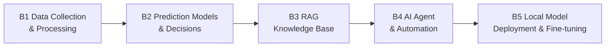

[🇨🇳 中文](../../paths/b-developers/README.md) | 🇺🇸 English

# Path B: Developers Building AI Systems

> Last updated: 2026-03-10

## Overview

- **Target audience**: E-commerce technical professionals in development, data, and BI roles
- **Prerequisites**: Python basics (or willingness to learn as you go AI will help you write code)
- **Time commitment**: 1 hour per day, 4-8 weeks for systematic mastery
- **Key outcome**: A deployable AI tool

> Build AI-powered e-commerce tools and systems, from scripts to production-grade applications



---

## Module Navigation

| Module | Topic | Difficulty | Estimated Time | Description |
|--------|-------|-----------|----------------|-------------|
| [B1. Data Collection & Processing Automation](b1-data-pipeline.md) | Data Pipelines | Beginner | 4-6 hours | From Amazon reports to clean, analysis-ready datasets |
| [B2. Prediction Models & Smart Decisions](b2-prediction-models.md) | Predictive Modeling | Intermediate | 6-8 hours | Sales forecasting models to support restocking decisions |
| [B3. RAG Knowledge Base System](b3-rag-knowledge-base.md) | Knowledge Base | Intermediate | 6-8 hours | AI Q&A system built on internal documents |
| [B4. AI Agent & Workflow Automation](b4-agent-workflow.md) | Agents | Advanced | 8-10 hours | Automatically execute multi-step operations tasks |
| [B5. Local Model Deployment & Fine-tuning](b5-local-model-deploy.md) | Model Deployment | Advanced | 4-6 hours | Run LLMs locally to protect data privacy |
| [B6. MCP Integration & Agentic Workflows](b6-mcp-agentic-workflow.md) | MCP/Agentic | Advanced | 2-3 weeks | Connect Amazon Ads/Shopify via MCP, conversational operations |
| [B7. Review Intelligence Analysis System](b7-review-nlp-system.md) | NLP/Topic Modeling | Intermediate | 2 weeks | BERTopic topic modeling + sentiment analysis + LLM insights |
| [B8. E-Commerce Data Visualization Dashboard](b8-ecommerce-dashboard.md) | Streamlit/Plotly | Intermediate | 1-2 weeks | Multi-platform operations dashboard + AI anomaly detection |
| [B9. AI Product Image/Video Generation](b9-ai-image-pipeline.md) | ComfyUI/DALL-E/Flux | Advanced | 2-3 weeks | Product image batch generation pipeline + video generation |

---

## Progress Tracker

```
[ ] B1. Data: Write a script to automatically merge multiple Amazon reports and generate a summary
[ ] B2. Prediction: Use Prophet to forecast 90-day sales for a real SKU
[ ] B3. RAG: Build a RAG system that can answer product-related questions
[ ] B4. Agent: Deploy an automated operations monitoring Agent
[ ] B5. Deployment: Run an LLM locally with Ollama and complete an e-commerce task (elective)
[ ] B6. MCP: Configure Amazon Ads MCP and manage ads through Claude conversations
[ ] B7. NLP: Use BERTopic for topic modeling on 1,000+ reviews
[ ] B8. Dashboard: Build a Streamlit operations dashboard with 4+ modules
[ ] B9. Images: Generate a complete AI image set for a product and pass Amazon compliance checks
```

**Path B completion milestone:** Complete at least 3 of the B1-B4 modules, and you'll have the skills to build AI-powered e-commerce tools. B5 is an advanced elective.

---

[Back to Hub Home](../../README.md) · [Back to Paths Overview](../README.md)
