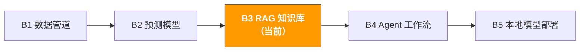

[🇨🇳 中文](../../paths/b-developers/b3-rag-knowledge-base.md) | 🇺🇸 English

# B3. RAG Knowledge Base System

> **Path**: Path B: Developers · **Module**: B3
> **Last Updated**: 2026-03-12
> **Difficulty**: Intermediate → Advanced
> **Prerequisites**: B1 Data Pipeline Fundamentals (Python, File Processing), B2 Basic ML Concepts
> **Estimated Time**: 1 hour/day, 23 weeks
---

[Hub Home](../../README.md) · [Path B Overview](README.md)



---

## Module Navigation

1. [RAG Methodology](#1-rag-methodology) · 2. [Tool Landscape](#2-tool-landscape) · 3. [Tech Stack Selection](#3-tech-stack-selection-in-depth) · 4. [Hands-On Code](#4-hands-on-code) · 5. [E-Commerce RAG Use Cases](#5-e-commerce-rag-use-cases) · 6. [Common Pitfalls](#6-common-pitfalls) · 7. [Advanced Techniques](#7-advanced-techniques) · 8. [Learning Resources](#8-learning-resources) · 9. [ OpenClaw Automation](#9-building-a-rag-knowledge-base-with-openclaw) · 10. [Completion Checklist](#10-completion-checklist)


## What You'll Build in This Module

An AI Q&A system powered by internal documents upload product manuals, policy documents, FAQs, and review data, and let AI automatically retrieve and answer questions.

After completing this module, you'll be able to:
- Understand the core principles and architecture of RAG (Retrieval-Augmented Generation)
- Build a working RAG system in just 10 lines of code with LlamaIndex
- Create a product FAQ knowledge base from product manuals and review data
- Merge multiple data sources (product docs + policy files + reviews) into a multi-document RAG
- Use Chroma vector database for persistent storage, avoiding index rebuilds every time
- Run LLMs locally with Ollama, without depending on the OpenAI API
- Evaluate your RAG system's retrieval accuracy and answer quality
- Build a complete e-commerce product knowledge base Q&A system

---

## 1. RAG Methodology

> **Related Reading**: [A4 Customer Service & After-Sales](../a-operators/a4-customer-service.md#a4-customer-service-after-sales) See A4 for RAG applications in automated customer service FAQ answering. · [F3 Knowledge Base & RAG](../0-foundations/f3-rag-knowledge.md#9-automate-knowledge-base-management-rag-monitoring-with-openclaw) See F3 for foundational RAG theory.

### 1.1 What Is RAG

RAG (Retrieval-Augmented Generation) is a technique that enables LLMs to answer questions based on your private data.

The core idea:

```
用户提问 → 从文档中检索相关段落 → 段落+问题发给 LLM → LLM 基于检索内容回答
```

**Why not just use ChatGPT directly?**

| Approach | Pros | Cons |
|----------|------|------|
| Ask ChatGPT directly | Zero cost, ready to use | Doesn't know your product details, internal policies, or latest data |
| Paste documents into the chat | Simple | Limited by token window (~128k); can't fit large document sets |
| Fine-tuning | Model "memorizes" your knowledge | Expensive, slow to update, prone to forgetting old knowledge |
| **RAG** | **Real-time retrieval of latest data, low cost, explainable** | **Requires building a retrieval system** |

RAG's core advantages are **data freshness** and **explainability**: you can update documents at any time and RAG immediately uses the latest content to answer; plus, every answer can be traced back to specific source document passages.

### 1.2 RAG vs Fine-tuning: How to Choose

This is the most frequently asked question. In short: RAG is for "looking things up," Fine-tuning is for "changing the style."

| Dimension | RAG | Fine-tuning |
|-----------|-----|-------------|
| Best for | Answering questions based on documents (FAQ, policy queries) | Changing the model's output style or format |
| Data updates | Real-time (just update the documents) | Requires retraining (time-consuming and costly) |
| Cost | Low (just a vector database + API calls) | High (GPU training + data labeling) |
| Hallucination control | Good (answers grounded in retrieved documents) | Poor (model may fabricate content) |
| Explainability | Strong (can show citation sources) | Weak (black box) |
| Knowledge capacity | Unlimited (no limit on document count) | Limited (constrained by model capacity) |
| Technical barrier | Low (a few dozen lines of code) | High (requires ML engineering experience) |

**Decision framework:**

```
你的需求是什么？
让 AI 回答关于你的文档/数据的问题 → RAG
让 AI 用特定风格/格式输出 → Fine-tuning
两者都需要 → RAG + Fine-tuning（先 RAG，效果不够再加 Fine-tuning）
不确定 → 先试 RAG（成本低、见效快）
```

### 1.3 Typical E-Commerce RAG Scenarios

| Scenario | Data Source | Example User Question | Value |
|----------|------------|----------------------|-------|
| Product FAQ | Product manuals, spec sheets | "Does this camera support 4K 60fps?" | 510x improvement in customer service efficiency |
| Policy queries | Amazon policy docs, compliance guides | "What are the special FBA return policy requirements for electronics?" | Reduced compliance risk |
| Review insights | Customer review data | "What are the main complaints about battery life?" | Product improvement direction |
| Supplier knowledge base | Supplier manuals, communication records | "What's the minimum order quantity for Supplier A?" | Faster procurement decisions |
| Operations SOP | Internal operations manuals | "How do I handle an A-to-Z Claim?" | New hire training efficiency |
| Competitive analysis | Competitor listings, reviews | "What are Competitor X's main selling points?" | Differentiation strategy |

> **Key Insight**: The value of RAG in e-commerce lies in turning "knowledge scattered everywhere" into "an always-available smart assistant." An operations team might have dozens of product manuals, hundreds of pages of policy documents, and tens of thousands of reviews no one can memorize all of that, but RAG can.

### 1.4 RAG Architecture Overview

A complete RAG system consists of two phases:

**Phase 1: Indexing Offline Preparation**

```
原始文档 → 文档加载 → 文本分块(Chunking) → 向量化(Embedding) → 存入向量数据库
```

**Phase 2: Querying Online Service**

```
用户提问 → 问题向量化 → 向量相似度搜索 → 取回 Top-K 相关段落 → 构造 Prompt → LLM 生成回答
```

**Key choices at each stage:**

| Stage | Options | Recommended (Beginner) | Recommended (Production) |
|-------|---------|----------------------|------------------------|
| Document loading | LlamaIndex SimpleDirectoryReader, LangChain Loaders | LlamaIndex | LlamaIndex |
| Text chunking | Fixed size, by sentence, by semantics | Fixed size (512 tokens) | Semantic chunking |
| Embedding model | OpenAI text-embedding-3-small, BGE, E5 | OpenAI (simplest) | BGE-large (open-source, free) |
| Vector database | Chroma, FAISS, Pinecone, Weaviate | Chroma (simplest) | Pinecone (managed service) |
| LLM | OpenAI GPT-4o, Claude, Ollama local models | OpenAI GPT-4o-mini | Ollama + Qwen2.5 (local, free) |

---

## 2. Tool Landscape

| Tool | Type | Difficulty | Best For | Installation |
|------|------|-----------|----------|-------------|
| [LlamaIndex](https://docs.llamaindex.ai/) | RAG framework | Beginner | Quick RAG setup, document Q&A | `pip install llama-index` |
| [LangChain](https://python.langchain.com/) | LLM app framework | Intermediate | Complex LLM workflows, Agents | `pip install langchain` |
| [Chroma](https://www.trychroma.com/) | Vector database | Beginner | Local development, small-scale data | `pip install chromadb` |
| [Ollama](https://ollama.com/) | Local LLM | Beginner | No OpenAI API needed, data privacy | [ollama.com/download](https://ollama.com/download) |
| [OpenAI API](https://platform.openai.com/) | Cloud LLM | Beginner | Highest quality answers, rapid prototyping | `pip install openai` |
| [Pinecone](https://www.pinecone.io/) | Managed vector DB | Intermediate | Production environments, large-scale data | `pip install pinecone-client` |
| [FAISS](https://github.com/facebookresearch/faiss) | Vector search library | Intermediate | High-performance, large-scale vector search | `pip install faiss-cpu` |
| [Sentence-Transformers](https://www.sbert.net/) | Embedding models | Intermediate | Open-source, free embeddings | `pip install sentence-transformers` |

**Recommendations:**
- Just starting out → LlamaIndex + OpenAI API (results in 10 lines of code)
- Don't want to spend money → LlamaIndex + Ollama + Chroma (all local, all free)
- Production environment → LlamaIndex/LangChain + Pinecone + OpenAI (stable and scalable)
- High data privacy requirements → Ollama + Chroma (data never leaves your machine)

---

## 3. Tech Stack Selection In-Depth

### 3.1 LlamaIndex vs LangChain

These are the two most popular frameworks in the RAG space, and they're often compared:

| Dimension | LlamaIndex | LangChain |
|-----------|-----------|-----------|
| Focus | Specialized in data indexing and retrieval | General-purpose LLM application framework |
| RAG experience | Works out of the box, 5 lines to build RAG | Requires more configuration; flexible but complex |
| Learning curve | Gentle, clear documentation | Steeper; many concepts (Chain, Agent, Tool) |
| Document loaders | 100+ built-in data loaders | 100+ built-in data loaders |
| Best for | Document Q&A, knowledge bases | Complex workflows, multi-step reasoning, Agents |
| Community | Active, fast updates | Very active, largest ecosystem |

**Conclusion**: Start with LlamaIndex (simpler), then bring in LangChain when you need complex workflows. This module focuses on LlamaIndex.

References: [LlamaIndex Official Docs](https://docs.llamaindex.ai/) | [LangChain Official Docs](https://python.langchain.com/)

### 3.2 Embedding Model Selection

The embedding model determines retrieval quality. Pick the wrong model and retrieval suffers no matter how powerful the downstream LLM is.

| Model | Provider | Dimensions | Chinese Support | Cost | Recommended For |
|-------|----------|-----------|----------------|------|----------------|
| text-embedding-3-small | OpenAI | 1536 | | $0.02/1M tokens | Rapid prototyping, good quality |
| text-embedding-3-large | OpenAI | 3072 | | $0.13/1M tokens | Maximum retrieval precision |
| BGE-large-zh-v1.5 | BAAI | 1024 | Excellent | Free (runs locally) | Chinese documents, data privacy |
| E5-large-v2 | Microsoft | 1024 | | Free (runs locally) | Multilingual scenarios |
| all-MiniLM-L6-v2 | Sentence-Transformers | 384 | Fair | Free (runs locally) | English documents, limited resources |

**E-commerce recommendations:**
- Mixed Chinese/English documents → `text-embedding-3-small` (OpenAI, most consistently reliable)
- Chinese-only documents + data privacy → `BGE-large-zh-v1.5` (local, free, excellent Chinese performance)
- Budget-constrained → `all-MiniLM-L6-v2` (local, free, adequate for English)

### 3.3 Vector Database Selection

| Database | Type | Data Scale | Persistence | Best For |
|----------|------|-----------|-------------|---------|
| Chroma | Embedded | <1M vectors | Local files | Development/testing, small teams |
| FAISS | Library (not a DB) | <10M vectors | Manual save required | High-performance search, offline scenarios |
| Pinecone | Cloud-managed | Unlimited | Automatic (cloud) | Production environments, zero ops |
| Weaviate | Self-hosted/cloud | Unlimited | Automatic | Hybrid search needed (vector + keyword) |
| Qdrant | Self-hosted/cloud | Unlimited | Automatic | High performance, filtered queries |

**Recommended path**: Use Chroma during development (zero config), then migrate to Pinecone or Qdrant for production.

---

## 4. Hands-On Code

### 4.1 Minimal RAG: Build a Q&A System in 10 Lines with LlamaIndex

This is the simplest RAG system you can write. Put your documents in a folder, and 10 lines of code gets you a working Q&A system.

```python
# 最简 RAG 10 行代码
# 前提：pip install llama-index openai
# 环境变量：export OPENAI_API_KEY="sk-..."

from llama_index.core import VectorStoreIndex, SimpleDirectoryReader

# 1. 加载文档（支持 .txt, .pdf, .md, .docx, .csv 等）
documents = SimpleDirectoryReader("data/product_docs").load_data()
print(f" 加载了 {len(documents)} 个文档")

# 2. 构建索引（自动分块 + Embedding + 内存向量存储）
index = VectorStoreIndex.from_documents(documents)

# 3. 创建查询引擎
query_engine = index.as_query_engine()

# 4. 提问
response = query_engine.query("这个产品支持 4K 60fps 吗？")
print(response)
```

It's that simple. LlamaIndex handles everything behind the scenes:
1. `SimpleDirectoryReader` automatically detects file formats and loads them
2. `VectorStoreIndex.from_documents` automatically chunks (default 1024 tokens), calls the OpenAI Embedding API to generate vectors, and stores them in memory
3. `as_query_engine()` creates a query engine that retrieves the Top-2 most relevant passages by default
4. `query()` sends the retrieved passages along with the question to GPT, which generates an answer

> **Note**: This minimal version uses the OpenAI API and requires the `OPENAI_API_KEY` environment variable. Each run rebuilds the index (calling the Embedding API), which incurs API costs. Later sections cover how to use Chroma for persistent storage and Ollama as an OpenAI replacement.

**Viewing retrieved source documents:**

```python
# 查看 RAG 检索到了哪些文档段落
response = query_engine.query("退货政策是什么？")

print("回答:", response)
print("\n--- 引用来源 ---")
for node in response.source_nodes:
print(f" 文件: {node.metadata.get('file_name', 'unknown')}")
print(f" 相似度: {node.score:.4f}")
print(f" 内容: {node.text[:200]}...")
print()
```

> **Explainability**: A major advantage of RAG is that every answer can be traced back to source documents. This is critical in e-commerce when customer service uses AI to answer customer questions, you need to ensure answers are verifiable.

### 4.2 Product FAQ Knowledge Base: Building a Q&A System from Product Manuals

Real-world scenario: you have a bunch of product manuals (PDF/Word/Markdown) and want AI to automatically answer product-related questions.

```python
import os
from pathlib import Path
from llama_index.core import (
VectorStoreIndex,
SimpleDirectoryReader,
Settings,
StorageContext,
load_index_from_storage,
)
from llama_index.core.node_parser import SentenceSplitter

def build_product_faq(
docs_dir: str,
chunk_size: int = 512,
chunk_overlap: int = 50,
persist_dir: str = "storage/product_faq"
) -> VectorStoreIndex:
"""
从产品文档构建 FAQ 知识库。

Args:
docs_dir: 产品文档目录（支持 .txt, .pdf, .md, .docx, .csv）
chunk_size: 分块大小（tokens）
chunk_overlap: 分块重叠大小
persist_dir: 索引持久化目录

Returns:
构建好的向量索引
"""
# 检查是否已有持久化索引
if Path(persist_dir).exists():
print(" 加载已有索引...")
storage_context = StorageContext.from_defaults(persist_dir=persist_dir)
index = load_index_from_storage(storage_context)
print(" 索引加载完成")
return index

# 1. 加载文档
print(f" 从 {docs_dir} 加载文档...")
documents = SimpleDirectoryReader(
docs_dir,
recursive=True,
filename_as_id=True,
).load_data()
print(f" 加载了 {len(documents)} 个文档")

# 2. 配置分块策略
text_splitter = SentenceSplitter(
chunk_size=chunk_size,
chunk_overlap=chunk_overlap,
)
Settings.text_splitter = text_splitter

# 3. 构建索引
print(" 构建向量索引...")
index = VectorStoreIndex.from_documents(documents, show_progress=True)

# 4. 持久化存储（下次不用重建）
index.storage_context.persist(persist_dir=persist_dir)
print(f" 索引已保存到 {persist_dir}")

return index

def query_product_faq(
index: VectorStoreIndex,
question: str,
top_k: int = 3,
response_mode: str = "compact"
) -> dict:
"""
查询产品 FAQ 知识库。

Args:
index: 向量索引
question: 用户问题
top_k: 检索的文档块数量
response_mode: 回答模式
- "compact": 压缩所有检索内容生成简洁回答（推荐）
- "refine": 逐块精炼回答（更准确但更慢）
- "tree_summarize": 树状汇总（适合长回答）
"""
query_engine = index.as_query_engine(
similarity_top_k=top_k,
response_mode=response_mode,
)

response = query_engine.query(question)

sources = []
for node in response.source_nodes:
sources.append({
"file": node.metadata.get("file_name", "unknown"),
"score": round(node.score, 4) if node.score else None,
"text_preview": node.text[:300],
})

return {
"question": question,
"answer": str(response),
"sources": sources,
"num_sources": len(sources),
}

# 使用示例
# index = build_product_faq("data/product_docs", chunk_size=512)
#
# result = query_product_faq(index, "这个摄像头的防水等级是多少？")
# print(f"Q: {result['question']}")
# print(f"A: {result['answer']}")
# print(f"\n引用了 {result['num_sources']} 个文档段落:")
# for s in result['sources']:
# print(f" - {s['file']} (相似度: {s['score']})")
```

> **chunk_size tuning guide**:
> - Product spec sheets (short sentences, structured) → 256512 tokens
> - Product manuals (paragraph-style descriptions) → 5121024 tokens
> - Policy documents (long paragraphs, legal language) → 10242048 tokens
> - Not sure → Start with 512 and adjust based on answer quality

### 4.3 Multi-Document RAG: Merging Multiple Data Sources

In e-commerce, knowledge is scattered across multiple places: product manuals, review data, policy documents, and operations SOPs. Multi-document RAG unifies them into a single Q&A system.

```python
from llama_index.core import VectorStoreIndex, SimpleDirectoryReader, Document, Settings
from llama_index.core.node_parser import SentenceSplitter
import pandas as pd

def load_review_data(csv_path: str, text_col: str = "review_text",
max_reviews: int = 1000) -> list:
"""将 Review CSV 数据转换为 LlamaIndex Document 对象。"""
df = pd.read_csv(csv_path)

if len(df) > max_reviews:
df = df.sort_values("rating", ascending=True).head(max_reviews)

documents = []
for _, row in df.iterrows():
text = str(row.get(text_col, ""))
if len(text.strip()) < 10:
continue

metadata = {
"source": "customer_review",
"rating": int(row.get("rating", 0)),
"asin": str(row.get("asin", "")),
"date": str(row.get("date", "")),
}
doc = Document(text=text, metadata=metadata)
documents.append(doc)

print(f" 加载了 {len(documents)} 条 Review")
return documents

def build_multi_source_rag(
product_docs_dir: str = None,
policy_docs_dir: str = None,
review_csv: str = None,
sop_docs_dir: str = None,
chunk_size: int = 512,
) -> VectorStoreIndex:
"""
构建多数据源 RAG 索引。
合并多种文档类型到同一个向量索引中，
每个文档带有 source 元数据，方便过滤和追溯。
"""
all_documents = []

if product_docs_dir:
docs = SimpleDirectoryReader(product_docs_dir).load_data()
for doc in docs:
doc.metadata["source"] = "product_manual"
all_documents.extend(docs)
print(f" 产品文档: {len(docs)} 个")

if policy_docs_dir:
docs = SimpleDirectoryReader(policy_docs_dir).load_data()
for doc in docs:
doc.metadata["source"] = "policy"
all_documents.extend(docs)
print(f" 政策文档: {len(docs)} 个")

if review_csv:
review_docs = load_review_data(review_csv)
all_documents.extend(review_docs)

if sop_docs_dir:
docs = SimpleDirectoryReader(sop_docs_dir).load_data()
for doc in docs:
doc.metadata["source"] = "sop"
all_documents.extend(docs)
print(f" SOP 文档: {len(docs)} 个")

print(f"\n 总计: {len(all_documents)} 个文档")

Settings.text_splitter = SentenceSplitter(chunk_size=chunk_size, chunk_overlap=50)
index = VectorStoreIndex.from_documents(all_documents, show_progress=True)

print(" 多源 RAG 索引构建完成")
return index

def query_with_source_filter(
index: VectorStoreIndex,
question: str,
source_filter: str = None,
top_k: int = 5,
) -> dict:
"""
带数据源过滤的查询。

Args:
source_filter: 数据源过滤
- None: 搜索所有数据源
- "product_manual": 只搜索产品文档
- "policy": 只搜索政策文档
- "customer_review": 只搜索 Review
- "sop": 只搜索 SOP
"""
from llama_index.core.vector_stores import (
MetadataFilter, MetadataFilters, FilterOperator,
)

filters = None
if source_filter:
filters = MetadataFilters(filters=[
MetadataFilter(key="source", operator=FilterOperator.EQ, value=source_filter)
])

query_engine = index.as_query_engine(similarity_top_k=top_k, filters=filters)
response = query_engine.query(question)

sources = []
for node in response.source_nodes:
sources.append({
"source_type": node.metadata.get("source", "unknown"),
"file": node.metadata.get("file_name", ""),
"score": round(node.score, 4) if node.score else None,
})

return {"question": question, "answer": str(response), "sources": sources}

# 使用示例
# index = build_multi_source_rag(
# product_docs_dir="data/product_docs",
# policy_docs_dir="data/policy_docs",
# review_csv="data/reviews.csv",
# )
# result = query_with_source_filter(index, "客户对电池续航有什么反馈？")
# result = query_with_source_filter(index, "FBA 退货政策是什么？", source_filter="policy")
```

> **The value of multi-source RAG**: When a customer service rep asks "Is the return rate high for this product?", the system can simultaneously pull customer complaints from review data, return rules from policy documents, and handling procedures from SOPs, delivering a comprehensive answer.

### 4.4 Chroma Vector Database: Persistent Storage and Incremental Updates

The earlier examples rebuild the index on every run, wasting time and API costs. Chroma lets you persist vectors to disk and supports incrementally adding new documents.

```python
import chromadb
from llama_index.core import VectorStoreIndex, SimpleDirectoryReader, StorageContext
from llama_index.vector_stores.chroma import ChromaVectorStore

def create_chroma_index(
docs_dir: str,
collection_name: str = "product_knowledge",
persist_dir: str = "chroma_db",
) -> VectorStoreIndex:
"""
用 Chroma 创建持久化向量索引。

Chroma 的优势：
- 数据持久化到磁盘，重启不丢失
- 支持增量添加文档（不用重建整个索引）
- 支持元数据过滤
- 零配置，嵌入式运行
"""
chroma_client = chromadb.PersistentClient(path=persist_dir)
chroma_collection = chroma_client.get_or_create_collection(name=collection_name)

print(f" Collection '{collection_name}': {chroma_collection.count()} 个已有向量")

vector_store = ChromaVectorStore(chroma_collection=chroma_collection)
storage_context = StorageContext.from_defaults(vector_store=vector_store)

documents = SimpleDirectoryReader(docs_dir).load_data()
index = VectorStoreIndex.from_documents(
documents, storage_context=storage_context, show_progress=True
)

print(f" 索引构建完成，共 {chroma_collection.count()} 个向量")
return index

def load_existing_chroma_index(
collection_name: str = "product_knowledge",
persist_dir: str = "chroma_db",
) -> VectorStoreIndex:
"""加载已有的 Chroma 索引（不重建）。"""
chroma_client = chromadb.PersistentClient(path=persist_dir)
chroma_collection = chroma_client.get_collection(name=collection_name)
vector_store = ChromaVectorStore(chroma_collection=chroma_collection)
index = VectorStoreIndex.from_vector_store(vector_store)
print(f" 加载已有索引: {chroma_collection.count()} 个向量")
return index

def add_documents_to_index(index: VectorStoreIndex, new_docs_dir: str) -> int:
"""增量添加新文档到已有索引。不需要重建整个索引。"""
new_documents = SimpleDirectoryReader(new_docs_dir).load_data()
for doc in new_documents:
index.insert(doc)
print(f" 新增 {len(new_documents)} 个文档到索引")
return len(new_documents)

# 使用示例
# index = create_chroma_index("data/product_docs", persist_dir="chroma_db")
# index = load_existing_chroma_index(persist_dir="chroma_db") # 秒级加载
# add_documents_to_index(index, "data/new_docs") # 增量更新
```

> **Chroma vs in-memory storage**: For an index of 100 documents, in-memory mode takes ~30 seconds + $0.01 in API costs on each startup; Chroma mode loads in <1 second with zero cost.

### 4.5 Local RAG (Ollama): No OpenAI Dependency, Protecting Business Data Privacy

E-commerce data (product costs, supplier information, sales figures) is confidential business information. Ollama lets you run LLMs locally so data never leaves your machine.

**Ollama installation and model download:**

```bash
# 1. 安装 Ollama（macOS） 从 https://ollama.com/download 下载

# 2. 下载模型
ollama pull qwen2.5:7b # 推荐：中英文都好，7B 参数
ollama pull llama3.1:8b # Meta 开源，英文优秀
ollama pull nomic-embed-text # Embedding 模型（免费替代 OpenAI）

# 3. 验证
ollama list # 查看已下载的模型
```

**Building a fully local RAG with Ollama:**

```python
from llama_index.core import VectorStoreIndex, SimpleDirectoryReader, Settings
from llama_index.llms.ollama import Ollama
from llama_index.embeddings.ollama import OllamaEmbedding

def build_local_rag(
docs_dir: str,
llm_model: str = "qwen2.5:7b",
embed_model: str = "nomic-embed-text",
ollama_base_url: str = "http://localhost:11434",
) -> VectorStoreIndex:
"""
构建完全本地的 RAG 系统（不调用任何外部 API）。

前提：
1. 已安装 Ollama
2. 已下载 LLM 模型: ollama pull qwen2.5:7b
3. 已下载 Embedding 模型: ollama pull nomic-embed-text
"""
# 配置本地 LLM
llm = Ollama(
model=llm_model,
base_url=ollama_base_url,
request_timeout=120.0,
temperature=0.1,
)

# 配置本地 Embedding
embed = OllamaEmbedding(
model_name=embed_model,
base_url=ollama_base_url,
)

# 设置全局配置（替代 OpenAI）
Settings.llm = llm
Settings.embed_model = embed

# 加载文档并构建索引
documents = SimpleDirectoryReader(docs_dir).load_data()
print(f" 加载了 {len(documents)} 个文档")

index = VectorStoreIndex.from_documents(documents, show_progress=True)

print(f" 本地 RAG 构建完成（LLM: {llm_model}, Embed: {embed_model}）")
print(" 所有数据在本地处理，未发送到任何外部服务")
return index

# 使用示例
# index = build_local_rag("data/product_docs")
# engine = index.as_query_engine(similarity_top_k=3)
# response = engine.query("这个产品的保修期是多久？")
```

**Local vs cloud RAG comparison:**

| Dimension | Local RAG (Ollama) | Cloud RAG (OpenAI) |
|-----------|-------------------|-------------------|
| Data privacy | Data never leaves your machine | Data sent to OpenAI servers |
| Cost | Free (aside from electricity) | Pay per token |
| Answer quality | 7B model ≈ GPT-3.5 level | GPT-4o is the highest quality |
| Speed | Depends on hardware (~30 tokens/s on M1 Mac) | Fast (cloud GPUs) |
| Offline use | No internet required | Requires internet |
| Hardware requirements | 7B model needs 8GB+ RAM | None |

> **Recommended strategy**: Use OpenAI during development (higher answer quality, easier debugging), then decide based on data sensitivity for production. Use Ollama for local deployment when dealing with trade secrets.

### 4.6 RAG Evaluation: How to Measure Answer Quality

You must evaluate quality before deploying a RAG system. Deploying without evaluation is like putting an untrained customer service rep in front of customers.

RAG evaluation has three core dimensions:

| Dimension | Meaning | What It Measures |
|-----------|---------|-----------------|
| Faithfulness | Whether the answer is grounded in retrieved documents | Did the LLM "fabricate" content not present in the documents? |
| Relevancy | Whether the answer is relevant to the question | Did the answer go off-topic? |
| Context Recall | Whether retrieved documents contain the correct answer | Did the retrieval step miss key information? |

**Evaluating with the RAGAS framework:**

```python
# pip install ragas

from ragas import evaluate
from ragas.metrics import (
faithfulness, answer_relevancy,
context_precision, context_recall,
)
from datasets import Dataset

def evaluate_rag_quality(
questions: list[str],
answers: list[str],
contexts: list[list[str]],
ground_truths: list[str] = None,
) -> dict:
"""
用 RAGAS 框架评估 RAG 系统质量。

Args:
questions: 测试问题列表
answers: RAG 系统的回答列表
contexts: 每个问题检索到的上下文列表
ground_truths: 标准答案（可选，有的话评估更准确）
"""
data = {
"question": questions,
"answer": answers,
"contexts": contexts,
}

metrics = [faithfulness, answer_relevancy, context_precision]

if ground_truths:
data["ground_truth"] = ground_truths
metrics.append(context_recall)

dataset = Dataset.from_dict(data)
result = evaluate(dataset=dataset, metrics=metrics)

print(" RAG 评估结果:")
print(f" Faithfulness（忠实度）: {result['faithfulness']:.3f}")
print(f" Answer Relevancy（相关性）: {result['answer_relevancy']:.3f}")
print(f" Context Precision（上下文精度）: {result['context_precision']:.3f}")
if ground_truths:
print(f" Context Recall（上下文召回）: {result['context_recall']:.3f}")

return dict(result)

def create_eval_dataset(index, eval_questions: list[dict]) -> tuple:
"""
从 RAG 系统生成评估数据集。

Args:
eval_questions: [{"question": "...", "ground_truth": "..."}, ...]
"""
questions, answers, contexts, ground_truths = [], [], [], []
query_engine = index.as_query_engine(similarity_top_k=3)

for item in eval_questions:
q = item["question"]
response = query_engine.query(q)

questions.append(q)
answers.append(str(response))
contexts.append([node.text for node in response.source_nodes])
if "ground_truth" in item:
ground_truths.append(item["ground_truth"])

return questions, answers, contexts, ground_truths or None

# 使用示例
# eval_questions = [
# {"question": "这个摄像头支持 4K 60fps 吗？", "ground_truth": "是的，支持 4K 60fps 视频录制。"},
# {"question": "电池续航多久？", "ground_truth": "标准模式下约 2 小时。"},
# {"question": "防水等级是多少？", "ground_truth": "IPX8，可在 10 米水深使用。"},
# ]
# questions, answers, contexts, truths = create_eval_dataset(index, eval_questions)
# results = evaluate_rag_quality(questions, answers, contexts, truths)
```

**Evaluation metric benchmarks:**

| Metric | Excellent | Good | Needs Improvement |
|--------|-----------|------|-------------------|
| Faithfulness | > 0.90 | 0.750.90 | < 0.75 |
| Answer Relevancy | > 0.85 | 0.700.85 | < 0.70 |
| Context Precision | > 0.80 | 0.600.80 | < 0.60 |
| Context Recall | > 0.85 | 0.700.85 | < 0.70 |

**What to do when evaluation results are poor:**

| Problem | Likely Cause | Solution |
|---------|-------------|----------|
| Low Faithfulness | LLM is fabricating content | Emphasize in the prompt: "Only answer based on the provided documents" |
| Low Relevancy | Answer is off-topic | Check if retrieved documents are relevant; adjust top_k |
| Low Context Precision | Irrelevant documents retrieved | Adjust chunk_size; try a different embedding model |
| Low Context Recall | Correct answer wasn't retrieved | Increase top_k; check if documents are chunked correctly |

> **ROI of evaluation**: Preparing 2030 evaluation questions (with ground truth answers) takes about 2 hours. But that 2-hour investment helps you catch 80% of quality issues, preventing post-launch complaints about "the AI making things up."

---

## 5. E-Commerce RAG Use Cases

### 5.1 Automated Customer Service System

The most direct RAG application: train a customer service AI on product manuals and FAQ documents to automatically answer common customer questions.

```python
from llama_index.core import VectorStoreIndex, SimpleDirectoryReader, Settings
from llama_index.core.prompts import PromptTemplate

# 自定义客服 Prompt 控制回答风格和边界
CUSTOMER_SERVICE_PROMPT = PromptTemplate(
"""你是一个专业的电商客服助手。请基于以下产品文档回答客户问题。

规则：
1. 只基于提供的文档内容回答，不要编造信息
2. 如果文档中没有相关信息，请说"抱歉，我需要为您转接人工客服"
3. 回答要简洁、友好、专业
4. 如果涉及退货/退款，请引导客户联系官方客服

产品文档：
{context_str}

客户问题：{query_str}

回答："""
)

def build_customer_service_bot(docs_dir: str, chunk_size: int = 256) -> VectorStoreIndex:
"""
构建客服问答机器人。

客服场景的特殊配置：
- chunk_size 较小（256）：客服问题通常很具体，小块检索更精确
- top_k 较大（5）：多检索几个段落，减少遗漏
- 自定义 Prompt：控制回答风格和安全边界
"""
from llama_index.core.node_parser import SentenceSplitter

Settings.text_splitter = SentenceSplitter(chunk_size=chunk_size, chunk_overlap=30)
documents = SimpleDirectoryReader(docs_dir, recursive=True).load_data()
index = VectorStoreIndex.from_documents(documents, show_progress=True)

print(f" 客服知识库构建完成: {len(documents)} 个文档")
return index

def answer_customer_question(index: VectorStoreIndex, question: str) -> dict:
"""回答客户问题，带来源追溯。"""
query_engine = index.as_query_engine(
similarity_top_k=5,
text_qa_template=CUSTOMER_SERVICE_PROMPT,
)
response = query_engine.query(question)

return {
"question": question,
"answer": str(response),
"confidence": "high" if response.source_nodes
and response.source_nodes[0].score
and response.source_nodes[0].score > 0.8
else "medium",
"sources": [node.metadata.get("file_name", "") for node in response.source_nodes],
}

# 使用示例
# index = build_customer_service_bot("data/customer_service_docs")
# for q in ["这个摄像头防水吗？", "电池能用多久？", "怎么退货？"]:
# result = answer_customer_question(index, q)
# print(f"Q: {result['question']}")
# print(f"A: {result['answer']} (置信度: {result['confidence']})\n")
```

### 5.2 Compliance Document Query System

Amazon's policy documents are numerous and lengthy, and compliance teams frequently need to look up specific policies. RAG can turn hundreds of pages of policy documents into an instant query system.

```python
def build_compliance_rag(policy_docs_dir: str, chunk_size: int = 1024) -> VectorStoreIndex:
"""
构建合规政策查询系统。

政策文档的特殊处理：
- chunk_size 较大（1024）：政策条款通常较长，需要完整上下文
- overlap 大一些（100）：避免条款被截断
"""
from llama_index.core.node_parser import SentenceSplitter

Settings.text_splitter = SentenceSplitter(chunk_size=chunk_size, chunk_overlap=100)

documents = SimpleDirectoryReader(policy_docs_dir, recursive=True).load_data()

for doc in documents:
filename = doc.metadata.get("file_name", "")
if "fba" in filename.lower():
doc.metadata["policy_area"] = "FBA"
elif "advertising" in filename.lower():
doc.metadata["policy_area"] = "Advertising"
elif "brand" in filename.lower():
doc.metadata["policy_area"] = "Brand Registry"
else:
doc.metadata["policy_area"] = "General"

index = VectorStoreIndex.from_documents(documents, show_progress=True)
print(f" 合规知识库构建完成: {len(documents)} 个政策文档")
return index

# 使用示例
# index = build_compliance_rag("data/amazon_policies")
# engine = index.as_query_engine(similarity_top_k=5)
# response = engine.query("FBA 退货政策对电子产品有什么特殊要求？")
```

### 5.3 Internal Training Knowledge Base

New hires need to absorb a massive amount of operational knowledge. RAG can turn training documents, SOPs, and historical case studies into a "mentor you can ask anytime."

```python
def build_training_rag(
sop_dir: str = None, case_study_dir: str = None, faq_dir: str = None,
) -> VectorStoreIndex:
"""
构建内部培训知识库。
数据源：SOP 文档、案例库、FAQ
"""
all_docs = []

for dir_path, doc_type in [(sop_dir, "sop"), (case_study_dir, "case_study"), (faq_dir, "faq")]:
if dir_path:
docs = SimpleDirectoryReader(dir_path).load_data()
for d in docs:
d.metadata["doc_type"] = doc_type
all_docs.extend(docs)

index = VectorStoreIndex.from_documents(all_docs, show_progress=True)
print(f" 培训知识库: {len(all_docs)} 个文档")
return index

# 使用示例
# index = build_training_rag(sop_dir="data/sop", case_study_dir="data/cases", faq_dir="data/faq")
# engine = index.as_query_engine()
# response = engine.query("如何处理 A-to-Z Claim？")
```

> **ROI of a training RAG**: A new hire typically needs 24 weeks to learn all the processes. With a training RAG, new hires can ask questions anytime, boosting learning efficiency by 50% or more. Plus, RAG answers are consistent you won't get different answers depending on who you ask.

---

## 6. Common Pitfalls

### 6.1 Poor Retrieval Quality

This is the most common RAG system issue. When answers are bad, 80% of the time it's because retrieval is inaccurate.

| Symptom | Likely Cause | Solution |
|---------|-------------|----------|
| Answer is completely irrelevant | Embedding model doesn't suit your document language | Switch to BGE-large-zh for Chinese docs, OpenAI for English |
| Answer is partially correct but missing key info | top_k is too small; key passages weren't retrieved | Increase top_k (from 2 to 5) |
| Relevant documents retrieved but answer is wrong | LLM didn't correctly understand the context | Optimize the prompt; explicitly require "only answer based on documents" |
| Simple questions answered correctly, complex ones fail | Answer spans multiple chunks; single chunk is incomplete | Increase chunk_size or use overlap |

**How to debug retrieval quality:**

```python
def debug_retrieval(index, question: str, top_k: int = 5):
"""
调试检索结果 查看 RAG 到底检索到了什么。
当回答质量不好时，先用这个函数检查检索环节。
"""
retriever = index.as_retriever(similarity_top_k=top_k)
nodes = retriever.retrieve(question)

print(f" 问题: {question}")
print(f" 检索到 {len(nodes)} 个文档块:\n")

for i, node in enumerate(nodes):
score = f"{node.score:.4f}" if node.score else "N/A"
file_name = node.metadata.get("file_name", "unknown")
print(f" [{i+1}] 相似度: {score} | 文件: {file_name}")
print(f" 内容: {node.text[:200]}...")
print()
return nodes
```

### 6.2 Improper Chunk Size

| chunk_size | Effect | Best For |
|-----------|--------|---------|
| 128256 | Precise retrieval but loses context | FAQs, product specs (short sentences) |
| 512 | Balances precision and context | General use (recommended starting point) |
| 1024 | Rich context but retrieval may be less precise | Policy documents, long paragraphs |
| 2048+ | Complete context but high retrieval noise | Rarely used |

**Rule of thumb**: Start at 512. If answers lack context, increase it. If answers contain too much irrelevant information, decrease it.

### 6.3 Hallucination

LLMs may "fabricate" information not present in the documents. This is extremely dangerous in customer service scenarios.

**Ways to reduce hallucination:**

1. **Prompt constraints**: Explicitly require in the prompt: "Only answer based on the provided documents. If the documents don't contain relevant information, say you don't know."
2. **Lower temperature**: `temperature=0.1` makes the model more deterministic, reducing creative improvisation
3. **Increase top_k**: Retrieve more documents to give the LLM more reference material
4. **Use Faithfulness evaluation**: Regularly check hallucination rates with RAGAS
5. **Show citation sources**: Let users verify the basis for each answer

```python
# 减少幻觉的 Prompt 模板
ANTI_HALLUCINATION_PROMPT = """基于以下文档回答问题。

重要规则：
- 只使用文档中明确提到的信息
- 如果文档中没有相关信息，回答"根据现有文档，我无法找到这个问题的答案"
- 不要推测或补充文档中没有的内容
- 在回答末尾标注信息来源

文档内容：
{context_str}

问题：{query_str}

回答："""
```

### 6.4 Context Window Limitations

Even if you retrieve many relevant documents, the LLM's context window has limits.

| Model | Context Window | Suggested top_k |
|-------|---------------|----------------|
| GPT-4o-mini | 128k tokens | 510 |
| GPT-4o | 128k tokens | 510 |
| Qwen2.5 7B | 32k tokens | 35 |
| Llama 3.1 8B | 128k tokens | 58 |

**Formula**: `top_k × chunk_size < 50% of the model's context window` (leave half for the prompt and the answer)

> **Common mistake**: Setting top_k=20 and chunk_size=1024 retrieves ~20k tokens of context. For a local model with a 32k window, that's already over 60%, leaving insufficient room for the answer, which leads to truncated or degraded responses.

---

## 7. Advanced Techniques

### 7.1 Hybrid Search (Keyword + Vector)

Pure vector search has a weakness: it's not great at exact keyword matching. For example, if a user searches for "ASIN B0XXXXX," vector search might miss it because ASIN codes carry no semantic meaning.

Hybrid Search combines the strengths of keyword search (BM25) and vector search:

```python
from llama_index.core import VectorStoreIndex, SimpleDirectoryReader
from llama_index.retrievers.bm25 import BM25Retriever
from llama_index.core.retrievers import QueryFusionRetriever

def build_hybrid_search(
docs_dir: str,
vector_top_k: int = 3,
bm25_top_k: int = 3,
) -> tuple:
"""
构建混合搜索（向量 + BM25 关键词）。

工作原理：
1. 向量搜索：找语义相似的文档（"摄像头防水" → "相机可以水下使用"）
2. BM25 搜索：找关键词匹配的文档（"B0XXXXX" → 包含该 ASIN 的文档）
3. 融合排序：用 Reciprocal Rank Fusion 合并两个结果列表
"""
documents = SimpleDirectoryReader(docs_dir).load_data()
index = VectorStoreIndex.from_documents(documents, show_progress=True)

vector_retriever = index.as_retriever(similarity_top_k=vector_top_k)

from llama_index.core.node_parser import SentenceSplitter
splitter = SentenceSplitter(chunk_size=512)
nodes = splitter.get_nodes_from_documents(documents)
bm25_retriever = BM25Retriever.from_defaults(nodes=nodes, similarity_top_k=bm25_top_k)

hybrid_retriever = QueryFusionRetriever(
retrievers=[vector_retriever, bm25_retriever],
similarity_top_k=vector_top_k + bm25_top_k,
num_queries=1,
mode="reciprocal_rerank",
)

print(" 混合搜索构建完成（向量 + BM25）")
return hybrid_retriever, index

# 使用示例
# retriever, index = build_hybrid_search("data/product_docs")
# nodes = retriever.retrieve("ASIN B0XXXXX 的规格参数") # BM25 擅长
# nodes = retriever.retrieve("这个产品能在水下使用吗？") # 向量搜索擅长
```

> **When do you need Hybrid Search?** When your documents contain lots of proper nouns (ASINs, SKUs, model numbers), numbers (prices, dimensions), or codes, pure vector search underperforms. Hybrid Search can significantly improve retrieval quality in these cases.

### 7.2 Re-ranking

Retrieved documents are sorted by similarity, but high similarity doesn't always mean most relevant. Re-ranking uses a more precise model to re-order the retrieval results.

```python
from llama_index.core import VectorStoreIndex
from llama_index.core.postprocessor import SentenceTransformerRerank

def query_with_reranking(
index: VectorStoreIndex,
question: str,
initial_top_k: int = 10,
final_top_k: int = 3,
rerank_model: str = "cross-encoder/ms-marco-MiniLM-L-6-v2",
) -> str:
"""
带 Re-ranking 的查询。

流程：
1. 先用向量搜索检索 initial_top_k 个候选文档（粗筛）
2. 用 Cross-Encoder 模型对候选文档重新打分（精排）
3. 取 final_top_k 个最相关的文档生成回答
"""
reranker = SentenceTransformerRerank(model=rerank_model, top_n=final_top_k)

query_engine = index.as_query_engine(
similarity_top_k=initial_top_k,
node_postprocessors=[reranker],
)

response = query_engine.query(question)
return str(response)
```

### 7.3 Agent + RAG

An Agent can automatically decide based on the user's question whether to search product docs, policy docs, or review data. This is smarter than manually specifying the data source.

```python
from llama_index.core import VectorStoreIndex, SimpleDirectoryReader
from llama_index.core.tools import QueryEngineTool, ToolMetadata
from llama_index.core.agent import ReActAgent

def build_rag_agent(
product_docs_dir: str,
policy_docs_dir: str,
review_docs_dir: str,
) -> ReActAgent:
"""
构建 RAG Agent 自动选择数据源回答问题。

Agent 会根据问题内容自动判断应该查询哪个知识库：
- 产品相关问题 → 查产品文档
- 政策相关问题 → 查政策文档
- 客户反馈问题 → 查 Review 数据
"""
product_index = VectorStoreIndex.from_documents(
SimpleDirectoryReader(product_docs_dir).load_data()
)
policy_index = VectorStoreIndex.from_documents(
SimpleDirectoryReader(policy_docs_dir).load_data()
)
review_index = VectorStoreIndex.from_documents(
SimpleDirectoryReader(review_docs_dir).load_data()
)

tools = [
QueryEngineTool(
query_engine=product_index.as_query_engine(),
metadata=ToolMetadata(
name="product_knowledge",
description="查询产品规格、功能、使用方法等产品相关信息。",
),
),
QueryEngineTool(
query_engine=policy_index.as_query_engine(),
metadata=ToolMetadata(
name="policy_knowledge",
description="查询 Amazon 政策、合规要求、退货规则等。",
),
),
QueryEngineTool(
query_engine=review_index.as_query_engine(),
metadata=ToolMetadata(
name="review_insights",
description="查询客户评论、反馈、投诉等信息。",
),
),
]

agent = ReActAgent.from_tools(tools, verbose=True)
print(" RAG Agent 构建完成（3 个知识库工具）")
return agent

# 使用示例
# agent = build_rag_agent("data/product_docs", "data/policy_docs", "data/review_docs")
# response = agent.chat("这个摄像头支持 4K 60fps 吗？") # → 查产品知识库
# response = agent.chat("FBA 退货政策是什么？") # → 查政策知识库
# response = agent.chat("客户对电池续航有什么反馈？产品手册标注的续航是多久？") # → 查多个知识库
```

> **The value of Agent + RAG**: Standard RAG requires users to know "which knowledge base should I query." Agent + RAG lets the AI decide automatically users just ask their question, and the system routes to the right data source. This is the leap from "tool" to "assistant."
>
> For more on Agents, see [B4 Agent Workflow](b4-agent-workflow.md).

---

## 8. Learning Resources

### 8.1 Free Courses and Documentation

| Resource | Platform | Duration | Who It's For | Link |
|----------|----------|----------|-------------|------|
| LlamaIndex Official Docs | LlamaIndex | Continuously updated | RAG beginner to advanced | [docs.llamaindex.ai](https://docs.llamaindex.ai/) |
| Building Agentic RAG | DeepLearning.AI | 1h | RAG + Agent integration | [deeplearning.ai](https://www.deeplearning.ai/short-courses/building-agentic-rag-with-llamaindex/) |
| LangChain Official Docs | LangChain | Continuously updated | LLM application development | [python.langchain.com](https://python.langchain.com/) |
| HuggingFace NLP Course | HuggingFace | 10h+ | NLP and embedding fundamentals | [huggingface.co/learn/nlp-course](https://huggingface.co/learn/nlp-course) |
| Chroma Official Docs | Chroma | 2h | Vector database basics | [trychroma.com](https://www.trychroma.com/) |
| Ollama Official Docs | Ollama | 1h | Local LLM deployment | [ollama.com](https://ollama.com/) |

### 8.2 Recommended GitHub Repositories

| Repository | Stars | Purpose |
|-----------|-------|---------|
| [LlamaIndex](https://github.com/run-llama/llama_index) | 37k+ | Core RAG framework library |
| [LangChain](https://github.com/langchain-ai/langchain) | 98k+ | LLM application framework |
| [Chroma](https://github.com/chroma-core/chroma) | 16k+ | Open-source vector database |
| [FAISS](https://github.com/facebookresearch/faiss) | 32k+ | High-performance vector search |
| [Ollama](https://github.com/ollama/ollama) | 105k+ | Run LLMs locally |
| [RAGAS](https://github.com/explodinggradients/ragas) | 7k+ | RAG evaluation framework |

Content rephrased for compliance with licensing restrictions. Sources cited inline.

---

## 9. Building a RAG Knowledge Base with OpenClaw

### 9.1 Scenario: AI Agent Automatically Maintains a Product Knowledge Base and Answers Customer Service Questions

```
你对 OpenClaw 说：
"当有新产品文档上传时，自动索引到知识库，
当客服在 Telegram 提问时，自动从知识库检索并回答"

OpenClaw 自动执行：
1. [触发] 新产品文档上传时
2. [filesystem MCP] 读取新文档
3. [LLM] 自动分块和生成 Embedding
4. [Skill: memory] 存入知识图谱
5. [Channel: Telegram] 客服通过 Telegram 提问，Agent 从知识库检索回答
```

### 9.2 Required Skills and MCP Servers

| Component | Purpose | Link |
|-----------|---------|------|
| **filesystem MCP** | Read new product documents | [MCP Filesystem](https://github.com/modelcontextprotocol/servers/tree/main/src/filesystem) |
| **memory** Skill | Store in knowledge graph | [OpenClaw Docs](https://docs.openclaw.com/) |
| **telegram/slack** Skill | Receive questions and respond | [ClawHub](https://clawhub.ai/) |
| **web-search** Skill | Supplement with external knowledge | [ClawHub](https://clawhub.ai/) |

### 9.3 Related Resources

| Resource | Description | Link |
|----------|------------|------|
| OpenClaw Official Docs | Installation and configuration guide | [docs.openclaw.com](https://docs.openclaw.com/) |
| ClawHub Skills Marketplace | Search and install Agent Skills | [clawhub.ai](https://clawhub.ai/) |
| OpenClaw MCP Integration | Connect MCP Servers | [Build Skill with MCP](https://rebeccamdeprey.com/blog/build-openclaw-skill-with-mcp) |
| F4 Automation & Agents | Agent fundamentals module | [F4 Module](../0-foundations/f4-agent-automation.md) |

Content rephrased for compliance with licensing restrictions. Sources cited inline.

---

## 10. Completion Checklist

- [ ] Build a minimal RAG in 10 lines of code with LlamaIndex that can answer questions from product documents
- [ ] Build a product knowledge base from product manuals/FAQ documents, supporting at least 3 file formats (.txt, .md, .pdf)
- [ ] Build a multi-document RAG merging at least 2 data sources (e.g., product manuals + review data), with source-filtered queries
- [ ] Use Chroma for persistent vector index storage; verify sub-second loading after restart (no re-calling the Embedding API)
- [ ] Build a fully local RAG system with Ollama; verify it works without any external API
- [ ] Evaluate RAG system quality with RAGAS, achieving Faithfulness > 0.75 and Answer Relevancy > 0.70

Once you've completed all the items above, you've mastered the core skills of RAG knowledge base systems. Next, move on to [B4 Agent Workflow](b4-agent-workflow.md) to learn how to build autonomous AI Agents.

---

## Appendix

### Appendix A: RAG Architecture Diagram

```

RAG 系统架构


产品手册 政策文档 Review 数据
(.pdf/.md) (.pdf/.docx) (.csv)


文档加载 (SimpleDirectoryReader)


文本分块 (SentenceSplitter)
chunk_size=512, overlap=50


向量化 (Embedding Model)
OpenAI / BGE / Ollama


向量数据库 (Chroma / FAISS)
持久化存储，支持增量更新


索引阶段（离线） 查询阶段（在线）


用户提问


相似度搜索 (Top-K) + Re-ranking


Prompt 构造 + LLM 生成回答


回答 + 引用来源


```

### Appendix B: Code Cheat Sheet

```python
# === LlamaIndex 基础 RAG ===
from llama_index.core import VectorStoreIndex, SimpleDirectoryReader

documents = SimpleDirectoryReader("docs/").load_data() # 加载文档
index = VectorStoreIndex.from_documents(documents) # 构建索引
engine = index.as_query_engine() # 创建查询引擎
response = engine.query("你的问题") # 提问

# === 查看检索来源 ===
for node in response.source_nodes:
print(node.metadata["file_name"], node.score, node.text[:100])

# === 自定义分块 ===
from llama_index.core.node_parser import SentenceSplitter
from llama_index.core import Settings
Settings.text_splitter = SentenceSplitter(chunk_size=512, chunk_overlap=50)

# === Chroma 持久化 ===
import chromadb
from llama_index.vector_stores.chroma import ChromaVectorStore
from llama_index.core import StorageContext

client = chromadb.PersistentClient(path="chroma_db")
collection = client.get_or_create_collection("my_collection")
vector_store = ChromaVectorStore(chroma_collection=collection)
storage_ctx = StorageContext.from_defaults(vector_store=vector_store)
index = VectorStoreIndex.from_documents(docs, storage_context=storage_ctx)

# 加载已有索引
index = VectorStoreIndex.from_vector_store(vector_store)

# === Ollama 本地 RAG ===
from llama_index.llms.ollama import Ollama
from llama_index.embeddings.ollama import OllamaEmbedding
Settings.llm = Ollama(model="qwen2.5:7b", request_timeout=120)
Settings.embed_model = OllamaEmbedding(model_name="nomic-embed-text")

# === 元数据过滤 ===
from llama_index.core.vector_stores import MetadataFilter, MetadataFilters, FilterOperator
filters = MetadataFilters(filters=[
MetadataFilter(key="source", operator=FilterOperator.EQ, value="policy")
])
engine = index.as_query_engine(filters=filters)

# === Re-ranking ===
from llama_index.core.postprocessor import SentenceTransformerRerank
reranker = SentenceTransformerRerank(model="cross-encoder/ms-marco-MiniLM-L-6-v2", top_n=3)
engine = index.as_query_engine(similarity_top_k=10, node_postprocessors=[reranker])

# === RAGAS 评估 ===
from ragas import evaluate
from ragas.metrics import faithfulness, answer_relevancy
from datasets import Dataset
dataset = Dataset.from_dict({
"question": questions, "answer": answers,
"contexts": contexts, "ground_truth": truths,
})
result = evaluate(dataset=dataset, metrics=[faithfulness, answer_relevancy])
```

### Appendix C: Dependency Installation

```bash
# 基础 RAG（LlamaIndex + OpenAI）
pip install llama-index openai

# Chroma 向量数据库
pip install llama-index-vector-stores-chroma chromadb

# Ollama 本地 LLM
pip install llama-index-llms-ollama llama-index-embeddings-ollama

# BM25 混合搜索
pip install llama-index-retrievers-bm25

# Re-ranking
pip install sentence-transformers

# RAG 评估
pip install ragas datasets

# 全部安装
pip install llama-index openai \
llama-index-vector-stores-chroma chromadb \
llama-index-llms-ollama llama-index-embeddings-ollama \
llama-index-retrievers-bm25 \
sentence-transformers \
ragas datasets pandas
```

> **Installation note**: LlamaIndex v0.10+ uses a modular architecture. The core package `llama-index` only includes basic functionality; vector databases, LLM providers, etc. require separate integration packages (e.g., `llama-index-vector-stores-chroma`).

---

### Appendix D: FAQ

**Q: Can RAG and Fine-tuning be used together?**
A: Yes. Use RAG for knowledge retrieval first, then use a fine-tuned model to generate answers that better match your style. But in most scenarios, RAG alone is sufficient.

**Q: What happens when documents are updated?**
A: Use Chroma's incremental update feature (`index.insert(new_doc)`) no need to rebuild the entire index. If a document is modified (rather than added), it's recommended to delete the old vectors and re-insert.

**Q: How do I handle multilingual documents?**
A: Use a multilingual embedding model (such as OpenAI `text-embedding-3-small` or `paraphrase-multilingual-MiniLM-L12-v2`). Mixed Chinese/English documents can coexist in the same index.

**Q: How do I optimize RAG system response time?**
A: Three approaches: (1) Use Chroma persistence to avoid rebuilding the index; (2) Reduce top_k to decrease LLM input volume; (3) Use a faster LLM (GPT-4o-mini is 3x faster than GPT-4o).

**Q: What if I have a very large dataset (100k+ documents)?**
A: Local Chroma may not be sufficient consider migrating to Pinecone (cloud-managed) or Qdrant (self-hosted). Also optimize chunk_size and embedding model selection.

---
> [Hub Home](../../README.md) · [Path B Overview](README.md)
>
> **Path B**: [B1 Data](b1-data-pipeline.md) · [B2 Prediction](b2-prediction-models.md) · [B3 RAG](b3-rag-knowledge-base.md) · [B4 Agent](b4-agent-workflow.md) · [B5 Deployment](b5-local-model-deploy.md)
>
> **Quick Jump**: [Path 0 Foundations](../0-foundations/) · [Path A Operations](../a-operators/) · [Path C Management](../c-managers/) · [Path D Multi-Platform](../d-platforms/) · [Path E Social Media](../e-social-media/)
