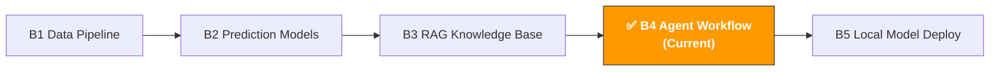

[🇨🇳 中文](../../paths/b-developers/b4-agent-workflow.md) | 🇺🇸 English

# B4. AI Agent & Workflow Automation

> **Path**: Path B: Developers · **Module**: B4
> **Last Updated**: 2026-03-12
> **Difficulty**: ⭐⭐⭐ Advanced
> **Prerequisites**: B1 Data Pipeline Basics (Python, File Processing), B3 RAG Fundamentals
> **Estimated Time**: 1 hour/day, 2-3 weeks
---

🏠 [Hub Home](../../README.md) · 📋 [Path B Overview](README.md)



---

## 📖 Module Navigation

1. [Agent Methodology](#1-agent-methodology) · 2. [Tool Landscape](#2-tool-landscape) · 3. [Hands-on Code](#3-hands-on-code) · 4. [E-commerce Agent Use Cases](#4-e-commerce-agent-use-cases) · 5. [Common Pitfalls](#5-common-pitfalls) · 6. [Advanced Techniques](#6-advanced-techniques) · 7. [Learning Resources](#7-learning-resources) · 8. [🦞 OpenClaw in Practice](#8-deploying-e-commerce-agents-with-openclaw) · 9. [Completion Checklist](#9-completion-checklist)


## What You'll Build in This Module

An AI Agent system — automatically executing multi-step operational tasks (e.g., daily data check → anomaly analysis → report generation → alert notification).

After completing this module, you'll be able to:
- Understand core Agent concepts: ReAct pattern, Tool Use, state management
- Distinguish between Agent, Chain, and RAG — three LLM application patterns — and know when to use each
- Build a tool-calling Agent with LangGraph
- Build an automated daily operations report Agent (collect data → analyze → generate report)
- Build an inventory alert Agent (monitor stock → forecast demand → send restock reminders)
- Build a Review monitoring Agent (monitor new reviews → sentiment analysis → negative review alerts)
- Use CrewAI for multi-Agent collaboration (data analyst + report writer + reviewer)
- Avoid common Agent development pitfalls: loops, cost overruns, hallucination propagation

---

## 1. Agent Methodology

> 📎 **Related Reading**: [A3 Advertising Optimization](../a-operators/a3-advertising.md#2-ai-tool-landscape-what-to-use-for-ads) — See A3 for business use cases of advertising monitoring automation. · [F4 Automation & Agents](../0-foundations/f4-agent-automation.md#f4-automation-ai-agents) — See F4 for foundational Agent theory
>
> 📎 **Toolbox**: [🔌 Awesome MCP & Agent Toolkit](../../docs/awesome-mcp-agents.md#awesome-mcp-servers-ai-agent-tools-awesome-mcp-agent-tools-for-e-commerce) — Complete list of e-commerce MCP Servers, Agent frameworks, and external resources

### 1.1 What Is an AI Agent

An AI Agent is an LLM application that can autonomously make decisions and execute multi-step tasks. Unlike a simple LLM call, an Agent can:

1. **Observe the environment**: Read data, call APIs, inspect files
2. **Reason and think**: Analyze the current state, decide what to do next
3. **Take action**: Call tools to complete specific tasks
4. **Iterate in a loop**: Decide whether to continue based on execution results

Core idea:

```
User instruction → Agent thinks → Selects tool → Executes tool → Observes result → Continues thinking or returns result
```

**An intuitive example**: You tell the Agent "Check today's sales data, and send an alert if there's an anomaly." The Agent will:
1. Call the data API to fetch today's sales data
2. Analyze the data, discover a 40% drop in sales for a particular SKU
3. Call an analysis tool to determine if it's an anomaly
4. Generate an alert report
5. Call an email tool to send the notification

Throughout this process, the Agent autonomously decides which tools to call and in what order — no if-else logic required from you.

### 1.2 Agent vs Chain vs RAG: Three Patterns Compared

This is the most frequently asked question. In short: RAG is "look it up," Chain is "follow the steps," Agent is "figure it out."

| Dimension | RAG | Chain | Agent |
|-----------|-----|-------|-------|
| Core Capability | Retrieve documents and answer questions | Execute predefined steps | Autonomous decision-making, dynamic tool selection |
| Decision Method | No decisions (retrieve → generate) | Fixed flow (step 1 → 2 → 3) | Dynamic decisions (next step based on results) |
| Best For | Knowledge Q&A, document queries | Fixed-process tasks (translate → proofread → format) | Multi-step, complex tasks requiring judgment |
| Tool Calling | None (retrieval + LLM only) | Limited (predefined tool chain) | Flexible (Agent chooses tools itself) |
| Complexity | Low | Medium | High |
| Controllability | High (predictable behavior) | High (fixed flow) | Medium (Agent may make unexpected decisions) |
| Cost | Low (1-2 LLM calls) | Medium (N LLM calls, N = number of steps) | High (uncertain number of LLM calls) |

**Decision Framework:**

```
What's your task?
├── Answer questions based on documents → RAG (see Module B3)
├── Fixed-step process automation → Chain
│   e.g.: Translate Listing → Proofread → Format → Output
├── Need to make judgments based on intermediate results → Agent
│   e.g.: Check data → Find anomaly → Decide whether to alert → Generate report
└── Not sure → Try Chain first (more controllable), upgrade to Agent if needed
```

> 💡 **Key Insight**: Don't use an Agent just for the sake of it. If your task flow is fixed (always A → B → C), a Chain is sufficient — simpler, cheaper, and more controllable. The value of an Agent lies in handling "uncertainty" — when you don't know what situations will arise mid-process and need AI to make judgment calls.

### 1.3 ReAct Pattern: The Core Thinking Framework for Agents

ReAct (Reasoning + Acting) is currently the most mainstream Agent design pattern. Core idea: have the LLM alternate between "thinking" and "acting."

```
Loop start:
  1. Thought: Analyze current state, decide next step
  2. Action: Call a tool
  3. Observation: Review the tool's returned result
  4. Return to step 1 until the task is complete
```

**ReAct Execution Example:**

```
User: Check the inventory status for ASIN B0XXXXX, and generate a restock suggestion if it's below safety stock.

Thought: I need to first query the current inventory data for this ASIN.
Action: call_tool("get_inventory", {"asin": "B0XXXXX"})
Observation: {"asin": "B0XXXXX", "current_stock": 45, "safety_stock": 100, "daily_sales": 15}

Thought: Current stock is 45, safety stock is 100, daily sales are 15. Stock is below the safety
         threshold, and at current sales rate it'll only last 3 days. I need to generate a restock suggestion.
Action: call_tool("calculate_reorder", {"asin": "B0XXXXX", "current": 45, "daily_sales": 15})
Observation: {"suggested_quantity": 500, "lead_time_days": 14, "urgency": "high"}

Thought: Restock suggestion generated — recommend ordering 500 units, 14-day lead time, high urgency.
         Task complete, let me summarize the results.
Final Answer: ASIN B0XXXXX Inventory Alert: Current stock 45 units, below safety stock of 100 units.
             At 15 units/day, only 3 days of stock remain. Recommend urgent restock of 500 units,
             estimated lead time 14 days.
```

### 1.4 Tool Use: The Agent's "Hands"

An Agent's core capability comes from tools. An Agent without tools is just a chatbot.

**What a tool really is**: A Python function + a description (telling the LLM what the tool does and what parameters it needs).

```python
# 工具定义示例
def get_inventory(asin: str) -> dict:
    """查询指定 ASIN 的库存状态。
    
    Args:
        asin: Amazon 产品标识符（如 B0XXXXX）
    
    Returns:
        包含 current_stock, safety_stock, daily_sales 的字典
    """
    # 实际实现：调用数据库或 API
    pass
```

The LLM reads the function's name, docstring, and parameter types to decide when and how to call the tool. So **the quality of your tool descriptions directly determines Agent performance**.

**Common Tool Types for E-commerce:**

| Tool Type | Examples | Purpose |
|-----------|----------|---------|
| Data Query | `get_sales_data`, `get_inventory` | Fetch operational data from databases/APIs |
| Data Analysis | `analyze_trend`, `detect_anomaly` | Perform statistical analysis on data |
| File Operations | `read_csv`, `write_report` | Read and write files |
| Notifications | `send_email`, `send_slack` | Send alerts and reports |
| External APIs | `search_amazon`, `get_reviews` | Call external services |
| Calculations | `calculate_roi`, `forecast_demand` | Execute business calculations |

### 1.5 When to Use an Agent vs a Simple Script

Agents aren't a silver bullet. Many scenarios can be solved with a simple Python script — no Agent needed.

| Scenario | Recommended Approach | Reason |
|----------|---------------------|--------|
| Run a report at a fixed time daily | Python script + cron | Fixed flow, no AI judgment needed |
| Data cleaning and format conversion | Python script | Clear rules, pandas is enough |
| Decide whether to alert based on data anomalies | Agent | Needs AI to judge "what counts as anomalous" |
| Analyze reviews and generate improvement suggestions | Agent | Needs AI to understand natural language |
| Multi-step tasks with human confirmation in between | Agent + Human-in-the-loop | Needs dynamic decisions + human review |
| Batch translate Listings | Chain (fixed flow) | Fixed steps: translate → proofread → format |
| Monitor competitor price changes and adjust strategy | Agent | Needs to analyze changes and make strategic judgments |

**Rule of thumb**: If you can write out all the logic branches with if-else, use a script. If there are too many branches or you need to "understand" natural language, use an Agent.

---

## 2. Tool Landscape

| Tool | Type | Difficulty | Best For | Installation |
|------|------|------------|----------|-------------|
| [LangGraph](https://langchain-ai.github.io/langgraph/) | Agent workflow orchestration | ⭐⭐ Intermediate | Building stateful Agent workflows | `pip install langgraph` |
| [CrewAI](https://docs.crewai.com/) | Multi-Agent collaboration | ⭐⭐ Intermediate | Multi-role collaborative tasks | `pip install crewai` |
| [n8n](https://n8n.io/) | Visual workflow | ⭐ Beginner | No-code/low-code automation | Docker deployment |
| [Streamlit](https://streamlit.io/) | Web interface | ⭐ Beginner | Quickly build Agent interaction UIs | `pip install streamlit` |
| [LangChain](https://python.langchain.com/) | LLM application framework | ⭐⭐ Intermediate | Agent tool chains, prompt management | `pip install langchain` |
| [OpenAI API](https://platform.openai.com/) | Cloud LLM | ⭐ Beginner | Highest quality reasoning | `pip install openai` |
| [Ollama](https://ollama.com/) | Local LLM | ⭐ Beginner | Data privacy, offline operation | [ollama.com/download](https://ollama.com/download) |

**Selection Guide:**
- Single Agent + tool calling → LangGraph (this module's main track)
- Multi-Agent collaboration → CrewAI (advanced section of this module)
- Don't want to write code → n8n (visual drag-and-drop)
- Add a web UI to your Agent → Streamlit

### 2.1 LangGraph vs CrewAI

| Dimension | LangGraph | CrewAI |
|-----------|-----------|--------|
| Positioning | Low-level Agent workflow orchestration | High-level multi-Agent collaboration framework |
| Flexibility | Very high (graph structure, fully customizable) | Medium (predefined role and task patterns) |
| Learning Curve | Steeper (need to understand graphs, states, edges) | Gentle (just define roles and tasks) |
| Best For | Complex workflows, fine-grained control needed | Multi-role collaboration, rapid prototyping |
| State Management | Built-in (TypedDict state) | Automatic |
| Human-in-the-loop | Native support | Supported |
| Community | LangChain ecosystem, very active | Fast-growing, friendly docs |

**Conclusion**: Start with CrewAI for learning (simpler), switch to LangGraph when you need fine-grained workflow control. This module covers both.

References: [LangGraph Official Docs](https://langchain-ai.github.io/langgraph/) | [CrewAI Official Docs](https://docs.crewai.com/)

### 2.2 n8n: No-Code Workflow Automation

[n8n](https://n8n.io/) is an open-source visual workflow automation platform. If you don't want to write code or want to quickly set up an automation flow, n8n is a great choice.

**n8n Advantages:**
- Drag-and-drop interface, no programming required
- 400+ built-in integrations (Gmail, Slack, Google Sheets, HTTP, etc.)
- AI node support (OpenAI, Anthropic)
- Self-hosted — data stays on your server
- Rich community templates

**E-commerce Automation Example (n8n workflow):**

```
Scheduled trigger (daily at 9:00 AM)
  → HTTP Request: Fetch sales data API
  → IF Node: Sales dropped > 20%?
    → Yes → OpenAI Node: Analyze causes
           → Slack Node: Send alert
    → No  → Google Sheets: Log daily data
```

> 💡 **n8n vs Code Agent**: n8n is great for fixed-process automation (similar to Chain), while code Agents are better for scenarios requiring dynamic decisions. The two can work together — n8n handles scheduled triggers and notifications, while the Agent handles intelligent analysis.

---

## 3. Hands-on Code

### 3.1 Minimal Agent: Building a Tool-Calling Agent with LangGraph

This is the simplest Agent you can write. Define a tool and let the LLM decide when to call it.

```python
# 最简 Agent — LangGraph + OpenAI
# 前提：pip install langgraph langchain-openai
# 环境变量：export OPENAI_API_KEY="sk-..."

from langchain_openai import ChatOpenAI
from langchain_core.tools import tool
from langgraph.prebuilt import create_react_agent

# 1. 定义工具
@tool
def get_sales_data(date: str) -> dict:
    """查询指定日期的销售数据汇总。
    
    Args:
        date: 日期，格式 YYYY-MM-DD
    
    Returns:
        包含 total_sales, total_orders, top_asin 的字典
    """
    # 模拟数据（实际场景替换为数据库查询或 API 调用）
    return {
        "date": date,
        "total_sales": 15230.50,
        "total_orders": 342,
        "top_asin": "B0XXXXX",
        "top_asin_sales": 3200.00,
        "yoy_change": -0.12,
    }

@tool
def detect_anomaly(metric: str, value: float, threshold: float) -> dict:
    """检测指标是否异常。
    
    Args:
        metric: 指标名称
        value: 当前值
        threshold: 异常阈值（变化百分比，如 -0.2 表示下降 20%）
    """
    is_anomaly = value < threshold
    return {
        "metric": metric,
        "value": value,
        "threshold": threshold,
        "is_anomaly": is_anomaly,
        "severity": "high" if value < threshold * 1.5 else "medium",
    }

# 2. 创建 Agent
llm = ChatOpenAI(model="gpt-4o-mini", temperature=0)
tools = [get_sales_data, detect_anomaly]
agent = create_react_agent(llm, tools)

# 3. 运行 Agent
result = agent.invoke({
    "messages": [("user", "查一下 2025-03-10 的销售数据，如果同比下降超过 10% 就告诉我")]
})

# 4. 输出结果
for msg in result["messages"]:
    if hasattr(msg, "content") and msg.content:
        print(f"[{msg.type}] {msg.content}")
```

**How the Agent executes:**
1. The LLM reads the user instruction and decides to call `get_sales_data` first
2. After getting the data, it finds `yoy_change = -0.12` (12% decline)
3. The LLM determines 12% > 10%, calls `detect_anomaly` to confirm the anomaly
4. Summarizes results and returns the alert

> ⚠️ **Note**: `create_react_agent` is a prebuilt ReAct Agent provided by LangGraph, suitable for rapid prototyping. For production environments, use a custom Graph for more control (see Section 3.2).

### 3.2 Daily Operations Report Agent: Auto Collect Data → Analyze → Generate Report

Real-world scenario: Automatically generate a daily operations report every morning, including sales overview, anomaly detection, and trend analysis.

```python
# 运营日报 Agent — 自定义 LangGraph 工作流
# pip install langgraph langchain-openai

import json
from datetime import datetime
from typing import TypedDict, Annotated
from langchain_openai import ChatOpenAI
from langchain_core.tools import tool
from langchain_core.messages import HumanMessage, SystemMessage
from langgraph.graph import StateGraph, END
from langgraph.graph.message import add_messages

# --- 工具定义 ---
@tool
def fetch_daily_sales(date: str) -> str:
    """获取指定日期的销售数据汇总。"""
    return json.dumps({
        "date": date,
        "summary": {"total_revenue": 45230.50, "total_orders": 1024,
                     "total_units": 1580, "avg_order_value": 44.17},
        "top_products": [
            {"asin": "B0AAAA", "name": "运动相机 X1", "units": 320, "revenue": 12800},
            {"asin": "B0BBBB", "name": "充电器 Pro", "units": 280, "revenue": 5600},
        ],
        "yoy_comparison": {"revenue_change": -0.08, "orders_change": -0.05},
    }, ensure_ascii=False)

@tool
def fetch_inventory_status() -> str:
    """获取当前库存状态，标记低库存 ASIN。"""
    return json.dumps({
        "low_stock_items": [
            {"asin": "B0AAAA", "current": 120, "safety": 200, "days_left": 3},
        ],
        "total_skus": 45, "healthy_skus": 44,
    }, ensure_ascii=False)

@tool
def fetch_review_alerts() -> str:
    """获取最近 24 小时的差评预警。"""
    return json.dumps({
        "new_negative_reviews": [
            {"asin": "B0BBBB", "rating": 1, "title": "充电速度太慢",
             "text": "买了两周就坏了，充电速度比宣传的慢很多"},
        ],
        "avg_rating_change": -0.1,
    }, ensure_ascii=False)

@tool
def generate_report(report_content: str) -> str:
    """将分析结果格式化为 Markdown 日报。"""
    today = datetime.now().strftime("%Y-%m-%d")
    report = f"# 运营日报 — {today}\n\n{report_content}\n\n---\n*AI Agent 自动生成*"
    return f"报告已生成，共 {len(report)} 字符"

# --- Agent 状态 ---
class DailyReportState(TypedDict):
    messages: Annotated[list, add_messages]
    sales_data: str
    inventory_data: str
    review_data: str
    report: str

llm = ChatOpenAI(model="gpt-4o-mini", temperature=0)

SYSTEM_PROMPT = """你是电商运营日报 Agent。收集数据后生成日报，包含：
- 销售概览（收入、订单、同比变化）
- 异常告警（库存不足、销量异常下降）
- Review 预警（新增差评及分析）
- 行动建议（2-3 条具体可执行的建议）
用中文输出，数据准确，建议具体。"""

def collect_data(state: DailyReportState) -> dict:
    """节点 1：收集所有数据源。"""
    today = datetime.now().strftime("%Y-%m-%d")
    return {
        "sales_data": fetch_daily_sales.invoke({"date": today}),
        "inventory_data": fetch_inventory_status.invoke({}),
        "review_data": fetch_review_alerts.invoke({}),
    }

def analyze_and_report(state: DailyReportState) -> dict:
    """节点 2：AI 分析数据并生成日报。"""
    messages = [
        SystemMessage(content=SYSTEM_PROMPT),
        HumanMessage(content=f"销售：{state['sales_data']}\n"
                     f"库存：{state['inventory_data']}\n"
                     f"Review：{state['review_data']}\n\n请生成运营日报。"),
    ]
    response = llm.invoke(messages)
    generate_report.invoke({"report_content": response.content})
    return {"report": response.content, "messages": [response]}

# --- 构建工作流图 ---
workflow = StateGraph(DailyReportState)
workflow.add_node("collect_data", collect_data)
workflow.add_node("analyze_and_report", analyze_and_report)
workflow.set_entry_point("collect_data")
workflow.add_edge("collect_data", "analyze_and_report")
workflow.add_edge("analyze_and_report", END)
app = workflow.compile()

# result = app.invoke({"messages": []})
# print(result["report"])
```

**Workflow Graph Structure:**

```
[collect_data] → [analyze_and_report] → END
     │                    │
     ├─ fetch_sales       ├─ LLM analysis
     ├─ fetch_inventory   └─ generate_report
     └─ fetch_reviews
```

> 💡 **Why use a custom Graph instead of create_react_agent?** `create_react_agent` lets the LLM decide the calling order, which suits exploratory tasks. But the daily report flow is deterministic (collect data first, then analyze), so a custom Graph is more controllable and efficient (fewer unnecessary LLM calls).

### 3.3 Inventory Alert Agent: Monitor Stock → Forecast Demand → Send Restock Reminders

Real-world scenario: Check all SKU inventory status daily, forecast future demand for low-stock items, and generate restock suggestions.

```python
# 库存预警 Agent — LangGraph 条件分支工作流
# pip install langgraph langchain-openai

import json
from typing import TypedDict, Annotated, Literal
from langchain_openai import ChatOpenAI
from langchain_core.tools import tool
from langchain_core.messages import HumanMessage, SystemMessage
from langgraph.graph import StateGraph, END
from langgraph.graph.message import add_messages

@tool
def check_all_inventory() -> str:
    """检查所有 SKU 的库存状态，返回低库存列表。"""
    return json.dumps({
        "total_skus": 45,
        "low_stock": [
            {"asin": "B0AAAA", "name": "运动相机 X1", "current": 80,
             "safety": 200, "daily_avg": 25, "days_left": 3.2},
        ],
        "out_of_stock_risk": [
            {"asin": "B0EEEE", "name": "镜头保护盖", "current": 10,
             "daily_avg": 8, "days_left": 1.25},
        ],
    }, ensure_ascii=False)

@tool
def forecast_demand(asin: str, days: int = 30) -> str:
    """预测指定 ASIN 未来 N 天的需求量。"""
    forecasts = {
        "B0AAAA": {"predicted_demand": 780, "confidence": 0.85, "trend": "stable"},
        "B0EEEE": {"predicted_demand": 250, "confidence": 0.82, "trend": "stable"},
    }
    result = forecasts.get(asin, {"predicted_demand": 500, "confidence": 0.7})
    result.update({"asin": asin, "forecast_days": days})
    return json.dumps(result, ensure_ascii=False)

@tool
def send_restock_alert(alert_content: str) -> str:
    """发送补货提醒（邮件/Slack/企业微信）。"""
    print(f"📧 发送补货提醒:\n{alert_content}")
    return "补货提醒已发送"

# --- 状态与节点 ---
class InventoryState(TypedDict):
    messages: Annotated[list, add_messages]
    inventory_data: str
    has_alerts: bool
    forecast_results: list[str]
    alert_content: str

llm = ChatOpenAI(model="gpt-4o-mini", temperature=0)

def check_inventory(state: InventoryState) -> dict:
    data = check_all_inventory.invoke({})
    parsed = json.loads(data)
    has_alerts = bool(parsed.get("low_stock") or parsed.get("out_of_stock_risk"))
    return {"inventory_data": data, "has_alerts": has_alerts}

def should_alert(state: InventoryState) -> Literal["forecast", "end"]:
    return "forecast" if state["has_alerts"] else "end"

def run_forecast(state: InventoryState) -> dict:
    parsed = json.loads(state["inventory_data"])
    all_items = parsed.get("low_stock", []) + parsed.get("out_of_stock_risk", [])
    results = [forecast_demand.invoke({"asin": item["asin"], "days": 30})
               for item in all_items]
    return {"forecast_results": results}

def generate_alert(state: InventoryState) -> dict:
    messages = [
        SystemMessage(content="你是库存管理专家。按紧急程度排序（🔴3天内断货 🟡7天内），"
                      "给出具体补货数量建议，考虑交期和预测需求。"),
        HumanMessage(content=f"库存：{state['inventory_data']}\n"
                     f"预测：{json.dumps(state['forecast_results'], ensure_ascii=False)}"),
    ]
    response = llm.invoke(messages)
    send_restock_alert.invoke({"alert_content": response.content})
    return {"alert_content": response.content, "messages": [response]}

# --- 构建工作流 ---
workflow = StateGraph(InventoryState)
workflow.add_node("check_inventory", check_inventory)
workflow.add_node("forecast", run_forecast)
workflow.add_node("generate_alert", generate_alert)
workflow.set_entry_point("check_inventory")
workflow.add_conditional_edges("check_inventory", should_alert,
                               {"forecast": "forecast", "end": END})
workflow.add_edge("forecast", "generate_alert")
workflow.add_edge("generate_alert", END)
inventory_agent = workflow.compile()

# result = inventory_agent.invoke({"messages": [], "forecast_results": []})
```

**Workflow Graph (with conditional branching):**

```
[check_inventory] → Has alerts? → Yes → [forecast] → [generate_alert] → END
                                → No  → END
```

> 💡 **The value of conditional branching**: When all inventory is healthy, the Agent finishes at the first step without wasting LLM calls. This is the advantage of a custom Graph over `create_react_agent` — precise flow control that avoids unnecessary API costs.

### 3.4 Review Monitoring Agent: Monitor New Reviews → Sentiment Analysis → Negative Review Alerts

Real-world scenario: Automatically check new reviews daily, perform sentiment analysis and categorization on negative reviews, and generate alert reports.

```python
# Review 监控 Agent — 结构与库存预警 Agent 类似
# pip install langgraph langchain-openai

import json
from typing import TypedDict, Annotated, Literal
from langchain_openai import ChatOpenAI
from langchain_core.tools import tool
from langchain_core.messages import HumanMessage, SystemMessage
from langgraph.graph import StateGraph, END
from langgraph.graph.message import add_messages

@tool
def fetch_new_reviews(hours: int = 24) -> str:
    """获取最近 N 小时的新增 Review。"""
    return json.dumps({
        "period": f"最近 {hours} 小时",
        "total_new": 15, "positive": 10, "neutral": 2, "negative": 3,
        "reviews": [
            {"asin": "B0AAAA", "rating": 1, "title": "质量太差",
             "text": "用了一周就坏了，镜头模糊，防水也不行"},
            {"asin": "B0AAAA", "rating": 2, "title": "电池不耐用",
             "text": "电池只能用 40 分钟，远低于宣传的 2 小时"},
            {"asin": "B0BBBB", "rating": 1, "title": "充电器发热严重",
             "text": "充电时非常烫手，担心安全问题"},
        ],
    }, ensure_ascii=False)

@tool
def analyze_review_sentiment(review_text: str) -> str:
    """对单条 Review 进行情感分析和问题分类。"""
    categories = []
    if any(w in review_text for w in ["坏", "broken", "defect"]):
        categories.append("产品质量")
    if any(w in review_text for w in ["电池", "battery", "续航"]):
        categories.append("电池续航")
    if any(w in review_text for w in ["热", "烫", "hot", "overheat"]):
        categories.append("安全隐患")
    return json.dumps({
        "sentiment": "negative",
        "categories": categories or ["其他"],
        "severity": "high" if "安全" in str(categories) else "medium",
    }, ensure_ascii=False)

# --- 工作流：与库存预警 Agent 结构相同 ---
# fetch_reviews → 有差评？ → Yes → analyze_reviews → generate_alert → END
#                           → No  → END

class ReviewState(TypedDict):
    messages: Annotated[list, add_messages]
    review_data: str
    has_negative: bool
    analysis_results: list[dict]
    alert_report: str

llm = ChatOpenAI(model="gpt-4o-mini", temperature=0)

def fetch_reviews(state: ReviewState) -> dict:
    data = fetch_new_reviews.invoke({"hours": 24})
    parsed = json.loads(data)
    return {"review_data": data, "has_negative": parsed.get("negative", 0) > 0}

def should_analyze(state: ReviewState) -> Literal["analyze", "end"]:
    return "analyze" if state["has_negative"] else "end"

def analyze_reviews(state: ReviewState) -> dict:
    parsed = json.loads(state["review_data"])
    results = []
    for review in [r for r in parsed["reviews"] if r["rating"] <= 2]:
        analysis = analyze_review_sentiment.invoke({"review_text": review["text"]})
        results.append({"review": review, "analysis": json.loads(analysis)})
    return {"analysis_results": results}

def generate_review_alert(state: ReviewState) -> dict:
    messages = [
        SystemMessage(content="你是电商 Review 分析专家。按问题类别汇总差评，"
                      "标注严重程度（🔴安全隐患 🟡质量问题 🔵体验问题），给出应对建议。"),
        HumanMessage(content=f"差评分析：{json.dumps(state['analysis_results'], ensure_ascii=False)}"),
    ]
    response = llm.invoke(messages)
    return {"alert_report": response.content, "messages": [response]}

workflow = StateGraph(ReviewState)
workflow.add_node("fetch_reviews", fetch_reviews)
workflow.add_node("analyze", analyze_reviews)
workflow.add_node("generate_alert", generate_review_alert)
workflow.set_entry_point("fetch_reviews")
workflow.add_conditional_edges("fetch_reviews", should_analyze,
                               {"analyze": "analyze", "end": END})
workflow.add_edge("analyze", "generate_alert")
workflow.add_edge("generate_alert", END)
review_agent = workflow.compile()

# result = review_agent.invoke({"messages": [], "analysis_results": []})
# print(result.get("alert_report", "无差评，一切正常 ✅"))
```

> 💡 **Safety hazards first**: The most important thing in Review monitoring is identifying safety-related negative reviews (e.g., "overheating," "electrical leak," "fire risk"). These issues can lead to product delisting or even recalls and must be treated with the highest priority.

### 3.5 Multi-Agent Collaboration (CrewAI): Data Analyst + Report Writer + Reviewer

CrewAI lets you define multiple Agent roles, each with their own expertise, collaborating to complete complex tasks.

```python
# 多 Agent 协作 — CrewAI
# pip install crewai crewai-tools

from crewai import Agent, Task, Crew, Process

# --- 定义 Agent 角色 ---
data_analyst = Agent(
    role="电商数据分析师",
    goal="从销售数据中发现趋势、异常和机会",
    backstory="你是有 5 年电商数据分析经验的专家，分析基于数据，不做无依据推测。",
    verbose=True, allow_delegation=False,
)

report_writer = Agent(
    role="运营报告撰写者",
    goal="将数据分析结果转化为清晰、可执行的运营报告",
    backstory="你是资深电商运营报告撰写者，报告结构清晰、重点突出、建议具体。",
    verbose=True, allow_delegation=False,
)

reviewer = Agent(
    role="报告审核者",
    goal="确保报告的数据准确性、逻辑一致性和建议可行性",
    backstory="你是严谨的报告审核者，检查数据准确性、结论依据和建议可行性。",
    verbose=True, allow_delegation=False,
)

# --- 定义任务 ---
sample_data = """2025年3月第一周：总收入 $312,500（同比-8%），总订单 7,200（同比-5%）
运动相机 X1: $125,000（同比-15%，库存告急）| 充电器 Pro: $45,000（同比+12%）
保护壳套装: $38,000（同比+25%，新品）| 广告 ACoS 22%（同比+3%）| 退货率 4.2%（+0.8%）"""

analyze_task = Task(
    description=f"分析以下销售数据，识别趋势和异常：\n{sample_data}\n"
                "要求：识别好/差产品、分析同比变化原因、标注异常指标。",
    expected_output="结构化的数据分析报告，包含趋势、异常和洞察",
    agent=data_analyst,
)

write_task = Task(
    description="基于分析结果撰写运营周报。结构：概览(3句)、指标表、产品分析、"
                "异常告警、行动建议(3-5条)。管理层能 2 分钟读完。",
    expected_output="完整的运营周报（Markdown 格式）",
    agent=report_writer,
)

review_task = Task(
    description="审核周报：检查数据准确性、逻辑一致性、建议可行性。"
                "有问题指出修改建议，没问题给出评分(1-10)。",
    expected_output="审核意见和最终评分",
    agent=reviewer,
)

# --- 组建团队并执行 ---
crew = Crew(
    agents=[data_analyst, report_writer, reviewer],
    tasks=[analyze_task, write_task, review_task],
    process=Process.sequential,  # 顺序执行：分析 → 撰写 → 审核
    verbose=True,
)

# result = crew.kickoff()
# print(result)
```

**Multi-Agent Collaboration Flow:**

```
[Data Analyst] → Analyze data, output insights
      ↓
[Report Writer] → Write report based on insights
      ↓
[Report Reviewer] → Review report, provide score and revision suggestions
```

> 💡 **Why use multiple Agents instead of one?** A single Agent doing analysis, writing, and reviewing simultaneously tends to "review its own work," resulting in lower quality. Splitting into multiple roles — each focused on their own task and keeping each other in check — produces better output. It's the same principle as real team collaboration.

---

## 4. E-commerce Agent Use Cases

### 4.1 Daily Report Automation

| Dimension | Details |
|-----------|---------|
| Trigger | Scheduled (daily at 9:00 AM) or manual |
| Data Sources | Sales API, inventory system, advertising backend |
| Agent Tasks | Collect data → Anomaly detection → Trend analysis → Generate report |
| Output | Markdown daily report + Email/Slack notification |
| Value | Saves 30-60 minutes of manual work daily |

### 4.2 Inventory Alerts

| Dimension | Details |
|-----------|---------|
| Trigger | Scheduled (twice daily) or inventory change triggered |
| Data Sources | Inventory system, sales data, supplier lead times |
| Agent Tasks | Check inventory → Forecast demand → Calculate restock quantity → Send reminders |
| Output | Restock suggestion report + Urgent alerts |
| Value | Reduces stockout risk, prevents lost sales from out-of-stock items |

### 4.3 Competitor Monitoring

| Dimension | Details |
|-----------|---------|
| Trigger | Scheduled (weekly) or price change triggered |
| Data Sources | Competitor listing data, price history, reviews |
| Agent Tasks | Scrape competitor data → Comparative analysis → Identify threats/opportunities → Generate report |
| Output | Competitor analysis report + Strategy recommendations |
| Value | Timely detection of competitor moves, quick strategy adjustments |

### 4.4 Customer Service Assistance

| Dimension | Details |
|-----------|---------|
| Trigger | Real-time (triggered by customer messages) |
| Data Sources | Product knowledge base (RAG), order system, policy documents |
| Agent Tasks | Understand customer issue → Search knowledge base → Query orders → Generate reply suggestion |
| Output | Customer service reply draft (sent after human confirmation) |
| Value | 3-5x faster response time, more consistent reply quality |

---

## 5. Common Pitfalls

### 5.1 Agent Infinite Loops

**Symptom**: The Agent repeatedly calls the same tool, or keeps switching back and forth between two tools, never finishing.

**Causes**:
- Tool results aren't clear enough — the LLM can't tell if the task is complete
- Tool descriptions are unclear — the LLM misunderstands the tool's purpose
- No maximum iteration limit set

**Solutions**:

```python
# 方案 1：设置最大迭代次数
result = agent.invoke(
    {"messages": [("user", "你的指令")]},
    config={"recursion_limit": 10},  # 最多 10 轮
)

# 方案 2：在工具描述中明确"完成条件"
@tool
def check_status(task_id: str) -> str:
    """检查任务状态。返回 'completed' 表示任务已完成，无需再调用。"""
    pass
```

### 5.2 Tool Call Failures

**Symptom**: The Agent passes incorrect parameter formats when calling tools, or tools throw exceptions that crash the entire flow.

**Solution**: Tools should never throw exceptions — instead, return error message strings. Let the Agent decide how to handle it (retry, change parameters, skip).

```python
@tool
def get_sales_data(date: str) -> str:
    """查询销售数据。日期格式必须是 YYYY-MM-DD。"""
    try:
        from datetime import datetime
        datetime.strptime(date, "%Y-%m-%d")
        return json.dumps({"date": date, "total_sales": 15000})
    except ValueError:
        return json.dumps({"error": f"日期格式错误: {date}，请使用 YYYY-MM-DD"})
    except Exception as e:
        return json.dumps({"error": f"查询失败: {str(e)}"})
```

### 5.3 Cost Overruns

**Symptom**: A single Agent run costs $5 because the LLM was called 50 times.

**Causes**:
- Too many Agent loop iterations
- Using expensive models (GPT-4o) for simple tasks
- Tools returning large amounts of data, all sent to the LLM each time

**Solutions**:

| Strategy | Approach | Savings |
|----------|----------|---------|
| Tiered models | Use GPT-4o-mini for simple judgments, GPT-4o for complex analysis | 50-80% |
| Limit iterations | Set recursion_limit | Prevents runaway costs |
| Data trimming | Have tools return summaries instead of full data | 30-50% |
| Fixed flows | Use Chain instead of Agent when possible | 60-80% |

```python
# 成本控制示例：模型分级
cheap_llm = ChatOpenAI(model="gpt-4o-mini", temperature=0)  # $0.15/1M tokens
expensive_llm = ChatOpenAI(model="gpt-4o", temperature=0)    # $2.50/1M tokens

# 数据收集和简单判断用便宜模型
# 最终报告生成用贵模型
```

### 5.4 Hallucination Propagation

**Symptom**: The Agent produces incorrect information in step one, and subsequent steps continue reasoning based on that error, making the final output completely unreliable.

**Solutions**:
1. **Validate each step**: Add data validation nodes after critical steps
2. **Cite sources**: Require the Agent to cite data sources in its responses
3. **Human-in-the-loop**: Pause before critical decisions, wait for human confirmation
4. **Lower temperature**: `temperature=0` reduces creative improvisation

---

## 6. Advanced Techniques

### 6.1 Human-in-the-loop: Waiting for Human Confirmation Before Critical Decisions

Some decisions can't be fully delegated to AI — like sending customer emails, adjusting prices, or submitting restock orders. Human-in-the-loop lets the Agent pause at critical nodes and wait for human confirmation.

```python
# Human-in-the-loop — LangGraph interrupt
from langgraph.graph import StateGraph, END
from langgraph.checkpoint.memory import MemorySaver
from typing import TypedDict, Annotated
from langgraph.graph.message import add_messages

class ApprovalState(TypedDict):
    messages: Annotated[list, add_messages]
    action: str
    approved: bool

def propose_action(state: ApprovalState) -> dict:
    return {"action": "建议对 ASIN B0AAAA 紧急补货 500 件，预计费用 $12,500"}

def execute_action(state: ApprovalState) -> dict:
    print(f"✅ 执行: {state['action']}")
    return {"messages": [("assistant", f"已执行: {state['action']}")]}

def check_approval(state: ApprovalState) -> str:
    return "execute" if state.get("approved") else "end"

workflow = StateGraph(ApprovalState)
workflow.add_node("propose", propose_action)
workflow.add_node("execute", execute_action)
workflow.set_entry_point("propose")
workflow.add_conditional_edges("propose", check_approval,
                               {"execute": "execute", "end": END})
workflow.add_edge("execute", END)

memory = MemorySaver()
app = workflow.compile(checkpointer=memory, interrupt_before=["execute"])

# 第一次运行：Agent 提出建议，在 execute 前暂停
# config = {"configurable": {"thread_id": "approval-1"}}
# result = app.invoke({"messages": [], "approved": False}, config)
# 人工确认后继续：
# app.update_state(config, {"approved": True})
# result = app.invoke(None, config)
```

> 💡 **When you need Human-in-the-loop**: Whenever money is involved (restocking, ad budget adjustments), customer communication (sending emails), or irreversible operations (deleting data), always add human confirmation.

### 6.2 Agent Memory: Maintaining Context Across Sessions

By default, an Agent is "amnesiac" — it forgets everything between runs. Use LangGraph's `MemorySaver` to maintain context across sessions:

```python
from langgraph.checkpoint.memory import MemorySaver
from langgraph.prebuilt import create_react_agent
from langchain_openai import ChatOpenAI

memory = MemorySaver()
agent = create_react_agent(ChatOpenAI(model="gpt-4o-mini"), tools=[], checkpointer=memory)

config = {"configurable": {"thread_id": "session-001"}}
# 第一次：agent.invoke({"messages": [("user", "主力产品是运动相机 X1")]}, config)
# 第二次：agent.invoke({"messages": [("user", "查一下主力产品库存")]}, config)
# Agent 记得"主力产品是运动相机 X1"
```

### 6.3 Multimodal Agent: Processing Images and Files

A multimodal Agent can analyze product images, competitor screenshots, and more. Using GPT-4o's vision capabilities:

```python
from langchain_openai import ChatOpenAI
from langchain_core.messages import HumanMessage
import base64

def analyze_product_image(image_path: str) -> str:
    """用 GPT-4o 分析产品图片，提取卖点和改进建议。"""
    llm = ChatOpenAI(model="gpt-4o", temperature=0)
    with open(image_path, "rb") as f:
        image_data = base64.b64encode(f.read()).decode("utf-8")
    
    message = HumanMessage(content=[
        {"type": "text", "text": "分析产品图片：1)主要卖点 2)图片质量评估 3)改进建议"},
        {"type": "image_url",
         "image_url": {"url": f"data:image/jpeg;base64,{image_data}"}},
    ])
    return llm.invoke([message]).content
```

---

## 7. Learning Resources

| Resource | Type | Description | Link |
|----------|------|-------------|------|
| AI Agents in LangGraph | Free Short Course | By DeepLearning.AI, LangGraph introduction | [deeplearning.ai](https://www.deeplearning.ai/short-courses/ai-agents-in-langgraph/) |
| Multi AI Agent Systems with crewAI | Free Short Course | By DeepLearning.AI, CrewAI multi-Agent | [deeplearning.ai](https://www.deeplearning.ai/short-courses/multi-ai-agent-systems-with-crewai/) |
| HuggingFace AI Agents Course | Free Course | Systematic Agent course | [huggingface.co](https://huggingface.co/learn/agents-course) |
| LangGraph Official Docs | Documentation | The most authoritative LangGraph reference | [langchain-ai.github.io](https://langchain-ai.github.io/langgraph/) |
| CrewAI Official Docs | Documentation | Complete CrewAI framework documentation | [docs.crewai.com](https://docs.crewai.com/) |
| n8n Official Docs | Documentation | Visual workflow platform | [n8n.io](https://n8n.io/) |
| Streamlit Official Docs | Documentation | Quickly build web interfaces | [streamlit.io](https://streamlit.io/) |

**Recommended Learning Path:**
1. Start with DeepLearning.AI's LangGraph short course (2 hours, build foundational concepts)
2. Follow this module's hands-on code exercises (3.1 → 3.2 → 3.3)
3. Try CrewAI multi-Agent collaboration (3.5)
4. Take the HuggingFace Agent Course for deeper understanding of principles

---

## 8. Deploying E-commerce Agents with OpenClaw

### 8.1 Scenario: Building a Multi-Skill E-commerce Operations Agent with OpenClaw

```
You tell OpenClaw:
"Build me a fully automated e-commerce operations Agent
that can monitor sales data, analyze competitors, manage inventory, and handle customer service"

OpenClaw automatically:
1. Installs OpenClaw locally/on server
2. Configures LLM (Claude/GPT/Ollama)
3. Installs e-commerce-related Skills (google-sheets, slack, web-search)
4. Configures MCP Servers (filesystem, fetch, sqlite)
5. Receives operational commands via WhatsApp/Telegram
6. Agent executes autonomously and reports results
```

### 8.2 Required Skills and MCP Servers

| Component | Purpose | Link |
|-----------|---------|------|
| **google-sheets** Skill | Read/write operational data | [ClawHub](https://clawhub.ai/) |
| **slack** Skill | Alerts and reporting | [ClawHub](https://clawhub.ai/) |
| **web-search** Skill | Competitor monitoring | [ClawHub](https://clawhub.ai/) |
| **memory** Skill | Store operational knowledge | [OpenClaw Docs](https://docs.openclaw.com/) |
| **filesystem MCP** | Read/write local data | [MCP Filesystem](https://github.com/modelcontextprotocol/servers/tree/main/src/filesystem) |
| **fetch MCP** | Call external APIs | [MCP Fetch](https://github.com/modelcontextprotocol/servers/tree/main/src/fetch) |
| **sqlite MCP** | Local database | [MCP SQLite](https://github.com/modelcontextprotocol/servers/tree/main/src/sqlite) |

### 8.3 Related Resources

| Resource | Description | Link |
|----------|-------------|------|
| OpenClaw Official Docs | Installation and configuration guide | [docs.openclaw.com](https://docs.openclaw.com/) |
| ClawHub Skills Marketplace | Search and install Agent Skills | [clawhub.ai](https://clawhub.ai/) |
| OpenClaw MCP Integration | Connect MCP Servers | [Build Skill with MCP](https://rebeccamdeprey.com/blog/build-openclaw-skill-with-mcp) |
| F4 Automation & Agents | Agent foundations module | [F4 Module](../0-foundations/f4-agent-automation.md) |
| OpenClaw Complete Setup Guide | 25 Tools + 53 Skills | [Setup Guide](https://yu-wenhao.com/en/blog/openclaw-tools-skills-tutorial) |

Content rephrased for compliance with licensing restrictions. Sources cited inline.

---

## 9. Completion Checklist

- [ ] Understand the differences between Agent vs Chain vs RAG, and can explain when to use each
- [ ] Build a minimal tool-calling Agent with LangGraph (3.1)
- [ ] Build a daily operations report Agent or inventory alert Agent (3.2 or 3.3)
- [ ] Build a Review monitoring Agent (3.4)
- [ ] Implement a multi-Agent collaboration task with CrewAI (3.5)
- [ ] Deploy an automated operations monitoring Agent (combining 3.2-3.4)

---

## 10. Appendix

### 9.1 Agent Architecture Quick Reference

```
┌─────────────────────────────────────────────┐
│                  AI Agent                    │
│                                             │
│  ┌─────────┐    ┌──────────┐    ┌────────┐ │
│  │  LLM    │───▶│ Reasoning │───▶│ Tools  │ │
│  │ (Brain) │◀───│  Engine   │◀───│(Hands) │ │
│  │         │    │ (ReAct)   │    │        │ │
│  └─────────┘    └──────────┘    └────────┘ │
│       │              │              │       │
│       ▼              ▼              ▼       │
│  ┌─────────┐    ┌──────────┐    ┌────────┐ │
│  │ Memory  │    │  State    │    │  Env   │ │
│  │         │    │ Manager   │    │ (APIs) │ │
│  └─────────┘    └──────────┘    └────────┘ │
└─────────────────────────────────────────────┘
```

### 9.2 Code Quick Reference

| Task | Code |
|------|------|
| Install LangGraph | `pip install langgraph langchain-openai` |
| Install CrewAI | `pip install crewai crewai-tools` |
| Create minimal Agent | `create_react_agent(llm, tools)` |
| Define a tool | `@tool` decorator + docstring |
| Custom workflow | `StateGraph` + `add_node` + `add_edge` |
| Conditional branching | `add_conditional_edges(node, func, mapping)` |
| Set iteration limit | `config={"recursion_limit": 10}` |
| Add memory | `MemorySaver()` + `checkpointer=memory` |
| Human-in-the-loop | `interrupt_before=["node_name"]` |
| CrewAI define role | `Agent(role=..., goal=..., backstory=...)` |
| CrewAI define task | `Task(description=..., agent=...)` |
| CrewAI assemble team | `Crew(agents=[...], tasks=[...])` |

### 9.3 Cost Estimation Reference

| Scenario | Model | LLM Calls per Run | Estimated Cost |
|----------|-------|-------------------|----------------|
| Daily Report Agent | GPT-4o-mini | 2-3 calls | ~$0.01 |
| Inventory Alert Agent | GPT-4o-mini | 2-5 calls | ~$0.02 |
| Review Monitoring Agent | GPT-4o-mini | 3-6 calls | ~$0.03 |
| Multi-Agent Collaboration (CrewAI) | GPT-4o-mini | 6-10 calls | ~$0.05 |
| Multi-Agent Collaboration (CrewAI) | GPT-4o | 6-10 calls | ~$0.50 |

> 💡 **Cost control tip**: GPT-4o-mini is sufficient for routine monitoring Agents. Only use GPT-4o when deep analysis is needed (e.g., competitor strategy analysis, complex report generation).
---

---
> 🏠 [Hub Home](../../README.md) · 📋 [Path B Overview](README.md)
> 
> **Path B**: [B1 Data](b1-data-pipeline.md) · [B2 Prediction](b2-prediction-models.md) · [B3 RAG](b3-rag-knowledge-base.md) · [B4 Agent](b4-agent-workflow.md) · [B5 Deploy](b5-local-model-deploy.md)
> 
> **Quick Jump**: [Path 0 Foundations](../0-foundations/) · [Path A Operations](../a-operators/) · [Path C Management](../c-managers/) · [Path D Multi-Platform](../d-platforms/) · [Path E Social Media](../e-social-media/)
