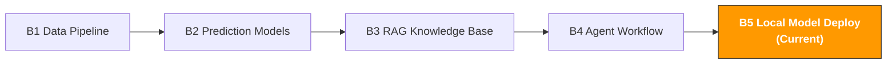

[🇨🇳 中文](../../paths/b-developers/b5-local-model-deploy.md) | 🇺🇸 English

# B5. Local Model Deployment & Fine-tuning

> **Path**: Path B: Developers · **Module**: B5
> **Last Updated**: 2026-03-12
> **Difficulty**: Advanced
> **Prerequisites**: B1 Data Pipeline Basics (Python), B3 RAG Fundamentals, B4 Agent Basics
> **Estimated Time**: 1 hour/day, 3-4 weeks
---

[Hub Home](../../README.md) · [Path B Overview](README.md)



---

## Module Navigation

1. [Local Deployment Methodology](#1-local-deployment-methodology) · 2. [Tool Landscape](#2-tool-landscape) · 3. [Hands-on Code](#3-hands-on-code) · 4. [Hardware Buying Guide](#4-hardware-buying-guide) · 5. [Common Pitfalls](#5-common-pitfalls) · 6. [Advanced Techniques](#6-advanced-techniques) · 7. [Learning Resources](#7-learning-resources) · 8. [ OpenClaw Local Deployment](#8-building-a-local-agent-with-openclaw--ollama) · 9. [Completion Checklist](#9-completion-checklist)


## What You'll Build in This Module

A local AI service run LLMs on your own machine to protect business data privacy; fine-tune models with LoRA to adapt them for e-commerce scenarios.

After completing this module, you'll be able to:
- Understand why you'd deploy LLMs locally, and when to choose local vs cloud
- Run open-source models like Qwen2.5, Llama 3.1, and Mistral locally with a single Ollama command
- Choose the right model based on task requirements (Chinese capability, coding ability, reasoning ability)
- Call local Ollama models from Python and integrate them into existing workflows
- Build a fully local RAG system (data never leaves your machine)
- Fine-tune models with LoRA/QLoRA to turn general-purpose models into e-commerce experts
- Deploy high-performance inference services with vLLM (supporting concurrent requests)
- Understand quantization techniques (GGUF/GPTQ/AWQ) to run larger models on limited hardware
- Choose the right hardware based on your budget (Mac M-series / NVIDIA GPU / Cloud GPU)

---

## 1. Local Deployment Methodology

> **Related Reading**: [B3 RAG Knowledge Base System](b3-rag-knowledge-base.md#b3-rag-knowledge-base-system) RAG systems can serve as a lightweight alternative to model fine-tuning, see B3. · [F1 The Evolution of AI](../0-foundations/f1-ai-evolution.md#f1-the-evolution-of-ai) See F1 for AI model evolution

### 1.1 Why Run LLMs Locally

E-commerce data contains a wealth of trade secrets: product costs, supplier information, sales figures, profit margins, customer data. Sending this data to OpenAI/Claude servers carries data leakage risks.

Core value of local deployment:

| Value | Description |
|-------|-------------|
| Data Privacy | All data processed on your machine, never passes through any third-party server |
| Zero API Cost | No per-token billing run as many times as you want for free (just electricity) |
| Offline Availability | No network dependency works on airplanes, when VPN is down |
| Low Latency | No network delay for local inference, ideal for real-time applications |
| Full Control | Model version, parameters, and behavior are entirely under your control no surprise updates from providers |
| Compliance Friendly | Meets data localization requirements, suitable for enterprises with compliance constraints |

**A real-world scenario**: You need AI to analyze 1,000 customer reviews and extract product improvement directions.
- Using OpenAI API: 1,000 reviews × ~200 tokens avg = 200k tokens, cost ~$0.03 (cheap), but data is sent to OpenAI's servers
- Using local Ollama: Zero cost, data stays on your machine, but inference takes longer

### 1.2 Cloud vs Local: Decision Framework

Not every scenario is suited for local deployment. The key is balancing data privacy, cost, quality, and speed.

```
What's your scenario?
Data contains trade secrets (costs, margins, suppliers) → Local deployment
Need highest quality reasoning (complex analysis, creative writing) → Cloud API (GPT-4o/Claude)
High-frequency calls (10,000+/day) → Local deployment (significant cost advantage)
Occasional use (dozens of calls/day) → Cloud API (saves maintenance overhead)
Need offline access → Local deployment
Team sharing across multiple users → vLLM local service or Cloud API
Not sure → Start with Cloud API to validate needs, migrate to local once confirmed
```

**Detailed Comparison:**

| Dimension | Local Deployment | Cloud API |
|-----------|-----------------|-----------|
| Data Privacy | Data never leaves your machine | Data sent to third-party servers |
| Inference Quality | 7B models ≈ GPT-3.5 level, 70B approaches GPT-4 | GPT-4o/Claude 3.5 highest quality |
| Cost (Low Volume) | High hardware investment, free to use | Pay per token, low total cost |
| Cost (High Volume) | One-time hardware investment, free long-term | Cost scales linearly with usage |
| Latency | Depends on hardware (M4 Pro ≈ 40 tokens/s) | Network latency + inference latency |
| Offline Use | Fully offline | Requires network |
| Maintenance | You manage models, updates, hardware | Zero maintenance |
| Scalability | Limited by local hardware | Unlimited scaling |

> **Rule of thumb**: If your data isn't sensitive and call volume is low, Cloud API is the easiest option. If data is sensitive or call volume is high (monthly API costs > $50), seriously consider local deployment.

### 1.3 Hardware Requirements Quick Reference

Minimum hardware requirements for running local LLMs depend on model size:

| Model Size | Min Memory/VRAM | Recommended Hardware | Inference Speed Reference |
|------------|----------------|---------------------|--------------------------|
| 1-3B (small) | 4GB RAM | Any modern computer | 50-80 tokens/s |
| 7-8B (mainstream) | 8GB RAM | Mac M1 8GB / RTX 3060 | 20-40 tokens/s |
| 13-14B | 16GB RAM | Mac M2 Pro 16GB / RTX 4070 | 15-25 tokens/s |
| 32-34B | 32GB RAM | Mac M3 Pro 36GB / RTX 4090 | 8-15 tokens/s |
| 70B (large) | 48GB+ RAM | Mac M3 Max 64GB / 2×RTX 4090 | 5-10 tokens/s |

> **Key concept**: Model parameter count (e.g., 7B = 7 billion parameters) determines memory requirements. After quantization (e.g., Q4_K_M), a 7B model takes up roughly 4-5GB of memory. See Section 7 for quantization details.

---

## 2. Tool Landscape

| Tool | Type | Difficulty | Best For | Link |
|------|------|------------|----------|------|
| [Ollama](https://ollama.com/) | Local LLM runner | Beginner | One-command local model running, dev & testing | [ollama.com](https://ollama.com/) |
| [vLLM](https://github.com/vllm-project/vllm) | High-performance inference engine | Advanced | Production environments, high concurrency, multi-user sharing | [GitHub](https://github.com/vllm-project/vllm) |
| [llama.cpp](https://github.com/ggerganov/llama.cpp) | C++ inference engine | Intermediate | Maximum performance optimization, CPU inference | [GitHub](https://github.com/ggerganov/llama.cpp) |
| [PEFT/LoRA](https://huggingface.co/docs/peft) | Parameter-efficient fine-tuning | Intermediate | Fine-tune models with small datasets | [HuggingFace](https://huggingface.co/docs/peft) |
| [Unsloth](https://github.com/unslothai/unsloth) | Fast fine-tuning framework | Intermediate | 2x faster fine-tuning, half the VRAM | [GitHub](https://github.com/unslothai/unsloth) |
| [HuggingFace Hub](https://huggingface.co/) | Model repository | Beginner | Download open-source models and datasets | [huggingface.co](https://huggingface.co/) |
| [LM Studio](https://lmstudio.ai/) | Desktop LLM app | Beginner | GUI interface for running local models | [lmstudio.ai](https://lmstudio.ai/) |

**Selection Guide:**
- Personal development, quick experiments → Ollama (this module's main track)
- Production environment, multi-user sharing → vLLM
- Maximum performance optimization, embedded devices → llama.cpp
- Fine-tuning models → Unsloth (faster) or PEFT (more flexible)
- Don't want to write code, prefer GUI → LM Studio
- Download models and datasets → HuggingFace Hub

### 2.1 Ollama vs vLLM vs llama.cpp

| Dimension | Ollama | vLLM | llama.cpp |
|-----------|--------|------|-----------|
| Positioning | Developer-friendly local LLM runner | High-performance production inference engine | Low-level C++ inference library |
| Ease of Use | Minimal (one command) | Requires configuration | Requires compilation |
| Performance | Good (uses llama.cpp under the hood) | Best (PagedAttention) | Excellent (manual optimization) |
| Concurrency | Limited (optimized for single user) | Excellent (production-grade concurrency) | DIY implementation needed |
| GPU Support | Metal (Mac) / CUDA | CUDA (primarily) | Metal / CUDA / CPU |
| API Compatibility | OpenAI-compatible API | OpenAI-compatible API | Needs additional wrapping |
| Model Format | GGUF (auto-download) | HuggingFace native | GGUF |
| Best For | Dev & testing, personal use | Team sharing, production deployment | Embedded, maximum optimization |

**Conclusion**: Start with Ollama for learning (simplest), switch to vLLM when serving multiple users, use llama.cpp when you need maximum performance. This module focuses on Ollama as the main track, with vLLM as the advanced option.

References: [Ollama Official Docs](https://ollama.com/) | [vLLM Official Docs](https://docs.vllm.ai/) | [llama.cpp GitHub](https://github.com/ggerganov/llama.cpp)

### 2.2 HuggingFace: The GitHub of Open-Source Models

[HuggingFace](https://huggingface.co/) is the largest hub for open-source AI models think of it as GitHub for the AI world. Nearly all open-source LLMs are published on HuggingFace.

**HuggingFace Core Features:**
- **Models Hub**: Download open-source models (Qwen, Llama, Mistral, etc.)
- **Datasets Hub**: Download training datasets
- **Spaces**: Try model demos online
- **Transformers Library**: The standard Python library for loading and using models

**Common Operations for E-commerce Developers:**

```bash
# 安装 HuggingFace 工具
pip install transformers huggingface_hub

# 下载模型到本地
huggingface-cli download Qwen/Qwen2.5-7B-Instruct --local-dir ./models/qwen2.5-7b

# 搜索模型
huggingface-cli search models --query "e-commerce chinese"
```

> **Ollama vs HuggingFace directly**: Ollama handles all the details of model downloading, quantization, and running one command and you're done. Using the HuggingFace Transformers library directly gives you more flexibility, but you need to manage GPU memory, quantization, and inference optimization yourself. Start with Ollama, switch to HuggingFace when you need fine-grained control.

---

## 3. Hands-on Code

### 3.1 Ollama Quick Start: Run a Local LLM with One Command

Ollama is currently the simplest way to run LLMs locally. Install it and you're one command away from running a model.

**Install Ollama:**

```bash
# macOS 从官网下载安装包
# 访问 https://ollama.com/download 下载 macOS 版本
# 或用 Homebrew：
brew install ollama

# Linux
curl -fsSL https://ollama.com/install.sh | sh

# Windows 从官网下载安装包
# 访问 https://ollama.com/download 下载 Windows 版本

# 验证安装
ollama --version
```

**Download and Run Models:**

```bash
# 下载并运行 Qwen2.5 7B（推荐：中英文都好）
ollama run qwen2.5:7b

# 下载并运行 Llama 3.1 8B（Meta 开源，英文优秀）
ollama run llama3.1:8b

# 下载并运行 Mistral 7B（欧洲团队，代码能力强）
ollama run mistral:7b

# 查看已下载的模型
ollama list

# 删除不需要的模型（释放磁盘空间）
ollama rm mistral:7b
```

After running `ollama run`, you'll enter an interactive chat interface where you can talk directly with the model:

```
>>> Help me analyze the competitive landscape for action cameras in the US market
The competitive landscape for action cameras in the US market can be analyzed
across several dimensions:

1. Market structure: GoPro remains the market leader, but its share is being
steadily eroded...
2. Price segments: $100-200 entry-level, $200-400 mid-range, $400+ premium...
3. New entrants: Insta360, DJI Action, and other brands are growing rapidly...
...

>>> /bye # Exit the chat
```

> **How Ollama works**: Under the hood, Ollama uses llama.cpp for inference and automatically detects your hardware (Mac Metal GPU / NVIDIA CUDA) to choose the optimal inference method. Model files are stored in the `~/.ollama/models/` directory.

### 3.2 Model Selection Guide: Qwen2.5 vs Llama 3.1 vs Mistral

Choosing the right model matters more than choosing the right framework. Different models perform very differently across tasks.

**Mainstream Open-Source Model Comparison:**

| Model | Parameters | Chinese | English | Coding | Reasoning | Recommended For |
|-------|-----------|---------|---------|--------|-----------|-----------------|
| Qwen2.5 | 0.5B-72B | Best | Excellent | Excellent | Excellent | Top pick for Chinese e-commerce |
| Llama 3.1 | 8B-405B | Good | Best | Excellent | Excellent | English-primary scenarios |
| Mistral | 7B-8x22B | Good | Excellent | Best | Good | Code generation, technical docs |
| Gemma 2 | 2B-27B | Good | Excellent | Good | Good | Lightweight, mobile |
| Phi-3 | 3.8B-14B | Fair | Excellent | Excellent | Excellent | Small model, high performance |
| DeepSeek-V2 | 16B-236B | Excellent | Excellent | Best | Excellent | Code and math reasoning |

**E-commerce Recommendations:**

```
What's your primary language?
Primarily Chinese (Chinese sellers, Chinese reviews) → Qwen2.5:7b
Primarily English (US market, English listings) → Llama3.1:8b
Mixed Chinese/English → Qwen2.5:7b (strong in both)
Need to write code/data analysis → DeepSeek-Coder or Qwen2.5-Coder

What's your hardware?
8GB RAM (Mac M1/M2 base model) → 7B models (qwen2.5:7b)
16GB RAM → 7B or 14B models
32GB+ RAM → Can try 32B models
64GB+ RAM → 70B models (approaching GPT-4 level)
```

**Ollama Model Download Commands:**

```bash
# 电商中文场景首选
ollama pull qwen2.5:7b

# 英文场景 / Meta 生态
ollama pull llama3.1:8b

# 代码生成
ollama pull qwen2.5-coder:7b

# 轻量级（笔记本也能跑）
ollama pull qwen2.5:3b
ollama pull phi3:3.8b

# Embedding 模型（用于 RAG）
ollama pull nomic-embed-text
ollama pull bge-large:latest
```

### 3.3 Ollama + Python: Integrating into Existing Workflows

Ollama provides an OpenAI-compatible REST API that can be called from any HTTP client. There's also an official Python library.

**Method 1: Using the ollama Python library (simplest)**

```python
# pip install ollama

import ollama

def analyze_review(review_text: str, model: str = "qwen2.5:7b") -> str:
"""用本地 LLM 分析客户 Review，提取产品改进方向。"""
response = ollama.chat(
model=model,
messages=[
{
"role": "system",
"content": "你是电商产品分析专家。分析客户 Review，提取：\n"
"1. 核心问题（一句话）\n"
"2. 问题类别（质量/功能/物流/价格/其他）\n"
"3. 改进建议\n"
"用中文回答，简洁明了。",
},
{"role": "user", "content": f"请分析这条 Review：\n{review_text}"},
],
options={"temperature": 0.1}, # 低温度，更确定性的输出
)
return response["message"]["content"]

def batch_analyze_reviews(reviews: list[str], model: str = "qwen2.5:7b") -> list[dict]:
"""批量分析 Review 列表。"""
results = []
for i, review in enumerate(reviews):
print(f"分析 Review {i+1}/{len(reviews)}...")
analysis = analyze_review(review, model)
results.append({"review": review, "analysis": analysis})
return results

# 使用示例
# reviews = [
# "用了一周就坏了，镜头模糊，防水也不行",
# "电池只能用 40 分钟，远低于宣传的 2 小时",
# "画质很好，但是 App 太难用了，经常闪退",
# ]
# results = batch_analyze_reviews(reviews)
# for r in results:
# print(f"Review: {r['review'][:30]}...")
# print(f"分析: {r['analysis']}\n")
```

**Method 2: Using the OpenAI-compatible API (seamless cloud/local switching)**

Ollama provides an OpenAI-compatible API endpoint, meaning you can use the `openai` Python library to call local models directly with almost no code changes.

```python
# pip install openai
# 前提：Ollama 正在运行（ollama serve）

from openai import OpenAI

# 指向本地 Ollama 服务（而非 OpenAI 服务器）
client = OpenAI(
base_url="http://localhost:11434/v1",
api_key="ollama", # Ollama 不需要真实 API key
)

def generate_listing(product_info: str, model: str = "qwen2.5:7b") -> str:
"""用本地 LLM 生成产品 Listing。"""
response = client.chat.completions.create(
model=model,
messages=[
{
"role": "system",
"content": "你是 Amazon Listing 优化专家。根据产品信息生成：\n"
"1. 标题（含核心关键词，<200 字符）\n"
"2. 5 个 Bullet Points\n"
"3. 产品描述（<2000 字符）\n"
"用英文输出，符合 Amazon 风格指南。",
},
{"role": "user", "content": f"产品信息：\n{product_info}"},
],
temperature=0.3,
)
return response.choices[0].message.content

# 切换到云端 OpenAI 只需改两行：
# client = OpenAI(api_key="sk-...") # 改为 OpenAI API key
# model = "gpt-4o-mini" # 改为 OpenAI 模型名
```

> **The value of seamless switching**: Use local Ollama during development (free, data-safe), then switch to OpenAI as needed for production (higher quality). The code only requires changing `base_url` and `model` two parameters.

**Method 3: Streaming Output**

For long text generation (reports, listings), streaming output lets users see the generation process in real time for a better experience.

```python
import ollama

def stream_generate(prompt: str, model: str = "qwen2.5:7b"):
"""流式生成文本，实时输出每个 token。"""
stream = ollama.chat(
model=model,
messages=[{"role": "user", "content": prompt}],
stream=True,
)

full_response = ""
for chunk in stream:
token = chunk["message"]["content"]
print(token, end="", flush=True)
full_response += token

print() # 换行
return full_response

# stream_generate("用 200 字分析 Insta360 X4 在美国市场的竞争优势")
```

### 3.4 Fully Local RAG Solution: Ollama + LlamaIndex + Chroma

Combining the RAG knowledge from Module B3, build a completely local RAG system. All data is processed on your machine no external APIs called.

```python
# 完全本地 RAG Ollama + LlamaIndex + Chroma
# pip install llama-index llama-index-llms-ollama llama-index-embeddings-ollama chromadb

import chromadb
from llama_index.core import (
VectorStoreIndex, SimpleDirectoryReader,
Settings, StorageContext,
)
from llama_index.llms.ollama import Ollama
from llama_index.embeddings.ollama import OllamaEmbedding
from llama_index.vector_stores.chroma import ChromaVectorStore

def build_local_rag(
docs_dir: str,
llm_model: str = "qwen2.5:7b",
embed_model: str = "nomic-embed-text",
collection_name: str = "local_knowledge",
persist_dir: str = "chroma_db",
) -> VectorStoreIndex:
"""
构建完全本地的 RAG 系统。

前提：
1. 已安装 Ollama 并运行（ollama serve）
2. 已下载模型：ollama pull qwen2.5:7b
3. 已下载 Embedding：ollama pull nomic-embed-text

所有数据在本地处理，不调用任何外部 API。
"""
# 配置本地 LLM
Settings.llm = Ollama(
model=llm_model,
request_timeout=120.0,
temperature=0.1,
)

# 配置本地 Embedding
Settings.embed_model = OllamaEmbedding(model_name=embed_model)

# 配置 Chroma 持久化存储
chroma_client = chromadb.PersistentClient(path=persist_dir)
chroma_collection = chroma_client.get_or_create_collection(collection_name)
vector_store = ChromaVectorStore(chroma_collection=chroma_collection)
storage_context = StorageContext.from_defaults(vector_store=vector_store)

# 加载文档并构建索引
documents = SimpleDirectoryReader(docs_dir, recursive=True).load_data()
print(f" 加载了 {len(documents)} 个文档")

index = VectorStoreIndex.from_documents(
documents, storage_context=storage_context, show_progress=True,
)

print(f" 本地 RAG 构建完成")
print(f" LLM: {llm_model} | Embedding: {embed_model}")
print(f" 向量数据库: {persist_dir} ({chroma_collection.count()} 个向量)")
print(f" 所有数据在本地处理，未发送到任何外部服务")
return index

def query_local_rag(index: VectorStoreIndex, question: str, top_k: int = 3) -> dict:
"""查询本地 RAG 系统。"""
query_engine = index.as_query_engine(similarity_top_k=top_k)
response = query_engine.query(question)

sources = []
for node in response.source_nodes:
sources.append({
"file": node.metadata.get("file_name", "unknown"),
"score": round(node.score, 4) if node.score else None,
"preview": node.text[:200],
})

return {
"question": question,
"answer": str(response),
"sources": sources,
}

# 使用示例
# index = build_local_rag("data/product_docs")
# result = query_local_rag(index, "这个产品的保修期是多久？")
# print(f"Q: {result['question']}")
# print(f"A: {result['answer']}")
# for s in result['sources']:
# print(f" 来源: {s['file']} (相似度: {s['score']})")
```

**Local RAG Architecture:**

```
User question
↓
[Ollama Embedding] → Vectorize question (local)
↓
[Chroma Vector DB] → Similarity search (local disk)
↓
Retrieved document chunks + User question
↓
[Ollama LLM] → Generate answer (local)
↓
Answer + Source citations
```

> **Cost comparison**: For a RAG system processing 100 documents, rebuilding the index with OpenAI API costs ~$0.05, each query ~$0.002. With local Ollama, the cost is $0 (just electricity). If you query 100 times/day, that's ~$6/month saved; at 1,000 queries/day, ~$60/month saved.

### 3.5 LoRA Fine-tuning Primer: Turning a General Model into an E-commerce Expert

General-purpose LLMs have limited understanding of e-commerce terminology (ASIN, FBA, ACoS, BSR). Through LoRA fine-tuning, you can use a small amount of e-commerce data to turn a model into an "e-commerce expert."

**What Is LoRA?**

LoRA (Low-Rank Adaptation) is a parameter-efficient fine-tuning technique. Core idea: instead of modifying all of the original model's parameters (7 billion), you only train a small set of "adapter" parameters (a few million), which is enough for the model to learn new knowledge.

```
Traditional fine-tuning: Modify all 7 billion parameters → Requires massive GPU VRAM and time
LoRA fine-tuning: Freeze original parameters, only train ~1% adapter parameters → A single consumer GPU is enough
```

**LoRA Advantages:**

| Dimension | Traditional Full Fine-tuning | LoRA Fine-tuning |
|-----------|----------------------------|------------------|
| VRAM Required | 7B model needs ~56GB | 7B model needs ~16GB |
| Training Time | Hours to days | Minutes to hours |
| Training Data | Requires large datasets | A few hundred to a few thousand samples |
| Original Model | Modified, non-recoverable | Unchanged, adapters are plug-and-play |
| Multi-task | One complete model per task | One small adapter file per task |

**Preparing Fine-tuning Data (E-commerce Scenario):**

```python
# 微调数据格式：instruction + input + output
# 保存为 JSONL 文件

training_data = [
{
"instruction": "分析这条 Amazon Review，提取产品问题和改进建议。",
"input": "买了两周就坏了，镜头模糊，防水也不行。客服态度还可以但是解决不了问题。",
"output": "**产品问题**：\n1. 耐用性差（两周损坏）\n2. 镜头质量问题（模糊）\n"
"3. 防水性能不达标\n\n**改进建议**：\n1. 加强产品质检，重点检测镜头和防水密封\n"
"2. 延长质保期以提升客户信心\n3. 在 Listing 中准确描述防水等级，避免过度宣传",
},
{
"instruction": "根据产品信息生成 Amazon Listing 的 5 个 Bullet Points。",
"input": "产品：运动相机 X1，4K60fps，防水 10 米，电池 2 小时，重量 120g，"
"支持语音控制，配件丰富",
"output": " 【4K Ultra HD】Capture stunning 4K video at 60fps...\n"
" 【Waterproof to 33ft】Built-in waterproof design...\n"
" 【2-Hour Battery Life】Extended battery for all-day...\n"
" 【Voice Control】Hands-free operation with voice...\n"
" 【Complete Accessory Kit】Includes mounting brackets...",
},
# ... 准备 200-500 条类似数据
]

import json
with open("train_data.jsonl", "w", encoding="utf-8") as f:
for item in training_data:
f.write(json.dumps(item, ensure_ascii=False) + "\n")
```

**LoRA Fine-tuning with Unsloth (recommended, 2x faster):**

```python
# Unsloth LoRA 微调 在 Google Colab 免费版即可运行
# pip install unsloth

from unsloth import FastLanguageModel
from trl import SFTTrainer
from transformers import TrainingArguments
from datasets import load_dataset

# 1. 加载基础模型（自动应用 4-bit 量化，节省显存）
model, tokenizer = FastLanguageModel.from_pretrained(
model_name="unsloth/Qwen2.5-7B-Instruct-bnb-4bit",
max_seq_length=2048,
load_in_4bit=True, # 4-bit 量化，7B 模型只需 ~5GB 显存
)

# 2. 添加 LoRA 适配器
model = FastLanguageModel.get_peft_model(
model,
r=16, # LoRA 秩（越大越强但越慢，推荐 8-32）
target_modules=["q_proj", "k_proj", "v_proj", "o_proj",
"gate_proj", "up_proj", "down_proj"],
lora_alpha=16, # 缩放因子（通常等于 r）
lora_dropout=0, # Dropout（Unsloth 优化后设为 0）
bias="none",
use_gradient_checkpointing="unsloth", # 进一步节省显存
)

# 3. 准备训练数据
# 数据格式：每条数据是一个完整的对话
def format_prompt(example):
return {
"text": f"""<|im_start|>system
你是电商运营 AI 助手，精通 Amazon 运营、Listing 优化、Review 分析。<|im_end|>
<|im_start|>user
{example['instruction']}
{example['input']}<|im_end|>
<|im_start|>assistant
{example['output']}<|im_end|>"""
}

dataset = load_dataset("json", data_files="train_data.jsonl", split="train")
dataset = dataset.map(format_prompt)

# 4. 配置训练参数
trainer = SFTTrainer(
model=model,
tokenizer=tokenizer,
train_dataset=dataset,
dataset_text_field="text",
max_seq_length=2048,
args=TrainingArguments(
per_device_train_batch_size=2,
gradient_accumulation_steps=4, # 等效 batch_size = 8
warmup_steps=5,
max_steps=60, # 小数据集 60 步足够（约 500 条数据）
learning_rate=2e-4,
fp16=True, # 混合精度训练
logging_steps=10,
output_dir="outputs",
optim="adamw_8bit", # 8-bit 优化器，节省显存
),
)

# 5. 开始训练
trainer_stats = trainer.train()
print(f"训练完成！耗时: {trainer_stats.metrics['train_runtime']:.0f} 秒")

# 6. 保存 LoRA 适配器（只有几十 MB，不是完整模型）
model.save_pretrained("lora_ecommerce")
tokenizer.save_pretrained("lora_ecommerce")
print(" LoRA 适配器已保存到 lora_ecommerce/")

# 7. 导出为 GGUF 格式（可以在 Ollama 中使用）
model.save_pretrained_gguf(
"model_gguf",
tokenizer,
quantization_method="q4_k_m", # 4-bit 量化
)
print(" GGUF 模型已导出，可用 Ollama 加载")
```

**Using the Fine-tuned Model in Ollama:**

```bash
# 创建 Modelfile
cat > Modelfile << 'EOF'
FROM ./model_gguf/unsloth.Q4_K_M.gguf
TEMPLATE """<|im_start|>system
{{ .System }}<|im_end|>
<|im_start|>user
{{ .Prompt }}<|im_end|>
<|im_start|>assistant
"""
SYSTEM "你是电商运营 AI 助手，精通 Amazon 运营、Listing 优化、Review 分析。"
PARAMETER temperature 0.1
PARAMETER top_p 0.9
EOF

# 创建 Ollama 模型
ollama create ecommerce-expert -f Modelfile

# 运行微调后的模型
ollama run ecommerce-expert
```

> **Fine-tuning data volume guide**:
> - 50-100 samples: Model learns the output format, but knowledge is limited
> - 200-500 samples: Model grasps domain terminology and basic tasks
> - 1,000+ samples: Model becomes a domain expert, answer quality approaches human level
> - Data quality matters more than quantity 100 high-quality samples > 1,000 low-quality samples

### 3.6 vLLM High-Performance Deployment: Shared Local LLM Service for Teams

Ollama is great for personal use, but if multiple team members need to share a local LLM service, vLLM is the better choice. vLLM uses PagedAttention technology, delivering 2-4x higher inference throughput than Ollama.

**Install vLLM:**

```bash
# 需要 NVIDIA GPU（CUDA 12.1+）
pip install vllm

# 或用 Docker（推荐，避免环境问题）
docker run --runtime nvidia --gpus all \
-v ~/.cache/huggingface:/root/.cache/huggingface \
-p 8000:8000 \
vllm/vllm-openai:latest \
--model Qwen/Qwen2.5-7B-Instruct \
--max-model-len 4096
```

**Start the vLLM Service:**

```bash
# 方式 1：命令行启动（OpenAI 兼容 API）
python -m vllm.entrypoints.openai.api_server \
--model Qwen/Qwen2.5-7B-Instruct \
--host 0.0.0.0 \
--port 8000 \
--max-model-len 4096 \
--gpu-memory-utilization 0.9

# 服务启动后，用 OpenAI 客户端调用：
# curl http://localhost:8000/v1/chat/completions \
# -H "Content-Type: application/json" \
# -d '{"model": "Qwen/Qwen2.5-7B-Instruct", "messages": [...]}'
```

**Calling vLLM from Python:**

```python
from openai import OpenAI

# vLLM 提供 OpenAI 兼容 API，代码和调用 OpenAI 完全一样
client = OpenAI(base_url="http://localhost:8000/v1", api_key="not-needed")

response = client.chat.completions.create(
model="Qwen/Qwen2.5-7B-Instruct",
messages=[
{"role": "system", "content": "你是电商数据分析专家。"},
{"role": "user", "content": "分析这个月销售下降 15% 的可能原因"},
],
temperature=0.1,
max_tokens=1024,
)
print(response.choices[0].message.content)
```

**Ollama vs vLLM Performance Comparison:**

| Dimension | Ollama | vLLM |
|-----------|--------|------|
| Single request latency | Fast (well-optimized) | Fast |
| Concurrent throughput | Average (single-request optimized) | Excellent (PagedAttention) |
| 10 concurrent requests | ~5 tokens/s/request | ~15 tokens/s/request |
| GPU utilization | 60-70% | 85-95% |
| Best for | Personal dev, single user | Team sharing, API service |
| Installation difficulty | Minimal | Requires CUDA environment |

> **When to upgrade from Ollama to vLLM**: When your local LLM service needs to serve 3+ users simultaneously, or when you need to process batch requests (e.g., batch-analyzing 1,000 reviews), vLLM's throughput advantage becomes very apparent.

---

## 4. Hardware Buying Guide

### 4.1 Mac M-Series (Recommended for Getting Started)

Apple Silicon Macs are currently the best value platform for local LLM development. The unified memory architecture lets CPU and GPU share memory no separate graphics card needed.

| Model | Unified Memory | Runnable Models | Inference Speed Reference | Best For |
|-------|---------------|----------------|--------------------------|----------|
| MacBook Air M1 8GB | 8GB | 7B (Q4) | ~15 tokens/s | Learning basics |
| MacBook Pro M2 16GB | 16GB | 7B-14B | ~25 tokens/s | Daily development |
| MacBook Pro M3 Pro 18GB | 18GB | 7B-14B | ~30 tokens/s | Daily development |
| MacBook Pro M3 Pro 36GB | 36GB | 7B-32B | ~20 tokens/s (32B) | Advanced development |
| MacBook Pro M3 Max 64GB | 64GB | 7B-70B | ~10 tokens/s (70B) | Professional grade |
| Mac Studio M2 Ultra 192GB | 192GB | 70B+ (full precision) | ~15 tokens/s (70B) | Team service |

**Best Practices for Mac Users:**

```bash
# 检查你的 Mac 内存
sysctl -n hw.memsize | awk '{print $1/1024/1024/1024 " GB"}'

# 根据内存选择模型
# 8GB → ollama run qwen2.5:3b 或 phi3:3.8b
# 16GB → ollama run qwen2.5:7b（推荐）
# 32GB → ollama run qwen2.5:14b 或 qwen2.5:32b (Q4)
# 64GB → ollama run qwen2.5:72b (Q4)

# 监控推理时的内存和 GPU 使用
# 打开 Activity Monitor → GPU History
```

> **Buying advice**: If you're primarily doing AI development, prioritize configurations with more memory. The MacBook Pro M3 Pro 36GB is the sweet spot it can run 32B models and is more than enough for daily development.

### 4.2 NVIDIA GPU (Recommended for Production)

If you need to fine-tune models or deploy high-concurrency services, NVIDIA GPUs are the standard choice.

| GPU | VRAM | Runnable Models | Fine-tuning Capability | Price Reference |
|-----|------|----------------|----------------------|-----------------|
| RTX 3060 12GB | 12GB | 7B (Q4/Q8) | 7B LoRA (QLoRA) | ~$250 |
| RTX 4060 Ti 16GB | 16GB | 7B-14B | 7B LoRA | ~$400 |
| RTX 4070 Ti Super 16GB | 16GB | 7B-14B | 7B LoRA | ~$800 |
| RTX 4090 24GB | 24GB | 7B-32B | 7B-14B LoRA | ~$1,600 |
| A100 40GB | 40GB | 7B-70B (Q4) | 7B-14B full | ~$10,000 |
| A100 80GB | 80GB | 70B+ | 70B LoRA | ~$15,000 |
| H100 80GB | 80GB | 70B+ | 70B full | ~$30,000 |

**VRAM Estimation Formula:**

```
Inference VRAM ≈ Parameters(B) × Quantization bits / 8 + 2GB overhead
Fine-tuning VRAM ≈ Inference VRAM × 1.5 (LoRA) or × 4 (full fine-tuning)

Examples:
- Qwen2.5-7B Q4 inference: 7 × 4 / 8 + 2 = 5.5GB → RTX 3060 is enough
- Qwen2.5-7B Q4 LoRA fine-tuning: 5.5 × 1.5 = 8.25GB → RTX 3060 barely works
- Qwen2.5-7B FP16 full fine-tuning: 7 × 16 / 8 × 4 = 56GB → Needs A100
```

### 4.3 Cloud GPU (Pay-as-you-go, No Hardware Purchase)

Don't want to buy hardware? Cloud GPUs charge by the hour use them and walk away.

| Platform | GPU Options | Price Reference | Best For |
|----------|------------|-----------------|----------|
| Google Colab | T4 (free) / A100 (Pro) | Free / $10/month | Learning, small-scale fine-tuning |
| Lambda Cloud | A100 / H100 | $1.10-$2.49/hour | Fine-tuning, batch inference |
| RunPod | A100 / H100 | $1.04-$2.39/hour | Flexible on-demand |
| Vast.ai | Various GPUs | $0.20-$1.50/hour | Cheapest, community GPUs |
| AWS SageMaker | Various GPUs | $1.21-$32.77/hour | Enterprise-grade, AWS ecosystem integration |

**Recommended Strategy:**
- Learning and experiments → Google Colab free tier (T4 GPU, enough for 7B model fine-tuning)
- Serious fine-tuning → Lambda Cloud or RunPod (A100, hourly billing)
- Production deployment → AWS SageMaker or self-hosted servers

> **Cost calculation example**: Fine-tuning a 7B model on Colab Pro ($10/month) with an A100 GPU takes about 30 minutes. If you fine-tune twice a month, cost is ~$10/month. Buying an RTX 4090 ($1,600) would take 160 months to break even. So if fine-tuning frequency is low, cloud GPUs are more cost-effective.

---

## 5. Common Pitfalls

### 5.1 Wrong Model Choice Leading to Poor Results

**Symptom**: The local model's answer quality is far below expectations Chinese responses are incoherent, or it completely fails to understand e-commerce terminology.

**Cause**: You chose the wrong model. For example, using the English-optimized Llama for Chinese tasks, or using a 3B small model for complex analysis.

**Solutions:**

| Task | Wrong Choice | Right Choice |
|------|-------------|--------------|
| Chinese Review analysis | llama3.1:8b (weak Chinese) | qwen2.5:7b (strong Chinese) |
| Complex data analysis | phi3:3.8b (too small) | qwen2.5:14b or larger |
| Code generation | mistral:7b (average at code) | qwen2.5-coder:7b |
| Simple classification | qwen2.5:72b (overkill) | qwen2.5:3b (sufficient and fast) |

**Rule of thumb**: Start with small models (3B-7B) for testing, upgrade to larger models if results aren't good enough. Don't jump straight to the largest model large models are slow and resource-heavy.

### 5.2 Out-of-Memory Crashes

**Symptom**: System freezes when running a model, Ollama reports "out of memory," Mac starts using swap aggressively.

**Solutions:**

```bash
# 1. 检查当前内存使用
ollama ps # 查看正在运行的模型及其内存占用

# 2. 停止不需要的模型
ollama stop qwen2.5:14b

# 3. 使用更小的量化版本
ollama run qwen2.5:7b-q4_0 # Q4 量化，比默认更省内存

# 4. 限制 Ollama 使用的内存（Mac）
# 在 ~/.ollama/config 中设置：
# OLLAMA_MAX_LOADED_MODELS=1
# OLLAMA_NUM_PARALLEL=1
```

> **Mac users note**: When unified memory runs out, macOS uses SSD swap, causing inference speed to drop 10x or more. Long-term heavy swap usage also wears out your SSD. Make sure the model size doesn't exceed 80% of available memory.

### 5.3 Fine-tuning Overfitting

**Symptom**: The fine-tuned model performs great on training data but "hallucinates" on new questions, or all answers sound like it's reciting the training data.

**Cause**: Too little training data, too many training steps, or learning rate too high.

**Solutions:**

| Strategy | Approach |
|----------|----------|
| Increase data diversity | Ensure training data covers multiple scenarios, not just one type |
| Reduce training steps | Start with 30 steps, gradually increase, monitor validation loss |
| Lower learning rate | Reduce from 2e-4 to 1e-4 or 5e-5 |
| Use a validation set | Hold out 10-20% of data for validation, monitor validation loss |
| Early stopping | Stop training when validation loss stops decreasing |

### 5.4 Ollama Service Not Running

**Symptom**: Python code throws "Connection refused" or "Cannot connect to Ollama."

**Solutions:**

```bash
# 检查 Ollama 是否在运行
ollama ps

# 如果没有运行，启动服务
ollama serve

# macOS：Ollama 通常作为后台服务自动运行
# 如果没有，打开 Ollama 应用程序（在 Applications 中）

# 验证服务是否正常
curl http://localhost:11434/api/tags
```

### 5.5 Quantization Quality Loss

**Symptom**: The quantized model's answer quality noticeably degrades, with logical errors or incoherent sentences.

**Quality Impact by Quantization Level:**

| Quantization Level | Model Size (7B) | Quality Loss | Recommended For |
|-------------------|-----------------|--------------|-----------------|
| FP16 (no quantization) | ~14GB | None | When you have enough VRAM |
| Q8_0 | ~7.5GB | Minimal (<1%) | Quality-first |
| Q6_K | ~5.5GB | Very small (1-2%) | Balanced choice |
| Q5_K_M | ~5.0GB | Small (2-3%) | Recommended default |
| Q4_K_M | ~4.4GB | Acceptable (3-5%) | When memory is limited |
| Q4_0 | ~3.8GB | Noticeable (5-10%) | Extreme memory constraints |
| Q2_K | ~2.8GB | Large (10-20%) | Not recommended |

> **Recommendation**: Q4_K_M offers the best value model size is halved, quality loss stays under 5%, and most tasks won't notice the difference. Ollama uses Q4_K_M by default.

---

## 6. Advanced Techniques

### 6.1 Quantization Deep Dive: GGUF / GPTQ / AWQ

Quantization is the key technology for running large models on limited hardware. Core idea: represent model parameters with fewer bits, trading a small amount of precision for a massive reduction in memory usage.

**Three Mainstream Quantization Formats:**

| Format | Full Name | Best For | Tool Support |
|--------|-----------|----------|-------------|
| GGUF | GPT-Generated Unified Format | CPU/Mac Metal inference | Ollama, llama.cpp, LM Studio |
| GPTQ | GPT Quantization | NVIDIA GPU inference | vLLM, HuggingFace, AutoGPTQ |
| AWQ | Activation-aware Weight Quantization | NVIDIA GPU inference | vLLM, HuggingFace |

**How to Choose:**

```
What hardware are you using?
Mac (Apple Silicon) → GGUF (Ollama's default format)
NVIDIA GPU → GPTQ or AWQ
Prioritize inference speed → AWQ (slightly faster)
Prioritize compatibility → GPTQ (broader support)
CPU only → GGUF (llama.cpp optimized)
```

**Manually Download a GGUF Model and Use It in Ollama:**

```bash
# 1. 从 HuggingFace 下载 GGUF 文件
# 搜索：https://huggingface.co/models?search=gguf
# 例如下载 Qwen2.5-7B 的 Q4_K_M 量化版本

# 2. 创建 Modelfile
cat > Modelfile << 'EOF'
FROM ./qwen2.5-7b-instruct-q4_k_m.gguf
TEMPLATE """<|im_start|>system
{{ .System }}<|im_end|>
<|im_start|>user
{{ .Prompt }}<|im_end|>
<|im_start|>assistant
"""
PARAMETER temperature 0.1
PARAMETER top_p 0.9
PARAMETER num_ctx 4096
EOF

# 3. 创建 Ollama 模型
ollama create my-qwen -f Modelfile

# 4. 运行
ollama run my-qwen
```

### 6.2 Model Merging

Model merging is a technique that "combines" the strengths of multiple models without any training. For example, merging a model strong in Chinese with one strong in coding to get a model that excels at both.

**Common Merging Methods:**

| Method | Principle | Best For |
|--------|-----------|----------|
| SLERP | Spherical linear interpolation, smooth blending of two models | Merging two similar models |
| TIES | Removes redundant parameters before merging | Merging multiple fine-tuned models |
| DARE | Randomly drops some parameters before merging | Merging models with large differences |
| Task Arithmetic | Extracts task vectors then adds/subtracts | Adding/removing specific capabilities |

**Merging Models with mergekit:**

```bash
# pip install mergekit

# 创建合并配置文件 merge_config.yml
cat > merge_config.yml << 'EOF'
slices:
- sources:
- model: Qwen/Qwen2.5-7B-Instruct
layer_range: [0, 28]
- model: your-ecommerce-lora-model
layer_range: [0, 28]
merge_method: slerp
base_model: Qwen/Qwen2.5-7B-Instruct
parameters:
t:
- filter: self_attn
value: [0, 0.5, 0.3, 0.7, 1]
- filter: mlp
value: [1, 0.5, 0.7, 0.3, 0]
- value: 0.5
dtype: bfloat16
EOF

# 执行合并
mergekit-yaml merge_config.yml ./merged_model --cuda
```

> **Practical value of model merging**: Say you've fine-tuned one model that's great at Review analysis and another that excels at Listing generation. Through merging, you can get a single model that's good at both without collecting new data and retraining. This is very practical in e-commerce fine-tuned models for different tasks can be "combined."

### 6.3 Ollama Custom Models (Modelfile)

Ollama's Modelfile is similar to a Dockerfile it lets you customize model behavior: system prompts, parameters, and template format.

```bash
# 创建电商专用模型配置
cat > Modelfile.ecommerce << 'EOF'
# 基于 Qwen2.5 7B
FROM qwen2.5:7b

# 设置系统提示词
SYSTEM """你是一个专业的跨境电商 AI 助手。你精通：
- Amazon/Shopify/TikTok Shop 平台运营
- 产品 Listing 优化和 SEO
- 客户 Review 分析和产品改进
- 库存管理和供应链优化
- 广告投放和 ROI 分析

回答要求：
1. 基于数据和事实，不做无依据推测
2. 给出具体可执行的建议，不说空话
3. 涉及数据时标注来源和计算方法
4. 中英文都可以，根据用户语言回答"""

# 调整参数
PARAMETER temperature 0.1
PARAMETER top_p 0.9
PARAMETER num_ctx 4096
PARAMETER repeat_penalty 1.1
EOF

# 创建模型
ollama create ecommerce-assistant -f Modelfile.ecommerce

# 使用
ollama run ecommerce-assistant "分析一下 ACoS 从 18% 上升到 25% 的可能原因"
```

### 6.4 Batch Inference Optimization

When processing large volumes of data (e.g., 1,000 reviews), calling the LLM one by one is inefficient. Here are optimization strategies:

```python
import ollama
import json
from concurrent.futures import ThreadPoolExecutor

def batch_analyze(
items: list[str],
system_prompt: str,
model: str = "qwen2.5:7b",
max_workers: int = 2,
) -> list[dict]:
"""
批量调用本地 LLM 分析。

优化策略：
1. 合并短文本：把多条短 Review 合并成一个请求
2. 并行请求：Ollama 支持有限并发
3. 结构化输出：要求 JSON 格式，方便后续处理
"""

def analyze_single(item: str) -> dict:
try:
response = ollama.chat(
model=model,
messages=[
{"role": "system", "content": system_prompt},
{"role": "user", "content": item},
],
options={"temperature": 0.1},
format="json", # 要求 JSON 输出
)
return {"input": item, "output": json.loads(response["message"]["content"])}
except Exception as e:
return {"input": item, "error": str(e)}

# 并行处理（Ollama 默认支持 1 个并行请求，可在配置中调整）
results = []
with ThreadPoolExecutor(max_workers=max_workers) as executor:
futures = [executor.submit(analyze_single, item) for item in items]
for i, future in enumerate(futures):
results.append(future.result())
if (i + 1) % 10 == 0:
print(f"进度: {i+1}/{len(items)}")

return results

# 使用示例
# reviews = ["Review 1...", "Review 2...", ...] # 1000 条 Review
# results = batch_analyze(
# reviews,
# system_prompt="分析 Review，返回 JSON：{category, sentiment, key_issue}",
# )
```

**Batch Processing Performance Reference (Mac M3 Pro 36GB, Qwen2.5:7b):**

| Data Volume | Avg Time per Item | Total Time |
|-------------|-------------------|------------|
| 100 reviews | ~3 seconds | ~5 minutes |
| 500 reviews | ~3 seconds | ~25 minutes |
| 1,000 reviews | ~3 seconds | ~50 minutes |

> **Optimization tip**: If reviews are short (<50 words), you can batch 5-10 into a single request, having the LLM analyze multiple reviews at once 3-5x efficiency improvement.

---

## 7. Learning Resources

| Resource | Type | Description | Link |
|----------|------|-------------|------|
| Ollama Official Docs | Documentation | Free, deploy a local LLM in 5 minutes | [ollama.com](https://ollama.com/) |
| DeepLearning.AI: Finetuning LLMs | Free Short Course | By Andrew Ng's team, LoRA fine-tuning intro | [deeplearning.ai](https://www.deeplearning.ai/short-courses/finetuning-large-language-models/) |
| Coursera: Generative AI for Everyone | Free Audit | Taught by Andrew Ng, AI landscape overview | [coursera.org](https://www.coursera.org/learn/generative-ai-for-everyone) |
| HuggingFace PEFT Docs | Documentation | Official LoRA/QLoRA reference | [huggingface.co/docs/peft](https://huggingface.co/docs/peft) |
| Unsloth GitHub | Docs + Tutorials | 2x fast fine-tuning, rich Colab examples | [github.com/unslothai/unsloth](https://github.com/unslothai/unsloth) |
| vLLM Official Docs | Documentation | High-performance inference engine | [github.com/vllm-project/vllm](https://github.com/vllm-project/vllm) |
| llama.cpp GitHub | Documentation | C++ inference engine, GGUF format | [github.com/ggerganov/llama.cpp](https://github.com/ggerganov/llama.cpp) |
| HuggingFace NLP Course | Free Course | Systematic Transformers library tutorial | [huggingface.co/learn](https://huggingface.co/learn) |

**Recommended Learning Path:**
1. Install Ollama and complete the Quick Start in Section 3.1 (30 minutes)
2. Watch DeepLearning.AI's Finetuning short course (2 hours, build fine-tuning concepts)
3. Follow Section 3.3 to call Ollama from Python (1 hour)
4. Build a local RAG system (Section 3.4, combining Module B3 knowledge)
5. Try LoRA fine-tuning (Section 3.5, requires GPU or Colab)
6. Watch Coursera's Generative AI for Everyone to round out theoretical foundations

---

## 8. Building a Local Agent with OpenClaw + Ollama

### 8.1 Scenario: A Fully Localized AI Agent (Data Never Leaves Your Server)

```
You tell OpenClaw:
"Use local models to process all sensitive business data
profit analysis, supplier price comparisons, inventory cost calculations zero external API calls"

OpenClaw automatically:
1. Installs Ollama + downloads Qwen2.5/Llama 3.3
2. Installs OpenClaw, configures it to use local Ollama models
3. Configures filesystem MCP (access only specified directories)
4. All data processing happens locally
5. Interact via Signal/local Web UI
```

### 8.2 Required Skills and MCP Servers

| Component | Purpose | Link |
|-----------|---------|------|
| **filesystem MCP** | Read/write local sensitive data | [MCP Filesystem](https://github.com/modelcontextprotocol/servers/tree/main/src/filesystem) |
| **memory** Skill | Local knowledge graph storage | [OpenClaw Docs](https://docs.openclaw.com/) |
| **Ollama** | Run LLMs locally | [ollama.com](https://ollama.com/) |

### 8.3 Related Resources

| Resource | Description | Link |
|----------|-------------|------|
| OpenClaw Official Docs | Installation and configuration guide | [docs.openclaw.com](https://docs.openclaw.com/) |
| ClawHub Skills Marketplace | Search and install Agent Skills | [clawhub.ai](https://clawhub.ai/) |
| OpenClaw MCP Integration | Connect MCP Servers | [Build Skill with MCP](https://rebeccamdeprey.com/blog/build-openclaw-skill-with-mcp) |
| F4 Automation & Agents | Agent foundations module | [F4 Module](../0-foundations/f4-agent-automation.md) |
| OpenClaw + Ollama Config | Local model integration | [OpenClaw Setup](https://macaron.im/blog/how-to-setup-openclaw) |

Content rephrased for compliance with licensing restrictions. Sources cited inline.

---

## 9. Completion Checklist

- [ ] Install Ollama locally and successfully run an LLM (3.1)
- [ ] Can explain the strengths and use cases of Qwen2.5 / Llama 3.1 / Mistral (3.2)
- [ ] Call local Ollama from Python to complete an e-commerce task (e.g., Review analysis) (3.3)
- [ ] Build a fully local RAG system (Ollama + Chroma) (3.4)
- [ ] Understand the principles of LoRA fine-tuning and can prepare a fine-tuning dataset (3.5)
- [ ] Know the differences between GGUF/GPTQ/AWQ quantization formats and how to choose (6.1)
- [ ] Select the appropriate model and quantization level for your hardware (4 + 5.5)

---

## 10. Appendix

### 9.1 Open-Source Model Comparison Table

| Model | Publisher | Parameter Options | License | Chinese | English | Coding | Ollama Command |
|-------|----------|-------------------|---------|---------|---------|--------|----------------|
| Qwen2.5 | Alibaba Cloud | 0.5B/1.5B/3B/7B/14B/32B/72B | Apache 2.0 | | | | `ollama run qwen2.5:7b` |
| Llama 3.1 | Meta | 8B/70B/405B | Llama 3.1 License | | | | `ollama run llama3.1:8b` |
| Mistral | Mistral AI | 7B/8x7B/8x22B | Apache 2.0 | | | | `ollama run mistral:7b` |
| Gemma 2 | Google | 2B/9B/27B | Gemma License | | | | `ollama run gemma2:9b` |
| Phi-3 | Microsoft | 3.8B/7B/14B | MIT | | | | `ollama run phi3:3.8b` |
| DeepSeek-V2 | DeepSeek | 16B/236B | DeepSeek License | | | | `ollama run deepseek-v2:16b` |
| Yi-1.5 | 01.AI | 6B/9B/34B | Apache 2.0 | | | | `ollama run yi:34b` |
| ChatGLM4 | Zhipu AI | 9B | GLM-4 License | | | | `ollama run glm4:9b` |

> Model capability ratings are based on public benchmarks and community feedback for reference only. Actual performance varies by task.
---

### 9.2 Hardware Requirements Quick Reference

| Task | Minimum Config | Recommended Config | Budget Reference |
|------|---------------|-------------------|------------------|
| Run 7B model (inference) | 8GB RAM, any CPU | Mac M2 16GB | $800-1,200 |
| Run 14B model (inference) | 16GB RAM | Mac M3 Pro 18GB | $1,600-2,000 |
| Run 70B model (inference) | 48GB RAM | Mac M3 Max 64GB | $3,000-4,000 |
| LoRA fine-tune 7B | 12GB VRAM (GPU) | RTX 4060 Ti 16GB | $400 |
| LoRA fine-tune 14B | 24GB VRAM | RTX 4090 24GB | $1,600 |
| Full fine-tune 7B | 40GB+ VRAM | A100 40GB (cloud) | $1.10/hour |
| vLLM deployment (production) | 24GB VRAM | A100 80GB (cloud) | $2.49/hour |
| Learning and experiments | Any computer | Colab free tier | Free |

### 9.3 Code Quick Reference

| Task | Command/Code |
|------|-------------|
| Install Ollama (macOS) | `brew install ollama` or download from [ollama.com](https://ollama.com/) |
| Download a model | `ollama pull qwen2.5:7b` |
| Run a model (interactive) | `ollama run qwen2.5:7b` |
| List downloaded models | `ollama list` |
| List running models | `ollama ps` |
| Delete a model | `ollama rm qwen2.5:7b` |
| Start Ollama service | `ollama serve` |
| Python call Ollama | `ollama.chat(model="qwen2.5:7b", messages=[...])` |
| OpenAI-compatible call | `OpenAI(base_url="http://localhost:11434/v1")` |
| Create custom model | `ollama create my-model -f Modelfile` |
| Install fine-tuning deps | `pip install unsloth trl transformers datasets` |
| Install RAG deps | `pip install llama-index llama-index-llms-ollama chromadb` |
| Install vLLM | `pip install vllm` |
| Start vLLM service | `python -m vllm.entrypoints.openai.api_server --model ...` |
| Download HuggingFace model | `huggingface-cli download Qwen/Qwen2.5-7B-Instruct` |
| Check Mac memory | `sysctl -n hw.memsize \| awk '{print $1/1024/1024/1024 " GB"}'` |
| Check GPU (NVIDIA) | `nvidia-smi` |

### 9.4 E-commerce Model Recommendation Quick Reference

| E-commerce Task | Recommended Model | Recommended Quantization | Minimum Hardware |
|----------------|-------------------|------------------------|------------------|
| Chinese Review analysis | Qwen2.5:7b | Q4_K_M | 8GB RAM |
| English Listing generation | Llama3.1:8b | Q4_K_M | 8GB RAM |
| Mixed Chinese/English tasks | Qwen2.5:7b | Q4_K_M | 8GB RAM |
| Data analysis code generation | Qwen2.5-Coder:7b | Q4_K_M | 8GB RAM |
| Complex business analysis | Qwen2.5:14b | Q4_K_M | 16GB RAM |
| High-quality report generation | Qwen2.5:32b | Q4_K_M | 32GB RAM |
| Local RAG Embedding | nomic-embed-text | | 4GB RAM |
| Local RAG Embedding (Chinese-optimized) | bge-large | | 4GB RAM |

### 9.5 Ollama Environment Variables Reference

```bash
# 常用环境变量（在 ~/.zshrc 或 ~/.bashrc 中设置）

# 修改模型存储目录（默认 ~/.ollama/models）
export OLLAMA_MODELS="/path/to/models"

# 修改监听地址（默认 localhost:11434）
export OLLAMA_HOST="0.0.0.0:11434" # 允许局域网访问

# 限制同时加载的模型数量
export OLLAMA_MAX_LOADED_MODELS=1

# 限制并行请求数
export OLLAMA_NUM_PARALLEL=2

# 设置 GPU 层数（Mac Metal）
export OLLAMA_NUM_GPU=999 # 尽可能多用 GPU
```

---
> [Hub Home](../../README.md) · [Path B Overview](README.md)
>
> **Path B**: [B1 Data](b1-data-pipeline.md) · [B2 Prediction](b2-prediction-models.md) · [B3 RAG](b3-rag-knowledge-base.md) · [B4 Agent](b4-agent-workflow.md) · [B5 Deploy](b5-local-model-deploy.md)
>
> **Quick Jump**: [Path 0 Foundations](../0-foundations/) · [Path A Operations](../a-operators/) · [Path C Management](../c-managers/) · [Path D Multi-Platform](../d-platforms/) · [Path E Social Media](../e-social-media/)
