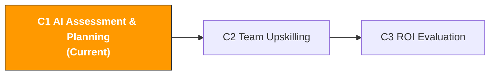

[🇨🇳 中文](../../paths/c-managers/c1-ai-assessment.md) | 🇺🇸 English

# C1. AI Capability Assessment & Planning

> **Path**: Path C: Managers · **Module**: C1
> **Last Updated**: 2026-03-12
> **Difficulty**: Beginner
> **Estimated Time**: 1-2 hours

[Hub Home](../../README.md) · [Path C Overview](README.md)



---

## Module Navigation

1. [AI Implementation Methodology](#1-ai-implementation-methodology-think-before-you-act) · 2. [Priority Matrix](#2-ai-implementation-priority-matrix) · 3. [Prompt Templates](#3-prompt-templates-for-managers) · 4. [Assessment Tools](#4-assessment-tools) · 5. [Hands-on Workflow](#5-hands-on-workflow-ai-implementation-planning-sop) · 6. [Common Pitfalls](#6-common-pitfalls) · 7. [Case Studies](#7-case-studies-ai-implementation-across-team-sizes) · 8. [Learning Resources](#8-learning-resources) · 9. [ OpenClaw Automation](#9-using-openclaw-for-ai-capability-assessment) · 10. [Completion Checklist](#10-completion-checklist)

---

## What You'll Produce in This Module

A team AI capability assessment report and prioritized implementation plan. After completing this module, you'll have:
- A team AI maturity assessment (scored across 10 dimensions)
- An AI implementation priority matrix (evaluating 15+ operational areas)
- An AI implementation roadmap (with phased goals, timeline, and budget estimates)
- A change management plan (to ensure your team actually adopts AI, not just "buys and shelves it")

> **Core Principle**: AI implementation is not a technology problem it's a management problem.


---

## 1. AI Implementation Methodology: Think Before You Act

> **Related Reading**: [AI Application Landscape](../0-foundations/ai-landscape.md#ai-application-landscape-assessment-ai-application-landscape-for-cross-border-e-commerce) See the AI Landscape for maturity levels across operational areas · [Platform Comparison](../d-platforms/platform-comparison.md#31-ai-application-maturity-by-platform) See Platform Comparison for AI maturity and prioritization by platform.

### 1.1 AI Is Not a Silver Bullet

**Tasks AI excels at:**

| Characteristic | Description | Cross-border E-commerce Examples |
|------|------|-------------|
| Highly repetitive | Standardized work done daily/weekly | Search term report analysis, Review monitoring, inventory alerts |
| Information-dense | Requires processing large volumes of text or data | Competitor Review analysis, keyword clustering, market research |
| Pattern recognition | Finding patterns and anomalies in data | Ad performance anomaly detection, return reason classification, price trends |
| Content generation | Producing text, translations, rewrites | Listing copy, customer service reply templates, ad copy variations |
| Structured analysis | Multi-dimensional evaluation using fixed frameworks | Product feasibility assessment, supplier comparison, ROI calculation |

**Tasks AI struggles with:**

| Characteristic | Description | Cross-border E-commerce Examples |
|------|------|-------------|
| Requires real-time data | AI doesn't know "current" data | Current BSR ranking, real-time inventory, today's CPC |
| Requires human judgment | Involves relationships, trust, negotiation | Supplier negotiation, customer relationship management, team management |
| Requires creative decisions | True innovation comes from cross-domain inspiration | Blue ocean category discovery, brand positioning, differentiation strategy |
| Requires physical verification | Must be seen or touched in person | Product QC, factory audits, packaging design samples |
| High-stakes decisions | Decisions with significant cost of error | Large purchase orders, market entry/exit, legal compliance |
| Requires latest policies | Platform rules change frequently | Latest Amazon policy interpretation, compliance requirement changes |

> **Rule of Thumb**: If a task can be written as an SOP, it can most likely be made more efficient with AI.

### 1.2 Three Phases of AI Implementation

| Dimension | Pilot Phase (Months 1-2) | Scale-up (Months 3-6) | Systematization (Months 6-12) |
|------|--------|--------|--------|
| Goal | Validate 1-2 use cases | Roll out to entire team | Embed AI into business processes |
| Investment | 1-2 people × 30 min/day | Entire team × 15-30 min/day | Dedicated maintainer |
| Tools | ChatGPT/Claude free tier | Paid AI + Prompt library | API integration + Agents |
| Success Criteria | 50%+ efficiency gain in 1 use case | 80%+ of team uses AI daily | >60% automation of key processes |
| Management Focus | Pick the right use case and person | Training and standardization | Process optimization and automation |
| Biggest Risk | Choosing the wrong use case | Team resistance | Over-reliance |
| Budget | $20-50/month | Training time + tool upgrades | Development integration + dedicated staff |
| Key to Success | AI Champion's enthusiasm | Manager's driving force | Technical team's execution |

### 1.3 Common Failure Reasons

| Failure Reason | Symptoms | How to Avoid |
|----------|----------|----------|
| **Expectations too high** | "AI should write perfect Listings automatically" → give up | Set realistic expectations: AI improves efficiency 50-80%, not 100% replacement |
| **No Champion** | Manager says "everyone go use AI" but nobody leads | Designate 1-2 AI Champions, give them time and resources |
| **Too many tools** | Introduce 5 AI tools at once → none get used | Introduce one tool at a time; master it before adding another |
| **Ignoring training** | Buy tools but don't teach how to use them → "AI is useless" | Schedule at least 2 hours of Prompt engineering training |
| **No measurement** | Don't know how much time AI actually saves | Record time comparisons from day one (see [C3](c3-roi-evaluation.md)) |
| **Trying to skip ahead** | Jump straight to systematization → waste | Follow the three phases strictly |
| **Ignoring data security** | Paste sensitive data directly into ChatGPT | Establish AI usage guidelines |

Content rephrased for compliance with licensing restrictions. Source: [McKinsey Global Survey on AI](https://www.mckinsey.com/capabilities/quantumblack/our-insights/the-state-of-ai)


---

## 2. AI Implementation Priority Matrix

**Priority Score Formula:** `Priority Score = (AI Efficiency Potential × Business Impact) / Implementation Difficulty`

| # | Operational Area | AI Efficiency Potential | Implementation Difficulty | Business Impact | Priority Score | Recommended Phase | Recommended Tools |
|---|----------|------------|----------|----------|-----------|----------|----------|
| 1 | Listing Copywriting | 5 | 1 | 5 | **25.0** | Pilot | ChatGPT/Claude |
| 2 | Competitor Review Analysis | 5 | 1 | 4 | **20.0** | Pilot | ChatGPT/Claude |
| 3 | Multilingual Translation/Localization | 5 | 1 | 4 | **20.0** | Pilot | ChatGPT/DeepL |
| 4 | Search Term Report Analysis | 5 | 2 | 5 | **12.5** | Pilot | ChatGPT + Data Export |
| 5 | Customer Service Reply Templates | 4 | 1 | 3 | **12.0** | Pilot | ChatGPT/Claude |
| 6 | Ad Copy A/B Testing | 4 | 1 | 3 | **12.0** | Pilot | ChatGPT/Claude |
| 7 | Product Research & Market Assessment | 4 | 2 | 5 | **10.0** | Pilot | ChatGPT + Data Tools |
| 8 | Keyword Research | 4 | 2 | 4 | **8.0** | Pilot | ChatGPT + Helium 10 |
| 9 | Inventory Demand Forecasting | 4 | 3 | 5 | **6.7** | Scale-up | Python + AI Models |
| 10 | Compliance Document Preparation | 3 | 2 | 4 | **6.0** | Scale-up | ChatGPT + Compliance DB |
| 11 | Automated Ad Bidding | 4 | 3 | 4 | **5.3** | Scale-up | Adtomic/Perpetua |
| 12 | Full-funnel Data Analysis | 5 | 5 | 5 | **5.0** | Systematization | BI + AI Integration |
| 13 | Automated Report Generation | 4 | 3 | 3 | **4.0** | Systematization | Python + API |
| 14 | Competitor Price Monitoring | 3 | 3 | 3 | **3.0** | Scale-up | Keepa + Automation Scripts |
| 15 | Supply Chain Risk Alerts | 3 | 4 | 4 | **3.0** | Systematization | Custom Development |
| 16 | Intelligent Customer Service Bot | 4 | 4 | 3 | **3.0** | Systematization | Custom Agent |

**How to Use:** Discuss with your team whether the scores for each area match your reality → adjust scores → select the top 2-3 priorities as pilots → use the Prompt templates in Section 3 to generate an implementation plan.

> **Common Mistake**: Don't pick the highest-priority area if your team is most resistant to it. The purpose of a pilot is to "show the team it works."


---

## 3. Prompt Templates (For Managers)

### 3.1 Team AI Implementation Plan Generator

```
你是一个跨境电商 AI 落地顾问。请基于以下信息，为我的团队制定 AI 落地规划：

团队信息：
- 团队规模：[X] 人
- 主要业务：跨境电商 [Amazon/独立站/多平台]
- 运营市场：[US/EU/JP/多站点]
- 当前使用的工具：[列出主要工具]
- 团队 AI 使用现状：[没人用/少数人在用/大部分人在用]
- 最大的效率瓶颈：[描述 2-3 个最耗时的工作]
- 月度 AI 工具预算：[X] 元/美元

请输出：
**阶段一：试点期（第 1-2 个月）** 推荐试点场景、工具、负责人职责、第一周行动清单、衡量标准
**阶段二：规模化（第 3-6 个月）** 扩展路径、标准化流程、培训计划、新增工具、KPI
**阶段三：系统化（第 7-12 个月）** 自动化集成、技术支持需求、长期架构、预期 ROI
每个阶段标注：预算估算、风险提示、关键里程碑。
```

### 3.2 AI Tool Budget Planning

```
你是一个跨境电商 AI 工具采购顾问。请帮我做 AI 工具预算规划：

团队信息：
- 团队规模：[X] 人
- 月度总预算上限：[X] 元/美元
- 当前已有工具：[列出]
- 最需要 AI 提效的环节：[列出 3-5 个]

请输出：
1. 推荐工具组合（按优先级排序，含月费用、解决什么问题、预计节省时间）
2. 三档预算方案（最低/推荐/充足）
3. ROI 预估（每个工具的时间节省 × 时薪）
4. 采购建议（先买什么、免费替代、年付 vs 月付）
```

### 3.3 AI Capability Gap Analysis

```
你是一个团队 AI 能力评估专家。请基于以下信息分析我团队的 AI 能力差距：

团队现状：
- 团队成员及其角色：[如：运营 3 人、广告 2 人、客服 2 人]
- 各角色当前的 AI 使用情况：[描述]
- 团队整体技术水平：[基础/中等/较强]
- 希望 [X] 个月后达到的 AI 使用水平：[描述]

请输出：
1. 能力差距地图（角色 | 当前能力 | 目标能力 | 差距 | 优先级）
2. 关键差距分析（最大的 3 个差距、根本原因、弥补资源和时间）
3. 培训计划建议（全员必修 + 按角色专项 + 推荐形式和频率）
```

### 3.4 Change Management Plan

```
你是一个组织变革管理专家，专注于 AI 落地的变革管理。

我的团队情况：
- 团队规模：[X] 人
- 团队对 AI 的态度：[积极/中立/抵触/混合]
- 主要顾虑：[如"担心被替代"、"觉得学不会"、"觉得没必要"]
- 管理层支持度：[强/中/弱]

请设计一套变革管理方案：
1. 沟通策略（目的传达、第一次会议议程、处理焦虑）
2. Champion 机制（选拔标准、职责权限、激励方式）
3. 渐进式推广（第 1 周演示 → 第 2-4 周试用 → 第 2-3 月习惯 → 第 4-6 月依赖）
4. 激励机制（短期/中期/长期）
5. 阻力处理（常见阻力类型和应对话术）
```


---

## 4. Assessment Tools

### 4.1 AI Maturity Assessment Questionnaire (10 Questions)

**Scoring**: 1 = Strongly disagree, 5 = Strongly agree

| # | Dimension | Question |
|---|----------|------|
| 1 | AI Awareness | I understand what AI can and cannot do |
| 2 | Tool Usage | I use an AI tool at least once a week to assist my work |
| 3 | Prompt Skills | I can write structured Prompts |
| 4 | Use Case Identification | I can identify which parts of my work are suitable for AI |
| 5 | Quality Judgment | I can evaluate the quality of AI-generated output |
| 6 | Data Awareness | I know which data can be shared with AI and which cannot |
| 7 | Efficiency Gains | AI has already saved me noticeable time |
| 8 | Continuous Learning | I proactively follow new AI tool features |
| 9 | Knowledge Sharing | I share useful Prompts with colleagues |
| 10 | Process Integration | AI has become a regular part of some of my workflows |

**Score Interpretation:**

| Average Score | Maturity Level | Recommended Action |
|--------|-----------|----------|
| 1.0-2.0 | Initial | Start with AI awareness training; pilot the simplest use case |
| 2.1-3.0 | Exploring | Find a Champion, build a Prompt library, expand pilot scope |
| 3.1-4.0 | Applying | Standardize processes, deepen use cases, start measuring ROI |
| 4.1-5.0 | Optimizing | Explore automation integration, build AI-driven new processes |

### 4.2 Team AI Skills Assessment

**Operations Role:**

| Skill | Beginner | Intermediate | Advanced |
|--------|------|------|------|
| AI-assisted Listing writing | Can generate basic copy | Multilingual + SEO optimization | A/B test iteration |
| AI-assisted Review analysis | Can have AI summarize | Structured pain point analysis | Multi-competitor trend comparison |
| AI-assisted product research | Evaluate a single product | Multi-product horizontal comparison | Complete AI-assisted product research SOP |
| AI-assisted multilingual work | Basic translation | Localization adaptation | Cultural difference analysis |

**Advertising Role:**

| Skill | Beginner | Intermediate | Advanced |
|--------|------|------|------|
| Search term analysis | Paste data for AI analysis | Layered analysis and trend comparison | Automated analysis workflow |
| Ad copy | Generate basic Headlines | Multi-style A/B testing | SB Video scripts |
| Budget optimization | AI-suggested budget allocation | Promotional budget strategy | Multi-marketplace budget optimization |

**Customer Service Role:**

| Skill | Beginner | Intermediate | Advanced |
|--------|------|------|------|
| Reply generation | Basic replies | Multi-scenario varied replies | Complete reply template library |
| Feedback analysis | AI-summarized feedback | Classification and trend analysis | Root cause analysis and improvement suggestions |
| Multilingual support | Basic translated replies | Tone and cultural adaptation | Multilingual customer service SOP |


---

## 5. Hands-on Workflow: AI Implementation Planning SOP

**Go from "wanting to use AI" to "actually using AI" in 2 weeks:**

| Timeline | Action | AI-Assisted | Output |
|------|------|---------|------|
| Day 1-2 | All team members fill out maturity questionnaire (4.1) + skills assessment (4.2) | Use Prompt 3.3 to summarize results | Team AI maturity baseline report |
| Day 3-4 | Team discusses priority matrix (Section 2), adjusts scores | Use Prompt 3.1 to generate initial plan | 2 pilot use cases confirmed + pilot leads assigned |
| Day 5-7 | Evaluate AI tools needed for pilot use cases | Use Prompt 3.2 for cost analysis | Tool procurement list + budget approval |
| Day 8-10 | Confirm AI Champion, prepare team communication | Use Prompt 3.4 to design rollout strategy | Team communication plan + Champion role description |
| Day 11-14 | Hold team kickoff meeting, begin pilot | Demo AI results → distribute tool accounts → share Prompt templates | Pilot officially launched |

**Pilot Phase Execution Guide (Months 1-2):**

- Week 1: AI Champion prepares a real-world scenario (e.g., analyzing 50 competitor negative reviews), does it manually first and records the time, then does it with AI, and demos the comparison at a team meeting
- Weeks 2-4: Assign each person a simple AI task + provide Prompt templates + Champion answers questions 15 min/day + 15-minute Friday sharing session
- Weeks 5-8: Integrate AI usage into existing workflows + build team Prompt library + start recording time savings data

---

## 6. Common Pitfalls

| Category | Pitfall | How to Avoid |
|------|------|----------|
| Expectation Management | Expectations too high → completely dismiss AI | Set specific, measurable goals |
| Expectation Management | Expectations too low → only use the most basic features | Regularly share new AI use cases and success stories |
| Expectation Management | Rushing → abandon pilot before it's complete | AI implementation needs 2-3 months to show stable results |
| People Management | No Champion → tools purchased but unused | Pick someone passionate about AI, give them 20% of their work time |
| People Management | Champion fighting alone | Manager publicly supports Champion, gives them presentation time |
| People Management | Ignoring resistance → surface compliance but no real usage | Directly address the "Will AI replace me?" question |
| People Management | No learning time → nobody has time to learn | Give 2-3 hours per week of "AI learning time" |
| Tool Management | Too many tools → don't know which to use | Introduce one tool at a time |
| Tool Management | Buy but don't use → wasted budget | Check usage rates monthly; consider canceling if below 50% |
| Tool Management | Data security blind spots | Establish clear data classification standards |
| Process Management | No SOP → inconsistent quality | Build a standardized Prompt library and usage process |
| Process Management | Over-reliance → errors occur | AI output must go through human review |


---

## 7. Case Studies: AI Implementation Across Team Sizes

### 7.1 Case 1: 5-Person Team (Small Seller)

| Phase | Timeline | Action | Tools | Monthly Cost |
|------|------|------|------|--------|
| Pilot | Months 1-2 | Boss acts as Champion; Listing + Review analysis pilot | ChatGPT Free | $0 |
| Scale-up | Months 3-4 | Entire team using AI; 5 core Prompt templates established | ChatGPT Plus × 2 | $40 |
| Deepening | Months 5-6 | Ad search term analysis + customer service reply templates | ChatGPT Plus × 2 | $40 |

After 6 months: AI maturity 1.5→2.8, Listing time saved 62%, Review analysis time saved 89%, monthly cost $40, ~60 hours saved per month.

### 7.2 Case 2: 20-Person Team (Mid-size Seller)

| Phase | Timeline | Action | Tools | Monthly Cost |
|------|------|------|------|--------|
| Pilot | Months 1-2 | 2 Champions (Operations + Advertising); Review + search term analysis | ChatGPT Plus × 3 | $60 |
| Scale-up | Months 3-4 | Team Prompt library with 20+ templates; full team training; AI usage guidelines | ChatGPT Team × 10 | $250 |
| Systematization | Months 5-8 | Introduce Adtomic; explore API integration | ChatGPT Team + Adtomic | $500 |

After 8 months: AI maturity 2.3→3.5, Prompt library with 35 templates, ACOS down 8%, operational efficiency up 35%, monthly cost $500, ~300 hours saved per month.

### 7.3 Case 3: 50-Person Team (Large Seller/Brand)

| Phase | Timeline | Action | Tools | Monthly Cost |
|------|------|------|------|--------|
| Pilot | Months 1-2 | 1 Champion per department (5 total) | ChatGPT Team × 10 | $250 |
| Scale-up | Months 3-6 | Full team training; company-wide Prompt library; AI governance framework | ChatGPT Team × 30 + Claude × 5 | $900 |
| Systematization | Months 7-12 | Internal AI tool platform; API integration; automated workflows | Enterprise tools + custom development | $2000+ |

After 12 months: AI maturity 2.5→3.8, Prompt library with 80+ templates, 3 automated workflows live, operational efficiency up 45%.

### 7.4 Comparison Across Team Sizes

| Dimension | 5-Person | 20-Person | 50-Person |
|------|------|-------|-------|
| Time to reach Applying level | 4-6 months | 6-8 months | 8-12 months |
| Number of Champions | 1 (the boss) | 2-3 | 5+ |
| Prompt library needed? | Optional | Required | Required |
| AI governance needed? | No | Basic version | Full version |
| Monthly tool cost | $0-40 | $60-500 | $250-2000+ |

> The larger the team, the more AI implementation requires "management" rather than "technology."


---

## 8. Learning Resources

### 8.1 AI Strategy & Management

| Resource | Source | Link |
|------|------|------|
| The State of AI | McKinsey | [mckinsey.com](https://www.mckinsey.com/capabilities/quantumblack/our-insights/the-state-of-ai) |
| AI Transformation Playbook | Andrew Ng | [landing.ai](https://landing.ai/resources/) |
| Generative AI for CEOs | BCG | [bcg.com](https://www.bcg.com/capabilities/artificial-intelligence) |

### 8.2 Prompt Engineering Fundamentals

| Resource | Platform | Link |
|------|------|------|
| ChatGPT Prompt Engineering | DeepLearning.AI | [deeplearning.ai](https://www.deeplearning.ai/short-courses/chatgpt-prompt-engineering-for-developers/) |
| OpenAI Prompt Engineering Guide | OpenAI | [platform.openai.com](https://platform.openai.com/docs/guides/prompt-engineering) |
| Anthropic Prompt Engineering Guide | Anthropic | [docs.anthropic.com](https://docs.anthropic.com/en/docs/build-with-claude/prompt-engineering) |

### 8.3 Recommended Books

| Title | Author | Why Recommended |
|------|------|-----------|
| *AI Superpowers* | Kai-Fu Lee | Understand the global AI landscape and business impact |
| *The AI-First Company* | Ash Fontana | How to make AI a core competitive advantage |
| *Prediction Machines* | Ajay Agrawal et al. | Understand AI value through an economics framework |
| *Co-Intelligence* | Ethan Mollick | How to collaborate with AI rather than be replaced by it |

Content rephrased for compliance with licensing restrictions. Sources cited inline.

---

## 9. Using OpenClaw for AI Capability Assessment

### 9.1 Scenario: AI Agent Automatically Collects Team AI Usage Data

```
你对 OpenClaw 说：
"每周自动收集团队成员的 AI 使用频次和场景，
汇总到 Google Sheets，并生成 AI 成熟度趋势报告发送到管理频道"

OpenClaw 自动执行：
1. [Heartbeat] 每周五触发
2. [Skill: slack] 收集 #ai-usage 频道的使用记录
3. [Skill: memory] 对比历史数据，计算成熟度变化趋势
4. [Skill: google-sheets] 更新团队 AI 成熟度追踪表
5. [LLM] 生成周度 AI 使用趋势分析和改进建议
6. [Skill: slack] 发送报告到 #management
```

### 9.2 Required Skills and MCP Servers

| Component | Purpose | Link |
|------|------|------|
| **slack** Skill | Collect usage records, send reports | [ClawHub](https://clawhub.ai/) |
| **google-sheets** Skill | Store and update maturity data | [ClawHub](https://clawhub.ai/) |
| **memory** Skill | Store historical data for trend comparison | [OpenClaw Docs](https://docs.openclaw.com/) |

### 9.3 Related Resources

| Resource | Description | Link |
|------|------|------|
| OpenClaw Official Docs | Installation and configuration guide | [docs.openclaw.com](https://docs.openclaw.com/) |
| ClawHub Skills Marketplace | Search and install Agent Skills | [clawhub.ai](https://clawhub.ai/) |
| OpenClaw Business Guide | Enterprise scenario setup | [Business Guide](https://www.aimakers.co/blog/openclaw-clawbot-business-guide/) |
| F4 Automation & Agents | Agent fundamentals module | [F4 Module](../0-foundations/f4-agent-automation.md) |

Content rephrased for compliance with licensing restrictions. Sources cited inline.

---

## 10. Completion Checklist

- [ ] Complete team AI maturity assessment questionnaire (all members fill out, summarize average scores)
- [ ] Complete AI implementation priority matrix (adjust scores based on your team's actual situation)
- [ ] Identify 2 pilot use cases and AI Champion(s)
- [ ] Use Prompt templates to generate an AI implementation roadmap (covering all three phases)
- [ ] Complete AI tool budget plan (including ROI estimates)
- [ ] Establish AI usage guidelines (data security, review process)
- [ ] Hold team AI kickoff meeting and officially begin the pilot

---

## Appendix: Quick Reference Cards

### Prompt Quick Reference

| Scenario | Prompt Template | Section |
|------|------------|---------|
| Create AI implementation plan | Team AI Implementation Plan Generator | [3.1](#31-team-ai-implementation-plan-generator) |
| AI tool budget planning | AI Tool Budget Planning | [3.2](#32-ai-tool-budget-planning) |
| Team capability gap analysis | AI Capability Gap Analysis | [3.3](#33-ai-capability-gap-analysis) |
| Change management plan | Change Management Plan | [3.4](#34-change-management-plan) |

### AI Implementation Phase Quick Reference

| Phase | Goal | Timeline | Key Actions | Success Criteria |
|------|------|------|----------|----------|
| Pilot | Validate results | Months 1-2 | Pick use case, pick Champion, demo results | 50%+ efficiency gain in 1 use case |
| Scale-up | Full team adoption | Months 3-6 | Build Prompt library, train team, set guidelines | 80%+ of team uses AI daily |
| Systematization | Embed in processes | Months 6-12 | API integration, automation, continuous optimization | >60% automation of key processes |

---
> [Hub Home](../../README.md) · [Path C Overview](README.md)
>
> **Path C**: [C1 Assessment](c1-ai-assessment.md) · [C2 Upskilling](c2-team-building.md) · [C3 ROI](c3-roi-evaluation.md)
>
> **Quick Jump**: [Path 0 Foundations](../0-foundations/) · [Path A Operations](../a-operators/) · [Path B Developers](../b-developers/) · [Path D Multi-platform](../d-platforms/) · [Path E Social Media](../e-social-media/)
