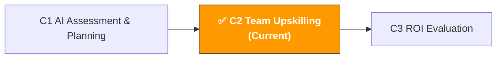

[🇨🇳 中文](../../paths/c-managers/c2-team-building.md) | 🇺🇸 English

# C2. AI Team Upskilling & Enablement

> **Path**: Path C: Managers · **Module**: C2  
> **Last Updated**: 2026-03-12  
> **Difficulty**: ⭐ Beginner  
> **Estimated Time**: 1-2 hours  
> **Prerequisite**: [C1 AI Capability Assessment & Planning](c1-ai-assessment.md)
---

🏠 [Hub Home](../../README.md) · 📋 [Path C Overview](README.md)



---

## 📖 Module Navigation

1. [Training Methodology](#1-training-methodology-why-most-ai-training-fails) · 2. [Role-based Training](#2-role-based-customized-training-courses) · 3. [Prompt Library Setup](#3-team-prompt-library-setup) · 4. [Usage Guidelines](#4-ai-usage-guidelines) · 5. [Prompt Templates](#5-prompt-templates-for-team-building) · 6. [Hands-on Workflow](#6-hands-on-workflow-building-team-ai-capability-from-scratch) · 7. [Common Issues](#7-common-issues-and-solutions) · 8. [Case Studies](#8-case-studies-team-ai-upskilling-in-practice) · 9. [Learning Resources](#9-learning-resources) · 10. [🦞 OpenClaw Automation](#10-using-openclaw-for-team-ai-enablement) · 11. [Completion Checklist](#11-completion-checklist)


## What You'll Produce in This Module

An actionable team AI upskilling plan.

After completing this module, you'll have:

- A role-based AI training curriculum (different for Operations/Advertising/Customer Service)
- A team Prompt library setup plan (from 0 to 50+ templates)
- An AI usage guidelines document (data security, review process, tool management)
- A continuous learning mechanism (so your team doesn't just "learn once" but "uses AI every day")

> 💡 **Core Principle**: Training is not the goal — behavior change is. A single 2-hour workshop won't change anything. What truly works is "15 minutes of deliberate practice every day + weekly sharing and review."

---

## 1. Training Methodology: Why Most AI Training Fails

> 📎 **Related Reading**: [F2 Prompt Engineering](../0-foundations/f2-prompt-engineering.md#8-using-openclaw-for-prompt-management-optimization) — See F2 for team Prompt engineering training content. · [A2 Listing & Content Creation](../a-operators/a2-listing-optimization.md#a2-listing-content-creation) — See A2 for Listing AI workflow examples

### 1.1 Three Major Problems with Traditional Training

According to PwC's survey, 67% of employees feel they are not ready to use AI technology. But the problem isn't a lack of training — it's that the training approach is wrong.

| Problem | Symptoms | Root Cause |
|------|------|----------|
| **One-time training** | Held a single 2-hour workshop, then nothing | Skills require repeated practice to internalize; knowledge retention from a single training is less than 20% |
| **Disconnected from work** | Training covers "AI principles and history" with no relevance to daily work | Adult learning motivation comes from "solving current problems," not "learning new knowledge" |
| **One-size-fits-all** | Operations, Advertising, and Customer Service all get the same training | Different roles have completely different AI use cases; generic training is useless for everyone |

Content rephrased for compliance with licensing restrictions. Source: [PwC Global AI Study](https://www.pwc.com/gx/en/issues/data-and-analytics/publications/artificial-intelligence-study.html)

### 1.2 Effective AI Training Framework: The 70-20-10 Rule

Borrowing from adult learning theory's 70-20-10 rule, effective AI upskilling should be:

```
70% — Learning by Doing (on the job)
├── Use AI to complete one real work task every day
├── Pick a template from the Prompt library and apply it to your own work
└── Record "before AI" vs "after AI" time comparisons

20% — Learning from Others (peer learning)
├── 15-minute weekly "AI usage sharing" (each person shares one tip)
├── AI Champion spends 15 minutes daily answering team questions
└── Build a team Prompt library with mutual contributions and improvements

10% — Formal Training
├── Onboarding: 2-hour AI basics + Prompt engineering
├── Monthly: 1-hour new features/techniques
└── Role-specific deep-dive training
```

> 💡 **Key Insight**: Most companies put 90% of their effort into "formal training," but it only contributes 10% of learning outcomes. Real skill improvement comes from "using AI in your work every day."

### 1.3 Four Stages of AI Skill Building

```
Stage 1: Awareness (Week 1)
├── Goal: Team understands what AI can and cannot do
├── Method: A 2-hour workshop + live demo
├── Output: Each person writes "3 parts of my work where I could use AI"
└── Success Criteria: 100% of people can name at least 1 AI use case

Stage 2: Imitation (Weeks 2-4)
├── Goal: Team can use existing Prompt templates to complete tasks
├── Method: Distribute Prompt library + one practice task per day
├── Output: Each person uses at least 5 different Prompt templates
└── Success Criteria: 80% of people use AI at least 3 times per week

Stage 3: Creation (Months 2-3)
├── Goal: Team can write and improve their own Prompts
├── Method: Advanced Prompt engineering training + team Prompt library contributions
├── Output: Each person contributes at least 2 self-created Prompts to the team library
└── Success Criteria: Team Prompt library reaches 30+ templates

Stage 4: Optimization (Months 4-6)
├── Goal: AI becomes part of daily workflows
├── Method: Process optimization + ROI measurement + continuous iteration
├── Output: At least 3 workflows formally incorporate AI assistance
└── Success Criteria: Team AI maturity score improves by 1.0+ points
```

Content rephrased for compliance with licensing restrictions. Source: [Amplework AI Adoption Guide](https://www.amplework.com/blog/train-your-team-for-ai-adoption/)

---

## 2. Role-based Customized Training Courses

### 2.1 Required for All: AI Basics & Prompt Engineering (2 hours)

This is the first class everyone must take. The goal isn't to make everyone an AI expert — it's to eliminate fear and build confidence.

**Course Outline:**

| Time | Content | Format | Goal |
|------|------|------|------|
| 0:00-0:20 | What AI can and cannot do | Lecture + demo | Set realistic expectations |
| 0:20-0:40 | Live demo: Using AI to analyze 50 competitor negative reviews | Live operation | Let the team "see" the results |
| 0:40-1:00 | Prompt engineering basics: 5 elements of a good Prompt | Lecture + examples | Understand Prompt structure |
| 1:00-1:30 | Hands-on: Each person completes a task using a Prompt template | Practice | From "watching" to "doing" |
| 1:30-1:50 | Sharing and discussion: Each person presents their results | Group sharing | Learn from each other |
| 1:50-2:00 | Next steps: This week's AI practice tasks | Assign homework | Continue learning |

**5 Elements of a Good Prompt (CRISP Framework):**

```
C — Context: Tell AI who you are and what you're doing
R — Role: Give AI an expert role
I — Instruction: Clearly tell AI what to do
S — Specifics: Provide specific data, constraints, format requirements
P — Product: Describe the expected output format
```

**Comparison Example:**

❌ Bad Prompt:
```
帮我分析一下这个产品的市场
```

✅ Good Prompt (using CRISP framework):
```
[Context] 我是一个 Amazon US 站的运营，正在评估是否进入便携风扇品类。
[Role] 你是一个资深的跨境电商选品顾问。
[Instruction] 请从以下 5 个维度评估这个品类的市场可行性。
[Specifics] 评估维度：市场需求（1-5分）、竞争强度（1-5分）、利润空间（1-5分）、供应链难度（1-5分）、合规风险（1-5分）。
[Product] 输出格式：评分表格 + 综合建议（进入/谨慎/放弃）+ 理由。
```

### 2.2 Operations Role Training (1 hour each, 4 sessions)

| Session | Topic | Core Skills | Companion Prompt Templates |
|------|------|----------|-----------------|
| 1st | AI-assisted Product Research | Competitor Review analysis, market assessment | [A1 Product Research Templates](../a-operators/a1-product-research.md) |
| 2nd | AI-assisted Listing | Copy generation, SEO optimization, multilingual | [A2 Listing Templates](../a-operators/a2-listing-optimization.md) |
| 3rd | AI-assisted Customer Service | Reply templates, Review responses, return analysis | [A4 Customer Service Templates](../a-operators/a4-customer-service.md) |
| 4th | AI-assisted Compliance | Compliance checks, appeal letter generation | [A6 Compliance Templates](../a-operators/a6-compliance.md) |

**Standard flow for each training session:**

1. Review usage since last training (10 minutes)
2. New scenario demo (15 minutes)
3. Hands-on practice (25 minutes)
4. Sharing and Q&A (10 minutes)

### 2.3 Advertising Role Training (1 hour each, 3 sessions)

| Session | Topic | Core Skills | Companion Prompt Templates |
|------|------|----------|-----------------|
| 1st | AI-assisted Search Term Analysis | Search term report interpretation, keyword clustering | [A3 Advertising Templates](../a-operators/a3-advertising.md) |
| 2nd | AI-assisted Ad Copy | Headline generation, A/B test copy | [Advertising Prompt Library](../../prompts/advertising.md) |
| 3rd | AI-assisted Budget Optimization | Budget allocation suggestions, promotional strategy | [A3 Advertising Templates](../a-operators/a3-advertising.md) |

### 2.4 Customer Service Role Training (1 hour each, 2 sessions)

| Session | Topic | Core Skills | Companion Prompt Templates |
|------|------|----------|-----------------|
| 1st | AI-assisted Reply Generation | Multi-scenario reply templates, multilingual replies | [A4 Customer Service Templates](../a-operators/a4-customer-service.md) |
| 2nd | AI-assisted Feedback Analysis | Customer feedback classification, root cause analysis, improvement suggestions | [Customer Service Prompt Library](../../prompts/customer-service.md) |

---

## 3. Team Prompt Library Setup

### 3.1 Why You Need a Team Prompt Library

Individuals use AI on inspiration; teams use AI on systems. A Prompt library is your team's AI "knowledge asset."

| Without a Prompt Library | With a Prompt Library |
|---------------|-------------|
| Everyone figures it out alone, reinventing the wheel | New hires can use validated Prompts from day one |
| Inconsistent quality; good Prompts go unnoticed | Best practices are captured and shared |
| When someone leaves, their experience leaves too | Knowledge stays with the team, not dependent on individuals |
| Can't measure AI usage effectiveness | Can track which Prompts are most effective |

### 3.2 Prompt Library Structure Design

```
Team Prompt Library/
├── 📁 Product Research & Market
│   ├── Competitor Review Pain Point Analysis.md
│   ├── Market Feasibility Assessment.md
│   ├── Keyword Demand Clustering.md
│   └── Supplier Evaluation.md
├── 📁 Listing & Content
│   ├── Listing Copy Generation (US).md
│   ├── Listing Copy Generation (EU).md
│   ├── Listing Copy Generation (JP).md
│   ├── A+ Content Copy.md
│   └── Product Description Multilingual Translation.md
├── 📁 Advertising Optimization
│   ├── Search Term Report Analysis.md
│   ├── Ad Headline Generation.md
│   ├── Promotional Ad Strategy.md
│   └── Competitor Ad Analysis.md
├── 📁 Customer Service & After-sales
│   ├── Customer Reply Template (Returns).md
│   ├── Customer Reply Template (Negative Reviews).md
│   ├── Review Response Generation.md
│   └── Customer Feedback Analysis.md
├── 📁 Compliance & Risk
│   ├── Compliance Checklist.md
│   ├── Appeal Letter Generation.md
│   └── Policy Change Interpretation.md
└── 📁 Management & Analysis
    ├── Weekly/Monthly Report Generation.md
    ├── Data Analysis Summary.md
    └── Meeting Minutes Generation.md
```

### 3.3 Standard Format for Each Prompt Template

```markdown
# [Template Name]

## Basic Info
- **Use Case**: [Describe specifically when to use this]
- **Recommended Tool**: ChatGPT / Claude / Gemini
- **Difficulty**: Beginner / Intermediate / Advanced
- **Validation Status**: ✅ Validated / 🔄 Pending Validation
- **Contributor**: [Name]
- **Last Updated**: [Date]

## Prompt Text
[Copy-ready Prompt text]

## Usage Instructions
1. [Step 1]
2. [Step 2]
3. [Step 3]

## Input Example
[Show a real input case]

## Output Example
[Show the corresponding output]

## Notes
- [Common mistake 1]
- [Common mistake 2]

## Variations
- **Variation A**: [Modified version for different scenarios]
```

### 3.4 Prompt Library Operations

| Activity | Owner | Frequency | Specific Actions |
|------|--------|------|----------|
| Contribution | Everyone | Anytime | Submit useful Prompts to the library when discovered |
| Review | AI Champion | Weekly | Validate quality of new submissions, mark validation status |
| Update | AI Champion | Monthly | Update outdated Prompts, add new use cases |
| Promotion | Manager | Weekly | Share "Prompt of the Week" at team meetings |
| Cleanup | AI Champion | Quarterly | Remove unused Prompts, merge duplicates |

**Incentive Mechanism:**
- Public recognition in team chat for each validated Prompt contribution
- Monthly "Best Prompt Contributor" award
- Prompt library contributions included in quarterly performance review under "Innovation"

---

## 4. AI Usage Guidelines

### 4.1 Why You Need Usage Guidelines

AI usage without guidelines is like a road without traffic rules — accidents are inevitable. Most common risks:

| Risk Type | Scenario | Consequence | Severity |
|----------|----------|------|----------|
| **Data leak** | Pasting customer personal info into ChatGPT | GDPR/privacy law violation, potential fines | 🔴 Severe |
| **Trade secret leak** | Sharing internal financial data or pricing strategy with AI | Competitors may access sensitive information | 🔴 Severe |
| **Content errors** | AI-generated Listing contains false claims | Violates Amazon policy, potential delisting | 🟡 Medium |
| **Copyright issues** | AI-generated content plagiarizes others' work | Intellectual property disputes | 🟡 Medium |
| **Over-reliance** | Fully relying on AI output without human review | Errors accumulate, affecting business decisions | 🟡 Medium |
| **Account security** | Multiple people sharing one AI tool account | Cannot trace who did what | 🟢 Low |

### 4.2 Data Classification Standards

Create a clear data classification table so the team knows what data can be shared with AI and what cannot:

**🟢 Data that can be directly shared with AI:**

| Data Type | Examples | Notes |
|----------|------|------|
| Public product info | Product titles, descriptions, prices, images | Publicly visible on Amazon storefront |
| Public Reviews | Competitor customer reviews | Publicly visible reviews anyone can see |
| Industry reports | Market trends, category data | Publicly published industry reports |
| General business questions | "How to optimize Listing SEO" | General questions not involving specific business data |
| Templates and frameworks | Prompt templates, analysis frameworks | Methodology-level content |

**🟡 Data that can be shared after anonymization:**

| Data Type | Anonymization Method | Example |
|----------|----------|------|
| Sales data | Use percentages instead of absolute values | "Product A sales grew 30%" instead of "Product A sells 5,000 units/month" |
| Advertising data | Remove specific amounts | "ACOS dropped from 25% to 18%" instead of "Ad spend $5,000" |
| Supplier info | Remove company names and contacts | "Supplier A quotes ¥XX/unit" instead of specific company name |
| Internal reports | Remove sensitive fields before use | Keep trends and ratios, remove absolute numbers |

**🔴 Data that must NEVER be shared with AI:**

| Data Type | Reason |
|----------|------|
| Customer PII (name, address, phone, email) | Privacy law violation (GDPR, CCPA) |
| Amazon account credentials (passwords, API Keys, Tokens) | Account security risk |
| Internal financial data (revenue, profit, cost breakdowns) | Trade secrets |
| Employee personal information | Privacy protection |
| Unreleased product development plans | Competitive intelligence risk |
| Legal documents and contract contents | Confidentiality obligations |

### 4.3 AI Output Review Process

AI-generated content cannot be used directly — it must go through human review. Review rigor depends on the content's intended use:

```
Review Level 1: Quick Check (1-2 minutes)
├── Applies to: Internal analysis reports, meeting minutes
├── Reviewer: The user themselves
├── Checklist: Factual accuracy, logical coherence, no obvious errors
└── Standard: Directionally correct is sufficient

Review Level 2: Careful Review (5-10 minutes)
├── Applies to: Customer-facing content (Listings, CS replies, ad copy)
├── Reviewer: User + peer cross-review
├── Checklist: Factual accuracy, compliance, brand tone, grammar
└── Standard: Ready to publish

Review Level 3: Expert Review (30+ minutes)
├── Applies to: Compliance documents, appeal letters, legal-related content
├── Reviewer: User + specialist (compliance/legal)
├── Checklist: Regulatory compliance, policy conformance, risk assessment
└── Standard: Specialist sign-off required
```

### 4.4 Tool Management Guidelines

| Dimension | Guideline | Rationale |
|------|------|------|
| Account management | Individual accounts per person, no sharing | Enables operation traceability |
| Tool selection | Team standardizes on 1-2 tools | Avoids tool fragmentation, easier training and management |
| Version management | Standardize on paid versions (if applicable) | Paid versions typically have better data privacy protections |
| Usage records | Save conversation logs for important AI interactions | Facilitates review and knowledge capture |
| Cost management | Monthly usage and costs transparent | Managers can track ROI |

### 4.5 Usage Guidelines Document Template

Use the following Prompt to generate AI usage guidelines tailored to your team:

```
你是一个企业 AI 治理专家。请帮我制定一份团队 AI 使用规范文档。

团队信息：
- 团队规模：[X] 人
- 行业：跨境电商
- 使用的 AI 工具：[ChatGPT/Claude/其他]
- 主要使用场景：[列出 3-5 个]

请输出一份完整的 AI 使用规范，包含：

1. **总则**
   - 规范的目的和适用范围
   - AI 使用的基本原则（辅助而非替代、人工审核、数据安全）

2. **数据安全规范**
   - 数据分类标准（可用/脱敏后可用/禁止使用）
   - 各类数据的具体示例
   - 违规处理方式

3. **内容审核规范**
   - 不同用途内容的审核级别
   - 审核流程和责任人
   - 审核检查清单

4. **工具管理规范**
   - 账号管理要求
   - 费用管理要求
   - 工具选择标准

5. **培训要求**
   - 新人必修培训
   - 定期更新培训
   - 培训考核方式

6. **附录**
   - 常见问题 FAQ
   - 违规案例和处理方式
   - 规范更新记录

格式要求：使用清晰的标题层级，每条规范都要有具体的操作指引，不要泛泛而谈。
```

---

## 5. Prompt Templates (For Team Building)

### 5.1 Training Course Design

**Why this Prompt works:** It asks AI to design a customized training course based on your team's actual situation (role composition, current level, time constraints), rather than a generic "AI 101" course. Role-specific output ensures each position learns directly applicable skills.

```
你是一个企业 AI 培训专家，专注于跨境电商团队的 AI 技能建设。

团队信息：
- 团队构成：[如：运营 5 人、广告 3 人、客服 2 人、管理 2 人]
- 当前 AI 使用水平：[参考 C1 评估结果，如"平均分 2.3，探索级"]
- 可用培训时间：[如"每周最多 2 小时"]
- 培训预算：[如"无额外预算" 或 "$X/月"]
- 最需要提效的环节：[列出 3 个]

请设计一套 3 个月的 AI 培训计划：

**第 1 个月：基础建设**
- 全员必修课内容和时间安排
- 每个角色的第一个 AI 使用场景
- 本月的练习任务和考核标准

**第 2 个月：深化应用**
- 按角色的专项培训内容
- 团队 Prompt 库的初始模板清单
- 本月的目标和衡量指标

**第 3 个月：固化习惯**
- 将 AI 融入日常工作流程的具体方案
- 持续学习机制的设计
- 3 个月后的评估方式

每个培训环节标注：时间、形式（讲座/实操/分享）、负责人、所需材料。
```

### 5.2 Workshop Agenda Generator

**Why this Prompt works:** It helps you design a workshop with interaction, demos, and hands-on practice — not a one-way "PPT lecture." The 2-hour time allocation is optimized to take participants from "watching" to "doing" to "sharing."

```
你是一个 AI 培训 workshop 设计师。请帮我设计一个 2 小时的团队 AI 入门 workshop。

Workshop 信息：
- 参与人数：[X] 人
- 参与者背景：跨境电商 [运营/广告/客服/混合]
- 参与者 AI 经验：[大部分没用过 / 少数人用过 / 大部分用过但不深入]
- 可用设备：[每人一台电脑 / 部分人有电脑 / 只有投影]
- 目标：让参与者在 workshop 结束时能独立使用 AI 完成一个工作任务

请输出：

1. **Workshop 议程**（精确到分钟）
   | 时间 | 环节 | 内容 | 形式 | 材料 |

2. **开场破冰**（5 分钟）
   - 一个让大家放松的 AI 相关小游戏或互动

3. **现场演示脚本**（15 分钟）
   - 选一个最有冲击力的场景做现场演示
   - 演示的每一步操作和话术

4. **实操练习设计**（30 分钟）
   - 3 个难度递进的练习任务
   - 每个任务的 Prompt 模板和预期输出

5. **分享环节引导**（15 分钟）
   - 引导问题清单
   - 如何让内向的参与者也愿意分享

6. **课后作业**
   - 本周的 3 个 AI 练习任务
   - 下周分享会的要求
```

### 5.3 AI Champion Selection & Development

```
你是一个组织发展专家。请帮我设计 AI Champion 的选拔和培养方案。

团队信息：
- 团队规模：[X] 人
- 需要的 Champion 数量：[X] 人
- Champion 可投入的时间：[如"每周 3-5 小时"]

请输出：

1. **选拔标准**
   - 必备条件（3-5 条）
   - 加分条件（2-3 条）
   - 不适合做 Champion 的特征

2. **选拔流程**
   - 如何发现潜在 Champion
   - 评估方式（自荐 + 推荐 + 管理者评估）
   - 选拔时间线

3. **培养计划**（前 3 个月）
   - 第 1 周：Champion 专属培训内容
   - 第 2-4 周：Champion 的日常职责
   - 第 2-3 月：Champion 如何带动团队

4. **激励机制**
   - 时间保障（每周固定的 AI 探索时间）
   - 资源支持（优先获得付费工具账号）
   - 认可方式（公开表扬、绩效加分）

5. **考核标准**
   - 月度考核指标
   - 如何判断 Champion 是否称职
   - 如果 Champion 不合适，如何调整
```

### 5.4 Team AI Usage Weekly Report Template

```
你是一个 AI 项目管理专家。请帮我设计一份团队 AI 使用周报模板。

这份周报的目的是：
1. 追踪团队 AI 使用情况
2. 沉淀好的 Prompt 和使用技巧
3. 发现问题并及时调整

请输出一份周报模板，包含：

1. **本周 AI 使用概况**
   - 团队使用 AI 的总次数/总时间
   - 各岗位的使用情况对比
   - 本周新增的 Prompt 模板数量

2. **本周最佳实践**
   - 最有效的 Prompt（附具体内容和效果）
   - 最大的时间节省案例（具体数字）
   - 值得推广的使用技巧

3. **本周遇到的问题**
   - AI 输出质量问题
   - 使用流程问题
   - 工具问题

4. **下周计划**
   - 要推广的新场景
   - 要解决的问题
   - 培训安排

5. **数据追踪**
   - 累计节省时间（小时）
   - 累计 Prompt 库模板数
   - 团队 AI 使用率（每天使用 AI 的人数占比）
```

---

## 6. Hands-on Workflow: Building Team AI Capability from Scratch

### 6.1 Week 1: Awareness Icebreaker

**Days 1-2: Manager Preparation**

Before the team workshop, the manager needs to prepare:

1. Use AI yourself to complete 2-3 work tasks first, building firsthand experience
2. Prepare a "wow demo" case (recommended: use AI to analyze 50 competitor negative reviews, compare with manual analysis time)
3. Prepare talking points for answering "Will AI replace me?"
4. Identify AI Champion candidates (1-2 people)

**Day 3: All-hands Workshop (2 hours)**

Follow the Workshop agenda from 5.2. Key points:

- Don't open with AI history and principles — demo results immediately
- Use real team work scenarios for the demo, not generic examples
- Give everyone a simple task during hands-on practice to ensure everyone succeeds
- End by assigning "this week's homework": each person completes one work task using AI

**Days 4-5: Follow-up and Q&A**

- AI Champion shares one AI usage tip daily in the team chat
- Manager proactively asks the team "Did you use AI today? Any issues?"
- Collect team feedback and questions to prepare for next week's training

> 💡 **Week 1 Core Goal**: Get every single person to "try it once." Don't pursue depth — pursue breadth.

### 6.2 Weeks 2-4: Imitation Stage

**Daily Task (15 minutes):**

Give the team a specific AI task each day — pick a template from the Prompt library and apply it to their own work.

| Week | Operations Task | Advertising Task | Customer Service Task |
|----|-----------|-----------|-----------|
| Week 2 | Use AI to rewrite a Listing's Bullet Points | Use AI to analyze a search term report | Use AI to generate 3 customer service reply templates |
| Week 3 | Use AI to analyze 50 negative reviews of a competitor | Use AI to generate 5 ad Headlines | Use AI to analyze this week's customer feedback |
| Week 4 | Use AI for a product market feasibility assessment | Use AI to create a weekly ad report analysis | Use AI to generate multilingual reply templates |

**Weekly Sharing Session (15 minutes, Friday afternoon):**

- Each person shares their best AI tip of the week in 2 minutes
- Manager records good Prompts and adds them to the team Prompt library
- Discuss problems encountered and solutions

**Champion's Role:**

- Answer AI usage questions in the team chat daily (limited to 15 minutes)
- Compile 3-5 good Prompts weekly for the team library
- Report team usage status to the manager weekly

### 6.3 Months 2-3: Creation Stage

**Goal Upgrade: From "using others' Prompts" to "writing your own Prompts"**

**Advanced Prompt Engineering Training (1 hour):**

| Technique | Description | Example |
|------|------|------|
| Role setting | Give AI an expert role; output quality improves 30%+ | "You are an Amazon operations expert with 10 years of experience" |
| Step-by-step instructions | Break complex tasks into steps with clear instructions each | "Step 1: analyze pain points, Step 2: rank them, Step 3: give recommendations" |
| Few-shot learning | Give AI 1-2 examples to mimic format and style | "Follow this example format for output: [example]" |
| Constraints | Limit output length, format, tone | "Output in table format, each row no more than 20 words" |
| Iterative refinement | Give AI feedback on its output to improve it | "This analysis is too generic, please be more specific with data support" |
| Chain-of-thought | Have AI analyze first, then conclude, improving reasoning quality | "Please list your analytical logic first, then give your conclusion" |

**Team Prompt Library Contribution Mechanism:**

Each person contributes at least 2 self-created Prompts to the team library per month. Contribution process:

```
1. Discover a useful Prompt during work
   ↓
2. Format it using the standard template (see Section 3.3)
   ↓
3. Submit to AI Champion for review
   ↓
4. Champion validates effectiveness, marks validation status
   ↓
5. Added to team Prompt library, shared at weekly meeting
```

### 6.4 Months 4-6: Optimization Stage

**Embedding AI into Formal Workflows:**

No longer "using AI on the side" — it's now "AI is a required step in the workflow."

| Workflow | How AI Is Embedded | Owner | Measurement |
|----------|-----------|--------|----------|
| Weekly search term analysis | Must use AI for keyword clustering and trend analysis | Advertising | Analysis time from 3 hours to 30 minutes |
| New product Listing writing | Must use AI to generate first draft, human optimization | Operations | Writing time from 4 hours to 1.5 hours |
| Customer feedback weekly report | Must use AI for feedback classification and trend analysis | Customer Service | Report generation from 2 hours to 20 minutes |
| Monthly competitor analysis | Must use AI for Review analysis and market assessment | Operations | Analysis depth improved, covering 5+ competitors |
| Monthly business report | Use AI to assist data interpretation and recommendation generation | Manager | Report quality improved, more specific decision recommendations |

**Continuous Learning Mechanisms:**

| Mechanism | Frequency | Content | Owner |
|------|------|------|--------|
| AI Tips Daily | Daily | Champion shares one tip in the group chat | AI Champion |
| AI Usage Weekly Meeting | Weekly, 15 min | Share best practices, discuss issues | Rotating host |
| AI Tool Monthly Review | Monthly | Evaluate tool usage rates, ROI, whether adjustments needed | Manager |
| AI Maturity Quarterly Assessment | Quarterly | All members retake the C1 assessment questionnaire | Manager |
| External Learning Sharing | Monthly | Share external AI new features and use cases | AI Champion |

---

## 7. Common Issues and Solutions

### 7.1 "The Team Won't Use AI"

This is the most common issue. Root causes are usually one of these:

| Cause | Symptoms | Solution |
|------|------|----------|
| **Don't know how** | "I don't know how to write Prompts" | Provide ready-made Prompt templates to lower the barrier |
| **Don't trust it** | "AI output isn't reliable" | Demo AI effectiveness with real cases to build confidence |
| **No time** | "I'm already too busy to learn" | Give the team 2-3 hours per week of "AI learning time" |
| **Fear of replacement** | "If I learn AI, will the company not need me?" | Clearly communicate: AI is a tool, not a replacement. People who can use AI are more valuable |
| **No motivation** | "Using or not using AI doesn't affect me" | Build incentive mechanisms; include AI usage in performance reviews |

**Ready-to-use talking points (managers can use directly):**

For team members who "fear replacement":
> "AI won't replace you, but people who use AI will replace those who don't. We're introducing AI not to reduce headcount, but to enable everyone to do more and better work. You currently spend 3 hours analyzing Reviews — with AI, it takes 20 minutes. The time you save can go toward higher-value work like deep competitive strategy analysis, which AI can't do."

For team members who "have no time":
> "I understand you're busy. But think about it: if you spend 2 hours learning to use AI for Listings, you'll save 2.5 hours per Listing going forward. Write 10 Listings a month, that's 25 hours saved. The 2-hour learning investment pays for itself in a week."

For team members who think "AI isn't reliable":
> "You're right — AI isn't 100% accurate. But it doesn't need to be. It just needs to give you an 80% first draft, and you spend 20% of the time refining it to 100%. That's much faster than starting from scratch. Our process is: AI generates draft → human reviews and edits → publish. AI is the assistant, not the decision-maker."

### 7.2 "Champion Fighting Alone"

| Problem | Solution |
|------|----------|
| Champion is enthusiastic but team won't cooperate | Manager publicly supports Champion at team meetings, gives Champion "authority" |
| Champion spending too much time on AI, affecting core work | Clarify Champion's time allocation (e.g., 80% core work + 20% AI), adjust workload |
| Champion isn't skilled enough themselves | Give Champion extra learning resources and training budget |
| Only one Champion, too much pressure | Develop 2-3 Champions to share the load |

### 7.3 "Training Effects Don't Last"

| Problem | Cause | Solution |
|------|------|----------|
| Forgotten within a week after training | No continuous practice | One AI task per day to maintain practice frequency |
| Learned but don't use | Not embedded in workflows | Make AI usage a required step in work processes |
| Using it but poor results | Low Prompt quality | Provide high-quality Prompt template library |
| Good results but not sustained | No measurement or feedback | Establish AI usage weekly reports, track data |

### 7.4 "Different Roles Progress at Different Speeds"

This is normal. Different roles have different AI use cases and difficulty levels:

| Role | Typical Progress | Reason | Strategy |
|------|---------|------|----------|
| Operations | Fastest | Listing writing and Review analysis are AI's strongest use cases | Let Operations be the benchmark, inspiring other roles |
| Advertising | Medium | Search term analysis requires combining data, higher barrier | Provide standardized data export + AI analysis workflow |
| Customer Service | Slower | CS replies require high accuracy, reluctant to fully rely on AI | Emphasize the AI generation + human review process |
| Management | Slowest | Manager work is more about decisions and communication, fewer AI-assisted scenarios | Focus on data analysis and report generation use cases |

> 💡 **Key Principle**: Don't require all roles to progress at the same pace. Let the faster roles be benchmarks, and use their success stories to motivate the slower ones.

---

## 8. Case Studies: Team AI Upskilling in Practice

### 8.1 Case 1: AI Upskilling for a 10-Person Operations Team

**Background:**
- Team: 6 Operations + 2 Advertising + 2 Customer Service
- Initial AI maturity: 🔴 Initial (average score 1.8)
- Goal: Reach 🟡 Exploring (average score 2.5+) within 3 months
- Budget: $100/month (ChatGPT Plus × 5 accounts)

**Execution:**

| Timeline | Action | Result |
|------|------|------|
| Week 1 | All-hands 2-hour workshop, demo Review analysis | 100% of team used ChatGPT for the first time |
| Week 2 | One AI task per day, Champion answers questions daily | 60% of team using AI daily |
| Weeks 3-4 | Operations role training (Listing + Review analysis) | Operations AI usage rate reached 90% |
| Weeks 5-6 | Advertising role training (search term analysis) | Advertising team started using AI for weekly reports |
| Weeks 7-8 | Customer Service role training (reply templates) | CS reply efficiency improved 40% |
| Weeks 9-12 | Team Prompt library reached 25 templates | New hires can use AI from day one |

**Results after 3 months:**
- AI maturity: 🟡 Exploring (average score 2.9, +1.1 improvement)
- Team Prompt library: 25 validated templates
- Listing writing time: Average from 4 hours to 1.5 hours (62% savings)
- Review analysis time: Average from 3 hours to 25 minutes (86% savings)
- Search term report analysis: Average from 2 hours to 30 minutes (75% savings)
- Customer service reply efficiency: ~40% improvement
- Monthly AI tool cost: $100, estimated monthly time savings: ~120 hours

**Key Success Factors:**
1. Manager personally attended the workshop and led by example
2. Champion was the right person (an operations team member passionate about AI)
3. Daily AI tasks maintained practice frequency
4. Weekly sharing sessions enabled rapid Prompt propagation

### 8.2 Case 2: From Resistance to Embrace

**Background:**
A 15-person team, initial attitude survey showed:
- 40% positive ("AI is useful, want to learn")
- 35% neutral ("Not sure, let's wait and see")
- 25% resistant ("AI isn't reliable" / "Afraid of being replaced")

**Transformation Strategy:**

| Phase | For Positive Group | For Neutral Group | For Resistant Group |
|------|-----------|-----------|-----------|
| Week 1 | Make them Champions | Let them observe Champion's results | Don't force; only invite to watch demos |
| Weeks 2-3 | Deepen usage, contribute Prompts | Give them simple tasks to try | Use positive group's success stories to influence them |
| Weeks 4-6 | Become team AI mentors | Start proactively using AI, suggest improvements | Most begin trying; a few still observing |
| Weeks 7-12 | Explore advanced use cases | Become stable AI users | After seeing results, begin accepting |

**Key Turning Point:**

The resistant group's transformation typically happens when they witness colleagues saving significant time with AI. The most effective "conversion" method isn't manager lectures — it's colleagues' real success stories.

> 💡 **Manager's Role**: Don't force the resistant group to use AI. Create an environment where "people using AI are visibly more relaxed," and let the resistant group develop their own "I want to try too" motivation. Forcing only deepens resistance.
---
### 8.3 Case 3: Cross-department AI Upskilling

**Background:**
A 30-person company, 5 departments (Operations, Advertising, Customer Service, Supply Chain, Finance), each with different AI needs.

**Layered Training Strategy:**

```
Layer 1: Company-wide Basics (everyone)
├── AI awareness + Prompt basics (2-hour workshop)
├── Data security guidelines training (30 minutes)
└── Company AI usage policy sign-off

Layer 2: Department-specific (by department)
├── Operations: Product research + Listing + Review analysis (4 × 1 hour)
├── Advertising: Search terms + copy + budget optimization (3 × 1 hour)
├── Customer Service: Reply templates + feedback analysis (2 × 1 hour)
├── Supply Chain: Supplier evaluation + inventory forecasting support (2 × 1 hour)
└── Finance: Report analysis + data interpretation (2 × 1 hour)

Layer 3: Cross-department Collaboration (Champion group)
├── Weekly Champion sync meeting (30 minutes)
├── Cross-department Prompt library co-building
└── Monthly AI usage report
```

**Cross-department Prompt Library Organization:**

| Category | Contributing Dept | Using Depts | Template Count |
|------|---------|---------|---------|
| Product Research & Market | Operations | Operations, Management | 8 |
| Listing & Content | Operations | Operations | 10 |
| Advertising Optimization | Advertising | Advertising, Operations | 6 |
| Customer Service & After-sales | Customer Service | Customer Service | 5 |
| Supply Chain | Supply Chain | Supply Chain, Operations | 4 |
| Data Analysis | Finance | All departments | 5 |
| Management & Communication | Management | Management | 4 |

---

## 9. Learning Resources

### 9.1 Prompt Engineering Learning Resources

| Resource | Platform | Duration | Best For | Link |
|------|------|------|--------|------|
| ChatGPT Prompt Engineering for Developers | DeepLearning.AI | 1.5h | Required for all | [deeplearning.ai](https://www.deeplearning.ai/short-courses/chatgpt-prompt-engineering-for-developers/) |
| OpenAI Prompt Engineering Guide | OpenAI | Self-paced | Recommended for all | [platform.openai.com](https://platform.openai.com/docs/guides/prompt-engineering) |
| Anthropic Prompt Engineering Guide | Anthropic | Self-paced | Claude users | [docs.anthropic.com](https://docs.anthropic.com/en/docs/build-with-claude/prompt-engineering) |
| Learn Prompting | Open Source Community | Self-paced | Those wanting to go deeper | [learnprompting.org](https://learnprompting.org/) |

### 9.2 Team Management & Change Management

| Resource | Source | Core Content | Link |
|------|------|----------|------|
| How to Successfully Upskill Talent for AI | TechNative | Layered strategy for AI upskilling | [technative.io](https://technative.io/how-to-successfully-upskill-talent-for-ai-integration-in-2025/) |
| Best Practices for AI Training Across Departments | Auzmor | Best practices for cross-department AI training | [auzmor.com](https://auzmor.com/blog/best-practices-for-implementing-ai-training) |
| Step-by-Step Guide to Train Teams for AI | Amplework | Complete framework from assessment to execution | [amplework.com](https://www.amplework.com/blog/train-your-team-for-ai-adoption/) |
| AI Sales Training & Upskilling | CX Today | ROI analysis of AI training for sales teams | [cxtoday.com](https://www.cxtoday.com/marketing-sales-technology/ai-sales-training-upskilling/) |

Content rephrased for compliance with licensing restrictions. Sources cited inline.

### 9.3 Recommended Books

| Title | Author | Why Recommended |
|------|------|-----------|
| *Co-Intelligence* | Ethan Mollick | Published 2024, covers how to collaborate with AI; ideal for managers to understand AI's proper role |
| *The AI-First Company* | Ash Fontana | How to make AI an organizational capability, not just a personal tool |
| *Team of Teams* | Stanley McChrystal | Not an AI book, but about how large organizations adapt quickly to change — highly relevant for AI change management |
| *Atomic Habits* | James Clear | Scientific methods for habit formation, directly applicable to "getting your team to use AI every day" |

---

## 10. Using OpenClaw for Team AI Enablement

### 10.1 Scenario: AI Agent Automates New Hire AI Training and Prompt Library Maintenance

```
你对 OpenClaw 说：
"当新人在 Slack 提问 AI 使用问题时，自动从 Prompt 库检索最佳模板，
生成个性化建议回复，并每月统计 Prompt 库使用情况"

OpenClaw 自动执行：
1. [Channel: Slack] 新人在 #ai-help 提问
2. [Skill: memory] 从 Prompt 库检索最佳模板
3. [LLM] 生成个性化的使用建议
4. [Skill: slack] 回复新人并记录常见问题
5. [Heartbeat] 每月自动生成 Prompt 库使用统计
```

### 10.2 Required Skills and MCP Servers

| Component | Purpose | Link |
|------|------|------|
| **slack** Skill | Monitor questions, send replies | [ClawHub](https://clawhub.ai/) |
| **memory** Skill | Store and retrieve Prompt library | [OpenClaw Docs](https://docs.openclaw.com/) |
| **google-sheets** Skill | Record usage statistics | [ClawHub](https://clawhub.ai/) |

### 10.3 Related Resources

| Resource | Description | Link |
|------|------|------|
| OpenClaw Official Docs | Installation and configuration guide | [docs.openclaw.com](https://docs.openclaw.com/) |
| ClawHub Skills Marketplace | Search and install Agent Skills | [clawhub.ai](https://clawhub.ai/) |
| OpenClaw Business Guide | Enterprise scenario setup | [Business Guide](https://www.aimakers.co/blog/openclaw-clawbot-business-guide/) |
| F4 Automation & Agents | Agent fundamentals module | [F4 Module](../0-foundations/f4-agent-automation.md) |

Content rephrased for compliance with licensing restrictions. Sources cited inline.

---

## 11. Completion Checklist

- [ ] Complete all-hands AI basics workshop (100% participation)
- [ ] Each role completes at least 1 specialized training session
- [ ] Select and develop 1-2 AI Champions
- [ ] Build team Prompt library (at least 20 validated templates)
- [ ] Draft and publish team AI usage guidelines
- [ ] Establish weekly AI usage sharing mechanism
- [ ] Team AI usage rate reaches 80%+ (percentage of people using AI at least once daily)
- [ ] At least 3 workflows formally incorporate AI assistance

After completing all items above, your team has established foundational AI capabilities. Next, proceed to [C3 AI Project ROI Evaluation](c3-roi-evaluation.md) to learn how to measure the actual impact of your AI implementation.

---

## Appendix: Quick Reference Cards

### Training Stage Quick Reference

| Stage | Timeline | Goal | Key Actions | Success Criteria |
|------|------|------|----------|----------|
| Awareness | Week 1 | Understand what AI can do | Workshop + demo | 100% have used AI once |
| Imitation | Weeks 2-4 | Can use Prompt templates | One task per day | 80% use AI 3x/week |
| Creation | Months 2-3 | Can write own Prompts | Advanced training + contributions | Prompt library 30+ templates |
| Optimization | Months 4-6 | AI embedded in workflows | Process optimization + ROI measurement | Maturity score +1.0 |

### Prompt Quick Reference

| Scenario | Prompt Template | Section |
|------|------------|---------|
| Design training course | Training Course Design | [5.1](#51-training-course-design) |
| Design Workshop | Workshop Agenda Generator | [5.2](#52-workshop-agenda-generator) |
| Select Champion | AI Champion Selection & Development | [5.3](#53-ai-champion-selection--development) |
| AI usage weekly report | Team AI Usage Weekly Report Template | [5.4](#54-team-ai-usage-weekly-report-template) |
| AI usage guidelines | Usage Guidelines Document Template | [4.5](#45-usage-guidelines-document-template) |

### CRISP Prompt Framework Quick Reference

| Element | Meaning | Example |
|------|------|------|
| C — Context | Background | "I'm an Amazon US operations manager" |
| R — Role | Expert role | "You are a senior product research consultant" |
| I — Instruction | Task directive | "Please evaluate this category's feasibility" |
| S — Specifics | Details | "Score across 5 dimensions, 1-5 scale" |
| P — Product | Output format | "Output as table + overall recommendation" |

---
> 🏠 [Hub Home](../../README.md) · 📋 [Path C Overview](README.md)
> 
> **Path C**: [C1 Assessment](c1-ai-assessment.md) · [C2 Upskilling](c2-team-building.md) · [C3 ROI](c3-roi-evaluation.md)
> 
> **Quick Jump**: [Path 0 Foundations](../0-foundations/) · [Path A Operations](../a-operators/) · [Path B Developers](../b-developers/) · [Path D Multi-platform](../d-platforms/) · [Path E Social Media](../e-social-media/)
