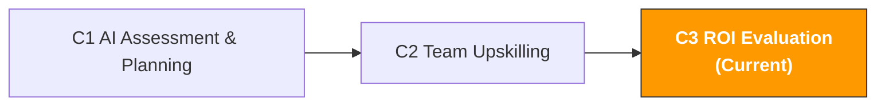

[🇨🇳 中文](../../paths/c-managers/c3-roi-evaluation.md) | 🇺🇸 English

# C3. AI Project ROI Evaluation

> **Path**: Path C: Managers · **Module**: C3
> **Last Updated**: 2026-03-12
> **Difficulty**: Intermediate
> **Estimated Time**: 1-2 hours
> **Prerequisites**: [C1 AI Capability Assessment & Planning](c1-ai-assessment.md), [C2 AI Team Upskilling](c2-team-building.md)
---

[Hub Home](../../README.md) · [Path C Overview](README.md)



---

## Module Navigation

1. [ROI Methodology](#1-roi-evaluation-methodology) · 2. [Calculation Framework](#2-roi-calculation-framework-detailed) · 3. [Benchmark Data](#3-cross-border-e-commerce-ai-roi-benchmark-data) · 4. [Data Collection](#4-roi-data-collection-methods) · 5. [Prompt Templates](#5-prompt-templates-for-roi-evaluation) · 6. [Case Studies](#6-roi-evaluation-case-studies) · 7. [Optimization Strategies](#7-roi-optimization-strategies) · 8. [Report Templates](#8-roi-report-templates) · 9. [Common Pitfalls](#9-common-pitfalls-and-misconceptions) · 10. [Long-term Perspective](#10-advanced-the-long-term-view-of-ai-roi) · 11. [Learning Resources](#11-learning-resources) · 12. [ OpenClaw Automation](#12-using-openclaw-to-automate-roi-tracking) · 13. [Completion Checklist](#13-completion-checklist)


## What You'll Produce in This Module

A complete AI project ROI evaluation report.

After completing this module, you'll be able to:

- Quantify the full cost of AI investment using a five-dimension framework (not just tool subscriptions)
- Measure the full value of AI output using four categories of metrics (not just "how much time we saved")
- Calculate ROI, payback period, and net present value for each AI use case
- Prove the value of AI investment to leadership with data
- Identify the highest and lowest ROI scenarios to optimize resource allocation

> **Core Principle**: ROI is not "it feels like efficiency improved after using AI." ROI is a precise number: for every $1 invested, how many dollars returned. Without numbers, there's no persuasion. This module helps you upgrade from "feels useful" to "proven useful."

---

## 1. ROI Evaluation Methodology

> **Related Reading**: [A3 Advertising Optimization](../a-operators/a3-advertising.md#2-ai-tool-landscape-what-to-use-for-ads) See A3 for hands-on ROAS calculation and optimization methodology. · [AI Application Landscape](../0-foundations/ai-landscape.md#ai-application-landscape-assessment-ai-application-landscape-for-cross-border-e-commerce) See AI Landscape for the AI tool ROI quantification framework.

### 1.1 Why Most AI ROI Evaluations Are Unreliable

According to S&P Global data, 42% of companies abandoned most AI projects in 2025, primarily due to unclear costs and value. MIT research further indicates that 95% of AI projects fail to achieve expected financial returns.

Three common mistakes in cross-border e-commerce team AI ROI evaluation:

| Mistake | Symptoms | Consequence |
|------|------|------|
| **Only counting tool costs** | "We spend $200/month on ChatGPT subscriptions" | Ignores learning time, training costs, review costs actual investment is far higher than $200 |
| **Only counting time savings** | "AI saves us 100 hours per month" | Time savings ≠ value creation. If saved time isn't spent on higher-value work, ROI is zero |
| **No baseline** | "Efficiency improved after using AI" | Without "before AI" baseline data, you can't quantify improvement or rule out other factors |

Content rephrased for compliance with licensing restrictions. Sources: [S&P Global AI Report](https://www.spglobal.com/), [MIT AI Research](https://mitsloan.mit.edu/)

### 1.2 The Complete AI ROI Formula

```
AI ROI (%) = (Total Value Created by AI - Total Cost of AI) / Total Cost of AI × 100%
```

Looks simple, but the key lies in defining "total value" and "total cost." Most people underestimate costs and overestimate value.

**Five Dimensions of Total Cost:**

```
AI Total Cost = Tool Cost + Learning Cost + Implementation Cost + Operating Cost + Opportunity Cost

1. Tool Cost (Direct)
AI tool subscriptions (ChatGPT Plus, Claude Pro, etc.)
Auxiliary tool fees (Helium 10, Jungle Scout, etc.)
API call fees (if using APIs)

2. Learning Cost (One-time)
Training hours × number of participants × hourly rate
External training course fees (if any)
Champion's extra time investment × hourly rate

3. Implementation Cost (One-time)
Prompt library setup time × hourly rate
Usage guidelines development time × hourly rate
Workflow adjustment time × hourly rate

4. Operating Cost (Ongoing)
Human review time for AI output × hourly rate
Prompt library maintenance time × hourly rate
Ongoing training time × hourly rate
Tool management and account administration time × hourly rate

5. Opportunity Cost
Reduced output during AI learning period
Efficiency loss during trial-and-error period
```

**Four Dimensions of Total Value:**

```
AI Total Value = Time Savings Value + Quality Improvement Value + Business Growth Value + Risk Reduction Value

1. Time Savings Value (Easiest to quantify)
Hours saved × hourly rate
Note: Only time that gets redeployed has value

2. Quality Improvement Value (Medium difficulty to quantify)
Listing quality improvement → conversion rate increase → incremental sales
Ad copy optimization → ACOS decrease → ad cost savings
CS reply quality improvement → customer satisfaction increase → repeat purchase rate increase

3. Business Growth Value (Harder to quantify)
AI-assisted product research → new category opportunities → new product revenue
AI-assisted market analysis → better decisions → avoided losses
Multilingual capability improvement → new market expansion → incremental revenue

4. Risk Reduction Value (Hardest to quantify)
Compliance check automation → reduced violation risk → avoided fines/delisting losses
Inventory forecasting improvement → reduced stockouts/overstock → avoided losses
Competitor monitoring → faster market response → avoided market share loss
```

### 1.3 Three Levels of ROI Evaluation

Different evaluation levels suit different decision scenarios:

| Level | Method | Best For | Accuracy | Time Required |
|------|------|----------|--------|----------|
| **Quick Estimate** | Simple cost-benefit comparison | Daily reporting, quick decisions | Low (±50%) | 30 minutes |
| **Standard Evaluation** | Five-dimension cost + four-dimension value | Quarterly reviews, budget requests | Medium (±20%) | 2-4 hours |
| **Deep Analysis** | NPV/DCF + sensitivity analysis + control groups | Annual planning, large investment decisions | High (±10%) | 1-2 days |

> **Recommendation**: Most cross-border e-commerce teams only need the "Standard Evaluation." Use "Quick Estimate" for daily communication, and "Deep Analysis" only when requesting large budgets from senior leadership.

---

## 2. ROI Calculation Framework (Detailed)

### 2.1 Quick Estimate Method: Calculate ROI in 5 Minutes

Suitable for daily communication and quick decisions. You only need three numbers:

```
Monthly AI tool cost: $[A]
Monthly hours saved: [B] hours
Team average hourly rate: $[C]

Monthly ROI = (B × C - A) / A × 100%
Payback period = A / (B × C) months (usually < 1 month)
```

**Example:**

```
Monthly AI tool cost: $100 (ChatGPT Plus × 5 accounts)
Monthly hours saved: 80 hours (10-person team, each saving 8 hours/month)
Team average hourly rate: $15

Monthly net benefit = 80 × $15 - $100 = $1,100
Monthly ROI = $1,100 / $100 × 100% = 1,100%
Payback period = $100 / (80 × $15) = 0.08 months ≈ 2.5 days
```

> **Note**: The Quick Estimate method significantly overestimates ROI because it ignores learning costs, review costs, and other hidden costs. But it's sufficient for daily communication: "We spend $100 on AI tools and save $1,200 worth of work hours per month."

### 2.2 Standard Evaluation Method: Complete ROI Calculation

Suitable for quarterly reviews and budget requests. Requires collecting detailed cost and value data.

**Step 1: Calculate Total Cost**

| Cost Item | Calculation | Monthly Amount | Notes |
|--------|----------|----------|------|
| AI tool subscriptions | ChatGPT Plus × [N] accounts × $20 | $[X] | Direct cost |
| Auxiliary tools | Helium 10 etc. × monthly fee | $[X] | If newly added for AI |
| Training time | [N] hours × [N] people × $[hourly rate] / amortization months | $[X] | One-time cost amortized over 6 months |
| Prompt library setup | [N] hours × $[hourly rate] / amortization months | $[X] | One-time cost amortized over 12 months |
| AI output review | [N] hours/month × $[hourly rate] | $[X] | Ongoing cost |
| Prompt library maintenance | [N] hours/month × $[hourly rate] | $[X] | Ongoing cost |
| Ongoing training | [N] hours/month × [N] people × $[hourly rate] | $[X] | Ongoing cost |
| **Monthly Total Cost** | | **$[Total]** | |

**Step 2: Calculate Total Value**

| Value Item | Calculation | Monthly Amount | Data Source |
|--------|----------|----------|----------|
| Listing writing time savings | [hours saved] × [frequency/month] × $[hourly rate] | $[X] | Compare before/after AI writing time |
| Review analysis time savings | [hours saved] × [frequency/month] × $[hourly rate] | $[X] | Compare before/after AI analysis time |
| Search term analysis time savings | [hours saved] × [frequency/month] × $[hourly rate] | $[X] | Compare before/after AI analysis time |
| CS reply time savings | [hours saved] × [frequency/month] × $[hourly rate] | $[X] | Compare before/after AI reply time |
| Ad copy generation time savings | [hours saved] × [frequency/month] × $[hourly rate] | $[X] | Compare before/after AI generation time |
| Listing quality improvement → CR increase | [CR increase %] × [monthly traffic] × [AOV] | $[X] | A/B test data |
| Ad optimization → ACOS decrease | [ACOS decrease %] × [monthly ad spend] | $[X] | Ad report comparison |
| **Monthly Total Value** | | **$[Total]** | |

**Step 3: Calculate ROI**

```
Monthly net benefit = Monthly total value - Monthly total cost
Monthly ROI = Monthly net benefit / Monthly total cost × 100%
Annual ROI = Annual net benefit / Annual total cost × 100%
Payback period = Total one-time investment / Monthly net benefit
```

### 2.3 Deep Analysis Method: NPV and Sensitivity Analysis

Suitable for large investment decisions (e.g., introducing enterprise AI tools, hiring AI specialists).

**Net Present Value (NPV) Calculation:**

```
NPV = Σ (Annual net benefit_t / (1 + r)^t) - Initial investment

Where:
- t = year (1, 2, 3...)
- r = discount rate (typically use company's cost of capital; 10-15% for e-commerce teams)
- Initial investment = first-year one-time costs (training, setup, tool procurement, etc.)
```

**Sensitivity Analysis:**

Test how changes in key assumptions affect ROI:

| Variable | Pessimistic | Baseline | Optimistic |
|------|---------|---------|---------|
| Time savings magnitude | 30% | 50% | 70% |
| Team adoption rate | 50% | 80% | 95% |
| Tool cost growth | +20%/year | +10%/year | 0%/year |
| Quality improvement → CR increase | 0% | 5% | 10% |

```
Pessimistic ROI = [calculated result]
Baseline ROI = [calculated result]
Optimistic ROI = [calculated result]

If ROI is still > 0 in the pessimistic scenario, the investment is robust.
```

Content rephrased for compliance with licensing restrictions. Sources: [Workmate AI ROI Frameworks](https://www.workmate.com/blog/measuring-roi-for-ai-initiatives-frameworks-and-examples), [Technijian AI ROI Calculator](https://technijian.com/ai/how-to-calculate-roi-on-ai-projects-a-framework-for-enterprise-leaders-in-2026/)

---

## 3. Cross-border E-commerce AI ROI Benchmark Data

### 3.1 ROI Benchmarks by Scenario

Based on industry data and real cases, here are ROI benchmarks for common AI use cases in cross-border e-commerce. Use these as reference, but always replace with your own team's actual data.

| Scenario | Before AI | After AI | Time Saved | Monthly Freq | Monthly Hours Saved | Monthly Cost Saved ($15/h) | Tool Monthly Cost | Monthly ROI |
|------|----------|----------|---------|--------|--------|------------------|-----------|--------|
| **Listing Copywriting** | 4 hrs/each | 1.5 hrs/each | 62% | 10 | 25h | $375 | $20 | 1,775% |
| **Competitor Review Analysis** | 3 hrs/session | 20 min/session | 89% | 8 | 21h | $315 | $20 | 1,475% |
| **Search Term Report Analysis** | 2 hrs/session | 30 min/session | 75% | 4 | 6h | $90 | $20 | 350% |
| **CS Reply Generation** | 15 min/reply | 3 min/reply | 80% | 200 | 40h | $600 | $20 | 2,900% |
| **Ad Copy A/B Testing** | 1 hr/set | 15 min/set | 75% | 8 | 6h | $90 | $20 | 350% |
| **Multilingual Translation/Localization** | 2 hrs/each | 30 min/each | 75% | 10 | 15h | $225 | $20 | 1,025% |
| **Product Market Assessment** | 6 hrs/each | 2 hrs/each | 67% | 4 | 16h | $240 | $20 | 1,100% |
| **Compliance Document Preparation** | 4 hrs/doc | 1 hr/doc | 75% | 2 | 6h | $90 | $20 | 350% |

> **Important Note**: The data above is based on "proficient AI usage." During the learning phase (first 1-2 months), time savings are typically only 50-70% of the table above, as people are still learning to write good Prompts and review AI output.

### 3.2 Industry ROI Reference Data

| Source | Key Finding | Link |
|----------|----------|------|
| Technijian 2026 | Companies strategically deploying AI report $3.70 return per $1 invested; supply chain and financial operations see 26-31% cost savings | [technijian.com](https://technijian.com/ai/how-to-calculate-roi-on-ai-projects-a-framework-for-enterprise-leaders-in-2026/) |
| Microsoft 2025 | 70% of Copilot users report productivity gains; task completion speed improved 25-40% | [windowsnews.ai](https://windowsnews.ai/article/microsoft-365-copilot-roi-measuring-ais-true-business-impact-beyond-time-savings.400597) |
| Entrepreneur 2026 | AI advertising and personalization can boost ROAS by 20-30% | [entrepreneur.com](https://www.entrepreneur.com/growing-a-business/how-to-use-ai-to-grow-your-amazon-sales-rankings-and/499421) |
| Workmate 2026 | Typical AI projects break even within 12-24 months, achieving 10-30% cost savings or 2-5x revenue increase | [workmate.com](https://www.workmate.com/blog/measuring-roi-for-ai-initiatives-frameworks-and-examples) |
| Accenor 2025 | Companies typically underestimate total AI costs by 40-60%, leading to unrealistic ROI expectations | [accenor.com](https://www.accenor.com/blog/The-Complete-ROI-Framework-for-AI-Implementation-From-Cost-Analysis-to-Measurable-Outcomes.html) |

Content rephrased for compliance with licensing restrictions. Sources cited inline.

### 3.3 ROI Comparison Across Team Sizes

| Dimension | 5-Person Team | 20-Person Team | 50-Person Team |
|------|---------|----------|----------|
| Monthly tool cost | $40 | $250 | $900 |
| Monthly hidden costs (training, review, etc.) | $100 | $500 | $2,000 |
| Monthly total cost | $140 | $750 | $2,900 |
| Monthly time saved | 60h | 300h | 800h |
| Monthly time savings value ($15/h) | $900 | $4,500 | $12,000 |
| Monthly net benefit | $760 | $3,750 | $9,100 |
| Monthly ROI | 543% | 500% | 314% |
| Payback period | < 1 week | < 1 week | 2 weeks |

> **Key Insight**: The larger the team, the higher the absolute ROI (more net benefit), but the ROI percentage actually decreases. This is because hidden costs for large teams (training, management, coordination) grow faster than value. This means large teams need systematic AI management, not just "buying more accounts."

---

## 4. ROI Data Collection Methods

### 4.1 Establishing Baselines: Pre-AI Data

Before introducing AI (or during the first week of evaluation), record the following baseline data:

**Time Baseline (Must collect):**

| Task | Owner | Time per Session | Monthly Frequency | Monthly Total Time | Recording Method |
|------|--------|----------|--------|----------|----------|
| Listing copywriting | [Name] | [X] hours | [X] times | [X] hours | Timer/self-report |
| Review analysis | [Name] | [X] hours | [X] times | [X] hours | Timer/self-report |
| Search term report analysis | [Name] | [X] hours | [X] times | [X] hours | Timer/self-report |
| Customer service replies | [Name] | [X] min/reply | [X] replies | [X] hours | System records |
| Ad copy generation | [Name] | [X] hours | [X] times | [X] hours | Timer/self-report |
| Multilingual translation | [Name] | [X] hours/each | [X] items | [X] hours | Timer/self-report |

**Quality Baseline (Recommended):**

| Metric | Current Value | Data Source | Recording Frequency |
|------|--------|----------|----------|
| Listing conversion rate (CR) | [X]% | Business Report | Weekly |
| Advertising ACOS | [X]% | Advertising Report | Weekly |
| Customer satisfaction score | [X]/5 | CS system | Monthly |
| New product launch speed | [X] days/product | Internal records | Monthly |
| Compliance violations | [X] times/month | Seller Central | Monthly |

> **Collection Tip**: Don't make the team feel "monitored." Position baseline data collection as "understanding our work efficiency to find areas for improvement," not "seeing who works slowly."

### 4.2 Ongoing Tracking: Post-AI Data

After introducing AI, record data the same way and calculate changes:

**Weekly Tracking Template:**

```markdown
# AI Usage Impact Weekly Report Week [X]

## Time Savings
| Task | Before AI | This Week | Time Saved | Savings % |
|------|----------|----------|----------|----------|
| Listing writing | 4h | 1.5h | 2.5h | 62% |
| Review analysis | 3h | 0.3h | 2.7h | 89% |
| ... | ... | ... | ... | ... |
| **Weekly Total** | **[X]h** | **[X]h** | **[X]h** | **[X]%** |

## Quality Changes
| Metric | Pre-AI Baseline | This Week | Change |
|------|----------|--------|------|
| Listing CR | [X]% | [X]% | +[X]% |
| ACOS | [X]% | [X]% | -[X]% |

## This Week's AI Usage
- People using AI: [X]/[total]
- New Prompt templates added: [X]
- Issues encountered: [description]

## Cumulative ROI
- Cumulative time saved: [X] hours
- Cumulative cost saved: $[X]
- Cumulative AI tool cost: $[X]
- Cumulative net benefit: $[X]
- Cumulative ROI: [X]%
```

### 4.3 Common Data Collection Issues

| Issue | Solution |
|------|----------|
| "Team won't record time" | Simplify recording: just note "used AI" and "roughly how long" when completing a task no need for minute-level precision |
| "Hard to isolate AI's contribution from other factors" | Use A/B comparison: same task, once with AI and once without, compare time and quality |
| "Quality improvements are hard to quantify" | Use proxy metrics: Listing quality → conversion rate change; CS quality → customer rating change |
| "Data isn't precise enough" | Accept ±20% margin of error. ROI evaluation aims for "directionally correct," not "precise to the decimal" |
| "Collecting data is too much work" | Only track the 3-5 most important scenarios; no need to cover all AI usage |

---

## 5. Prompt Templates (For ROI Evaluation)

### 5.1 AI ROI Quick Calculator

**Why this Prompt works:** It requires you to provide specific numbers (costs, time, frequency), and AI will do the complete calculation and output a structured ROI report. Much faster than manual Excel calculations, and less likely to miss cost items.

```
你是一个 AI 投资回报分析师。请帮我计算团队 AI 使用的 ROI。

成本数据：
- AI 工具月度订阅费：$[X]（[工具名称] × [账号数]）
- 初始培训投入：[X] 小时 × [X] 人 × $[时薪]（一次性）
- Prompt 库搭建：[X] 小时 × $[时薪]（一次性）
- 每月 AI 输出审核时间：[X] 小时 × $[时薪]
- 每月持续培训时间：[X] 小时 × [X] 人 × $[时薪]

价值数据（AI 前 vs AI 后）：
- Listing 撰写：[X]h → [X]h，每月 [X] 个
- Review 分析：[X]h → [X]h，每月 [X] 次
- 搜索词分析：[X]h → [X]h，每月 [X] 次
- 客服回复：[X]min → [X]min，每月 [X] 条
- [其他场景]：[X]h → [X]h，每月 [X] 次

团队平均时薪：$[X]

请输出：

1. **成本分析**
- 月度直接成本
- 月度间接成本（培训、审核等摊销）
- 月度总成本

2. **价值分析**
- 各场景的月度时间节省和成本节省
- 总月度时间节省
- 总月度成本节省

3. **ROI 计算**
- 月度 ROI（%）
- 年度 ROI（%）
- 回本周期
- 每投入 $1 的回报

4. **场景排名**
- 按 ROI 从高到低排列各场景
- 标注哪些场景 ROI 最高（应该加大投入）
- 标注哪些场景 ROI 最低（需要优化或放弃）

5. **优化建议**
- 如何进一步提升 ROI
- 哪些成本可以降低
- 哪些价值可以增加
```

### 5.2 AI Investment Budget Request Report

**Why this Prompt works:** It helps you generate a budget request report ready to submit to leadership, complete with data support, ROI projections, and risk analysis. Leadership cares most about "how much it costs, what the return is, and how quickly it pays back."

```
你是一个商业分析师。请帮我撰写一份 AI 工具投资预算申请报告。

当前情况：
- 团队规模：[X] 人
- 当前 AI 工具支出：$[X]/月
- 当前 AI 使用效果：[描述已有的 ROI 数据]

申请内容：
- 申请增加的预算：$[X]/月
- 用途：[如"升级到 ChatGPT Team 版"、"新增 Claude Pro 账号"、"引入 Helium 10"]
- 预期效果：[描述预期的效率提升]

请输出一份 1-2 页的预算申请报告：

1. **执行摘要**（3-5 句话，管理层只看这段）
- 申请金额、预期回报、回本周期

2. **当前成果**
- 已有的 AI 使用 ROI 数据（用表格展示）
- 团队 AI 使用率和满意度

3. **投资方案**
- 方案 A：最低投入（只升级最必要的）
- 方案 B：推荐投入（性价比最优）
- 方案 C：充足投入（全面覆盖）
- 每个方案的成本、预期回报、ROI

4. **风险分析**
- 主要风险和应对措施
- 悲观/基准/乐观三种情景的 ROI

5. **实施计划**
- 时间线
- 里程碑
- 效果衡量方式

6. **结论和建议**
- 推荐哪个方案
- 为什么
```

### 5.3 AI Project Retrospective Analysis

```
你是一个项目复盘专家。请帮我对团队过去 [X] 个月的 AI 使用进行复盘分析。

数据：
- 初始 AI 成熟度评分：[X] 分
- 当前 AI 成熟度评分：[X] 分
- 月度 AI 工具成本：$[X]
- 月度时间节省：[X] 小时
- 团队 AI 使用率：[X]%
- Prompt 库模板数：[X] 个
- 主要使用场景和效果：[列出]

请输出复盘报告：

1. **成果总结**
- 量化的成果（时间节省、成本节省、ROI）
- 定性的成果（团队能力提升、工作质量改善）

2. **做得好的地方**
- 哪些场景 ROI 最高？为什么？
- 哪些做法最有效？

3. **需要改进的地方**
- 哪些场景 ROI 低于预期？原因是什么？
- 哪些问题反复出现？

4. **下一阶段计划**
- 应该加大投入的场景
- 应该优化或放弃的场景
- 新的 AI 应用机会
- 下一阶段的目标和 KPI

5. **关键学习**
- 3 个最重要的经验教训
- 对其他团队的建议
```

### 5.4 Competitor AI Usage Intelligence Analysis

```
你是一个竞争情报分析师。请帮我分析竞争对手的 AI 使用情况，评估我们的 AI 投入是否足够。

我们的情况：
- 行业：跨境电商，主要在 Amazon [US/EU/JP]
- 团队规模：[X] 人
- 当前 AI 工具支出：$[X]/月
- 主要 AI 使用场景：[列出]

请分析：

1. **行业 AI 采用现状**
- 跨境电商行业的 AI 采用率
- 主流卖家使用的 AI 工具和场景
- 行业平均 AI 投入水平

2. **竞争差距分析**
- 我们的 AI 使用水平在行业中处于什么位置？
- 竞争对手可能在哪些场景使用了 AI 而我们没有？
- 这些差距对业务的潜在影响

3. **投资建议**
- 为了保持竞争力，我们应该在哪些场景加大 AI 投入？
- 优先级排序和预算建议
- 预期的竞争优势

4. **风险评估**
- 如果我们不增加 AI 投入，可能面临的竞争风险
- 如果竞争对手加速 AI 采用，我们的应对策略
```

### 5.5 AI Cost Optimization Analysis

```
你是一个成本优化专家。请帮我分析团队 AI 使用的成本结构，找到优化空间。

当前成本结构：
- AI 工具订阅：$[X]/月（[列出每个工具和费用]）
- 各工具的使用率：[列出每个工具的实际使用频率]
- 团队人数：[X] 人，其中 [X] 人有付费账号
- 每月 AI 使用总时长：约 [X] 小时

请分析：

1. **成本效率分析**
- 每个工具的单位成本（$/使用小时）
- 哪些工具的使用率低于 50%？
- 是否有功能重叠的工具？

2. **优化方案**
- 方案 A：降低成本但保持效果
- 可以退订哪些工具？
- 可以降级哪些工具（如从 Pro 降到 Plus）？
- 预计节省多少？

- 方案 B：保持成本但提升效果
- 如何提高现有工具的使用率？
- 哪些未使用的功能值得探索？
- 预计增加多少价值？

- 方案 C：增加成本但大幅提升效果
- 值得引入的新工具
- 预期的额外 ROI
- 投入产出比分析

3. **账号管理优化**
- 是否所有人都需要付费账号？
- 团队版 vs 个人版的成本对比
- 年付 vs 月付的成本差异

4. **长期成本预测**
- 未来 12 个月的成本趋势
- AI 工具涨价的风险和应对
- 从 SaaS 工具迁移到 API 调用的可能性和成本对比
```

---

## 6. ROI Evaluation Case Studies

### 6.1 Case 1: 6-Month ROI Evaluation for a 10-Person Team

**Background:**
- Team: 6 Operations + 2 Advertising + 2 Customer Service
- AI tools: ChatGPT Plus × 5 accounts ($100/month)
- Evaluation period: 6 months

**Cost Breakdown:**

| Cost Item | Amount | Calculation |
|--------|------|----------|
| Tool subscriptions (6 months) | $600 | $100/month × 6 months |
| Initial training (one-time) | $450 | 2h × 10 people × $15/h + Champion extra 10h × $15/h |
| Prompt library setup (one-time) | $300 | 20h × $15/h |
| AI output review (6 months) | $540 | 6h/month × $15/h × 6 months |
| Ongoing training (6 months) | $270 | 1h/month × 3 people × $15/h × 6 months |
| Prompt library maintenance (6 months) | $180 | 2h/month × $15/h × 6 months |
| **6-Month Total Cost** | **$2,340** | |

**Value Breakdown:**

| Scenario | Before AI | After AI | Monthly Hours Saved | Monthly Cost Saved | 6-Month Total Value |
|------|-------|-------|--------|----------|-----------|
| Listing writing | 4h/each × 8 = 32h | 1.5h/each × 8 = 12h | 20h | $300 | $1,800 |
| Review analysis | 3h/session × 6 = 18h | 0.3h/session × 6 = 1.8h | 16.2h | $243 | $1,458 |
| Search term analysis | 2h/session × 4 = 8h | 0.5h/session × 4 = 2h | 6h | $90 | $540 |
| CS replies | 15min/reply × 150 = 37.5h | 3min/reply × 150 = 7.5h | 30h | $450 | $2,700 |
| Ad copy | 1h/set × 6 = 6h | 0.25h/set × 6 = 1.5h | 4.5h | $67.5 | $405 |
| Multilingual translation | 2h/each × 6 = 12h | 0.5h/each × 6 = 3h | 9h | $135 | $810 |
| **Monthly Total** | **113.5h** | **27.8h** | **85.7h** | **$1,285.5** | **$7,713** |

**ROI Calculation:**

```
6-month total value: $7,713
6-month total cost: $2,340
6-month net benefit: $7,713 - $2,340 = $5,373
6-month ROI: $5,373 / $2,340 × 100% = 230%
Monthly average ROI: ($1,285.5 - $390) / $390 × 100% = 230%
Payback period: $2,340 / $1,285.5 = 1.8 months
Return per $1 invested: $3.30
```

**Additional Quality Improvement Value (not included in ROI above):**

| Metric | Before AI | After AI | Change | Estimated Value |
|------|-------|-------|------|----------|
| Average Listing CR | 12.5% | 13.8% | +1.3% | ~$2,000/month incremental sales |
| Advertising ACOS | 28% | 24% | -4% | ~$200/month ad cost savings |
| Customer satisfaction | 4.1/5 | 4.4/5 | +0.3 | Difficult to directly quantify |

> **Key Finding**: Time savings alone already yield 230% ROI. If you add quality improvement-driven business growth, actual ROI likely exceeds 400%.

### 6.2 Case 2: Diagnosing Below-expectation ROI

**Background:**
An 8-person team felt "results weren't obvious" after 3 months of AI usage.

**Diagnosis:**

| Check Item | Finding | Problem |
|--------|------|------|
| Tool usage rate | Only 3/8 people using AI | Adoption rate too low; most people haven't changed their work habits |
| Use cases | Only used for Listing writing | Too few scenarios; not covering high-frequency tasks |
| Prompt quality | Most people using simple one-line Prompts | Low Prompt quality → poor AI output → "AI is useless" impression |
| Review process | No review process established | AI output used directly; errors occurred, eroding team trust in AI |
| Data recording | No before/after time comparisons recorded | Can't quantify results; manager can only go by "feeling" |

**Optimization Plan:**

| Problem | Solution | Expected Result |
|------|----------|----------|
| Low adoption | Designate Champion, one AI task per day | Adoption from 37% to 80% |
| Too few scenarios | Expand to Review analysis, search term analysis, CS replies | Cover 5+ scenarios |
| Low Prompt quality | Build Prompt library, provide standard templates | AI output quality improves 50%+ |
| No review process | Establish three-tier review system | Reduce errors, build trust |
| No data | Establish weekly tracking template | Can quantify ROI |

**Results 3 months after optimization:**
- Adoption rate: 37% → 87%
- Monthly time savings: 15h → 65h
- Monthly ROI: from "uncertain" to 380%

> **Core Lesson**: Below-expectation ROI is usually not an AI tool problem it's an adoption rate and usage quality problem. The solution isn't switching tools; it's improving the team's usage capability.

### 6.3 Case 3: Reporting AI ROI to Leadership

**Scenario:** You need to report AI usage ROI at a quarterly business review.

**Presentation Structure (5-minute version):**

```
Slide 1: One-sentence Summary (30 seconds)
"Over the past 3 months, we invested $X in AI tools, generated $Y in value,
ROI of Z%, with a payback period of less than X weeks."

Slide 2: Cost vs Value Comparison Chart (1 minute)
- Left: Total cost bar chart (tools + training + review)
- Right: Total value bar chart (time savings + quality improvement)
- Center: Net benefit number

Slide 3: ROI Ranking by Scenario (1 minute)
- Table: Scenario | Investment | Return | ROI
- Highlight Top 3 and Bottom 3

Slide 4: Team Changes (1 minute)
- AI usage rate trend curve
- AI maturity score changes
- 1-2 specific success stories

Slide 5: Next Steps (1.5 minutes)
- Scenarios to increase investment in (high ROI)
- Scenarios to optimize (low ROI)
- Next quarter's goals and budget needs
```

**The 3 Questions Leadership Cares About Most:**

| Question | Prepared Answer |
|------|-------------|
| "How much did we spend?" | "Monthly total cost $X, of which tools $Y, labor $Z" |
| "How much did we save?" | "Monthly net benefit $X, equivalent to $Y return per $1 invested" |
| "Is it worth continuing?" | "Yes. ROI is X%, and it's still growing as team proficiency improves. Recommend increasing budget by $X next quarter for [specific purpose]" |

---

## 7. ROI Optimization Strategies

### 7.1 Five Levers to Improve ROI

```
Lever 1: Increase Adoption Rate (Biggest lever)
Current: [X]% of people use AI daily
Target: 80%+
Method: Champion mechanism + daily tasks + incentives
Expected Impact: ROI improvement 50-100%

Lever 2: Expand Use Cases
Current: [X] scenarios
Target: [X+3] scenarios
Method: Expand gradually per C1 priority matrix
Expected Impact: ROI improvement 30-50%

Lever 3: Improve Prompt Quality
Current: Most people use simple Prompts
Target: Everyone uses standardized Prompt templates
Method: Prompt library + advanced training
Expected Impact: AI output quality up 50%, review time down 30%

Lever 4: Reduce Hidden Costs
Current: Review time [X]h/month
Target: Reduce review time by 50%
Method: Better Prompt quality → better AI output → faster review
Expected Impact: Cost reduction 15-20%

Lever 5: Capture Quality Improvement Value
Current: Only measuring time savings
Target: Also measure quality improvement-driven business growth
Method: Track CR, ACOS, and other business metrics
Expected Impact: Measurable ROI improvement 50-100%
```

### 7.2 ROI Optimization Recommendations by Scenario

| Scenario | Current ROI | Optimization Direction | Expected ROI Improvement |
|------|---------|---------|-------------|
| Listing writing | High | Add A/B testing, track CR changes | +30% (adding quality value) |
| Review analysis | High | Expand to multi-competitor comparison, increase frequency | +20% (increasing usage frequency) |
| Search term analysis | Medium | Build standardized analysis workflow, reduce manual intervention | +40% (reducing review cost) |
| CS replies | Very high | Build reply template library, reduce repeated generation | +15% (reducing usage cost) |
| Ad copy | Medium | Track A/B test results, quantify conversion improvement | +50% (adding quality value) |
| Product research | Medium-low | Combine with paid tool data, improve analysis accuracy | +30% (improving output quality) |

### 7.3 When to Stop or Adjust AI Investment

Not all AI applications are worth continued investment. These signals indicate adjustment is needed:

| Signal | Meaning | Recommended Action |
|------|------|----------|
| A scenario's ROI < 50% for 3 consecutive months | This scenario's AI application isn't working well | Analyze cause: Prompt quality issue or scenario fundamentally unsuitable for AI |
| Tool usage rate < 30% for 2 consecutive months | Team doesn't accept this tool | Switch tools or retrain |
| AI output error rate > 20% | Prompt quality or scenario mismatch | Optimize Prompts or abandon this scenario |
| Review time > AI generation time | AI isn't actually improving efficiency | Improve Prompt quality or simplify review process |
| Team complaints increasing | AI is adding workload rather than reducing it | Re-evaluate usage process; may need simplification |

---

## 8. ROI Report Templates

### 8.1 Monthly ROI Report Template

```markdown
# AI Usage Monthly ROI Report
**Reporting Period**: [YYYY-MM]
**Author**: [Name]

## 1. Executive Summary
This month's total AI investment: $[X], value generated: $[Y], net benefit: $[Z], ROI: [W]%.
[One sentence summarizing this month's highlight or issue]

## 2. Cost Breakdown
| Cost Item | This Month | Last Month | Change |
|--------|----------|----------|------|
| Tool subscriptions | $[X] | $[X] | [+/-X%] |
| Review time cost | $[X] | $[X] | [+/-X%] |
| Training time cost | $[X] | $[X] | [+/-X%] |
| Other | $[X] | $[X] | [+/-X%] |
| **Total** | **$[X]** | **$[X]** | **[+/-X%]** |

## 3. Value Breakdown
| Scenario | Monthly Hours Saved | Monthly Cost Saved | Last Month | Change |
|------|--------|----------|-----------|------|
| Listing writing | [X]h | $[X] | $[X] | [+/-X%] |
| Review analysis | [X]h | $[X] | $[X] | [+/-X%] |
| [Other scenarios] | [X]h | $[X] | $[X] | [+/-X%] |
| **Total** | **[X]h** | **$[X]** | **$[X]** | **[+/-X%]** |

## 4. ROI Metrics
| Metric | This Month | Last Month | Trend |
|------|------|------|------|
| Monthly ROI | [X]% | [X]% | [↑/↓/→] |
| Cumulative ROI | [X]% | [X]% | [↑/↓/→] |
| Team usage rate | [X]% | [X]% | [↑/↓/→] |
| Prompt library templates | [X] | [X] | [↑/↓/→] |

## 5. This Month's Highlights
- [Highlight 1]
- [Highlight 2]

## 6. This Month's Issues
- [Issue 1 + solution]
- [Issue 2 + solution]

## 7. Next Month's Plan
- [Plan 1]
- [Plan 2]
```

### 8.2 Quarterly ROI Review Report Template

```markdown
# AI Usage Quarterly ROI Review Report
**Review Period**: [YYYY Q[X]]
**Author**: [Name]

## 1. Executive Summary
This quarter's total AI investment: $[X], total output: $[Y], net benefit: $[Z], ROI: [W]%.
Return per $1 invested: $[X]. Payback period: [X] weeks.

## 2. Quarterly Cost Trend
| Month | Tool Cost | Labor Cost | Total Cost | MoM Change |
|------|---------|---------|--------|---------|
| Month 1 | $[X] | $[X] | $[X] | |
| Month 2 | $[X] | $[X] | $[X] | [+/-X%] |
| Month 3 | $[X] | $[X] | $[X] | [+/-X%] |

## 3. Quarterly Value Trend
| Month | Time Saved | Cost Saved | Quality Value | Total Value | MoM Change |
|------|---------|---------|---------|--------|---------|
| Month 1 | [X]h | $[X] | $[X] | $[X] | |
| Month 2 | [X]h | $[X] | $[X] | $[X] | [+/-X%] |
| Month 3 | [X]h | $[X] | $[X] | $[X] | [+/-X%] |

## 4. ROI Ranking by Scenario
| Rank | Scenario | Quarterly Investment | Quarterly Return | ROI | Recommendation |
|------|------|---------|---------|-----|------|
| 1 | [Scenario] | $[X] | $[X] | [X]% | Increase investment |
| 2 | [Scenario] | $[X] | $[X] | [X]% | Maintain |
| ... | ... | ... | ... | ... | ... |

## 5. Team AI Maturity Changes
| Metric | Quarter Start | Quarter End | Change |
|------|--------|--------|------|
| AI maturity score | [X] | [X] | +[X] |
| Team usage rate | [X]% | [X]% | +[X]% |
| Prompt library templates | [X] | [X] | +[X] |

## 6. Next Quarter Plan
### Budget Needs
| Item | Amount | Justification |
|------|------|------|
| [Item 1] | $[X] | [Reason] |
| [Item 2] | $[X] | [Reason] |

### Goals
- ROI target: [X]%
- Usage rate target: [X]%
- New scenarios: [list]
```

---

## 9. Common Pitfalls and Misconceptions

### 9.1 ROI Calculation Pitfalls

| Pitfall | Symptoms | How to Avoid |
|------|------|----------|
| **Only counting direct costs** | "We only spend $100/month on AI" | Add training, review, maintenance, and other hidden costs actual cost is typically 3-5x the tool fee |
| **Overestimating time savings** | "AI saved me 4 hours" → actually only 2 hours | Use a timer for actual measurement; don't estimate by feel |
| **Ignoring the learning curve** | Using proficiency-period data to represent overall results | Calculate ROI separately for beginner and proficient periods, take weighted average |
| **Double counting** | Same time savings counted across multiple scenarios | Ensure each hour is only counted once |
| **Ignoring quality costs** | Rework time from AI output errors not included in costs | Include review and rework time in costs |
| **Survivorship bias** | Only counting successful cases, ignoring failed attempts | Record all AI usage, including cases with poor results |

### 9.2 Value Assessment Misconceptions

| Misconception | Explanation | Correct Approach |
|------|------|----------|
| **Time savings ≠ value creation** | If saved time is spent scrolling social media, ROI is zero | Track what the saved time is actually used for |
| **Correlation ≠ causation** | "Sales went up after using AI" ≠ "AI caused sales to go up" | Use A/B tests or control groups to rule out other factors |
| **Short-term effects ≠ long-term effects** | Novelty-driven short-term efficiency gains may not be sustainable | Track data for at least 3+ months |
| **Individual results ≠ team results** | Champion's ROI doesn't represent team average | Use team average data, not best-case examples |
| **Efficiency gains ≠ business growth** | Doing things faster doesn't mean doing them better | Track both efficiency metrics and business metrics |

### 9.3 Reporting Misconceptions

| Misconception | Symptoms | Correct Approach |
|------|------|----------|
| **Number dumping** | Report full of numbers with no insights | Every number should answer "so what" |
| **Only good news** | Only showing high-ROI scenarios | Also show scenarios needing improvement it shows you're managing seriously |
| **No baseline comparison** | "We save 80 hours per month" → leadership doesn't know if that's a lot | Add comparison: "equivalent to one full-time employee's workload" |
| **No action items** | Report ends with no next steps | Every report should include "recommended next steps" |

---

## 10. Advanced: The Long-term View of AI ROI

### 10.1 ROI Characteristics Across Three Investment Phases

```
Phase 1: Investment Period (Months 1-3)
Characteristics: High costs, low returns, ROI may be negative
Reason: Training costs concentrated, team still learning, efficiency gains not yet visible
Manager mindset: This is the investment period don't rush to see ROI
Key metrics: Adoption rate, learning progress (not ROI)

Phase 2: Return Period (Months 4-9)
Characteristics: Costs stabilize, returns grow rapidly, ROI rises fast
Reason: Team is proficient, Prompt library is built, use cases expanded
Manager mindset: This is the harvest period start quantifying ROI
Key metrics: Monthly ROI, time savings, quality improvements

Phase 3: Optimization Period (Month 10+)
Characteristics: ROI growth rate slows but absolute value continues growing
Reason: Easy-to-optimize scenarios already covered; remaining scenarios have diminishing ROI
Manager mindset: Optimize resource allocation, explore new AI applications
Key metrics: Marginal ROI, new scenario discovery, systematization level
```

### 10.2 From "Saving Time" to "Creating New Value"

Most teams' AI ROI evaluation stops at "how much time we saved." But AI's true value lies in "what new possibilities it creates":

| Level | Value Type | Example | Quantification Difficulty |
|------|---------|------|---------|
| Level 1 | Efficiency gains | Same work done in less time | Easy |
| Level 2 | Quality improvement | Better results in the same time | Medium |
| Level 3 | Capability expansion | Doing things that were previously impossible | Hard |
| Level 4 | Strategic advantage | Responding to market faster and better than competitors | Very hard |

**Specific examples of Level 3 and Level 4:**

| Previously Impossible | Now Possible | Potential Value |
|---------------|-------------|---------|
| Analyze 5 competitors' Reviews | Analyze 50 competitors' Reviews | Discover more market opportunities |
| Only do US Listings | Simultaneously create US/EU/JP multilingual Listings | Accelerate multi-marketplace expansion |
| Monthly competitor analysis | Weekly competitor analysis | Faster market response |
| Experience-based product research | Data-driven + AI-assisted product research | Higher product research success rate |
| Standardized CS replies | Personalized + multilingual CS replies | Higher customer satisfaction |

> **Core Insight**: Level 1 (efficiency gains) ROI has a ceiling you can save time down to zero at most. But Level 3-4 (capability expansion and strategic advantage) ROI has no ceiling new capabilities can create entirely new business growth.
---
### 10.3 The Compound Effect of AI ROI

AI ROI doesn't grow linearly it compounds:

```
Month 1: Learn to use AI for Listings → save 20 hours
Month 3: Prompt library built → save 60 hours + quality improvement
Month 6: AI embedded in workflows → save 80 hours + new capabilities
Month 12: Team AI culture formed → save 100 hours + innovation capability + competitive advantage
```

Sources of the compound effect:
1. **Prompt library accumulation**: Every good Prompt is a reusable asset; the more the team uses it, the more it grows
2. **Team skill improvement**: Higher proficiency → higher usage efficiency → more output in the same time
3. **Scenario expansion**: Success in one scenario transfers to others
4. **Culture formation**: When "using AI" becomes the team's default behavior, innovation happens naturally

---

## 11. Learning Resources

### 11.1 AI ROI Evaluation

| Resource | Source | Core Content | Link |
|------|------|----------|------|
| Measuring ROI for AI Initiatives | Workmate | Four ROI frameworks (cost-benefit, NPV, TEI, balanced scorecard) | [workmate.com](https://www.workmate.com/blog/measuring-roi-for-ai-initiatives-frameworks-and-examples) |
| AI ROI Framework for Enterprise Leaders | Technijian | Five-dimension AI value framework (cost reduction, productivity, revenue, risk, strategy) | [technijian.com](https://technijian.com/ai/how-to-calculate-roi-on-ai-projects-a-framework-for-enterprise-leaders-in-2026/) |
| AI ROI Measurement Framework | Larridin | From "feels useful" to "proven useful" methodology | [larridin.com](https://larridin.com/blog/ai-roi-measurement) |
| How to Calculate ROI on AI | AI Magazine | Why 49% of organizations struggle to quantify AI value, and solutions | [aimegazine.com](https://aimegazine.com/ai-roi-measurement-how-to-calculate-return-on/) |

Content rephrased for compliance with licensing restrictions. Sources cited inline.

### 11.2 Cross-border E-commerce AI Application ROI

| Resource | Source | Core Content | Link |
|------|------|----------|------|
| How to Use AI for Amazon Business | Entrepreneur | AI advertising and personalization can boost ROAS by 20-30% | [entrepreneur.com](https://www.entrepreneur.com/growing-a-business/how-to-use-ai-to-grow-your-amazon-sales-rankings-and/499421) |
| How to Calculate ROI for AI Investments | Shopify | E-commerce AI investment return calculation methods and cases | [shopify.com](https://www.shopify.com/hk-en/enterprise/blog/ai-roi) |
| The Right Way to Use AI for Amazon | GoAura | ChatGPT Plus ROI analysis: $20/month saves 5+ hours/week | [goaura.com](https://goaura.com/blog/the-right-way-to-use-ai-for-your-amazon-business) |

### 11.3 Recommended Books

| Title | Author | Why Recommended |
|------|------|-----------|
| *Prediction Machines* | Ajay Agrawal et al. | Understand AI value through an economics framework; helps with investment decisions |
| *The AI-First Company* | Ash Fontana | How to measure and maximize AI investment returns |
| *Competing in the Age of AI* | Marco Iansiti | Understand how AI changes the competitive landscape; helps with strategic AI investment decisions |
| *Measure What Matters* | John Doerr | OKR methodology applicable to setting and tracking AI project goals and key results |

---

## 12. Using OpenClaw to Automate ROI Tracking

### 12.1 Scenario: AI Agent Automatically Collects AI Usage Data and Generates Monthly ROI Reports

```
你对 OpenClaw 说：
"每月 1 日自动收集 AI 使用数据，计算月度 ROI，
更新 Dashboard 并发送报告到管理频道"

OpenClaw 自动执行：
1. [Heartbeat] 每月 1 日触发
2. [Skill: google-sheets] 读取 AI 工具成本和使用时间数据
3. [Skill: slack] 统计 AI 使用频次
4. [LLM] 计算月度 ROI（成本、价值、净收益）
5. [Skill: google-sheets] 更新 ROI Dashboard
6. [Skill: slack] 发送月度 ROI 报告到 #management
```

### 12.2 Required Skills and MCP Servers

| Component | Purpose | Link |
|------|------|------|
| **google-sheets** Skill | Read cost data, update Dashboard | [ClawHub](https://clawhub.ai/) |
| **slack** Skill | Track usage frequency, send reports | [ClawHub](https://clawhub.ai/) |
| **memory** Skill | Store historical ROI data | [OpenClaw Docs](https://docs.openclaw.com/) |

### 12.3 Related Resources

| Resource | Description | Link |
|------|------|------|
| OpenClaw Official Docs | Installation and configuration guide | [docs.openclaw.com](https://docs.openclaw.com/) |
| ClawHub Skills Marketplace | Search and install Agent Skills | [clawhub.ai](https://clawhub.ai/) |
| OpenClaw Business Guide | Enterprise scenario setup | [Business Guide](https://www.aimakers.co/blog/openclaw-clawbot-business-guide/) |
| F4 Automation & Agents | Agent fundamentals module | [F4 Module](../0-foundations/f4-agent-automation.md) |

Content rephrased for compliance with licensing restrictions. Sources cited inline.

---

## 13. Completion Checklist

- [ ] Collect pre-AI baseline data for your team (time records for at least 3 scenarios)
- [ ] Complete one full ROI calculation using the Standard Evaluation method
- [ ] Establish a monthly ROI tracking mechanism (updated monthly)
- [ ] Complete one ROI report suitable for presenting to leadership
- [ ] Identify the top 3 highest-ROI scenarios and bottom 2 lowest-ROI scenarios
- [ ] Develop an ROI optimization plan (targeting low-ROI scenarios)
- [ ] Complete one AI investment budget request (if additional budget is needed)

After completing all items above, you've established a complete AI ROI evaluation system. Combined with [C1 AI Capability Assessment](c1-ai-assessment.md) planning and [C2 Team Upskilling](c2-team-building.md) execution, you now have a complete team AI implementation playbook: from assessment to execution to measurement.

---

## Appendix: Quick Reference Cards

### ROI Formula Quick Reference

| Formula | Calculation | Use Case |
|------|----------|----------|
| Simple ROI | (Benefit - Cost) / Cost × 100% | Daily communication |
| Payback period | Total investment / Monthly net benefit | Investment decisions |
| Return per $1 | Total benefit / Total cost | Leadership reporting |
| NPV | Σ(Annual net benefit / (1+r)^t) - Initial investment | Large investment decisions |

### Cost Dimension Quick Reference

| Dimension | Includes | Commonly Overlooked |
|------|--------|----------|
| Tool cost | Subscriptions, API fees | Auxiliary tool fees |
| Learning cost | Training time × hourly rate | Champion's extra time |
| Implementation cost | Prompt library setup, guidelines development | Workflow adjustment time |
| Operating cost | Review, maintenance, ongoing training | Management and coordination time |
| Opportunity cost | Reduced output during learning period | Efficiency loss during trial-and-error |

### Value Dimension Quick Reference

| Dimension | Quantification Method | Data Source |
|------|----------|----------|
| Time savings | Hours saved × hourly rate | Timer/self-report |
| Quality improvement | CR/ACOS change × business volume | Business/Ad Report |
| Business growth | Incremental revenue from new products/markets | Sales data |
| Risk reduction | Estimated avoided losses | Historical violation/stockout data |

### Prompt Quick Reference

| Scenario | Prompt Template | Section |
|------|------------|---------|
| Calculate ROI | AI ROI Quick Calculator | [5.1](#51-ai-roi-quick-calculator) |
| Request budget | AI Investment Budget Request Report | [5.2](#52-ai-investment-budget-request-report) |
| Project retrospective | AI Project Retrospective Analysis | [5.3](#53-ai-project-retrospective-analysis) |
| Competitive analysis | Competitor AI Usage Intelligence | [5.4](#54-competitor-ai-usage-intelligence-analysis) |
| Cost optimization | AI Cost Optimization Analysis | [5.5](#55-ai-cost-optimization-analysis) |

---
> [Hub Home](../../README.md) · [Path C Overview](README.md)
>
> **Path C**: [C1 Assessment](c1-ai-assessment.md) · [C2 Upskilling](c2-team-building.md) · [C3 ROI](c3-roi-evaluation.md)
>
> **Quick Jump**: [Path 0 Foundations](../0-foundations/) · [Path A Operations](../a-operators/) · [Path B Developers](../b-developers/) · [Path D Multi-platform](../d-platforms/) · [Path E Social Media](../e-social-media/)
