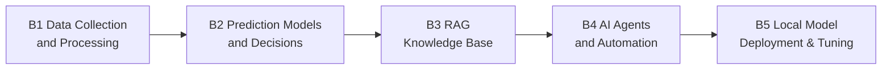

# Path B: Building AI Systems

> Last updated: 2026-08-04

## Overview

- **Audience**: developers, data and BI people working in e-commerce
- **Prerequisites**: some Python (or willingness to learn as you go — the AI will help you write it)
- **Time**: 1 hour a day, 4–8 weeks to work through it
- **Output**: a deployable AI tool

> Build AI-driven e-commerce tools and systems, from scripts to production applications



---

## Module navigation

| Module | Topic | Difficulty | Time | What it covers |
|--------|-------|------------|------|----------------|
| [B1. Data Collection & Processing](b1-data-pipeline.md) | Data pipeline | Beginner | 4–6 h | From Amazon reports to a cleaned analysis dataset |
| [B2. Prediction Models & Decisions](b2-prediction-models.md) | Predictive modelling | Intermediate | 6–8 h | Sales forecasting to support restock decisions |
| [B3. RAG Knowledge Base](b3-rag-knowledge-base.md) | Knowledge base | Intermediate | 6–8 h | An AI Q&A system over your internal documents |
| [B4. AI Agents & Workflow Automation](b4-agent-workflow.md) | Agents | Advanced | 8–10 h | Executing multi-step operational tasks automatically |
| [B5. Local Model Deployment & Fine-Tuning](b5-local-model-deploy.md) | Model deployment | Advanced | 4–6 h | Run an LLM locally, keep the data in-house |
| [B6. MCP Integration & Agentic Workflows](b6-mcp-agentic-workflow.md) | MCP / agentic | Advanced | 2–3 weeks | Connect Amazon Ads / Shopify over MCP, run operations by conversation |
| [B7. Review Analysis System](b7-review-nlp-system.md) | NLP / topic modelling | Intermediate | 2 weeks | BERTopic topic modelling + sentiment analysis + LLM insights |
| [B8. E-Commerce Dashboard](b8-ecommerce-dashboard.md) | Streamlit / Plotly | Intermediate | 1–2 weeks | Multi-platform operations dashboard + AI anomaly detection |
| [B9. AI Product Image/Video Generation](b9-ai-image-pipeline.md) | ComfyUI / GPT Image 2 / FLUX.2 | Advanced | 2–3 weeks | Batch product-image pipeline + video generation |

---

## Progress tracking

```
[ ] B1. Data: write a script that merges several Amazon reports and produces a summary
[ ] B2. Forecasting: run a 90-day sales forecast for a real SKU with Prophet
[ ] B3. RAG: stand up a RAG system that answers product questions
[ ] B4. Agents: deploy an agent that monitors operations automatically
[ ] B5. Deployment: run an LLM locally with Ollama and complete one e-commerce task (optional)
[ ] B6. MCP: configure the Amazon Ads MCP and manage ads through a conversation with Claude
[ ] B7. NLP: topic-model 1000+ reviews with BERTopic
[ ] B8. Dashboard: build a Streamlit operations dashboard with 4+ modules
[ ] B9. Images: generate a full AI image set for one product and pass Amazon's compliance check
```

> **Related resource**: [Technical Implementation Guidelines](../resources/technical-guidelines.md) architecture patterns, performance benchmarks, and a security/compliance checklist.

**Path B is done when:** you have completed at least 3 of B1–B4 — at that point you can build AI e-commerce tools. B5–B9 are there when you need them: B5 keeps data in-house, B6 turns operations into a conversation, and B7–B9 are each a finished system of their own.

---
