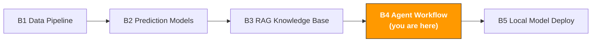

# B4. AI Agent & Workflow Automation

> **Track**: Path B: Developers · **Module**: B4
> **Last updated**: 2026-07-31
> **Level**: Advanced
> **Prerequisite**: B1 data-pipeline basics (Python, file handling), B3 basic RAG concepts
> **Time**: 1 hour a day, 2–3 weeks
---




---

## Chapter Navigation

1. [Agent methodology](#1-agent-methodology) · 2. [Tool landscape](#2-tool-landscape) · 3. [Hands-on code](#3-hands-on-code) · 4. [E-commerce Agent applications](#4-e-commerce-agent-applications) · 5. [Common traps](#5-common-traps) · 6. [Token cost engineering](#6-token-cost-engineering) · 7. [Advanced techniques](#7-advanced-techniques) · 8. [Learning resources](#8-learning-resources)


## What You'll Build

An AI Agent system — auto-executing multi-step operations tasks (like daily data check → anomaly analysis → report generation → alert notification).

After this module you'll be able to:
- Understand the core Agent concepts: the ReAct pattern, Tool Use, state management
- Distinguish the three LLM-application modes — Agent, Chain, RAG — and know when to use which
- Build a tool-calling Agent with LangGraph
- Build a daily-report auto-generation Agent (collect data → analyze → generate report)
- Build an inventory-alert Agent (monitor inventory → forecast demand → send restock reminders)
- Build a Review-monitoring Agent (monitor new Reviews → sentiment analysis → negative-review alerts)
- Implement multi-Agent collaboration with CrewAI (data analyst + report writer + reviewer)
- Avoid common Agent-development traps: loops, cost runaway, hallucination propagation

---

## 1. Agent Methodology

> **Related**: [A3 Advertising](../a-operators/a3-advertising.md) for the business applications of ad-monitoring automation · [F4 Automation & Agents](../0-foundations/f4-agent-automation.md) for Agent fundamentals.
>
> **Toolset**: [Awesome MCP & Agent Toolset](../resources/awesome-mcp-agents.md) for a full list of e-commerce MCP servers, Agent frameworks, and external resources.

### 1.1 What is an AI Agent

An AI Agent is an LLM application that can autonomously decide and execute multi-step tasks. Unlike an ordinary LLM call, an Agent can:

1. **Observe the environment**: read data, call APIs, view files
2. **Reason**: analyze the current state, decide what to do next
3. **Take action**: call tools to complete concrete tasks
4. **Loop and iterate**: decide whether to continue based on the result

Core idea:

```
User instruction → Agent reasons → selects a tool → executes the tool → observes the result → keeps reasoning or returns the result
```

**An intuitive example**: you tell the Agent "check today's sales data, and if there's an anomaly, send an alert." The Agent will:
1. Call the data API to get today's sales data
2. Analyze the data, find that a SKU's sales dropped 40%
3. Call an analysis tool to judge whether it's an anomaly
4. Generate an alert report
5. Call the email tool to send a notification

Throughout, the Agent autonomously decides which tools to call and in what order, without you writing if-else logic.

### 1.2 Agent vs Chain vs RAG: the difference between the three modes

This is the most-asked question. Simply put: RAG is "look things up," Chain is "follow the process," Agent is "figure it out yourself."

| Dimension | RAG | Chain | Agent |
|-----------|-----|-------|-------|
| Core capability | retrieve docs and answer | execute predefined steps | autonomously decide, dynamically select tools |
| Decision method | no decision (retrieve → generate) | fixed process (step 1 → 2 → 3) | dynamic decision (decide next step by the result) |
| Best scenario | knowledge Q&A, document lookup | fixed-process tasks (translate → proofread → format) | multi-step complex tasks needing judgment |
| Tool calling | none (only retrieval + LLM) | limited (a predefined tool chain) | flexible (the Agent picks tools itself) |
| Complexity | low | medium | high |
| Controllability | high (predictable behavior) | high (fixed process) | medium (the Agent may make unexpected decisions) |
| Cost | low (1–2 LLM calls) | medium (N LLM calls, N=steps) | high (uncertain number of LLM calls) |

**Decision framework:**

```
What's your task?
Answer questions based on docs → RAG (see the B3 module)
Fixed-step process automation → Chain
e.g.: translate Listing → proofread → format → output
Need to judge based on intermediate results → Agent
e.g.: check data → find an anomaly → decide whether to alert → generate a report
Not sure → try Chain first (more controllable), upgrade to Agent if not enough
```

> **Key insight**: don't use an Agent just for the sake of it. If your task process is fixed (always A → B → C), a Chain is enough — simpler, cheaper, more controllable. The Agent's value is handling "uncertainty" — you don't know what situations arise midway and need the AI to judge for itself.

### 1.3 The ReAct pattern: the Agent's core thinking framework

ReAct (Reasoning + Acting) is currently the most mainstream Agent-design pattern. Core idea: have the LLM alternate between "thinking" and "acting."

```
Loop starts:
1. Thought: analyze the current state, decide the next step
2. Action: call a tool
3. Observation: view the tool's returned result
4. Return to step 1, until the task is done
```

**An example of ReAct's actual execution:**

```
User: Check the inventory status of ASIN B0XXXXX, and if it's below safety stock, generate a restock suggestion.

Thought: I need to query this ASIN's current inventory data first.
Action: call_tool("get_inventory", {"asin": "B0XXXXX"})
Observation: {"asin": "B0XXXXX", "current_stock": 45, "safety_stock": 100, "daily_sales": 15}

Thought: Current stock 45, safety stock 100, daily sales 15. Stock is below the safety line,
and at the current pace only lasts 3 days. I need to generate a restock suggestion.
Action: call_tool("calculate_reorder", {"asin": "B0XXXXX", "current": 45, "daily_sales": 15})
Observation: {"suggested_quantity": 500, "lead_time_days": 14, "urgency": "high"}

Thought: The restock suggestion is generated — suggest 500 units, 14-day lead time, high urgency.
Task done, let me summarize.
Final Answer: ASIN B0XXXXX inventory alert: current stock 45 units, below the safety stock of 100,
lasting only 3 days at 15/day. Suggest an urgent restock of 500 units, estimated 14-day lead time.
```

### 1.4 Tool Use: the Agent's "hands"

The Agent's core capability comes from tools. An Agent without tools is just a chatbot.

**The essence of a tool**: a Python function + a description (telling the LLM what the tool does and what parameters it needs).

```python
# Tool-definition example
def get_inventory(asin: str) -> dict:
"""Query the inventory status of a given ASIN.

Args:
asin: Amazon product identifier (e.g., B0XXXXX)

Returns:
a dict with current_stock, safety_stock, daily_sales
"""
# Actual implementation: call a database or API
pass
```

The LLM decides when and how to call the tool by reading the function's name, docstring, and parameter types. So **the quality of the tool's description directly determines the Agent's performance**.

**Common tool types in e-commerce:**

| Tool type | Example | Use |
|-----------|---------|-----|
| Data query | `get_sales_data`, `get_inventory` | get operations data from a DB/API |
| Data analysis | `analyze_trend`, `detect_anomaly` | statistical analysis of data |
| File operations | `read_csv`, `write_report` | read/write files |
| Notification | `send_email`, `send_slack` | send alerts and reports |
| External API | `search_amazon`, `get_reviews` | call external services |
| Calculation | `calculate_roi`, `forecast_demand` | run business calculations |

### 1.5 When to use an Agent vs a simple script

Agents aren't a panacea. Many scenarios can be solved with a simple Python script, no Agent needed.

| Scenario | Recommended | Reason |
|----------|-------------|--------|
| Run a report at a fixed daily time | Python script + cron | fixed process, no AI judgment needed |
| Data cleaning and format conversion | Python script | clear rules, pandas is enough |
| Decide whether to alert based on data anomalies | Agent | needs AI to judge "what counts as an anomaly" |
| Analyze Reviews and generate improvement advice | Agent | needs AI to understand natural language |
| Multi-step task with human confirmation midway | Agent + Human-in-the-loop | needs dynamic decision + human review |
| Batch-translate Listings | Chain (fixed process) | fixed steps: translate → proofread → format |
| Monitor competitor price changes and adjust strategy | Agent | needs to analyze changes and make strategy judgment |

**Rule of thumb**: if you can write out all logic branches with if-else, use a script. If there are too many branches or you need to "understand" natural language, use an Agent.

---

## 2. Tool Landscape

| Tool | Type | Difficulty | Best scenario | Install |
|------|------|------------|---------------|---------|
| [LangGraph](https://langchain-ai.github.io/langgraph/) | Agent-workflow orchestration | intermediate | build stateful Agent workflows | `pip install langgraph` |
| [CrewAI](https://docs.crewai.com/) | multi-Agent collaboration | intermediate | multi-role collaboration tasks | `pip install crewai` |
| [n8n](https://n8n.io/) | visual workflow | beginner | no-code/low-code automation | Docker deployment |
| [Streamlit](https://streamlit.io/) | web UI | beginner | quickly build an Agent-interaction UI | `pip install streamlit` |
| [LangChain](https://python.langchain.com/) | LLM-app framework | intermediate | Agent tool chains, prompt management | `pip install langchain` |
| [OpenAI API](https://platform.openai.com/) | cloud LLM | beginner | highest-quality reasoning | `pip install openai` |
| [Ollama](https://ollama.com/) | local LLM | beginner | data privacy, offline running | [ollama.com/download](https://ollama.com/download) |

**Selection advice:**
- Single Agent + tool calling → LangGraph (this module's main line)
- Multi-Agent collaboration → CrewAI (this module's advanced part)
- Don't want to write code → n8n (visual drag-and-drop)
- Add a web UI to your Agent → Streamlit

### 2.1 LangGraph vs CrewAI choice

| Dimension | LangGraph | CrewAI |
|-----------|-----------|--------|
| Positioning | low-level Agent-workflow orchestration | high-level multi-Agent collaboration framework |
| Flexibility | extremely high (graph structure, fully custom) | medium (predefined roles and task patterns) |
| Learning curve | steeper (need to understand graphs, state, edges) | gentle (just define roles and tasks) |
| Best scenario | complex workflows needing fine control | multi-role collaboration, quick prototyping |
| State management | built-in (TypedDict state) | auto-managed |
| Human-in-the-loop | native support | supported |
| Community | LangChain ecosystem, very active | growing fast, friendly docs |

**Conclusion**: for beginners use CrewAI (simpler); use LangGraph when you need fine workflow control. This module covers both.

Reference docs: [LangGraph official docs](https://langchain-ai.github.io/langgraph/) | [CrewAI official docs](https://docs.crewai.com/)

### 2.2 n8n: no-code workflow automation

[n8n](https://n8n.io/) is an open-source visual workflow-automation platform. If you don't want to write code, or want to quickly build an automation flow, n8n is a good choice.

**n8n's advantages:**
- Drag-and-drop UI, no programming needed
- 400+ built-in integrations (Gmail, Slack, Google Sheets, HTTP, etc.)
- Supports AI nodes (OpenAI, Anthropic)
- Self-hosted, data never leaves your server
- Rich community templates

**E-commerce automation example (n8n workflow):**

```
Scheduled trigger (daily 9:00)
→ HTTP request: get the sales-data API
→ IF node: sales drop > 20%?
→ Yes → OpenAI node: analyze the cause
→ Slack node: send an alert
→ No → Google Sheets: log the daily data
```

> **n8n vs code Agent**: n8n fits fixed-process automation (like a Chain); a code Agent fits scenarios needing dynamic decisions. They can be combined — n8n for scheduled triggers and notifications, the Agent for intelligent analysis.

---

## 3. Hands-On Code

### 3.1 Minimal Agent: build a tool-calling Agent with LangGraph

This is the simplest Agent you can write. Define a tool and let the LLM decide when to call it.

```python
# Minimal Agent — LangGraph + OpenAI
# Prerequisite: pip install langgraph langchain-openai
# Env var: export OPENAI_API_KEY="sk-..."

from langchain_openai import ChatOpenAI
from langchain_core.tools import tool
from langgraph.prebuilt import create_react_agent

# 1. Define tools
@tool
def get_sales_data(date: str) -> dict:
"""Query the sales-data summary for a given date.

Args:
date: date, format YYYY-MM-DD

Returns:
a dict with total_sales, total_orders, top_asin
"""
# Mock data (replace with a DB query or API call in production)
return {
"date": date,
"total_sales": 15230.50,
"total_orders": 342,
"top_asin": "B0XXXXX",
"top_asin_sales": 3200.00,
"yoy_change": -0.12,
}

@tool
def detect_anomaly(metric: str, value: float, threshold: float) -> dict:
"""Detect whether a metric is anomalous.

Args:
metric: metric name
value: current value
threshold: anomaly threshold (change percentage, e.g., -0.2 means a 20% drop)
"""
is_anomaly = value < threshold
return {
"metric": metric,
"value": value,
"threshold": threshold,
"is_anomaly": is_anomaly,
"severity": "high" if value < threshold * 1.5 else "medium",
}

# 2. Create the Agent
llm = ChatOpenAI(model="gpt-5.6-luna", temperature=0)  # T3 tier — see model-matrix.md
tools = [get_sales_data, detect_anomaly]
agent = create_react_agent(llm, tools)

# 3. Run the Agent
result = agent.invoke({
"messages": [("user", "Check the sales data for 2025-03-10, and tell me if the YoY drop exceeds 10%")]
})

# 4. Output the result
for msg in result["messages"]:
if hasattr(msg, "content") and msg.content:
print(f"[{msg.type}] {msg.content}")
```

**The Agent's execution:**
1. The LLM reads the user instruction, decides to call `get_sales_data` first
2. After getting the data, it finds `yoy_change = -0.12` (a 12% drop)
3. The LLM judges 12% > 10%, calls `detect_anomaly` to confirm the anomaly
4. Summarizes the result, returns the alert info

> **Note**: `create_react_agent` is LangGraph's pre-built ReAct Agent, good for quick prototypes. For production, use a custom Graph for more control (see Section 3.2).

### 3.2 Daily-report Agent: auto-collect data → analyze → generate report

Real scenario: auto-generate a daily operations report each morning, with a sales overview, anomaly detection, and trend analysis.

```python
# Daily-report Agent — custom LangGraph workflow
# pip install langgraph langchain-openai

import json
from datetime import datetime
from typing import TypedDict, Annotated
from langchain_openai import ChatOpenAI
from langchain_core.tools import tool
from langchain_core.messages import HumanMessage, SystemMessage
from langgraph.graph import StateGraph, END
from langgraph.graph.message import add_messages

# --- Tool definitions ---
@tool
def fetch_daily_sales(date: str) -> str:
"""Get the sales-data summary for a given date."""
return json.dumps({
"date": date,
"summary": {"total_revenue": 45230.50, "total_orders": 1024,
"total_units": 1580, "avg_order_value": 44.17},
"top_products": [
{"asin": "B0AAAA", "name": "Action Camera X1", "units": 320, "revenue": 12800},
{"asin": "B0BBBB", "name": "Charger Pro", "units": 280, "revenue": 5600},
],
"yoy_comparison": {"revenue_change": -0.08, "orders_change": -0.05},
}, ensure_ascii=False)

@tool
def fetch_inventory_status() -> str:
"""Get the current inventory status, flagging low-stock ASINs."""
return json.dumps({
"low_stock_items": [
{"asin": "B0AAAA", "current": 120, "safety": 200, "days_left": 3},
],
"total_skus": 45, "healthy_skus": 44,
}, ensure_ascii=False)

@tool
def fetch_review_alerts() -> str:
"""Get negative-review alerts from the last 24 hours."""
return json.dumps({
"new_negative_reviews": [
{"asin": "B0BBBB", "rating": 1, "title": "Charging is too slow",
"text": "It broke after two weeks, and charges much slower than advertised"},
],
"avg_rating_change": -0.1,
}, ensure_ascii=False)

@tool
def generate_report(report_content: str) -> str:
"""Format the analysis result into a Markdown daily report."""
today = datetime.now().strftime("%Y-%m-%d")
report = f"# Daily Report {today}\n\n{report_content}\n\n---\n*Auto-generated by AI Agent*"
return f"Report generated, {len(report)} characters"

# --- Agent state ---
class DailyReportState(TypedDict):
messages: Annotated[list, add_messages]
sales_data: str
inventory_data: str
review_data: str
report: str

llm = ChatOpenAI(model="gpt-5.6-luna", temperature=0)  # T3 tier — see model-matrix.md

SYSTEM_PROMPT = """You are an e-commerce operations daily-report Agent. After collecting data, generate a daily report with:
- Sales overview (revenue, orders, YoY change)
- Anomaly alerts (low stock, abnormal sales drops)
- Review alerts (new negatives and analysis)
- Action advice (2-3 concrete, executable suggestions)
Output in English, accurate data, specific advice."""

def collect_data(state: DailyReportState) -> dict:
"""Node 1: collect all data sources."""
today = datetime.now().strftime("%Y-%m-%d")
return {
"sales_data": fetch_daily_sales.invoke({"date": today}),
"inventory_data": fetch_inventory_status.invoke({}),
"review_data": fetch_review_alerts.invoke({}),
}

def analyze_and_report(state: DailyReportState) -> dict:
"""Node 2: AI analyzes the data and generates the daily report."""
messages = [
SystemMessage(content=SYSTEM_PROMPT),
HumanMessage(content=f"Sales: {state['sales_data']}\n"
f"Inventory: {state['inventory_data']}\n"
f"Reviews: {state['review_data']}\n\nPlease generate the daily report."),
]
response = llm.invoke(messages)
generate_report.invoke({"report_content": response.content})
return {"report": response.content, "messages": [response]}

# --- Build the workflow graph ---
workflow = StateGraph(DailyReportState)
workflow.add_node("collect_data", collect_data)
workflow.add_node("analyze_and_report", analyze_and_report)
workflow.set_entry_point("collect_data")
workflow.add_edge("collect_data", "analyze_and_report")
workflow.add_edge("analyze_and_report", END)
app = workflow.compile()

# result = app.invoke({"messages": []})
# print(result["report"])
```

**Workflow-graph structure:**

```
[collect_data] → [analyze_and_report] → END

fetch_sales LLM analysis
fetch_inventory generate_report
fetch_reviews
```

> **Why a custom Graph instead of create_react_agent?** `create_react_agent` lets the LLM decide the call order, good for exploratory tasks. But daily-report generation has a deterministic flow (collect data first, then analyze), so a custom Graph is more controllable and efficient (fewer unnecessary LLM calls).

### 3.3 Inventory-alert Agent: monitor inventory → forecast demand → send restock reminders

Real scenario: check all SKUs' inventory status daily, forecast future demand for low-stock items, generate restock suggestions.

```python
# Inventory-alert Agent — LangGraph conditional-branch workflow
# pip install langgraph langchain-openai

import json
from typing import TypedDict, Annotated, Literal
from langchain_openai import ChatOpenAI
from langchain_core.tools import tool
from langchain_core.messages import HumanMessage, SystemMessage
from langgraph.graph import StateGraph, END
from langgraph.graph.message import add_messages

@tool
def check_all_inventory() -> str:
"""Check all SKUs' inventory status, return the low-stock list."""
return json.dumps({
"total_skus": 45,
"low_stock": [
{"asin": "B0AAAA", "name": "Action Camera X1", "current": 80,
"safety": 200, "daily_avg": 25, "days_left": 3.2},
],
"out_of_stock_risk": [
{"asin": "B0EEEE", "name": "Lens Cap", "current": 10,
"daily_avg": 8, "days_left": 1.25},
],
}, ensure_ascii=False)

@tool
def forecast_demand(asin: str, days: int = 30) -> str:
"""Forecast a given ASIN's demand for the next N days."""
forecasts = {
"B0AAAA": {"predicted_demand": 780, "confidence": 0.85, "trend": "stable"},
"B0EEEE": {"predicted_demand": 250, "confidence": 0.82, "trend": "stable"},
}
result = forecasts.get(asin, {"predicted_demand": 500, "confidence": 0.7})
result.update({"asin": asin, "forecast_days": days})
return json.dumps(result, ensure_ascii=False)

@tool
def send_restock_alert(alert_content: str) -> str:
"""Send a restock reminder (email/Slack/WeCom)."""
print(f"Sending restock reminder:\n{alert_content}")
return "Restock reminder sent"

# --- State and nodes ---
class InventoryState(TypedDict):
messages: Annotated[list, add_messages]
inventory_data: str
has_alerts: bool
forecast_results: list[str]
alert_content: str

llm = ChatOpenAI(model="gpt-5.6-luna", temperature=0)  # T3 tier — see model-matrix.md

def check_inventory(state: InventoryState) -> dict:
data = check_all_inventory.invoke({})
parsed = json.loads(data)
has_alerts = bool(parsed.get("low_stock") or parsed.get("out_of_stock_risk"))
return {"inventory_data": data, "has_alerts": has_alerts}

def should_alert(state: InventoryState) -> Literal["forecast", "end"]:
return "forecast" if state["has_alerts"] else "end"

def run_forecast(state: InventoryState) -> dict:
parsed = json.loads(state["inventory_data"])
all_items = parsed.get("low_stock", []) + parsed.get("out_of_stock_risk", [])
results = [forecast_demand.invoke({"asin": item["asin"], "days": 30})
for item in all_items]
return {"forecast_results": results}

def generate_alert(state: InventoryState) -> dict:
messages = [
SystemMessage(content="You are an inventory-management expert. Sort by urgency (stockout within 3 days > within 7 days), "
"give concrete restock-quantity suggestions, accounting for lead time and forecast demand."),
HumanMessage(content=f"Inventory: {state['inventory_data']}\n"
f"Forecast: {json.dumps(state['forecast_results'], ensure_ascii=False)}"),
]
response = llm.invoke(messages)
send_restock_alert.invoke({"alert_content": response.content})
return {"alert_content": response.content, "messages": [response]}

# --- Build the workflow ---
workflow = StateGraph(InventoryState)
workflow.add_node("check_inventory", check_inventory)
workflow.add_node("forecast", run_forecast)
workflow.add_node("generate_alert", generate_alert)
workflow.set_entry_point("check_inventory")
workflow.add_conditional_edges("check_inventory", should_alert,
{"forecast": "forecast", "end": END})
workflow.add_edge("forecast", "generate_alert")
workflow.add_edge("generate_alert", END)
inventory_agent = workflow.compile()

# result = inventory_agent.invoke({"messages": [], "forecast_results": []})
```

**Workflow graph (with a conditional branch):**

```
[check_inventory] → alerts? → Yes → [forecast] → [generate_alert] → END
→ No → END
```

> **The value of conditional branching**: when all inventory is healthy, the Agent ends at the first step, not wasting an LLM call. This is a custom Graph's advantage over create_react_agent — precise flow control, avoiding unnecessary API cost.

### 3.4 Review-monitoring Agent: monitor new Reviews → sentiment analysis → negative-review alerts

Real scenario: auto-check new Reviews daily, do sentiment analysis and classification on negatives, generate an alert report.

```python
# Review-monitoring Agent — structure similar to the inventory-alert Agent
# pip install langgraph langchain-openai

import json
from typing import TypedDict, Annotated, Literal
from langchain_openai import ChatOpenAI
from langchain_core.tools import tool
from langchain_core.messages import HumanMessage, SystemMessage
from langgraph.graph import StateGraph, END
from langgraph.graph.message import add_messages

@tool
def fetch_new_reviews(hours: int = 24) -> str:
"""Get new Reviews from the last N hours."""
return json.dumps({
"period": f"last {hours} hours",
"total_new": 15, "positive": 10, "neutral": 2, "negative": 3,
"reviews": [
{"asin": "B0AAAA", "rating": 1, "title": "Terrible quality",
"text": "Broke after a week, blurry lens, and the waterproofing doesn't work"},
{"asin": "B0AAAA", "rating": 2, "title": "Battery doesn't last",
"text": "The battery only lasts 40 minutes, far below the advertised 2 hours"},
{"asin": "B0BBBB", "rating": 1, "title": "Charger overheats badly",
"text": "Gets very hot while charging, worried about safety"},
],
}, ensure_ascii=False)

@tool
def analyze_review_sentiment(review_text: str) -> str:
"""Do sentiment analysis and problem classification on a single Review."""
categories = []
if any(w in review_text for w in ["broke", "broken", "defect"]):
categories.append("Product quality")
if any(w in review_text for w in ["battery", "last", "life"]):
categories.append("Battery life")
if any(w in review_text for w in ["hot", "overheat", "heat"]):
categories.append("Safety hazard")
return json.dumps({
"sentiment": "negative",
"categories": categories or ["Other"],
"severity": "high" if "Safety" in str(categories) else "medium",
}, ensure_ascii=False)

# --- Workflow: same structure as the inventory-alert Agent ---
# fetch_reviews → negatives? → Yes → analyze_reviews → generate_alert → END
# → No → END

class ReviewState(TypedDict):
messages: Annotated[list, add_messages]
review_data: str
has_negative: bool
analysis_results: list[dict]
alert_report: str

llm = ChatOpenAI(model="gpt-5.6-luna", temperature=0)  # T3 tier — see model-matrix.md

def fetch_reviews(state: ReviewState) -> dict:
data = fetch_new_reviews.invoke({"hours": 24})
parsed = json.loads(data)
return {"review_data": data, "has_negative": parsed.get("negative", 0) > 0}

def should_analyze(state: ReviewState) -> Literal["analyze", "end"]:
return "analyze" if state["has_negative"] else "end"

def analyze_reviews(state: ReviewState) -> dict:
parsed = json.loads(state["review_data"])
results = []
for review in [r for r in parsed["reviews"] if r["rating"] <= 2]:
analysis = analyze_review_sentiment.invoke({"review_text": review["text"]})
results.append({"review": review, "analysis": json.loads(analysis)})
return {"analysis_results": results}

def generate_review_alert(state: ReviewState) -> dict:
messages = [
SystemMessage(content="You are an e-commerce Review-analysis expert. Summarize negatives by problem category, "
"note severity (safety hazard > quality issue > experience issue), give response advice."),
HumanMessage(content=f"Negative-review analysis: {json.dumps(state['analysis_results'], ensure_ascii=False)}"),
]
response = llm.invoke(messages)
return {"alert_report": response.content, "messages": [response]}

workflow = StateGraph(ReviewState)
workflow.add_node("fetch_reviews", fetch_reviews)
workflow.add_node("analyze", analyze_reviews)
workflow.add_node("generate_alert", generate_review_alert)
workflow.set_entry_point("fetch_reviews")
workflow.add_conditional_edges("fetch_reviews", should_analyze,
{"analyze": "analyze", "end": END})
workflow.add_edge("analyze", "generate_alert")
workflow.add_edge("generate_alert", END)
review_agent = workflow.compile()

# result = review_agent.invoke({"messages": [], "analysis_results": []})
# print(result.get("alert_report", "No negatives, all normal"))
```

> **Safety hazards first**: the most important thing in Review monitoring is identifying safety-related negatives (like "overheats," "leaking current," "catches fire"). Such issues can lead to delisting or even a recall, and must be handled at the highest priority.

### 3.5 Multi-Agent collaboration (CrewAI): data analyst + report writer + reviewer

CrewAI lets you define multiple Agent roles, each with its own specialty, collaborating to complete complex tasks.

```python
# Multi-Agent collaboration — CrewAI
# pip install crewai crewai-tools

from crewai import Agent, Task, Crew, Process

# --- Define Agent roles ---
data_analyst = Agent(
role="E-commerce data analyst",
goal="Discover trends, anomalies, and opportunities in sales data",
backstory="You're an expert with 5 years of e-commerce data-analysis experience; analysis is data-based, no unsupported speculation.",
verbose=True, allow_delegation=False,
)

report_writer = Agent(
role="Operations-report writer",
goal="Turn data-analysis results into a clear, actionable operations report",
backstory="You're a senior e-commerce operations-report writer; reports are clearly structured, focused, with concrete advice.",
verbose=True, allow_delegation=False,
)

reviewer = Agent(
role="Report reviewer",
goal="Ensure the report's data accuracy, logical consistency, and advice feasibility",
backstory="You're a rigorous report reviewer, checking data accuracy, the basis of conclusions, and advice feasibility.",
verbose=True, allow_delegation=False,
)

# --- Define tasks ---
sample_data = """Week 1 of March 2025: total revenue $312,500 (YoY -8%), total orders 7,200 (YoY -5%)
Action Camera X1: $125,000 (YoY -15%, stock critical) | Charger Pro: $45,000 (YoY +12%)
Case Bundle: $38,000 (YoY +25%, new) | Ad ACoS 22% (YoY +3%) | Return rate 4.2% (+0.8%)"""

analyze_task = Task(
description=f"Analyze the following sales data, identify trends and anomalies:\n{sample_data}\n"
"Requirements: identify good/bad products, analyze YoY-change causes, flag anomalous metrics.",
expected_output="A structured data-analysis report with trends, anomalies, and insights",
agent=data_analyst,
)

write_task = Task(
description="Write an operations weekly report based on the analysis. Structure: overview (3 sentences), metric table, product analysis, "
"anomaly alerts, action advice (3-5 items). Management should read it in 2 minutes.",
expected_output="A complete operations weekly report (Markdown format)",
agent=report_writer,
)

review_task = Task(
description="Review the weekly report: check data accuracy, logical consistency, advice feasibility. "
"If there are issues, point out revision advice; if not, give a score (1-10).",
expected_output="Review comments and a final score",
agent=reviewer,
)

# --- Assemble the crew and execute ---
crew = Crew(
agents=[data_analyst, report_writer, reviewer],
tasks=[analyze_task, write_task, review_task],
process=Process.sequential, # sequential: analyze → write → review
verbose=True,
)

# result = crew.kickoff()
# print(result)
```

**Multi-Agent collaboration flow:**

```
[data analyst] → analyzes data, outputs insights
↓
[report writer] → writes the report based on the insights
↓
[report reviewer] → reviews the report, gives a score and revision advice
```

> **Why multiple Agents instead of one?** A single Agent doing analysis, writing, and review at once tends to "review its own work," with poor quality. Splitting into multiple roles, each focused on its own task and checking each other, yields better output. This is the same logic as a real team's division of labor.

---

## 4. E-Commerce Agent Applications

### 4.1 Daily-report automation

| Dimension | Details |
|-----------|---------|
| Trigger | scheduled (daily 9:00) or manual |
| Data source | sales API, inventory system, ad console |
| Agent task | collect data → anomaly detection → trend analysis → generate report |
| Output | Markdown daily report + email/Slack notification |
| Value | save 30–60 min of manual compilation daily |

### 4.2 Inventory alerts

| Dimension | Details |
|-----------|---------|
| Trigger | scheduled (twice daily) or on inventory change |
| Data source | inventory system, sales data, supplier lead time |
| Agent task | check inventory → forecast demand → compute restock quantity → send reminders |
| Output | restock-suggestion report + urgent alerts |
| Value | reduce stockout risk, avoid lost sales from being out of stock |

### 4.3 Competitor monitoring

| Dimension | Details |
|-----------|---------|
| Trigger | scheduled (weekly) or on price change |
| Data source | competitor Listing data, price history, Reviews |
| Agent task | scrape competitor data → comparative analysis → identify threats/opportunities → generate report |
| Output | competitor-analysis report + strategy advice |
| Value | spot competitor moves promptly, adjust strategy quickly |

### 4.4 Customer-service assistance

| Dimension | Details |
|-----------|---------|
| Trigger | real-time (on a customer message) |
| Data source | product knowledge base (RAG), order system, policy docs |
| Agent task | understand the customer question → retrieve the knowledge base → query the order → generate a reply suggestion |
| Output | CS reply draft (sent after human confirmation) |
| Value | 3–5× faster CS response, more consistent reply quality |

---

## 5. Common Traps

### 5.1 Agent infinite loop

**Symptom**: the Agent repeatedly calls the same tool, or ping-pongs between two tools, never ending.

**Cause**:
- The tool's return isn't clear enough, the LLM doesn't know if the task is done
- The tool description is unclear, the LLM misunderstands the tool's purpose
- No max-iteration limit set

**Solution**:

```python
# Option 1: set a max-iteration limit
result = agent.invoke(
{"messages": [("user", "your instruction")]},
config={"recursion_limit": 10}, # at most 10 rounds
)

# Option 2: state the "done condition" clearly in the tool description
@tool
def check_status(task_id: str) -> str:
"""Check the task status. Returns 'completed' when the task is done, no need to call again."""
pass
```

### 5.2 Tool-call failure

**Symptom**: the Agent passes wrongly formatted parameters when calling a tool, or the tool throws an exception that interrupts the whole flow.

**Solution**: tools should never throw an exception — return an error-info string instead. Let the Agent decide how to handle it (retry, change parameters, skip).

```python
@tool
def get_sales_data(date: str) -> str:
"""Query sales data. The date format must be YYYY-MM-DD."""
try:
from datetime import datetime
datetime.strptime(date, "%Y-%m-%d")
return json.dumps({"date": date, "total_sales": 15000})
except ValueError:
return json.dumps({"error": f"Wrong date format: {date}, please use YYYY-MM-DD"})
except Exception as e:
return json.dumps({"error": f"Query failed: {str(e)}"})
```

### 5.3 Cost runaway

**Symptom**: one Agent run cost $5, because the LLM was called 50 times.

**Cause**:
- Too many Agent loops
- Using a frontier-tier model for a simple task
- Tools returning huge data, sent to the LLM every time

**Solution**:

| Strategy | Approach | Savings |
|----------|----------|---------|
| Model tiering | T3 fast tier for simple judgment, T1 frontier tier for complex analysis | 50–80% |
| Limit iterations | set recursion_limit | avoids runaway |
| Data trimming | tools return summaries instead of full data | 30–50% |
| Fixed process | don't use an Agent where a Chain works | 60–80% |

```python
# Cost-control example: model tiering
# Model ids live in resources/model-matrix.md — change only these two lines on a new generation
CHEAP_MODEL = "gpt-5.6-luna"      # T3 fast tier
STRONG_MODEL = "gpt-5.6-sol"      # T1 frontier tier

cheap_llm = ChatOpenAI(model=CHEAP_MODEL, temperature=0)
expensive_llm = ChatOpenAI(model=STRONG_MODEL, temperature=0)

# Data collection and simple judgment use the cheap model
# Final report generation uses the expensive model
```

### 5.4 Hallucination propagation

**Symptom**: the Agent produces wrong info in the first step, later steps keep reasoning on the wrong info, and the final output is completely unreliable.

**Solution**:
1. **Validate each step**: add a data-validation node after key steps
2. **Cite sources**: require the Agent to note data sources in its answer
3. **Human-in-the-loop**: pause before key decisions, wait for human confirmation
4. **Lower the temperature**: `temperature=0` reduces creative flourish

---

## 6. Token Cost Engineering

§5.3 covered the blunt lever: use a lower tier. But once an Agent runs at any volume, the bill is usually driven less by the model tier than by **how much identical content you send over and over**. This section is about removing that.

### 6.1 First, find where the money goes

In a single Agent run, token consumption typically distributes like this:

| Part | Typical share | Resent every turn? |
|------|--------------|-------------------|
| System prompt + tool definitions | 30–60% | **Yes, every turn** |
| Few-shot examples / business-rule docs | 10–30% | **Yes, every turn** |
| Conversation history | Grows with turns | Yes, and it keeps growing |
| The actual new input this turn | 5–15% | No |
| Model output | 5–20% | No |

The key fact: **in a 10-turn Agent loop, your system prompt is transmitted in full 10 times.** If it's 3,000 tokens, that's 30,000 tokens of repeated billing for content that never changed by a single character.

### 6.2 Prompt caching: the biggest lever

Every major vendor offers a caching mechanism, and they work on the same principle: **mark the unchanging prefix of your prompt, the server caches its computed state, and subsequent requests that hit the cache are billed at a steep discount.**

What they have in common in practice:

- **The cache covers a prefix.** So the ordering of your prompt matters enormously — invariant content (system prompt, tool definitions, business rules, few-shot examples) must come first, variable content (user input, this turn's data) last. Get the order backwards and the cache never hits
- **There's a minimum length.** Short prompts aren't worth caching and vendors simply ignore them
- **There's a TTL.** Caches expire; after a quiet period the next request pays full price again and rebuilds the cache
- **Cache reads are far cheaper than fresh input** — that's where the savings come from

For e-commerce Agents, the highest-yield setup is:

```
Put these in the cacheable prefix:
  - Your category knowledge, brand tone guidelines
  - Listing-writing rules, banned-phrase compliance lists
  - Few-shot examples (good vs. bad listing pairs)
  - Tool definitions

Put these after the cache:
  - The data for the current SKU
  - The user's actual question this turn
```

Processing 500 SKUs in a batch, the prefix is billed at full price once and the other 499 calls read from cache.

> Exact discount ratios, minimum token counts, and TTL lengths differ by vendor and change over time — check the official links in the [model matrix](../resources/model-matrix.md) yourself. This is precisely why this book keeps those numbers out of the prose.

### 6.3 Four more levers

**Batch APIs**: work that doesn't need a real-time response (an overnight listing audit across the catalog, bulk translation, relabeling historical reviews) usually gets a substantial discount through batch endpoints. The cost is latency moving from seconds to hours. A lot of e-commerce work genuinely doesn't need real time.

**Trim tool return values.** §5.3 mentioned this in passing; here's the expansion. The Agent calls `get_sales_data`, gets 500 rows of line items, and hands all 500 to the LLM — when the LLM only needs to know which SKU is anomalous. Aggregate inside the tool before returning and token use drops by an order of magnitude. **The rule: if Python can compute it, don't pay an LLM to.**

**Compress conversation history.** In long loops history grows without bound. The common approach is to keep the last N turns verbatim and summarize everything older. A LangGraph checkpointer plus a summarization node gets you there.

**Constrain output length.** Output tokens usually cost several times more than input. Requesting JSON instead of prose, and setting explicit length limits, saves money directly. "Briefly state your reasoning" versus "explain your reasoning in detail" can double the bill.

### 6.4 A practical triage order

When costs run over budget, work down this list — highest yield first:

1. **Should this have been a Chain instead of an Agent?** Using an Agent for a fixed process is pure waste (§1.2)
2. **Is the loop count out of control?** Set `recursion_limit` first
3. **Is the prompt prefix actually caching?** Check that invariant content really is at the front
4. **Are tool return values trimmed?** Look for raw data being fed in wholesale
5. **Is the tier too high?** Change this last, because dropping a tier costs quality while the first four don't

The first four are **free money**: they cut cost without giving up any output quality. Only item 5 involves a trade-off.

---

## 7. Advanced Techniques

### 7.1 Human-in-the-loop: wait for human confirmation before key decisions

Some decisions can't be fully left to AI, like sending a customer email, adjusting a price, or submitting a restock order. Human-in-the-loop pauses the Agent at a key node, waiting for human confirmation.

```python
# Human-in-the-loop — LangGraph interrupt
from langgraph.graph import StateGraph, END
from langgraph.checkpoint.memory import MemorySaver
from typing import TypedDict, Annotated
from langgraph.graph.message import add_messages

class ApprovalState(TypedDict):
messages: Annotated[list, add_messages]
action: str
approved: bool

def propose_action(state: ApprovalState) -> dict:
return {"action": "Suggest an urgent restock of 500 units for ASIN B0AAAA, estimated cost $12,500"}

def execute_action(state: ApprovalState) -> dict:
print(f"Executing: {state['action']}")
return {"messages": [("assistant", f"Executed: {state['action']}")]}

def check_approval(state: ApprovalState) -> str:
return "execute" if state.get("approved") else "end"

workflow = StateGraph(ApprovalState)
workflow.add_node("propose", propose_action)
workflow.add_node("execute", execute_action)
workflow.set_entry_point("propose")
workflow.add_conditional_edges("propose", check_approval,
{"execute": "execute", "end": END})
workflow.add_edge("execute", END)

memory = MemorySaver()
app = workflow.compile(checkpointer=memory, interrupt_before=["execute"])

# First run: the Agent proposes, pauses before execute
# config = {"configurable": {"thread_id": "approval-1"}}
# result = app.invoke({"messages": [], "approved": False}, config)
# After human confirmation, continue:
# app.update_state(config, {"approved": True})
# result = app.invoke(None, config)
```

> **When you need Human-in-the-loop**: always add human confirmation when money is involved (restocking, ad-budget adjustment), customer communication (sending emails), or irreversible operations (deleting data).

### 7.2 Agent memory: keep context across sessions

By default, the Agent is "amnesiac" on each run. LangGraph's `MemorySaver` keeps context across sessions:

```python
from langgraph.checkpoint.memory import MemorySaver
from langgraph.prebuilt import create_react_agent
from langchain_openai import ChatOpenAI

memory = MemorySaver()
agent = create_react_agent(ChatOpenAI(model="gpt-5.6-luna"), tools=[], checkpointer=memory)

config = {"configurable": {"thread_id": "session-001"}}
# First: agent.invoke({"messages": [("user", "The main product is Action Camera X1")]}, config)
# Second: agent.invoke({"messages": [("user", "Check the main product's inventory")]}, config)
# The Agent remembers "the main product is Action Camera X1"
```

### 7.3 Multimodal Agent: handle images and files

A multimodal Agent can analyze product images, competitor screenshots, etc. The T1/T2 tiers from every major vendor now take image input natively:

```python
from langchain_openai import ChatOpenAI
from langchain_core.messages import HumanMessage
import base64

def analyze_product_image(image_path: str) -> str:
"""Analyze a product image with a vision-capable model, extracting selling points and improvement advice."""
llm = ChatOpenAI(model="gpt-5.6-terra", temperature=0)  # T2 workhorse tier is enough for vision
with open(image_path, "rb") as f:
image_data = base64.b64encode(f.read()).decode("utf-8")

message = HumanMessage(content=[
{"type": "text", "text": "Analyze the product image: 1) main selling points 2) image-quality assessment 3) improvement advice"},
{"type": "image_url",
"image_url": {"url": f"data:image/jpeg;base64,{image_data}"}},
])
return llm.invoke([message]).content
```

---

## 8. Learning Resources

| Resource | Type | Notes | Link |
|----------|------|-------|------|
| AI Agents in LangGraph | free short course | by DeepLearning.AI, LangGraph intro | [deeplearning.ai](https://www.deeplearning.ai/short-courses/ai-agents-in-langgraph/) |
| Multi AI Agent Systems with crewAI | free short course | by DeepLearning.AI, CrewAI multi-Agent | [deeplearning.ai](https://www.deeplearning.ai/short-courses/multi-ai-agent-systems-with-crewai/) |
| HuggingFace AI Agents Course | free course | systematic Agent course | [huggingface.co](https://huggingface.co/learn/agents-course) |
| LangGraph official docs | docs | the most authoritative LangGraph reference | [langchain-ai.github.io](https://langchain-ai.github.io/langgraph/) |
| CrewAI official docs | docs | complete CrewAI framework docs | [docs.crewai.com](https://docs.crewai.com/) |
| n8n official docs | docs | visual workflow platform | [n8n.io](https://n8n.io/) |
| Streamlit official docs | docs | quickly build a web UI | [streamlit.io](https://streamlit.io/) |

**Recommended learning order:**
1. First take DeepLearning.AI's LangGraph short course (2 hours, build concepts)
2. Follow this module's hands-on code (3.1 → 3.2 → 3.3)
3. Try CrewAI multi-Agent (3.5)
4. Take the HuggingFace Agent Course to understand the principles deeply

## 9. Completion Checklist

- [ ] Understand the difference between Agent vs Chain vs RAG, able to state each's use cases
- [ ] Built a minimal tool-calling Agent with LangGraph (3.1)
- [ ] Built a daily-report Agent or inventory-alert Agent (3.2 or 3.3)
- [ ] Built a Review-monitoring Agent (3.4)
- [ ] Implemented a multi-Agent collaboration task with CrewAI (3.5)
- [ ] Deployed an automated operations-monitoring Agent (combining 3.2–3.4)

---

## 10. Appendix

### 10.1 Agent-architecture quick reference

```

AI Agent


LLM reasoning engine tools
(brain) (ReAct) (hands/feet)


memory state management environment
(Memory) (State) (APIs)


```

### 10.2 Code cheat sheet

| Task | Code |
|------|------|
| Install LangGraph | `pip install langgraph langchain-openai` |
| Install CrewAI | `pip install crewai crewai-tools` |
| Create a minimal Agent | `create_react_agent(llm, tools)` |
| Define a tool | `@tool` decorator + docstring |
| Custom workflow | `StateGraph` + `add_node` + `add_edge` |
| Conditional branch | `add_conditional_edges(node, func, mapping)` |
| Set iteration limit | `config={"recursion_limit": 10}` |
| Add memory | `MemorySaver()` + `checkpointer=memory` |
| Human-in-the-loop | `interrupt_before=["node_name"]` |
| CrewAI define role | `Agent(role=..., goal=..., backstory=...)` |
| CrewAI define task | `Task(description=..., agent=...)` |
| CrewAI assemble crew | `Crew(agents=[...], tasks=[...])` |

### 10.3 Cost-estimate reference

| Scenario | Model | LLM calls per run | Estimated cost |
|----------|-------|-------------------|----------------|
| Daily-report Agent | T3 fast | 2–3 | 1× |
| Inventory-alert Agent | T3 fast | 2–5 | 2× |
| Review-monitoring Agent | T3 fast | 3–6 | 3× |
| Multi-Agent collaboration (CrewAI) | T3 fast | 6–10 | 5× |
| Multi-Agent collaboration (CrewAI) | T1 frontier | 6–10 | 50× |

These are relative multiples rather than dollar amounts, because API prices move fast — on 2026-07-30 alone OpenAI cut the fast tier by 80%. Ratios hold up far better than absolute figures. For actual spend, multiply by the current unit price in the [model matrix](../resources/model-matrix.md).

> **Cost-control advice**: the T3 fast tier is enough for daily monitoring Agents. Reach for T1 frontier only when you need deep analysis (competitor-strategy analysis, complex report generation). Note the last two rows are the same task — the tier alone is a 10× swing.
---

[< B3 RAG Knowledge Base](b3-rag-knowledge-base.md) | [Path overview](../README.md) | [B5 Local Model Deploy >](b5-local-model-deploy.md)
