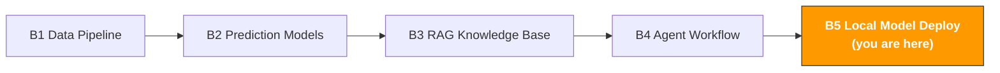

# B5. Local Model Deployment & Fine-tuning

> **Track**: Path B: Developers · **Module**: B5
> **Last updated**: 2026-07-31
> **Level**: Advanced
> **Prerequisite**: B1 data-pipeline basics (Python), B3 basic RAG concepts, B4 Agent basics
> **Time**: 1 hour a day, 3–4 weeks
---




---

## Chapter Navigation

1. [Local-deployment methodology](#1-local-deployment-methodology) · 2. [Tool landscape](#2-tool-landscape) · 3. [Hands-on code](#3-hands-on-code) · 4. [Hardware buying guide](#4-hardware-buying-guide) · 5. [Common traps](#5-common-traps) · 6. [Advanced techniques](#6-advanced-techniques) · 7. [Learning resources](#7-learning-resources)


## What You'll Build

A local AI service — run an LLM on your own machine to protect business-data privacy; fine-tune a model with LoRA to fit e-commerce.

After this module you'll be able to:
- Understand why to deploy an LLM locally, and when to choose local vs cloud
- Run open-weight models (Qwen3, Gemma 3, DeepSeek R1, etc.) locally with one Ollama command
- Choose the right model for your task (Chinese ability, code ability, reasoning ability)
- Call a local Ollama model with Python, integrate into existing workflows
- Build a fully local RAG system (data never leaves your machine)
- Fine-tune a model with LoRA/QLoRA, turning a general model into an e-commerce expert
- Deploy a high-performance inference service with vLLM (supporting concurrent requests)
- Understand quantization (GGUF/GPTQ/AWQ), running bigger models on limited hardware
- Choose the right hardware by budget (Mac M-series / NVIDIA GPU / cloud GPU)

---

## 1. Local-Deployment Methodology

> **Related**: [B3 RAG Knowledge Base System](b3-rag-knowledge-base.md) — RAG can be a lightweight alternative to model fine-tuning · [F1 The Past and Present of AI](../0-foundations/f1-ai-evolution.md) for AI-model evolution.

### 1.1 Why run an LLM locally

E-commerce data contains lots of trade secrets: product cost, supplier info, sales data, margins, customer info. Sending this data to OpenAI/Claude's servers carries data-leak risk.

The core value of local deployment:

| Value | Notes |
|-------|-------|
| Data privacy | all data processed locally, never through any third-party server |
| Zero API cost | not billed per token, free no matter how much you run (only electricity) |
| Offline usable | no network dependency, works on a plane or with VPN down |
| Low latency | local inference has no network latency, good for real-time apps |
| Full control | model version, parameters, behavior fully controlled by you, no sudden provider updates |
| Compliance-friendly | meets data-localization requirements, good for compliance-constrained enterprises |

**A real scenario**: you need to analyze 1000 customer Reviews with AI to extract product-improvement directions.
- With OpenAI API: 1000 Reviews × ~200 tokens avg = 200k tokens, cost ~$0.03 (cheap), but data was sent to OpenAI's servers
- With local Ollama: zero cost, data never leaves your machine, but you wait longer for inference

### 1.2 Cloud vs local: decision framework

Not all scenarios fit local deployment. The key is trading off data privacy, cost, quality, and speed.

```
What's your scenario?
Data contains trade secrets (cost, profit, suppliers) → local deployment
Need the highest-quality reasoning (complex analysis, creative writing) → the T1 frontier tier of a cloud API
High-frequency calls (10,000+/day) → local deployment (clear cost advantage)
Occasional use (dozens/day) → cloud API (skip the ops cost)
Need offline use → local deployment
Shared by a team → vLLM local service or cloud API
Not sure → validate the need with a cloud API first, then migrate to local
```

**Detailed comparison:**

| Dimension | Local deployment | Cloud API |
|-----------|------------------|-----------|
| Data privacy | data never leaves your machine | data sent to a third-party server |
| Inference quality | 8B is usable, 30B+ approaches the cloud T2 workhorse tier | T1 frontier tier, highest level |
| Cost (low-frequency) | high hardware cost, free use | billed per token, low total cost |
| Cost (high-frequency) | one-time hardware, free long-term | cost grows linearly with call volume |
| Latency | depends on hardware (M4 Pro ~40 tokens/s) | network latency + inference latency |
| Offline use | fully offline | needs network |
| Ops cost | manage models, updates, hardware yourself | zero ops |
| Scalability | limited by your hardware | unlimited scaling |

> **Rule of thumb**: if your data isn't sensitive and call volume is small, a cloud API is easiest. If data is sensitive or call volume is large (monthly API cost > $50), seriously consider local deployment.

### 1.3 Hardware-requirement quick reference

The minimum hardware to run a local LLM depends on the model size:

| Model size | Min RAM/VRAM | Recommended hardware | Inference-speed reference |
|------------|--------------|----------------------|---------------------------|
| 1–3B (small) | 4GB RAM | any modern computer | 50–80 tokens/s |
| 7–8B (mainstream) | 8GB RAM | Mac M1 8GB / RTX 3060 | 20–40 tokens/s |
| 13–14B | 16GB RAM | Mac M2 Pro 16GB / RTX 4070 | 15–25 tokens/s |
| 32–34B | 32GB RAM | Mac M3 Pro 36GB / RTX 4090 | 8–15 tokens/s |
| 70B (large) | 48GB+ RAM | Mac M3 Max 64GB / 2×RTX 4090 | 5–10 tokens/s |

> **Key concept**: model parameter count (e.g., 7B = 7 billion params) determines the memory needed. After quantization (e.g., Q4_K_M), a 7B model takes ~4–5GB memory. See Section 7 on quantization.

---

## 2. Tool Landscape

| Tool | Type | Difficulty | Best scenario | Link |
|------|------|------------|---------------|------|
| [Ollama](https://ollama.com/) | local LLM runner | beginner | run local models in one command, dev/test | [ollama.com](https://ollama.com/) |
| [vLLM](https://github.com/vllm-project/vllm) | high-performance inference engine | advanced | production, high concurrency, multi-user sharing | [GitHub](https://github.com/vllm-project/vllm) |
| [llama.cpp](https://github.com/ggerganov/llama.cpp) | C++ inference engine | intermediate | extreme perf optimization, CPU inference | [GitHub](https://github.com/ggerganov/llama.cpp) |
| [PEFT/LoRA](https://huggingface.co/docs/peft) | parameter-efficient fine-tuning | intermediate | fine-tune a model with a small dataset | [HuggingFace](https://huggingface.co/docs/peft) |
| [Unsloth](https://github.com/unslothai/unsloth) | fast fine-tuning framework | intermediate | 2× faster fine-tuning, half the VRAM | [GitHub](https://github.com/unslothai/unsloth) |
| [HuggingFace Hub](https://huggingface.co/) | model repository | beginner | download open-source models and datasets | [huggingface.co](https://huggingface.co/) |
| [LM Studio](https://lmstudio.ai/) | desktop LLM app | beginner | GUI to run local models | [lmstudio.ai](https://lmstudio.ai/) |

**Selection advice:**
- Personal dev, quick experiments → Ollama (this module's main line)
- Production, multi-user sharing → vLLM
- Extreme perf optimization, embedded devices → llama.cpp
- Fine-tuning models → Unsloth (fast) or PEFT (flexible)
- Don't want to code, GUI operation → LM Studio
- Download models and datasets → HuggingFace Hub

### 2.1 Ollama vs vLLM vs llama.cpp

| Dimension | Ollama | vLLM | llama.cpp |
|-----------|--------|------|-----------|
| Positioning | developer-friendly local LLM runner | high-performance production-grade inference engine | low-level C++ inference library |
| Ease of use | extremely simple (one command) | needs config | needs compilation |
| Performance | good (llama.cpp under the hood) | best (PagedAttention) | excellent (manual optimization) |
| Concurrency support | limited (single-user) | excellent (production-grade concurrency) | implement yourself |
| GPU support | Metal (Mac) / CUDA | CUDA (mainly) | Metal / CUDA / CPU |
| API compatibility | OpenAI-compatible API | OpenAI-compatible API | needs extra wrapping |
| Model format | GGUF (auto-download) | HuggingFace native | GGUF |
| Best scenario | dev/test, personal use | team sharing, production deployment | embedded, extreme optimization |

**Conclusion**: for beginners use Ollama (simplest); use vLLM when serving many people; use llama.cpp for extreme performance. This module's main line is Ollama, with vLLM as advanced.

Reference docs: [Ollama official docs](https://ollama.com/) | [vLLM official docs](https://docs.vllm.ai/) | [llama.cpp GitHub](https://github.com/ggerganov/llama.cpp)

### 2.2 HuggingFace: the GitHub of open-source models

[HuggingFace](https://huggingface.co/) is the largest hub for open-source AI models, like GitHub for code. Almost every open-source LLM is released on HuggingFace.

**HuggingFace's core features:**
- **Models Hub**: download open-source models (Qwen, Llama, Mistral, etc.)
- **Datasets Hub**: download training datasets
- **Spaces**: try model demos online
- **Transformers library**: the standard Python library to load and use models

**Common operations for e-commerce developers:**

```bash
# Install HuggingFace tools
pip install transformers huggingface_hub

# Download a model locally
huggingface-cli download Qwen/Qwen3-8B --local-dir ./models/qwen3-8b

# Search models
huggingface-cli search models --query "e-commerce chinese"
```

> **Ollama vs directly using HuggingFace**: Ollama handles all details of model download, quantization, and running for you in one command. Directly using the HuggingFace Transformers library is more flexible but requires managing GPU memory, quantization, and inference optimization yourself. Use Ollama for beginners, HuggingFace when you need fine control.

---

## 3. Hands-On Code

<!-- claims: illustrative -->

> The numbers in this section are constructed to illustrate the point, not measured.


### 3.1 Ollama quick start: run a local LLM in one command

Ollama is currently the simplest way to run a local LLM. After install, one command runs it.

**Install Ollama:**

```bash
# macOS — download the installer from the official site
# Visit https://ollama.com/download for the macOS version
# Or with Homebrew:
brew install ollama

# Linux
curl -fsSL https://ollama.com/install.sh | sh

# Windows — download the installer from the official site
# Visit https://ollama.com/download for the Windows version

# Verify the install
ollama --version
```

**Download and run a model:**

```bash
# Download and run Qwen3 8B (recommended: good at both Chinese/English)
ollama run qwen3:8b

# Download and run Gemma 3 12B (Google open-weight, and takes image input)
ollama run gemma3:12b

# Download and run Mistral 7B (European team, strong code ability)
ollama run mistral:7b

# View downloaded models
ollama list

# Delete an unneeded model (free disk space)
ollama rm mistral:7b
```

After `ollama run`, you enter an interactive chat interface and can talk to the model directly:

```
>>> Help me analyze the competitive landscape of the action-camera category in the US market
The competitive landscape of the action-camera category in the US market can be analyzed across several dimensions:

1. Market structure: GoPro is still the market leader, but its share keeps getting eroded...
2. Price-band distribution: $100-200 entry, $200-400 mid, $400+ high-end...
3. New entrants: Insta360, DJI Action, and other brands are growing fast...
...

>>> /bye # exit the chat
```

> **How Ollama works**: Ollama uses llama.cpp for inference under the hood, auto-detecting your hardware (Mac Metal GPU / NVIDIA CUDA) and choosing the optimal inference mode. Model files are stored in the `~/.ollama/models/` directory.

### 3.2 Model-selection guide: Qwen3 vs Gemma 3 vs DeepSeek R1

Choosing the right model matters more than choosing the right framework. Different models perform very differently on different tasks.

**Mainstream open-source model comparison:**

| Model | Params | Chinese | English | Code | Reasoning | Recommended scenario |
|-------|--------|---------|---------|------|-----------|----------------------|
| Qwen3 | 0.6B–235B | best | excellent | excellent | excellent | first choice for Chinese e-commerce, Apache 2.0 |
| Gemma 3 | 270M–27B | good | best | excellent | excellent | English-first; 4B and up take image input |
| Mistral | 7B–8x22B | good | excellent | best | good | code generation, technical docs |
| Gemma 2 | 2B–27B | good | excellent | good | good | lightweight, mobile |
| Phi-3 | 3.8B–14B | fair | excellent | excellent | excellent | small-model high performance |
| DeepSeek R1 | 1.5B–671B | excellent | excellent | best | excellent | tasks needing a reasoning chain, MIT |

**E-commerce recommendations:**

```
What's your main language?
Chinese-first (Chinese sellers, Chinese Reviews) → qwen3:8b
English-first (US market, English Listings) → gemma3:12b
Mixed Chinese-English → qwen3:8b (good at both)
Need code/data analysis → qwen2.5-coder:7b, or Qwen3-Coder if you have the GPU

Your hardware?
8GB RAM (base Mac M1/M2) → 7B model (qwen3:8b)
16GB RAM → 7B or 14B model
32GB+ RAM → can try a 32B model
64GB+ RAM → 32B model (near the cloud T2 workhorse tier)
```

**Ollama model-download commands:**

```bash
# First choice for Chinese e-commerce
ollama pull qwen3:8b

# English scenarios / Meta ecosystem
ollama pull gemma3:12b

# Code generation
ollama pull qwen2.5-coder:7b

# Lightweight (runs on a laptop)
ollama pull qwen3:4b
ollama pull phi3:3.8b

# Embedding models (for RAG)
ollama pull nomic-embed-text
ollama pull bge-large:latest
```

### 3.3 Ollama + Python: integrate into existing workflows

Ollama provides an OpenAI-compatible REST API, callable with any HTTP client. There's also an official Python library.

**Method 1: use the ollama Python library (simplest)**

```python
# pip install ollama

import ollama

def analyze_review(review_text: str, model: str = "qwen3:8b") -> str:
    """Analyze a customer Review with a local LLM, extracting product-improvement directions."""
    response = ollama.chat(
        model=model,
        messages=[
            {
                "role": "system",
                "content": "You are an e-commerce product-analysis expert. Analyze the customer Review and extract:\n"
                "1. Core problem (one sentence)\n"
                "2. Problem category (quality/function/logistics/price/other)\n"
                "3. Improvement advice\n"
                "Answer in English, concise and clear.",
            },
            {"role": "user", "content": f"Analyze this Review:\n{review_text}"},
        ],
        options={"temperature": 0.1}, # low temperature, more deterministic output
    )
    return response["message"]["content"]

def batch_analyze_reviews(reviews: list[str], model: str = "qwen3:8b") -> list[dict]:
    """Batch-analyze a list of Reviews."""
    results = []
    for i, review in enumerate(reviews):
        print(f"Analyzing Review {i+1}/{len(reviews)}...")
        analysis = analyze_review(review, model)
        results.append({"review": review, "analysis": analysis})
    return results

# Usage example
# reviews = [
# "Broke after a week, blurry lens, and the waterproofing doesn't work",
# "The battery only lasts 40 minutes, far below the advertised 2 hours",
# "Great picture quality, but the app is too hard to use, often crashes",
# ]
# results = batch_analyze_reviews(reviews)
# for r in results:
# print(f"Review: {r['review'][:30]}...")
# print(f"Analysis: {r['analysis']}\n")
```

**Method 2: use the OpenAI-compatible API (seamless cloud/local switch)**

Ollama provides an OpenAI-compatible API, which means you can call local models with the `openai` Python library and barely change the code.

```python
# pip install openai
# Prerequisite: Ollama is running (ollama serve)

from openai import OpenAI

# Point to the local Ollama service (not OpenAI's servers)
client = OpenAI(
    base_url="http://localhost:11434/v1",
    api_key="ollama", # Ollama doesn't need a real API key
)

def generate_listing(product_info: str, model: str = "qwen3:8b") -> str:
    """Generate a product Listing with a local LLM."""
    response = client.chat.completions.create(
        model=model,
        messages=[
            {
                "role": "system",
                "content": "You are an Amazon Listing optimization expert. From the product info, generate:\n"
                "1. Title (with core keywords, <200 chars)\n"
                "2. 5 Bullet Points\n"
                "3. Product description (<2000 chars)\n"
                "Output in English, following Amazon's style guide.",
            },
            {"role": "user", "content": f"Product info:\n{product_info}"},
        ],
        temperature=0.3,
    )
    return response.choices[0].message.content

# Switching to cloud OpenAI takes only two lines:
# client = OpenAI(api_key="sk-...") # change to your OpenAI API key
# model = "gpt-5.6-luna" # change to the OpenAI model name
```

> **The value of seamless switching**: use local Ollama in dev (free, data-safe), switch to OpenAI after launch as needed (higher quality). The code only changes the `base_url` and `model` parameters.

**Method 3: streaming output**

For long-text generation (reports, Listings), streaming lets the user see real-time generation, a better experience.

```python
import ollama

def stream_generate(prompt: str, model: str = "qwen3:8b"):
    """Stream text generation, outputting each token in real time."""
    stream = ollama.chat(
        model=model,
        messages=[{"role": "user", "content": prompt}],
        stream=True,
    )

    full_response = ""
    for chunk in stream:
        token = chunk["message"]["content"]
        print(token, end="", flush=True)
        full_response += token

    print() # newline
    return full_response

# stream_generate("Analyze Insta360 X4's competitive advantages in the US market in 200 words")
```

### 3.4 Full local RAG solution: Ollama + LlamaIndex + Chroma

Combining the RAG knowledge from the B3 module, build a fully local RAG system. All data is processed locally, no external API calls.

```python
# Fully local RAG — Ollama + LlamaIndex + Chroma
# pip install llama-index llama-index-llms-ollama llama-index-embeddings-ollama chromadb

import chromadb
from llama_index.core import (
    VectorStoreIndex, SimpleDirectoryReader,
    Settings, StorageContext,
)
from llama_index.llms.ollama import Ollama
from llama_index.embeddings.ollama import OllamaEmbedding
from llama_index.vector_stores.chroma import ChromaVectorStore

def build_local_rag(
    docs_dir: str,
    llm_model: str = "qwen3:8b",
    embed_model: str = "nomic-embed-text",
    collection_name: str = "local_knowledge",
    persist_dir: str = "chroma_db",
) -> VectorStoreIndex:
    """
    Build a fully local RAG system.

    Prerequisite:
    1. Ollama installed and running (ollama serve)
    2. Model downloaded: ollama pull qwen3:8b
    3. Embedding downloaded: ollama pull nomic-embed-text

    All data processed locally, no external API calls.
    """
    # Configure the local LLM
    Settings.llm = Ollama(
        model=llm_model,
        request_timeout=120.0,
        temperature=0.1,
    )

    # Configure the local embedding
    Settings.embed_model = OllamaEmbedding(model_name=embed_model)

    # Configure Chroma persistent storage
    chroma_client = chromadb.PersistentClient(path=persist_dir)
    chroma_collection = chroma_client.get_or_create_collection(collection_name)
    vector_store = ChromaVectorStore(chroma_collection=chroma_collection)
    storage_context = StorageContext.from_defaults(vector_store=vector_store)

    # Load docs and build the index
    documents = SimpleDirectoryReader(docs_dir, recursive=True).load_data()
    print(f"Loaded {len(documents)} documents")

    index = VectorStoreIndex.from_documents(
        documents, storage_context=storage_context, show_progress=True,
    )

    print(f"Local RAG built")
    print(f"LLM: {llm_model} | Embedding: {embed_model}")
    print(f"Vector DB: {persist_dir} ({chroma_collection.count()} vectors)")
    print(f"All data processed locally, not sent to any external service")
    return index

def query_local_rag(index: VectorStoreIndex, question: str, top_k: int = 3) -> dict:
    """Query the local RAG system."""
    query_engine = index.as_query_engine(similarity_top_k=top_k)
    response = query_engine.query(question)

    sources = []
    for node in response.source_nodes:
        sources.append({
            "file": node.metadata.get("file_name", "unknown"),
            "score": round(node.score, 4) if node.score else None,
            "preview": node.text[:200],
        })

    return {
        "question": question,
        "answer": str(response),
        "sources": sources,
    }

# Usage example
# index = build_local_rag("data/product_docs")
# result = query_local_rag(index, "How long is this product's warranty?")
# print(f"Q: {result['question']}")
# print(f"A: {result['answer']}")
# for s in result['sources']:
# print(f"Source: {s['file']} (similarity: {s['score']})")
```

**Local-RAG architecture diagram:**

```
user asks
↓
[Ollama Embedding] → question embedding (local)
↓
[Chroma vector DB] → similarity search (local disk)
↓
retrieved document passages + user question
↓
[Ollama LLM] → generate the answer (local)
↓
answer + citation sources
```

> **Cost comparison**: for a RAG system processing 100 docs, with the OpenAI API, rebuilding the index costs ~$0.05 each time and each query ~$0.002. With local Ollama, the cost is $0 (only electricity). At 100 queries/day, you save $6/month; at 1000 queries/day, you save $60/month.

### 3.5 LoRA fine-tuning intro: turn a general model into an e-commerce expert

General LLMs have limited understanding of e-commerce jargon (ASIN, FBA, ACoS, BSR). Through LoRA fine-tuning, you can turn the model into an "e-commerce expert" with a small amount of e-commerce data.

**What is LoRA?**

LoRA (Low-Rank Adaptation) is a parameter-efficient fine-tuning technique. Core idea: don't modify all of the original model's parameters (7 billion), only train a small set of "adapter" parameters (a few million), and the model can learn new knowledge.

```
Traditional fine-tuning: modify all 7 billion parameters → needs a lot of GPU VRAM and time
LoRA fine-tuning: freeze the original parameters, train only ~1% adapter parameters → one consumer-grade GPU is enough
```

**LoRA's advantages:**

| Dimension | Traditional full fine-tuning | LoRA fine-tuning |
|-----------|------------------------------|------------------|
| VRAM need | 7B model needs ~56GB | 7B model needs ~16GB |
| Training time | hours to days | tens of minutes to hours |
| Training-data volume | needs a lot of data | a few hundred to a few thousand is enough |
| Original model | modified, unrecoverable | unchanged, adapter is pluggable |
| Multi-task | one full model per task | one small adapter file per task |

**Prepare fine-tuning data (e-commerce):**

```python
# Fine-tuning data format: instruction + input + output
# Save as a JSONL file

training_data = [
    {
        "instruction": "Analyze this Amazon Review, extract product problems and improvement advice.",
        "input": "It broke after two weeks, blurry lens, and the waterproofing doesn't work. CS attitude was okay but couldn't solve the problem.",
        "output": "**Product problems**:\n1. Poor durability (broke in two weeks)\n2. Lens-quality issue (blurry)\n"
        "3. Waterproofing doesn't meet spec\n\n**Improvement advice**:\n1. Strengthen QC, focus on lens and waterproof sealing\n"
        "2. Extend the warranty to boost customer confidence\n3. Accurately describe the waterproof rating in the Listing, avoid over-claiming",
    },
    {
        "instruction": "Generate 5 Bullet Points for an Amazon Listing from the product info.",
        "input": "Product: Action Camera X1, 4K60fps, waterproof 10m, 2-hour battery, weight 120g, "
        "voice control, rich accessories",
        "output": "[4K Ultra HD] Capture stunning 4K video at 60fps...\n"
        "[Waterproof to 33ft] Built-in waterproof design...\n"
        "[2-Hour Battery Life] Extended battery for all-day...\n"
        "[Voice Control] Hands-free operation with voice...\n"
        "[Complete Accessory Kit] Includes mounting brackets...",
    },
    # ... prepare 200-500 similar entries
]

import json
with open("train_data.jsonl", "w", encoding="utf-8") as f:
    for item in training_data:
        f.write(json.dumps(item, ensure_ascii=False) + "\n")
```

**LoRA fine-tuning with Unsloth (recommended, 2× faster):**

```python
# Unsloth LoRA fine-tuning — runs even on the free Google Colab tier
# pip install unsloth

from unsloth import FastLanguageModel
from trl import SFTTrainer
from transformers import TrainingArguments
from datasets import load_dataset

# 1. Load the base model (auto-applies 4-bit quantization, saving VRAM)
model, tokenizer = FastLanguageModel.from_pretrained(
    model_name="unsloth/Qwen3-8B-bnb-4bit",
    max_seq_length=2048,
    load_in_4bit=True, # 4-bit quantization, a 7B model needs only ~5GB VRAM
)

# 2. Add the LoRA adapter
model = FastLanguageModel.get_peft_model(
    model,
    r=16, # LoRA rank (larger is stronger but slower, 8-32 recommended)
    target_modules=["q_proj", "k_proj", "v_proj", "o_proj",
                    "gate_proj", "up_proj", "down_proj"],
    lora_alpha=16, # scaling factor (usually equals r)
    lora_dropout=0, # dropout (set to 0 after Unsloth optimization)
    bias="none",
    use_gradient_checkpointing="unsloth", # further save VRAM
)

# 3. Prepare training data
# Data format: each entry is a complete conversation
def format_prompt(example):
    return {
        "text": f"""<|im_start|>system
You are an e-commerce operations AI assistant, expert in Amazon operations, Listing optimization, Review analysis.<|im_end|>
<|im_start|>user
{example['instruction']}
{example['input']}<|im_end|>
<|im_start|>assistant
{example['output']}<|im_end|>"""
    }

dataset = load_dataset("json", data_files="train_data.jsonl", split="train")
dataset = dataset.map(format_prompt)

# 4. Configure training parameters
trainer = SFTTrainer(
    model=model,
    tokenizer=tokenizer,
    train_dataset=dataset,
    dataset_text_field="text",
    max_seq_length=2048,
    args=TrainingArguments(
        per_device_train_batch_size=2,
        gradient_accumulation_steps=4, # effective batch_size = 8
        warmup_steps=5,
        max_steps=60, # 60 steps is enough for a small dataset (~500 entries)
        learning_rate=2e-4,
        fp16=True, # mixed-precision training
        logging_steps=10,
        output_dir="outputs",
        optim="adamw_8bit", # 8-bit optimizer, saves VRAM
    ),
)

# 5. Start training
trainer_stats = trainer.train()
print(f"Training done! Time: {trainer_stats.metrics['train_runtime']:.0f} seconds")

# 6. Save the LoRA adapter (only tens of MB, not the full model)
model.save_pretrained("lora_ecommerce")
tokenizer.save_pretrained("lora_ecommerce")
print("LoRA adapter saved to lora_ecommerce/")

# 7. Export to GGUF format (usable in Ollama)
model.save_pretrained_gguf(
    "model_gguf",
    tokenizer,
    quantization_method="q4_k_m", # 4-bit quantization
)
print("GGUF model exported, loadable with Ollama")
```

**Using the fine-tuned model in Ollama:**

```bash
# Create a Modelfile
cat > Modelfile << 'EOF'
FROM ./model_gguf/unsloth.Q4_K_M.gguf
TEMPLATE """<|im_start|>system
{{ .System }}<|im_end|>
<|im_start|>user
{{ .Prompt }}<|im_end|>
<|im_start|>assistant
"""
SYSTEM "You are an e-commerce operations AI assistant, expert in Amazon operations, Listing optimization, Review analysis."
PARAMETER temperature 0.1
PARAMETER top_p 0.9
EOF

# Create the Ollama model
ollama create ecommerce-expert -f Modelfile

# Run the fine-tuned model
ollama run ecommerce-expert
```

> **Fine-tuning data-volume guide**:
> - 50-100 entries: the model learns the output format, but knowledge is limited
> - 200-500 entries: the model masters domain jargon and basic tasks
> - 1000+ entries: the model becomes a domain expert, answer quality near human
> - Data quality matters more than quantity — 100 high-quality entries > 1000 low-quality ones

### 3.6 vLLM high-performance deployment: a team-shared local LLM service

Ollama fits personal use, but if a team of many needs to share one local LLM service, vLLM is a better choice. vLLM uses PagedAttention, with 2–4× higher inference throughput than Ollama.

**Install vLLM:**

```bash
# Needs an NVIDIA GPU (CUDA 12.1+)
pip install vllm

# Or with Docker (recommended, avoids environment issues)
docker run --runtime nvidia --gpus all \
-v ~/.cache/huggingface:/root/.cache/huggingface \
-p 8000:8000 \
vllm/vllm-openai:latest \
--model Qwen/Qwen3-8B \
--max-model-len 4096
```

**Start the vLLM service:**

```bash
# Method 1: command-line start (OpenAI-compatible API)
python -m vllm.entrypoints.openai.api_server \
--model Qwen/Qwen3-8B \
--host 0.0.0.0 \
--port 8000 \
--max-model-len 4096 \
--gpu-memory-utilization 0.9

# After the service starts, call with an OpenAI client:
# curl http://localhost:8000/v1/chat/completions \
# -H "Content-Type: application/json" \
# -d '{"model": "Qwen/Qwen3-8B", "messages": [...]}'
```

**Call the vLLM service from Python:**

```python
from openai import OpenAI

# vLLM provides an OpenAI-compatible API, the code is exactly like calling OpenAI
client = OpenAI(base_url="http://localhost:8000/v1", api_key="not-needed")

response = client.chat.completions.create(
model="Qwen/Qwen3-8B",
messages=[
{"role": "system", "content": "You are an e-commerce data-analysis expert."},
{"role": "user", "content": "Analyze the possible causes of this month's 15% sales drop"},
],
temperature=0.1,
max_tokens=1024,
)
print(response.choices[0].message.content)
```

**Ollama vs vLLM performance comparison:**

| Dimension | Ollama | vLLM |
|-----------|--------|------|
| Single-request latency | fast (well-optimized) | fast |
| Concurrent throughput | fair (single-request optimized) | excellent (PagedAttention) |
| 10 concurrent requests | ~5 tokens/s/request | ~15 tokens/s/request |
| GPU utilization | 60–70% | 85–95% |
| Best scenario | personal dev, single-user | team sharing, API service |
| Install difficulty | extremely simple | needs a CUDA environment |

> **When to upgrade from Ollama to vLLM**: when your local LLM service needs to serve 3+ users at once, or handle batch requests (like batch-analyzing 1000 Reviews), vLLM's throughput advantage becomes clear.

---

## 4. Hardware Buying Guide

### 4.1 Mac M-series (recommended for beginners)

Apple Silicon Macs are currently the most cost-effective local-LLM development platform. The unified-memory architecture lets CPU and GPU share memory, no separate graphics card needed.

| Model | Unified memory | Runnable models | Inference-speed reference | Best scenario |
|-------|----------------|-----------------|---------------------------|---------------|
| MacBook Air M1 8GB | 8GB | 7B (Q4) | ~15 tokens/s | entry learning |
| MacBook Pro M2 16GB | 16GB | 7B–14B | ~25 tokens/s | daily dev |
| MacBook Pro M3 Pro 18GB | 18GB | 7B–14B | ~30 tokens/s | daily dev |
| MacBook Pro M3 Pro 36GB | 36GB | 7B–32B | ~20 tokens/s (32B) | advanced dev |
| MacBook Pro M3 Max 64GB | 64GB | 7B–70B | ~10 tokens/s (70B) | professional |
| Mac Studio M2 Ultra 192GB | 192GB | 70B+ (full precision) | ~15 tokens/s (70B) | team service |

**Best practices for Mac users:**

```bash
# Check your Mac's memory
sysctl -n hw.memsize | awk '{print $1/1024/1024/1024 " GB"}'

# Choose a model by memory
# 8GB → ollama run qwen3:4b or phi3:3.8b
# 16GB → ollama run qwen3:8b (recommended)
# 32GB → ollama run qwen3:14b or qwen3:32b (Q4)
# 64GB → ollama run qwen3:32b (Q4)

# Monitor memory and GPU use during inference
# Open Activity Monitor → GPU History
```

> **Buying advice**: if you mainly do AI development, prioritize a memory-heavy config. The MacBook Pro M3 Pro 36GB is the value sweet spot — it can run 32B models, plenty for daily dev.

### 4.2 NVIDIA GPU (recommended for production)

If you need to fine-tune models or deploy high-concurrency services, an NVIDIA GPU is the standard choice.

| GPU | VRAM | Runnable models | Fine-tuning ability | Price reference |
|-----|------|-----------------|---------------------|-----------------|
| RTX 3060 12GB | 12GB | 7B (Q4/Q8) | 7B LoRA (QLoRA) | ~$250 |
| RTX 4060 Ti 16GB | 16GB | 7B–14B | 7B LoRA | ~$400 |
| RTX 4070 Ti Super 16GB | 16GB | 7B–14B | 7B LoRA | ~$800 |
| RTX 4090 24GB | 24GB | 7B–32B | 7B–14B LoRA | ~$1,600 |
| A100 40GB | 40GB | 7B–70B (Q4) | 7B–14B full | ~$10,000 |
| A100 80GB | 80GB | 70B+ | 70B LoRA | ~$15,000 |
| H100 80GB | 80GB | 70B+ | 70B full | ~$30,000 |

**VRAM-need estimation formula:**

```
Inference VRAM ≈ model params(B) × quant bits / 8 + 2GB overhead
Fine-tuning VRAM ≈ inference VRAM × 1.5 (LoRA) or × 4 (full fine-tuning)

Examples:
- Qwen3-8B Q4 inference: 7 × 4 / 8 + 2 = 5.5GB → RTX 3060 is enough
- Qwen3-8B Q4 LoRA fine-tuning: 5.5 × 1.5 = 8.25GB → RTX 3060 barely
- Qwen3-8B FP16 full fine-tuning: 7 × 16 / 8 × 4 = 56GB → needs an A100
```

### 4.3 Cloud GPU (on-demand, no hardware to buy)

Don't want to buy hardware? Cloud GPUs are billed hourly, use and go.

| Platform | GPU options | Price reference | Best scenario |
|----------|-------------|-----------------|---------------|
| Google Colab | T4 (free) / A100 (Pro) | free / $10/mo | learning, small fine-tuning |
| Lambda Cloud | A100 / H100 | $1.10–$2.49/hr | fine-tuning, batch inference |
| RunPod | A100 / H100 | $1.04–$2.39/hr | flexible on-demand |
| Vast.ai | various GPUs | $0.20–$1.50/hr | cheapest, community GPUs |
| AWS SageMaker | various GPUs | $1.21–$32.77/hr | enterprise, AWS-ecosystem integration |

**Recommended strategy:**
- Learning and experiments → Google Colab free tier (T4 GPU, enough for 7B model fine-tuning)
- Serious fine-tuning → Lambda Cloud or RunPod (A100, billed hourly)
- Production deployment → AWS SageMaker or a self-built server

> **Cost-calculation example**: with Colab Pro ($10/mo), fine-tuning a 7B model on an A100 GPU takes ~30 minutes. At 2 fine-tunes/month, the cost is ~$10/mo. Buying an RTX 4090 ($1,600) needs 160 months to break even. So if you don't fine-tune often, cloud GPUs are more cost-effective.

---

## 5. Common Traps

### 5.1 Wrong model choice leading to poor results

**Symptom**: the local model's answer quality is far below expected, Chinese answers are awkward, or it doesn't understand e-commerce jargon at all.

**Cause**: chose an unsuitable model. Like using English-optimized Llama for a Chinese task, or a 3B small model for complex analysis.

**Solution**:

| Task | Wrong choice | Right choice |
|------|--------------|--------------|
| Chinese Review analysis | gemma3:12b (weak Chinese) | qwen3:8b (strong Chinese) |
| Complex data analysis | phi3:3.8b (too small) | qwen3:14b or larger |
| Code generation | mistral:7b (mediocre code) | qwen2.5-coder:7b |
| Simple classification | qwen3:32b (overkill) | qwen3:4b (enough and fast) |

**Rule of thumb**: test with a small model (3B–7B) first, switch to a bigger model if not good enough. Don't start with the biggest model — big models are slow and resource-hungry.

### 5.2 Out-of-memory crash

**Symptom**: the system freezes when running the model, Ollama errors "out of memory," the Mac starts swapping heavily.

**Solution**:

```bash
# 1. Check current memory use
ollama ps # view running models and their memory use

# 2. Stop unneeded models
ollama stop qwen3:14b

# 3. Use a smaller quantized version
ollama run qwen3:8b # Q4 quantization, more memory-saving than default

# 4. Limit Ollama's memory use (Mac)
# Set in ~/.ollama/config:
# OLLAMA_MAX_LOADED_MODELS=1
# OLLAMA_NUM_PARALLEL=1
```

> **Mac users note**: when unified memory is insufficient, macOS uses SSD swap, dropping inference speed 10×+, and long-term heavy swap wears SSD lifespan. Ensure the model size doesn't exceed 80% of available memory.

### 5.3 Fine-tuning overfitting

**Symptom**: the fine-tuned model performs well on training data but "talks nonsense" on new questions, or all answers seem to recite the training data.

**Cause**: too little training data, too many training steps, too high a learning rate.

**Solution**:

| Strategy | Approach |
|----------|----------|
| Increase data diversity | ensure training data covers various scenarios, not just one type |
| Reduce training steps | start at 30 steps, increase gradually, watch validation-set loss |
| Lower the learning rate | drop from 2e-4 to 1e-4 or 5e-5 |
| Use a validation set | hold out 10–20% of data for validation, monitor validation loss |
| Early stopping | stop when validation loss stops dropping |

### 5.4 Ollama service not started

**Symptom**: Python code errors "Connection refused" or "Cannot connect to Ollama."

**Solution**:

```bash
# Check whether Ollama is running
ollama ps

# If not running, start the service
ollama serve

# macOS: Ollama usually runs as a background service automatically
# If not, open the Ollama app (in Applications)

# Verify the service is normal
curl http://localhost:11434/api/tags
```

### 5.5 Quantization-precision loss

**Symptom**: the quantized model's answer quality noticeably drops, with logic errors or awkward sentences.

**Quality impact of different quantization levels:**

| Quant level | Model size (7B) | Quality loss | Recommended scenario |
|-------------|-----------------|--------------|----------------------|
| FP16 (no quant) | ~14GB | none | when you have enough VRAM |
| Q8_0 | ~7.5GB | tiny (<1%) | quality-first |
| Q6_K | ~5.5GB | very small (1–2%) | balanced choice |
| Q5_K_M | ~5.0GB | small (2–3%) | recommended default |
| Q4_K_M | ~4.4GB | acceptable (3–5%) | when memory is limited |
| Q4_0 | ~3.8GB | noticeable (5–10%) | extreme memory constraint |
| Q2_K | ~2.8GB | large (10–20%) | not recommended |

> **Recommendation**: Q4_K_M is the most cost-effective quant level — the model size halves, quality loss within 5%, and most tasks won't perceive the difference. Ollama's default is Q4_K_M.

---

## 6. Advanced Techniques

### 6.1 Quantization in detail: GGUF / GPTQ / AWQ

Quantization is the key technique for running big models on limited hardware. Core idea: represent model parameters with fewer bits, sacrificing a little precision for a large memory-footprint reduction.

**Three mainstream quantization formats:**

| Format | Full name | Best scenario | Tool support |
|--------|-----------|---------------|--------------|
| GGUF | GPT-Generated Unified Format | CPU/Mac Metal inference | Ollama, llama.cpp, LM Studio |
| GPTQ | GPT Quantization | NVIDIA GPU inference | vLLM, HuggingFace, AutoGPTQ |
| AWQ | Activation-aware Weight Quantization | NVIDIA GPU inference | vLLM, HuggingFace |

**How to choose:**

```
What hardware do you use?
Mac (Apple Silicon) → GGUF (Ollama's default format)
NVIDIA GPU → GPTQ or AWQ
Chasing inference speed → AWQ (slightly faster)
Chasing compatibility → GPTQ (wider support)
CPU only → GGUF (llama.cpp optimized)
```

**Manually download a GGUF model and use it in Ollama:**

```bash
# 1. Download a GGUF file from HuggingFace
# Search: https://huggingface.co/models?search=gguf
# E.g., download the Q4_K_M quantized version of Qwen3-8B

# 2. Create a Modelfile
cat > Modelfile << 'EOF'
FROM ./qwen3-8b-q4_k_m.gguf
TEMPLATE """<|im_start|>system
{{ .System }}<|im_end|>
<|im_start|>user
{{ .Prompt }}<|im_end|>
<|im_start|>assistant
"""
PARAMETER temperature 0.1
PARAMETER top_p 0.9
PARAMETER num_ctx 4096
EOF

# 3. Create the Ollama model
ollama create my-qwen -f Modelfile

# 4. Run
ollama run my-qwen
```

### 6.2 Model Merging

Model merging is a technique to "combine" the strengths of multiple models without training. For example, merge a Chinese-strong model and a code-strong model to get a model strong at both Chinese and code.

**Common merge methods:**

| Method | Principle | Best scenario |
|--------|-----------|---------------|
| SLERP | spherical linear interpolation, smoothly blends two models | merging two similar models |
| TIES | merge after eliminating redundant parameters | merging multiple fine-tuned models |
| DARE | randomly drop some parameters before merging | merging fairly different models |
| Task Arithmetic | extract task vectors, then add/subtract | add/remove specific abilities |

**Merge models with mergekit:**

```bash
# pip install mergekit

# Create the merge config merge_config.yml
cat > merge_config.yml << 'EOF'
slices:
- sources:
- model: Qwen/Qwen3-8B
layer_range: [0, 28]
- model: your-ecommerce-lora-model
layer_range: [0, 28]
merge_method: slerp
base_model: Qwen/Qwen3-8B
parameters:
t:
- filter: self_attn
value: [0, 0.5, 0.3, 0.7, 1]
- filter: mlp
value: [1, 0.5, 0.7, 0.3, 0]
- value: 0.5
dtype: bfloat16
EOF

# Execute the merge
mergekit-yaml merge_config.yml ./merged_model --cuda
```

> **The practical value of model merging**: you fine-tuned a model good at Review analysis and one good at Listing generation. Through merging, you get a model good at both, without re-collecting data to train. This is very practical in e-commerce — fine-tuned models for different tasks can "fuse."

### 6.3 Ollama custom models (Modelfile)

Ollama's Modelfile is like a Dockerfile, letting you customize the model's behavior: system prompt, parameters, template format.

```bash
# Create an e-commerce-specific model config
cat > Modelfile.ecommerce << 'EOF'
# Based on Qwen3 8B
FROM qwen3:8b

# Set the system prompt
SYSTEM """You are a professional cross-border e-commerce AI assistant. You're expert in:
- Amazon/Shopify/TikTok Shop platform operations
- Product-Listing optimization and SEO
- Customer-Review analysis and product improvement
- Inventory management and supply-chain optimization
- Ad placement and ROI analysis

Answer requirements:
1. Base on data and facts, no unsupported speculation
2. Give concrete, executable advice, no empty talk
3. When data is involved, note the source and calculation method
4. Chinese or English are both fine, answer in the user's language"""

# Adjust parameters
PARAMETER temperature 0.1
PARAMETER top_p 0.9
PARAMETER num_ctx 4096
PARAMETER repeat_penalty 1.1
EOF

# Create the model
ollama create ecommerce-assistant -f Modelfile.ecommerce

# Use it
ollama run ecommerce-assistant "Analyze the possible causes of ACoS rising from 18% to 25%"
```

### 6.4 Batch-inference optimization

When processing large data (like 1000 Reviews), calling the LLM one by one is very inefficient. Here are optimization strategies:

```python
import ollama
import json
from concurrent.futures import ThreadPoolExecutor

def batch_analyze(
    items: list[str],
    system_prompt: str,
    model: str = "qwen3:8b",
    max_workers: int = 2,
) -> list[dict]:
    """
    Batch-call the local LLM for analysis.

    Optimization strategies:
    1. Merge short texts: combine several short Reviews into one request
    2. Parallel requests: Ollama supports limited concurrency
    3. Structured output: require JSON format for easy downstream processing
    """

    def analyze_single(item: str) -> dict:
        try:
            response = ollama.chat(
                model=model,
                messages=[
                    {"role": "system", "content": system_prompt},
                    {"role": "user", "content": item},
                ],
                options={"temperature": 0.1},
                format="json", # require JSON output
            )
            return {"input": item, "output": json.loads(response["message"]["content"])}
        except Exception as e:
            return {"input": item, "error": str(e)}

    # Parallel processing (Ollama supports 1 parallel request by default, adjustable in config)
    results = []
    with ThreadPoolExecutor(max_workers=max_workers) as executor:
        futures = [executor.submit(analyze_single, item) for item in items]
        for i, future in enumerate(futures):
            results.append(future.result())
            if (i + 1) % 10 == 0:
                print(f"Progress: {i+1}/{len(items)}")

    return results

# Usage example
# reviews = ["Review 1...", "Review 2...", ...] # 1000 Reviews
# results = batch_analyze(
# reviews,
# system_prompt="Analyze the Review, return JSON: {category, sentiment, key_issue}",
# )
```

**Batch-processing performance reference (Mac M3 Pro 36GB, qwen3:8b):**

| Data volume | Avg time per item | Total time |
|-------------|-------------------|------------|
| 100 Reviews | ~3 seconds | ~5 minutes |
| 500 Reviews | ~3 seconds | ~25 minutes |
| 1000 Reviews | ~3 seconds | ~50 minutes |

> **Optimization tip**: if Reviews are short (<50 words), you can combine 5–10 into one request and have the LLM analyze several at once, boosting efficiency 3–5×.

---

## 7. Learning Resources

| Resource | Type | Notes | Link |
|----------|------|-------|------|
| Ollama official docs | docs | free, deploy a local LLM in 5 minutes | [ollama.com](https://ollama.com/) |
| DeepLearning.AI: Finetuning LLMs | free short course | by Andrew Ng's team, LoRA fine-tuning intro | [deeplearning.ai](https://www.deeplearning.ai/courses/finetuning-large-language-models) |
| Coursera: Generative AI for Everyone | free audit | taught by Andrew Ng, AI landscape overview | [coursera.org](https://www.coursera.org/learn/generative-ai-for-everyone) |
| HuggingFace PEFT docs | docs | LoRA/QLoRA official reference | [huggingface.co/docs/peft](https://huggingface.co/docs/peft) |
| Unsloth GitHub | docs+tutorials | 2× fast fine-tuning, rich Colab examples | [github.com/unslothai/unsloth](https://github.com/unslothai/unsloth) |
| vLLM official docs | docs | high-performance inference engine | [github.com/vllm-project/vllm](https://github.com/vllm-project/vllm) |
| llama.cpp GitHub | docs | C++ inference engine, GGUF format | [github.com/ggerganov/llama.cpp](https://github.com/ggerganov/llama.cpp) |
| HuggingFace NLP Course | free course | systematic Transformers-library tutorial | [huggingface.co/learn](https://huggingface.co/learn) |

**Recommended learning order:**
1. Install Ollama, run through the Section 3.1 quick start (30 minutes)
2. Take DeepLearning.AI's Finetuning short course (2 hours, build fine-tuning concepts)
3. Follow Section 3.3 to call Ollama with Python (1 hour)
4. Build a local RAG (Section 3.4, combining B3-module knowledge)
5. Try LoRA fine-tuning (Section 3.5, needs a GPU or Colab)
6. Take Coursera's Generative AI for Everyone to fill in the theory

## 8. Completion Checklist

- [ ] Installed Ollama locally and successfully ran an LLM (3.1)
- [ ] Can state the strengths and use cases of Qwen3 / Gemma 3 / DeepSeek R1 (3.2)
- [ ] Called a local Ollama with Python to complete an e-commerce task (like Review analysis) (3.3)
- [ ] Built a fully local RAG system (Ollama + Chroma) (3.4)
- [ ] Understood the principle of LoRA fine-tuning, able to prepare a fine-tuning dataset (3.5)
- [ ] Understood the difference and choice of GGUF/GPTQ/AWQ quantization formats (6.1)
- [ ] Chose the right model and quantization level for your hardware (4 + 5.5)

---

## When this doesn't work

- **The data is allowed to leave your premises.** The main reason to run locally is compliance and privacy. Without that constraint, a cloud API wins on capability, reliability and unit cost — local models are a tier weaker, and you carry the GPU, the operations and the model updates yourself. Do not choose local because it feels more controllable.
- **The task needs frontier-tier reasoning.** An 8B-class local model is fine for classification, extraction and translation; it visibly struggles with multi-step reasoning, complex instruction following and long-context analysis. Test by running your three hardest real tasks through it. Do not go by benchmark scores.
- **Concurrency has grown and you have no serving framework.** Ollama suits one person. Once several people share it or it takes production traffic, skipping something like vLLM — with batching and KV caching — costs you an order of magnitude in throughput and wastes VRAM. This is not an optional optimisation; it is the line between usable and not.
- **You expect fine-tuning to fix missing knowledge.** Fine-tuning changes style and format; it does not teach the model your stock levels or your policies. "The model does not know our returns process" is a RAG problem (see [B3](b3-rag-knowledge-base.md)). Pouring knowledge in through fine-tuning is expensive, unreliable, and has to be redone every time the data changes.

---

## 9. Appendix

### 9.1 Open-source model comparison table

| Model | Publisher | Param options | License | Chinese | English | Code | Ollama command |
|-------|-----------|---------------|---------|---------|---------|------|----------------|
| Qwen3 | Alibaba Cloud | 0.6B/1.7B/4B/8B/14B/30B/32B/235B | Apache 2.0 | ✓ | ✓ | ✓ | `ollama run qwen3:8b` |
| Gemma 3 | Google | 270M/1B/4B/12B/27B | Gemma License | ✓ | ✓ | ✓ | `ollama run gemma3:12b` |
| Mistral | Mistral AI | 7B/8x7B/8x22B | Apache 2.0 | ✓ | ✓ | ✓ | `ollama run mistral:7b` |
| Gemma 2 | Google | 2B/9B/27B | Gemma License | ✓ | ✓ | ✓ | `ollama run gemma2:9b` |
| Phi-3 | Microsoft | 3.8B/7B/14B | MIT | ✓ | ✓ | ✓ | `ollama run phi3:3.8b` |
| DeepSeek R1 | DeepSeek | 1.5B-671B | MIT | ✓ | ✓ | ✓ | `ollama run deepseek-r1` |
| Yi-1.5 | 01.AI | 6B/9B/34B | Apache 2.0 | ✓ | ✓ | ✓ | `ollama run yi:34b` |
| ChatGLM4 | Zhipu AI | 9B | GLM-4 License | ✓ | ✓ | ✓ | `ollama run glm4:9b` |

> Model-ability ratings are based on public benchmarks and community feedback, for reference only. Actual performance varies by task.
---
### 9.2 Hardware-requirement quick reference

| Task | Min config | Recommended config | Budget reference |
|------|------------|--------------------|------------------|
| Run 7B model (inference) | 8GB RAM, any CPU | Mac M2 16GB | $800–1,200 |
| Run 14B model (inference) | 16GB RAM | Mac M3 Pro 18GB | $1,600–2,000 |
| Run 70B model (inference) | 48GB RAM | Mac M3 Max 64GB | $3,000–4,000 |
| LoRA fine-tune 7B | 12GB VRAM (GPU) | RTX 4060 Ti 16GB | $400 |
| LoRA fine-tune 14B | 24GB VRAM | RTX 4090 24GB | $1,600 |
| Full fine-tune 7B | 40GB+ VRAM | A100 40GB (cloud) | $1.10/hr |
| vLLM deployment (production) | 24GB VRAM | A100 80GB (cloud) | $2.49/hr |
| Learning and experiments | any computer | Colab free tier | free |

### 9.3 Code cheat sheet

| Task | Command/code |
|------|--------------|
| Install Ollama (macOS) | `brew install ollama` or download from [ollama.com](https://ollama.com/) |
| Download a model | `ollama pull qwen3:8b` |
| Run a model (interactive) | `ollama run qwen3:8b` |
| View downloaded models | `ollama list` |
| View running models | `ollama ps` |
| Delete a model | `ollama rm qwen3:8b` |
| Start the Ollama service | `ollama serve` |
| Call Ollama from Python | `ollama.chat(model="qwen3:8b", messages=[...])` |
| OpenAI-compatible call | `OpenAI(base_url="http://localhost:11434/v1")` |
| Create a custom model | `ollama create my-model -f Modelfile` |
| Install fine-tuning deps | `pip install unsloth trl transformers datasets` |
| Install RAG deps | `pip install llama-index llama-index-llms-ollama chromadb` |
| Install vLLM | `pip install vllm` |
| Start the vLLM service | `python -m vllm.entrypoints.openai.api_server --model ...` |
| Download a HuggingFace model | `huggingface-cli download Qwen/Qwen3-8B` |
| Check Mac memory | `sysctl -n hw.memsize \| awk '{print $1/1024/1024/1024 " GB"}'` |
| Check GPU (NVIDIA) | `nvidia-smi` |

### 9.4 E-commerce model-recommendation quick reference

| E-commerce task | Recommended model | Recommended quant | Min hardware |
|-----------------|-------------------|-------------------|--------------|
| Chinese Review analysis | qwen3:8b | Q4_K_M | 8GB RAM |
| English Listing generation | gemma3:12b | Q4_K_M | 8GB RAM |
| Mixed Chinese-English tasks | qwen3:8b | Q4_K_M | 8GB RAM |
| Data-analysis code generation | qwen2.5-coder:7b | Q4_K_M | 8GB RAM |
| Complex business analysis | qwen3:14b | Q4_K_M | 16GB RAM |
| High-quality report generation | qwen3:32b | Q4_K_M | 32GB RAM |
| Local RAG embedding | nomic-embed-text | | 4GB RAM |
| Local RAG embedding (Chinese-optimized) | bge-large | | 4GB RAM |

### 9.5 Ollama environment-variable reference

```bash
# Common environment variables (set in ~/.zshrc or ~/.bashrc)

# Change the model-storage directory (default ~/.ollama/models)
export OLLAMA_MODELS="/path/to/models"

# Change the listen address (default localhost:11434)
export OLLAMA_HOST="0.0.0.0:11434" # allow LAN access

# Limit the number of simultaneously loaded models
export OLLAMA_MAX_LOADED_MODELS=1

# Limit the number of parallel requests
export OLLAMA_NUM_PARALLEL=2

# Set the GPU layer count (Mac Metal)
export OLLAMA_NUM_GPU=999 # use the GPU as much as possible
```

[< B4 Agent Workflow](b4-agent-workflow.md) | [Path overview](../README.md) | [B6 MCP >](b6-mcp-agentic-workflow.md)
