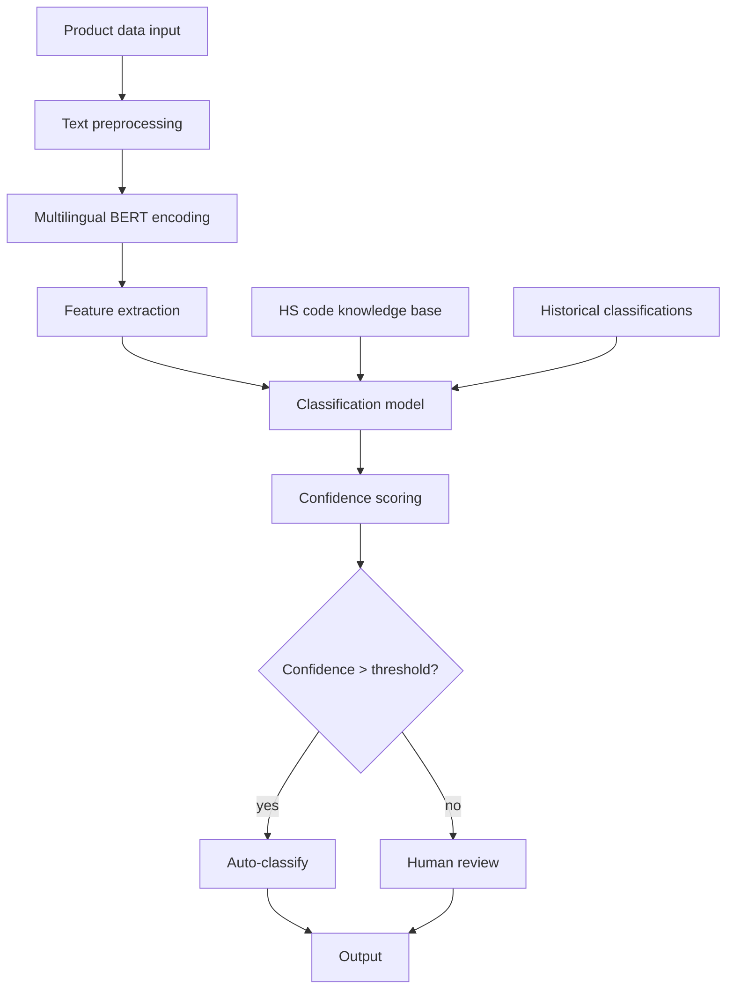

# Intelligent HS Code Classification — a Reference Architecture

> **Important**: this is a reference technical design showing the complete path to building an HS-code classification system. The performance and business figures are illustrative; real-world results vary with data quality, business context, and other factors.

## Overview

This design shows how to build a machine-learning-based automatic HS-code classification system, as a technical reference for cross-border e-commerce companies classifying customs codes automatically.

## Business Background

### Challenges
- **Slow manual classification**: ~15 minutes of lookup and verification per product
- **High error rate**: manual classification errs at roughly 8–12%
- **Expensive**: requires customs-code specialists
- **Compliance risk**: misclassification can mean customs fines and delays

### Expected business value
- Faster, more accurate classification
- Lower labor cost
- Reduced compliance risk
- Faster time-to-listing

> **Note**: the design below combines industry best practices with open-source tooling

## Technical Design

### System architecture



### Core stack

```text
# Key dependencies
transformers==4.21.0
scikit-learn==1.1.2
fastapi==0.85.0
pandas==1.4.3
numpy==1.23.2
redis==4.3.4
uvicorn==0.18.3
```

## Implementation Details

### 1. Data preparation

```python
import pandas as pd
from transformers import AutoTokenizer, AutoModel
import torch

class HSCodeDataProcessor:
    def __init__(self, model_name='bert-base-multilingual-cased'):
        self.tokenizer = AutoTokenizer.from_pretrained(model_name)
        self.model = AutoModel.from_pretrained(model_name)

    def preprocess_text(self, text):
        """Text preprocessing"""
        # Clean and normalize
        text = text.lower().strip()
        # Strip special characters but keep the important bits
        text = re.sub(r'[^\w\s\-\.]', ' ', text)
        return text

    def extract_features(self, product_descriptions):
        """Extract BERT features"""
        features = []
        for desc in product_descriptions:
            inputs = self.tokenizer(desc, return_tensors='pt',
                                    max_length=512, truncation=True, padding=True)
            with torch.no_grad():
                outputs = self.model(**inputs)
            # Use the [CLS] token embedding as the sentence representation
            cls_embedding = outputs.last_hidden_state[:, 0, :].numpy()
            features.append(cls_embedding.flatten())
        return np.array(features)
```

### 2. Model training

```python
from sklearn.ensemble import RandomForestClassifier
from sklearn.model_selection import train_test_split
from sklearn.metrics import classification_report, accuracy_score

class HSCodeClassifier:
    def __init__(self):
        self.processor = HSCodeDataProcessor()
        self.classifier = RandomForestClassifier(
            n_estimators=200,
            max_depth=20,
            min_samples_split=5,
            random_state=42
        )
        self.label_encoder = LabelEncoder()

    def train(self, df):
        """Train the model"""
        # Feature extraction
        X = self.processor.extract_features(df['product_description'])
        y = self.label_encoder.fit_transform(df['hs_code'])

        # Train/test split
        X_train, X_test, y_train, y_test = train_test_split(
            X, y, test_size=0.2, random_state=42, stratify=y
        )

        # Fit
        self.classifier.fit(X_train, y_train)

        # Evaluate
        y_pred = self.classifier.predict(X_test)
        accuracy = accuracy_score(y_test, y_pred)
        print(f"Test accuracy: {accuracy:.3f}")

        return accuracy

    def predict_with_confidence(self, product_description):
        """Predict the HS code with a confidence score"""
        features = self.processor.extract_features([product_description])

        # Predicted probabilities
        probabilities = self.classifier.predict_proba(features)[0]
        predicted_class = np.argmax(probabilities)
        confidence = probabilities[predicted_class]

        # Map back to the HS code
        hs_code = self.label_encoder.inverse_transform([predicted_class])[0]

        return {
            'hs_code': hs_code,
            'confidence': float(confidence),
            'top_3_predictions': self._get_top_predictions(probabilities, 3)
        }

    def _get_top_predictions(self, probabilities, top_k):
        """Return the top-K predictions"""
        top_indices = np.argsort(probabilities)[-top_k:][::-1]
        top_predictions = []

        for idx in top_indices:
            hs_code = self.label_encoder.inverse_transform([idx])[0]
            confidence = probabilities[idx]
            top_predictions.append({
                'hs_code': hs_code,
                'confidence': float(confidence)
            })

        return top_predictions
```

### 3. API service

```python
from fastapi import FastAPI, HTTPException
from pydantic import BaseModel
import redis
import json

app = FastAPI(title="HS Code Classification API")
redis_client = redis.Redis(host='localhost', port=6379, db=0)

# Load the trained model
classifier = HSCodeClassifier()
classifier.load_model('models/hs_classifier.pkl')

class ProductRequest(BaseModel):
    product_description: str
    product_category: str = None
    brand: str = None

class ClassificationResponse(BaseModel):
    hs_code: str
    confidence: float
    top_3_predictions: list
    processing_time: float

@app.post("/classify", response_model=ClassificationResponse)
async def classify_product(request: ProductRequest):
    """Classify a product's HS code"""
    start_time = time.time()

    try:
        # Check the cache
        cache_key = f"hs_classify:{hash(request.product_description)}"
        cached_result = redis_client.get(cache_key)

        if cached_result:
            result = json.loads(cached_result)
        else:
            # Run classification
            result = classifier.predict_with_confidence(request.product_description)

            # Cache for 24 hours
            redis_client.setex(cache_key, 86400, json.dumps(result))

        processing_time = time.time() - start_time
        result['processing_time'] = processing_time

        return ClassificationResponse(**result)

    except Exception as e:
        raise HTTPException(status_code=500, detail=str(e))

@app.get("/health")
async def health_check():
    return {"status": "healthy", "timestamp": time.time()}
```

### 4. Deployment

```yaml
# docker-compose.yml
version: '3.8'
services:
hs-classifier:
build: .
ports:
- "8000:8000"
environment:
- REDIS_URL=redis://redis:6379
depends_on:
- redis
volumes:
- ./models:/app/models

redis:
image: redis:7-alpine
ports:
- "6379:6379"
volumes:
- redis_data:/data

volumes:
redis_data:
```

```dockerfile
# Dockerfile
FROM python:3.9-slim

WORKDIR /app

COPY requirements.txt .
RUN pip install --no-cache-dir -r requirements.txt

COPY . .

EXPOSE 8000

CMD ["uvicorn", "main:app", "--host", "0.0.0.0", "--port", "8000"]
```

## Expected Performance

> **Disclaimer**: the figures below are estimates based on comparable projects; actual results depend on data quality, tuning, and hardware.

### Target metrics

| Metric | Target | Notes |
|--------|--------|-------|
| Overall accuracy | 90–95% | Depends on training data quality and coverage |
| Mean F1 | 85–92% | Balancing precision and recall |
| Latency | < 5s | Including feature extraction and inference |
| Throughput | 200–500 QPS | Depends on hardware and optimization |

### Expected business improvement

| Metric | Today | Target | Expected gain |
|--------|-------|--------|---------------|
| Classification time | 10–20 min | < 5s | 95%+ |
| Accuracy | 80–90% | 90–95% | 5–15% |
| Labor cost | 100% | 20–30% | 70–80% |
| Throughput | 50–100 products/day | 1,000+ products/day | 10–20× |

### Error analysis

Common error classes:
1. **Similar-product confusion** (40%): e.g., same product type in different materials
2. **Multi-function products** (25%): products with several uses
3. **Novel categories** (20%): products unseen in training data
4. **Incomplete descriptions** (15%): insufficient product information

## Optimization Strategies

### 1. Data augmentation
```python
def augment_training_data(df):
    """Data augmentation strategies"""
    augmented_data = []

    for _, row in df.iterrows():
        original_desc = row['product_description']
        hs_code = row['hs_code']

        # Synonym replacement
        augmented_desc = synonym_replacement(original_desc)
        augmented_data.append({'product_description': augmented_desc, 'hs_code': hs_code})

        # Random deletion
        augmented_desc = random_deletion(original_desc, p=0.1)
        augmented_data.append({'product_description': augmented_desc, 'hs_code': hs_code})

    return pd.DataFrame(augmented_data)
```

### 2. Active learning
```python
class ActiveLearningPipeline:
    def __init__(self, classifier, uncertainty_threshold=0.7):
        self.classifier = classifier
        self.uncertainty_threshold = uncertainty_threshold
        self.uncertain_samples = []

    def identify_uncertain_samples(self, new_data):
        """Identify uncertain samples"""
        for sample in new_data:
            result = self.classifier.predict_with_confidence(sample)
            if result['confidence'] < self.uncertainty_threshold:
                self.uncertain_samples.append(sample)

    def retrain_with_feedback(self, labeled_samples):
        """Retrain with feedback data"""
        # Add newly labeled data to the training set
        # Retrain the model
        pass
```

### 3. Model ensembling
```python
class EnsembleHSClassifier:
    def __init__(self):
        self.models = [
            RandomForestClassifier(n_estimators=200),
            XGBClassifier(n_estimators=200),
            LogisticRegression(max_iter=1000)
        ]

    def predict_ensemble(self, features):
        """Ensemble prediction"""
        predictions = []
        for model in self.models:
            pred = model.predict_proba(features)
            predictions.append(pred)

        # Average probabilities
        avg_prob = np.mean(predictions, axis=0)
        return avg_prob
```

## Monitoring and Maintenance

### 1. Performance monitoring
```python
import logging
from prometheus_client import Counter, Histogram, generate_latest

# Metrics
classification_requests = Counter('hs_classification_requests_total', 'Total classification requests')
classification_duration = Histogram('hs_classification_duration_seconds', 'Classification duration')
classification_accuracy = Histogram('hs_classification_accuracy', 'Classification accuracy')

@app.middleware("http")
async def monitor_requests(request, call_next):
    start_time = time.time()
    classification_requests.inc()

    response = await call_next(request)

    duration = time.time() - start_time
    classification_duration.observe(duration)

    return response
```

### 2. Data drift detection
```python
from scipy import stats

class DataDriftDetector:
    def __init__(self, reference_data):
        self.reference_features = self._extract_features(reference_data)

    def detect_drift(self, new_data, threshold=0.05):
        """Detect data drift"""
        new_features = self._extract_features(new_data)

        # KS test for distribution shift
        for i in range(new_features.shape[1]):
            statistic, p_value = stats.ks_2samp(
                self.reference_features[:, i],
                new_features[:, i]
            )

            if p_value < threshold:
                logging.warning(f"Feature {i} shows significant drift (p={p_value})")
                return True

        return False
```

## Deployment and Operations

### Production checklist

1. **Infrastructure**
- Kubernetes cluster
- Redis cache
- Load balancer
- Monitoring (Prometheus + Grafana)

2. **Security**
- API key authentication
- Rate limiting
- Data encryption

3. **Backups**
- Model file backups
- Training data backups
- Config under version control

### Troubleshooting guide

| Problem | Likely cause | Fix |
|---------|-------------|-----|
| Slow responses | Model loading, cache misses | Check Redis connectivity, optimize the model |
| Accuracy decline | Data drift, model staleness | Retrain; audit data quality |
| Out of memory | Batch too large | Reduce batch size, add memory |
| API errors | Malformed input | Validate input format |

## Summary

This design walks the full path to an HS-code classification system. The key points:

1. **High-quality training data**: collect and clean a large labeled corpus
2. **Sensible model choice**: BERT features + classic ML
3. **Solid engineering**: API design, caching, monitoring
4. **Continuous optimization**: active learning, model refreshes

### Implementation advice

- **Data**: aim for 10,000+ labeled samples
- **Model**: match model complexity to data scale
- **Deployment**: containerize for scaling and maintenance
- **Monitoring**: track accuracy, latency, and business metrics first

### Stack alternatives

- **Instead of BERT**: DistilBERT, RoBERTa, or other lightweight models
- **Instead of this serving setup**: TorchServe, TensorFlow Serving
- **Instead of Redis-only storage**: PostgreSQL, MongoDB

> **Call for contributions**: if you've shipped something similar, real cases and lessons learned are very welcome!

## Related Resources

- [Source repository](https://github.com/cbec-ai-hub/hs-code-classifier)
- [API docs](https://api.example.com/docs)
- Deployment guide (TBD)
- Performance benchmarks (TBD)
