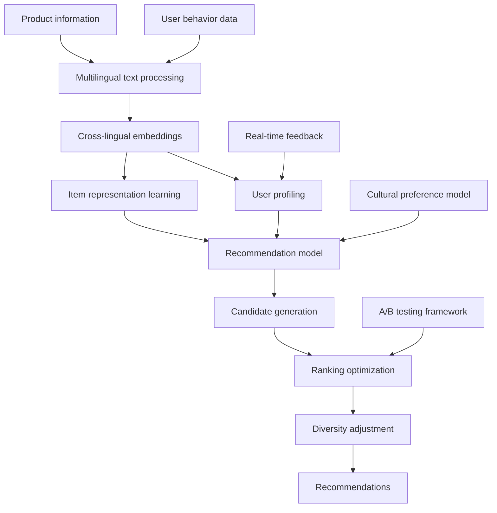

# Multilingual Product Recommendation System — a Reference Architecture

> **Important**: this is a reference technical design showing the complete architecture of a multilingual recommendation system. The performance and business figures are illustrative; real-world results vary with data distribution, user behavior, and other factors.

## Overview

This design shows how to build a product recommendation system that supports multiple languages and cultures — a technical reference for personalization on a global e-commerce platform.

## Business Background

### Challenges
- **Language barriers**: users search and browse in different languages
- **Cultural differences**: purchase preferences and behavior differ sharply across regions
- **Cold start**: new users and new products lack history
- **Data sparsity**: cross-language, cross-region interaction data is sparse

### Expected business goals
- Higher engagement and conversion
- Better user experience and satisfaction
- Broader product coverage
- Support for global expansion

> **Note**: the design below follows recommender-systems best practices

## Technical Design

### System architecture



### Core stack

```text
# Key dependencies
lightfm==1.16
spacy==3.4.1
sentence-transformers==2.2.2
scikit-learn==1.1.2
pandas==1.4.3
numpy==1.23.2
mlflow==1.28.0
fastapi==0.85.0
redis==4.3.4
```

## Implementation Details

### 1. Multilingual text processing

```python
import spacy
from sentence_transformers import SentenceTransformer
import numpy as np

class MultilingualTextProcessor:
    def __init__(self):
        # Load per-language models
        self.nlp_models = {
            'en': spacy.load('en_core_web_sm'),
            'zh': spacy.load('zh_core_web_sm'),
            'es': spacy.load('es_core_news_sm'),
            'fr': spacy.load('fr_core_news_sm'),
            'de': spacy.load('de_core_news_sm'),
            'ja': spacy.load('ja_core_news_sm')
        }

        # Multilingual sentence-embedding model
        self.sentence_model = SentenceTransformer('paraphrase-multilingual-MiniLM-L12-v2')

    def detect_language(self, text):
        """Language detection"""
        from langdetect import detect
        try:
            return detect(text)
        except:
            return 'en' # default to English

    def preprocess_text(self, text, language=None):
        """Text preprocessing"""
        if language is None:
            language = self.detect_language(text)

        if language not in self.nlp_models:
            language = 'en'

        nlp = self.nlp_models[language]
        doc = nlp(text)

        # Extract keywords and entities
        keywords = [token.lemma_.lower() for token in doc
                    if not token.is_stop and not token.is_punct and token.is_alpha]
        entities = [(ent.text, ent.label_) for ent in doc.ents]

        return {
            'keywords': keywords,
            'entities': entities,
            'language': language,
            'processed_text': ' '.join(keywords)
        }

    def get_text_embedding(self, text):
        """Get the text embedding vector"""
        return self.sentence_model.encode([text])[0]

    def compute_text_similarity(self, text1, text2):
        """Compute text similarity"""
        emb1 = self.get_text_embedding(text1)
        emb2 = self.get_text_embedding(text2)
        return np.dot(emb1, emb2) / (np.linalg.norm(emb1) * np.linalg.norm(emb2))
```

### 2. Cross-cultural user modeling

```python
from lightfm import LightFM
from lightfm.data import Dataset
import pandas as pd

class CrossCulturalUserModel:
    def __init__(self):
        self.text_processor = MultilingualTextProcessor()
        self.cultural_features = {
            'US': {'individualism': 0.91, 'uncertainty_avoidance': 0.46, 'power_distance': 0.40},
            'CN': {'individualism': 0.20, 'uncertainty_avoidance': 0.30, 'power_distance': 0.80},
            'DE': {'individualism': 0.67, 'uncertainty_avoidance': 0.65, 'power_distance': 0.35},
            'JP': {'individualism': 0.46, 'uncertainty_avoidance': 0.92, 'power_distance': 0.54},
            'BR': {'individualism': 0.38, 'uncertainty_avoidance': 0.76, 'power_distance': 0.69}
        }

    def build_user_features(self, user_data):
        """Build user features"""
        features = []

        for _, user in user_data.iterrows():
            user_features = []

            # Base features
            user_features.extend([
                f"age_group:{self._get_age_group(user['age'])}",
                f"gender:{user['gender']}",
                f"country:{user['country']}",
                f"language:{user['preferred_language']}"
            ])

            # Cultural-dimension features
            if user['country'] in self.cultural_features:
                cultural = self.cultural_features[user['country']]
                for dim, value in cultural.items():
                    user_features.append(f"cultural_{dim}:{self._discretize(value)}")

            # Behavioral features
            user_features.extend([
                f"avg_order_value:{self._discretize_price(user['avg_order_value'])}",
                f"purchase_frequency:{self._get_frequency_group(user['purchase_frequency'])}",
                f"preferred_categories:{','.join(user['preferred_categories'])}"
            ])

            features.append(user_features)

        return features

    def build_item_features(self, product_data):
        """Build item features"""
        features = []

        for _, product in product_data.iterrows():
            item_features = []

            # Base features
            item_features.extend([
                f"category:{product['category']}",
                f"brand:{product['brand']}",
                f"price_range:{self._discretize_price(product['price'])}",
                f"rating_range:{self._discretize_rating(product['avg_rating'])}"
            ])

            # Text features
            text_info = self.text_processor.preprocess_text(
                product['title'] + ' ' + product['description']
            )

            # Keyword features
            for keyword in text_info['keywords'][:10]: # top 10 keywords
                item_features.append(f"keyword:{keyword}")

            # Language feature
            item_features.append(f"content_language:{text_info['language']}")

            # Regional-fit features
            if 'target_regions' in product:
                for region in product['target_regions']:
                    item_features.append(f"target_region:{region}")

            features.append(item_features)

        return features

    def _get_age_group(self, age):
        if age < 25: return "young"
        elif age < 35: return "adult"
        elif age < 50: return "middle_aged"
        else: return "senior"

    def _discretize(self, value, bins=5):
        return int(value * bins)

    def _discretize_price(self, price):
        if price < 20: return "low"
        elif price < 100: return "medium"
        elif price < 500: return "high"
        else: return "premium"

    def _discretize_rating(self, rating):
        if rating < 3.0: return "low"
        elif rating < 4.0: return "medium"
        else: return "high"

    def _get_frequency_group(self, frequency):
        if frequency < 2: return "occasional"
        elif frequency < 5: return "regular"
        else: return "frequent"
```

### 3. Model training

```python
class MultilingualRecommendationModel:
    def __init__(self, no_components=100, loss='warp', learning_rate=0.05):
        self.model = LightFM(
            no_components=no_components,
            loss=loss,
            learning_rate=learning_rate,
            random_state=42
        )
        self.dataset = Dataset()
        self.user_model = CrossCulturalUserModel()
        self.is_fitted = False

    def prepare_data(self, interactions_df, users_df, items_df):
        """Prepare training data"""
        # Build user and item features
        user_features = self.user_model.build_user_features(users_df)
        item_features = self.user_model.build_item_features(items_df)

        # Create the dataset
        self.dataset.fit(
            users=interactions_df['user_id'].unique(),
            items=interactions_df['item_id'].unique(),
            user_features=set(feature for features in user_features for feature in features),
            item_features=set(feature for features in item_features for feature in features)
        )

        # Build the interaction matrix
        (interactions, weights) = self.dataset.build_interactions(
            [(row['user_id'], row['item_id'], row['rating'])
             for _, row in interactions_df.iterrows()]
        )

        # Build feature matrices
        user_features_matrix = self.dataset.build_user_features(
            [(users_df.iloc[i]['user_id'], user_features[i])
             for i in range(len(users_df))]
        )

        item_features_matrix = self.dataset.build_item_features(
            [(items_df.iloc[i]['item_id'], item_features[i])
             for i in range(len(items_df))]
        )

        return interactions, user_features_matrix, item_features_matrix

    def train(self, interactions_df, users_df, items_df, epochs=50):
        """Train the model"""
        interactions, user_features, item_features = self.prepare_data(
            interactions_df, users_df, items_df
        )

        # Fit
        self.model.fit(
            interactions,
            user_features=user_features,
            item_features=item_features,
            epochs=epochs,
            verbose=True
        )

        self.is_fitted = True
        return self

    def predict(self, user_id, item_ids, user_features=None, item_features=None):
        """Predict a user's preference scores for items"""
        if not self.is_fitted:
            raise ValueError("Model must be trained before making predictions")

        user_internal_id = self.dataset.mapping()[0][user_id]
        item_internal_ids = [self.dataset.mapping()[2][item_id] for item_id in item_ids]

        scores = self.model.predict(
            user_internal_id,
            item_internal_ids,
            user_features=user_features,
            item_features=item_features
        )

        return scores

    def recommend(self, user_id, n_items=10, filter_seen=True):
        """Recommend items for a user"""
        if not self.is_fitted:
            raise ValueError("Model must be trained before making recommendations")

        user_internal_id = self.dataset.mapping()[0][user_id]
        n_items_total = len(self.dataset.mapping()[2])

        scores = self.model.predict(
            user_internal_id,
            np.arange(n_items_total)
        )

        # Top-N recommendations
        top_items = np.argsort(-scores)[:n_items]

        # Map back to original IDs
        item_mapping = {v: k for k, v in self.dataset.mapping()[2].items()}
        recommended_items = [item_mapping[item] for item in top_items]
        recommended_scores = scores[top_items]

        return list(zip(recommended_items, recommended_scores))
```

### 4. Real-time recommendation service

```python
from fastapi import FastAPI, HTTPException
from pydantic import BaseModel
import redis
import json
import time

app = FastAPI(title="Multilingual Recommendation API")
redis_client = redis.Redis(host='localhost', port=6379, db=0)

# Load the trained model
recommendation_model = MultilingualRecommendationModel()
recommendation_model.load_model('models/multilingual_recommender.pkl')

class RecommendationRequest(BaseModel):
    user_id: str
    language: str = 'en'
    country: str = 'US'
    n_items: int = 10
    category_filter: list = None

class RecommendationResponse(BaseModel):
    user_id: str
    recommendations: list
    language: str
    processing_time: float
    model_version: str

@app.post("/recommend", response_model=RecommendationResponse)
async def get_recommendations(request: RecommendationRequest):
    """Personalized recommendations"""
    start_time = time.time()

    try:
        # Check the cache
        cache_key = f"rec:{request.user_id}:{request.language}:{request.country}"
        cached_result = redis_client.get(cache_key)

        if cached_result:
            recommendations = json.loads(cached_result)
        else:
            # Generate recommendations
            raw_recommendations = recommendation_model.recommend(
                request.user_id,
                n_items=request.n_items * 2 # over-generate, filter later
            )

            # Apply filters and diversity adjustment
            recommendations = await apply_filters_and_diversity(
                raw_recommendations,
                request
            )

            # Cache for 1 hour
            redis_client.setex(cache_key, 3600, json.dumps(recommendations))

        processing_time = time.time() - start_time

        return RecommendationResponse(
            user_id=request.user_id,
            recommendations=recommendations[:request.n_items],
            language=request.language,
            processing_time=processing_time,
            model_version="v1.2.0"
        )

    except Exception as e:
        raise HTTPException(status_code=500, detail=str(e))

async def apply_filters_and_diversity(recommendations, request):
    """Apply filters and diversity adjustment"""
    filtered_recs = []
    categories_seen = set()

    for item_id, score in recommendations:
        # Fetch item info
        item_info = await get_item_info(item_id)

        # Category filter
        if request.category_filter and item_info['category'] not in request.category_filter:
            continue

        # Diversity control: cap items per category
        if item_info['category'] in categories_seen and len([r for r in filtered_recs if r['category'] == item_info['category']]) >= 2:
            continue

        categories_seen.add(item_info['category'])

        # Localization
        localized_info = await localize_item_info(item_info, request.language, request.country)

        filtered_recs.append({
            'item_id': item_id,
            'score': float(score),
            'title': localized_info['title'],
            'description': localized_info['description'],
            'price': localized_info['price'],
            'currency': localized_info['currency'],
            'category': item_info['category'],
            'image_url': item_info['image_url'],
            'rating': item_info['rating'],
            'availability': localized_info['availability']
        })

    return filtered_recs

async def get_item_info(item_id):
    """Fetch item info"""
    # From database or cache
    cache_key = f"item:{item_id}"
    cached_info = redis_client.get(cache_key)

    if cached_info:
        return json.loads(cached_info)

    # Database lookup (simplified here)
    item_info = {
        'item_id': item_id,
        'title': 'Sample Product',
        'description': 'Sample Description',
        'category': 'Electronics',
        'price': 99.99,
        'currency': 'USD',
        'rating': 4.5,
        'image_url': 'https://example.com/image.jpg'
    }

    # Cache it
    redis_client.setex(cache_key, 7200, json.dumps(item_info))

    return item_info

async def localize_item_info(item_info, language, country):
    """Localize item info"""
    localized_info = item_info.copy()

    # Price localization
    if country != 'US':
        localized_info['price'] = await convert_currency(item_info['price'], 'USD', get_currency(country))
        localized_info['currency'] = get_currency(country)

    # Text localization (simplified; call a translation service in production)
    if language != 'en':
        localized_info['title'] = await translate_text(item_info['title'], 'en', language)
        localized_info['description'] = await translate_text(item_info['description'], 'en', language)

    # Availability check
    localized_info['availability'] = await check_availability(item_info['item_id'], country)

    return localized_info

def get_currency(country):
    """Country → currency"""
    currency_map = {
        'US': 'USD', 'CN': 'CNY', 'DE': 'EUR',
        'JP': 'JPY', 'GB': 'GBP', 'BR': 'BRL'
    }
    return currency_map.get(country, 'USD')

async def convert_currency(amount, from_currency, to_currency):
    """Currency conversion (simplified)"""
    # Call an FX API in production
    rates = {'USD': 1.0, 'CNY': 6.8, 'EUR': 0.85, 'JPY': 110, 'GBP': 0.75, 'BRL': 5.2}
    return amount * rates.get(to_currency, 1.0) / rates.get(from_currency, 1.0)

async def translate_text(text, from_lang, to_lang):
    """Text translation (simplified)"""
    # Call a translation API in production
    return f"[{to_lang}] {text}"

async def check_availability(item_id, country):
    """Check availability in a given country"""
    # Check inventory and shipping policy in production
    return True

@app.get("/health")
async def health_check():
    return {"status": "healthy", "timestamp": time.time()}
```

## Expected Performance

> **Disclaimer**: the figures below are estimates from recommender-systems research and industry experience; actual results vary significantly with data quality, user behavior, and business context.

### Offline evaluation targets

| Metric | Target range | Notes |
|--------|--------------|-------|
| Precision@10 | 0.10–0.20 | Depends on sparsity and model complexity |
| Recall@10 | 0.05–0.15 | Bounded by candidate-set size and interest breadth |
| NDCG@10 | 0.15–0.30 | Ranking-aware composite metric |
| Coverage | 0.60–0.80 | Share of catalog the recommender covers |
| Diversity | 0.70–0.85 | Diversity of the recommendation list |

### Expected online impact

| Metric | Baseline | Target lift | Notes |
|--------|----------|-------------|-------|
| CTR | baseline | +15–30% | Depends on baseline quality |
| Conversion rate | baseline | +10–25% | Affected by product quality and price |
| Average order value | baseline | +5–15% | Via cross-sell |
| User satisfaction | baseline | +0.2–0.5 pts | Validate through user research |
| Dwell time | baseline | +20–40% | Proxy for engagement |

### Per-language expectations

| Language | Data richness | Expected Precision@10 | Challenge |
|----------|--------------|----------------------|-----------|
| English | High | 0.15–0.20 | Fierce competition, high expectations |
| Chinese | High | 0.12–0.18 | Cultural differences, regional preferences |
| Spanish | Medium | 0.10–0.15 | Large regional variance |
| French | Medium | 0.08–0.14 | Relatively sparse data |
| German | Medium | 0.08–0.14 | Conservative user behavior |
| Japanese | Low | 0.06–0.12 | Strong cultural specificity |

## Optimization Strategies

### 1. Cold-start handling

```python
class ColdStartHandler:
    def __init__(self, recommendation_model):
        self.model = recommendation_model
        self.popularity_model = PopularityBasedRecommender()
        self.content_model = ContentBasedRecommender()

    def handle_new_user(self, user_profile):
        """New-user cold start"""
        # Demographic-based recommendations
        demographic_recs = self.get_demographic_recommendations(user_profile)

        # Regionally popular items
        popular_recs = self.popularity_model.recommend_by_region(
            user_profile['country'],
            user_profile['language']
        )

        # Blend
        return self.blend_recommendations([demographic_recs, popular_recs], [0.6, 0.4])

    def handle_new_item(self, item_info):
        """New-item cold start"""
        # Content-based similar items
        similar_items = self.content_model.find_similar_items(item_info)

        # Category-level strategy
        category_strategy = self.get_category_strategy(item_info['category'])

        return {
            'similar_items': similar_items,
            'promotion_strategy': category_strategy
        }
```

### 2. Real-time personalization

```python
class RealTimePersonalization:
    def __init__(self):
        self.session_tracker = SessionTracker()
        self.real_time_updater = RealTimeModelUpdater()

    def update_recommendations(self, user_id, interaction_data):
        """Update recommendations from live interactions"""
        # Update session state
        session_state = self.session_tracker.update_session(user_id, interaction_data)

        # Adjust weights on the fly
        adjusted_weights = self.calculate_dynamic_weights(session_state)

        # Re-rank
        return self.rerank_recommendations(user_id, adjusted_weights)

    def calculate_dynamic_weights(self, session_state):
        """Compute dynamic weights"""
        weights = {
            'popularity': 0.3,
            'collaborative': 0.4,
            'content': 0.2,
            'trending': 0.1
        }

        # Adjust from session behavior
        if session_state['browse_time'] > 300: # long browsing session
            weights['content'] += 0.1
            weights['popularity'] -= 0.1

        if session_state['category_focus']: # focused on one category
            weights['content'] += 0.15
            weights['collaborative'] -= 0.15

        return weights
```

### 3. Multi-objective optimization

```python
class MultiObjectiveOptimizer:
    def __init__(self):
        self.objectives = {
            'relevance': 0.4,
            'diversity': 0.2,
            'novelty': 0.15,
            'business_value': 0.25
        }

    def optimize_recommendations(self, candidate_items, user_profile):
        """Multi-objective optimization"""
        scores = {}

        for item in candidate_items:
            scores[item['item_id']] = {
                'relevance': self.calculate_relevance_score(item, user_profile),
                'diversity': self.calculate_diversity_score(item, candidate_items),
                'novelty': self.calculate_novelty_score(item, user_profile),
                'business_value': self.calculate_business_value(item)
            }

        # Composite score
        final_scores = {}
        for item_id, item_scores in scores.items():
            final_score = sum(
                item_scores[obj] * weight
                for obj, weight in self.objectives.items()
            )
            final_scores[item_id] = final_score

        # Sort and return
        sorted_items = sorted(
            candidate_items,
            key=lambda x: final_scores[x['item_id']],
            reverse=True
        )

        return sorted_items
```

## Deployment and Monitoring

### Production architecture

```yaml
# kubernetes-deployment.yml
apiVersion: apps/v1
kind: Deployment
metadata:
name: multilingual-recommender
spec:
replicas: 3
selector:
matchLabels:
app: multilingual-recommender
template:
metadata:
labels:
app: multilingual-recommender
spec:
containers:
- name: recommender-api
image: cbec-ai/multilingual-recommender:v1.2.0
ports:
- containerPort: 8000
env:
- name: REDIS_URL
value: "redis://redis-service:6379"
- name: MODEL_PATH
value: "/models/multilingual_recommender.pkl"
resources:
requests:
memory: "2Gi"
cpu: "1000m"
limits:
memory: "4Gi"
cpu: "2000m"
volumeMounts:
- name: model-storage
mountPath: /models
volumes:
- name: model-storage
persistentVolumeClaim:
claimName: model-pvc
---
apiVersion: v1
kind: Service
metadata:
name: recommender-service
spec:
selector:
app: multilingual-recommender
ports:
- port: 80
targetPort: 8000
type: LoadBalancer
```

### Monitoring metrics

```python
from prometheus_client import Counter, Histogram, Gauge

# Business metrics
recommendation_requests = Counter('recommendation_requests_total', 'Total recommendation requests', ['language', 'country'])
recommendation_ctr = Gauge('recommendation_ctr', 'Click-through rate', ['language'])
recommendation_conversion = Gauge('recommendation_conversion_rate', 'Conversion rate', ['language'])

# Technical metrics
recommendation_latency = Histogram('recommendation_latency_seconds', 'Recommendation latency')
model_accuracy = Gauge('model_accuracy', 'Model accuracy score', ['metric'])
cache_hit_rate = Gauge('cache_hit_rate', 'Cache hit rate')

@app.middleware("http")
async def monitor_requests(request, call_next):
    start_time = time.time()

    response = await call_next(request)

    # Record latency
    latency = time.time() - start_time
    recommendation_latency.observe(latency)

    return response
```

## Summary

This design walks the full path to a multilingual product recommendation system. Key points:

1. **Multilingual support**: modern multilingual NLP models
2. **Cultural adaptation**: cultural-dimension features in the model
3. **Cold-start handling**: multiple strategies for new users and items
4. **Real-time optimization**: adjust recommendations from live behavior
5. **Multi-objective balance**: trade off relevance, diversity, and business value

### Implementation advice

- **Data**: aim for 100k+ interactions per language
- **Training**: use transfer learning from data-rich to data-sparse languages
- **A/B testing**: validate with at least 4 weeks of testing
- **Monitoring**: watch per-language and per-region performance gaps closely

### Stack alternatives

- **Algorithms**: Neural Collaborative Filtering, DeepFM, and other deep methods
- **Multilingual models**: XLM-R, mBERT, and other pretrained models
- **Real-time serving**: Apache Kafka + Apache Flink for streaming compute
- **Feature stores**: Feast, Tecton, etc.

### Known challenges

- **Data imbalance**: data volume varies hugely across languages
- **Cultural differences**: requires deep understanding of regional behavior
- **Cold start**: recommendation quality in new markets is hard to guarantee
- **Latency**: controlling latency for large-scale multilingual serving

> **Call for contributions**: if you've built multilingual recommenders in production, real cases, challenges, and solutions are very welcome!

## Related Resources

- [Source repository](https://github.com/cbec-ai-hub/multilingual-recommender)
- [Training notebook](https://github.com/cbec-ai-hub/multilingual-recommender/blob/main/notebooks/model_training.ipynb)
- [API docs](https://api.example.com/recommender/docs)
- [Benchmarks](https://github.com/cbec-ai-hub/multilingual-recommender/blob/main/benchmarks/)
