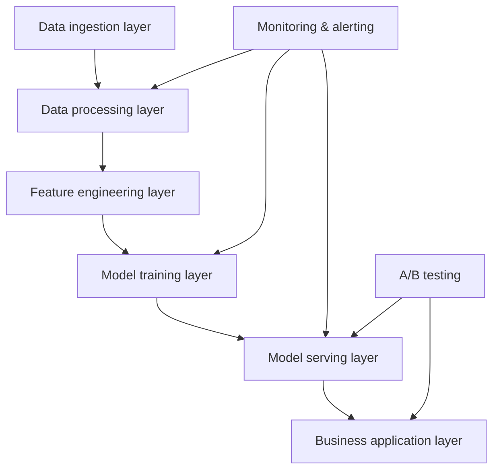

# Technical Implementation Guidelines for E-Commerce AI

This document provides technical architecture patterns, performance benchmarks, and implementation guidance for cross-border e-commerce AI projects. It backs the technical design and evaluation in the case studies.

## Architecture Patterns

### Common architecture components

### Layer responsibilities

**Data ingestion layer**
- Multi-channel intake (marketplaces, ERP, CRM, ...)
- Real-time and batch processing
- Data quality monitoring and cleansing

**Data processing layer**
- ETL/ELT pipelines
- Data warehouse and data lake
- Data versioning and lineage

**Feature engineering layer**
- Feature extraction and transformation
- Feature store and management
- Feature monitoring and drift detection

**Model training layer**
- Model development and training
- Hyperparameter optimization
- Model validation and evaluation

**Model serving layer**
- Deployment and inference
- Load balancing and autoscaling
- A/B testing and canary releases

**Business application layer**
- APIs and SDKs
- UIs and dashboards
- Business process integration

### Technology selection principles

1. **Scalability**: support rapid business growth
- Horizontal scaling
- Microservice architecture
- Cloud-native design

2. **Multilingual support**: fit a global business
- i18n frameworks
- Multilingual NLP models
- Localized data processing

3. **Real-time capability**: serve real-time decisions
- Stream processing
- Low-latency inference
- Cache strategy optimization

4. **Explainability**: meet compliance and audit needs
- Model explainability
- Transparent decision paths
- Complete audit logs

5. **Cost efficiency**: balance performance and cost
- Resource right-sizing
- Automated operations
- Cost monitoring and control

## Performance Benchmarks

### Model performance targets

| Task type | Accuracy target | Latency | Throughput | Notes |
|-----------|----------------|---------|------------|-------|
| Text classification | > 90% | < 100ms | 1000 QPS | Product categorization, sentiment analysis |
| Recommendation | CTR > 3% | < 50ms | 5000 QPS | Product recommendations, personalization |
| Time-series forecasting | MAPE < 20% | < 1s | 100 QPS | Demand forecasting, inventory optimization |
| Anomaly detection | F1 > 95% | < 10ms | 10000 QPS | Fraud detection, risk control |
| Image recognition | > 95% | < 200ms | 500 QPS | Product recognition, QC |

### Infrastructure requirements

**Compute**
- **Minimum**: 2 cores, 4 GB RAM
- **Recommended**: 8 cores, 16 GB RAM
- **High performance**: 16 cores, 32 GB RAM + GPU

**Storage**
- **System disk**: SSD, 100 GB minimum
- **Data disk**: sized to data volume, SSD recommended
- **Backups**: off-site, 30-day retention

**Network**
- **Bandwidth**: 100 Mbps minimum, 1 Gbps recommended
- **Latency**: intra-network < 1ms
- **Availability**: 99.9%+

**Containerization**
- **Docker**: containerized deployment
- **Kubernetes**: cluster management
- **Service mesh**: Istio-style microservice governance

## Continuous Improvement

### Model iteration loop

1. **Data collection**: continuously gather business feedback
- User behavior data
- Business metrics
- System performance data

2. **Performance monitoring**: watch model metrics in real time
- Accuracy monitoring
- Latency monitoring
- Resource usage monitoring

3. **A/B testing**: challenger vs. incumbent
- Traffic-split strategy
- Statistical significance testing
- Business metric comparison

4. **Progressive rollout**: de-risk releases
- Canary releases
- Blue/green deployment
- Rollback mechanisms

5. **Impact evaluation**: business and technical metrics together
- ROI calculation
- User satisfaction
- System stability

### Quality assurance

**Code quality**
- Code review process
- Unit test coverage > 80%
- Integration and end-to-end tests

**Data quality**
- Validation rules
- Quality monitoring
- Anomalous data handling

**Model quality**
- Validation framework
- Benchmarking
- Bias detection

## Security & Compliance

### Data security
- Encryption in transit and at rest
- Access control and permissions
- Masking and anonymization

### Privacy
- GDPR compliance
- Data minimization
- Consent management

### System security
- Network protection
- Vulnerability scanning and patching
- Security audit logs

## References

### Technical documentation
- [AWS Machine Learning Best Practices](https://docs.aws.amazon.com/wellarchitected/latest/machine-learning-lens/)
- [Google Cloud AI Platform Guide](https://cloud.google.com/ai-platform/docs)
- [MLOps Maturity Model](https://docs.microsoft.com/en-us/azure/architecture/example-scenario/mlops/mlops-maturity-model)

### Open-source tools
- [MLflow](https://mlflow.org/) — ML lifecycle management
- [Kubeflow](https://www.kubeflow.org/) — ML workflows on Kubernetes
- [DVC](https://dvc.org/) — data version control

---

**How to use this guide**: it provides technical reference points for the case studies; adapt to your business needs and resource constraints. For concrete examples, see the [case studies](../case-studies/) or [open an issue](https://github.com/kangise/ecommerce-ai-roadmap/issues).
