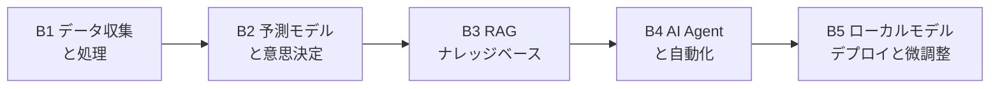

# Path B: 技術者のための AI システム構築

> 最終更新: 2026-08-04

## 概要

- **対象読者**: EC の開発/データ/BI に携わる技術者
- **前提条件**: Python の基礎(または学びながら進める意思。コードは AI が手伝ってくれる)
- **時間投入**: 1 日 1 時間、4〜8 週間で体系的に習得
- **主な成果物**: デプロイ可能な AI ツール

> AI 駆動の EC ツールとシステムを、スクリプトからプロダクト級のアプリケーションまで構築する



---

## モジュールナビゲーション

| モジュール | テーマ | 難易度 | 想定時間 | 内容 |
|-----------|--------|--------|----------|------|
| [B1. データ収集と処理の自動化](b1-data-pipeline.md) | データパイプライン | 入門 | 4〜6 時間 | Amazon レポートからクレンジング済み分析データセットまで |
| [B2. 予測モデルと意思決定](b2-prediction-models.md) | 予測モデリング | 中級 | 6〜8 時間 | 販売予測モデルで補充判断を支える |
| [B3. RAG ナレッジベースシステム](b3-rag-knowledge-base.md) | ナレッジベース | 中級 | 6〜8 時間 | 社内文書にもとづく AI Q&A システム |
| [B4. AI Agent とワークフロー自動化](b4-agent-workflow.md) | Agent | 上級 | 8〜10 時間 | 多段階の運用タスクを自動実行する |
| [B5. ローカルモデルのデプロイと微調整](b5-local-model-deploy.md) | モデルデプロイ | 上級 | 4〜6 時間 | LLM をローカルで動かし、データを外に出さない |
| [B6. MCP 統合と Agentic ワークフロー](b6-mcp-agentic-workflow.md) | MCP / Agentic | 上級 | 2〜3 週間 | MCP で Amazon Ads / Shopify をつなぎ、対話で運用する |
| [B7. Review インテリジェント分析システム](b7-review-nlp-system.md) | NLP / トピックモデル | 中級 | 2 週間 | BERTopic トピックモデル + 感情分析 + LLM インサイト |
| [B8. EC データ可視化ダッシュボード](b8-ecommerce-dashboard.md) | Streamlit / Plotly | 中級 | 1〜2 週間 | 複数プラットフォーム運用ダッシュボード + AI 異常検知 |
| [B9. AI 商品画像/動画生成](b9-ai-image-pipeline.md) | ComfyUI / GPT Image 2 / FLUX.2 | 上級 | 2〜3 週間 | 商品画像の一括生成パイプライン + 動画生成 |

---

## 進捗トラッキング

```
[ ] B1. データ: 複数の Amazon レポートを自動で結合し集計を出すスクリプトを書く
[ ] B2. 予測: Prophet で実在 SKU の 90 日販売予測を行う
[ ] B3. RAG: 商品に関する質問に答えられる RAG システムを立てる
[ ] B4. Agent: 運用監視を自動化する Agent をデプロイする
[ ] B5. デプロイ: Ollama でローカル LLM を動かし EC タスクを 1 件こなす(選択)
[ ] B6. MCP: Amazon Ads MCP を設定し Claude との対話で広告を管理する
[ ] B7. NLP: BERTopic で 1000 件以上の Review をトピックモデリングする
[ ] B8. ダッシュボード: 4 モジュール以上の Streamlit 運用ダッシュボードを作る
[ ] B9. 画像: ある商品の AI 画像一式を生成し Amazon のコンプライアンス検査を通す
```

> **関連リソース**: [技術実装ガイドライン](../resources/technical-guidelines.md) アーキテクチャパターン、性能基準、セキュリティとコンプライアンスのチェックリスト。

**Path B の完了目安:** B1〜B4 のうち少なくとも 3 つを終えれば、AI の EC ツールを構築する力はついている。B5〜B9 は必要に応じて。B5 はデータを外に出さないため、B6 は運用を対話に変えるため、B7〜B9 はそれぞれ独立した完成システムにあたる。

---
