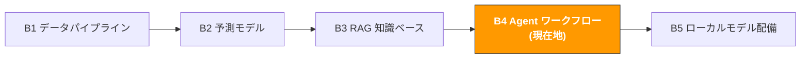

# B4. AI Agent とワークフロー自動化

> **トラック**: Path B: 技術 · **モジュール**: B4
> **最終更新**: 2026-07-31
> **難易度**: 上級
> **前提**: B1 データパイプラインの基礎(Python、ファイル処理)、B3 の RAG 基本概念
> **所要時間**: 1 日 1 時間、2〜3 週間
---




---

## 章ナビゲーション

1. [Agent 方法論](#1-agent-方法論) · 2. [ツール全景](#2-ツール全景) · 3. [コード実践](#3-コード実践) · 4. [EC Agent 応用](#4-ec-agent-応用シーン) · 5. [よくある罠](#5-よくある罠) · 6. [Token コスト工学](#6-token-コスト工学) · 7. [上級テクニック](#7-上級テクニック) · 8. [学習リソース](#8-学習リソース)


## このモジュールで構築するもの

AI Agent システム 多段の運営タスクを自動実行(毎日のデータチェック → 異常分析 → レポート生成 → アラート通知など)。

修了後には:
- Agent の核心概念を理解: ReAct パターン、Tool Use、状態管理
- Agent、Chain、RAG の 3 つの LLM アプリモードを区別し、いつどれを使うか分かる
- LangGraph でツールを呼べる Agent を構築できる
- 運営日報の自動生成 Agent を構築(データ収集 → 分析 → レポート生成)
- 在庫警告 Agent を構築(在庫監視 → 需要予測 → 補充リマインダー送信)
- Review 監視 Agent を構築(新規 Review 監視 → 感情分析 → 低評価警告)
- CrewAI でマルチ Agent 協業を実装(データアナリスト + レポート執筆者 + 審査者)
- Agent 開発でよくある罠を回避: ループ、コスト暴走、ハルシネーション伝播

---

## 1. Agent 方法論

> **関連**: [A3 広告最適化](../a-operators/a3-advertising.md) 広告監視自動化の業務応用シーンは A3 へ · [F4 自動化と Agent](../0-foundations/f4-agent-automation.md) Agent 基礎理論は F4 へ。
>
> **ツール集**: [Awesome MCP & Agent ツール集](../resources/awesome-mcp-agents.md) EC MCP Server、Agent フレームワーク、外部リソースの完全なリスト

### 1.1 AI Agent とは

AI Agent は自律的に意思決定し多段のタスクを実行できる LLM アプリ。普通の LLM 呼び出しと異なり、Agent は:

1. **環境を観察**: データを読む、API を呼ぶ、ファイルを見る
2. **推論する**: 現在の状態を分析し、次に何をするか決める
3. **アクションを実行**: ツールを呼んで具体的なタスクを完了
4. **ループ反復**: 実行結果に応じて継続するか決める

核心の考え方:

```
ユーザー指示 → Agent が推論 → ツールを選択 → ツールを実行 → 結果を観察 → 推論を続けるか結果を返す
```

**直感的な例**: Agent に「今日の販売データをチェックして、異常があれば警告して」と言う。Agent は:
1. データ API を呼んで今日の販売データを取得
2. データを分析し、ある SKU の販売が 40% 下がったのを発見
3. 分析ツールを呼び、異常かどうか判断
4. 警告レポートを生成
5. メールツールを呼んで通知を送信

全過程で、Agent がどのツールをどの順序で呼ぶか自律的に決め、あなたが if-else ロジックを書く必要はない。

### 1.2 Agent vs Chain vs RAG: 3 つのモードの違い

これは最もよく聞かれる質問。簡単に言うと: RAG は「資料を調べる」、Chain は「フローに沿う」、Agent は「自分で方法を考える」。

| 次元 | RAG | Chain | Agent |
|------|-----|-------|-------|
| 核心能力 | 文書を検索して質問に答える | 定義済みステップを実行 | 自律的に意思決定、動的にツールを選択 |
| 意思決定の方式 | 決定なし(検索 → 生成) | 固定フロー(ステップ 1 → 2 → 3) | 動的決定(結果に応じて次のステップを決める) |
| 向くシーン | 知識 Q&A、文書照会 | 固定フローのタスク(翻訳 → 校正 → 整形) | 判断が必要な多段の複雑なタスク |
| ツール呼び出し | なし(検索 + LLM のみ) | 限定的(定義済みのツールチェーン) | 柔軟(Agent が自分でツールを選ぶ) |
| 複雑度 | 低 | 中 | 高 |
| 制御可能性 | 高(挙動が予測可能) | 高(フローが固定) | 中(Agent が想定外の判断をしうる) |
| コスト | 低(1-2 回の LLM 呼び出し) | 中(N 回の LLM 呼び出し、N=ステップ数) | 高(不確定な回数の LLM 呼び出し) |

**決定フレーム:**

```
あなたのタスクは何?
文書に基づいて質問に答える → RAG(B3 モジュール参照)
固定ステップのフロー自動化 → Chain
例: Listing 翻訳 → 校正 → 整形 → 出力
中間結果に応じて判断が必要 → Agent
例: データチェック → 異常発見 → 警告するか決定 → レポート生成
不確実 → まず Chain を試す(より制御可能)、足りなければ Agent に昇格
```

> **重要な洞察**: Agent を使うために Agent を使わない。タスクのフローが固定(毎回 A → B → C)なら、Chain で十分 よりシンプル、安価、制御可能。Agent の価値は「不確実性」への対処 中間で何が起きるか分からず、AI に自分で判断させる必要がある場合。

### 1.3 ReAct パターン: Agent の核心的な思考フレーム

ReAct(Reasoning + Acting)は現在最も主流の Agent 設計パターン。核心の考え: LLM に「思考」と「行動」を交互に行わせる。

```
ループ開始:
1. Thought(思考): 現在の状態を分析し、次のステップを決める
2. Action(行動): 1 つのツールを呼ぶ
3. Observation(観察): ツールが返した結果を見る
4. ステップ 1 に戻る、タスク完了まで
```

**ReAct の実際の実行過程の例:**

```
ユーザー: ASIN B0XXXXX の在庫状態をチェックし、安全在庫を下回ったら補充提案を生成して。

Thought: まずこの ASIN の現在の在庫データを照会する必要がある。
Action: call_tool("get_inventory", {"asin": "B0XXXXX"})
Observation: {"asin": "B0XXXXX", "current_stock": 45, "safety_stock": 100, "daily_sales": 15}

Thought: 現在在庫 45、安全在庫 100、日商 15。在庫が安全線を下回り、
現在の販売ペースだとあと 3 日しかもたない。補充提案を生成する必要がある。
Action: call_tool("calculate_reorder", {"asin": "B0XXXXX", "current": 45, "daily_sales": 15})
Observation: {"suggested_quantity": 500, "lead_time_days": 14, "urgency": "high"}

Thought: 補充提案を生成、500 件の補充を提案、納期 14 日、緊急度高。
タスク完了、結果をまとめる。
Final Answer: ASIN B0XXXXX 在庫警告: 現在在庫 45 件、安全在庫 100 件を下回り、
日商 15 件でわずか 3 日分。緊急補充 500 件を提案、予想納期 14 日。
```

### 1.4 Tool Use: Agent の「手」

Agent の核心能力はツール(Tools)から来る。ツールのない Agent はただのチャットボット。

**ツールの本質**: 1 つの Python 関数 + 1 つの説明(このツールが何ができるか、どんなパラメータが必要かを LLM に伝える)。

```python
# ツール定義の例
def get_inventory(asin: str) -> dict:
"""指定した ASIN の在庫状態を照会する。

Args:
asin: Amazon 製品識別子(B0XXXXX など)

Returns:
current_stock, safety_stock, daily_sales を含む辞書
"""
# 実際の実装: データベースか API を呼ぶ
pass
```

LLM は関数の名前、docstring、パラメータ型を読んで、このツールをいつ呼ぶか、どう呼ぶかを決める。だから**ツールの説明の質が Agent の性能を直接決める**。

**EC シーンでよく使うツールタイプ:**

| ツールタイプ | 例 | 用途 |
|--------------|-----|------|
| データ照会 | `get_sales_data`, `get_inventory` | データベース/API から運営データを取得 |
| データ分析 | `analyze_trend`, `detect_anomaly` | データの統計分析 |
| ファイル操作 | `read_csv`, `write_report` | ファイルの読み書き |
| 通知送信 | `send_email`, `send_slack` | 警告とレポートを送信 |
| 外部 API | `search_amazon`, `get_reviews` | 外部サービスを呼ぶ |
| 計算ツール | `calculate_roi`, `forecast_demand` | 業務計算を実行 |

### 1.5 いつ Agent vs いつ簡単なスクリプト

Agent は万能ではない。多くのシーンは簡単な Python スクリプトで解決でき、Agent は不要。

| シーン | 推奨方案 | 理由 |
|--------|----------|------|
| 毎日固定時間にレポートを走らせる | Python スクリプト + cron | フローが固定、AI 判断不要 |
| データクレンジングと形式変換 | Python スクリプト | ルールが明確、pandas で十分 |
| データ異常に応じて警告するか決める | Agent | 「何が異常か」を AI に判断させる必要 |
| Review を分析し改善提案を生成 | Agent | AI に自然言語を理解させる必要 |
| 多段タスク、中間で人手確認が必要 | Agent + Human-in-the-loop | 動的決定 + 人手審査が必要 |
| Listing を一括翻訳 | Chain(固定フロー) | ステップ固定: 翻訳 → 校正 → 整形 |
| 競合の価格変化を監視し戦略を調整 | Agent | 変化を分析し戦略判断が必要 |

**経験則**: すべてのロジック分岐を if-else で書き切れるなら、スクリプトを使う。分岐が多すぎるか自然言語を「理解」する必要があるなら、Agent を使う。

---

## 2. ツール全景

| ツール | 種類 | 難度 | 最適シーン | インストール |
|--------|------|------|------------|--------------|
| [LangGraph](https://langchain-ai.github.io/langgraph/) | Agent ワークフロー編成 | 中級 | 状態を持つ Agent ワークフローを構築 | `pip install langgraph` |
| [CrewAI](https://docs.crewai.com/) | マルチ Agent 協業 | 中級 | 複数ロールの協業タスク | `pip install crewai` |
| [n8n](https://n8n.io/) | ビジュアルワークフロー | 入門 | ノーコード/ローコード自動化 | Docker 配備 |
| [Streamlit](https://streamlit.io/) | Web UI | 入門 | Agent の対話 UI を素早く構築 | `pip install streamlit` |
| [LangChain](https://python.langchain.com/) | LLM アプリフレームワーク | 中級 | Agent ツールチェーン、Prompt 管理 | `pip install langchain` |
| [OpenAI API](https://platform.openai.com/) | クラウド LLM | 入門 | 最高品質の推論 | `pip install openai` |
| [Ollama](https://ollama.com/) | ローカル LLM | 入門 | データプライバシー、オフライン実行 | [ollama.com/download](https://ollama.com/download) |

**選択のアドバイス:**
- 単 Agent + ツール呼び出し → LangGraph(本モジュールのメインライン)
- マルチ Agent 協業 → CrewAI(本モジュールの上級)
- コードを書きたくない → n8n(ビジュアルなドラッグ&ドロップ)
- Agent に Web UI を追加 → Streamlit

### 2.1 LangGraph vs CrewAI の選択

| 次元 | LangGraph | CrewAI |
|------|-----------|--------|
| 位置づけ | 低レベルの Agent ワークフロー編成 | 高レベルのマルチ Agent 協業フレームワーク |
| 柔軟性 | 極めて高い(グラフ構造、完全カスタム) | 中程度(定義済みのロールとタスクパターン) |
| 学習曲線 | やや急(グラフ、状態、エッジの理解が必要) | 緩やか(ロールとタスクを定義するだけ) |
| 向くシーン | 複雑なワークフロー、精密な制御が必要 | 複数ロール協業、素早いプロトタイプ |
| 状態管理 | 内蔵(TypedDict 状態) | 自動管理 |
| Human-in-the-loop | ネイティブ対応 | 対応 |
| コミュニティ | LangChain エコシステム、非常に活発 | 急成長、ドキュメントがフレンドリー |

**結論**: 入門は CrewAI(よりシンプル)、ワークフローを精密に制御したいときは LangGraph。本モジュールは両方をカバーする。

参考ドキュメント: [LangGraph 公式ドキュメント](https://langchain-ai.github.io/langgraph/) | [CrewAI 公式ドキュメント](https://docs.crewai.com/)

### 2.2 n8n: ノーコードワークフロー自動化

[n8n](https://n8n.io/) はオープンソースのビジュアルワークフロー自動化プラットフォーム。コードを書きたくない、または素早く自動化フローを構築したいなら、n8n は良い選択。

**n8n の利点:**
- ドラッグ&ドロップの UI、プログラミング不要
- 400+ の内蔵統合(Gmail、Slack、Google Sheets、HTTP など)
- AI ノードに対応(OpenAI、Anthropic)
- セルフホスト、データがサーバーを出ない
- コミュニティテンプレートが豊富

**EC 自動化の例(n8n ワークフロー):**

```
定時トリガー(毎日 9:00)
→ HTTP リクエスト: 販売データ API を取得
→ IF ノード: 販売低下 > 20%?
→ Yes → OpenAI ノード: 原因を分析
→ Slack ノード: 警告を送信
→ No → Google Sheets: 日常データを記録
```

> **n8n vs コード Agent**: n8n はフローが固定の自動化に向く(Chain に類似)、コード Agent は動的決定が必要なシーンに向く。両者は組み合わせられる n8n で定時トリガーと通知、Agent でインテリジェント分析。

---

## 3. コード実践

### 3.1 最小 Agent: LangGraph でツールを呼べる Agent を構築

これは書ける最もシンプルな Agent。1 つのツールを定義し、LLM に呼ぶタイミングを自分で決めさせる。

```python
# 最小 Agent LangGraph + OpenAI
# 前提: pip install langgraph langchain-openai
# 環境変数: export OPENAI_API_KEY="sk-..."

from langchain_openai import ChatOpenAI
from langchain_core.tools import tool
from langgraph.prebuilt import create_react_agent

# 1. ツールを定義
@tool
def get_sales_data(date: str) -> dict:
"""指定した日付の販売データ集計を照会する。

Args:
date: 日付、形式 YYYY-MM-DD

Returns:
total_sales, total_orders, top_asin を含む辞書
"""
# モックデータ(実際は DB クエリか API 呼び出しに置換)
return {
"date": date,
"total_sales": 15230.50,
"total_orders": 342,
"top_asin": "B0XXXXX",
"top_asin_sales": 3200.00,
"yoy_change": -0.12,
}

@tool
def detect_anomaly(metric: str, value: float, threshold: float) -> dict:
"""指標が異常か検出する。

Args:
metric: 指標名
value: 現在値
threshold: 異常閾値(変化パーセンテージ、-0.2 は 20% 低下を意味)
"""
is_anomaly = value < threshold
return {
"metric": metric,
"value": value,
"threshold": threshold,
"is_anomaly": is_anomaly,
"severity": "high" if value < threshold * 1.5 else "medium",
}

# 2. Agent を作成
llm = ChatOpenAI(model="gpt-5.6-luna", temperature=0)  # T3 tier — see model-matrix.md
tools = [get_sales_data, detect_anomaly]
agent = create_react_agent(llm, tools)

# 3. Agent を実行
result = agent.invoke({
"messages": [("user", "2025-03-10 の販売データを調べて、前年比で 10% 以上下がっていたら教えて")]
})

# 4. 結果を出力
for msg in result["messages"]:
if hasattr(msg, "content") and msg.content:
print(f"[{msg.type}] {msg.content}")
```

**Agent の実行過程:**
1. LLM がユーザー指示を読み、まず `get_sales_data` を呼ぶと決める
2. データ取得後、`yoy_change = -0.12`(12% 低下)を発見
3. LLM が 12% > 10% と判断、`detect_anomaly` を呼んで異常を確認
4. 結果をまとめ、警告情報を返す

> **注意**: `create_react_agent` は LangGraph が提供する事前構築の ReAct Agent で、素早いプロトタイプに向く。本番環境ではカスタム Graph でより多くの制御を得ることを推奨(3.2 節参照)。

### 3.2 運営日報 Agent: 自動でデータ収集 → 分析 → レポート生成

実際のシーン: 毎朝自動で運営日報を生成、販売概要、異常検知、トレンド分析を含む。

```python
# 運営日報 Agent カスタム LangGraph ワークフロー
# pip install langgraph langchain-openai

import json
from datetime import datetime
from typing import TypedDict, Annotated
from langchain_openai import ChatOpenAI
from langchain_core.tools import tool
from langchain_core.messages import HumanMessage, SystemMessage
from langgraph.graph import StateGraph, END
from langgraph.graph.message import add_messages

# --- ツール定義 ---
@tool
def fetch_daily_sales(date: str) -> str:
"""指定した日付の販売データ集計を取得する。"""
return json.dumps({
"date": date,
"summary": {"total_revenue": 45230.50, "total_orders": 1024,
"total_units": 1580, "avg_order_value": 44.17},
"top_products": [
{"asin": "B0AAAA", "name": "アクションカメラ X1", "units": 320, "revenue": 12800},
{"asin": "B0BBBB", "name": "充電器 Pro", "units": 280, "revenue": 5600},
],
"yoy_comparison": {"revenue_change": -0.08, "orders_change": -0.05},
}, ensure_ascii=False)

@tool
def fetch_inventory_status() -> str:
"""現在の在庫状態を取得、低在庫 ASIN をマーク。"""
return json.dumps({
"low_stock_items": [
{"asin": "B0AAAA", "current": 120, "safety": 200, "days_left": 3},
],
"total_skus": 45, "healthy_skus": 44,
}, ensure_ascii=False)

@tool
def fetch_review_alerts() -> str:
"""直近 24 時間の低評価警告を取得する。"""
return json.dumps({
"new_negative_reviews": [
{"asin": "B0BBBB", "rating": 1, "title": "充電が遅すぎる",
"text": "2 週間で壊れた、充電速度が宣伝よりずっと遅い"},
],
"avg_rating_change": -0.1,
}, ensure_ascii=False)

@tool
def generate_report(report_content: str) -> str:
"""分析結果を Markdown 日報に整形する。"""
today = datetime.now().strftime("%Y-%m-%d")
report = f"# 運営日報 {today}\n\n{report_content}\n\n---\n*AI Agent が自動生成*"
return f"レポートを生成、計 {len(report)} 文字"

# --- Agent 状態 ---
class DailyReportState(TypedDict):
messages: Annotated[list, add_messages]
sales_data: str
inventory_data: str
review_data: str
report: str

llm = ChatOpenAI(model="gpt-5.6-luna", temperature=0)  # T3 tier — see model-matrix.md

SYSTEM_PROMPT = """あなたは EC 運営日報 Agent です。データ収集後、以下を含む日報を生成:
- 販売概要(収入、注文、前年比変化)
- 異常警告(在庫不足、販売の異常低下)
- Review 警告(新規低評価と分析)
- アクション提案(2-3 個の具体的で実行可能な提案)
日本語で出力、データ正確、提案は具体的に。"""

def collect_data(state: DailyReportState) -> dict:
"""ノード 1: 全データ源を収集。"""
today = datetime.now().strftime("%Y-%m-%d")
return {
"sales_data": fetch_daily_sales.invoke({"date": today}),
"inventory_data": fetch_inventory_status.invoke({}),
"review_data": fetch_review_alerts.invoke({}),
}

def analyze_and_report(state: DailyReportState) -> dict:
"""ノード 2: AI がデータを分析し日報を生成。"""
messages = [
SystemMessage(content=SYSTEM_PROMPT),
HumanMessage(content=f"販売: {state['sales_data']}\n"
f"在庫: {state['inventory_data']}\n"
f"Review: {state['review_data']}\n\n運営日報を生成してください。"),
]
response = llm.invoke(messages)
generate_report.invoke({"report_content": response.content})
return {"report": response.content, "messages": [response]}

# --- ワークフローグラフを構築 ---
workflow = StateGraph(DailyReportState)
workflow.add_node("collect_data", collect_data)
workflow.add_node("analyze_and_report", analyze_and_report)
workflow.set_entry_point("collect_data")
workflow.add_edge("collect_data", "analyze_and_report")
workflow.add_edge("analyze_and_report", END)
app = workflow.compile()

# result = app.invoke({"messages": []})
# print(result["report"])

<データ規律>
- 市場データ・検索量・競合の実績・法令条文・料率に関する具体的な数字や事実は、私が提供した情報にあるものだけを使う。**渡していない部分を記憶で埋めないこと** — この種の事実は変化が速く、記憶にある版は古い可能性がある
- 判断にある事実が必要なときは、どの公式ソースで確認すべきかを伝え、そこで止まって私に尋ねること
- 結論ごとに出典を付す: [私が提供した情報] または [モデル推測]
</データ規律>
```

**ワークフローグラフの構造:**

```
[collect_data] → [analyze_and_report] → END

fetch_sales LLM 分析
fetch_inventory generate_report
fetch_reviews
```

> **なぜ create_react_agent でなくカスタム Graph か?** `create_react_agent` は LLM に呼び出し順序を決めさせ、探索的なタスクに向く。しかし日報生成のフローは確定的(先にデータ収集、次に分析)なので、カスタム Graph のほうが制御可能で高効率(不要な LLM 呼び出しを減らす)。

### 3.3 在庫警告 Agent: 在庫監視 → 需要予測 → 補充リマインダー送信

実際のシーン: 毎日全 SKU の在庫状態をチェックし、低在庫商品に将来需要を予測し、補充提案を生成する。

```python
# 在庫警告 Agent LangGraph 条件分岐ワークフロー
# pip install langgraph langchain-openai

import json
from typing import TypedDict, Annotated, Literal
from langchain_openai import ChatOpenAI
from langchain_core.tools import tool
from langchain_core.messages import HumanMessage, SystemMessage
from langgraph.graph import StateGraph, END
from langgraph.graph.message import add_messages

@tool
def check_all_inventory() -> str:
"""全 SKU の在庫状態をチェック、低在庫リストを返す。"""
return json.dumps({
"total_skus": 45,
"low_stock": [
{"asin": "B0AAAA", "name": "アクションカメラ X1", "current": 80,
"safety": 200, "daily_avg": 25, "days_left": 3.2},
],
"out_of_stock_risk": [
{"asin": "B0EEEE", "name": "レンズキャップ", "current": 10,
"daily_avg": 8, "days_left": 1.25},
],
}, ensure_ascii=False)

@tool
def forecast_demand(asin: str, days: int = 30) -> str:
"""指定した ASIN の今後 N 日の需要量を予測する。"""
forecasts = {
"B0AAAA": {"predicted_demand": 780, "confidence": 0.85, "trend": "stable"},
"B0EEEE": {"predicted_demand": 250, "confidence": 0.82, "trend": "stable"},
}
result = forecasts.get(asin, {"predicted_demand": 500, "confidence": 0.7})
result.update({"asin": asin, "forecast_days": days})
return json.dumps(result, ensure_ascii=False)

@tool
def send_restock_alert(alert_content: str) -> str:
"""補充リマインダーを送信(メール/Slack/企業微信)。"""
print(f"補充リマインダーを送信:\n{alert_content}")
return "補充リマインダーを送信しました"

# --- 状態とノード ---
class InventoryState(TypedDict):
messages: Annotated[list, add_messages]
inventory_data: str
has_alerts: bool
forecast_results: list[str]
alert_content: str

llm = ChatOpenAI(model="gpt-5.6-luna", temperature=0)  # T3 tier — see model-matrix.md

def check_inventory(state: InventoryState) -> dict:
data = check_all_inventory.invoke({})
parsed = json.loads(data)
has_alerts = bool(parsed.get("low_stock") or parsed.get("out_of_stock_risk"))
return {"inventory_data": data, "has_alerts": has_alerts}

def should_alert(state: InventoryState) -> Literal["forecast", "end"]:
return "forecast" if state["has_alerts"] else "end"

def run_forecast(state: InventoryState) -> dict:
parsed = json.loads(state["inventory_data"])
all_items = parsed.get("low_stock", []) + parsed.get("out_of_stock_risk", [])
results = [forecast_demand.invoke({"asin": item["asin"], "days": 30})
for item in all_items]
return {"forecast_results": results}

def generate_alert(state: InventoryState) -> dict:
messages = [
SystemMessage(content="あなたは在庫管理の専門家です。緊急度順にソート(3日以内の欠品 > 7日以内)し、"
"納期と予測需要を考慮した具体的な補充数量提案を出してください。"),
HumanMessage(content=f"在庫: {state['inventory_data']}\n"
f"予測: {json.dumps(state['forecast_results'], ensure_ascii=False)}"),
]
response = llm.invoke(messages)
send_restock_alert.invoke({"alert_content": response.content})
return {"alert_content": response.content, "messages": [response]}

# --- ワークフローを構築 ---
workflow = StateGraph(InventoryState)
workflow.add_node("check_inventory", check_inventory)
workflow.add_node("forecast", run_forecast)
workflow.add_node("generate_alert", generate_alert)
workflow.set_entry_point("check_inventory")
workflow.add_conditional_edges("check_inventory", should_alert,
{"forecast": "forecast", "end": END})
workflow.add_edge("forecast", "generate_alert")
workflow.add_edge("generate_alert", END)
inventory_agent = workflow.compile()

# result = inventory_agent.invoke({"messages": [], "forecast_results": []})

<コピー規律>
- 商品が実際には持たない機能・素材・認証・効果を書かないこと。上で私が挙げていない属性は本文に出さない
- 顧客に送る内容(返信・メール・テンプレート)では、私が承認していない約束をしないこと。返金額・補償・期日・プラットフォーム規約の例外は、私の確認を経てから入れる
- 効能・安全・環境・特許に関わる表現は別途印を付け、人手での確認を促すこと
</コピー規律>
```

**ワークフローグラフ(条件分岐付き):**

```
[check_inventory] → 警告あり? → Yes → [forecast] → [generate_alert] → END
→ No → END
```

> **条件分岐の価値**: 在庫が全て健全なとき、Agent は最初のステップで終了し、LLM 呼び出しを浪費しない。これがカスタム Graph の create_react_agent に対する優位 フローを精確に制御し、不要な API コストを回避。

### 3.4 Review 監視 Agent: 新規 Review 監視 → 感情分析 → 低評価警告

実際のシーン: 毎日自動で新規 Review をチェックし、低評価に感情分析と分類を行い、警告レポートを生成する。

```python
# Review 監視 Agent 構造は在庫警告 Agent に類似
# pip install langgraph langchain-openai

import json
from typing import TypedDict, Annotated, Literal
from langchain_openai import ChatOpenAI
from langchain_core.tools import tool
from langchain_core.messages import HumanMessage, SystemMessage
from langgraph.graph import StateGraph, END
from langgraph.graph.message import add_messages

@tool
def fetch_new_reviews(hours: int = 24) -> str:
"""直近 N 時間の新規 Review を取得する。"""
return json.dumps({
"period": f"直近 {hours} 時間",
"total_new": 15, "positive": 10, "neutral": 2, "negative": 3,
"reviews": [
{"asin": "B0AAAA", "rating": 1, "title": "品質が悪すぎる",
"text": "1 週間で壊れた、レンズがぼやける、防水も効かない"},
{"asin": "B0AAAA", "rating": 2, "title": "電池が持たない",
"text": "電池が 40 分しか持たず、宣伝の 2 時間を大きく下回る"},
{"asin": "B0BBBB", "rating": 1, "title": "充電器の発熱がひどい",
"text": "充電中にとても熱くなり、安全性が心配"},
],
}, ensure_ascii=False)

@tool
def analyze_review_sentiment(review_text: str) -> str:
"""単一の Review に感情分析と問題分類を行う。"""
categories = []
if any(w in review_text for w in ["壊", "broken", "defect"]):
categories.append("製品品質")
if any(w in review_text for w in ["電池", "battery", "持た"]):
categories.append("電池持ち")
if any(w in review_text for w in ["熱", "烫", "hot", "overheat"]):
categories.append("安全上の懸念")
return json.dumps({
"sentiment": "negative",
"categories": categories or ["その他"],
"severity": "high" if "安全" in str(categories) else "medium",
}, ensure_ascii=False)

# --- ワークフロー: 在庫警告 Agent と同じ構造 ---
# fetch_reviews → 低評価あり? → Yes → analyze_reviews → generate_alert → END
# → No → END

class ReviewState(TypedDict):
messages: Annotated[list, add_messages]
review_data: str
has_negative: bool
analysis_results: list[dict]
alert_report: str

llm = ChatOpenAI(model="gpt-5.6-luna", temperature=0)  # T3 tier — see model-matrix.md

def fetch_reviews(state: ReviewState) -> dict:
data = fetch_new_reviews.invoke({"hours": 24})
parsed = json.loads(data)
return {"review_data": data, "has_negative": parsed.get("negative", 0) > 0}

def should_analyze(state: ReviewState) -> Literal["analyze", "end"]:
return "analyze" if state["has_negative"] else "end"

def analyze_reviews(state: ReviewState) -> dict:
parsed = json.loads(state["review_data"])
results = []
for review in [r for r in parsed["reviews"] if r["rating"] <= 2]:
analysis = analyze_review_sentiment.invoke({"review_text": review["text"]})
results.append({"review": review, "analysis": json.loads(analysis)})
return {"analysis_results": results}

def generate_review_alert(state: ReviewState) -> dict:
messages = [
SystemMessage(content="あなたは EC Review 分析の専門家です。問題カテゴリ別に低評価をまとめ、"
"深刻度を注記(安全上の懸念 > 品質問題 > 体験問題)し、対応提案を出してください。"),
HumanMessage(content=f"低評価分析: {json.dumps(state['analysis_results'], ensure_ascii=False)}"),
]
response = llm.invoke(messages)
return {"alert_report": response.content, "messages": [response]}

workflow = StateGraph(ReviewState)
workflow.add_node("fetch_reviews", fetch_reviews)
workflow.add_node("analyze", analyze_reviews)
workflow.add_node("generate_alert", generate_review_alert)
workflow.set_entry_point("fetch_reviews")
workflow.add_conditional_edges("fetch_reviews", should_analyze,
{"analyze": "analyze", "end": END})
workflow.add_edge("analyze", "generate_alert")
workflow.add_edge("generate_alert", END)
review_agent = workflow.compile()

# result = review_agent.invoke({"messages": [], "analysis_results": []})
# print(result.get("alert_report", "低評価なし、すべて正常"))

<データ規律>
- 市場データ・検索量・競合の実績・法令条文・料率に関する具体的な数字や事実は、私が提供した情報にあるものだけを使う。**渡していない部分を記憶で埋めないこと** — この種の事実は変化が速く、記憶にある版は古い可能性がある
- 判断にある事実が必要なときは、どの公式ソースで確認すべきかを伝え、そこで止まって私に尋ねること
- 結論ごとに出典を付す: [私が提供した情報] または [モデル推測]
</データ規律>
```

> **安全上の懸念を優先**: Review 監視で最も重要なのは安全関連の低評価(「発熱」「漏電」「発火」など)の識別。この種の問題は製品取り下げやリコールにつながりうるので、最高優先度で処理必須。

### 3.5 マルチ Agent 協業(CrewAI): データアナリスト + レポート執筆者 + 審査者

CrewAI では複数の Agent ロールを定義でき、各ロールが自分の専門を持ち、協業して複雑なタスクを完了する。

```python
# マルチ Agent 協業 CrewAI
# pip install crewai crewai-tools

from crewai import Agent, Task, Crew, Process

# --- Agent ロールを定義 ---
data_analyst = Agent(
role="EC データアナリスト",
goal="販売データからトレンド、異常、機会を発見する",
backstory="あなたは 5 年の EC データ分析経験を持つ専門家、分析はデータに基づき、根拠のない推測はしない。",
verbose=True, allow_delegation=False,
)

report_writer = Agent(
role="運営レポート執筆者",
goal="データ分析結果を明快で実行可能な運営レポートに変換する",
backstory="あなたはベテランの EC 運営レポート執筆者、レポートは構造が明快、重点が際立ち、提案が具体的。",
verbose=True, allow_delegation=False,
)

reviewer = Agent(
role="レポート審査者",
goal="レポートのデータ正確性、論理的一貫性、提案の実現可能性を確保する",
backstory="あなたは厳格なレポート審査者、データ正確性、結論の根拠、提案の実現可能性をチェックする。",
verbose=True, allow_delegation=False,
)

# --- タスクを定義 ---
sample_data = """2025年3月第1週: 総収入 $312,500(前年比-8%)、総注文 7,200(前年比-5%)
アクションカメラ X1: $125,000(前年比-15%、在庫危機)| 充電器 Pro: $45,000(前年比+12%)
ケースセット: $38,000(前年比+25%、新商品)| 広告 ACoS 22%(前年比+3%)| 返品率 4.2%(+0.8%)"""

analyze_task = Task(
description=f"以下の販売データを分析し、トレンドと異常を識別:\n{sample_data}\n"
"要求: 好調/不調な製品を識別、前年比変化の原因を分析、異常指標を注記。",
expected_output="トレンド、異常、洞察を含む構造化されたデータ分析レポート",
agent=data_analyst,
)

write_task = Task(
description="分析結果に基づいて運営週報を執筆。構造: 概要(3文)、指標テーブル、製品分析、"
"異常警告、アクション提案(3-5個)。経営層が 2 分で読み終えられること。",
expected_output="完全な運営週報(Markdown 形式)",
agent=report_writer,
)

review_task = Task(
description="週報を審査: データ正確性、論理的一貫性、提案の実現可能性をチェック。"
"問題があれば修正提案を指摘、なければスコア(1-10)を出す。",
expected_output="審査意見と最終スコア",
agent=reviewer,
)

# --- チームを組成して実行 ---
crew = Crew(
agents=[data_analyst, report_writer, reviewer],
tasks=[analyze_task, write_task, review_task],
process=Process.sequential, # 順次実行: 分析 → 執筆 → 審査
verbose=True,
)

# result = crew.kickoff()
# print(result)

<データ規律>
- 市場データ・検索量・競合の実績・法令条文・料率に関する具体的な数字や事実は、私が提供した情報にあるものだけを使う。**渡していない部分を記憶で埋めないこと** — この種の事実は変化が速く、記憶にある版は古い可能性がある
- 判断にある事実が必要なときは、どの公式ソースで確認すべきかを伝え、そこで止まって私に尋ねること
- 結論ごとに出典を付す: [私が提供した情報] または [モデル推測]
</データ規律>
```

**マルチ Agent 協業フロー:**

```
[データアナリスト] → データを分析、洞察を出力
↓
[レポート執筆者] → 洞察に基づいてレポートを執筆
↓
[レポート審査者] → レポートを審査、スコアと修正提案を出す
```

> **なぜ 1 つの Agent でなくマルチ Agent か?** 単一の Agent が同時に分析、レポート執筆、審査をすると「自分で自分を審査」しやすく、品質が高くない。複数ロールに分け、各ロールが自分のタスクに集中し、互いに牽制することで、出力品質がより良くなる。これは実際のチームの分業協業と同じ理屈。

---

## 4. EC Agent 応用シーン

### 4.1 日報自動化

| 次元 | 詳細 |
|------|------|
| トリガー方式 | 定時(毎日 9:00)か手動トリガー |
| データ源 | 販売 API、在庫システム、広告後台 |
| Agent タスク | データ収集 → 異常検知 → トレンド分析 → レポート生成 |
| 出力 | Markdown 日報 + メール/Slack 通知 |
| 価値 | 毎日 30-60 分の手動整理時間を節約 |

### 4.2 在庫警告

| 次元 | 詳細 |
|------|------|
| トリガー方式 | 定時(毎日 2 回)か在庫変動トリガー |
| データ源 | 在庫システム、販売データ、サプライヤー納期 |
| Agent タスク | 在庫チェック → 需要予測 → 補充量計算 → リマインダー送信 |
| 出力 | 補充提案レポート + 緊急警告 |
| 価値 | 欠品リスクを低減、欠品による販売損失を回避 |

### 4.3 競合監視

| 次元 | 詳細 |
|------|------|
| トリガー方式 | 定時(毎週)か価格変動トリガー |
| データ源 | 競合 Listing データ、価格履歴、Review |
| Agent タスク | 競合データ取得 → 比較分析 → 脅威/機会を識別 → レポート生成 |
| 出力 | 競合分析レポート + 戦略提案 |
| 価値 | 競合の動きを速やかに発見、素早く戦略を調整 |

### 4.4 CS 補助

| 次元 | 詳細 |
|------|------|
| トリガー方式 | リアルタイム(顧客メッセージでトリガー) |
| データ源 | 製品知識ベース(RAG)、注文システム、ポリシー文書 |
| Agent タスク | 顧客の質問を理解 → 知識ベースを検索 → 注文を照会 → 返信提案を生成 |
| 出力 | CS 返信の下書き(人手確認後に送信) |
| 価値 | CS 応答速度が 3-5 倍向上、返信品質がより一貫 |

---

## 5. よくある罠

### 5.1 Agent の無限ループ

**症状**: Agent が同じツールを繰り返し呼ぶ、または 2 つのツール間を行き来し、永遠に終わらない。

**原因**:
- ツールが返す結果が明確でなく、LLM がタスク完了か分からない
- ツール説明が不明瞭で、LLM がツールの用途を誤解
- 最大反復回数を設定していない

**解決策**:

```python
# 方案 1: 最大反復回数を設定
result = agent.invoke(
{"messages": [("user", "あなたの指示")]},
config={"recursion_limit": 10}, # 最大 10 回
)

# 方案 2: ツール説明で「完了条件」を明確に
@tool
def check_status(task_id: str) -> str:
"""タスク状態をチェック。'completed' を返すとタスク完了、再度呼ぶ必要なし。"""
pass
```

### 5.2 ツール呼び出しの失敗

**症状**: Agent がツールを呼ぶときパラメータ形式が誤り、またはツールが例外を投げてフロー全体が中断。

**解決策**: ツールは決して例外を投げず、エラー情報の文字列を返す。Agent に処理方法(再試行、パラメータ変更、スキップ)を自分で決めさせる。

```python
@tool
def get_sales_data(date: str) -> str:
"""販売データを照会。日付形式は YYYY-MM-DD でなければならない。"""
try:
from datetime import datetime
datetime.strptime(date, "%Y-%m-%d")
return json.dumps({"date": date, "total_sales": 15000})
except ValueError:
return json.dumps({"error": f"日付形式が誤り: {date}、YYYY-MM-DD を使用してください"})
except Exception as e:
return json.dumps({"error": f"照会失敗: {str(e)}"})
```

### 5.3 コスト暴走

**症状**: Agent の 1 回の実行で $5 かかった、LLM が 50 回呼ばれたため。

**原因**:
- Agent のループ回数が多すぎる
- フロンティア級のモデルを簡単なタスクに使った
- ツールが大量のデータを返し、毎回 LLM に送っている

**解決策**:

| 戦略 | やり方 | 節約 |
|------|--------|------|
| モデル階層化 | 簡単な判断は T3 高速級、複雑な分析は T1 フロンティア級 | 50-80% |
| 反復を制限 | recursion_limit を設定 | 暴走を回避 |
| データ削減 | ツールが全量でなく要約を返す | 30-50% |
| 固定フロー | Chain が使えるなら Agent を使わない | 60-80% |

```python
# コスト制御の例: モデル階層化
# モデル ID は resources/model-matrix.md に集約。世代交代時はこの 2 行だけ変更する
CHEAP_MODEL = "gpt-5.6-luna"      # T3 高速級
STRONG_MODEL = "gpt-5.6-sol"      # T1 フロンティア級

cheap_llm = ChatOpenAI(model=CHEAP_MODEL, temperature=0)
expensive_llm = ChatOpenAI(model=STRONG_MODEL, temperature=0)

# データ収集と簡単な判断は安いモデル
# 最終レポート生成は高いモデル
```

### 5.4 ハルシネーション伝播

**症状**: Agent が最初のステップで誤情報を生成し、後続ステップが誤情報に基づいて推論を続け、最終出力が完全に信頼できない。

**解決策**:
1. **各ステップで検証**: 重要ステップ後にデータ検証ノードを入れる
2. **ソースを引用**: Agent に回答でデータソースを注記させる
3. **Human-in-the-loop**: 重要判断の前に一時停止、人手確認を待つ
4. **temperature を下げる**: `temperature=0` で創造的な発揮を減らす

---

## 6. Token コスト工学

§5.3 では「低い級のモデルを使う」という最も大まかなレバーを扱った。しかし Agent がある程度の規模で回り始めると、請求額を実際に決めるのはモデルの級ではなく、**同じ内容を何度繰り返し送っているか**であることが多い。この節ではその分をどう削るかを扱う。

### 6.1 まず金がどこに消えているかを把握する

Agent の 1 回の実行で、トークン消費はおおむね次のように分布する:

| 部分 | 典型的な割合 | 毎ターン再送されるか |
|------|------------|-------------------|
| System prompt + ツール定義 | 30-60% | **毎ターン再送** |
| Few-shot 例 / 業務ルール文書 | 10-30% | **毎ターン再送** |
| 会話履歴 | ターン数とともに増加 | 毎ターン再送、しかも増え続ける |
| そのターンの本当に新しい入力 | 5-15% | いいえ |
| モデルの出力 | 5-20% | いいえ |

重要な事実: **10 ターンの Agent ループでは、system prompt が丸ごと 10 回送信されている。** それが 3,000 トークンなら、一字も変わっていない内容に対して 3 万トークン分の請求が立つ。

### 6.2 Prompt Caching: 最大のレバー

主要ベンダーはいずれもキャッシュ機構を提供しており、原理は共通だ。**プロンプトのうち変化しない前置き部分を指定すると、サーバ側がその計算結果をキャッシュし、以降のリクエストでヒットした部分は大幅な割引価格で課金される。**

実務上の共通点:

- **キャッシュされるのは前置き(prefix)**。したがってプロンプトの並び順が決定的に重要になる。不変の内容(system prompt、ツール定義、業務ルール、few-shot 例)を必ず先頭に、可変の内容(ユーザー入力、そのターンのデータ)を末尾に置く。順序が逆だとキャッシュは一切効かない
- **最小長の閾値がある**。短すぎるプロンプトはキャッシュする価値がなく、ベンダー側が無視する
- **TTL がある**。キャッシュには生存時間があり、しばらく使わないと失効する。次のリクエストは全額課金でキャッシュを作り直す
- **キャッシュからの読み出しは新規入力よりはるかに安い** — 節約の源はここにある

EC の Agent では、最も効果が大きい構成はこうなる:

```
キャッシュ対象の前置きに入れるもの:
  - 自社のカテゴリ知識、ブランドトーンの規定
  - Listing 執筆ルール、コンプライアンス上の禁止語リスト
  - Few-shot 例(良い Listing / 悪い Listing の対比)
  - ツール定義

キャッシュより後ろに置くもの:
  - 現在の SKU のデータ
  - そのターンのユーザーの具体的な質問
```

500 SKU をバッチ処理する場合、前置きは 1 回だけ全額課金され、残り 499 回はキャッシュ価格で済む。

> 具体的な割引率、最小トークン数、TTL の長さはベンダーごとに異なり、かつ変動する。[モデルマトリクス](../resources/model-matrix.md)の公式リンクから自分で確認すること。本書がこの種の数字を本文に書かないのは、まさにこの理由による。

### 6.3 その他の 4 つのレバー

**Batch API**: リアルタイム性が不要なタスク(夜間に全 Listing を点検する、一括翻訳、過去レビューのラベル付け直し)は、バッチ処理エンドポイント経由で相当な割引が効くのが通例だ。代償はレイテンシが秒単位から時間単位になること。EC の作業には、実のところリアルタイムを必要としないものが多い。

**ツールの戻り値を刈り込む。** §5.3 で一言触れた点の展開。Agent が `get_sales_data` を呼んで明細 500 行を受け取り、その 500 行をまるごと LLM に渡す — しかし LLM が知る必要があるのは「どの SKU が異常か」だけだ。ツール側で集約してから返せば、トークンは一桁減る。**原則は、Python で計算できることに LLM の金を払わない。**

**会話履歴を圧縮する。** 長いループでは履歴が際限なく膨らむ。直近 N ターンは原文のまま保持し、それより古い分は要約に畳む、というのが一般的な手法だ。LangGraph の checkpointer に要約ノードを組み合わせれば実現できる。

**出力長を制御する。** 出力トークンは通常、入力の数倍高い。散文ではなく JSON を要求すること、文字数の上限を明示することは、そのまま節約になる。「理由を簡潔に述べよ」と「理由を詳細に述べよ」では請求額が倍違うこともある。

### 6.4 現実的な切り分け順序

コストが予算を超えたときは、効果の大きい順にこの順序で当たる:

1. **Chain で足りるところに Agent を使っていないか** — 流れが固定のタスクに Agent を使うのは純粋な無駄(§1.2)
2. **ループ回数が暴走していないか** — まず `recursion_limit` を設定する
3. **プロンプトの前置きはキャッシュに乗っているか** — 不変の内容が本当に先頭にあるか確認する
4. **ツールの戻り値は刈り込まれているか** — 生データをそのまま流し込んでいないか見る
5. **級が高すぎないか** — これは最後に触る。級を下げると品質が落ちるが、上の 4 つは落ちない

最初の 4 つは**純粋な得**だ。出力品質を一切犠牲にせずコストが下がる。トレードオフが発生するのは 5 番だけ。

---

## 7. 上級テクニック

### 7.1 Human-in-the-loop: 重要判断の前に人手確認を待つ

一部の判断は完全に AI に委ねられない、顧客メールの送信、価格の調整、補充発注の提出など。Human-in-the-loop は Agent を重要ノードで一時停止させ、人手確認を待つ。

```python
# Human-in-the-loop LangGraph interrupt
from langgraph.graph import StateGraph, END
from langgraph.checkpoint.memory import MemorySaver
from typing import TypedDict, Annotated
from langgraph.graph.message import add_messages

class ApprovalState(TypedDict):
messages: Annotated[list, add_messages]
action: str
approved: bool

def propose_action(state: ApprovalState) -> dict:
return {"action": "ASIN B0AAAA に緊急補充 500 件を提案、予想費用 $12,500"}

def execute_action(state: ApprovalState) -> dict:
print(f"実行: {state['action']}")
return {"messages": [("assistant", f"実行済み: {state['action']}")]}

def check_approval(state: ApprovalState) -> str:
return "execute" if state.get("approved") else "end"

workflow = StateGraph(ApprovalState)
workflow.add_node("propose", propose_action)
workflow.add_node("execute", execute_action)
workflow.set_entry_point("propose")
workflow.add_conditional_edges("propose", check_approval,
{"execute": "execute", "end": END})
workflow.add_edge("execute", END)

memory = MemorySaver()
app = workflow.compile(checkpointer=memory, interrupt_before=["execute"])

# 1 回目の実行: Agent が提案を出し、execute の前で一時停止
# config = {"configurable": {"thread_id": "approval-1"}}
# result = app.invoke({"messages": [], "approved": False}, config)
# 人手確認後に継続:
# app.update_state(config, {"approved": True})
# result = app.invoke(None, config)
```

> **いつ Human-in-the-loop が必要か**: 金銭が絡む(補充、広告予算調整)、顧客連絡(メール送信)、不可逆な操作(データ削除)のときは、必ず人手確認を加える。

### 7.2 Agent メモリ: セッションをまたいで文脈を保持

デフォルトでは、Agent は実行のたびに「記憶喪失」。LangGraph の `MemorySaver` でセッションをまたいで文脈を保持できる:

```python
from langgraph.checkpoint.memory import MemorySaver
from langgraph.prebuilt import create_react_agent
from langchain_openai import ChatOpenAI

memory = MemorySaver()
agent = create_react_agent(ChatOpenAI(model="gpt-5.6-luna"), tools=[], checkpointer=memory)

config = {"configurable": {"thread_id": "session-001"}}
# 1 回目: agent.invoke({"messages": [("user", "主力製品はアクションカメラ X1")]}, config)
# 2 回目: agent.invoke({"messages": [("user", "主力製品の在庫を調べて")]}, config)
# Agent は「主力製品はアクションカメラ X1」を覚えている
```

### 7.3 マルチモーダル Agent: 画像とファイルを処理

マルチモーダル Agent は製品画像、競合スクショなどを分析できる。主要ベンダーの T1/T2 級は現在いずれも画像入力にネイティブ対応している:

```python
from langchain_openai import ChatOpenAI
from langchain_core.messages import HumanMessage
import base64

def analyze_product_image(image_path: str) -> str:
"""視覚対応モデルで製品画像を分析、訴求点と改善提案を抽出。"""
llm = ChatOpenAI(model="gpt-5.6-terra", temperature=0)  # T2 主力級で視覚タスクは十分
with open(image_path, "rb") as f:
image_data = base64.b64encode(f.read()).decode("utf-8")

message = HumanMessage(content=[
{"type": "text", "text": "製品画像を分析: 1)主要な訴求点 2)画像品質の評価 3)改善提案"},
{"type": "image_url",
"image_url": {"url": f"data:image/jpeg;base64,{image_data}"}},
])
return llm.invoke([message]).content
```

---

## 8. 学習リソース

| リソース | 種類 | 説明 | リンク |
|----------|------|------|--------|
| AI Agents in LangGraph | 無料短期講座 | DeepLearning.AI 制作、LangGraph 入門 | [deeplearning.ai](https://www.deeplearning.ai/short-courses/ai-agents-in-langgraph/) |
| Multi AI Agent Systems with crewAI | 無料短期講座 | DeepLearning.AI 制作、CrewAI マルチ Agent | [deeplearning.ai](https://www.deeplearning.ai/short-courses/multi-ai-agent-systems-with-crewai/) |
| HuggingFace AI Agents Course | 無料講座 | 体系的な Agent 講座 | [huggingface.co](https://huggingface.co/learn/agents-course) |
| LangGraph 公式ドキュメント | ドキュメント | 最も権威ある LangGraph リファレンス | [langchain-ai.github.io](https://langchain-ai.github.io/langgraph/) |
| CrewAI 公式ドキュメント | ドキュメント | CrewAI フレームワークの完全ドキュメント | [docs.crewai.com](https://docs.crewai.com/) |
| n8n 公式ドキュメント | ドキュメント | ビジュアルワークフロープラットフォーム | [n8n.io](https://n8n.io/) |
| Streamlit 公式ドキュメント | ドキュメント | Web UI を素早く構築 | [streamlit.io](https://streamlit.io/) |

**推奨の学習順序:**
1. まず DeepLearning.AI の LangGraph 短期講座(2 時間、概念を確立)
2. 本モジュールのコード実践を手を動かして(3.1 → 3.2 → 3.3)
3. CrewAI マルチ Agent を試す(3.5)
4. HuggingFace Agent Course で原理を深く理解

## 9. 完了チェック

- [ ] Agent vs Chain vs RAG の違いを理解し、それぞれの適用シーンを言える
- [ ] LangGraph でツールを呼べる最小 Agent を構築(3.1)
- [ ] 運営日報 Agent か在庫警告 Agent を構築(3.2 か 3.3)
- [ ] Review 監視 Agent を構築(3.4)
- [ ] CrewAI でマルチ Agent 協業タスクを実装(3.5)
- [ ] 自動化された運営監視 Agent を配備(3.2-3.4 を統合)

---

## 10. 付録

### 10.1 Agent アーキテクチャ早見表

```

AI Agent


LLM 推論エンジン ツール
(脳) (ReAct) (手足)


メモリ 状態管理 環境
(Memory) (State) (APIs)


```

### 10.2 コード早見表

| タスク | コード |
|--------|--------|
| LangGraph をインストール | `pip install langgraph langchain-openai` |
| CrewAI をインストール | `pip install crewai crewai-tools` |
| 最小 Agent を作成 | `create_react_agent(llm, tools)` |
| ツールを定義 | `@tool` デコレータ + docstring |
| カスタムワークフロー | `StateGraph` + `add_node` + `add_edge` |
| 条件分岐 | `add_conditional_edges(node, func, mapping)` |
| 反復制限を設定 | `config={"recursion_limit": 10}` |
| メモリを追加 | `MemorySaver()` + `checkpointer=memory` |
| Human-in-the-loop | `interrupt_before=["node_name"]` |
| CrewAI ロール定義 | `Agent(role=..., goal=..., backstory=...)` |
| CrewAI タスク定義 | `Task(description=..., agent=...)` |
| CrewAI チーム組成 | `Crew(agents=[...], tasks=[...])` |

### 10.3 コスト見積もりの参考

| シーン | モデル | 1 回の実行の LLM 呼び出し回数 | 見積もりコスト |
|--------|--------|-------------------------------|----------------|
| 日報 Agent | T3 高速級 | 2-3 回 | 1× |
| 在庫警告 Agent | T3 高速級 | 2-5 回 | 2× |
| Review 監視 Agent | T3 高速級 | 3-6 回 | 3× |
| マルチ Agent 協業(CrewAI) | T3 高速級 | 6-10 回 | 5× |
| マルチ Agent 協業(CrewAI) | T1 フロンティア級 | 6-10 回 | 50× |

ここでドル金額ではなく相対倍率を使っているのは、API 価格の変動が速いためだ。2026-07-30 の 1 日だけで OpenAI は高速級を 80% 値下げしている。倍率の関係は絶対額よりはるかに安定している。実際の費用は [モデルマトリクス](../resources/model-matrix.md) の現行単価を掛ければ出る。

> **コスト制御の提案**: 日常監視系の Agent は T3 高速級で十分。深い分析(競合戦略分析、複雑なレポート生成など)が必要なときだけ T1 フロンティア級を使う。上表の最後の 2 行は同じタスクで、級を変えるだけで 10 倍の差が出る点に注意。
---

[< B3 RAG 知識ベース](b3-rag-knowledge-base.md) | [Path 総覧](../README.md) | [B5 ローカルモデル配備 >](b5-local-model-deploy.md)
