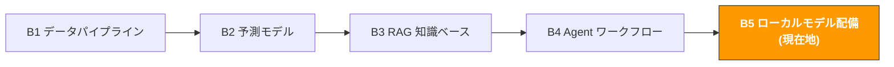

# B5. ローカルモデルの配備とファインチューニング

> **トラック**: Path B: 技術 · **モジュール**: B5
> **最終更新**: 2026-07-31
> **難易度**: 上級
> **前提**: B1 データパイプラインの基礎(Python)、B3 の RAG 基本概念、B4 の Agent 基礎
> **所要時間**: 1 日 1 時間、3〜4 週間
---




---

## 章ナビゲーション

1. [ローカル配備の方法論](#1-ローカル配備の方法論) · 2. [ツール全景](#2-ツール全景) · 3. [コード実践](#3-コード実践) · 4. [ハードウェア購入ガイド](#4-ハードウェア購入ガイド) · 5. [よくある罠](#5-よくある罠) · 6. [上級テクニック](#6-上級テクニック) · 7. [学習リソース](#7-学習リソース)


## このモジュールで構築するもの

ローカル AI サービス 自分のマシンで LLM を実行し、商業データのプライバシーを保護;LoRA でモデルをファインチューニングし EC シーンに適合させる。

修了後には:
- なぜ LLM をローカル配備するか、いつローカル vs クラウドを選ぶかを理解できる
- Ollama で 1 行のコマンドで Qwen3、Gemma 3、DeepSeek R1 などのオープンウェイトモデルをローカル実行できる
- タスクのニーズに応じて適切なモデルを選べる(中国語能力、コード能力、推論能力)
- Python でローカルの Ollama モデルを呼び、既存のワークフローに統合できる
- 完全ローカルの RAG システムを構築できる(データが本機を出ない)
- LoRA/QLoRA でモデルをファインチューニングし、汎用モデルを EC 専門家に変えられる
- vLLM で高性能な推論サービスを配備できる(並行リクエストに対応)
- 量子化技術(GGUF/GPTQ/AWQ)を理解し、限られたハードウェアでより大きなモデルを実行できる
- 予算に応じて適切なハードウェアを選べる(Mac M シリーズ / NVIDIA GPU / クラウド GPU)

---

## 1. ローカル配備の方法論

> **関連**: [B3 RAG 知識ベースシステム](b3-rag-knowledge-base.md) RAG システムはモデルファインチューニングの軽量な代替案になりうる、B3 参照 · [F1 AI の過去と現在](../0-foundations/f1-ai-evolution.md) AI モデルの進化は F1 へ。

### 1.1 なぜ LLM をローカルで実行するか

EC データは大量の商業機密を含む: 製品コスト、サプライヤー情報、販売データ、利益率、顧客情報。これらのデータを OpenAI/Claude のサーバーに送ると、データ漏洩のリスクがある。

ローカル配備の核心的な価値:

| 価値 | 説明 |
|------|------|
| データプライバシー | すべてのデータを本機で処理、いかなる第三者サーバーも経由しない |
| ゼロ API コスト | token 課金でなく、何回実行しても無料(電気代のみ) |
| オフライン利用可 | ネットに依存せず、飛行機内や VPN が切れても使える |
| 低遅延 | ローカル推論はネット遅延なし、リアルタイムアプリに向く |
| 完全な制御 | モデルバージョン、パラメータ、挙動を完全に自分で制御、プロバイダに突然更新されない |
| コンプライアンスフレンドリー | データローカライゼーション要件を満たす、コンプライアンス制約のある企業に向く |

**1 つの実際のシーン**: AI で 1000 件の顧客 Review を分析し、製品改善の方向を抽出する必要がある。
- OpenAI API を使う: 1000 件 × 平均 200 tokens = 200k tokens、コスト約 $0.03(安い)、だがデータが OpenAI サーバーに送られた
- ローカル Ollama を使う: ゼロコスト、データが本機を出ない、だがより長い推論時間を待つ必要

### 1.2 クラウド vs ローカル: 決定フレーム

すべてのシーンがローカル配備に向くわけではない。選択の鍵はデータプライバシー、コスト、品質、速度のトレードオフ。

```
あなたのシーンは何?
データが商業機密を含む(コスト、利益、サプライヤー) → ローカル配備
最高品質の推論が必要(複雑な分析、創造的な執筆) → クラウド API の T1 フロンティア級
高頻度の呼び出し(毎日 10000+ 回) → ローカル配備(コスト優位が明確)
たまに使う(毎日数十回) → クラウド API(運用コストを省く)
オフライン利用が必要 → ローカル配備
チームで複数人共有 → vLLM ローカルサービス か クラウド API
不確実 → まずクラウド API でニーズを検証、確認後にローカルへ移行
```

**詳細な比較:**

| 次元 | ローカル配備 | クラウド API |
|------|--------------|--------------|
| データプライバシー | データが本機を出ない | データが第三者サーバーに送られる |
| 推論品質 | 8B で実用、30B+ はクラウドの T2 主力級に近い | T1 フロンティア級が最高水準 |
| コスト(低頻度) | ハードウェア投入が高い、利用は無料 | token 課金、総コストが低い |
| コスト(高頻度) | ハードウェア一度の投入、長期無料 | コストが呼び出し量に応じて線形に増加 |
| 遅延 | ハードウェア次第(M4 Pro 約 40 tokens/s) | ネット遅延 + 推論遅延 |
| オフライン利用 | 完全オフライン | ネットが必要 |
| 運用コスト | モデル、更新、ハードウェアを自分で管理 | ゼロ運用 |
| 拡張性 | 本機ハードウェアに制限される | 無限に拡張 |

> **経験則**: データが機密でなく呼び出し量が少ないなら、クラウド API が最も楽。データが機密か呼び出し量が多い(月 API 費用 > $50)なら、真剣にローカル配備を検討。

### 1.3 ハードウェア要件早見表

ローカル LLM 実行の最低ハードウェア要件はモデルサイズによる:

| モデルサイズ | 最低メモリ/VRAM | 推奨ハードウェア | 推論速度の参考 |
|--------------|-----------------|------------------|----------------|
| 1-3B(小モデル) | 4GB RAM | あらゆる現代の PC | 50-80 tokens/s |
| 7-8B(主流) | 8GB RAM | Mac M1 8GB / RTX 3060 | 20-40 tokens/s |
| 13-14B | 16GB RAM | Mac M2 Pro 16GB / RTX 4070 | 15-25 tokens/s |
| 32-34B | 32GB RAM | Mac M3 Pro 36GB / RTX 4090 | 8-15 tokens/s |
| 70B(大モデル) | 48GB+ RAM | Mac M3 Max 64GB / 2×RTX 4090 | 5-10 tokens/s |

> **重要な概念**: モデルのパラメータ数(7B = 70 億パラメータなど)が必要なメモリを決める。量子化(Q4_K_M など)後、7B モデルは約 4-5GB のメモリを占める。第 7 節の量子化技術参照。

---

## 2. ツール全景

| ツール | 種類 | 難度 | 最適シーン | リンク |
|--------|------|------|------------|--------|
| [Ollama](https://ollama.com/) | ローカル LLM ランナー | 入門 | 1 行のコマンドでローカルモデルを実行、開発テスト | [ollama.com](https://ollama.com/) |
| [vLLM](https://github.com/vllm-project/vllm) | 高性能推論エンジン | 上級 | 本番環境、高並行、複数ユーザー共有 | [GitHub](https://github.com/vllm-project/vllm) |
| [llama.cpp](https://github.com/ggerganov/llama.cpp) | C++ 推論エンジン | 中級 | 極致の性能最適化、CPU 推論 | [GitHub](https://github.com/ggerganov/llama.cpp) |
| [PEFT/LoRA](https://huggingface.co/docs/peft) | パラメータ効率ファインチューニング | 中級 | 少量のデータでモデルをファインチューニング | [HuggingFace](https://huggingface.co/docs/peft) |
| [Unsloth](https://github.com/unslothai/unsloth) | 高速ファインチューニングフレームワーク | 中級 | 2 倍速のファインチューニング、VRAM 半減 | [GitHub](https://github.com/unslothai/unsloth) |
| [HuggingFace Hub](https://huggingface.co/) | モデルリポジトリ | 入門 | オープンソースモデルとデータセットをダウンロード | [huggingface.co](https://huggingface.co/) |
| [LM Studio](https://lmstudio.ai/) | デスクトップ LLM アプリ | 入門 | GUI でローカルモデルを実行 | [lmstudio.ai](https://lmstudio.ai/) |

**選択のアドバイス:**
- 個人開発、素早い実験 → Ollama(本モジュールのメインライン)
- 本番環境、複数人共有 → vLLM
- 極致の性能最適化、組み込み機器 → llama.cpp
- モデルのファインチューニング → Unsloth(速い)か PEFT(柔軟)
- コードを書きたくない、GUI 操作 → LM Studio
- モデルとデータセットのダウンロード → HuggingFace Hub

### 2.1 Ollama vs vLLM vs llama.cpp

| 次元 | Ollama | vLLM | llama.cpp |
|------|--------|------|-----------|
| 位置づけ | 開発者フレンドリーなローカル LLM ランナー | 高性能な本番級推論エンジン | 低レベルの C++ 推論ライブラリ |
| 使いやすさ | 極簡(1 行のコマンド) | 設定が必要 | コンパイルが必要 |
| 性能 | 良好(裏で llama.cpp を使用) | 最良(PagedAttention) | 優秀(手動最適化) |
| 並行対応 | 限定的(単ユーザー向け) | 優秀(本番級の並行) | 自分で実装が必要 |
| GPU 対応 | Metal (Mac) / CUDA | CUDA(主に) | Metal / CUDA / CPU |
| API 互換 | OpenAI 互換 API | OpenAI 互換 API | 追加のラッピングが必要 |
| モデル形式 | GGUF(自動ダウンロード) | HuggingFace ネイティブ | GGUF |
| 向くシーン | 開発テスト、個人利用 | チーム共有、本番配備 | 組み込み、極致最適化 |

**結論**: 入門は Ollama(最も簡単)、複数人にサービスするとき vLLM、極致の性能が必要なとき llama.cpp。本モジュールは Ollama をメインライン、vLLM を上級とする。

参考ドキュメント: [Ollama 公式ドキュメント](https://ollama.com/) | [vLLM 公式ドキュメント](https://docs.vllm.ai/) | [llama.cpp GitHub](https://github.com/ggerganov/llama.cpp)

### 2.2 HuggingFace: オープンソースモデルの GitHub

[HuggingFace](https://huggingface.co/) はオープンソース AI モデルの最大の集散地、コード領域の GitHub に類似。ほぼすべてのオープンソース LLM が HuggingFace で公開される。

**HuggingFace の核心機能:**
- **Models Hub**: オープンソースモデルをダウンロード(Qwen、Llama、Mistral など)
- **Datasets Hub**: 訓練データセットをダウンロード
- **Spaces**: モデルの Demo をオンラインで体験
- **Transformers ライブラリ**: Python でモデルをロード・使用する標準ライブラリ

**EC 開発者がよく使う操作:**

```bash
# HuggingFace ツールをインストール
pip install transformers huggingface_hub

# モデルをローカルにダウンロード
huggingface-cli download Qwen/Qwen3-8B --local-dir ./models/qwen3-8b

# モデルを検索
huggingface-cli search models --query "e-commerce chinese"
```

> **Ollama vs 直接 HuggingFace を使う**: Ollama はモデルダウンロード、量子化、実行のすべての細部を処理してくれ、1 行のコマンドで完了。直接 HuggingFace Transformers ライブラリを使うほうが柔軟だが、GPU メモリ、量子化、推論最適化を自分で管理する必要がある。入門は Ollama、精細な制御が必要なとき HuggingFace。

---

## 3. コード実践

### 3.1 Ollama クイックスタート: 1 行のコマンドでローカル LLM を実行

Ollama は現在最もシンプルなローカル LLM の実行方法。インストール後 1 行のコマンドで起動できる。

**Ollama をインストール:**

```bash
# macOS 公式サイトからインストーラをダウンロード
# https://ollama.com/download で macOS 版をダウンロード
# または Homebrew で:
brew install ollama

# Linux
curl -fsSL https://ollama.com/install.sh | sh

# Windows 公式サイトからインストーラをダウンロード
# https://ollama.com/download で Windows 版をダウンロード

# インストールを検証
ollama --version
```

**モデルをダウンロードして実行:**

```bash
# Qwen3 8B をダウンロードして実行(推奨: 中英どちらも良い)
ollama run qwen3:8b

# Gemma 3 12B をダウンロードして実行(Google オープンウェイト、画像入力にも対応)
ollama run gemma3:12b

# Mistral 7B をダウンロードして実行(欧州チーム、コード能力が強い)
ollama run mistral:7b

# ダウンロード済みモデルを確認
ollama list

# 不要なモデルを削除(ディスクスペースを解放)
ollama rm mistral:7b
```

`ollama run` 実行後、対話式のチャット画面に入り、直接モデルと会話できる:

```
>>> アクションカメラカテゴリの米国市場の競争構造を分析して
アクションカメラカテゴリの米国市場の競争構造は以下の次元から分析できます:

1. 市場構造: GoPro は依然として市場のリーダーだが、市場シェアが継続的に侵食されている...
2. 価格帯分布: $100-200 の入門級、$200-400 の中級、$400+ の高級...
3. 新規参入者: Insta360、DJI Action などのブランドが急成長...
...

>>> /bye # 会話を終了
```

> **Ollama の動作原理**: Ollama は裏で llama.cpp を使って推論し、あなたのハードウェア(Mac Metal GPU / NVIDIA CUDA)を自動検知して最適な推論方式を選ぶ。モデルファイルは `~/.ollama/models/` ディレクトリに保存される。

### 3.2 モデル選択ガイド: Qwen3 vs Gemma 3 vs DeepSeek R1

適切なモデルを選ぶことは適切なフレームワークを選ぶより重要。モデルごとに異なるタスクでの性能差が大きい。

**主流オープンソースモデルの比較:**

| モデル | パラメータ数 | 中国語能力 | 英語能力 | コード能力 | 推論能力 | 推奨シーン |
|--------|--------------|------------|----------|------------|----------|------------|
| Qwen3 | 0.6B-235B | 最良 | 優秀 | 優秀 | 優秀 | 中国語 EC シーンの第一選択、Apache 2.0 |
| Gemma 3 | 270M-27B | 良好 | 最良 | 優秀 | 優秀 | 英語主体、4B 以上は画像入力に対応 |
| Mistral | 7B-8x22B | 良好 | 優秀 | 最良 | 良好 | コード生成、技術文書 |
| Gemma 2 | 2B-27B | 良好 | 優秀 | 良好 | 良好 | 軽量、モバイル |
| Phi-3 | 3.8B-14B | 一般 | 優秀 | 優秀 | 優秀 | 小モデル高性能 |
| DeepSeek R1 | 1.5B-671B | 優秀 | 優秀 | 最良 | 優秀 | 推論チェーンが必要なタスク、MIT ライセンス |

**EC シーンの推奨:**

```
あなたの主要言語は何?
中国語主体(中国セラー、中国語 Review) → qwen3:8b
英語主体(米国市場、英語 Listing) → gemma3:12b
中英混合 → qwen3:8b(中英どちらも良い)
コード/データ分析を書く必要 → qwen2.5-coder:7b、GPU があれば Qwen3-Coder

あなたのハードウェア条件?
8GB RAM(Mac M1/M2 ベース版) → 7B モデル(qwen3:8b)
16GB RAM → 7B か 14B モデル
32GB+ RAM → 32B モデルを試せる
64GB+ RAM → 32B モデル(クラウドの T2 主力級に近い水準)
```

**Ollama モデルダウンロードコマンド:**

```bash
# EC 中国語シーンの第一選択
ollama pull qwen3:8b

# 英語シーン / Meta エコシステム
ollama pull gemma3:12b

# コード生成
ollama pull qwen2.5-coder:7b

# 軽量(ノート PC でも動く)
ollama pull qwen3:4b
ollama pull phi3:3.8b

# Embedding モデル(RAG 用)
ollama pull nomic-embed-text
ollama pull bge-large:latest
```

### 3.3 Ollama + Python: 既存のワークフローに統合

Ollama は OpenAI 互換の REST API を提供し、任意の HTTP クライアントで呼べる。公式の Python ライブラリもある。

**方式 1: ollama Python ライブラリを使う(最も簡単)**

```python
# pip install ollama

import ollama

def analyze_review(review_text: str, model: str = "qwen3:8b") -> str:
    """ローカル LLM で顧客 Review を分析し、製品改善の方向を抽出。"""
    response = ollama.chat(
        model=model,
        messages=[
            {
                "role": "system",
                "content": "あなたは EC 製品分析の専門家です。顧客 Review を分析し、抽出:\n"
                "1. 核心問題(一文)\n"
                "2. 問題カテゴリ(品質/機能/物流/価格/その他)\n"
                "3. 改善提案\n"
                "日本語で回答、簡潔明瞭に。",
            },
            {"role": "user", "content": f"この Review を分析してください:\n{review_text}"},
        ],
        options={"temperature": 0.1}, # 低温度、より決定論的な出力
    )
    return response["message"]["content"]

def batch_analyze_reviews(reviews: list[str], model: str = "qwen3:8b") -> list[dict]:
    """Review リストを一括分析。"""
    results = []
    for i, review in enumerate(reviews):
        print(f"Review {i+1}/{len(reviews)} を分析中...")
        analysis = analyze_review(review, model)
        results.append({"review": review, "analysis": analysis})
    return results

# 使用例
# reviews = [
# "1 週間で壊れた、レンズがぼやける、防水も効かない",
# "電池が 40 分しか持たず、宣伝の 2 時間を大きく下回る",
# "画質は良いが、アプリが使いにくく、よくクラッシュする",
# ]
# results = batch_analyze_reviews(reviews)
# for r in results:
# print(f"Review: {r['review'][:30]}...")
# print(f"分析: {r['analysis']}\n")
```

**方式 2: OpenAI 互換 API を使う(クラウド/ローカルのシームレスな切替)**

Ollama は OpenAI 互換の API インターフェースを提供し、`openai` Python ライブラリで直接ローカルモデルを呼べ、コードをほぼ変えなくてよい。

```python
# pip install openai
# 前提: Ollama が実行中(ollama serve)

from openai import OpenAI

# ローカル Ollama サービスを指す(OpenAI サーバーでなく)
client = OpenAI(
    base_url="http://localhost:11434/v1",
    api_key="ollama", # Ollama は本物の API key 不要
)

def generate_listing(product_info: str, model: str = "qwen3:8b") -> str:
    """ローカル LLM で製品 Listing を生成。"""
    response = client.chat.completions.create(
        model=model,
        messages=[
            {
                "role": "system",
                "content": "あなたは Amazon Listing 最適化の専門家です。製品情報から生成:\n"
                "1. タイトル(コアキーワードを含む、<200 文字)\n"
                "2. 5 個の Bullet Points\n"
                "3. 製品説明(<2000 文字)\n"
                "英語で出力、Amazon スタイルガイドに準拠。",
            },
            {"role": "user", "content": f"製品情報:\n{product_info}"},
        ],
        temperature=0.3,
    )
    return response.choices[0].message.content

# クラウド OpenAI への切替は 2 行変えるだけ:
# client = OpenAI(api_key="sk-...") # OpenAI API key に変更
# model = "gpt-5.6-luna" # OpenAI モデル名に変更
```

> **シームレスな切替の価値**: 開発段階はローカル Ollama(無料、データ安全)、リリース後は必要に応じて OpenAI に切替(品質がより高い)。コードは `base_url` と `model` の 2 パラメータを変えるだけ。

**方式 3: ストリーミング出力(Streaming)**

長文生成(レポート、Listing など)には、ストリーミング出力でユーザーがリアルタイムの生成過程を見られ、体験がより良い。

```python
import ollama

def stream_generate(prompt: str, model: str = "qwen3:8b"):
    """ストリーミングでテキストを生成、各 token をリアルタイム出力。"""
    stream = ollama.chat(
        model=model,
        messages=[{"role": "user", "content": prompt}],
        stream=True,
    )

    full_response = ""
    for chunk in stream:
        token = chunk["message"]["content"]
        print(token, end="", flush=True)
        full_response += token

    print() # 改行
    return full_response

# stream_generate("Insta360 X4 の米国市場での競争優位を 200 字で分析")
```

### 3.4 完全ローカル RAG 方案: Ollama + LlamaIndex + Chroma

B3 モジュールの RAG 知識と組み合わせ、完全ローカルの RAG システムを構築する。すべてのデータを本機で処理し、いかなる外部 API も呼ばない。

```python
# 完全ローカル RAG Ollama + LlamaIndex + Chroma
# pip install llama-index llama-index-llms-ollama llama-index-embeddings-ollama chromadb

import chromadb
from llama_index.core import (
    VectorStoreIndex, SimpleDirectoryReader,
    Settings, StorageContext,
)
from llama_index.llms.ollama import Ollama
from llama_index.embeddings.ollama import OllamaEmbedding
from llama_index.vector_stores.chroma import ChromaVectorStore

def build_local_rag(
    docs_dir: str,
    llm_model: str = "qwen3:8b",
    embed_model: str = "nomic-embed-text",
    collection_name: str = "local_knowledge",
    persist_dir: str = "chroma_db",
) -> VectorStoreIndex:
    """
    完全ローカルの RAG システムを構築する。

    前提:
    1. Ollama インストール済み・実行中(ollama serve)
    2. モデルダウンロード済み: ollama pull qwen3:8b
    3. Embedding ダウンロード済み: ollama pull nomic-embed-text

    すべてのデータを本機で処理、いかなる外部 API も呼ばない。
    """
    # ローカル LLM を設定
    Settings.llm = Ollama(
        model=llm_model,
        request_timeout=120.0,
        temperature=0.1,
    )

    # ローカル Embedding を設定
    Settings.embed_model = OllamaEmbedding(model_name=embed_model)

    # Chroma 永続化保存を設定
    chroma_client = chromadb.PersistentClient(path=persist_dir)
    chroma_collection = chroma_client.get_or_create_collection(collection_name)
    vector_store = ChromaVectorStore(chroma_collection=chroma_collection)
    storage_context = StorageContext.from_defaults(vector_store=vector_store)

    # 文書をロードしインデックスを構築
    documents = SimpleDirectoryReader(docs_dir, recursive=True).load_data()
    print(f"{len(documents)} 個の文書をロード")

    index = VectorStoreIndex.from_documents(
        documents, storage_context=storage_context, show_progress=True,
    )

    print(f"ローカル RAG 構築完了")
    print(f"LLM: {llm_model} | Embedding: {embed_model}")
    print(f"ベクトルDB: {persist_dir} ({chroma_collection.count()} 個のベクトル)")
    print(f"すべてのデータを本機で処理、外部サービスに送信していない")
    return index

def query_local_rag(index: VectorStoreIndex, question: str, top_k: int = 3) -> dict:
    """ローカル RAG システムを照会。"""
    query_engine = index.as_query_engine(similarity_top_k=top_k)
    response = query_engine.query(question)

    sources = []
    for node in response.source_nodes:
        sources.append({
            "file": node.metadata.get("file_name", "unknown"),
            "score": round(node.score, 4) if node.score else None,
            "preview": node.text[:200],
        })

    return {
        "question": question,
        "answer": str(response),
        "sources": sources,
    }

# 使用例
# index = build_local_rag("data/product_docs")
# result = query_local_rag(index, "この製品の保証期間はどれくらい?")
# print(f"Q: {result['question']}")
# print(f"A: {result['answer']}")
# for s in result['sources']:
# print(f"ソース: {s['file']} (類似度: {s['score']})")
```

**ローカル RAG アーキテクチャ図:**

```
ユーザーが質問
↓
[Ollama Embedding] → 質問をベクトル化(ローカル)
↓
[Chroma ベクトルDB] → 類似度検索(ローカルディスク)
↓
検索した文書段落 + ユーザーの質問
↓
[Ollama LLM] → 回答を生成(ローカル)
↓
回答 + 引用元
```

> **コスト比較**: 100 文書を処理する RAG システムで、OpenAI API はインデックス再構築ごとに約 $0.05、クエリごとに約 $0.002。ローカル Ollama はコスト $0(電気代のみ)。毎日 100 回クエリするなら月 $6 節約;毎日 1000 回なら月 $60 節約。

### 3.5 LoRA ファインチューニング入門: 汎用モデルを EC 専門家に変える

汎用 LLM は EC 用語(ASIN、FBA、ACoS、BSR)の理解が限定的。LoRA ファインチューニングで、少量の EC データでモデルを「EC 専門家」に変えられる。

**LoRA とは?**

LoRA(Low-Rank Adaptation)はパラメータ効率のファインチューニング技術。核心の考え: 元のモデルの全パラメータ(70 億個)を変えず、一小組の「アダプター」パラメータ(数百万個)だけを訓練し、モデルに新しい知識を学ばせる。

```
従来のファインチューニング: 全 70 億パラメータを変更 → 大量の GPU VRAM と時間が必要
LoRA ファインチューニング: 元パラメータを凍結、~1% のアダプターパラメータだけ訓練 → 消費者級 GPU 1 枚で十分
```

**LoRA の利点:**

| 次元 | 従来の全量ファインチューニング | LoRA ファインチューニング |
|------|--------------------------------|----------------------------|
| VRAM 需要 | 7B モデルは ~56GB | 7B モデルは ~16GB |
| 訓練時間 | 数時間から数日 | 数十分から数時間 |
| 訓練データ量 | 大量のデータが必要 | 数百から数千件でよい |
| 元モデル | 変更される、回復不可 | 不変、アダプターは着脱可能 |
| マルチタスク | タスクごとに完全なモデル 1 つ | タスクごとに小さなアダプターファイル 1 つ |

**ファインチューニングデータを準備(EC シーン):**

```python
# ファインチューニングデータ形式: instruction + input + output
# JSONL ファイルとして保存

training_data = [
    {
        "instruction": "この Amazon Review を分析し、製品問題と改善提案を抽出。",
        "input": "2 週間で壊れた、レンズがぼやける、防水も効かない。CS の態度はまあまあだが問題を解決できない。",
        "output": "**製品問題**:\n1. 耐久性が悪い(2 週間で損壊)\n2. レンズ品質の問題(ぼやける)\n"
        "3. 防水性能が基準未達\n\n**改善提案**:\n1. 品質検査を強化、レンズと防水シールを重点検査\n"
        "2. 保証期間を延長し顧客の信頼を高める\n3. Listing で防水等級を正確に記述、過度な宣伝を回避",
    },
    {
        "instruction": "製品情報から Amazon Listing の 5 個の Bullet Points を生成。",
        "input": "製品: アクションカメラ X1、4K60fps、防水 10m、電池 2 時間、重量 120g、"
        "音声制御対応、付属品豊富",
        "output": "[4K Ultra HD] Capture stunning 4K video at 60fps...\n"
        "[Waterproof to 33ft] Built-in waterproof design...\n"
        "[2-Hour Battery Life] Extended battery for all-day...\n"
        "[Voice Control] Hands-free operation with voice...\n"
        "[Complete Accessory Kit] Includes mounting brackets...",
    },
    # ... 200-500 件の類似データを準備
]

import json
with open("train_data.jsonl", "w", encoding="utf-8") as f:
    for item in training_data:
        f.write(json.dumps(item, ensure_ascii=False) + "\n")
```

**Unsloth で LoRA ファインチューニング(推奨、2 倍速い):**

```python
# Unsloth LoRA ファインチューニング Google Colab 無料版でも実行可能
# pip install unsloth

from unsloth import FastLanguageModel
from trl import SFTTrainer
from transformers import TrainingArguments
from datasets import load_dataset

# 1. ベースモデルをロード(4-bit 量子化を自動適用、VRAM 節約)
model, tokenizer = FastLanguageModel.from_pretrained(
    model_name="unsloth/Qwen3-8B-bnb-4bit",
    max_seq_length=2048,
    load_in_4bit=True, # 4-bit 量子化、7B モデルは ~5GB VRAM だけ
)

# 2. LoRA アダプターを追加
model = FastLanguageModel.get_peft_model(
    model,
    r=16, # LoRA ランク(大きいほど強いが遅い、8-32 推奨)
    target_modules=["q_proj", "k_proj", "v_proj", "o_proj",
                    "gate_proj", "up_proj", "down_proj"],
    lora_alpha=16, # スケーリング係数(通常 r と等しい)
    lora_dropout=0, # Dropout(Unsloth 最適化後は 0 に設定)
    bias="none",
    use_gradient_checkpointing="unsloth", # さらに VRAM 節約
)

# 3. 訓練データを準備
# データ形式: 各データは完全な対話
def format_prompt(example):
    return {
        "text": f"""<|im_start|>system
あなたは EC 運営 AI アシスタントで、Amazon 運営、Listing 最適化、Review 分析に精通。<|im_end|>
<|im_start|>user
{example['instruction']}
{example['input']}<|im_end|>
<|im_start|>assistant
{example['output']}<|im_end|>"""
    }

dataset = load_dataset("json", data_files="train_data.jsonl", split="train")
dataset = dataset.map(format_prompt)

# 4. 訓練パラメータを設定
trainer = SFTTrainer(
    model=model,
    tokenizer=tokenizer,
    train_dataset=dataset,
    dataset_text_field="text",
    max_seq_length=2048,
    args=TrainingArguments(
        per_device_train_batch_size=2,
        gradient_accumulation_steps=4, # 実効 batch_size = 8
        warmup_steps=5,
        max_steps=60, # 小データセットは 60 ステップで十分(約 500 件)
        learning_rate=2e-4,
        fp16=True, # 混合精度訓練
        logging_steps=10,
        output_dir="outputs",
        optim="adamw_8bit", # 8-bit オプティマイザ、VRAM 節約
    ),
)

# 5. 訓練を開始
trainer_stats = trainer.train()
print(f"訓練完了! 所要時間: {trainer_stats.metrics['train_runtime']:.0f} 秒")

# 6. LoRA アダプターを保存(数十 MB だけ、完全モデルでない)
model.save_pretrained("lora_ecommerce")
tokenizer.save_pretrained("lora_ecommerce")
print("LoRA アダプターを lora_ecommerce/ に保存")

# 7. GGUF 形式にエクスポート(Ollama で使える)
model.save_pretrained_gguf(
    "model_gguf",
    tokenizer,
    quantization_method="q4_k_m", # 4-bit 量子化
)
print("GGUF モデルをエクスポート、Ollama でロード可能")
```

**ファインチューニング後に Ollama で使用:**

```bash
# Modelfile を作成
cat > Modelfile << 'EOF'
FROM ./model_gguf/unsloth.Q4_K_M.gguf
TEMPLATE """<|im_start|>system
{{ .System }}<|im_end|>
<|im_start|>user
{{ .Prompt }}<|im_end|>
<|im_start|>assistant
"""
SYSTEM "あなたは EC 運営 AI アシスタントで、Amazon 運営、Listing 最適化、Review 分析に精通。"
PARAMETER temperature 0.1
PARAMETER top_p 0.9
EOF

# Ollama モデルを作成
ollama create ecommerce-expert -f Modelfile

# ファインチューニング後のモデルを実行
ollama run ecommerce-expert
```

> **ファインチューニングのデータ量ガイド**:
> - 50-100 件: モデルが出力形式を学ぶが、知識は限定的
> - 200-500 件: モデルが領域用語と基本タスクを習得
> - 1000+ 件: モデルが領域専門家になり、回答品質が人手に近い
> - データの質は量より重要 100 件の高品質データ > 1000 件の低品質データ

### 3.6 vLLM 高性能配備: チーム共有のローカル LLM サービス

Ollama は個人利用に向くが、チームの複数人が 1 つのローカル LLM サービスを共有する必要があるなら、vLLM のほうが良い選択。vLLM は PagedAttention 技術を使い、推論スループットが Ollama より 2-4 倍高い。

**vLLM をインストール:**

```bash
# NVIDIA GPU が必要(CUDA 12.1+)
pip install vllm

# または Docker で(推奨、環境問題を回避)
docker run --runtime nvidia --gpus all \
-v ~/.cache/huggingface:/root/.cache/huggingface \
-p 8000:8000 \
vllm/vllm-openai:latest \
--model Qwen/Qwen3-8B \
--max-model-len 4096
```

**vLLM サービスを起動:**

```bash
# 方式 1: コマンドラインで起動(OpenAI 互換 API)
python -m vllm.entrypoints.openai.api_server \
--model Qwen/Qwen3-8B \
--host 0.0.0.0 \
--port 8000 \
--max-model-len 4096 \
--gpu-memory-utilization 0.9

# サービス起動後、OpenAI クライアントで呼ぶ:
# curl http://localhost:8000/v1/chat/completions \
# -H "Content-Type: application/json" \
# -d '{"model": "Qwen/Qwen3-8B", "messages": [...]}'
```

**Python で vLLM サービスを呼ぶ:**

```python
from openai import OpenAI

# vLLM は OpenAI 互換 API を提供、コードは OpenAI 呼び出しと全く同じ
client = OpenAI(base_url="http://localhost:8000/v1", api_key="not-needed")

response = client.chat.completions.create(
model="Qwen/Qwen3-8B",
messages=[
{"role": "system", "content": "あなたは EC データ分析の専門家です。"},
{"role": "user", "content": "今月の販売が 15% 下がった考えられる原因を分析"},
],
temperature=0.1,
max_tokens=1024,
)
print(response.choices[0].message.content)
```

**Ollama vs vLLM 性能比較:**

| 次元 | Ollama | vLLM |
|------|--------|------|
| 単一リクエスト遅延 | 速い(最適化良好) | 速い |
| 並行スループット | 一般(単一リクエスト最適化) | 優秀(PagedAttention) |
| 10 並行リクエスト | ~5 tokens/s/リクエスト | ~15 tokens/s/リクエスト |
| GPU 利用率 | 60-70% | 85-95% |
| 向くシーン | 個人開発、単ユーザー | チーム共有、API サービス |
| インストール難度 | 極簡 | CUDA 環境が必要 |

> **いつ Ollama から vLLM に昇格するか**: ローカル LLM サービスが同時に 3+ ユーザーにサービスする必要があるか、バッチリクエスト(1000 件の Review を一括分析など)を処理する必要があるとき、vLLM のスループット優位が明確になる。

---

## 4. ハードウェア購入ガイド

### 4.1 Mac M シリーズ(入門におすすめ)

Apple Silicon Mac は現在最もコスパの高いローカル LLM 開発プラットフォーム。統一メモリアーキテクチャで CPU と GPU がメモリを共有し、独立したグラボが不要。

| 機種 | 統一メモリ | 実行可能モデル | 推論速度の参考 | 向くシーン |
|------|------------|----------------|----------------|------------|
| MacBook Air M1 8GB | 8GB | 7B (Q4) | ~15 tokens/s | 入門学習 |
| MacBook Pro M2 16GB | 16GB | 7B-14B | ~25 tokens/s | 日常開発 |
| MacBook Pro M3 Pro 18GB | 18GB | 7B-14B | ~30 tokens/s | 日常開発 |
| MacBook Pro M3 Pro 36GB | 36GB | 7B-32B | ~20 tokens/s (32B) | 上級開発 |
| MacBook Pro M3 Max 64GB | 64GB | 7B-70B | ~10 tokens/s (70B) | プロ級 |
| Mac Studio M2 Ultra 192GB | 192GB | 70B+ (フル精度) | ~15 tokens/s (70B) | チームサービス |

**Mac ユーザーのベストプラクティス:**

```bash
# Mac のメモリを確認
sysctl -n hw.memsize | awk '{print $1/1024/1024/1024 " GB"}'

# メモリに応じてモデルを選択
# 8GB → ollama run qwen3:4b か phi3:3.8b
# 16GB → ollama run qwen3:8b(推奨)
# 32GB → ollama run qwen3:14b か qwen3:32b (Q4)
# 64GB → ollama run qwen3:32b (Q4)

# 推論時のメモリと GPU 使用を監視
# Activity Monitor → GPU History を開く
```

> **購入アドバイス**: 主に AI 開発をするなら、メモリの大きい構成を優先。MacBook Pro M3 Pro 36GB がコスパのスイートスポット 32B モデルを動かせ、日常開発に十分すぎる。

### 4.2 NVIDIA GPU(本番環境におすすめ)

モデルのファインチューニングや高並行サービスの配備が必要なら、NVIDIA GPU が標準の選択。

| GPU | VRAM | 実行可能モデル | ファインチューニング能力 | 価格の参考 |
|-----|------|----------------|--------------------------|------------|
| RTX 3060 12GB | 12GB | 7B (Q4/Q8) | 7B LoRA (QLoRA) | ~$250 |
| RTX 4060 Ti 16GB | 16GB | 7B-14B | 7B LoRA | ~$400 |
| RTX 4070 Ti Super 16GB | 16GB | 7B-14B | 7B LoRA | ~$800 |
| RTX 4090 24GB | 24GB | 7B-32B | 7B-14B LoRA | ~$1,600 |
| A100 40GB | 40GB | 7B-70B (Q4) | 7B-14B 全量 | ~$10,000 |
| A100 80GB | 80GB | 70B+ | 70B LoRA | ~$15,000 |
| H100 80GB | 80GB | 70B+ | 70B 全量 | ~$30,000 |

**VRAM 需要の見積もり式:**

```
推論 VRAM ≈ モデルパラメータ数(B) × 量子化ビット数 / 8 + 2GB オーバーヘッド
ファインチューニング VRAM ≈ 推論 VRAM × 1.5(LoRA)か × 4(全量ファインチューニング)

例:
- Qwen3-8B Q4 推論: 7 × 4 / 8 + 2 = 5.5GB → RTX 3060 で十分
- Qwen3-8B Q4 LoRA ファインチューニング: 5.5 × 1.5 = 8.25GB → RTX 3060 ぎりぎり
- Qwen3-8B FP16 全量ファインチューニング: 7 × 16 / 8 × 4 = 56GB → A100 が必要
```

### 4.3 クラウド GPU(オンデマンド、ハードウェア購入不要)

ハードウェアを買いたくない?クラウド GPU は時間課金、使い終わったら離脱。

| プラットフォーム | GPU 選択肢 | 価格の参考 | 向くシーン |
|------------------|------------|------------|------------|
| Google Colab | T4(無料) / A100(Pro) | 無料 / $10/月 | 学習、小規模ファインチューニング |
| Lambda Cloud | A100 / H100 | $1.10-$2.49/時 | ファインチューニング、バッチ推論 |
| RunPod | A100 / H100 | $1.04-$2.39/時 | 柔軟なオンデマンド |
| Vast.ai | 各種 GPU | $0.20-$1.50/時 | 最も安い、コミュニティ GPU |
| AWS SageMaker | 各種 GPU | $1.21-$32.77/時 | 企業級、AWS エコシステム統合 |

**推奨戦略:**
- 学習と実験 → Google Colab 無料版(T4 GPU、7B モデルのファインチューニングに十分)
- 正式なファインチューニング → Lambda Cloud か RunPod(A100、時間課金)
- 本番配備 → AWS SageMaker か自作サーバー

> **コスト計算の例**: Colab Pro($10/月)で 7B モデルをファインチューニング、A100 GPU で約 30 分。毎月 2 回ファインチューニングするなら、コスト約 $10/月。RTX 4090($1,600)を買うと、元を取るのに 160 か月かかる。だからファインチューニングの頻度が高くないなら、クラウド GPU のほうがお得。

---

## 5. よくある罠

### 5.1 モデルの選択ミスで効果が悪い

**症状**: ローカルモデルの回答品質が予想をはるかに下回る、中国語回答が不自然、または EC 用語を全く理解しない。

**原因**: 不適切なモデルを選んだ。英語最適化の Llama で中国語タスクを処理、または 3B 小モデルで複雑な分析。

**解決策**:

| タスク | 誤った選択 | 正しい選択 |
|--------|------------|------------|
| 中国語 Review 分析 | gemma3:12b(中国語が弱い) | qwen3:8b(中国語が強い) |
| 複雑なデータ分析 | phi3:3.8b(小さすぎ) | qwen3:14b かそれ以上 |
| コード生成 | mistral:7b(コードが一般的) | qwen2.5-coder:7b |
| 簡単な分類タスク | qwen3:32b(鶏を割くに牛刀) | qwen3:4b(十分で速い) |

**経験則**: まず小モデル(3B-7B)でテスト、効果が足りなければ大モデルに換える。いきなり最大のモデルを使わない 大モデルは遅くリソースを食う。

### 5.2 メモリ不足でクラッシュ

**症状**: モデル実行時にシステムがフリーズ、Ollama が "out of memory" エラー、Mac が激しく swap を使い始める。

**解決策**:

```bash
# 1. 現在のメモリ使用を確認
ollama ps # 実行中のモデルとそのメモリ占有を確認

# 2. 不要なモデルを停止
ollama stop qwen3:14b

# 3. より小さい量子化版を使う
ollama run qwen3:8b # Q4 量子化、デフォルトよりメモリ節約

# 4. Ollama が使うメモリを制限(Mac)
# ~/.ollama/config で設定:
# OLLAMA_MAX_LOADED_MODELS=1
# OLLAMA_NUM_PARALLEL=1
```

> **Mac ユーザー注意**: 統一メモリが足りないとき、macOS は SSD swap を使い、推論速度が 10 倍以上急落し、長期の大量 swap は SSD 寿命を損耗する。モデルサイズが利用可能メモリの 80% を超えないように。

### 5.3 ファインチューニングの過学習

**症状**: ファインチューニング後のモデルが訓練データではよく機能するが、新しい問題に「でたらめを言う」、またはすべての回答が訓練データを暗唱しているよう。

**原因**: 訓練データが少なすぎ、訓練ステップが多すぎ、学習率が高すぎ。

**解決策**:

| 戦略 | やり方 |
|------|--------|
| データの多様性を増やす | 訓練データが多様なシーンをカバーするように、1 種類だけにしない |
| 訓練ステップを減らす | 30 ステップから始め、徐々に増やし、検証セットの loss を観察 |
| 学習率を下げる | 2e-4 から 1e-4 か 5e-5 に下げる |
| 検証セットを使う | データの 10-20% を検証用に残し、検証 loss を監視 |
| 早期停止 | 検証 loss が下がらなくなったら訓練を停止 |

### 5.4 Ollama サービス未起動

**症状**: Python コードが "Connection refused" か "Cannot connect to Ollama" エラー。

**解決策**:

```bash
# Ollama が実行中か確認
ollama ps

# 実行していなければ、サービスを起動
ollama serve

# macOS: Ollama は通常バックグラウンドサービスとして自動実行
# なければ、Ollama アプリを開く(Applications 内)

# サービスが正常か検証
curl http://localhost:11434/api/tags
```

### 5.5 量子化の精度損失

**症状**: 量子化後のモデルの回答品質が明らかに下がり、論理エラーや不自然な文が出る。

**異なる量子化レベルの品質への影響:**

| 量子化レベル | モデルサイズ(7B) | 品質損失 | 推奨シーン |
|--------------|-------------------|----------|------------|
| FP16(量子化なし) | ~14GB | なし | 十分な VRAM があるとき |
| Q8_0 | ~7.5GB | 極小(<1%) | 品質優先 |
| Q6_K | ~5.5GB | 非常に小さい(1-2%) | バランスの選択 |
| Q5_K_M | ~5.0GB | 小さい(2-3%) | 推奨デフォルト |
| Q4_K_M | ~4.4GB | 許容(3-5%) | メモリが限られるとき |
| Q4_0 | ~3.8GB | 明確(5-10%) | 極端なメモリ制約 |
| Q2_K | ~2.8GB | 大きい(10-20%) | 非推奨 |

> **推奨**: Q4_K_M が最もコスパの高い量子化レベル モデルサイズが半減、品質損失は 5% 以内、大半のタスクで差を感じない。Ollama のデフォルトが Q4_K_M。

---

## 6. 上級テクニック

### 6.1 量子化技術の詳解: GGUF / GPTQ / AWQ

量子化は限られたハードウェアで大モデルを実行する鍵の技術。核心の考え: より少ないビット数でモデルパラメータを表現し、わずかな精度を犠牲にメモリ占有を大幅削減。

**3 つの主流量子化形式:**

| 形式 | 正式名称 | 適用シーン | ツール対応 |
|------|----------|------------|------------|
| GGUF | GPT-Generated Unified Format | CPU/Mac Metal 推論 | Ollama, llama.cpp, LM Studio |
| GPTQ | GPT Quantization | NVIDIA GPU 推論 | vLLM, HuggingFace, AutoGPTQ |
| AWQ | Activation-aware Weight Quantization | NVIDIA GPU 推論 | vLLM, HuggingFace |

**どう選ぶか:**

```
どのハードウェアを使う?
Mac(Apple Silicon) → GGUF(Ollama のデフォルト形式)
NVIDIA GPU → GPTQ か AWQ
推論速度を追求 → AWQ(やや速い)
互換性を追求 → GPTQ(対応が広い)
CPU only → GGUF(llama.cpp 最適化)
```

**手動で GGUF モデルをダウンロードして Ollama で使用:**

```bash
# 1. HuggingFace から GGUF ファイルをダウンロード
# 検索: https://huggingface.co/models?search=gguf
# 例えば Qwen3-8B の Q4_K_M 量子化版をダウンロード

# 2. Modelfile を作成
cat > Modelfile << 'EOF'
FROM ./qwen3-8b-q4_k_m.gguf
TEMPLATE """<|im_start|>system
{{ .System }}<|im_end|>
<|im_start|>user
{{ .Prompt }}<|im_end|>
<|im_start|>assistant
"""
PARAMETER temperature 0.1
PARAMETER top_p 0.9
PARAMETER num_ctx 4096
EOF

# 3. Ollama モデルを作成
ollama create my-qwen -f Modelfile

# 4. 実行
ollama run my-qwen
```

### 6.2 モデルマージ(Model Merging)

モデルマージは訓練なしで複数モデルの優位を「組み合わせる」技術。例えば中国語が強いモデルとコードが強いモデルをマージし、中国語もコードも強いモデルを得る。

**よくあるマージ方法:**

| 方法 | 原理 | 向くシーン |
|------|------|------------|
| SLERP | 球面線形補間、2 つのモデルを滑らかに混合 | 2 つの類似モデルをマージ |
| TIES | 冗長パラメータを除去後にマージ | 複数のファインチューニングモデルをマージ |
| DARE | 一部のパラメータをランダムに捨ててからマージ | 差異の大きいモデルをマージ |
| Task Arithmetic | タスクベクトルを抽出後に加減算 | 特定の能力を追加/除去 |

**mergekit でモデルをマージ:**

```bash
# pip install mergekit

# マージ設定ファイル merge_config.yml を作成
cat > merge_config.yml << 'EOF'
slices:
- sources:
- model: Qwen/Qwen3-8B
layer_range: [0, 28]
- model: your-ecommerce-lora-model
layer_range: [0, 28]
merge_method: slerp
base_model: Qwen/Qwen3-8B
parameters:
t:
- filter: self_attn
value: [0, 0.5, 0.3, 0.7, 1]
- filter: mlp
value: [1, 0.5, 0.7, 0.3, 0]
- value: 0.5
dtype: bfloat16
EOF

# マージを実行
mergekit-yaml merge_config.yml ./merged_model --cuda
```

> **モデルマージの実際の価値**: Review 分析が得意なモデルと Listing 生成が得意なモデルをファインチューニングした。マージすることで両方が得意なモデルを得られ、データを再収集して訓練する必要がない。これは EC シーンで非常に実用的 異なるタスクのファインチューニングモデルを「合体」できる。

### 6.3 Ollama カスタムモデル(Modelfile)

Ollama の Modelfile は Dockerfile に類似、モデルの挙動をカスタマイズできる: システムプロンプト、パラメータ、テンプレート形式。

```bash
# EC 専用モデル設定を作成
cat > Modelfile.ecommerce << 'EOF'
# Qwen3 8B ベース
FROM qwen3:8b

# システムプロンプトを設定
SYSTEM """あなたはプロフェッショナルな越境EC AI アシスタントです。以下に精通:
- Amazon/Shopify/TikTok Shop プラットフォーム運営
- 製品 Listing 最適化と SEO
- 顧客 Review 分析と製品改善
- 在庫管理とサプライチェーン最適化
- 広告投下と ROI 分析

回答の要求:
1. データと事実に基づき、根拠のない推測をしない
2. 具体的で実行可能な提案を出し、空言を言わない
3. データが絡むときはソースと計算方法を注記
4. 中英どちらでも可、ユーザーの言語に応じて回答"""

# パラメータを調整
PARAMETER temperature 0.1
PARAMETER top_p 0.9
PARAMETER num_ctx 4096
PARAMETER repeat_penalty 1.1
EOF

# モデルを作成
ollama create ecommerce-assistant -f Modelfile.ecommerce

# 使用
ollama run ecommerce-assistant "ACoS が 18% から 25% に上がった考えられる原因を分析"
```

### 6.4 バッチ推論の最適化

大量のデータ(1000 件の Review など)を処理するとき、逐条で LLM を呼ぶのは効率が悪い。以下は最適化戦略:

```python
import ollama
import json
from concurrent.futures import ThreadPoolExecutor

def batch_analyze(
    items: list[str],
    system_prompt: str,
    model: str = "qwen3:8b",
    max_workers: int = 2,
) -> list[dict]:
    """
    ローカル LLM をバッチ呼び出しで分析。

    最適化戦略:
    1. 短文を統合: 複数の短い Review を 1 つのリクエストに統合
    2. 並行リクエスト: Ollama は限定的な並行に対応
    3. 構造化出力: JSON 形式を要求、後続処理を容易に
    """

    def analyze_single(item: str) -> dict:
        try:
            response = ollama.chat(
                model=model,
                messages=[
                    {"role": "system", "content": system_prompt},
                    {"role": "user", "content": item},
                ],
                options={"temperature": 0.1},
                format="json", # JSON 出力を要求
            )
            return {"input": item, "output": json.loads(response["message"]["content"])}
        except Exception as e:
            return {"input": item, "error": str(e)}

    # 並行処理(Ollama はデフォルトで 1 並行リクエスト対応、設定で調整可)
    results = []
    with ThreadPoolExecutor(max_workers=max_workers) as executor:
        futures = [executor.submit(analyze_single, item) for item in items]
        for i, future in enumerate(futures):
            results.append(future.result())
            if (i + 1) % 10 == 0:
                print(f"進捗: {i+1}/{len(items)}")

    return results

# 使用例
# reviews = ["Review 1...", "Review 2...", ...] # 1000 件の Review
# results = batch_analyze(
# reviews,
# system_prompt="Review を分析、JSON を返す: {category, sentiment, key_issue}",
# )
```

**バッチ処理の性能参考(Mac M3 Pro 36GB, qwen3:8b):**

| データ量 | 1 件あたり平均所要 | 総所要 |
|----------|--------------------|--------|
| 100 件の Review | ~3 秒 | ~5 分 |
| 500 件の Review | ~3 秒 | ~25 分 |
| 1000 件の Review | ~3 秒 | ~50 分 |

> **最適化のコツ**: Review が短い(<50 字)なら、5-10 件を 1 つのリクエストに統合し、LLM に一度に複数分析させると、効率が 3-5 倍向上する。

---

## 7. 学習リソース

| リソース | 種類 | 説明 | リンク |
|----------|------|------|--------|
| Ollama 公式ドキュメント | ドキュメント | 無料、5 分でローカル LLM を配備 | [ollama.com](https://ollama.com/) |
| DeepLearning.AI: Finetuning LLMs | 無料短期講座 | Andrew Ng チーム制作、LoRA ファインチューニング入門 | [deeplearning.ai](https://www.deeplearning.ai/short-courses/finetuning-large-language-models/) |
| Coursera: Generative AI for Everyone | 無料聴講 | Andrew Ng 講義、AI 全景概観 | [coursera.org](https://www.coursera.org/learn/generative-ai-for-everyone) |
| HuggingFace PEFT ドキュメント | ドキュメント | LoRA/QLoRA 公式リファレンス | [huggingface.co/docs/peft](https://huggingface.co/docs/peft) |
| Unsloth GitHub | ドキュメント+チュートリアル | 2x 高速ファインチューニング、Colab 例が豊富 | [github.com/unslothai/unsloth](https://github.com/unslothai/unsloth) |
| vLLM 公式ドキュメント | ドキュメント | 高性能推論エンジン | [github.com/vllm-project/vllm](https://github.com/vllm-project/vllm) |
| llama.cpp GitHub | ドキュメント | C++ 推論エンジン、GGUF 形式 | [github.com/ggerganov/llama.cpp](https://github.com/ggerganov/llama.cpp) |
| HuggingFace NLP Course | 無料講座 | Transformers ライブラリの体系的チュートリアル | [huggingface.co/learn](https://huggingface.co/learn) |

**推奨の学習順序:**
1. Ollama をインストール、3.1 節のクイックスタートを通す(30 分)
2. DeepLearning.AI の Finetuning 短期講座を見る(2 時間、ファインチューニング概念を確立)
3. 3.3 節に沿って Python で Ollama を呼ぶ(1 時間)
4. ローカル RAG を構築(3.4 節、B3 モジュールの知識と組み合わせ)
5. LoRA ファインチューニングを試す(3.5 節、GPU か Colab が必要)
6. Coursera の Generative AI for Everyone を見て理論基礎を補完

## 9. 完了チェック

- [ ] ローカルに Ollama をインストールし LLM を成功して実行(3.1)
- [ ] Qwen3 / Gemma 3 / DeepSeek R1 それぞれの優位と適用シーンを言える(3.2)
- [ ] Python でローカル Ollama を呼び EC タスク(Review 分析など)を完了(3.3)
- [ ] 完全ローカルの RAG システムを構築(Ollama + Chroma)(3.4)
- [ ] LoRA ファインチューニングの原理を理解、ファインチューニングデータセットを準備できる(3.5)
- [ ] GGUF/GPTQ/AWQ 量子化形式の違いと選択を理解(6.1)
- [ ] 自分のハードウェア条件に応じて適切なモデルと量子化レベルを選択(4 + 5.5)

---

## 10. 付録

### 9.1 オープンソースモデル比較表

| モデル | 公開者 | パラメータ数選択肢 | ライセンス | 中国語 | 英語 | コード | Ollama コマンド |
|--------|--------|--------------------|------------|--------|------|--------|-----------------|
| Qwen3 | Alibaba Cloud | 0.6B/1.7B/4B/8B/14B/30B/32B/235B | Apache 2.0 | ✓ | ✓ | ✓ | `ollama run qwen3:8b` |
| Gemma 3 | Google | 270M/1B/4B/12B/27B | Gemma License | ✓ | ✓ | ✓ | `ollama run gemma3:12b` |
| Mistral | Mistral AI | 7B/8x7B/8x22B | Apache 2.0 | ✓ | ✓ | ✓ | `ollama run mistral:7b` |
| Gemma 2 | Google | 2B/9B/27B | Gemma License | ✓ | ✓ | ✓ | `ollama run gemma2:9b` |
| Phi-3 | Microsoft | 3.8B/7B/14B | MIT | ✓ | ✓ | ✓ | `ollama run phi3:3.8b` |
| DeepSeek R1 | DeepSeek | 1.5B-671B | MIT | ✓ | ✓ | ✓ | `ollama run deepseek-r1` |
| Yi-1.5 | 01.AI | 6B/9B/34B | Apache 2.0 | ✓ | ✓ | ✓ | `ollama run yi:34b` |
| ChatGLM4 | Zhipu AI | 9B | GLM-4 License | ✓ | ✓ | ✓ | `ollama run glm4:9b` |

> モデル能力の評価は公開ベンチマークとコミュニティフィードバックに基づき、参考のみ。実際の性能はタスクによって異なる。
---
### 9.2 ハードウェア要件早見表

| タスク | 最低構成 | 推奨構成 | 予算の参考 |
|--------|----------|----------|------------|
| 7B モデル実行(推論) | 8GB RAM, 任意の CPU | Mac M2 16GB | $800-1,200 |
| 14B モデル実行(推論) | 16GB RAM | Mac M3 Pro 18GB | $1,600-2,000 |
| 70B モデル実行(推論) | 48GB RAM | Mac M3 Max 64GB | $3,000-4,000 |
| LoRA ファインチューニング 7B | 12GB VRAM (GPU) | RTX 4060 Ti 16GB | $400 |
| LoRA ファインチューニング 14B | 24GB VRAM | RTX 4090 24GB | $1,600 |
| 全量ファインチューニング 7B | 40GB+ VRAM | A100 40GB(クラウド) | $1.10/時 |
| vLLM 配備(本番) | 24GB VRAM | A100 80GB(クラウド) | $2.49/時 |
| 学習と実験 | 任意の PC | Colab 無料版 | 無料 |

### 9.3 コード早見表

| タスク | コマンド/コード |
|--------|-----------------|
| Ollama をインストール (macOS) | `brew install ollama` か [ollama.com](https://ollama.com/) からダウンロード |
| モデルをダウンロード | `ollama pull qwen3:8b` |
| モデルを実行(対話) | `ollama run qwen3:8b` |
| ダウンロード済みモデルを確認 | `ollama list` |
| 実行中モデルを確認 | `ollama ps` |
| モデルを削除 | `ollama rm qwen3:8b` |
| Ollama サービスを起動 | `ollama serve` |
| Python で Ollama を呼ぶ | `ollama.chat(model="qwen3:8b", messages=[...])` |
| OpenAI 互換呼び出し | `OpenAI(base_url="http://localhost:11434/v1")` |
| カスタムモデルを作成 | `ollama create my-model -f Modelfile` |
| ファインチューニング依存をインストール | `pip install unsloth trl transformers datasets` |
| RAG 依存をインストール | `pip install llama-index llama-index-llms-ollama chromadb` |
| vLLM をインストール | `pip install vllm` |
| vLLM サービスを起動 | `python -m vllm.entrypoints.openai.api_server --model ...` |
| HuggingFace モデルをダウンロード | `huggingface-cli download Qwen/Qwen3-8B` |
| Mac メモリを確認 | `sysctl -n hw.memsize \| awk '{print $1/1024/1024/1024 " GB"}'` |
| GPU を確認 (NVIDIA) | `nvidia-smi` |

### 9.4 EC シーンのモデル推奨早見表

| EC タスク | 推奨モデル | 推奨量子化 | 最低ハードウェア |
|-----------|------------|------------|------------------|
| 中国語 Review 分析 | qwen3:8b | Q4_K_M | 8GB RAM |
| 英語 Listing 生成 | gemma3:12b | Q4_K_M | 8GB RAM |
| 中英混合タスク | qwen3:8b | Q4_K_M | 8GB RAM |
| データ分析コード生成 | qwen2.5-coder:7b | Q4_K_M | 8GB RAM |
| 複雑なビジネス分析 | qwen3:14b | Q4_K_M | 16GB RAM |
| 高品質レポート生成 | qwen3:32b | Q4_K_M | 32GB RAM |
| ローカル RAG Embedding | nomic-embed-text | | 4GB RAM |
| ローカル RAG Embedding(中国語最適化) | bge-large | | 4GB RAM |

### 9.5 Ollama 環境変数の参考

```bash
# 常用環境変数(~/.zshrc か ~/.bashrc で設定)

# モデル保存ディレクトリを変更(デフォルト ~/.ollama/models)
export OLLAMA_MODELS="/path/to/models"

# リッスンアドレスを変更(デフォルト localhost:11434)
export OLLAMA_HOST="0.0.0.0:11434" # LAN アクセスを許可

# 同時ロードするモデル数を制限
export OLLAMA_MAX_LOADED_MODELS=1

# 並行リクエスト数を制限
export OLLAMA_NUM_PARALLEL=2

# GPU レイヤー数を設定(Mac Metal)
export OLLAMA_NUM_GPU=999 # できるだけ GPU を使う
```

[< B4 Agent ワークフロー](b4-agent-workflow.md) | [Path 総覧](../README.md) | [B6 MCP >](b6-mcp-agentic-workflow.md)
