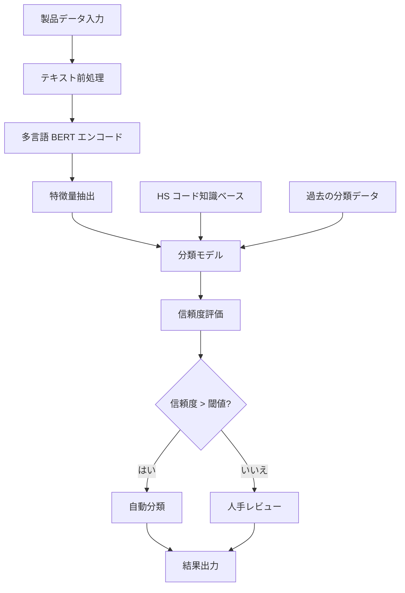

# インテリジェント HS コード分類システム — 技術リファレンス

> **重要**: 本稿は HS コード分類システムを構築するための技術リファレンスであり、完全な技術パスを示すものです。文中の性能値・業務指標は参考例であり、実際の効果はデータ品質や業務シーンなどにより異なります。

## プロジェクト概要

機械学習ベースの HS コード自動分類システムの構築方法を示し、越境EC 企業が製品の税関コードを自動分類するための技術リファレンスを提供します。

## 業務背景

### 課題
- **手動分類の非効率**: 1 製品あたり平均 15 分の検索と確認が必要
- **高いエラー率**: 人手分類のエラー率は約 8〜12%
- **高コスト**: 税関コードの専門家が必要
- **コンプライアンスリスク**: 誤分類は税関の罰金や遅延につながり得る

### 期待される業務価値
- 分類の効率と精度の向上
- 人件費の削減
- コンプライアンスリスクの低減
- 出品プロセスの高速化

> **注**: 以下の設計は業界のベストプラクティスとオープンソースツールの組み合わせに基づきます

## 技術設計

### システムアーキテクチャ



### コア技術スタック

```text
# 主要依存パッケージ
transformers==4.21.0
scikit-learn==1.1.2
fastapi==0.85.0
pandas==1.4.3
numpy==1.23.2
redis==4.3.4
uvicorn==0.18.3
```

## 実装の詳細

### 1. データ準備

```python
import pandas as pd
from transformers import AutoTokenizer, AutoModel
import torch

class HSCodeDataProcessor:
    def __init__(self, model_name='bert-base-multilingual-cased'):
        self.tokenizer = AutoTokenizer.from_pretrained(model_name)
        self.model = AutoModel.from_pretrained(model_name)

    def preprocess_text(self, text):
        """テキスト前処理"""
        # クリーニングと正規化
        text = text.lower().strip()
        # 重要な情報は残しつつ特殊文字を除去
        text = re.sub(r'[^\w\s\-\.]', ' ', text)
        return text

    def extract_features(self, product_descriptions):
        """BERT 特徴量の抽出"""
        features = []
        for desc in product_descriptions:
            inputs = self.tokenizer(desc, return_tensors='pt',
                                    max_length=512, truncation=True, padding=True)
            with torch.no_grad():
                outputs = self.model(**inputs)
            # [CLS] トークンの埋め込みを文表現として使用
            cls_embedding = outputs.last_hidden_state[:, 0, :].numpy()
            features.append(cls_embedding.flatten())
        return np.array(features)
```

### 2. モデル学習

```python
from sklearn.ensemble import RandomForestClassifier
from sklearn.model_selection import train_test_split
from sklearn.metrics import classification_report, accuracy_score

class HSCodeClassifier:
    def __init__(self):
        self.processor = HSCodeDataProcessor()
        self.classifier = RandomForestClassifier(
            n_estimators=200,
            max_depth=20,
            min_samples_split=5,
            random_state=42
        )
        self.label_encoder = LabelEncoder()

    def train(self, df):
        """モデルの学習"""
        # 特徴量抽出
        X = self.processor.extract_features(df['product_description'])
        y = self.label_encoder.fit_transform(df['hs_code'])

        # 学習/テスト分割
        X_train, X_test, y_train, y_test = train_test_split(
            X, y, test_size=0.2, random_state=42, stratify=y
        )

        # 学習
        self.classifier.fit(X_train, y_train)

        # 評価
        y_pred = self.classifier.predict(X_test)
        accuracy = accuracy_score(y_test, y_pred)
        print(f"テスト精度: {accuracy:.3f}")

        return accuracy

    def predict_with_confidence(self, product_description):
        """HS コードと信頼度を予測"""
        features = self.processor.extract_features([product_description])

        # 予測確率
        probabilities = self.classifier.predict_proba(features)[0]
        predicted_class = np.argmax(probabilities)
        confidence = probabilities[predicted_class]

        # HS コードへ逆変換
        hs_code = self.label_encoder.inverse_transform([predicted_class])[0]

        return {
            'hs_code': hs_code,
            'confidence': float(confidence),
            'top_3_predictions': self._get_top_predictions(probabilities, 3)
        }

    def _get_top_predictions(self, probabilities, top_k):
        """上位 K 件の予測を返す"""
        top_indices = np.argsort(probabilities)[-top_k:][::-1]
        top_predictions = []

        for idx in top_indices:
            hs_code = self.label_encoder.inverse_transform([idx])[0]
            confidence = probabilities[idx]
            top_predictions.append({
                'hs_code': hs_code,
                'confidence': float(confidence)
            })

        return top_predictions
```

### 3. API サービス

```python
from fastapi import FastAPI, HTTPException
from pydantic import BaseModel
import redis
import json

app = FastAPI(title="HS Code Classification API")
redis_client = redis.Redis(host='localhost', port=6379, db=0)

# 学習済みモデルのロード
classifier = HSCodeClassifier()
classifier.load_model('models/hs_classifier.pkl')

class ProductRequest(BaseModel):
    product_description: str
    product_category: str = None
    brand: str = None

class ClassificationResponse(BaseModel):
    hs_code: str
    confidence: float
    top_3_predictions: list
    processing_time: float

@app.post("/classify", response_model=ClassificationResponse)
async def classify_product(request: ProductRequest):
    """製品の HS コードを分類"""
    start_time = time.time()

    try:
        # キャッシュ確認
        cache_key = f"hs_classify:{hash(request.product_description)}"
        cached_result = redis_client.get(cache_key)

        if cached_result:
            result = json.loads(cached_result)
        else:
            # 分類を実行
            result = classifier.predict_with_confidence(request.product_description)

            # 結果をキャッシュ(24 時間)
            redis_client.setex(cache_key, 86400, json.dumps(result))

        processing_time = time.time() - start_time
        result['processing_time'] = processing_time

        return ClassificationResponse(**result)

    except Exception as e:
        raise HTTPException(status_code=500, detail=str(e))

@app.get("/health")
async def health_check():
    return {"status": "healthy", "timestamp": time.time()}
```

### 4. デプロイ設定

```yaml
# docker-compose.yml
version: '3.8'
services:
hs-classifier:
build: .
ports:
- "8000:8000"
environment:
- REDIS_URL=redis://redis:6379
depends_on:
- redis
volumes:
- ./models:/app/models

redis:
image: redis:7-alpine
ports:
- "6379:6379"
volumes:
- redis_data:/data

volumes:
redis_data:
```

```dockerfile
# Dockerfile
FROM python:3.9-slim

WORKDIR /app

COPY requirements.txt .
RUN pip install --no-cache-dir -r requirements.txt

COPY . .

EXPOSE 8000

CMD ["uvicorn", "main:app", "--host", "0.0.0.0", "--port", "8000"]
```

## 期待される性能

> **免責事項**: 以下の数値は類似プロジェクトの経験に基づく推定値であり、データ品質・チューニング・ハードウェア構成などにより変動します。

### 目標性能指標

| 指標 | 目標値 | 説明 |
|------|--------|------|
| 全体精度 | 90〜95% | 学習データの品質とカバレッジに依存 |
| 平均 F1 スコア | 85〜92% | 適合率と再現率のバランス |
| 処理レイテンシ | < 5 秒 | 特徴量抽出と推論を含む |
| スループット | 200〜500 QPS | ハードウェアと最適化の度合いに依存 |

### 期待される業務改善

| 指標 | 現状 | 目標 | 期待効果 |
|------|------|------|----------|
| 分類時間 | 10〜20 分 | < 5 秒 | 95%+ |
| 精度 | 80〜90% | 90〜95% | 5〜15% |
| 人件費 | 100% | 20〜30% | 70〜80% 削減 |
| 処理能力 | 50〜100 製品/日 | 1,000+ 製品/日 | 10〜20 倍 |

### エラー分析

主なエラー類型:
1. **類似製品の混同** (40%): 材質違いの同種製品など
2. **多機能製品** (25%): 複数の用途を持つ製品
3. **新しいカテゴリ** (20%): 学習データにない製品
4. **説明不足** (15%): 製品説明の情報量が不足

## 最適化戦略

### 1. データ拡張
```python
def augment_training_data(df):
    """データ拡張戦略"""
    augmented_data = []

    for _, row in df.iterrows():
        original_desc = row['product_description']
        hs_code = row['hs_code']

        # 同義語置換
        augmented_desc = synonym_replacement(original_desc)
        augmented_data.append({'product_description': augmented_desc, 'hs_code': hs_code})

        # ランダム削除
        augmented_desc = random_deletion(original_desc, p=0.1)
        augmented_data.append({'product_description': augmented_desc, 'hs_code': hs_code})

    return pd.DataFrame(augmented_data)
```

### 2. アクティブラーニング
```python
class ActiveLearningPipeline:
    def __init__(self, classifier, uncertainty_threshold=0.7):
        self.classifier = classifier
        self.uncertainty_threshold = uncertainty_threshold
        self.uncertain_samples = []

    def identify_uncertain_samples(self, new_data):
        """不確実なサンプルの特定"""
        for sample in new_data:
            result = self.classifier.predict_with_confidence(sample)
            if result['confidence'] < self.uncertainty_threshold:
                self.uncertain_samples.append(sample)

    def retrain_with_feedback(self, labeled_samples):
        """フィードバックデータによる再学習"""
        # 新たにラベル付けしたデータを学習セットに追加
        # モデルを再学習
        pass
```

### 3. モデルアンサンブル
```python
class EnsembleHSClassifier:
    def __init__(self):
        self.models = [
            RandomForestClassifier(n_estimators=200),
            XGBClassifier(n_estimators=200),
            LogisticRegression(max_iter=1000)
        ]

    def predict_ensemble(self, features):
        """アンサンブル予測"""
        predictions = []
        for model in self.models:
            pred = model.predict_proba(features)
            predictions.append(pred)

        # 確率の平均
        avg_prob = np.mean(predictions, axis=0)
        return avg_prob
```

## 監視とメンテナンス

### 1. 性能監視
```python
import logging
from prometheus_client import Counter, Histogram, generate_latest

# 監視メトリクス
classification_requests = Counter('hs_classification_requests_total', 'Total classification requests')
classification_duration = Histogram('hs_classification_duration_seconds', 'Classification duration')
classification_accuracy = Histogram('hs_classification_accuracy', 'Classification accuracy')

@app.middleware("http")
async def monitor_requests(request, call_next):
    start_time = time.time()
    classification_requests.inc()

    response = await call_next(request)

    duration = time.time() - start_time
    classification_duration.observe(duration)

    return response
```

### 2. データドリフト検知
```python
from scipy import stats

class DataDriftDetector:
    def __init__(self, reference_data):
        self.reference_features = self._extract_features(reference_data)

    def detect_drift(self, new_data, threshold=0.05):
        """データドリフトの検知"""
        new_features = self._extract_features(new_data)

        # KS 検定で分布の変化を検出
        for i in range(new_features.shape[1]):
            statistic, p_value = stats.ks_2samp(
                self.reference_features[:, i],
                new_features[:, i]
            )

            if p_value < threshold:
                logging.warning(f"Feature {i} shows significant drift (p={p_value})")
                return True

        return False
```

## デプロイと運用

### 本番環境チェックリスト

1. **インフラ**
- Kubernetes クラスタ
- Redis キャッシュ
- ロードバランサー
- 監視システム(Prometheus + Grafana)

2. **セキュリティ設定**
- API キー認証
- リクエストレート制限
- データ暗号化

3. **バックアップ戦略**
- モデルファイルのバックアップ
- 学習データのバックアップ
- 設定ファイルのバージョン管理

### トラブルシューティング

| 問題 | 考えられる原因 | 対処 |
|------|----------------|------|
| 応答が遅い | モデルロード、キャッシュ失効 | Redis 接続を確認、モデルを最適化 |
| 精度の低下 | データドリフト、モデルの陳腐化 | 再学習、データ品質チェック |
| メモリ不足 | バッチサイズ過大 | バッチサイズ調整、メモリ増設 |
| API エラー | 入力フォーマット不正 | 入力データの検証 |

## まとめ

本設計は HS コード分類システム構築の全体像を示しました。要点:

1. **高品質な学習データ**: 大量のラベル付きデータの収集とクリーニング
2. **適切なモデル選択**: BERT と古典的 ML の組み合わせ
3. **堅実なエンジニアリング**: API 設計、キャッシュ、監視
4. **継続的な最適化**: アクティブラーニング、モデル更新

### 実装のアドバイス

- **データ準備**: ラベル付きサンプル 10,000 件以上を推奨
- **モデル選択**: データ規模に応じてモデルの複雑さを選ぶ
- **デプロイ戦略**: コンテナ化を推奨(拡張と保守が容易)
- **監視体系**: 精度・レイテンシ・業務指標を重点監視

### 技術スタックの代替案

- **BERT の代替**: DistilBERT、RoBERTa などの軽量モデル
- **サービングの代替**: TorchServe、TensorFlow Serving など
- **データベースの代替**: PostgreSQL、MongoDB など

> **投稿のお誘い**: 類似プロジェクトの実装経験をお持ちの方は、実際の事例と教訓の共有を歓迎します!

## 関連リソース

本章は技術方式のサンプルであり、付属のコードリポジトリはない。上のコードブロックはそのまま実行でき、依存関係は章の冒頭にある。

- [WCO 統一システム(HS)公式ページ](https://www.wcoomd.org/en/topics/nomenclature/instrument-and-tools/hs-nomenclature-2022-edition.aspx) コード体系と章構成の権威ある定義
- [米国 HTS 検索](https://hts.usitc.gov/) 個別商品の米国税則番号を引く。モデル出力の検証に使える
- [Hugging Face Transformers ドキュメント](https://huggingface.co/docs/transformers) 本章の BERT 特徴抽出の部分
- [scikit-learn 教師あり学習ガイド](https://scikit-learn.org/stable/supervised_learning.html) ランダムフォレストとアンサンブル手法
- [FastAPI ドキュメント](https://fastapi.tiangolo.com/) 本章のサービス化の部分
