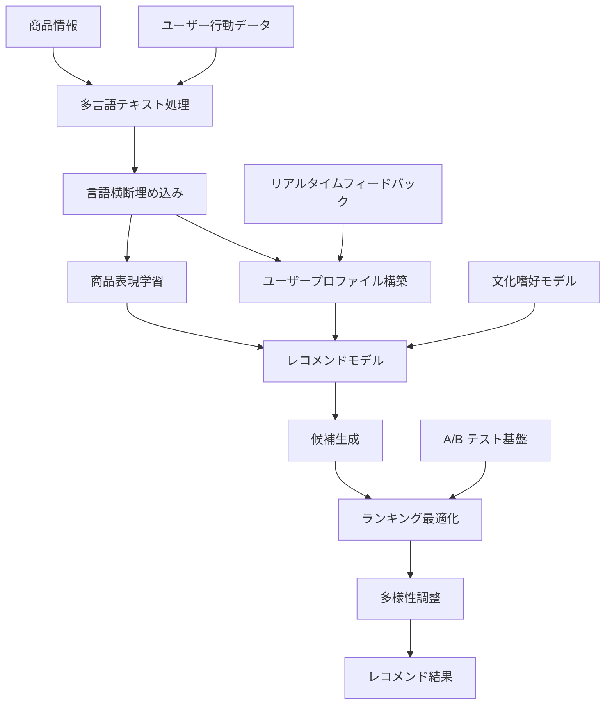

# 多言語商品レコメンドシステム — 技術リファレンス

> **重要**: 本稿は多言語レコメンドシステムの完全な技術アーキテクチャを示す技術リファレンスです。文中の性能値・業務指標は参考例であり、実際の効果はデータ分布やユーザー行動などにより異なります。

## プロジェクト概要

多言語・異文化対応の商品レコメンドシステムの構築方法を示し、グローバル EC プラットフォームにおけるパーソナライズ推薦の技術リファレンスを提供します。

## 業務背景

### 課題
- **言語の壁**: ユーザーは異なる言語で検索・閲覧する
- **文化差**: 地域によって購買嗜好と行動パターンが大きく異なる
- **コールドスタート**: 新規ユーザー・新商品には履歴データがない
- **データのスパース性**: 言語・地域をまたぐインタラクションデータが疎

### 期待される業務目標
- エンゲージメントと転換率の向上
- ユーザー体験と満足度の向上
- 商品カバレッジの拡大
- グローバル展開の支援

> **注**: 以下の設計はレコメンドシステム分野のベストプラクティスに基づきます

## 技術設計

### システムアーキテクチャ



### コア技術スタック

```python
# 主要依存パッケージ
lightfm==1.16
spacy==3.4.1
sentence-transformers==2.2.2
scikit-learn==1.1.2
pandas==1.4.3
numpy==1.23.2
mlflow==1.28.0
fastapi==0.85.0
redis==4.3.4
```

## 実装の詳細

### 1. 多言語テキスト処理

```python
import spacy
from sentence_transformers import SentenceTransformer
import numpy as np

class MultilingualTextProcessor:
def __init__(self):
# 言語別モデルのロード
self.nlp_models = {
'en': spacy.load('en_core_web_sm'),
'zh': spacy.load('zh_core_web_sm'),
'es': spacy.load('es_core_news_sm'),
'fr': spacy.load('fr_core_news_sm'),
'de': spacy.load('de_core_news_sm'),
'ja': spacy.load('ja_core_news_sm')
}

# 多言語文埋め込みモデル
self.sentence_model = SentenceTransformer('paraphrase-multilingual-MiniLM-L12-v2')

def detect_language(self, text):
"""言語検出"""
from langdetect import detect
try:
return detect(text)
except:
return 'en' # デフォルトは英語

def preprocess_text(self, text, language=None):
"""テキスト前処理"""
if language is None:
language = self.detect_language(text)

if language not in self.nlp_models:
language = 'en'

nlp = self.nlp_models[language]
doc = nlp(text)

# キーワードとエンティティの抽出
keywords = [token.lemma_.lower() for token in doc
if not token.is_stop and not token.is_punct and token.is_alpha]
entities = [(ent.text, ent.label_) for ent in doc.ents]

return {
'keywords': keywords,
'entities': entities,
'language': language,
'processed_text': ' '.join(keywords)
}

def get_text_embedding(self, text):
"""テキスト埋め込みベクトルの取得"""
return self.sentence_model.encode([text])[0]

def compute_text_similarity(self, text1, text2):
"""テキスト類似度の計算"""
emb1 = self.get_text_embedding(text1)
emb2 = self.get_text_embedding(text2)
return np.dot(emb1, emb2) / (np.linalg.norm(emb1) * np.linalg.norm(emb2))
```

### 2. 異文化ユーザーモデリング

```python
from lightfm import LightFM
from lightfm.data import Dataset
import pandas as pd

class CrossCulturalUserModel:
def __init__(self):
self.text_processor = MultilingualTextProcessor()
self.cultural_features = {
'US': {'individualism': 0.91, 'uncertainty_avoidance': 0.46, 'power_distance': 0.40},
'CN': {'individualism': 0.20, 'uncertainty_avoidance': 0.30, 'power_distance': 0.80},
'DE': {'individualism': 0.67, 'uncertainty_avoidance': 0.65, 'power_distance': 0.35},
'JP': {'individualism': 0.46, 'uncertainty_avoidance': 0.92, 'power_distance': 0.54},
'BR': {'individualism': 0.38, 'uncertainty_avoidance': 0.76, 'power_distance': 0.69}
}

def build_user_features(self, user_data):
"""ユーザー特徴量の構築"""
features = []

for _, user in user_data.iterrows():
user_features = []

# 基本特徴
user_features.extend([
f"age_group:{self._get_age_group(user['age'])}",
f"gender:{user['gender']}",
f"country:{user['country']}",
f"language:{user['preferred_language']}"
])

# 文化次元の特徴
if user['country'] in self.cultural_features:
cultural = self.cultural_features[user['country']]
for dim, value in cultural.items():
user_features.append(f"cultural_{dim}:{self._discretize(value)}")

# 行動特徴
user_features.extend([
f"avg_order_value:{self._discretize_price(user['avg_order_value'])}",
f"purchase_frequency:{self._get_frequency_group(user['purchase_frequency'])}",
f"preferred_categories:{','.join(user['preferred_categories'])}"
])

features.append(user_features)

return features

def build_item_features(self, product_data):
"""商品特徴量の構築"""
features = []

for _, product in product_data.iterrows():
item_features = []

# 基本特徴
item_features.extend([
f"category:{product['category']}",
f"brand:{product['brand']}",
f"price_range:{self._discretize_price(product['price'])}",
f"rating_range:{self._discretize_rating(product['avg_rating'])}"
])

# テキスト特徴
text_info = self.text_processor.preprocess_text(
product['title'] + ' ' + product['description']
)

# キーワード特徴の追加
for keyword in text_info['keywords'][:10]: # 上位 10 キーワード
item_features.append(f"keyword:{keyword}")

# 言語特徴の追加
item_features.append(f"content_language:{text_info['language']}")

# 地域適合の特徴
if 'target_regions' in product:
for region in product['target_regions']:
item_features.append(f"target_region:{region}")

features.append(item_features)

return features

def _get_age_group(self, age):
if age < 25: return "young"
elif age < 35: return "adult"
elif age < 50: return "middle_aged"
else: return "senior"

def _discretize(self, value, bins=5):
return int(value * bins)

def _discretize_price(self, price):
if price < 20: return "low"
elif price < 100: return "medium"
elif price < 500: return "high"
else: return "premium"

def _discretize_rating(self, rating):
if rating < 3.0: return "low"
elif rating < 4.0: return "medium"
else: return "high"

def _get_frequency_group(self, frequency):
if frequency < 2: return "occasional"
elif frequency < 5: return "regular"
else: return "frequent"
```

### 3. レコメンドモデルの学習

```python
class MultilingualRecommendationModel:
def __init__(self, no_components=100, loss='warp', learning_rate=0.05):
self.model = LightFM(
no_components=no_components,
loss=loss,
learning_rate=learning_rate,
random_state=42
)
self.dataset = Dataset()
self.user_model = CrossCulturalUserModel()
self.is_fitted = False

def prepare_data(self, interactions_df, users_df, items_df):
"""学習データの準備"""
# ユーザーと商品の特徴量を構築
user_features = self.user_model.build_user_features(users_df)
item_features = self.user_model.build_item_features(items_df)

# データセットの作成
self.dataset.fit(
users=interactions_df['user_id'].unique(),
items=interactions_df['item_id'].unique(),
user_features=set(feature for features in user_features for feature in features),
item_features=set(feature for features in item_features for feature in features)
)

# インタラクション行列の構築
(interactions, weights) = self.dataset.build_interactions(
[(row['user_id'], row['item_id'], row['rating'])
for _, row in interactions_df.iterrows()]
)

# 特徴量行列の構築
user_features_matrix = self.dataset.build_user_features(
[(users_df.iloc[i]['user_id'], user_features[i])
for i in range(len(users_df))]
)

item_features_matrix = self.dataset.build_item_features(
[(items_df.iloc[i]['item_id'], item_features[i])
for i in range(len(items_df))]
)

return interactions, user_features_matrix, item_features_matrix

def train(self, interactions_df, users_df, items_df, epochs=50):
"""モデルの学習"""
interactions, user_features, item_features = self.prepare_data(
interactions_df, users_df, items_df
)

# 学習
self.model.fit(
interactions,
user_features=user_features,
item_features=item_features,
epochs=epochs,
verbose=True
)

self.is_fitted = True
return self

def predict(self, user_id, item_ids, user_features=None, item_features=None):
"""ユーザーの商品への嗜好スコアを予測"""
if not self.is_fitted:
raise ValueError("Model must be trained before making predictions")

user_internal_id = self.dataset.mapping()[0][user_id]
item_internal_ids = [self.dataset.mapping()[2][item_id] for item_id in item_ids]

scores = self.model.predict(
user_internal_id,
item_internal_ids,
user_features=user_features,
item_features=item_features
)

return scores

def recommend(self, user_id, n_items=10, filter_seen=True):
"""ユーザーへの商品レコメンド"""
if not self.is_fitted:
raise ValueError("Model must be trained before making recommendations")

user_internal_id = self.dataset.mapping()[0][user_id]
n_items_total = len(self.dataset.mapping()[2])

scores = self.model.predict(
user_internal_id,
np.arange(n_items_total)
)

# Top-N レコメンドの取得
top_items = np.argsort(-scores)[:n_items]

# 元の ID へ変換
item_mapping = {v: k for k, v in self.dataset.mapping()[2].items()}
recommended_items = [item_mapping[item] for item in top_items]
recommended_scores = scores[top_items]

return list(zip(recommended_items, recommended_scores))
```

### 4. リアルタイムレコメンドサービス

```python
from fastapi import FastAPI, HTTPException
from pydantic import BaseModel
import redis
import json
import time

app = FastAPI(title="Multilingual Recommendation API")
redis_client = redis.Redis(host='localhost', port=6379, db=0)

# 学習済みモデルのロード
recommendation_model = MultilingualRecommendationModel()
recommendation_model.load_model('models/multilingual_recommender.pkl')

class RecommendationRequest(BaseModel):
user_id: str
language: str = 'en'
country: str = 'US'
n_items: int = 10
category_filter: list = None

class RecommendationResponse(BaseModel):
user_id: str
recommendations: list
language: str
processing_time: float
model_version: str

@app.post("/recommend", response_model=RecommendationResponse)
async def get_recommendations(request: RecommendationRequest):
"""パーソナライズドレコメンドの取得"""
start_time = time.time()

try:
# キャッシュ確認
cache_key = f"rec:{request.user_id}:{request.language}:{request.country}"
cached_result = redis_client.get(cache_key)

if cached_result:
recommendations = json.loads(cached_result)
else:
# レコメンド生成
raw_recommendations = recommendation_model.recommend(
request.user_id,
n_items=request.n_items * 2 # 多めに生成して後で絞り込む
)

# フィルタと多様性調整の適用
recommendations = await apply_filters_and_diversity(
raw_recommendations,
request
)

# 結果をキャッシュ(1 時間)
redis_client.setex(cache_key, 3600, json.dumps(recommendations))

processing_time = time.time() - start_time

return RecommendationResponse(
user_id=request.user_id,
recommendations=recommendations[:request.n_items],
language=request.language,
processing_time=processing_time,
model_version="v1.2.0"
)

except Exception as e:
raise HTTPException(status_code=500, detail=str(e))

async def apply_filters_and_diversity(recommendations, request):
"""フィルタと多様性調整の適用"""
filtered_recs = []
categories_seen = set()

for item_id, score in recommendations:
# 商品情報の取得
item_info = await get_item_info(item_id)

# カテゴリフィルタ
if request.category_filter and item_info['category'] not in request.category_filter:
continue

# 多様性制御: 同一カテゴリの商品数を制限
if item_info['category'] in categories_seen and len([r for r in filtered_recs if r['category'] == item_info['category']]) >= 2:
continue

categories_seen.add(item_info['category'])

# ローカライズ調整
localized_info = await localize_item_info(item_info, request.language, request.country)

filtered_recs.append({
'item_id': item_id,
'score': float(score),
'title': localized_info['title'],
'description': localized_info['description'],
'price': localized_info['price'],
'currency': localized_info['currency'],
'category': item_info['category'],
'image_url': item_info['image_url'],
'rating': item_info['rating'],
'availability': localized_info['availability']
})

return filtered_recs

async def get_item_info(item_id):
"""商品情報の取得"""
# データベースまたはキャッシュから取得
cache_key = f"item:{item_id}"
cached_info = redis_client.get(cache_key)

if cached_info:
return json.loads(cached_info)

# データベース照会(ここでは簡略化)
item_info = {
'item_id': item_id,
'title': 'Sample Product',
'description': 'Sample Description',
'category': 'Electronics',
'price': 99.99,
'currency': 'USD',
'rating': 4.5,
'image_url': 'https://example.com/image.jpg'
}

# 商品情報をキャッシュ
redis_client.setex(cache_key, 7200, json.dumps(item_info))

return item_info

async def localize_item_info(item_info, language, country):
"""商品情報のローカライズ"""
localized_info = item_info.copy()

# 価格のローカライズ
if country != 'US':
localized_info['price'] = await convert_currency(item_info['price'], 'USD', get_currency(country))
localized_info['currency'] = get_currency(country)

# テキストのローカライズ(簡略化。実際は翻訳サービスを呼び出す)
if language != 'en':
localized_info['title'] = await translate_text(item_info['title'], 'en', language)
localized_info['description'] = await translate_text(item_info['description'], 'en', language)

# 在庫・提供可否の確認
localized_info['availability'] = await check_availability(item_info['item_id'], country)

return localized_info

def get_currency(country):
"""国に対応する通貨を取得"""
currency_map = {
'US': 'USD', 'CN': 'CNY', 'DE': 'EUR',
'JP': 'JPY', 'GB': 'GBP', 'BR': 'BRL'
}
return currency_map.get(country, 'USD')

async def convert_currency(amount, from_currency, to_currency):
"""通貨換算(簡略実装)"""
# 実際は為替レート API を呼び出す
rates = {'USD': 1.0, 'CNY': 6.8, 'EUR': 0.85, 'JPY': 110, 'GBP': 0.75, 'BRL': 5.2}
return amount * rates.get(to_currency, 1.0) / rates.get(from_currency, 1.0)

async def translate_text(text, from_lang, to_lang):
"""テキスト翻訳(簡略実装)"""
# 実際は翻訳 API を呼び出す
return f"[{to_lang}] {text}"

async def check_availability(item_id, country):
"""指定国での商品提供可否を確認"""
# 実際は在庫と配送ポリシーを確認する
return True

@app.get("/health")
async def health_check():
return {"status": "healthy", "timestamp": time.time()}
```

## 期待される性能

> **免責事項**: 以下の数値はレコメンドシステム研究と業界経験に基づく推定値であり、データ品質・ユーザー行動・業務シーンにより大きく変動します。

### オフライン評価の目標値

| 指標 | 目標レンジ | 説明 |
|------|-----------|------|
| Precision@10 | 0.10〜0.20 | データのスパース性とモデル複雑度に依存 |
| Recall@10 | 0.05〜0.15 | 候補集合サイズと興味の広さに制約される |
| NDCG@10 | 0.15〜0.30 | 順位品質を考慮した総合指標 |
| Coverage | 0.60〜0.80 | レコメンドがカバーする商品の割合 |
| Diversity | 0.70〜0.85 | レコメンド結果の多様性 |

### 期待されるオンライン効果

| 指標 | ベースライン | 目標リフト | 説明 |
|------|--------------|-----------|------|
| クリック率 (CTR) | 基準 | +15〜30% | ベースラインの品質に依存 |
| 転換率 | 基準 | +10〜25% | 商品品質と価格の影響を受ける |
| 平均注文額 | 基準 | +5〜15% | クロスセルにより実現 |
| ユーザー満足度 | 基準 | +0.2〜0.5 点 | ユーザー調査での検証が必要 |
| ページ滞在時間 | 基準 | +20〜40% | エンゲージメントの代理指標 |

### 言語別の性能見込み

| 言語 | データの充実度 | 期待 Precision@10 | 課題 |
|------|---------------|-------------------|------|
| 英語 | 高 | 0.15〜0.20 | 競争が激しく、ユーザーの期待も高い |
| 中国語 | 高 | 0.12〜0.18 | 文化差、地域嗜好 |
| スペイン語 | 中 | 0.10〜0.15 | 地域差が大きい |
| フランス語 | 中 | 0.08〜0.14 | データが比較的疎 |
| ドイツ語 | 中 | 0.08〜0.14 | ユーザー行動が保守的 |
| 日本語 | 低 | 0.06〜0.12 | 文化的特殊性が強い |

## 最適化戦略

### 1. コールドスタート対策

```python
class ColdStartHandler:
def __init__(self, recommendation_model):
self.model = recommendation_model
self.popularity_model = PopularityBasedRecommender()
self.content_model = ContentBasedRecommender()

def handle_new_user(self, user_profile):
"""新規ユーザーのコールドスタート対応"""
# デモグラフィック特徴に基づくレコメンド
demographic_recs = self.get_demographic_recommendations(user_profile)

# 地域の人気商品レコメンド
popular_recs = self.popularity_model.recommend_by_region(
user_profile['country'],
user_profile['language']
)

# ブレンド
return self.blend_recommendations([demographic_recs, popular_recs], [0.6, 0.4])

def handle_new_item(self, item_info):
"""新商品のコールドスタート対応"""
# コンテンツベースの類似商品
similar_items = self.content_model.find_similar_items(item_info)

# カテゴリ別の戦略
category_strategy = self.get_category_strategy(item_info['category'])

return {
'similar_items': similar_items,
'promotion_strategy': category_strategy
}
```

### 2. リアルタイムパーソナライズ

```python
class RealTimePersonalization:
def __init__(self):
self.session_tracker = SessionTracker()
self.real_time_updater = RealTimeModelUpdater()

def update_recommendations(self, user_id, interaction_data):
"""リアルタイムのインタラクションでレコメンドを更新"""
# セッション状態の更新
session_state = self.session_tracker.update_session(user_id, interaction_data)

# 重みを動的に調整
adjusted_weights = self.calculate_dynamic_weights(session_state)

# レコメンド結果を再ランキング
return self.rerank_recommendations(user_id, adjusted_weights)

def calculate_dynamic_weights(self, session_state):
"""動的重みの計算"""
weights = {
'popularity': 0.3,
'collaborative': 0.4,
'content': 0.2,
'trending': 0.1
}

# セッション行動に応じて重みを調整
if session_state['browse_time'] > 300: # 長時間の閲覧
weights['content'] += 0.1
weights['popularity'] -= 0.1

if session_state['category_focus']: # 特定カテゴリへの集中
weights['content'] += 0.15
weights['collaborative'] -= 0.15

return weights
```

### 3. 多目的最適化

```python
class MultiObjectiveOptimizer:
def __init__(self):
self.objectives = {
'relevance': 0.4,
'diversity': 0.2,
'novelty': 0.15,
'business_value': 0.25
}

def optimize_recommendations(self, candidate_items, user_profile):
"""レコメンド結果の多目的最適化"""
scores = {}

for item in candidate_items:
scores[item['item_id']] = {
'relevance': self.calculate_relevance_score(item, user_profile),
'diversity': self.calculate_diversity_score(item, candidate_items),
'novelty': self.calculate_novelty_score(item, user_profile),
'business_value': self.calculate_business_value(item)
}

# 総合スコアの計算
final_scores = {}
for item_id, item_scores in scores.items():
final_score = sum(
item_scores[obj] * weight
for obj, weight in self.objectives.items()
)
final_scores[item_id] = final_score

# ソートして返す
sorted_items = sorted(
candidate_items,
key=lambda x: final_scores[x['item_id']],
reverse=True
)

return sorted_items
```

## デプロイと監視

### 本番環境アーキテクチャ

```yaml
# kubernetes-deployment.yml
apiVersion: apps/v1
kind: Deployment
metadata:
name: multilingual-recommender
spec:
replicas: 3
selector:
matchLabels:
app: multilingual-recommender
template:
metadata:
labels:
app: multilingual-recommender
spec:
containers:
- name: recommender-api
image: cbec-ai/multilingual-recommender:v1.2.0
ports:
- containerPort: 8000
env:
- name: REDIS_URL
value: "redis://redis-service:6379"
- name: MODEL_PATH
value: "/models/multilingual_recommender.pkl"
resources:
requests:
memory: "2Gi"
cpu: "1000m"
limits:
memory: "4Gi"
cpu: "2000m"
volumeMounts:
- name: model-storage
mountPath: /models
volumes:
- name: model-storage
persistentVolumeClaim:
claimName: model-pvc
---
apiVersion: v1
kind: Service
metadata:
name: recommender-service
spec:
selector:
app: multilingual-recommender
ports:
- port: 80
targetPort: 8000
type: LoadBalancer
```

### 監視メトリクス

```python
from prometheus_client import Counter, Histogram, Gauge

# ビジネス指標
recommendation_requests = Counter('recommendation_requests_total', 'Total recommendation requests', ['language', 'country'])
recommendation_ctr = Gauge('recommendation_ctr', 'Click-through rate', ['language'])
recommendation_conversion = Gauge('recommendation_conversion_rate', 'Conversion rate', ['language'])

# 技術指標
recommendation_latency = Histogram('recommendation_latency_seconds', 'Recommendation latency')
model_accuracy = Gauge('model_accuracy', 'Model accuracy score', ['metric'])
cache_hit_rate = Gauge('cache_hit_rate', 'Cache hit rate')

@app.middleware("http")
async def monitor_requests(request, call_next):
start_time = time.time()

response = await call_next(request)

# レイテンシの記録
latency = time.time() - start_time
recommendation_latency.observe(latency)

return response
```

## まとめ

本設計は多言語商品レコメンドシステム構築の全体像を示しました。要点:

1. **多言語対応**: 先進的な多言語 NLP モデルの活用
2. **文化への適応**: 文化次元の特徴量をモデルに統合
3. **コールドスタート対策**: 新規ユーザー・新商品への複数戦略
4. **リアルタイム最適化**: ユーザー行動に基づく即時調整
5. **多目的バランス**: 関連性・多様性・ビジネス価値のトレードオフ

### 実装のアドバイス

- **データ収集**: 言語ごとに 10 万件以上のインタラクションデータを推奨
- **モデル学習**: データ豊富な言語から疎な言語への転移学習が有効
- **A/B テスト**: 最低 4 週間のテストで効果を検証
- **監視体系**: 言語・地域ごとの性能差を重点的に監視

### 技術スタックの代替案

- **推薦アルゴリズム**: Neural Collaborative Filtering、DeepFM などの深層学習手法
- **多言語モデル**: XLM-R、mBERT などの事前学習モデル
- **リアルタイム処理**: Apache Kafka + Apache Flink によるストリーム計算
- **フィーチャーストア**: Feast、Tecton など

### 想定される課題

- **データの不均衡**: 言語間でデータ量の差が非常に大きい
- **文化差**: 各地域のユーザー行動パターンへの深い理解が必要
- **コールドスタート**: 新市場・新規ユーザーの推薦品質の担保が難しい
- **リアルタイム性**: 大規模多言語レコメンドのレイテンシ制御

> **投稿のお誘い**: 多言語レコメンドシステムの実プロジェクト経験をお持ちの方は、実例・課題・解決策の共有を歓迎します!

## 関連リソース

- [ソースコードリポジトリ](https://github.com/cbec-ai-hub/multilingual-recommender)
- [モデル学習ノートブック](https://github.com/cbec-ai-hub/multilingual-recommender/blob/main/notebooks/model_training.ipynb)
- [API ドキュメント](https://api.example.com/recommender/docs)
- [性能ベンチマーク](https://github.com/cbec-ai-hub/multilingual-recommender/blob/main/benchmarks/)
