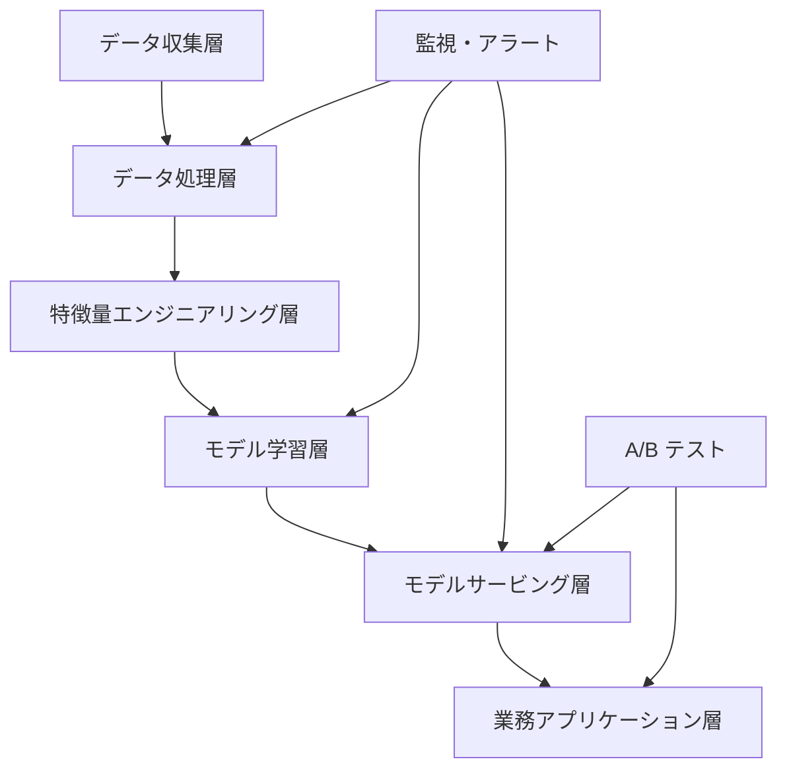

# 越境EC AI 技術実装ガイドライン

本ドキュメントは越境EC の AI プロジェクトに向けて、技術アーキテクチャ、性能ベンチマーク、実装の指針を提供します。事例研究における技術設計と評価の裏付けとなる資料です。

## 技術アーキテクチャパターン

### 汎用アーキテクチャの構成要素

### 各層の役割

**データ収集層**
- マルチチャネルのデータ接続(EC プラットフォーム、ERP、CRM など)
- リアルタイムとバッチの両処理
- データ品質の監視とクレンジング

**データ処理層**
- ETL/ELT パイプライン
- データウェアハウスとデータレイク
- データのバージョン管理とリネージ追跡

**特徴量エンジニアリング層**
- 特徴量の抽出と変換
- フィーチャーストアと管理
- 特徴量の監視とドリフト検知

**モデル学習層**
- モデル開発と学習
- ハイパーパラメータ最適化
- モデル検証と評価

**モデルサービング層**
- デプロイと推論
- ロードバランシングとオートスケール
- A/B テストとカナリアリリース

**業務アプリケーション層**
- API と SDK
- UI とダッシュボード
- 業務プロセスとの統合

### 技術選定の原則

1. **拡張性**: 事業の急成長を支える
- 水平スケーリング
- マイクロサービスアーキテクチャ
- クラウドネイティブ設計

2. **多言語対応**: グローバル展開に適応する
- 国際化フレームワーク
- 多言語 NLP モデル
- ローカライズされたデータ処理

3. **リアルタイム性**: 即時の業務判断を支える
- ストリーム処理
- 低レイテンシ推論
- キャッシュ戦略の最適化

4. **説明可能性**: コンプライアンスと監査要件を満たす
- モデルの説明可能性
- 意思決定プロセスの透明性
- 完全な監査ログ

5. **コスト効率**: 性能とコストのバランス
- リソースの適正配置
- 運用の自動化
- コストの監視と制御

## 性能ベンチマーク

<!-- claims: benchmark -->

> ここの数値は目指すべき目標線であり、業界の実測平均ではない。

### モデル性能の目標値

| タスク種別 | 精度目標 | レイテンシ | スループット | 備考 |
|-----------|----------|-----------|--------------|------|
| テキスト分類 | > 90% | < 100ms | 1000 QPS | 商品分類、感情分析 |
| レコメンデーション | CTR > 3% | < 50ms | 5000 QPS | 商品推薦、パーソナライズ |
| 時系列予測 | MAPE < 20% | < 1s | 100 QPS | 需要予測、在庫最適化 |
| 異常検知 | F1 > 95% | < 10ms | 10000 QPS | 不正検知、リスク管理 |
| 画像認識 | > 95% | < 200ms | 500 QPS | 商品認識、品質検査 |

### インフラ要件

**コンピュート**
- **最小構成**: 2 コア 4GB RAM
- **推奨構成**: 8 コア 16GB RAM
- **高性能構成**: 16 コア 32GB RAM + GPU

**ストレージ**
- **システムディスク**: SSD、最小 100GB
- **データディスク**: データ量に応じて、SSD 推奨
- **バックアップ**: 遠隔地バックアップ、30 日保持

**ネットワーク**
- **帯域**: 最小 100Mbps、推奨 1Gbps
- **レイテンシ**: 内部ネットワーク < 1ms
- **可用性**: 99.9% 以上

**コンテナ化**
- **Docker**: コンテナデプロイ対応
- **Kubernetes**: クラスタ管理対応
- **サービスメッシュ**: Istio などのマイクロサービスガバナンス

## 継続的改善

<!-- claims: benchmark -->

> ここの数値は目指すべき目標線であり、業界の実測平均ではない。

### モデルの反復プロセス

1. **データ収集**: 業務フィードバックを継続的に収集
- ユーザー行動データ
- 業務指標データ
- システム性能データ

2. **性能監視**: モデル指標をリアルタイム監視
- 精度の監視
- レイテンシの監視
- リソース使用の監視

3. **A/B テスト**: 新モデルと既存モデルの比較
- トラフィック配分戦略
- 統計的有意性の検定
- 業務指標の比較

4. **段階的デプロイ**: リリースリスクの低減
- カナリアリリース
- ブルーグリーンデプロイ
- ロールバック機構

5. **効果評価**: 業務指標と技術指標の両面評価
- ROI 計算
- ユーザー満足度
- システム安定性

### 品質保証

**コード品質**
- コードレビュープロセス
- ユニットテストカバレッジ > 80%
- 統合テストと E2E テスト

**データ品質**
- データ検証ルール
- データ品質の監視
- 異常データの処理

**モデル品質**
- モデル検証フレームワーク
- 性能ベンチマークテスト
- モデルバイアスの検出

## セキュリティとコンプライアンス

### データセキュリティ
- データ暗号化(転送時・保存時)
- アクセス制御と権限管理
- データマスキングと匿名化

### プライバシー保護
- GDPR 準拠
- データ最小化の原則
- ユーザー同意の管理

### システムセキュリティ
- ネットワークセキュリティ対策
- 脆弱性スキャンと修正
- セキュリティ監査ログ

## 参考リソース

### 技術ドキュメント
- [AWS 機械学習ベストプラクティス](https://docs.aws.amazon.com/wellarchitected/latest/machine-learning-lens/)
- [Google Cloud AI プラットフォームガイド](https://cloud.google.com/ai-platform/docs)
- [MLOps 成熟度モデル](https://docs.microsoft.com/en-us/azure/architecture/example-scenario/mlops/mlops-maturity-model)

### オープンソースツール
- [MLflow](https://mlflow.org/) — 機械学習ライフサイクル管理
- [Kubeflow](https://www.kubeflow.org/) — Kubernetes 上の ML ワークフロー
- [DVC](https://dvc.org/) — データバージョン管理

---

**利用上の注意**: 本ガイドは事例研究の技術リファレンスです。実装の際は業務要件とリソース制約に応じて調整してください。疑問があれば[事例集](../case-studies/)の具体例を参照するか、[Issue を提出](https://github.com/kangise/ecommerce-ai-roadmap/issues)してください。
