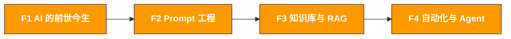

# Path 0: AI 基础先行 | AI Foundations

> **推荐先修路径** 无论你是运营人、技术人还是管理者，建议先完成本路径建立 AI 认知基础
> **最后更新**: 2026-03-11
> **难度**: 入门
> **预计时间**: 每天 30 分钟，1 周完成全部模块
> **前提**: 无，零基础可学

---

[Hub 首页](../../README.md) · [学习路径总览](../README.md)

## 为什么需要 Path 0

Path A/B/C 假设你已经理解 AI 的基本概念。如果你对以下问题还不确定，建议先完成 Path 0：

- LLM 到底是怎么工作的？为什么它有时候会"胡说八道"？
- Prompt 写得好和写得差，效果差距有多大？有没有系统方法论？
- 什么是 RAG？为什么 AI 不知道我的产品信息？怎么让它知道？
- Agent 和普通的 ChatGPT 对话有什么区别？自动化能做到什么程度？

## 路径导航

## 模块概览

| 模块 | 主题 | 你将理解 | 预计时间 |
|------|------|----------|----------|
| [F1. AI 的前世今生](f1-ai-evolution.md) | 从机器学习到 Agent 的发展脉络 | LLM 的本质是什么，为什么它能做这些事 | 2 小时 |
| [F2. Prompt 工程](f2-prompt-engineering.md) | CRISP 框架 + 高级技巧 + 场景模板 | 如何系统性地写出高质量 Prompt | 3 小时 |
| [F3. 知识库与 RAG](f3-rag-knowledge.md) | Embedding、向量数据库、RAG 架构 | 如何让 AI 理解你的私有数据 | 2 小时 |
| [F4. 自动化与 Agent](f4-agent-automation.md) | 从脚本到 Agent 的三层自动化 | AI Agent 能做什么，怎么用 | 2 小时 |
| [F5. RPA 与低代码自动化](f5-rpa-automation.md) | n8n/Zapier/Make/Defy 实战 | 用具体工具搭建自动化工作流 | 2-3 小时 |

## 学习建议

- **运营人**：重点学 F1（建立认知）+ F2（Prompt 是你的核心技能），F3/F4 了解概念即可
- **技术人**：四个模块都要学，F3/F4 是你后续 Path B 的理论基础
- **管理者**：重点学 F1（和团队沟通的基础）+ F4（理解自动化的边界），F2/F3 快速浏览

## 完成标志

- [ ] 能用自己的话解释 LLM 的工作原理（不需要技术细节，但要理解本质）
- [ ] 能用 CRISP 框架写出结构化的 Prompt，并知道常见错误怎么修
- [ ] 理解 RAG 的核心架构，知道什么时候该用 RAG 而不是直接问 AI
- [ ] 理解 Agent 和普通对话的区别，能判断哪些业务场景适合用 Agent

完成 Path 0 后，建议先看 [ AI 应用全景评估](ai-landscape.md) 建立全局视角，再根据你的角色选择下一步：
- 运营人 → [Path A: AI 提效实战](../a-operators/)
- 技术人 → [Path B: AI 系统构建](../b-developers/)
- 管理者 → [Path C: AI 战略落地](../c-managers/)

---

[返回 Hub 首页](../../README.md) · [返回学习路径总览](../README.md)
