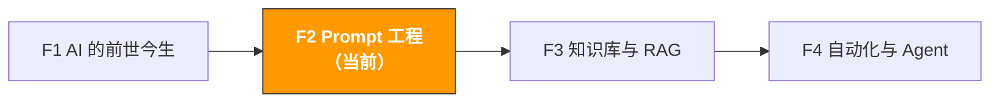

# F2. Prompt 工程 | Prompt Engineering

> **路径**: Path 0: AI 基础先行 · **模块**: F2
> **最后更新**: 2026-03-12
> **难度**: 入门 → 中级
> **预计时间**: 3 小时
> **前置模块**: [F1 AI 的前世今生](f1-ai-evolution.md)

---

[Hub 首页](../../README.md) · [Path 0 总览](README.md)



---

## 本模块章节导航

1. [为什么 Prompt 重要](#1-为什么-prompt-重要) · 2. [CRISP 框架](#2-crisp-框架结构化-prompt-的方法论) · 3. [六种高级技巧](#3-六种高级-prompt-技巧) · 4. [场景模板库](#4-跨境电商场景-prompt-模板库20) · 5. [常见错误与修复](#5-常见错误与修复) · 6. [进阶：Context Engineering](#6-进阶从-prompt-engineering-到-context-engineering) · 7. [学习资源](#7-学习资源) · 8. [ OpenClaw 自动化](#8-用-openclaw-辅助-prompt-管理与优化) · 9. [完成标志](#9-完成标志)


## 本模块你将掌握

Prompt 是你和 AI 沟通的唯一接口。同样的 AI 模型，Prompt 写得好和写得差，输出质量可以差 10 倍。

完成本模块后，你将能够：
- 用 CRISP 框架写出结构化的高质量 Prompt
- 掌握 6 种高级 Prompt 技巧（Chain-of-Thought、Few-shot 等）
- 拥有 20+ 个跨境电商场景的即用 Prompt 模板
- 知道 Prompt 的常见错误和修复方法
- 理解从 Prompt Engineering 到 Context Engineering 的演进

> **核心理念**：Prompt Engineering 不是"写一句好的指令"，而是"设计一个完整的沟通协议"。你给 AI 的不只是一个问题，而是角色、背景、约束、格式和期望的完整定义。

---

## 1. 为什么 Prompt 重要

### 1.1 同一个问题，不同 Prompt 的效果对比

**场景：分析竞品 Review**

**差的 Prompt：**
```
帮我分析这些 Review
```

**AI 输出：** 泛泛而谈的总结，没有结构，没有可操作的建议。

**好的 Prompt：**
```
你是一个资深的 Amazon 产品经理，专注于消费电子品类。
我会给你一组竞品蓝牙耳机的 1-3 星差评（共 50 条）。

请分析这些差评，输出：
1. 排名前 5 的用户痛点（按提及频率排序）
2. 每个痛点的代表性评论原文（1-2 条）
3. 每个痛点的改进建议
4. 哪些痛点最容易通过产品设计解决

输出格式：表格
语言：中文

[在此粘贴差评内容]
```

**AI 输出：** 结构化的表格，按频率排序的痛点，每个都有原文引用和可操作的改进建议。

**差距在哪里？**

| 维度 | 差的 Prompt | 好的 Prompt |
|------|-----------|-----------|
| 角色定义 | 无 | "资深 Amazon 产品经理" |
| 背景信息 | 无 | "消费电子品类""蓝牙耳机""1-3 星差评" |
| 具体要求 | "分析" | 4 个明确的输出要求 |
| 输出格式 | 无 | "表格" |
| 语言指定 | 无 | "中文" |

### 1.2 Prompt 的本质：减少 AI 的"猜测空间"

回忆 F1 的内容：LLM 是一个"下一个词预测器"。当你的 Prompt 模糊时，AI 有太多可能的方向，它会选择"最常见"的方向 通常是泛泛而谈。

当你的 Prompt 精确时，你把 AI 的"猜测空间"缩小到了你想要的方向。

```
模糊 Prompt → AI 的可能输出空间很大 → 大概率输出平庸的结果
精确 Prompt → AI 的可能输出空间很小 → 大概率输出你想要的结果
```

这就像你给新员工布置任务：
- "帮我做个报告" → 他不知道做什么报告、给谁看、什么格式、什么时候要
- "帮我做一份 Q1 销售分析报告，给老板看，用 PPT 格式，包含同比增长和 Top 10 产品，周五前完成" → 他知道该做什么

### 1.3 Prompt Engineering 的投入产出比

| 投入 | 产出 |
|------|------|
| 多花 2 分钟写 Prompt | 省 20 分钟修改 AI 输出 |
| 建立 Prompt 模板库（一次性 2 小时） | 团队每人每天省 30 分钟 |
| 学习 CRISP 框架（本模块 3 小时） | 所有 AI 交互质量提升 50%+ |

---

## 2. CRISP 框架：结构化 Prompt 的方法论

### 2.1 什么是 CRISP

CRISP 是一个帮你写出高质量 Prompt 的框架，5 个字母代表 5 个要素：

```
C Context（背景）：给 AI 足够的背景信息
R Role（角色）：定义 AI 应该扮演什么角色
I Instructions（指令）：明确告诉 AI 要做什么
S Specifications（规格）：定义输出的格式、长度、语言等
P Proof（验证）：要求 AI 提供证据或解释推理过程
```

### 2.2 每个要素详解

**C Context（背景）**

告诉 AI "你在什么情况下问这个问题"。背景越丰富，AI 的回答越精准。

| 无背景 | 有背景 |
|--------|--------|
| "帮我写一个产品标题" | "我在 Amazon US 卖一款便携式颈挂风扇，目标客户是户外运动爱好者，售价 $25，主要竞品是 JISULIFE 和 TORRAS" |

**背景信息清单（跨境电商）：**
- 产品是什么？品类、特点、卖点
- 目标市场？US/EU/JP
- 目标客户？年龄、场景、需求
- 竞品是谁？价格带、优劣势
- 你的约束？预算、时间、资源

**R Role（角色）**

给 AI 一个专业角色，它会用该角色的知识和视角来回答。

| 场景 | 推荐角色 |
|------|---------|
| 写 Listing | "你是一个 Amazon Listing 优化专家，有 5 年经验" |
| 分析 Review | "你是一个资深的产品经理，专注于消费电子" |
| 广告优化 | "你是一个 Amazon PPC 广告专家" |
| 合规查询 | "你是一个跨境电商合规顾问，熟悉 EU/US/JP 法规" |
| 供应商谈判 | "你是一个有 10 年经验的采购经理" |
| 市场分析 | "你是一个电商行业分析师" |

> **为什么角色有效？** 因为 AI 的训练数据中包含了不同角色的文本。当你指定"Amazon PPC 专家"时，AI 会倾向于使用与 PPC 相关的专业术语和分析框架。

**I Instructions（指令）**

明确告诉 AI 要做什么。好的指令是具体的、可执行的、有优先级的。

| 模糊指令 | 具体指令 |
|---------|---------|
| "分析这些数据" | "从这些搜索词数据中，找出 ACOS > 50% 且点击 > 100 的词，按花费从高到低排序" |
| "写一个标题" | "写 3 个 Amazon 产品标题变体，每个 ≤ 200 字符，包含关键词 [X]、[Y]、[Z]" |
| "给我建议" | "给出 3 个具体的改进建议，每个包含：问题描述、改进方案、预期效果" |

**S Specifications（规格）**

定义输出的"长什么样"。

| 规格类型 | 示例 |
|---------|------|
| 格式 | "用表格输出"、"用 Markdown 格式"、"用编号列表" |
| 长度 | "每个要点不超过 50 字"、"总字数 500-800 字" |
| 语言 | "用中文回答"、"用英文写 Listing，用中文写分析" |
| 语气 | "专业但易懂"、"适合 Amazon 买家阅读" |
| 结构 | "先给结论，再给分析过程"、"按优先级从高到低排列" |

**P Proof（验证）**

要求 AI 解释推理过程或提供证据，减少幻觉。

```
验证要求示例：
- "请解释你的推理过程"
- "请标注每个建议的依据"
- "如果你不确定某个信息，请明确标注"
- "请区分'基于数据的结论'和'基于经验的推测'"
```

### 2.3 CRISP 完整示例

**场景：评估一个新品类是否值得进入**

```
【C - Context 背景】
我是一个 Amazon US 卖家，目前主营消费电子品类，
年销售额约 $500K，团队 5 人。
我在考虑进入便携式投影仪品类。
目前 Amazon US 上这个品类的头部卖家有 XGIMI、Anker Nebula、YABER。
我的启动预算约 ¥30 万。

【R - Role 角色】
你是一个有 10 年经验的跨境电商选品顾问，
精通 Amazon US 市场的消费电子品类。

【I - Instructions 指令】
请对便携式投影仪品类做一个全面的市场可行性评估，包含：
1. 市场规模和增长趋势
2. 竞争格局分析（头部卖家的优劣势）
3. 利润空间估算
4. 进入壁垒（资金、技术、认证）
5. 主要风险
6. Go/No-Go 建议

【S - Specifications 规格】
- 输出格式：每个维度用表格 + 简要分析
- 语言：中文
- 评分：每个维度 1-5 分
- 最后给出综合评分和明确的建议（进入/谨慎/放弃）

【P - Proof 验证】
- 请标注哪些信息是基于公开数据，哪些是你的推测
- 如果某个维度你不确定，请明确说明
- 请解释综合评分的计算逻辑
```

> **实际使用时不需要标注 [C][R][I][S][P]**，这里只是为了教学。熟练后你会自然地把这 5 个要素融入 Prompt 中。


---

## 3. 六种高级 Prompt 技巧

### 3.1 Chain-of-Thought（思维链）

让 AI "一步一步思考"，而不是直接给答案。适合需要推理的复杂问题。

**不用 CoT：**
```
这个产品在 Amazon US 的利润率是多少？
采购成本 ¥80，售价 $29.99，FBA 费用 $5.50，佣金 15%
```
AI 可能直接给一个数字，但计算过程不透明，容易出错。

**用 CoT：**
```
请一步一步计算这个产品在 Amazon US 的利润率：
1. 先把采购成本从人民币换算成美元（汇率 7.2）
2. 计算 Amazon 佣金
3. 汇总所有成本
4. 计算利润和利润率

数据：采购成本 ¥80，售价 $29.99，FBA 费用 $5.50，佣金率 15%
```

**为什么有效？** 强制 AI 展示中间步骤，每一步都可以验证。如果某一步算错了，你能立刻发现。

**适用场景：**
- 利润计算、成本分析
- 多步骤的市场评估
- 需要逻辑推理的决策问题
- 任何你需要"看到过程"的分析

### 3.2 Few-shot Learning（少样本学习）

给 AI 几个示例，让它学会你想要的输出格式和风格。

```
请按以下格式分析每个竞品的 Listing 标题策略：

示例：
标题：Anker Soundcore Life Q20 Hybrid Active Noise Cancelling Headphones
分析：
- 品牌前置（Anker Soundcore）→ 品牌认知度高，放在最前
- 核心卖点（Hybrid Active Noise Cancelling）→ 技术差异化
- 品类词（Headphones）→ 确保搜索匹配
- 策略：品牌 + 技术卖点 + 品类词

现在请用同样的格式分析以下 3 个标题：
1. [竞品A标题]
2. [竞品B标题]
3. [竞品C标题]
```

**为什么有效？** 示例比描述更精确。与其花 100 字描述你想要什么格式，不如给一个示例。

**最佳实践：**
- 1-3 个示例通常就够了
- 示例要覆盖不同的情况（正面/负面、简单/复杂）
- 示例的格式就是你期望的输出格式

### 3.3 Role-Playing（角色扮演）

让 AI 扮演特定角色，从该角色的视角分析问题。

```
请分别从以下 3 个角色的视角评估这个产品：

角色 1 挑剔的消费者：
"我是一个经常在 Amazon 购物的消费者，对产品质量要求很高，
会仔细看差评。这个产品的 Listing 能说服我购买吗？"

角色 2 竞品运营经理：
"我是竞品公司的运营经理，看到这个新产品进入市场。
它对我的产品有威胁吗？我应该如何应对？"

角色 3 Amazon 品类经理：
"我是 Amazon 的品类经理，负责审核这个品类的产品。
这个 Listing 有没有违规风险？质量评分如何？"
```

**为什么有效？** 多角色分析能帮你发现单一视角容易忽略的问题。

### 3.4 Structured Output（结构化输出）

明确要求 AI 用特定格式输出，便于后续处理和对比。

```
请用以下 JSON 格式输出分析结果：

{
"product_name": "产品名称",
"market_score": 1-5,
"competition_score": 1-5,
"profit_score": 1-5,
"risk_factors": ["风险1", "风险2"],
"recommendation": "进入/谨慎/放弃",
"reasoning": "推荐理由"
}
```

**适用场景：**
- 需要批量处理多个产品的评估
- 需要导入 Excel 或数据库的数据
- 需要在团队间标准化分析格式

### 3.5 Iterative Refinement（迭代优化）

不要期望一次 Prompt 就得到完美结果。把 AI 当作协作伙伴，通过多轮对话逐步优化。

```
第 1 轮：
"帮我写一个蓝牙耳机的 Amazon 标题"

第 2 轮：
"不错，但请加入'降噪'这个关键词，并把标题控制在 150 字符以内"

第 3 轮：
"很好。现在请生成 3 个变体，分别侧重：
A. 技术参数（降噪 dB、续航时间）
B. 使用场景（通勤、运动、办公）
C. 情感诉求（享受音乐、专注工作）"

第 4 轮：
"我选 B 方向。请进一步优化，加入'2026 新款'和'Type-C 快充'"
```

**为什么有效？** 复杂任务很难一次描述清楚。迭代让你可以在看到 AI 输出后调整方向。

### 3.6 Constraint Setting（约束设定）

告诉 AI "不要做什么"，和告诉它"要做什么"一样重要。

```
请帮我写 Amazon Listing 的 5 个 Bullet Points。

约束条件：
- 不要使用夸张词汇（如"最好的"、"完美的"、"革命性的"）
- 不要提及竞品品牌名
- 不要使用 HTML 标签
- 每个 Bullet 不超过 200 字符
- 不要重复关键词
- 不要使用全大写字母（除品牌名外）
```

**常用约束清单（跨境电商）：**

| 约束类型 | 示例 |
|---------|------|
| 内容约束 | "不要编造数据"、"不要使用未经验证的声明" |
| 格式约束 | "不超过 X 字"、"用表格而非段落" |
| 合规约束 | "不要使用医疗声明"、"不要提及竞品品牌" |
| 风格约束 | "不要用学术语气"、"不要用中式英语" |
| 安全约束 | "如果不确定，请说明而非猜测" |

---

## 4. 跨境电商场景 Prompt 模板库（20+）

> **相关阅读**: [A2 Listing 与内容创作](../a-operators/a2-listing-optimization.md) 电商 Listing Prompt 模板详见 A2

> 完整的标准化模板存放在 [prompts/](../../prompts/) 目录。本节提供快速参考版本。

### 4.1 选品与市场分析（5 个）

**模板 1：竞品 Review 痛点提取**
```
角色：资深 Amazon 产品经理
输入：[粘贴 50+ 条 1-3 星差评]
任务：提取排名前 5 的痛点，按频率排序
输出：表格（痛点 | 频率 | 代表性评论 | 改进建议 | 难度）
```

**模板 2：市场可行性 5 维度评估**
```
角色：跨境电商选品顾问
输入：产品名称、目标市场、竞品信息
任务：从市场需求/竞争/利润/供应链/合规 5 维度评分（1-5）
输出：评分表 + 综合建议（进入/谨慎/放弃）
```

**模板 3：关键词需求聚类**
```
角色：Amazon SEO 专家
输入：[粘贴 100+ 关键词列表]
任务：按用户购买意图聚类，识别蓝海需求
输出：聚类表（聚类名 | 关键词 | 搜索量 | 竞争度 | 产品机会）
```

**模板 4：趋势预测**
```
角色：电商趋势分析师
输入：品类名称 + Google Trends 数据 + BSR 数据
任务：判断品类处于上升期/平台期/衰退期
输出：趋势判断 + 依据 + 进入时机建议
```

**模板 5：供应商对比评估**
```
角色：采购经理
输入：3 个供应商的报价、MOQ、交期、资质
任务：多维度对比评估
输出：对比表 + 推荐排序 + 谈判策略
```

### 4.2 Listing 与内容（5 个）

**模板 6：Listing 全套生成**
```
角色：Amazon Listing 优化专家
输入：产品信息、卖点、关键词列表
任务：生成标题 + 5 Bullet Points + 描述 + Search Terms
约束：标题 ≤ 200 字符，关键词自然融入
```

**模板 7：多语言本地化**
```
角色：[目标语言] 本地化专家
输入：英文 Listing
任务：翻译 + 本地化适配（关键词替换、卖点顺序调整）
输出：本地化 Listing + 所有调整的说明
```

**模板 8：A+ 内容策划**
```
角色：Amazon A+ Content 设计师
输入：产品信息、品牌故事、竞品 A+ 截图
任务：策划 A+ 内容模块布局和文案
输出：模块顺序 + 每个模块的标题/文案/图片建议
```

**模板 9：竞品 Listing 拆解**
```
角色：竞品分析师
输入：3 个竞品的完整 Listing
任务：对比策略差异，找差异化机会
输出：策略对比表 + 关键词覆盖对比 + 差异化建议
```

**模板 10：产品卖点提炼**
```
角色：品牌营销专家
输入：产品参数、用户好评、竞品弱点
任务：提炼 3 个核心卖点 + 1 个一句话 USP
输出：卖点描述 + 支撑证据 + 适用场景
```

### 4.3 广告与营销（4 个）

> **相关阅读**: [A3 广告优化](../a-operators/a3-advertising.md) 广告分析 Prompt 模板详见 A3

**模板 11：搜索词报告分析**
```
角色：Amazon PPC 专家
输入：搜索词报告数据（过去 30 天）
任务：找出高转化词、浪费词、否定词建议
输出：TOP 10 高转化词 + TOP 10 浪费词 + 否定词列表 + 预算建议
```

**模板 12：广告文案 A/B 变体**
```
角色：广告文案专家
输入：产品描述、核心卖点
任务：生成 5 种风格的 Headline（功能/场景/情感/数据/问题解决）
输出：5 个 Headline + 预期效果 + 适合受众
```

**模板 13：促销策略规划**
```
角色：电商促销策略师
输入：产品信息、历史销售数据、促销预算
任务：制定 BFCM/Prime Day 促销方案
输出：促销日历 + 折扣策略 + 广告配合方案 + 预期 ROI
```

**模板 14：品牌故事撰写**
```
角色：品牌故事作家
输入：品牌背景、创始故事、核心价值观
任务：撰写 Amazon Brand Story 内容
输出：品牌故事文案（200-300 字）+ 配图建议
```

### 4.4 客服与售后（3 个）

**模板 15：差评批量分析**
```
角色：产品质量分析师
输入：最近 60 天的 1-3 星评论
任务：按类型分类、统计频率、制定改善方案
输出：分类表 + 频率占比 + 短期应对 + 长期改善 + 优先级
```

**模板 16：客服回复模板生成**
```
角色：Amazon 客服专家
输入：常见客户问题类型
任务：生成多语言客服回复模板
输出：每种问题 3 个回复变体（正式/友好/简洁）× 多语言
```

**模板 17：申诉信 Plan of Action**
```
角色：Amazon 账号申诉专家
输入：违规通知内容
任务：撰写 Plan of Action
输出：Root Cause + Immediate Actions + Preventive Measures
```

### 4.5 运营管理（4 个）

**模板 18：补货决策分析**
```
角色：库存管理专家
输入：过去 90 天销售数据、当前库存、供应商交期
任务：计算安全库存和补货建议
输出：安全库存量 + 补货时间点 + 补货数量 + 风险提示
```

**模板 19：竞品监控周报**
```
角色：竞品情报分析师
输入：竞品的价格/Review/BSR 变化数据
任务：分析竞品策略变化和应对建议
输出：变化摘要 + 策略分析 + 应对建议
```

**模板 20：运营日报/周报生成**
```
角色：运营数据分析师
输入：当日/当周的销售、广告、库存数据
任务：生成结构化的运营报告
输出：关键指标摘要 + 异常标注 + 行动建议
```

**模板 21：多市场合规对比**
```
角色：跨境电商合规顾问
输入：产品类型、目标市场列表
任务：生成各市场的合规要求对比
输出：合规对比表 + 认证费用估算 + 常见陷阱
```


---

## 5. 常见错误与修复

### 5.1 十大 Prompt 错误

| # | 错误 | 示例 | 修复 | 修复后 |
|---|------|------|------|--------|
| 1 | **太模糊** | "帮我分析市场" | 加具体产品、市场、维度 | "分析蓝牙耳机在 Amazon US 的竞争格局" |
| 2 | **没有角色** | "写一个标题" | 加角色定义 | "你是 Amazon Listing 专家，写一个标题" |
| 3 | **没有格式要求** | "给我一些建议" | 指定输出格式 | "用编号列表给出 5 个建议，每个不超过 50 字" |
| 4 | **一次问太多** | "分析市场、写 Listing、做广告方案" | 拆分为多个 Prompt | 先分析市场，再基于分析写 Listing |
| 5 | **没给数据就要分析** | "这个品类的月销量是多少？" | 提供数据让 AI 分析 | "以下是 Helium 10 的数据，请分析..." |
| 6 | **期望 AI 知道实时信息** | "现在 BSR 排名第几？" | 说明 AI 的局限 | "假设 BSR 排名在 50-100，请分析..." |
| 7 | **没有约束** | "写一篇产品描述" | 加长度、风格、禁忌约束 | "写 200 字以内，不用夸张词，突出实用性" |
| 8 | **中英文混用不当** | 中文 Prompt 要求英文输出 | 明确语言要求 | "请用英文写 Listing，用中文写分析说明" |
| 9 | **不迭代** | 对第一次输出不满意就放弃 | 给反馈让 AI 改进 | "标题太长了，请缩短到 150 字符以内" |
| 10 | **不保存好的 Prompt** | 每次重新写 | 建立 Prompt 模板库 | 把验证过的 Prompt 存入团队共享文档 |

### 5.2 修复实战：从差到好的 Prompt 改造

**原始 Prompt（差）：**
```
帮我看看这个产品怎么样
```

**问题诊断：**
- 没有角色
- 没有背景（什么产品？什么市场？）
- "怎么样"太模糊（从哪些维度评估？）
- 没有输出格式要求
- 没有验证要求

**第一次改进：**
```
你是一个跨境电商选品顾问。
请评估"便携式颈挂风扇"在 Amazon US 的市场前景。
从市场需求、竞争、利润 3 个维度分析。
```

**第二次改进（加入 CRISP 完整要素）：**
```
【角色】你是一个有 10 年经验的跨境电商选品顾问，精通 Amazon US 消费电子品类。

【背景】我是一个年销售额 $200K 的 Amazon 卖家，团队 3 人，
启动预算 ¥15 万。我在考虑进入便携式颈挂风扇品类。
目前头部竞品有 JISULIFE（BSR #1，4.3 星，12000+ Review）
和 TORRAS（BSR #3，4.4 星，8000+ Review）。

【任务】请做一个全面的市场可行性评估：
1. 市场需求（搜索趋势、季节性、增长潜力）
2. 竞争格局（头部卖家壁垒、新品进入难度）
3. 利润空间（估算成本结构和利润率）
4. 风险评估（季节性、专利、合规）
5. 综合建议（Go/No-Go + 如果 Go 的进入策略）

【格式】每个维度用表格 + 1-5 分评分 + 简要分析。
最后给出综合评分和明确建议。

【验证】请标注哪些是基于公开信息的分析，
哪些是你的推测。如果某个维度不确定，请说明。
```

### 5.3 不同模型的 Prompt 差异

| 模型 | Prompt 偏好 | 注意事项 |
|------|-----------|---------|
| ChatGPT (GPT-4o) | 接受各种格式，对自然语言 Prompt 响应好 | 长 Prompt 效果好，可以给很多背景 |
| Claude (Sonnet/Opus) | 偏好结构化 Prompt，XML 标签效果好 | 用 `<context>` `<instructions>` 等标签组织 |
| Gemini | 对简洁 Prompt 响应好 | 超长上下文是优势，可以放入大量参考资料 |
| DeepSeek | 中文 Prompt 效果好 | 性价比高，适合大量调用 |

**Claude 专用技巧 XML 标签：**
```
<context>
我是 Amazon US 卖家，主营消费电子。
</context>

<task>
分析以下竞品 Review 的痛点。
</task>

<format>
用表格输出，包含：痛点、频率、代表性评论、改进建议。
</format>

<reviews>
[在此粘贴 Review 内容]
</reviews>
```

---

## 6. 进阶：从 Prompt Engineering 到 Context Engineering

> **相关阅读**: [D6 东南亚 AI 指南](../d-platforms/d6-southeast-asia-ai-guide.md) 多语言 Prompt 应用详见 D6

### 6.1 2026 年的趋势：Context Engineering

2025 年中，Andrej Karpathy（前 OpenAI 研究员）提出了一个重要观点：LLM 就像 CPU，上下文窗口就像 RAM，而你就是操作系统，负责加载正确的信息。

这意味着 Prompt Engineering 正在演进为 **Context Engineering** 不只是写好一个 Prompt，而是设计整个信息输入的架构。

Content rephrased for compliance with licensing restrictions. Source: [Context Engineering Guide 2026](https://open.substack.com/pub/theaicorner1/p/context-engineering-guide-2026)

```
Prompt Engineering（2023-2024）：
关注点：如何写一个好的指令
核心技能：CRISP 框架、CoT、Few-shot
适用场景：单次对话、简单任务

Context Engineering（2025-2026）：
关注点：如何设计整个信息输入架构
核心技能：信息筛选、上下文管理、工具编排
新增要素：
哪些信息放入上下文？（不是越多越好）
信息的优先级和组织方式？
如何利用工具动态获取信息？
如何管理多轮对话的上下文？
适用场景：复杂工作流、Agent、长期项目
```

### 6.2 Context Engineering 的实践

**原则 1：信息分层**

```
Layer 1 系统指令（始终存在）：
角色定义、输出规范、约束条件

Layer 2 任务上下文（按需加载）：
当前任务的背景信息、相关数据

Layer 3 参考资料（动态检索）：
通过 RAG 检索的相关文档片段

Layer 4 对话历史（自动管理）：
之前的对话内容（可能需要摘要压缩）
```

**原则 2：上下文预算管理**

每个模型的上下文窗口有限。你需要像管理广告预算一样管理上下文预算：

| 内容类型 | 优先级 | 预算占比 |
|---------|--------|---------|
| 系统指令和角色 | 最高 | 5-10% |
| 当前任务的核心数据 | 高 | 40-50% |
| 参考资料和示例 | 中 | 20-30% |
| 对话历史 | 低 | 10-20% |

**原则 3：输出合约**

2026 年的最佳实践是把 Prompt 当作一个"合约"来设计：

```
输出合约 = {
格式：表格/JSON/Markdown
长度：最大 X 字
语气：专业/友好/简洁
必须包含的部分：[列表]
不确定时的行为：明确标注"不确定"
错误处理：如果输入数据不足，要求补充而非猜测
}
```

Content rephrased for compliance with licensing restrictions. Source: [Prompt Engineering Best Practices 2026](https://promptbuilder.cc/blog/prompt-engineering-best-practices-2026)

---

## 7. 学习资源

### 7.1 必读资源

| 资源 | 来源 | 为什么推荐 |
|------|------|-----------|
| [OpenAI Prompt Engineering Guide](https://platform.openai.com/docs/guides/prompt-engineering) | OpenAI | 官方最佳实践，最权威 |
| [Anthropic Prompt Engineering Guide](https://docs.anthropic.com/en/docs/build-with-claude/prompt-engineering/overview) | Anthropic | Claude 专用技巧，XML 标签用法 |
| [ChatGPT Prompt Engineering for Developers](https://www.deeplearning.ai/short-courses/chatgpt-prompt-engineering-for-developers/) | DeepLearning.AI | 免费课程，1.5 小时，实操为主 |
| [12 Advanced Prompt Engineering Techniques](https://www.aipromptlibrary.app/blog/advanced-prompt-engineering-techniques) | AI Prompt Library | 2026 年最新的高级技巧汇总 |

### 7.2 实践建议

| 阶段 | 做什么 | 预计时间 |
|------|--------|---------|
| 第 1 周 | 用 CRISP 框架改写你现有的 Prompt | 每天 15 分钟 |
| 第 2 周 | 尝试 6 种高级技巧，找到最适合你的 | 每天 20 分钟 |
| 第 3 周 | 建立个人 Prompt 模板库（至少 10 个） | 集中 2 小时 |
| 持续 | 每次用 AI 后，反思 Prompt 可以怎么改进 | 每次 2 分钟 |

---

## 8. 用 OpenClaw 辅助 Prompt 管理与优化

### 场景

> 你希望自动化管理团队的 Prompt 模板库 定期整理高频使用的 Prompt、优化低效模板、追踪不同 Prompt 版本的效果对比，并在有新的最佳实践时自动更新模板库。

```
你是我的 Prompt 管理助手。请帮我：
1. 每周整理团队 Prompt 使用记录，找出使用频率最高的 10 个模板
2. 对比不同版本 Prompt 的输出质量，标记需要优化的模板
3. 当发现新的 Prompt 技巧或框架时，自动更新相关模板
4. 维护一份 Prompt 模板索引，按场景分类，方便团队查找
```

### Skills 配置

| Skill | 用途 |
|-------|------|
| `slack` | 接收团队成员提交的新 Prompt / 推送优化建议和模板更新通知 |
| `google-sheets` | 维护 Prompt 模板库索引表（模板名、版本、使用频率、效果评分） |
| `memory` | 记忆每个模板的历史版本和优化记录，追踪长期效果趋势 |

### 相关资源

| 资源 | 链接 |
|------|------|
| OpenClaw 官方文档 | [docs.openclaw.com](https://docs.openclaw.com/) |
| ClawHub Skills 市场 | [clawhub.ai](https://clawhub.ai/) |
| ecommerce-ai-roadmap 商业指南 | [about.md](../../about.md) |
| F4 自动化与 Agent | [f4-agent-automation.md](f4-agent-automation.md) |

---

## 9. 完成标志

- [ ] 能用 CRISP 框架写出结构化的 Prompt
- [ ] 至少使用过 3 种高级技巧（CoT、Few-shot、Role-Playing 等）
- [ ] 建立了至少 10 个个人常用的 Prompt 模板
- [ ] 能识别并修复常见的 Prompt 错误
- [ ] 理解 Context Engineering 的概念和实践原则

完成以上所有项目后，你已经掌握了和 AI 高效沟通的核心技能。接下来进入 [F3 知识库与 RAG](f3-rag-knowledge.md)，学习如何让 AI 理解你的私有数据。

---
> [Hub 首页](../../README.md) · [Path 0 总览](README.md) · [AI 全景评估](ai-landscape.md)
>
> **Path 0**: [F1 AI 演进](f1-ai-evolution.md) · [F2 Prompt 工程](f2-prompt-engineering.md) · [F3 RAG 知识库](f3-rag-knowledge.md) · [F4 Agent 自动化](f4-agent-automation.md) · [F5 RPA 自动化](f5-rpa-automation.md) · [AI 全景](ai-landscape.md)
>
> **快速跳转**: [Path A 运营](../a-operators/) · [Path B 技术](../b-developers/) · [Path C 管理](../c-managers/) · [Path D 多平台](../d-platforms/) · [Path E 社交媒体](../e-social-media/)
