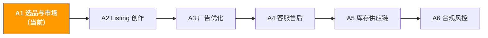

# A1. 选品与市场洞察 | Product Research & Market Insights

> **路径**: Path A: 运营人 · **模块**: A1
> **最后更新**: 2026-03-12
> **难度**: 入门
> **预计时间**: 每天 30 分钟，1-2 周
---

[Hub 首页](../../README.md) · [Path A 总览](README.md)



---

## 本模块章节导航

1. [选品方法论](#1-选品方法论ai-之前你需要理解的基础) · 2. [AI 工具全景](#2-ai-工具全景选品阶段用什么) · 3. [Prompt 模板库](#3-prompt-模板库选品专用) · 4. [选品 SOP](#4-选品实战工作流) · 5. [常见陷阱](#5-常见选品陷阱) · 6. [进阶技巧](#6-进阶技巧) · 7. [学习资源](#7-学习资源) · 8. [ OpenClaw 自动化](#8-用-openclaw-自动化选品流程) · 9. [完成标志](#9-完成标志)


## 本模块你将学会

用 AI 工具把需要几天的选品调研压缩到几小时。从市场趋势分析到竞品痛点提取，建立一套可复用的 AI 辅助选品工作流。

完成本模块后，你将能够：
- 用 ChatGPT/Claude 批量分析竞品 Review，10 分钟提取 50+ 条差评的核心痛点
- 用 AI 做市场可行性评估，替代过去需要半天的手动调研
- 用关键词聚类发现竞品没覆盖到的蓝海需求
- 建立一套从"发现趋势"到"Go/No-Go 决策"的完整 SOP

---

## 1. 选品方法论：AI 之前你需要理解的基础

> **相关阅读**: [AI 应用全景评估](../0-foundations/ai-landscape.md) AI 在选品环节的成熟度评估 · [D4 Walmart AI 指南](../d-platforms/d4-walmart-ai-guide.md) Walmart 品类机会分析和竞争程度评估详见 D4。 · [E4 Pinterest AI 指南](../e-social-media/e4-pinterest-ai-guide.md) Pinterest 趋势数据可辅助选品方向验证，详见 E4。

### 1.1 选品的第一性原理

选品的本质是在"需求"和"供给"之间找到不对称 需求大但供给不足（或供给质量差）的品类就是机会。

AI 不能替你做决策，但它能把信息收集和分析的效率提升 10 倍。在用 AI 之前，你需要理解：

- **需求信号**：搜索量、搜索趋势、Review 数量增长速度
- **供给信号**：卖家数量、头部集中度、新品进入速度
- **利润信号**：售价、FBA 费用、采购成本、广告成本
- **风险信号**：季节性、合规要求、专利壁垒、退货率

### 1.2 选品决策框架

```
市场机会 = (需求强度 × 利润空间) / (竞争强度 × 风险系数)
```

每个变量都可以用 AI 辅助量化。下面逐一展开。

### 1.3 AI 在选品中的角色定位

AI 擅长的：
- **信息压缩**：把 100 条 Review 压缩成 5 个核心痛点
- **模式识别**：从关键词列表中发现人眼容易忽略的需求聚类
- **框架化分析**：按固定维度做结构化评估，避免遗漏
- **多语言处理**：分析日文/德文 Review 不再需要逐条翻译

AI 不擅长的：
- **实时数据**：AI 不知道当前的 BSR 排名和搜索量（需要工具提供）
- **供应链判断**：工厂能力、品控水平需要实地验证
- **合规细节**：具体的认证要求需要查官方文档（参考 [A6 合规模块](a6-compliance.md)）
- **创造性选品**：真正的蓝海品类往往来自跨界灵感，不是数据分析

> **核心原则**：用工具获取数据，用 AI 做分析，用人做决策。三者缺一不可。

---

## 2. AI 工具全景：选品阶段用什么

### 2.1 付费工具深度评测

| 工具 | 价格 | 核心能力 | 适合谁 | 数据准确度 | AI 功能 |
|------|------|----------|--------|-----------|---------|
| [Helium 10](https://www.helium10.com/) | $29-229/月 | Black Box 选品、Cerebro 反查词、Xray 插件 | 进阶卖家，需要深度关键词数据 | 高（child ASIN 级别估算） | Listing Builder AI、AI Review Insights |
| [Jungle Scout](https://www.junglescout.com/) | $29-84/月 | Product Database、Opportunity Finder、Supplier Database | 新手卖家，界面友好 | 中高 | AI Assist（自然语言查询） |
| [SellerSprite](https://www.sellersprite.com/) | $0-99/月 | 多站点数据、关键词挖掘、市场分析 | 中国卖家，性价比高 | 中 | 基础 AI 功能 |
| [Keepa](https://keepa.com/) | $19/月 | 价格历史、BSR 追踪、库存监控 | 所有卖家（必备补充工具） | 极高（直接追踪） | 无 |
| [SmartScout](https://smartscout.com/) | $29-97/月 | 品牌分析、子类目发现、卖家地图 | 批发/品牌卖家 | 高 | AI 品牌匹配 |

**工具选择建议：**

**预算有限（<$50/月）**：Jungle Scout 入门版 + Keepa + ChatGPT
- Jungle Scout 的 Product Database 足够做初步筛选
- Keepa 的价格历史和 BSR 追踪是不可替代的
- ChatGPT 免费版就能做 Review 分析和市场评估

**认真做（$100-200/月）**：Helium 10 Platinum + Keepa
- Helium 10 的 Cerebro（反查竞品关键词）和 Black Box（选品筛选器）是行业标杆
- 配合 Keepa 做历史数据验证，避免被短期数据误导

**多站点运营**：SellerSprite + Helium 10
- SellerSprite 对日本站和欧洲站的数据覆盖比 Helium 10 更好
- 两者互补使用，SellerSprite 做多站点初筛，Helium 10 做深度分析

> **关键洞察**：付费工具提供数据，AI（ChatGPT/Claude）提供分析。两者结合效果最好 用 Helium 10 导出数据，用 ChatGPT 做归因分析。单独用任何一个都不够。

### 2.2 免费工具组合

| 工具 | 用途 | 链接 |
|------|------|------|
| ChatGPT / Claude | Review 分析、市场评估、关键词聚类、竞品对比 | [chat.openai.com](https://chat.openai.com/) / [claude.ai](https://claude.ai/) |
| Google Trends | 验证品类搜索趋势和季节性 | [trends.google.com](https://trends.google.com/) |
| Perplexity | 带引用的市场调研（直接问市场问题） | [perplexity.ai](https://www.perplexity.ai/) |
| Google Gemini | 上传竞品截图做多模态分析 | [gemini.google.com](https://gemini.google.com/) |
| Amazon Best Sellers | 直接看品类热销排名 | [amazon.com/bestsellers](https://www.amazon.com/bestsellers) |
| Amazon Movers & Shakers | 24 小时内排名上升最快的产品 | [amazon.com/gp/movers-and-shakers](https://www.amazon.com/gp/movers-and-shakers) |

**免费工具的使用策略：**

1. **Google Trends 验证季节性**：在决定进入一个品类前，先看 12 个月的搜索趋势。如果你在 11 月调研发现某品类搜索量很高，可能只是因为 BFCM 旺季，而非常年需求。
2. **Perplexity 做快速市场调研**：直接问 "What is the market size of portable neck fans on Amazon US in 2025?"，它会给你带引用的回答，比 ChatGPT 的回答更可验证。
3. **Gemini 做多模态分析**：上传竞品的产品图片，让 Gemini 分析产品设计特点、材质、可能的成本结构。这是 ChatGPT 做不到的。
4. **Amazon Movers & Shakers 发现趋势**：每天花 5 分钟浏览，记录连续上升的品类。连续 3 天出现在 Movers & Shakers 的产品值得深入研究。

### 2.3 开源工具与 API

| 工具/API | 用途 | GitHub/链接 |
|----------|------|-------------|
| python-amazon-sp-api | Amazon SP-API Python 封装，获取产品目录、订单、库存数据 | [github.com/saleweaver/python-amazon-sp-api](https://github.com/saleweaver/python-amazon-sp-api) |
| Amazon SP-API 官方文档 | Catalog Items API、Product Pricing API | [developer-docs.amazon.com/sp-api](https://developer-docs.amazon.com/sp-api) |
| BERTopic | 基于 BERT 的主题建模，用于 Review 聚类分析 | [github.com/MaartenGr/BERTopic](https://github.com/MaartenGr/BERTopic) |
| VADER Sentiment | 轻量级情感分析，适合快速 Review 情感打分 | [github.com/cjhutto/vaderSentiment](https://github.com/cjhutto/vaderSentiment) |
| Scrapy | Python 爬虫框架，可用于采集公开产品数据 | [github.com/scrapy/scrapy](https://github.com/scrapy/scrapy) |

**什么时候用开源工具？**

如果你是技术背景的卖家（或团队里有开发），开源工具可以做到付费工具做不到的事：
- **自定义 Review 分析**：用 BERTopic 做主题建模，比 ChatGPT 的分析更系统化，适合 1000+ 条 Review 的大规模分析
- **自动化数据采集**：用 SP-API 定时拉取竞品价格和库存变化，建立自己的数据库
- **情感分析量化**：用 VADER 给每条 Review 打情感分，然后按时间线分析情感趋势

> 更多技术实现细节，参考 [Path B: 技术人](../b-developers/) 的相关模块。

---

## 3. Prompt 模板库（选品专用）

> 完整的标准化模板（含验证状态、贡献者信息、分享链接）存放在 [prompts/product-research.md](../../prompts/product-research.md)。
> 本节提供每个模板的深度解析、常见错误和进阶变体。

### 3.1 竞品 Review 痛点分析

**为什么这个 Prompt 有效：** 它要求 AI 按频率排序并用表格输出，避免了 AI 常见的"泛泛而谈"问题。表格格式强制 AI 给出结构化、可比较的结果。关键设计点：
- "排名前 5" 限制输出数量，避免 AI 列出 20 个不痛不痒的点
- "按提及频率排序" 强制 AI 做量化分析而非主观判断
- "代表性评论原文" 要求 AI 引用证据，减少幻觉
- "哪些最容易通过产品设计解决" 直接导向行动

**常见错误：**
- 只粘贴 10 条差评 → 样本太少，AI 会过度解读个别案例。建议 50-100 条。
- 混合粘贴好评和差评 → AI 会被好评干扰，痛点分析不聚焦。差评和好评分开分析。
- 不指定输出格式 → AI 会写长篇大论，难以对比和行动。表格格式是关键。
- 只分析一个竞品 → 无法区分"品类通病"和"个别产品问题"。至少分析 3 个竞品。

[完整模板 → prompts/product-research.md](../../prompts/product-research.md#模板-1-竞品-review-痛点分析)

**进阶变体：**

**变体 A 多竞品对比分析：**

```
分析以下 3 个竞品的差评，对比它们的痛点差异：
竞品A（[ASIN]）差评：[粘贴]
竞品B（[ASIN]）差评：[粘贴]
竞品C（[ASIN]）差评：[粘贴]

输出：
1. 三个竞品共同的痛点（品类通病）
2. 各自独有的痛点
3. 哪些痛点最容易通过产品设计解决
```

> **为什么用这个变体**：共同痛点 = 品类通病，你的产品必须解决；独有痛点 = 竞品弱点，你的差异化机会。

**变体 B 带情感强度分析：**

```
分析以下差评，除了痛点分类外，还要评估每个痛点的"情感强度"（1-5分，5分=极度不满）。
情感强度高的痛点 = 用户最在意的改进方向。

输出格式：痛点 | 频率 | 情感强度 | 代表性评论 | 改进建议

[在此粘贴差评内容]
```

> **为什么用这个变体**：频率高但情感强度低的痛点（如"包装一般"）优先级低；频率中等但情感强度极高的痛点（如"用了一周就坏了"）才是真正的产品机会。

**变体 C 正面评价挖掘（找"必备卖点"）：**

```
分析以下 5 星好评，提取用户最频繁提到的满意点。
这些满意点 = 品类的"必备卖点"，你的产品必须具备。

输出：
1. 排名前 5 的满意点（按提及频率排序）
2. 每个满意点的用户原话
3. 如果你的产品缺少这些卖点，用户会怎么反应

[在此粘贴 5 星好评]
```

> **为什么用这个变体**：差评告诉你"不能有什么"，好评告诉你"必须有什么"。两者结合才是完整的产品定义。

**变体 D 时间线趋势分析：**

```
以下差评按时间排序（最新在前）。请分析：
1. 痛点是否随时间变化（比如早期是质量问题，后期变成功能不足）
2. 最近 3 个月的新增痛点是什么
3. 竞品是否在改进（痛点频率是否下降）

这些信息帮我判断：竞品在进步还是在退步，我现在进入是否还有机会。

[在此粘贴按时间排序的差评]
```

> **为什么用这个变体**：如果竞品的痛点在减少，说明他们在迭代改进，你进入的窗口在关闭。如果痛点在增加或不变，说明竞品不重视用户反馈，机会仍在。

---

### 3.2 市场可行性快速评估

**为什么这个 Prompt 有效：** 5 维度评分框架强制 AI 做全面分析，避免只看到市场好的一面。1-5 分的量化评分让不同产品之间可以直接对比。"进入/谨慎/放弃"的三档建议迫使 AI 给出明确结论。

**常见错误：**
- 不提供具体产品信息 → AI 只能给出泛泛的品类分析。至少提供产品名称和目标市场。
- 完全依赖 AI 的评分 → AI 没有实时数据，评分基于训练数据中的一般认知。必须用工具数据交叉验证。
- 只做一次评估就决策 → 应该先用 AI 做初筛，再用 Helium 10/Jungle Scout 的真实数据做二次验证。

[完整模板 → prompts/product-research.md](../../prompts/product-research.md#模板-2-市场可行性快速评估)

**进阶变体：**

**变体 A 多产品横向对比：**

```
我在考虑以下 3 个产品，请用同一套评估框架做横向对比，告诉我优先做哪个：
产品1：[名称]
产品2：[名称]
产品3：[名称]
目标市场：Amazon US

评估维度（每项 1-5 分）：
1. 市场需求
2. 竞争强度
3. 利润空间
4. 供应链难度
5. 合规风险

输出：对比表格 + 优先级排序 + 排序理由
```

> **为什么用这个变体**：选品不是"这个产品好不好"的问题，而是"在我的资源约束下，哪个产品最值得做"的问题。横向对比比单独评估更有决策价值。

**变体 B 带竞品数据的深度评估：**

```
请对以下产品做深度市场可行性评估：

产品：[名称]
目标市场：Amazon [US/DE/JP]

补充信息（来自 Helium 10/Jungle Scout）：
- 品类 BSR 前 10 的月均销量：[数据]
- 头部卖家的 Review 数量：[数据]
- 平均售价：$[X]
- FBA 费用估算：$[X]
- 品类平均退货率：[X]%

请基于这些真实数据重新评估，而不是基于一般认知。
特别关注：以这些数据为基础，新品进入后 6 个月内能否盈利？
```

> **为什么用这个变体**：给 AI 真实数据，它的分析质量会大幅提升。"基于真实数据重新评估"这句话很关键，它告诉 AI 不要用默认的泛泛回答。

**变体 C 风险专项评估：**

```
我准备进入 [品类名称]，请专门做风险评估：

1. 专利风险：这个品类的产品可能涉及哪些专利？（外观、功能、技术）
2. 合规风险：在 [目标市场] 销售需要哪些认证？（FDA、CE、FCC 等）
3. 季节性风险：这个品类的需求是否有明显的季节波动？
4. 供应链风险：主要供应商集中在哪里？是否有替代方案？
5. 竞争风险：头部卖家是否有品牌壁垒或独家供应链优势？

对每个风险给出：风险等级（高/中/低）、具体说明、规避建议
```

> **为什么用这个变体**：大多数选品失败不是因为"市场不好"，而是因为忽略了某个风险。专项风险评估能帮你在投入资金之前发现潜在的坑。

---

### 3.3 关键词需求聚类

**为什么这个 Prompt 有效：** 关键词列表是"用户在搜什么"的直接证据，但原始关键词太多太杂。AI 的聚类能力可以把 200 个关键词压缩成 5-8 个需求主题，每个主题对应一个产品机会。

**常见错误：**
- 关键词太少（<20 个）→ 聚类结果不可靠，AI 会强行分组
- 关键词太多（>500 个）→ 超出 AI 上下文窗口，建议分批处理
- 混合不同品类的关键词 → 聚类结果会混乱，每次只分析一个品类
- 不包含搜索量数据 → AI 无法判断需求强度，如果有搜索量数据一定要附上

[完整模板 → prompts/product-research.md](../../prompts/product-research.md#模板-3-关键词需求聚类)

**进阶变体：**

**变体 A 带搜索量的加权聚类：**

```
以下是关键词列表及其月搜索量（来自 Helium 10 Cerebro）。
请按用户购买意图聚类，并用搜索量加权计算每个聚类的总需求量。

格式：关键词 | 月搜索量
[粘贴数据]

输出：
1. 聚类名称
2. 包含的关键词
3. 聚类总搜索量（所有关键词搜索量之和）
4. 需求强度排序
5. 对应的产品特性建议
```

> **为什么用这个变体**：没有搜索量的聚类只能告诉你"有哪些需求"，加上搜索量才能告诉你"哪个需求最大"。

**变体 B 竞品关键词差异分析：**

```
以下是两组关键词：
组A：我的竞品排名靠前的关键词 [粘贴]
组B：我的竞品排名靠后或未覆盖的关键词 [粘贴]

请分析：
1. 组B中有哪些高搜索量但竞品未覆盖的关键词？
2. 这些未覆盖的关键词代表什么用户需求？
3. 我的产品如何针对这些需求做差异化？
```

> **为什么用这个变体**：竞品没覆盖的关键词 = 竞品没满足的需求 = 你的差异化机会。

---

### 3.4 趋势预测

**为什么这个 Prompt 有效：** 它要求 AI 综合多个数据源（Google Trends、BSR、社交媒体）做交叉分析，而不是只看单一指标。"上升期/平台期/衰退期"的三档判断迫使 AI 给出明确的趋势方向。

**常见错误：**
- 不提供任何数据 → AI 只能基于一般认知回答，准确度很低
- 只看 Google Trends → 搜索趋势和购买趋势不完全一致，需要 BSR 数据交叉验证
- 忽略社交媒体信号 → TikTok/Instagram 上的爆款往往领先 Amazon 搜索 2-3 个月

```
你是一个电商趋势分析师。基于以下信息，预测这个品类未来 6 个月的趋势：

- 品类名称：[名称]
- 过去 12 个月的 Google Trends 数据：[粘贴或描述趋势走向]
- 当前 Amazon BSR 前 10 的 Review 增长速度：[数据]
- 相关社交媒体话题热度：[TikTok/Instagram 趋势描述]

请分析：
1. 这个品类是上升期、平台期还是衰退期？依据是什么？
2. 有哪些外部因素可能影响趋势（季节、政策、技术变化）？
3. 如果现在进入，6 个月后的竞争格局会怎样？
4. 建议的进入时机和策略
```

**进阶变体 多品类趋势对比：**

```
我在考虑以下 3 个品类，请对比它们的趋势走向：
品类A：[名称] Google Trends: [描述]
品类B：[名称] Google Trends: [描述]
品类C：[名称] Google Trends: [描述]

哪个品类目前处于最佳进入窗口？为什么？
```

---

### 3.5 供应商评估

**为什么这个 Prompt 有效：** 它把供应商评估从"感觉哪个好"变成了结构化的多维度对比。AI 可以帮你发现你可能忽略的风险点（比如 MOQ 太高导致资金压力、交期太长影响旺季备货）。

**常见错误：**
- 只比价格 → 最便宜的供应商往往品控最差，综合成本反而最高
- 不考虑运费和关税 → 到岸成本才是真实成本
- 只联系一家供应商 → 至少联系 3-5 家，才能了解市场价格区间

```
我找到了以下 3 个 1688/Alibaba 供应商，请帮我做对比评估：

供应商A：[公司名、产品、价格、MOQ、交期]
供应商B：[公司名、产品、价格、MOQ、交期]
供应商C：[公司名、产品、价格、MOQ、交期]

评估维度：
1. 价格竞争力（含运费、关税估算到 Amazon [US/DE/JP] 仓库）
2. 品控能力（从产品描述、资质、工厂规模推断）
3. 定制化能力（能否做 OEM/ODM、最小定制量）
4. 风险评估（单一供应商风险、交期风险、品质风险）
5. 谈判策略建议（基于以上分析，如何谈到更好的条件）

输出推荐排序和详细理由。
```

---

### 3.6 利润计算器

**为什么这个 Prompt 有效：** 它把所有成本项列全了（很多新手会忘记头程物流、广告成本、退货损耗），并且要求 AI 计算盈亏平衡点，这是决定"做不做"的关键数字。

**常见错误：**
- 忘记算广告成本 → 新品期广告成本可能占售价的 20-30%
- 忘记算退货损耗 → 某些品类退货率高达 15-20%
- 用人民币算利润 → 汇率波动会影响利润，建议用目标市场货币计算
- 不算盈亏平衡点 → 知道"每单赚多少"不够，还要知道"每天卖多少才不亏"

```
帮我计算以下产品在 Amazon [US/DE/JP] 的利润：

- 采购成本：¥[X]/件
- 产品重量：[X]kg，尺寸：[X]×[X]×[X]cm
- 目标售价：$[X]
- 预计日均销量：[X]件
- 广告预算：$[X]/天
- 预计退货率：[X]%

请计算：
1. FBA 费用（仓储 + 配送）
2. Amazon 佣金（品类佣金率）
3. 头程物流费用（海运和空运两种方案）
4. 广告成本（按 ACOS [X]% 估算）
5. 退货损耗
6. 单件利润和利润率
7. 月度利润和 ROI
8. 盈亏平衡点（需要多少日均销量才能盈利）

注意：请用当前汇率换算，并标注你使用的汇率。
```

**进阶变体 多价格点敏感性分析：**

```
基于上面的成本结构，请做价格敏感性分析：
- 售价 $[X-5]、$[X]、$[X+5] 三个价格点
- 日均销量 [X-10]、[X]、[X+10] 三个销量水平

输出 3×3 的利润矩阵，帮我找到最优的价格-销量组合。
```

---

### 3.7 品类机会发现

**为什么需要这个 Prompt：** 前面的模板都是"我已经有了一个产品想法，帮我评估"。但选品的第一步是"发现机会"。这个 Prompt 帮你从零开始找到值得研究的品类。

```
你是一个跨境电商选品顾问。请帮我发现 Amazon [US/DE/JP] 上的品类机会。

我的条件：
- 启动资金：¥[X]万
- 经验水平：[新手/有经验/资深]
- 偏好品类：[有偏好就写，没有就写"不限"]
- 风险偏好：[保守/中等/激进]

请推荐 5 个品类机会，每个包含：
1. 品类名称和简要描述
2. 为什么现在是好时机
3. 预估的月销量和利润空间
4. 主要风险和应对策略
5. 需要的启动资金估算
6. 推荐的进入策略（差异化方向）

注意：
- 不要推荐已经红海的品类（如手机壳、数据线）
- 优先推荐有差异化空间的品类
- 考虑我的资金和经验限制
```

> **重要提醒**：AI 推荐的品类只是起点，不是结论。每个推荐都需要用 Helium 10/Jungle Scout 的真实数据验证。AI 可能推荐已经过时的机会。

---

## 4. 选品实战工作流

### 4.1 完整选品 SOP（7 步法）

这套 SOP 把传统需要 1-2 周的选品流程压缩到 12 小时左右。每一步都标注了使用的工具和 Prompt。

```

Step 1: 趋势发现（1小时）
工具: Google Trends + Amazon Movers & Shakers
AI: 趋势预测 Prompt（3.4）
输出: 5-10 个值得深入研究的品类

Step 2: 品类筛选（2小时）
工具: Helium 10 Black Box / Jungle Scout Product DB
筛选: 月销量 >300, Review <500, 售价 $15-50
AI: 市场可行性评估 Prompt（3.2）
输出: 3-5 个通过初筛的品类

Step 3: 竞品深度分析（3小时）
工具: Helium 10 Xray + Keepa
数据: 选 5-10 个竞品，收集 Review（50-100条/竞品）
AI: Review 痛点分析（3.1）+ 正面评价挖掘（3.1 变体C）
输出: 品类痛点地图 + 必备卖点清单

Step 4: 关键词研究（2小时）
工具: Helium 10 Cerebro / Jungle Scout Keyword Scout
AI: 关键词需求聚类 Prompt（3.3）
输出: 需求聚类图 + 蓝海关键词列表

Step 5: 利润测算（1小时）
工具: Amazon FBA Revenue Calculator
AI: 利润计算器 Prompt（3.6）
输出: 利润模型 + 盈亏平衡点

Step 6: 供应商初筛（2小时）
工具: 1688 / Alibaba
AI: 供应商评估 Prompt（3.5）
输出: 供应商对比表 + 谈判策略

Step 7: 决策输出（1小时）
AI: 汇总以上所有分析，输出选品报告
Prompt: "基于以上所有分析，给出最终的 Go/No-Go 建议，
并列出进入后前 3 个月的行动计划"
输出: Go/No-Go 决策 + 行动计划

```

### 4.2 每一步的详细操作指南

**Step 1: 趋势发现**

目标：从海量品类中找到 5-10 个值得深入研究的方向。

操作流程：
1. 打开 [Google Trends](https://trends.google.com/)，搜索你感兴趣的品类关键词，看 12 个月趋势
2. 浏览 [Amazon Movers & Shakers](https://www.amazon.com/gp/movers-and-shakers)，记录连续上升的品类
3. 刷 TikTok/Instagram，关注 #amazonfinds #tiktokmademebuyit 等标签
4. 用趋势预测 Prompt（3.4）让 AI 帮你评估每个品类的趋势方向

判断标准：
- Google Trends 过去 6 个月持续上升
- Amazon Movers & Shakers 连续 3 天出现
- 社交媒体有相关话题但 Amazon 上竞品不多
- Google Trends 呈下降趋势
- 只在特定月份有搜索量（强季节性）

**Step 2: 品类筛选**

目标：用数据工具验证趋势发现，筛选出真正有机会的品类。

Helium 10 Black Box 筛选条件（推荐起点）：
- 月销量：300-10000（太少没市场，太多竞争激烈）
- Review 数量：<500（Review 太多说明头部已经固化）
- 售价：$15-50（太低利润薄，太高门槛高）
- 评分：3.5-4.3（评分低说明品类有改进空间）

> 这些只是起点参数，根据你的资金和经验调整。资金充足可以放宽售价上限，经验丰富可以挑战 Review 更多的品类。
---
**Step 3: 竞品深度分析**

目标：理解品类的痛点地图和必备卖点。

操作流程：
1. 选择 BSR 前 5-10 的竞品
2. 用 Helium 10 Review Insights 或手动收集每个竞品的 50-100 条差评
3. 用 Review 痛点分析 Prompt（3.1）分析差评
4. 用正面评价挖掘 Prompt（3.1 变体 C）分析好评
5. 用 Keepa 查看竞品的价格历史和 BSR 走势

输出模板：
```
品类痛点地图：
| 痛点 | 频率 | 情感强度 | 竞品A | 竞品B | 竞品C | 改进难度 |
|------|------|---------|-------|-------|-------|---------|
| ... | ... | ... | / | / | / | 高/中/低 |

必备卖点清单：
| 卖点 | 用户提及频率 | 是否为品类标配 |
|------|------------|--------------|
| ... | ... | 是/否 |
```

**Step 4-7** 按照 SOP 图中的工具和 Prompt 执行即可。关键是每一步的输出都要保存，最后汇总成完整的选品报告。

### 4.3 选品报告模板

最终的选品报告应该包含以下内容（可以让 AI 帮你汇总）：

```
# 选品报告：[产品名称]
日期：[日期]

## 1. 市场概况
- 品类规模、增长趋势、季节性
- 数据来源：Google Trends、Helium 10

## 2. 竞争分析
- 头部竞品列表（ASIN、价格、Review 数、BSR）
- 痛点地图（来自 Step 3）
- 必备卖点清单

## 3. 需求分析
- 关键词聚类结果（来自 Step 4）
- 未被满足的需求

## 4. 利润模型
- 成本结构（采购、物流、FBA、广告）
- 利润率和盈亏平衡点
- 价格敏感性分析

## 5. 供应链
- 供应商对比
- 推荐供应商和谈判策略

## 6. 风险评估
- 专利、合规、季节性、竞争风险
- 风险应对策略

## 7. 决策
- Go / No-Go
- 如果 Go：前 3 个月行动计划
```

---

## 5. 常见选品陷阱

### 5.1 数据相关陷阱

| 陷阱 | 表现 | 如何避免 |
|------|------|----------|
| **数据幻觉** | AI 编造不存在的市场数据（如"这个品类月搜索量 50 万"） | 所有数据用工具交叉验证，AI 只做分析不做数据源 |
| **幸存者偏差** | 只看 BSR 前 10 的成功案例，忽略大量失败的卖家 | 同时分析 BSR 下降的产品，了解失败原因 |
| **季节性陷阱** | 在旺季调研，误判为常年需求 | 用 Google Trends 看 12 个月趋势，用 Keepa 看 BSR 历史 |
| **样本偏差** | 只分析 10 条 Review 就下结论 | 每个竞品至少分析 50 条 Review，覆盖不同时间段 |
| **工具数据偏差** | 不同工具对同一产品的销量估算差异很大 | 用 2-3 个工具交叉验证，取中间值 |

### 5.2 决策相关陷阱

| 陷阱 | 表现 | 如何避免 |
|------|------|----------|
| **确认偏误** | 已经"爱上"一个产品，只找支持的证据 | 刻意寻找反面证据，用风险评估 Prompt（3.2 变体 C） |
| **沉没成本** | 已经花了很多时间调研，不愿意放弃 | 设定明确的 Go/No-Go 标准，达不到就果断放弃 |
| **跟风陷阱** | 看到别人做某个品类赚钱就跟进 | 等你看到别人赚钱的时候，最佳进入窗口可能已经过了 |
| **完美主义** | 等所有数据都完美才行动 | 80% 的信息就足够做决策，剩下 20% 在实践中验证 |

### 5.3 执行相关陷阱

| 陷阱 | 表现 | 如何避免 |
|------|------|----------|
| **专利地雷** | 产品外观或功能有专利保护 | 用 [Google Patents](https://patents.google.com/) 搜索，AI Prompt: "这个产品可能涉及哪些专利" |
| **合规盲区** | 不了解目标市场的认证要求 | 参考 [A6 合规模块](a6-compliance.md)，在选品阶段就评估合规成本 |
| **供应链单点故障** | 只有一个供应商 | 至少准备 2 个备选供应商，避免断供风险 |
| **资金链断裂** | 低估了从选品到盈利的资金需求 | 用利润计算器 Prompt（3.6）算清楚，预留 3 个月的运营资金 |

---

## 6. 进阶技巧

### 6.1 用 AI 做竞品监控

选品不是一次性的工作。选定品类后，你需要持续监控竞品动态。

```
我正在监控以下 3 个竞品（[ASIN 列表]）。
以下是它们最近 1 个月的变化数据：

竞品A：
- 价格变化：$29.99 → $24.99
- Review 数量变化：1200 → 1350
- BSR 变化：#45 → #32

竞品B：[类似数据]
竞品C：[类似数据]

请分析：
1. 每个竞品的策略变化（降价促销？新品推广？）
2. 这些变化对我的产品意味着什么？
3. 我应该如何应对？
```

### 6.2 用 AI 做差异化定位

找到品类机会后，最关键的问题是：你的产品和竞品有什么不同？

```
基于以下竞品分析结果：
- 品类通病：[列出 3-5 个共同痛点]
- 必备卖点：[列出 3-5 个必备功能]
- 未被满足的需求：[列出 2-3 个蓝海需求]

请帮我设计产品差异化策略：
1. 必须解决的痛点（品类通病中最容易解决的 2-3 个）
2. 必须具备的功能（必备卖点清单）
3. 差异化卖点（基于未被满足的需求）
4. 定价策略（基于差异化程度）
5. 一句话卖点（用于 Listing 标题和广告）
```

### 6.3 多站点选品策略

不同站点的选品逻辑有差异：

| 维度 | Amazon US | Amazon DE/EU | Amazon JP |
|------|-----------|-------------|-----------|
| 市场规模 | 最大，竞争最激烈 | 中等，品牌意识强 | 中等，品质要求高 |
| 选品策略 | 差异化为王，避开红海 | 合规先行，认证成本高 | 品质优先，包装细节重要 |
| AI 工具覆盖 | 最好（所有工具都支持） | 中等（部分工具数据不全） | 较弱（SellerSprite 相对好） |
| 关键词工具 | Helium 10 Cerebro | Helium 10 + SellerSprite | SellerSprite |
| Review 语言 | 英文（AI 分析最方便） | 多语言（需要 AI 翻译） | 日文（AI 翻译后分析） |

**多站点选品 Prompt：**

```
我想把以下产品从 Amazon US 扩展到 Amazon [DE/JP]：
产品：[名称]
US 站表现：月销量 [X]，售价 $[X]，Review [X] 条

请评估：
1. 目标站点的市场需求（是否有同类产品？搜索量如何？）
2. 竞争格局差异（头部卖家是谁？本土品牌强不强？）
3. 合规要求差异（需要额外的认证吗？）
4. 定价策略（考虑 VAT、物流成本差异）
5. Listing 本地化要点（不只是翻译，还有文化适配）
```

---

## 7. 学习资源

### 7.1 免费课程

| 资源 | 平台 | 时长 | 适合谁 | 链接 |
|------|------|------|--------|------|
| ChatGPT Prompt Engineering for Developers | DeepLearning.AI | 1.5h | 所有人（学会写好 Prompt 是基础） | [deeplearning.ai](https://www.deeplearning.ai/short-courses/chatgpt-prompt-engineering-for-developers/) |
| OpenAI Prompt Engineering Guide | OpenAI | 自学 | 所有人（官方最佳实践） | [platform.openai.com](https://platform.openai.com/docs/guides/prompt-engineering) |
| Kaggle: Pandas Course | Kaggle | 4h | 想用代码分析数据的（配合 Path B） | [kaggle.com/learn/pandas](https://www.kaggle.com/learn/pandas) |
| Amazon Seller University | Amazon | 自学 | 新手卖家（官方教程） | [sellercentral.amazon.com](https://sellercentral.amazon.com/learn) |

### 7.2 YouTube 频道推荐

| 频道 | 内容方向 | 为什么推荐 |
|------|----------|-----------|
| Helium 10 | 工具教程 + 选品实战 | 官方频道，Black Box 和 Cerebro 的最佳教程来源 |
| Jungle Scout | 选品方法论 + 市场分析 | 数据驱动的选品案例，适合新手 |
| Travis Marziani | Amazon FBA 实战 | 真实的选品到上架全流程记录 |
| Tatiana James | 跨境电商入门 | 适合零基础，讲解清晰 |

### 7.3 推荐阅读

| 文章/资源 | 来源 | 核心观点 |
|-----------|------|----------|
| [How to Use AI for Amazon Business](https://www.entrepreneur.com/growing-a-business/how-to-use-ai-to-grow-your-amazon-sales-rankings-and/499421) | Entrepreneur | AI 在选品、Listing、库存预测中的实际应用案例 |
| [The Right Way to Use AI for Amazon](https://goaura.com/blog/the-right-way-to-use-ai-for-your-amazon-business) | GoAura | ChatGPT Plus 的 ROI 分析：$20/月节省 5+ 小时/周 |
| [7 Best Amazon Product Research Tools 2026](https://www.voc.ai/blog/best-amazon-product-research-tools) | VOC.AI | 2026 年工具对比，含 AI 功能评测 |
| [Helium 10 vs Jungle Scout 2026](https://amazonfba.org/blog/tool-comparisons/helium-10-vs-jungle-scout) | AmazonFBA.org | 最详细的工具对比，含多站点支持分析 |

Content rephrased for compliance with licensing restrictions. Sources cited inline.

### 7.4 社区与论坛

| 社区 | 平台 | 特点 |
|------|------|------|
| r/AmazonSeller | Reddit | 英文社区，真实卖家经验分享，适合了解 US 市场 |
| r/FulfillmentByAmazon | Reddit | FBA 专项讨论，物流和运营问题 |
| 知无不言 | 知乎 | 中文跨境电商社区，选品和运营讨论 |
| 创蓝论坛 | 独立站点 | 中国卖家社区，供应链和合规信息丰富 |

---

## 8. 用 OpenClaw 自动化选品流程

### 8.1 场景：AI Agent 自动竞品监控与选品情报

OpenClaw 可以把本模块的手动选品流程变成自动化的 Agent 工作流：

```
你对 OpenClaw 说（通过 WhatsApp/Telegram）：
"每天早上 9 点，帮我监控以下 5 个竞品 ASIN 的价格、BSR 和新 Review，
如果有显著变化，分析原因并发到我的 Slack #product-intel 频道"

OpenClaw 自动执行：
1. [Heartbeat] 每天 9:00 触发
2. [Skill: web-search] 获取竞品最新数据
3. [Skill: memory] 对比昨日数据，检测变化
4. [LLM] 分析变化原因（降价促销？新品冲击？季节性？）
5. [Skill: slack] 发送分析报告到指定频道
```

### 8.2 需要的 Skills 和 MCP Server

| 组件 | 用途 | 安装方式 | 链接 |
|------|------|---------|------|
| **web-search** Skill | 搜索竞品数据和市场信息 | 内置 Skill | [OpenClaw Docs](https://docs.openclaw.com/) |
| **memory** Skill | 存储历史数据，对比变化 | 内置 Skill | [OpenClaw Docs](https://docs.openclaw.com/) |
| **slack** Skill | 发送告警和报告 | `clawhub install slack` | [ClawHub](https://clawhub.ai/) |
| **google-sheets** Skill | 读写选品数据表 | `clawhub install google-sheets` | [ClawHub](https://clawhub.ai/) |
| **filesystem MCP** | 读取本地 CSV/Excel 报告 | MCP Server 配置 | [MCP Filesystem](https://github.com/modelcontextprotocol/servers/tree/main/src/filesystem) |
| **fetch MCP** | 调用外部 API | MCP Server 配置 | [MCP Fetch](https://github.com/modelcontextprotocol/servers/tree/main/src/fetch) |

### 8.3 相关资源

| 资源 | 说明 | 链接 |
|------|------|------|
| OpenClaw 官方文档 | 安装和配置指南 | [docs.openclaw.com](https://docs.openclaw.com/) |
| ClawHub Skills 市场 | 搜索和安装 Agent Skills | [clawhub.ai](https://clawhub.ai/) |
| OpenClaw MCP 集成指南 | 如何连接 MCP Server | [Build Skill with MCP](https://rebeccamdeprey.com/blog/build-openclaw-skill-with-mcp) |
| OpenClaw 设置指南 | 10 种配置方案 | [Setup Guide](https://o-mega.ai/articles/openclaw-setup-guide-10-configurations-for-every-use-case-2026) |
| F4 自动化与 Agent | 本 Hub 的 Agent 基础模块 | [F4 模块](../0-foundations/f4-agent-automation.md) |

Content rephrased for compliance with licensing restrictions. Sources cited inline.

---

## 9. 完成标志

- [ ] 用 AI 完成一个完整的选品可行性分析报告（覆盖 7 步法的所有步骤）
- [ ] 至少使用 3 个不同的 Prompt 模板并对比效果
- [ ] 用 Google Trends 验证至少一个品类的季节性
- [ ] 完成一次竞品 Review 痛点分析（≥50 条差评）
- [ ] 用利润计算器 Prompt 完成一次完整的利润测算
- [ ] 输出一份包含 Go/No-Go 决策的选品报告

完成以上所有项目后，你已经掌握了 AI 辅助选品的核心技能。接下来进入 [A2 Listing 与内容创作](a2-listing-optimization.md)，学习如何用 AI 写出高转化的 Listing。

---

## 附录：快速参考卡片

### Prompt 速查表

| 场景 | Prompt 模板 | 所在章节 |
|------|------------|---------|
| 分析竞品差评 | 竞品 Review 痛点分析 | [3.1](#31-竞品-review-痛点分析) |
| 多竞品对比 | 多竞品对比分析（变体 A） | [3.1](#31-竞品-review-痛点分析) |
| 好评挖掘 | 正面评价挖掘（变体 C） | [3.1](#31-竞品-review-痛点分析) |
| 评估产品可行性 | 市场可行性快速评估 | [3.2](#32-市场可行性快速评估) |
| 多产品对比 | 多产品横向对比（变体 A） | [3.2](#32-市场可行性快速评估) |
| 风险评估 | 风险专项评估（变体 C） | [3.2](#32-市场可行性快速评估) |
| 关键词分组 | 关键词需求聚类 | [3.3](#33-关键词需求聚类) |
| 预测品类趋势 | 趋势预测 | [3.4](#34-趋势预测) |
| 评估供应商 | 供应商评估 | [3.5](#35-供应商评估) |
| 计算利润 | 利润计算器 | [3.6](#36-利润计算器) |
| 发现品类机会 | 品类机会发现 | [3.7](#37-品类机会发现) |
| 竞品监控 | 竞品监控 | [6.1](#61-用-ai-做竞品监控) |
| 差异化定位 | 差异化定位 | [6.2](#62-用-ai-做差异化定位) |
| 多站点扩展 | 多站点选品 | [6.3](#63-多站点选品策略) |

### 工具速查表

| 需求 | 推荐工具 | 免费替代 |
|------|---------|---------|
| 选品筛选 | Helium 10 Black Box | Amazon Best Sellers + AI |
| 关键词反查 | Helium 10 Cerebro | |
| 价格/BSR 历史 | Keepa | |
| Review 分析 | ChatGPT / Claude | ChatGPT 免费版 |
| 趋势验证 | Google Trends | Google Trends（本身免费） |
| 市场调研 | Perplexity | Perplexity（本身免费） |
| 多站点数据 | SellerSprite | |
| 供应商搜索 | 1688 / Alibaba | 1688（本身免费） |

---
> [Hub 首页](../../README.md) · [Path A 总览](README.md)
>
> **Path A**: [A1 选品](a1-product-research.md) · [A2 Listing](a2-listing-optimization.md) · [A3 广告](a3-advertising.md) · [A4 客服](a4-customer-service.md) · [A5 库存](a5-inventory.md) · [A6 合规](a6-compliance.md)
>
> **快速跳转**: [Path 0 基础](../0-foundations/) · [Path B 技术](../b-developers/) · [Path C 管理](../c-managers/) · [Path D 多平台](../d-platforms/) · [Path E 社交媒体](../e-social-media/)

<!-- nav:prev-next -->

---

[Path 总览](README.md) | [A2 Listing >](a2-listing-optimization.md)
