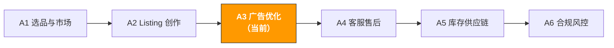

# A3. 广告优化 | Advertising Optimization

> **路径**: Path A: 运营人 · **模块**: A3
> **最后更新**: 2026-03-12
> **难度**: 进阶
> **预计时间**: 每天 30 分钟，1-2 周
---

[Hub 首页](../../README.md) · [Path A 总览](README.md)



---

## 本模块章节导航

1. [广告方法论](#1-广告方法论ai-之前你需要理解的基础) · 2. [AI 工具全景](#2-ai-工具全景广告阶段用什么) · 3. [Prompt 模板库](#3-prompt-模板库广告专用) · 4. [广告实战工作流](#4-广告实战工作流) · 5. [常见陷阱](#5-常见广告陷阱) · 6. [进阶技巧](#6-进阶技巧) · 7. [学习资源](#7-学习资源) · 8. [ OpenClaw 自动化](#8-用-openclaw-自动化广告优化) · 9. [完成标志](#9-完成标志)


## 本模块你将学会

用 AI 工具把需要数小时的广告数据分析压缩到 30 分钟。从搜索词报告分析到出价优化，建立一套可复用的 AI 辅助广告管理工作流。

完成本模块后，你将能够：
- 用 ChatGPT/Claude 分析搜索词报告，10 分钟找出高 ROAS 关键词和需要否定的浪费词
- 用 AI 生成 Sponsored Brands 广告文案的多种变体，做 A/B 测试
- 用 AI 制定新品 30 天广告启动计划，从 Auto 到 Manual 的关键词收割流程
- 理解 ACOS/TACOS/ROAS 的关系，用 AI 做广告预算分配优化
- 用 AI 诊断广告效果下滑的根因，快速定位问题
- 了解 2026 年新趋势：Amazon Ads MCP Server 如何让 AI Agent 直接管理广告

---

## 1. 广告方法论：AI 之前你需要理解的基础

> **相关阅读**: [D4 Walmart AI 指南](../d-platforms/d4-walmart-ai-guide.md) Walmart Connect 广告（第一价格竞价）详见 D4 · [E1 Instagram/Facebook AI 指南](../e-social-media/e1-instagram-facebook-ai-guide.md) Meta Advantage+ AI 广告素材生成和优化详见 E1。 · [E7 跨渠道协同](../e-social-media/e7-social-media-cross-channel.md) 跨渠道广告归因和预算分配框架详见 E7。

### 1.1 Amazon 广告的第一性原理

Amazon PPC 广告的本质是"花钱买精准流量，用转化率把流量变成利润"。

Amazon 的 PPC 竞价机制采用第二价格拍卖（Second-Price Auction）：

```
你实际支付的 CPC = 第二高出价 + $0.01
```

这意味着你不需要出最高价，只需要比第二名多 $0.01。但广告排名不只看出价：

```
广告排名 = 出价 × 相关性 × 转化率
```

- **出价**：你愿意为每次点击支付的最高金额
- **相关性**：你的关键词和 Listing 与用户搜索意图的匹配程度
- **转化率**：用户点击广告后实际购买的比例

> **核心洞察**：很多卖家以为"出价越高排名越好"。但如果你的 Listing 转化率高，即使出价比竞品低，广告排名也可能更好。这就是为什么广告优化不能脱离 Listing 优化 参考 [A2 Listing 模块](a2-listing-optimization.md)。

### 1.2 ACOS / TACOS / ROAS 的关系和计算

这三个指标是广告优化的核心语言，必须理解透彻：

```
ACOS (Advertising Cost of Sales) = 广告花费 / 广告销售额 × 100%
```
- 例：花了 $100 广告费，带来 $400 广告销售额 → ACOS = 25%
- 含义：每赚 $1 广告销售额，花了 $0.25 的广告费
- 目标：ACOS < 产品利润率（否则广告在亏钱）

```
TACOS (Total Advertising Cost of Sales) = 广告花费 / 总销售额 × 100%
```
- 例：花了 $100 广告费，总销售额（广告 + 自然）$1000 → TACOS = 10%
- 含义：广告花费占总收入的比例
- 目标：TACOS 持续下降 = 自然流量在增长，广告依赖在减少

```
ROAS (Return on Ad Spend) = 广告销售额 / 广告花费
```
- 例：花了 $100 广告费，带来 $400 广告销售额 → ROAS = 4.0
- 含义：每花 $1 广告费，赚回 $4 销售额
- 关系：ROAS = 1 / ACOS（ACOS 25% = ROAS 4.0）

**为什么 TACOS 比 ACOS 更重要？**

ACOS 只看广告本身的效率，但广告的真正目的不只是直接销售 还有推动关键词的自然排名（organic rank flywheel）：

```
广告带来销量 → 销量提升关键词自然排名 → 自然流量增加 → 总销售额增长 → TACOS 下降
```

一个 ACOS 40% 的广告看起来"亏钱"，但如果它推动了自然排名上升，导致 TACOS 从 15% 降到 10%，那这个广告其实是赚钱的。AI 可以帮你监控这个飞轮效应。

### 1.3 广告类型全景

| 类型 | Sponsored Products (SP) | Sponsored Brands (SB) | Sponsored Display (SD) | DSP |
|------|------------------------|----------------------|----------------------|-----|
| **展示位置** | 搜索结果页、产品详情页 | 搜索结果顶部横幅 | 产品详情页、站外 | 站内外全渠道 |
| **竞价方式** | CPC（按点击付费） | CPC | CPC / vCPM | CPM（按展示付费） |
| **最低预算** | 无最低 | $1/天 | $1/天 | $10,000+/月（通常） |
| **适合阶段** | 所有阶段（必备） | 品牌注册后 | 品牌注册后 | 大卖家/品牌 |
| **核心目标** | 直接转化、关键词排名 | 品牌曝光、品类占位 | 再营销、竞品拦截 | 全漏斗营销 |
| **AI 优化空间** | 搜索词分析、出价优化 | 文案 A/B 测试 | 受众分析 | 预算分配 |

**新手应该从哪种开始？**

```
SP Auto → SP Manual → SB → SD
```

1. **SP Auto**（第 1 周）：让 Amazon 自动匹配关键词，收集数据
2. **SP Manual**（第 2 周起）：从 Auto 中提取高转化关键词，创建手动广告
3. **SB**（品牌注册后）：用品牌广告占据搜索结果顶部
4. **SD**（有一定销量后）：再营销和竞品拦截

### 1.4 AI 在广告中的角色定位

AI 擅长的：
- **搜索词分析**：从几千行搜索词报告中找出高 ROAS 词和浪费词
- **出价优化建议**：基于历史数据建议每个关键词的最优出价
- **否定词发现**：找出花钱但不转化的无关搜索词
- **文案变体生成**：为 SB 广告生成多种 Headline 做 A/B 测试
- **预算分配建议**：基于各广告组的 ROAS 建议预算重新分配
- **趋势分析**：对比不同时间段的广告表现，发现趋势变化

AI 不擅长的：
- **实时竞价**：需要专业工具（Helium 10 Adtomic、Perpetua）做自动化竞价
- **创意设计**：SB Video 和 SD 的视觉创意需要设计工具
- **品牌策略**：广告的整体策略（防守 vs 进攻、品牌 vs 效果）需要人做决策
- **预算决策**：总预算多少取决于业务目标和现金流，不是 AI 能决定的

> **核心原则**：用工具获取广告数据，用 AI 做分析和建议，用人做策略决策和执行。AI 是你的广告分析师，不是广告经理。

---

## 2. AI 工具全景：广告阶段用什么

### 2.1 付费工具深度评测

| 工具 | 价格 | 核心能力 | 适合谁 | AI 功能 |
|------|------|----------|--------|---------|
| [Helium 10 Adtomic](https://h10-wp.com/helium-10-adtomic/) | $229/月 (Platinum 含) | AI 驱动的竞价自动化，规则引擎 + AI 建议 | 进阶卖家，需要自动化竞价管理 | AI 出价建议、自动否定词、预算优化 |
| Jungle Scout PPC Manager | $49-84/月 | 简化版广告管理，关键词建议 | 新手卖家，界面友好 | 基础 AI 关键词建议 |
| Perpetua (by Ascential) | 按广告花费 % 收费 | 企业级 AI 广告优化，自动竞价+预算分配 | 月广告花费 $5000+ 的卖家 | 全自动 AI 竞价、目标 ACOS 优化 |
| Pacvue | 企业定价 | 多平台广告管理（Amazon+Walmart+Instacart） | 大卖家/代理商 | AI 预算分配、跨平台优化 |
| [DeepBI](https://www.deepbi.com/blog/13/) | 按广告花费 % 收费 | AI 广告管理，新手友好，每小时调整出价 | 中小卖家，想要全托管 | 全自动 AI 管理，案例：ACOS 从 55% 降到 43% |
| Quartile | 按广告花费 % 收费 | AI 驱动的全渠道广告优化 | 多渠道卖家 | AI 自动创建广告组、关键词发现 |

**工具选择建议：**

**预算有限（<$50/月）**：Amazon Advertising Console + ChatGPT/Claude
- Amazon 官方广告后台是免费的，功能足够中小卖家使用
- 每周下载搜索词报告，用 ChatGPT 分析（见第 3 节 Prompt 模板）
- 手动调整出价和否定词

**认真做（$100-300/月）**：Helium 10 Adtomic
- Adtomic 的 AI 竞价自动化可以节省大量时间
- 规则引擎让你设定"ACOS > 40% 自动降低出价"等规则
- 配合 ChatGPT 做深度搜索词分析

**月广告花费 $5000+**：Perpetua 或 DeepBI
- 广告花费大了之后，手动管理效率太低
- Perpetua 的目标 ACOS 优化适合有明确利润目标的卖家
- DeepBI 的全托管模式适合不想花时间管理广告的卖家

> **关键洞察**：广告工具的核心价值是自动化执行，不是策略制定。工具能帮你自动调出价、自动加否定词，但"应该把预算集中在哪些关键词上"这个策略问题，还是需要你（或 AI 分析）来决定。最佳组合：用 Adtomic/Perpetua 做自动化执行，用 ChatGPT/Claude 做策略分析。

Content rephrased for compliance with licensing restrictions. Sources: [deepbi.com AI PPC](https://www.deepbi.com/blog/13/), [aijourn.com PPC optimization](https://aijourn.com/amazon-ppc-optimization-tool/), [algofy.com AI tools 2026](https://www.algofy.com/post/best-ai-tools-for-amazon-sellers-in-2026)

### 2.2 免费工具组合

| 工具 | 用途 | 链接 |
|------|------|------|
| ChatGPT / Claude | 搜索词报告分析、否定词发现、文案生成、预算分配建议 | [chat.openai.com](https://chat.openai.com/) / [claude.ai](https://claude.ai/) |
| Amazon Advertising Console | 官方免费广告管理工具，创建/管理所有广告类型 | [advertising.amazon.com](https://advertising.amazon.com/) |
| Amazon Brand Analytics | 搜索词排名数据、市场篮子分析、人群画像 | Seller Central → Brand Analytics |
| Amazon Attribution | 站外流量追踪（Google Ads、社交媒体等） | [advertising.amazon.com/attribution](https://advertising.amazon.com/) |

**免费工具的使用策略：**

1. **Amazon Advertising Console 是基础**：所有广告操作都在这里完成。即使用了第三方工具，也需要理解官方后台的功能。
2. **搜索词报告是金矿**：每周下载搜索词报告（Advertising → Reports → Search Term Report），这是广告优化最重要的数据源。用 ChatGPT 分析比手动看快 10 倍。
3. **Brand Analytics 做竞品情报**：搜索词排名数据告诉你竞品在哪些关键词上有广告，市场篮子分析告诉你用户还买了什么。
4. **Amazon Attribution 追踪站外流量**：如果你在 Google Ads 或社交媒体上投放广告引流到 Amazon，Attribution 可以追踪转化效果。

### 2.3 开源工具与 API

| 工具/API | 用途 | GitHub/链接 |
|----------|------|-------------|
| Amazon Advertising API | 通过 API 批量管理广告（创建、调整出价、下载报告） | [advertising.amazon.com/API](https://advertising.amazon.com/API/) |
| python-amazon-sp-api | SP-API Python 封装，含广告相关接口 | [github.com/saleweaver/python-amazon-sp-api](https://github.com/saleweaver/python-amazon-sp-api) |
| pandas + matplotlib | 搜索词报告数据分析和可视化 | Python 标准数据分析栈 |

**什么时候用开源工具？**

如果你管理 10+ 个广告活动或需要批量操作，API 可以：
- **批量调整出价**：根据 AI 分析结果，一次性调整几百个关键词的出价
- **自动下载报告**：定时拉取搜索词报告，自动喂给 AI 分析
- **自定义仪表盘**：用 pandas + matplotlib 构建自己的广告分析仪表盘

> 更多技术实现细节，参考 [Path B: 技术人](../b-developers/) 的相关模块。

---

## 3. Prompt 模板库（广告专用）

> 本节提供每个模板的深度解析、常见错误和进阶变体。

### 3.1 搜索词报告分析

**为什么这个 Prompt 有效：** 它要求 AI 按 ROAS 排序并用表格输出，避免了 AI 常见的"泛泛而谈"问题。分成 5 个明确的输出类别（高转化、高浪费、高展示低点击、否定词、预算分配），每个类别都有具体的操作建议。关键设计点：
- "按 ROAS 排序" 强制 AI 做量化排序而非主观判断
- "标注每个关键词的建议操作和优先级" 直接导向行动
- "精确否定 vs 短语否定" 区分否定类型，避免过度否定

**常见错误：**
- 数据量太少（<7 天）→ 广告数据有归因延迟（7-14 天），至少用 30 天数据分析
- 不区分匹配类型 → Broad、Phrase、Exact 的搜索词表现差异很大，应该分开分析
- 忽略展示量高但零点击的词 → 这些词说明你的广告展示了但没人点击，可能是 Listing 主图或价格问题
- 只看 ACOS 不看 TACOS → 一个 ACOS 高的关键词可能在推动自然排名，需要看整体效果


**进阶变体：**

**变体 A 按匹配类型分层分析：**

```
以下是我的搜索词报告数据（过去 30 天），请按匹配类型分层分析：

Broad Match 搜索词：[粘贴数据]
Phrase Match 搜索词：[粘贴数据]
Exact Match 搜索词：[粘贴数据]

请分别分析每种匹配类型的表现：
1. 每种匹配类型的整体 ACOS 和 ROAS
2. Broad Match 中发现的新关键词机会（应该提升为 Exact Match）
3. Phrase Match 中需要否定的无关词
4. Exact Match 中出价需要调整的关键词
5. 三种匹配类型的预算分配建议
```

> **为什么用这个变体**：Broad Match 是"关键词发现器"，Exact Match 是"利润收割器"。分层分析能帮你建立从 Broad → Phrase → Exact 的关键词收割流程。

**变体 B 时间趋势分析（周度/月度对比）：**

```
以下是我的广告数据，分为两个时间段：
上月数据：[粘贴]
本月数据：[粘贴]

请对比分析：
1. 整体 ACOS/ROAS 变化趋势及原因分析
2. 哪些关键词的表现在改善？哪些在恶化？
3. CPC 变化趋势（竞争是否在加剧？）
4. 转化率变化趋势（Listing 是否需要优化？）
5. 基于趋势，下个月的优化重点建议
```

> **为什么用这个变体**：单次分析只能看到"现在怎么样"，趋势分析能看到"在变好还是变差"。CPC 持续上升可能意味着竞争加剧，需要调整策略。

**变体 C 竞品 ASIN 定向分析：**

```
以下是我的 Product Targeting（ASIN 定向）广告数据：
[粘贴数据：目标 ASIN、展示量、点击量、花费、订单数]

请分析：
1. 哪些竞品 ASIN 的定向广告 ROAS 最高？（我应该加大投放）
2. 哪些竞品 ASIN 花钱但不转化？（我应该停止定向）
3. 基于高转化的竞品特征，推荐新的定向 ASIN
4. 竞品定向 vs 关键词定向的整体效率对比
```

> **为什么用这个变体**：ASIN 定向广告让你的产品出现在竞品的详情页上。分析哪些竞品的流量最容易被你转化，就知道你的产品对哪类竞品最有竞争力。

---

### 3.2 广告文案 A/B 测试

**为什么这个 Prompt 有效：** 5 种风格强制 AI 做差异化，避免生成 5 个看起来差不多的 Headline。每种风格对应不同的用户心理，让你测试哪种风格最能打动你的目标客户。

**常见错误：**
- Headline 超过 50 字符 → Sponsored Brands Headline 限制 50 字符，超出会被截断
- 不标注目标受众 → 不同受众对不同风格的反应不同，测试前要明确目标
- 同时测试太多变体 → 每次只测 2 个变体（A/B），不要同时测 5 个
- 测试时间太短 → 至少运行 2 周，积累足够的点击数据才有统计意义


**进阶变体：**

**变体 A Sponsored Brands Video 脚本：**

```
我的产品是 [产品描述]，核心卖点是 [卖点]。

请为 Sponsored Brands Video 广告生成 3 个不同风格的 15 秒脚本：

脚本1：问题-解决型
- 开头（0-3秒）：展示用户痛点
- 中间（3-10秒）：产品如何解决
- 结尾（10-15秒）：CTA + 核心卖点

脚本2：演示型
- 开头（0-3秒）：产品外观展示
- 中间（3-10秒）：核心功能演示
- 结尾（10-15秒）：规格 + CTA

脚本3：社交证明型
- 开头（0-3秒）：用户好评引用
- 中间（3-10秒）：产品使用场景
- 结尾（10-15秒）：评分 + CTA

每个脚本标注：画面建议、文字叠加内容、背景音乐风格建议。
```

> **为什么用这个变体**：SB Video 的 CTR 通常比静态 SB 广告高 2-3 倍。15 秒脚本的关键是前 3 秒抓住注意力 AI 可以帮你设计多种"钩子"。

**变体 B Sponsored Display 创意文案：**

```
我的产品是 [产品描述]，目标是做竞品拦截（在竞品详情页展示我的广告）。

请为 Sponsored Display 广告生成 3 组创意文案：

组1：价格优势型（适合我的价格比竞品低的情况）
- Headline: [不超过 50 字符]
- Custom Image 文案建议

组2：功能优势型（适合我的产品有竞品没有的功能）
- Headline: [不超过 50 字符]
- Custom Image 文案建议

组3：评价优势型（适合我的评分比竞品高的情况）
- Headline: [不超过 50 字符]
- Custom Image 文案建议

注意：SD 广告出现在竞品详情页，用户正在考虑买竞品。文案需要给用户一个"转向你"的理由。
```

---

### 3.3 否定关键词策略

**为什么这个 Prompt 重要：** 否定词是降低 ACOS 最快的方法。一个不相关的搜索词每天花 $2，一个月就是 $60 的浪费。AI 可以从几千行搜索词报告中快速找出所有需要否定的词。

**常见错误：**
- 过度否定导致流量断崖 → 否定了太多词，广告展示量骤降。建议每次否定不超过 20 个词，观察 3 天后再继续。
- 不区分精确否定和短语否定 → 精确否定只屏蔽完全匹配的搜索词，短语否定会屏蔽包含该短语的所有搜索词。用错了会误伤有效流量。
- 只否定不转化的词，不否定不相关的词 → 有些词虽然有少量转化，但完全不相关（如卖手机壳的广告出现在"手机"搜索中），长期来看会拉低广告质量分。

```
你是一个 Amazon PPC 否定关键词专家。

以下是我的搜索词报告（过去 30 天）：
[粘贴数据：搜索词、匹配类型、展示量、点击量、花费、订单数、销售额]

我的产品是：[产品描述]
我的目标 ACOS：[X]%

请生成否定关键词列表：

1. **精确否定列表**（Negative Exact）：
- 完全不相关的搜索词（与产品无关）
- 花费 > $[X] 但零转化的搜索词

2. **短语否定列表**（Negative Phrase）：
- 包含某个词根的一系列不相关搜索词（如所有包含"free"的搜索词）

3. **观察列表**（暂不否定，继续观察）：
- 花费中等、有少量转化但 ACOS 偏高的词
- 建议观察时间和判断标准

每个否定词标注：否定原因、预计节省的月度花费、风险评估（是否可能误伤有效流量）。
```

**进阶变体 否定词审计（检查是否过度否定）：**

```
以下是我当前的否定关键词列表：
[粘贴否定词列表]

我的产品是：[产品描述]
最近 2 周广告展示量下降了 [X]%。

请审计我的否定词列表：
1. 是否有被误否定的有效关键词？
2. 哪些短语否定可能误伤了相关搜索词？
3. 建议移除哪些否定词以恢复流量？
4. 建议将哪些短语否定改为精确否定（缩小否定范围）？
```

> **否定词的核心原则**：宁可少否定，不要过度否定。否定一个词很容易，恢复被否定的流量很难。每次否定后观察 3-5 天的数据变化。

---

### 3.4 广告预算分配优化

**为什么这个 Prompt 重要：** 80% 的广告预算应该花在 20% 的高效广告组上。但很多卖家平均分配预算，导致高效广告组预算不足提前下线，低效广告组浪费预算。AI 可以基于历史数据做最优分配。

**常见错误：**
- 所有广告组平均分配预算 → 高 ROAS 的广告组可能因为预算不足在下午就下线了
- 只看 ACOS 分配预算 → 新品期的广告 ACOS 高是正常的，因为目标是推排名不是赚钱
- 不考虑广告目标差异 → 品牌防守广告（品牌词）和进攻广告（竞品词）的预算逻辑不同
- 大促期间不调整预算 → Prime Day/BFCM 期间流量暴增，日常预算会在几小时内花完

```
你是一个 Amazon 广告预算优化专家。

以下是我的各广告活动数据（过去 30 天）：
[粘贴数据：广告活动名称、日预算、花费、销售额、ACOS、ROAS、展示量、点击量]

总日预算：$[X]
业务目标：[选择一个]
- 利润最大化（控制 ACOS）
- 销量最大化（推排名）
- 品牌曝光最大化

请建议预算重新分配：
1. 每个广告活动的建议日预算（总和 = 总日预算）
2. 调整理由（基于 ROAS、趋势、广告目标）
3. 哪些广告活动应该暂停或降低预算
4. 哪些广告活动应该增加预算
5. 预计调整后的整体 ACOS 和 ROAS 变化
```

**进阶变体 大促期间预算调整策略：**

```
Prime Day / BFCM 大促即将到来。以下是我的日常广告数据：
[粘贴日常数据]

请制定大促广告预算策略：

大促前 2 周：
- 预算应该调整到日常的多少倍？
- 哪些广告活动需要提前加大投放？
- 是否需要创建新的广告活动？

大促期间（3-5 天）：
- 预算应该调整到日常的多少倍？
- 出价策略（提高多少？哪些词提高？）
- 实时监控的关键指标和阈值

大促后 1 周：
- 如何收割大促带来的长尾流量？
- 预算何时恢复日常水平？
- 如何分析大促广告效果？
```

> **预算分配的核心原则**：预算跟着 ROAS 走，但要考虑广告的战略目标。品牌词防守广告即使 ROAS 一般也不能停，因为停了竞品就会抢你的品牌流量。

---

### 3.5 新品广告启动策略

**为什么这个 Prompt 重要：** 新品期的广告策略和成熟产品完全不同。新品没有 Review、没有销售历史、没有关键词排名，广告是获取初始流量的唯一途径。AI 可以帮你设计一个从零开始的 30 天广告启动计划。

**常见错误：**
- 新品一上来就开 Manual Exact → 没有数据支撑，不知道哪些词转化好。应该先用 Auto 收集数据。
- 新品期就追求低 ACOS → 新品期的目标是获取销量和 Review，ACOS 高是正常的
- 预算太低 → 新品需要足够的展示量来收集数据。日预算太低（<$10）数据积累太慢。
- 不做关键词收割 → Auto 广告发现的高转化词应该及时"收割"到 Manual 广告中

```
你是一个 Amazon 新品广告启动专家。

产品信息：
- 产品名称：[名称]
- 品类：[品类]
- 售价：$[X]
- 目标市场：Amazon [US/DE/JP]
- 竞品平均 Review 数：[X] 条
- 我的 Review 数：0（新品）
- 日广告预算：$[X]
- 核心关键词（来自 Helium 10）：[列出 10-20 个关键词及搜索量]

请设计 30 天广告启动计划：

Week 1（数据收集期）：
- 应该创建哪些广告活动？（Auto/Manual/SP/SB）
- 每个活动的出价策略和日预算
- 关键监控指标

Week 2（关键词收割期）：
- 如何从 Auto 搜索词报告中筛选高转化词？
- 如何创建 Manual 广告活动？
- 否定词策略

Week 3（优化期）：
- 出价调整策略
- 预算重新分配
- 是否扩展到 SB/SD？

Week 4（评估期）：
- 30 天广告效果评估框架
- ACOS 趋势分析
- 下一步策略建议

每周标注：具体操作步骤、预期指标、风险提示。
```

**进阶变体 Auto → Manual 关键词收割流程：**

```
以下是我的新品 Auto 广告运行 2 周后的搜索词报告：
[粘贴数据]

请帮我做关键词收割：
1. 哪些搜索词应该提升为 Manual Exact Match？（标准：点击 ≥ [X]，转化率 ≥ [X]%）
2. 哪些搜索词应该提升为 Manual Phrase Match？（标准：展示量高，有少量转化）
3. 哪些搜索词应该在 Auto 中否定？（标准：花费 > $[X]，零转化）
4. Manual 广告的建议出价（基于 Auto 中的实际 CPC）
5. 收割后 Auto 广告是否继续运行？预算如何调整？
```

> **新品广告的核心逻辑**：Auto 是"探路者"，Manual 是"收割者"。Auto 帮你发现哪些关键词有效，Manual 帮你精准投放这些关键词。这个从 Auto 到 Manual 的"收割"流程是新品广告的核心。

---

### 3.6 竞品广告情报分析

**为什么这个 Prompt 重要：** 了解竞品在哪些关键词上投放广告，可以帮你发现新的关键词机会和竞品的广告策略。虽然 Amazon 不公开竞品的广告数据，但可以从搜索结果页推断。

**常见错误：**
- 只看一次搜索结果就下结论 → 广告展示有随机性，需要多次搜索、不同时间段观察
- 不区分 SP 和 SB 广告 → SP 出现在搜索结果中间，SB 出现在顶部横幅，策略不同
- 忽略 SD 广告 → 竞品可能在你的产品详情页上投放了 SD 广告

```
我想分析竞品的广告策略。以下是我在 Amazon 搜索不同关键词时观察到的竞品广告情况：

关键词1 "[关键词]"：
- 搜索结果顶部 SB 广告：[竞品品牌/产品]
- 搜索结果中 SP 广告位置：[竞品出现在第几位]
- 是否有 SB Video：[是/否]

关键词2 "[关键词]"：[类似观察]
关键词3 "[关键词]"：[类似观察]

我的产品详情页上出现的 SD 广告：[列出竞品]

请分析：
1. 竞品的广告策略推断（主攻哪些关键词？用了哪些广告类型？）
2. 竞品的预估广告预算范围（基于出现频率和位置推断）
3. 我应该在哪些关键词上与竞品正面竞争？
4. 哪些关键词竞品投放了但我没有？（机会）
5. 我的产品详情页上的竞品 SD 广告如何应对？
```

> **竞品情报的核心价值**：不是为了模仿竞品，而是为了找到竞品的"盲区"。如果竞品在某个高搜索量关键词上没有投放广告，那就是你的低成本获客机会。

---

### 3.7 广告效果诊断

**为什么这个 Prompt 重要：** ACOS 突然升高可能有多种原因 竞品降价、季节性变化、Listing 被改、关键词竞争加剧。AI 可以帮你系统性排查，避免"头痛医头"。

**常见错误：**
- ACOS 升高就立刻降出价 → 可能是转化率下降导致的，降出价只会让展示量也下降
- 不看外部因素 → 竞品降价、新竞品进入、季节性变化都会影响广告效果
- 只看整体数据不看细分 → 整体 ACOS 升高可能是某一个广告组拖后腿，其他广告组表现正常

```
我的广告效果最近出现异常，请帮我做根因分析：

异常表现：
- ACOS 从 [X]% 升高到 [X]%（时间段：[日期]）
- 或：转化率从 [X]% 下降到 [X]%
- 或：CPC 从 $[X] 升高到 $[X]

相关数据：
- 各广告活动的分项数据：[粘贴]
- 同期 Listing 是否有变化：[是/否，描述变化]
- 同期价格是否有变化：[是/否]
- 同期 Review 是否有变化：[新增差评？评分下降？]
- 竞品是否有明显动作：[降价？新品进入？]

请从以下维度逐一排查：
1. **内部因素**：Listing 变化、价格变化、库存问题、Review 变化
2. **广告因素**：出价变化、预算变化、新增/暂停的关键词
3. **竞争因素**：竞品降价、新竞品进入、竞品广告加大投放
4. **外部因素**：季节性变化、平台政策变化、大促前后波动

对每个可能的原因给出：可能性评估（高/中/低）、验证方法、应对策略。
```

**进阶变体 转化率下降专项诊断：**

```
我的广告点击量没变，但转化率从 [X]% 下降到 [X]%。

请帮我排查转化率下降的原因：
1. Listing 是否被修改？（标题、图片、价格、A+ Content）
2. 是否有新的差评影响了评分？
3. 竞品是否降价或推出了更有竞争力的产品？
4. 是否有库存问题（配送时间变长）？
5. 是否是季节性因素？
6. 搜索词是否发生了变化（新的不相关搜索词进来了）？

每个原因标注验证方法和修复建议。
```

> **广告诊断的核心原则**：先排查内部因素（Listing、价格、Review），再排查广告因素（出价、预算），最后排查外部因素（竞品、季节）。80% 的广告效果下滑是内部因素导致的。

---

### 3.8 多站点广告策略

**为什么这个 Prompt 重要：** 不同站点的 CPC、竞争格局、消费者行为差异很大。在 US 站有效的广告策略直接搬到 DE 或 JP 站往往效果不好。AI 可以帮你针对每个站点制定差异化的广告策略。

**常见错误：**
- 所有站点用同一套关键词 → 不同语言的搜索习惯不同，需要本地化关键词
- 所有站点用同一个出价 → US 站 CPC 可能是 DE 站的 2-3 倍，出价策略需要调整
- 忽略小站点 → JP、IT、ES 等站点竞争小、CPC 低，ROI 可能比 US 站更好
- 不考虑 VAT 对利润的影响 → 欧洲站的 VAT（19-22%）会显著影响利润率和可承受的 ACOS

```
我的产品目前在 Amazon US 站投放广告，表现如下：
- 日预算：$[X]
- ACOS：[X]%
- 核心关键词和 CPC：[列出 Top 5 关键词及 CPC]
- 月广告销售额：$[X]

现在要扩展到 Amazon [DE/JP/UK]。请帮我制定目标站点的广告策略：

1. **关键词本地化**：US 站的核心关键词在目标站点对应什么搜索词？
2. **出价策略**：目标站点的预估 CPC 范围？建议起始出价？
3. **预算分配**：目标站点的日预算建议（考虑市场规模差异）
4. **广告结构**：是否需要调整广告活动结构？
5. **目标 ACOS**：考虑 VAT 和物流成本差异后的目标 ACOS
6. **时间规划**：建议的启动顺序和每个站点的预期回本周期

目标站点特殊考虑：
- [DE] VAT 19%，消费者重视品质，CPC 通常比 US 低 30-50%
- [JP] 消费者重视细节，搜索词可能用片假名或汉字，CPC 通常比 US 低 40-60%
- [UK] 与 US 类似但市场规模小，CPC 介于 US 和 DE 之间
```

> **多站点广告的核心原则**：每个站点都是独立的市场，需要独立的广告策略。但可以用 US 站的数据作为"基准"来加速其他站点的启动 US 站的高转化关键词翻译后在其他站点大概率也有效。

---

## 4. 广告实战工作流

### 4.1 新品广告启动 SOP（30 天计划）

这套 SOP 把新品广告从零开始到稳定运行的流程标准化。每一步都标注了使用的工具和 Prompt。

```

Week 1: 数据收集期
操作: 创建 SP Auto 广告（Broad + Close Match）
出价: 建议出价的 1.2 倍（新品需要更高出价获取展示）
预算: 日预算 $20-50（确保足够的数据量）
AI: 新品广告启动策略 Prompt（3.5）
监控: 每天检查花费和展示量，确保广告在运行
输出: 7 天搜索词报告

Week 2: 关键词收割期
操作: 下载搜索词报告 → AI 分析 → 创建 Manual 广告
AI: 搜索词报告分析 Prompt（3.1）
AI: Auto → Manual 关键词收割 Prompt（3.5 变体）
规则: 点击 ≥5 且转化率 ≥10% → Exact Match
点击 ≥10 且有转化 → Phrase Match
花费 >$5 且零转化 → 否定
输出: Manual SP 广告活动 + 否定词列表

Week 3: 优化期
操作: 调整出价 + 添加否定词 + 评估是否扩展广告类型
AI: 否定关键词策略 Prompt（3.3）
AI: 预算分配优化 Prompt（3.4）
出价调整: ACOS < 目标 → 提高出价 10-20%
ACOS > 目标 × 1.5 → 降低出价 10-20%
扩展: 如果有品牌注册，考虑开启 SB 广告
输出: 优化后的广告结构 + 出价调整记录

Week 4: 评估期
操作: 30 天广告效果全面评估
AI: 广告效果诊断 Prompt（3.7）
评估: ACOS 趋势、关键词排名变化、TACOS 变化
决策: 继续当前策略 / 调整策略 / 扩展到更多广告类型
输出: 30 天广告报告 + 下一步计划

```

### 4.2 日常广告优化 SOP（每周 30 分钟）

广告不是"设置好就不管"的。每周 30 分钟的优化可以持续降低 ACOS、提高 ROAS。

```

Step 1: 下载数据（5 分钟）
操作: 从 Advertising Console 下载搜索词报告（过去 7 天）
格式: CSV 文件

Step 2: AI 分析（10 分钟）
AI: 搜索词报告分析 Prompt（3.1）
输入: 粘贴 CSV 数据到 ChatGPT/Claude
输出: 高转化词、浪费词、否定词建议、出价调整建议

Step 3: 执行调整（10 分钟）
操作: 根据 AI 建议调整出价、添加否定词、调整预算
原则: 每次调整幅度不超过 20%，避免剧烈波动

Step 4: 记录变化（5 分钟）
操作: 记录本周做了什么调整、为什么调整
工具: 简单的 Excel 表格或笔记
价值: 积累数据，下周对比效果

```

> **日常优化的核心原则**：小步快跑，持续迭代。不要一次做大幅调整，每周微调 + 记录 + 对比，3 个月后你的广告效率会有质的提升。

### 4.3 大促广告策略（Prime Day / BFCM）

大促是广告花费最高但也是 ROI 最高的时期。策略分三个阶段：

**大促前 2 周：蓄力期**
- 提高日预算到日常的 2-3 倍（确保大促期间不会提前下线）
- 扩大关键词覆盖（添加更多 Broad Match 关键词）
- 创建大促专用广告活动（便于单独追踪大促效果）
- 提前测试 SB 广告文案（大促期间没时间测试）
- 用 AI 分析去年同期的搜索词报告，预判大促热门关键词

**大促期间（3-5 天）：冲刺期**
- 预算提高到日常的 3-5 倍
- 出价提高 30-50%（大促期间竞争激烈，CPC 会上升）
- 每天检查预算消耗速度，避免提前下线
- 暂停低效广告组，集中预算到高 ROAS 广告组
- 实时监控 ACOS，如果超过阈值及时调整

**大促后 1 周：收割期**
- 逐步恢复日常预算（不要一次性砍预算）
- 分析大促期间的搜索词报告，发现新的高转化关键词
- 收割大促带来的长尾流量（很多用户大促期间加购物车但没买）
- 用 AI 做大促广告效果复盘（对比大促前后的 ACOS、ROAS、关键词排名变化）

---

## 5. 常见广告陷阱

### 5.1 出价相关陷阱

| 陷阱 | 表现 | 如何避免 |
|------|------|----------|
| **出价太高** | ACOS 远超目标，每次点击花费过多 | 从建议出价的 80% 开始，逐步提高。用 AI 分析最优出价区间。 |
| **出价太低** | 广告几乎没有展示量，花不出去预算 | 检查建议出价，至少出到建议出价的 100%。新品期可以出 120%。 |
| **不区分匹配类型出价** | Broad、Phrase、Exact 用同一个出价 | Exact Match 出价最高（精准流量），Broad Match 出价最低（探索性流量）。 |
| **不用动态出价** | 错过了 Amazon 的自动出价优化 | 开启 "Dynamic bids - down only"（保守）或 "Up and down"（激进）。 |

### 5.2 结构相关陷阱

| 陷阱 | 表现 | 如何避免 |
|------|------|----------|
| **广告组太多** | 管理混乱，预算分散，每个广告组数据量不足 | 每个产品 3-5 个广告活动足够（Auto + Manual Exact + Manual Broad + SB）。 |
| **广告组太少** | 所有关键词混在一起，无法针对性优化 | 至少按匹配类型分开（Exact 一个组，Broad 一个组）。 |
| **关键词重叠** | 同一个关键词在多个广告组中出现，自己和自己竞争 | 用 AI 检查关键词重叠，确保每个关键词只在一个广告组中。 |
| **Auto 和 Manual 冲突** | Auto 广告和 Manual 广告竞争同一个关键词 | Manual 中已有的关键词在 Auto 中做精确否定。 |

### 5.3 预算相关陷阱

| 陷阱 | 表现 | 如何避免 |
|------|------|----------|
| **预算不足导致提前下线** | 广告在下午就花完预算，错过晚间高峰 | 检查广告的"预算消耗时间"，如果经常提前下线就增加预算。 |
| **预算分配不均** | 高效广告组预算不足，低效广告组浪费预算 | 每周用 AI 做预算分配优化（Prompt 3.4）。 |
| **大促期间预算不足** | 大促流量暴增但预算没调整，广告几小时就下线 | 大促前 2 周开始逐步提高预算，大促期间预算提高 3-5 倍。 |

### 5.4 数据相关陷阱

| 陷阱 | 表现 | 如何避免 |
|------|------|----------|
| **数据归因延迟** | 看到昨天的广告数据就做调整，但实际转化还没归因完 | Amazon 广告数据有 7-14 天的归因窗口。至少看 7 天以上的数据再做决策。 |
| **混淆 ACOS 和 TACOS** | 只看 ACOS 觉得广告亏钱，忽略了广告推动的自然销量 | 同时追踪 ACOS 和 TACOS。TACOS 下降 = 广告在推动自然增长。 |
| **样本量不足** | 一个关键词只有 5 次点击就判断"不转化" | 至少 20 次点击才有统计意义。点击太少的关键词放在"观察列表"。 |
| **不看搜索词报告** | 只看广告活动级别的数据，不看具体搜索词 | 搜索词报告是广告优化的金矿。每周必看。 |

---

## 6. 进阶技巧

### 6.1 Amazon Ads MCP Server（2026 新趋势）

2026 年，Amazon 推出了 Ads MCP Server（Model Context Protocol Server），这是 Amazon 官方的 AI 广告接口，允许 AI Agent 直接管理广告活动。这标志着广告管理从"人操作工具"向"AI 自主执行"的转变。

**什么是 MCP Server？**

MCP（Model Context Protocol）是一种让 AI 模型与外部工具交互的标准协议。Amazon Ads MCP Server 让 ChatGPT、Claude 等 AI 模型可以直接：
- 创建和管理广告活动
- 调整出价和预算
- 下载和分析报告
- 执行关键词操作

**对卖家意味着什么？**

1. **自动化升级**：未来你可以对 AI 说"帮我把 ACOS 超过 40% 的关键词出价降低 15%"，AI 会直接执行，不需要你登录后台手动操作。
2. **实时优化**：AI Agent 可以 24/7 监控广告表现，实时调整出价和预算，比人工操作更及时。
3. **策略执行一体化**：目前的流程是"AI 分析 → 人执行"，未来会变成"人定策略 → AI 分析+执行"。
4. **降低工具成本**：如果 AI 可以直接通过 MCP Server 管理广告，第三方广告管理工具的价值会被重新定义。

**现阶段如何准备？**

- 学习 Prompt 工程（本模块的 Prompt 模板就是基础）
- 建立清晰的广告策略框架（AI 执行需要明确的规则和目标）
- 关注 Amazon Advertising API 的更新
- 尝试用 ChatGPT/Claude 做广告分析，积累 AI 辅助广告管理的经验

Content rephrased for compliance with licensing restrictions. Source: [futurumgroup.com Amazon Ads MCP Server](https://futurumgroup.com/insights/amazon-ads-mcp-server-debuts-streamlining-ai-managed-campaign-execution/)

### 6.2 广告与 Organic 排名的飞轮效应

广告的价值不只是直接销售，更重要的是推动关键词的自然排名。这个"飞轮效应"是 Amazon 广告最核心的战略价值：

```
广告投放 → 广告带来销量 → 销量提升关键词自然排名
↑ ↓
← 降低对广告的依赖 ← 自然流量增加 ←
```

**如何用 AI 监控飞轮效应：**

```
以下是我的产品在过去 3 个月的数据：

月份1：广告销售额 $[X]，自然销售额 $[X]，TACOS [X]%
月份2：广告销售额 $[X]，自然销售额 $[X]，TACOS [X]%
月份3：广告销售额 $[X]，自然销售额 $[X]，TACOS [X]%

核心关键词排名变化：
关键词A：第[X]页 → 第[X]页 → 第[X]页
关键词B：第[X]页 → 第[X]页 → 第[X]页

请分析：
1. 飞轮效应是否在运转？（自然销售额占比是否在增加？）
2. TACOS 趋势是否健康？（应该逐月下降）
3. 哪些关键词的自然排名在提升？哪些停滞？
4. 对于排名停滞的关键词，是否需要加大广告投放？
5. 对于排名已经稳定在首页的关键词，是否可以降低广告出价？
6. 预计还需要多长时间可以将 TACOS 降到 [X]%？
```

> **飞轮效应的核心指标**：TACOS。如果 TACOS 持续下降，说明飞轮在运转 广告花费没变但总销售额在增长，因为自然流量在增加。如果 TACOS 持续上升，说明你越来越依赖广告，需要检查 Listing 质量和产品竞争力。
---
### 6.3 多渠道广告策略（Amazon + Google + Social）

Amazon 站内广告不是唯一的流量来源。站外流量（Google Ads、社交媒体）可以补充站内广告的不足，尤其是在品牌建设和新客获取方面。

| 渠道 | 优势 | 劣势 | 适合场景 |
|------|------|------|----------|
| **Amazon SP/SB/SD** | 高购买意图、直接转化 | CPC 高、竞争激烈 | 所有产品（必备） |
| **Amazon DSP** | 全漏斗营销、站外展示 | 门槛高（$10k+/月） | 品牌卖家、大预算 |
| **Google Ads** | 覆盖搜索+购物+YouTube | 转化路径长、归因复杂 | 品牌词保护、品类教育 |
| **Meta Ads** | 精准人群定向、视觉驱动 | 购买意图低、转化率低 | 新品推广、品牌曝光 |
| **TikTok Ads** | 年轻用户、病毒传播潜力 | 转化不稳定 | 视觉吸引力强的产品 |

**站外流量如何用 Amazon Attribution 追踪：**

Amazon Attribution 是免费工具，可以追踪站外流量到 Amazon 的转化效果。

```
我计划在 Google Ads 和 Instagram 上投放广告引流到 Amazon。

请帮我设计站外引流策略：

1. **Google Ads 策略**：
- 应该投放哪些关键词？（品牌词 vs 品类词 vs 竞品词）
- 落地页应该指向 Amazon 产品页还是品牌旗舰店？
- 预算分配建议

2. **Instagram/Meta Ads 策略**：
- 目标受众定义
- 广告创意方向（图片 vs 视频 vs 轮播）
- 预算分配建议

3. **Amazon Attribution 设置**：
- 如何创建追踪链接
- 如何分析各渠道的转化效果
- 如何基于数据优化渠道预算分配

4. **整体预算分配**：
- Amazon 站内 vs 站外的预算比例建议
- 不同阶段（新品期 vs 成熟期）的比例调整
```

Content rephrased for compliance with licensing restrictions. Source: [deliveredsocial.com Amazon advertising beyond sponsored products](https://deliveredsocial.com/amazon-advertising-beyond-sponsored-products-dsp-video-and-external-traffic/)

---

## 7. 学习资源

### 7.1 免费课程

| 资源 | 平台 | 时长 | 适合谁 | 链接 |
|------|------|------|--------|------|
| Amazon Advertising Learning Console | Amazon | 自学 | 所有卖家（官方免费认证，含 SP/SB/SD 课程） | [learningconsole.amazonadvertising.com](https://learningconsole.amazonadvertising.com/) |
| Fundamentals of Digital Marketing | Google | 40h | 广告新手（数字广告基础，含认证） | [learndigital.withgoogle.com](https://learndigital.withgoogle.com/digitalgarage) |
| ChatGPT Prompt Engineering for Developers | DeepLearning.AI | 1.5h | 所有人（学会写好 Prompt 是 AI 广告分析的基础） | [deeplearning.ai](https://www.deeplearning.ai/short-courses/chatgpt-prompt-engineering-for-developers/) |

### 7.2 YouTube 频道推荐

| 频道 | 内容方向 | 为什么推荐 |
|------|----------|-----------|
| Helium 10 | Adtomic 教程、PPC 策略实战 | 官方频道，Adtomic AI 竞价的最佳教程来源 |
| PPC Den (by Ad Badger) | 专注 Amazon PPC 的深度内容 | 每期一个 PPC 话题，深入浅出 |
| Mina Elias | Amazon PPC 策略、ACOS 优化 | 实操性强，有大量真实案例和数据分享 |
| Pacvue | 企业级广告管理、多平台策略 | 适合大卖家，了解行业前沿趋势 |

### 7.3 推荐阅读

| 文章/资源 | 来源 | 核心观点 |
|-----------|------|----------|
| [How to Use AI to Grow Your Amazon Sales](https://us.entrepreneur.com/growing-a-business/how-to-use-ai-to-grow-your-amazon-sales-rankings-and/499421) | Entrepreneur | AI 在广告优化、关键词发现、竞价策略中的实际应用案例 |
| [Amazon PPC Optimization with AI](https://aijourn.com/amazon-ppc-optimization-tool/) | AI Journ | AI PPC 优化工具全景，含自动竞价和搜索词分析 |
| [AI PPC Management: ACOS from 55% to 43%](https://www.deepbi.com/blog/13/) | DeepBI | 真实案例：AI 全自动管理广告如何降低 ACOS |
| [Best AI Tools for Amazon Sellers 2026](https://www.algofy.com/post/best-ai-tools-for-amazon-sellers-in-2026) | Algofy | 2026 年 AI 广告工具对比，含 MCP Server 趋势分析 |
| [Amazon Ads MCP Server](https://futurumgroup.com/insights/amazon-ads-mcp-server-debuts-streamlining-ai-managed-campaign-execution/) | Futurum Group | Amazon 官方 AI 广告接口的深度解读和行业影响 |
| [Amazon Advertising Strategies](https://goaura.com/blog/amazon-advertising-strategies) | GoAura | Amazon 广告策略全面指南，含 SP/SB/SD/DSP 最佳实践 |
| [Beyond Sponsored Products: DSP, Video & External Traffic](https://deliveredsocial.com/amazon-advertising-beyond-sponsored-products-dsp-video-and-external-traffic/) | Delivered Social | 超越 SP 广告的进阶策略，含 DSP 和站外流量 |

Content rephrased for compliance with licensing restrictions. Sources cited inline.

### 7.4 社区与论坛

| 社区 | 平台 | 特点 |
|------|------|------|
| r/AmazonPPC | Reddit | 英文社区，专注 Amazon PPC 讨论，真实卖家经验分享 |
| r/AmazonSeller | Reddit | 综合 Amazon 卖家社区，含广告话题 |
| Amazon Advertising Forums | Amazon | 官方论坛，广告政策更新和功能发布第一手信息 |
| PPC Chat Community | Slack/Discord | PPC 从业者社区，跨平台广告讨论 |
| 知无不言 | 知乎 | 中文跨境电商社区，PPC 优化经验丰富 |
| 创蓝论坛 | 独立站点 | 中国卖家社区，广告实操案例多 |

---

## 8. 用 OpenClaw 自动化广告优化

### 8.1 场景：AI Agent 自动分析搜索词报告并优化广告

```
你对 OpenClaw 说：
"每周一自动分析搜索词报告，找出高花费低转化词和高转化词，
生成否定关键词建议和预算调整方案，发送到 #ads-optimization 频道"

OpenClaw 自动执行：
1. [Heartbeat] 每周一触发
2. [Skill: google-sheets] 读取搜索词报告
3. [LLM] 分析高花费低转化词、高转化词
4. [LLM] 生成否定关键词建议和预算调整方案
5. [Skill: slack] 发送优化建议到 #ads-optimization
```

### 8.2 需要的 Skills 和 MCP Server

| 组件 | 用途 | 链接 |
|------|------|------|
| **google-sheets** Skill | 读写搜索词报告和广告数据 | [ClawHub](https://clawhub.ai/) |
| **slack** Skill | 发送优化建议通知 | [ClawHub](https://clawhub.ai/) |
| **memory** Skill | 存储历史广告数据和优化规则 | [OpenClaw Docs](https://docs.openclaw.com/) |
| **filesystem MCP** | 读取本地广告报告文件 | [MCP Filesystem](https://github.com/modelcontextprotocol/servers/tree/main/src/filesystem) |

### 8.3 相关资源

| 资源 | 说明 | 链接 |
|------|------|------|
| OpenClaw 官方文档 | 安装和配置指南 | [docs.openclaw.com](https://docs.openclaw.com/) |
| ClawHub Skills 市场 | 搜索和安装 Agent Skills | [clawhub.ai](https://clawhub.ai/) |
| OpenClaw MCP 集成 | 连接 MCP Server | [Build Skill with MCP](https://rebeccamdeprey.com/blog/build-openclaw-skill-with-mcp) |
| F4 自动化与 Agent | Agent 基础模块 | [F4 模块](../0-foundations/f4-agent-automation.md) |

Content rephrased for compliance with licensing restrictions. Sources cited inline.

---

## 8.5 补充：AI 广告素材批量生成与跨渠道归因

> 本节补充跨平台通用的广告素材 AI 生成方法论和归因体系。具体平台的差异化应用请参考 [E1 Meta Ads](../e-social-media/e1-instagram-facebook-ai-guide.md#6-meta-advantage-ai-广告深度指南)、[E2 YouTube Ads](../e-social-media/e2-youtube-ai-guide.md#6-youtube-ads-ai-优化)、[D4 Walmart Connect](../d-platforms/d4-walmart-ai-guide.md#3-walmart-connect-广告)。

### AI 广告素材批量生成工作流（通用）

不管是 Amazon PPC、Meta Ads、Google Ads 还是 TikTok Ads，广告素材的 AI 生成流程是通用的：

```
Step 1: 素材库准备
产品图片（白底+场景，至少 5 张）
产品视频素材（15-60 秒原始素材）
UGC 素材（客户评价截图、使用视频）
品牌素材（logo、品牌色、字体）

Step 2: AI 生成文案变体
5 个痛点导向标题
5 个社会证明标题
5 个限时优惠标题
每个标题配 3 种长度的正文（短/中/长）
输出格式：按平台分类，可直接粘贴

Step 3: AI 生成视觉素材
产品+场景合成图（Midjourney/DALL-E）
数据/卖点信息图（Canva AI）
视频广告（CapCut AI 剪辑）
适配各平台尺寸（1:1 / 9:16 / 16:9）

Step 4: 上传并测试
每个平台上传 10-20 个素材组合
让平台 AI 自动测试最佳组合
7 天后复盘，淘汰表现差的素材
```

### AI 广告素材批量生成 Prompt

```
你是一个跨平台电商广告素材专家。

产品：[名称]，价格 $[X]
核心卖点：[3 个]
目标受众：[描述]

请为以下平台生成广告文案：

1. Amazon Sponsored Brands（标题 ≤50 字符，简洁直接）
2. Meta Ads（Primary Text + Headline + Description）
3. Google Ads（Headline 30 字符 x3 + Description 90 字符 x2）

每个平台生成 5 组变体，角度分别是：
痛点、社会证明、限时优惠、功能亮点、情感连接。
```

### 跨渠道广告归因方法论

当你同时在 Amazon PPC + Meta Ads + Google Ads 投放时，需要理解各渠道的贡献：

| 归因工具 | 追踪路径 | 设置方式 |
|----------|----------|----------|
| Amazon Attribution | 社交/搜索 → Amazon 购买 | Amazon Brand Registry 后台开通 |
| Meta Pixel + CAPI | Meta 广告 → Shopify 购买 | Shopify 后台一键集成 |
| Google Analytics 4 | Google/YouTube → Shopify 购买 | GA4 + Shopify 集成 |
| UTM 参数 | 所有渠道 → 所有落地页 | 手动添加到每个链接 |

> 详细的跨渠道归因和预算分配框架请参考 [E7 跨渠道协同](../e-social-media/e7-social-media-cross-channel.md) 和 [D3 跨平台策略](../d-platforms/cross-platform-strategy.md)。

---

## 9. 完成标志
- [ ] 用 AI 生成至少 3 种风格的 Sponsored Brands 广告文案
- [ ] 理解 ACOS/TACOS/ROAS 的关系，能手动计算并解释含义
- [ ] 用 AI 制定一份新品 30 天广告启动计划
- [ ] 完成一次广告预算分配优化（基于各广告组的 ROAS 数据）
- [ ] 了解 Amazon Ads MCP Server 趋势，理解 AI 自主管理广告的未来方向

完成以上所有项目后，你已经掌握了 AI 辅助广告优化的核心技能。接下来进入 [A4 客服与售后](a4-customer-service.md)，学习如何用 AI 提升客服效率和客户满意度。

---

## 附录：快速参考卡片

### Prompt 速查表

| 场景 | Prompt 模板 | 所在章节 |
|------|------------|---------|
| 分析搜索词报告 | 搜索词报告分析 | [3.1](#31-搜索词报告分析) |
| 按匹配类型分析 | 匹配类型分层分析（变体 A） | [3.1](#31-搜索词报告分析) |
| 周度/月度趋势对比 | 时间趋势分析（变体 B） | [3.1](#31-搜索词报告分析) |
| 竞品 ASIN 定向分析 | ASIN 定向分析（变体 C） | [3.1](#31-搜索词报告分析) |
| 广告文案 A/B 测试 | 广告文案 A/B 测试 | [3.2](#32-广告文案-ab-测试) |
| SB Video 脚本 | SB Video 脚本（变体 A） | [3.2](#32-广告文案-ab-测试) |
| SD 创意文案 | SD 创意文案（变体 B） | [3.2](#32-广告文案-ab-测试) |
| 否定关键词生成 | 否定关键词策略 | [3.3](#33-否定关键词策略) |
| 否定词审计 | 否定词审计（变体） | [3.3](#33-否定关键词策略) |
| 预算分配优化 | 广告预算分配优化 | [3.4](#34-广告预算分配优化) |
| 大促预算策略 | 大促预算调整（变体） | [3.4](#34-广告预算分配优化) |
| 新品广告启动 | 新品广告启动策略 | [3.5](#35-新品广告启动策略) |
| 关键词收割 | Auto → Manual 收割（变体） | [3.5](#35-新品广告启动策略) |
| 竞品广告情报 | 竞品广告情报分析 | [3.6](#36-竞品广告情报分析) |
| 广告效果诊断 | 广告效果诊断 | [3.7](#37-广告效果诊断) |
| 转化率下降诊断 | 转化率下降专项（变体） | [3.7](#37-广告效果诊断) |
| 多站点广告策略 | 多站点广告策略 | [3.8](#38-多站点广告策略) |
| 飞轮效应监控 | 飞轮效应监控 | [6.2](#62-广告与-organic-排名的飞轮效应) |
| 站外引流策略 | 多渠道广告策略 | [6.3](#63-多渠道广告策略amazon--google--social) |

### 工具速查表

| 需求 | 推荐工具 | 免费替代 |
|------|---------|---------|
| 搜索词分析 | ChatGPT / Claude | ChatGPT 免费版 |
| 自动竞价 | Helium 10 Adtomic | 手动调整 + AI 建议 |
| 全自动广告管理 | Perpetua / DeepBI | Amazon Console + AI |
| 广告文案生成 | ChatGPT / Claude | ChatGPT 免费版 |
| 多平台广告管理 | Pacvue | 各平台独立管理 |
| 搜索词排名数据 | Amazon Brand Analytics | Brand Analytics（本身免费） |
| 站外流量追踪 | Amazon Attribution | Attribution（本身免费） |
| 关键词反查 | Helium 10 Cerebro | |
| 广告报告可视化 | pandas + matplotlib | Google Sheets 图表 |
| AI 广告接口 | Amazon Ads MCP Server | 尚未公开（2026 新） |

### ACOS / TACOS / ROAS 计算速查

| 指标 | 公式 | 示例 | 健康范围 |
|------|------|------|----------|
| **ACOS** | 广告花费 ÷ 广告销售额 × 100% | $100 ÷ $400 = 25% | < 产品利润率 |
| **TACOS** | 广告花费 ÷ 总销售额 × 100% | $100 ÷ $1000 = 10% | 5-15%（成熟产品） |
| **ROAS** | 广告销售额 ÷ 广告花费 | $400 ÷ $100 = 4.0 | > 3.0（盈利） |
| **CPC** | 广告花费 ÷ 点击数 | $100 ÷ 200 = $0.50 | 因品类而异 |
| **CTR** | 点击数 ÷ 展示量 × 100% | 200 ÷ 50000 = 0.4% | > 0.3% |
| **CVR** | 订单数 ÷ 点击数 × 100% | 20 ÷ 200 = 10% | > 8% |
| **盈亏平衡 ACOS** | 产品利润率 | 利润率 30% → ACOS < 30% 才盈利 | = 利润率 |

**快速判断公式：**
- ACOS < 利润率 → 广告盈利
- ACOS = 利润率 → 广告盈亏平衡
- ACOS > 利润率 → 广告亏损（但可能在推排名）/

---
> [Hub 首页](../../README.md) · [Path A 总览](README.md)
>
> **Path A**: [A1 选品](a1-product-research.md) · [A2 Listing](a2-listing-optimization.md) · [A3 广告](a3-advertising.md) · [A4 客服](a4-customer-service.md) · [A5 库存](a5-inventory.md) · [A6 合规](a6-compliance.md)
>
> **快速跳转**: [Path 0 基础](../0-foundations/) · [Path B 技术](../b-developers/) · [Path C 管理](../c-managers/) · [Path D 多平台](../d-platforms/) · [Path E 社交媒体](../e-social-media/)

<!-- nav:prev-next -->

---

[< A2 Listing](a2-listing-optimization.md) | [Path 总览](README.md) | [A4 客服 >](a4-customer-service.md)
