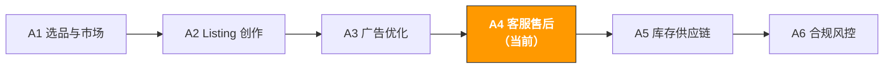

# A4. 客服与售后 | Customer Service & After-Sales

> **路径**: Path A: 运营人 · **模块**: A4
> **最后更新**: 2026-03-12
> **难度**: 进阶
> **预计时间**: 每天 30 分钟，1-2 周
---

[Hub 首页](../../README.md) · [Path A 总览](README.md)



---

## 本模块章节导航

1. [客服方法论](#1-客服方法论ai-之前你需要理解的基础) · 2. [AI 工具全景](#2-ai-工具全景客服阶段用什么) · 3. [Prompt 模板库](#3-prompt-模板库客服专用) · 4. [客服实战工作流](#4-客服实战工作流) · 5. [常见陷阱](#5-常见客服陷阱) · 6. [进阶技巧](#6-进阶技巧) · 7. [学习资源](#7-学习资源) · 8. [ OpenClaw 自动化](#8-用-openclaw-自动化客服售后) · 9. [完成标志](#9-完成标志)


## 本模块你将学会

用 AI 工具把客服从"被动救火"变成"主动防御"。从差评分析到账号申诉，建立一套可复用的 AI 辅助客服管理工作流。

完成本模块后，你将能够：
- 用 ChatGPT/Claude 批量分析差评，10 分钟定位产品核心问题和改进方向
- 用 AI 生成多语言客服回复模板，覆盖中英德日西 5 种语言的常见场景
- 用 AI 撰写 Plan of Action 申诉信，掌握 Root Cause + Immediate Actions + Preventive Measures 三段式结构
- 建立差评应急响应 SOP，从发现差评到采取行动不超过 24 小时
- 用 AI 分析退货报告，从退货原因中发现产品迭代方向
- 设计客服 KPI 体系，用 AI 追踪和优化客服绩效

---

## 1. 客服方法论：AI 之前你需要理解的基础

> **相关阅读**: [E5 WhatsApp Business AI 指南](../e-social-media/e5-whatsapp-business-ai-guide.md) WhatsApp AI Chatbot 客服自动化详见 E5。 · [D9 eBay AI 指南](../d-platforms/d9-ebay-ai-guide.md) eBay 二手品品相描述 AI 生成详见 D9 · [E1 Instagram/Facebook AI 指南](../e-social-media/e1-instagram-facebook-ai-guide.md) Instagram/Facebook DM 和评论自动回复策略详见 E1。

### 1.1 Amazon 客服的第一性原理

客服不只是"回复消息"，它是品牌体验的最后一道防线，也是产品迭代的第一手信息来源。

Amazon 的客户体验哲学是"Customer Obsession"。平台通过一系列指标来衡量卖家的客服质量，这些指标直接影响你的账号健康和 Buy Box 资格：

```
ODR (Order Defect Rate) = (A-to-Z Claims + 差评 + 信用卡拒付) / 总订单数
```
- **目标**：ODR < 1%（超过 1% 会触发账号审查）
- **含义**：每 100 个订单中，有问题的订单不超过 1 个

```
Late Shipment Rate = 延迟发货订单数 / 总订单数
```
- **目标**：< 4%（FBA 卖家基本不用担心这个指标）
- **含义**：自发货卖家需要在承诺时间内发货

```
Pre-fulfillment Cancel Rate = 卖家取消订单数 / 总订单数
```
- **目标**：< 2.5%
- **含义**：不要因为缺货等原因频繁取消订单

**差评 vs 卖家反馈 vs A-to-Z Claim 的区别：**

| 类型 | 出现位置 | 影响范围 | 可否删除 | 应对策略 |
|------|----------|----------|----------|----------|
| **产品差评 (Review)** | 产品详情页 | 影响转化率、星级评分 | 违规评论可举报删除 | 公开回复 + 产品改进 |
| **卖家反馈 (Feedback)** | 卖家主页 | 影响 ODR、Buy Box | FBA 物流问题可申请删除 | 联系买家 + 申请删除 |
| **A-to-Z Claim** | 账号后台 | 直接影响 ODR | 可申诉 | 48 小时内响应 + 提供证据 |

> **核心洞察**：一个差评可能导致转化率下降 5-10%，尤其是 Review 数量少的新品。假设你的产品日均 10 单、客单价 $30，转化率下降 5% 意味着每天少卖 0.5 单，一个月损失 $450。这就是客服的 ROI 花 30 分钟用 AI 处理一个差评，可能挽回几百美元的月销售额。

### 1.2 客服场景全景

| 场景 | 频率 | 紧急度 | AI 能帮什么 |
|------|------|--------|-------------|
| 退换货请求 | 高频 | 中 | 生成多语言回复模板、分析退货原因趋势 |
| 产品使用问题 | 高频 | 中 | 生成 FAQ、创建使用指南、多语言回复 |
| 物流查询 | 中频 | 低 | 生成标准回复模板（FBA 大部分由 Amazon 处理） |
| 差评回复 | 中频 | 高 | 分析差评原因、生成专业公开回复 |
| 账号申诉 | 低频 | 紧急 | 撰写 Plan of Action、分析违规原因 |
| 合规通知 | 低频 | 紧急 | 解读通知内容、生成合规响应方案 |
| Review 请求 | 中频 | 低 | 生成符合政策的 Review 请求邮件 |
| 售后跟进 | 中频 | 中 | 生成满意度跟进邮件、分析客户反馈 |

### 1.3 AI 在客服中的角色定位

AI 擅长的：
- **多语言回复生成**：一次生成中英德日西 5 种语言的客服回复，质量远超机器翻译
- **差评批量分析**：从几百条差评中提取问题分类、频率、趋势，人工需要几小时，AI 10 分钟
- **模板库管理**：为不同场景生成标准化回复模板，确保团队回复质量一致
- **申诉信撰写**：Plan of Action 有固定结构，AI 可以快速生成专业的申诉信
- **退货原因分析**：从退货报告中发现产品问题模式，指导产品改进
- **情感分析**：判断客户消息的情绪倾向，帮助优先处理高风险消息

AI 不擅长的：
- **情感共情**：AI 生成的回复可能"正确但冷冰冰"，需要人工审核加入温度
- **复杂纠纷判断**：涉及多方责任的纠纷（物流损坏、假货投诉）需要人工判断
- **实时对话**：Amazon Buyer-Seller Messaging 不支持 AI 自动回复，需要人工操作
- **政策边界判断**：什么能说什么不能说（如不能承诺退款），需要人了解 Amazon 政策

> **核心原则**：AI 是你的客服助手，不是客服替代。用 AI 做分析和草稿生成，用人做审核和最终决策。特别是涉及退款、申诉等敏感操作，必须人工确认后再执行。

---

## 2. AI 工具全景：客服阶段用什么

### 2.1 付费工具深度评测

| 工具 | 价格 | 核心能力 | 适合谁 | AI 功能 |
|------|------|----------|--------|---------|
| [eDesk](https://www.edesk.com/blog/ai-tools-ticket-history-ecommerce-support-replies-2026/) | $89-199/月 | AI 驱动的多渠道客服平台，自动回复建议、情感分析、工单管理 | 多渠道卖家（Amazon+Shopify+eBay） | AI 自动回复建议、情感分析、智能路由 |
| [FeedbackWhiz](https://infinitefba.com/amazon-feedback-software-tools/) | $19-139/月 | Review 监控、自动邮件序列、差评预警、A/B 测试邮件 | 需要 Review 管理的卖家 | AI 邮件优化、差评实时预警 |
| Helium 10 Review Insights | $79/月 (Platinum 含) | AI Review 分析、情感分析、关键词提取 | Helium 10 用户 | AI 驱动的 Review 情感和主题分析 |
| SellerApp Review Management | $49-99/月 | Review 追踪、竞品 Review 对比、趋势分析 | 需要竞品 Review 情报的卖家 | AI Review 分析和竞品对比 |
| Zendesk / Freshdesk | $19-99/月 | 通用客服平台，工单管理、知识库、自动化 | 有 DTC 渠道的卖家 | AI 自动分类、建议回复、知识库搜索 |

**工具选择建议：**

**预算有限（<$20/月）**：ChatGPT/Claude + Amazon 官方工具
- 用 ChatGPT 生成回复模板和分析差评
- 用 Amazon Buyer-Seller Messaging 处理客户消息
- 用 Amazon Voice of Customer 监控客户反馈
- 手动管理，适合月订单量 < 500 的卖家

**认真做（$50-150/月）**：FeedbackWhiz + ChatGPT
- FeedbackWhiz 做 Review 监控和自动邮件
- ChatGPT 做差评分析和申诉信撰写
- 适合月订单量 500-5000 的卖家

**多渠道运营（$100-200/月）**：eDesk + ChatGPT
- eDesk 统一管理 Amazon + Shopify + eBay 的客服消息
- AI 自动建议回复，人工审核后发送
- 适合多平台卖家或有客服团队的卖家

Content rephrased for compliance with licensing restrictions. Sources: [eDesk AI customer service](https://www.edesk.com/blog/ai-tools-ticket-history-ecommerce-support-replies-2026/), [InfiniteFBA feedback tools](https://infinitefba.com/amazon-feedback-software-tools/)

### 2.2 免费工具组合

| 工具 | 用途 | 链接 |
|------|------|------|
| ChatGPT / Claude | 回复模板生成、差评分析、申诉信撰写、多语言翻译 | [chat.openai.com](https://chat.openai.com/) / [claude.ai](https://claude.ai/) |
| Amazon Buyer-Seller Messaging | 官方消息系统，与买家沟通的唯一合规渠道 | Seller Central → Messages |
| Amazon Voice of Customer | 官方客户反馈仪表盘，展示退货原因和客户投诉 | Seller Central → Performance → Voice of Customer |
| Amazon Brand Dashboard | 品牌健康仪表盘，Review 趋势和客户体验指标 | Seller Central → Brands → Brand Dashboard |

**免费工具的使用策略：**

1. **Amazon Voice of Customer 是金矿**：它汇总了所有退货原因和客户投诉，按 ASIN 分类。每周检查一次，可以提前发现产品问题。
2. **Buyer-Seller Messaging 有 24 小时规则**：收到客户消息后 24 小时内必须回复，否则影响响应时间指标。用 AI 提前准备好常见场景的回复模板，收到消息后快速修改发送。
3. **ChatGPT 做批量分析**：把过去 30 天的差评全部粘贴给 ChatGPT，让它做分类和趋势分析，比手动看快 10 倍。
4. **Brand Dashboard 追踪趋势**：品牌注册卖家可以看到 Review 趋势、客户体验评分等数据，用于监控客服质量的长期变化。

### 2.3 开源工具与 API

| 工具/API | 用途 | GitHub/链接 |
|----------|------|-------------|
| python-amazon-sp-api | SP-API Python 封装，含 Messaging API（发送消息）和 Notifications API（订阅通知） | [github.com/saleweaver/python-amazon-sp-api](https://github.com/saleweaver/python-amazon-sp-api) |
| VADER Sentiment | 轻量级情感分析工具，适合快速判断 Review 情感倾向 | [github.com/cjhutto/vaderSentiment](https://github.com/cjhutto/vaderSentiment) |
| BERTopic | Review 主题建模，自动发现差评中的主题聚类 | [github.com/MaartenGr/BERTopic](https://github.com/MaartenGr/BERTopic) |
| TextBlob | 简单的情感分析和文本处理 | [github.com/sloria/TextBlob](https://github.com/sloria/TextBlob) |

**什么时候用开源工具？**

如果你管理 10+ 个 ASIN 或每月有 100+ 条差评，开源工具可以：
- **自动情感分析**：用 VADER 或 TextBlob 对所有新 Review 做情感评分，自动标记需要关注的差评
- **主题建模**：用 BERTopic 从几百条差评中自动发现问题主题（如"电池续航"、"包装破损"），不需要手动分类
- **自动通知**：用 SP-API 的 Notifications API 订阅新 Review 通知，第一时间发现差评

> 更多技术实现细节，参考 [Path B: 技术人](../b-developers/) 的相关模块。

---

## 3. Prompt 模板库（客服专用）

> 完整的标准化模板（含验证状态、贡献者信息、分享链接）存放在 [prompts/customer-service.md](../../prompts/customer-service.md)。
> 本节提供每个模板的深度解析、常见错误和进阶变体。

### 3.1 差评批量分析

**为什么这个 Prompt 有效：** 它要求 AI 按问题类型分类并用表格输出频率和占比，避免了 AI 常见的"泛泛而谈"问题。分成 5 个明确的输出维度（分类、频率、代表性评论、短期应对、长期改善），每个维度都有具体的操作建议。关键设计点：
- "按问题类型分类" 强制 AI 做结构化分析而非逐条点评
- "频率 x 严重程度排序" 直接导向优先级决策
- "短期应对 + 长期改善" 区分紧急处理和根本解决

**常见错误：**
- 数据量太少（<20 条差评）→ 样本太少无法发现趋势，至少用 60 天的 1-3 星评论
- 不区分站点 → US、DE、JP 的差评反映不同市场的期望差异，应该分站点分析
- 只看文字不看星级分布 → 2 星和 1 星的问题严重程度不同，应该分开统计
- 忽略好评中的"但是" → 4 星评论中的"但是"往往是最有价值的改进线索

[完整模板 → prompts/customer-service.md](../../prompts/customer-service.md)

**进阶变体：**

**变体 A 按时间线分析差评趋势：**

```
以下是我的产品过去 6 个月的差评数据（1-3 星），按月份分组：

1月差评：[粘贴]
2月差评：[粘贴]
3月差评：[粘贴]
...

请分析差评趋势：
1. 每月差评数量和占比变化趋势（用表格）
2. 是否有新出现的问题类型？（可能是供应商换料、物流变化等导致）
3. 是否有持续存在但未解决的老问题？
4. 差评高峰期是否与特定事件相关？（大促后、季节变化、Listing 修改后）
5. 基于趋势，预测下个月可能的差评重点和预防建议
```

> **为什么用这个变体**：单次分析只能看到"现在有什么问题"，趋势分析能看到"问题在变好还是变差"。如果某个问题的差评占比在持续上升，说明产品或供应链出了新问题，需要紧急排查。

**变体 B 多语言差评分析（德语/日语差评）：**

```
以下是我的产品在 Amazon DE 站的德语差评：
[粘贴德语差评]

以下是 Amazon JP 站的日语差评：
[粘贴日语差评]

请完成：
1. 将所有差评翻译为中文，保留原文对照
2. 按问题类型分类（与 US 站使用相同的分类体系）
3. 对比不同站点的差评特征：
- DE 站用户最关注什么？（德国消费者通常重视品质和安全认证）
- JP 站用户最关注什么？（日本消费者通常重视细节和包装）
4. 哪些问题是全球共性的？哪些是特定市场的？
5. 针对每个市场的差异化改进建议
```

> **为什么用这个变体**：不同市场的消费者期望差异很大。德国消费者可能因为"说明书没有德语"给差评，日本消费者可能因为"包装有轻微压痕"给差评。AI 可以帮你理解这些文化差异，制定针对性的改进策略。

**变体 C 差评 vs 好评对比分析：**

```
以下是我的产品评论数据：

5星好评（最近 20 条）：[粘贴]
1-2星差评（最近 20 条）：[粘贴]

请对比分析：
1. 好评中最常提到的优点是什么？（这是你的核心卖点）
2. 差评中最常提到的缺点是什么？（这是你的核心短板）
3. 好评和差评中是否有矛盾的评价？（如有人说"很轻便"，有人说"太轻不结实"）
4. 基于对比，Listing 应该强调什么、弱化什么？
5. 产品改进的优先级排序（解决差评问题 vs 强化好评优点）
```

> **为什么用这个变体**：好评告诉你"用户为什么买"，差评告诉你"用户为什么不满意"。对比分析可以帮你找到 Listing 优化的方向 强调好评中的核心卖点，在 A+ Content 中预先回应差评中的常见疑虑。

---

### 3.2 账号申诉信 (Plan of Action)

**为什么这个 Prompt 有效：** Amazon 的申诉审核团队每天处理大量申诉，他们需要快速判断卖家是否真正理解问题并有能力解决。Root Cause + Immediate Actions + Preventive Measures 三段式结构是 Amazon 官方推荐的格式，AI 可以帮你快速生成结构完整、内容具体的申诉信。

**常见错误：**
- 太笼统 → "我们会加强质量管理"这种空话不会通过审核。需要具体到"我们已更换供应商 XX，新供应商通过了 ISO 9001 认证"
- 推卸责任 → "这是物流公司的问题"不会被接受。即使是物流问题，你也需要说明你如何选择更好的物流方案
- 没有具体行动项 → 每个部分至少 3 个具体的、可执行的行动项，带时间节点
- 语气不当 → 不要辩解、不要抱怨、不要威胁。语气应该是"诚恳承认 + 积极解决"
- 一次提交多个问题 → 如果有多个违规，每个违规单独写一封申诉信

[完整模板 → prompts/customer-service.md](../../prompts/customer-service.md)

**进阶变体：**

**变体 A 知识产权投诉申诉：**

```
我的 Amazon 账号收到了知识产权投诉（Intellectual Property Complaint），详情如下：
[粘贴投诉通知]

投诉类型：[商标侵权 / 专利侵权 / 版权侵权]
我的情况：[说明你认为不侵权的理由，或已采取的措施]

请撰写申诉信（Plan of Action）：

1. Root Cause（根本原因）：
- 承认收到投诉并认真对待
- 说明对知识产权保护的理解
- 分析导致投诉的具体原因

2. Immediate Actions（已采取的紧急措施）：
- 已下架涉嫌侵权的 Listing
- 已联系投诉方沟通（如适用）
- 已审查所有在售产品的知识产权合规性

3. Preventive Measures（预防措施）：
- 建立产品上架前的知识产权审查流程
- 使用 Amazon Brand Registry 和 IP Accelerator 工具
- 定期培训团队关于知识产权合规

语气要求：诚恳专业，不辩解，展示对知识产权的尊重和保护意愿。
```

**变体 B 产品真实性投诉申诉：**

```
我的 Amazon 账号收到了产品真实性投诉（Product Authenticity Complaint），详情如下：
[粘贴投诉通知]

我的产品是：[品牌名] [产品名]
我是否为品牌所有者/授权经销商：[是/否]
我有哪些证明文件：[发票、授权书、品牌注册证等]

请撰写申诉信（Plan of Action）：

1. Root Cause：
- 说明产品来源和供应链
- 承认可能导致误解的环节

2. Immediate Actions：
- 已准备的证明文件清单（发票、授权书、质检报告）
- 已采取的产品验证措施

3. Preventive Measures：
- 供应链文档管理流程
- 产品批次追溯系统
- 定期供应商审核计划

附件建议：列出应该附上的证明文件及格式要求。
```

**变体 C 账户健康指标违规申诉：**

```
我的 Amazon 账号因为以下健康指标违规被暂停：
- ODR (Order Defect Rate)：当前 [X]%（目标 < 1%）
- Late Shipment Rate：当前 [X]%（目标 < 4%）
- 其他违规：[描述]

过去 90 天的订单数据：
- 总订单数：[X]
- A-to-Z Claims 数量：[X]
- 差评数量：[X]
- 延迟发货数量：[X]

请撰写申诉信（Plan of Action）：

1. Root Cause：
- 分析每个超标指标的具体原因
- 识别导致问题的系统性因素

2. Immediate Actions：
- 针对每个问题已采取的紧急措施
- 已处理的具体订单和客户投诉

3. Preventive Measures：
- 客服响应时间改善计划
- 库存和物流管理优化
- 产品质量控制加强措施
- 指标监控和预警机制

每个行动项标注：负责人、完成时间、预期效果。
```

Content rephrased for compliance with licensing restrictions. Source: [eStorefactory account suspension guide](https://www.estorefactory.com/blog/amazon-account-suspension-guide-2026/)

---

### 3.3 多语言客服回复模板生成

**为什么这个 Prompt 重要：** 多站点运营意味着你需要用英语、德语、日语、西班牙语等多种语言回复客户。Google 翻译的质量不够专业，而且不了解 Amazon 客服的语境。AI 可以一次性生成多语言的专业回复模板，并根据不同文化调整语气。

**常见错误：**
- 直接翻译中文模板 → 不同文化的客服语气差异很大。德语客服更正式，日语客服更谦恭，西班牙语客服更热情
- 忽略 Amazon 政策限制 → 回复中不能包含外部链接、不能引导客户到其他平台、不能承诺具体退款金额
- 模板太长 → 客户不会读长篇大论。每个回复控制在 3-5 句话
- 不留个性化空间 → 模板中应该有 [客户名]、[订单号]、[具体问题] 等占位符

```
你是一个多语言电商客服专家。请为以下 5 个常见客服场景生成回复模板，每个场景提供 5 种语言版本（英语、德语、日语、西班牙语、中文）。

场景1：客户收到损坏的产品，要求退换
场景2：客户询问产品使用方法
场景3：客户对产品不满意，想退货
场景4：客户询问订单物流状态
场景5：客户留了差评，主动联系表达不满

每个模板要求：
1. 控制在 3-5 句话
2. 语气根据文化调整（德语正式、日语谦恭、西班牙语热情、英语友好专业）
3. 包含 [客户名]、[订单号]、[产品名] 等占位符
4. 符合 Amazon Buyer-Seller Messaging 政策（不含外部链接、不引导站外）
5. 以解决问题为导向，不辩解

输出格式：按场景分组，每个场景下列出 5 种语言版本。
```

**进阶变体 针对不同文化的语气调整：**

```
以下是我的英语客服回复模板：
[粘贴英语模板]

请将这个模板本地化为以下语言，注意不是直译，而是根据当地文化调整：

1. 德语版（Amazon DE）：
- 语气更正式，使用 "Sie"（您）而非 "du"（你）
- 德国消费者重视精确性，回复中包含具体的时间承诺
- 提及欧盟消费者权益保护法（如适用）

2. 日语版（Amazon JP）：
- 使用敬语（です/ます体），表达歉意要更深
- 日本消费者期望快速响应和详细说明
- 结尾加上"今後ともよろしくお願いいたします"等礼貌用语

3. 西班牙语版（Amazon ES/MX）：
- 语气可以更热情和个人化
- 西班牙和墨西哥的用语有差异，标注两个版本
- 表达关心和理解的语句更多
```

> **多语言客服的核心原则**：不是翻译，是本地化。同样是"对不起给您带来不便"，英语说 "We apologize for the inconvenience"，日语说 "ご不便をおかけして誠に申し訳ございません"（更深的歉意），德语说 "Wir entschuldigen uns für die Unannehmlichkeiten"（更正式）。AI 理解这些文化差异，比翻译工具好得多。

---

### 3.4 差评回复策略

**为什么这个 Prompt 重要：** 公开回复差评是展示品牌态度的机会。潜在买家在购买前会看差评和卖家回复。一个专业、诚恳的回复可以减轻差评的负面影响，甚至让潜在买家对品牌产生好感。

**常见错误：**
- 辩解 → "这不是我们的问题，是物流的问题"会让潜在买家觉得你推卸责任
- 模板化 → 所有差评用同一个回复，潜在买家一眼就能看出来
- 不回复 → 不回复差评等于默认差评内容，错失展示品牌态度的机会
- 要求删除差评 → 在公开回复中要求客户删除差评违反 Amazon 政策
- 提供补偿 → 在公开回复中提供退款或补偿违反 Amazon 政策

```
你是一个 Amazon 品牌客服经理。以下是我的产品收到的差评，请为每条差评生成专业的公开回复。

产品：[产品名称和简要描述]

差评1（1星）："[差评内容]"
差评2（2星）："[差评内容]"
差评3（1星）："[差评内容]"

每条回复要求：
1. 开头感谢客户的反馈（即使是差评）
2. 对客户的不满表示理解和歉意
3. 针对具体问题给出解释或解决方案（不辩解）
4. 邀请客户通过 Buyer-Seller Messaging 联系我们进一步解决
5. 展示品牌对产品质量的承诺
6. 控制在 3-5 句话，不要太长
7. 不要在回复中提供退款、补偿或要求删除差评

语气：诚恳、专业、以解决问题为导向。记住：这个回复不只是给差评客户看的，更是给所有潜在买家看的。
```

Content rephrased for compliance with licensing restrictions. Source: [SellerApp responding to negative reviews](https://sellerapp.com/blog/how-to-respond-to-negative-reviews)

---

### 3.5 Review 请求邮件优化

**为什么这个 Prompt 重要：** 主动请求 Review 是提升评分的合规方式。Amazon 允许卖家通过 "Request a Review" 按钮或 Buyer-Seller Messaging 请求 Review，但内容必须符合政策。一封好的 Review 请求邮件可以将 Review 率从 1-2% 提升到 5-10%。

**常见错误：**
- 只请求好评 → Amazon 政策明确禁止"只请求正面评价"，必须是中性的 Review 请求
- 提供激励 → 不能用折扣、赠品等方式换取 Review
- 发送时间不对 → 产品刚到货就请求 Review，客户还没使用。建议在预计使用 3-5 天后发送
- 频率太高 → 每个订单只能请求一次 Review，多次请求会被视为骚扰

```
你是一个 Amazon 邮件营销专家。请为以下产品生成符合 Amazon 政策的 Review 请求邮件。

产品：[产品名称]
品类：[品类]
核心卖点：[1-2 个核心卖点]
预计使用场景：[客户通常如何使用这个产品]

要求：
1. 邮件标题要吸引打开（但不能用误导性标题）
2. 开头感谢购买，简短提及产品使用建议（增加价值）
3. 中性地请求 Review（不暗示要好评）
4. 提供使用帮助（如有问题请联系我们，不要直接给差评）
5. 控制在 100 字以内（客户不会读长邮件）
6. 符合 Amazon 政策：不提供激励、不只请求好评、不包含外部链接

请生成 3 个版本：
版本A：简洁直接型
版本B：增值服务型（附带使用技巧）
版本C：品牌故事型（简短品牌介绍 + Review 请求）
```

> **Review 请求的核心原则**：最好的 Review 请求不是"请给我好评"，而是"我们希望听到您的真实反馈"。同时提供使用帮助，让不满意的客户先联系你而不是直接给差评。

---

### 3.6 产品使用 FAQ 生成

**为什么这个 Prompt 重要：** 好的 FAQ 可以减少 50% 的客服工作量。客户的大部分问题是重复的 如何安装、如何充电、尺寸是否合适、是否兼容某设备。把这些问题整理成 FAQ 放在 Listing 的 A+ Content 或产品说明中，客户自己就能找到答案。

**常见错误：**
- FAQ 太少 → 只有 3-5 个问题不够，至少覆盖 10-15 个常见问题
- 答案太官方 → FAQ 的答案应该像朋友在帮你解答，不是说明书的语气
- 不更新 → 产品迭代后 FAQ 没有更新，导致信息过时
- 不基于真实数据 → FAQ 应该基于真实的客户问题（差评、消息、退货原因），不是凭空想象

```
你是一个产品体验专家。请基于以下数据，为我的产品生成 FAQ。

产品：[产品名称和描述]

数据来源1 最近 30 天的客户消息（常见问题）：
[粘贴客户消息摘要]

数据来源2 最近 60 天的差评（客户困惑点）：
[粘贴差评摘要]

数据来源3 退货原因报告：
[粘贴退货原因]

请生成：
1. Top 15 FAQ（按频率排序）
- 每个问题用客户的语言表述（不是官方语言）
- 每个答案控制在 2-3 句话，清晰直接
- 标注每个问题的来源（客户消息/差评/退货原因）

2. 建议放在 Listing 中的位置：
- 哪些 FAQ 适合放在 Bullet Points？
- 哪些适合放在 A+ Content？
- 哪些适合放在产品说明书/包装内卡片？

3. 需要产品改进才能解决的问题（FAQ 解决不了的）
```

> **FAQ 的核心价值**：每一个 FAQ 都是在"预防"一个潜在的差评或退货。如果客户在购买前就知道"这个产品不兼容 XX 设备"，他就不会买了之后因为不兼容而给差评。

---

### 3.7 退货原因分析

**为什么这个 Prompt 重要：** 退货率直接影响利润和账户健康。Amazon 会对高退货率的产品标记警告，严重的会被下架。退货报告中的原因数据是产品改进的金矿 它告诉你客户为什么不满意，比差评更直接。

**常见错误：**
- 只看退货率不看原因 → 退货率 10% 可能是"不喜欢"（正常）也可能是"产品损坏"（严重），原因不同应对策略完全不同
- 不区分可控和不可控原因 → "买错了"是不可控的，"产品与描述不符"是可控的
- 不与差评数据交叉分析 → 退货原因 + 差评内容结合分析，能更准确地定位问题

```
你是一个产品质量分析师。以下是我的产品退货报告数据（过去 90 天）：

[粘贴退货数据：退货原因、数量、占比]

产品信息：
- 产品名称：[名称]
- 售价：$[X]
- 月销量：[X] 单
- 当前退货率：[X]%
- 品类平均退货率：[X]%

请分析：
1. 退货原因分类和占比（用表格）
2. 可控原因 vs 不可控原因的比例
3. 每个可控原因的改进建议：
- Listing 层面（描述更准确、图片更真实）
- 产品层面（质量改进、包装加强）
- 客服层面（主动联系、使用指导）
4. 退货率降低目标和预计时间线
5. 如果退货率持续高于品类平均，可能面临的风险和应对
```

> **退货分析的核心原则**：退货不全是坏事。"买错了"和"不喜欢颜色"这类退货是正常的电商损耗。你需要关注的是"产品与描述不符"、"质量问题"、"功能缺陷"这类可控原因 这些才是需要改进的。

---

### 3.8 客服 SLA 和绩效追踪

**为什么这个 Prompt 重要：** 如果你有客服团队（哪怕只有 1-2 人），需要一套 KPI 体系来衡量客服质量。没有衡量就没有改进。AI 可以帮你设计适合你业务规模的 KPI 体系和追踪模板。

```
你是一个电商客服管理专家。请为我的 Amazon 业务设计客服 KPI 体系。

业务信息：
- 月订单量：[X] 单
- 站点：Amazon [US/DE/JP]
- 客服团队规模：[X] 人
- 当前主要客服渠道：Buyer-Seller Messaging
- 当前痛点：[描述，如响应慢、差评处理不及时等]

请设计：
1. 核心 KPI（5-8 个指标）：
- 每个指标的定义、计算方式、目标值
- 数据来源（从哪里获取数据）
- 监控频率（日/周/月）

2. KPI 追踪模板（Excel/Google Sheets 格式）：
- 列出需要追踪的字段
- 建议的数据录入频率
- 自动计算公式建议

3. 绩效改进建议：
- 如果某个 KPI 不达标，应该采取什么措施？
- 如何用 AI 工具辅助改进？

4. 月度客服报告模板：
- 包含哪些内容？
- 如何用 AI 自动生成月度总结？
```

> **客服 KPI 的核心指标**：响应时间（< 24 小时）、解决率（首次回复解决 > 70%）、客户满意度、差评响应率（100% 的差评都有公开回复）、退货率趋势。不需要太多指标，5-8 个核心指标足够。

---

## 4. 客服实战工作流

### 4.1 日常客服 SOP（每天 15 分钟）

这套 SOP 把日常客服工作标准化，确保不遗漏任何需要处理的客户问题。

```

Step 1: 检查消息（5 分钟）
操作: 登录 Seller Central → Messages
检查: 是否有未回复的客户消息
原则: 24 小时内必须回复（影响响应时间指标）
AI: 用预先准备的多语言模板快速回复（Prompt 3.3）
优先级: A-to-Z Claim > 退货请求 > 产品问题 > 物流查询

Step 2: 检查差评（5 分钟）
操作: 检查 Voice of Customer + 产品 Review
检查: 是否有新的 1-2 星差评
AI: 用差评回复策略 Prompt（3.4）生成公开回复
原则: 24 小时内回复所有新差评
记录: 将差评内容记录到差评追踪表

Step 3: 检查账号健康（5 分钟）
操作: Seller Central → Performance → Account Health
检查: ODR、Late Shipment Rate、Policy Violations
预警: 如果任何指标接近阈值，立即启动应急响应
AI: 如有异常，用广告效果诊断思路排查原因

```

### 4.2 差评应急响应 SOP

当发现新的 1-2 星差评时，按以下流程处理：

```

Step 1: 评估严重性（5 分钟）
判断: 差评内容是否涉及安全问题？是否可能引发更多差评？
分类: 产品质量 / 物流损坏 / 使用困难 / 预期不符 / 恶意
优先级: 安全问题 > 质量问题 > 使用困难 > 预期不符

Step 2: 公开回复（10 分钟）
AI: 用差评回复策略 Prompt（3.4）生成回复
审核: 人工检查回复内容，确保不违反 Amazon 政策
发布: 在产品 Review 下发布公开回复
原则: 诚恳、不辩解、邀请私下沟通

Step 3: 私下联系（如可能）（10 分钟）
操作: 通过 Buyer-Seller Messaging 联系差评客户
目标: 了解具体问题、提供解决方案
注意: 不要要求删除差评，只专注于解决问题
AI: 用多语言模板生成个性化的联系消息

Step 4: 根因分析（15 分钟）
判断: 这是个案还是系统性问题？
检查: 最近 30 天是否有类似差评？退货原因是否一致？
AI: 如果是系统性问题，用差评批量分析 Prompt（3.1）
行动: 更新 Listing / 联系供应商 / 调整包装

Step 5: 记录和跟踪
操作: 在差评追踪表中记录：日期、内容、分类、处理措施
跟踪: 1 周后检查是否有改善
复盘: 每月用 AI 做差评趋势分析（Prompt 3.1 变体 A）

```

### 4.3 账号申诉 SOP（从收到通知到恢复）

账号被暂停是最紧急的客服事件。按以下流程处理：

```

Day 1: 冷静分析（不要急着提交申诉）
操作: 仔细阅读 Amazon 的暂停通知，理解具体原因
AI: 将通知内容粘贴给 AI，让它帮你解读关键信息
收集: 整理所有相关证据（发票、质检报告、沟通记录）
注意: 第一次申诉最重要，不要仓促提交

Day 2-3: 撰写 Plan of Action
AI: 用账号申诉信 Prompt（3.2）生成初稿
审核: 人工审核每一条行动项，确保具体、可执行
补充: 添加具体的证据和数据支撑
校对: 检查语法、格式、逻辑是否通顺
建议: 找有经验的卖家或服务商审核一遍

Day 3-4: 提交申诉
操作: 通过 Seller Central → Performance Notifications
附件: 附上所有证明文件（PDF 格式，清晰可读）
记录: 保存提交时间和内容副本

Day 4-14: 等待和跟进
等待: Amazon 通常 3-7 个工作日回复
如果被拒: 分析拒绝原因，用 AI 修改 Plan of Action
如果无回复: 7 天后通过 Seller Support 跟进
最多: 申诉 3 次。如果 3 次都被拒，考虑寻求专业帮助

恢复后: 预防措施执行
操作: 严格执行 Plan of Action 中承诺的预防措施
监控: 每天检查账号健康指标
记录: 保存所有改进措施的执行记录（下次申诉可能需要）

```

> **账号申诉的核心原则**：第一次申诉的成功率最高。不要急着提交一个不完整的申诉，花 2-3 天准备一个完善的 Plan of Action 比匆忙提交 3 次效果好得多。

Content rephrased for compliance with licensing restrictions. Source: [eStorefactory account suspension guide](https://www.estorefactory.com/blog/amazon-account-suspension-guide-2026/)

### 4.4 多语言客服模板库建设 SOP

如果你运营多个站点，需要建立一套多语言客服模板库：

```

Step 1: 梳理场景（1 小时，一次性）
操作: 回顾过去 90 天的客户消息，列出所有场景
分类: 退换货 / 产品问题 / 物流 / 差评 / 其他
目标: 覆盖 80% 以上的客户消息场景

Step 2: 生成模板（2 小时，一次性）
AI: 用多语言模板生成 Prompt（3.3）批量生成
语言: 根据你的站点选择（US=英语，DE=德语，JP=日语等）
审核: 找母语人士或专业翻译审核关键模板

Step 3: 存储和使用
工具: Google Sheets / Notion / 文本扩展工具
组织: 按场景 × 语言的矩阵组织模板
使用: 收到消息 → 判断场景 → 选择模板 → 个性化修改 → 发送

Step 4: 持续优化（每月 30 分钟）
操作: 回顾本月客户消息，是否有新场景需要添加模板？
AI: 用 AI 分析本月客户消息，发现新的常见问题
更新: 添加新模板、优化现有模板的措辞

```

---

## 5. 常见客服陷阱

### 5.1 回复相关陷阱

| 陷阱 | 表现 | 如何避免 |
|------|------|----------|
| **回复太慢** | 超过 24 小时未回复客户消息，影响响应时间指标 | 设置每天固定时间检查消息（日常 SOP Step 1）。用预制模板加速回复。 |
| **模板化回复** | 所有客户收到一模一样的回复，客户感觉不被重视 | 模板只是起点，每次回复都要加入个性化元素（客户名、具体问题、具体解决方案）。 |
| **辩解而非解决** | "这不是我们的问题"、"您使用方法不对" | 永远先道歉、再解决。即使客户有误，也要用引导的方式帮助，而非指责。 |
| **承诺无法兑现** | "我们会在 24 小时内退款"但实际做不到 | 只承诺你能 100% 做到的事情。不确定的用"我们会尽快处理"。 |
| **语气不当** | 太正式像机器人，或太随意不专业 | 根据市场调整语气（见 Prompt 3.3 的文化差异指南）。 |

### 5.2 Review 相关陷阱

| 陷阱 | 表现 | 如何避免 |
|------|------|----------|
| **违规请求 Review** | 用折扣、赠品换取好评，或只请求正面评价 | 只使用 Amazon 官方的 "Request a Review" 按钮，或发送中性的 Review 请求邮件（Prompt 3.5）。 |
| **忽略差评** | 差评出现后不回复、不分析、不改进 | 每天检查新差评（日常 SOP Step 2），24 小时内公开回复。 |
| **不分析差评趋势** | 只处理单条差评，不看整体趋势 | 每月用 AI 做差评趋势分析（Prompt 3.1 变体 A），发现系统性问题。 |
| **过度关注删除差评** | 花大量时间尝试删除差评，而不是解决根本问题 | 只有违反 Amazon 政策的差评才值得举报删除。把精力放在产品改进和获取更多好评上。 |
| **不利用好评** | 好评中的关键词和卖点没有被用到 Listing 中 | 用 AI 分析好评（Prompt 3.1 变体 C），提取客户最认可的卖点，更新到 Listing。 |

Content rephrased for compliance with licensing restrictions. Source: [TraceFuse feedback removal](https://tracefuse.ai/blog/amazon-feedback-removal-request-template/)

### 5.3 账号相关陷阱

| 陷阱 | 表现 | 如何避免 |
|------|------|----------|
| **忽略 ODR 指标** | ODR 接近 1% 但没有采取行动，直到账号被暂停 | 每天检查账号健康（日常 SOP Step 3），ODR > 0.5% 就启动预警。 |
| **不及时处理 A-to-Z Claim** | 收到 A-to-Z Claim 后拖延处理 | 48 小时内必须响应。准备好标准的 A-to-Z 响应模板。 |
| **申诉信太笼统** | "我们会改进"这种空话不会通过审核 | 用 AI 生成具体的 Plan of Action（Prompt 3.2），每个行动项都要具体到人、时间、措施。 |
| **多次提交相同申诉** | 被拒后不修改就重新提交 | 每次被拒后分析拒绝原因，用 AI 修改后再提交。最多 3 次。 |
| **不保存证据** | 发票、质检报告、沟通记录没有系统保存 | 建立文档管理系统，所有证据按 ASIN 和日期归档。申诉时能快速找到。 |

---

## 6. 进阶技巧

### 6.1 AI 驱动的客户情感监控

当你的产品有大量 Review 时，手动监控每一条不现实。AI 可以帮你建立自动化的情感监控系统：

**基础版（用 ChatGPT，每周 15 分钟）：**

```
以下是我的产品本周新增的所有 Review（包括好评和差评）：
[粘贴所有新 Review]

请完成情感分析：
1. 整体情感分布（正面/中性/负面的比例）
2. 本周情感趋势 vs 上周（是否有变化？）
3. 负面 Review 中的关键问题提取
4. 正面 Review 中的关键卖点提取
5. 需要紧急关注的 Review（涉及安全、严重质量问题）
6. 情感评分：1-10 分（10 分最正面），并与上周对比
```

**进阶版（用 Python + VADER，自动化）：**

如果你有技术能力或技术团队，可以用 Python 脚本自动化情感监控：

```python
# 伪代码示例 自动情感监控
# 1. 用 SP-API 拉取新 Review
# 2. 用 VADER 做情感评分
# 3. 负面 Review 自动发送预警邮件
# 4. 每周生成情感趋势报告

# 详细实现参考 Path B: 技术人 的相关模块
```

> **情感监控的核心价值**：从"被动发现差评"变成"主动监控情感变化"。如果某周的负面情感比例突然上升，可能是产品批次问题、物流问题或竞品攻击，需要立即排查。

### 6.2 从差评中发现产品迭代方向

差评不只是需要"处理"的问题，更是产品迭代的最佳信息来源。客户花时间写差评，说明他们真的在乎这个问题。

**差评驱动的产品迭代流程：**

```
差评收集 → AI 分类分析 → 识别高频问题 → 评估改进可行性 → 产品迭代 → 验证效果
```

```
以下是我的产品过去 6 个月的所有差评（1-3 星），共 [X] 条：
[粘贴差评]

请从产品迭代的角度分析：

1. **问题优先级矩阵**（频率 × 严重程度）：
| 问题 | 频率 | 严重程度 | 优先级 | 改进难度 |
用表格列出所有问题，按优先级排序

2. **Quick Win（快速改进）**：
- 不需要改产品就能解决的问题（如 Listing 描述更准确、包装加固、说明书改进）
- 预计改进后差评减少比例

3. **产品改进建议**：
- 需要改产品才能解决的问题
- 每个改进的预估成本和时间
- 改进后的预期效果

4. **供应商沟通要点**：
- 需要与供应商讨论的质量问题清单
- 每个问题的具体描述和改进要求
- 建议的质检标准调整

5. **竞品对比**：
- 这些问题在竞品中是否也存在？
- 如果竞品没有这个问题，他们是怎么解决的？
```

> **产品迭代的核心原则**：先做 Quick Win（改 Listing、改包装、改说明书），再做产品改进。Quick Win 成本低、见效快，可以在 1-2 周内减少 20-30% 的相关差评。
---
### 6.3 多站点客服策略（文化差异）

不同市场的客户期望和沟通风格差异很大。了解这些差异可以显著提升客服质量：

| 维度 | 美国 (US) | 德国 (DE) | 日本 (JP) | 西班牙 (ES) | 英国 (UK) |
|------|-----------|-----------|-----------|-------------|-----------|
| **沟通风格** | 直接、友好 | 正式、精确 | 间接、谦恭 | 热情、个人化 | 礼貌、含蓄 |
| **期望响应时间** | 24 小时 | 24 小时 | 12 小时（更快） | 24-48 小时 | 24 小时 |
| **退货态度** | 退货很常见，不需要理由 | 重视消费者权益，退货率较高 | 退货率低，但一旦退货说明问题严重 | 退货率中等 | 类似美国 |
| **差评风格** | 直接说问题 | 详细、技术性强 | 委婉但严厉 | 情绪化表达 | 含蓄但明确 |
| **客服语气建议** | 友好专业 | 正式严谨 | 极度礼貌 | 温暖关心 | 礼貌专业 |
| **特殊注意** | 重视速度 | 重视 GDPR 合规 | 重视包装和细节 | 区分西班牙和拉美 | 重视礼貌用语 |

**多站点客服的实操建议：**

1. **为每个站点准备独立的模板库**：不要用一套模板翻译成多种语言，而是为每个市场定制模板
2. **了解当地法规**：欧洲有 14 天无理由退货权（Distance Selling Regulations），日本有特定的消费者保护法
3. **时区管理**：如果你在中国，JP 站的客户消息可以当天处理，但 US 站的消息可能需要第二天早上处理
4. **节假日注意**：不同市场的节假日不同（如德国的圣诞市场季、日本的黄金周），节假日前后客服量会增加

---

## 7. 学习资源

### 7.1 免费课程

| 资源 | 平台 | 时长 | 适合谁 | 链接 |
|------|------|------|--------|------|
| Amazon Seller University Customer Service | Amazon | 自学 | 所有卖家（官方免费课程，覆盖消息管理、退货处理、账号健康） | [sellercentral.amazon.com/learn](https://sellercentral.amazon.com/learn) |
| Customer Service Fundamentals | Coursera (Google) | 20h | 客服新手（客服基础方法论，含沟通技巧和问题解决框架） | [coursera.org](https://www.coursera.org/learn/customer-service-fundamentals) |
| ChatGPT Prompt Engineering for Developers | DeepLearning.AI | 1.5h | 所有人（学会写好 Prompt 是 AI 客服分析的基础） | [deeplearning.ai](https://www.deeplearning.ai/short-courses/chatgpt-prompt-engineering-for-developers/) |

### 7.2 YouTube 频道推荐

| 频道 | 内容方向 | 为什么推荐 |
|------|----------|-----------|
| Seller Sessions | Amazon 卖家深度访谈，含客服和 Review 管理策略 | 真实卖家经验，实操性强 |
| My Amazon Guy | Amazon 运营全流程，含差评处理和账号申诉 | 内容全面，有大量真实案例 |
| Helium 10 | Review 分析工具教程、Review Insights AI 功能 | 官方频道，工具使用的最佳教程来源 |
| eDesk | 多渠道客服管理、AI 客服工具使用 | 了解 AI 客服工具的前沿趋势 |

### 7.3 推荐阅读

| 文章/资源 | 来源 | 核心观点 |
|-----------|------|----------|
| [Amazon Review Management for Sellers](https://www.edesk.com/blog/amazon-review-management-sellers/) | eDesk | Review 管理全流程，从监控到回复到分析的系统化方法 |
| [Tools to Monitor & Respond to Negative Reviews](https://www.edesk.com/blog/tools-monitor-respond-negative-product-reviews/) | eDesk | 负面 Review 监控和回复工具对比，含 AI 工具推荐 |
| [AI Tools for E-Commerce Support Replies](https://www.edesk.com/blog/ai-tools-ticket-history-ecommerce-support-replies-2026/) | eDesk | 2026 年 AI 客服工具全景，含自动回复和情感分析 |
| [Amazon Account Suspension Guide 2026](https://www.estorefactory.com/blog/amazon-account-suspension-guide-2026/) | eStorefactory | 账号暂停应对全指南，含 Plan of Action 撰写技巧和真实案例 |
| [How to Respond to Negative Reviews](https://sellerapp.com/blog/how-to-respond-to-negative-reviews) | SellerApp | 差评回复策略，含不同类型差评的回复模板和注意事项 |
| [Amazon Feedback Software Tools](https://infinitefba.com/amazon-feedback-software-tools/) | InfiniteFBA | Feedback 管理工具对比评测，含价格和功能对比 |
| [Amazon Feedback Removal Request Template](https://tracefuse.ai/blog/amazon-feedback-removal-request-template/) | TraceFuse | Feedback 删除请求模板和流程，含哪些 Feedback 可以申请删除 |

Content rephrased for compliance with licensing restrictions. Sources cited inline.

### 7.4 社区与论坛

| 社区 | 平台 | 特点 |
|------|------|------|
| r/AmazonSeller | Reddit | 综合 Amazon 卖家社区，客服和 Review 话题活跃 |
| r/FulfillmentByAmazon | Reddit | FBA 卖家社区，退货和客服问题讨论多 |
| Amazon Seller Forums | Amazon | 官方论坛，政策更新和账号问题第一手信息 |
| 知无不言 | 知乎 | 中文跨境电商社区，账号申诉和客服经验丰富 |
| 创蓝论坛 | 独立站点 | 中国卖家社区，差评处理和申诉实操案例多 |
| eComCrew | Podcast + 社区 | 英文电商社区，客服最佳实践和工具推荐 |

---

## 8. 用 OpenClaw 自动化客服售后

### 8.1 场景：AI Agent 自动监控差评并生成回复草稿

```
你对 OpenClaw 说：
"每 6 小时检查我的产品是否有新的 1-3 星 Review，
分析差评原因，生成多语言回复草稿，发送给客服审核"

OpenClaw 自动执行：
1. [Heartbeat] 每 6 小时检查
2. [Skill: web-search] 检测新 1-3 星 Review
3. [LLM] 分析差评原因分类
4. [LLM] 生成多语言回复草稿
5. [Skill: telegram] 发送草稿给客服审核
```

### 8.2 需要的 Skills 和 MCP Server

| 组件 | 用途 | 链接 |
|------|------|------|
| **web-search** Skill | 检测新差评和客户反馈 | [OpenClaw Docs](https://docs.openclaw.com/) |
| **memory** Skill | 存储回复模板和差评历史 | [OpenClaw Docs](https://docs.openclaw.com/) |
| **telegram/slack** Skill | 发送审核通知 | [ClawHub](https://clawhub.ai/) |
| **filesystem MCP** | 读取本地客服模板文件 | [MCP Filesystem](https://github.com/modelcontextprotocol/servers/tree/main/src/filesystem) |

### 8.3 相关资源

| 资源 | 说明 | 链接 |
|------|------|------|
| OpenClaw 官方文档 | 安装和配置指南 | [docs.openclaw.com](https://docs.openclaw.com/) |
| ClawHub Skills 市场 | 搜索和安装 Agent Skills | [clawhub.ai](https://clawhub.ai/) |
| OpenClaw MCP 集成 | 连接 MCP Server | [Build Skill with MCP](https://rebeccamdeprey.com/blog/build-openclaw-skill-with-mcp) |
| F4 自动化与 Agent | Agent 基础模块 | [F4 模块](../0-foundations/f4-agent-automation.md) |

Content rephrased for compliance with licensing restrictions. Sources cited inline.

---

## 8.5 补充：AI Chatbot 与社交媒体客服自动化

> 本节补充跨平台通用的 AI 客服自动化方法论。具体平台实操请参考 [E5 WhatsApp Business](../e-social-media/e5-whatsapp-business-ai-guide.md)、[E1 Instagram DM 自动化](../e-social-media/e1-instagram-facebook-ai-guide.md)。

### AI Chatbot 通用搭建方法论

不管是 Amazon 买家消息、Shopify Chat、WhatsApp 还是 Instagram DM，AI 客服的底层逻辑是一样的：

```
AI 客服工作流通用框架：

用户消息 → AI 意图识别
售前咨询（产品问题/尺寸/兼容性）
AI 从产品知识库中检索答案 → 自动回复
订单问题（物流/发货/修改）
AI 查询订单系统 → 返回状态
售后问题（退换/维修/投诉）
简单问题 → AI 自动处理
复杂问题 → 转人工（附带 AI 摘要）
无法识别
转人工
```

### 社交媒体评论/DM 自动回复策略

```
你是一个电商社交媒体客服专家。

我的品牌在 Instagram 和 TikTok 上收到大量评论和 DM。

请帮我设计自动回复策略：

1. 评论自动回复模板（5 种场景）
- 正面评价感谢
- 产品咨询引导 DM
- 价格询问
- 负面评价安抚
- 购买意向引导下单

2. DM 自动回复流程
- 欢迎消息
- 产品推荐（基于用户提问）
- 下单引导（链接到 Shop/网站）
- 售后问题处理

每个模板提供英语和中文版本。
语气要求：友好、快速、不像机器人。
```

### AI 情绪检测与升级机制

所有客服渠道都应该有 AI 情绪检测：
- 正面/中性 → 继续自动处理
- 轻度不满 → 提供解决方案 + 小额补偿（优惠券）
- 强烈不满 → 立即转人工 + 标记优先处理 + AI 生成问题摘要

---

## 9. 完成标志
- [ ] 建立一套多语言客服回复模板库（至少覆盖 5 个常见场景 × 3 种语言）
- [ ] 用 AI 撰写一封完整的 Plan of Action 申诉信（含 Root Cause + Immediate Actions + Preventive Measures）
- [ ] 为你的产品生成 FAQ（至少 10 个问题），并更新到 Listing 或 A+ Content
- [ ] 用 AI 分析一份退货报告，识别可控退货原因和改进方向
- [ ] 建立日常客服 SOP 并执行至少 1 周，记录效果

完成以上所有项目后，你已经掌握了 AI 辅助客服管理的核心技能。接下来进入 [A5 库存与供应链](a5-inventory.md)，学习如何用 AI 优化库存管理和供应链决策。

---

## 附录：快速参考卡片

### Prompt 速查表

| 场景 | Prompt 模板 | 所在章节 |
|------|------------|---------|
| 差评批量分析 | 差评批量分析 | [3.1](#31-差评批量分析) |
| 差评趋势分析 | 按时间线分析（变体 A） | [3.1](#31-差评批量分析) |
| 多语言差评分析 | 德语/日语差评分析（变体 B） | [3.1](#31-差评批量分析) |
| 差评 vs 好评对比 | 对比分析（变体 C） | [3.1](#31-差评批量分析) |
| 账号申诉信 | Plan of Action | [3.2](#32-账号申诉信-plan-of-action) |
| 知识产权申诉 | 知识产权投诉申诉（变体 A） | [3.2](#32-账号申诉信-plan-of-action) |
| 产品真实性申诉 | 产品真实性投诉申诉（变体 B） | [3.2](#32-账号申诉信-plan-of-action) |
| 账户健康违规申诉 | 健康指标违规申诉（变体 C） | [3.2](#32-账号申诉信-plan-of-action) |
| 多语言回复模板 | 多语言客服回复模板生成 | [3.3](#33-多语言客服回复模板生成) |
| 文化差异本地化 | 语气调整（变体） | [3.3](#33-多语言客服回复模板生成) |
| 差评公开回复 | 差评回复策略 | [3.4](#34-差评回复策略) |
| Review 请求邮件 | Review 请求邮件优化 | [3.5](#35-review-请求邮件优化) |
| 产品 FAQ 生成 | 产品使用 FAQ 生成 | [3.6](#36-产品使用-faq-生成) |
| 退货原因分析 | 退货原因分析 | [3.7](#37-退货原因分析) |
| 客服 KPI 设计 | 客服 SLA 和绩效追踪 | [3.8](#38-客服-sla-和绩效追踪) |
| 情感监控 | AI 情感监控 | [6.1](#61-ai-驱动的客户情感监控) |
| 产品迭代分析 | 差评驱动产品迭代 | [6.2](#62-从差评中发现产品迭代方向) |

### 工具速查表

| 需求 | 推荐工具 | 免费替代 |
|------|---------|---------|
| 差评分析 | ChatGPT / Claude | ChatGPT 免费版 |
| Review 监控 | FeedbackWhiz | Amazon Voice of Customer |
| 多渠道客服 | eDesk | Amazon Buyer-Seller Messaging |
| 申诉信撰写 | ChatGPT / Claude | ChatGPT 免费版 |
| 情感分析 | Helium 10 Review Insights | VADER Sentiment（开源） |
| Review 主题建模 | BERTopic（开源） | ChatGPT 手动分析 |
| 多语言翻译 | ChatGPT / Claude | DeepL 免费版 |
| 客服工单管理 | Zendesk / Freshdesk | Google Sheets + 模板 |
| 退货分析 | ChatGPT / Claude | ChatGPT 免费版 |
| Feedback 管理 | FeedbackWhiz | Amazon 官方工具 |

### 客服关键指标速查

| 指标 | 公式/定义 | 目标值 | 监控频率 |
|------|-----------|--------|----------|
| **ODR** | (A-to-Z + 差评 + 拒付) ÷ 总订单 | < 1% | 每天 |
| **响应时间** | 收到消息到首次回复的时间 | < 24 小时 | 每天 |
| **Late Shipment Rate** | 延迟发货 ÷ 总订单 | < 4% | 每周 |
| **Pre-fulfillment Cancel Rate** | 卖家取消 ÷ 总订单 | < 2.5% | 每周 |
| **差评回复率** | 已回复差评 ÷ 总差评 | 100% | 每天 |
| **退货率** | 退货订单 ÷ 总订单 | < 品类平均 | 每周 |
| **首次解决率** | 首次回复解决 ÷ 总工单 | > 70% | 每月 |
| **客户满意度** | 正面反馈 ÷ 总反馈 | > 95% | 每月 |

### 差评处理决策树

```
收到差评
是否涉及安全问题？
是 → 立即下架产品 + 联系供应商 + 公开回复
否 ↓
是否违反 Amazon Review 政策？
是 → 举报删除 + 公开回复
否 ↓
是否是 FBA 物流问题？
是 → 申请 Feedback 删除 + 公开回复说明
否 ↓
是否是产品质量问题？
是 → 公开回复 + 私下联系 + 根因分析 + 产品改进
否 ↓
是否是使用方法问题？
是 → 公开回复提供使用指导 + 更新 FAQ
否 ↓
预期不符 → 公开回复 + 检查 Listing 是否需要更准确的描述
```

---
> [Hub 首页](../../README.md) · [Path A 总览](README.md)
>
> **Path A**: [A1 选品](a1-product-research.md) · [A2 Listing](a2-listing-optimization.md) · [A3 广告](a3-advertising.md) · [A4 客服](a4-customer-service.md) · [A5 库存](a5-inventory.md) · [A6 合规](a6-compliance.md)
>
> **快速跳转**: [Path 0 基础](../0-foundations/) · [Path B 技术](../b-developers/) · [Path C 管理](../c-managers/) · [Path D 多平台](../d-platforms/) · [Path E 社交媒体](../e-social-media/)

<!-- nav:prev-next -->

---

[< A3 广告](a3-advertising.md) | [Path 总览](README.md) | [A5 库存 >](a5-inventory.md)
