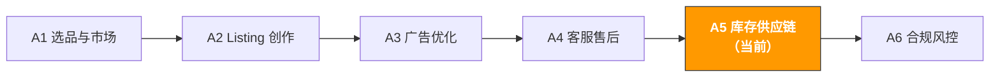

# A5. 库存与供应链 | Inventory & Supply Chain

> **路径**: Path A: 运营人 · **模块**: A5
> **最后更新**: 2026-03-12
> **难度**: 进阶
> **预计时间**: 每天 30 分钟，1-2 周
---

[Hub 首页](../../README.md) · [Path A 总览](README.md)



---

## 本模块章节导航

1. [库存方法论](#1-库存方法论ai-之前你需要理解的基础) · 2. [AI 工具全景](#2-ai-工具全景库存管理阶段用什么) · 3. [Prompt 模板库](#3-prompt-模板库库存专用) · 4. [库存实战工作流](#4-库存实战工作流) · 5. [常见陷阱](#5-常见库存陷阱) · 6. [进阶技巧](#6-进阶技巧) · 7. [学习资源](#7-学习资源) · 8. [ OpenClaw 自动化](#8-用-openclaw-自动化库存管理) · 9. [完成标志](#9-完成标志)


## 本模块你将学会

用 AI 工具把库存管理从"凭感觉补货"变成"数据驱动决策"。从安全库存计算到大促备货，建立一套可复用的 AI 辅助库存管理工作流。

完成本模块后，你将能够：
- 用 ChatGPT/Claude 建立补货决策模型，基于历史销量和 Lead Time 计算最优补货时间和数量
- 用 AI 计算安全库存水位，平衡缺货风险和资金占用，避免"要么断货要么滞销"的两难
- 用 AI 制定大促备货策略（Prime Day / BFCM），从 8 周前开始系统化准备
- 用 AI 分析 IPI Score 改善方案，避免仓储限制和超量费用
- 用 AI 评估供应商交期风险，建立供应链韧性
- 用 AI 优化多站点库存分配，在 US/EU/JP 之间合理分配库存

---

## 1. 库存方法论：AI 之前你需要理解的基础

> **相关阅读**: [D4 Walmart AI 指南](../d-platforms/d4-walmart-ai-guide.md) WFS vs FBA 物流成本对比和库存分配策略详见 D4。 · [D3 跨平台 AI 协同策略](../d-platforms/cross-platform-strategy.md) 跨平台库存协同详见 D3

### 1.1 库存管理的第一性原理

库存管理的本质是一个平衡问题：**缺货成本 vs 滞销成本**。

```
缺货成本 = 断货天数 × 日均销量 × 客单价 × 利润率 + 排名恢复成本
```
- 断货 1 天可能只损失当天销售额
- 断货 7 天以上，关键词排名下滑，恢复可能需要 2-4 周的广告投入
- 断货期间竞品抢占你的市场份额，部分客户可能永久流失

```
滞销成本 = 库存数量 × 单位仓储费 × 滞销天数 + 长期仓储费 + 资金占用成本
```
- FBA 月度仓储费：标准尺寸 $0.87/立方英尺（1-9月），$2.40/立方英尺（10-12月）
- 库龄超过 181 天开始收取 Aged Inventory Surcharge
- 库龄超过 365 天的费用更高，严重侵蚀利润
- 资金被库存占用，无法用于新品开发或广告投放

> **核心洞察**：对于大多数跨境卖家，缺货的隐性成本远大于滞销。一次断货可能导致 BSR 排名从 Top 50 掉到 Top 500，恢复需要几千美元的广告费。但滞销的成本是可预测和可控的。所以库存策略应该偏向"宁可多备一点"，但要设定明确的库龄预警线。

**安全库存公式：**

```
安全库存 = Z × σ_d × √L

其中：
Z = 服务水平系数（95% 服务水平 → Z = 1.65，99% → Z = 2.33）
σ_d = 日均销量的标准差（衡量销量波动）
L = Lead Time（从下单到入仓的天数）
```

**补货点公式（Reorder Point）：**

```
补货点 = 日均销量 × Lead Time + 安全库存
```

当库存降到补货点时，就应该下单补货。

**Lead Time 的组成：**

| 环节 | 典型时间 | 波动范围 |
|------|----------|----------|
| 供应商生产 | 15-30 天 | ±7 天 |
| 国内运输到港口 | 3-5 天 | ±2 天 |
| 海运（中国→美国西海岸） | 15-20 天 | ±5 天 |
| 清关 + 国内运输 | 5-10 天 | ±3 天 |
| FBA 入仓处理 | 5-14 天 | ±7 天（旺季更长） |
| **总计** | **43-79 天** | **波动很大** |

> **Lead Time 是库存管理中最大的不确定性来源**。FBA 入仓时间在旺季（Q4）可能从 5 天暴增到 21 天。你的安全库存计算必须考虑 Lead Time 的波动，而不是只用平均值。

### 1.2 Amazon FBA 库存关键指标

| 指标 | 定义 | 目标值 | 影响 |
|------|------|--------|------|
| **IPI Score** | Inventory Performance Index，综合库存健康评分 | ≥ 400（避免仓储限制） | 低于阈值会被限制 FBA 入仓数量 |
| **Sell-through Rate** | 过去 90 天销量 ÷ 平均库存 | > 3（即 90 天内库存周转 3 次） | IPI 的核心组成部分 |
| **Excess Inventory** | 超过 90 天预计销量的库存 | 越少越好 | 占用仓储空间，产生额外费用 |
| **Stranded Inventory** | 有库存但无法销售的 ASIN（Listing 问题） | 0 | 纯粹的成本浪费 |
| **In-stock Rate** | 有库存的天数 ÷ 总天数 | > 95% | 影响 BSR 排名和广告效果 |
| **Aged Inventory** | 库龄超过 90/180/270/365 天的库存 | 尽量减少 | 产生 Aged Inventory Surcharge |

**IPI Score 的构成（Amazon 不公开具体权重，但业界共识）：**

```
IPI Score ≈ f(Sell-through Rate, Excess Inventory %, Stranded Inventory %, In-stock Rate)
```

- **Sell-through Rate** 权重最高 卖得快的库存是好库存
- **Excess Inventory %** 超量库存占比越低越好
- **Stranded Inventory** 必须为 0，这是最容易修复的
- **In-stock Rate** 保持高库存率，但不要过度备货

Content rephrased for compliance with licensing restrictions. Sources: [goaura.com IPI score guide](https://goaura.com/blog/improving-your-amazon-ipi-score), [goaura.com inventory management](https://goaura.com/blog/amazon-inventory-management)

### 1.3 AI 在库存管理中的角色定位

AI 擅长的：
- **需求预测**：基于历史销量、季节性、趋势等数据预测未来需求，比人工"凭感觉"准确得多
- **补货计算**：综合考虑 Lead Time、安全库存、在途库存、仓储限制等多个变量，给出最优补货建议
- **异常检测**：发现销量突然变化（暴涨或暴跌），提前预警可能的缺货或滞销风险
- **场景模拟**：模拟不同备货策略的结果（乐观/基准/悲观），帮助决策
- **多变量优化**：在资金有限的情况下，优化多个 SKU 的库存分配

AI 不擅长的：
- **突发事件预测**：疫情、港口罢工、政策变化等黑天鹅事件无法预测
- **供应商关系管理**：谈判交期、争取优先排产需要人际关系
- **质量判断**：库存是否有质量问题（如过期、损坏）需要实物检查
- **现金流决策**：备货多少最终取决于你的资金状况和风险偏好，AI 只能提供建议

> **核心原则**：AI 是你的库存分析师，不是库存决策者。用 AI 做数据分析和方案生成，用人做最终决策。特别是大额采购决策（如大促备货），AI 的建议是参考，最终要结合你的资金状况、供应商关系和风险偏好来决定。

---

## 2. AI 工具全景：库存管理阶段用什么

### 2.1 付费工具深度评测

| 工具 | 价格 | 核心能力 | 适合谁 | AI 功能 |
|------|------|----------|--------|---------|
| [SoStocked](https://www.sostocked.com/) | $49-199/月 | 补货预测、季节性调整、多仓库管理、采购订单管理 | 中大型卖家（50+ SKU） | AI 需求预测、自动补货建议、季节性因子调整 |
| [RestockPro](https://goaura.com/blog/restockpro) | $59-249/月 | 补货建议、利润分析、供应商管理、FBA 发货计划 | 认真做库存管理的卖家 | AI 补货算法、利润预测、库龄预警 |
| [Forecastly](https://www.forecastly.com/) | $49-149/月 | 需求预测、缺货预警、补货建议 | 需要精准预测的卖家 | 机器学习需求预测、缺货风险评分 |
| [Inventory Lab](https://www.inventorylab.com/) | $69/月 | 利润追踪、库存管理、会计集成 | 需要利润分析的卖家 | 利润预测、库存周转分析 |
| Helium 10 Inventory Management | $79/月 (Platinum 含) | 补货建议、库存预警、利润仪表盘 | Helium 10 用户 | AI 补货建议、销量预测 |

**工具选择建议：**

**预算有限（<$50/月）**：ChatGPT/Claude + Excel + Amazon 官方工具
- 用 ChatGPT 做补货计算和场景分析
- 用 Excel 建立简单的库存追踪表
- 用 Amazon Restock Inventory 工具查看官方补货建议
- 适合 SKU 数量 < 20 的卖家

**认真做（$50-150/月）**：SoStocked 或 RestockPro + ChatGPT
- SoStocked/RestockPro 做日常补货管理和预警
- ChatGPT 做大促备货策略和异常分析
- 适合 SKU 数量 20-100 的卖家

**大卖家（$150+/月）**：RestockPro + SoStocked + 自建系统
- 付费工具做日常管理
- 自建 Python 脚本做定制化分析（参考 Path B）
- 适合 SKU 数量 100+ 或多站点运营的卖家

Content rephrased for compliance with licensing restrictions. Sources: [goaura.com RestockPro review](https://goaura.com/blog/restockpro), [selectedfirms.co AI inventory management](https://selectedfirms.co/blog/ai-in-ecommerce-inventory-management)

### 2.2 免费工具组合

| 工具 | 用途 | 链接 |
|------|------|------|
| ChatGPT / Claude | 补货计算、安全库存分析、大促备货策略、IPI 改善方案 | [chat.openai.com](https://chat.openai.com/) / [claude.ai](https://claude.ai/) |
| Amazon Restock Inventory | 官方补货建议工具，基于销量趋势给出补货数量和时间建议 | Seller Central → Inventory → Restock Inventory |
| Amazon FBA Revenue Calculator | 计算 FBA 费用、利润率，辅助库存决策 | [sellercentral.amazon.com/hz/fba/profitabilitycalculator](https://sellercentral.amazon.com/hz/fba/profitabilitycalculator/index) |
| Amazon Inventory Dashboard | 库存健康仪表盘，IPI Score、库龄分布、Stranded Inventory | Seller Central → Inventory → Inventory Dashboard |
| Google Sheets | 建立库存追踪表、补货计算模型 | [sheets.google.com](https://sheets.google.com/) |

**免费工具的使用策略：**

1. **Amazon Restock Inventory 是起点**：它基于你的历史销量给出补货建议，但它不考虑大促、季节性、新品上升期等因素。把它的建议作为基准，用 AI 做调整。
2. **FBA Revenue Calculator 做利润验证**：在决定备货量之前，先用 Revenue Calculator 确认每单利润。如果利润率太低，备太多货反而是风险。
3. **ChatGPT 做场景分析**：把销量数据、Lead Time、资金预算等信息给 ChatGPT，让它模拟乐观/基准/悲观三种场景的备货方案。
4. **Google Sheets 做持续追踪**：建立一个简单的库存追踪表，每周更新库存数量、在途数量、预计到货日期，用 AI 帮你设计公式和预警规则。

### 2.3 开源工具与 API

| 工具/API | 用途 | GitHub/链接 |
|----------|------|-------------|
| [Facebook Prophet](https://facebook.github.io/prophet/) | 时间序列预测，适合有季节性的销量预测 | [github.com/facebook/prophet](https://github.com/facebook/prophet) |
| pandas + numpy | 数据处理和分析，库存计算的基础工具 | [pandas.pydata.org](https://pandas.pydata.org/) |
| python-amazon-sp-api | SP-API Python 封装，含 Inventory API（库存数据）和 Reports API（销量报告） | [github.com/saleweaver/python-amazon-sp-api](https://github.com/saleweaver/python-amazon-sp-api) |
| statsmodels | 统计建模，含 ARIMA 等经典时间序列模型 | [github.com/statsmodels/statsmodels](https://github.com/statsmodels/statsmodels) |
| scikit-learn | 机器学习库，可用于需求预测和异常检测 | [github.com/scikit-learn/scikit-learn](https://github.com/scikit-learn/scikit-learn) |

**什么时候用开源工具？**

如果你管理 50+ SKU 或需要精准的季节性预测，开源工具可以：
- **自动化预测**：用 Prophet 对每个 SKU 做时间序列预测，自动考虑季节性、趋势和节假日效应
- **批量计算**：用 pandas 批量计算所有 SKU 的安全库存、补货点和补货量
- **自动预警**：用 Python 脚本每天检查库存水位，自动发送缺货预警邮件

> 更多技术实现细节，参考 [Path B: 技术人](../b-developers/) 的相关模块。

---

## 3. Prompt 模板库（库存专用）

> 本节提供每个模板的深度解析、常见错误和进阶变体。

### 3.1 补货决策分析

**为什么这个 Prompt 有效：** 它要求 AI 综合考虑日均销量、波动范围、当前库存、在途库存和 Lead Time 五个关键变量，输出三种场景的补货建议。关键设计点：
- "波动范围 min-max" 让 AI 理解销量不确定性，而不是只用平均值
- "乐观/基准/悲观三种场景" 强制 AI 做风险分析而非单一预测
- "资金占用估算" 把库存决策和资金决策关联起来

**常见错误：**
- 只提供平均销量 → 日均 10 件但波动范围 3-25 件，安全库存需求完全不同。必须提供波动范围
- 忽略在途库存 → 如果有 500 件在途，实际可用库存 = 当前库存 + 在途库存
- Lead Time 用平均值 → Lead Time 的波动比销量波动影响更大。用最近 3 次的实际 Lead Time，取最大值作为安全值
- 不考虑仓储限制 → IPI Score 低于阈值时，FBA 入仓数量有上限。补货量不能超过限制

```
我的产品数据：
- 过去90天日均销量：[X] 件（波动范围 [min]-[max]）
- 当前 FBA 库存：[X] 件
- 在途库存：[X] 件（预计 [X] 天后到仓）
- 从下单到入仓的 Lead Time：[X] 天（最近3次实际值：[X]、[X]、[X] 天）
- 安全库存天数目标：[X] 天
- 单件采购成本：$[X]
- 单件 FBA 仓储费（月）：$[X]
- 当前 IPI Score：[X]
- FBA 仓储限制：[X] 件（如有）

请计算：
1. 当前库存可支撑天数（含在途库存）
2. 安全库存数量（用公式说明计算过程）
3. 补货点（Reorder Point）
4. 建议采购量（乐观/基准/悲观三种场景）
5. 最晚采购下单日期
6. 如果有大促（如 Prime Day），需要额外备多少
7. 资金占用估算（采购成本 + 预计仓储费）
8. 风险提示（缺货风险 vs 滞销风险的平衡建议）
```


**进阶变体：**

**变体 A 多 SKU 批量补货优先级：**

```
我有以下 SKU 需要补货决策，但资金有限（总预算 $[X]）：

SKU 1: [产品名]
- 日均销量：[X] 件，当前库存：[X] 件，Lead Time：[X] 天
- 单件成本：$[X]，单件利润：$[X]

SKU 2: [产品名]
- 日均销量：[X] 件，当前库存：[X] 件，Lead Time：[X] 天
- 单件成本：$[X]，单件利润：$[X]

[更多 SKU...]

请完成：
1. 每个 SKU 的缺货紧急度评分（基于库存可支撑天数 vs Lead Time）
2. 每个 SKU 的利润贡献排名
3. 在预算限制下的最优补货分配方案
4. 如果预算增加 20%/50%，分配方案如何变化
5. 哪些 SKU 可以延迟补货？延迟的风险是什么？
```

> **为什么用这个变体**：资金有限时，不是所有 SKU 都能同时补货。优先补利润高、缺货风险大的 SKU，延迟补利润低、库存充足的 SKU。AI 可以帮你做这个多变量优化。

**变体 B 新品首批备货量估算：**

```
我准备发布一个新产品，需要估算首批 FBA 备货量：

产品信息：
- 品类：[品类]
- 售价：$[X]
- 竞品日均销量范围：[X]-[X] 件（来自 Helium 10/Jungle Scout）
- 我的目标市场份额：[X]%
- 计划广告预算：$[X]/天
- Lead Time（从下单到入仓）：[X] 天

请分析：
1. 基于竞品数据，预估我的日均销量范围（保守/中等/乐观）
2. 首批备货量建议（覆盖 [X] 天的销量 + 安全库存）
3. 首批备货的资金需求
4. 如果首批卖得比预期快/慢，第二批补货策略
5. 新品期的库存风险提示（卖不动怎么办？卖太快怎么办？）
```

> **为什么用这个变体**：新品没有历史数据，只能基于竞品数据和市场分析估算。首批备货的原则是"宁少勿多" 先用小批量测试市场反应，确认产品能卖之后再大量补货。

---

### 3.2 安全库存计算

**为什么这个 Prompt 有效：** 安全库存不是拍脑袋决定的"多备 30 天"，而是基于销量波动和 Lead Time 波动的数学计算。这个 Prompt 要求 AI 用公式计算，并解释每个参数的含义，帮你理解"为什么是这个数字"。

**常见错误：**
- 用固定天数代替公式 → "安全库存 = 30 天销量"太粗糙。销量波动大的产品需要更多安全库存，波动小的需要更少
- 不考虑 Lead Time 波动 → Lead Time 从 45 天变成 60 天，安全库存需要相应增加
- 所有 SKU 用同一个安全库存标准 → 高利润产品可以多备（缺货成本高），低利润产品少备（滞销成本相对更高）

```
请帮我计算以下产品的安全库存：

产品数据：
- 过去 180 天的月销量数据：[1月X件, 2月X件, 3月X件, 4月X件, 5月X件, 6月X件]
- 日均销量标准差：[X]（如果不知道，请根据月销量数据计算）
- Lead Time 数据（最近 5 次）：[X天, X天, X天, X天, X天]
- 目标服务水平：[95% / 99%]（95% 意味着允许 5% 的概率缺货）
- 单件成本：$[X]
- 单件售价：$[X]
- 月仓储费：$[X]/件

请计算：
1. 日均销量和标准差
2. Lead Time 均值和标准差
3. 安全库存数量（用公式 Z × σ_d × √L，展示计算过程）
4. 补货点（Reorder Point = 日均销量 × Lead Time + 安全库存）
5. 安全库存的资金占用成本
6. 如果将服务水平从 95% 提高到 99%，安全库存增加多少？值得吗？
7. 建议：这个产品应该用 95% 还是 99% 的服务水平？为什么？
```

---

### 3.3 季节性需求预测

**为什么这个 Prompt 重要：** 很多跨境产品有明显的季节性 户外产品夏天卖得好，取暖产品冬天卖得好，礼品类产品 Q4 是旺季。如果不考虑季节性，你会在旺季缺货、淡季滞销。

**常见错误：**
- 用全年平均销量预测每个月 → 如果 Q4 销量是 Q1 的 3 倍，用平均值会导致 Q4 严重缺货
- 只看去年同期 → 今年的增长趋势、市场变化、竞品情况都可能不同
- 不区分季节性和趋势 → 销量上升可能是季节性（会回落）也可能是趋势（会持续），应对策略不同

```
请帮我分析产品的季节性需求并预测未来 6 个月的销量：

历史销量数据（月度）：
- 去年：[1月X, 2月X, 3月X, ..., 12月X]
- 今年已有：[1月X, 2月X, ...]

产品信息：
- 品类：[品类]
- 主要市场：Amazon [US/DE/JP]
- 是否有明显季节性：[是/否/不确定]
- 今年 vs 去年的整体增长率：[X]%

请分析：
1. 季节性模式识别：
- 旺季是哪几个月？淡季是哪几个月？
- 旺季销量是淡季的多少倍？
- 季节性因子表（每月的季节性系数）

2. 未来 6 个月销量预测：
- 基准预测（考虑季节性 + 增长趋势）
- 乐观预测（+20%）
- 悲观预测（-20%）

3. 备货建议：
- 每月建议库存水位
- 关键补货时间节点（考虑 Lead Time）
- 旺季前需要提前多久开始备货？

4. 风险提示：
- 如果季节性比预期弱/强，应该如何调整？
- 哪些外部因素可能影响季节性模式？
```

---

### 3.4 大促备货策略（Prime Day / BFCM）

**为什么这个 Prompt 重要：** Prime Day 和 BFCM 是 Amazon 全年最大的两个促销活动。大促期间销量可能是平时的 3-10 倍，但备货过多又会在大促后变成滞销库存。这个 Prompt 帮你制定系统化的大促备货计划。

**常见错误：**
- 只看去年大促数据 → 今年的折扣力度、广告预算、竞品策略都可能不同
- 不考虑大促前后的销量变化 → 大促前 1-2 周销量会下降（消费者等待折扣），大促后 1-2 周销量也会下降（需求被提前消耗）
- 备货太晚 → FBA 入仓在大促前 2-4 周会变慢，必须提前 6-8 周发货
- 不设止损线 → 如果大促效果不如预期，多余的库存怎么处理？需要提前想好

```
请帮我制定 [Prime Day / BFCM] 备货策略：

产品信息：
- 产品名称：[名称]
- 日均销量（近 30 天）：[X] 件
- 去年同期大促数据：
- 大促期间日均销量：[X] 件（是平时的 [X] 倍）
- 大促持续天数：[X] 天
- 大促前 2 周日均销量变化：[X]%
- 大促后 2 周日均销量变化：[X]%
- 当前 FBA 库存：[X] 件
- Lead Time：[X] 天
- 计划折扣力度：[X]% off
- 计划广告预算增幅：[X]%
- 大促日期：[日期]

请制定：
1. 大促销量预测：
- 基于去年数据 + 今年增长趋势 + 折扣力度调整
- 乐观/基准/悲观三种场景

2. 备货量计算：
- 大促期间需求量
- 大促前后缓冲库存
- 安全库存
- 总备货量

3. 时间线规划：
- 最晚下单日期（倒推 Lead Time）
- 最晚发货日期
- FBA 入仓截止日期
- 关键检查节点

4. 资金需求：
- 采购成本
- 头程物流成本
- 预计仓储费
- 总资金需求

5. 风险预案：
- 如果大促销量只有预期的 50%，多余库存怎么处理？
- 如果大促销量超过预期 150%，如何紧急补货？
- 止损线设定：大促后多少天内库存必须降到什么水位？
```

> **大促备货的核心原则**：宁可少备也不要多备太多。大促后的滞销库存会在 Q4 高仓储费期间产生巨额费用。建议备货量 = 基准场景需求 × 1.2（留 20% 缓冲），而不是按乐观场景备货。

---

### 3.5 多站点库存分配

**为什么这个 Prompt 重要：** 如果你同时运营 US、EU（DE/FR/IT/ES/UK）、JP 多个站点，库存分配是一个复杂的优化问题。每个站点的销量、仓储费、Lead Time 都不同，需要在有限的总库存中做最优分配。

**常见错误：**
- 按销量比例简单分配 → 没有考虑各站点的 Lead Time 差异和仓储费差异
- 忽略欧洲站的 Pan-EU 和 EFN 选择 → Pan-EU 可以在欧洲各国仓库之间自动调拨，EFN 只从一个国家发货
- 不考虑汇率和利润率差异 → 同一产品在不同站点的利润率可能差很多

```
我的产品在多个 Amazon 站点销售，请帮我优化库存分配：

总可用库存：[X] 件（或总采购预算：$[X]）

各站点数据：
US 站：
- 日均销量：[X] 件，Lead Time：[X] 天
- 当前库存：[X] 件，月仓储费：$[X]/件
- 单件利润：$[X]

EU 站（DE 为主仓）：
- 日均销量：[X] 件，Lead Time：[X] 天
- 当前库存：[X] 件，月仓储费：€[X]/件
- 单件利润：€[X]
- 物流模式：[Pan-EU / EFN]

JP 站：
- 日均销量：[X] 件，Lead Time：[X] 天
- 当前库存：[X] 件，月仓储费：¥[X]/件
- 单件利润：¥[X]

请优化：
1. 各站点的目标库存水位（天数）
2. 本次补货的分配方案
3. 各站点的缺货风险评估
4. 如果总库存不足以满足所有站点，优先保哪个站点？为什么？
5. 各站点的库存周转率对比和改善建议
```

---

### 3.6 滞销库存处理策略

**为什么这个 Prompt 重要：** 滞销库存是利润的隐形杀手。库龄超过 180 天的库存不仅占用仓储空间，还会产生 Aged Inventory Surcharge，拉低 IPI Score。及时处理滞销库存是库存管理的重要环节。

**常见错误：**
- 等到收到长期仓储费通知才处理 → 应该在库龄 90 天时就开始关注，120 天时采取行动
- 只想到降价清仓 → 还有创建 Removal Order、转移到其他渠道、捆绑销售等多种方式
- 不计算处理成本 → 有时候销毁比运回更划算（运回的物流费可能超过产品价值）

```
以下是我的滞销库存清单：

SKU 1: [产品名]
- 库存数量：[X] 件
- 库龄：[X] 天
- 原售价：$[X]，当前售价：$[X]
- 单件成本：$[X]
- 过去 30 天销量：[X] 件
- FBA 月仓储费：$[X]/件
- 预计 Aged Inventory Surcharge：$[X]/件

[更多 SKU...]

请为每个 SKU 制定处理策略：
1. 策略选项评估（每个选项的成本和收益）：
- 降价促销（降到什么价格？预计多久清完？）
- 创建 Lightning Deal 或 Coupon
- 创建 Removal Order（运回 vs 销毁的成本对比）
- 转移到其他销售渠道（eBay、独立站、线下清仓）
- 捆绑销售（与畅销品搭配）
- 捐赠（FBA Donations 计划）

2. 推荐策略和执行时间线
3. 预计回收金额 vs 继续持有的成本对比
4. 如何避免未来再出现类似滞销？
```

---

### 3.7 供应商交期风险评估

**为什么这个 Prompt 重要：** 供应商交期延迟是导致缺货的最常见原因之一。提前评估供应商的交期风险，建立备选方案，可以大幅降低缺货概率。

**常见错误：**
- 只有一个供应商 → 单一供应商风险极高，一旦出问题就断货
- 不追踪历史交期数据 → 没有数据就无法评估风险
- 不考虑季节性因素 → 春节前后、国庆期间供应商产能会大幅下降

```
请帮我评估供应商交期风险并制定应对方案：

供应商信息：
供应商 A（主供应商）：
- 合作时间：[X] 年
- 过去 12 个月的交期记录：[X天, X天, X天, ...]（每次下单到发货的天数）
- 最近一次延迟原因：[原因]
- 产能：[X] 件/月
- 最小起订量（MOQ）：[X] 件

供应商 B（备选供应商，如有）：
- [类似信息]

我的需求：
- 月均采购量：[X] 件
- 下一次大批量采购时间：[日期]
- 是否有大促备货需求：[是/否]

请分析：
1. 供应商 A 的交期可靠性评分（基于历史数据）
2. 交期延迟的概率和预期延迟天数
3. 如果供应商 A 延迟 [X] 天，对库存的影响
4. 备选方案：
- 是否需要发展第二供应商？
- 是否需要增加安全库存来缓冲交期风险？
- 关键时期（大促前、春节前）是否需要提前下单？
5. 供应商管理建议：
- 如何与供应商沟通以减少延迟？
- 合同中应该包含哪些交期保障条款？
```

---

### 3.8 IPI Score 改善方案

**为什么这个 Prompt 重要：** IPI Score 低于阈值（目前是 400 分）会导致 FBA 仓储限制，直接影响你的补货能力。改善 IPI Score 需要从 Sell-through Rate、Excess Inventory、Stranded Inventory 三个维度同时优化。

**常见错误：**
- 只关注 IPI Score 数字，不分析具体原因 → 需要知道是哪个维度拖了后腿
- 通过减少库存来提高 Sell-through Rate → 这会增加缺货风险，得不偿失
- 忽略 Stranded Inventory → 这是最容易修复的维度，但很多卖家不检查

```
我的 IPI Score 需要改善，请帮我制定改善方案：

当前数据：
- IPI Score：[X] 分（目标：≥ 400）
- Sell-through Rate：[X]（过去 90 天销量 ÷ 平均库存）
- Excess Inventory：[X] 个 ASIN，[X] 件
- Stranded Inventory：[X] 个 ASIN，[X] 件
- In-stock Rate：[X]%
- 当前仓储限制：[X] 立方英尺（如有）

Excess Inventory 详情：
[列出库龄超过 90 天的 ASIN、数量、库龄]

Stranded Inventory 详情：
[列出 Stranded 的 ASIN 和原因]

请制定改善方案：
1. 诊断：IPI Score 低的主要原因是什么？
2. 快速修复（1 周内）：
- Stranded Inventory 处理方案
- 最紧急的 Excess Inventory 处理
3. 中期改善（1-3 个月）：
- Sell-through Rate 提升策略
- Excess Inventory 系统性清理计划
4. 长期预防：
- 补货策略调整（避免过度备货）
- 库存监控频率和预警机制
5. 预计改善时间线和目标 IPI Score
```

Content rephrased for compliance with licensing restrictions. Sources: [goaura.com IPI score improvement](https://goaura.com/blog/improving-your-amazon-ipi-score), [impakter.com FBA AI forecasting](https://impakter.com/the-2026-playbook-fba-prep-services-ai-forecasting-and-greener-3pl-operations/)

---

## 4. 库存实战工作流

### 4.1 月度补货 SOP

每月执行一次的系统化补货流程，确保所有 SKU 的库存水位健康。

```

Step 1: 数据收集（30 分钟）
操作: 导出以下数据
- Seller Central → Inventory → Manage Inventory（库存）
- Business Reports → Sales（过去 90 天销量）
- Inventory Dashboard → IPI Score 和库龄分布
- 在途库存清单（采购订单追踪表）
AI: 将数据整理成标准格式，粘贴给 ChatGPT

Step 2: 库存健康检查（20 分钟）
检查: IPI Score 是否 ≥ 400？
检查: 是否有 Stranded Inventory？→ 立即修复
检查: 是否有库龄 > 90 天的库存？→ 标记处理
检查: 是否有即将缺货的 SKU？（库存 < 14 天销量）
AI: 用 IPI 改善方案 Prompt（3.8）诊断问题

Step 3: 补货计算（30 分钟）
AI: 用补货决策分析 Prompt（3.1）逐个 SKU 计算
或: 用多 SKU 批量补货变体（3.1 变体 A）批量处理
输出: 每个 SKU 的建议补货量、最晚下单日期
审核: 人工检查 AI 建议，结合资金状况调整

Step 4: 采购下单（20 分钟）
操作: 向供应商下达采购订单
记录: 更新采购订单追踪表（供应商、数量、预计交期）
确认: 与供应商确认交期和质量要求

Step 5: 滞销库存处理（20 分钟）
操作: 处理 Step 2 中标记的滞销库存
AI: 用滞销库存处理策略 Prompt（3.6）制定方案
执行: 创建促销/Removal Order/转移渠道

```

### 4.2 大促备货 SOP（Prime Day / BFCM 前 8 周计划）

大促备货是一个 8 周的系统化过程，不是大促前 2 周才开始准备。

```

Week 8（大促前 8 周）: 需求预测
操作: 收集去年大促数据 + 今年增长趋势
AI: 用大促备货策略 Prompt（3.4）预测大促销量
输出: 乐观/基准/悲观三种场景的备货量
决策: 确定备货量（建议用基准 × 1.2）

Week 7: 供应商沟通
操作: 向供应商下达大促采购订单
确认: 交期承诺、质量标准、紧急加单的可能性
AI: 用供应商交期风险评估 Prompt（3.7）评估风险
备选: 如果主供应商产能不足，联系备选供应商

Week 6: 头程物流安排
操作: 预订海运/空运舱位
注意: 大促前物流资源紧张，提前预订
决策: 海运 vs 空运（见进阶技巧 6.3）
追踪: 更新物流追踪表，确认预计到港日期

Week 5: 质检和发货
操作: 工厂质检 → 装箱 → 发货
检查: 产品质量、包装完整性、标签正确性
发货: 按 FBA 要求准备发货计划

Week 4: 入仓追踪
操作: 追踪货物运输状态
预警: 如果物流延迟，启动备选方案（空运补货）
准备: 开始准备大促 Listing 优化和广告计划

Week 3: FBA 入仓
操作: 货物到达 FBA 仓库，等待入仓处理
注意: 大促前入仓速度可能变慢，预留缓冲时间
检查: 入仓数量是否正确？是否有 Stranded Inventory？

Week 2: 最终确认
检查: 库存是否全部入仓可售？
检查: 大促 Deal 是否已提交并通过？
检查: 广告预算和竞价是否已调整？
准备: 大促期间的客服模板（参考 A4 模块）

Week 1: 大促执行
监控: 每天检查库存消耗速度
调整: 如果消耗比预期快，考虑提高售价或减少广告
记录: 记录每天的销量数据，用于下次大促参考

```

> **大促备货的核心教训**：大部分卖家的大促失败不是因为"卖不动"，而是因为"备货不够"或"备货太晚"。8 周的准备时间看起来很长，但考虑到供应商生产 + 海运 + FBA 入仓的时间，其实刚刚好。

### 4.3 新品首批备货 SOP

新品没有历史数据，首批备货需要特别谨慎。

```

Step 1: 市场调研（参考 A1 选品模块）
操作: 用 Helium 10/Jungle Scout 调研竞品销量
数据: 竞品日均销量范围、市场容量、季节性
AI: 用新品首批备货 Prompt（3.1 变体 B）估算销量

Step 2: 首批备货量决策
原则: 首批备货 = 30-45 天预计销量（保守估计）
理由: 新品不确定性高，先小批量测试市场反应
计算: 预计日均销量 × 45 天 × 0.7（保守系数）
资金: 确认采购资金和头程物流费用在预算内

Step 3: 同步准备第二批
操作: 首批发货的同时，与供应商确认第二批的交期
触发: 如果首批上架后日均销量达到预期的 80%，立即下单
数量: 第二批 = 60-90 天预计销量（基于实际数据调整）

Step 4: 上架后监控
频率: 每天检查销量和库存
预警: 如果销量远超预期，紧急空运补货
调整: 如果销量远低于预期，暂停第二批采购
AI: 每周用 AI 分析销量趋势，调整补货计划

```

> **新品备货的核心原则**：首批宁少勿多。新品失败率很高，如果首批备了 3000 件但只卖出 300 件，剩下的 2700 件就是纯亏损。先用 500-1000 件测试市场，确认能卖再大量补货。

---

## 5. 常见库存陷阱

### 5.1 缺货相关陷阱

| 陷阱 | 表现 | 如何避免 |
|------|------|----------|
| **Lead Time 估算过于乐观** | 用最短的一次 Lead Time 做计划，结果延迟导致断货 | 用最近 3-5 次 Lead Time 的最大值（而非平均值）做安全计算。旺季额外加 7-14 天缓冲。 |
| **忽略 FBA 入仓时间** | 货到美国仓库 ≠ 可售。FBA 入仓处理需要 5-14 天，旺季更长 | 在 Lead Time 中单独列出 FBA 入仓时间，旺季按 21 天计算。 |
| **不监控在途库存** | 不知道有多少货在路上、什么时候到，导致重复下单或漏下单 | 建立采购订单追踪表，每周更新物流状态。 |
| **大促前备货不足** | 低估大促销量倍数，大促第一天就断货 | 用去年大促数据 × 1.2 作为基准备货量。宁可多备 20% 也不要断货。 |
| **新品首批备货过少** | 新品上架后卖得好但很快断货，错过最佳推广窗口 | 首批备货同时准备第二批，设定触发条件自动下单。 |

### 5.2 滞销相关陷阱

| 陷阱 | 表现 | 如何避免 |
|------|------|----------|
| **过度备货** | 凭感觉"多备点"，结果库龄超过 180 天产生高额仓储费 | 用安全库存公式计算，不要凭感觉。设定库龄 90 天预警线。 |
| **不及时处理滞销** | 等到收到长期仓储费通知才处理，已经产生大量费用 | 每月检查库龄分布（月度 SOP Step 2），库龄 > 90 天立即制定处理方案。 |
| **降价清仓太晚** | 库龄 300 天才开始降价，已经产生了大量仓储费 | 库龄 120 天开始降价促销，180 天考虑 Removal Order。 |
| **季节性产品不清仓** | 夏季产品到了秋天还在仓库，等明年夏天再卖 | 季节性产品在旺季结束前 1 个月开始清仓，不要等到淡季。 |
| **新品失败不止损** | 新品上架 3 个月卖不动，但一直不处理 | 新品上架 60 天后评估，如果日均销量 < 预期的 30%，启动清仓流程。 |

### 5.3 资金相关陷阱

| 陷阱 | 表现 | 如何避免 |
|------|------|----------|
| **库存占用过多资金** | 80% 的资金被库存占用，没有钱做广告和新品开发 | 设定库存资金占比上限（建议 < 60%），超过就减少备货量。 |
| **不计算库存持有成本** | 只看采购成本，忽略仓储费、资金成本、滞销风险 | 库存总成本 = 采购成本 + 头程物流 + 仓储费 + 资金占用成本（年化 8-12%）。 |
| **大促备货透支现金流** | 大促前大量采购，但大促后回款需要 2-4 周，现金流断裂 | 大促备货预算不超过可用资金的 50%，预留现金流缓冲。 |
| **多站点分散资金** | 每个站点都备了一点货，但每个站点都不够 | 集中资源在 1-2 个主力站点，其他站点用最小库存维持。 |

### 5.4 物流相关陷阱

| 陷阱 | 表现 | 如何避免 |
|------|------|----------|
| **只用海运** | 海运便宜但慢（30-45 天），紧急补货时来不及 | 常规补货用海运，紧急补货用空运。保持 10-20% 的空运预算。 |
| **不预订舱位** | 旺季（Q4）海运舱位紧张，临时订不到或价格翻倍 | Q4 备货的海运舱位在 8-9 月就要预订。 |
| **清关问题导致延迟** | 产品文件不齐全，被海关扣留 | 提前准备好所有清关文件（发票、装箱单、合规证书）。 |
| **FBA 发货计划错误** | 标签错误、数量不符、包装不合规，被 FBA 拒收 | 严格按 FBA 发货要求准备，发货前做最终检查。 |

---

## 6. 进阶技巧

### 6.1 AI 需求预测：Prophet 简介

当你的 SKU 数量超过 20 个，手动用 ChatGPT 逐个预测不现实。Facebook Prophet 是一个开源的时间序列预测工具，特别适合有季节性的销量预测。

**什么时候用 Prophet vs 什么时候用简单规则？**

| 场景 | 推荐方法 | 理由 |
|------|----------|------|
| SKU < 20，无明显季节性 | ChatGPT + Excel | 简单规则足够，不需要复杂模型 |
| SKU < 20，有季节性 | ChatGPT + 季节性 Prompt（3.3） | AI 可以理解季节性模式 |
| SKU 20-100，有季节性 | Prophet | 批量预测效率高，自动处理季节性 |
| SKU 100+，多站点 | Prophet + 自建系统 | 需要自动化流程 |
| 新品（无历史数据） | ChatGPT + 竞品数据 | Prophet 需要历史数据，新品用不了 |

**Prophet 快速入门（伪代码）：**

```python
# 1. 准备数据：日期 + 销量
# 格式：ds (日期), y (销量)
import pandas as pd
from prophet import Prophet

df = pd.DataFrame({
'ds': ['2025-01-01', '2025-01-02', ...], # 日期
'y': [10, 12, 8, ...] # 日销量
})

# 2. 训练模型
model = Prophet(
yearly_seasonality=True, # 年度季节性
weekly_seasonality=True, # 周度季节性（周末销量可能不同）
changepoint_prior_scale=0.05 # 趋势变化灵敏度
)
model.fit(df)

# 3. 预测未来 90 天
future = model.make_future_dataframe(periods=90)
forecast = model.predict(future)

# 4. 输出：预测值 + 置信区间
# forecast[['ds', 'yhat', 'yhat_lower', 'yhat_upper']]
# yhat = 预测值, yhat_lower/upper = 80% 置信区间
```

> **Prophet 的核心优势**：它自动处理季节性、趋势变化和节假日效应，不需要你手动设定参数。对于有 1 年以上历史数据的产品，Prophet 的预测准确度通常优于人工判断。详细实现参考 [Path B: 技术人](../b-developers/) 的相关模块。

Content rephrased for compliance with licensing restrictions. Source: [Facebook Prophet documentation](https://facebook.github.io/prophet/)

### 6.2 多渠道库存同步（Amazon + Shopify + 独立站）

如果你同时在 Amazon、Shopify 和独立站销售，库存同步是一个关键挑战。同一批库存在多个渠道销售，如果不同步，可能出现超卖（已卖完但其他渠道还在卖）。

**多渠道库存管理框架：**

```

Amazon Shopify 独立站
FBA 仓库 自发货 自发货


库存中心系统
(总库存池)

```

**策略选择：**

| 策略 | 适合谁 | 优点 | 缺点 |
|------|--------|------|------|
| **FBA 为主 + MCF** | Amazon 为主的卖家 | 用 FBA 库存发其他渠道的订单（Multi-Channel Fulfillment） | MCF 费用比 FBA 高，时效可能慢 |
| **分仓管理** | 各渠道销量均衡的卖家 | 每个渠道独立库存，不互相影响 | 需要更多总库存，资金占用高 |
| **3PL 统一仓储** | 多渠道大卖家 | 一个仓库发所有渠道，库存利用率最高 | 需要 3PL 合作，管理复杂度高 |

**AI 辅助多渠道库存分配：**

```
我同时在以下渠道销售，请帮我优化库存分配：

总可用库存：[X] 件

渠道数据：
Amazon FBA：日均 [X] 单，利润率 [X]%，Lead Time [X] 天
Shopify：日均 [X] 单，利润率 [X]%，自发货
独立站：日均 [X] 单，利润率 [X]%，自发货

请建议：
1. 各渠道的库存分配比例
2. 是否应该用 FBA MCF 发其他渠道的订单？
3. 库存同步策略（如何避免超卖？）
4. 如果总库存不足，优先保哪个渠道？
```

### 6.3 头程物流优化：海运 vs 空运 vs 铁路

头程物流成本通常占产品总成本的 10-20%，选择正确的物流方式可以显著影响利润。

**物流方式对比：**

| 维度 | 海运 | 空运 | 铁路（中欧班列） |
|------|------|------|------------------|
| **时效** | 30-45 天 | 7-12 天 | 18-25 天 |
| **成本** | $3-6/kg | $8-15/kg | $5-8/kg |
| **适合** | 大批量、不紧急 | 小批量、紧急补货 | 欧洲站、中等批量 |
| **最小起运量** | 1 CBM 或整柜 | 无最小限制 | 1 CBM |
| **风险** | 港口拥堵、天气延迟 | 航班取消、旺季涨价 | 线路不稳定 |
| **适用路线** | 全球 | 全球 | 中国→欧洲 |

**决策框架：**

```
需要补货
库存可支撑 > 45 天？
是 → 海运（成本最低）
库存可支撑 15-45 天？
目的地是欧洲？→ 考虑铁路（性价比）
其他 → 海运 + 少量空运（混合策略）
库存可支撑 < 15 天？
空运（紧急补货，避免断货）
已经断货？
空运最快批次 + 海运大批量（双管齐下）
```

**AI 辅助物流决策：**

```
请帮我选择最优的头程物流方式：

货物信息：
- 产品重量：[X] kg/件，体积：[X] CBM/件
- 本次发货数量：[X] 件
- 总重量：[X] kg，总体积：[X] CBM
- 出发地：[城市]
- 目的地：Amazon [US/DE/JP] FBA 仓库

时间要求：
- 当前库存可支撑：[X] 天
- 期望到仓日期：[日期]

物流报价（如有）：
- 海运：$[X]/kg 或 $[X]/CBM，时效 [X] 天
- 空运：$[X]/kg，时效 [X] 天
- 铁路：$[X]/kg（如适用），时效 [X] 天

请分析：
1. 各物流方式的总成本对比
2. 各方式的到仓时间和缺货风险
3. 推荐方案（考虑成本和时效的平衡）
4. 是否建议混合方式（如 70% 海运 + 30% 空运）？
5. 如果物流延迟 [X] 天，对库存的影响和应对方案
```

> **头程物流的核心原则**：常规补货用海运控制成本，紧急补货用空运保证不断货。建议每次海运发货时，预留 10-20% 的空运预算作为应急。
---
Content rephrased for compliance with licensing restrictions. Source: [impakter.com FBA prep and 3PL operations](https://impakter.com/the-2026-playbook-fba-prep-services-ai-forecasting-and-greener-3pl-operations/)

---

## 7. 学习资源

### 7.1 免费课程

| 资源 | 平台 | 时长 | 适合谁 | 链接 |
|------|------|------|--------|------|
| Amazon Seller University Inventory Management | Amazon | 自学 | 所有卖家（官方免费课程，覆盖 FBA 库存管理、IPI Score、补货工具） | [sellercentral.amazon.com/learn](https://sellercentral.amazon.com/learn) |
| Supply Chain Management Specialization | Coursera (Rutgers) | 16 周 | 想系统学习供应链的卖家（库存理论、需求预测、供应商管理） | [coursera.org](https://www.coursera.org/specializations/supply-chain-management) |
| ChatGPT Prompt Engineering for Developers | DeepLearning.AI | 1.5h | 所有人（学会写好 Prompt 是 AI 库存分析的基础） | [deeplearning.ai](https://www.deeplearning.ai/short-courses/chatgpt-prompt-engineering-for-developers/) |
| Prophet Quick Start Guide | Facebook/Meta | 1h | 有 Python 基础的卖家（时间序列预测入门） | [facebook.github.io/prophet](https://facebook.github.io/prophet/docs/quick_start.html) |

### 7.2 YouTube 频道推荐

| 频道 | 内容方向 | 为什么推荐 |
|------|----------|-----------|
| My Amazon Guy | Amazon 运营全流程，含库存管理和 IPI Score 优化 | 内容全面，有大量真实案例和数据 |
| Seller Sessions | Amazon 卖家深度访谈，含供应链和库存策略 | 真实卖家经验，实操性强 |
| Jungle Scout | 选品和库存管理工具教程，含需求预测功能 | 工具使用的最佳教程来源 |
| Travis Marziani | Amazon FBA 运营，含库存管理和现金流优化 | 适合中小卖家，讲解清晰 |

### 7.3 推荐阅读

| 文章/资源 | 来源 | 核心观点 |
|-----------|------|----------|
| [Improving Your Amazon IPI Score](https://goaura.com/blog/improving-your-amazon-ipi-score) | GoAura | IPI Score 改善全指南，含四个维度的具体优化策略和常见误区 |
| [Amazon Inventory Management Guide](https://goaura.com/blog/amazon-inventory-management) | GoAura | Amazon 库存管理系统化方法，从基础指标到高级策略 |
| [RestockPro Review](https://goaura.com/blog/restockpro) | GoAura | RestockPro 工具深度评测，含功能对比和使用场景分析 |
| [AI in E-Commerce Inventory Management](https://selectedfirms.co/blog/ai-in-ecommerce-inventory-management) | SelectedFirms | AI 在电商库存管理中的应用全景，含需求预测、自动补货等场景 |
| [FBA Prep Services, AI Forecasting and Greener 3PL](https://impakter.com/the-2026-playbook-fba-prep-services-ai-forecasting-and-greener-3pl-operations/) | Impakter | 2026 年 FBA 运营趋势，含 AI 预测和绿色物流 |
| [How to Use AI to Grow Your Amazon Sales](https://us.entrepreneur.com/growing-a-business/how-to-use-ai-to-grow-your-amazon-sales-rankings-and/499421) | Entrepreneur | AI 在 Amazon 运营中的实战应用，含库存优化和销量预测 |
| [Prophet Documentation](https://facebook.github.io/prophet/) | Meta | Facebook Prophet 官方文档，时间序列预测的最佳入门资源 |

Content rephrased for compliance with licensing restrictions. Sources cited inline.

### 7.4 社区与论坛

| 社区 | 平台 | 特点 |
|------|------|------|
| r/AmazonSeller | Reddit | 综合 Amazon 卖家社区，库存管理和供应链话题活跃 |
| r/FulfillmentByAmazon | Reddit | FBA 卖家社区，库存问题、IPI Score 讨论多 |
| Amazon Seller Forums | Amazon | 官方论坛，FBA 政策更新和仓储限制第一手信息 |
| 知无不言 | 知乎 | 中文跨境电商社区，供应链和物流经验丰富 |
| 创蓝论坛 | 独立站点 | 中国卖家社区，头程物流和供应商管理实操案例多 |
| eComCrew | Podcast + 社区 | 英文电商社区，库存管理最佳实践和工具推荐 |

---

## 8. 用 OpenClaw 自动化库存管理

### 8.1 场景：AI Agent 自动库存预警与补货建议

```
你对 OpenClaw 说：
"每天早上 8 点检查库存和销售数据，
计算安全库存和预计断货日期，生成补货建议，库存低于安全线时发送预警"

OpenClaw 自动执行：
1. [Heartbeat] 每天 8:00 触发
2. [Skill: google-sheets] 读取库存和销售数据
3. [LLM] 计算安全库存和预计断货日期
4. [LLM] 生成补货建议（数量、时间、紧急度）
5. [Skill: slack] 库存低于安全线时发送预警
```

### 8.2 需要的 Skills 和 MCP Server

| 组件 | 用途 | 链接 |
|------|------|------|
| **google-sheets** Skill | 读写库存和销售数据 | [ClawHub](https://clawhub.ai/) |
| **slack** Skill | 发送库存预警通知 | [ClawHub](https://clawhub.ai/) |
| **memory** Skill | 存储历史库存数据和补货规则 | [OpenClaw Docs](https://docs.openclaw.com/) |
| **filesystem MCP** | 读取本地库存报告文件 | [MCP Filesystem](https://github.com/modelcontextprotocol/servers/tree/main/src/filesystem) |

### 8.3 相关资源

| 资源 | 说明 | 链接 |
|------|------|------|
| OpenClaw 官方文档 | 安装和配置指南 | [docs.openclaw.com](https://docs.openclaw.com/) |
| ClawHub Skills 市场 | 搜索和安装 Agent Skills | [clawhub.ai](https://clawhub.ai/) |
| OpenClaw MCP 集成 | 连接 MCP Server | [Build Skill with MCP](https://rebeccamdeprey.com/blog/build-openclaw-skill-with-mcp) |
| F4 自动化与 Agent | Agent 基础模块 | [F4 模块](../0-foundations/f4-agent-automation.md) |

Content rephrased for compliance with licensing restrictions. Sources cited inline.

---

## 9. 完成标志

- [ ] 用 AI 建立一个产品的完整补货决策模型（含安全库存计算、补货点、三种场景分析）
- [ ] 用 AI 分析你的 IPI Score，制定具体的改善方案并执行至少 1 个月
- [ ] 用 AI 制定一次大促备货计划（Prime Day 或 BFCM），包含 8 周时间线
- [ ] 建立月度补货 SOP 并执行至少 2 个月，记录补货准确率
- [ ] 用 AI 处理至少一批滞销库存，对比处理前后的仓储费变化
- [ ] 用 AI 评估供应商交期风险，建立至少一个备选供应商方案

完成以上所有项目后，你已经掌握了 AI 辅助库存管理的核心技能。接下来进入 [A6 合规与风控](a6-compliance.md)，学习如何用 AI 应对 Amazon 合规挑战。

---

## 附录：快速参考卡片

### Prompt 速查表

| 场景 | Prompt 模板 | 所在章节 |
|------|------------|---------|
| 补货决策分析 | 补货决策分析 | [3.1](#31-补货决策分析) |
| 多 SKU 批量补货 | 多 SKU 批量补货优先级（变体 A） | [3.1](#31-补货决策分析) |
| 新品首批备货 | 新品首批备货量估算（变体 B） | [3.1](#31-补货决策分析) |
| 安全库存计算 | 安全库存计算 | [3.2](#32-安全库存计算) |
| 季节性需求预测 | 季节性需求预测 | [3.3](#33-季节性需求预测) |
| 大促备货策略 | 大促备货策略（Prime Day/BFCM） | [3.4](#34-大促备货策略prime-day--bfcm) |
| 多站点库存分配 | 多站点库存分配 | [3.5](#35-多站点库存分配) |
| 滞销库存处理 | 滞销库存处理策略 | [3.6](#36-滞销库存处理策略) |
| 供应商交期评估 | 供应商交期风险评估 | [3.7](#37-供应商交期风险评估) |
| IPI Score 改善 | IPI Score 改善方案 | [3.8](#38-ipi-score-改善方案) |
| 多渠道库存分配 | 多渠道库存分配 | [6.2](#62-多渠道库存同步amazon--shopify--独立站) |
| 头程物流决策 | 头程物流方式选择 | [6.3](#63-头程物流优化海运-vs-空运-vs-铁路) |

### 工具速查表

| 需求 | 推荐工具 | 免费替代 |
|------|---------|---------|
| 补货计算 | SoStocked / RestockPro | ChatGPT + Excel |
| 需求预测 | SoStocked / Forecastly | ChatGPT + 季节性 Prompt |
| IPI 监控 | Amazon Inventory Dashboard | Amazon 官方工具（免费） |
| 库龄管理 | RestockPro | Amazon Inventory Age 报告 |
| 利润追踪 | Inventory Lab | Excel + FBA Revenue Calculator |
| 时间序列预测 | Prophet（开源） | ChatGPT 手动分析 |
| 库存数据 API | python-amazon-sp-api（开源） | Seller Central 手动导出 |
| 多渠道同步 | SoStocked / SellerCloud | 手动管理 + Google Sheets |
| 供应商管理 | RestockPro | Excel + ChatGPT |
| 物流追踪 | Flexport / Freightos | Excel 追踪表 |

### 安全库存与补货公式速查

| 公式 | 表达式 | 说明 |
|------|--------|------|
| **安全库存** | Z × σ_d × √L | Z=服务水平系数，σ_d=日销量标准差，L=Lead Time天数 |
| **补货点** | 日均销量 × Lead Time + 安全库存 | 库存降到此水位时下单补货 |
| **经济订货量 (EOQ)** | √(2DS/H) | D=年需求量，S=单次订货成本，H=单位年持有成本 |
| **库存周转率** | 年销售额 ÷ 平均库存价值 | 越高越好，说明库存流转快 |
| **库存可支撑天数** | (当前库存 + 在途库存) ÷ 日均销量 | 低于 Lead Time + 安全天数时需要补货 |
| **缺货成本** | 断货天数 × 日均销量 × 单件利润 + 排名恢复成本 | 用于评估缺货的真实损失 |
| **滞销成本** | 库存数量 × 月仓储费 × 滞销月数 + 资金占用成本 | 用于评估持有滞销库存的真实成本 |

### 服务水平系数 (Z) 速查

| 服务水平 | Z 值 | 含义 | 适用场景 |
|----------|------|------|----------|
| 90% | 1.28 | 允许 10% 概率缺货 | 低利润、可替代性强的产品 |
| 95% | 1.65 | 允许 5% 概率缺货 | 大多数产品的推荐值 |
| 97.5% | 1.96 | 允许 2.5% 概率缺货 | 高利润、缺货成本高的产品 |
| 99% | 2.33 | 允许 1% 概率缺货 | 核心爆款、不能断货的产品 |

### 库存健康检查清单

```
每周检查：
IPI Score 是否 ≥ 400？
是否有 Stranded Inventory？→ 立即修复
是否有 SKU 库存 < 14 天销量？→ 紧急补货
在途库存状态是否正常？→ 追踪物流

每月检查：
库龄 > 90 天的 SKU 清单 → 制定处理方案
库龄 > 180 天的 SKU → 紧急清仓
各 SKU 的 Sell-through Rate → 低于 3 的需要关注
补货计划执行情况 → 是否按时下单和到货
供应商交期记录 → 更新交期数据

每季度检查：
安全库存参数是否需要调整？（销量变化、Lead Time 变化）
供应商评估 → 是否需要发展备选供应商？
库存资金占比 → 是否超过 60%？
下一个大促的备货计划 → 提前 8 周启动
```

### 库存决策树

```
需要补货决策
库存可支撑天数 < Lead Time + 安全天数？
是 → 紧急补货（考虑空运）
否 ↓
库存可支撑天数 < Lead Time + 安全天数 + 30 天？
是 → 常规补货（海运）
否 ↓
未来 3 个月有大促？
是 → 启动大促备货 SOP
否 ↓
库龄 > 90 天的库存占比 > 20%？
是 → 先处理滞销，再考虑补货
否 ↓
库存水位健康 → 下月再检查
```

---
> [Hub 首页](../../README.md) · [Path A 总览](README.md)
>
> **Path A**: [A1 选品](a1-product-research.md) · [A2 Listing](a2-listing-optimization.md) · [A3 广告](a3-advertising.md) · [A4 客服](a4-customer-service.md) · [A5 库存](a5-inventory.md) · [A6 合规](a6-compliance.md)
>
> **快速跳转**: [Path 0 基础](../0-foundations/) · [Path B 技术](../b-developers/) · [Path C 管理](../c-managers/) · [Path D 多平台](../d-platforms/) · [Path E 社交媒体](../e-social-media/)

<!-- nav:prev-next -->

---

[< A4 客服](a4-customer-service.md) | [Path 总览](README.md) | [A6 合规 >](a6-compliance.md)
