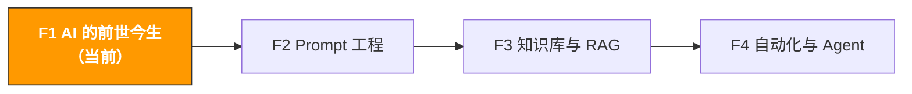

# F1. AI 的前世今生 | The Evolution of AI

> **路径**: Path 0: AI 基础先行 · **模块**: F1
> **最后更新**: 2026-03-12
> **难度**: 入门
> **预计时间**: 2 小时
> **前提**: 无，零基础可学

---




---

## 本模块章节导航

1. [第一性原理](#1-第一性原理llm-到底在做什么) · 2. [发展脉络](#2-发展脉络从规则到智能) · 3. [Transformer](#3-transformer-深入注意力就是一切) · 4. [大语言模型](#4-大语言模型从-gpt-到多模态) · 5. [多模态与推理](#5-多模态与推理ai-的感官升级) · 6. [Agent 时代](#6-agent-时代从对话到行动) · 7. [跨境电商视角](#7-跨境电商视角ai-在每个环节的角色) · 8. [能力边界](#8-ai-的能力边界什么能做什么不能做) · 9. [未来趋势](#9-未来趋势接下来会发生什么) · 10. [学习资源](#10-学习资源) · 11. [完成标志](#11-完成标志)


## 本模块你将理解

AI 不是魔法，它有清晰的工作原理。理解原理不是为了变成技术专家，而是为了知道 AI 能做什么、不能做什么、什么时候会出错。

完成本模块后，你将能够：
- 用一句话解释 LLM 的本质（predict next token）
- 理解从机器学习到 Agent 的完整发展脉络
- 知道 AI 为什么会"胡说八道"（幻觉问题的根源）
- 判断一个任务适不适合用 AI 来做
- 用跨境电商的场景理解每一个核心概念

> **核心理念**：你不需要理解数学公式，但你需要理解 AI 的"思维方式"。就像你不需要懂发动机原理才能开车，但你需要知道油门、刹车和方向盘分别做什么。

---

## 1. 第一性原理：LLM 到底在做什么

### 1.1 一句话解释

**大语言模型（LLM）的本质就是一个超级强大的"下一个词预测器"。**

当你输入"今天天气真"，LLM 会计算所有可能的下一个字的概率：
- "好" → 72%
- "热" → 15%
- "冷" → 8%
- "差" → 3%
- 其他 → 2%

然后它选择概率最高的（或按概率随机采样一个），输出"好"。接着把"今天天气真好"作为新的输入，继续预测下一个字。如此循环，直到生成完整的回答。

**就这么简单。** ChatGPT、Claude、Gemini，所有的大语言模型，底层都在做同一件事：predict next token（预测下一个 token）。

### 1.2 用跨境电商类比理解

想象你是一个经验丰富的 Amazon 运营，有人问你："这个产品的 Listing 标题应该怎么写？"

你的大脑会怎么工作？
1. 你回忆过去见过的几千个成功 Listing 标题
2. 你根据产品特点、关键词、品类惯例，判断每个词出现的可能性
3. 你一个词一个词地组织出标题

LLM 做的事情本质上一样，只不过它"见过"的不是几千个，而是互联网上几乎所有的文本数据 几万亿个词。它的"经验"比任何人类都丰富，但它的"经验"全部来自文本，它没有真正"理解"产品是什么。

### 1.3 Token：AI 的最小单位

LLM 不是按"字"或"词"处理文本的，而是按 **token** 处理。

| 语言 | 文本 | Token 数 | 说明 |
|------|------|---------|------|
| 英文 | "Hello world" | 2 | 常见英文词 = 1 token |
| 英文 | "unbelievable" | 3 | 长词会被拆分：un + believ + able |
| 中文 | "跨境电商" | 2-4 | 中文每个字约 1-2 token |
| 中文 | "人工智能" | 2-3 | 常见词组可能被合并 |
| 代码 | `print("hello")` | 4-5 | 代码符号各占 token |

**为什么 token 很重要？**

- **成本**：API 按 token 计费。GPT-4o 大约 $2.50/百万输入 token，$10/百万输出 token
- **上下文窗口**：每个模型有 token 上限（GPT-4o: 128K，Claude 3.5: 200K）。超过上限，AI 就"记不住"前面的内容
- **速度**：token 越多，生成越慢

> **实用技巧**：当你觉得 AI "忘记了"你之前说的内容，很可能是对话已经超过了上下文窗口。解决方案：开新对话，把关键信息重新提供。

### 1.4 为什么"预测下一个词"能产生智能

这是最反直觉的部分：一个"只会预测下一个词"的系统，怎么能写文章、做分析、写代码？

答案在于**规模**。当训练数据足够大（几万亿 token）、模型参数足够多（几千亿个参数）时，"预测下一个词"这个简单任务会迫使模型学会：

| 为了预测下一个词，模型必须学会 | 举例 |
|-------------------------------|------|
| **语法规则** | "他正在___" → 动词（跑、吃、写） |
| **事实知识** | "地球绕着___转" → 太阳 |
| **逻辑推理** | "如果 A>B，B>C，那么 A___C" → 大于 |
| **情感理解** | "这个产品太差了，我___" → 后悔、失望 |
| **格式模式** | "| 列1 | 列2 |" → 下一行也是表格格式 |
| **代码逻辑** | "for i in range(10):" → 下一行缩进 |

这就是为什么 GPT-3（2020）到 GPT-4（2023）的飞跃如此巨大 不是算法有本质变化，而是规模的量变引发了质变。这个现象被称为 **涌现能力（Emergent Abilities）**：小模型完全做不到的事，大模型突然就能做了。

Content rephrased for compliance with licensing restrictions. Source: [Emergent Abilities of Large Language Models](https://arxiv.org/abs/2206.07682)


### 1.5 幻觉问题：为什么 AI 会"胡说八道"

理解了"预测下一个词"，你就能理解 AI 最大的问题 **幻觉（Hallucination）**。

AI 不是在"回忆事实"，而是在"预测最可能的下一个词"。当它没有足够的训练数据来支撑某个事实时，它会生成"看起来合理但实际错误"的内容。

**跨境电商中的幻觉示例：**

| 你问的 | AI 可能编造的 | 为什么会编造 |
|--------|-------------|-------------|
| "这个 ASIN 的月销量是多少？" | "根据数据，月销量约 3,500 件" | AI 没有实时 Amazon 数据，它在编一个"看起来合理"的数字 |
| "Amazon DE 站卖蓝牙耳机需要什么认证？" | "需要 CE 认证和 WEEE 注册" | 可能正确也可能遗漏，AI 的训练数据可能过时 |
| "Helium 10 的 Diamond 套餐多少钱？" | "$279/月" | 价格可能已经变了，AI 不知道最新定价 |

**如何应对幻觉：**

1. **数据类问题**：永远用工具验证（Helium 10、Keepa、Seller Central），不要相信 AI 给的具体数字
2. **合规类问题**：AI 的回答只作为起点，最终以官方文档为准（参考 [A6 合规模块](../a-operators/a6-compliance.md)）
3. **分析类问题**：给 AI 提供真实数据让它分析，而不是让它凭空生成数据
4. **要求引用来源**：在 Prompt 中加上"请标注信息来源"，虽然 AI 可能编造来源，但至少你可以去验证

> **核心原则**：AI 是分析师，不是数据库。给它数据让它分析 = 靠谱。让它凭空给你数据 = 不靠谱。

---

## 2. 发展脉络：从规则到智能

### 2.1 AI 发展时间线

```
1950s-1980s: 符号 AI（规则系统）
人工编写规则："如果 Review 包含'broken'，则标记为负面"
优点：可解释、可控
缺点：规则写不完，无法处理复杂场景

1990s-2010s: 机器学习（统计学习）
从数据中学习模式，不再手写规则
代表：决策树、SVM、随机森林
跨境电商应用：垃圾邮件过滤、简单的销量预测
缺点：需要人工设计特征（Feature Engineering）

2012-2017: 深度学习（神经网络复兴）
2012: AlexNet 在 ImageNet 上碾压传统方法
代表：CNN（图像）、RNN/LSTM（文本）
跨境电商应用：图像识别（产品分类）、情感分析
缺点：RNN 处理长文本效率低，训练慢

2017: Transformer 架构诞生
Google 论文 "Attention Is All You Need"
核心创新：自注意力机制（Self-Attention）
解决了 RNN 的长距离依赖问题
这是一切的转折点

2018-2022: 预训练大模型时代
2018: BERT（Google） 理解型模型
2019: GPT-2（OpenAI） 生成型模型
2020: GPT-3 175B 参数，Few-shot Learning 涌现
2022: ChatGPT AI 走进大众视野
跨境电商应用：Review 分析、Listing 生成、客服自动化

2023-2024: 大模型竞赛
GPT-4、Claude 2/3、Gemini、Llama 2/3
多模态（文本+图像+音频）
上下文窗口从 4K → 128K → 1M+
跨境电商应用：多模态产品分析、长文档处理

2025-2026: Agent 时代
从"对话"到"行动"：AI 不只回答问题，还能执行任务
MCP 协议标准化：AI 连接外部工具的统一接口
OpenClaw 等框架：自主 Agent 管理邮件、日程、工作流
跨境电商应用：自动化运营监控、智能补货、多平台管理
我们正在这里 ← 你来得正好
```

Content rephrased for compliance with licensing restrictions. Sources: [Attention Is All You Need (2017)](https://arxiv.org/abs/1706.03762), [Emergent Abilities of LLMs](https://arxiv.org/abs/2206.07682)

### 2.2 用跨境电商类比理解每个阶段

| AI 阶段 | 跨境电商类比 | 能做什么 | 不能做什么 |
|---------|------------|---------|-----------|
| **规则系统** | 新手运营按 SOP 操作 | 按固定规则处理标准流程 | 遇到 SOP 没覆盖的情况就卡住 |
| **机器学习** | 有经验的运营看数据做判断 | 从历史数据中发现模式 | 需要人告诉它"看哪些数据" |
| **深度学习** | 资深运营能看图说话 | 自动从原始数据中提取特征 | 一次只能做一件事（分类或生成） |
| **Transformer/LLM** | 全能型运营顾问 | 理解上下文，生成文本，多任务 | 没有实时数据，可能编造信息 |
| **Agent** | 有工具的自主运营经理 | 调用工具、执行任务、自主决策 | 复杂判断仍需人类监督 |

### 2.3 为什么是 2017 年改变了一切

2017 年之前，AI 处理文本的主流方法是 RNN（循环神经网络）。RNN 的问题是：它必须一个词一个词地顺序处理，就像你必须从头到尾读完一篇文章才能理解它。

**RNN 的困境（用运营场景类比）：**

想象你要分析一篇 500 字的产品 Review。RNN 的方式是：
1. 读第 1 个字，记住
2. 读第 2 个字，更新记忆
3. 读第 3 个字，更新记忆
4. ...
5. 读到第 500 个字时，前面的内容已经"模糊"了

这就像你读一份 50 页的报告，读到最后已经忘了开头写了什么。

**Transformer 的解决方案：自注意力（Self-Attention）**

Transformer 不是顺序处理，而是**同时看所有的词**，并计算每个词和其他所有词的关联度。

就像你不是逐字阅读报告，而是先扫一遍全文，标记出关键段落之间的关联，然后直接跳到最相关的部分。

这个看似简单的改变，带来了两个革命性的优势：
1. **并行计算**：所有词同时处理，训练速度提升 10-100 倍
2. **长距离依赖**：第 1 个词和第 500 个词的关联不会丢失

> **关键洞察**：Transformer 不是"更好的 RNN"，而是一种全新的思路。它的成功证明了一个道理：有时候解决问题的最好方式不是改进现有方法，而是换一个完全不同的角度。


---

## 3. Transformer 深入：注意力就是一切

### 3.1 Transformer 的核心组件

Transformer 架构由两个主要部分组成：

```
Transformer 架构
Encoder（编码器） 理解输入
自注意力层：计算每个词和其他词的关联
前馈网络：对每个位置做非线性变换
残差连接 + 层归一化：稳定训练

Decoder（解码器） 生成输出
掩码自注意力层：只能看到已生成的词（防止"偷看答案"）
交叉注意力层：关注 Encoder 的输出
前馈网络
残差连接 + 层归一化
```

**不同模型用了不同的组合：**

| 模型类型 | 用了什么 | 代表模型 | 擅长什么 |
|---------|---------|---------|---------|
| Encoder-only | 只用编码器 | BERT、RoBERTa | 理解任务：分类、情感分析、信息提取 |
| Decoder-only | 只用解码器 | GPT 系列、Claude、Llama | 生成任务：写文章、对话、写代码 |
| Encoder-Decoder | 两者都用 | T5、BART | 翻译、摘要、问答 |

> **为什么现在主流是 Decoder-only？** 因为"生成"是最通用的能力。分类可以通过生成"正面/负面"来实现，翻译可以通过生成目标语言来实现。一个强大的生成模型可以做几乎所有 NLP 任务。

### 3.2 自注意力机制：用选品会议类比

想象你在开一个选品会议，桌上有 5 份竞品报告（A、B、C、D、E）。

**传统方式（RNN）：** 你必须按顺序读完 A → B → C → D → E，读到 E 的时候，A 的细节已经模糊了。

**自注意力方式（Transformer）：** 你同时把 5 份报告摊开在桌上，然后：
1. 看报告 A 时，扫一眼其他 4 份，发现 A 和 C 讨论的是同一个品类 → 给 A-C 关联打高分
2. 看报告 B 时，发现 B 和 E 的价格区间重叠 → 给 B-E 关联打高分
3. 每份报告都知道自己和其他报告的关联程度

这就是"注意力分数"（Attention Score）。每个词都会计算自己和所有其他词的关联度，然后根据关联度加权汇总信息。

**数学上的直觉（不需要记公式）：**

```
注意力 = 我在找什么（Query）× 你能提供什么（Key）→ 匹配度
最终输出 = 按匹配度加权的信息汇总（Value）
```

用电商类比：
- Query = "我想找一个售价 $20-30 的蓝牙耳机"
- Key = 每个产品的标签（价格、品类、特征）
- Value = 每个产品的详细信息
- 注意力 = 根据匹配度，重点关注符合条件的产品

### 3.3 位置编码：让 AI 知道词序

自注意力机制有一个问题：它同时看所有词，但不知道词的顺序。"猫吃鱼"和"鱼吃猫"对它来说是一样的。

解决方案是**位置编码（Positional Encoding）**：给每个位置一个独特的数学标记，让模型知道"这个词在第 3 个位置"。

就像 Amazon Listing 的 Bullet Points 有编号一样 第 1 个 Bullet 和第 5 个 Bullet 的权重不同，位置本身就携带信息。

### 3.4 参数量与模型规模

| 模型 | 发布时间 | 参数量 | 类比 |
|------|---------|--------|------|
| BERT-base | 2018 | 1.1 亿 | 一本百科全书 |
| GPT-2 | 2019 | 15 亿 | 一个小型图书馆 |
| GPT-3 | 2020 | 1750 亿 | 一个大型图书馆 |
| GPT-4 | 2023 | ~1.8 万亿（传闻） | 一座城市的所有图书馆 |
| Llama 3.1 | 2024 | 4050 亿 | 开源世界的最大图书馆 |
| GPT-4o | 2024 | 未公开 | 多模态超级图书馆 |
| Claude Opus 4 | 2025 | 未公开 | 深度推理图书馆 |

**参数量 ≠ 能力。** 更重要的是训练数据的质量、训练方法（RLHF、DPO）和推理优化。Llama 3.1 70B 在很多任务上接近 GPT-4，但参数量只有其 1/25。

---

## 4. 大语言模型：从 GPT 到多模态

> **相关阅读**: [F2 Prompt 工程](f2-prompt-engineering.md) Prompt 工程实操详见 F2

### 4.1 GPT 系列演进

GPT（Generative Pre-trained Transformer）是 OpenAI 的系列模型，也是"大语言模型"概念的推动者。

```
GPT-1 (2018): 1.17 亿参数
证明了"预训练 + 微调"的范式有效
能力有限，主要用于学术研究

GPT-2 (2019): 15 亿参数
第一次展示了"零样本"能力（不需要微调就能做任务）
OpenAI 一度因"太危险"而不公开完整模型
现在看来能力很基础

GPT-3 (2020): 1750 亿参数
质变时刻：Few-shot Learning 涌现
给几个例子就能学会新任务
开始有商业应用价值
API 开放，催生了大量 AI 创业公司

ChatGPT (2022.11): 基于 GPT-3.5 + RLHF
不是模型的突破，而是交互方式的突破
RLHF（人类反馈强化学习）让模型学会"像人一样对话"
2 个月达到 1 亿用户，史上最快
AI 从技术圈走进大众视野

GPT-4 (2023.3): 多模态 + 更强推理
支持图像输入（看图说话、分析图表）
推理能力大幅提升（通过律师考试、SAT 等）
128K 上下文窗口
跨境电商应用爆发：Listing 生成、Review 分析、多语言翻译

GPT-4o (2024): 原生多模态
文本、图像、音频统一处理
速度更快、成本更低
实时语音对话
跨境电商：产品图片分析、竞品视觉对比

GPT-4.5 / GPT-5 (2025-2026): 深度推理
更强的逻辑推理和规划能力
更长的上下文窗口
更好的工具使用能力
跨境电商：复杂决策支持、自动化工作流
```

### 4.2 主流模型对比（2026 年初）

| 模型 | 公司 | 核心优势 | 上下文窗口 | 价格（API） | 适合场景 |
|------|------|---------|-----------|------------|---------|
| GPT-4o | OpenAI | 均衡、多模态、生态最好 | 128K | $2.5/$10 per M tokens | 通用场景、图像分析 |
| Claude Opus 4 | Anthropic | 长文本、深度分析、安全 | 200K+ | $15/$75 per M tokens | 长文档分析、复杂推理 |
| Claude Sonnet 4 | Anthropic | 性价比、速度快 | 200K | $3/$15 per M tokens | 日常使用、代码生成 |
| Gemini 2.5 Pro | Google | 超长上下文、多模态 | 1M+ | $1.25/$5 per M tokens | 超长文档、视频分析 |
| Llama 3.3 | Meta | 开源、可本地部署 | 128K | 免费（自部署） | 数据隐私、定制化 |
| DeepSeek V3 | DeepSeek | 性价比极高、中文优秀 | 128K | $0.27/$1.10 per M tokens | 中文场景、预算有限 |
| Qwen 2.5 | 阿里 | 中文最强、多模态 | 128K | 按量计费 | 中文电商、多模态 |

**跨境电商场景推荐：**

- **日常运营（Listing、Review、客服）**：Claude Sonnet 4 或 GPT-4o 速度快、质量好、成本合理
- **深度分析（市场报告、竞品研究）**：Claude Opus 4 长文本处理和深度推理最强
- **多语言翻译**：GPT-4o 或 Gemini 多语言能力最均衡
- **预算有限**：DeepSeek V3 性价比极高，中文场景表现优秀
- **数据隐私要求高**：Llama 3.3 本地部署 数据不出服务器（参考 [B5 本地模型部署](../b-developers/b5-local-model-deploy.md)）

### 4.3 RLHF：让 AI 学会"说人话"

原始的 GPT-3 虽然能力强，但输出经常不符合人类期望 它可能给出正确答案但格式混乱，或者生成有害内容。

**RLHF（Reinforcement Learning from Human Feedback，人类反馈强化学习）** 是让 AI 从"能力强但不好用"变成"能力强且好用"的关键技术。

```
RLHF 三步走：

Step 1: 监督微调（SFT）
人类标注员写出高质量的问答对
用这些数据微调模型
类比：给新员工一本标准操作手册

Step 2: 训练奖励模型（RM）
让模型生成多个回答
人类标注员对回答排序（哪个更好）
训练一个"评分模型"来模拟人类偏好
类比：培养一个质检员，学会判断什么是好的回答

Step 3: 强化学习优化（PPO/DPO）
用奖励模型的评分来优化生成模型
模型学会生成"人类觉得好"的回答
类比：员工根据质检反馈不断改进工作
```

**RLHF 的效果：**

| 维度 | RLHF 之前 | RLHF 之后 |
|------|----------|----------|
| 回答格式 | 混乱、不一致 | 结构化、清晰 |
| 有害内容 | 可能生成 | 大幅减少 |
| 指令遵循 | 经常跑题 | 准确遵循指令 |
| 对话能力 | 像在自言自语 | 像在和人对话 |

> **关键洞察**：ChatGPT 的成功不是因为 GPT-3.5 比 GPT-3 强多少，而是因为 RLHF 让它学会了"说人话"。技术突破和用户体验突破是两回事。


---

## 5. 多模态与推理：AI 的感官升级

### 5.1 什么是多模态

早期的 LLM 只能处理文本。多模态模型可以同时处理多种类型的数据：

```
多模态能力演进：

2023: 文本 + 图像输入（GPT-4V）
看图回答问题
分析图表和截图
跨境电商：上传竞品图片让 AI 分析

2024: 文本 + 图像 + 音频（GPT-4o、Gemini）
实时语音对话
视频内容理解
跨境电商：分析产品视频、语音客服

2025-2026: 统一多模态（Gemini 2.5、GPT-5）
文本、图像、音频、视频无缝切换
生成图像和视频
跨境电商：自动生成产品主图、A+ 内容
```

### 5.2 多模态在跨境电商中的应用

| 场景 | 输入 | AI 做什么 | 工具推荐 |
|------|------|----------|---------|
| 竞品图片分析 | 竞品主图截图 | 分析设计风格、卖点展示方式、拍摄角度 | GPT-4o、Gemini |
| 产品缺陷检测 | 退货产品照片 | 识别常见质量问题、分类缺陷类型 | GPT-4o |
| Listing 图片审核 | 你的产品图 | 检查是否符合 Amazon 图片规范 | Claude Sonnet |
| 竞品视频拆解 | 竞品产品视频 | 提取卖点、分析展示策略 | Gemini 2.5 Pro |
| 包装设计评估 | 包装设计稿 | 评估视觉吸引力、信息层次、合规性 | GPT-4o |
| 多语言 OCR | 外文产品标签照片 | 识别并翻译标签内容 | Gemini、GPT-4o |

**实操示例 竞品主图分析：**

```
请分析这张 Amazon 产品主图（上传图片）：

1. 产品展示角度和构图
2. 背景处理方式
3. 是否有信息图（Infographic）元素
4. 估计的拍摄成本和制作难度
5. 3 个可以借鉴的设计亮点
6. 3 个可以改进的地方
7. 如果我要做类似产品，主图策略建议
```

### 5.3 推理能力的进化

2024-2025 年，AI 的一个重大进展是**推理能力**的提升。

**什么是推理？** 不是简单地"回忆"训练数据中的答案，而是通过逻辑步骤"推导"出答案。

```
简单回忆（早期 LLM）：
Q: "法国的首都是什么？"
A: "巴黎" ← 直接从训练数据中回忆

推理（新一代 LLM）：
Q: "如果一个产品的采购成本是 ¥50，FBA 费用是 $5，佣金率 15%，
售价 $25，那么利润率是多少？"
A: 需要多步计算：
1. 采购成本换算：¥50 ÷ 7.2 ≈ $6.94
2. 总成本：$6.94 + $5 + $25×15% = $6.94 + $5 + $3.75 = $15.69
3. 利润：$25 - $15.69 = $9.31
4. 利润率：$9.31 / $25 = 37.2%
```

**推理模型的代表：**

| 模型 | 特点 | 适合场景 |
|------|------|---------|
| OpenAI o1/o3 | "思考"后再回答，推理链可见 | 数学计算、逻辑分析、复杂规划 |
| Claude Opus 4 | 深度分析，长链推理 | 长文档分析、多步骤决策 |
| DeepSeek R1 | 开源推理模型 | 本地部署的推理需求 |

> **实用建议**：日常运营任务（写 Listing、翻译、客服回复）用普通模型就够了，速度快成本低。需要复杂分析（利润测算、市场评估、策略规划）时再用推理模型。

---

## 6. Agent 时代：从对话到行动

> **相关阅读**: [F4 Agent 自动化](f4-agent-automation.md) Agent 实操详见 F4

### 6.1 什么是 AI Agent

**普通 LLM 对话**：你问一个问题，AI 给一个回答。就像你问一个顾问，他给你建议，但不帮你执行。

**AI Agent**：AI 不只回答问题，还能**使用工具、执行任务、自主决策**。就像你雇了一个助理，他不只给建议，还会帮你发邮件、查数据、做报告。

```
普通对话 vs Agent 的区别：

普通对话：
你："帮我分析这个竞品的 Review"
AI："根据分析，主要痛点是..."（给你文字回答）

Agent：
你："帮我监控这 5 个竞品，每周生成分析报告"
AI：
1. 调用 Amazon API 获取最新 Review 数据
2. 用 NLP 工具做情感分析和主题提取
3. 对比上周数据，发现变化趋势
4. 生成结构化报告
5. 发送到你的邮箱
6. 下周自动重复以上步骤
```

### 6.2 Agent 的核心能力

| 能力 | 说明 | 跨境电商示例 |
|------|------|------------|
| **工具使用** | 调用外部 API 和工具 | 调用 Helium 10 API 查关键词数据 |
| **规划** | 把复杂任务分解为步骤 | 把"做一份选品报告"分解为 5 个子任务 |
| **记忆** | 记住之前的对话和结果 | 记住你上次分析的品类和结论 |
| **自主决策** | 根据中间结果调整策略 | 发现数据异常时自动深入分析 |
| **多步执行** | 连续执行多个步骤 | 查数据 → 分析 → 生成报告 → 发送 |

### 6.3 MCP 协议：AI 的"USB-C 接口"

2025 年，Anthropic 推出了 **MCP（Model Context Protocol，模型上下文协议）**，迅速成为 AI 连接外部工具的行业标准。

**MCP 解决了什么问题？**

在 MCP 之前，每个 AI 工具要连接外部系统，都需要写定制化的集成代码。就像早期的手机，每个品牌用不同的充电接口。

MCP 就是 AI 世界的 USB-C 一个标准化的协议，让任何 AI 模型都能通过统一的方式连接任何外部工具。

```
MCP 架构：

AI 模型（Claude/GPT/Gemini）
MCP 协议
MCP Server（工具适配器）

外部工具/数据源
文件系统（读写本地文件）
数据库（查询和更新数据）
API（调用第三方服务）
邮件系统（发送和读取邮件）
任何你想连接的系统
```

**MCP 在跨境电商中的应用场景：**

| MCP Server | 连接什么 | 能做什么 |
|-----------|---------|---------|
| 文件系统 MCP | 本地 Excel/CSV 文件 | AI 直接读取和分析你的销售报告 |
| 数据库 MCP | 产品数据库 | AI 查询产品信息、库存状态 |
| 邮件 MCP | Outlook/Gmail | AI 读取供应商邮件、自动回复 |
| 浏览器 MCP | 网页 | AI 自动采集竞品信息 |
| Amazon SP-API MCP | Amazon 卖家后台 | AI 直接获取订单、库存、广告数据 |

Content rephrased for compliance with licensing restrictions. Sources: [Anthropic MCP Documentation](https://modelcontextprotocol.io/), [MCP Guide 2026](https://www.taskade.com/blog/mcp-your-ai-agents-superpower-for-real-world-context-and-automation)

### 6.4 OpenClaw：2026 年最火的 Agent 框架

OpenClaw 是 2025 年底发布的开源 AI Agent 框架，在 GitHub 上迅速获得超过 180K Star，成为 Agent 领域的现象级项目。

**OpenClaw 是什么？**

一个自托管的 AI Agent，运行在你自己的电脑上，可以通过 WhatsApp、Telegram、Slack 等消息平台接收指令，自主执行任务。

**核心特点：**

| 特点 | 说明 |
|------|------|
| 自托管 | 运行在你的设备上，数据不出本地 |
| 多平台 | 通过 WhatsApp/Telegram/Slack/Discord 交互 |
| 工具集成 | 通过 MCP 协议连接任意外部工具 |
| 自主执行 | 不只回答问题，还能发邮件、管日程、写代码 |
| 开源免费 | 完全开源，可自由定制 |

**跨境电商场景想象：**

```
你在 WhatsApp 上对 OpenClaw 说：
"帮我检查一下今天的 Amazon US 订单情况，
如果有差评，分析原因并起草回复"

OpenClaw 自动执行：
1. 通过 Amazon SP-API MCP 获取今日订单数据
2. 检查是否有新的 1-3 星 Review
3. 分析差评内容，归类问题类型
4. 根据问题类型生成回复草稿
5. 把结果发回你的 WhatsApp
```

> **安全提醒**：Agent 能力越强，安全风险越大。OpenClaw 运行在你的系统上，有权限访问你的文件和应用。务必了解权限设置，不要给 Agent 过多权限。

Content rephrased for compliance with licensing restrictions. Sources: [OpenClaw Guide](https://www.hostinger.com/tutorials/what-is-openclaw), [TechTarget OpenClaw Explained](https://www.techtarget.com/searchcio/feature/OpenClaw-and-Moltbook-explained-The-latest-AI-agent-craze)


---

## 7. 跨境电商视角：AI 在每个环节的角色

### 7.1 AI 能力与电商环节映射

```
跨境电商全链路 × AI 能力矩阵：

选品调研 ←→ 文本分析 + 推理
Review 痛点提取（文本分析）
市场可行性评估（推理）
关键词需求聚类（文本分析）
趋势预测（推理 + 数据分析）

Listing 创作 ←→ 文本生成 + 多语言
标题/五点/描述生成（文本生成）
多语言本地化（翻译 + 文化适配）
A+ 内容策划（多模态生成）
SEO 关键词优化（文本分析）

广告运营 ←→ 数据分析 + 生成
搜索词报告分析（数据分析）
广告文案 A/B 测试（文本生成）
竞价策略建议（推理）
预算分配优化（数据分析 + 推理）

客服售后 ←→ 文本生成 + 多语言 + 情感分析
多语言客服回复（生成 + 翻译）
差评分析与应对（情感分析 + 生成）
申诉信撰写（生成 + 推理）
退货原因分析（文本分析）

库存供应链 ←→ 预测 + 推理
销量预测（时间序列预测）
补货决策（推理）
安全库存计算（数据分析）
供应商评估（文本分析 + 推理）

合规风控 ←→ 知识检索 + 推理
多市场合规查询（知识检索）
认证要求梳理（文本分析）
风险评估（推理）
合规文档生成（文本生成）
```

### 7.2 不同 AI 技术在电商中的成熟度

| 技术 | 成熟度 | 可靠性 | 推荐使用方式 |
|------|--------|--------|------------|
| 文本生成（Listing、回复） | | 高 | 直接使用，人工审核微调 |
| 文本分析（Review、关键词） | | 高 | 直接使用，结果可靠 |
| 多语言翻译 | | 中高 | 使用后需母语者审核 |
| 多模态分析（图片、视频） | | 中 | 辅助参考，不作为唯一依据 |
| 数据预测（销量、趋势） | | 中 | 结合历史数据和工具数据使用 |
| Agent 自动化 | | 中低 | 简单任务可用，复杂任务需监督 |
| 自主决策 | | 低 | 仅作为建议参考，人类做最终决策 |

> **核心原则**：AI 成熟度越高的场景，越可以放心使用；成熟度越低的场景，越需要人类监督。不要在 Agent 自动化还不成熟的时候就让它自主管理你的广告预算。

### 7.3 AI 工具选择决策树

```
你要做什么？

写文案（Listing/广告/邮件）
用 ChatGPT / Claude 直接生成 → 人工审核 → 发布

分析数据（Review/关键词/报告）
数据量小（<100条）→ 直接粘贴到 ChatGPT/Claude
数据量中（100-1000条）→ 上传文件到 ChatGPT/Claude
数据量大（>1000条）→ 用 Python + AI API（参考 Path B）

翻译/本地化
简单翻译 → ChatGPT/Claude/DeepL
专业本地化 → AI 初稿 + 母语者审核

图片/视频分析
上传到 GPT-4o / Gemini → 获取分析结果

预测/决策
快速评估 → ChatGPT/Claude + 你提供的数据
精确预测 → Python + Prophet/AutoGluon（参考 Path B）

自动化/Agent
简单自动化 → Zapier/Make + AI
中等自动化 → MCP + Claude/GPT
高级自动化 → LangGraph/CrewAI/OpenClaw（参考 Path B）
```

---

## 8. AI 的能力边界：什么能做，什么不能做

### 8.1 AI 擅长的（放心用）

| 能力 | 为什么擅长 | 电商应用 |
|------|----------|---------|
| 文本压缩与摘要 | 训练数据中有大量摘要样本 | 100 条 Review → 5 个核心痛点 |
| 模式识别 | 统计学习的本质就是找模式 | 从关键词列表中发现需求聚类 |
| 格式转换 | 格式是高度规律化的 | 把 CSV 数据转成分析报告 |
| 多语言处理 | 训练数据覆盖 100+ 种语言 | 多语言 Listing 生成和翻译 |
| 创意生成 | 组合已有元素产生新组合 | 广告文案变体、产品卖点提炼 |
| 代码生成 | 训练数据中有大量代码 | 写数据处理脚本、自动化工具 |

### 8.2 AI 不擅长的（谨慎用）

| 能力 | 为什么不擅长 | 应对策略 |
|------|------------|---------|
| 实时数据 | 训练数据有截止日期，不知道"现在" | 用工具获取实时数据，再让 AI 分析 |
| 精确计算 | 本质是概率预测，不是计算器 | 复杂计算用 Excel/Python，AI 做解读 |
| 因果推理 | 只能发现相关性，不能确定因果 | AI 提供假设，人类验证因果 |
| 创造性突破 | 只能组合已有知识，不能真正创新 | AI 做 80% 的基础工作，人类做 20% 的创新 |
| 长期记忆 | 上下文窗口有限，对话结束就"忘记" | 重要信息每次对话重新提供 |
| 物理世界理解 | 没有身体，不理解物理交互 | 产品手感、材质等需要人类判断 |

### 8.3 AI 绝对不能做的（不要用）

| 场景 | 为什么不能 | 正确做法 |
|------|----------|---------|
| 替你做最终决策 | AI 不承担后果，你承担 | AI 提供分析和建议，你做决策 |
| 生成法律文件 | 可能有法律错误 | AI 起草初稿，律师审核 |
| 处理敏感数据 | 数据可能被用于训练 | 用本地模型或企业版 API |
| 完全自动化客服 | 可能说错话导致纠纷 | AI 生成草稿，人工审核后发送 |
| 替代专业认证 | AI 不了解最新法规细节 | AI 做初步筛查，认证机构做最终确认 |

---

## 9. 未来趋势：接下来会发生什么

### 9.1 2026-2027 年的 AI 趋势

| 趋势 | 说明 | 对跨境电商的影响 |
|------|------|----------------|
| **Agent 普及** | AI Agent 从技术圈走向普通用户 | 运营人也能用 Agent 自动化日常任务 |
| **多模态融合** | 文本/图像/视频/音频无缝处理 | 产品图片自动生成、视频内容自动分析 |
| **本地模型成熟** | 手机/笔记本上运行高质量 LLM | 数据隐私问题解决，离线也能用 AI |
| **垂直模型** | 针对特定行业训练的专业模型 | 电商专用 AI，更懂 Amazon 规则和术语 |
| **AI 原生工具** | 工具从"加了 AI 功能"变成"AI 驱动" | Helium 10、Jungle Scout 等工具 AI 化 |
| **协议标准化** | MCP + A2A 成为行业标准 | AI 工具之间可以互相协作 |

### 9.2 对跨境电商从业者的建议

```
短期（现在就做）：
学会用 ChatGPT/Claude 做日常运营（Path A）
建立 Prompt 模板库（F2 模块）
每天至少用 AI 完成一个任务

中期（3-6 个月）：
掌握 RAG，让 AI 理解你的私有数据（F3 模块）
尝试简单的 Agent 自动化（F4 模块）
建立团队 AI 使用规范（Path C）

长期（6-12 个月）：
构建 AI 驱动的运营系统（Path B）
探索本地模型部署（数据隐私）
关注垂直电商 AI 工具的发展
```

> **最重要的一条建议**：不要等 AI "完美"了再开始用。AI 永远不会完美，但它现在已经足够好了。早用早受益，晚用就是在给竞争对手让出优势。

---

## 10. 学习资源

### 10.1 入门推荐（零基础）

| 资源 | 平台 | 时长 | 为什么推荐 |
|------|------|------|-----------|
| [But what is a GPT?](https://www.youtube.com/watch?v=wjZofJX0v4M) | 3Blue1Brown (YouTube) | 27 min | 最直观的 Transformer 可视化解释 |
| [Intro to Large Language Models](https://www.youtube.com/watch?v=zjkBMFhNj_g) | Andrej Karpathy (YouTube) | 60 min | 前 OpenAI 研究员的 LLM 入门讲座 |
| [ChatGPT Prompt Engineering](https://www.deeplearning.ai/short-courses/chatgpt-prompt-engineering-for-developers/) | DeepLearning.AI | 1.5h | 免费课程，OpenAI 官方合作 |
| [AI for Everyone](https://www.coursera.org/learn/ai-for-everyone) | Coursera (Andrew Ng) | 6h | 非技术人员的 AI 入门，吴恩达主讲 |

### 10.2 进阶推荐（想深入理解）

| 资源 | 平台 | 为什么推荐 |
|------|------|-----------|
| [Attention Is All You Need](https://arxiv.org/abs/1706.03762) | arXiv | Transformer 原始论文，改变一切的起点 |
| [The Illustrated Transformer](https://jalammar.github.io/illustrated-transformer/) | Jay Alammar Blog | 最好的 Transformer 图解教程 |
| [State of GPT](https://www.youtube.com/watch?v=bZQun8Y4L2A) | Andrej Karpathy (YouTube) | GPT 训练流程的完整解析 |
| [LLM Visualization](https://bbycroft.net/llm) | Brendan Bycroft | 交互式 LLM 工作原理可视化 |

### 10.3 持续跟踪

| 资源 | 类型 | 更新频率 |
|------|------|---------|
| [The Batch](https://www.deeplearning.ai/the-batch/) | Newsletter | 每周（Andrew Ng 主编） |
| [AI News](https://buttondown.email/ainews) | Newsletter | 每日 |
| r/LocalLLaMA | Reddit | 实时（本地模型社区） |
| [Hugging Face Blog](https://huggingface.co/blog) | Blog | 每周（开源模型动态） |

---

## 11. 完成标志

- [ ] 能用自己的话解释"LLM 就是一个 next token predictor"
- [ ] 理解 Transformer 的自注意力机制（不需要数学，理解直觉即可）
- [ ] 知道 GPT/Claude/Gemini/Llama 的区别和各自优势
- [ ] 理解 RLHF 为什么让 ChatGPT 比 GPT-3 好用这么多
- [ ] 知道 AI 幻觉的原因和应对方法
- [ ] 理解 Agent 和普通对话的区别
- [ ] 知道 MCP 协议是什么，为什么它很重要
- [ ] 能判断一个电商任务适不适合用 AI

完成以上所有项目后，你已经建立了扎实的 AI 认知基础。接下来进入 [F2 Prompt 工程](f2-prompt-engineering.md)，学习如何系统性地和 AI 沟通。

---

## 附录：术语表

| 术语 | 英文 | 一句话解释 |
|------|------|-----------|
| LLM | Large Language Model | 大语言模型，ChatGPT/Claude 的底层技术 |
| Token | Token | AI 处理文本的最小单位，约等于一个词或半个中文字 |
| Transformer | Transformer | 2017 年发明的神经网络架构，所有现代 LLM 的基础 |
| 自注意力 | Self-Attention | Transformer 的核心机制，让模型同时关注所有位置 |
| RLHF | Reinforcement Learning from Human Feedback | 用人类反馈训练 AI 的方法 |
| 幻觉 | Hallucination | AI 生成看似合理但实际错误的内容 |
| 多模态 | Multimodal | AI 同时处理文本、图像、音频等多种数据 |
| Agent | AI Agent | 能使用工具和自主执行任务的 AI 系统 |
| MCP | Model Context Protocol | AI 连接外部工具的标准化协议 |
| RAG | Retrieval-Augmented Generation | 让 AI 基于你的数据回答问题的技术 |
| Fine-tuning | Fine-tuning | 用特定数据进一步训练模型 |
| 涌现能力 | Emergent Abilities | 模型规模增大后突然出现的新能力 |
| 上下文窗口 | Context Window | AI 一次能处理的最大文本长度 |
