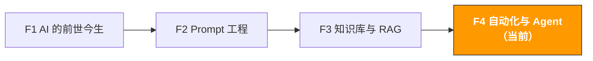

# F4. 自动化与 Agent | Automation & AI Agents

> **路径**: Path 0: AI 基础先行 · **模块**: F4
> **最后更新**: 2026-03-12
> **难度**: 中级
> **预计时间**: 2 小时
> **前置模块**: [F1 AI 的前世今生](f1-ai-evolution.md)、[F2 Prompt 工程](f2-prompt-engineering.md)、[F3 知识库与 RAG](f3-rag-knowledge.md)

---




---

## 本模块章节导航

1. [从 Prompt 到 Agent](#1-从-prompt-到-agentai-能力的四个层次) · 2. [自动化三层模型](#2-自动化三层模型) · 3. [MCP 协议详解](#3-mcp-协议详解) · 4. [Agent 框架全景](#4-agent-框架全景) · 5. [10 个电商 Agent 场景](#5-10-个跨境电商-agent-场景) · 6. [安全与风险](#6-安全与风险) · 7. [实施路线图](#7-实施路线图) · 8. [学习资源](#8-学习资源) · 9. [完成标志](#9-完成标志)


## 本模块你将理解

AI 不只是一个问答工具。当它能使用工具、执行任务、自主决策时，它就变成了 Agent 一个真正的数字助理。

完成本模块后，你将能够：
- 理解从 Prompt 到 Agent 的升级路径
- 掌握自动化三层模型（脚本 → 工作流 → Agent）
- 深入理解 MCP 协议的架构和应用
- 了解主流 Agent 框架（LangGraph、CrewAI）
- 评估 10 个跨境电商 Agent 场景的可行性和 ROI
- 知道 Agent 的安全风险和应对策略

> **本模块定位**：建立概念理解和场景判断能力。如果你想动手构建 Agent，完成本模块后进入 [Path B: B4 AI Agent 与自动化](../b-developers/b4-agent-workflow.md)。

---

## 1. 从 Prompt 到 Agent：AI 能力的四个层次

### 1.1 AI 能力升级路径

```
Level 1：单次对话（Prompt → Response）
你问一个问题，AI 给一个回答
没有记忆，没有工具，没有行动
示例：问 ChatGPT "帮我写一个 Listing 标题"
价值：信息获取和内容生成

Level 2：多轮对话（Conversation）
AI 记住之前的对话内容
可以迭代优化输出
示例：和 Claude 讨论并逐步完善一份市场分析
价值：协作式内容创作和分析

Level 3：工具增强（Tool-Augmented LLM）
AI 可以调用外部工具获取信息
但仍然需要人类触发每一步
示例：AI 调用计算器算利润，调用搜索引擎查数据
价值：更准确的分析和计算

Level 4：自主 Agent（Autonomous Agent）
AI 自主规划任务、调用工具、执行行动
可以处理多步骤的复杂任务
示例：AI 自动监控竞品、分析变化、生成报告、发送邮件
价值：真正的自动化，解放人力
```

### 1.2 用跨境电商类比

| AI 层次 | 类比 | 你需要做什么 |
|---------|------|------------|
| Level 1 单次对话 | 问一个路人问题 | 你问，他答，结束 |
| Level 2 多轮对话 | 和顾问开会讨论 | 你主导讨论，他提供建议 |
| Level 3 工具增强 | 顾问带着笔记本电脑 | 你说"查一下数据"，他查了告诉你 |
| Level 4 自主 Agent | 雇了一个全职助理 | 你说"每周给我一份竞品报告"，他自己搞定一切 |

### 1.3 为什么 2025-2026 是 Agent 的爆发期

三个条件在 2025 年同时成熟：

| 条件 | 2023 年状态 | 2025-2026 年状态 |
|------|-----------|----------------|
| **模型能力** | GPT-4 刚发布，推理能力有限 | GPT-4o/Claude Opus 4 推理能力大幅提升 |
| **工具协议** | 每个工具需要定制集成 | MCP 协议标准化，即插即用 |
| **框架成熟** | LangChain 早期，bug 多 | LangGraph/CrewAI 生产可用 |

---

## 2. 自动化三层模型

### 2.1 三层架构

```
Layer 1：脚本自动化（Script Automation）
什么：用代码自动执行固定流程
特点：确定性强、可靠、但不灵活
工具：Python 脚本、Cron 定时任务、Shell 脚本
示例：每天自动下载 Amazon 销售报告
适合：重复性高、流程固定、不需要判断的任务
跨境电商：报告下载、数据合并、格式转换

Layer 2：工作流自动化（Workflow Automation）
什么：用可视化工具连接多个步骤和服务
特点：比脚本灵活，支持条件分支，但仍是预定义流程
工具：Zapier、Make (Integromat)、n8n、Power Automate
示例：新差评出现 → 自动分类 → 通知相关人员 → 生成回复草稿
适合：跨系统的流程、需要条件判断、但逻辑可预定义
跨境电商：订单异常告警、库存预警、Review 监控

Layer 3：Agent 自动化（Agent Automation）
什么：AI 自主规划和执行任务，能处理不确定性
特点：灵活、能处理意外情况、但需要监督
工具：LangGraph、CrewAI、AutoGPT
示例：AI 自主分析市场变化，判断是否需要调价，起草调价方案
适合：需要判断和决策、流程不完全确定、需要适应变化
跨境电商：智能选品、自适应广告优化、多市场策略协调
```

### 2.2 三层对比

| 维度 | 脚本自动化 | 工作流自动化 | Agent 自动化 |
|------|----------|------------|------------|
| 灵活性 | 低（固定流程） | 中（预定义分支） | 高（自主决策） |
| 可靠性 | 高（确定性） | 高 | 中（可能出错） |
| 技术门槛 | 需要编程 | 低（可视化） | 中-高 |
| 维护成本 | 低 | 中 | 高 |
| 适合任务 | 简单重复 | 跨系统流程 | 复杂判断 |
| 人类监督 | 不需要 | 偶尔 | 经常需要 |
| 成本 | 低 | 中 | 高（API 调用费） |

### 2.3 选择哪一层？决策框架

```
你的任务是什么？

流程完全固定，不需要判断？
→ Layer 1：脚本自动化
例：每天下载报告、合并 Excel、发送邮件

流程基本固定，有少量条件分支？
→ Layer 2：工作流自动化
例：新 Review ≤ 3 星 → 通知运营 → 生成回复草稿

需要理解内容、做判断、处理不确定性？
→ Layer 3：Agent 自动化
例：分析竞品策略变化，判断是否需要调整定价

不确定？
从 Layer 1 开始，逐步升级
先用脚本解决能解决的，剩下的用工作流，
最后才考虑 Agent
```

> **核心原则**：能用简单方案解决的，不要用复杂方案。脚本能搞定的不要用 Agent。Agent 的价值在于处理"脚本和工作流搞不定"的任务。

### 2.4 三层协作的实际案例

**场景：竞品监控与应对系统**

```
Layer 1（脚本）：
每天定时运行 Python 脚本
通过 Amazon SP-API 获取竞品价格、BSR、Review 数据
存入数据库
输出：原始数据

Layer 2（工作流）：
检测数据变化（价格下降 > 10%、新增差评 > 5 条）
触发告警通知（Slack/邮件）
自动生成数据变化摘要
输出：告警 + 摘要

Layer 3（Agent）：
接收告警和数据
分析竞品策略变化的原因（降价促销？清库存？新品冲击？）
评估对我们的影响
生成应对方案（是否跟价、是否调整广告、是否加大促销）
起草执行计划
输出：分析报告 + 应对方案（人类审核后执行）
```

---

## 3. MCP 协议详解

> **完整工具集**: [ Awesome MCP & Agent 工具集](../../docs/awesome-mcp-agents.md) 电商 MCP Server、Agent 框架、外部 Awesome Lists 的完整列表。包含 Shopify/Amazon/Google Ads/Meta Ads 等 30+ MCP Server 和 7 大 Agent 框架。

### 3.1 MCP 的核心概念

MCP（Model Context Protocol）是 Anthropic 在 2024 年底推出的开放协议，到 2026 年已成为 AI 连接外部工具的行业标准。OpenAI、Google、Microsoft 都已支持。

**MCP 的三个核心组件：**

```

MCP Host（宿主）
运行 AI 模型的应用
例：Claude Desktop、Kiro、Cursor、VS Code

MCP Client（客户端）
Host 内部的连接管理器
负责和 MCP Server 通信

MCP Server（服务器）
提供具体工具能力的适配器
例：文件系统 Server、数据库 Server、邮件 Server

```

**MCP Server 提供三种能力：**

| 能力 | 说明 | 示例 |
|------|------|------|
| **Tools（工具）** | AI 可以调用的函数 | 发送邮件、查询数据库、读写文件 |
| **Resources（资源）** | AI 可以读取的数据 | 文件内容、数据库记录、API 响应 |
| **Prompts（提示模板）** | 预定义的交互模板 | 标准化的分析流程、报告模板 |

Content rephrased for compliance with licensing restrictions. Sources: [MCP Protocol Documentation](https://modelcontextprotocol.io/), [MCP Guide 2026](https://robomotion.io/blog/mcp-explained-why-model-context-protocol-matters-in-2026)

### 3.2 MCP 的工作流程

```
用户："帮我查一下今天的 Amazon 订单数据"


MCP Host（Claude Desktop）
AI 理解用户意图，决定需要调用工具


MCP Client
找到 "amazon-sp-api" MCP Server


MCP Server（amazon-sp-api）
调用 Amazon SP-API 获取订单数据


返回数据给 AI


AI 基于数据生成回答：
"今天共有 47 个订单，总销售额 $1,234.56..."
```

### 3.3 跨境电商常用 MCP Server

| MCP Server | 功能 | 应用场景 |
|-----------|------|---------|
| **filesystem** | 读写本地文件 | 分析本地的 Excel 报告、CSV 数据 |
| **sqlite / postgres** | 数据库操作 | 查询产品数据库、订单数据库 |
| **fetch** | HTTP 请求 | 调用外部 API、获取网页数据 |
| **gmail / outlook** | 邮件操作 | 读取供应商邮件、发送报告 |
| **slack** | Slack 消息 | 发送告警通知、团队协作 |
| **puppeteer** | 浏览器自动化 | 采集竞品数据、截图对比 |
| **memory** | 知识图谱 | 存储和检索结构化知识 |

### 3.4 MCP vs 传统 API 集成

| 维度 | 传统 API 集成 | MCP |
|------|-------------|-----|
| 开发成本 | 每个工具写定制代码 | 标准化协议，即插即用 |
| 维护成本 | API 变更需要逐个更新 | Server 独立更新，不影响其他 |
| 生态 | 碎片化 | 统一生态，社区共享 Server |
| 安全 | 各自实现 | 协议级别的权限控制 |
| 类比 | 每个设备用不同充电线 | USB-C 统一接口 |

### 3.5 A2A 协议：Agent 之间的协作

MCP 解决的是"AI 连接工具"的问题。2025 年 Google 推出的 **A2A（Agent-to-Agent）协议** 解决的是"Agent 之间协作"的问题。

```
MCP：垂直集成（AI 工具）
AI 调用文件系统
AI 调用数据库
AI 调用 API

A2A：水平协作（Agent Agent）
选品 Agent 把结果传给 Listing Agent
Listing Agent 把结果传给广告 Agent
多个 Agent 协作完成复杂任务
```

**MCP + A2A = 完整的 Agent 基础设施**

Content rephrased for compliance with licensing restrictions. Source: [MCP vs A2A Guide](https://learndevrel.com/blog/mcp-vs-a2a)

---

## 4. Agent 框架全景

### 4.1 主流 Agent 框架对比

| 框架 | 类型 | 适合场景 | 技术门槛 | GitHub Stars |
|------|------|---------|---------|-------------|
| [LangGraph](https://github.com/langchain-ai/langgraph) | 开发框架 | 自定义 Agent 工作流 | 高（需要 Python） | 10K+ |
| [CrewAI](https://github.com/crewAIInc/crewAI) | 多 Agent 框架 | 多个 Agent 协作 | 中 | 25K+ |
| [AutoGPT](https://github.com/Significant-Gravitas/AutoGPT) | 自主 Agent | 探索性任务 | 中 | 170K+ |
| [Dify](https://github.com/langgenius/dify) | 低代码平台 | 快速搭建 AI 应用 | 低 | 55K+ |
| [Coze](https://www.coze.com/) | 无代码平台 | 快速搭建 Bot | 最低 | N/A（商业产品） |

### 4.2 框架选择指南

```
你的技术水平？

不会编程
想快速搭建 → Coze（无代码，中文友好）
想更多控制 → Dify（低代码，可视化）

会基础 Python
单个 Agent → LangGraph（最灵活）
多个 Agent 协作 → CrewAI（多 Agent 编排）

想要个人 AI 助理
```

### 4.3 LangGraph：最灵活的 Agent 框架

> **相关阅读**: [B4 AI Agent 与工作流自动化](../b-developers/b4-agent-workflow.md) Agent 系统构建实操详见 B4

LangGraph 是 LangChain 团队推出的 Agent 框架，核心思想是把 Agent 的行为建模为一个**状态图（State Graph）**。

```
LangGraph 的核心概念：

State（状态）：Agent 当前的信息和上下文
Node（节点）：Agent 执行的每一步操作
Edge（边）：节点之间的连接和条件判断

示例 竞品分析 Agent：


获取数据 → 分析变化 → 判断重要性


重要变化 不重要


深入分析 记录日志


生成报告


发送通知

```

### 4.4 CrewAI：多 Agent 协作

CrewAI 的核心思想是让多个专业化的 Agent 组成一个"团队"，各司其职。

```
CrewAI 示例 选品团队：

Agent 1：市场研究员
角色：收集市场数据和趋势
工具：Google Trends API、Amazon 数据
输出：市场分析报告

Agent 2：竞品分析师
角色：分析竞品的优劣势
工具：Review 分析、Listing 对比
输出：竞品分析报告

Agent 3：财务分析师
角色：计算利润和 ROI
工具：成本计算器、FBA 费用估算
输出：利润分析报告

Agent 4：决策顾问
角色：综合所有分析，给出建议
输入：前 3 个 Agent 的报告
输出：Go/No-Go 建议 + 行动计划

工作流：Agent 1 → Agent 2 → Agent 3 → Agent 4
```

---

## 5. 10 个跨境电商 Agent 场景

> **相关阅读**: [D2 TikTok Shop AI 指南](../d-platforms/tiktok-shop-ai-guide.md) TikTok Shop 自动化运营详见 D2

### 5.1 场景总览

| # | 场景 | 自动化层级 | 技术难度 | 预期 ROI | 推荐优先级 |
|---|------|----------|---------|---------|----------|
| 1 | 竞品监控与告警 | Layer 2-3 | | 高 | |
| 2 | Review 自动分析 | Layer 2-3 | | 高 | |
| 3 | 库存预警与补货建议 | Layer 1-2 | | 高 | |
| 4 | 多语言客服助手 | Layer 3 | | 高 | |
| 5 | Listing 质量巡检 | Layer 2-3 | | 中 | |
| 6 | 广告自动优化 | Layer 3 | | 高 | |
| 7 | 选品情报收集 | Layer 2-3 | | 中 | |
| 8 | 合规自动检查 | Layer 2-3 | | 中 | |
| 9 | 供应商沟通助手 | Layer 3 | | 中 | |
| 10 | 全链路运营 Agent | Layer 3 | | 极高 | （远期目标） |

### 5.2 场景详解

**场景 1：竞品监控与告警**

```
触发条件：每日定时 / 实时监控
输入：竞品 ASIN 列表
流程：
1. [脚本] 获取竞品价格、BSR、Review 数据
2. [脚本] 对比昨日数据，检测变化
3. [工作流] 变化超过阈值 → 触发告警
4. [Agent] 分析变化原因，生成应对建议
输出：告警通知 + 分析报告 + 应对建议
工具：Python + Amazon SP-API + LLM
预期效果：从"每周手动查一次"到"实时监控自动分析"
```

**场景 2：Review 自动分析**

```
触发条件：新 Review 出现
输入：新增 Review 内容
流程：
1. [脚本] 检测新 Review
2. [Agent] 分析 Review 情感和主题
3. [Agent] 如果是差评，分析原因并生成回复草稿
4. [工作流] 通知运营人员审核
输出：Review 分析 + 回复草稿 + 趋势报告
工具：Python + LLM + Slack/邮件通知
预期效果：差评响应时间从 24 小时缩短到 2 小时
```

**场景 3：库存预警与补货建议**

```
触发条件：每日定时
输入：销售数据、库存数据、供应商交期
流程：
1. [脚本] 获取当前库存和近期销售数据
2. [脚本] 计算安全库存和预计断货日期
3. [工作流] 库存低于安全线 → 触发预警
4. [Agent] 综合考虑季节性、促销计划，生成补货建议
输出：库存状态报告 + 补货建议 + 紧急程度排序
工具：Python + pandas + LLM
预期效果：断货率降低 50%，库存周转率提升 20%
```

**场景 4：多语言客服助手**

```
触发条件：收到客户消息
输入：客户消息（任意语言）
流程：
1. [Agent] 检测语言，翻译为中文（如需要）
2. [Agent] 从产品知识库（RAG）检索相关信息
3. [Agent] 生成回复草稿（目标语言）
4. [工作流] 发送给客服人员审核
输出：翻译 + 回复草稿 + 参考信息来源
工具：LLM + RAG + 客服系统集成
预期效果：客服回复时间缩短 70%，多语言覆盖从 2 种到 5 种
```

**场景 5：Listing 质量巡检**

```
触发条件：每周定时 / Listing 更新后
输入：所有在售产品的 Listing 内容
流程：
1. [脚本] 获取所有 Listing 内容
2. [Agent] 检查标题长度、关键词覆盖、Bullet 质量
3. [Agent] 对比竞品 Listing，发现差距
4. [Agent] 生成优化建议和优先级排序
输出：Listing 质量评分卡 + 优化建议 + 优先级
工具：Python + LLM + Amazon SP-API
预期效果：Listing 质量一致性提升，转化率提升 5-10%
```

**场景 6-10 简述：**

| 场景 | 核心价值 | 关键挑战 |
|------|---------|---------|
| 6. 广告自动优化 | 实时调整竞价和预算 | 需要谨慎，错误决策损失大 |
| 7. 选品情报收集 | 自动发现品类机会 | 数据源多，需要交叉验证 |
| 8. 合规自动检查 | 新品上架前自动检查合规 | 法规更新频繁，需要维护知识库 |
| 9. 供应商沟通助手 | 自动翻译和起草供应商邮件 | 商务沟通需要人情味 |
| 10. 全链路运营 Agent | 从选品到售后的全自动化 | 远期愿景，当前技术不成熟 |

### 5.3 实施优先级建议

```
第 1 阶段（现在就做，1-2 周）：
场景 3：库存预警（脚本级别，最简单）
场景 2：Review 分析（用 ChatGPT/Claude 手动，建立流程）
投入：几小时的脚本开发 + AI 工具订阅

第 2 阶段（1-2 个月）：
场景 1：竞品监控（脚本 + 工作流）
场景 5：Listing 巡检（Agent 级别）
场景 4：多语言客服（RAG + Agent）
投入：1-2 周开发 + RAG 系统搭建

第 3 阶段（3-6 个月）：
场景 6：广告优化（需要谨慎测试）
场景 7：选品情报（需要多数据源集成）
场景 8：合规检查（需要维护知识库）
投入：持续开发和优化

远期目标（6-12 个月）：
场景 9-10：高级 Agent 协作
需要技术成熟度进一步提升
```

---

## 6. 安全与风险

### 6.1 Agent 的风险矩阵

| 风险类型 | 说明 | 严重程度 | 应对策略 |
|---------|------|---------|---------|
| **权限过大** | Agent 有权限做不该做的事 | 高 | 最小权限原则，只给必要权限 |
| **数据泄露** | Agent 把敏感数据发送到外部 | 高 | 数据分级，敏感数据不经过外部 API |
| **错误决策** | Agent 做出错误的业务决策 | 高 | 关键决策必须人类审核 |
| **幻觉行动** | Agent 基于错误信息执行操作 | 中 | 操作前验证数据来源 |
| **成本失控** | Agent 大量调用 API 导致费用暴涨 | 中 | 设置 API 调用上限和预算告警 |
| **循环执行** | Agent 陷入无限循环 | 中 | 设置最大执行步数和超时 |

### 6.2 安全最佳实践

```
原则 1：最小权限
Agent 只能访问它需要的数据和工具
不要给 Agent 管理员权限
定期审查 Agent 的权限

原则 2：人在回路（Human-in-the-Loop）
关键操作（发邮件、调价、下单）必须人类确认
Agent 生成建议，人类做决策
设置"自动执行"和"需要审批"两种模式

原则 3：监控和审计
记录 Agent 的所有操作日志
设置异常行为告警
定期审查 Agent 的决策质量

原则 4：渐进式放权
第 1 阶段：Agent 只能读取数据和生成报告
第 2 阶段：Agent 可以起草内容（人类审核后发布）
第 3 阶段：低风险操作可以自动执行
第 4 阶段：高风险操作仍需人类审批

原则 5：故障安全
Agent 出错时自动停止，不要继续执行
设置回滚机制（可以撤销 Agent 的操作）
有备用方案（Agent 不可用时的手动流程）
```

### 6.3 数据安全分级

| 数据级别 | 示例 | 可以用外部 API 吗？ | 推荐方案 |
|---------|------|-------------------|---------|
| 公开数据 | 竞品 Listing、公开 Review | 可以 | ChatGPT/Claude API |
| 内部数据 | 销售报告、运营数据 | 谨慎 | 企业版 API（数据不用于训练） |
| 敏感数据 | 利润数据、供应商价格 | 不建议 | 本地模型（Ollama + Llama） |
| 机密数据 | 账号密码、API Key | 绝对不行 | 不经过 AI，用传统加密方案 |

---

## 7. 实施路线图

### 7.1 从零到 Agent 的路线图

```
Week 1-2：建立基础
完成 Path 0 全部模块（你正在这里）
开始使用 ChatGPT/Claude 做日常运营
建立 Prompt 模板库
产出：个人 AI 使用习惯

Week 3-4：脚本自动化
学习基础 Python（如果还不会）
写第一个自动化脚本（报告下载/数据合并）
设置定时任务
产出：2-3 个自动化脚本

Month 2：工作流自动化
选择工作流工具（Zapier/Make/n8n）
搭建第一个工作流（Review 监控 → 通知）
搭建 RAG 知识库（产品 FAQ）
产出：2-3 个自动化工作流 + 知识库

Month 3-4：Agent 入门
学习 LangGraph 或 CrewAI
搭建第一个 Agent（竞品分析 Agent）
配置 MCP Server（文件系统、数据库）
产出：1 个可用的 Agent

Month 5-6：Agent 优化
扩展 Agent 能力（更多工具、更多场景）
建立监控和审计机制
团队推广
产出：Agent 系统 + 团队使用规范
```

### 7.2 不同角色的路线图

| 角色 | 重点 | 建议路径 |
|------|------|---------|
| 运营人 | 用好现有 AI 工具 + 简单自动化 | Path 0 → Path A → Zapier/Make 工作流 |
| 技术人 | 构建 Agent 系统 | Path 0 → Path B（重点 B4） → LangGraph/CrewAI |
| 管理者 | 理解 Agent 能力边界，制定策略 | Path 0 → Path C → 评估团队 Agent 需求 |

---

## 8. 学习资源

### 8.1 入门推荐

| 资源 | 来源 | 为什么推荐 |
|------|------|-----------|
| [AI Agents in LangGraph](https://www.deeplearning.ai/short-courses/ai-agents-in-langgraph/) | DeepLearning.AI | 免费课程，LangGraph Agent 入门 |
| [Multi AI Agent Systems with CrewAI](https://www.deeplearning.ai/short-courses/multi-ai-agent-systems-with-crewai/) | DeepLearning.AI | 免费课程，多 Agent 协作 |
| [MCP 官方文档](https://modelcontextprotocol.io/) | Anthropic | MCP 协议的权威参考 |

### 8.2 进阶推荐

| 资源 | 来源 | 为什么推荐 |
|------|------|-----------|
| [B4 AI Agent 与自动化](../b-developers/b4-agent-workflow.md) | ecommerce-ai-roadmap | 本 Hub 的技术实操模块 |
| [Building Effective Agents](https://www.anthropic.com/research/building-effective-agents) | Anthropic | Anthropic 官方的 Agent 设计指南 |
| [LangGraph Documentation](https://langchain-ai.github.io/langgraph/) | LangChain | LangGraph 完整文档 |
| [The AI Agent Landscape 2026](https://learndevrel.com/blog/openclaw-ai-agent-phenomenon) | LearnDevRel | 2026 年 Agent 生态全景分析 |

---

## 9. 完成标志

- [ ] 理解 AI 能力的四个层次（对话 → 多轮 → 工具增强 → Agent）
- [ ] 能区分自动化三层模型（脚本 → 工作流 → Agent）并判断何时用哪层
- [ ] 理解 MCP 协议的架构和作用
- [ ] 了解至少 3 个 Agent 框架的特点和适用场景
- [ ] 能评估 10 个电商 Agent 场景的可行性和优先级
- [ ] 知道 Agent 的安全风险和应对策略
- [ ] 有一个清晰的个人/团队 Agent 实施路线图

---

## 恭喜完成 Path 0！

你已经建立了扎实的 AI 认知基础。现在你理解了：
- AI 的本质（predict next token）和能力边界
- 如何系统性地和 AI 沟通（CRISP + 高级技巧）
- 如何让 AI 使用你的私有数据（RAG）
- 如何让 AI 从"回答问题"升级到"执行任务"（Agent）

**下一步，根据你的角色选择学习路径：**

| 你是谁 | 推荐路径 | 核心目标 |
|--------|---------|---------|
| 运营人 | [Path A: AI 提效实战](../a-operators/) | 用 AI 工具把运营效率提升 3-10 倍 |
| 技术人 | [Path B: AI 系统构建](../b-developers/) | 构建 AI 驱动的电商工具和系统 |
| 管理者 | [Path C: AI 战略落地](../c-managers/) | 制定可执行的团队 AI 落地计划 |
