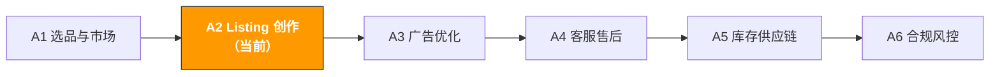

# A2. Listing 与内容创作 | Listing & Content Creation

> **路径**: Path A: 运营人 · **模块**: A2
> **最后更新**: 2026-03-12
> **难度**: 进阶
> **预计时间**: 每天 30 分钟，1-2 周
---


**TL;DR**: 1100+ 行的 Listing 优化完整指南。核心看点：Amazon 搜索算法从 A9 到 COSMO/Rufus 的演进、Listing 全套一键生成 Prompt、多语言本地化（不是翻译）、Q&A 预埋策略。如果时间有限，优先看 1.1（算法演进）+ 3（Prompt 模板）+ 5（多语言）。



---

## 本模块章节导航

1. [Listing 方法论](#1-listing-方法论ai-之前你需要理解的基础) · 2. [AI 工具全景](#2-ai-工具全景listing-阶段用什么) · 3. [Prompt 模板库](#3-prompt-模板库listing-专用) · 4. [Listing 实战工作流](#4-listing-实战工作流) · 5. [常见陷阱](#5-常见-listing-陷阱) · 6. [进阶技巧](#6-进阶技巧) · 7. [学习资源](#7-学习资源) · 8. [ OpenClaw 自动化](#8-用-openclaw-自动化-listing-工作流) · 9. [完成标志](#9-完成标志)


## 本模块你将学会

用 AI 工具把需要一整天的 Listing 撰写压缩到 1-2 小时。从关键词布局到 A+ Content 设计，建立一套可复用的 AI 辅助 Listing 创建与优化工作流。

完成本模块后，你将能够：
- 用 ChatGPT/Claude 一次性生成标题、五点、描述、Search Terms 全套 Listing 初稿，并理解为什么 AI 生成的初稿必须人工调整
- 用 AI 做多语言本地化（不是直译），让德语/日语/西班牙语 Listing 读起来像母语写的
- 用 AI 拆解竞品 Listing 策略，找到关键词覆盖的盲区和卖点差异化的机会
- 用 AI 生成 A+ Content 文案、产品图片文字、A/B 测试方案
- 建立一套从"关键词调研"到"Listing 上线"的完整 SOP
- 理解 2026 年新趋势：Amazon Rufus AI 购物助手和生成式搜索优化（GEO）如何改变 Listing 写法

---

## 1. Listing 方法论：AI 之前你需要理解的基础

### 1.1 Amazon 搜索算法演进：从 A9 到 COSMO + Rufus

> **相关阅读**: [AI 应用全景评估](../0-foundations/ai-landscape.md) Rufus/COSMO 对 Listing 的影响全景分析 · [D4 Walmart AI 指南](../d-platforms/d4-walmart-ai-guide.md) Walmart Rich Media（类似 A+）详见 D4

Listing 的本质是在"被搜索到"和"被点击购买"之间找到平衡。但 2024-2026 年，Amazon 的搜索系统经历了三次重大升级，Listing 优化策略也必须跟着变：

**算法演进时间线：**

| 阶段 | 时间 | 核心逻辑 | Listing 策略 |
|------|------|---------|-------------|
| **A9** | 2015-2024 | 关键词匹配 + 销售速度 | 堆关键词、刷单冲排名 |
| **A10** | 2024-2025 | 有机转化 + 外部流量 + 客户满意度 | 重视真实转化率、外部引流、降低退货率 |
| **COSMO** | 2025-2026 | 语义理解 + 意图匹配 + 知识图谱 | 从"关键词匹配"转向"意图匹配"，Listing 要回答"谁需要、为什么需要" |
| **Rufus** | 2024-2026 | AI 购物助手 + 自然语言问答 | Listing 变成"产品知识库"，要能回答用户的自然语言问题 |

**A10 vs A9 的关键变化：**

```
A9 时代：排名 = 关键词匹配 × 销售速度（PPC 推动的销量权重高）
A10 时代：排名 = 关键词匹配 × 有机转化率 × 外部流量 × 客户满意度

A10 新增/加权的因素：
有机销售权重 > PPC 销售权重（不能只靠广告冲排名了）
外部流量加分（从 Google/社交媒体引流到 Amazon 有额外权重）
客户满意度信号（退货率、Review 评分、A-to-Z Claim）
账户健康度（品牌注册、卖家评级、库存表现）
关键词堆砌惩罚（不自然的关键词密度会被降权）
```

**COSMO（COmmon Sense MOdeling） 2025 年的游戏规则改变者：**

COSMO 是 Amazon 基于大语言模型构建的"常识知识图谱"。它不再只看关键词是否匹配，而是理解产品和用户需求之间的语义关系。

```
A9/A10 的匹配方式：
用户搜索 "camping charger" → 匹配标题/五点中包含 "camping" 和 "charger" 的产品

COSMO 的匹配方式：
用户搜索 "camping charger" → COSMO 理解：
用户场景：户外露营，可能没有电源
用户需求：便携、大容量、防水、太阳能充电
关联属性：轻便、耐用、多接口、LED 灯
匹配产品：不只看关键词，还看产品属性是否满足露营场景的需求
```

**COSMO 对 Listing 的影响：**
1. **场景化描述比关键词更重要** 你的 Listing 需要清楚说明"谁在什么场景下用这个产品"
2. **属性完整性** 填写所有产品属性（材质、尺寸、适用场景、兼容性），COSMO 会读取这些结构化数据
3. **内容一致性** 标题、五点、描述、A+ Content 的信息要一致，COSMO 会检测矛盾
4. **语义丰富度** 用自然语言描述产品的使用场景和解决的问题，而不只是列功能参数

**Rufus AI 购物助手（详见 [§6.1](#61-amazon-rufus-优化2026-新趋势)）：**

Rufus 是面向消费者的 AI 助手，用户可以用自然语言提问（如"What's the best portable charger for a 3-day camping trip?"）。Rufus 会从 Listing、Review、Q&A、A+ Content 中提取信息来回答。这意味着你的 Listing 不只是给人看的，也是给 AI 读的。

> **2026 年的核心洞察**：Listing 优化已经从"关键词游戏"变成"意图匹配 + AI 可读性"。AI 帮你写 Listing 的价值不只是"写得快"，而是"写得既能被 COSMO 理解，又能被 Rufus 引用，还能说服真人购买"。

Content rephrased for compliance with licensing restrictions. Sources: [ZonGuru COSMO Guide](https://www.zonguru.com/blog/what-is-amazon-cosmo), [ZonGuru Amazon SEO 2026](https://www.zonguru.com/blog/amazon-seo-guide), [MyAmazonGuy COSMO+Rufus](https://myamazonguy.com/seo/amazon-seo-in-the-age-of-ai), [BareGold A10 Playbook](https://baregold.ca/resources/amazon-a10-algorithm-in-2026-the-listing-optimization-playbo)

### 1.2 Listing 的组成部分

| 组成部分 | 字符限制 | 对排名的影响 | 对转化的影响 | AI 能帮什么 |
|----------|---------|-------------|-------------|------------|
| **标题 (Title)** | 200 字符（建议 150 以内） | 最高权重 | 首屏可见 | 关键词布局 + 可读性平衡 |
| **五点 (Bullet Points)** | 每条 500 字符（建议 200-300） | 高权重 | 决策关键 | 卖点提炼 + 关键词融入 |
| **产品描述 (Description)** | 2000 字符 | 中等 | 补充信息 | 品牌故事 + 场景描写 |
| **A+ Content** | 无字符限制（模块化） | 间接（提升转化→提升排名） | 视觉说服力 | 文案生成 + 布局建议 |
| **Search Terms** | 250 字节（后台） | 高权重 | 无（用户看不到） | 关键词筛选 + 去重 |
| **图片** | 主图 + 6 张副图 | 间接 | 第一印象 | 图片文案 + 场景建议 |

**标题的黄金法则：**
- 前 80 个字符最重要（移动端只显示这么多）
- 格式：`品牌名 + 核心关键词 + 核心卖点 + 规格/数量`
- 不要用全大写（Amazon 可能抑制展示）
- 不要用促销词（"Best"、"#1"、"Sale"）

**五点的黄金法则：**
- 每条以大写卖点短语开头（如 "ULTRA-LIGHTWEIGHT DESIGN"）
- 先讲用户利益（benefit），再讲产品特性（feature）
- 前两条放最重要的卖点（很多用户只看前两条）
- 自然融入关键词，但不要牺牲可读性

### 1.3 AI 在 Listing 中的角色定位

AI 擅长的：
- **关键词布局**：把 50 个关键词自然融入标题和五点，人工做这件事需要反复调整
- **多语言本地化**：不只是翻译，而是按目标市场的搜索习惯重写
- **结构化输出**：按固定格式生成标题、五点、描述、Search Terms，避免遗漏
- **竞品分析**：快速拆解竞品 Listing 的关键词策略和卖点定位
- **A/B 测试方案**：生成多个版本的标题或五点，用于 Manage Your Experiments 测试

AI 不擅长的：
- **关键词数据**：AI 不知道哪个关键词搜索量大（需要 Helium 10/Jungle Scout 提供）
- **合规审查**：Amazon 的 Listing 政策经常更新，AI 可能用过时的规则（参考 [A6 合规模块](a6-compliance.md)）
- **视觉设计**：A+ Content 的图片设计需要专业工具（Canva/Photoshop），AI 只能提供文案和布局建议
- **品牌调性**：你的品牌声音需要人工定义，AI 可以模仿但不能创造
- **移动端适配**：AI 不知道你的 Listing 在手机上实际显示效果如何

> **核心原则**：用工具获取关键词数据，用 AI 做文案生成和优化，用人做最终审核和品牌调性把控。AI 生成的 Listing 是 80 分的初稿，人工调整到 95 分。

---

## 2. AI 工具全景：Listing 阶段用什么

### 2.1 付费工具深度评测

| 工具 | 价格 | 核心能力 | 适合谁 | AI 功能 |
|------|------|----------|--------|---------|
| [Helium 10 Listing Builder](https://www.helium10.com/) | $29-229/月 | AI 驱动的 Listing 生成器，关键词评分，竞品对比 | 进阶卖家，需要关键词数据驱动 | AI 自动生成标题/五点/描述，关键词使用率追踪 |
| [Jungle Scout AI Assist](https://www.junglescout.com/) | $29-84/月 | 自然语言查询生成 Listing，Review 洞察 | 新手卖家，界面友好 | 用自然语言描述产品即可生成 Listing |
| [Launch Fast](https://launchfast.ai/) | ~$50/月 | 分析 200+ 关键词 + Top 10 竞品，生成优化 Listing | 追求数据驱动的卖家 | 竞品分析 + 关键词覆盖 + AI 生成 |
| [SellerApp Listing Optimizer](https://www.sellerapp.com/) | $39-149/月 | Listing 质量评分、关键词追踪、优化建议 | 需要持续监控 Listing 表现的卖家 | AI 优化建议，关键词排名追踪 |
| [Canva AI](https://www.canva.com/) | 免费-$12.99/月 | A+ Content 设计、产品图编辑、AI 图片生成 | 所有卖家（A+ Content 必备） | Magic Design、AI 背景移除、文字生成图片 |
| [Leonardo.ai](https://leonardo.ai/) | 免费-$24/月 | AI 产品场景图生成、风格一致的图片系列 | 需要高质量产品场景图的卖家 | 文字生成图片、图片风格迁移 |
| [Midjourney](https://www.midjourney.com/) | $10-60/月 | 最高质量的 AI 图片生成 | 追求极致视觉效果的品牌卖家 | 文字生成图片（需要 Discord） |

**工具选择建议：**

**预算有限（<$50/月）**：ChatGPT/Claude + Canva 免费版
- ChatGPT/Claude 生成全套 Listing 文案（标题、五点、描述、Search Terms）
- Canva 免费版设计 A+ Content（模板足够用）
- 手动在 Amazon 后台检查关键词排名

**认真做（$100-200/月）**：Helium 10 + Canva Pro
- Helium 10 的 Listing Builder 是行业标杆 它能追踪你的关键词使用率，告诉你哪些高搜索量关键词还没用到
- Canva Pro 的 AI 功能（背景移除、Magic Design）大幅提升 A+ Content 制作效率
- 配合 ChatGPT 做多语言本地化

**品牌卖家（$200+/月）**：Helium 10 + Canva Pro + Leonardo.ai/Midjourney
- Leonardo.ai 或 Midjourney 生成品牌风格一致的产品场景图
- 适合需要大量视觉内容的品牌（多 SKU、多市场）

> **关键洞察**：Listing 工具的核心价值是关键词数据，不是 AI 生成能力。Helium 10 的 AI 生成的 Listing 质量不一定比 ChatGPT 好，但它能告诉你哪些关键词搜索量高、竞争度低 这是 ChatGPT 做不到的。最佳组合：用 Helium 10 做关键词研究，用 ChatGPT/Claude 做文案生成。

Content rephrased for compliance with licensing restrictions. Sources: [amazonfba.org listing tools](https://amazonfba.org/blog/tool-comparisons/best-amazon-listing-optimization-tools), [voc.ai listing tools](https://www.voc.ai/blog/best-amazon-listing-optimization-tools)

### 2.2 免费工具组合

| 工具 | 用途 | 链接 |
|------|------|------|
| ChatGPT / Claude | Listing 全套生成、竞品分析、多语言本地化、A+ 文案 | [chat.openai.com](https://chat.openai.com/) / [claude.ai](https://claude.ai/) |
| [DeepL](https://www.deepl.com/) | 高质量翻译，尤其欧洲语言（德/法/西/意） | [deepl.com](https://www.deepl.com/) |
| [Canva](https://www.canva.com/) | A+ Content 设计、产品图编辑（免费版够用） | [canva.com](https://www.canva.com/) |
| [Leonardo.ai](https://leonardo.ai/) | AI 产品场景图生成（每天 150 免费 token） | [leonardo.ai](https://leonardo.ai/) |
| [Amazon Listing Quality Dashboard](https://sellercentral.amazon.com/) | 官方 Listing 质量评分（Seller Central 内） | Seller Central → Listing Quality |
| Google Translate | 快速理解竞品外语 Listing（不用于最终翻译） | [translate.google.com](https://translate.google.com/) |

**免费工具的使用策略：**

1. **ChatGPT/Claude 做文案主力**：免费版就能生成高质量的 Listing 文案。关键是 Prompt 要写好（见第 3 节）。
2. **DeepL 做翻译质量把关**：AI 生成的多语言 Listing 用 DeepL 交叉验证。DeepL 对欧洲语言的翻译质量明显优于 Google Translate。
3. **Canva 做 A+ Content**：不需要 Photoshop 技能。Canva 的 Amazon A+ Content 模板可以直接用，改文字和图片即可。
4. **Amazon Listing Quality Dashboard**：这是 Amazon 官方的 Listing 评分工具，免费且权威。它会告诉你 Listing 缺少什么（如缺少 A+ Content、图片不够等）。

### 2.3 开源工具

| 工具/API | 用途 | GitHub/链接 |
|----------|------|-------------|
| python-amazon-sp-api | 通过 SP-API 获取产品目录数据、Listing 信息 | [github.com/saleweaver/python-amazon-sp-api](https://github.com/saleweaver/python-amazon-sp-api) |
| Amazon SP-API Catalog Items | 获取竞品 Listing 的标题、五点、描述等结构化数据 | [developer-docs.amazon.com/sp-api](https://developer-docs.amazon.com/sp-api) |

**什么时候用开源工具？**

如果你管理 50+ 个 SKU 或需要批量优化 Listing，手动操作效率太低。用 SP-API 可以：
- **批量拉取竞品 Listing**：自动获取 Top 10 竞品的标题、五点、描述，喂给 AI 做分析
- **批量更新 Listing**：AI 生成的 Listing 通过 API 批量上传，不用逐个在后台编辑
- **监控 Listing 变化**：定时检查竞品 Listing 是否更新了标题或卖点

> 更多技术实现细节，参考 [Path B: 技术人](../b-developers/) 的相关模块。

---

## 3. Prompt 模板库（Listing 专用）

> 本节提供每个模板的深度解析、常见错误和进阶变体。

### 3.1 Listing 全套生成（标题 + 五点 + 描述 + Search Terms）

**为什么这个 Prompt 有效：** 它一次性生成 Listing 的所有组成部分，保证关键词在各部分之间不重复浪费。关键设计点：
- "前 80 字符包含最重要的关键词" 针对移动端优化，大多数用户在手机上购物
- "以大写卖点开头" 符合 Amazon 五点的最佳实践格式
- "不重复标题中的词" Search Terms 的核心原则，很多卖家不知道
- "语言符合目标市场消费者的搜索和阅读习惯" 避免 AI 写出"正确但不自然"的文案

**常见错误：**
- 不提供关键词列表 → AI 会自己猜关键词，但它不知道哪些词搜索量高。必须从 Helium 10/Jungle Scout 导出关键词再喂给 AI。
- 不指定目标市场 → 不同市场的搜索习惯差异很大。美国消费者搜 "portable charger"，英国消费者搜 "power bank"。
- 关键词太少（<10 个）→ AI 没有足够的素材做关键词布局。建议提供 30-50 个关键词。
- 不提供竞品信息 → AI 无法做差异化。至少告诉 AI 你的产品和竞品有什么不同。
- 一次生成就直接用 → AI 的初稿是 80 分，需要人工检查关键词覆盖率、品牌调性、合规性。


**进阶变体：**

**变体 A 不同市场适配：**

```
你是一个精通 Amazon [US/DE/JP] 市场的 Listing 专家。

产品信息：
- 产品名称：[名称]
- 核心卖点：[卖点1]、[卖点2]、[卖点3]
- 目标客户：[客户画像]
- 核心关键词（来自 Helium 10）：[关键词列表，含搜索量]
- 与竞品的差异化：[你的产品独特之处]

请生成适合 [目标市场] 的 Listing：
1. 标题（不超过 200 字符，前 80 字符包含搜索量最高的关键词）
2. 5 个 Bullet Points（每条以大写卖点开头，融入关键词，突出差异化）
3. 产品描述（200 字以内，讲品牌故事和使用场景）
4. 后台 Search Terms（5 行，每行不超过 250 字节，不重复标题和五点中已用的词）

市场适配要求：
- [US] 强调性价比和便利性，语言直接有力
- [DE] 强调品质和技术参数，语言严谨专业
- [JP] 强调细节和用户体验，语言礼貌含蓄
```

> **为什么用这个变体**：同一个产品在不同市场的 Listing 策略完全不同。美国消费者看重 "value for money"，德国消费者看重 "Qualität"（品质），日本消费者看重 "使いやすさ"（易用性）。

**变体 B 不同品类风格：**

```
你是一个 Amazon Listing 专家。请根据品类特点调整写作风格：

品类：[选择一个]
- 电子产品 → 强调技术参数、兼容性、保修
- 家居用品 → 强调场景、美观、材质安全
- 运动户外 → 强调性能、耐用、使用场景
- 美妆个护 → 强调成分、效果、使用感受
- 母婴用品 → 强调安全认证、材质、年龄适用

产品信息：[填写]
关键词列表：[填写]

请按该品类的消费者期望风格生成 Listing。
```

> **为什么用这个变体**：电子产品的五点应该列参数（"5000mAh battery, charges iPhone 15 twice"），而家居用品的五点应该讲场景（"Perfect for your morning coffee ritual"）。品类决定了文案风格。

---

### 3.2 多语言本地化（不是直译）

> **相关阅读**: [D6 东南亚 AI 指南](../d-platforms/d6-southeast-asia-ai-guide.md) 东南亚 6 语言本地化详见 D6

**为什么这个 Prompt 有效：** 它明确告诉 AI "不是逐字翻译"，并要求 AI 标注做了哪些本地化调整。关键设计点：
- "替换为当地市场常用的搜索关键词" 直译的关键词往往不是当地消费者实际搜索的词
- "调整卖点顺序" 不同市场消费者关心的优先级不同
- "标注本地化调整及原因" 让你理解 AI 做了什么改动，便于审核

**常见错误：**
- 用 Google Translate 直接翻译 → 翻译质量差，关键词不匹配当地搜索习惯
- 不告诉 AI 目标市场的特殊要求 → 比如德国要求标注 CE 认证，日本要求标注 PSE 认证
- 翻译后不找母语者审核 → AI 的翻译可能语法正确但表达不自然。至少用 DeepL 交叉验证。
- 所有市场用同一套卖点顺序 → 美国消费者最关心价格，德国消费者最关心品质，日本消费者最关心细节


**进阶变体：**

**变体 A 德语特殊注意事项：**

```
将以下英文 Listing 本地化为德语版本。

[粘贴英文 Listing]

德语市场特殊要求：
1. 德国消费者重视技术参数和认证（CE、TÜV、GS） 在五点中突出
2. 德语复合词很长，标题容易超限 控制在 200 字符以内
3. 德国人对"夸大宣传"反感 避免 "best"、"amazing" 等词，用数据说话
4. 正式用语（Sie）而非非正式（du） 除非品牌定位年轻化
5. 注意德语的名词大写规则和复合词拼写

请标注你做了哪些本地化调整及原因。
```

**变体 B 日语特殊注意事项：**

```
将以下英文 Listing 本地化为日语版本。

[粘贴英文 Listing]

日语市场特殊要求：
1. 日本消费者重视包装和细节 如果产品有精美包装，在五点中强调
2. 使用敬语（です/ます体） 日本 Amazon 的标准语体
3. 日本消费者喜欢具体的使用场景描述 比如"通勤电車の中で使える"
4. 标题中混用片假名和汉字是正常的 品牌名用片假名，品类词用汉字
5. 日本消费者重视"安心感" 强调保修、退换政策、日本国内发货
6. 注意 PSE 认证标注（电子产品必须）

请标注你做了哪些本地化调整及原因。
```

**变体 C 西班牙语特殊注意事项：**

```
将以下英文 Listing 本地化为西班牙语版本（Amazon ES 站）。

[粘贴英文 Listing]

西班牙语市场特殊要求：
1. 使用西班牙本土西班牙语（castellano），不是拉美西班牙语
2. 西班牙消费者对价格敏感 强调性价比
3. 使用 usted（正式）而非 tú（非正式）
4. 西班牙市场的搜索关键词可能和拉美市场不同 确认使用本土词汇
5. 注意西班牙语的倒问号（¿）和倒感叹号（¡）

请标注你做了哪些本地化调整及原因。
```

> **多语言本地化的核心原则**：翻译只是 60 分，本地化才是 90 分。本地化 = 翻译 + 关键词替换 + 卖点重排 + 文化适配。用 AI 做初稿，用 DeepL 交叉验证，最好再找母语者审核。

---

### 3.3 竞品 Listing 策略拆解

**为什么这个 Prompt 有效：** 它要求 AI 从多个维度对比竞品 Listing，而不是简单地"看看别人怎么写的"。关键设计点：
- "核心定位用一句话概括" 强制 AI 提炼本质，而不是复述内容
- "共同强调的卖点 = 品类必备项" 帮你区分"必须有"和"差异化"
- "关键词覆盖对比表" 量化分析，不是主观感受

**常见错误：**
- 只分析 1 个竞品 → 无法区分"品类标准"和"个别策略"。至少分析 3 个。
- 只看标题 → 五点和 Search Terms 里藏着更多关键词策略。要分析完整 Listing。
- 只看文字不看图片 → 竞品的主图和 A+ Content 传达的信息可能和文字不同。
- 不记录分析结果 → 竞品分析的价值在于积累。建议用表格记录，定期更新。


**进阶变体：**

**变体 A 关键词覆盖对比：**

```
以下是 3 个竞品的完整 Listing（标题 + 五点 + 描述）和我的关键词列表（来自 Helium 10 Cerebro）。

竞品A：[粘贴完整 Listing]
竞品B：[粘贴完整 Listing]
竞品C：[粘贴完整 Listing]

我的目标关键词列表（含搜索量）：
[粘贴关键词列表]

请输出：
1. 关键词覆盖对比表（每个关键词在哪个竞品的哪个位置出现）
2. 所有竞品都覆盖的关键词（我必须覆盖）
3. 没有竞品覆盖的高搜索量关键词（我的机会）
4. 我的 Listing 应该如何布局这些关键词
```

> **为什么用这个变体**：关键词覆盖的"空白区"就是你的机会。如果一个月搜索量 5000 的关键词没有竞品在标题中使用，你用了就能获得额外的曝光。

**变体 B 卖点差异化分析：**

```
分析以下 3 个竞品的五点（Bullet Points），找出差异化机会：

竞品A 五点：[粘贴]
竞品B 五点：[粘贴]
竞品C 五点：[粘贴]

我的产品独特卖点：[列出]

请输出：
1. 竞品共同强调的卖点（品类标配，我必须有）
2. 竞品各自独有的卖点（他们的差异化策略）
3. 没有竞品提到但用户可能关心的卖点（来自 Review 分析）
4. 我的五点应该如何排序和措辞，才能最大化差异化
```

---

### 3.4 A+ Content 文案生成

**为什么需要这个 Prompt：** A+ Content（Enhanced Brand Content）可以提升转化率 3-10%（Amazon 官方数据）。但很多卖家的 A+ Content 只是把五点的内容重复一遍配上图片。好的 A+ Content 应该讲品牌故事、展示使用场景、用对比图说服用户。

**常见错误：**
- A+ Content 和五点内容完全重复 → 浪费了展示空间。A+ 应该补充五点没讲的内容。
- 文字太多图片太少 → A+ Content 是视觉驱动的，文字只是辅助。每个模块的文字控制在 50 字以内。
- 不用对比图 → 对比图（vs 竞品、vs 旧版本、使用前后）是转化率最高的 A+ 模块。
- 忽略品牌故事模块 → Brand Story 出现在 Review 上方，是免费的曝光位。

```
你是一个 Amazon A+ Content 文案专家。请为以下产品生成 A+ Content 文案：

产品：[名称]
品牌：[品牌名]
核心卖点：[3-5 个卖点]
目标客户：[客户画像]
品牌故事：[简要描述品牌理念和创立背景]

请生成以下 A+ 模块的文案：

1. **品牌故事横幅**（Brand Story）
- 品牌理念（一句话）
- 品牌背景（50 字以内）
- 3 个品牌价值关键词

2. **产品核心卖点模块**（Standard Image & Text）
- 3 个卖点，每个包含：标题（5 字以内）+ 描述（30 字以内）+ 图片建议

3. **对比图模块**（Comparison Chart）
- 我的产品 vs 普通产品的 5 个维度对比
- 每个维度用 / 或具体数据对比

4. **使用场景模块**（Standard Image & Text）
- 4 个使用场景，每个包含：场景名称 + 一句话描述 + 图片建议

5. **FAQ 模块**
- 5 个最常见的客户问题和回答（来自竞品 Review 中的疑问）

要求：文字简洁有力，每个模块的文字不超过 50 字。A+ Content 是视觉驱动的，文字只是辅助。
```

**进阶变体 品牌故事专项：**

```
为我的品牌生成 Amazon Brand Story 文案。Brand Story 出现在 Review 上方，是免费的品牌曝光位。

品牌名：[名称]
品牌创立年份：[年份]
品牌理念：[一句话]
创始人故事：[简要背景]
产品线：[列出主要产品]

请生成：
1. 品牌背景卡片（Brand Card） 品牌 logo 旁的一段话（100 字以内）
2. 3 个品牌价值卡片 每个包含图标建议 + 标题 + 一句话描述
3. 品牌问答（Brand Q&A） 3 个问答，展示品牌专业性

语气要求：专业但亲切，让消费者感受到这是一个"认真做产品"的品牌。
```

---

### 3.5 Search Terms 优化

**为什么需要这个 Prompt：** Search Terms 是 Listing 中最容易被浪费的部分。250 字节的后台空间，很多卖家要么填了重复的词，要么填了不相关的词，要么干脆空着。AI 可以帮你从竞品反查词中筛选出最优的 Search Terms 组合。

**常见错误：**
- 重复标题和五点中已有的词 → Amazon 已经索引了标题和五点中的关键词，Search Terms 中重复是浪费空间
- 用逗号或分号分隔 → Amazon 官方建议用空格分隔，逗号会浪费字节
- 包含品牌名 → 你自己的品牌名已经在标题中，竞品品牌名不允许放在 Search Terms
- 包含 ASIN → 没有索引价值
- 超过 250 字节 → 超出部分不会被索引。注意是字节不是字符，中文一个字占 3 字节

```
你是一个 Amazon Search Terms 优化专家。

以下是我的 Listing 当前状态：
- 标题：[粘贴标题]
- 五点：[粘贴五点]

以下是从 Helium 10 Cerebro 反查的竞品关键词（含搜索量）：
[粘贴关键词列表]

请帮我生成最优的 Search Terms：

规则：
1. 不重复标题和五点中已出现的词（逐词检查）
2. 优先选择搜索量高但标题/五点未覆盖的关键词
3. 用空格分隔，不用逗号
4. 总字节数不超过 250（英文1字符=1字节，中文1字符=3字节）
5. 不包含品牌名、ASIN、"best"/"cheap" 等主观词
6. 包含常见拼写错误和同义词

输出：
1. 推荐的 Search Terms（5 行）
2. 每行包含的关键词及其搜索量
3. 总字节数统计
4. 被排除的关键词及排除原因
```

**进阶变体 多语言 Search Terms：**

```
我的产品在 Amazon [DE/JP/ES] 站销售。
以下是英文版 Search Terms：[粘贴]

请生成目标语言的 Search Terms，注意：
1. 不是直译英文关键词，而是用当地消费者实际搜索的词
2. 包含当地语言的常见拼写变体和同义词
3. [DE] 注意德语复合词（如 Handyhülle = 手机壳）
4. [JP] 注意片假名和平假名的搜索差异
5. 总字节数不超过 250
```

> **Search Terms 的核心原则**：它是标题和五点的"补充"，不是"重复"。把它想象成一个 250 字节的"关键词补丁"，专门覆盖标题和五点放不下的长尾词。

---

### 3.6 Listing 质量审计

**为什么需要这个 Prompt：** 已有的 Listing 往往存在很多可以改进的地方，但卖家"身在其中"看不到。让 AI 做一次全面审计，就像请了一个外部顾问。

**常见错误：**
- 只审查文字不审查图片 → 图片对转化率的影响比文字更大
- 不提供竞品对比 → 没有参照物的审计缺乏针对性
- 审计后不执行 → 审计报告的价值在于执行。建议按优先级排序，每周改进一项。

```
你是一个 Amazon Listing 审计专家。请对以下 Listing 做全面质量审计：

我的 Listing：
- ASIN：[ASIN]
- 标题：[粘贴]
- 五点：[粘贴]
- 描述：[粘贴]
- Search Terms：[粘贴]
- 图片数量：[X] 张
- A+ Content：有/无
- Review 评分：[X] 星，[X] 条评价

竞品参考（BSR 前 3）：
- 竞品A 标题：[粘贴]
- 竞品B 标题：[粘贴]

请从以下维度审计并评分（每项 1-10 分）：

1. **关键词覆盖**：标题是否包含高搜索量关键词？五点是否自然融入关键词？
2. **标题质量**：前 80 字符是否包含最重要的信息？格式是否规范？
3. **五点说服力**：是否以利益（benefit）开头？是否突出差异化？
4. **描述质量**：是否讲了品牌故事？是否有使用场景？
5. **Search Terms 效率**：是否有重复？是否浪费了空间？
6. **移动端友好**：标题前 80 字符在手机上是否有吸引力？
7. **A+ Content**：是否有？质量如何？
8. **合规性**：是否有违规词（best、#1、guaranteed 等）？
9. **与竞品对比**：相比竞品，优势和劣势是什么？

输出：
- 总分和各项评分
- 前 3 个最需要改进的点（按影响力排序）
- 每个改进点的具体修改建议
- 修改后的示例文案
```

**进阶变体 移动端专项审计：**

```
超过 70% 的 Amazon 购物发生在移动端。请专门从移动端视角审计我的 Listing：

标题：[粘贴]
五点：[粘贴]

移动端审计要点：
1. 标题前 80 字符是否传达了核心价值？（手机只显示这么多）
2. 五点前两条是否是最重要的卖点？（手机上默认只展开前两条）
3. 五点每条是否在 200 字符以内？（太长在手机上阅读体验差）
4. 是否有 emoji 辅助扫读？（适度使用 emoji 可以提升移动端可读性）
```

---

### 3.7 产品图片文案（图片上的文字）

**为什么需要这个 Prompt：** Amazon 的副图（Infographic Images）上的文字是转化率的关键驱动力。好的图片文案能在用户不读五点的情况下传达核心卖点。但很多卖家的图片文案要么太长（手机上看不清），要么太空泛（"高品质材料"）。

**常见错误：**
- 图片文字太多 → 手机上看不清。每张图片的文字控制在 20 个词以内。
- 图片文字和五点完全一样 → 浪费了视觉传达的机会。图片文案应该更简洁、更有冲击力。
- 主图上加文字 → Amazon 主图政策禁止添加文字、logo、水印。只有副图可以加。
- 不考虑图片顺序 → 图片顺序就是你的"视觉销售漏斗"。第一张副图应该是最强卖点。

```
你是一个 Amazon 产品图片文案专家。请为以下产品生成 6 张副图的文案方案：

产品：[名称]
核心卖点：[3-5 个卖点]
目标客户：[客户画像]
竞品常见图片策略：[描述竞品图片的特点]

请为每张副图生成：
1. **图片主题**（这张图要传达什么信息）
2. **标题文案**（5 个词以内，大字体）
3. **副标题文案**（15 个词以内，小字体）
4. **图片建议**（应该拍什么样的照片/场景）

6 张副图的推荐顺序：
- 图2：核心卖点总览（信息图）
- 图3：最强差异化卖点（对比图）
- 图4：使用场景 1
- 图5：使用场景 2
- 图6：产品细节/材质/尺寸
- 图7：包装内容/配件清单

要求：
- 文案简洁有力，手机上能看清
- 每张图的标题不超过 5 个词
- 突出与竞品的差异化
```

**进阶变体 主图优化建议：**

```
我的产品主图点击率（CTR）低于品类平均。请分析可能的原因并给出优化建议：

产品：[名称]
当前主图描述：[描述当前主图的构图、角度、背景]
竞品主图特点：[描述 3 个竞品的主图]
品类平均 CTR：[X]%
我的 CTR：[X]%

主图优化方向（在 Amazon 政策允许范围内）：
1. 拍摄角度建议
2. 产品摆放方式
3. 是否需要展示配件/包装
4. 产品尺寸感的传达方式
5. 背景和光线建议
```

---

### 3.8 Listing A/B 测试方案生成

**为什么需要这个 Prompt：** Amazon 的 "Manage Your Experiments" 功能允许品牌卖家对标题、图片、A+ Content 做 A/B 测试。但很多卖家不知道测什么、怎么设计测试方案。AI 可以帮你生成有统计意义的测试方案。

**常见错误：**
- 同时改太多变量 → 无法判断是哪个改动带来了效果。每次只测一个变量。
- 测试时间太短 → 至少运行 2 周（覆盖一个完整的购买周期）。Amazon 建议 4-8 周。
- 不记录测试结果 → 测试的价值在于积累认知。建议用表格记录每次测试的假设、结果和结论。
- 测试无关紧要的改动 → 把 "lightweight" 改成 "ultra-light" 不会有显著差异。测试应该聚焦于大的策略变化。

```
你是一个 Amazon A/B 测试专家。请为以下 Listing 设计 A/B 测试方案：

当前 Listing：
- 标题：[粘贴]
- 五点：[粘贴]
- 当前转化率：[X]%
- 日均流量：[X] 次

请设计 3 个 A/B 测试方案（按优先级排序）：

每个方案包含：
1. **测试假设**：我认为 [改动] 会导致 [预期效果]，因为 [原因]
2. **控制组（A）**：当前版本
3. **测试组（B）**：修改后的版本（给出具体文案）
4. **测试变量**：只改了什么（确保单一变量）
5. **预期影响**：转化率提升 [X]%
6. **建议测试时长**：[X] 周
7. **成功标准**：转化率提升 ≥ [X]% 且统计显著（p < 0.05）

优先级排序原则：
- 优先测试对转化率影响最大的元素（标题 > 主图 > 五点 > A+）
- 优先测试改动幅度大的方案（策略性改动 > 措辞微调）
```

**进阶变体 标题 A/B 测试专项：**

```
为我的产品标题设计 3 个 A/B 测试变体：

当前标题：[粘贴]
核心关键词（按搜索量排序）：[列表]
竞品标题参考：[粘贴 3 个竞品标题]

变体设计方向：
- 变体1：关键词优先（把搜索量最高的词放最前面）
- 变体2：卖点优先（把最强差异化卖点放最前面）
- 变体3：场景优先（用使用场景开头，如 "For Travel..."）

每个变体标注：关键词覆盖率变化、预期对 CTR 和转化率的影响。
```

---

## 4. Listing 实战工作流

### 4.1 完整 Listing 创建 SOP（6 步法）

这套 SOP 把传统需要一整天的 Listing 创建流程压缩到 2-3 小时。每一步都标注了使用的工具和 Prompt。

```

Step 1: 关键词调研（45 分钟）
工具: Helium 10 Cerebro / Jungle Scout Keyword Scout
操作: 反查 Top 5 竞品关键词，导出 50-100 个关键词
AI: 关键词需求聚类（参考 A1 模块 3.3）
输出: 按搜索量排序的关键词列表 + 需求聚类

Step 2: 竞品 Listing 分析（30 分钟）
工具: 手动收集 Top 3 竞品的完整 Listing
AI: 竞品 Listing 策略拆解 Prompt（3.3）
输出: 竞品策略对比表 + 差异化方向

Step 3: AI 生成 Listing 初稿（30 分钟）
AI: Listing 全套生成 Prompt（3.1）
输入: 关键词列表 + 竞品分析 + 产品卖点
输出: 标题 + 五点 + 描述 + Search Terms 初稿

Step 4: 人工优化与合规检查（30 分钟）
操作: 检查关键词覆盖率、品牌调性、合规性
工具: Helium 10 Listing Builder（关键词使用率追踪）
AI: Listing 质量审计 Prompt（3.6）
输出: 优化后的最终版 Listing

Step 5: A+ Content 制作（30 分钟）
AI: A+ Content 文案生成 Prompt（3.4）
工具: Canva（设计 A+ 模块图片）
输出: 5-7 个 A+ Content 模块

Step 6: 图片文案与上线（15 分钟）
AI: 产品图片文案 Prompt（3.7）
操作: 将文案交给设计师/Canva 制作图片
输出: 完整 Listing 上线

```

### 4.2 Listing 优化 SOP（已有 Listing 的改进流程）

已有 Listing 的优化和从零创建不同 你需要先诊断问题，再针对性改进，而不是推倒重来。

```

Step 1: 诊断（30 分钟）
工具: Amazon Listing Quality Dashboard
AI: Listing 质量审计 Prompt（3.6）
数据: 当前转化率、CTR、关键词排名
输出: 问题清单（按影响力排序）

Step 2: 关键词差距分析（30 分钟）
工具: Helium 10 Cerebro（反查竞品新增关键词）
AI: Search Terms 优化 Prompt（3.5）
输出: 需要新增的关键词列表 + 更新后的 Search Terms

Step 3: 文案优化（30 分钟）
AI: 根据诊断结果，针对性优化标题/五点/描述
原则: 每次只改一个元素，便于追踪效果
输出: 优化后的文案

Step 4: A/B 测试（持续 2-4 周）
AI: A/B 测试方案生成 Prompt（3.8）
工具: Amazon Manage Your Experiments
输出: 测试结果 + 下一步优化方向

```

**优化频率建议：**
- **每周**：检查关键词排名变化，发现排名下降的关键词
- **每月**：做一次完整的 Listing 审计，对比竞品变化
- **每季度**：更新 Search Terms（季节性关键词、新趋势词）
- **重大变化时**：竞品降价、新竞品进入、Review 评分变化时立即优化

### 4.3 多语言 Listing 发布 SOP

从英文版 Listing 扩展到多语言版本的标准流程：

```

Step 1: 准备英文版基准 Listing
确保英文版已经过优化和验证
收集目标市场的关键词数据（SellerSprite/Helium 10）

Step 2: AI 本地化（每个语言 20 分钟）
AI: 多语言本地化 Prompt（3.2）+ 对应语言变体
输入: 英文版 Listing + 目标市场关键词
输出: 本地化初稿

Step 3: 交叉验证（每个语言 10 分钟）
工具: DeepL 反向翻译（目标语言 → 英文，检查意思是否偏差）
操作: 对比反向翻译和原文，标记差异大的部分

Step 4: 母语者审核（可选但推荐）
找目标市场的母语者审核自然度和文化适配
平台: Fiverr、Upwork、或团队内部母语同事

Step 5: 上线与监控
上传本地化 Listing，监控前 2 周的转化率变化
如果转化率下降，回退到上一版本并排查原因

```

> **多语言发布的优先级**：如果资源有限，建议按市场规模排序：DE（德国）> UK（英国）> FR（法国）> IT（意大利）> ES（西班牙）> JP（日本）。德国是欧洲最大的 Amazon 市场，优先做德语本地化 ROI 最高。

---

## 5. 常见 Listing 陷阱

### 5.1 关键词相关陷阱

| 陷阱 | 表现 | 如何避免 |
|------|------|----------|
| **关键词堆砌** | 标题塞满关键词，读起来像乱码 | 标题保持可读性，关键词自然融入。A10/COSMO 算法惩罚关键词堆砌，COSMO 更重视语义理解而非关键词密度。 |
| **关键词重复浪费** | 标题、五点、Search Terms 中反复出现同一个词 | Amazon 只需要一个词出现一次就会索引。用 AI 做去重检查。 |
| **忽略长尾词** | 只关注高搜索量的大词，忽略精准的长尾词 | 长尾词竞争低、转化率高。用 Search Terms 覆盖长尾词。 |
| **不更新关键词** | Listing 上线后从不更新关键词 | 搜索趋势会变化，每季度用 Helium 10 重新反查竞品关键词。 |

### 5.2 移动端相关陷阱

| 陷阱 | 表现 | 如何避免 |
|------|------|----------|
| **标题太长** | 标题 200 字符写满，手机上只显示前 80 字符，后面的信息用户看不到 | 把最重要的信息放在前 80 字符。用手机预览你的 Listing。 |
| **五点太长** | 每条五点 500 字符写满，手机上需要展开才能看到 | 每条控制在 200-300 字符。前两条放最重要的卖点。 |
| **图片文字太小** | 副图上的文字在手机上看不清 | 用手机预览图片。标题字体至少 24pt，副标题至少 16pt。 |
| **A+ Content 不适配** | A+ Content 在电脑上好看，手机上排版混乱 | 用 Amazon 的 A+ Content 预览功能检查移动端效果。 |

### 5.3 A+ Content 陷阱

| 陷阱 | 表现 | 如何避免 |
|------|------|----------|
| **内容重复** | A+ Content 和五点说的完全一样 | A+ 应该补充五点没讲的内容：品牌故事、使用场景、对比图。 |
| **文字过多** | A+ 模块里塞满文字，像一篇文章 | A+ 是视觉驱动的。每个模块文字不超过 50 字，让图片说话。 |
| **不用对比图** | 错过了最有说服力的 A+ 模块 | 对比图（vs 竞品、vs 旧版本、使用前后）转化率最高。 |
| **忽略 Brand Story** | 不知道 Brand Story 出现在 Review 上方 | Brand Story 是免费的品牌曝光位，所有品牌卖家都应该设置。 |

### 5.4 Search Terms 陷阱

| 陷阱 | 表现 | 如何避免 |
|------|------|----------|
| **超过 250 字节** | 超出部分不被索引，白写了 | 用 AI 计算字节数（英文 1 字符 = 1 字节，中文 1 字符 = 3 字节）。 |
| **用逗号分隔** | 逗号占用字节但没有索引价值 | Amazon 官方建议用空格分隔。 |
| **包含禁止词** | 放了竞品品牌名、"best"、"cheap" 等词 | 参考 Amazon 的 Search Terms 政策，用 AI 做合规检查。 |
| **完全空白** | 不知道 Search Terms 的存在或不知道怎么填 | 用 Search Terms 优化 Prompt（3.5）生成最优组合。 |

---

## 6. 进阶技巧

### 6.1 Amazon Rufus 优化（2026 新趋势）

Amazon Rufus 是 Amazon 在 2024 年推出的 AI 购物助手，2025-2026 年在全球市场逐步推广。Rufus 改变了用户的购物方式 用户不再只是搜索关键词，而是用自然语言提问（如 "What's the best portable charger for camping?"）。

**Rufus 如何影响 Listing：**

1. **自然语言匹配**：Rufus 不只看关键词，还理解语义。你的 Listing 需要回答用户可能问的问题，而不只是包含关键词。
2. **Review 权重增加**：Rufus 会引用 Review 中的内容来回答用户问题。好的 Review 比好的 Listing 文案更重要。
3. **A+ Content 被引用**：Rufus 会从 A+ Content 中提取信息。A+ Content 不再只是"好看"，而是"被 AI 读取"。
4. **FAQ 的价值提升**：产品 Q&A 区域的内容会被 Rufus 直接引用。主动回答常见问题变得更重要。

**Rufus 优化 Prompt：**

```
我的产品是 [名称]，目标市场是 Amazon [US/DE/JP]。

Amazon Rufus AI 购物助手会用自然语言回答用户的购物问题。
请帮我优化 Listing，让 Rufus 更容易引用我的产品信息：

1. 列出用户可能用 Rufus 问的 10 个自然语言问题（如 "What's the best X for Y?"）
2. 对每个问题，检查我的 Listing 是否包含回答这个问题的信息
3. 如果缺少，建议在 Listing 的哪个部分（标题/五点/描述/A+/Q&A）补充
4. 生成 5 个 Q&A 条目，主动回答最常见的购物问题

我的当前 Listing：
- 标题：[粘贴]
- 五点：[粘贴]
- A+ Content 概要：[描述]
```

> **Rufus 优化的核心思路**：从"关键词优化"转向"问题回答优化"。你的 Listing 不只是一个关键词容器，而是一个"产品知识库"，能回答用户关于这个产品的所有问题。

Content rephrased for compliance with licensing restrictions. Source: [azariangrowthagency.com Rufus playbook](https://azariangrowthagency.com/amazon-ads-ai-shopping-assistants-playbook/)

### 6.2 生成式搜索优化（GEO/AIO）

GEO（Generative Engine Optimization）或 AIO（AI Optimization）是 2025-2026 年的新趋势 不只是 Amazon Rufus，Google SGE、Perplexity、ChatGPT 等 AI 搜索引擎也在改变用户发现产品的方式。

**GEO 如何影响跨境电商：**

1. **AI 搜索引擎推荐产品**：用户在 Google SGE 或 Perplexity 中搜索 "best portable charger 2026"，AI 会直接推荐产品。你的产品信息需要被这些 AI 引擎"理解"。
2. **结构化数据更重要**：AI 引擎偏好结构化的产品信息（规格表、对比数据、FAQ）。
3. **品牌权威性影响排名**：AI 引擎会参考品牌在多个平台上的一致性信息。
4. **Review 和 UGC 被引用**：AI 引擎会引用真实用户的评价来推荐产品。

**GEO 优化 Prompt：**

```
我的产品是 [名称]，品牌是 [品牌名]。

请帮我优化产品信息，让 AI 搜索引擎（Google SGE、Perplexity、ChatGPT）更容易推荐我的产品：

1. **结构化产品描述**：用清晰的规格表格式描述产品（AI 引擎偏好结构化数据）
2. **FAQ 优化**：生成 10 个用户可能在 AI 搜索引擎中问的问题，并提供简洁准确的回答
3. **对比定位**：用 "比 [竞品] 更 [优势]" 的格式描述产品优势（AI 引擎喜欢对比信息）
4. **使用场景标签**：列出 5 个具体的使用场景（AI 引擎用场景匹配用户需求）
5. **品牌一致性检查**：确保产品描述与品牌官网、社交媒体上的信息一致

输出格式：可以直接用于 Amazon Listing、品牌官网、社交媒体的统一产品信息包。
```

> **GEO 的核心思路**：传统 SEO 是"让搜索引擎找到你"，GEO 是"让 AI 引擎推荐你"。区别在于 AI 引擎不只匹配关键词，还理解语义、评估权威性、引用用户评价。你的产品信息需要"对 AI 友好"。

Content rephrased for compliance with licensing restrictions. Source: [bebolddigital.com GEO for Amazon](https://www.bebolddigital.com/blog/generative-engine-optimization-for-amazon)

### 6.3 Listing 本地化的文化差异（US vs DE vs JP）

多语言 Listing 不只是翻译问题，更是文化适配问题。不同市场的消费者有完全不同的购买心理和信息偏好。

| 维度 | Amazon US 🇺🇸 | Amazon DE 🇩🇪 | Amazon JP 🇯🇵 |
|------|-------------|-------------|-------------|
| **购买决策驱动** | 性价比、便利性、社交证明 | 品质、技术参数、环保 | 细节、用户体验、安心感 |
| **标题风格** | 直接有力，强调 benefit | 严谨专业，强调 specification | 礼貌含蓄，强调使用场景 |
| **五点偏好** | 以利益开头（"Save time..."） | 以参数开头（"5000mAh..."） | 以场景开头（"通勤中に..."） |
| **Review 影响力** | 高（4.0+ 星才考虑） | 极高（德国人非常依赖 Review） | 极高（日本人会读完所有 Review） |
| **价格敏感度** | 中等（愿意为便利付费） | 中等（愿意为品质付费） | 较低（愿意为细节和包装付费） |
| **退货率** | 高（退货文化普遍） | 中等 | 低（退货被视为麻烦） |
| **合规要求** | FDA、FCC、CPSC | CE、WEEE、包装法 | PSE、食品卫生法、电安法 |
| **语言特点** | 简洁直接，用数字说话 | 复合词长，正式用语 | 敬语体，片假名+汉字混用 |
| **A+ Content 偏好** | 生活方式图、对比图 | 技术参数图、认证标志 | 使用步骤图、细节特写 |
| **信任建立方式** | Review 数量 + 品牌知名度 | 认证标志 + 技术参数 | 日本国内发货 + 售后保障 |

**文化适配 Prompt：**

```
我的产品是 [名称]，目前在 Amazon US 销售良好。
现在要扩展到 Amazon [DE/JP]。

请从文化差异角度，帮我调整 Listing 策略：

1. **卖点重排**：哪些卖点在目标市场更重要？应该放在什么位置？
2. **语言调性**：目标市场的消费者期望什么样的语言风格？
3. **信任元素**：目标市场的消费者看重什么信任信号？（认证、保修、发货地等）
4. **图片调整**：A+ Content 和副图需要做哪些文化适配？
5. **定价策略**：考虑 VAT、物流成本和当地消费水平，建议定价区间

当前 US 版 Listing：[粘贴]
```

> **文化适配的核心原则**：不要假设"在美国卖得好的 Listing 翻译一下就能在德国卖好"。德国消费者可能完全不关心你在美国强调的卖点。每个市场都需要独立的 Listing 策略。
---
---

## 7. 学习资源

### 7.1 免费课程

| 资源 | 平台 | 时长 | 适合谁 | 链接 |
|------|------|------|--------|------|
| ChatGPT Prompt Engineering for Developers | DeepLearning.AI | 1.5h | 所有人（学会写好 Prompt 是基础） | [deeplearning.ai](https://www.deeplearning.ai/short-courses/chatgpt-prompt-engineering-for-developers/) |
| Amazon Listing Optimization Guide | Amazon Seller University | 自学 | 新手卖家（官方最佳实践） | [sellercentral.amazon.com](https://sellercentral.amazon.com/learn) |
| A+ Content Best Practices | Amazon Brand Registry | 自学 | 品牌卖家 | [brandregistry.amazon.com](https://brandregistry.amazon.com/) |
| Canva Design School | Canva | 自学 | 需要做 A+ Content 设计的 | [canva.com/designschool](https://www.canva.com/designschool/) |

### 7.2 YouTube 频道推荐

| 频道 | 内容方向 | 为什么推荐 |
|------|----------|-----------|
| Helium 10 | Listing Builder 教程、关键词研究实战 | 官方频道，Listing Builder AI 的最佳教程来源 |
| Jungle Scout | Listing 优化方法论、AI Assist 使用教程 | 数据驱动的 Listing 优化案例 |
| My Amazon Guy | Amazon Listing 优化深度教程 | 实操性强，有大量 A+ Content 案例 |
| Brand Analytics | A+ Content 设计和品牌建设 | 专注品牌卖家的 Listing 策略 |

### 7.3 推荐阅读

| 文章/资源 | 来源 | 核心观点 |
|-----------|------|----------|
| [Best Amazon Listing Optimization Tools 2026](https://amazonfba.org/blog/tool-comparisons/best-amazon-listing-optimization-tools) | AmazonFBA.org | 2026 年 Listing 工具对比，含 AI 功能评测 |
| [Best Amazon Listing Optimization Tools](https://www.voc.ai/blog/best-amazon-listing-optimization-tools) | VOC.AI | AI 驱动的 Listing 优化工具全景 |
| [ChatGPT Prompts for Amazon Listing](https://sellerise.com/blog/chat-gpt-prompts-to-build-a-winning-amazon-listing/) | Sellerise | 实用的 ChatGPT Listing Prompt 集合 |
| [ChatGPT for Amazon Sellers](https://revenuegeeks.com/chatgpt-for-amazon-seller) | RevenueGeeks | ChatGPT 在 Amazon 运营中的全面应用指南 |
| [Generative Engine Optimization for Amazon](https://www.bebolddigital.com/blog/generative-engine-optimization-for-amazon) | BeBold Digital | GEO 如何影响 Amazon Listing 策略 |
| [Amazon Rufus AI Shopping Assistant Playbook](https://azariangrowthagency.com/amazon-ads-ai-shopping-assistants-playbook/) | Azarian Growth Agency | Rufus 优化的实操指南 |

Content rephrased for compliance with licensing restrictions. Sources cited inline.

### 7.4 社区与论坛

| 社区 | 平台 | 特点 |
|------|------|------|
| r/AmazonSeller | Reddit | 英文社区，Listing 优化经验分享 |
| r/FulfillmentByAmazon | Reddit | FBA 运营讨论，含 Listing 话题 |
| Amazon Seller Forums | Amazon | 官方论坛，Listing 政策更新第一手信息 |
| 知无不言 | 知乎 | 中文跨境电商社区，Listing 写作技巧讨论 |
| 创蓝论坛 | 独立站点 | 中国卖家社区，多语言 Listing 经验丰富 |

---

## 8. 用 OpenClaw 自动化 Listing 工作流

### 8.1 场景：AI Agent 自动生成多语言 Listing

```
你对 OpenClaw 说：
"帮我为 Google Sheet 'New Products' 第 3 行的新产品生成 US/DE/JP 三站 Listing，
保存到 'Listing Drafts' Sheet，完成后通知我审核"

OpenClaw 自动执行：
1. [Skill: google-sheets] 读取产品信息
2. [LLM] 生成英文 Listing（标题 + 5 Bullet + 描述 + Search Terms）
3. [LLM] 本地化为德文和日文版本
4. [Skill: google-sheets] 写入 Listing Drafts
5. [Skill: slack] 通知审核
```

### 8.2 需要的 Skills 和 MCP Server

| 组件 | 用途 | 链接 |
|------|------|------|
| **google-sheets** Skill | 读写产品数据和 Listing 草稿 | [ClawHub](https://clawhub.ai/) |
| **slack/telegram** Skill | 审核通知 | [ClawHub](https://clawhub.ai/) |
| **memory** Skill | 存储品牌风格指南和关键词库 | [OpenClaw Docs](https://docs.openclaw.com/) |
| **filesystem MCP** | 读取本地关键词文件 | [MCP Filesystem](https://github.com/modelcontextprotocol/servers/tree/main/src/filesystem) |

### 8.3 相关资源

| 资源 | 说明 | 链接 |
|------|------|------|
| OpenClaw 官方文档 | 安装和配置指南 | [docs.openclaw.com](https://docs.openclaw.com/) |
| ClawHub Skills 市场 | 搜索和安装 Agent Skills | [clawhub.ai](https://clawhub.ai/) |
| OpenClaw MCP 集成 | 连接 MCP Server | [Build Skill with MCP](https://rebeccamdeprey.com/blog/build-openclaw-skill-with-mcp) |
| F4 自动化与 Agent | Agent 基础模块 | [F4 模块](../0-foundations/f4-agent-automation.md) |

Content rephrased for compliance with licensing restrictions. Sources cited inline.

---

## 8.5 补充：AI 视频脚本生成通用方法论

> 本节补充跨平台通用的视频脚本 AI 生成方法论。具体平台的差异化应用请参考 [E1 Instagram](../e-social-media/e1-instagram-facebook-ai-guide.md)、[E2 YouTube](../e-social-media/e2-youtube-ai-guide.md)、[D2 TikTok Shop](../d-platforms/tiktok-shop-ai-guide.md)。

### 为什么 Listing 运营人需要懂视频脚本

2026 年，产品内容不再只是图文 Listing。Amazon 产品视频、社交媒体引流视频、达人合作视频都需要脚本。AI 可以帮你从 Listing 卖点直接生成视频脚本。

### 通用视频脚本框架

```
所有电商视频的底层结构：

Hook（前 3 秒）→ 问题/场景（5-10 秒）→ 产品展示（10-20 秒）→ 社会证明（5 秒）→ CTA（3 秒）

不同平台调整：
- Amazon 产品视频：偏功能展示，30-60 秒，无需 Hook（用户已在产品页）
- TikTok/Reels：偏娱乐/种草，15-30 秒，Hook 是生死线
- YouTube：偏深度评测，8-15 分钟，Hook + 章节结构
```

### AI 从 Listing 卖点生成视频脚本 Prompt

```
你是一个电商视频脚本专家。

以下是我的 Amazon Listing 卖点：
- 标题：[标题]
- 五点：[5 个 Bullet Points]

请基于这些卖点，生成 3 个视频脚本：

1. Amazon 产品视频（45 秒，功能展示型）
2. 社交媒体短视频（15 秒，种草型，适合 TikTok/Reels）
3. YouTube Shorts（30 秒，教育型）

每个脚本包含：分镜描述、口播/字幕文字、时长标注。
```

---

## 9. 完成标志

- [ ] 用 AI 生成一套完整的 Listing（标题 + 五点 + 描述 + Search Terms），并完成人工优化
- [ ] 用 AI 做一次竞品 Listing 策略拆解（至少 3 个竞品）
- [ ] 用 AI 生成至少 2 种语言的本地化 Listing（不是直译）
- [ ] 用 AI 生成一套 A+ Content 文案（含品牌故事、对比图、使用场景）
- [ ] 用 Listing 质量审计 Prompt 审查一个现有 Listing 并执行改进
- [ ] 了解 Amazon Rufus 和 GEO 趋势，并在 Listing 中应用至少一个优化建议

完成以上所有项目后，你已经掌握了 AI 辅助 Listing 创建与优化的核心技能。接下来进入 [A3 广告优化](a3-advertising.md)，学习如何用 AI 优化广告投放策略。

---

## 附录：快速参考卡片

### Prompt 速查表

| 场景 | Prompt 模板 | 所在章节 |
|------|------------|---------|
| 生成全套 Listing | Listing 全套生成 | [3.1](#31-listing-全套生成标题--五点--描述--search-terms) |
| 不同市场适配 | 市场适配变体 A | [3.1](#31-listing-全套生成标题--五点--描述--search-terms) |
| 不同品类风格 | 品类风格变体 B | [3.1](#31-listing-全套生成标题--五点--描述--search-terms) |
| 多语言本地化 | 多语言本地化 | [3.2](#32-多语言本地化不是直译) |
| 德语本地化 | 德语变体 A | [3.2](#32-多语言本地化不是直译) |
| 日语本地化 | 日语变体 B | [3.2](#32-多语言本地化不是直译) |
| 西班牙语本地化 | 西班牙语变体 C | [3.2](#32-多语言本地化不是直译) |
| 竞品策略拆解 | 竞品 Listing 策略拆解 | [3.3](#33-竞品-listing-策略拆解) |
| 关键词覆盖对比 | 关键词覆盖变体 A | [3.3](#33-竞品-listing-策略拆解) |
| A+ Content 文案 | A+ Content 文案生成 | [3.4](#34-a-content-文案生成) |
| 品牌故事 | 品牌故事变体 | [3.4](#34-a-content-文案生成) |
| Search Terms 优化 | Search Terms 优化 | [3.5](#35-search-terms-优化) |
| Listing 审计 | Listing 质量审计 | [3.6](#36-listing-质量审计) |
| 移动端审计 | 移动端变体 | [3.6](#36-listing-质量审计) |
| 图片文案 | 产品图片文案 | [3.7](#37-产品图片文案图片上的文字) |
| A/B 测试方案 | A/B 测试方案生成 | [3.8](#38-listing-ab-测试方案生成) |
| Rufus 优化 | Rufus 优化 | [6.1](#61-amazon-rufus-优化2026-新趋势) |
| GEO 优化 | GEO 优化 | [6.2](#62-生成式搜索优化geoaio) |
| 文化适配 | 文化适配 | [6.3](#63-listing-本地化的文化差异us-vs-de-vs-jp) |

### 工具速查表

| 需求 | 推荐工具 | 免费替代 |
|------|---------|---------|
| Listing 文案生成 | Helium 10 Listing Builder | ChatGPT / Claude |
| 关键词研究 | Helium 10 Cerebro | |
| Listing 质量评分 | SellerApp / Amazon Listing Quality Dashboard | Amazon Listing Quality Dashboard（免费） |
| 多语言翻译 | DeepL Pro | DeepL 免费版 + ChatGPT |
| A+ Content 设计 | Canva Pro | Canva 免费版 |
| 产品场景图 | Leonardo.ai / Midjourney | Leonardo.ai 免费额度 |
| A/B 测试 | Amazon Manage Your Experiments | Amazon Manage Your Experiments（免费） |
| 竞品 Listing 分析 | Helium 10 + ChatGPT | ChatGPT（手动收集竞品数据） |
| 竞品关键词反查 | Helium 10 Cerebro / SellerSprite | |
| 多站点数据 | SellerSprite | |

(a1-product-research.md) | [Path 总览](README.md) | [A3 广告 >](a3-advertising.md)
