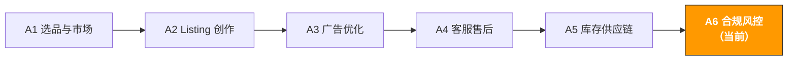

# A6. 合规与风控 | Compliance & Risk Management

> **路径**: Path A: 运营人 · **模块**: A6
> **最后更新**: 2026-03-12
> **难度**: 进阶
> **预计时间**: 每天 30 分钟，1-2 周
---




---

## 本模块章节导航

1. [合规方法论](#1-合规方法论ai-之前你需要理解的基础) · 2. [AI 工具全景](#2-ai-工具全景合规阶段用什么) · 3. [Prompt 模板库](#3-prompt-模板库合规专用) · 4. [合规实战工作流](#4-合规实战工作流) · 5. [常见陷阱](#5-常见合规陷阱) · 6. [进阶技巧](#6-进阶技巧) · 7. [学习资源](#7-学习资源)


> **重要免责声明 | Important Disclaimer**
> 本模块内容仅供一般性参考，**不构成法律、税务或合规建议**。各国法规频繁更新，AI 工具的输出可能不反映最新法规变化。在做出任何合规决策之前，请务必咨询专业的法律顾问、认证机构或税务师。依赖本模块内容做出的任何决策，风险由使用者自行承担。
> This module is for general reference only and **does not constitute legal, tax, or compliance advice**. Regulations change frequently and AI outputs may not reflect the latest updates. Always consult qualified legal counsel, certification bodies, or tax advisors before making compliance decisions.

---

## 本模块你将学会

用 AI 工具把合规调研从"逐条查法规"变成"结构化对比分析"。从产品认证到知识产权，建立一套可复用的 AI 辅助合规管理工作流。

完成本模块后，你将能够：
- 用 ChatGPT/Claude 快速生成多市场合规对比表，30 分钟完成过去需要 2-3 天的合规调研
- 用 AI 生成产品认证需求清单，明确每个市场需要的认证类型、费用范围和周期
- 用 AI 做知识产权风险评估（专利/商标/版权），在选品阶段就识别潜在的 IP 风险
- 用 AI 生成合规文档框架（Declaration of Conformity、Technical File），降低文档准备的门槛
- 用 AI 应对 Amazon 政策违规通知，快速生成申诉方案和 Plan of Action
- 用 AI 做 VAT/税务合规检查，理解不同市场的税务义务和申报要求

---

## 1. 合规方法论：AI 之前你需要理解的基础

### 1.1 跨境电商合规的第一性原理

合规的本质不是成本，而是**市场准入门票**。

很多卖家把合规看作"额外的负担"，但实际上：
- **没有 CE 标志，你的产品无法在欧盟销售** 这不是"建议"，是法律要求
- **没有 FCC 认证，电子产品无法在美国合法销售** 海关可以直接扣货
- **没有 PSE 标志，电器产品无法在日本上架** Amazon JP 会直接下架 Listing
- **没有 UKCA 标志，产品无法在英国销售** 脱欧后英国不再接受 CE 标志（过渡期已结束）

```
合规投入的 ROI = 避免的损失 / 合规成本

避免的损失包括：
- Listing 被下架的销售损失（可能是几万到几十万美元）
- 产品被召回的成本（退货 + 销毁 + 罚款）
- 账号被封的全部损失（所有 ASIN 停售 + 资金冻结）
- 法律诉讼的赔偿和律师费
- 品牌声誉损失（长期影响）
```

> **核心洞察**：合规成本通常是产品成本的 3-8%，但不合规的损失可能是年销售额的 50-100%。合规是投资，不是成本。

### 1.2 主要市场的合规框架对比

> **相关阅读**: [D13 欧洲平台](../d-platforms/d13-europe-marketplaces-guide.md) 欧洲合规要求（CE/EPR/VAT/VerpackG/GPSR）详见 D13。 · [D11 Coupang 韩国](../d-platforms/d11-coupang-korea-ai-guide.md) 韩国 KC 认证要求详见 D11。 · [E1 Instagram/Facebook AI 指南](../e-social-media/e1-instagram-facebook-ai-guide.md) 社交平台广告合规详见 E1

以下是跨境电商四大主要市场的合规要求对比。这是一个**概览性参考**，具体要求因产品品类而异。

> **注意**：以下信息基于截至 2026 年初的一般性认知，法规可能已更新。请以各国官方机构发布的最新法规为准。

| 维度 | 🇺🇸 US | 🇪🇺 EU (以 DE 为例) | 🇯🇵 JP | 🇬🇧 UK |
|------|---------|---------------------|---------|---------|
| **产品安全认证** | FCC（电子）、UL（安全）、CPSIA（儿童） | [CE 标志](https://en.wikipedia.org/wiki/CE_marking)（强制）、GS（自愿但推荐） | PSE（电气）、S-Mark（安全）、技適マーク（无线） | UKCA（脱欧后替代 CE） |
| **包装法规** | 无联邦统一要求，各州不同 | WEEE（电子废弃物）、包装法（VerpackG）、Green Dot | 容器包装リサイクル法 | UK WEEE、包装废弃物法规 |
| **标签要求** | FTC 标签法、原产地标注 | EU 能效标签、CE 标志、制造商信息 | 消費者保護法、家庭用品品質表示法 | UKCA 标志、UK 进口商信息 |
| **化学物质限制** | CPSIA（铅/邻苯）、Prop 65（加州） | REACH（化学品注册）、RoHS（有害物质限制） | 化審法（化学物质审查） | UK REACH（独立于 EU REACH） |
| **知识产权** | USPTO（专利商标局） | EUIPO（欧盟知识产权局） | JPO（特許庁） | UKIPO（英国知识产权局） |
| **税务** | Sales Tax（各州不同） | VAT（德国 19%，各国不同） | 消費税（10%） | VAT（20%） |
| **Amazon 特殊要求** | Brand Registry、透明计划 | EPR 注册号、LUCID 注册 | 技適マーク上传 | UK Responsible Person |

**各维度详细说明：**

**产品安全认证**

- **US FCC/UL**：FCC 认证是所有发射无线电频率的电子设备的强制要求。UL 认证虽然不是联邦强制的，但 Amazon US 对某些品类（如充电器、电池）要求提供 UL 测试报告。CPSIA 是针对 12 岁以下儿童产品的强制要求，包括铅含量测试和第三方实验室认证。
- **EU CE/GS**：[CE 标志](https://en.wikipedia.org/wiki/CE_marking)是进入欧盟市场的强制要求，覆盖安全、健康、环保等多个指令。GS 标志（Geprüfte Sicherheit）是德国的自愿性安全认证，但在德国市场有很高的消费者认知度，建议获取。
- **JP PSE/S-Mark**：PSE 标志是日本电气用品安全法的强制要求，分为菱形 PSE（特定电气用品）和圆形 PSE（非特定电气用品）。S-Mark 是日本的安全标志，由第三方认证机构颁发。
- **UK UKCA**：英国脱欧后，UKCA（UK Conformity Assessed）标志替代了 CE 标志。目前部分品类仍接受 CE 标志，但长期来看 UKCA 将成为唯一要求。请关注英国政府最新公告。

**包装法规**

- **US**：没有联邦层面的统一包装法规，但加州、纽约等州有各自的包装回收要求。实际操作中，大多数卖家不需要额外注册。
- **EU VerpackG/WEEE**：德国的包装法（VerpackG）要求所有在德国销售带包装产品的企业在 [LUCID](https://lucid.verpackungsregister.org/) 系统注册，并与授权的双元回收系统签约。WEEE 指令要求电子产品生产商注册并承担回收责任。**这是很多中国卖家容易忽略的合规要求**。
- **JP**：容器包装リサイクル法要求企业对包装材料承担回收义务，但对小规模进口商有豁免。
- **UK**：脱欧后英国有独立的包装废弃物法规和 WEEE 法规，与 EU 类似但注册系统不同。

**化学物质限制**

- **US CPSIA/Prop 65**：CPSIA 限制儿童产品中的铅和邻苯二甲酸盐含量。加州 Prop 65 要求对含有已知致癌或生殖毒性化学物质的产品加贴警告标签 这个要求非常广泛，几乎所有品类都可能涉及。
- **EU REACH/RoHS**：REACH 法规要求对化学物质进行注册、评估和授权。RoHS 指令限制电子电气设备中的有害物质（铅、汞、镉等）。两者都是强制要求。
- **JP 化審法**：日本的化学物质审查法对新化学物质有严格的审查和注册要求。

Content rephrased for compliance with licensing restrictions. Sources: [CE marking - Wikipedia](https://en.wikipedia.org/wiki/CE_marking), [legalclarity.org trading compliance](https://legalclarity.org/when-trading-with-more-developed-countries-key-compliance-rules/)

### 1.3 AI 在合规中的角色定位

AI 擅长的：
- **快速查询**：在几分钟内生成多市场合规对比表，替代过去需要几天的手动调研
- **对比分析**：把不同市场的合规要求放在同一个框架下对比，发现差异和共同点
- **文档生成**：生成合规文档的框架和模板（如 Declaration of Conformity、Technical File 大纲）
- **风险识别**：基于产品描述识别可能的合规风险点，提醒你需要关注的领域
- **多语言处理**：理解日文、德文的法规文本，帮你做跨语言的合规调研

AI 不擅长的：
- **法律判断**：AI 不能替代律师做法律判断。合规问题的最终答案需要专业法律意见
- **最新法规追踪**：AI 的训练数据有截止日期，可能不包含最新的法规变化。关键法规请查官方来源
- **认证执行**：AI 可以告诉你需要什么认证，但不能替你完成认证测试和申请
- **个案判断**：每个产品的合规情况都有特殊性，AI 给出的是通用建议，不是针对你具体产品的法律意见
- **责任承担**：AI 的建议不构成法律意见，如果基于 AI 建议做出错误决策，AI 不承担任何责任

> **核心原则**：用 AI 做合规调研的"第一步"（快速了解大方向），但关键决策必须咨询专业人士。AI 是你的合规研究助手，不是你的合规顾问。

> **再次强调**：本模块所有内容都是一般性参考信息。具体到你的产品和目标市场，请务必咨询认证机构（如 SGS、TÜV、Intertek）或专业律师。

---

## 2. AI 工具全景：合规阶段用什么

### 2.1 付费工具与服务

| 工具/服务 | 类型 | 价格范围 | 核心能力 | 适合谁 |
|-----------|------|----------|----------|--------|
| [SGS](https://www.sgs.com/) | 认证机构 | 按项目报价 | 全球领先的检测认证机构，覆盖 CE、FCC、UL 等所有主流认证 | 所有需要产品认证的卖家 |
| [TÜV](https://www.tuv.com/) | 认证机构 | 按项目报价 | 德国权威认证机构，GS 标志的主要颁发者，在欧洲市场认可度极高 | 主攻欧洲市场的卖家 |
| [Intertek](https://www.intertek.com/) | 认证机构 | 按项目报价 | 全球性检测认证机构，ETL 标志（UL 的替代方案）的颁发者 | 需要多市场认证的卖家 |
| [Compliance Gate](https://www.compliancegate.com/) | SaaS 平台 | $99-499/月 | 产品合规管理平台，自动追踪法规变化，管理认证文档 | 多 SKU、多市场的中大型卖家 |
| [Ashton Potter](https://www.ashtonpotter.com/) | 防伪溯源 | 按项目报价 | 产品认证和防伪解决方案，与 Amazon Transparency 集成 | 品牌卖家，需要防伪的品类 |

**选择建议：**

**预算有限**：直接联系 SGS 或 Intertek 的中国办事处，他们在深圳、上海都有实验室，价格比欧美总部便宜。先用 AI 确定需要哪些认证，再找认证机构报价。

**多市场运营**：考虑 Compliance Gate 这类 SaaS 平台，它可以帮你追踪不同市场的法规变化，管理所有产品的认证文档。当你的 SKU 超过 20 个且覆盖 3+ 市场时，手动管理合规文档会变得非常困难。

**欧洲市场优先**：TÜV 的 GS 标志在德国消费者中有很高的认知度。虽然 GS 不是强制要求，但有 GS 标志的产品在德国市场的转化率通常更高。

### 2.2 免费工具与资源

| 工具/资源 | 用途 | 链接 |
|-----------|------|------|
| ChatGPT / Claude | 合规调研、对比分析、文档生成、申诉方案起草 | [chat.openai.com](https://chat.openai.com/) / [claude.ai](https://claude.ai/) |
| Amazon Compliance Reference | Amazon 官方合规要求文档，按品类列出所需认证 | Seller Central → Help → Product Compliance |
| EU RAPEX / Safety Gate | 欧盟产品安全快速预警系统，查看被召回的产品和原因 | [ec.europa.eu/safety-gate](https://ec.europa.eu/safety-gate-alerts/screen/webReport) |
| CPSC Recalls Database | 美国消费品安全委员会召回数据库，了解哪些产品被召回 | [cpsc.gov/Recalls](https://www.cpsc.gov/Recalls) |
| Google Patents | 专利搜索，评估产品的专利侵权风险 | [patents.google.com](https://patents.google.com/) |
| USPTO TESS | 美国商标搜索系统，检查商标是否已被注册 | [tmsearch.uspto.gov](https://tmsearch.uspto.gov/) |
| EUIPO eSearch | 欧盟商标和外观设计搜索 | [euipo.europa.eu/eSearch](https://euipo.europa.eu/eSearch/) |
| LUCID 包装注册 | 德国包装法注册系统，查询和注册包装义务 | [lucid.verpackungsregister.org](https://lucid.verpackungsregister.org/) |

**免费工具的使用策略：**

1. **ChatGPT/Claude 做初步调研**：先用 AI 了解你的产品在目标市场需要哪些认证，生成一个合规需求清单。这是"第一步"，不是"最后一步"。
2. **RAPEX/CPSC 做风险评估**：搜索你的品类在这两个数据库中的召回记录。如果同类产品频繁被召回，说明这个品类的合规风险很高，需要特别注意。
3. **Google Patents 做专利排查**：在选品阶段就搜索相关专利，避免投入大量资金后才发现侵权。
4. **USPTO TESS/EUIPO 做商标检查**：在确定品牌名和产品名之前，先搜索是否已被注册。

### 2.3 AI 辅助合规的局限性

虽然 AI 在合规调研中非常有用，但必须清楚它的局限性：

| AI 可以做 | AI 不能做 |
|-----------|-----------|
| 生成合规需求概览 | 提供具有法律效力的合规意见 |
| 对比不同市场的法规差异 | 保证信息是最新的 |
| 生成文档模板和框架 | 替代认证机构的测试和认证 |
| 识别潜在的合规风险点 | 对具体产品做合规判定 |
| 起草申诉方案的初稿 | 保证申诉一定成功 |
| 翻译和理解多语言法规 | 替代专业律师的法律解读 |

> **关键提醒**：永远不要仅凭 AI 的输出就做出合规决策。AI 是帮你"问对问题"的工具，答案需要从官方来源和专业人士那里获取。

---

## 3. Prompt 模板库（合规专用）

> 本节提供每个模板的深度解析、常见错误和进阶变体。

### 3.1 多市场合规对比（深化版）

**为什么这个 Prompt 有效：** 它要求 AI 按统一维度对比多个市场的合规要求，输出结构化的对比表。关键设计点：
- "对比表"格式 强制 AI 做结构化输出，避免长篇大论
- "预估费用和周期" 把合规从"要不要做"变成"花多少钱、多长时间"的量化决策
- "常见陷阱" 让 AI 基于常见错误给出预警
- "信息时效性标注" 提醒 AI 和用户法规可能已更新

**常见错误：**
- 只说"电子产品" → 太笼统。"带锂电池的蓝牙耳机"和"USB 充电线"的合规要求完全不同。越具体越好
- 不指定目标市场 → 每个市场的要求差异很大，必须明确是 US、EU、JP 还是 UK
- 完全依赖 AI 输出 → AI 的合规信息可能过时或不完整。必须用官方来源交叉验证
- 忽略 Amazon 平台特殊要求 → Amazon 的合规要求有时比法规更严格（如对锂电池的额外要求）


**进阶变体：**

**变体 A 特定品类深度合规分析：**

```
我要在 Amazon [US/DE/JP/UK] 销售以下产品：
产品：[具体产品描述，如"带锂电池的便携式颈部风扇"]
材质：[主要材质，如"ABS 塑料 + 硅胶 + 锂聚合物电池"]
目标用户：[成人/儿童/通用]
价格区间：$[X]-$[X]

请做深度合规分析：
1. 每个市场的强制认证清单（区分"必须有"和"建议有"）
2. 锂电池相关的特殊要求（UN38.3、MSDS、运输限制）
3. 材质相关的化学物质限制（REACH、CPSIA、Prop 65）
4. 包装和标签的具体要求（需要标注什么信息？用什么语言？）
5. Amazon 平台的额外要求（需要上传什么文件？）
6. 合规成本估算（认证费 + 测试费 + 标签费）
7. 合规时间线（从开始到拿到所有认证需要多久？）

注意：请标注信息的时效性。法规可能已更新，以上信息仅供参考，
最终请以认证机构和官方法规为准。
```

> **为什么用这个变体**：通用的合规对比只能给你大方向。当你确定了具体产品后，需要做深度分析，把每个合规要求落实到具体的行动项和成本。

**变体 B 已有认证的扩展市场分析：**

```
我的产品已经有以下认证：
- FCC Part 15 Class B（美国）
- UL 62368-1 测试报告
- UN38.3 锂电池测试报告

现在我想把产品扩展到 [EU/JP/UK] 市场。

请分析：
1. 已有的认证中，哪些可以直接用于新市场？
2. 哪些认证需要重新做？（不能互认的部分）
3. 哪些认证可以基于已有报告做转换？（如 FCC → CE 的 EMC 部分）
4. 新市场还需要哪些额外认证？
5. 增量合规成本和时间估算
6. 建议的认证顺序（先做哪个性价比最高？）

认证互认规则可能变化，请与认证机构确认最新政策。
```

> **为什么用这个变体**：如果你已经有了一些认证，扩展到新市场不需要从零开始。有些测试报告可以复用，有些认证可以做转换，这能节省大量时间和费用。

---

### 3.2 产品认证需求清单生成

**为什么需要这个 Prompt：** 在选品阶段就了解合规成本，避免投入大量资金后才发现认证费用超出预算。这个 Prompt 帮你生成一个完整的认证需求清单，包含费用、周期和优先级。

**常见错误：**
- 选品时不考虑合规成本 → 有些品类的认证费用可能占产品成本的 20-30%（如医疗器械、儿童产品）
- 只看认证费用，忽略持续合规成本 → 有些认证需要年度审核、定期测试
- 不区分强制和自愿认证 → 强制认证必须做，自愿认证根据市场策略决定

```
请为以下产品生成完整的认证需求清单：

产品信息：
- 产品名称：[名称]
- 产品描述：[详细描述，包括功能、材质、电气参数]
- 目标市场：[US / EU / JP / UK，可多选]
- 目标品类：Amazon [品类名称]
- 是否含电池：[是/否，如是请说明电池类型和容量]
- 目标用户年龄：[成人/儿童/通用]
- 是否接触食品/皮肤：[是/否]

请输出：
1. 认证需求清单表格：
| 认证名称 | 市场 | 强制/自愿 | 费用范围 | 周期 | 有效期 | 优先级 |

2. 认证依赖关系（哪些认证需要先做？）
3. 总合规成本估算（首次 + 年度维护）
4. 建议的认证执行顺序和时间线
5. 可能的合规风险点

费用和周期为估算值，实际以认证机构报价为准。
不同实验室的报价可能差异较大，建议至少询价 2-3 家。
```

---

### 3.3 合规成本估算

**为什么需要这个 Prompt：** 合规成本不只是认证费。还包括测试费、标签印刷费、包装调整费、文档翻译费、年度维护费等。这个 Prompt 帮你做全面的合规成本估算，纳入产品定价模型。

**常见错误：**
- 只算认证费 → 测试费往往比认证费更高（如 EMC 测试、安全测试）
- 忽略不同市场的标签成本 → 欧洲要求多语言标签，日本要求日文标签，每个市场的标签可能不同
- 不算时间成本 → 认证周期可能是 4-12 周，这段时间你的产品无法上架销售

```
请帮我估算以下产品的全面合规成本：

产品信息：
- 产品：[名称和描述]
- 目标市场：[US / EU / JP / UK]
- 预计年销量：[X] 件
- 产品单价：$[X]
- 已有认证：[列出已有的认证，如无则写"无"]

请估算以下成本项：
1. 首次认证成本：
- 各项认证的测试费和认证费
- 样品费（送检样品）
- 文档准备费（技术文件、Declaration of Conformity）

2. 标签和包装调整成本：
- 各市场的标签设计和印刷费
- 包装调整费（如需要添加回收标志、警告标签）
- 多语言说明书翻译费

3. 持续合规成本（年度）：
- 年度审核费（如适用）
- 定期测试费
- 法规更新追踪成本
- 包装法注册费（如 LUCID）

4. 合规成本占比分析：
- 合规成本占产品成本的百分比
- 合规成本占售价的百分比
- 是否影响产品的定价竞争力？

5. 成本优化建议：
- 哪些认证可以合并测试以节省费用？
- 是否有政府补贴或行业协会优惠？
- 选择哪家认证机构性价比最高？

以上为估算值，实际费用请以认证机构报价为准。
```

---

### 3.4 知识产权风险评估

**为什么需要这个 Prompt：** 知识产权（IP）侵权是跨境电商最常见的合规风险之一。一次专利侵权投诉可能导致 Listing 被下架、库存被冻结，甚至面临法律诉讼。在选品阶段就做 IP 风险评估，可以避免巨大的损失。

**常见错误：**
- 只搜索产品名称 → 专利侵权不看名称，看功能和外观。需要搜索功能描述和技术特征
- 只查美国专利 → 如果你在欧洲和日本也销售，需要查各市场的专利
- 认为"大家都在卖就没问题" → 专利持有人可能还没开始维权，不代表没有风险
- 忽略外观设计专利 → 很多产品的外观设计有专利保护，模仿外观也是侵权

```
请帮我评估以下产品的知识产权风险：

产品信息：
- 产品名称：[名称]
- 产品描述：[详细描述，包括外观特征、核心功能、技术特点]
- 目标市场：[US / EU / JP]
- 竞品 ASIN（如有）：[ASIN 列表]
- 计划使用的品牌名：[品牌名]

请评估以下风险：
1. 专利风险：
- 这个产品的核心功能可能涉及哪些类型的专利？（发明专利、实用新型、外观设计）
- 建议搜索哪些关键词来排查专利？
- 如何在 Google Patents 上做初步排查？
- 风险等级评估（高/中/低）

2. 商标风险：
- 计划使用的品牌名是否可能与已注册商标冲突？
- 建议在哪些数据库搜索？（USPTO TESS、EUIPO、JPO）
- 品牌名的命名建议（避免与知名品牌相似）

3. 版权风险：
- 产品包装、说明书、Listing 图片是否可能涉及版权问题？
- 使用竞品图片做参考的法律风险

4. Amazon 平台 IP 投诉风险：
- 这个品类是否有频繁的 IP 投诉历史？
- 如何降低被投诉的风险？
- 如果被投诉，应对流程是什么？

5. 风险缓解建议：
- 是否需要做专业的专利检索（FTO 分析）？
- 是否需要注册自己的专利/商标？
- 产品设计上如何规避已有专利？

AI 的专利分析仅供初步参考，不能替代专业的专利律师意见。
如果风险等级为"高"，强烈建议聘请专利律师做正式的 FTO（Freedom to Operate）分析。
```

---

### 3.5 合规文档生成

**为什么需要这个 Prompt：** 合规文档（如 Declaration of Conformity、Technical File）是产品合规的核心证据。很多卖家不知道这些文档应该包含什么内容。AI 可以帮你生成文档框架，你再填入具体的产品信息和测试数据。

**常见错误：**
- 没有合规文档就上架 → 即使产品通过了认证测试，没有正式的合规文档也是不合规的
- 用模板直接填写不修改 → 每个产品的合规文档都应该是针对性的，不能用通用模板
- 文档语言不对 → EU 的合规文档需要用目标市场的官方语言（或至少英文）

```
请帮我生成以下合规文档的框架：

产品信息：
- 产品名称：[名称]
- 产品型号：[型号]
- 制造商：[公司名称和地址]
- 目标市场：[EU / UK]

需要生成的文档：
1. EU Declaration of Conformity（欧盟符合性声明）框架：
- 需要引用哪些指令？（如 LVD、EMC、RoHS、RED）
- 需要引用哪些协调标准？
- 需要包含哪些信息？
- 签署人要求

2. Technical File（技术文件）大纲：
- 技术文件应该包含哪些章节？
- 每个章节需要什么内容？
- 需要附上哪些测试报告？
- 文件保存要求（保存多少年？）

3. 产品标签内容清单：
- CE 标志的尺寸和位置要求
- 需要标注的信息（制造商、进口商、型号等）
- 警告标签要求（如适用）

以上框架仅供参考，正式的合规文档应由合规专业人士审核。
Declaration of Conformity 是法律文件，签署人需要对内容的准确性负法律责任。
```

---

### 3.6 Amazon 政策违规应对

**为什么需要这个 Prompt：** Amazon 的政策违规通知（如 Listing 被下架、账号被警告）需要快速响应。AI 可以帮你分析违规原因、生成 Plan of Action（POA）的初稿，加速申诉流程。

**常见错误：**
- 收到通知后不及时响应 → Amazon 通常给 48-72 小时的响应时间，超时可能导致更严重的处罚
- 申诉信写得太笼统 → "我们会改进"不够，需要具体的根因分析和改进措施
- 不承认问题 → Amazon 希望看到你理解问题所在，否认问题只会让情况更糟
- 多次提交相同的申诉 → 每次申诉都应该有新的信息或改进，重复提交会降低成功率

```
我收到了 Amazon 的以下政策违规通知，请帮我分析并生成申诉方案：

违规通知内容：
[粘贴 Amazon 发送的违规通知全文]

产品信息：
- ASIN：[ASIN]
- 产品名称：[名称]
- 品类：[品类]
- 销售市场：[US/DE/JP]

补充信息：
- 这个问题是第几次发生？[首次/重复]
- 你认为可能的原因是什么？[你的分析]
- 你已经采取了哪些措施？[已有的改进]

请帮我：
1. 违规原因分析：
- 这个违规通知的具体含义是什么？
- 可能触发违规的根本原因有哪些？
- 这个违规的严重程度如何？（警告/Listing 下架/账号风险）

2. Plan of Action（POA）框架：
- Root Cause（根本原因）：具体说明问题是怎么发生的
- Immediate Actions（已采取的措施）：你已经做了什么来解决问题
- Preventive Measures（预防措施）：你将如何防止问题再次发生
- 附件清单：需要提供哪些证据文件？

3. 申诉信初稿（英文）：
- 专业、简洁、有诚意
- 包含具体的数据和证据
- 明确的时间线和责任人

4. 后续跟进建议：
- 如果首次申诉被拒，下一步怎么做？
- 是否需要寻求专业申诉服务？
- 如何监控账号健康状态？

AI 生成的申诉方案仅供参考。复杂的违规案例（如账号被封、IP 侵权投诉）
建议寻求专业的 Amazon 申诉服务或律师协助。
```

---

### 3.7 VAT/税务合规检查

**为什么需要这个 Prompt：** 税务合规是跨境电商最容易被忽略但后果最严重的合规领域。欧洲的 VAT 合规尤其复杂 不同国家税率不同，注册要求不同，申报频率不同。不合规可能面临高额罚款和追缴税款。

**常见错误：**
- 认为"Amazon 代扣代缴就不用管了" → Amazon 只在部分国家代扣 VAT，卖家仍有注册和申报义务
- 不注册 VAT 就开始销售 → 在欧洲，没有 VAT 号就销售是违法的
- 只注册一个国家的 VAT → 如果你在多个欧洲国家有库存（如 Pan-EU），每个有库存的国家都需要注册
- 不按时申报 → 即使没有销售，也需要按时提交零申报

```
请帮我做 VAT/税务合规检查：

业务信息：
- 公司注册地：[中国/其他]
- 销售市场：[US / DE / FR / IT / ES / UK / JP]
- 物流模式：[FBA / FBM / Pan-EU / EFN]
- 月均销售额（各市场）：[数据]
- 是否已注册 VAT：[是/否，如是请列出已注册的国家]
- 是否使用 Amazon VAT Services：[是/否]

请分析：
1. 各市场的税务义务：
| 市场 | 税种 | 税率 | 是否需要注册 | 申报频率 | Amazon 是否代扣 |

2. VAT 注册需求：
- 哪些国家必须注册 VAT？
- 注册流程和所需文件
- 注册费用和时间

3. 税务合规风险评估：
- 当前是否存在合规缺口？
- 不合规的潜在后果（罚款金额、账号风险）
- 是否需要补缴历史税款？

4. 税务优化建议：
- 物流模式对税务的影响（Pan-EU vs EFN）
- 是否可以利用 OSS（One-Stop Shop）简化申报？
- 是否需要聘请税务代理？

税务法规复杂且经常变化。以上分析仅供参考，
具体的税务义务请咨询专业的跨境电商税务师或会计师。
```

---

### 3.8 产品召回风险评估

**为什么需要这个 Prompt：** 产品召回是最严重的合规事件之一。一次召回可能导致数十万美元的损失（退货、销毁、罚款、法律费用）和不可逆的品牌损害。提前评估召回风险，可以在产品设计和质量控制阶段就采取预防措施。

**常见错误：**
- 认为"我的产品不会被召回" → 任何产品都有召回风险，特别是电子产品、儿童产品、食品接触产品
- 不关注同类产品的召回历史 → CPSC 和 RAPEX 数据库中的召回案例是最好的风险预警
- 不做产品责任保险 → 一旦发生安全事故，没有保险的卖家可能面临巨额赔偿

```
请帮我评估以下产品的召回风险：

产品信息：
- 产品名称：[名称]
- 产品描述：[详细描述]
- 主要材质：[材质列表]
- 是否含电池/电气部件：[是/否]
- 目标用户：[成人/儿童/通用]
- 销售市场：[US / EU / JP]

请分析：
1. 品类召回历史：
- 这个品类在 CPSC（美国）和 RAPEX（欧盟）中的召回记录
- 最常见的召回原因是什么？
- 召回频率如何？（高风险/中风险/低风险品类）

2. 产品风险点识别：
- 基于产品描述，可能存在哪些安全风险？
- 哪些材质或部件最容易出问题？
- 是否有窒息、触电、起火、化学物质超标等风险？

3. 预防措施建议：
- 产品设计阶段应该注意什么？
- 质量控制（QC）的关键检查点
- 需要做哪些安全测试？
- 是否需要购买产品责任保险？

4. 召回应急预案：
- 如果发生安全事故，第一步做什么？
- 如何与 Amazon 和监管机构沟通？
- 召回的流程和成本估算

产品安全是最高优先级。如果 AI 识别出高风险点，
请立即咨询专业的产品安全顾问或认证机构。
```

---

## 4. 合规实战工作流

### 4.1 新品上架前合规检查 SOP

每个新品在上架前都应该经过系统化的合规检查。这套 SOP 把合规检查从"想到什么查什么"变成"按清单逐项确认"。

```

Step 1: 合规需求识别（1-2 小时）
操作: 确定产品品类和目标市场
AI: 用多市场合规对比 Prompt（3.1）生成合规需求概览
AI: 用产品认证需求清单 Prompt（3.2）生成认证清单
输出: 合规需求清单（认证 + 标签 + 包装 + 化学物质）
验证: 在 Amazon Seller Central 确认品类的具体合规要求

Step 2: 知识产权排查（1-2 小时）
操作: 搜索相关专利和商标
工具: Google Patents + USPTO TESS + EUIPO eSearch
AI: 用知识产权风险评估 Prompt（3.4）做初步评估
输出: IP 风险评估报告
决策: 如果风险为"高"，暂停项目，咨询专利律师

Step 3: 合规成本估算（30 分钟）
AI: 用合规成本估算 Prompt（3.3）计算全面合规成本
操作: 向 2-3 家认证机构询价，验证 AI 估算
决策: 合规成本是否在预算内？是否影响产品定价竞争力？
输出: 合规预算和时间线

Step 4: 认证执行（4-12 周，视品类而定）
操作: 选择认证机构，提交样品，开始测试
追踪: 建立认证进度追踪表
文档: 准备技术文件和合规声明
AI: 用合规文档生成 Prompt（3.5）生成文档框架

Step 5: 标签和包装准备（1-2 周）
操作: 设计符合各市场要求的产品标签
检查: CE/UKCA/PSE 标志尺寸和位置
检查: 多语言标签内容（产品信息、警告、回收标志）
检查: 包装法注册（如 LUCID）

Step 6: 上架前最终检查（30 分钟）
检查清单:
所有必需认证已获得？
认证文件已上传到 Seller Central？
产品标签符合目标市场要求？
包装法已注册（如适用）？
VAT 已注册（如适用）？
产品责任保险已购买（如适用）？
合规文档已归档保存？
通过 → 上架销售
未通过 → 返回对应步骤补完

```

### 4.2 多站点合规扩展 SOP

当你的产品已经在一个市场成功销售，想要扩展到其他市场时，合规是最大的门槛。这套 SOP 帮你系统化地评估和执行多站点合规扩展。

```

Step 1: 目标市场合规差异分析（1-2 小时）
操作: 对比当前市场和目标市场的合规要求差异
AI: 用已有认证扩展市场 Prompt（3.1 变体 B）分析
输出: 增量合规需求清单（需要新增的认证、标签、注册）
关键问题: 已有认证哪些可以复用？哪些需要重新做？

Step 2: 合规成本和 ROI 评估（1 小时）
操作: 估算增量合规成本
AI: 用合规成本估算 Prompt（3.3）计算
对比: 合规成本 vs 目标市场的预期收入
决策: 合规投入的 ROI 是否合理？
如果 ROI < 1 → 暂缓扩展，优先优化现有市场

Step 3: 税务合规准备（1-2 周）
操作: 注册目标市场的 VAT/税号
AI: 用 VAT 合规检查 Prompt（3.7）确认税务义务
注意: 欧洲 VAT 注册通常需要 2-6 周
注意: 在 VAT 注册完成前不要开始销售

Step 4: 认证和标签调整（4-8 周）
操作: 完成目标市场所需的额外认证
操作: 调整产品标签（添加 CE/UKCA/PSE 标志、多语言标签）
操作: 注册包装法（如 LUCID）
操作: 指定 Responsible Person（如 EU/UK 要求）

Step 5: Listing 合规适配（1 周）
操作: 确保 Listing 内容符合目标市场的广告法规
检查: 产品声明是否合规（不能有未经验证的功效声明）
检查: 图片是否符合当地要求
操作: 上传合规文件到 Seller Central

Step 6: 上架和监控
操作: 在目标市场上架产品
监控: 关注是否收到合规相关的通知或警告
记录: 建立合规文档归档系统
定期: 每季度检查法规更新

```

### 4.3 合规事件应急响应 SOP

当你收到 Amazon 的合规通知（Listing 下架、账号警告、IP 投诉）时，快速响应至关重要。这套 SOP 帮你在 24 小时内完成初步应对。

```

Hour 0-2: 评估和分类
操作: 仔细阅读通知内容，确定违规类型
分类:
- 产品安全/认证问题 → 高优先级
- IP 侵权投诉 → 高优先级
- Listing 内容违规 → 中优先级
- 文档缺失 → 中优先级
- 客户投诉触发 → 视严重程度
AI: 用 Amazon 政策违规应对 Prompt（3.6）分析违规原因

Hour 2-8: 证据收集和方案制定
操作: 收集所有相关证据
- 产品认证文件、测试报告
- 供应商资质文件
- 质量控制记录
- 客户沟通记录（如涉及客户投诉）
AI: 用 Prompt（3.6）生成 Plan of Action 初稿
审核: 人工审核 AI 生成的方案，补充具体细节

Hour 8-16: 申诉提交
操作: 完善 Plan of Action
操作: 准备所有附件（认证文件、改进措施证据）
操作: 通过 Seller Central 提交申诉
注意: 申诉信要专业、简洁、有诚意
注意: 不要否认问题，展示你理解问题并已采取行动

Hour 16-24: 后续准备
操作: 准备备选方案（如果首次申诉被拒）
操作: 评估是否需要专业申诉服务或律师
操作: 检查其他 ASIN 是否有类似风险
操作: 更新合规检查清单，防止类似问题再次发生

Day 2-7: 跟进
监控: 每天检查 Seller Central 的案件状态
如果被拒: 分析拒绝原因，补充新证据，重新提交
如果通过: 记录经验教训，更新合规 SOP
升级: 如果 3 次申诉都被拒，考虑寻求专业帮助

```

> **应急响应的核心原则**：速度 > 完美。先在 24 小时内提交一个合理的初步申诉，比花一周准备一个"完美"的申诉更重要。Amazon 看重的是你的响应速度和态度。

---

## 5. 常见合规陷阱

### 5.1 认证相关陷阱

| 陷阱 | 表现 | 如何避免 |
|------|------|----------|
| **CE 标志 ≠ 万能通行证** | 以为有了 CE 标志就能在所有欧洲国家销售，忽略了各国的额外要求（如德国 VerpackG、法国 DEEE） | CE 是基础，但每个国家可能有额外的注册要求。用 AI 逐国检查。 |
| **认证过期不续** | 认证有有效期（通常 1-5 年），过期后继续销售是违规的 | 建立认证到期提醒系统，提前 3 个月启动续期流程。 |
| **用假证或买证** | 从不正规渠道购买认证证书，被查到后果严重（产品召回 + 法律追责） | 只通过正规认证机构（SGS、TÜV、Intertek 等）获取认证。 |
| **认证范围不匹配** | 产品做了改版但没有更新认证，新版本的认证实际上是无效的 | 产品任何设计变更都需要评估是否影响认证有效性。 |
| **只做了部分认证** | 产品需要 CE + RoHS + REACH，但只做了 CE，以为够了 | 用认证需求清单 Prompt（3.2）确保不遗漏任何必需认证。 |

### 5.2 标签相关陷阱

| 陷阱 | 表现 | 如何避免 |
|------|------|----------|
| **标签语言不对** | 在德国市场用英文标签，在日本市场没有日文标签 | 每个市场的标签必须使用当地官方语言。欧洲多国销售需要多语言标签。 |
| **CE 标志尺寸不合规** | CE 标志太小或比例不对（CE 标志有严格的尺寸和比例要求） | CE 标志最小高度 5mm，两个字母的比例必须符合官方模板。参考 [CE marking guidelines](https://en.wikipedia.org/wiki/CE_marking)。 |
| **缺少制造商/进口商信息** | 欧盟要求产品标签上标注制造商或欧盟授权代表的名称和地址 | 确保标签包含完整的制造商信息。如果你是中国卖家，需要指定欧盟 Responsible Person。 |
| **Prop 65 警告缺失** | 在加州销售的产品没有 Prop 65 警告标签，被起诉索赔 | 如果产品可能含有 Prop 65 清单上的化学物质，加贴警告标签。宁可多贴不要漏贴。 |
| **回收标志缺失** | 在德国销售的产品包装没有回收标志（Green Dot 或类似标志） | 注册 LUCID 后，按要求在包装上标注回收标志。 |

### 5.3 知识产权相关陷阱

| 陷阱 | 表现 | 如何避免 |
|------|------|----------|
| **外观设计侵权** | 产品外观与竞品太相似，被投诉外观设计专利侵权 | 在产品设计阶段就做外观设计专利排查。保持足够的设计差异化。 |
| **商标抢注** | 使用的品牌名在目标市场已被他人注册 | 在确定品牌名之前，先在 USPTO/EUIPO/JPO 搜索。尽早注册自己的商标。 |
| **图片版权** | Listing 使用了未授权的图片（包括竞品图片、网络图片） | 所有 Listing 图片必须是自己拍摄或有合法授权的。 |
| **恶意 IP 投诉** | 竞品通过虚假的 IP 投诉让你的 Listing 下架 | 了解 Amazon 的 IP 投诉反申诉流程。保留所有产品原创性证据。 |
| **专利流氓** | 收到不明来源的专利侵权警告信，要求支付"许可费" | 不要立即付款。先验证专利的有效性，咨询专利律师评估风险。 |

### 5.4 税务相关陷阱

| 陷阱 | 表现 | 如何避免 |
|------|------|----------|
| **不注册 VAT 就销售** | 在欧洲没有 VAT 号就开始销售，被税务局追缴税款 + 罚款 | 在开始销售前完成 VAT 注册。注册通常需要 2-6 周。 |
| **Pan-EU 忘记多国注册** | 使用 Pan-EU 物流但只注册了德国 VAT，其他有库存的国家没注册 | Pan-EU 模式下，每个有库存的国家都需要注册 VAT。 |
| **不按时申报** | 忘记按时提交 VAT 申报，产生滞纳金和罚款 | 设置申报日历提醒。考虑使用 Amazon VAT Services 或专业税务代理。 |
| **低报销售额** | 为了少缴税而低报销售额，被税务审计发现后面临严重处罚 | 如实申报。Amazon 会向税务局报告你的销售数据，低报很容易被发现。 |
| **忽略 US Sales Tax** | 认为 Amazon 代收 Sales Tax 就不用管了 | Amazon 在大多数州代收 Sales Tax，但卖家仍需了解自己的 Nexus 义务。 |

### 5.5 Amazon 政策相关陷阱

| 陷阱 | 表现 | 如何避免 |
|------|------|----------|
| **Listing 内容违规** | 使用了禁止的词汇（如"FDA approved"但实际没有 FDA 批准） | 不要在 Listing 中做未经验证的声明。了解 Amazon 的 Listing 内容政策。 |
| **Review 操纵** | 通过刷单、换评等方式操纵 Review，被 Amazon 检测到 | 不要做任何形式的 Review 操纵。Amazon 的检测算法越来越强。 |
| **多账号关联** | 在同一市场开设多个卖家账号，被 Amazon 检测到关联 | 一个市场只用一个账号。如果确实需要多账号，确保完全隔离。 |
| **忽略 BSA 合规要求** | 使用的第三方工具或 AI Agent 不符合 Amazon 的 Buyer-Seller Agreement 要求 | 确保所有使用的工具和 AI Agent 符合 Amazon 的最新政策要求。参考 [Amazon AI Agent 合规要求](https://ppc.land/amazons-new-ai-agent-rules-shake-up-sellers-before-march-4-deadline/)。 |
| **产品安全投诉不处理** | 收到客户的产品安全投诉但不及时处理，导致 Listing 被下架 | 所有安全相关投诉必须在 24 小时内响应。建立安全投诉处理流程。 |

---

## 6. 进阶技巧

### 6.1 2026 新趋势：Amazon AI Agent 合规要求（BSA 更新）

2026 年初，Amazon 更新了 Buyer-Seller Agreement（BSA），对卖家使用的 AI Agent 和自动化工具提出了新的合规要求。这是一个重要的趋势变化，所有使用 AI 工具的卖家都需要关注。

**核心要求概述：**

Amazon 要求卖家确保其使用的所有第三方工具和 AI Agent 符合以下原则：
- **数据安全**：工具不能未经授权访问或存储买家数据
- **行为合规**：AI Agent 的自动化操作不能违反 Amazon 的服务条款
- **透明度**：卖家需要了解并对其使用的工具的行为负责
- **及时更新**：卖家需要在规定期限内确保工具合规

**对卖家的影响：**

1. **审查你使用的所有工具**：列出所有连接到 Seller Central 的第三方工具和 AI Agent，确认它们符合 Amazon 的最新要求
2. **关注工具提供商的合规声明**：正规的工具提供商会发布合规更新，确认其工具符合 Amazon 的新要求
3. **谨慎使用自动化操作**：AI Agent 的自动定价、自动回复等功能需要确保不违反 Amazon 政策
4. **保留操作记录**：记录 AI Agent 的操作日志，以备 Amazon 审查

Content rephrased for compliance with licensing restrictions. Sources: [ppc.land Amazon AI agent rules](https://ppc.land/amazons-new-ai-agent-rules-shake-up-sellers-before-march-4-deadline/), [ecommercebytes.com BSA compliance](https://www.ecommercebytes.com/2026/02/18/amazon-sellers-have-2-weeks-to-ensure-compliance-of-tools-they-use/)

**AI 辅助 BSA 合规检查：**

```
请帮我检查以下工具是否符合 Amazon 最新的 BSA 合规要求：

我使用的工具列表：
1. [工具名称] 用途：[描述]，连接方式：[API/插件/手动]
2. [工具名称] 用途：[描述]，连接方式：[API/插件/手动]
3. [工具名称] 用途：[描述]，连接方式：[API/插件/手动]

请分析：
1. 每个工具可能涉及的 BSA 合规风险
2. 需要向工具提供商确认的合规问题
3. 是否有工具需要停用或替换？
4. 如何建立工具合规审查的定期流程？

Amazon 的政策持续更新，请以 Seller Central 的最新通知为准。
```

### 6.2 欧盟新法规：Digital Product Passport 与 GPSR

欧盟正在推进两项重要的新法规，将对跨境电商卖家产生深远影响：

**Digital Product Passport（DPP） 数字产品护照**

DPP 是欧盟绿色协议的一部分，要求产品携带数字化的"护照"，记录产品的全生命周期信息（材料来源、制造过程、碳足迹、回收指南等）。

- **时间线**：预计 2027-2030 年分品类逐步实施，电池产品最先受影响
- **对卖家的影响**：需要收集和提供更详细的产品供应链信息
- **准备建议**：开始建立产品供应链数据收集体系，与供应商沟通数据共享

**GPSR（General Product Safety Regulation） 通用产品安全法规**

GPSR 于 2024 年 12 月 13 日生效，替代了旧的通用产品安全指令（GPSD）。

- **核心变化**：
- 所有在欧盟销售的消费品都需要指定一个欧盟境内的 Responsible Person（经济运营商）
- 产品必须有可追溯性信息（制造商、进口商、产品标识）
- 在线市场（如 Amazon）有更大的合规监管责任
- 加强了产品召回和安全通知的要求

- **对中国卖家的影响**：
- 必须指定欧盟境内的 Responsible Person（可以是进口商、授权代表或履行服务提供商）
- 产品标签需要包含 Responsible Person 的联系信息
- Amazon 可能要求卖家提供 Responsible Person 的信息才能上架

**AI 辅助新法规影响评估：**

```
请帮我评估欧盟新法规对我的业务的影响：

业务信息：
- 产品品类：[品类]
- 欧盟销售市场：[DE/FR/IT/ES 等]
- 当前是否有欧盟 Responsible Person：[是/否]
- 年销售额（欧盟）：€[X]

请分析：
1. GPSR 对我的产品的具体要求是什么？
2. 我是否需要指定 Responsible Person？如何找到合适的？
3. 产品标签需要做哪些调整？
4. Digital Product Passport 未来会如何影响我的品类？
5. 建议的合规准备时间线和预算

欧盟法规实施细则可能仍在更新中，请关注欧盟官方公告和 Amazon 的合规通知。
```

### 6.3 合规成本优化策略

合规是必须做的，但可以通过策略优化来降低成本：

**策略 1：认证合并测试**

很多认证的测试项目有重叠。例如：
- CE 的 EMC 测试和 FCC 的 EMC 测试有很大的重叠部分
- 如果同时做 CE 和 FCC，可以要求认证机构合并测试，节省 20-30% 的测试费

**策略 2：选择性价比高的认证机构**

- 国际大机构（SGS、TÜV、Intertek）价格较高但认可度最广
- 中国本土的 CNAS 认可实验室价格更低，出具的报告在很多情况下也被接受
- 建议：首次认证用国际大机构（建立信任），后续续期或新产品可以考虑本土实验室

**策略 3：利用认证互认**

- 部分认证之间有互认协议。例如，CB 体系（IECEE CB Scheme）的测试报告可以在多个国家转换为当地认证
- 先做 CB 报告，再转换为各国认证，比逐国单独做认证便宜

**策略 4：批量认证**

- 如果你有多个类似产品（如同一系列的不同型号），可以申请"系列认证"
- 只需要对代表性型号做完整测试，其他型号做差异测试即可

**策略 5：合规前置到选品阶段**

- 在选品阶段就评估合规成本（用 Prompt 3.3），避免选择合规成本过高的品类
- 合规成本占产品成本超过 10% 的品类，需要谨慎评估是否值得进入

```
请帮我优化以下产品的合规成本：

产品信息：
- 产品：[名称]
- 目标市场：[US + EU + JP]
- 当前合规预算：$[X]
- 已有认证：[列出]

请建议：
1. 哪些认证可以合并测试以节省费用？
2. 是否可以利用 CB 体系做认证转换？
3. 推荐的认证执行顺序（先做哪个可以复用最多？）
4. 认证机构选择建议（性价比最优方案）
5. 预计可以节省多少合规成本？
```

---

## 7. 学习资源

### 7.1 免费课程与官方资源

| 资源 | 平台 | 时长 | 适合谁 | 链接 |
|------|------|------|--------|------|
| Amazon Seller University Product Compliance | Amazon | 自学 | 所有卖家（官方合规要求说明，按品类分类） | [sellercentral.amazon.com/learn](https://sellercentral.amazon.com/learn) |
| EU Product Safety & CE Marking Guide | European Commission | 自学 | 主攻欧洲市场的卖家（官方 CE 标志指南） | [ec.europa.eu/growth](https://single-market-economy.ec.europa.eu/single-market/ce-marking_en) |
| CPSC Business Education | CPSC | 自学 | 主攻美国市场的卖家（消费品安全要求） | [cpsc.gov/Business](https://www.cpsc.gov/Business--Manufacturing) |
| ChatGPT Prompt Engineering for Developers | DeepLearning.AI | 1.5h | 所有人（学会写好 Prompt 是 AI 合规调研的基础） | [deeplearning.ai](https://www.deeplearning.ai/short-courses/chatgpt-prompt-engineering-for-developers/) |
| VAT for E-Commerce Sellers | Various | 自学 | 在欧洲销售的卖家（VAT 注册和申报基础） | 搜索 "VAT for Amazon sellers" |

### 7.2 YouTube 频道推荐

| 频道 | 内容方向 | 为什么推荐 |
|------|----------|-----------|
| Amazon Seller University | 官方合规教程，按品类讲解合规要求 | 最权威的合规信息来源 |
| Jungle Scout | 包含合规相关的选品建议和市场分析 | 从选品角度理解合规成本 |
| My Amazon Guy | Amazon 运营全流程，含账号健康和申诉技巧 | 实操性强，有大量真实申诉案例 |
| Seller Sessions | 深度访谈，含合规专家和律师的分享 | 专业视角，适合深入学习 |

### 7.3 推荐阅读

| 文章/资源 | 来源 | 核心观点 |
|-----------|------|----------|
| [CE Marking Wikipedia](https://en.wikipedia.org/wiki/CE_marking) | Wikipedia | CE 标志的全面介绍，包括适用指令、标志要求和合规流程 |
| [Amazon's New AI Agent Rules](https://ppc.land/amazons-new-ai-agent-rules-shake-up-sellers-before-march-4-deadline/) | PPC Land | Amazon 2026 年 BSA 更新对 AI Agent 和第三方工具的新合规要求 |
| [Amazon Sellers BSA Compliance](https://www.ecommercebytes.com/2026/02/18/amazon-sellers-have-2-weeks-to-ensure-compliance-of-tools-they-use/) | eCommerce Bytes | 卖家需要在截止日期前确保工具合规的详细指南 |
| [Key Compliance Rules for International Trade](https://legalclarity.org/when-trading-with-more-developed-countries-key-compliance-rules/) | Legal Clarity | 与发达国家贸易时的关键合规规则概述 |
| [CPSC Recalls Database](https://www.cpsc.gov/Recalls) | CPSC | 美国消费品召回数据库，了解哪些产品被召回及原因 |
| [EU Safety Gate (RAPEX)](https://ec.europa.eu/safety-gate-alerts/screen/webReport) | European Commission | 欧盟产品安全快速预警系统，查看被通报的危险产品 |

Content rephrased for compliance with licensing restrictions. Sources cited inline.

### 7.4 社区与论坛

| 社区 | 平台 | 特点 |
|------|------|------|
| r/AmazonSeller | Reddit | 综合 Amazon 卖家社区，合规问题讨论活跃 |
| r/FulfillmentByAmazon | Reddit | FBA 卖家社区，产品合规和账号健康话题多 |
| Amazon Seller Forums | Amazon | 官方论坛，合规政策更新和申诉经验第一手信息 |
| 知无不言 | 知乎 | 中文跨境电商社区，认证和合规经验丰富 |
| 创蓝论坛 | 独立站点 | 中国卖家社区，欧洲 VAT、CE 认证实操案例多 |
| 福步外贸论坛 | 独立站点 | 外贸综合社区，产品认证和出口合规信息丰富 |

## 8.5 补充：各社交平台广告合规要求对比

> 本节补充跨平台广告合规要求。当你在社交媒体投放广告引流到 Amazon/Shopify 时，需要同时遵守平台广告政策。

### 各平台广告合规对比

| 合规要求 | Amazon | Meta (IG/FB) | Google/YouTube | TikTok | Pinterest |
|----------|--------|-------------|----------------|--------|-----------|
| 虚假宣传 | 禁止 | 禁止 | 禁止 | 禁止 | 禁止 |
| 身体特征描述 | 允许（产品相关） | 禁止（"你的皮肤..."） | 限制 | 限制 | 限制 |
| Before/After 图 | 允许 | 限制（不能暗示身体变化） | 限制 | 限制 | 限制 |
| 健康声明 | 需要认证 | 严格限制 | 严格限制 | 严格限制 | 严格限制 |
| Affiliate 披露 | 不适用 | 建议 | FTC 要求 | 建议 | 建议 |
| 价格展示 | 必须准确 | 必须准确 | 必须准确 | 必须准确 | 必须准确 |
| 竞品对比 | 允许（需真实） | 允许（需真实） | 允许（需真实） | 允许 | 允许 |
| 用户评价引用 | 允许 | 需要真实来源 | 需要真实来源 | 需要真实来源 | 需要真实来源 |

### AI 广告合规检查 Prompt

```
你是一个跨平台广告合规专家。

以下是我准备投放的广告文案：
[粘贴文案]

投放平台：[Meta / Google / TikTok / Pinterest]
产品品类：[X]
目标市场：[US / EU / JP]

请检查：
1. 是否违反该平台的广告政策？（具体指出哪条）
2. 是否违反目标市场的广告法规？（FTC / EU 消费者保护 / 日本景品表示法）
3. 是否需要添加免责声明或披露？
4. 修改建议（保持营销效果的同时合规）
```

### 各市场广告法规要点

| 市场 | 法规 | 关键要求 |
|------|------|----------|
| US | FTC Act | Affiliate 必须披露；健康声明需要科学依据；"免费"必须真正免费 |
| EU | UCPD + DSA | 禁止误导性广告；必须标注"广告"；GDPR 数据合规 |
| JP | 景品表示法 | 禁止"优良误认"和"有利误认"；比较广告需要客观数据 |
| DE | UWG | 德国反不正当竞争法，比 EU 更严格 |

> 详细的各市场合规要求请参考本模块 [3.1 多市场合规对比](#31-多市场合规对比深化版)。社交平台具体广告投放指南请参考 [E1 Meta Ads](../e-social-media/e1-instagram-facebook-ai-guide.md#6-meta-advantage-ai-广告深度指南)。

---

## 9. 完成标志
- [ ] 用 AI 生成产品认证需求清单，并向至少 2 家认证机构询价验证
- [ ] 用 AI 做一次知识产权风险评估（专利 + 商标排查）
- [ ] 完成一次新品上架前合规检查 SOP 的全流程执行
- [ ] 用 AI 起草一份 Plan of Action（即使没有实际违规，也做一次模拟练习）
- [ ] 建立合规文档归档系统，包含所有产品的认证文件、测试报告和合规声明

完成以上所有项目后，你已经掌握了 AI 辅助合规管理的核心技能。合规是一个持续的过程，建议每季度用 AI 检查一次法规更新，确保你的产品始终合规。

> **最终提醒**：本模块所有内容仅供一般性参考。合规决策涉及法律责任，请务必在专业人士指导下做出最终决策。AI 是你的合规研究助手，不是你的合规顾问。

---

## 附录：合规速查表

### 按市场 × 品类矩阵

以下速查表帮你快速了解不同市场和品类组合的核心合规要求。这是一个**简化概览**，具体要求请参考对应的 Prompt 模板做深度分析。

> 以下信息为一般性参考，法规可能已更新。请以官方来源为准。

**消费电子产品（如蓝牙耳机、充电器、移动电源）**

| 合规项 | 🇺🇸 US | 🇪🇺 EU | 🇯🇵 JP | 🇬🇧 UK |
|--------|---------|---------|---------|---------|
| 电磁兼容 | FCC Part 15 | CE (EMC Directive) | 技適マーク（无线设备） | UKCA (EMC) |
| 电气安全 | UL 测试报告 | CE (LVD Directive) | PSE 标志 | UKCA (LVD) |
| 有害物质 | | RoHS | | UK RoHS |
| 化学物质 | CPSIA（如适用） | REACH | 化審法 | UK REACH |
| 锂电池 | UN38.3 + MSDS | UN38.3 + 电池指令 | UN38.3 + PSE | UN38.3 + 电池法规 |
| 包装 | 无联邦要求 | VerpackG + WEEE | 容器包装法 | UK 包装法 + WEEE |
| 税务 | Sales Tax | VAT (19% DE) | 消費税 (10%) | VAT (20%) |
| 预估认证费 | $2,000-5,000 | €3,000-8,000 | ¥300,000-800,000 | £2,500-6,000 |
| 预估周期 | 4-8 周 | 6-12 周 | 6-10 周 | 4-8 周 |

**儿童产品（如玩具、儿童餐具、婴儿用品）**

| 合规项 | 🇺🇸 US | 🇪🇺 EU | 🇯🇵 JP | 🇬🇧 UK |
|--------|---------|---------|---------|---------|
| 产品安全 | CPSIA + ASTM F963 | CE (Toy Safety Directive) | ST 标志（玩具安全） | UKCA (Toy Safety) |
| 化学物质 | CPSIA 铅/邻苯 | REACH + EN 71 | 食品衛生法（如接触口腔） | UK REACH + EN 71 |
| 窒息警告 | CPSIA 小零件警告 | CE 年龄警告标签 | 年龄警告标签 | UKCA 年龄警告 |
| 第三方测试 | CPSC 认可实验室（强制） | Notified Body（部分品类） | 第三方测试（推荐） | UK Approved Body |
| 追踪标签 | CPSIA 追踪标签（强制） | 制造商信息标签 | 制造商信息 | 制造商信息 |
| 预估认证费 | $3,000-8,000 | €4,000-10,000 | ¥500,000-1,000,000 | £3,000-8,000 |
| 预估周期 | 6-12 周 | 8-16 周 | 8-12 周 | 6-12 周 |

**家居用品（如厨房用具、收纳、装饰品）**

| 合规项 | 🇺🇸 US | 🇪🇺 EU | 🇯🇵 JP | 🇬🇧 UK |
|--------|---------|---------|---------|---------|
| 食品接触 | FDA 21 CFR（如适用） | EU 1935/2004 | 食品衛生法 | UK 食品接触法规 |
| 化学物质 | Prop 65（加州） | REACH | 化審法 | UK REACH |
| 产品安全 | CPSC 一般要求 | CE (GPSD/GPSR) | 消費生活用製品安全法 | UKCA (GPSR) |
| 标签 | FTC 标签法 | EU 标签要求 | 家庭用品品質表示法 | UK 标签要求 |
| 预估认证费 | $1,000-3,000 | €2,000-5,000 | ¥200,000-500,000 | £1,500-4,000 |
| 预估周期 | 3-6 周 | 4-8 周 | 4-8 周 | 3-6 周 |

> **如何使用这个速查表**：
> 1. 找到你的产品品类和目标市场的交叉点
> 2. 了解需要哪些合规项
> 3. 用对应的 Prompt 模板（第 3 节）做深度分析
> 4. 向认证机构询价确认费用和周期
---
### Prompt 速查表

| 场景 | Prompt 模板 | 所在章节 |
|------|------------|---------|
| 多市场合规对比 | 多市场合规对比（深化版） | [3.1](#31-多市场合规对比深化版) |
| 特定品类深度分析 | 特定品类深度合规分析（变体 A） | [3.1](#31-多市场合规对比深化版) |
| 已有认证扩展市场 | 已有认证扩展市场分析（变体 B） | [3.1](#31-多市场合规对比深化版) |
| 认证需求清单 | 产品认证需求清单生成 | [3.2](#32-产品认证需求清单生成) |
| 合规成本估算 | 合规成本估算 | [3.3](#33-合规成本估算) |
| 知识产权风险 | 知识产权风险评估 | [3.4](#34-知识产权风险评估) |
| 合规文档生成 | 合规文档生成 | [3.5](#35-合规文档生成) |
| Amazon 违规应对 | Amazon 政策违规应对 | [3.6](#36-amazon-政策违规应对) |
| VAT/税务检查 | VAT/税务合规检查 | [3.7](#37-vat税务合规检查) |
| 召回风险评估 | 产品召回风险评估 | [3.8](#38-产品召回风险评估) |
| BSA 工具合规 | BSA 合规检查 | [6.1](#61-2026-新趋势amazon-ai-agent-合规要求bsa-更新) |
| 新法规影响评估 | 新法规影响评估 | [6.2](#62-欧盟新法规digital-product-passport-与-gpsr) |
| 合规成本优化 | 合规成本优化 | [6.3](#63-合规成本优化策略) |

### 工具速查表

| 需求 | 推荐工具/服务 | 免费替代 |
|------|--------------|---------|
| 合规调研 | Compliance Gate | ChatGPT / Claude |
| 产品认证 | SGS / TÜV / Intertek | （认证必须通过正规机构） |
| 专利搜索 | 专利律师 + 专业数据库 | Google Patents（初步排查） |
| 商标搜索 | 商标律师 | USPTO TESS / EUIPO eSearch |
| 召回监控 | Compliance Gate | CPSC Recalls / EU RAPEX |
| VAT 管理 | 专业税务代理 | Amazon VAT Services |
| 包装法注册 | 合规服务商 | LUCID 自行注册 |
| 合规文档 | 认证机构协助 | ChatGPT 生成框架 + 人工审核 |

(a5-inventory.md) | [Path 总览](README.md) | [A7 视觉 >](a7-visual-content.md)
