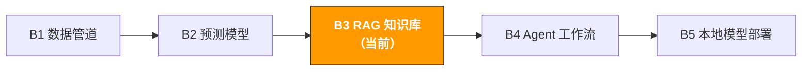

# B3. RAG 知识库系统 | RAG Knowledge Base System

> **路径**: Path B: 技术人 · **模块**: B3
> **最后更新**: 2026-03-12
> **难度**: 中级 → 进阶
> **前提**: B1 数据管道基础（Python、文件处理）、B2 基本 ML 概念
> **预计时间**: 每天 1 小时，2-3 周
---




---

## 本模块章节导航

1. [RAG 方法论](#1-rag-方法论) · 2. [工具全景](#2-工具全景) · 3. [技术栈选择](#3-技术栈选择详解) · 4. [代码实战](#4-代码实战) · 5. [电商 RAG 应用](#5-电商-rag-应用场景) · 6. [常见陷阱](#6-常见陷阱) · 7. [进阶技术](#7-进阶技术) · 8. [学习资源](#8-学习资源) · 9. [ OpenClaw 自动化](#9-用-openclaw-构建-rag-知识库) · 10. [完成标志](#10-完成标志)


## 本模块你将构建

基于内部文档的 AI 问答系统 上传产品手册、政策文档、FAQ、Review 数据，AI 自动检索并回答问题。

完成本模块后，你将能够：
- 理解 RAG（Retrieval-Augmented Generation）的核心原理和架构
- 用 LlamaIndex 10 行代码搭建一个可用的 RAG 系统
- 从产品手册和 Review 数据构建产品 FAQ 知识库
- 合并多个数据源（产品文档 + 政策文件 + Review）构建多文档 RAG
- 用 Chroma 向量数据库持久化存储，避免每次重建索引
- 用 Ollama 在本地运行 LLM，不依赖 OpenAI API
- 评估 RAG 系统的检索准确率和回答质量
- 搭建一个完整的电商产品知识库问答系统

---

## 1. RAG 方法论

> **相关阅读**: [A4 客服与售后](../a-operators/a4-customer-service.md) RAG 系统在客服 FAQ 自动回答中的应用场景详见 A4。 · [F3 知识库与 RAG](../0-foundations/f3-rag-knowledge.md) RAG 基础理论详见 F3

### 1.1 什么是 RAG

RAG（Retrieval-Augmented Generation，检索增强生成）是让 LLM 基于你的私有数据回答问题的技术。

核心思路：

```
用户提问 → 从文档中检索相关段落 → 段落+问题发给 LLM → LLM 基于检索内容回答
```

**为什么不直接用 ChatGPT？**

| 方式 | 优点 | 缺点 |
|------|------|------|
| 直接问 ChatGPT | 零成本，即开即用 | 不知道你的产品细节、内部政策、最新数据 |
| 把文档粘贴到对话框 | 简单 | 受 token 限制（约 128k），文档多了放不下 |
| Fine-tuning 微调 | 模型"记住"你的知识 | 成本高、更新慢、容易遗忘旧知识 |
| **RAG** | **实时检索最新数据，成本低，可解释** | **需要搭建检索系统** |

RAG 的核心优势是**数据新鲜度**和**可解释性**：你可以随时更新文档，RAG 立刻能用最新内容回答；而且每个回答都能追溯到具体的源文档段落。

### 1.2 RAG vs Fine-tuning 的选择

这是最常被问到的问题。简单说：RAG 适合"查资料"，Fine-tuning 适合"改风格"。

| 维度 | RAG | Fine-tuning |
|------|-----|-------------|
| 适合场景 | 基于文档回答问题（FAQ、政策查询） | 改变模型的输出风格或格式 |
| 数据更新 | 实时（更新文档即可） | 需要重新训练（耗时耗钱） |
| 成本 | 低（只需向量数据库 + API 调用） | 高（GPU 训练 + 数据标注） |
| 幻觉控制 | 好（回答基于检索到的文档） | 差（模型可能编造内容） |
| 可解释性 | 强（可以展示引用来源） | 弱（黑盒） |
| 知识容量 | 无限（文档数量不受限） | 有限（受模型容量限制） |
| 技术门槛 | 低（几十行代码） | 高（需要 ML 工程经验） |

**决策框架：**

```
你的需求是什么？
让 AI 回答关于你的文档/数据的问题 → RAG
让 AI 用特定风格/格式输出 → Fine-tuning
两者都需要 → RAG + Fine-tuning（先 RAG，效果不够再加 Fine-tuning）
不确定 → 先试 RAG（成本低、见效快）
```

### 1.3 电商 RAG 的典型场景

| 场景 | 数据源 | 用户问题示例 | 价值 |
|------|--------|-------------|------|
| 产品 FAQ | 产品手册、规格书 | "这个摄像头支持 4K 60fps 吗？" | 客服效率提升 5-10 倍 |
| 政策查询 | Amazon 政策文档、合规指南 | "FBA 退货政策对电子产品有什么特殊要求？" | 减少合规风险 |
| Review 洞察 | 客户评论数据 | "客户对电池续航的主要抱怨是什么？" | 产品改进方向 |
| 供应商知识库 | 供应商手册、沟通记录 | "供应商 A 的最小起订量是多少？" | 采购决策加速 |
| 运营 SOP | 内部操作手册 | "如何处理 A-to-Z Claim？" | 新人培训效率 |
| 竞品分析 | 竞品 Listing、Review | "竞品 X 的主要卖点是什么？" | 差异化策略 |

> **关键洞察**：电商场景的 RAG 价值在于把"散落在各处的知识"变成"随时可查的智能助手"。一个运营团队可能有几十份产品手册、上百页政策文档、几万条 Review 没有人能全部记住，但 RAG 可以。

### 1.4 RAG 架构全景

一个完整的 RAG 系统包含两个阶段：

**阶段 1：索引（Indexing） 离线准备**

```
原始文档 → 文档加载 → 文本分块(Chunking) → 向量化(Embedding) → 存入向量数据库
```

**阶段 2：查询（Querying） 在线服务**

```
用户提问 → 问题向量化 → 向量相似度搜索 → 取回 Top-K 相关段落 → 构造 Prompt → LLM 生成回答
```

**各环节的关键选择：**

| 环节 | 选项 | 推荐（入门） | 推荐（生产） |
|------|------|-------------|-------------|
| 文档加载 | LlamaIndex SimpleDirectoryReader, LangChain Loaders | LlamaIndex | LlamaIndex |
| 文本分块 | 固定大小、按句子、按语义 | 固定大小（512 tokens） | 语义分块 |
| Embedding 模型 | OpenAI text-embedding-3-small, BGE, E5 | OpenAI（最简单） | BGE-large（开源免费） |
| 向量数据库 | Chroma, FAISS, Pinecone, Weaviate | Chroma（最简单） | Pinecone（托管服务） |
| LLM | OpenAI GPT-4o, Claude, Ollama 本地模型 | OpenAI GPT-4o-mini | Ollama + Qwen2.5（本地免费） |

---

## 2. 工具全景

| 工具 | 类型 | 难度 | 最佳场景 | 安装 |
|------|------|------|----------|------|
| [LlamaIndex](https://docs.llamaindex.ai/) | RAG 框架 | 入门 | 快速搭建 RAG，文档问答 | `pip install llama-index` |
| [LangChain](https://python.langchain.com/) | LLM 应用框架 | 中级 | 复杂 LLM 工作流、Agent | `pip install langchain` |
| [Chroma](https://www.trychroma.com/) | 向量数据库 | 入门 | 本地开发、小规模数据 | `pip install chromadb` |
| [Ollama](https://ollama.com/) | 本地 LLM | 入门 | 不想用 OpenAI API、数据隐私 | [ollama.com/download](https://ollama.com/download) |
| [OpenAI API](https://platform.openai.com/) | 云端 LLM | 入门 | 最高质量回答、快速原型 | `pip install openai` |
| [Pinecone](https://www.pinecone.io/) | 托管向量数据库 | 中级 | 生产环境、大规模数据 | `pip install pinecone-client` |
| [FAISS](https://github.com/facebookresearch/faiss) | 向量搜索库 | 中级 | 高性能、大规模向量搜索 | `pip install faiss-cpu` |
| [Sentence-Transformers](https://www.sbert.net/) | Embedding 模型 | 中级 | 开源免费 Embedding | `pip install sentence-transformers` |

**选择建议：**
- 刚入门 → LlamaIndex + OpenAI API（10 行代码出结果）
- 不想花钱 → LlamaIndex + Ollama + Chroma（全部本地免费）
- 生产环境 → LlamaIndex/LangChain + Pinecone + OpenAI（稳定可扩展）
- 数据隐私要求高 → Ollama + Chroma（数据不出本机）

---

## 3. 技术栈选择详解

### 3.1 LlamaIndex vs LangChain

这两个是 RAG 领域最流行的框架，经常被拿来对比：

| 维度 | LlamaIndex | LangChain |
|------|-----------|-----------|
| 定位 | 专注数据索引和检索 | 通用 LLM 应用框架 |
| RAG 体验 | 开箱即用，5 行代码搭建 RAG | 需要更多配置，灵活但复杂 |
| 学习曲线 | 平缓，文档清晰 | 较陡，概念多（Chain、Agent、Tool） |
| 文档加载 | 内置 100+ 数据加载器 | 内置 100+ 数据加载器 |
| 适合场景 | 文档问答、知识库 | 复杂工作流、多步推理、Agent |
| 社区 | 活跃，更新快 | 非常活跃，生态最大 |

**结论**：入门用 LlamaIndex（更简单），需要复杂工作流时再引入 LangChain。本模块以 LlamaIndex 为主。

参考文档：[LlamaIndex 官方文档](https://docs.llamaindex.ai/) | [LangChain 官方文档](https://python.langchain.com/)

### 3.2 Embedding 模型选择

Embedding 模型决定了检索质量。选错模型，检索不准，后面的 LLM 再强也没用。

| 模型 | 提供方 | 维度 | 中文支持 | 成本 | 推荐场景 |
|------|--------|------|----------|------|----------|
| text-embedding-3-small | OpenAI | 1536 | | $0.02/1M tokens | 快速原型，质量好 |
| text-embedding-3-large | OpenAI | 3072 | | $0.13/1M tokens | 追求最高检索精度 |
| BGE-large-zh-v1.5 | BAAI | 1024 | 优秀 | 免费（本地运行） | 中文文档，数据隐私 |
| E5-large-v2 | Microsoft | 1024 | | 免费（本地运行） | 多语言场景 |
| all-MiniLM-L6-v2 | Sentence-Transformers | 384 | 一般 | 免费（本地运行） | 英文文档，资源有限 |

**电商场景推荐**：
- 中英文混合文档 → `text-embedding-3-small`（OpenAI，质量最稳定）
- 纯中文文档 + 数据隐私 → `BGE-large-zh-v1.5`（本地免费，中文效果好）
- 预算有限 → `all-MiniLM-L6-v2`（本地免费，英文够用）

### 3.3 向量数据库选择

| 数据库 | 类型 | 数据规模 | 持久化 | 适合场景 |
|--------|------|----------|--------|----------|
| Chroma | 嵌入式 | <100 万向量 | 本地文件 | 开发测试、小团队 |
| FAISS | 库（非数据库） | <1000 万向量 | 需手动保存 | 高性能搜索、离线场景 |
| Pinecone | 云托管 | 无限 | 云端自动 | 生产环境、免运维 |
| Weaviate | 自托管/云 | 无限 | 自动 | 需要混合搜索（向量+关键词） |
| Qdrant | 自托管/云 | 无限 | 自动 | 高性能、过滤查询 |

**推荐路径**：开发阶段用 Chroma（零配置），生产环境迁移到 Pinecone 或 Qdrant。

---

## 4. 代码实战

### 4.1 最简 RAG：10 行代码用 LlamaIndex 构建问答系统

这是你能写出的最简单的 RAG 系统。把文档放到一个文件夹里，10 行代码就能问答。

```python
# 最简 RAG 10 行代码
# 前提：pip install llama-index openai
# 环境变量：export OPENAI_API_KEY="sk-..."

from llama_index.core import VectorStoreIndex, SimpleDirectoryReader

# 1. 加载文档（支持 .txt, .pdf, .md, .docx, .csv 等）
documents = SimpleDirectoryReader("data/product_docs").load_data()
print(f" 加载了 {len(documents)} 个文档")

# 2. 构建索引（自动分块 + Embedding + 内存向量存储）
index = VectorStoreIndex.from_documents(documents)

# 3. 创建查询引擎
query_engine = index.as_query_engine()

# 4. 提问
response = query_engine.query("这个产品支持 4K 60fps 吗？")
print(response)
```

就这么简单。LlamaIndex 在背后做了所有事情：
1. `SimpleDirectoryReader` 自动识别文件格式并加载
2. `VectorStoreIndex.from_documents` 自动分块（默认 1024 tokens）、调用 OpenAI Embedding API 生成向量、存入内存
3. `as_query_engine()` 创建查询引擎，默认检索 Top-2 相关段落
4. `query()` 把检索到的段落和问题一起发给 GPT，生成回答

> **注意**：这个最简版本使用 OpenAI API，需要设置 `OPENAI_API_KEY` 环境变量。每次运行都会重新构建索引（调用 Embedding API），有 API 成本。后面会介绍如何用 Chroma 持久化存储和用 Ollama 替代 OpenAI。

**查看检索到的源文档：**

```python
# 查看 RAG 检索到了哪些文档段落
response = query_engine.query("退货政策是什么？")

print("回答:", response)
print("\n--- 引用来源 ---")
for node in response.source_nodes:
print(f" 文件: {node.metadata.get('file_name', 'unknown')}")
print(f" 相似度: {node.score:.4f}")
print(f" 内容: {node.text[:200]}...")
print()
```

> **可解释性**：RAG 的一大优势是每个回答都能追溯到源文档。这在电商场景中非常重要 当客服用 AI 回答客户问题时，需要确保回答有据可查。

### 4.2 产品 FAQ 知识库：从产品手册构建问答系统

真实场景：你有一堆产品手册（PDF/Word/Markdown），想让 AI 自动回答产品相关问题。

```python
import os
from pathlib import Path
from llama_index.core import (
VectorStoreIndex,
SimpleDirectoryReader,
Settings,
StorageContext,
load_index_from_storage,
)
from llama_index.core.node_parser import SentenceSplitter

def build_product_faq(
docs_dir: str,
chunk_size: int = 512,
chunk_overlap: int = 50,
persist_dir: str = "storage/product_faq"
) -> VectorStoreIndex:
"""
从产品文档构建 FAQ 知识库。

Args:
docs_dir: 产品文档目录（支持 .txt, .pdf, .md, .docx, .csv）
chunk_size: 分块大小（tokens）
chunk_overlap: 分块重叠大小
persist_dir: 索引持久化目录

Returns:
构建好的向量索引
"""
# 检查是否已有持久化索引
if Path(persist_dir).exists():
print(" 加载已有索引...")
storage_context = StorageContext.from_defaults(persist_dir=persist_dir)
index = load_index_from_storage(storage_context)
print(" 索引加载完成")
return index

# 1. 加载文档
print(f" 从 {docs_dir} 加载文档...")
documents = SimpleDirectoryReader(
docs_dir,
recursive=True,
filename_as_id=True,
).load_data()
print(f" 加载了 {len(documents)} 个文档")

# 2. 配置分块策略
text_splitter = SentenceSplitter(
chunk_size=chunk_size,
chunk_overlap=chunk_overlap,
)
Settings.text_splitter = text_splitter

# 3. 构建索引
print(" 构建向量索引...")
index = VectorStoreIndex.from_documents(documents, show_progress=True)

# 4. 持久化存储（下次不用重建）
index.storage_context.persist(persist_dir=persist_dir)
print(f" 索引已保存到 {persist_dir}")

return index

def query_product_faq(
index: VectorStoreIndex,
question: str,
top_k: int = 3,
response_mode: str = "compact"
) -> dict:
"""
查询产品 FAQ 知识库。

Args:
index: 向量索引
question: 用户问题
top_k: 检索的文档块数量
response_mode: 回答模式
- "compact": 压缩所有检索内容生成简洁回答（推荐）
- "refine": 逐块精炼回答（更准确但更慢）
- "tree_summarize": 树状汇总（适合长回答）
"""
query_engine = index.as_query_engine(
similarity_top_k=top_k,
response_mode=response_mode,
)

response = query_engine.query(question)

sources = []
for node in response.source_nodes:
sources.append({
"file": node.metadata.get("file_name", "unknown"),
"score": round(node.score, 4) if node.score else None,
"text_preview": node.text[:300],
})

return {
"question": question,
"answer": str(response),
"sources": sources,
"num_sources": len(sources),
}

# 使用示例
# index = build_product_faq("data/product_docs", chunk_size=512)
#
# result = query_product_faq(index, "这个摄像头的防水等级是多少？")
# print(f"Q: {result['question']}")
# print(f"A: {result['answer']}")
# print(f"\n引用了 {result['num_sources']} 个文档段落:")
# for s in result['sources']:
# print(f" - {s['file']} (相似度: {s['score']})")
```

> **chunk_size 调参指南**：
> - 产品规格书（短句、结构化）→ 256-512 tokens
> - 产品手册（段落式描述）→ 512-1024 tokens
> - 政策文档（长段落、法律语言）→ 1024-2048 tokens
> - 不确定 → 从 512 开始，根据回答质量调整

### 4.3 多文档 RAG：合并多个数据源

电商场景中，知识散落在多个地方：产品手册、Review 数据、政策文档、运营 SOP。多文档 RAG 把它们统一到一个问答系统中。

```python
from llama_index.core import VectorStoreIndex, SimpleDirectoryReader, Document, Settings
from llama_index.core.node_parser import SentenceSplitter
import pandas as pd

def load_review_data(csv_path: str, text_col: str = "review_text",
max_reviews: int = 1000) -> list:
"""将 Review CSV 数据转换为 LlamaIndex Document 对象。"""
df = pd.read_csv(csv_path)

if len(df) > max_reviews:
df = df.sort_values("rating", ascending=True).head(max_reviews)

documents = []
for _, row in df.iterrows():
text = str(row.get(text_col, ""))
if len(text.strip()) < 10:
continue

metadata = {
"source": "customer_review",
"rating": int(row.get("rating", 0)),
"asin": str(row.get("asin", "")),
"date": str(row.get("date", "")),
}
doc = Document(text=text, metadata=metadata)
documents.append(doc)

print(f" 加载了 {len(documents)} 条 Review")
return documents

def build_multi_source_rag(
product_docs_dir: str = None,
policy_docs_dir: str = None,
review_csv: str = None,
sop_docs_dir: str = None,
chunk_size: int = 512,
) -> VectorStoreIndex:
"""
构建多数据源 RAG 索引。
合并多种文档类型到同一个向量索引中，
每个文档带有 source 元数据，方便过滤和追溯。
"""
all_documents = []

if product_docs_dir:
docs = SimpleDirectoryReader(product_docs_dir).load_data()
for doc in docs:
doc.metadata["source"] = "product_manual"
all_documents.extend(docs)
print(f" 产品文档: {len(docs)} 个")

if policy_docs_dir:
docs = SimpleDirectoryReader(policy_docs_dir).load_data()
for doc in docs:
doc.metadata["source"] = "policy"
all_documents.extend(docs)
print(f" 政策文档: {len(docs)} 个")

if review_csv:
review_docs = load_review_data(review_csv)
all_documents.extend(review_docs)

if sop_docs_dir:
docs = SimpleDirectoryReader(sop_docs_dir).load_data()
for doc in docs:
doc.metadata["source"] = "sop"
all_documents.extend(docs)
print(f" SOP 文档: {len(docs)} 个")

print(f"\n 总计: {len(all_documents)} 个文档")

Settings.text_splitter = SentenceSplitter(chunk_size=chunk_size, chunk_overlap=50)
index = VectorStoreIndex.from_documents(all_documents, show_progress=True)

print(" 多源 RAG 索引构建完成")
return index

def query_with_source_filter(
index: VectorStoreIndex,
question: str,
source_filter: str = None,
top_k: int = 5,
) -> dict:
"""
带数据源过滤的查询。

Args:
source_filter: 数据源过滤
- None: 搜索所有数据源
- "product_manual": 只搜索产品文档
- "policy": 只搜索政策文档
- "customer_review": 只搜索 Review
- "sop": 只搜索 SOP
"""
from llama_index.core.vector_stores import (
MetadataFilter, MetadataFilters, FilterOperator,
)

filters = None
if source_filter:
filters = MetadataFilters(filters=[
MetadataFilter(key="source", operator=FilterOperator.EQ, value=source_filter)
])

query_engine = index.as_query_engine(similarity_top_k=top_k, filters=filters)
response = query_engine.query(question)

sources = []
for node in response.source_nodes:
sources.append({
"source_type": node.metadata.get("source", "unknown"),
"file": node.metadata.get("file_name", ""),
"score": round(node.score, 4) if node.score else None,
})

return {"question": question, "answer": str(response), "sources": sources}

# 使用示例
# index = build_multi_source_rag(
# product_docs_dir="data/product_docs",
# policy_docs_dir="data/policy_docs",
# review_csv="data/reviews.csv",
# )
# result = query_with_source_filter(index, "客户对电池续航有什么反馈？")
# result = query_with_source_filter(index, "FBA 退货政策是什么？", source_filter="policy")
```

> **多源 RAG 的价值**：当客服问"这个产品的退货率高吗？"，系统可以同时从 Review 数据中找到客户抱怨、从政策文档中找到退货规则、从 SOP 中找到处理流程，给出一个综合性的回答。

### 4.4 Chroma 向量数据库：持久化存储与增量更新

前面的例子每次运行都重建索引，浪费时间和 API 费用。用 Chroma 可以把向量持久化到磁盘，支持增量添加新文档。

```python
import chromadb
from llama_index.core import VectorStoreIndex, SimpleDirectoryReader, StorageContext
from llama_index.vector_stores.chroma import ChromaVectorStore

def create_chroma_index(
docs_dir: str,
collection_name: str = "product_knowledge",
persist_dir: str = "chroma_db",
) -> VectorStoreIndex:
"""
用 Chroma 创建持久化向量索引。

Chroma 的优势：
- 数据持久化到磁盘，重启不丢失
- 支持增量添加文档（不用重建整个索引）
- 支持元数据过滤
- 零配置，嵌入式运行
"""
chroma_client = chromadb.PersistentClient(path=persist_dir)
chroma_collection = chroma_client.get_or_create_collection(name=collection_name)

print(f" Collection '{collection_name}': {chroma_collection.count()} 个已有向量")

vector_store = ChromaVectorStore(chroma_collection=chroma_collection)
storage_context = StorageContext.from_defaults(vector_store=vector_store)

documents = SimpleDirectoryReader(docs_dir).load_data()
index = VectorStoreIndex.from_documents(
documents, storage_context=storage_context, show_progress=True
)

print(f" 索引构建完成，共 {chroma_collection.count()} 个向量")
return index

def load_existing_chroma_index(
collection_name: str = "product_knowledge",
persist_dir: str = "chroma_db",
) -> VectorStoreIndex:
"""加载已有的 Chroma 索引（不重建）。"""
chroma_client = chromadb.PersistentClient(path=persist_dir)
chroma_collection = chroma_client.get_collection(name=collection_name)
vector_store = ChromaVectorStore(chroma_collection=chroma_collection)
index = VectorStoreIndex.from_vector_store(vector_store)
print(f" 加载已有索引: {chroma_collection.count()} 个向量")
return index

def add_documents_to_index(index: VectorStoreIndex, new_docs_dir: str) -> int:
"""增量添加新文档到已有索引。不需要重建整个索引。"""
new_documents = SimpleDirectoryReader(new_docs_dir).load_data()
for doc in new_documents:
index.insert(doc)
print(f" 新增 {len(new_documents)} 个文档到索引")
return len(new_documents)

# 使用示例
# index = create_chroma_index("data/product_docs", persist_dir="chroma_db")
# index = load_existing_chroma_index(persist_dir="chroma_db") # 秒级加载
# add_documents_to_index(index, "data/new_docs") # 增量更新
```

> **Chroma vs 内存存储**：100 个文档的索引，内存模式每次启动花 30 秒 + $0.01 API 费用；Chroma 模式加载 <1 秒，零费用。

### 4.5 本地 RAG（Ollama）：不依赖 OpenAI，保护商业数据隐私

电商数据（产品成本、供应商信息、销量数据）属于商业机密。Ollama 让你在本地运行 LLM，数据不出本机。

**Ollama 安装与模型下载：**

```bash
# 1. 安装 Ollama（macOS） 从 https://ollama.com/download 下载

# 2. 下载模型
ollama pull qwen2.5:7b # 推荐：中英文都好，7B 参数
ollama pull llama3.1:8b # Meta 开源，英文优秀
ollama pull nomic-embed-text # Embedding 模型（免费替代 OpenAI）

# 3. 验证
ollama list # 查看已下载的模型
```

**用 Ollama 构建完全本地的 RAG：**

```python
from llama_index.core import VectorStoreIndex, SimpleDirectoryReader, Settings
from llama_index.llms.ollama import Ollama
from llama_index.embeddings.ollama import OllamaEmbedding

def build_local_rag(
docs_dir: str,
llm_model: str = "qwen2.5:7b",
embed_model: str = "nomic-embed-text",
ollama_base_url: str = "http://localhost:11434",
) -> VectorStoreIndex:
"""
构建完全本地的 RAG 系统（不调用任何外部 API）。

前提：
1. 已安装 Ollama
2. 已下载 LLM 模型: ollama pull qwen2.5:7b
3. 已下载 Embedding 模型: ollama pull nomic-embed-text
"""
# 配置本地 LLM
llm = Ollama(
model=llm_model,
base_url=ollama_base_url,
request_timeout=120.0,
temperature=0.1,
)

# 配置本地 Embedding
embed = OllamaEmbedding(
model_name=embed_model,
base_url=ollama_base_url,
)

# 设置全局配置（替代 OpenAI）
Settings.llm = llm
Settings.embed_model = embed

# 加载文档并构建索引
documents = SimpleDirectoryReader(docs_dir).load_data()
print(f" 加载了 {len(documents)} 个文档")

index = VectorStoreIndex.from_documents(documents, show_progress=True)

print(f" 本地 RAG 构建完成（LLM: {llm_model}, Embed: {embed_model}）")
print(" 所有数据在本地处理，未发送到任何外部服务")
return index

# 使用示例
# index = build_local_rag("data/product_docs")
# engine = index.as_query_engine(similarity_top_k=3)
# response = engine.query("这个产品的保修期是多久？")
```

**本地 vs 云端 RAG 对比：**

| 维度 | 本地 RAG (Ollama) | 云端 RAG (OpenAI) |
|------|-------------------|-------------------|
| 数据隐私 | 数据不出本机 | 数据发送到 OpenAI 服务器 |
| 成本 | 免费（电费除外） | 按 token 计费 |
| 回答质量 | 7B 模型约 GPT-3.5 水平 | GPT-4o 水平最高 |
| 速度 | 取决于硬件（M1 Mac 约 30 tokens/s） | 快（云端 GPU） |
| 离线使用 | 无需网络 | 需要网络 |
| 硬件要求 | 7B 模型需 8GB+ RAM | 无要求 |

> **推荐策略**：开发阶段用 OpenAI（回答质量高，调试方便），生产环境根据数据敏感度决定。涉及商业机密用 Ollama 本地部署。

### 4.6 RAG 评估：如何衡量回答质量

RAG 系统上线前必须评估质量。不评估就上线，等于让一个没经过培训的客服直接面对客户。

RAG 评估有三个核心维度：

| 维度 | 含义 | 衡量什么 |
|------|------|----------|
| Faithfulness（忠实度） | 回答是否基于检索到的文档 | LLM 有没有"编造"文档中不存在的内容 |
| Relevancy（相关性） | 回答是否与问题相关 | 回答有没有跑题 |
| Context Recall（上下文召回） | 检索到的文档是否包含正确答案 | 检索环节有没有漏掉关键信息 |

**用 RAGAS 框架评估：**

```python
# pip install ragas

from ragas import evaluate
from ragas.metrics import (
faithfulness, answer_relevancy,
context_precision, context_recall,
)
from datasets import Dataset

def evaluate_rag_quality(
questions: list[str],
answers: list[str],
contexts: list[list[str]],
ground_truths: list[str] = None,
) -> dict:
"""
用 RAGAS 框架评估 RAG 系统质量。

Args:
questions: 测试问题列表
answers: RAG 系统的回答列表
contexts: 每个问题检索到的上下文列表
ground_truths: 标准答案（可选，有的话评估更准确）
"""
data = {
"question": questions,
"answer": answers,
"contexts": contexts,
}

metrics = [faithfulness, answer_relevancy, context_precision]

if ground_truths:
data["ground_truth"] = ground_truths
metrics.append(context_recall)

dataset = Dataset.from_dict(data)
result = evaluate(dataset=dataset, metrics=metrics)

print(" RAG 评估结果:")
print(f" Faithfulness（忠实度）: {result['faithfulness']:.3f}")
print(f" Answer Relevancy（相关性）: {result['answer_relevancy']:.3f}")
print(f" Context Precision（上下文精度）: {result['context_precision']:.3f}")
if ground_truths:
print(f" Context Recall（上下文召回）: {result['context_recall']:.3f}")

return dict(result)

def create_eval_dataset(index, eval_questions: list[dict]) -> tuple:
"""
从 RAG 系统生成评估数据集。

Args:
eval_questions: [{"question": "...", "ground_truth": "..."}, ...]
"""
questions, answers, contexts, ground_truths = [], [], [], []
query_engine = index.as_query_engine(similarity_top_k=3)

for item in eval_questions:
q = item["question"]
response = query_engine.query(q)

questions.append(q)
answers.append(str(response))
contexts.append([node.text for node in response.source_nodes])
if "ground_truth" in item:
ground_truths.append(item["ground_truth"])

return questions, answers, contexts, ground_truths or None

# 使用示例
# eval_questions = [
# {"question": "这个摄像头支持 4K 60fps 吗？", "ground_truth": "是的，支持 4K 60fps 视频录制。"},
# {"question": "电池续航多久？", "ground_truth": "标准模式下约 2 小时。"},
# {"question": "防水等级是多少？", "ground_truth": "IPX8，可在 10 米水深使用。"},
# ]
# questions, answers, contexts, truths = create_eval_dataset(index, eval_questions)
# results = evaluate_rag_quality(questions, answers, contexts, truths)
```

**评估指标参考基准：**

| 指标 | 优秀 | 良好 | 需改进 |
|------|------|------|--------|
| Faithfulness | > 0.90 | 0.75-0.90 | < 0.75 |
| Answer Relevancy | > 0.85 | 0.70-0.85 | < 0.70 |
| Context Precision | > 0.80 | 0.60-0.80 | < 0.60 |
| Context Recall | > 0.85 | 0.70-0.85 | < 0.70 |

**评估结果不好怎么办？**

| 问题 | 可能原因 | 解决方案 |
|------|----------|----------|
| Faithfulness 低 | LLM 在编造内容 | 在 Prompt 中强调"只基于提供的文档回答" |
| Relevancy 低 | 回答跑题 | 检查检索到的文档是否相关，调整 top_k |
| Context Precision 低 | 检索到了不相关的文档 | 调整 chunk_size、换 Embedding 模型 |
| Context Recall 低 | 正确答案没被检索到 | 增大 top_k、检查文档是否被正确分块 |

> **评估的投入产出比**：准备 20-30 个评估问题（含标准答案）大约需要 2 小时。但这 2 小时的投入可以帮你发现 80% 的质量问题，避免上线后被用户投诉"AI 乱说话"。
---

## 5. 电商 RAG 应用场景

### 5.1 客服自动回答系统

最直接的 RAG 应用：用产品手册和 FAQ 文档训练一个客服 AI，自动回答客户常见问题。

```python
from llama_index.core import VectorStoreIndex, SimpleDirectoryReader, Settings
from llama_index.core.prompts import PromptTemplate

# 自定义客服 Prompt 控制回答风格和边界
CUSTOMER_SERVICE_PROMPT = PromptTemplate(
"""你是一个专业的电商客服助手。请基于以下产品文档回答客户问题。

规则：
1. 只基于提供的文档内容回答，不要编造信息
2. 如果文档中没有相关信息，请说"抱歉，我需要为您转接人工客服"
3. 回答要简洁、友好、专业
4. 如果涉及退货/退款，请引导客户联系官方客服

产品文档：
{context_str}

客户问题：{query_str}

回答："""
)

def build_customer_service_bot(docs_dir: str, chunk_size: int = 256) -> VectorStoreIndex:
"""
构建客服问答机器人。

客服场景的特殊配置：
- chunk_size 较小（256）：客服问题通常很具体，小块检索更精确
- top_k 较大（5）：多检索几个段落，减少遗漏
- 自定义 Prompt：控制回答风格和安全边界
"""
from llama_index.core.node_parser import SentenceSplitter

Settings.text_splitter = SentenceSplitter(chunk_size=chunk_size, chunk_overlap=30)
documents = SimpleDirectoryReader(docs_dir, recursive=True).load_data()
index = VectorStoreIndex.from_documents(documents, show_progress=True)

print(f" 客服知识库构建完成: {len(documents)} 个文档")
return index

def answer_customer_question(index: VectorStoreIndex, question: str) -> dict:
"""回答客户问题，带来源追溯。"""
query_engine = index.as_query_engine(
similarity_top_k=5,
text_qa_template=CUSTOMER_SERVICE_PROMPT,
)
response = query_engine.query(question)

return {
"question": question,
"answer": str(response),
"confidence": "high" if response.source_nodes
and response.source_nodes[0].score
and response.source_nodes[0].score > 0.8
else "medium",
"sources": [node.metadata.get("file_name", "") for node in response.source_nodes],
}

# 使用示例
# index = build_customer_service_bot("data/customer_service_docs")
# for q in ["这个摄像头防水吗？", "电池能用多久？", "怎么退货？"]:
# result = answer_customer_question(index, q)
# print(f"Q: {result['question']}")
# print(f"A: {result['answer']} (置信度: {result['confidence']})\n")
```

### 5.2 合规文档查询系统

Amazon 的政策文档又多又长，合规团队经常需要查询特定政策。RAG 可以把几百页的政策文档变成一个即时查询系统。

```python
def build_compliance_rag(policy_docs_dir: str, chunk_size: int = 1024) -> VectorStoreIndex:
"""
构建合规政策查询系统。

政策文档的特殊处理：
- chunk_size 较大（1024）：政策条款通常较长，需要完整上下文
- overlap 大一些（100）：避免条款被截断
"""
from llama_index.core.node_parser import SentenceSplitter

Settings.text_splitter = SentenceSplitter(chunk_size=chunk_size, chunk_overlap=100)

documents = SimpleDirectoryReader(policy_docs_dir, recursive=True).load_data()

for doc in documents:
filename = doc.metadata.get("file_name", "")
if "fba" in filename.lower():
doc.metadata["policy_area"] = "FBA"
elif "advertising" in filename.lower():
doc.metadata["policy_area"] = "Advertising"
elif "brand" in filename.lower():
doc.metadata["policy_area"] = "Brand Registry"
else:
doc.metadata["policy_area"] = "General"

index = VectorStoreIndex.from_documents(documents, show_progress=True)
print(f" 合规知识库构建完成: {len(documents)} 个政策文档")
return index

# 使用示例
# index = build_compliance_rag("data/amazon_policies")
# engine = index.as_query_engine(similarity_top_k=5)
# response = engine.query("FBA 退货政策对电子产品有什么特殊要求？")
```

### 5.3 内部培训知识库

新人入职需要学习大量运营知识。RAG 可以把培训文档、SOP、历史案例变成一个"随时可问的导师"。

```python
def build_training_rag(
sop_dir: str = None, case_study_dir: str = None, faq_dir: str = None,
) -> VectorStoreIndex:
"""
构建内部培训知识库。
数据源：SOP 文档、案例库、FAQ
"""
all_docs = []

for dir_path, doc_type in [(sop_dir, "sop"), (case_study_dir, "case_study"), (faq_dir, "faq")]:
if dir_path:
docs = SimpleDirectoryReader(dir_path).load_data()
for d in docs:
d.metadata["doc_type"] = doc_type
all_docs.extend(docs)

index = VectorStoreIndex.from_documents(all_docs, show_progress=True)
print(f" 培训知识库: {len(all_docs)} 个文档")
return index

# 使用示例
# index = build_training_rag(sop_dir="data/sop", case_study_dir="data/cases", faq_dir="data/faq")
# engine = index.as_query_engine()
# response = engine.query("如何处理 A-to-Z Claim？")
```

> **培训 RAG 的 ROI**：一个新人入职通常需要 2-4 周才能熟悉所有流程。有了培训 RAG，新人可以随时提问，学习效率提升 50% 以上。而且 RAG 的回答是一致的，不会因为"问的人不同"而得到不同答案。

---

## 6. 常见陷阱

### 6.1 检索质量差

这是 RAG 系统最常见的问题。回答不好，80% 的原因是检索不准。

| 症状 | 可能原因 | 解决方案 |
|------|----------|----------|
| 回答完全不相关 | Embedding 模型不适合你的文档语言 | 中文文档换 BGE-large-zh，英文用 OpenAI |
| 回答部分正确但遗漏关键信息 | top_k 太小，没检索到关键段落 | 增大 top_k（从 2 调到 5） |
| 检索到了相关文档但回答不对 | LLM 没有正确理解上下文 | 优化 Prompt，明确要求"只基于文档回答" |
| 简单问题回答正确，复杂问题不行 | 答案跨多个文档块，单块不完整 | 增大 chunk_size 或使用 overlap |

**调试检索质量的方法：**

```python
def debug_retrieval(index, question: str, top_k: int = 5):
"""
调试检索结果 查看 RAG 到底检索到了什么。
当回答质量不好时，先用这个函数检查检索环节。
"""
retriever = index.as_retriever(similarity_top_k=top_k)
nodes = retriever.retrieve(question)

print(f" 问题: {question}")
print(f" 检索到 {len(nodes)} 个文档块:\n")

for i, node in enumerate(nodes):
score = f"{node.score:.4f}" if node.score else "N/A"
file_name = node.metadata.get("file_name", "unknown")
print(f" [{i+1}] 相似度: {score} | 文件: {file_name}")
print(f" 内容: {node.text[:200]}...")
print()
return nodes
```

### 6.2 Chunk 大小不当

| chunk_size | 效果 | 适合场景 |
|-----------|------|----------|
| 128-256 | 检索精确但丢失上下文 | FAQ、产品规格（短句） |
| 512 | 平衡精确度和上下文 | 通用场景（推荐起点） |
| 1024 | 上下文丰富但检索可能不精确 | 政策文档、长段落 |
| 2048+ | 上下文完整但检索噪声大 | 很少使用 |

**经验法则**：从 512 开始，如果回答缺少上下文就调大，如果回答包含太多无关信息就调小。

### 6.3 幻觉问题（Hallucination）

LLM 可能"编造"文档中不存在的信息。这在客服场景中非常危险。

**减少幻觉的方法：**

1. **Prompt 约束**：在 Prompt 中明确要求"只基于提供的文档回答，如果文档中没有相关信息，请说不知道"
2. **降低 temperature**：`temperature=0.1` 让模型更确定性，减少创造性发挥
3. **增加 top_k**：检索更多文档，给 LLM 更多参考信息
4. **使用 Faithfulness 评估**：定期用 RAGAS 检测幻觉率
5. **显示引用来源**：让用户可以验证回答的依据

```python
# 减少幻觉的 Prompt 模板
ANTI_HALLUCINATION_PROMPT = """基于以下文档回答问题。

重要规则：
- 只使用文档中明确提到的信息
- 如果文档中没有相关信息，回答"根据现有文档，我无法找到这个问题的答案"
- 不要推测或补充文档中没有的内容
- 在回答末尾标注信息来源

文档内容：
{context_str}

问题：{query_str}

回答："""
```

### 6.4 上下文窗口限制

即使检索到了很多相关文档，LLM 的上下文窗口也有限制。

| 模型 | 上下文窗口 | 建议 top_k |
|------|-----------|-----------|
| GPT-4o-mini | 128k tokens | 5-10 |
| GPT-4o | 128k tokens | 5-10 |
| Qwen2.5 7B | 32k tokens | 3-5 |
| Llama 3.1 8B | 128k tokens | 5-8 |

**计算公式**：`top_k × chunk_size < 模型上下文窗口的 50%`（留一半给 Prompt 和回答）

> **常见错误**：设置 top_k=20, chunk_size=1024，检索到 20k tokens 的上下文。对于 32k 窗口的本地模型，这已经占了 60% 以上，留给回答的空间不够，导致回答被截断或质量下降。
---

## 7. 进阶技术

### 7.1 Hybrid Search（混合搜索：关键词 + 向量）

纯向量搜索有一个弱点：对精确关键词匹配不够好。比如用户搜索 "ASIN B0XXXXX"，向量搜索可能找不到，因为 ASIN 编号没有语义含义。

Hybrid Search 结合了关键词搜索（BM25）和向量搜索的优势：

```python
from llama_index.core import VectorStoreIndex, SimpleDirectoryReader
from llama_index.retrievers.bm25 import BM25Retriever
from llama_index.core.retrievers import QueryFusionRetriever

def build_hybrid_search(
docs_dir: str,
vector_top_k: int = 3,
bm25_top_k: int = 3,
) -> tuple:
"""
构建混合搜索（向量 + BM25 关键词）。

工作原理：
1. 向量搜索：找语义相似的文档（"摄像头防水" → "相机可以水下使用"）
2. BM25 搜索：找关键词匹配的文档（"B0XXXXX" → 包含该 ASIN 的文档）
3. 融合排序：用 Reciprocal Rank Fusion 合并两个结果列表
"""
documents = SimpleDirectoryReader(docs_dir).load_data()
index = VectorStoreIndex.from_documents(documents, show_progress=True)

vector_retriever = index.as_retriever(similarity_top_k=vector_top_k)

from llama_index.core.node_parser import SentenceSplitter
splitter = SentenceSplitter(chunk_size=512)
nodes = splitter.get_nodes_from_documents(documents)
bm25_retriever = BM25Retriever.from_defaults(nodes=nodes, similarity_top_k=bm25_top_k)

hybrid_retriever = QueryFusionRetriever(
retrievers=[vector_retriever, bm25_retriever],
similarity_top_k=vector_top_k + bm25_top_k,
num_queries=1,
mode="reciprocal_rerank",
)

print(" 混合搜索构建完成（向量 + BM25）")
return hybrid_retriever, index

# 使用示例
# retriever, index = build_hybrid_search("data/product_docs")
# nodes = retriever.retrieve("ASIN B0XXXXX 的规格参数") # BM25 擅长
# nodes = retriever.retrieve("这个产品能在水下使用吗？") # 向量搜索擅长
```

> **什么时候需要 Hybrid Search？** 当你的文档中包含大量专有名词（ASIN、SKU、型号）、数字（价格、尺寸）或代码时，纯向量搜索效果不好，Hybrid Search 可以显著提升检索质量。

### 7.2 Re-ranking（重排序）

检索到的文档按相似度排序，但相似度高不一定最相关。Re-ranking 用一个更精确的模型对检索结果重新排序。

```python
from llama_index.core import VectorStoreIndex
from llama_index.core.postprocessor import SentenceTransformerRerank

def query_with_reranking(
index: VectorStoreIndex,
question: str,
initial_top_k: int = 10,
final_top_k: int = 3,
rerank_model: str = "cross-encoder/ms-marco-MiniLM-L-6-v2",
) -> str:
"""
带 Re-ranking 的查询。

流程：
1. 先用向量搜索检索 initial_top_k 个候选文档（粗筛）
2. 用 Cross-Encoder 模型对候选文档重新打分（精排）
3. 取 final_top_k 个最相关的文档生成回答
"""
reranker = SentenceTransformerRerank(model=rerank_model, top_n=final_top_k)

query_engine = index.as_query_engine(
similarity_top_k=initial_top_k,
node_postprocessors=[reranker],
)

response = query_engine.query(question)
return str(response)
```

### 7.3 Agent + RAG

Agent 可以根据用户问题自动决定：是查产品文档、查政策文档、还是查 Review 数据。比手动指定数据源更智能。

```python
from llama_index.core import VectorStoreIndex, SimpleDirectoryReader
from llama_index.core.tools import QueryEngineTool, ToolMetadata
from llama_index.core.agent import ReActAgent

def build_rag_agent(
product_docs_dir: str,
policy_docs_dir: str,
review_docs_dir: str,
) -> ReActAgent:
"""
构建 RAG Agent 自动选择数据源回答问题。

Agent 会根据问题内容自动判断应该查询哪个知识库：
- 产品相关问题 → 查产品文档
- 政策相关问题 → 查政策文档
- 客户反馈问题 → 查 Review 数据
"""
product_index = VectorStoreIndex.from_documents(
SimpleDirectoryReader(product_docs_dir).load_data()
)
policy_index = VectorStoreIndex.from_documents(
SimpleDirectoryReader(policy_docs_dir).load_data()
)
review_index = VectorStoreIndex.from_documents(
SimpleDirectoryReader(review_docs_dir).load_data()
)

tools = [
QueryEngineTool(
query_engine=product_index.as_query_engine(),
metadata=ToolMetadata(
name="product_knowledge",
description="查询产品规格、功能、使用方法等产品相关信息。",
),
),
QueryEngineTool(
query_engine=policy_index.as_query_engine(),
metadata=ToolMetadata(
name="policy_knowledge",
description="查询 Amazon 政策、合规要求、退货规则等。",
),
),
QueryEngineTool(
query_engine=review_index.as_query_engine(),
metadata=ToolMetadata(
name="review_insights",
description="查询客户评论、反馈、投诉等信息。",
),
),
]

agent = ReActAgent.from_tools(tools, verbose=True)
print(" RAG Agent 构建完成（3 个知识库工具）")
return agent

# 使用示例
# agent = build_rag_agent("data/product_docs", "data/policy_docs", "data/review_docs")
# response = agent.chat("这个摄像头支持 4K 60fps 吗？") # → 查产品知识库
# response = agent.chat("FBA 退货政策是什么？") # → 查政策知识库
# response = agent.chat("客户对电池续航有什么反馈？产品手册标注的续航是多久？") # → 查多个知识库
```

> **Agent + RAG 的价值**：普通 RAG 需要用户知道"我应该查哪个知识库"。Agent + RAG 让 AI 自动判断，用户只需要提问，系统自动路由到正确的数据源。这是从"工具"到"助手"的质变。
>
> 更多 Agent 内容请参考 [B4 Agent 工作流](b4-agent-workflow.md)。

---

## 8. 学习资源

### 8.1 免费课程与文档

| 资源 | 平台 | 时长 | 适合谁 | 链接 |
|------|------|------|--------|------|
| LlamaIndex 官方文档 | LlamaIndex | 持续更新 | RAG 入门到进阶 | [docs.llamaindex.ai](https://docs.llamaindex.ai/) |
| Building Agentic RAG | DeepLearning.AI | 1h | RAG + Agent 结合 | [deeplearning.ai](https://www.deeplearning.ai/short-courses/building-agentic-rag-with-llamaindex/) |
| LangChain 官方文档 | LangChain | 持续更新 | LLM 应用开发 | [python.langchain.com](https://python.langchain.com/) |
| HuggingFace NLP Course | HuggingFace | 10h+ | NLP 和 Embedding 基础 | [huggingface.co/learn/nlp-course](https://huggingface.co/learn/nlp-course) |
| Chroma 官方文档 | Chroma | 2h | 向量数据库入门 | [trychroma.com](https://www.trychroma.com/) |
| Ollama 官方文档 | Ollama | 1h | 本地 LLM 部署 | [ollama.com](https://ollama.com/) |

### 8.2 推荐 GitHub 仓库

| 仓库 | Star | 用途 |
|------|------|------|
| [LlamaIndex](https://github.com/run-llama/llama_index) | 37k+ | RAG 框架核心库 |
| [LangChain](https://github.com/langchain-ai/langchain) | 98k+ | LLM 应用框架 |
| [Chroma](https://github.com/chroma-core/chroma) | 16k+ | 开源向量数据库 |
| [FAISS](https://github.com/facebookresearch/faiss) | 32k+ | 高性能向量搜索 |
| [Ollama](https://github.com/ollama/ollama) | 105k+ | 本地 LLM 运行 |
| [RAGAS](https://github.com/explodinggradients/ragas) | 7k+ | RAG 评估框架 |

Content rephrased for compliance with licensing restrictions. Sources cited inline.

---

## 9. 用 OpenClaw 构建 RAG 知识库

### 9.1 场景：AI Agent 自动维护产品知识库并回答客服问题

```
你对 OpenClaw 说：
"当有新产品文档上传时，自动索引到知识库，
当客服在 Telegram 提问时，自动从知识库检索并回答"

OpenClaw 自动执行：
1. [触发] 新产品文档上传时
2. [filesystem MCP] 读取新文档
3. [LLM] 自动分块和生成 Embedding
4. [Skill: memory] 存入知识图谱
5. [Channel: Telegram] 客服通过 Telegram 提问，Agent 从知识库检索回答
```

### 9.2 需要的 Skills 和 MCP Server

| 组件 | 用途 | 链接 |
|------|------|------|
| **filesystem MCP** | 读取新产品文档 | [MCP Filesystem](https://github.com/modelcontextprotocol/servers/tree/main/src/filesystem) |
| **memory** Skill | 存入知识图谱 | [OpenClaw Docs](https://docs.openclaw.com/) |
| **telegram/slack** Skill | 接收提问并回答 | [ClawHub](https://clawhub.ai/) |
| **web-search** Skill | 补充外部知识 | [ClawHub](https://clawhub.ai/) |

### 9.3 相关资源

| 资源 | 说明 | 链接 |
|------|------|------|
| OpenClaw 官方文档 | 安装和配置指南 | [docs.openclaw.com](https://docs.openclaw.com/) |
| ClawHub Skills 市场 | 搜索和安装 Agent Skills | [clawhub.ai](https://clawhub.ai/) |
| OpenClaw MCP 集成 | 连接 MCP Server | [Build Skill with MCP](https://rebeccamdeprey.com/blog/build-openclaw-skill-with-mcp) |
| F4 自动化与 Agent | Agent 基础模块 | [F4 模块](../0-foundations/f4-agent-automation.md) |

Content rephrased for compliance with licensing restrictions. Sources cited inline.

---

## 10. 完成标志

- [ ] 用 LlamaIndex 10 行代码搭建一个最简 RAG，能回答产品文档中的问题
- [ ] 从产品手册/FAQ 文档构建产品知识库，支持至少 3 种文件格式（.txt, .md, .pdf）
- [ ] 构建多文档 RAG，合并至少 2 个数据源（如产品手册 + Review 数据），支持按数据源过滤查询
- [ ] 用 Chroma 持久化存储向量索引，验证重启后可以秒级加载（不重新调用 Embedding API）
- [ ] 用 Ollama 搭建完全本地的 RAG 系统，验证不依赖任何外部 API 即可问答
- [ ] 用 RAGAS 评估 RAG 系统质量，Faithfulness > 0.75 且 Answer Relevancy > 0.70

完成以上所有项目后，你已经掌握了 RAG 知识库系统的核心技能。接下来进入 [B4 Agent 工作流](b4-agent-workflow.md)，学习如何构建自主决策的 AI Agent。
---

## 附录

### 附录 A：RAG 架构图

```

RAG 系统架构


产品手册 政策文档 Review 数据
(.pdf/.md) (.pdf/.docx) (.csv)


文档加载 (SimpleDirectoryReader)


文本分块 (SentenceSplitter)
chunk_size=512, overlap=50


向量化 (Embedding Model)
OpenAI / BGE / Ollama


向量数据库 (Chroma / FAISS)
持久化存储，支持增量更新


索引阶段（离线） 查询阶段（在线）


用户提问


相似度搜索 (Top-K) + Re-ranking


Prompt 构造 + LLM 生成回答


回答 + 引用来源


```

### 附录 B：代码速查表

```python
# === LlamaIndex 基础 RAG ===
from llama_index.core import VectorStoreIndex, SimpleDirectoryReader

documents = SimpleDirectoryReader("docs/").load_data() # 加载文档
index = VectorStoreIndex.from_documents(documents) # 构建索引
engine = index.as_query_engine() # 创建查询引擎
response = engine.query("你的问题") # 提问

# === 查看检索来源 ===
for node in response.source_nodes:
print(node.metadata["file_name"], node.score, node.text[:100])

# === 自定义分块 ===
from llama_index.core.node_parser import SentenceSplitter
from llama_index.core import Settings
Settings.text_splitter = SentenceSplitter(chunk_size=512, chunk_overlap=50)

# === Chroma 持久化 ===
import chromadb
from llama_index.vector_stores.chroma import ChromaVectorStore
from llama_index.core import StorageContext

client = chromadb.PersistentClient(path="chroma_db")
collection = client.get_or_create_collection("my_collection")
vector_store = ChromaVectorStore(chroma_collection=collection)
storage_ctx = StorageContext.from_defaults(vector_store=vector_store)
index = VectorStoreIndex.from_documents(docs, storage_context=storage_ctx)

# 加载已有索引
index = VectorStoreIndex.from_vector_store(vector_store)

# === Ollama 本地 RAG ===
from llama_index.llms.ollama import Ollama
from llama_index.embeddings.ollama import OllamaEmbedding
Settings.llm = Ollama(model="qwen2.5:7b", request_timeout=120)
Settings.embed_model = OllamaEmbedding(model_name="nomic-embed-text")

# === 元数据过滤 ===
from llama_index.core.vector_stores import MetadataFilter, MetadataFilters, FilterOperator
filters = MetadataFilters(filters=[
MetadataFilter(key="source", operator=FilterOperator.EQ, value="policy")
])
engine = index.as_query_engine(filters=filters)

# === Re-ranking ===
from llama_index.core.postprocessor import SentenceTransformerRerank
reranker = SentenceTransformerRerank(model="cross-encoder/ms-marco-MiniLM-L-6-v2", top_n=3)
engine = index.as_query_engine(similarity_top_k=10, node_postprocessors=[reranker])

# === RAGAS 评估 ===
from ragas import evaluate
from ragas.metrics import faithfulness, answer_relevancy
from datasets import Dataset
dataset = Dataset.from_dict({
"question": questions, "answer": answers,
"contexts": contexts, "ground_truth": truths,
})
result = evaluate(dataset=dataset, metrics=[faithfulness, answer_relevancy])
```

### 附录 C：依赖安装

```bash
# 基础 RAG（LlamaIndex + OpenAI）
pip install llama-index openai

# Chroma 向量数据库
pip install llama-index-vector-stores-chroma chromadb

# Ollama 本地 LLM
pip install llama-index-llms-ollama llama-index-embeddings-ollama

# BM25 混合搜索
pip install llama-index-retrievers-bm25

# Re-ranking
pip install sentence-transformers

# RAG 评估
pip install ragas datasets

# 全部安装
pip install llama-index openai \
llama-index-vector-stores-chroma chromadb \
llama-index-llms-ollama llama-index-embeddings-ollama \
llama-index-retrievers-bm25 \
sentence-transformers \
ragas datasets pandas
```

> **安装提示**：LlamaIndex v0.10+ 采用模块化架构，核心包 `llama-index` 只包含基础功能，向量数据库、LLM 提供商等需要单独安装对应的集成包（如 `llama-index-vector-stores-chroma`）。
---
### 附录 D：常见问题 FAQ

**Q: RAG 和 Fine-tuning 可以一起用吗？**
A: 可以。先用 RAG 提供知识检索，再用 Fine-tuned 模型生成更符合你风格的回答。但大多数场景下，RAG 单独就够了。

**Q: 文档更新了怎么办？**
A: 用 Chroma 的增量更新功能（`index.insert(new_doc)`），不需要重建整个索引。如果文档被修改（而非新增），建议删除旧向量后重新插入。

**Q: 多语言文档怎么处理？**
A: 用支持多语言的 Embedding 模型（如 OpenAI `text-embedding-3-small` 或 `paraphrase-multilingual-MiniLM-L12-v2`）。中英文混合文档可以放在同一个索引中。

**Q: RAG 系统的响应速度怎么优化？**
A: 三个方向：(1) 用 Chroma 持久化避免重建索引；(2) 减小 top_k 减少 LLM 输入量；(3) 用更快的 LLM（GPT-4o-mini 比 GPT-4o 快 3 倍）。

**Q: 数据量很大（10 万+ 文档）怎么办？**
A: 本地 Chroma 可能不够用，考虑迁移到 Pinecone（云托管）或 Qdrant（自托管）。同时优化 chunk_size 和 Embedding 模型选择。

(b2-prediction-models.md) | [Path 总览](README.md) | [B4 Agent >](b4-agent-workflow.md)
