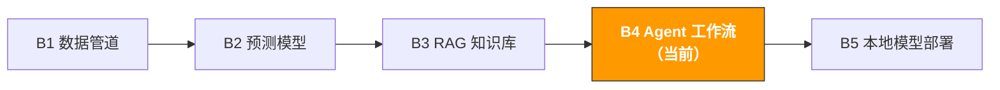

# B4. AI Agent 与工作流自动化 | AI Agent & Workflow Automation

> **路径**: Path B: 技术人 · **模块**: B4
> **最后更新**: 2026-03-12
> **难度**: 高级
> **前提**: B1 数据管道基础（Python、文件处理）、B3 RAG 基本概念
> **预计时间**: 每天 1 小时，2-3 周
---




---

## 本模块章节导航

1. [Agent 方法论](#1-agent-方法论) · 2. [工具全景](#2-工具全景) · 3. [代码实战](#3-代码实战) · 4. [电商 Agent 应用](#4-电商-agent-应用场景) · 5. [常见陷阱](#5-常见陷阱) · 6. [进阶技术](#6-进阶技术) · 7. [学习资源](#7-学习资源)


## 本模块你将构建

AI Agent 系统 自动执行多步骤运营任务（如每日数据检查 → 异常分析 → 报告生成 → 告警通知）。

完成本模块后，你将能够：
- 理解 Agent 的核心概念：ReAct 模式、Tool Use、状态管理
- 区分 Agent、Chain、RAG 三种 LLM 应用模式，知道何时用哪种
- 用 LangGraph 构建一个能调用工具的 Agent
- 构建运营日报自动生成 Agent（采集数据 → 分析 → 生成报告）
- 构建库存预警 Agent（监控库存 → 预测需求 → 发送补货提醒）
- 构建 Review 监控 Agent（监控新 Review → 情感分析 → 差评预警）
- 用 CrewAI 实现多 Agent 协作（数据分析师 + 报告撰写者 + 审核者）
- 避免 Agent 开发中的常见陷阱：循环、成本失控、幻觉传播

---

## 1. Agent 方法论

> **相关阅读**: [A3 广告优化](../a-operators/a3-advertising.md) 广告监控自动化的业务应用场景详见 A3。 · [F4 自动化与 Agent](../0-foundations/f4-agent-automation.md) Agent 基础理论详见 F4
>
> **工具集**: [ Awesome MCP & Agent 工具集](../../docs/awesome-mcp-agents.md) 电商 MCP Server、Agent 框架、外部资源的完整列表

### 1.1 什么是 AI Agent

AI Agent 是一个能自主决策并执行多步骤任务的 LLM 应用。与普通的 LLM 调用不同，Agent 可以：

1. **观察环境**：读取数据、调用 API、查看文件
2. **思考推理**：分析当前状态，决定下一步做什么
3. **执行动作**：调用工具完成具体任务
4. **循环迭代**：根据执行结果决定是否继续

核心思路：

```
用户指令 → Agent 思考 → 选择工具 → 执行工具 → 观察结果 → 继续思考或返回结果
```

**一个直观的例子**：你对 Agent 说"帮我检查今天的销售数据，如果有异常就发告警"。Agent 会：
1. 调用数据 API 获取今日销售数据
2. 分析数据，发现某个 SKU 销量下降 40%
3. 调用分析工具，判断是否为异常
4. 生成告警报告
5. 调用邮件工具发送通知

整个过程中，Agent 自主决定调用哪些工具、按什么顺序执行，不需要你写 if-else 逻辑。

### 1.2 Agent vs Chain vs RAG：三种模式的区别

这是最常被问到的问题。简单说：RAG 是"查资料"，Chain 是"按流程走"，Agent 是"自己想办法"。

| 维度 | RAG | Chain | Agent |
|------|-----|-------|-------|
| 核心能力 | 检索文档并回答问题 | 按预定义步骤执行 | 自主决策，动态选择工具 |
| 决策方式 | 无决策（检索 → 生成） | 固定流程（步骤 1 → 2 → 3） | 动态决策（根据结果决定下一步） |
| 适合场景 | 知识问答、文档查询 | 固定流程的任务（翻译 → 校对 → 格式化） | 多步骤、需要判断的复杂任务 |
| 工具调用 | 无（只用检索 + LLM） | 有限（预定义的工具链） | 灵活（Agent 自己选择工具） |
| 复杂度 | 低 | 中 | 高 |
| 可控性 | 高（行为可预测） | 高（流程固定） | 中（Agent 可能做出意外决策） |
| 成本 | 低（1-2 次 LLM 调用） | 中（N 次 LLM 调用，N=步骤数） | 高（不确定次数的 LLM 调用） |

**决策框架：**

```
你的任务是什么？
基于文档回答问题 → RAG（见 B3 模块）
固定步骤的流程自动化 → Chain
例：翻译 Listing → 校对 → 格式化 → 输出
需要根据中间结果做判断 → Agent
例：检查数据 → 发现异常 → 决定是否告警 → 生成报告
不确定 → 先试 Chain（更可控），不够再升级到 Agent
```

> **关键洞察**：不要为了用 Agent 而用 Agent。如果你的任务流程是固定的（每次都是 A → B → C），用 Chain 就够了，更简单、更便宜、更可控。Agent 的价值在于处理"不确定性"你不知道中间会遇到什么情况，需要 AI 自己判断。

### 1.3 ReAct 模式：Agent 的核心思维框架

ReAct（Reasoning + Acting）是目前最主流的 Agent 设计模式。核心思想：让 LLM 交替进行"思考"和"行动"。

```
循环开始：
1. Thought（思考）：分析当前状态，决定下一步
2. Action（行动）：调用一个工具
3. Observation（观察）：查看工具返回的结果
4. 回到步骤 1，直到任务完成
```

**ReAct 的实际执行过程示例：**

```
用户：帮我检查 ASIN B0XXXXX 的库存状态，如果低于安全库存就生成补货建议。

Thought: 我需要先查询这个 ASIN 的当前库存数据。
Action: call_tool("get_inventory", {"asin": "B0XXXXX"})
Observation: {"asin": "B0XXXXX", "current_stock": 45, "safety_stock": 100, "daily_sales": 15}

Thought: 当前库存 45，安全库存 100，日均销量 15。库存低于安全线，
而且按当前销量只够卖 3 天。我需要生成补货建议。
Action: call_tool("calculate_reorder", {"asin": "B0XXXXX", "current": 45, "daily_sales": 15})
Observation: {"suggested_quantity": 500, "lead_time_days": 14, "urgency": "high"}

Thought: 补货建议已生成，建议补货 500 件，交期 14 天，紧急程度高。
任务完成，我来汇总结果。
Final Answer: ASIN B0XXXXX 库存预警：当前库存 45 件，低于安全库存 100 件，
按日均 15 件仅够 3 天。建议紧急补货 500 件，预计交期 14 天。
```

### 1.4 Tool Use：Agent 的"手"

Agent 的核心能力来自工具（Tools）。没有工具的 Agent 只是一个聊天机器人。

**工具的本质**：一个 Python 函数 + 一段描述（告诉 LLM 这个工具能做什么、需要什么参数）。

```python
# 工具定义示例
def get_inventory(asin: str) -> dict:
"""查询指定 ASIN 的库存状态。

Args:
asin: Amazon 产品标识符（如 B0XXXXX）

Returns:
包含 current_stock, safety_stock, daily_sales 的字典
"""
# 实际实现：调用数据库或 API
pass
```

LLM 通过阅读函数的名称、docstring 和参数类型来决定何时调用、如何调用这个工具。所以**工具的描述质量直接决定 Agent 的表现**。

**电商场景常用工具类型：**

| 工具类型 | 示例 | 用途 |
|----------|------|------|
| 数据查询 | `get_sales_data`, `get_inventory` | 从数据库/API 获取运营数据 |
| 数据分析 | `analyze_trend`, `detect_anomaly` | 对数据进行统计分析 |
| 文件操作 | `read_csv`, `write_report` | 读写文件 |
| 通知发送 | `send_email`, `send_slack` | 发送告警和报告 |
| 外部 API | `search_amazon`, `get_reviews` | 调用外部服务 |
| 计算工具 | `calculate_roi`, `forecast_demand` | 执行业务计算 |

### 1.5 何时用 Agent vs 何时用简单脚本

Agent 不是万能的。很多场景用简单的 Python 脚本就能解决，不需要 Agent。

| 场景 | 推荐方案 | 理由 |
|------|----------|------|
| 每天固定时间跑报告 | Python 脚本 + cron | 流程固定，不需要 AI 判断 |
| 数据清洗和格式转换 | Python 脚本 | 规则明确，pandas 就够了 |
| 根据数据异常决定是否告警 | Agent | 需要 AI 判断"什么算异常" |
| 分析 Review 并生成改进建议 | Agent | 需要 AI 理解自然语言 |
| 多步骤任务，中间需要人工确认 | Agent + Human-in-the-loop | 需要动态决策 + 人工审核 |
| 批量翻译 Listing | Chain（固定流程） | 步骤固定：翻译 → 校对 → 格式化 |
| 监控竞品价格变化并调整策略 | Agent | 需要分析变化并做出策略判断 |

**经验法则**：如果你能用 if-else 写清楚所有逻辑分支，就用脚本。如果逻辑分支太多或需要"理解"自然语言，就用 Agent。

---

## 2. 工具全景

| 工具 | 类型 | 难度 | 最佳场景 | 安装 |
|------|------|------|----------|------|
| [LangGraph](https://langchain-ai.github.io/langgraph/) | Agent 工作流编排 | 中级 | 构建有状态的 Agent 工作流 | `pip install langgraph` |
| [CrewAI](https://docs.crewai.com/) | 多 Agent 协作 | 中级 | 多角色协作任务 | `pip install crewai` |
| [n8n](https://n8n.io/) | 可视化工作流 | 入门 | 无代码/低代码自动化 | Docker 部署 |
| [Streamlit](https://streamlit.io/) | Web 界面 | 入门 | 快速搭建 Agent 交互界面 | `pip install streamlit` |
| [LangChain](https://python.langchain.com/) | LLM 应用框架 | 中级 | Agent 工具链、Prompt 管理 | `pip install langchain` |
| [OpenAI API](https://platform.openai.com/) | 云端 LLM | 入门 | 最高质量推理 | `pip install openai` |
| [Ollama](https://ollama.com/) | 本地 LLM | 入门 | 数据隐私、离线运行 | [ollama.com/download](https://ollama.com/download) |

**选择建议：**
- 单 Agent + 工具调用 → LangGraph（本模块主线）
- 多 Agent 协作 → CrewAI（本模块进阶）
- 不想写代码 → n8n（可视化拖拽）
- 给 Agent 加 Web 界面 → Streamlit

### 2.1 LangGraph vs CrewAI 的选择

| 维度 | LangGraph | CrewAI |
|------|-----------|--------|
| 定位 | 底层 Agent 工作流编排 | 高层多 Agent 协作框架 |
| 灵活性 | 极高（图结构，完全自定义） | 中等（预定义角色和任务模式） |
| 学习曲线 | 较陡（需要理解图、状态、边） | 平缓（定义角色和任务即可） |
| 适合场景 | 复杂工作流、需要精细控制 | 多角色协作、快速原型 |
| 状态管理 | 内置（TypedDict 状态） | 自动管理 |
| Human-in-the-loop | 原生支持 | 支持 |
| 社区 | LangChain 生态，非常活跃 | 快速增长，文档友好 |

**结论**：入门用 CrewAI（更简单），需要精细控制工作流时用 LangGraph。本模块两者都会覆盖。

参考文档：[LangGraph 官方文档](https://langchain-ai.github.io/langgraph/) | [CrewAI 官方文档](https://docs.crewai.com/)

### 2.2 n8n：无代码工作流自动化

[n8n](https://n8n.io/) 是一个开源的可视化工作流自动化平台。如果你不想写代码，或者想快速搭建一个自动化流程，n8n 是很好的选择。

**n8n 的优势：**
- 拖拽式界面，无需编程
- 400+ 内置集成（Gmail、Slack、Google Sheets、HTTP 等）
- 支持 AI 节点（OpenAI、Anthropic）
- 自托管，数据不出你的服务器
- 社区模板丰富

**电商自动化示例（n8n 工作流）：**

```
定时触发（每天 9:00）
→ HTTP 请求：获取销售数据 API
→ IF 节点：销量下降 > 20%？
→ Yes → OpenAI 节点：分析原因
→ Slack 节点：发送告警
→ No → Google Sheets：记录日常数据
```

> **n8n vs 代码 Agent**：n8n 适合流程固定的自动化（类似 Chain），代码 Agent 适合需要动态决策的场景。两者可以结合使用n8n 做定时触发和通知，Agent 做智能分析。

---

## 3. 代码实战

### 3.1 最简 Agent：用 LangGraph 构建一个能调用工具的 Agent

这是你能写出的最简单的 Agent。定义一个工具，让 LLM 自己决定何时调用。

```python
# 最简 Agent LangGraph + OpenAI
# 前提：pip install langgraph langchain-openai
# 环境变量：export OPENAI_API_KEY="sk-..."

from langchain_openai import ChatOpenAI
from langchain_core.tools import tool
from langgraph.prebuilt import create_react_agent

# 1. 定义工具
@tool
def get_sales_data(date: str) -> dict:
"""查询指定日期的销售数据汇总。

Args:
date: 日期，格式 YYYY-MM-DD

Returns:
包含 total_sales, total_orders, top_asin 的字典
"""
# 模拟数据（实际场景替换为数据库查询或 API 调用）
return {
"date": date,
"total_sales": 15230.50,
"total_orders": 342,
"top_asin": "B0XXXXX",
"top_asin_sales": 3200.00,
"yoy_change": -0.12,
}

@tool
def detect_anomaly(metric: str, value: float, threshold: float) -> dict:
"""检测指标是否异常。

Args:
metric: 指标名称
value: 当前值
threshold: 异常阈值（变化百分比，如 -0.2 表示下降 20%）
"""
is_anomaly = value < threshold
return {
"metric": metric,
"value": value,
"threshold": threshold,
"is_anomaly": is_anomaly,
"severity": "high" if value < threshold * 1.5 else "medium",
}

# 2. 创建 Agent
llm = ChatOpenAI(model="gpt-4o-mini", temperature=0)
tools = [get_sales_data, detect_anomaly]
agent = create_react_agent(llm, tools)

# 3. 运行 Agent
result = agent.invoke({
"messages": [("user", "查一下 2025-03-10 的销售数据，如果同比下降超过 10% 就告诉我")]
})

# 4. 输出结果
for msg in result["messages"]:
if hasattr(msg, "content") and msg.content:
print(f"[{msg.type}] {msg.content}")
```

**Agent 的执行过程：**
1. LLM 读取用户指令，决定先调用 `get_sales_data`
2. 获取数据后，发现 `yoy_change = -0.12`（下降 12%）
3. LLM 判断 12% > 10%，调用 `detect_anomaly` 确认异常
4. 汇总结果，返回告警信息

> **注意**：`create_react_agent` 是 LangGraph 提供的预构建 ReAct Agent，适合快速原型。生产环境建议用自定义 Graph 获得更多控制权（见 3.2 节）。

### 3.2 运营日报 Agent：自动采集数据 → 分析 → 生成报告

真实场景：每天早上自动生成运营日报，包含销售概览、异常检测、趋势分析。

```python
# 运营日报 Agent 自定义 LangGraph 工作流
# pip install langgraph langchain-openai

import json
from datetime import datetime
from typing import TypedDict, Annotated
from langchain_openai import ChatOpenAI
from langchain_core.tools import tool
from langchain_core.messages import HumanMessage, SystemMessage
from langgraph.graph import StateGraph, END
from langgraph.graph.message import add_messages

# --- 工具定义 ---
@tool
def fetch_daily_sales(date: str) -> str:
"""获取指定日期的销售数据汇总。"""
return json.dumps({
"date": date,
"summary": {"total_revenue": 45230.50, "total_orders": 1024,
"total_units": 1580, "avg_order_value": 44.17},
"top_products": [
{"asin": "B0AAAA", "name": "运动相机 X1", "units": 320, "revenue": 12800},
{"asin": "B0BBBB", "name": "充电器 Pro", "units": 280, "revenue": 5600},
],
"yoy_comparison": {"revenue_change": -0.08, "orders_change": -0.05},
}, ensure_ascii=False)

@tool
def fetch_inventory_status() -> str:
"""获取当前库存状态，标记低库存 ASIN。"""
return json.dumps({
"low_stock_items": [
{"asin": "B0AAAA", "current": 120, "safety": 200, "days_left": 3},
],
"total_skus": 45, "healthy_skus": 44,
}, ensure_ascii=False)

@tool
def fetch_review_alerts() -> str:
"""获取最近 24 小时的差评预警。"""
return json.dumps({
"new_negative_reviews": [
{"asin": "B0BBBB", "rating": 1, "title": "充电速度太慢",
"text": "买了两周就坏了，充电速度比宣传的慢很多"},
],
"avg_rating_change": -0.1,
}, ensure_ascii=False)

@tool
def generate_report(report_content: str) -> str:
"""将分析结果格式化为 Markdown 日报。"""
today = datetime.now().strftime("%Y-%m-%d")
report = f"# 运营日报 {today}\n\n{report_content}\n\n---\n*AI Agent 自动生成*"
return f"报告已生成，共 {len(report)} 字符"

# --- Agent 状态 ---
class DailyReportState(TypedDict):
messages: Annotated[list, add_messages]
sales_data: str
inventory_data: str
review_data: str
report: str

llm = ChatOpenAI(model="gpt-4o-mini", temperature=0)

SYSTEM_PROMPT = """你是电商运营日报 Agent。收集数据后生成日报，包含：
- 销售概览（收入、订单、同比变化）
- 异常告警（库存不足、销量异常下降）
- Review 预警（新增差评及分析）
- 行动建议（2-3 条具体可执行的建议）
用中文输出，数据准确，建议具体。"""

def collect_data(state: DailyReportState) -> dict:
"""节点 1：收集所有数据源。"""
today = datetime.now().strftime("%Y-%m-%d")
return {
"sales_data": fetch_daily_sales.invoke({"date": today}),
"inventory_data": fetch_inventory_status.invoke({}),
"review_data": fetch_review_alerts.invoke({}),
}

def analyze_and_report(state: DailyReportState) -> dict:
"""节点 2：AI 分析数据并生成日报。"""
messages = [
SystemMessage(content=SYSTEM_PROMPT),
HumanMessage(content=f"销售：{state['sales_data']}\n"
f"库存：{state['inventory_data']}\n"
f"Review：{state['review_data']}\n\n请生成运营日报。"),
]
response = llm.invoke(messages)
generate_report.invoke({"report_content": response.content})
return {"report": response.content, "messages": [response]}

# --- 构建工作流图 ---
workflow = StateGraph(DailyReportState)
workflow.add_node("collect_data", collect_data)
workflow.add_node("analyze_and_report", analyze_and_report)
workflow.set_entry_point("collect_data")
workflow.add_edge("collect_data", "analyze_and_report")
workflow.add_edge("analyze_and_report", END)
app = workflow.compile()

# result = app.invoke({"messages": []})
# print(result["report"])
```

**工作流图结构：**

```
[collect_data] → [analyze_and_report] → END

fetch_sales LLM 分析
fetch_inventory generate_report
fetch_reviews
```

> **为什么用自定义 Graph 而不是 create_react_agent？** `create_react_agent` 让 LLM 自己决定调用顺序，适合探索性任务。但日报生成的流程是确定的（先收集数据，再分析），用自定义 Graph 更可控、更高效（减少不必要的 LLM 调用）。

### 3.3 库存预警 Agent：监控库存 → 预测需求 → 发送补货提醒

真实场景：每天检查所有 SKU 的库存状态，对低库存商品预测未来需求，生成补货建议。

```python
# 库存预警 Agent LangGraph 条件分支工作流
# pip install langgraph langchain-openai

import json
from typing import TypedDict, Annotated, Literal
from langchain_openai import ChatOpenAI
from langchain_core.tools import tool
from langchain_core.messages import HumanMessage, SystemMessage
from langgraph.graph import StateGraph, END
from langgraph.graph.message import add_messages

@tool
def check_all_inventory() -> str:
"""检查所有 SKU 的库存状态，返回低库存列表。"""
return json.dumps({
"total_skus": 45,
"low_stock": [
{"asin": "B0AAAA", "name": "运动相机 X1", "current": 80,
"safety": 200, "daily_avg": 25, "days_left": 3.2},
],
"out_of_stock_risk": [
{"asin": "B0EEEE", "name": "镜头保护盖", "current": 10,
"daily_avg": 8, "days_left": 1.25},
],
}, ensure_ascii=False)

@tool
def forecast_demand(asin: str, days: int = 30) -> str:
"""预测指定 ASIN 未来 N 天的需求量。"""
forecasts = {
"B0AAAA": {"predicted_demand": 780, "confidence": 0.85, "trend": "stable"},
"B0EEEE": {"predicted_demand": 250, "confidence": 0.82, "trend": "stable"},
}
result = forecasts.get(asin, {"predicted_demand": 500, "confidence": 0.7})
result.update({"asin": asin, "forecast_days": days})
return json.dumps(result, ensure_ascii=False)

@tool
def send_restock_alert(alert_content: str) -> str:
"""发送补货提醒（邮件/Slack/企业微信）。"""
print(f" 发送补货提醒:\n{alert_content}")
return "补货提醒已发送"

# --- 状态与节点 ---
class InventoryState(TypedDict):
messages: Annotated[list, add_messages]
inventory_data: str
has_alerts: bool
forecast_results: list[str]
alert_content: str

llm = ChatOpenAI(model="gpt-4o-mini", temperature=0)

def check_inventory(state: InventoryState) -> dict:
data = check_all_inventory.invoke({})
parsed = json.loads(data)
has_alerts = bool(parsed.get("low_stock") or parsed.get("out_of_stock_risk"))
return {"inventory_data": data, "has_alerts": has_alerts}

def should_alert(state: InventoryState) -> Literal["forecast", "end"]:
return "forecast" if state["has_alerts"] else "end"

def run_forecast(state: InventoryState) -> dict:
parsed = json.loads(state["inventory_data"])
all_items = parsed.get("low_stock", []) + parsed.get("out_of_stock_risk", [])
results = [forecast_demand.invoke({"asin": item["asin"], "days": 30})
for item in all_items]
return {"forecast_results": results}

def generate_alert(state: InventoryState) -> dict:
messages = [
SystemMessage(content="你是库存管理专家。按紧急程度排序（3天内断货 7天内），"
"给出具体补货数量建议，考虑交期和预测需求。"),
HumanMessage(content=f"库存：{state['inventory_data']}\n"
f"预测：{json.dumps(state['forecast_results'], ensure_ascii=False)}"),
]
response = llm.invoke(messages)
send_restock_alert.invoke({"alert_content": response.content})
return {"alert_content": response.content, "messages": [response]}

# --- 构建工作流 ---
workflow = StateGraph(InventoryState)
workflow.add_node("check_inventory", check_inventory)
workflow.add_node("forecast", run_forecast)
workflow.add_node("generate_alert", generate_alert)
workflow.set_entry_point("check_inventory")
workflow.add_conditional_edges("check_inventory", should_alert,
{"forecast": "forecast", "end": END})
workflow.add_edge("forecast", "generate_alert")
workflow.add_edge("generate_alert", END)
inventory_agent = workflow.compile()

# result = inventory_agent.invoke({"messages": [], "forecast_results": []})
```

**工作流图（带条件分支）：**

```
[check_inventory] → 有告警？ → Yes → [forecast] → [generate_alert] → END
→ No → END
```

> **条件分支的价值**：库存全部健康时，Agent 在第一步就结束，不浪费 LLM 调用。这是自定义 Graph 相比 create_react_agent 的优势精确控制流程，避免不必要的 API 成本。

### 3.4 Review 监控 Agent：监控新 Review → 情感分析 → 差评预警

真实场景：每天自动检查新增 Review，对差评进行情感分析和分类，生成预警报告。

```python
# Review 监控 Agent 结构与库存预警 Agent 类似
# pip install langgraph langchain-openai

import json
from typing import TypedDict, Annotated, Literal
from langchain_openai import ChatOpenAI
from langchain_core.tools import tool
from langchain_core.messages import HumanMessage, SystemMessage
from langgraph.graph import StateGraph, END
from langgraph.graph.message import add_messages

@tool
def fetch_new_reviews(hours: int = 24) -> str:
"""获取最近 N 小时的新增 Review。"""
return json.dumps({
"period": f"最近 {hours} 小时",
"total_new": 15, "positive": 10, "neutral": 2, "negative": 3,
"reviews": [
{"asin": "B0AAAA", "rating": 1, "title": "质量太差",
"text": "用了一周就坏了，镜头模糊，防水也不行"},
{"asin": "B0AAAA", "rating": 2, "title": "电池不耐用",
"text": "电池只能用 40 分钟，远低于宣传的 2 小时"},
{"asin": "B0BBBB", "rating": 1, "title": "充电器发热严重",
"text": "充电时非常烫手，担心安全问题"},
],
}, ensure_ascii=False)

@tool
def analyze_review_sentiment(review_text: str) -> str:
"""对单条 Review 进行情感分析和问题分类。"""
categories = []
if any(w in review_text for w in ["坏", "broken", "defect"]):
categories.append("产品质量")
if any(w in review_text for w in ["电池", "battery", "续航"]):
categories.append("电池续航")
if any(w in review_text for w in ["热", "烫", "hot", "overheat"]):
categories.append("安全隐患")
return json.dumps({
"sentiment": "negative",
"categories": categories or ["其他"],
"severity": "high" if "安全" in str(categories) else "medium",
}, ensure_ascii=False)

# --- 工作流：与库存预警 Agent 结构相同 ---
# fetch_reviews → 有差评？ → Yes → analyze_reviews → generate_alert → END
# → No → END

class ReviewState(TypedDict):
messages: Annotated[list, add_messages]
review_data: str
has_negative: bool
analysis_results: list[dict]
alert_report: str

llm = ChatOpenAI(model="gpt-4o-mini", temperature=0)

def fetch_reviews(state: ReviewState) -> dict:
data = fetch_new_reviews.invoke({"hours": 24})
parsed = json.loads(data)
return {"review_data": data, "has_negative": parsed.get("negative", 0) > 0}

def should_analyze(state: ReviewState) -> Literal["analyze", "end"]:
return "analyze" if state["has_negative"] else "end"

def analyze_reviews(state: ReviewState) -> dict:
parsed = json.loads(state["review_data"])
results = []
for review in [r for r in parsed["reviews"] if r["rating"] <= 2]:
analysis = analyze_review_sentiment.invoke({"review_text": review["text"]})
results.append({"review": review, "analysis": json.loads(analysis)})
return {"analysis_results": results}

def generate_review_alert(state: ReviewState) -> dict:
messages = [
SystemMessage(content="你是电商 Review 分析专家。按问题类别汇总差评，"
"标注严重程度（安全隐患 质量问题 体验问题），给出应对建议。"),
HumanMessage(content=f"差评分析：{json.dumps(state['analysis_results'], ensure_ascii=False)}"),
]
response = llm.invoke(messages)
return {"alert_report": response.content, "messages": [response]}

workflow = StateGraph(ReviewState)
workflow.add_node("fetch_reviews", fetch_reviews)
workflow.add_node("analyze", analyze_reviews)
workflow.add_node("generate_alert", generate_review_alert)
workflow.set_entry_point("fetch_reviews")
workflow.add_conditional_edges("fetch_reviews", should_analyze,
{"analyze": "analyze", "end": END})
workflow.add_edge("analyze", "generate_alert")
workflow.add_edge("generate_alert", END)
review_agent = workflow.compile()

# result = review_agent.invoke({"messages": [], "analysis_results": []})
# print(result.get("alert_report", "无差评，一切正常 "))
```

> **安全隐患优先**：Review 监控中最重要的是识别安全相关差评（如"发热"、"漏电"、"起火"）。这类问题可能导致产品下架甚至召回，必须最高优先级处理。

### 3.5 多 Agent 协作（CrewAI）：数据分析师 + 报告撰写者 + 审核者

CrewAI 让你定义多个 Agent 角色，每个角色有自己的专长，协作完成复杂任务。

```python
# 多 Agent 协作 CrewAI
# pip install crewai crewai-tools

from crewai import Agent, Task, Crew, Process

# --- 定义 Agent 角色 ---
data_analyst = Agent(
role="电商数据分析师",
goal="从销售数据中发现趋势、异常和机会",
backstory="你是有 5 年电商数据分析经验的专家，分析基于数据，不做无依据推测。",
verbose=True, allow_delegation=False,
)

report_writer = Agent(
role="运营报告撰写者",
goal="将数据分析结果转化为清晰、可执行的运营报告",
backstory="你是资深电商运营报告撰写者，报告结构清晰、重点突出、建议具体。",
verbose=True, allow_delegation=False,
)

reviewer = Agent(
role="报告审核者",
goal="确保报告的数据准确性、逻辑一致性和建议可行性",
backstory="你是严谨的报告审核者，检查数据准确性、结论依据和建议可行性。",
verbose=True, allow_delegation=False,
)

# --- 定义任务 ---
sample_data = """2025年3月第一周：总收入 $312,500（同比-8%），总订单 7,200（同比-5%）
运动相机 X1: $125,000（同比-15%，库存告急）| 充电器 Pro: $45,000（同比+12%）
保护壳套装: $38,000（同比+25%，新品）| 广告 ACoS 22%（同比+3%）| 退货率 4.2%（+0.8%）"""

analyze_task = Task(
description=f"分析以下销售数据，识别趋势和异常：\n{sample_data}\n"
"要求：识别好/差产品、分析同比变化原因、标注异常指标。",
expected_output="结构化的数据分析报告，包含趋势、异常和洞察",
agent=data_analyst,
)

write_task = Task(
description="基于分析结果撰写运营周报。结构：概览(3句)、指标表、产品分析、"
"异常告警、行动建议(3-5条)。管理层能 2 分钟读完。",
expected_output="完整的运营周报（Markdown 格式）",
agent=report_writer,
)

review_task = Task(
description="审核周报：检查数据准确性、逻辑一致性、建议可行性。"
"有问题指出修改建议，没问题给出评分(1-10)。",
expected_output="审核意见和最终评分",
agent=reviewer,
)

# --- 组建团队并执行 ---
crew = Crew(
agents=[data_analyst, report_writer, reviewer],
tasks=[analyze_task, write_task, review_task],
process=Process.sequential, # 顺序执行：分析 → 撰写 → 审核
verbose=True,
)

# result = crew.kickoff()
# print(result)
```

**多 Agent 协作流程：**

```
[数据分析师] → 分析数据，输出洞察
↓
[报告撰写者] → 基于洞察撰写报告
↓
[报告审核者] → 审核报告，给出评分和修改建议
```

> **为什么用多 Agent 而不是一个 Agent？** 单个 Agent 同时做分析、写报告、审核，容易"自己审自己"，质量不高。分成多个角色，每个角色专注自己的任务，互相制约，输出质量更好。这和真实团队的分工协作是一样的道理。

---

## 4. 电商 Agent 应用场景

### 4.1 日报自动化

| 维度 | 详情 |
|------|------|
| 触发方式 | 定时（每天 9:00）或手动触发 |
| 数据源 | 销售 API、库存系统、广告后台 |
| Agent 任务 | 采集数据 → 异常检测 → 趋势分析 → 生成报告 |
| 输出 | Markdown 日报 + 邮件/Slack 通知 |
| 价值 | 每天节省 30-60 分钟人工整理时间 |

### 4.2 库存预警

| 维度 | 详情 |
|------|------|
| 触发方式 | 定时（每天 2 次）或库存变动触发 |
| 数据源 | 库存系统、销售数据、供应商交期 |
| Agent 任务 | 检查库存 → 预测需求 → 计算补货量 → 发送提醒 |
| 输出 | 补货建议报告 + 紧急告警 |
| 价值 | 减少断货风险，避免因缺货损失销售 |

### 4.3 竞品监控

| 维度 | 详情 |
|------|------|
| 触发方式 | 定时（每周）或价格变动触发 |
| 数据源 | 竞品 Listing 数据、价格历史、Review |
| Agent 任务 | 抓取竞品数据 → 对比分析 → 识别威胁/机会 → 生成报告 |
| 输出 | 竞品分析报告 + 策略建议 |
| 价值 | 及时发现竞品动态，快速调整策略 |

### 4.4 客服辅助

| 维度 | 详情 |
|------|------|
| 触发方式 | 实时（客户消息触发） |
| 数据源 | 产品知识库（RAG）、订单系统、政策文档 |
| Agent 任务 | 理解客户问题 → 检索知识库 → 查询订单 → 生成回复建议 |
| 输出 | 客服回复草稿（人工确认后发送） |
| 价值 | 客服响应速度提升 3-5 倍，回复质量更一致 |

---

## 5. 常见陷阱

### 5.1 Agent 无限循环

**症状**：Agent 反复调用同一个工具，或者在两个工具之间来回切换，永远不结束。

**原因**：
- 工具返回的结果不够明确，LLM 不知道任务是否完成
- 工具描述不清晰，LLM 误解了工具的用途
- 没有设置最大迭代次数

**解决方案**：

```python
# 方案 1：设置最大迭代次数
result = agent.invoke(
{"messages": [("user", "你的指令")]},
config={"recursion_limit": 10}, # 最多 10 轮
)

# 方案 2：在工具描述中明确"完成条件"
@tool
def check_status(task_id: str) -> str:
"""检查任务状态。返回 'completed' 表示任务已完成，无需再调用。"""
pass
```

### 5.2 工具调用失败

**症状**：Agent 调用工具时参数格式错误，或者工具抛出异常导致整个流程中断。

**解决方案**：工具永远不要抛出异常，而是返回错误信息字符串。让 Agent 自己决定如何处理（重试、换参数、跳过）。

```python
@tool
def get_sales_data(date: str) -> str:
"""查询销售数据。日期格式必须是 YYYY-MM-DD。"""
try:
from datetime import datetime
datetime.strptime(date, "%Y-%m-%d")
return json.dumps({"date": date, "total_sales": 15000})
except ValueError:
return json.dumps({"error": f"日期格式错误: {date}，请使用 YYYY-MM-DD"})
except Exception as e:
return json.dumps({"error": f"查询失败: {str(e)}"})
```

### 5.3 成本失控

**症状**：Agent 运行一次花了 $5，因为 LLM 被调用了 50 次。

**原因**：
- Agent 循环次数过多
- 使用了昂贵的模型（GPT-4o）做简单任务
- 工具返回了大量数据，每次都发给 LLM

**解决方案**：

| 策略 | 做法 | 节省 |
|------|------|------|
| 模型分级 | 简单判断用 GPT-4o-mini，复杂分析用 GPT-4o | 50-80% |
| 限制迭代 | 设置 recursion_limit | 避免失控 |
| 数据裁剪 | 工具返回摘要而非全量数据 | 30-50% |
| 固定流程 | 能用 Chain 的不用 Agent | 60-80% |

```python
# 成本控制示例：模型分级
cheap_llm = ChatOpenAI(model="gpt-4o-mini", temperature=0) # $0.15/1M tokens
expensive_llm = ChatOpenAI(model="gpt-4o", temperature=0) # $2.50/1M tokens

# 数据收集和简单判断用便宜模型
# 最终报告生成用贵模型
```

### 5.4 幻觉传播

**症状**：Agent 在第一步产生了错误信息，后续步骤基于错误信息继续推理，最终输出完全不可靠。

**解决方案**：
1. **每步验证**：关键步骤后加入数据验证节点
2. **引用来源**：要求 Agent 在回答中标注数据来源
3. **Human-in-the-loop**：关键决策前暂停，等待人工确认
4. **降低 temperature**：`temperature=0` 减少创造性发挥

---

## 6. 进阶技术

### 6.1 Human-in-the-loop：关键决策前等待人工确认

有些决策不能完全交给 AI，比如发送客户邮件、调整价格、提交补货订单。Human-in-the-loop 让 Agent 在关键节点暂停，等待人工确认。

```python
# Human-in-the-loop LangGraph interrupt
from langgraph.graph import StateGraph, END
from langgraph.checkpoint.memory import MemorySaver
from typing import TypedDict, Annotated
from langgraph.graph.message import add_messages

class ApprovalState(TypedDict):
messages: Annotated[list, add_messages]
action: str
approved: bool

def propose_action(state: ApprovalState) -> dict:
return {"action": "建议对 ASIN B0AAAA 紧急补货 500 件，预计费用 $12,500"}

def execute_action(state: ApprovalState) -> dict:
print(f" 执行: {state['action']}")
return {"messages": [("assistant", f"已执行: {state['action']}")]}

def check_approval(state: ApprovalState) -> str:
return "execute" if state.get("approved") else "end"

workflow = StateGraph(ApprovalState)
workflow.add_node("propose", propose_action)
workflow.add_node("execute", execute_action)
workflow.set_entry_point("propose")
workflow.add_conditional_edges("propose", check_approval,
{"execute": "execute", "end": END})
workflow.add_edge("execute", END)

memory = MemorySaver()
app = workflow.compile(checkpointer=memory, interrupt_before=["execute"])

# 第一次运行：Agent 提出建议，在 execute 前暂停
# config = {"configurable": {"thread_id": "approval-1"}}
# result = app.invoke({"messages": [], "approved": False}, config)
# 人工确认后继续：
# app.update_state(config, {"approved": True})
# result = app.invoke(None, config)
```

> **何时需要 Human-in-the-loop**：涉及金钱（补货、广告预算调整）、客户沟通（发送邮件）、不可逆操作（删除数据）时，一定要加人工确认。

### 6.2 Agent 记忆：跨会话保持上下文

默认情况下，Agent 每次运行都是"失忆"的。用 LangGraph 的 `MemorySaver` 可以跨会话保持上下文：

```python
from langgraph.checkpoint.memory import MemorySaver
from langgraph.prebuilt import create_react_agent
from langchain_openai import ChatOpenAI

memory = MemorySaver()
agent = create_react_agent(ChatOpenAI(model="gpt-4o-mini"), tools=[], checkpointer=memory)

config = {"configurable": {"thread_id": "session-001"}}
# 第一次：agent.invoke({"messages": [("user", "主力产品是运动相机 X1")]}, config)
# 第二次：agent.invoke({"messages": [("user", "查一下主力产品库存")]}, config)
# Agent 记得"主力产品是运动相机 X1"
```

### 6.3 多模态 Agent：处理图片和文件

多模态 Agent 可以分析产品图片、竞品截图等。用 GPT-4o 的视觉能力：

```python
from langchain_openai import ChatOpenAI
from langchain_core.messages import HumanMessage
import base64

def analyze_product_image(image_path: str) -> str:
"""用 GPT-4o 分析产品图片，提取卖点和改进建议。"""
llm = ChatOpenAI(model="gpt-4o", temperature=0)
with open(image_path, "rb") as f:
image_data = base64.b64encode(f.read()).decode("utf-8")

message = HumanMessage(content=[
{"type": "text", "text": "分析产品图片：1)主要卖点 2)图片质量评估 3)改进建议"},
{"type": "image_url",
"image_url": {"url": f"data:image/jpeg;base64,{image_data}"}},
])
return llm.invoke([message]).content
```

---

## 7. 学习资源

| 资源 | 类型 | 说明 | 链接 |
|------|------|------|------|
| AI Agents in LangGraph | 免费短课 | DeepLearning.AI 出品，LangGraph 入门 | [deeplearning.ai](https://www.deeplearning.ai/short-courses/ai-agents-in-langgraph/) |
| Multi AI Agent Systems with crewAI | 免费短课 | DeepLearning.AI 出品，CrewAI 多 Agent | [deeplearning.ai](https://www.deeplearning.ai/short-courses/multi-ai-agent-systems-with-crewai/) |
| HuggingFace AI Agents Course | 免费课程 | 系统化 Agent 课程 | [huggingface.co](https://huggingface.co/learn/agents-course) |
| LangGraph 官方文档 | 文档 | 最权威的 LangGraph 参考 | [langchain-ai.github.io](https://langchain-ai.github.io/langgraph/) |
| CrewAI 官方文档 | 文档 | CrewAI 框架完整文档 | [docs.crewai.com](https://docs.crewai.com/) |
| n8n 官方文档 | 文档 | 可视化工作流平台 | [n8n.io](https://n8n.io/) |
| Streamlit 官方文档 | 文档 | 快速搭建 Web 界面 | [streamlit.io](https://streamlit.io/) |

**推荐学习顺序：**
1. 先看 DeepLearning.AI 的 LangGraph 短课（2 小时，建立概念）
2. 跟着本模块的代码实战动手做（3.1 → 3.2 → 3.3）
3. 尝试 CrewAI 多 Agent（3.5）
4. 看 HuggingFace Agent Course 深入理解原理

## 9. 完成标志

- [ ] 理解 Agent vs Chain vs RAG 的区别，能说出各自适用场景
- [ ] 用 LangGraph 构建一个能调用工具的最简 Agent（3.1）
- [ ] 构建一个运营日报 Agent 或库存预警 Agent（3.2 或 3.3）
- [ ] 构建一个 Review 监控 Agent（3.4）
- [ ] 用 CrewAI 实现一个多 Agent 协作任务（3.5）
- [ ] 部署一个自动化运营监控 Agent（综合 3.2-3.4）

---

## 10. 附录

### 9.1 Agent 架构速查

```

AI Agent


LLM 推理引擎 工具
(大脑) (ReAct) (手脚)


记忆 状态管理 环境
(Memory) (State) (APIs)


```

### 9.2 代码速查表

| 任务 | 代码 |
|------|------|
| 安装 LangGraph | `pip install langgraph langchain-openai` |
| 安装 CrewAI | `pip install crewai crewai-tools` |
| 创建最简 Agent | `create_react_agent(llm, tools)` |
| 定义工具 | `@tool` 装饰器 + docstring |
| 自定义工作流 | `StateGraph` + `add_node` + `add_edge` |
| 条件分支 | `add_conditional_edges(node, func, mapping)` |
| 设置迭代限制 | `config={"recursion_limit": 10}` |
| 添加记忆 | `MemorySaver()` + `checkpointer=memory` |
| Human-in-the-loop | `interrupt_before=["node_name"]` |
| CrewAI 定义角色 | `Agent(role=..., goal=..., backstory=...)` |
| CrewAI 定义任务 | `Task(description=..., agent=...)` |
| CrewAI 组建团队 | `Crew(agents=[...], tasks=[...])` |

### 9.3 成本估算参考

| 场景 | 模型 | 每次运行 LLM 调用次数 | 估算成本 |
|------|------|----------------------|----------|
| 日报 Agent | GPT-4o-mini | 2-3 次 | ~$0.01 |
| 库存预警 Agent | GPT-4o-mini | 2-5 次 | ~$0.02 |
| Review 监控 Agent | GPT-4o-mini | 3-6 次 | ~$0.03 |
| 多 Agent 协作（CrewAI） | GPT-4o-mini | 6-10 次 | ~$0.05 |
| 多 Agent 协作（CrewAI） | GPT-4o | 6-10 次 | ~$0.50 |

> **成本控制建议**：日常监控类 Agent 用 GPT-4o-mini 就够了。只有需要深度分析（如竞品策略分析、复杂报告生成）时才用 GPT-4o。
---

(b3-rag-knowledge-base.md) | [Path 总览](README.md) | [B5 部署 >](b5-local-model-deploy.md)
