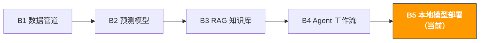

# B5. 本地模型部署与微调 | Local Model Deployment & Fine-tuning

> **路径**: Path B: 技术人 · **模块**: B5
> **最后更新**: 2026-03-12
> **难度**: 高级
> **前提**: B1 数据管道基础（Python）、B3 RAG 基本概念、B4 Agent 基础
> **预计时间**: 每天 1 小时，3-4 周
---




---

## 本模块章节导航

1. [本地部署方法论](#1-本地部署方法论) · 2. [工具全景](#2-工具全景) · 3. [代码实战](#3-代码实战) · 4. [硬件选购指南](#4-硬件选购指南) · 5. [常见陷阱](#5-常见陷阱) · 6. [进阶技术](#6-进阶技术) · 7. [学习资源](#7-学习资源) · 8. [ OpenClaw 本地部署](#8-用-openclaw--ollama-构建本地-agent) · 9. [完成标志](#9-完成标志)


## 本模块你将构建

本地 AI 服务 在自己的机器上运行 LLM，保护商业数据隐私；用 LoRA 微调模型适配电商场景。

完成本模块后，你将能够：
- 理解为什么要在本地部署 LLM，以及何时选择本地 vs 云端
- 用 Ollama 一行命令在本地运行 Qwen2.5、Llama 3.1、Mistral 等开源模型
- 根据任务需求选择合适的模型（中文能力、代码能力、推理能力）
- 用 Python 调用本地 Ollama 模型，集成到现有工作流
- 构建完全本地的 RAG 系统（数据不出本机）
- 用 LoRA/QLoRA 微调模型，让通用模型变成电商专家
- 用 vLLM 部署高性能推理服务（支持并发请求）
- 理解量化技术（GGUF/GPTQ/AWQ），在有限硬件上运行更大的模型
- 根据预算选择合适的硬件（Mac M 系列 / NVIDIA GPU / 云 GPU）

---

## 1. 本地部署方法论

> **相关阅读**: [B3 RAG 知识库系统](b3-rag-knowledge-base.md) RAG 系统可作为模型微调的轻量替代方案，详见 B3。 · [F1 AI 的前世今生](../0-foundations/f1-ai-evolution.md) AI 模型演进详见 F1

### 1.1 为什么要在本地运行 LLM

电商数据包含大量商业机密：产品成本、供应商信息、销量数据、利润率、客户信息。把这些数据发送到 OpenAI/Claude 的服务器，存在数据泄露风险。

本地部署的核心价值：

| 价值 | 说明 |
|------|------|
| 数据隐私 | 所有数据在本机处理，不经过任何第三方服务器 |
| 零 API 成本 | 不按 token 计费，跑多少次都免费（只有电费） |
| 离线可用 | 不依赖网络，飞机上、VPN 断了都能用 |
| 低延迟 | 本地推理无网络延迟，适合实时应用 |
| 完全可控 | 模型版本、参数、行为完全由你控制，不会被提供商突然更新 |
| 合规友好 | 满足数据本地化要求，适合有合规约束的企业 |

**一个真实场景**：你需要用 AI 分析 1000 条客户 Review，提取产品改进方向。
- 用 OpenAI API：1000 条 Review × 平均 200 tokens = 200k tokens，成本约 $0.03（便宜），但数据发送到了 OpenAI 服务器
- 用本地 Ollama：零成本，数据不出本机，但需要等待更长的推理时间

### 1.2 云端 vs 本地：决策框架

不是所有场景都适合本地部署。选择的关键在于权衡数据隐私、成本、质量和速度。

```
你的场景是什么？
数据包含商业机密（成本、利润、供应商） → 本地部署
需要最高质量的推理（复杂分析、创意写作） → 云端 API（GPT-4o/Claude）
高频调用（每天 10000+ 次） → 本地部署（成本优势明显）
偶尔使用（每天几十次） → 云端 API（省去运维成本）
需要离线使用 → 本地部署
团队多人共享 → vLLM 本地服务 或 云端 API
不确定 → 先用云端 API 验证需求，确认后再迁移到本地
```

**详细对比：**

| 维度 | 本地部署 | 云端 API |
|------|----------|----------|
| 数据隐私 | 数据不出本机 | 数据发送到第三方服务器 |
| 推理质量 | 7B 模型约 GPT-3.5 水平，70B 接近 GPT-4 | GPT-4o/Claude 3.5 最高水平 |
| 成本（低频） | 硬件投入高，使用免费 | 按 token 计费，总成本低 |
| 成本（高频） | 硬件一次投入，长期免费 | 成本随调用量线性增长 |
| 延迟 | 取决于硬件（M4 Pro 约 40 tokens/s） | 网络延迟 + 推理延迟 |
| 离线使用 | 完全离线 | 需要网络 |
| 运维成本 | 需要自己管理模型、更新、硬件 | 零运维 |
| 扩展性 | 受限于本机硬件 | 无限扩展 |

> **经验法则**：如果你的数据不敏感且调用量不大，用云端 API 最省事。如果数据敏感或调用量大（每月 API 费用 > $50），认真考虑本地部署。

### 1.3 硬件要求速查

运行本地 LLM 的最低硬件要求取决于模型大小：

| 模型大小 | 最低内存/显存 | 推荐硬件 | 推理速度参考 |
|----------|-------------|----------|-------------|
| 1-3B（小模型） | 4GB RAM | 任何现代电脑 | 50-80 tokens/s |
| 7-8B（主流） | 8GB RAM | Mac M1 8GB / RTX 3060 | 20-40 tokens/s |
| 13-14B | 16GB RAM | Mac M2 Pro 16GB / RTX 4070 | 15-25 tokens/s |
| 32-34B | 32GB RAM | Mac M3 Pro 36GB / RTX 4090 | 8-15 tokens/s |
| 70B（大模型） | 48GB+ RAM | Mac M3 Max 64GB / 2×RTX 4090 | 5-10 tokens/s |

> **关键概念**：模型参数量（如 7B = 70 亿参数）决定了所需内存。经过量化（如 Q4_K_M）后，7B 模型约占 4-5GB 内存。详见第 7 节量化技术。

---

## 2. 工具全景

| 工具 | 类型 | 难度 | 最佳场景 | 链接 |
|------|------|------|----------|------|
| [Ollama](https://ollama.com/) | 本地 LLM 运行器 | 入门 | 一行命令运行本地模型，开发测试 | [ollama.com](https://ollama.com/) |
| [vLLM](https://github.com/vllm-project/vllm) | 高性能推理引擎 | 高级 | 生产环境、高并发、多用户共享 | [GitHub](https://github.com/vllm-project/vllm) |
| [llama.cpp](https://github.com/ggerganov/llama.cpp) | C++ 推理引擎 | 中级 | 极致性能优化、CPU 推理 | [GitHub](https://github.com/ggerganov/llama.cpp) |
| [PEFT/LoRA](https://huggingface.co/docs/peft) | 参数高效微调 | 中级 | 用少量数据微调模型 | [HuggingFace](https://huggingface.co/docs/peft) |
| [Unsloth](https://github.com/unslothai/unsloth) | 快速微调框架 | 中级 | 2 倍速微调，显存减半 | [GitHub](https://github.com/unslothai/unsloth) |
| [HuggingFace Hub](https://huggingface.co/) | 模型仓库 | 入门 | 下载开源模型、数据集 | [huggingface.co](https://huggingface.co/) |
| [LM Studio](https://lmstudio.ai/) | 桌面 LLM 应用 | 入门 | GUI 界面运行本地模型 | [lmstudio.ai](https://lmstudio.ai/) |

**选择建议：**
- 个人开发、快速实验 → Ollama（本模块主线）
- 生产环境、多人共享 → vLLM
- 极致性能优化、嵌入式设备 → llama.cpp
- 微调模型 → Unsloth（速度快）或 PEFT（灵活）
- 不想写代码、GUI 操作 → LM Studio
- 下载模型和数据集 → HuggingFace Hub

### 2.1 Ollama vs vLLM vs llama.cpp

| 维度 | Ollama | vLLM | llama.cpp |
|------|--------|------|-----------|
| 定位 | 开发者友好的本地 LLM 运行器 | 高性能生产级推理引擎 | 底层 C++ 推理库 |
| 易用性 | 极简（一行命令） | 需要配置 | 需要编译 |
| 性能 | 良好（底层用 llama.cpp） | 最优（PagedAttention） | 优秀（手动优化） |
| 并发支持 | 有限（适合单用户） | 优秀（生产级并发） | 需要自己实现 |
| GPU 支持 | Metal (Mac) / CUDA | CUDA（主要） | Metal / CUDA / CPU |
| API 兼容 | OpenAI 兼容 API | OpenAI 兼容 API | 需要额外封装 |
| 模型格式 | GGUF（自动下载） | HuggingFace 原生 | GGUF |
| 适合场景 | 开发测试、个人使用 | 团队共享、生产部署 | 嵌入式、极致优化 |

**结论**：入门用 Ollama（最简单），需要服务多人时用 vLLM，需要极致性能时用 llama.cpp。本模块以 Ollama 为主线，vLLM 为进阶。

参考文档：[Ollama 官方文档](https://ollama.com/) | [vLLM 官方文档](https://docs.vllm.ai/) | [llama.cpp GitHub](https://github.com/ggerganov/llama.cpp)

### 2.2 HuggingFace：开源模型的 GitHub

[HuggingFace](https://huggingface.co/) 是开源 AI 模型的最大集散地，类似于代码领域的 GitHub。几乎所有开源 LLM 都会在 HuggingFace 上发布。

**HuggingFace 的核心功能：**
- **Models Hub**：下载开源模型（Qwen、Llama、Mistral 等）
- **Datasets Hub**：下载训练数据集
- **Spaces**：在线体验模型 Demo
- **Transformers 库**：Python 中加载和使用模型的标准库

**电商开发者常用操作：**

```bash
# 安装 HuggingFace 工具
pip install transformers huggingface_hub

# 下载模型到本地
huggingface-cli download Qwen/Qwen2.5-7B-Instruct --local-dir ./models/qwen2.5-7b

# 搜索模型
huggingface-cli search models --query "e-commerce chinese"
```

> **Ollama vs 直接用 HuggingFace**：Ollama 帮你处理了模型下载、量化、运行的所有细节，一行命令搞定。直接用 HuggingFace Transformers 库更灵活，但需要自己管理 GPU 内存、量化、推理优化。入门用 Ollama，需要精细控制时再用 HuggingFace。

---

## 3. 代码实战

### 3.1 Ollama 快速入门：一行命令运行本地 LLM

Ollama 是目前最简单的本地 LLM 运行方式。安装后一行命令就能跑起来。

**安装 Ollama：**

```bash
# macOS 从官网下载安装包
# 访问 https://ollama.com/download 下载 macOS 版本
# 或用 Homebrew：
brew install ollama

# Linux
curl -fsSL https://ollama.com/install.sh | sh

# Windows 从官网下载安装包
# 访问 https://ollama.com/download 下载 Windows 版本

# 验证安装
ollama --version
```

**下载并运行模型：**

```bash
# 下载并运行 Qwen2.5 7B（推荐：中英文都好）
ollama run qwen2.5:7b

# 下载并运行 Llama 3.1 8B（Meta 开源，英文优秀）
ollama run llama3.1:8b

# 下载并运行 Mistral 7B（欧洲团队，代码能力强）
ollama run mistral:7b

# 查看已下载的模型
ollama list

# 删除不需要的模型（释放磁盘空间）
ollama rm mistral:7b
```

运行 `ollama run` 后，你会进入一个交互式对话界面，可以直接和模型聊天：

```
>>> 帮我分析一下运动相机品类在美国市场的竞争格局
运动相机品类在美国市场的竞争格局可以从以下几个维度分析：

1. 市场格局：GoPro 仍然是市场领导者，但市场份额持续被侵蚀...
2. 价格带分布：$100-200 入门级、$200-400 中端、$400+ 高端...
3. 新进入者：Insta360、DJI Action 等品牌快速增长...
...

>>> /bye # 退出对话
```

> **Ollama 的工作原理**：Ollama 底层使用 llama.cpp 进行推理，自动检测你的硬件（Mac Metal GPU / NVIDIA CUDA），选择最优的推理方式。模型文件存储在 `~/.ollama/models/` 目录下。

### 3.2 模型选择指南：Qwen2.5 vs Llama 3.1 vs Mistral

选对模型比选对框架更重要。不同模型在不同任务上表现差异很大。

**主流开源模型对比：**

| 模型 | 参数量 | 中文能力 | 英文能力 | 代码能力 | 推理能力 | 推荐场景 |
|------|--------|----------|----------|----------|----------|----------|
| Qwen2.5 | 0.5B-72B | 最佳 | 优秀 | 优秀 | 优秀 | 中文电商场景首选 |
| Llama 3.1 | 8B-405B | 良好 | 最佳 | 优秀 | 优秀 | 英文为主的场景 |
| Mistral | 7B-8x22B | 良好 | 优秀 | 最佳 | 良好 | 代码生成、技术文档 |
| Gemma 2 | 2B-27B | 良好 | 优秀 | 良好 | 良好 | 轻量级、移动端 |
| Phi-3 | 3.8B-14B | 一般 | 优秀 | 优秀 | 优秀 | 小模型高性能 |
| DeepSeek-V2 | 16B-236B | 优秀 | 优秀 | 最佳 | 优秀 | 代码和数学推理 |

**电商场景推荐：**

```
你的主要语言是什么？
中文为主（中国卖家、中文 Review） → Qwen2.5:7b
英文为主（美国市场、英文 Listing） → Llama3.1:8b
中英混合 → Qwen2.5:7b（中英文都好）
需要写代码/数据分析 → DeepSeek-Coder 或 Qwen2.5-Coder

你的硬件条件？
8GB RAM（Mac M1/M2 基础款） → 7B 模型（qwen2.5:7b）
16GB RAM → 7B 或 14B 模型
32GB+ RAM → 可以尝试 32B 模型
64GB+ RAM → 70B 模型（接近 GPT-4 水平）
```

**Ollama 模型下载命令：**

```bash
# 电商中文场景首选
ollama pull qwen2.5:7b

# 英文场景 / Meta 生态
ollama pull llama3.1:8b

# 代码生成
ollama pull qwen2.5-coder:7b

# 轻量级（笔记本也能跑）
ollama pull qwen2.5:3b
ollama pull phi3:3.8b

# Embedding 模型（用于 RAG）
ollama pull nomic-embed-text
ollama pull bge-large:latest
```

### 3.3 Ollama + Python：集成到现有工作流

Ollama 提供 OpenAI 兼容的 REST API，可以用任何 HTTP 客户端调用。也有官方 Python 库。

**方式 1：用 ollama Python 库（最简单）**

```python
# pip install ollama

import ollama

def analyze_review(review_text: str, model: str = "qwen2.5:7b") -> str:
"""用本地 LLM 分析客户 Review，提取产品改进方向。"""
response = ollama.chat(
model=model,
messages=[
{
"role": "system",
"content": "你是电商产品分析专家。分析客户 Review，提取：\n"
"1. 核心问题（一句话）\n"
"2. 问题类别（质量/功能/物流/价格/其他）\n"
"3. 改进建议\n"
"用中文回答，简洁明了。",
},
{"role": "user", "content": f"请分析这条 Review：\n{review_text}"},
],
options={"temperature": 0.1}, # 低温度，更确定性的输出
)
return response["message"]["content"]

def batch_analyze_reviews(reviews: list[str], model: str = "qwen2.5:7b") -> list[dict]:
"""批量分析 Review 列表。"""
results = []
for i, review in enumerate(reviews):
print(f"分析 Review {i+1}/{len(reviews)}...")
analysis = analyze_review(review, model)
results.append({"review": review, "analysis": analysis})
return results

# 使用示例
# reviews = [
# "用了一周就坏了，镜头模糊，防水也不行",
# "电池只能用 40 分钟，远低于宣传的 2 小时",
# "画质很好，但是 App 太难用了，经常闪退",
# ]
# results = batch_analyze_reviews(reviews)
# for r in results:
# print(f"Review: {r['review'][:30]}...")
# print(f"分析: {r['analysis']}\n")
```

**方式 2：用 OpenAI 兼容 API（无缝切换云端/本地）**

Ollama 提供 OpenAI 兼容的 API 接口，这意味着你可以用 `openai` Python 库直接调用本地模型，代码几乎不用改。

```python
# pip install openai
# 前提：Ollama 正在运行（ollama serve）

from openai import OpenAI

# 指向本地 Ollama 服务（而非 OpenAI 服务器）
client = OpenAI(
base_url="http://localhost:11434/v1",
api_key="ollama", # Ollama 不需要真实 API key
)

def generate_listing(product_info: str, model: str = "qwen2.5:7b") -> str:
"""用本地 LLM 生成产品 Listing。"""
response = client.chat.completions.create(
model=model,
messages=[
{
"role": "system",
"content": "你是 Amazon Listing 优化专家。根据产品信息生成：\n"
"1. 标题（含核心关键词，<200 字符）\n"
"2. 5 个 Bullet Points\n"
"3. 产品描述（<2000 字符）\n"
"用英文输出，符合 Amazon 风格指南。",
},
{"role": "user", "content": f"产品信息：\n{product_info}"},
],
temperature=0.3,
)
return response.choices[0].message.content

# 切换到云端 OpenAI 只需改两行：
# client = OpenAI(api_key="sk-...") # 改为 OpenAI API key
# model = "gpt-4o-mini" # 改为 OpenAI 模型名
```

> **无缝切换的价值**：开发阶段用本地 Ollama（免费、数据安全），上线后根据需要切换到 OpenAI（质量更高）。代码只需改 `base_url` 和 `model` 两个参数。

**方式 3：流式输出（Streaming）**

对于长文本生成（如报告、Listing），流式输出可以让用户看到实时生成过程，体验更好。

```python
import ollama

def stream_generate(prompt: str, model: str = "qwen2.5:7b"):
"""流式生成文本，实时输出每个 token。"""
stream = ollama.chat(
model=model,
messages=[{"role": "user", "content": prompt}],
stream=True,
)

full_response = ""
for chunk in stream:
token = chunk["message"]["content"]
print(token, end="", flush=True)
full_response += token

print() # 换行
return full_response

# stream_generate("用 200 字分析 Insta360 X4 在美国市场的竞争优势")
```

### 3.4 本地 RAG 完整方案：Ollama + LlamaIndex + Chroma

结合 B3 模块的 RAG 知识，构建一个完全本地的 RAG 系统。所有数据在本机处理，不调用任何外部 API。

```python
# 完全本地 RAG Ollama + LlamaIndex + Chroma
# pip install llama-index llama-index-llms-ollama llama-index-embeddings-ollama chromadb

import chromadb
from llama_index.core import (
VectorStoreIndex, SimpleDirectoryReader,
Settings, StorageContext,
)
from llama_index.llms.ollama import Ollama
from llama_index.embeddings.ollama import OllamaEmbedding
from llama_index.vector_stores.chroma import ChromaVectorStore

def build_local_rag(
docs_dir: str,
llm_model: str = "qwen2.5:7b",
embed_model: str = "nomic-embed-text",
collection_name: str = "local_knowledge",
persist_dir: str = "chroma_db",
) -> VectorStoreIndex:
"""
构建完全本地的 RAG 系统。

前提：
1. 已安装 Ollama 并运行（ollama serve）
2. 已下载模型：ollama pull qwen2.5:7b
3. 已下载 Embedding：ollama pull nomic-embed-text

所有数据在本地处理，不调用任何外部 API。
"""
# 配置本地 LLM
Settings.llm = Ollama(
model=llm_model,
request_timeout=120.0,
temperature=0.1,
)

# 配置本地 Embedding
Settings.embed_model = OllamaEmbedding(model_name=embed_model)

# 配置 Chroma 持久化存储
chroma_client = chromadb.PersistentClient(path=persist_dir)
chroma_collection = chroma_client.get_or_create_collection(collection_name)
vector_store = ChromaVectorStore(chroma_collection=chroma_collection)
storage_context = StorageContext.from_defaults(vector_store=vector_store)

# 加载文档并构建索引
documents = SimpleDirectoryReader(docs_dir, recursive=True).load_data()
print(f" 加载了 {len(documents)} 个文档")

index = VectorStoreIndex.from_documents(
documents, storage_context=storage_context, show_progress=True,
)

print(f" 本地 RAG 构建完成")
print(f" LLM: {llm_model} | Embedding: {embed_model}")
print(f" 向量数据库: {persist_dir} ({chroma_collection.count()} 个向量)")
print(f" 所有数据在本地处理，未发送到任何外部服务")
return index

def query_local_rag(index: VectorStoreIndex, question: str, top_k: int = 3) -> dict:
"""查询本地 RAG 系统。"""
query_engine = index.as_query_engine(similarity_top_k=top_k)
response = query_engine.query(question)

sources = []
for node in response.source_nodes:
sources.append({
"file": node.metadata.get("file_name", "unknown"),
"score": round(node.score, 4) if node.score else None,
"preview": node.text[:200],
})

return {
"question": question,
"answer": str(response),
"sources": sources,
}

# 使用示例
# index = build_local_rag("data/product_docs")
# result = query_local_rag(index, "这个产品的保修期是多久？")
# print(f"Q: {result['question']}")
# print(f"A: {result['answer']}")
# for s in result['sources']:
# print(f" 来源: {s['file']} (相似度: {s['score']})")
```

**本地 RAG 架构图：**

```
用户提问
↓
[Ollama Embedding] → 问题向量化（本地）
↓
[Chroma 向量数据库] → 相似度搜索（本地磁盘）
↓
检索到的文档段落 + 用户问题
↓
[Ollama LLM] → 生成回答（本地）
↓
回答 + 引用来源
```

> **成本对比**：处理 100 个文档的 RAG 系统，用 OpenAI API 每次重建索引约 $0.05，每次查询约 $0.002。用本地 Ollama，成本为 $0（只有电费）。如果每天查询 100 次，一个月省 $6；如果每天查询 1000 次，一个月省 $60。

### 3.5 LoRA 微调入门：让通用模型变成电商专家

通用 LLM 对电商术语（ASIN、FBA、ACoS、BSR）的理解有限。通过 LoRA 微调，可以用少量电商数据让模型变成"电商专家"。

**什么是 LoRA？**

LoRA（Low-Rank Adaptation）是一种参数高效微调技术。核心思想：不修改原始模型的全部参数（70 亿个），只训练一小组"适配器"参数（几百万个），就能让模型学会新知识。

```
传统微调：修改全部 70 亿参数 → 需要大量 GPU 显存和时间
LoRA 微调：冻结原始参数，只训练 ~1% 的适配器参数 → 一张消费级 GPU 就够
```

**LoRA 的优势：**

| 维度 | 传统全量微调 | LoRA 微调 |
|------|-------------|-----------|
| 显存需求 | 7B 模型需 ~56GB | 7B 模型需 ~16GB |
| 训练时间 | 数小时到数天 | 数十分钟到数小时 |
| 训练数据量 | 需要大量数据 | 几百到几千条即可 |
| 原始模型 | 被修改，不可恢复 | 不变，适配器可插拔 |
| 多任务 | 每个任务一个完整模型 | 每个任务一个小适配器文件 |

**准备微调数据（电商场景）：**

```python
# 微调数据格式：instruction + input + output
# 保存为 JSONL 文件

training_data = [
{
"instruction": "分析这条 Amazon Review，提取产品问题和改进建议。",
"input": "买了两周就坏了，镜头模糊，防水也不行。客服态度还可以但是解决不了问题。",
"output": "**产品问题**：\n1. 耐用性差（两周损坏）\n2. 镜头质量问题（模糊）\n"
"3. 防水性能不达标\n\n**改进建议**：\n1. 加强产品质检，重点检测镜头和防水密封\n"
"2. 延长质保期以提升客户信心\n3. 在 Listing 中准确描述防水等级，避免过度宣传",
},
{
"instruction": "根据产品信息生成 Amazon Listing 的 5 个 Bullet Points。",
"input": "产品：运动相机 X1，4K60fps，防水 10 米，电池 2 小时，重量 120g，"
"支持语音控制，配件丰富",
"output": " 【4K Ultra HD】Capture stunning 4K video at 60fps...\n"
" 【Waterproof to 33ft】Built-in waterproof design...\n"
" 【2-Hour Battery Life】Extended battery for all-day...\n"
" 【Voice Control】Hands-free operation with voice...\n"
" 【Complete Accessory Kit】Includes mounting brackets...",
},
# ... 准备 200-500 条类似数据
]

import json
with open("train_data.jsonl", "w", encoding="utf-8") as f:
for item in training_data:
f.write(json.dumps(item, ensure_ascii=False) + "\n")
```

**用 Unsloth 进行 LoRA 微调（推荐，速度快 2 倍）：**

```python
# Unsloth LoRA 微调 在 Google Colab 免费版即可运行
# pip install unsloth

from unsloth import FastLanguageModel
from trl import SFTTrainer
from transformers import TrainingArguments
from datasets import load_dataset

# 1. 加载基础模型（自动应用 4-bit 量化，节省显存）
model, tokenizer = FastLanguageModel.from_pretrained(
model_name="unsloth/Qwen2.5-7B-Instruct-bnb-4bit",
max_seq_length=2048,
load_in_4bit=True, # 4-bit 量化，7B 模型只需 ~5GB 显存
)

# 2. 添加 LoRA 适配器
model = FastLanguageModel.get_peft_model(
model,
r=16, # LoRA 秩（越大越强但越慢，推荐 8-32）
target_modules=["q_proj", "k_proj", "v_proj", "o_proj",
"gate_proj", "up_proj", "down_proj"],
lora_alpha=16, # 缩放因子（通常等于 r）
lora_dropout=0, # Dropout（Unsloth 优化后设为 0）
bias="none",
use_gradient_checkpointing="unsloth", # 进一步节省显存
)

# 3. 准备训练数据
# 数据格式：每条数据是一个完整的对话
def format_prompt(example):
return {
"text": f"""<|im_start|>system
你是电商运营 AI 助手，精通 Amazon 运营、Listing 优化、Review 分析。<|im_end|>
<|im_start|>user
{example['instruction']}
{example['input']}<|im_end|>
<|im_start|>assistant
{example['output']}<|im_end|>"""
}

dataset = load_dataset("json", data_files="train_data.jsonl", split="train")
dataset = dataset.map(format_prompt)

# 4. 配置训练参数
trainer = SFTTrainer(
model=model,
tokenizer=tokenizer,
train_dataset=dataset,
dataset_text_field="text",
max_seq_length=2048,
args=TrainingArguments(
per_device_train_batch_size=2,
gradient_accumulation_steps=4, # 等效 batch_size = 8
warmup_steps=5,
max_steps=60, # 小数据集 60 步足够（约 500 条数据）
learning_rate=2e-4,
fp16=True, # 混合精度训练
logging_steps=10,
output_dir="outputs",
optim="adamw_8bit", # 8-bit 优化器，节省显存
),
)

# 5. 开始训练
trainer_stats = trainer.train()
print(f"训练完成！耗时: {trainer_stats.metrics['train_runtime']:.0f} 秒")

# 6. 保存 LoRA 适配器（只有几十 MB，不是完整模型）
model.save_pretrained("lora_ecommerce")
tokenizer.save_pretrained("lora_ecommerce")
print(" LoRA 适配器已保存到 lora_ecommerce/")

# 7. 导出为 GGUF 格式（可以在 Ollama 中使用）
model.save_pretrained_gguf(
"model_gguf",
tokenizer,
quantization_method="q4_k_m", # 4-bit 量化
)
print(" GGUF 模型已导出，可用 Ollama 加载")
```

**微调后在 Ollama 中使用：**

```bash
# 创建 Modelfile
cat > Modelfile << 'EOF'
FROM ./model_gguf/unsloth.Q4_K_M.gguf
TEMPLATE """<|im_start|>system
{{ .System }}<|im_end|>
<|im_start|>user
{{ .Prompt }}<|im_end|>
<|im_start|>assistant
"""
SYSTEM "你是电商运营 AI 助手，精通 Amazon 运营、Listing 优化、Review 分析。"
PARAMETER temperature 0.1
PARAMETER top_p 0.9
EOF

# 创建 Ollama 模型
ollama create ecommerce-expert -f Modelfile

# 运行微调后的模型
ollama run ecommerce-expert
```

> **微调数据量指南**：
> - 50-100 条：模型学会输出格式，但知识有限
> - 200-500 条：模型掌握领域术语和基本任务
> - 1000+ 条：模型成为领域专家，回答质量接近人工
> - 数据质量比数量更重要 100 条高质量数据 > 1000 条低质量数据

### 3.6 vLLM 高性能部署：团队共享的本地 LLM 服务

Ollama 适合个人使用，但如果团队多人需要共享一个本地 LLM 服务，vLLM 是更好的选择。vLLM 使用 PagedAttention 技术，推理吞吐量比 Ollama 高 2-4 倍。

**安装 vLLM：**

```bash
# 需要 NVIDIA GPU（CUDA 12.1+）
pip install vllm

# 或用 Docker（推荐，避免环境问题）
docker run --runtime nvidia --gpus all \
-v ~/.cache/huggingface:/root/.cache/huggingface \
-p 8000:8000 \
vllm/vllm-openai:latest \
--model Qwen/Qwen2.5-7B-Instruct \
--max-model-len 4096
```

**启动 vLLM 服务：**

```bash
# 方式 1：命令行启动（OpenAI 兼容 API）
python -m vllm.entrypoints.openai.api_server \
--model Qwen/Qwen2.5-7B-Instruct \
--host 0.0.0.0 \
--port 8000 \
--max-model-len 4096 \
--gpu-memory-utilization 0.9

# 服务启动后，用 OpenAI 客户端调用：
# curl http://localhost:8000/v1/chat/completions \
# -H "Content-Type: application/json" \
# -d '{"model": "Qwen/Qwen2.5-7B-Instruct", "messages": [...]}'
```

**Python 调用 vLLM 服务：**

```python
from openai import OpenAI

# vLLM 提供 OpenAI 兼容 API，代码和调用 OpenAI 完全一样
client = OpenAI(base_url="http://localhost:8000/v1", api_key="not-needed")

response = client.chat.completions.create(
model="Qwen/Qwen2.5-7B-Instruct",
messages=[
{"role": "system", "content": "你是电商数据分析专家。"},
{"role": "user", "content": "分析这个月销售下降 15% 的可能原因"},
],
temperature=0.1,
max_tokens=1024,
)
print(response.choices[0].message.content)
```

**Ollama vs vLLM 性能对比：**

| 维度 | Ollama | vLLM |
|------|--------|------|
| 单请求延迟 | 快（优化好） | 快 |
| 并发吞吐量 | 一般（单请求优化） | 优秀（PagedAttention） |
| 10 并发请求 | ~5 tokens/s/请求 | ~15 tokens/s/请求 |
| GPU 利用率 | 60-70% | 85-95% |
| 适合场景 | 个人开发、单用户 | 团队共享、API 服务 |
| 安装难度 | 极简 | 需要 CUDA 环境 |

> **何时从 Ollama 升级到 vLLM**：当你的本地 LLM 服务需要同时服务 3+ 个用户，或者需要处理批量请求（如批量分析 1000 条 Review）时，vLLM 的吞吐量优势就很明显了。

---

## 4. 硬件选购指南

### 4.1 Mac M 系列（推荐入门）

Apple Silicon Mac 是目前性价比最高的本地 LLM 开发平台。统一内存架构让 CPU 和 GPU 共享内存，不需要单独的显卡。

| 机型 | 统一内存 | 可运行模型 | 推理速度参考 | 适合场景 |
|------|----------|-----------|-------------|----------|
| MacBook Air M1 8GB | 8GB | 7B (Q4) | ~15 tokens/s | 入门学习 |
| MacBook Pro M2 16GB | 16GB | 7B-14B | ~25 tokens/s | 日常开发 |
| MacBook Pro M3 Pro 18GB | 18GB | 7B-14B | ~30 tokens/s | 日常开发 |
| MacBook Pro M3 Pro 36GB | 36GB | 7B-32B | ~20 tokens/s (32B) | 进阶开发 |
| MacBook Pro M3 Max 64GB | 64GB | 7B-70B | ~10 tokens/s (70B) | 专业级 |
| Mac Studio M2 Ultra 192GB | 192GB | 70B+ (全精度) | ~15 tokens/s (70B) | 团队服务 |

**Mac 用户的最佳实践：**

```bash
# 检查你的 Mac 内存
sysctl -n hw.memsize | awk '{print $1/1024/1024/1024 " GB"}'

# 根据内存选择模型
# 8GB → ollama run qwen2.5:3b 或 phi3:3.8b
# 16GB → ollama run qwen2.5:7b（推荐）
# 32GB → ollama run qwen2.5:14b 或 qwen2.5:32b (Q4)
# 64GB → ollama run qwen2.5:72b (Q4)

# 监控推理时的内存和 GPU 使用
# 打开 Activity Monitor → GPU History
```

> **购买建议**：如果你主要做 AI 开发，优先选择内存大的配置。MacBook Pro M3 Pro 36GB 是性价比甜点 能跑 32B 模型，日常开发绰绰有余。

### 4.2 NVIDIA GPU（推荐生产环境）

如果需要微调模型或部署高并发服务，NVIDIA GPU 是标准选择。

| GPU | 显存 | 可运行模型 | 微调能力 | 价格参考 |
|-----|------|-----------|----------|----------|
| RTX 3060 12GB | 12GB | 7B (Q4/Q8) | 7B LoRA (QLoRA) | ~$250 |
| RTX 4060 Ti 16GB | 16GB | 7B-14B | 7B LoRA | ~$400 |
| RTX 4070 Ti Super 16GB | 16GB | 7B-14B | 7B LoRA | ~$800 |
| RTX 4090 24GB | 24GB | 7B-32B | 7B-14B LoRA | ~$1,600 |
| A100 40GB | 40GB | 7B-70B (Q4) | 7B-14B 全量 | ~$10,000 |
| A100 80GB | 80GB | 70B+ | 70B LoRA | ~$15,000 |
| H100 80GB | 80GB | 70B+ | 70B 全量 | ~$30,000 |

**显存需求估算公式：**

```
推理显存 ≈ 模型参数量(B) × 量化位数 / 8 + 2GB 开销
微调显存 ≈ 推理显存 × 1.5（LoRA）或 × 4（全量微调）

示例：
- Qwen2.5-7B Q4 推理：7 × 4 / 8 + 2 = 5.5GB → RTX 3060 够用
- Qwen2.5-7B Q4 LoRA 微调：5.5 × 1.5 = 8.25GB → RTX 3060 勉强
- Qwen2.5-7B FP16 全量微调：7 × 16 / 8 × 4 = 56GB → 需要 A100
```

### 4.3 云 GPU（按需使用，无需购买硬件）

不想买硬件？云 GPU 按小时计费，用完即走。

| 平台 | GPU 选项 | 价格参考 | 适合场景 |
|------|----------|----------|----------|
| Google Colab | T4 (免费) / A100 (Pro) | 免费 / $10/月 | 学习、小规模微调 |
| Lambda Cloud | A100 / H100 | $1.10-$2.49/小时 | 微调、批量推理 |
| RunPod | A100 / H100 | $1.04-$2.39/小时 | 灵活按需 |
| Vast.ai | 各种 GPU | $0.20-$1.50/小时 | 最便宜，社区 GPU |
| AWS SageMaker | 各种 GPU | $1.21-$32.77/小时 | 企业级，与 AWS 生态集成 |

**推荐策略：**
- 学习和实验 → Google Colab 免费版（T4 GPU，够跑 7B 模型微调）
- 正式微调 → Lambda Cloud 或 RunPod（A100，按小时计费）
- 生产部署 → AWS SageMaker 或自建服务器

> **成本计算示例**：用 Colab Pro（$10/月）微调一个 7B 模型，A100 GPU 约需 30 分钟。如果每月微调 2 次，成本约 $10/月。买一张 RTX 4090（$1,600），需要 160 个月才能回本。所以如果微调频率不高，云 GPU 更划算。

---

## 5. 常见陷阱

### 5.1 模型选错导致效果差

**症状**：本地模型的回答质量远低于预期，中文回答不通顺，或者完全不理解电商术语。

**原因**：选了不适合的模型。比如用英文优化的 Llama 处理中文任务，或者用 3B 小模型做复杂分析。

**解决方案**：

| 任务 | 错误选择 | 正确选择 |
|------|----------|----------|
| 中文 Review 分析 | llama3.1:8b（中文弱） | qwen2.5:7b（中文强） |
| 复杂数据分析 | phi3:3.8b（太小） | qwen2.5:14b 或更大 |
| 代码生成 | mistral:7b（代码一般） | qwen2.5-coder:7b |
| 简单分类任务 | qwen2.5:72b（杀鸡用牛刀） | qwen2.5:3b（够用且快） |

**经验法则**：先用小模型（3B-7B）测试，效果不够再换大模型。不要一上来就用最大的模型 大模型慢且占资源。

### 5.2 内存不足导致崩溃

**症状**：运行模型时系统卡死、Ollama 报错 "out of memory"、Mac 开始疯狂使用 swap。

**解决方案**：

```bash
# 1. 检查当前内存使用
ollama ps # 查看正在运行的模型及其内存占用

# 2. 停止不需要的模型
ollama stop qwen2.5:14b

# 3. 使用更小的量化版本
ollama run qwen2.5:7b-q4_0 # Q4 量化，比默认更省内存

# 4. 限制 Ollama 使用的内存（Mac）
# 在 ~/.ollama/config 中设置：
# OLLAMA_MAX_LOADED_MODELS=1
# OLLAMA_NUM_PARALLEL=1
```

> **Mac 用户注意**：当统一内存不够时，macOS 会使用 SSD swap，导致推理速度暴降 10 倍以上，而且长期大量 swap 会损耗 SSD 寿命。确保模型大小不超过可用内存的 80%。

### 5.3 微调过拟合

**症状**：微调后的模型在训练数据上表现很好，但遇到新问题就"胡说八道"，或者所有回答都像是在背诵训练数据。

**原因**：训练数据太少、训练步数太多、学习率太高。

**解决方案**：

| 策略 | 做法 |
|------|------|
| 增加数据多样性 | 确保训练数据覆盖多种场景，不要只有一种类型 |
| 减少训练步数 | 从 30 步开始，逐步增加，观察验证集 loss |
| 降低学习率 | 从 2e-4 降到 1e-4 或 5e-5 |
| 使用验证集 | 留 10-20% 数据做验证，监控验证 loss |
| 早停 | 验证 loss 不再下降时停止训练 |

### 5.4 Ollama 服务未启动

**症状**：Python 代码报错 "Connection refused" 或 "Cannot connect to Ollama"。

**解决方案**：

```bash
# 检查 Ollama 是否在运行
ollama ps

# 如果没有运行，启动服务
ollama serve

# macOS：Ollama 通常作为后台服务自动运行
# 如果没有，打开 Ollama 应用程序（在 Applications 中）

# 验证服务是否正常
curl http://localhost:11434/api/tags
```

### 5.5 量化精度损失

**症状**：量化后的模型回答质量明显下降，出现逻辑错误或语句不通顺。

**不同量化级别的质量影响：**

| 量化级别 | 模型大小（7B） | 质量损失 | 推荐场景 |
|----------|---------------|----------|----------|
| FP16（无量化） | ~14GB | 无 | 有足够显存时 |
| Q8_0 | ~7.5GB | 极小（<1%） | 质量优先 |
| Q6_K | ~5.5GB | 很小（1-2%） | 平衡选择 |
| Q5_K_M | ~5.0GB | 小（2-3%） | 推荐默认 |
| Q4_K_M | ~4.4GB | 可接受（3-5%） | 内存有限时 |
| Q4_0 | ~3.8GB | 明显（5-10%） | 极端内存限制 |
| Q2_K | ~2.8GB | 大（10-20%） | 不推荐 |

> **推荐**：Q4_K_M 是性价比最高的量化级别 模型大小减半，质量损失在 5% 以内，大多数任务感知不到差异。Ollama 默认使用的就是 Q4_K_M。

---

## 6. 进阶技术

### 6.1 量化技术详解：GGUF / GPTQ / AWQ

量化是在有限硬件上运行大模型的关键技术。核心思想：用更少的位数表示模型参数，牺牲少量精度换取大幅减少内存占用。

**三种主流量化格式：**

| 格式 | 全称 | 适用场景 | 工具支持 |
|------|------|----------|----------|
| GGUF | GPT-Generated Unified Format | CPU/Mac Metal 推理 | Ollama, llama.cpp, LM Studio |
| GPTQ | GPT Quantization | NVIDIA GPU 推理 | vLLM, HuggingFace, AutoGPTQ |
| AWQ | Activation-aware Weight Quantization | NVIDIA GPU 推理 | vLLM, HuggingFace |

**如何选择：**

```
你用什么硬件？
Mac（Apple Silicon） → GGUF（Ollama 默认格式）
NVIDIA GPU → GPTQ 或 AWQ
追求推理速度 → AWQ（略快）
追求兼容性 → GPTQ（支持更广）
CPU only → GGUF（llama.cpp 优化）
```

**手动下载 GGUF 模型并在 Ollama 中使用：**

```bash
# 1. 从 HuggingFace 下载 GGUF 文件
# 搜索：https://huggingface.co/models?search=gguf
# 例如下载 Qwen2.5-7B 的 Q4_K_M 量化版本

# 2. 创建 Modelfile
cat > Modelfile << 'EOF'
FROM ./qwen2.5-7b-instruct-q4_k_m.gguf
TEMPLATE """<|im_start|>system
{{ .System }}<|im_end|>
<|im_start|>user
{{ .Prompt }}<|im_end|>
<|im_start|>assistant
"""
PARAMETER temperature 0.1
PARAMETER top_p 0.9
PARAMETER num_ctx 4096
EOF

# 3. 创建 Ollama 模型
ollama create my-qwen -f Modelfile

# 4. 运行
ollama run my-qwen
```

### 6.2 模型合并（Model Merging）

模型合并是一种不需要训练就能"组合"多个模型优势的技术。比如把一个中文强的模型和一个代码强的模型合并，得到一个中文和代码都强的模型。

**常见合并方法：**

| 方法 | 原理 | 适合场景 |
|------|------|----------|
| SLERP | 球面线性插值，平滑混合两个模型 | 合并两个相似模型 |
| TIES | 消除冗余参数后合并 | 合并多个微调模型 |
| DARE | 随机丢弃部分参数后合并 | 合并差异较大的模型 |
| Task Arithmetic | 提取任务向量后加减 | 添加/移除特定能力 |

**用 mergekit 合并模型：**

```bash
# pip install mergekit

# 创建合并配置文件 merge_config.yml
cat > merge_config.yml << 'EOF'
slices:
- sources:
- model: Qwen/Qwen2.5-7B-Instruct
layer_range: [0, 28]
- model: your-ecommerce-lora-model
layer_range: [0, 28]
merge_method: slerp
base_model: Qwen/Qwen2.5-7B-Instruct
parameters:
t:
- filter: self_attn
value: [0, 0.5, 0.3, 0.7, 1]
- filter: mlp
value: [1, 0.5, 0.7, 0.3, 0]
- value: 0.5
dtype: bfloat16
EOF

# 执行合并
mergekit-yaml merge_config.yml ./merged_model --cuda
```

> **模型合并的实际价值**：你微调了一个擅长 Review 分析的模型和一个擅长 Listing 生成的模型。通过合并，可以得到一个两者都擅长的模型，而不需要重新收集数据训练。这在电商场景中很实用 不同任务的微调模型可以"合体"。

### 6.3 Ollama 自定义模型（Modelfile）

Ollama 的 Modelfile 类似 Dockerfile，让你自定义模型的行为：系统提示词、参数、模板格式。

```bash
# 创建电商专用模型配置
cat > Modelfile.ecommerce << 'EOF'
# 基于 Qwen2.5 7B
FROM qwen2.5:7b

# 设置系统提示词
SYSTEM """你是一个专业的跨境电商 AI 助手。你精通：
- Amazon/Shopify/TikTok Shop 平台运营
- 产品 Listing 优化和 SEO
- 客户 Review 分析和产品改进
- 库存管理和供应链优化
- 广告投放和 ROI 分析

回答要求：
1. 基于数据和事实，不做无依据推测
2. 给出具体可执行的建议，不说空话
3. 涉及数据时标注来源和计算方法
4. 中英文都可以，根据用户语言回答"""

# 调整参数
PARAMETER temperature 0.1
PARAMETER top_p 0.9
PARAMETER num_ctx 4096
PARAMETER repeat_penalty 1.1
EOF

# 创建模型
ollama create ecommerce-assistant -f Modelfile.ecommerce

# 使用
ollama run ecommerce-assistant "分析一下 ACoS 从 18% 上升到 25% 的可能原因"
```

### 6.4 批量推理优化

处理大量数据（如 1000 条 Review）时，逐条调用 LLM 效率很低。以下是优化策略：

```python
import ollama
import json
from concurrent.futures import ThreadPoolExecutor

def batch_analyze(
items: list[str],
system_prompt: str,
model: str = "qwen2.5:7b",
max_workers: int = 2,
) -> list[dict]:
"""
批量调用本地 LLM 分析。

优化策略：
1. 合并短文本：把多条短 Review 合并成一个请求
2. 并行请求：Ollama 支持有限并发
3. 结构化输出：要求 JSON 格式，方便后续处理
"""

def analyze_single(item: str) -> dict:
try:
response = ollama.chat(
model=model,
messages=[
{"role": "system", "content": system_prompt},
{"role": "user", "content": item},
],
options={"temperature": 0.1},
format="json", # 要求 JSON 输出
)
return {"input": item, "output": json.loads(response["message"]["content"])}
except Exception as e:
return {"input": item, "error": str(e)}

# 并行处理（Ollama 默认支持 1 个并行请求，可在配置中调整）
results = []
with ThreadPoolExecutor(max_workers=max_workers) as executor:
futures = [executor.submit(analyze_single, item) for item in items]
for i, future in enumerate(futures):
results.append(future.result())
if (i + 1) % 10 == 0:
print(f"进度: {i+1}/{len(items)}")

return results

# 使用示例
# reviews = ["Review 1...", "Review 2...", ...] # 1000 条 Review
# results = batch_analyze(
# reviews,
# system_prompt="分析 Review，返回 JSON：{category, sentiment, key_issue}",
# )
```

**批量处理性能参考（Mac M3 Pro 36GB, Qwen2.5:7b）：**

| 数据量 | 平均每条耗时 | 总耗时 |
|--------|-------------|--------|
| 100 条 Review | ~3 秒 | ~5 分钟 |
| 500 条 Review | ~3 秒 | ~25 分钟 |
| 1000 条 Review | ~3 秒 | ~50 分钟 |

> **优化技巧**：如果 Review 很短（<50 字），可以把 5-10 条合并成一个请求，让 LLM 一次分析多条，效率提升 3-5 倍。

---

## 7. 学习资源

| 资源 | 类型 | 说明 | 链接 |
|------|------|------|------|
| Ollama 官方文档 | 文档 | 免费，5 分钟部署本地 LLM | [ollama.com](https://ollama.com/) |
| DeepLearning.AI: Finetuning LLMs | 免费短课 | Andrew Ng 团队出品，LoRA 微调入门 | [deeplearning.ai](https://www.deeplearning.ai/short-courses/finetuning-large-language-models/) |
| Coursera: Generative AI for Everyone | 免费旁听 | Andrew Ng 主讲，AI 全景概览 | [coursera.org](https://www.coursera.org/learn/generative-ai-for-everyone) |
| HuggingFace PEFT 文档 | 文档 | LoRA/QLoRA 官方参考 | [huggingface.co/docs/peft](https://huggingface.co/docs/peft) |
| Unsloth GitHub | 文档+教程 | 2x 快速微调，Colab 示例丰富 | [github.com/unslothai/unsloth](https://github.com/unslothai/unsloth) |
| vLLM 官方文档 | 文档 | 高性能推理引擎 | [github.com/vllm-project/vllm](https://github.com/vllm-project/vllm) |
| llama.cpp GitHub | 文档 | C++ 推理引擎，GGUF 格式 | [github.com/ggerganov/llama.cpp](https://github.com/ggerganov/llama.cpp) |
| HuggingFace NLP Course | 免费课程 | Transformers 库系统教程 | [huggingface.co/learn](https://huggingface.co/learn) |

**推荐学习顺序：**
1. 安装 Ollama，跑通 3.1 节的快速入门（30 分钟）
2. 看 DeepLearning.AI 的 Finetuning 短课（2 小时，建立微调概念）
3. 跟着 3.3 节用 Python 调用 Ollama（1 小时）
4. 构建本地 RAG（3.4 节，结合 B3 模块知识）
5. 尝试 LoRA 微调（3.5 节，需要 GPU 或 Colab）
6. 看 Coursera 的 Generative AI for Everyone 补全理论基础

---

## 8. 用 OpenClaw + Ollama 构建本地 Agent

### 8.1 场景：完全本地化的 AI Agent（数据不出服务器）

```
你对 OpenClaw 说：
"用本地模型处理所有敏感商业数据，
利润分析、供应商价格对比、库存成本计算，零外部 API 调用"

OpenClaw 自动执行：
1. 安装 Ollama + 下载 Qwen2.5/Llama 3.3
2. 安装 OpenClaw，配置使用本地 Ollama 模型
3. 配置 filesystem MCP（只访问指定目录）
4. 所有数据处理在本地完成
5. 通过 Signal/本地 Web UI 交互
```

### 8.2 需要的 Skills 和 MCP Server

| 组件 | 用途 | 链接 |
|------|------|------|
| **filesystem MCP** | 读写本地敏感数据 | [MCP Filesystem](https://github.com/modelcontextprotocol/servers/tree/main/src/filesystem) |
| **memory** Skill | 本地知识图谱存储 | [OpenClaw Docs](https://docs.openclaw.com/) |
| **Ollama** | 本地运行 LLM | [ollama.com](https://ollama.com/) |

### 8.3 相关资源

| 资源 | 说明 | 链接 |
|------|------|------|
| OpenClaw 官方文档 | 安装和配置指南 | [docs.openclaw.com](https://docs.openclaw.com/) |
| ClawHub Skills 市场 | 搜索和安装 Agent Skills | [clawhub.ai](https://clawhub.ai/) |
| OpenClaw MCP 集成 | 连接 MCP Server | [Build Skill with MCP](https://rebeccamdeprey.com/blog/build-openclaw-skill-with-mcp) |
| F4 自动化与 Agent | Agent 基础模块 | [F4 模块](../0-foundations/f4-agent-automation.md) |
| OpenClaw + Ollama 配置 | 本地模型集成 | [OpenClaw Setup](https://macaron.im/blog/how-to-setup-openclaw) |

Content rephrased for compliance with licensing restrictions. Sources cited inline.

---

## 9. 完成标志

- [ ] 在本地安装 Ollama 并成功运行一个 LLM（3.1）
- [ ] 能说出 Qwen2.5 / Llama 3.1 / Mistral 各自的优势和适用场景（3.2）
- [ ] 用 Python 调用本地 Ollama 完成一个电商任务（如 Review 分析）（3.3）
- [ ] 构建一个完全本地的 RAG 系统（Ollama + Chroma）（3.4）
- [ ] 理解 LoRA 微调的原理，能准备微调数据集（3.5）
- [ ] 了解 GGUF/GPTQ/AWQ 量化格式的区别和选择（6.1）
- [ ] 根据自己的硬件条件选择合适的模型和量化级别（4 + 5.5）

---

## 10. 附录

### 9.1 开源模型对比表

| 模型 | 发布方 | 参数量选项 | 许可证 | 中文 | 英文 | 代码 | Ollama 命令 |
|------|--------|-----------|--------|------|------|------|-------------|
| Qwen2.5 | 阿里云 | 0.5B/1.5B/3B/7B/14B/32B/72B | Apache 2.0 | | | | `ollama run qwen2.5:7b` |
| Llama 3.1 | Meta | 8B/70B/405B | Llama 3.1 License | | | | `ollama run llama3.1:8b` |
| Mistral | Mistral AI | 7B/8x7B/8x22B | Apache 2.0 | | | | `ollama run mistral:7b` |
| Gemma 2 | Google | 2B/9B/27B | Gemma License | | | | `ollama run gemma2:9b` |
| Phi-3 | Microsoft | 3.8B/7B/14B | MIT | | | | `ollama run phi3:3.8b` |
| DeepSeek-V2 | DeepSeek | 16B/236B | DeepSeek License | | | | `ollama run deepseek-v2:16b` |
| Yi-1.5 | 零一万物 | 6B/9B/34B | Apache 2.0 | | | | `ollama run yi:34b` |
| ChatGLM4 | 智谱 AI | 9B | GLM-4 License | | | | `ollama run glm4:9b` |

> 模型能力评级基于公开基准测试和社区反馈，仅供参考。实际表现因任务而异。
---
### 9.2 硬件需求速查表

| 任务 | 最低配置 | 推荐配置 | 预算参考 |
|------|----------|----------|----------|
| 运行 7B 模型（推理） | 8GB RAM, 任何 CPU | Mac M2 16GB | $800-1,200 |
| 运行 14B 模型（推理） | 16GB RAM | Mac M3 Pro 18GB | $1,600-2,000 |
| 运行 70B 模型（推理） | 48GB RAM | Mac M3 Max 64GB | $3,000-4,000 |
| LoRA 微调 7B | 12GB VRAM (GPU) | RTX 4060 Ti 16GB | $400 |
| LoRA 微调 14B | 24GB VRAM | RTX 4090 24GB | $1,600 |
| 全量微调 7B | 40GB+ VRAM | A100 40GB (云) | $1.10/小时 |
| vLLM 部署（生产） | 24GB VRAM | A100 80GB (云) | $2.49/小时 |
| 学习和实验 | 任何电脑 | Colab 免费版 | 免费 |

### 9.3 代码速查表

| 任务 | 命令/代码 |
|------|-----------|
| 安装 Ollama (macOS) | `brew install ollama` 或从 [ollama.com](https://ollama.com/) 下载 |
| 下载模型 | `ollama pull qwen2.5:7b` |
| 运行模型（交互） | `ollama run qwen2.5:7b` |
| 查看已下载模型 | `ollama list` |
| 查看运行中模型 | `ollama ps` |
| 删除模型 | `ollama rm qwen2.5:7b` |
| 启动 Ollama 服务 | `ollama serve` |
| Python 调用 Ollama | `ollama.chat(model="qwen2.5:7b", messages=[...])` |
| OpenAI 兼容调用 | `OpenAI(base_url="http://localhost:11434/v1")` |
| 创建自定义模型 | `ollama create my-model -f Modelfile` |
| 安装微调依赖 | `pip install unsloth trl transformers datasets` |
| 安装 RAG 依赖 | `pip install llama-index llama-index-llms-ollama chromadb` |
| 安装 vLLM | `pip install vllm` |
| 启动 vLLM 服务 | `python -m vllm.entrypoints.openai.api_server --model ...` |
| 下载 HuggingFace 模型 | `huggingface-cli download Qwen/Qwen2.5-7B-Instruct` |
| 检查 Mac 内存 | `sysctl -n hw.memsize \| awk '{print $1/1024/1024/1024 " GB"}'` |
| 检查 GPU (NVIDIA) | `nvidia-smi` |

### 9.4 电商场景模型推荐速查

| 电商任务 | 推荐模型 | 推荐量化 | 最低硬件 |
|----------|----------|----------|----------|
| 中文 Review 分析 | Qwen2.5:7b | Q4_K_M | 8GB RAM |
| 英文 Listing 生成 | Llama3.1:8b | Q4_K_M | 8GB RAM |
| 中英混合任务 | Qwen2.5:7b | Q4_K_M | 8GB RAM |
| 数据分析代码生成 | Qwen2.5-Coder:7b | Q4_K_M | 8GB RAM |
| 复杂商业分析 | Qwen2.5:14b | Q4_K_M | 16GB RAM |
| 高质量报告生成 | Qwen2.5:32b | Q4_K_M | 32GB RAM |
| 本地 RAG Embedding | nomic-embed-text | | 4GB RAM |
| 本地 RAG Embedding（中文优化） | bge-large | | 4GB RAM |

### 9.5 Ollama 环境变量参考

```bash
# 常用环境变量（在 ~/.zshrc 或 ~/.bashrc 中设置）

# 修改模型存储目录（默认 ~/.ollama/models）
export OLLAMA_MODELS="/path/to/models"

# 修改监听地址（默认 localhost:11434）
export OLLAMA_HOST="0.0.0.0:11434" # 允许局域网访问

# 限制同时加载的模型数量
export OLLAMA_MAX_LOADED_MODELS=1

# 限制并行请求数
export OLLAMA_NUM_PARALLEL=2

# 设置 GPU 层数（Mac Metal）
export OLLAMA_NUM_GPU=999 # 尽可能多用 GPU
```

(b4-agent-workflow.md) | [Path 总览](README.md) | [B6 MCP >](b6-mcp-agentic-workflow.md)
